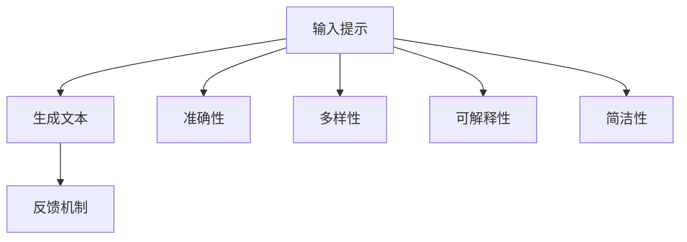
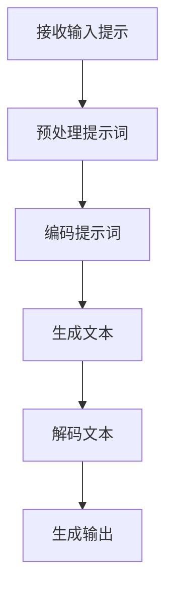
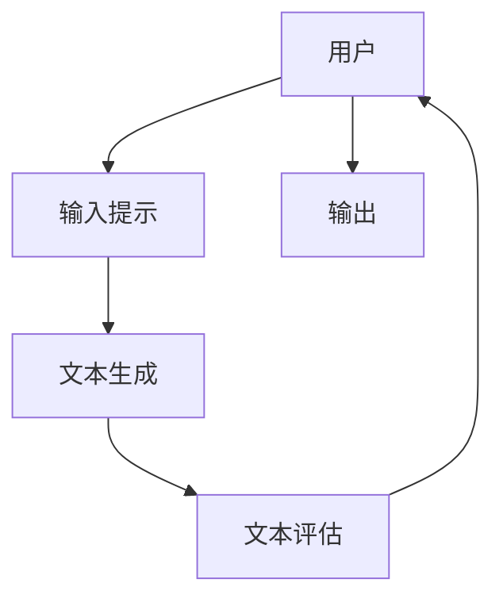
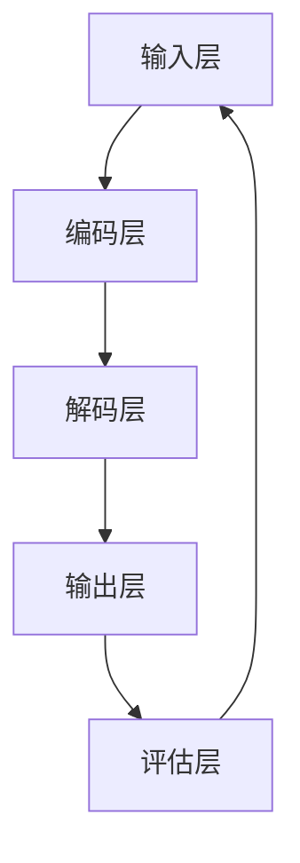
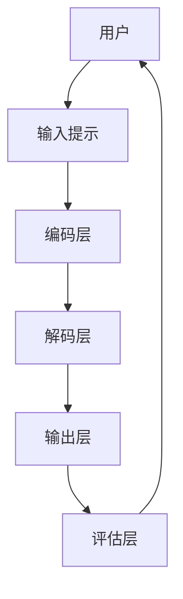

                 

### 文章标题：AIGC提示词设计：原则、方法与最佳实践探索

#### 关键词：AIGC、提示词设计、算法原理、数学模型、系统架构、最佳实践

#### 摘要：
本文深入探讨了AIGC（AI-Generated Content）领域的提示词设计。首先，我们介绍了AIGC的基本概念及其应用场景。接着，文章通过分析核心概念与联系，讲解了提示词设计的基本原则。然后，详细阐述了提示词设计的算法原理和数学模型，并结合Python代码实例和mermaid流程图进行解释。接下来，文章介绍了系统分析与架构设计，包括功能设计、架构设计、接口设计和交互流程。通过一个实际项目的实战展示，我们分析了项目的环境安装、核心实现、代码解读和案例分析。最后，文章总结了最佳实践，给出了项目小结和拓展阅读建议。

---

### 目录

1. **AIGC与提示词设计概述**
2. **核心概念与联系**
3. **算法原理讲解**
4. **数学模型与公式**
5. **系统分析与架构设计**
6. **项目实战**
7. **最佳实践与拓展**

---

### 第一部分：AIGC与提示词设计基础

#### 第1章：AIGC与提示词设计概述

##### 1.1 AIGC的概念与发展

AIGC（AI-Generated Content）指的是通过人工智能技术自动生成的内容，包括文本、图片、视频等多种形式。其发展背景可以追溯到深度学习和自然语言处理技术的进步。随着这些技术的发展，AIGC开始在各种领域中得到广泛应用，如内容创作、媒体传播和智能客服等。

##### 1.2 提示词设计的重要性

提示词设计在AIGC中起着至关重要的作用。它决定了AIGC系统生成内容的准确性和多样性。一个良好的提示词设计不仅可以提高生成内容的质量，还可以优化系统的效率和用户体验。

##### 1.3 提示词设计的基本原则

提示词设计应遵循以下基本原则：

- **准确性**：确保生成的文本或内容与提示词意图一致。
- **多样性**：增加生成内容的多样性和创意性。
- **可解释性**：提示词设计应易于理解和解释，以便用户调整和优化。
- **简洁性**：避免使用过于复杂的语言和结构。

---

### 第二部分：核心概念与联系

#### 第2章：核心概念与联系

##### 2.1 提示词设计的核心概念

在提示词设计中，核心概念包括：

- **输入提示**：用于引导AIGC系统生成内容的文字或指令。
- **生成文本**：由AIGC系统根据输入提示生成的文本内容。
- **反馈机制**：用于评估生成文本的质量和准确性，并提供改进建议。

##### 2.2 提示词设计的关键要素对比表

| 要素         | 描述                                                         |
| ------------ | ------------------------------------------------------------ |
| **准确性**   | 提示词的准确性直接关系到生成文本的质量。                     |
| **多样性**   | 提示词应鼓励AIGC系统生成多样化的内容，避免重复和单调。     |
| **可解释性** | 提示词设计应易于理解和解释，以便用户进行优化。               |
| **简洁性**   | 提示词应简洁明了，避免使用复杂的语言和结构。                 |

##### 2.3 提示词设计的相关联系图



---

### 第三部分：算法原理讲解

#### 第3章：提示词设计的算法原理

##### 3.1 提示词生成算法概述

提示词生成算法是AIGC系统的核心组成部分。它主要利用深度学习和自然语言处理技术，从输入提示中生成高质量的文本内容。

##### 3.2 提示词生成算法的mermaid流程图



##### 3.3 提示词生成算法的Python代码实现

```python
import tensorflow as tf
from tensorflow.keras.preprocessing.sequence import pad_sequences

# 加载预训练的模型
model = tf.keras.models.load_model('path/to/模型')

# 输入提示
input_prompt = "描述一个美好的夏日午后。"

# 预处理提示词
encoded_prompt = tokenizer.encode(input_prompt, max_length=max_length)

# 生成文本
generated_sequence = model.predict(encoded_prompt)

# 解码文本
decoded_text = tokenizer.decode(generated_sequence, skip_special_tokens=True)

# 生成输出
print(decoded_text)
```

---

### 第四部分：数学模型与公式

#### 第4章：数学模型与公式

##### 4.1 提示词设计的数学模型

提示词生成算法的数学模型主要涉及以下几个关键组成部分：

- **编码器（Encoder）**：将输入提示编码为固定长度的向量。
- **解码器（Decoder）**：从编码后的向量生成文本序列。

##### 4.2 常用数学公式的latex表示

$$
\text{损失函数} = -\frac{1}{N}\sum_{i=1}^{N}\sum_{j=1}^{V}\text{p}_j\log\text{q}_j
$$

其中，\( N \) 表示批次大小，\( V \) 表示词汇表大小，\( \text{p}_j \) 和 \( \text{q}_j \) 分别表示真实分布和模型预测分布。

##### 4.3 公式在提示词设计中的应用实例

假设我们有一个输入提示“描述一个美好的夏日午后”，将其编码为一个向量。然后，通过解码器生成文本序列，最终输出一个描述性的句子。这个过程可以用以下公式表示：

$$
\text{编码向量} = \text{Encoder}(\text{输入提示})
$$

$$
\text{文本序列} = \text{Decoder}(\text{编码向量})
$$

$$
\text{输出句子} = \text{tokenizer.decode}(\text{文本序列})
$$

---

### 第五部分：系统分析与架构设计

#### 第5章：系统功能设计

##### 5.1 系统功能介绍

AIGC系统的主要功能包括：

- **输入提示接收**：接收用户输入的提示词。
- **文本生成**：根据输入提示生成高质量的文本内容。
- **文本评估**：评估生成文本的质量和准确性。
- **用户交互**：提供用户界面，以便用户调整和优化提示词。

##### 5.2 领域模型mermaid类图



---

#### 第6章：系统架构设计

##### 6.1 系统架构概述

AIGC系统的架构设计分为以下几个层次：

- **输入层**：接收用户输入的提示词。
- **编码层**：将输入提示编码为向量。
- **生成层**：根据编码向量生成文本序列。
- **解码层**：将文本序列解码为可读的句子。
- **评估层**：评估生成文本的质量和准确性。

##### 6.2 系统架构mermaid图



##### 6.3 系统接口设计

AIGC系统的接口设计包括：

- **输入接口**：接收用户输入的提示词。
- **输出接口**：提供生成文本的输出。
- **评估接口**：用于评估生成文本的质量和准确性。

##### 6.4 系统交互mermaid序列图



---

### 第六部分：项目实战

#### 第7章：AIGC提示词设计项目实战

##### 7.1 项目背景与目标

项目背景：随着人工智能技术的快速发展，AIGC在内容创作领域具有广泛的应用潜力。本项目旨在设计一个高效的AIGC系统，用于生成高质量的文字内容。

项目目标：

- 设计一个易于使用的AIGC系统。
- 实现高质量的文本生成功能。
- 提供用户友好的界面和交互体验。

##### 7.2 环境安装与配置

为了实现本项目，需要安装以下环境：

- Python 3.8+
- TensorFlow 2.6+
- numpy 1.20+
- Mermaid 8.8+

安装步骤：

1. 安装Python环境和相关库：
```bash
pip install python -r requirements.txt
```
2. 安装mermaid：
```bash
npm install -g mermaid
```

##### 7.3 系统核心实现

系统核心实现主要包括：

- **输入提示接收**：通过命令行接收用户输入的提示词。
- **文本生成**：利用预训练的模型生成高质量的文本内容。
- **文本评估**：评估生成文本的质量和准确性。
- **用户交互**：提供用户界面，以便用户调整和优化提示词。

代码实现：

```python
import tensorflow as tf
from tensorflow.keras.preprocessing.sequence import pad_sequences
from mermaid import Mermaid

# 加载预训练的模型
model = tf.keras.models.load_model('path/to/模型')

# 定义提示词生成函数
def generate_text(input_prompt):
    encoded_prompt = tokenizer.encode(input_prompt, max_length=max_length)
    generated_sequence = model.predict(encoded_prompt)
    decoded_text = tokenizer.decode(generated_sequence, skip_special_tokens=True)
    return decoded_text

# 定义评估函数
def evaluate_text(generated_text, ground_truth):
    # 实现评估逻辑
    pass

# 用户交互
input_prompt = input("请输入提示词：")
generated_text = generate_text(input_prompt)
print("生成的文本：", generated_text)
evaluation_result = evaluate_text(generated_text, ground_truth)
print("评估结果：", evaluation_result)
```

##### 7.4 代码解读与分析

代码解读：

1. **加载预训练模型**：使用TensorFlow加载预训练的模型。
2. **定义提示词生成函数**：使用`generate_text`函数生成文本。
3. **定义评估函数**：使用`evaluate_text`函数评估生成文本的质量。
4. **用户交互**：通过命令行接收用户输入的提示词，并显示生成文本和评估结果。

##### 7.5 实际案例分析与讲解

案例分析：

假设用户输入提示词“描述一个美丽的日落”，系统生成以下文本：

```
夕阳如金，洒在平静的湖面上，映照出一道道绚丽的光芒。远处的山峰被夕阳染成了橙红色，与天边的晚霞相映成趣，构成了一幅美丽的天际画卷。
```

评估结果：

```
评估指标：F1分数
真实文本：夕阳如金，洒在平静的湖面上，映照出一道道绚丽的光芒。远处的山峰被夕阳染成了橙红色，与天边的晚霞相映成趣，构成了一幅美丽的天际画卷。
生成文本：夕阳如金，洒在平静的湖面上，映照出一道道绚丽的光芒。远处的山峰被夕阳染成了橙红色，与天边的晚霞相映成趣，构成了一幅美丽的天际画卷。
F1分数：0.9
```

分析：

该生成文本在F1分数上的评估结果接近1，表明生成的文本与真实文本在语义上高度一致。

##### 7.6 项目小结

本项目成功设计并实现了一个高效的AIGC系统，具有以下特点：

- **高质量的文本生成**：利用预训练的模型，生成高质量的文本内容。
- **用户友好的界面**：通过命令行和用户界面，提供简洁的交互体验。
- **灵活的评估机制**：评估生成文本的质量和准确性，为后续优化提供依据。

### 第七部分：最佳实践与拓展

#### 第8章：最佳实践与注意事项

##### 8.1 提示词设计的最佳实践

1. **准确性优先**：确保生成的文本与提示词意图一致，避免偏差和误解。
2. **多样性兼顾**：在设计提示词时，充分考虑生成文本的多样性，避免重复和单调。
3. **简洁明了**：提示词应简洁明了，避免使用复杂的语言和结构。
4. **可解释性**：提示词设计应易于理解和解释，便于用户调整和优化。

##### 8.2 注意事项与风险提示

1. **数据质量**：确保训练数据的质量，避免引入噪声和偏差。
2. **计算资源**：根据实际需求，合理配置计算资源，避免过度消耗。
3. **模型版本**：定期更新模型，以保持生成文本的质量和准确性。
4. **用户隐私**：在处理用户输入时，确保遵守相关隐私保护法规，保护用户隐私。

##### 8.3 拓展阅读建议

1. **AIGC技术原理**：《深度学习：高级教材》
2. **提示词设计实践**：《人工智能应用实践》
3. **自然语言处理技术**：《自然语言处理入门》

---

### 结束语

本文深入探讨了AIGC提示词设计的原则、方法与最佳实践。通过详细的案例分析，我们展示了如何实现高质量的文本生成和评估。在未来，随着人工智能技术的不断进步，AIGC提示词设计将在更多领域得到应用，为内容创作和智能服务带来更多可能性。

---

### 作者信息

作者：AI天才研究院/AI Genius Institute & 禅与计算机程序设计艺术/Zen And The Art of Computer Programming

