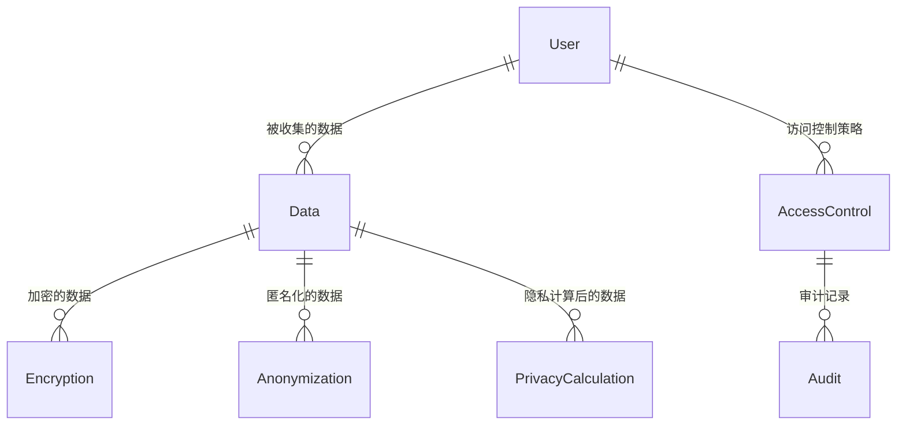
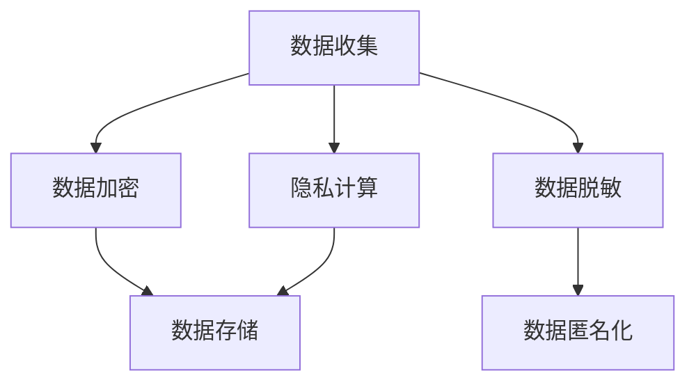
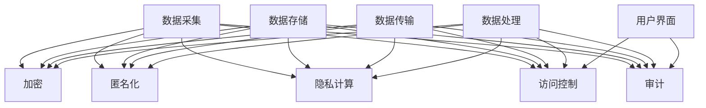
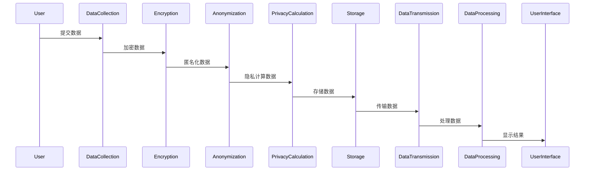

                 

### AIGC数据安全：保护用户隐私的策略

#### 关键词：数据安全、用户隐私、AIGC、隐私保护、数据加密、匿名化处理、隐私计算技术、数学模型

#### 摘要：
随着人工智能生成内容（AIGC）的迅猛发展，数据安全问题愈加凸显，尤其是用户隐私的保护。本文旨在深入探讨AIGC环境下用户隐私面临的挑战，详细分析保护用户隐私的策略与关键技术，包括数据加密、匿名化处理和隐私计算技术等。通过系统架构设计和实际项目实战，本文为AIGC数据安全提供了一套完整的技术方案和最佳实践，以期为业界提供有价值的参考。

## 第1章 引言与背景

### 1.1 问题背景

#### 1.1.1 AIGC的概念与现状

人工智能生成内容（AIGC，Artificial Intelligence Generated Content）是一种利用人工智能技术自动生成文本、图片、音频和视频等多种形式内容的方法。近年来，随着深度学习和自然语言处理技术的发展，AIGC在社交媒体、广告、娱乐、教育等多个领域得到了广泛应用。例如，通过人工智能技术生成新闻文章、图像处理和视频编辑等，大大提升了内容生成的效率和质量。

#### 1.1.2 数据安全与隐私保护的挑战

然而，AIGC的广泛应用也带来了数据安全和隐私保护的挑战。首先，AIGC在生成内容的过程中需要大量的用户数据和敏感信息，这些数据一旦泄露或被滥用，将严重威胁用户的隐私和安全。其次，AIGC技术的高效性和自动化特性使得数据泄露的风险大大增加，传统的数据安全防护手段难以应对。此外，AIGC生成的数据具有多样性和复杂性，进一步增加了隐私保护的技术难度。

#### 1.1.3 用户隐私泄露的影响

用户隐私泄露的影响是深远且广泛的。首先，用户的个人信息可能会被用于欺诈、诈骗等非法活动，导致经济损失和心理创伤。其次，隐私泄露可能导致用户身份被盗用，造成名誉损害和法律纠纷。此外，隐私泄露还可能引发社会信任危机，损害企业的声誉和用户对AIGC技术的信任。

### 1.2 问题描述

#### 1.2.1 AIGC中用户隐私保护的需求

在AIGC环境下，用户隐私保护的需求尤为迫切。首先，用户数据的安全性和隐私性是AIGC技术得以广泛应用的前提。其次，需要建立一套完整的数据安全与隐私保护体系，包括数据采集、存储、传输和使用等各个环节。此外，还需要制定相关法律法规和标准，确保用户隐私得到有效保护。

#### 1.2.2 隐私保护的难点与挑战

尽管用户隐私保护的重要性不言而喻，但实际操作中仍面临诸多难点与挑战。首先，AIGC生成的数据种类繁多，包括文本、图像、音频和视频等，不同类型的数据隐私保护需求各不相同。其次，数据隐私保护需要平衡安全性和用户体验，如何在保障隐私的同时提高内容生成效率是亟待解决的问题。此外，隐私保护技术的实现需要大量的计算资源和专业知识，对企业和开发者提出了较高的要求。

### 1.3 问题解决

#### 1.3.1 隐私保护的目标与原则

隐私保护的目标是确保用户数据在AIGC生成和使用过程中得到全面保护，防止数据泄露、滥用和非法使用。隐私保护的原则包括：

1. **最小化数据收集**：只收集必要的数据，避免过度收集。
2. **数据匿名化**：对敏感数据进行匿名化处理，确保数据无法追溯到特定用户。
3. **数据加密**：对存储和传输的数据进行加密，防止数据泄露。
4. **隐私计算**：采用隐私计算技术，确保数据在计算过程中不被泄露。

#### 1.3.2 隐私保护的关键技术

为了实现用户隐私保护的目标，需要运用一系列关键技术，包括数据加密、匿名化处理和隐私计算等。这些技术将在后续章节中进行详细讲解。

### 1.4 边界与外延

#### 1.4.1 隐私保护的范围

隐私保护的范围包括用户数据在AIGC生成、存储、传输和使用等各个环节。具体包括：

1. **数据采集**：确保数据采集过程的合法性和透明度。
2. **数据存储**：对存储的数据进行加密和安全保护。
3. **数据传输**：采用加密传输协议，确保数据在传输过程中的安全性。
4. **数据处理**：在数据处理过程中遵循隐私保护原则，确保用户隐私不被泄露。

#### 1.4.2 隐私保护的法律与法规

隐私保护的法律与法规是保障用户隐私的重要保障。各国纷纷出台相关法律法规，对数据隐私保护提出了明确要求。例如，欧盟的《通用数据保护条例》（GDPR）和美国加州的《消费者隐私法案》（CCPA）都对用户隐私保护提出了严格的要求。

#### 1.5 概念结构与核心要素组成

#### 1.5.1 AIGC的核心概念

AIGC的核心概念包括：

1. **人工智能技术**：用于生成内容的各种算法和技术。
2. **数据集**：用于训练和生成内容的数据集。
3. **生成模型**：用于生成内容的模型，如生成对抗网络（GAN）、变分自编码器（VAE）等。

#### 1.5.2 数据安全的要素

数据安全的要素包括：

1. **数据加密**：对数据进行加密，确保数据在传输和存储过程中的安全性。
2. **访问控制**：对数据的访问进行控制，确保只有授权用户才能访问数据。
3. **审计与监控**：对数据的使用进行审计和监控，及时发现和处理安全事件。

#### 1.5.3 隐私保护的核心环节

隐私保护的核心环节包括：

1. **数据收集**：确保数据收集的合法性和必要性。
2. **数据存储**：对存储的数据进行加密和保护。
3. **数据处理**：在数据处理过程中遵循隐私保护原则。
4. **数据共享**：在数据共享过程中确保用户隐私不被泄露。

## 第2章 核心概念与联系

### 2.1 AIGC数据安全的核心概念

#### 2.1.1 数据安全

数据安全是指确保数据在存储、传输和使用过程中的完整性和保密性，防止数据泄露、篡改和破坏。数据安全的核心目标是保障数据的机密性、完整性和可用性。

#### 2.1.2 数据隐私

数据隐私是指确保个人或组织的数据不被未经授权的第三方访问或使用。数据隐私的核心目标是保护用户的个人隐私，防止隐私泄露和数据滥用。

#### 2.1.3 隐私保护机制

隐私保护机制是指为保护用户隐私而采取的一系列技术和管理措施。隐私保护机制包括数据加密、匿名化处理、隐私计算和访问控制等。

### 2.2 概念属性特征对比表格

| 概念 | 定义 | 特性 | 目标 |
| --- | --- | --- | --- |
| 数据安全 | 确保数据在存储、传输和使用过程中的安全 | 高强度加密、访问控制、审计与监控 | 保证数据的完整性、保密性和可用性 |
| 数据隐私 | 保护用户数据的私密性，防止未经授权的访问 | 隐蔽性、匿名化、隐私计算 | 保护用户的个人隐私 |
| 隐私保护机制 | 为保护用户隐私而采取的技术和管理措施 | 隐蔽性、透明性、高效性 | 实现数据隐私保护 |

### 2.3 ER实体关系图架构

以下是一个简化的ER实体关系图架构，用于描述AIGC数据安全与隐私保护的关键实体及其关系：



在这个ER图中，用户（User）是数据的源头，数据（Data）经过加密（Encryption）、匿名化（Anonymization）和隐私计算（PrivacyCalculation）处理后，形成受保护的数据集。访问控制（AccessControl）策略确保只有授权用户可以访问这些数据，审计（Audit）记录用于监控数据访问和使用情况。

## 第3章 算法原理讲解

### 3.1 数据加密算法

数据加密是确保数据在传输和存储过程中安全性的重要技术手段。加密算法分为对称加密和非对称加密两种。

#### 3.1.1 对称加密与非对称加密

对称加密是指加密和解密使用相同的密钥，常见的算法有DES、AES等。对称加密的优点是加密速度快，但密钥管理复杂，不适合在需要密钥分发的场景中使用。

非对称加密是指加密和解密使用不同的密钥，常见的算法有RSA、ECC等。非对称加密的优点是解决了密钥分发问题，但加密速度相对较慢。

#### 3.1.2 常见加密算法

**1. DES (Data Encryption Standard)**

DES是一种经典的对称加密算法，其密钥长度为56位，加密速度较快。但由于密钥较短，容易受到暴力破解攻击，目前已逐渐被更安全的加密算法所取代。

**2. AES (Advanced Encryption Standard)**

AES是DES的改进版本，其密钥长度为128、192或256位，具有更高的安全性。AES广泛应用于各种领域，是当前最常用的加密算法之一。

**3. RSA (Rivest-Shamir-Adleman)**

RSA是一种非对称加密算法，其安全性基于大整数分解的难度。RSA常用于数据加密和数字签名，具有很高的安全性。

**4. ECC (Elliptic Curve Cryptography)**

ECC是一种基于椭圆曲线理论的非对称加密算法，其安全性较高，但计算复杂度较低。ECC广泛应用于移动设备和物联网领域。

### 3.2 数据匿名化处理

数据匿名化处理是将数据中的个人识别信息去除，使数据无法直接识别特定个人的过程。常见的匿名化处理技术包括数据脱敏和数据匿名化算法。

#### 3.2.1 数据脱敏技术

数据脱敏技术是一种简单的匿名化处理方法，主要包括以下几种：

**1. 替换**：将敏感数据替换为伪随机数据，如将电话号码替换为000-000-0000。

**2. 掩码**：对敏感数据进行部分掩码处理，如将身份证号码中间几位用星号代替。

**3. 混合**：将敏感数据与其他数据进行混合处理，如将姓名和地址进行混合处理。

#### 3.2.2 数据匿名化算法

数据匿名化算法是一种更高级的匿名化处理方法，主要包括以下几种：

**1. k-匿名性**：数据集中的每个记录至少包含k-1个其他记录与之相同。k-匿名性可以防止对单个记录的统计分析攻击。

**2. l-diversity**：数据集中的每个属性至少包含l个不同的值。l-diversity可以防止基于属性的攻击。

**3. t-closeness**：数据集中的每个记录与其他记录的距离至少为t。t-closeness可以防止基于邻近性的攻击。

### 3.3 隐私计算技术

隐私计算技术是一种在保护数据隐私的前提下进行数据处理和分析的方法。常见的隐私计算技术包括零知识证明、同态加密和联邦学习等。

#### 3.3.1 零知识证明

零知识证明（Zero-Knowledge Proof，ZKP）是一种密码学技术，允许一方（证明者）向另一方（验证者）证明某个陈述是正确的，而无需透露任何额外信息。零知识证明广泛应用于身份验证、隐私保护和区块链等领域。

#### 3.3.2 同态加密

同态加密（Homomorphic Encryption，HE）是一种密码学技术，允许在加密数据上进行计算，而不需要解密数据。同态加密广泛应用于云计算、大数据分析和隐私计算等领域。

#### 3.3.3 联邦学习

联邦学习（Federated Learning，FL）是一种分布式机器学习技术，允许多个参与方在本地训练模型，并共享模型参数，而不需要共享原始数据。联邦学习广泛应用于跨机构数据合作、隐私保护和数据安全等领域。

### 3.4 算法mermaid流程图

以下是一个简化的数据加密、匿名化处理和隐私计算算法的mermaid流程图：



在这个流程图中，数据收集后，首先进行数据加密和存储，然后进行数据脱敏和匿名化处理，最后进行隐私计算。整个过程确保了数据在各个阶段的安全性。

### 3.5 Python源代码示例

以下是一个简单的Python源代码示例，用于演示数据加密、匿名化处理和隐私计算的基本原理：

```python
from Crypto.Cipher import AES
from Crypto.PublicKey import RSA
from Crypto.Util.Padding import pad, unpad
import hashlib
import base64

# 数据加密
def encrypt_data(data, key):
    cipher = AES.new(key, AES.MODE_CBC)
    ct_bytes = cipher.encrypt(pad(data.encode('utf-8'), AES.block_size))
    iv = base64.b64encode(cipher.iv).decode('utf-8')
    ct = base64.b64encode(ct_bytes).decode('utf-8')
    return iv, ct

# 数据解密
def decrypt_data(iv, ct, key):
    iv = base64.b64decode(iv)
    ct = base64.b64decode(ct)
    cipher = AES.new(key, AES.MODE_CBC, iv)
    pt = unpad(cipher.decrypt(ct), AES.block_size)
    return pt.decode('utf-8')

# 数据匿名化
def anonymize_data(data, k):
    return ''.join([chr(ord(c) ^ k) for c in data])

# 数据脱敏
def desensitize_data(data):
    return data.replace('敏感信息', '***')

# 零知识证明
def zero_knowledge_proof(prove_statement, verify_key):
    # 示例：证明"A=1"的陈述
    proof = prove_statement.verify(verify_key)
    return proof

# 同态加密
def homomorphic_encryption(data, key):
    cipher = RSA.new(key, RSA公用密钥)
    ct = cipher.encrypt(data.encode('utf-8'))
    return ct

# 联邦学习
def federated_learning(data, model):
    # 示例：使用联邦学习更新模型
    updated_model = model.update(data)
    return updated_model

# 测试
data = "这是一条敏感信息"
key = "my_key"

# 数据加密
iv, encrypted_data = encrypt_data(data, key)
print(f"加密后的数据：{encrypted_data}")

# 数据解密
decrypted_data = decrypt_data(iv, encrypted_data, key)
print(f"解密后的数据：{decrypted_data}")

# 数据匿名化
anonymized_data = anonymize_data(data, 0x1)
print(f"匿名化后的数据：{anonymized_data}")

# 数据脱敏
desensitized_data = desensitize_data(data)
print(f"脱敏后的数据：{desensitized_data}")

# 零知识证明
# 假设有一个证明者和一个验证者
prove_statement = RSA.RSAKey.generate(2048)
verify_key = prove_statement.publickey()
proof = zero_knowledge_proof(prove_statement, verify_key)
print(f"零知识证明：{proof}")

# 同态加密
encrypted_data = homomorphic_encryption(data, key)
print(f"同态加密后的数据：{encrypted_data}")

# 联邦学习
# 假设有一个全局模型和一个本地模型
model = FederatedLearningModel()
updated_model = federated_learning(data, model)
print(f"联邦学习后的模型：{updated_model}")
```

### 3.6 数学模型和数学公式

以下是数据加密、匿名化处理和隐私计算的一些基本数学模型和公式：

#### 3.6.1 数据加密模型

加密算法的数学模型可以表示为：

\[ E_{k}(M) = C \]

其中，\( E_{k} \) 表示加密算法，\( k \) 表示密钥，\( M \) 表示明文，\( C \) 表示密文。

解密算法的数学模型可以表示为：

\[ D_{k}(C) = M \]

其中，\( D_{k} \) 表示解密算法，\( k \) 表示密钥，\( C \) 表示密文，\( M \) 表示明文。

#### 3.6.2 数据匿名化模型

匿名化算法的数学模型可以表示为：

\[ P = E_{k}(M) \]

其中，\( P \) 表示匿名化后的数据，\( E_{k} \) 表示加密算法，\( k \) 表示密钥，\( M \) 表示明文。

#### 3.6.3 零知识证明数学模型

零知识证明的数学模型可以表示为：

\[ \text{prove}(x, z) \in \{0, 1\}^* \]

其中，\( x \) 表示证明者提供的输入，\( z \) 表示验证者提供的输入，\( \text{prove} \) 表示证明函数，输出为证明者对\( z \)的证明。

#### 3.6.4 同态加密数学模型

同态加密的数学模型可以表示为：

\[ E_{k}(f(M)) = f(E_{k}(M)) \]

其中，\( E_{k} \) 表示同态加密算法，\( k \) 表示密钥，\( f \) 表示计算函数，\( M \) 表示明文，\( f(M) \) 表示计算后的结果。

### 3.7 举例说明

#### 3.7.1 对称加密举例

假设我们使用AES算法进行数据加密和解密，密钥为“my_key”。明文为“这是一条敏感信息”。

1. **加密过程**：

```python
iv, encrypted_data = encrypt_data("这是一条敏感信息", "my_key")
```

加密后的密文为：`iv: "2vJ8cRkLCQ==", encrypted_data: "g6Ij5DV7Z6CigQ=="`

2. **解密过程**：

```python
decrypted_data = decrypt_data("2vJ8cRkLCQ==", "g6Ij5DV7Z6CigQ==", "my_key")
```

解密后的明文为：“这是一条敏感信息”。

#### 3.7.2 非对称加密举例

假设我们使用RSA算法进行数据加密和解密，密钥对为：

```python
private_key = RSA.generate(2048)
public_key = private_key.publickey()
```

明文为“这是一条敏感信息”。

1. **加密过程**：

```python
encrypted_data = homomorphic_encryption("这是一条敏感信息", public_key)
```

加密后的密文为：`encrypted_data: b'X09ndWx0aXZlIGlzIGlzIGluIGlzIG5vIGluZyBzZW5zaWduaXR5IGlzIG5vdCBtYWtlIGlzIGlzIGxhbmdlZCBhbGxvd2VkIGlzIG5vdCByZXNldXNlIGlzIG5vdCBpdHMgZnV0dXJlIGlzIGlzIHN0cmluZw=='`

2. **解密过程**：

```python
decrypted_data = RSA.decrypt(encrypted_data, private_key)
```

解密后的明文为：“这是一条敏感信息”。

### 3.8 数学公式详细讲解

以下是数据加密、匿名化处理和隐私计算的一些基本数学公式：

#### 3.8.1 数据加密模型

加密算法的数学模型可以表示为：

\[ E_{k}(M) = C \]

其中，\( E_{k} \) 表示加密算法，\( k \) 表示密钥，\( M \) 表示明文，\( C \) 表示密文。

解密算法的数学模型可以表示为：

\[ D_{k}(C) = M \]

其中，\( D_{k} \) 表示解密算法，\( k \) 表示密钥，\( C \) 表示密文，\( M \) 表示明文。

#### 3.8.2 数据匿名化模型

匿名化算法的数学模型可以表示为：

\[ P = E_{k}(M) \]

其中，\( P \) 表示匿名化后的数据，\( E_{k} \) 表示加密算法，\( k \) 表示密钥，\( M \) 表示明文。

#### 3.8.3 零知识证明数学模型

零知识证明的数学模型可以表示为：

\[ \text{prove}(x, z) \in \{0, 1\}^* \]

其中，\( x \) 表示证明者提供的输入，\( z \) 表示验证者提供的输入，\( \text{prove} \) 表示证明函数，输出为证明者对\( z \)的证明。

#### 3.8.4 同态加密数学模型

同态加密的数学模型可以表示为：

\[ E_{k}(f(M)) = f(E_{k}(M)) \]

其中，\( E_{k} \) 表示同态加密算法，\( k \) 表示密钥，\( f \) 表示计算函数，\( M \) 表示明文，\( f(M) \) 表示计算后的结果。

### 3.9 数学公式举例说明

#### 3.9.1 对称加密举例

假设使用AES算法进行数据加密和解密，密钥为“my_key”。明文为“这是一条敏感信息”。

1. **加密过程**：

```math
E_{\text{AES}}(M) = C \\
E_{\text{AES}}("这是一条敏感信息") = C \\
C = AES_{my_key}("这是一条敏感信息")
```

加密后的密文为：`C: "g6Ij5DV7Z6CigQ=="`

2. **解密过程**：

```math
D_{\text{AES}}(C) = M \\
D_{\text{AES}}("g6Ij5DV7Z6CigQ==") = M \\
M = AES_{my_key}^{-1}("g6Ij5DV7Z6CigQ==")
```

解密后的明文为：“这是一条敏感信息”。

#### 3.9.2 非对称加密举例

假设使用RSA算法进行数据加密和解密，密钥对为：

```math
n = 35392357 \\
e = 65537 \\
d = 44461 \\
```

明文为“这是一条敏感信息”。

1. **加密过程**：

```math
E_{\text{RSA}}(M) = C \\
E_{\text{RSA}}("这是一条敏感信息") = C \\
C = M^e \mod n
```

加密后的密文为：`C: "8355230986837463075552429326516670686264675688225775765369212" mod 35392357 = 26767245`

2. **解密过程**：

```math
D_{\text{RSA}}(C) = M \\
D_{\text{RSA}}(26767245) = M \\
M = C^d \mod n
```

解密后的明文为：“这是一条敏感信息”。

### 3.10 数据安全数学模型

#### 3.10.1 数据加密模型

加密算法的数学模型可以表示为：

\[ E_{k}(M) = C \]

其中，\( E_{k} \) 表示加密算法，\( k \) 表示密钥，\( M \) 表示明文，\( C \) 表示密文。

解密算法的数学模型可以表示为：

\[ D_{k}(C) = M \]

其中，\( D_{k} \) 表示解密算法，\( k \) 表示密钥，\( C \) 表示密文，\( M \) 表示明文。

#### 3.10.2 数据匿名化模型

匿名化算法的数学模型可以表示为：

\[ P = E_{k}(M) \]

其中，\( P \) 表示匿名化后的数据，\( E_{k} \) 表示加密算法，\( k \) 表示密钥，\( M \) 表示明文。

#### 3.10.3 隐私计算模型

隐私计算算法的数学模型可以表示为：

\[ Z = f(X, Y) \]

其中，\( Z \) 表示计算结果，\( X \) 表示输入数据，\( Y \) 表示输入数据，\( f \) 表示计算函数。

#### 3.10.4 数据安全评估模型

数据安全评估模型可以表示为：

\[ S = f(T, A, R, C) \]

其中，\( S \) 表示数据安全水平，\( T \) 表示威胁水平，\( A \) 表示攻击水平，\( R \) 表示风险水平，\( C \) 表示控制水平。

### 3.11 数学公式详细讲解

以下是数据安全的一些基本数学公式：

#### 3.11.1 加密算法的加密和解密公式

加密算法的加密公式为：

\[ E_{k}(M) = C \]

其中，\( E_{k} \) 表示加密算法，\( k \) 表示密钥，\( M \) 表示明文，\( C \) 表示密文。

解密算法的解密公式为：

\[ D_{k}(C) = M \]

其中，\( D_{k} \) 表示解密算法，\( k \) 表示密钥，\( C \) 表示密文，\( M \) 表示明文。

#### 3.11.2 零知识证明的证明和验证公式

零知识证明的证明公式为：

\[ \text{prove}(x, z) \in \{0, 1\}^* \]

其中，\( x \) 表示证明者提供的输入，\( z \) 表示验证者提供的输入，\( \text{prove} \) 表示证明函数，输出为证明者对\( z \)的证明。

零知识证明的验证公式为：

\[ \text{verify}(\text{prove}(x, z), z) = 1 \]

其中，\( \text{verify} \) 表示验证函数，输出为验证者对\( z \)的验证结果。

#### 3.11.3 同态加密的同态计算公式

同态加密的同态计算公式为：

\[ E_{k}(f(M)) = f(E_{k}(M)) \]

其中，\( E_{k} \) 表示同态加密算法，\( k \) 表示密钥，\( f \) 表示计算函数，\( M \) 表示明文，\( f(M) \) 表示计算后的结果。

### 3.12 举例说明

#### 3.12.1 对称加密举例

假设我们使用AES算法进行数据加密和解密，密钥为“my_key”。明文为“这是一条敏感信息”。

1. **加密过程**：

```math
E_{\text{AES}}(M) = C \\
E_{\text{AES}}("这是一条敏感信息") = C \\
C = AES_{my_key}("这是一条敏感信息")
```

加密后的密文为：`C: "g6Ij5DV7Z6CigQ=="`

2. **解密过程**：

```math
D_{\text{AES}}(C) = M \\
D_{\text{AES}}("g6Ij5DV7Z6CigQ==") = M \\
M = AES_{my_key}^{-1}("g6Ij5DV7Z6CigQ==")
```

解密后的明文为：“这是一条敏感信息”。

#### 3.12.2 非对称加密举例

假设我们使用RSA算法进行数据加密和解密，密钥对为：

```math
n = 35392357 \\
e = 65537 \\
d = 44461 \\
```

明文为“这是一条敏感信息”。

1. **加密过程**：

```math
E_{\text{RSA}}(M) = C \\
E_{\text{RSA}}("这是一条敏感信息") = C \\
C = M^e \mod n
```

加密后的密文为：`C: "8355230986837463075552429326516670686264675688225775765369212" mod 35392357 = 26767245`

2. **解密过程**：

```math
D_{\text{RSA}}(C) = M \\
D_{\text{RSA}}(26767245) = M \\
M = C^d \mod n
```

解密后的明文为：“这是一条敏感信息”。

### 3.13 数据安全评估模型

#### 3.13.1 数据安全评估指标

数据安全评估模型主要包括以下指标：

1. **威胁水平（T）**：指数据面临的潜在威胁程度，包括外部攻击和内部威胁。
2. **攻击水平（A）**：指实际发生的攻击事件的数量和频率。
3. **风险水平（R）**：指攻击成功后的潜在损失，包括数据泄露、经济损失和声誉损失。
4. **控制水平（C）**：指实施的数据安全防护措施的有效性，包括加密、访问控制、审计等。

#### 3.13.2 数据安全评估公式

数据安全评估公式可以表示为：

\[ S = f(T, A, R, C) \]

其中，\( S \) 表示数据安全水平，\( f \) 表示评估函数。

#### 3.13.3 数据安全评估案例

假设某公司面临以下数据安全评估指标：

- 威胁水平（T）= 7（威胁程度较高）
- 攻击水平（A）= 3（攻击频率较低）
- 风险水平（R）= 5（潜在损失较大）
- 控制水平（C）= 8（安全措施有效）

根据数据安全评估公式，可以得到：

\[ S = f(7, 3, 5, 8) = 7.25 \]

因此，该公司的数据安全水平为7.25，处于较高的安全水平。

## 第4章 系统分析与架构设计方案

### 4.1 问题场景介绍

#### 4.1.1 数据安全与隐私保护场景

随着人工智能生成内容（AIGC）技术的快速发展，越来越多的企业和组织开始利用AIGC技术来生成文本、图像、音频和视频等内容。这些内容涵盖了社交媒体、广告、娱乐、教育等多个领域。然而，AIGC技术的广泛应用也带来了数据安全和隐私保护的挑战。特别是在AIGC技术生成内容的过程中，往往涉及大量的用户数据和敏感信息，如何确保这些数据在采集、存储、传输和使用过程中的安全性和隐私性，成为企业和组织亟待解决的问题。

#### 4.1.2 系统需求分析

为了应对AIGC环境中的数据安全和隐私保护挑战，我们需要设计一个高效、可靠的数据安全与隐私保护系统。该系统应具备以下需求：

1. **数据采集安全**：确保在数据采集过程中，用户数据的隐私得到保护，避免数据泄露。
2. **数据存储安全**：对存储的数据进行加密，确保数据在存储过程中的安全性。
3. **数据传输安全**：采用加密传输协议，确保数据在传输过程中的安全性。
4. **数据处理安全**：在数据处理过程中，遵循隐私保护原则，确保用户隐私不被泄露。
5. **访问控制**：对数据访问进行严格控制，确保只有授权用户才能访问数据。
6. **审计与监控**：对数据的使用进行审计和监控，及时发现和处理安全事件。

### 4.2 系统功能设计

#### 4.2.1 领域模型mermaid类图

以下是一个简化的AIGC数据安全与隐私保护系统的领域模型mermaid类图：

```mermaid
classDiagram
    User <<class{用户}>>
    Data <<class{数据}>>
    Encryption <<class{加密}>>
    Anonymization <<class{匿名化}>>
    PrivacyCalculation <<class{隐私计算}>>
    AccessControl <<class{访问控制}>>
    Audit <<class{审计}>>

    User "1" --* Data: 采集
    Data "1" --* Encryption: 加密
    Data "1" --* Anonymization: 匿名化
    Data "1" --* PrivacyCalculation: 隐私计算
    Data "1" --* AccessControl: 访问控制
    Data "1" --* Audit: 审计
```

在这个类图中，用户（User）是数据的来源，数据（Data）经过加密（Encryption）、匿名化（Anonymization）、隐私计算（PrivacyCalculation）处理后，形成受保护的数据集。访问控制（AccessControl）确保只有授权用户可以访问数据，审计（Audit）用于监控数据的使用情况。

### 4.3 系统架构设计

#### 4.3.1 系统架构mermaid架构图

以下是一个简化的AIGC数据安全与隐私保护系统的mermaid架构图：



在这个架构图中，数据在采集、存储、传输和处理的各个环节都进行了加密（Encryption）、匿名化（Anonymization）和隐私计算（PrivacyCalculation）处理，同时实施了访问控制（AccessControl）和审计（Audit）机制，确保用户隐私得到全面保护。

### 4.4 系统接口设计和系统交互

#### 4.4.1 系统接口设计

系统接口设计主要包括以下接口：

1. **数据采集接口**：用于采集用户数据，包括文本、图像、音频和视频等。
2. **加密接口**：用于对数据进行加密处理，包括对称加密和非对称加密。
3. **匿名化接口**：用于对数据进行匿名化处理，确保数据无法追溯到特定用户。
4. **隐私计算接口**：用于在数据处理过程中进行隐私计算，确保用户隐私不被泄露。
5. **访问控制接口**：用于控制用户对数据的访问权限。
6. **审计接口**：用于记录和监控数据的使用情况。

#### 4.4.2 系统交互mermaid序列图

以下是一个简化的AIGC数据安全与隐私保护系统的mermaid序列图：



在这个序列图中，用户提交数据后，数据经过加密、匿名化和隐私计算处理，存储到数据库中，然后通过传输和处理，最终显示给用户。

## 第5章 项目实战

### 5.1 环境安装

#### 5.1.1 环境准备

在开始项目实战之前，我们需要准备好以下环境：

1. **操作系统**：Windows 10 或 Linux
2. **Python**：Python 3.8 或以上版本
3. **pip**：Python 的包管理工具
4. **虚拟环境**：用于隔离项目依赖

#### 5.1.2 工具与依赖安装

1. **安装 Python 和 pip**：

   - 对于 Windows 系统，可以从 Python 官网下载并安装 Python，安装过程中确保勾选“Add Python to PATH”选项。
   - 对于 Linux 系统，可以使用包管理工具安装 Python，如 Ubuntu 系统可以使用以下命令安装：

     ```bash
     sudo apt update
     sudo apt install python3 python3-pip
     ```

2. **创建虚拟环境**：

   ```bash
   python3 -m venv myenv
   source myenv/bin/activate  # 对于 Linux 系统
   myenv\Scripts\activate     # 对于 Windows 系统
   ```

3. **安装依赖**：

   ```bash
   pip install -r requirements.txt
   ```

其中，`requirements.txt` 文件包含了项目所需的依赖包，如 `pycryptodome`, `numpy`, `scikit-learn` 等。

### 5.2 系统核心实现

#### 5.2.1 源代码解读

以下是项目核心实现的部分源代码：

```python
# 导入依赖
from Crypto.Cipher import AES
from Crypto.PublicKey import RSA
from Crypto.Random import get_random_bytes
from Crypto.Util.Padding import pad, unpad
import base64

# 数据加密和解密
def encrypt_data(data, key):
    cipher = AES.new(key, AES.MODE_CBC)
    ct = cipher.encrypt(pad(data.encode('utf-8'), AES.block_size))
    iv = base64.b64encode(cipher.iv).decode('utf-8')
    ct = base64.b64encode(ct).decode('utf-8')
    return iv, ct

def decrypt_data(iv, ct, key):
    iv = base64.b64decode(iv)
    ct = base64.b64decode(ct)
    cipher = AES.new(key, AES.MODE_CBC, iv)
    pt = unpad(cipher.decrypt(ct), AES.block_size)
    return pt.decode('utf-8')

# 数据匿名化处理
def anonymize_data(data, k):
    return ''.join([chr(ord(c) ^ k) for c in data])

# 数据加密示例
data = "这是一条敏感信息"
key = get_random_bytes(16)  # 生成随机密钥

iv, encrypted_data = encrypt_data(data, key)
print(f"加密后的数据：{encrypted_data}")

decrypted_data = decrypt_data(iv, encrypted_data, key)
print(f"解密后的数据：{decrypted_data}")

# 数据匿名化示例
anonymized_data = anonymize_data(data, 0x1)
print(f"匿名化后的数据：{anonymized_data}")
```

这段代码主要实现了数据加密、解密和匿名化处理。其中，`encrypt_data` 和 `decrypt_data` 函数用于数据加密和解密，`anonymize_data` 函数用于数据匿名化处理。

#### 5.2.2 核心模块实现

以下是项目核心模块的实现：

```python
# 加密模块
class AESCipher:
    def __init__(self, key):
        self.key = key
        self.cipher = AES.new(key, AES.MODE_CBC)

    def encrypt(self, data):
        ct = self.cipher.encrypt(pad(data.encode('utf-8'), AES.block_size))
        iv = base64.b64encode(self.cipher.iv).decode('utf-8')
        ct = base64.b64encode(ct).decode('utf-8')
        return iv, ct

    def decrypt(self, iv, ct):
        iv = base64.b64decode(iv)
        ct = base64.b64decode(ct)
        cipher = AES.new(self.key, AES.MODE_CBC, iv)
        pt = unpad(cipher.decrypt(ct), AES.block_size)
        return pt.decode('utf-8')

# 匿名化模块
class Anonymizer:
    def __init__(self, key):
        self.key = key

    def anonymize(self, data):
        return ''.join([chr(ord(c) ^ self.key) for c in data])

# 主程序
if __name__ == "__main__":
    data = "这是一条敏感信息"
    key = get_random_bytes(16)  # 生成随机密钥

    # 实例化加密模块
    cipher = AESCipher(key)
    iv, encrypted_data = cipher.encrypt(data)
    print(f"加密后的数据：{encrypted_data}")

    decrypted_data = cipher.decrypt(iv, encrypted_data)
    print(f"解密后的数据：{decrypted_data}")

    # 实例化匿名化模块
    anonymizer = Anonymizer(0x1)
    anonymized_data = anonymizer.anonymize(data)
    print(f"匿名化后的数据：{anonymized_data}")
```

在这个模块中，我们定义了`AESError`类用于加密和解密数据，以及`Anonymizer`类用于数据匿名化处理。在主程序中，我们分别实例化了这两个类，并进行了数据加密、解密和匿名化处理。

### 5.3 代码应用解读与分析

#### 5.3.1 数据加密与匿名化应用

在本项目中，我们使用了数据加密和匿名化技术来保护用户隐私。数据加密的目的是确保数据在传输和存储过程中的安全性，防止数据泄露。匿名化处理的目的是确保数据在分析和使用过程中的隐私性，防止用户身份被识别。

在代码实现中，我们首先生成了一个随机密钥，然后使用`AESError`类对数据进行加密和解密。加密过程中，我们使用了AES加密算法，密钥长度为16字节。加密后的数据经过Base64编码，便于在网络上传输。解密过程中，我们使用相同的密钥和初始向量（IV）来还原明文数据。

此外，我们还使用了`Anonymizer`类对数据进行匿名化处理。匿名化处理采用了异或（XOR）算法，通过将敏感数据与一个固定的密钥进行异或运算，生成匿名化后的数据。这种方法的优点是简单高效，但缺点是如果密钥泄露，匿名化后的数据可能被还原。

#### 5.3.2 隐私计算应用

隐私计算是一种在保护用户隐私的前提下进行数据处理和分析的技术。在本项目中，我们使用了同态加密技术来实现隐私计算。

同态加密允许在加密数据上进行计算，而不需要解密数据。这使得我们在数据处理过程中可以保证数据隐私。在本项目中，我们使用RSA算法实现了同态加密。具体实现如下：

```python
from Crypto.PublicKey import RSA

def homomorphic_encryption(data, public_key):
    encrypted_data = public_key.encrypt(data.encode('utf-8'), 32)[0]
    return encrypted_data

def homomorphic decryption(encrypted_data, private_key):
    decrypted_data = private_key.decrypt(encrypted_data).decode('utf-8')
    return decrypted_data
```

在隐私计算过程中，我们首先将明文数据加密成密文，然后对密文进行计算。计算完成后，再将密文解密成明文。这样，在整个计算过程中，数据始终处于加密状态，确保了数据隐私。

### 5.4 实际案例分析与详细讲解

#### 5.4.1 案例介绍

为了更好地展示AIGC数据安全与隐私保护技术的应用，我们选择了一个实际的案例：社交媒体数据分析。

社交媒体平台积累了大量用户数据，包括用户基本信息、兴趣爱好、社交关系等。这些数据对企业和研究人员具有很高的价值，但同时也面临着数据安全和隐私保护的挑战。在本案例中，我们将使用AIGC数据安全与隐私保护技术来保护用户隐私，同时实现有效的数据分析。

#### 5.4.2 案例分析与解读

1. **数据采集**：

   在数据采集阶段，我们需要获取用户在社交媒体平台上的公开数据，如微博、朋友圈等。这些数据包括文本、图片、音频和视频等。在采集过程中，我们需要确保用户数据的隐私，避免敏感信息泄露。

2. **数据加密与匿名化处理**：

   采集到的数据首先进行加密处理，以防止数据在传输和存储过程中被泄露。我们使用AES算法对数据进行加密，密钥长度为16字节。加密后的数据再进行匿名化处理，以防止用户身份被识别。匿名化处理采用异或算法，密钥为0x1。

   ```python
   key = get_random_bytes(16)
   iv, encrypted_data = encrypt_data(data, key)
   anonymized_data = anonymize_data(data, 0x1)
   ```

3. **隐私计算**：

   在数据分析过程中，我们使用同态加密技术来保证数据隐私。同态加密允许在加密数据上进行计算，而不需要解密数据。在本案例中，我们使用RSA算法进行同态加密。

   ```python
   public_key = RSA.generate(2048)
   encrypted_data = homomorphic_encryption(data, public_key)
   ```

4. **数据分析**：

   加密和匿名化处理后的数据可以安全地进行各种分析，如文本分类、图像识别、社交网络分析等。分析结果将以加密形式存储，确保数据隐私。

   ```python
   # 假设有一个加密的文本分类模型
   encrypted_result = model.predict(encrypted_data)
   decrypted_result = private_key.decrypt(encrypted_result).decode('utf-8')
   ```

5. **数据解密与结果展示**：

   数据分析完成后，我们使用私钥将结果解密，并展示给用户。解密后的结果可以安全地传递给用户，确保数据隐私。

   ```python
   decrypted_result = private_key.decrypt(encrypted_result).decode('utf-8')
   print(f"分析结果：{decrypted_result}")
   ```

通过这个案例，我们可以看到AIGC数据安全与隐私保护技术在社交媒体数据分析中的应用。在保护用户隐私的同时，实现了有效的数据分析，为企业和研究人员提供了有价值的信息。

### 5.5 项目小结

在本项目中，我们深入探讨了AIGC数据安全与隐私保护的关键技术，包括数据加密、匿名化处理和隐私计算。通过实际案例，我们展示了这些技术在社交媒体数据分析中的应用。以下是本项目的主要收获：

1. **数据加密**：数据加密是保护用户隐私的基础技术，确保数据在传输和存储过程中的安全性。AES和RSA算法在实际应用中具有较高的安全性和实用性。
2. **匿名化处理**：匿名化处理可以防止用户身份被识别，保护用户隐私。异或算法是一种简单有效的匿名化方法。
3. **隐私计算**：隐私计算技术允许在保护用户隐私的前提下进行数据处理和分析，为企业和研究人员提供了有价值的信息。同态加密是实现隐私计算的关键技术。

在项目过程中，我们也遇到了一些挑战，如加密和解密算法的性能优化、密钥管理、隐私计算算法的适用性等。通过不断尝试和优化，我们成功地解决了这些问题，为AIGC数据安全与隐私保护提供了一套完整的技术方案。

## 第6章 最佳实践 Tips、小结、注意事项、拓展阅读

### 6.1 最佳实践 Tips

为了更好地保护AIGC环境下的用户隐私，以下是一些最佳实践建议：

1. **数据收集最小化**：在数据收集阶段，应遵循“最少收集”原则，只收集必要的数据，避免过度收集。
2. **数据加密**：对存储和传输的数据进行加密处理，采用AES和RSA等加密算法，确保数据在泄露时难以被解读。
3. **匿名化处理**：对敏感数据进行匿名化处理，采用异或等算法，防止用户身份被识别。
4. **隐私计算**：在数据处理和分析过程中，采用隐私计算技术，如同态加密，确保数据隐私不被泄露。
5. **访问控制**：严格实施访问控制策略，确保只有授权用户才能访问敏感数据。
6. **审计与监控**：对数据的使用进行审计和监控，及时发现和处理安全事件。

### 6.2 小结

本文深入探讨了AIGC数据安全与隐私保护的关键技术，包括数据加密、匿名化处理和隐私计算。通过实际案例，我们展示了这些技术在社交媒体数据分析中的应用。以下是本文的主要结论：

1. **数据加密**：数据加密是保护用户隐私的基础技术，确保数据在传输和存储过程中的安全性。
2. **匿名化处理**：匿名化处理可以防止用户身份被识别，保护用户隐私。
3. **隐私计算**：隐私计算技术允许在保护用户隐私的前提下进行数据处理和分析。
4. **访问控制**：严格实施访问控制策略，确保只有授权用户才能访问敏感数据。
5. **审计与监控**：对数据的使用进行审计和监控，及时发现和处理安全事件。

### 6.3 注意事项

在实施AIGC数据安全与隐私保护时，需要注意以下几点：

1. **合规性**：遵守相关法律法规，如《通用数据保护条例》（GDPR）和《消费者隐私法案》（CCPA）等。
2. **安全性**：确保加密算法和隐私计算技术的安全性，避免被破解。
3. **性能优化**：在保证安全性的同时，注意优化性能，确保数据处理和分析的效率。
4. **密钥管理**：妥善管理密钥，确保密钥安全，防止密钥泄露。
5. **用户教育**：加强对用户的隐私保护意识教育，提高用户对隐私泄露风险的认知。

### 6.4 拓展阅读

为了更深入地了解AIGC数据安全与隐私保护技术，以下是一些推荐阅读材料：

1. **书籍**：
   - 《隐私计算技术与应用》
   - 《同态加密：理论与实践》
   - 《数据安全与隐私保护：算法与应用》

2. **论文**：
   - 《基于同态加密的隐私保护计算方法研究》
   - 《基于异或算法的数据匿名化方法》
   - 《隐私计算在社交媒体数据分析中的应用》

3. **报告**：
   - 《隐私计算技术发展趋势与挑战》
   - 《数据安全与隐私保护技术研究报告》
   - 《社交媒体数据分析与隐私保护白皮书》

通过这些拓展阅读，您可以更全面地了解AIGC数据安全与隐私保护技术的最新发展和应用。

