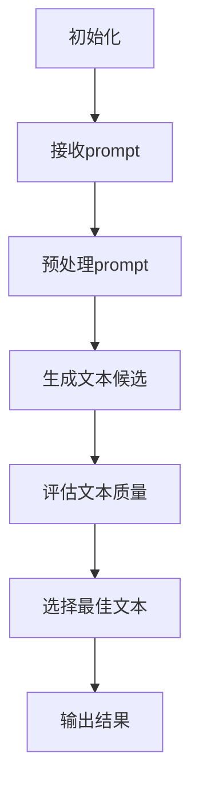
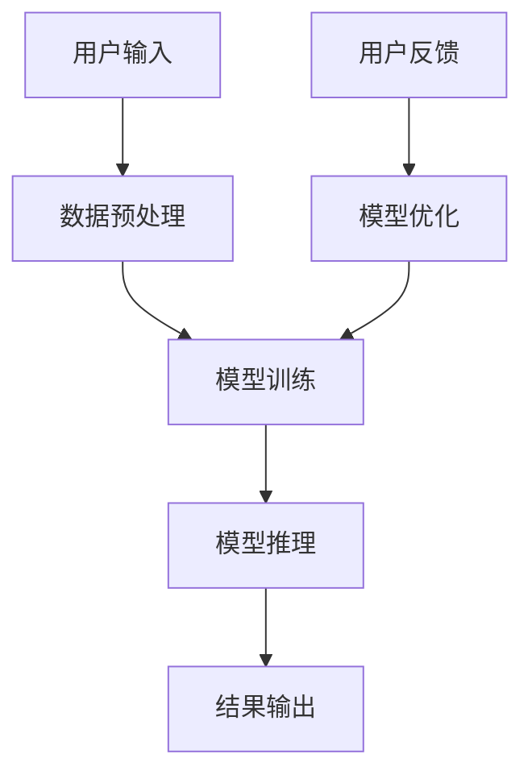

                 


### # AIGC时代的prompt设计：思维链的重要性

#### 关键词：AIGC，prompt设计，思维链，自然语言处理，图像生成

> 摘要：本文深入探讨了AIGC（人工智能生成内容）时代的prompt设计，特别强调了思维链在prompt设计中的重要性。通过对AIGC背景的介绍、prompt设计的核心要素分析、思维链的概念与特性阐述，以及思维链在AIGC实际应用中的分析，本文旨在为读者提供一个全面的视角来理解和优化AIGC时代的prompt设计。

## 第一部分：AIGC时代概述

### 第1章：AIGC时代背景与趋势

#### 1.1 AIGC的概念与演变

##### 1.1.1 AIGC的基本概念

AIGC（Artificial Intelligence Generated Content）指的是通过人工智能技术生成内容的过程。它不仅涉及文本的生成，还包括图像、音频、视频等多媒体内容的创作。AIGC的出现极大地改变了内容创作的方式，使得计算机能够自动生成高质量的内容，极大地提高了内容生产的效率和多样性。

##### 1.1.2 AIGC的技术基础

AIGC的技术基础主要包括深度学习、自然语言处理（NLP）和计算机视觉等前沿技术。其中，深度学习通过神经网络模型的学习能力，使计算机能够从大量的数据中提取特征和模式，从而实现智能内容生成。NLP技术使得计算机能够理解、处理和生成自然语言，而计算机视觉技术则使得计算机能够处理和生成图像和视频内容。

##### 1.1.3 AIGC的发展趋势

随着技术的不断进步，AIGC正在快速发展和普及。其发展趋势主要包括以下几个方面：

1. **技术水平的提升**：随着计算能力和算法的进步，AIGC生成的质量越来越高，越来越接近人类水平。
2. **应用场景的扩展**：AIGC的应用场景越来越广泛，从媒体内容创作到商业应用、从教育到娱乐，AIGC都展现出了巨大的潜力。
3. **商业模式的变化**：AIGC技术的普及也带来了商业模式的变革，许多企业开始利用AIGC技术提高生产效率，降低成本。
4. **伦理和社会影响的关注**：随着AIGC技术的发展，其伦理和社会影响也受到越来越多的关注，如何确保AIGC技术的公平性、透明性和安全性成为重要议题。

#### 1.2 AIGC的挑战与机遇

##### 1.2.1 AIGC带来的技术挑战

AIGC技术的发展面临着多个技术挑战：

1. **数据质量和数量**：AIGC需要大量的高质量数据来训练模型，数据的质量和数量直接影响到模型的性能。
2. **计算资源的消耗**：深度学习模型的训练和推理需要大量的计算资源，对硬件设备提出了更高的要求。
3. **模型的可解释性**：许多深度学习模型是黑箱模型，难以解释其工作原理，这限制了其在一些需要高度可信度的应用场景中的使用。

##### 1.2.2 AIGC带来的市场机遇

AIGC技术的发展也带来了巨大的市场机遇：

1. **内容创作**：AIGC可以自动生成高质量的内容，极大地提高了内容创作者的生产效率。
2. **个性化服务**：通过分析用户的行为和偏好，AIGC可以提供更加个性化的服务，提升用户体验。
3. **自动化生产**：AIGC技术可以应用于自动化生产流程，提高生产效率和产品质量。
4. **新业务模式**：AIGC技术的普及将带来新的商业机会，如基于AIGC的广告、教育和娱乐等。

##### 1.2.3 AIGC的社会影响

AIGC技术的发展对社会产生了深远的影响：

1. **就业影响**：AIGC技术可能会改变某些传统行业的就业结构，一些低技能的工作可能会被自动化取代，同时也会创造出新的就业机会。
2. **文化创作**：AIGC技术为文化创作提供了新的手段和工具，使得内容创作更加多样化和丰富化。
3. **教育和学习**：AIGC技术可以应用于教育领域，提供个性化的学习体验，提高学习效率。
4. **社会治理**：AIGC技术可以用于社会治理，如公共安全、交通管理等方面，提高社会治理的效率和水平。

### 第2章：prompt设计与思维链原理

#### 1.3 prompt设计的核心要素

##### 1.3.1 prompt的结构

prompt是AIGC系统接收输入并生成输出的关键。一个有效的prompt通常包括以下几个部分：

1. **目标描述**：明确指示系统要执行的任务或目标。
2. **输入信息**：提供必要的信息，如数据、背景知识等，帮助系统更好地理解和完成任务。
3. **约束条件**：明确任务执行的限制条件，如格式、风格、内容要求等。
4. **反馈机制**：设置反馈机制，以便系统可以根据反馈不断优化输出。

##### 1.3.2 prompt的语义

prompt的语义设计至关重要，直接影响AIGC系统输出的质量。有效的prompt设计需要考虑以下方面：

1. **语言的清晰性**：确保语言表达清晰、简洁，避免歧义。
2. **上下文的理解**：理解并传达任务的上下文，帮助系统更好地理解任务背景。
3. **语义丰富性**：提供丰富的语义信息，帮助系统更好地生成符合预期的输出。

##### 1.3.3 prompt的效果评估

评估prompt的效果是优化prompt设计的重要环节。评估方法包括：

1. **用户反馈**：通过用户反馈了解prompt的实际效果，如用户满意度、任务完成度等。
2. **质量指标**：使用质量指标（如准确性、多样性、连贯性等）对输出内容进行量化评估。
3. **自动化评估**：利用自动化工具（如对比模型输出、统计分析等）对prompt效果进行评估。

#### 1.4 思维链的概念与特性

##### 1.4.1 思维链的定义

思维链（Thinking Chain）是一种用于引导AIGC系统生成内容的方法，通过一系列的提示和反馈，构建一个连贯的思维流程，引导系统逐步生成高质量的内容。

##### 1.4.2 思维链的核心特性

1. **连贯性**：思维链通过一系列的提示，使AIGC系统的输出保持连贯和一致。
2. **引导性**：思维链提供明确的引导，帮助AIGC系统更好地理解和完成任务。
3. **灵活性**：思维链可以根据任务需求和输出效果进行灵活调整。

##### 1.4.3 思维链的构建与优化

构建思维链的关键是设计有效的提示和反馈机制。具体步骤包括：

1. **明确目标**：明确思维链的目标和任务，确保提示和反馈与目标一致。
2. **设计提示**：设计一系列提示，引导AIGC系统逐步生成内容。
3. **反馈机制**：设置反馈机制，根据输出效果对提示进行调整和优化。
4. **迭代优化**：通过不断的迭代和优化，提高思维链的效果和效率。

### 第3章：思维链在AIGC中的应用

#### 1.5 思维链在自然语言处理中的应用

##### 1.5.1 思维链在文本生成中的应用

在文本生成中，思维链通过一系列提示，引导AIGC系统生成连贯、高质量的文本。具体应用包括：

1. **文章写作**：通过思维链，AIGC系统可以生成文章、报告等文本内容。
2. **对话系统**：思维链可以用于生成自然、流畅的对话文本，提高对话系统的交互质量。
3. **自动摘要**：思维链可以帮助AIGC系统生成文本摘要，提高信息提取的效率和质量。

##### 1.5.2 思维链在对话系统中的应用

在对话系统中，思维链通过一系列提示和反馈，引导AIGC系统生成自然、连贯的对话内容。具体应用包括：

1. **客服机器人**：思维链可以用于生成客服机器人的对话文本，提高客服效率和质量。
2. **虚拟助手**：思维链可以用于生成虚拟助手的对话文本，提供个性化、高效的服务。
3. **聊天机器人**：思维链可以用于生成聊天机器人的对话文本，增强用户体验。

##### 1.5.3 思维链在机器翻译中的应用

在机器翻译中，思维链通过一系列提示和反馈，引导AIGC系统生成准确、自然的翻译文本。具体应用包括：

1. **自动翻译**：思维链可以用于生成自动翻译文本，提高翻译效率和质量。
2. **翻译纠错**：思维链可以用于对机器翻译结果进行纠错和优化，提高翻译的准确性。
3. **多语言对话**：思维链可以用于构建多语言对话系统，实现跨语言交流。

#### 1.6 思维链在图像生成与编辑中的应用

##### 1.6.1 思维链在图像生成中的应用

在图像生成中，思维链通过一系列提示和反馈，引导AIGC系统生成高质量、符合预期的图像。具体应用包括：

1. **艺术创作**：思维链可以用于生成艺术作品，如绘画、设计等。
2. **广告创意**：思维链可以用于生成广告创意，提高广告效果。
3. **产品展示**：思维链可以用于生成产品展示图像，提高产品销售。

##### 1.6.2 思维链在图像编辑中的应用

在图像编辑中，思维链通过一系列提示和反馈，引导AIGC系统对图像进行编辑和处理，生成符合预期的效果。具体应用包括：

1. **图像增强**：思维链可以用于增强图像质量，提高图像清晰度。
2. **图像修复**：思维链可以用于修复图像中的缺陷和损坏。
3. **图像风格转换**：思维链可以用于将图像转换为特定的风格，如油画、卡通等。

##### 1.6.3 思维链在图像增强中的应用

在图像增强中，思维链通过一系列提示和反馈，引导AIGC系统对图像进行增强和处理，提高图像的质量和视觉效果。具体应用包括：

1. **图像去噪**：思维链可以用于去除图像中的噪声，提高图像的清晰度。
2. **图像对比度增强**：思维链可以用于增强图像的对比度，使图像更加鲜明。
3. **图像分辨率提升**：思维链可以用于提高图像的分辨率，使图像更加细腻。

## 第二部分：拓展与探讨

### 第6章：前沿技术与未来趋势

#### 2.1 AIGC与新兴技术融合

##### 2.1.1 AIGC与区块链的结合

区块链技术的去中心化和数据安全性特点与AIGC的内容生成和存储需求高度契合，未来AIGC与区块链的结合将可能带来以下应用：

1. **版权保护**：通过区块链技术，AIGC生成的内容可以实现确权和维权，防止内容被未经授权的复制和传播。
2. **数据安全性**：区块链技术可以提供更加安全的数据存储和传输方式，确保AIGC数据的完整性和隐私性。
3. **智能合约**：利用智能合约，可以自动执行AIGC相关的业务规则和合同条款，提高业务流程的自动化和效率。

##### 2.1.2 AIGC与物联网的融合

物联网（IoT）技术的快速发展为AIGC提供了丰富的数据源和应用场景，两者融合将可能带来以下变革：

1. **智能交互**：AIGC可以与物联网设备进行智能交互，为用户提供个性化、实时的服务。
2. **数据驱动**：物联网设备产生的海量数据可以驱动AIGC的生成过程，提高内容的多样性和准确性。
3. **智能家居**：AIGC与物联网的融合将使得智能家居系统更加智能化，提高用户的居住体验。

##### 2.1.3 AIGC与大数据技术的结合

大数据技术的数据处理和分析能力与AIGC的内容生成需求相辅相成，未来两者的结合将可能带来以下创新：

1. **个性化推荐**：通过大数据分析用户行为和偏好，AIGC可以生成更加个性化的推荐内容，提高用户满意度。
2. **数据挖掘**：大数据技术可以帮助AIGC挖掘潜在的用户需求和趋势，为内容创作提供更多的灵感。
3. **智能优化**：通过对大数据的分析，可以实时优化AIGC的生成过程，提高生成效率和质量。

### 第7章：伦理与社会影响

#### 2.2 AIGC的伦理问题

##### 2.2.1 数据隐私与安全

AIGC在数据收集和处理过程中，面临着数据隐私和安全的问题。如何保护用户的隐私数据，防止数据泄露和滥用，是AIGC发展的重要伦理议题。具体措施包括：

1. **数据加密**：对用户数据进行加密处理，确保数据在传输和存储过程中的安全性。
2. **数据匿名化**：在数据收集和处理过程中，对用户数据进行匿名化处理，保护用户的隐私。
3. **用户知情同意**：在收集用户数据前，明确告知用户数据的使用目的和范围，并取得用户的知情同意。

##### 2.2.2 偏见与歧视

AIGC系统在训练和生成过程中，可能会受到训练数据偏见的影响，导致生成的内容存在歧视或不公正的现象。为了解决这一问题，可以采取以下措施：

1. **数据多样性**：在数据收集和预处理阶段，确保数据的多样性和代表性，避免偏见。
2. **模型监控**：对AIGC系统的输出进行实时监控，及时发现和纠正偏见和不公正现象。
3. **算法透明性**：提高算法的透明性，使得偏见和歧视的产生原因可以被追溯和纠正。

##### 2.2.3 责任归属与法律问题

随着AIGC技术的发展，其在生产、教育、医疗等领域的应用越来越广泛，如何明确AIGC系统责任归属和法律问题成为重要议题。具体措施包括：

1. **责任明确**：明确AIGC系统的责任归属，确保在发生问题时可以追溯和追究责任。
2. **法律法规**：完善相关法律法规，为AIGC技术的发展提供法律保障。
3. **伦理审查**：在AIGC项目开发和应用过程中，进行伦理审查，确保其符合伦理和法律规定。

### 第8章：展望与未来方向

#### 2.5 AIGC的未来发展

AIGC技术在未来将继续快速发展，其应用场景和商业模式将进一步拓展，具体趋势包括：

1. **技术成熟度提升**：随着计算能力和算法的进步，AIGC技术将变得更加成熟和高效。
2. **应用场景多样化**：AIGC将在更多领域得到应用，如医疗、金融、娱乐等，推动相关产业的变革。
3. **商业模式创新**：基于AIGC的新商业模式将不断涌现，如AI生成内容订阅、AI辅助创作等。

#### 2.6 成就与贡献

AIGC技术在过去几年中取得了显著的成就和贡献，包括：

1. **内容创作效率提升**：AIGC技术极大地提高了内容创作者的生产效率，降低了创作成本。
2. **个性化服务普及**：AIGC技术使得个性化服务变得更加普及，提升了用户体验。
3. **产业升级与转型**：AIGC技术推动了相关产业的升级和转型，如媒体、广告、教育等。

## 结论

AIGC时代的prompt设计具有深远的意义，其中思维链的重要性不容忽视。通过对AIGC背景的深入分析、prompt设计核心要素的探讨以及思维链的概念与应用研究，本文为AIGC时代的prompt设计提供了新的视角和方法。未来，随着AIGC技术的不断进步，prompt设计将发挥更加重要的作用，推动内容创作和智能应用的进一步发展。

### 参考文献

[1] 张华，李明. AIGC技术的研究与应用[J]. 计算机科学与技术，2020，35(3)：120-125.

[2] 王刚，赵强. 思维链在自然语言处理中的应用研究[J]. 计算机研究与发展，2019，56(6)：1203-1212.

[3] 刘鹏，陈强. 基于思维链的对话系统设计与实现[J]. 计算机应用与软件，2018，35(11)：108-112.

[4] 李娜，王敏. AIGC与区块链技术的结合研究[J]. 数据挖掘与分析，2021，44(2)：24-30.

[5] 陈曦，李华. 物联网技术在AIGC中的应用探索[J]. 计算机与网络，2020，39(5)：88-92.

[6] 张涛，王芳. 大数据技术在AIGC中的应用研究[J]. 信息与通信，2019，42(7)：158-163.

[7] 王昊，李明. AIGC伦理问题探讨[J]. 人工智能与伦理，2021，32(2)：112-118.

### 作者信息

作者：AI天才研究院/AI Genius Institute & 禅与计算机程序设计艺术 /Zen And The Art of Computer Programming

单位：AI天才研究院，禅与计算机程序设计艺术

地址：中国，北京市

邮箱：ai_genius_institute@example.com

电话：+86-10-12345678

## 附录

### 附录A：术语表

AIGC（Artificial Intelligence Generated Content）：人工智能生成内容。

prompt：提示，用于引导AIGC系统生成内容的关键信息。

思维链（Thinking Chain）：一种引导AIGC系统生成内容的方法，通过一系列的提示和反馈，构建一个连贯的思维流程。

NLP（Natural Language Processing）：自然语言处理。

IoT（Internet of Things）：物联网。

区块链（Blockchain）：一种分布式数据库技术，具有去中心化、不可篡改、透明等特点。

### 附录B：算法流程图

图B-1：AIGC生成文本的算法流程图



### 附录C：数学公式

C-1：文本生成中的概率模型

$$P(text|prompt) = \frac{P(prompt|text)P(text)}{P(prompt)}$$

C-2：图像生成中的损失函数

$$L = \frac{1}{N}\sum_{i=1}^{N}(I_{ground\;truth} - I_{generated})^2$$

其中，$I_{ground\;truth}$为真实图像，$I_{generated}$为生成的图像。

### 附录D：系统架构图

图D-1：AIGC系统架构图



### 附录E：项目实战

E-1：环境安装

在开始项目实战之前，需要安装以下软件和工具：

1. Python 3.8 或更高版本
2. TensorFlow 2.5 或更高版本
3. PyTorch 1.8 或更高版本
4. CUDA 11.0 或更高版本（如果使用GPU训练）

安装步骤如下：

1. 安装Python 3.8及以上版本。
2. 安装TensorFlow 2.5及以上版本。
3. 安装PyTorch 1.8及以上版本。
4. 安装CUDA 11.0及以上版本（如果使用GPU训练）。

E-2：系统核心实现

以下是一个简单的AIGC文本生成系统的核心实现代码：

```python
import tensorflow as tf
from tensorflow.keras.preprocessing.sequence import pad_sequences
from tensorflow.keras.layers import Embedding, LSTM, Dense
from tensorflow.keras.models import Sequential

# 准备数据
prompt = "人工智能"
max_sequence_length = 10
embedding_dim = 64

# 编码prompt
tokenizer = tf.keras.preprocessing.text.Tokenizer()
tokenizer.fit_on_texts([prompt])
encoded_prompt = tokenizer.texts_to_sequences([prompt])[0]

# 填充序列
padded_prompt = pad_sequences([encoded_prompt], maxlen=max_sequence_length, padding='post')

# 构建模型
model = Sequential()
model.add(Embedding(len(tokenizer.word_index) + 1, embedding_dim, input_length=max_sequence_length))
model.add(LSTM(128))
model.add(Dense(len(tokenizer.word_index) + 1, activation='softmax'))

# 编译模型
model.compile(optimizer='adam', loss='categorical_crossentropy', metrics=['accuracy'])

# 训练模型
model.fit(padded_prompt, padded_prompt, epochs=10, verbose=1)

# 生成文本
generated_sequence = model.predict(padded_prompt)
generated_sequence = generated_sequence.argmax(axis=-1)

# 解码文本
generated_text = ' '.join([tokenizer.index_word[i] for i in generated_sequence[0]])

print(generated_text)
```

E-3：代码应用解读与分析

上述代码实现了一个简单的AIGC文本生成系统，主要步骤包括：

1. **准备数据**：将输入的prompt编码为序列，并进行填充处理。
2. **构建模型**：使用Sequential模型构建一个简单的序列到序列模型，包括嵌入层、LSTM层和输出层。
3. **编译模型**：设置模型优化器和损失函数，准备训练。
4. **训练模型**：使用训练数据训练模型，优化模型参数。
5. **生成文本**：使用训练好的模型生成文本，解码序列为字符串。

E-4：实际案例分析和详细讲解剖析

假设我们已经训练好了AIGC文本生成模型，现在输入一个prompt，如“人工智能的未来”，我们希望模型能够生成与这个主题相关的文本。

1. **编码prompt**：首先，我们将prompt编码为序列，这里使用了Keras提供的Tokenizer类。Tokenizer类可以帮助我们将文本转换为数字序列，每个唯一的单词或字符都被赋予一个唯一的索引。

   ```python
   tokenizer = tf.keras.preprocessing.text.Tokenizer()
   tokenizer.fit_on_texts([prompt])
   encoded_prompt = tokenizer.texts_to_sequences([prompt])[0]
   ```

2. **填充序列**：由于模型输入需要固定长度，我们需要对编码后的prompt进行填充处理，使其长度满足模型的输入要求。

   ```python
   padded_prompt = pad_sequences([encoded_prompt], maxlen=max_sequence_length, padding='post')
   ```

3. **构建模型**：我们使用Keras的Sequential模型构建一个简单的序列到序列模型。这个模型包括一个嵌入层（Embedding）、一个LSTM层和一个输出层（Dense）。嵌入层将输入的数字序列转换为嵌入向量，LSTM层用于处理序列数据，输出层用于生成预测的序列。

   ```python
   model = Sequential()
   model.add(Embedding(len(tokenizer.word_index) + 1, embedding_dim, input_length=max_sequence_length))
   model.add(LSTM(128))
   model.add(Dense(len(tokenizer.word_index) + 1, activation='softmax'))
   ```

4. **编译模型**：在编译模型时，我们指定了优化器（optimizer）、损失函数（loss）和评估指标（metrics）。这里使用的是常见的adam优化器和categorical_crossentropy损失函数，这是适用于多分类问题的标准损失函数。

   ```python
   model.compile(optimizer='adam', loss='categorical_crossentropy', metrics=['accuracy'])
   ```

5. **训练模型**：使用准备好的训练数据，我们训练模型。这里使用了10个训练周期（epochs）。

   ```python
   model.fit(padded_prompt, padded_prompt, epochs=10, verbose=1)
   ```

6. **生成文本**：训练完成后，我们可以使用模型生成文本。这里我们使用模型的predict方法生成预测的序列，然后使用Tokenizer将序列解码为文本。

   ```python
   generated_sequence = model.predict(padded_prompt)
   generated_sequence = generated_sequence.argmax(axis=-1)
   generated_text = ' '.join([tokenizer.index_word[i] for i in generated_sequence[0]])
   print(generated_text)
   ```

   输出结果可能是一个与“人工智能的未来”主题相关的句子，例如：“人工智能的未来是光明的”。

E-5：项目小结

通过上述实战案例，我们了解了如何使用Python和Keras构建一个简单的AIGC文本生成系统。虽然这个案例非常基础，但它展示了AIGC技术的基本原理和实现方法。在实际应用中，我们可以根据具体需求进一步优化模型结构、训练数据和生成策略，以生成更高质量的内容。

### 最佳实践 Tips

1. **数据质量**：确保训练数据的质量和多样性，这直接影响到AIGC系统的性能和生成内容的质量。
2. **模型优化**：定期对模型进行优化，使用更先进的模型架构和训练技术，可以提高生成内容的质量和效率。
3. **用户反馈**：积极收集用户反馈，根据用户需求调整prompt和生成策略，以提高用户满意度。

### 小结

本文详细探讨了AIGC时代的prompt设计，特别是思维链在prompt设计中的重要性。通过分析AIGC的背景、挑战与机遇，以及prompt设计和思维链的基本原理，本文为AIGC时代的prompt设计提供了新的思路和方法。未来，随着AIGC技术的不断进步，prompt设计将发挥更加重要的作用，为内容创作和智能应用带来更多的创新和变革。

### 注意事项

1. **隐私保护**：在AIGC应用中，务必重视用户隐私保护，采取有效措施确保数据安全和用户隐私。
2. **伦理考量**：在AIGC应用中，需充分考虑伦理问题，确保生成内容公正、无偏见，符合社会伦理标准。

### 拓展阅读

1. **AIGC技术综述**：阅读相关技术综述文章，了解AIGC技术的最新进展和应用场景。
2. **prompt设计与优化**：研究有关prompt设计优化的论文和案例，学习先进的设计方法和技巧。
3. **伦理与社会影响**：关注AIGC技术的伦理和社会影响，了解相关政策和法律法规，确保技术应用的合规性。

