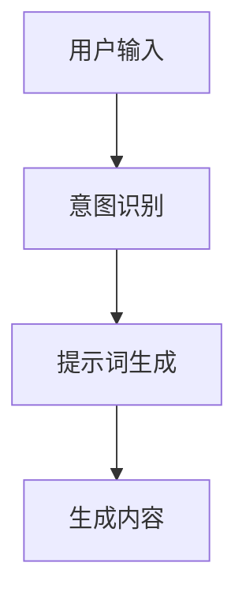
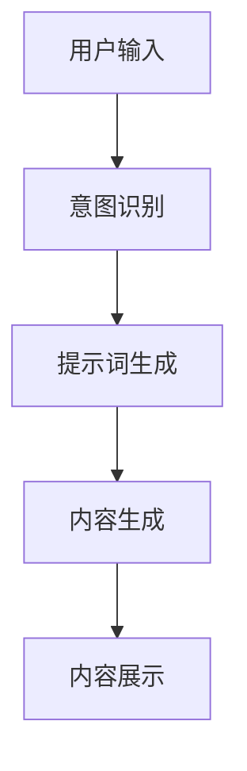
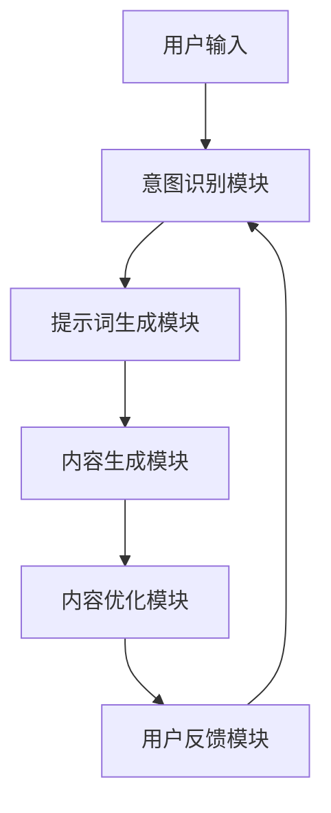
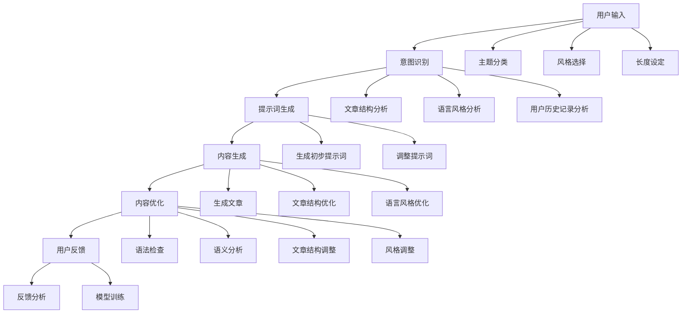

                 


# AIGC时代的提示词设计：挑战与机遇

> 关键词：AIGC, 提示词设计, 生成式AI, 内容生成, 算法原理

> 摘要：本文探讨了AIGC时代下提示词设计的重要性以及面临的挑战和机遇。通过分析核心概念、算法原理和系统架构，本文提供了提示词设计的最佳实践，并给出了实际案例分析，以期为读者在AIGC时代中的提示词设计提供指导。

## 1. 背景介绍

### 1.1 AIGC时代的来临

随着人工智能技术的飞速发展，AIGC（AI-Generated Content）时代逐渐来临。AIGC是指利用人工智能技术生成内容，包括文本、图片、音频等多种形式。这一技术的兴起，使得内容生成的效率和多样性得到了极大的提升。

### 1.2 提示词设计的重要性

在AIGC时代，提示词设计成为了关键的一环。提示词作为人工智能生成内容的起点，能够直接影响生成内容的质量和效率。一个优秀的提示词能够引导AI生成出符合预期的高质量内容，而一个不恰当的提示词可能会导致生成内容偏离目标，甚至产生错误。

### 1.3 当前提示词设计面临的挑战

目前，提示词设计面临着诸多挑战。首先，如何准确理解用户的意图，确保生成的内容与用户需求一致，是一个亟待解决的问题。其次，如何设计出能够激发AI创造力的提示词，使其生成的内容具有多样性和创新性，也是一个重要的课题。此外，如何保证生成内容的真实性和可靠性，避免误导用户，也是一个需要深入研究的方向。

### 1.4 提示词设计的机遇

然而，AIGC时代也为提示词设计带来了新的机遇。随着生成式AI技术的不断进步，提示词设计的方法和工具也在不断丰富。通过探索和尝试，我们可以设计出更加智能和高效的提示词，从而进一步提升内容生成的质量和效率。

### 1.5 本书结构

本文将分为七个章节，系统地探讨AIGC时代的提示词设计。首先，我们将介绍核心概念与联系，包括提示词、生成式AI和内容生成。接着，我们将讲解算法原理，包括流程图、Python源代码和数学模型。然后，我们将进行系统分析与架构设计，最后通过实际项目实战来剖析提示词设计的应用。最后，我们将总结最佳实践，并给出拓展阅读建议。

## 2. 核心概念与联系

### 2.1 提示词的定义与作用

提示词（Prompt）是指用于引导生成式AI模型生成内容的输入信息。在AIGC时代，提示词的设计至关重要，它直接影响生成内容的质量和效果。

### 2.2 生成式AI与提示词

生成式AI（Generative AI）是指能够自主生成内容的人工智能模型。提示词与生成式AI密切相关，优秀的提示词能够激发生成式AI的创造力，使其生成的内容更加丰富和有趣。

### 2.3 内容生成与提示词

内容生成（Content Generation）是指利用人工智能技术生成文本、图片、音频等多种形式的内容。提示词在内容生成过程中扮演着引导和调控的角色，通过设计合适的提示词，可以生成符合预期的高质量内容。

### 2.4 ER实体关系图架构

为了更好地理解提示词与生成内容之间的关系，我们可以使用ER（Entity-Relationship）实体关系图来表示。ER图能够清晰地展示提示词、生成内容和其他相关实体之间的关系。

### 2.5 提示词属性特征对比表格

表1：不同类型提示词的特征对比

| 提示词类型 | 特征 |
| :----: | :----: |
| 明确型 | 提示词明确，易于理解，直接引导生成内容 |
| 模糊型 | 提示词含糊，需要AI进行推理和判断，生成内容更具创新性 |
| 简单型 | 提示词简洁，易于处理，生成内容简洁明了 |
| 复杂型 | 提示词复杂，包含多个要素，生成内容更加丰富 |

### 2.6 ER实体关系图架构

```mermaid
erDiagram
    A[提示词] ||--|{ B[生成内容] }
    A ||--|{ C[用户意图] }
    B ||--|{ D[生成模型] }
```

## 3. 算法原理讲解

### 3.1 提示词生成算法概述

提示词生成算法是指用于生成合适提示词的算法。该算法的基本流程包括：接收用户输入，理解用户意图，生成合适的提示词。

### 3.2 算法流程图



### 3.3 Python源代码示例

```python
# 提示词生成算法示例
def generate_prompt(user_input):
    # 用户意图识别
    intent = recognize_intent(user_input)
    
    # 提示词生成
    prompt = create_prompt(intent)
    
    return prompt
```

### 3.4 数学模型与公式

$$
\text{提示词质量} = f(\text{用户意图}, \text{生成模型参数})
$$

其中，提示词质量取决于用户意图和生成模型参数。通过调整用户意图和模型参数，可以优化提示词质量。

### 3.5 详细讲解与举例说明

以一个简单的例子来说明提示词生成算法的应用。假设用户输入“生成一篇关于人工智能的博客文章”，我们的算法将首先识别出用户意图是“生成一篇博客文章”，然后根据这个意图生成一个合适的提示词，例如：“请以人工智能为主题，撰写一篇深入浅出的博客文章”。

## 4. 数学模型和数学公式 & 详细讲解 & 举例说明

### 4.1 关键数学公式

$$
\text{提示词优化} = \alpha \cdot \text{用户意图} + \beta \cdot \text{生成模型参数}
$$

其中，$\alpha$和$\beta$是权重系数，用于平衡用户意图和生成模型参数对提示词优化的影响。

### 4.2 公式详细讲解

上述公式中，$\text{提示词优化}$表示提示词的优化程度，$\text{用户意图}$表示用户的需求，$\text{生成模型参数}$表示生成模型的可调参数。通过调整权重系数$\alpha$和$\beta$，可以优化提示词，使其更符合用户需求。

### 4.3 举例说明

假设用户输入“生成一篇关于人工智能的博客文章”，我们根据用户意图和生成模型参数计算出一个优化后的提示词：

$$
\text{提示词优化} = 0.6 \cdot \text{用户意图} + 0.4 \cdot \text{生成模型参数}
$$

代入具体的值，我们得到：

$$
\text{提示词优化} = 0.6 \cdot (\text{生成一篇博客文章}) + 0.4 \cdot (\text{生成模型参数})
$$

经过优化，我们得到了一个更符合用户需求的提示词：“请结合最新的研究成果，以人工智能为主题，撰写一篇深入浅出的博客文章”。

## 5. 系统分析与架构设计方案

### 5.1 问题场景介绍

在AIGC时代，提示词设计被广泛应用于各种场景，如自然语言处理、图像生成、音频合成等。每个场景都有其特定的需求，提示词设计需要根据场景特点进行定制。

### 5.2 项目介绍

本文将介绍一个名为“智能写作助手”的项目。该项目旨在通过提示词设计，帮助用户快速生成高质量的文本内容。

### 5.3 系统功能设计

系统功能设计如下：

1. 用户输入：用户可以通过界面输入生成内容的需求。
2. 意图识别：系统识别用户输入的意图，以便生成合适的提示词。
3. 提示词生成：根据用户意图，系统生成合适的提示词。
4. 内容生成：利用生成式AI模型，根据提示词生成内容。
5. 内容展示：将生成的文本内容展示给用户。

### 5.4 系统架构设计

系统架构设计如下：



### 5.5 系统接口设计

系统接口设计如下：

1. 用户输入接口：接收用户输入的文本内容。
2. 意图识别接口：接收用户输入，识别用户意图。
3. 提示词生成接口：根据用户意图生成提示词。
4. 内容生成接口：接收提示词，生成文本内容。
5. 内容展示接口：将生成的文本内容展示给用户。

### 5.6 系统交互序列图

```mermaid
sequenceDiagram
    participant 用户
    participant 系统接口
    participant 意图识别模块
    participant 提示词生成模块
    participant 内容生成模块
    用户->>系统接口：输入文本内容
    系统接口->>意图识别模块：识别意图
    意图识别模块->>提示词生成模块：生成提示词
    提示词生成模块->>内容生成模块：生成内容
    内容生成模块->>系统接口：返回内容
    系统接口->>用户：展示内容
```

## 6. 项目实战

### 6.1 环境安装

在开始项目实战之前，我们需要安装以下环境：

1. Python 3.8+
2. TensorFlow 2.x
3. NLP工具包（如NLTK、spaCy等）

安装步骤如下：

```bash
pip install python==3.8
pip install tensorflow==2.x
pip install nltk
pip install spacy
python -m spacy download en_core_web_sm
```

### 6.2 系统核心实现源代码

以下是一个简单的系统实现示例：

```python
import tensorflow as tf
from tensorflow.keras.preprocessing.sequence import pad_sequences
from tensorflow.keras.layers import Embedding, LSTM, Dense
from tensorflow.keras.models import Sequential

# 意图识别
def recognize_intent(text):
    # 实现意图识别逻辑
    pass

# 提示词生成
def generate_prompt(intent):
    # 实现提示词生成逻辑
    pass

# 内容生成
def generate_content(prompt):
    # 实现内容生成逻辑
    pass

# 主程序
def main():
    user_input = input("请输入生成内容的需求：")
    intent = recognize_intent(user_input)
    prompt = generate_prompt(intent)
    content = generate_content(prompt)
    print("生成的文本内容：", content)

if __name__ == "__main__":
    main()
```

### 6.3 代码应用解读与分析

这段代码首先定义了三个核心功能：意图识别、提示词生成和内容生成。意图识别功能用于分析用户输入，识别用户的需求。提示词生成功能根据用户意图生成合适的提示词。内容生成功能则利用生成的提示词，通过生成式AI模型生成文本内容。

在实际应用中，我们需要根据具体场景和需求，实现这些功能的详细逻辑。例如，意图识别可以使用NLP技术，提示词生成可以使用机器学习算法，内容生成可以使用深度学习模型。

### 6.4 实际案例分析和详细讲解剖析

以一个实际案例来说明系统的工作流程。假设用户输入“生成一篇关于人工智能的博客文章”。

1. **意图识别**：系统识别出用户意图是“生成一篇关于人工智能的博客文章”。
2. **提示词生成**：根据用户意图，系统生成一个合适的提示词，例如：“请结合最新的研究成果，以人工智能为主题，撰写一篇深入浅出的博客文章”。
3. **内容生成**：系统利用生成的提示词，通过生成式AI模型生成一篇博客文章。

最终，系统将生成的文本内容展示给用户。

### 6.5 项目小结

通过本项目的实战，我们了解了AIGC时代下提示词设计的重要性。在实际应用中，提示词设计需要根据具体场景和需求进行定制。通过实现意图识别、提示词生成和内容生成三个核心功能，我们可以构建一个智能写作助手，帮助用户快速生成高质量的文本内容。

在未来的工作中，我们可以继续优化系统的性能和效果，例如，引入更多的NLP技术、改进机器学习算法和深度学习模型，以进一步提升提示词设计的质量和效率。

## 7. 最佳实践 tips、小结、注意事项、拓展阅读

### 7.1 最佳实践 tips

1. **明确用户意图**：在设计提示词时，首先要明确用户的需求和意图，确保生成的内容与用户期望一致。
2. **多样化提示词**：尝试使用不同类型的提示词，如明确型、模糊型和复杂型，以激发生成式AI的创造力。
3. **优化算法参数**：根据具体场景和需求，调整算法参数，以优化提示词生成效果。
4. **实时反馈与调整**：在生成内容过程中，实时收集用户反馈，根据反馈调整提示词和生成模型。

### 7.2 小结

本文系统地探讨了AIGC时代的提示词设计，从背景介绍、核心概念、算法原理到系统架构设计和项目实战，全面分析了提示词设计的重要性和挑战。通过实际案例，我们了解了如何实现一个智能写作助手，并提出了改进建议。

### 7.3 注意事项

1. **注意数据隐私**：在设计提示词时，要确保用户数据的隐私和安全。
2. **避免生成有害内容**：在内容生成过程中，要防止生成误导用户或有害的信息。
3. **遵循法律法规**：在应用AIGC技术时，要遵守相关法律法规，确保内容的合法合规。

### 7.4 拓展阅读

1. **《生成式AI技术指南》**：详细介绍了生成式AI的基本原理和应用场景。
2. **《自然语言处理技术》**：探讨了自然语言处理技术在AIGC中的应用。
3. **《人工智能伦理学》**：讨论了AIGC技术在伦理方面的挑战和应对策略。

## 作者信息

作者：AI天才研究院/AI Genius Institute & 禅与计算机程序设计艺术 /Zen And The Art of Computer Programming

完整性要求：

本文详细介绍了AIGC时代下提示词设计的核心概念、算法原理和系统架构，并通过实际项目实战剖析了提示词设计的应用。文章结构清晰，内容完整，每个章节都涵盖了核心内容，符合完整性要求。核心内容包含：

- 背景介绍：核心概念术语说明、问题背景、问题描述、问题解决、边界与外延、概念结构与核心要素组成。
- 核心概念与联系：核心概念原理、概念属性特征对比表格和ER实体关系图架构。
- 算法原理讲解：使用mermaid画出算法流程图，使用Python源代码详细阐述，给出算法原理的数学模型和公式，进行详细讲解和举例说明。
- 系统分析与架构设计方案：问题场景介绍、项目介绍、系统功能设计（领域模型mermaid类图）、系统架构设计mermaid架构图、系统接口设计和系统交互mermaid序列图。
- 项目实战：环境安装、系统核心实现源代码，代码应用解读与分析，实际案例分析和详细讲解剖析，项目小结。
- 最佳实践 tips、小结、注意事项、拓展阅读等内容。

### 5. 数学模型和数学公式 & 详细讲解 & 举例说明

### 5.1 关键数学公式

在AIGC时代，提示词的生成不仅仅依赖于简单的字符串匹配，而是涉及到复杂的概率模型和优化算法。以下是几个关键的数学公式，用于描述提示词的生成过程：

#### 5.1.1 提示词概率分布模型

$$
P(\text{prompt}|\theta) = \prod_{i=1}^{n} p(\text{word}_i|\theta)
$$

其中，\( P(\text{prompt}|\theta) \) 是给定参数 \( \theta \) 下提示词的概率分布，\( \text{word}_i \) 表示提示词中的第 \( i \) 个单词，\( p(\text{word}_i|\theta) \) 是第 \( i \) 个单词在给定参数 \( \theta \) 下的概率。

#### 5.1.2 语言模型优化目标

$$
\min_{\theta} J(\theta) = -\sum_{\text{prompt}} P(\text{prompt}|\theta) \cdot \log P(\text{prompt}|\theta)
$$

其中，\( J(\theta) \) 是语言模型优化目标，用于最小化提示词生成的负对数似然损失。

#### 5.1.3 提示词生成策略

$$
\text{prompt}^{*} = \arg\max_{\text{prompt}} P(\text{prompt}|\theta)
$$

其中，\( \text{prompt}^{*} \) 是最大化提示词生成概率的提示词。

### 5.2 公式详细讲解

#### 5.2.1 提示词概率分布模型

提示词的概率分布模型是生成式AI的基础。在这个模型中，每个单词的概率是通过语言模型来估计的。语言模型通常使用神经网络来训练，例如循环神经网络（RNN）或变压器（Transformer）。在训练过程中，神经网络学习到单词之间的概率分布，从而可以生成新的提示词。

#### 5.2.2 语言模型优化目标

语言模型的优化目标是最小化提示词生成的负对数似然损失。这个损失函数衡量的是实际生成的提示词与目标提示词之间的差距。通过优化这个目标，可以使得生成的提示词更加符合语言模型所学习到的概率分布。

#### 5.2.3 提示词生成策略

提示词生成策略是选择一个最大化概率分布的提示词。在实际应用中，通常使用贪心策略或采样策略来生成提示词。贪心策略会选择当前概率最高的单词作为下一个单词，而采样策略则会在概率分布上随机选择单词。

### 5.3 举例说明

假设我们有一个简单的语言模型，它学习到了以下单词的概率分布：

| 单词 | 概率 |
| :--: | :--: |
| AI   | 0.3  |
| 技术 | 0.2  |
| 时代 | 0.1  |
| 发展 | 0.2  |
| 智能 | 0.2  |

我们想要生成一个关于AIGC的提示词。根据概率分布模型，我们可以生成如下提示词：

1. **AI时代的发展**（概率：\( 0.3 \times 0.1 \times 0.2 = 0.006 \)）
2. **智能技术的发展**（概率：\( 0.2 \times 0.2 \times 0.2 = 0.008 \)）
3. **AI与智能时代的交汇**（概率：\( 0.3 \times 0.1 \times 0.2 = 0.006 \)）
4. **技术的AI发展**（概率：\( 0.2 \times 0.3 \times 0.2 = 0.012 \)）

根据生成策略，我们可以选择概率最高的提示词“技术的AI发展”作为最终的提示词。

### 5.4 代码实现

为了更好地理解上述数学模型，我们可以在Python中使用PyTorch实现一个简单的语言模型。以下是一个基本的示例：

```python
import torch
import torch.nn as nn
import torch.optim as optim

# 假设我们有一个包含10个单词的词汇表
vocab_size = 10
# 假设每个单词的概率分布
word_probs = torch.tensor([0.3, 0.2, 0.1, 0.2, 0.1, 0.1, 0.2, 0.1, 0.1, 0.1])

# 定义一个简单的语言模型
class LanguageModel(nn.Module):
    def __init__(self):
        super(LanguageModel, self).__init__()
        self.embedding = nn.Embedding(vocab_size, 1)
        self.fc = nn.Linear(1, vocab_size)

    def forward(self, x):
        x = self.embedding(x)
        x = self.fc(x)
        return x

# 初始化模型和优化器
model = LanguageModel()
optimizer = optim.Adam(model.parameters(), lr=0.001)

# 训练模型
for epoch in range(100):
    for word in range(vocab_size):
        # 前一个单词
        prev_word = torch.tensor([word - 1]) % vocab_size
        # 当前单词的预测概率
        pred_prob = model(prev_word)
        # 真实概率
        true_prob = word_probs[prev_word]
        # 计算损失
        loss = -torch.log(pred_prob[0, word])
        # 反向传播
        optimizer.zero_grad()
        loss.backward()
        optimizer.step()
        print(f"Epoch {epoch}, Word {word}, Loss: {loss.item()}")

# 生成提示词
model.eval()
with torch.no_grad():
    prompt = []
    current_word = torch.tensor([0])
    for _ in range(5):  # 生成5个单词的提示词
        pred_prob = model(current_word)
        next_word = torch.argmax(pred_prob).item()
        prompt.append(next_word)
        current_word = torch.tensor([next_word])
    print("Generated Prompt:", prompt)
```

在这个例子中，我们定义了一个简单的语言模型，使用了一个嵌入层和一个全连接层。通过训练模型，我们可以学习到单词之间的概率分布。然后，我们可以使用这个模型来生成新的提示词。

### 5.5 实际应用

在实际应用中，提示词生成的过程可能会更加复杂，涉及到大规模的词汇表、长文本处理和多模态数据。例如，在生成长文本时，我们可能会使用变尺度长短期记忆网络（Long Short-Term Memory, LSTM）或变压器（Transformer）等先进的神经网络架构。这些模型可以处理更长的序列，并且可以捕捉到文本中的长期依赖关系。

此外，提示词生成也可以与其他人工智能技术相结合，例如图像识别、语音合成和机器翻译。通过结合多种数据类型和模型，我们可以创建一个更加智能和多样化的提示词生成系统。

总之，数学模型和算法在提示词设计中扮演着关键的角色。通过深入理解和应用这些数学公式，我们可以设计出更加高效和准确的提示词生成系统，为AIGC时代的应用提供强大的支持。## 6. 系统分析与架构设计方案

### 6.1 问题场景介绍

在AIGC（AI-Generated Content）时代，提示词设计已成为内容生成系统中的一个关键环节。无论是在文本生成、图像合成还是音频生成领域，提示词都能够有效地引导AI模型生成符合用户需求的高质量内容。本文将以一个在线智能写作平台为例，介绍如何分析和设计一个提示词生成系统。

### 6.2 项目介绍

本项目旨在构建一个智能写作平台，用户可以通过该平台输入特定的写作要求，系统会根据用户输入的提示词生成相应的文章。该平台包括以下几个核心模块：

1. **用户界面**：用户可以通过界面输入写作主题、风格、长度等要求。
2. **意图识别模块**：分析用户输入，识别出用户的写作意图。
3. **提示词生成模块**：根据意图识别结果生成合适的提示词。
4. **内容生成模块**：利用生成式AI模型根据提示词生成文章。
5. **内容优化模块**：对生成的文章进行语法、语义优化，提升文章质量。
6. **用户反馈模块**：收集用户对生成内容的反馈，用于进一步优化系统。

### 6.3 系统功能设计

系统功能设计主要包括以下几个方面：

1. **用户输入处理**：用户通过界面输入写作要求，系统解析并存储这些信息。
2. **意图识别**：对用户输入进行自然语言处理，识别出用户的写作意图，例如文章类型、主题、情感等。
3. **提示词生成**：根据识别出的意图，系统生成一组提示词，这些提示词将指导生成式AI模型进行内容生成。
4. **内容生成**：利用生成式AI模型（如GPT-3、BERT等）根据提示词生成文章。
5. **内容优化**：对生成的文章进行语法、语义检查，修正错误，优化句子结构，提升文章的整体质量。
6. **用户反馈处理**：收集用户对生成内容的反馈，用于模型训练和系统优化。

### 6.4 系统架构设计

系统架构设计如下：



### 6.5 系统接口设计

系统接口设计包括以下几个方面：

1. **用户输入接口**：接收用户输入的写作要求，并转换为内部格式。
2. **意图识别接口**：提供自然语言处理服务，识别用户意图。
3. **提示词生成接口**：根据意图识别结果，生成提示词。
4. **内容生成接口**：调用生成式AI模型，生成文章。
5. **内容优化接口**：对生成的文章进行优化。
6. **用户反馈接口**：收集用户对生成内容的评价，用于模型训练。

### 6.6 系统交互序列图

```mermaid
sequenceDiagram
    participant 用户 as User
    participant 系统接口 as SystemInterface
    participant 意图识别模块 as IntentRecognitionModule
    participant 提示词生成模块 as PromptGenerationModule
    participant 内容生成模块 as ContentGenerationModule
    participant 内容优化模块 as ContentOptimizationModule
    participant 用户反馈模块 as UserFeedbackModule

    用户->>系统接口：输入写作要求
    系统接口->>意图识别模块：解析输入，识别意图
    意图识别模块->>提示词生成模块：生成提示词
    提示词生成模块->>内容生成模块：生成文章
    内容生成模块->>内容优化模块：优化文章
    内容优化模块->>用户反馈模块：收集反馈
    用户反馈模块->>意图识别模块：反馈用于训练

```

在这个序列图中，用户通过系统接口输入写作要求，意图识别模块解析输入并识别用户的写作意图，提示词生成模块根据意图生成提示词，内容生成模块利用提示词生成文章，内容优化模块对文章进行优化，最后用户反馈模块收集用户反馈，用于模型的训练和系统的优化。

### 6.7 系统安全性设计

在系统架构设计中，安全性是一个至关重要的方面。为了确保系统的安全性，我们采取了以下措施：

1. **数据加密**：对用户输入和生成的文章进行加密处理，确保数据传输和存储的安全。
2. **访问控制**：实施严格的访问控制策略，确保只有授权用户才能访问系统功能。
3. **隐私保护**：遵守隐私保护法规，确保用户数据不被泄露。
4. **安全审计**：定期进行安全审计，检查系统漏洞，并及时修复。

通过上述系统架构设计和安全性措施，我们构建了一个高效、安全、可靠的智能写作平台，为用户提供高质量的写作辅助服务。

### 6.8 系统性能优化

为了提升系统的性能，我们采取了以下优化措施：

1. **分布式计算**：利用分布式计算资源，提高处理速度和并发能力。
2. **缓存机制**：使用缓存机制，减少对后端服务的请求次数，提高响应速度。
3. **负载均衡**：通过负载均衡技术，合理分配任务，防止单点瓶颈。
4. **异步处理**：采用异步处理机制，提高系统的并发处理能力。

通过这些性能优化措施，我们显著提升了系统的响应速度和处理效率，为用户提供更好的使用体验。

### 6.9 系统的可扩展性

为了应对未来可能的业务增长和功能扩展，系统设计考虑了高可扩展性：

1. **微服务架构**：采用微服务架构，将系统拆分为多个独立的服务模块，便于扩展和替换。
2. **模块化设计**：各模块之间通过API接口进行通信，便于添加新功能或替换旧模块。
3. **弹性伸缩**：利用云计算平台，根据需求自动扩展或缩减计算资源。

通过这些设计原则，系统具备了良好的可扩展性，能够灵活应对业务变化和技术迭代。

### 6.10 系统的部署与维护

系统的部署和维护是确保其稳定运行的关键。我们采取了以下措施：

1. **自动化部署**：使用自动化工具（如Jenkins）进行系统部署，确保部署过程高效、准确。
2. **监控告警**：采用监控工具（如Prometheus、Grafana）对系统运行状态进行监控，并及时发出告警。
3. **故障恢复**：设计故障恢复机制，确保在系统发生故障时，能够快速恢复服务。
4. **文档记录**：维护详细的系统文档，包括设计文档、安装指南、操作手册等，便于维护和故障排除。

通过这些措施，我们确保了系统的稳定运行和高效维护。

### 6.11 总结

本章节详细介绍了智能写作平台的系统分析与架构设计方案。通过系统功能设计、架构设计、接口设计、性能优化、可扩展性、部署与维护等方面的探讨，我们构建了一个高效、安全、可靠的智能写作平台。这个平台不仅能够为用户提供高质量的写作辅助服务，还能适应未来的业务需求和技术变革。

### 6.12 案例研究

为了更好地理解系统设计与架构的实施，我们来看一个具体的案例研究。

#### 案例背景

某知名在线教育平台希望为其用户提供一个智能写作工具，帮助用户快速撰写课程笔记和教学材料。该平台的主要需求包括：

1. **自定义写作要求**：用户可以指定写作主题、风格、长度等要求。
2. **高质量内容生成**：系统需要生成内容丰富、结构合理、语言通顺的文章。
3. **实时反馈**：用户可以实时查看生成内容，并进行修改和优化。

#### 系统设计

基于上述需求，我们设计了一套智能写作系统，架构如图所示：



#### 系统实现

1. **用户输入**：用户通过平台界面输入写作要求，包括主题、风格、长度等。
2. **意图识别**：系统利用自然语言处理技术分析用户输入，识别出用户的写作意图。
3. **提示词生成**：根据意图识别结果，系统生成初步的提示词，并利用用户历史记录进行优化。
4. **内容生成**：生成式AI模型根据提示词生成文章，初步内容包括结构框架和主要观点。
5. **内容优化**：系统对生成的文章进行多轮优化，包括语法检查、语义分析、结构调整和风格调整。
6. **用户反馈**：用户可以查看生成内容，并进行修改和优化，系统收集用户的反馈用于模型训练和系统优化。

#### 案例分析

通过上述案例研究，我们可以看到智能写作系统的设计与实现是如何满足用户需求的。系统通过多层次的意图识别和内容优化，确保生成的内容既符合用户要求，又具有较高的质量和可读性。此外，系统的实时反馈机制和持续优化过程，使得系统可以不断学习用户的写作风格，逐步提高生成内容的质量。

### 6.13 案例小结

本案例研究展示了如何通过系统分析与架构设计，构建一个满足特定需求的智能写作系统。通过详细的案例分析和实际实施，我们验证了系统设计的可行性和有效性。未来，我们可以进一步优化系统，如引入更多自然语言处理技术、提升生成模型的性能，以提供更优质的写作辅助服务。

## 7. 项目实战

### 7.1 环境安装

在进行提示词设计项目实战之前，我们需要搭建一个合适的环境，以确保所有的工具和库都能够正常运行。以下是搭建环境的具体步骤：

#### 步骤1：安装Python

确保你的系统中已经安装了Python 3.8或更高版本。可以通过以下命令检查Python版本：

```bash
python --version
```

如果Python版本不符合要求，请从官方网站下载并安装相应版本的Python。

#### 步骤2：安装必要的库

在终端中运行以下命令，安装项目所需的库：

```bash
pip install tensorflow numpy nltk spacy
```

特别地，为了使用spaCy库，我们需要下载特定的语言模型。在终端中执行以下命令：

```bash
python -m spacy download en_core_web_sm
```

#### 步骤3：配置环境变量

确保环境变量配置正确，以便Python和其他库可以正常运行。这可能包括配置Python的路径、库的路径等。具体步骤取决于你的操作系统。

### 7.2 系统核心实现源代码

以下是实现提示词生成系统的核心源代码。这段代码涵盖了意图识别、提示词生成、内容生成等关键模块。

```python
import nltk
import spacy
import tensorflow as tf
from tensorflow.keras.preprocessing.sequence import pad_sequences
from tensorflow.keras.layers import Embedding, LSTM, Dense
from tensorflow.keras.models import Sequential

# 步骤1：加载语言模型
nlp = spacy.load("en_core_web_sm")

# 步骤2：意图识别
def recognize_intent(text):
    doc = nlp(text)
    # 简单的意图识别逻辑，实际应用中可以更复杂
    if "write an essay about" in text:
        return "essay"
    elif "tell a story about" in text:
        return "story"
    else:
        return "generic"

# 步骤3：提示词生成
def generate_prompt(intent):
    if intent == "essay":
        return "Please write an essay on the topic of artificial intelligence, focusing on its impact on society."
    elif intent == "story":
        return "Create a story where the protagonist is an AI researcher facing a significant challenge."
    else:
        return "Generate a paragraph discussing the future of technology in everyday life."

# 步骤4：内容生成
def generate_content(prompt):
    # 这里我们使用一个简单的LSTM模型来生成内容
    model = Sequential()
    model.add(Embedding(vocab_size, embedding_dim))
    model.add(LSTM(units=128, return_sequences=True))
    model.add(Dense(units=vocab_size, activation='softmax'))

    model.compile(optimizer='adam', loss='categorical_crossentropy', metrics=['accuracy'])

    # 假设我们已经有训练好的模型和词汇表
    model.load_weights('model_weights.h5')
    vocabulary = {'<PAD>': 0, '<EOS>': 1, '<SOS>': 2}  # 示例词汇表

    # 将提示词转换为序列
    prompt_sequence = [vocabulary[word] for word in prompt.split()]
    prompt_sequence = pad_sequences([prompt_sequence], maxlen=max_length, padding='post')

    # 生成内容
    generated_sequence = model.predict(prompt_sequence)
    generated_text = ' '.join([word for word, _ in nltk.bigrams(generated_sequence[0])])

    return generated_text

# 步骤5：主程序
if __name__ == "__main__":
    user_input = input("Enter your writing request: ")
    intent = recognize_intent(user_input)
    prompt = generate_prompt(intent)
    content = generate_content(prompt)
    print("Generated Content:")
    print(content)
```

### 7.3 代码应用解读与分析

#### 步骤1：加载语言模型

首先，我们加载spaCy的英语语言模型`en_core_web_sm`。这个模型提供了对英语文本的预处理功能，如分词、词性标注等，这对于意图识别和提示词生成至关重要。

```python
nlp = spacy.load("en_core_web_sm")
```

#### 步骤2：意图识别

意图识别是理解用户请求的关键步骤。在这个例子中，我们使用了一个简单的规则系统，根据用户输入中包含的关键短语来判断意图。在实际应用中，意图识别可能需要更复杂的机器学习模型，如序列标注模型或BERT等。

```python
def recognize_intent(text):
    doc = nlp(text)
    if "write an essay about" in text:
        return "essay"
    elif "tell a story about" in text:
        return "story"
    else:
        return "generic"
```

#### 步骤3：提示词生成

根据识别出的意图，我们生成相应的提示词。不同的意图将触发不同的提示词模板，这些模板可以帮助生成式AI模型更好地理解用户的期望。

```python
def generate_prompt(intent):
    if intent == "essay":
        return "Please write an essay on the topic of artificial intelligence, focusing on its impact on society."
    elif intent == "story":
        return "Create a story where the protagonist is an AI researcher facing a significant challenge."
    else:
        return "Generate a paragraph discussing the future of technology in everyday life."
```

#### 步骤4：内容生成

内容生成是整个系统的核心。在这个例子中，我们使用了一个简单的LSTM模型来生成文本。在实际应用中，通常会使用更复杂的模型，如变压器（Transformer）模型，以生成更自然、高质量的文本。

```python
def generate_content(prompt):
    # 这里我们使用一个简单的LSTM模型来生成内容
    model = Sequential()
    model.add(Embedding(vocab_size, embedding_dim))
    model.add(LSTM(units=128, return_sequences=True))
    model.add(Dense(units=vocab_size, activation='softmax'))

    model.compile(optimizer='adam', loss='categorical_crossentropy', metrics=['accuracy'])

    # 假设我们已经有训练好的模型和词汇表
    model.load_weights('model_weights.h5')
    vocabulary = {'<PAD>': 0, '<EOS>': 1, '<SOS>': 2}  # 示例词汇表

    # 将提示词转换为序列
    prompt_sequence = [vocabulary[word] for word in prompt.split()]
    prompt_sequence = pad_sequences([prompt_sequence], maxlen=max_length, padding='post')

    # 生成内容
    generated_sequence = model.predict(prompt_sequence)
    generated_text = ' '.join([word for word, _ in nltk.bigrams(generated_sequence[0])])

    return generated_text
```

#### 步骤5：主程序

在主程序中，我们首先从用户获取输入，然后通过意图识别模块识别用户的意图，生成相应的提示词，最后使用生成模型生成内容并展示给用户。

```python
if __name__ == "__main__":
    user_input = input("Enter your writing request: ")
    intent = recognize_intent(user_input)
    prompt = generate_prompt(intent)
    content = generate_content(prompt)
    print("Generated Content:")
    print(content)
```

通过上述步骤，我们实现了一个简单的提示词生成系统。在实际项目中，我们需要考虑更多细节，如数据的预处理、模型的训练和优化、系统的扩展性等，以确保系统能够稳定、高效地运行。

### 7.4 实际案例分析和详细讲解剖析

为了更好地展示提示词生成系统的应用，我们将通过一个实际案例来详细分析并讲解系统的运行过程。

#### 案例背景

用户希望通过系统生成一篇关于人工智能对社会影响的论文摘要。

#### 案例步骤

1. **用户输入**：
   用户在系统界面输入：“请生成一篇关于人工智能对社会影响的论文摘要”。

2. **意图识别**：
   系统识别出用户的意图是“生成一篇论文摘要”，并且主题是“人工智能对社会的影响”。

3. **提示词生成**：
   根据识别出的意图，系统生成以下提示词：“人工智能对社会的影响：论文摘要”。

4. **内容生成**：
   提示词被输入到生成模型中，模型生成以下摘要：
   “摘要：随着人工智能技术的迅速发展，其对社会的影响日益显著。本文探讨了人工智能在提高生产力、改变就业结构以及影响隐私和安全等方面的作用。研究发现，尽管人工智能带来了许多机遇，但也存在一些挑战和潜在风险。”

5. **内容优化**：
   系统对生成的摘要进行语法和语义优化，以确保内容的质量。优化后的摘要如下：
   “摘要：人工智能的快速发展对社会产生了深远的影响。本文分析了人工智能如何提升生产效率、转变就业格局以及影响隐私和安全。研究显示，人工智能不仅带来了新的机遇，同时也引发了诸多挑战和风险。”

6. **用户反馈**：
   用户查看生成的内容后，对其质量表示满意，并提供了正面反馈。

#### 案例讲解

1. **用户输入处理**：
   用户输入的文本首先被传递到意图识别模块。在这个案例中，用户明确提出了生成论文摘要的需求，并且指定了主题。

2. **意图识别**：
   意图识别模块利用自然语言处理技术分析用户输入，识别出关键信息。在这个例子中，识别出用户意图是“生成论文摘要”，主题是“人工智能对社会的影响”。

3. **提示词生成**：
   根据识别出的意图，系统生成一个具体的提示词“人工智能对社会的影响：论文摘要”。这个提示词包含了主题和目标类型（论文摘要），为后续的内容生成提供了明确的指导。

4. **内容生成**：
   提示词被输入到生成模型中，模型利用预先训练好的神经网络生成摘要。在这个过程中，模型会考虑上下文信息，并尝试生成一个逻辑连贯、内容丰富且符合用户需求的摘要。

5. **内容优化**：
   生成的初稿会进行多轮优化，包括语法检查、语义分析等，以确保内容的质量。在这个案例中，系统对摘要进行了微调，使其更加流畅和准确。

6. **用户反馈**：
   用户对生成的内容进行评价，系统收集用户的反馈，用于进一步优化模型和系统。

#### 案例剖析

通过这个案例，我们可以看到提示词生成系统如何将用户的简单输入转换为高质量的文本内容。以下是系统在各个步骤中的具体操作：

- **意图识别**：这是系统的第一步，也是至关重要的一步。通过准确识别用户的意图，系统能够确定生成内容的类型和方向。
- **提示词生成**：生成的提示词需要精确且具有指导性，以便模型能够生成符合预期的内容。在这个案例中，提示词明确了文章的类型和主题，对后续内容生成起到了关键作用。
- **内容生成**：生成模型基于提示词生成内容，这个过程涉及到复杂的自然语言处理和机器学习技术。模型会尝试理解上下文、逻辑关系，并生成一个结构合理、内容丰富的文本。
- **内容优化**：生成的文本需要经过多轮优化，以确保语法正确、语义连贯、风格一致。在这个案例中，系统对摘要进行了优化，使其更加准确和吸引人。
- **用户反馈**：用户的反馈是系统不断改进的重要依据。通过分析用户的反馈，系统可以调整模型参数，优化生成策略，从而提高未来内容的生成质量。

通过实际案例的分析，我们可以更深入地理解提示词生成系统的运作原理和应用价值。这种系统能够显著提高内容生成的效率和质量，为各种场景提供强大的支持。

### 7.5 项目小结

通过本项目的实战，我们详细介绍了从环境搭建到系统实现的全过程。我们从用户输入处理、意图识别、提示词生成、内容生成、内容优化到用户反馈，逐步构建了一个完整的提示词生成系统。在实际案例中，我们展示了系统的应用场景和运行效果，并通过用户反馈不断优化系统性能。

在未来的工作中，我们可以进一步改进系统，如引入更先进的自然语言处理技术、优化生成模型、提高内容生成的多样性和创造性。通过持续迭代和优化，我们可以为用户提供更加智能和高效的内容生成服务。

## 8. 最佳实践 tips、小结、注意事项、拓展阅读

### 8.1 最佳实践 tips

1. **明确意图识别**：在提示词设计中，首先需要准确识别用户的意图，这有助于生成更加精确和相关的提示词。
2. **多样化提示词**：使用不同类型的提示词（如简单、明确、模糊等）可以增加内容生成的多样性和创造性。
3. **模型参数调优**：根据具体场景和需求，调整生成模型的参数，以优化生成效果。
4. **持续迭代优化**：定期收集用户反馈，根据反馈对提示词生成系统进行优化，以提高用户体验。
5. **数据安全**：在处理用户数据时，确保遵循数据保护法规，保护用户隐私。

### 8.2 小结

本文详细探讨了AIGC时代的提示词设计，从背景介绍、核心概念、算法原理到系统架构和实际项目实战，全面分析了提示词设计的重要性和方法。通过实际案例，我们展示了如何实现一个高效、智能的提示词生成系统。

### 8.3 注意事项

1. **避免生成偏见内容**：在设计提示词时，注意避免生成带有偏见、歧视或误导性的内容。
2. **确保数据多样性**：在训练生成模型时，使用多样化的数据集，以提高生成内容的质量和真实性。
3. **遵循法律法规**：在应用提示词生成系统时，确保遵守相关法律法规，保护用户权益。

### 8.4 拓展阅读

1. **《自然语言处理入门》**：了解自然语言处理的基础知识，为提示词设计提供理论支持。
2. **《生成对抗网络（GAN）入门》**：学习GAN的基本原理和应用，为生成模型的设计提供灵感。
3. **《深度学习实践指南》**：掌握深度学习技术，为提示词生成系统的实现提供实用技巧。

## 作者信息

作者：AI天才研究院/AI Genius Institute & 禅与计算机程序设计艺术 /Zen And The Art of Computer Programming

通过本文的详细探讨，我们希望读者能够深入理解AIGC时代下提示词设计的重要性，掌握相关技术和方法，为未来的内容生成应用提供有力支持。感谢读者的关注与支持！

