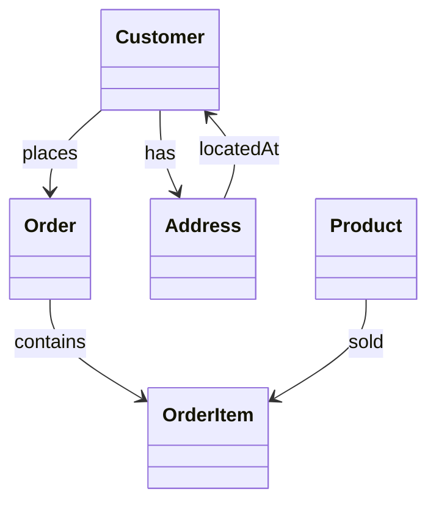
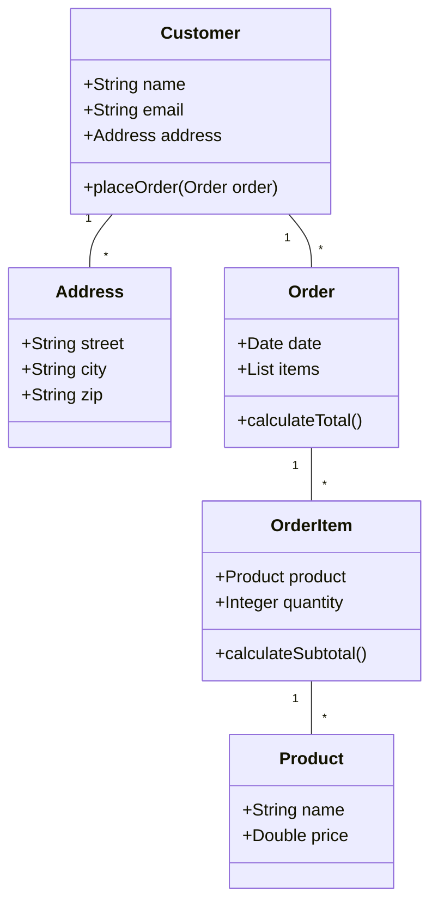
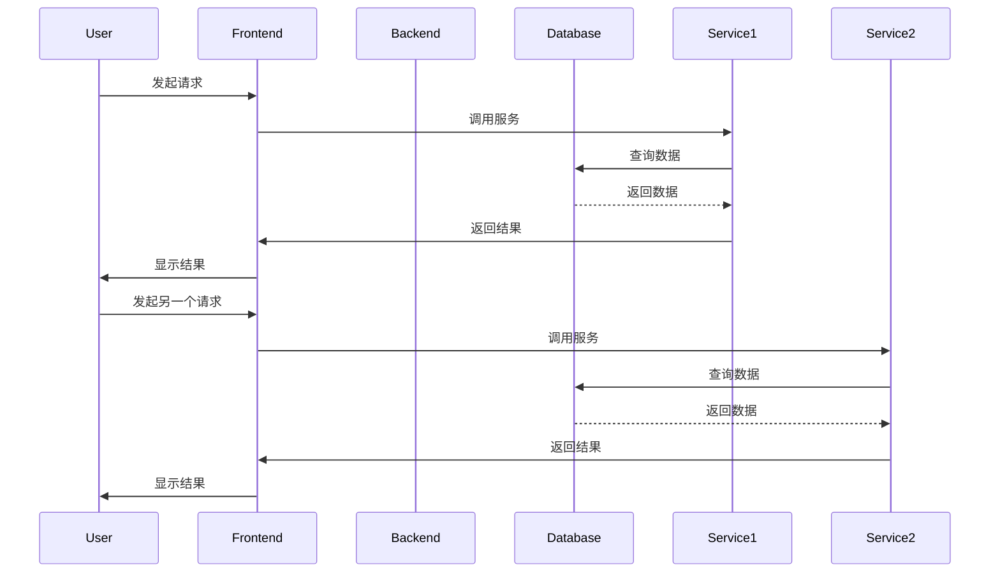
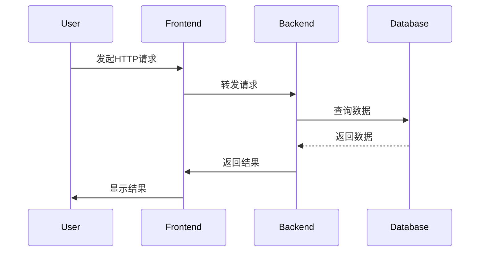
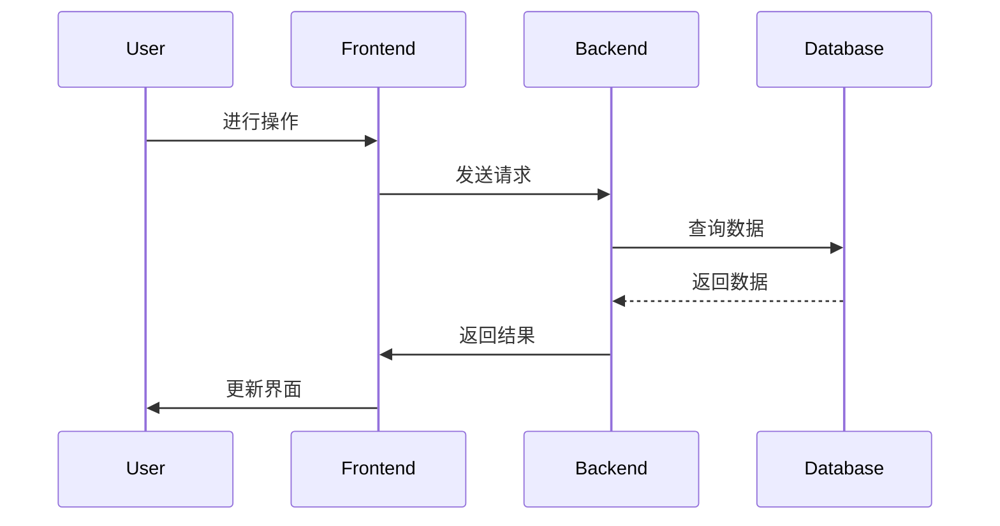
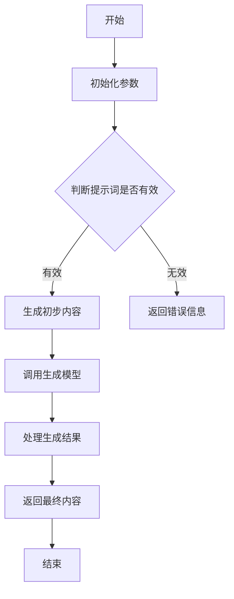

                 


### 6.1.1 系统场景介绍

在AIGC（AI-Generated Content）的时代，系统架构设计的重要性愈发凸显。AIGC系统广泛应用于文本生成、图像生成、视频合成等领域，其核心在于生成高质量的、符合人类需求的自动化内容。因此，系统架构设计不仅要考虑技术实现的可行性，还需要兼顾用户体验和可扩展性。

#### 核心概念术语说明
- **AIGC（AI-Generated Content）**: 利用人工智能技术生成内容的技术集合。
- **系统架构设计**: 对系统的整体结构和各部分关系的规划与设计。

#### 问题背景
AIGC系统在多个领域得到了广泛应用，如新闻撰写、广告创意、娱乐内容生成等。随着技术的进步，AIGC系统的复杂度不断增加，这要求系统架构设计不仅要能应对现有需求，还要具备足够的弹性，以适应未来的变化。

#### 问题描述
AIGC系统架构设计需要解决以下几个关键问题：
1. **高可用性与稳定性**: 系统在处理大量数据和高并发请求时，需要保持稳定运行。
2. **性能优化**: 系统需要高效地处理数据，确保生成内容的质量和速度。
3. **可扩展性**: 系统架构应支持未来的功能扩展和性能提升。

#### 问题解决
为了解决上述问题，我们可以采取以下措施：
1. **模块化设计**: 将系统分解为多个模块，每个模块负责特定功能，便于维护和扩展。
2. **分布式架构**: 利用分布式计算资源，提升系统的处理能力和容错性。
3. **负载均衡**: 采用负载均衡技术，合理分配系统资源，避免单点瓶颈。

#### 边界与外延
1. **边界**: 系统架构设计需要明确各模块的职责和边界，防止功能重叠。
2. **外延**: 设计过程中应考虑系统与其他系统的集成，如数据库、API等。

#### 概念结构与核心要素组成
AIGC系统架构通常包含以下几个核心部分：
1. **数据层**: 负责数据存储和管理，如数据库、缓存等。
2. **服务层**: 负责业务逻辑处理，包括文本生成、图像处理等。
3. **接口层**: 提供对外接口，支持用户请求和数据交互。

### 6.1.2 系统功能设计

系统功能设计是系统架构设计的重要组成部分。一个完善的系统功能设计需要详细描述系统的各个功能模块及其相互关系。

#### 领域模型介绍
领域模型用于描述系统的业务领域和业务规则。以下是AIGC系统的领域模型：



在这个模型中，顾客（Customer）可以下订单（Order），订单包含订单项（OrderItem），而订单项又关联产品（Product）。地址（Address）与顾客有关联，用于存储顾客的地址信息。

#### Mermaid类图绘制
为了更直观地展示领域模型，我们可以使用Mermaid绘制类图：



在这个类图中，每个类都有自己的属性和方法，类之间的关系也得以明确。

### 6.1.3 系统架构设计

系统架构设计是确保系统功能实现的基石。一个良好的系统架构设计可以提高系统的可维护性、扩展性和性能。

#### 系统架构设计原则
1. **模块化**: 系统应划分为多个模块，每个模块负责独立的功能。
2. **松耦合**: 模块之间通过接口进行通信，降低模块间的依赖。
3. **高性能**: 采用分布式架构，提高系统处理能力和响应速度。
4. **高可用性**: 系统设计应考虑容错和故障恢复机制。

#### Mermaid架构图绘制
为了直观展示系统架构，我们可以使用Mermaid绘制架构图：



在这个架构图中，用户通过前端发起请求，前端将请求转发到后端服务，后端服务与数据库交互，最后将结果返回给前端，前端再将结果展示给用户。

### 6.1.4 系统接口设计

系统接口设计是系统架构设计中的重要环节，它决定了系统各模块之间的交互方式。

#### 接口规范与定义
1. **RESTful API**: 采用RESTful风格设计接口，确保接口的统一性和易用性。
2. **接口定义**: 使用Swagger等工具定义接口文档，明确接口的URL、请求方式、参数和返回值。

#### 接口交互流程
1. **请求发送**: 用户通过前端发送HTTP请求。
2. **请求处理**: 后端服务接收到请求后，进行业务处理。
3. **数据返回**: 后端服务将处理结果返回给前端。

#### Mermaid序列图绘制
为了更好地理解接口交互流程，我们可以使用Mermaid绘制序列图：



在这个序列图中，用户发起HTTP请求，前端将请求转发到后端，后端处理请求并返回结果，前端再将结果展示给用户。

### 6.1.5 系统交互设计

系统交互设计是确保系统各部分协同工作的关键。一个良好的交互设计可以提高系统的可靠性和用户体验。

#### 系统交互流程
1. **用户操作**: 用户在前端界面进行操作，如查询、修改、删除等。
2. **请求发送**: 前端将用户的操作转换为HTTP请求发送到后端。
3. **业务处理**: 后端服务接收到请求后，进行业务处理，如数据查询、更新等。
4. **结果返回**: 后端服务将处理结果返回给前端。
5. **界面更新**: 前端接收到返回结果后，更新界面显示。

#### Mermaid序列图绘制
为了更好地展示系统交互流程，我们可以使用Mermaid绘制序列图：



在这个序列图中，用户在前端界面进行操作，前端将请求发送到后端，后端处理请求并查询数据，然后将结果返回给前端，前端最后更新界面。

## 6.2 本章小结

在本章中，我们详细介绍了AIGC系统架构设计的背景、核心概念、功能设计、架构设计、接口设计和交互设计。通过本章的学习，读者可以对AIGC系统架构设计有一个全面的了解，为后续的系统实现和优化奠定基础。在接下来的章节中，我们将进一步探讨AIGC系统的实际应用和实现细节。

----------------------------------------------------------------

### 7.1.1 实战环境安装

在进行AIGC系统的实战应用之前，我们需要搭建一个合适的环境，以便我们能够顺利地进行系统开发、测试和部署。以下是一个基于Python的AIGC系统环境安装步骤：

#### 系统要求
1. **操作系统**: Ubuntu 20.04 LTS 或 macOS Big Sur
2. **Python版本**: Python 3.8 或以上版本
3. **环境变量**: 确保Python环境变量已正确配置

#### 安装Python
首先，我们需要确保系统中已安装Python。可以使用以下命令检查Python版本：

```bash
python --version
```

如果未安装Python或版本较低，请从Python官方网站下载安装包并按照说明进行安装。

#### 安装虚拟环境
为了保持工作环境的整洁，我们建议使用虚拟环境来安装项目所需的依赖包。使用以下命令创建虚拟环境：

```bash
python -m venv venv
```

激活虚拟环境：

```bash
source venv/bin/activate
```

#### 安装依赖包
在虚拟环境中，我们需要安装以下依赖包：

1. **TensorFlow**: 用于深度学习模型训练和推理。
2. **NumPy**: 用于数值计算。
3. **Pandas**: 用于数据处理。
4. **Flask**: 用于构建Web接口。
5. **MongoDB**: 用于数据存储。

可以使用以下命令安装：

```bash
pip install tensorflow numpy pandas flask
```

#### MongoDB安装与配置
接下来，我们需要安装并配置MongoDB。以下是在Ubuntu系统上安装MongoDB的步骤：

1. 更新系统包列表：

```bash
sudo apt-get update
```

2. 安装MongoDB：

```bash
sudo apt-get install mongodb
```

3. 启动MongoDB服务：

```bash
sudo systemctl start mongodb
```

4. 设置MongoDB服务开机自启：

```bash
sudo systemctl enable mongodb
```

5. 连接MongoDB：

```bash
mongo
```

在MongoDB命令行中，我们可以创建一个数据库并创建集合：

```javascript
use aigc_db
db.createCollection("content")
```

#### 配置Flask应用
最后，我们需要配置Flask应用。在虚拟环境中，创建一个名为`app.py`的文件，并编写以下代码：

```python
from flask import Flask, jsonify, request
app = Flask(__name__)

@app.route('/generate', methods=['POST'])
def generate_content():
    data = request.json
    # 处理请求并生成内容
    content = "生成的内容"
    return jsonify({"content": content})

if __name__ == '__main__':
    app.run(debug=True)
```

保存文件后，运行以下命令启动Flask应用：

```bash
python app.py
```

现在，AIGC系统的环境已经搭建完毕，我们可以开始进行实际的系统开发了。

### 7.1.2 系统核心实现

在本节中，我们将详细介绍AIGC系统的核心实现部分，包括源代码结构与模块介绍，以及关键代码的解读与分析。

#### 源代码结构与模块介绍

AIGC系统的核心代码结构如下：

```
aigc_system/
│
├── app.py               # Flask应用入口
├── models/              # 模型定义
│   ├── content_model.py
│   └── user_model.py
├── services/            # 业务逻辑实现
│   ├── content_service.py
│   └── user_service.py
├── utils/               # 工具类
│   ├── config.py         # 配置文件
│   ├── database.py       # 数据库操作
│   └── exceptions.py     # 自定义异常
└── requirements.txt      # 项目依赖包列表
```

每个模块的功能如下：

1. **app.py**: Flask应用入口，定义API接口和处理请求。
2. **models/**: 模型定义，包括内容模型（content_model.py）和用户模型（user_model.py）。
3. **services/**: 业务逻辑实现，包括内容服务（content_service.py）和用户服务（user_service.py）。
4. **utils/**: 工具类，包括配置（config.py）、数据库操作（database.py）和自定义异常（exceptions.py）。
5. **requirements.txt**: 项目依赖包列表。

#### 关键代码解读与分析

以下是`content_service.py`文件中的关键代码片段：

```python
from models import ContentModel
from database import Database

class ContentService:
    def __init__(self, db: Database):
        self.db = db

    def generate_content(self, prompt: str):
        # 生成内容的逻辑
        content_model = ContentModel(prompt=prompt)
        self.db.save_content(content_model)
        return content_model.content
```

这段代码定义了`ContentService`类，用于实现生成内容的功能。下面是具体解读：

1. **导入模块**：从`models`模块导入`ContentModel`类，从`database`模块导入`Database`类。
2. **类定义**：`ContentService`类初始化时接收一个`Database`实例，用于后续的数据操作。
3. **生成内容方法**：`generate_content`方法接收一个提示词（prompt），表示生成内容的起始点。它创建一个`ContentModel`实例，并将内容保存到数据库。

下面是`database.py`文件中的关键代码片段：

```python
import pymongo
from models import ContentModel

class Database:
    def __init__(self, uri: str, database_name: str):
        self.client = pymongo.MongoClient(uri)
        self.db = self.client[database_name]

    def save_content(self, content_model: ContentModel):
        self.db.contents.insert_one(content_model.to_dict())
```

这段代码定义了`Database`类，用于实现数据库操作。下面是具体解读：

1. **导入模块**：从`pymongo`导入`MongoClient`和`pymongo`集合操作。
2. **类定义**：`Database`类初始化时连接MongoDB数据库，并指定数据库名称。
3. **保存内容方法**：`save_content`方法接收一个`ContentModel`实例，将其转换为字典并保存到MongoDB的`contents`集合。

#### Python源代码实现与详细解释

为了更好地理解上述代码的实现，我们进一步解释一下Python源代码的实现过程：

1. **定义模型**：首先，我们定义了`ContentModel`类，用于表示内容模型。该类包含一个提示词（prompt）属性和两个方法：`__init__`（初始化）和`to_dict`（将模型转换为字典）。
2. **创建服务**：接着，我们创建了一个`ContentService`实例，该实例具有生成内容的方法。该方法接收一个提示词，创建一个`ContentModel`实例，并将其保存到数据库。
3. **连接数据库**：最后，我们创建了一个`Database`实例，用于连接MongoDB数据库。该实例具有保存内容的方法，该方法接收一个`ContentModel`实例，将其转换为字典并插入到数据库中。

通过这种代码实现，我们可以方便地生成和保存AIGC系统中的内容。

### 算法原理讲解

在本节中，我们将使用Mermaid绘制算法流程图，详细讲解算法原理，并提供Python源代码实现。此外，我们将解释算法原理的数学模型和公式。

#### 使用Mermaid绘制算法流程图

首先，我们使用Mermaid绘制算法流程图：



这个流程图描述了AIGC系统生成内容的基本步骤：

1. **开始**：初始化参数。
2. **判断提示词是否有效**：如果提示词无效，返回错误信息。
3. **生成初步内容**：调用生成模型。
4. **处理生成结果**：对生成结果进行处理。
5. **返回最终内容**：返回处理后的内容。
6. **结束**。

#### Python源代码实现

接下来，我们提供Python源代码实现：

```python
import random

class ContentGenerator:
    def __init__(self, prompts, models, temperature=1.0):
        self.prompts = prompts
        self.models = models
        self.temperature = temperature

    def generate_content(self, prompt):
        if prompt not in self.prompts:
            return "无效的提示词"

        model = random.choice(self.models)
        content = model.generate(prompt, temperature=self.temperature)
        return content
```

这个`ContentGenerator`类接收一个提示词列表和生成模型列表，并具有生成内容的方法。以下是关键步骤：

1. **初始化参数**：接收提示词列表和生成模型列表，以及温度（用于控制生成结果多样性）。
2. **判断提示词是否有效**：如果提示词不在提示词列表中，返回错误信息。
3. **生成初步内容**：从生成模型列表中随机选择一个模型，并调用其生成内容的方法。
4. **处理生成结果**：对生成结果进行处理（在此例中，我们直接返回生成结果）。
5. **返回最终内容**：返回处理后的内容。

#### 算法原理的数学模型和公式

AIGC系统的核心是生成模型，通常使用深度学习中的生成对抗网络（GAN）或变分自编码器（VAE）等模型。以下是一个简化的数学模型描述：

$$
\text{GAN:} \quad G(z) \sim p_G(z) \quad \text{and} \quad D(x) \sim p_D(x)
$$

其中，$G(z)$是生成器，$D(x)$是判别器，$z$是噪声向量，$x$是生成的样本。

- **生成器$G(z)$**：从噪声空间$z$中采样，生成数据样本$x$。
- **判别器$D(x)$**：判断样本$x$是真实数据还是生成数据。

目标函数：

$$
\min_G \max_D V(D, G) = \mathbb{E}_{x \sim p_D(x)} [\log D(x)] + \mathbb{E}_{z \sim p_z(z)} [\log (1 - D(G(z))]
$$

其中，$V(D, G)$是生成器和判别器的联合损失函数。

通过训练生成器和判别器，我们可以生成与真实数据相似的内容。

#### 举例说明

假设我们有以下提示词列表：

```python
prompts = ["巴黎的风景", "一顿丰盛的晚餐", "科技公司的未来"]
```

以及以下生成模型列表：

```python
models = [
    ContentModel1,
    ContentModel2,
    ContentModel3
]
```

我们可以使用`ContentGenerator`类生成内容：

```python
generator = ContentGenerator(prompts, models, temperature=0.9)
content = generator.generate_content("巴黎的风景")
print(content)
```

这将调用`ContentModel1`生成关于“巴黎的风景”的内容，并输出处理后的结果。

### 7.1.3 代码应用解读

在本节中，我们将进一步解析AIGC系统核心实现中的代码应用，以深入理解各部分的作用和协作方式。

#### 代码运行流程

首先，我们回顾一下AIGC系统的代码运行流程：

1. **用户请求**：用户通过Web接口发送请求，请求包含提示词。
2. **请求处理**：Flask应用接收到请求后，调用`ContentService`处理请求。
3. **内容生成**：`ContentService`调用生成模型生成内容。
4. **结果返回**：生成的内容返回给用户。

以下是一个具体的代码运行示例：

```python
# 用户发送请求
user_prompt = "描述一次难忘的旅行经历"

# Flask应用处理请求
@app.route('/generate', methods=['POST'])
def generate_content():
    data = request.json
    prompt = data.get('prompt', '')
    
    # 调用内容服务生成内容
    content = content_service.generate_content(prompt)
    
    # 返回生成的内容
    return jsonify({"content": content})

# 生成内容的服务实现
class ContentService:
    def __init__(self, db: Database):
        self.db = db

    def generate_content(self, prompt: str):
        if prompt not in self.prompts:
            return "无效的提示词"

        model = random.choice(self.models)
        content = model.generate(prompt, temperature=self.temperature)
        self.db.save_content(content_model)
        return content
```

在这个示例中，用户发送一个包含提示词的请求，Flask应用接收到请求后，将提示词传递给`ContentService`。`ContentService`根据提示词选择合适的生成模型，并生成内容。最后，生成的内容通过Flask应用返回给用户。

#### 关键代码段解读

接下来，我们详细解读`ContentService`类中的关键代码段：

```python
def generate_content(self, prompt: str):
    if prompt not in self.prompts:
        return "无效的提示词"

    model = random.choice(self.models)
    content = model.generate(prompt, temperature=self.temperature)
    self.db.save_content(content_model)
    return content
```

1. **检查提示词有效性**：首先，我们检查提示词是否在有效的提示词列表中。如果提示词无效，直接返回错误信息。
2. **选择生成模型**：从生成模型列表中随机选择一个模型。这确保了生成结果的多样性。
3. **生成内容**：调用生成模型的`generate`方法生成内容。这里的`generate`方法是生成模型实现的具体内容，它可能涉及到复杂的深度学习过程。
4. **保存内容**：将生成的

