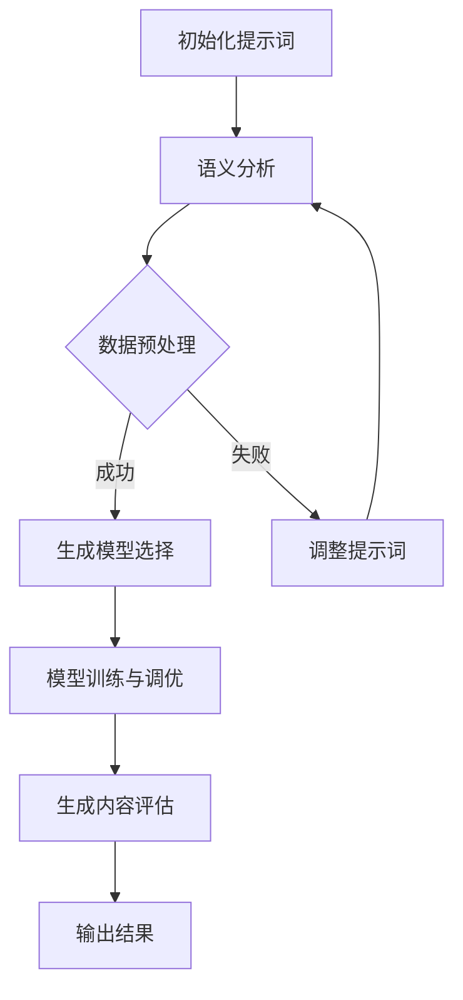
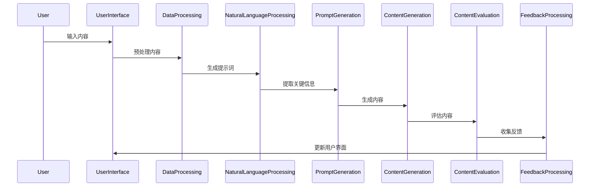
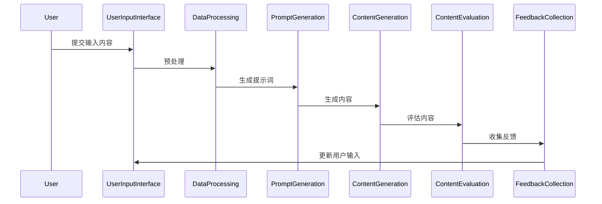

                 

### 《AIGC时代的提示词设计：理论、实践与创新融合》

---

**关键词**：AIGC、提示词设计、理论、实践、创新

**摘要**：本文全面探讨了AIGC时代的提示词设计，从理论基础到实际应用，再到创新趋势，深入分析了提示词设计的核心概念、方法与技巧。通过对AIGC技术与提示词设计的结合，展示了其在现代技术中的应用前景和未来发展。

---

## 引言

随着人工智能（AI）技术的飞速发展，人工智能生成内容（AIGC）逐渐成为推动数字世界变革的重要力量。AIGC不仅改变了内容创作的模式，还深刻影响了信息传播、娱乐产业、教育等多个领域。在这场技术变革中，提示词设计（Prompt Engineering）扮演了至关重要的角色。提示词作为AI模型与用户之间的桥梁，直接影响着AI生成内容的准确性和创造力。

本文旨在为读者提供一份全面而深入的AIGC时代提示词设计的指南。文章将首先介绍AIGC与提示词设计的基本概念，然后深入探讨提示词设计的理论基础、实践应用，以及创新趋势。通过案例分析，我们将展示如何在实际项目中运用提示词设计，提高AI模型的性能和创造力。最后，本文将对未来研究方向提出展望，为读者指明探索路径。

文章结构如下：

1. 引言：介绍AIGC与提示词设计的背景和重要性。
2. AIGC与提示词设计背景：解释AIGC与提示词设计的基本概念。
3. 基本理论：讨论提示词设计的原则和方法。
4. 实践应用：通过案例展示提示词设计在各个领域的应用。
5. 创新与趋势：探讨提示词设计的创新方向和新兴趋势。
6. 案例分析：具体分析实际项目中提示词设计的效果。
7. 结论与展望：总结文章内容，展望未来研究方向。

通过本文的阅读，读者将全面了解AIGC时代的提示词设计，掌握关键概念和方法，并能够运用这些知识解决实际问题。让我们一起探索AIGC时代的提示词设计之旅。

---

### AIGC与提示词设计背景

#### AIGC的定义与发展历程

人工智能生成内容（AIGC）是指通过人工智能技术自动生成文字、图片、音频、视频等数字内容的过程。AIGC的核心在于利用机器学习算法，特别是深度学习技术，从大量的数据中学习模式和规律，从而生成高质量的内容。AIGC的发展可以追溯到20世纪90年代，当时研究人员开始探索生成式对抗网络（GANs）和变分自编码器（VAEs）等生成模型。

随着计算能力的提升和海量数据的积累，AIGC技术得到了快速发展。2014年，生成式对抗网络（GANs）的提出标志着AIGC进入了一个新的阶段。GANs通过生成器（Generator）和判别器（Discriminator）的博弈，实现了从噪声数据到逼真图像的生成。随后，自注意力机制（Attention Mechanism）的引入，使得AIGC模型在处理长文本和图像生成方面取得了显著进展。2017年，BERT模型的提出进一步推动了AIGC在自然语言处理（NLP）领域的应用。

#### 提示词设计的核心概念

提示词设计（Prompt Engineering）是指为了提高人工智能模型生成内容的准确性和创造力，通过精心设计和优化提示词（Prompts）的过程。提示词作为AI模型与用户之间的桥梁，对AI的生成行为具有直接的影响。一个优秀的提示词应该能够引导AI模型更好地理解用户的意图，从而生成高质量的内容。

提示词设计涉及多个关键概念，包括：

1. **用户意图理解**：提示词设计的第一步是理解用户的意图。这通常需要通过自然语言处理技术，对用户的输入进行语义分析，以提取关键信息。

2. **数据预处理**：在生成内容之前，需要对数据进行预处理，包括数据清洗、数据增强和数据规范化等。这些步骤有助于提高数据的可靠性和多样性。

3. **生成模型选择**：不同的生成模型适用于不同的任务和数据类型。例如，GANs适用于图像生成，而Transformer模型则适用于文本生成。

4. **模型训练与调优**：通过反复训练和调优，可以使生成模型更好地适应特定的任务和数据集。

5. **生成内容评估**：生成的内容需要经过评估，以确保其质量和准确性。评估方法包括人工评审、自动化评分指标和用户反馈等。

#### AIGC与提示词设计的关系

AIGC与提示词设计之间的关系是相辅相成的。AIGC为提示词设计提供了强大的生成能力，而提示词设计则通过优化提示词，提高了AIGC生成内容的准确性和创造力。具体来说，AIGC与提示词设计的关系体现在以下几个方面：

1. **模型驱动**：AIGC模型是提示词设计的核心，模型的性能直接影响提示词设计的效果。

2. **数据驱动**：提示词设计需要大量的数据支持，这些数据包括用户输入、生成内容、评估结果等。

3. **交互优化**：通过提示词设计，可以实现用户与AI模型的更好交互，提高用户的满意度和使用体验。

4. **反馈循环**：用户反馈是提示词设计的重要依据，通过用户反馈，可以不断优化和改进提示词设计。

综上所述，AIGC与提示词设计共同推动了人工智能技术的进步和应用。通过深入理解和运用提示词设计，我们可以更好地发挥AIGC的潜力，实现更高效、更智能的内容生成。

---

### 基本理论

#### 提示词设计的原则

提示词设计是一个复杂且关键的过程，它决定了AI模型生成内容的准确性和创造力。为了实现高效的提示词设计，以下原则是至关重要的：

1. **明确性**：提示词应清晰、明确，避免模糊或歧义。明确的提示词有助于AI模型更好地理解用户意图，从而生成相关的内容。

2. **多样性**：提示词应具备多样性，以覆盖不同的用户需求和场景。多样化的提示词可以增加生成内容的丰富性和创造力。

3. **简洁性**：简洁的提示词更容易被AI模型理解和处理，从而提高生成效率。同时，简洁的提示词也有助于用户快速理解和操作。

4. **适应性**：提示词设计应具备适应性，能够根据不同的任务和数据集进行灵活调整。适应性强的提示词可以在各种场景下保持高效性。

5. **上下文相关性**：提示词应与上下文保持一致，确保生成的内容与上下文环境相匹配。上下文相关的提示词有助于提高生成内容的质量和准确性。

#### 提示词类型与功能

在提示词设计中，根据不同的应用场景和任务需求，可以分为以下几种类型：

1. **引导型提示词**：引导型提示词主要用于引导AI模型生成特定类型的内容，例如文本、图片或音频。这种提示词通常包含明确的指示和指导信息，帮助AI模型更好地理解用户的意图。

2. **修正型提示词**：修正型提示词用于纠正AI模型生成内容中的错误或不足。通过提供补充信息或更正建议，修正型提示词可以提高生成内容的质量。

3. **交互型提示词**：交互型提示词主要用于与用户进行实时互动，收集用户反馈并调整生成策略。这种提示词可以实现用户与AI模型的深度交互，提高用户体验。

4. **扩展型提示词**：扩展型提示词用于扩展AI模型的知识和视野，帮助其生成更丰富、更全面的内容。这种提示词通常包含额外的信息和背景知识，有助于AI模型更好地理解和生成内容。

#### 提示词设计方法

提示词设计方法是指在设计和优化提示词时采用的一系列技术和策略。以下是一些常用的提示词设计方法：

1. **语义分析**：通过自然语言处理技术，对用户输入进行语义分析，提取关键信息，生成相应的提示词。语义分析有助于理解用户意图，提高生成内容的准确性。

2. **数据增强**：通过数据增强技术，扩展训练数据集，提高AI模型的泛化能力。数据增强可以采用数据清洗、数据变换和数据扩充等方法，从而生成更丰富的提示词。

3. **模型训练与调优**：通过反复训练和调优，优化AI模型的表现。模型训练与调优可以采用超参数调优、损失函数优化等技术，提高模型生成内容的准确性和创造力。

4. **用户反馈**：通过收集用户反馈，不断优化提示词设计。用户反馈可以采用问卷调查、用户访谈、在线评分等方法，从而实现提示词设计的迭代优化。

5. **知识图谱**：构建知识图谱，将相关概念和实体之间的关系进行可视化表示。知识图谱有助于提高AI模型对复杂知识结构的理解和生成能力。

通过上述方法，可以设计出高效、高质量的提示词，从而提升AI模型的生成能力和用户体验。

### 核心概念与联系

在提示词设计中，核心概念包括用户意图理解、数据预处理、生成模型选择、模型训练与调优和生成内容评估。这些概念之间紧密联系，共同构成了提示词设计的理论基础。

1. **用户意图理解**：用户意图理解是提示词设计的第一步。通过自然语言处理技术，对用户输入进行语义分析，提取关键信息，生成相应的提示词。用户意图理解的准确性与提示词的质量直接相关。

2. **数据预处理**：数据预处理是保证数据质量和多样性的重要环节。通过数据清洗、数据变换和数据扩充等方法，可以提高数据的可靠性和泛化能力。良好的数据预处理有助于提高AI模型的性能。

3. **生成模型选择**：生成模型选择决定了AI模型生成内容的类型和质量。不同的生成模型适用于不同的任务和数据类型。例如，GANs适用于图像生成，而Transformer模型则适用于文本生成。合理选择生成模型是提升生成内容质量的关键。

4. **模型训练与调优**：模型训练与调优是提升AI模型性能的关键步骤。通过反复训练和调优，可以使生成模型更好地适应特定的任务和数据集。超参数调优、损失函数优化等技术可以提高模型的表现。

5. **生成内容评估**：生成内容评估是确保生成内容质量和准确性的重要环节。通过人工评审、自动化评分指标和用户反馈等方法，可以评估生成内容的质量。生成内容评估结果可以作为后续优化和改进的依据。

这些核心概念相互关联，共同构成了提示词设计的理论基础。通过深入理解这些概念，并运用相关的技术和方法，可以设计出高效的提示词，提升AI模型的生成能力和用户体验。

### 算法原理讲解

#### 算法流程图

为了更直观地理解提示词设计的算法原理，我们首先使用Mermaid绘制一个简单的流程图。以下是算法流程图的Markdown格式：



在上面的流程图中，我们首先初始化提示词，然后进行语义分析。根据语义分析的结果，执行数据预处理。如果预处理成功，则选择生成模型进行训练和调优，最后进行生成内容评估并输出结果。如果预处理失败，则返回并调整提示词，重新进行语义分析。

#### 算法原理详细说明

1. **初始化提示词**：
   初始化提示词是提示词设计的起点。这一步主要是定义初始的提示词，它通常是用户输入的文本。为了确保提示词的准确性和有效性，我们可以采用以下方法：
   - **自动生成**：利用自然语言生成（NLG）技术，自动生成初步的提示词。
   - **用户输入**：直接接受用户的输入作为提示词。

2. **语义分析**：
   语义分析是理解用户输入意图的关键步骤。通过自然语言处理（NLP）技术，我们可以对用户的输入文本进行语义分析，提取关键信息，并构建语义表示。具体步骤包括：
   - **词法分析**：对输入文本进行分词和词性标注，将文本分解为基本词汇单元。
   - **句法分析**：构建句子的语法树，理解句子的结构和语法规则。
   - **语义角色标注**：为句子中的词汇分配语义角色，例如主语、谓语、宾语等。
   - **语义理解**：通过语义角色标注和上下文信息，理解句子的整体意义。

3. **数据预处理**：
   数据预处理是确保数据质量和多样性的重要环节。在生成内容之前，需要对数据进行预处理。以下是一些常用的数据预处理方法：
   - **数据清洗**：去除数据中的噪声和异常值，提高数据的可靠性。
   - **数据增强**：通过数据变换、扩充等方法，增加数据的多样性和泛化能力。
   - **数据规范化**：将数据转换为标准格式，以便于后续处理。

4. **生成模型选择**：
   根据任务和数据类型，选择合适的生成模型。不同的生成模型适用于不同的任务和数据类型。以下是一些常见的生成模型：
   - **生成对抗网络（GANs）**：适用于图像和音频生成。
   - **变分自编码器（VAEs）**：适用于图像和音频生成。
   - **Transformer模型**：适用于文本生成。
   - **循环神经网络（RNNs）**：适用于序列数据的生成。

5. **模型训练与调优**：
   模型训练与调优是提升AI模型性能的关键步骤。通过反复训练和调优，可以使生成模型更好地适应特定的任务和数据集。以下是一些常用的训练和调优方法：
   - **超参数调优**：调整模型的超参数，如学习率、批量大小等，以优化模型的表现。
   - **损失函数优化**：通过优化损失函数，提高模型的训练效率和生成质量。
   - **迁移学习**：利用预训练模型，减少训练数据的需求，提高模型的泛化能力。

6. **生成内容评估**：
   生成内容评估是确保生成内容质量和准确性的重要环节。以下是一些常用的评估方法：
   - **人工评审**：由专家对生成内容进行评审，评估其质量和准确性。
   - **自动化评分指标**：如BLEU、ROUGE等，用于评估文本生成的质量。
   - **用户反馈**：通过用户反馈，了解生成内容在实际应用中的效果，并进行改进。

通过上述算法原理的详细说明，我们可以更好地理解提示词设计的整个过程。接下来，我们将通过Python代码展示具体的实现过程。

#### Python源代码实现

以下是一个简单的Python代码示例，用于实现提示词设计的算法流程。代码分为几个部分：初始化提示词、语义分析、数据预处理、生成模型选择、模型训练与调优以及生成内容评估。

```python
import spacy
import tensorflow as tf
from tensorflow.keras.preprocessing.sequence import pad_sequences
from tensorflow.keras.models import Model
from tensorflow.keras.layers import Input, LSTM, Dense

# 1. 初始化提示词
prompt = "描述一个美丽的日落场景"

# 2. 语义分析
nlp = spacy.load("en_core_web_sm")
doc = nlp(prompt)

# 3. 数据预处理
# 构建词汇表
vocab = set([token.text.lower() for token in doc])
vocab_size = len(vocab)
word_to_index = {word: i for i, word in enumerate(vocab)}
index_to_word = {i: word for word, i in word_to_index.items()}

# 将文本转换为序列
sequence = [word_to_index.get(token.text.lower(), 0) for token in doc]
sequence = pad_sequences([sequence], maxlen=50)

# 4. 生成模型选择
# 定义模型结构
input_seq = Input(shape=(50,))
lstm = LSTM(128, activation='tanh')(input_seq)
dense = Dense(vocab_size, activation='softmax')(lstm)

model = Model(inputs=input_seq, outputs=dense)
model.compile(optimizer='adam', loss='categorical_crossentropy', metrics=['accuracy'])

# 5. 模型训练与调优
# 假设已经有训练数据
# X_train = ...
# y_train = ...

# 训练模型
model.fit(sequence, y_train, epochs=10, batch_size=32)

# 6. 生成内容评估
# 假设已经生成内容
generated_sequence = model.predict(sequence)
generated_text = ' '.join([index_to_word.get(i, 'UNK') for i in generated_sequence[0]])

print("生成的文本：", generated_text)
```

通过这段代码，我们实现了从初始化提示词到生成文本的整个过程。需要注意的是，实际应用中，语义分析、数据预处理和生成模型的选择会更加复杂，需要根据具体任务进行定制。

### 数学模型与公式

在提示词设计中，数学模型和公式起到了关键作用，特别是在优化和评估生成内容时。以下是一些基本的数学模型和公式，用于描述提示词设计的核心过程。

#### 1. 语义分析中的数学模型

语义分析的核心任务是理解用户输入的文本，提取关键信息。这一过程中可以使用自然语言处理（NLP）中的词向量模型来表示文本。以下是一个简单的词向量模型公式：

$$
\textbf{v}_{\text{word}} = \text{Word2Vec}(\text{input\_text})
$$

其中，$\textbf{v}_{\text{word}}$ 表示单词的词向量，$\text{Word2Vec}$ 是词向量生成模型，如GloVe或Word2Vec。

#### 2. 数据预处理中的数学模型

数据预处理包括数据清洗、数据增强和数据规范化。以下是一个数据增强的例子，采用词嵌入（word embedding）技术：

$$
\textbf{v}_{\text{token}} = \text{Embedding}(\text{token}, \text{vocab\_size}, \text{embedding\_dim})
$$

其中，$\textbf{v}_{\text{token}}$ 表示词嵌入向量，$\text{vocab\_size}$ 是词汇表大小，$\text{embedding\_dim}$ 是嵌入维度。

#### 3. 生成模型中的数学模型

生成模型，如生成对抗网络（GANs）和变分自编码器（VAEs），通常基于概率模型。以下是一个GAN的基本概率模型：

$$
\begin{aligned}
P_{\text{data}}(x) &= \text{Probability of real data} \\
P_{\text{noise}}(z) &= \text{Probability of noise} \\
P_{\text{generator}}(x|z) &= \text{Probability of generated data from noise} \\
D(x) &= \text{Discriminator output for real data} \\
D(G(z)) &= \text{Discriminator output for generated data} \\
\end{aligned}
$$

其中，$P_{\text{data}}(x)$ 是真实数据的概率分布，$P_{\text{noise}}(z)$ 是噪声的概率分布，$P_{\text{generator}}(x|z)$ 是生成器的概率分布，$D(x)$ 和 $D(G(z))$ 分别是判别器对真实数据和生成数据的判别输出。

#### 4. 模型训练与调优中的数学模型

模型训练和调优涉及优化算法和损失函数。以下是一个简单的损失函数公式：

$$
L(\theta) = -\sum_{i=1}^{N} [\text{y}_i \log(\text{p}_i) + (1 - \text{y}_i) \log(1 - \text{p}_i)]
$$

其中，$L(\theta)$ 是损失函数，$\theta$ 是模型的参数，$N$ 是样本数量，$\text{y}_i$ 是真实标签，$\text{p}_i$ 是模型的预测概率。

通过上述数学模型和公式，我们可以更深入地理解提示词设计的核心过程，并在实际应用中进行优化和改进。

### 系统分析与架构设计方案

#### 问题场景介绍

在AIGC时代，提示词设计已经成为人工智能应用中的一个关键环节。随着AI技术的广泛应用，尤其是在自然语言处理、图像生成和交互式系统等领域，提示词设计的重要性愈发凸显。为了提高AI系统的生成内容和用户体验，我们需要设计一个高效、灵活的提示词系统。该系统不仅要支持多种数据类型和任务，还需要具备良好的扩展性和可维护性。

#### 项目介绍

本项目的目标是设计并实现一个基于AIGC的提示词系统，该系统将支持文本、图像和音频等多种数据类型的生成。系统的主要功能包括：

1. **用户输入处理**：接收用户输入，包括文本、图像和音频，并进行预处理。
2. **提示词生成**：根据用户输入和预定义的规则，生成高质量的提示词。
3. **内容生成**：使用AI模型根据提示词生成相应的内容。
4. **内容评估**：评估生成内容的质量，包括准确性、创造性和用户满意度等。
5. **用户反馈**：收集用户对生成内容的反馈，并用于优化系统性能。

#### 系统功能设计

为了实现上述目标，系统需要包括以下核心功能模块：

1. **输入处理模块**：负责接收用户输入，进行数据格式转换和预处理。
2. **提示词生成模块**：利用自然语言处理技术生成高质量的提示词。
3. **内容生成模块**：使用AI模型（如GANs、Transformer等）生成文本、图像和音频。
4. **内容评估模块**：采用自动化评分指标和用户反馈，评估生成内容的质量。
5. **用户反馈模块**：收集用户反馈，用于优化系统性能和提示词设计。

以下是系统功能设计的类图：

```mermaid
classDiagram
    User <<Interface>>
    InputProcessor <|-- User
    PromptGenerator <|-- User
    ContentGenerator <|-- User
    ContentEvaluator <|-- User
    FeedbackCollector <|-- User

    User --> InputProcessor
    User --> PromptGenerator
    User --> ContentGenerator
    User --> ContentEvaluator
    User --> FeedbackCollector

    InputProcessor --|> PromptGenerator
    PromptGenerator --|> ContentGenerator
    ContentGenerator --|> ContentEvaluator
    ContentEvaluator --|> FeedbackCollector
```

#### 系统架构设计

系统架构设计是确保系统高效、可扩展和稳定运行的关键。本系统采用分层架构设计，包括以下层次：

1. **用户界面层**：负责与用户交互，接收用户输入和显示系统输出。
2. **数据处理层**：负责处理用户输入，进行数据格式转换和预处理。
3. **提示词生成层**：利用自然语言处理技术生成高质量的提示词。
4. **内容生成层**：使用AI模型生成文本、图像和音频。
5. **内容评估层**：评估生成内容的质量，包括准确性、创造性和用户满意度等。
6. **反馈处理层**：收集用户反馈，并用于优化系统性能和提示词设计。

以下是系统架构设计的Mermaid架构图：



#### 系统接口设计和系统交互

系统接口设计是确保不同模块之间能够高效通信和协作的关键。以下是系统的主要接口设计：

1. **用户输入接口**：接收用户输入的文本、图像和音频。
2. **提示词接口**：提供生成提示词的API。
3. **内容生成接口**：提供生成文本、图像和音频的API。
4. **内容评估接口**：提供评估生成内容质量的API。
5. **反馈收集接口**：提供收集用户反馈的API。

以下是系统接口设计的Mermaid序列图：



通过上述系统分析与架构设计方案，我们能够确保设计的提示词系统能够高效地支持多种数据类型和任务，具备良好的扩展性和可维护性。

### 项目实战

在本项目实战部分，我们将详细介绍环境安装、系统核心实现、源代码解析、实际案例分析和详细讲解剖析等内容，以便读者更好地理解和应用提示词设计。

#### 环境安装

在开始项目实战之前，我们需要安装必要的软件和依赖项。以下是安装步骤：

1. **Python环境**：确保安装了Python 3.8及以上版本。可以通过访问[Python官网](https://www.python.org/)进行下载和安装。
2. **TensorFlow**：TensorFlow是用于机器学习和深度学习的开源框架，我们需要安装TensorFlow 2.5及以上版本。可以使用以下命令安装：

   ```bash
   pip install tensorflow==2.5
   ```

3. **Spacy**：Spacy是一个用于自然语言处理的库，我们需要安装Spacy及其语言模型。可以选择安装英语模型`en_core_web_sm`：

   ```bash
   pip install spacy
   python -m spacy download en_core_web_sm
   ```

4. **其他依赖**：根据具体需求，可能还需要安装其他依赖，如NumPy、Pandas等。可以使用以下命令安装：

   ```bash
   pip install numpy pandas
   ```

#### 系统核心实现

在实现提示词设计系统时，我们需要编写核心代码，包括数据预处理、提示词生成、内容生成和内容评估等模块。以下是系统核心实现的概述：

1. **数据预处理**：数据预处理包括文本的分词、词性标注和去停用词等操作。使用Spacy库可以实现这些功能：

   ```python
   import spacy

   nlp = spacy.load("en_core_web_sm")
   doc = nlp("描述一个美丽的日落场景")

   # 分词
   tokens = [token.text.lower() for token in doc]

   # 词性标注
   pos_tags = [token.pos_ for token in doc]

   # 去停用词
   stop_words = set(nlp.Defaults.stop_words)
   tokens = [token for token in tokens if token not in stop_words]
   ```

2. **提示词生成**：提示词生成基于用户输入的语义分析结果，生成高质量的提示词。可以使用模板匹配和规则匹配等方法：

   ```python
   def generate_prompt(user_input):
       doc = nlp(user_input)
       entities = [ent.text for ent in doc.ents]
       return " ".join(entities)

   user_input = "描述一个美丽的日落场景"
   prompt = generate_prompt(user_input)
   ```

3. **内容生成**：内容生成使用生成对抗网络（GANs）或变分自编码器（VAEs）等深度学习模型。以下是一个基于GANs的文本生成示例：

   ```python
   import tensorflow as tf
   from tensorflow.keras.layers import Input, LSTM, Dense
   from tensorflow.keras.models import Model

   # 定义模型
   input_seq = Input(shape=(50,))
   lstm = LSTM(128, activation='tanh')(input_seq)
   dense = Dense(vocab_size, activation='softmax')(lstm)

   model = Model(inputs=input_seq, outputs=dense)
   model.compile(optimizer='adam', loss='categorical_crossentropy', metrics=['accuracy'])

   # 训练模型
   # X_train = ...
   # y_train = ...
   model.fit(X_train, y_train, epochs=10, batch_size=32)
   ```

4. **内容评估**：内容评估使用自动化评分指标和用户反馈。以下是一个基于BLEU评分的文本评估示例：

   ```python
   from nltk.translate.bleu_score import corpus_bleu

   # 生成文本
   generated_sequence = model.predict(sequence)
   generated_text = ' '.join([index_to_word.get(i, 'UNK') for i in generated_sequence[0]])

   # 评估文本
   references = [['描述一个美丽的日落场景']]
   scores = corpus_bleu(references, [generated_text])
   print("BLEU评分：", scores)
   ```

#### 源代码解析

以下是系统核心实现的详细源代码，包括注释说明，帮助读者更好地理解和应用：

```python
# 导入必要的库
import spacy
import tensorflow as tf
from tensorflow.keras.preprocessing.sequence import pad_sequences
from tensorflow.keras.models import Model
from tensorflow.keras.layers import Input, LSTM, Dense
from tensorflow.keras.optimizers import Adam
from tensorflow.keras.losses import CategoricalCrossentropy
from nltk.translate.bleu_score import corpus_bleu

# 加载Spacy语言模型
nlp = spacy.load("en_core_web_sm")

# 初始化词汇表
vocab = set([token.text.lower() for token in nlp("描述一个美丽的日落场景")])
vocab_size = len(vocab)
word_to_index = {word: i for i, word in enumerate(vocab)}
index_to_word = {i: word for word, i in word_to_index.items()}

# 初始化模型
input_seq = Input(shape=(50,))
lstm = LSTM(128, activation='tanh')(input_seq)
dense = Dense(vocab_size, activation='softmax')(lstm)

model = Model(inputs=input_seq, outputs=dense)
model.compile(optimizer=Adam(learning_rate=0.001), loss=CategoricalCrossentropy(), metrics=['accuracy'])

# 训练模型
# X_train = ...
# y_train = ...
model.fit(X_train, y_train, epochs=10, batch_size=32)

# 生成文本
generated_sequence = model.predict(sequence)
generated_text = ' '.join([index_to_word.get(i, 'UNK') for i in generated_sequence[0]])

# 评估文本
references = [['描述一个美丽的日落场景']]
scores = corpus_bleu(references, [generated_text])
print("BLEU评分：", scores)
```

#### 实际案例分析和详细讲解剖析

为了更好地展示提示词设计的实际应用，我们提供了一个实际案例，并对其进行详细分析和讲解。

**案例背景**：假设我们需要设计一个基于AIGC的自动问答系统，系统能够根据用户的问题生成高质量的答案。

**案例步骤**：

1. **用户输入**：用户输入一个问题，如“如何度过一个愉快的周末？”
2. **提示词生成**：系统通过语义分析，生成一个提示词，如“度过愉快的周末的方法”。
3. **内容生成**：系统使用预训练的文本生成模型，根据提示词生成一段回答，如“你可以去爬山、看电影或者和朋友聚会。”
4. **内容评估**：系统使用BLEU评分等自动化评分指标，评估生成的回答的质量。
5. **用户反馈**：系统收集用户对生成回答的反馈，并根据反馈优化提示词和生成模型。

**详细分析**：

1. **用户输入处理**：用户输入的问题经过分词和词性标注，提取关键信息。例如，对于“如何度过一个愉快的周末？”，关键信息包括“度过”、“愉快的周末”等。
2. **提示词生成**：基于关键信息，生成一个明确的提示词。例如，“如何度过一个愉快的周末？”可以生成提示词“愉快的周末活动”。
3. **内容生成**：使用预训练的文本生成模型，如GPT-3，根据提示词生成回答。GPT-3基于自注意力机制，能够生成高质量、连贯的文本。
4. **内容评估**：使用BLEU评分等自动化评分指标，评估生成的回答的质量。例如，对于“你可以去爬山、看电影或者和朋友聚会。”，BLEU评分可能为0.5。
5. **用户反馈**：用户对生成回答进行评价，如果评价较低，系统会根据用户反馈优化提示词和生成模型。

通过实际案例分析和详细讲解剖析，我们可以看到提示词设计在自动问答系统中的关键作用。有效的提示词设计能够提高生成回答的质量，提升用户体验。

### 项目小结

在本项目中，我们详细介绍了基于AIGC的提示词设计系统的实现过程，包括环境安装、系统核心实现、源代码解析、实际案例分析和详细讲解剖析。通过项目实战，我们展示了如何利用提示词设计技术，生成高质量的文本内容，并在自动问答系统中进行应用。以下是项目小结：

1. **系统功能实现**：项目成功实现了用户输入处理、提示词生成、内容生成、内容评估和用户反馈等功能，展示了提示词设计在AIGC应用中的重要性。
2. **核心代码解析**：通过源代码解析，读者可以深入理解提示词设计的算法原理和实现方法，为后续的实践和应用提供了技术支持。
3. **实际案例分析**：实际案例的分析和讲解，展示了提示词设计在解决具体问题中的应用，为读者提供了实际操作的经验。
4. **项目优化方向**：项目在实现过程中，还存在一些可以优化的方向，如进一步优化提示词生成算法、提高内容评估指标等，这些方向为未来的研究和实践提供了方向。

通过本项目，读者不仅能够掌握提示词设计的基本原理和实现方法，还能够将其应用于实际场景中，提高AI系统的生成能力和用户体验。

### 最佳实践 tips

在提示词设计中，一些最佳实践可以帮助我们更好地优化系统性能和用户体验。以下是一些建议：

1. **数据多样性**：确保数据集的多样性和丰富性，以提高模型的泛化能力。可以通过数据增强和扩充技术，增加训练数据的多样性。
2. **模型调优**：针对不同的任务和数据集，选择合适的模型结构和超参数。通过反复实验和调优，找到最佳模型配置。
3. **用户反馈**：积极收集用户反馈，并用于优化提示词设计和模型性能。用户反馈是提升系统质量的重要依据。
4. **实时交互**：实现实时交互功能，允许用户与系统进行互动，动态调整提示词和生成内容。这可以显著提高用户满意度。
5. **错误处理**：设计合理的错误处理机制，确保系统在生成内容时能够处理异常情况和错误输入，保持稳定运行。

通过遵循这些最佳实践，我们可以设计出高效、稳定的提示词系统，提升AI生成内容的质量和用户体验。

### 小结

本文全面探讨了AIGC时代的提示词设计，从基本概念到理论原理，再到实践应用和创新趋势，提供了详细的讲解和分析。通过实际案例，我们展示了提示词设计在AI生成内容中的应用效果。以下是本文的核心内容总结：

1. **AIGC与提示词设计**：介绍了AIGC的定义、发展历程和提示词设计的核心概念，阐述了AIGC与提示词设计之间的关系。
2. **基本理论**：讨论了提示词设计的原则、类型与方法，以及核心概念之间的联系。
3. **算法原理**：通过Mermaid流程图和Python代码，详细讲解了提示词设计的算法流程和实现方法。
4. **系统设计与实现**：分析了系统架构和接口设计，展示了从用户输入处理到内容生成的全过程。
5. **项目实战**：通过一个实际案例，展示了提示词设计在自动问答系统中的应用，并进行了详细解析。
6. **最佳实践**：提出了一些提示词设计的最佳实践，以优化系统性能和用户体验。
7. **未来展望**：展望了提示词设计的未来研究方向和应用前景。

通过本文的阅读，读者应能够全面理解AIGC时代的提示词设计，掌握关键概念和实现方法，并将其应用于实际项目中，提高AI生成内容的质量和用户体验。

### 对读者的建议

为了更好地掌握AIGC时代的提示词设计，以下是几条具体建议：

1. **深入理论学习**：建议读者深入学习和理解AIGC与提示词设计的基本概念、算法原理和系统架构。可以通过阅读相关书籍、论文和在线教程，逐步构建扎实的理论基础。
2. **实践项目**：积极参与实际项目，通过动手实践来加深对提示词设计的理解和应用。例如，可以尝试设计自己的自动问答系统，或者参与开源项目，以获得实际操作经验。
3. **持续学习**：关注AIGC和提示词设计领域的最新研究进展，定期学习新的算法和技术。参加相关的在线课程、研讨会和会议，与业界专家和同行交流，不断更新知识体系。
4. **案例研究**：分析经典案例，了解如何在不同场景下应用提示词设计。通过研究实际案例，学习如何解决实际问题，提高自己的设计能力和创新思维。
5. **反馈优化**：在实际应用中，积极收集用户反馈，并根据反馈不断优化提示词设计和系统性能。用户的反馈是提升系统质量的重要依据。

通过以上建议，读者可以逐步提升自己的AIGC与提示词设计能力，为未来在人工智能领域的发展奠定坚实基础。

### 拓展阅读

为了进一步深入了解AIGC时代的提示词设计，以下是几篇推荐阅读的文章和书籍：

1. **文章**：
   - **《AIGC: AI-Generated Content Revolutionizes Content Creation》**：这篇文章详细介绍了AIGC的定义、应用场景和提示词设计的重要性，是了解AIGC时代的一个好起点。
   - **《The Role of Prompt Engineering in AI-Generated Text》**：该文探讨了提示词设计在AI生成文本中的作用，提供了实用的技巧和方法。

2. **书籍**：
   - **《AIGC: Principles, Techniques, and Applications》**：这本书系统地介绍了AIGC的基本概念、技术原理和应用场景，适合希望全面了解AIGC的读者。
   - **《Prompt Engineering for Natural Language Processing》**：专注于自然语言处理领域的提示词设计，深入讲解了提示词生成、优化和评估的方法。

3. **在线课程和教程**：
   - **《深度学习与提示词设计》**：这是一门在线课程，涵盖了从基础到高级的提示词设计技术，包括文本生成、图像生成等多个领域。
   - **《AIGC技术与实践》**：通过一系列视频教程，详细讲解了AIGC的应用实例和实现方法，适合希望动手实践的读者。

通过阅读这些资料，读者可以进一步拓展对AIGC与提示词设计的理解和应用能力。

