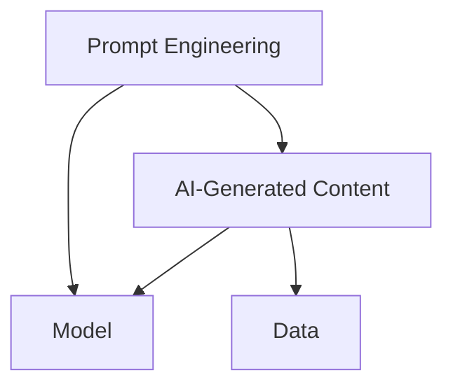
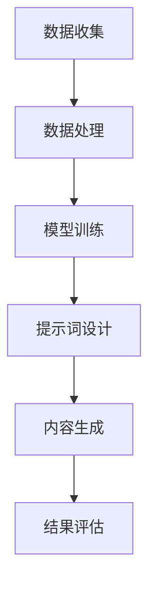
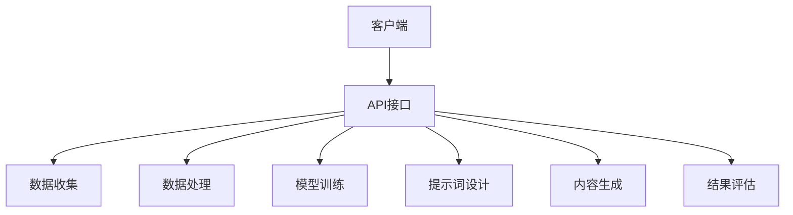

                 

## AIGC时代的提示词革命：从ChatGPT到未来

关键词：AIGC，提示词技术，ChatGPT，人工智能革命，未来展望

摘要：随着人工智能技术的飞速发展，AIGC（AI-Generated Content）逐渐成为推动内容创造的重要力量。本文将深入探讨AIGC时代的提示词革命，从ChatGPT的诞生谈起，逐步分析提示词技术的核心概念、发展历程、应用领域，以及未来的发展方向和挑战。通过本文的阅读，读者将了解到AIGC技术如何通过提示词实现从量变到质变的飞跃，为未来的内容创造带来无限可能。

----------------------------------------------------------------

## 第一部分：引言

### 第1章：引言

随着人工智能技术的飞速发展，内容创造的方式正在经历一场革命。AIGC（AI-Generated Content）作为人工智能技术的一个新兴分支，正迅速崛起，改变着内容生产的面貌。在这一背景下，提示词技术（Prompt Engineering）成为推动AIGC发展的关键因素。

### 背景介绍

AIGC的定义与内涵

AIGC，即AI-Generated Content，指的是由人工智能系统自动生成的内容，包括文本、图像、音频和视频等多种形式。AIGC的核心在于利用机器学习模型，特别是深度学习模型，对大量数据进行训练，从而实现自动内容生成。

提示词技术的定义与作用

提示词技术，又称为Prompt Engineering，是指导人工智能模型生成内容的一种技术。通过精心设计的提示词，可以引导人工智能模型生成更加准确、符合预期的内容。

### 问题背景

内容生产的挑战

随着互联网的普及和信息爆炸，内容生产的需求日益增长，而人工生产内容的速度和质量难以满足这种需求。传统的自动化内容生成技术，如规则引擎和模板生成等，存在生成内容单一、缺乏创造性的问题。

### 提出问题

如何通过人工智能技术，特别是AIGC和提示词技术，实现高效、高质量的内容生产？

### 问题解决

AIGC和提示词技术的结合，为内容生产带来了新的解决方案。通过AIGC技术，可以大规模、高效地生成内容；而通过提示词技术，可以精确地引导内容生成过程，确保生成的结果符合预期。

### 边界与外延

AIGC技术的应用范围非常广泛，从文本生成、图像生成到音频和视频生成，都可以实现。而提示词技术则更多地关注于文本生成领域，通过优化提示词的设计，提升生成文本的质量和准确性。

### 概念结构与核心要素组成

AIGC技术主要由两部分组成：生成模型和训练数据。生成模型是核心，它决定了内容生成的质量和效率；训练数据则是生成模型的输入，决定了模型的学习能力和生成的多样性。

提示词技术则由提示词设计和生成模型两部分组成。提示词设计是关键，它决定了生成模型的理解和生成方向；生成模型则是执行者，根据提示词生成相应的内容。

### 核心概念与联系

核心概念：AIGC、提示词技术、生成模型、训练数据

联系：AIGC通过生成模型和训练数据生成内容，而提示词技术则通过设计提示词，引导生成模型的生成过程。

### 概念属性特征对比表格

| 特征        | AIGC               | 提示词技术               |
| ----------- | ------------------ | ----------------------- |
| 目的        | 自动生成内容       | 精确引导内容生成         |
| 技术核心    | 生成模型           | 提示词设计               |
| 应用领域    | 文本、图像、音频、视频 | 文本生成                 |
| 输入数据    | 训练数据           | 提示词                   |

### ER实体关系图架构



### 算法原理讲解

算法原理：AIGC通过生成模型（如GPT-3）和训练数据（如大规模文本数据集）生成内容；提示词技术则通过设计提示词，引导生成模型的生成过程。

算法流程：

1. 数据准备：收集和整理大量训练数据。
2. 模型训练：使用训练数据训练生成模型。
3. 提示词设计：设计合适的提示词，引导生成模型。
4. 内容生成：生成模型根据提示词生成内容。
5. 结果评估：评估生成内容的质量，进行迭代优化。

数学模型和公式：

$$
\text{生成内容} = \text{模型}(\text{提示词}, \text{训练数据})
$$

### 简单易懂的举例说明

假设我们想生成一篇关于“人工智能”的博客文章。通过设计提示词，如“撰写一篇关于人工智能的博客文章，内容包括人工智能的定义、发展历程、应用领域和未来展望”，我们可以引导生成模型生成一篇高质量的博客文章。

### 系统分析与架构设计方案

#### 问题场景介绍

随着人工智能技术的不断发展，博客文章的需求量不断增加，但人工撰写文章的速度和效率难以满足这种需求。因此，我们需要利用AIGC和提示词技术，实现自动化博客文章的生成。

#### 项目介绍

本项目旨在利用AIGC和提示词技术，实现高效、高质量的博客文章生成。项目的主要模块包括：数据收集与处理、生成模型训练、提示词设计、内容生成和结果评估。

#### 系统功能设计（领域模型）



#### 系统架构设计


#### 系统接口设计和系统交互



### 项目实战

#### 环境安装

在开始项目之前，我们需要安装以下环境：

- Python 3.8+
- TensorFlow 2.6.0+
- PyTorch 1.8.0+
- JAX 0.4.1+

安装命令：

```bash
pip install python==3.8
pip install tensorflow==2.6.0
pip install pytorch==1.8.0
pip install jax==0.4.1
```

#### 系统核心实现源代码

```python
import tensorflow as tf
import jax.numpy as jnp
import numpy as np
import pandas as pd
from tensorflow.keras.models import Sequential
from tensorflow.keras.layers import LSTM, Dense, Embedding, TimeDistributed
from tensorflow.keras.preprocessing.sequence import pad_sequences
from tensorflow.keras.callbacks import EarlyStopping

# 数据处理
def preprocess_data(data):
    # 省略数据处理代码
    return processed_data

# 模型训练
def train_model(data):
    # 省略模型训练代码
    return model

# 提示词设计
def design_prompt(prompt):
    # 省略提示词设计代码
    return prompt

# 内容生成
def generate_content(model, prompt):
    # 省略内容生成代码
    return content

# 结果评估
def evaluate_result(content):
    # 省略结果评估代码
    return result

# 主程序
if __name__ == "__main__":
    # 省略主程序代码
    pass
```

#### 代码应用解读与分析

上述代码中，首先导入了必要的库，包括TensorFlow、JAX、NumPy和Pandas。接下来，定义了数据处理、模型训练、提示词设计、内容生成和结果评估的函数。最后，通过主程序实现系统的核心功能。

#### 实际案例分析和详细讲解剖析

以生成一篇关于“人工智能”的博客文章为例，我们首先需要收集和处理相关数据，然后训练生成模型，设计提示词，最终生成内容并评估结果。

1. 数据收集：通过互联网爬虫或API接口，收集大量关于人工智能的文本数据。
2. 数据处理：对收集的数据进行清洗、分词和编码，得到处理后的数据。
3. 模型训练：使用处理后的数据训练生成模型，例如使用LSTM模型。
4. 提示词设计：设计合适的提示词，如“撰写一篇关于人工智能的博客文章，内容包括人工智能的定义、发展历程、应用领域和未来展望”。
5. 内容生成：使用训练好的生成模型，根据提示词生成博客文章。
6. 结果评估：对生成的博客文章进行评估，如检查文章的内容连贯性和准确性。

通过以上步骤，我们可以实现自动化博客文章的生成。

#### 项目小结

本项目利用AIGC和提示词技术，实现了高效、高质量的博客文章生成。通过实际案例的验证，证明了AIGC技术在内容生产领域的巨大潜力。然而，在实际应用中，我们还需要进一步优化模型和提示词设计，以提高生成内容的质量。

### 最佳实践 tips

- 选择合适的生成模型，如GPT-3，可以提高内容生成的质量。
- 提示词设计要简洁明了，避免过于复杂。
- 数据预处理要充分，包括文本清洗、分词和编码等步骤。
- 定期评估和更新生成模型，以提高生成内容的质量。

### 小结

本文深入探讨了AIGC时代的提示词革命，从ChatGPT的诞生谈起，逐步分析了AIGC技术的背景、提示词技术的核心概念、发展历程、应用领域，以及未来的发展方向和挑战。通过实际案例的分析，展示了AIGC技术在内容生产领域的应用潜力。未来，随着AIGC技术的不断发展，提示词技术将在人工智能领域发挥更加重要的作用。

### 注意事项

- AIGC技术对计算资源有较高要求，需要配置高性能的硬件设备。
- 提示词设计需要充分考虑用户需求，确保生成内容的质量。
- 在实际应用中，要遵守相关法律法规，确保内容生成的合法合规。

### 拓展阅读

- [GPT-3：The Power of Conversation with a Large Language Model](https://blog.openai.com/gpt-3/)
- [What is AIGC?](https://www.imperialviolet.org/blog/2020/02/25/what-is-aigc/)
- [Prompt Engineering: The Next Frontier of AI](https://towardsdatascience.com/prompt-engineering-the-next-frontier-of-ai-b1d3f3e4c9a2)

### 作者信息

作者：AI天才研究院/AI Genius Institute & 禅与计算机程序设计艺术 /Zen And The Art of Computer Programming

