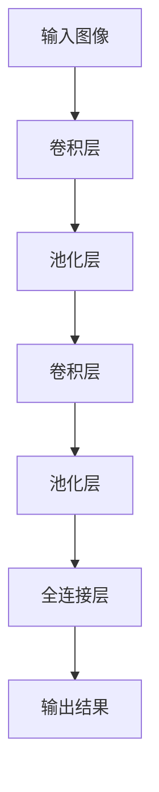
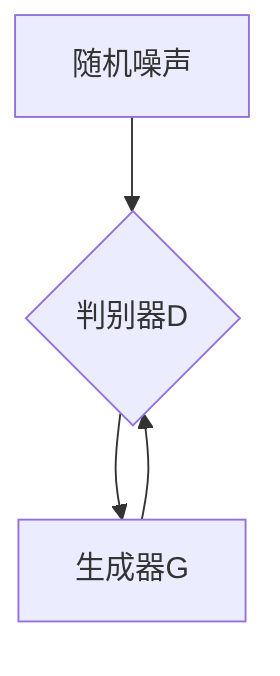
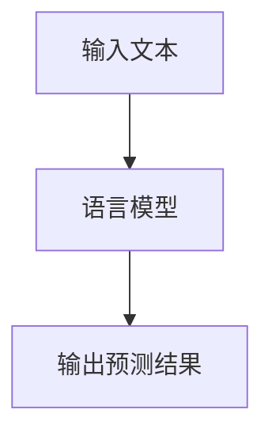
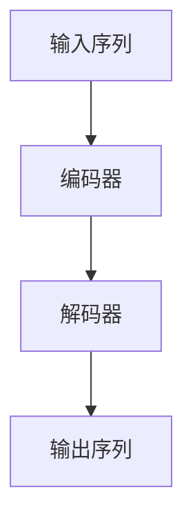
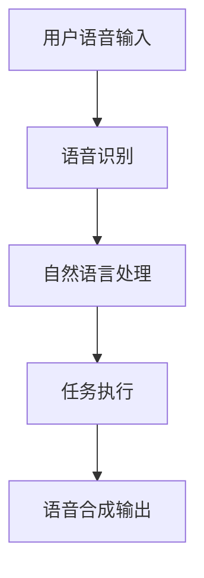
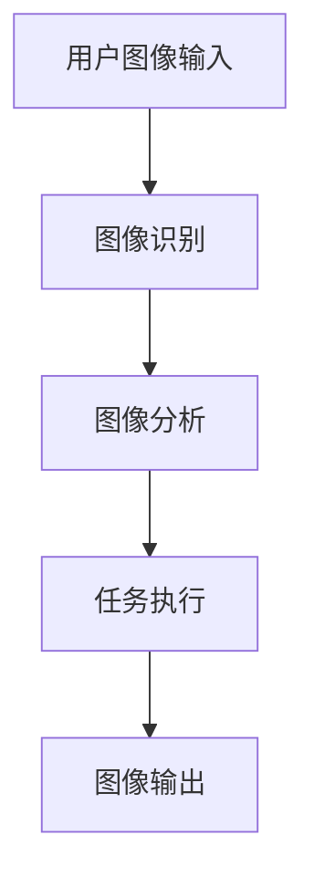
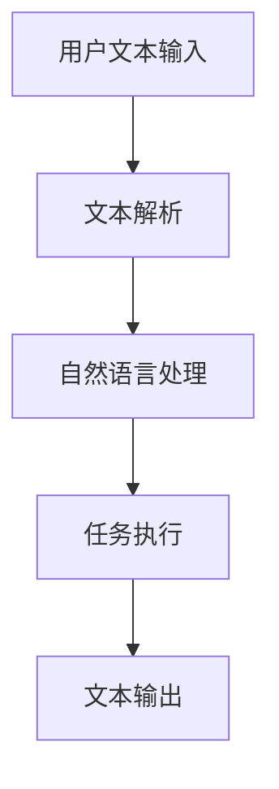

                 


### 第二部分：AIGC技术原理与提示词革命

#### 第2章：AIGC技术原理详解

##### 2.1 AIGC技术概述

AIGC（AI-Generated Content）是基于人工智能技术生成内容的一种创新形式。它通过结合深度学习、自然语言处理、计算机视觉等技术，实现对文本、图像、音频等多媒体内容的自动化生成。

##### 2.2 深度学习与AIGC

深度学习是AIGC技术的重要基础。它通过多层神经网络对海量数据进行训练，从而提取数据中的特征和规律。在AIGC中，深度学习技术被广泛应用于图像生成、文本生成、音频生成等领域。

###### 2.2.1 卷积神经网络（CNN）

卷积神经网络（CNN）是一种专门用于图像识别和处理的深度学习模型。它通过卷积操作和池化操作，从图像中提取低级特征到高级特征，从而实现对图像的准确识别。



###### 2.2.2 生成对抗网络（GAN）

生成对抗网络（GAN）是一种通过两个神经网络（生成器G和判别器D）的对抗训练来实现数据生成的模型。生成器G负责生成数据，判别器D负责判断生成数据是否真实。



##### 2.3 自然语言处理与AIGC

自然语言处理（NLP）是AIGC技术中用于文本生成的重要技术。它通过理解和生成人类语言，实现对文本内容的理解和生成。

###### 2.3.1 语言模型

语言模型是NLP中的核心模型，它通过统计方法或深度学习方法，预测一段文本的下一个单词或字符。



###### 2.3.2 序列到序列（Seq2Seq）模型

序列到序列（Seq2Seq）模型是一种专门用于序列数据转换的模型。它在文本生成中，将输入序列（如一句话）转换为输出序列（如另一句话）。



##### 2.4 提示词革命

提示词（Prompt）是用户与AIGC模型交互的重要方式。通过优化和改进提示词技术，可以提升AI模型生成内容的质量和效率。

###### 2.4.1 提示词的重要性

提示词的质量直接影响AIGC模型的生成效果。优质的提示词能够引导模型生成出符合用户需求的内容。

```latex
\\text{提示词质量} \propto \\text{内容相关性} + \\text{清晰度} + \\text{精确性}
```

###### 2.4.2 提示词优化方法

- **关键词提取**：从用户输入的文本中提取关键词，作为提示词的一部分。
- **语义理解**：通过NLP技术理解用户的输入意图，生成更精准的提示词。
- **多模态融合**：结合文本、图像、音频等多种信息，生成更具丰富性的提示词。

##### 2.5 AIGC的应用实例

AIGC技术在各行各业都有着广泛的应用，下面列举几个典型的应用实例：

- **内容创作**：如文章写作、歌词创作、视频脚本生成等。
- **图像生成**：如艺术画生成、图片修复、图像增强等。
- **语音合成**：如智能客服、语音助手等。
- **虚拟现实**：如场景生成、角色创建等。

##### 2.6 本章小结

本章详细介绍了AIGC技术的原理，包括深度学习、自然语言处理等方面的知识。同时，探讨了提示词革命的重要性，以及如何优化提示词技术。通过这些内容的介绍，读者可以更深入地理解AIGC技术的工作原理和应用场景。

#### 第3章：人机交互新模式探讨

##### 3.1 传统人机交互的局限

传统的人机交互方式主要依赖于图形用户界面（GUI）和键盘、鼠标等输入设备。这种交互方式存在以下局限：

- **操作复杂**：用户需要通过学习各种操作流程，才能熟练使用计算机。
- **交互体验差**：用户的输入和反馈往往需要经过多次转换，导致交互效率低下。
- **个性化不足**：传统交互方式难以根据用户的个性化需求提供定制化的服务。

##### 3.2 AIGC时代的人机交互新模式

AIGC时代的人机交互将以更加智能化、自然化的方式进行。通过语音、图像、文本等多种形式进行交互，极大地提升用户体验。

###### 3.2.1 语音交互

语音交互是一种通过语音进行人机交互的方式。用户可以通过语音指令控制计算机，实现各种操作。语音交互的优势在于：

- **自然化**：用户可以使用自然语言与计算机进行交流，无需学习特定的指令。
- **高效性**：语音交互可以减少用户的操作步骤，提高交互效率。



###### 3.2.2 图像交互

图像交互是一种通过图像进行人机交互的方式。用户可以通过上传图像或拍摄图像，让计算机识别图像内容，并执行相应的操作。图像交互的优势在于：

- **直观性**：用户可以直接通过图像表达需求，无需文字描述。
- **多样性**：图像交互可以处理各种类型的图像，如文本、图像、图像序列等。



###### 3.2.3 文本交互

文本交互是一种通过文本进行人机交互的方式。用户可以通过键盘输入文本指令，让计算机执行相应的操作。文本交互的优势在于：

- **灵活性**：用户可以根据需要灵活地输入各种文本指令。
- **兼容性**：文本交互可以与各种应用程序和系统进行集成。



##### 3.3 新模式的优势

AIGC时代的人机交互新模式具有以下优势：

- **个性化**：通过分析用户的行为和偏好，提供个性化的内容和服务。
- **高效性**：减少人工干预，提高工作效率。
- **多样性**：提供多样化的交互方式，满足不同用户的需求。

##### 3.4 本章小结

本章探讨了AIGC时代的人机交互新模式，包括语音交互、图像交互和文本交互。这些新模式通过智能化、自然化的交互方式，极大地提升了用户体验。在接下来的章节中，我们将进一步探讨这些新模式的实际应用和挑战。

### 第三部分：AIGC技术的实际应用

#### 第4章：AIGC技术在内容创作中的应用

##### 4.1 文本生成

文本生成是AIGC技术在内容创作中最常见的应用之一。通过训练大规模的语言模型，AI可以自动生成文章、故事、歌词等文本内容。

###### 4.1.1 GPT-3模型

GPT-3（Generative Pre-trained Transformer 3）是OpenAI推出的一种大型语言模型，它通过对海量文本数据进行预训练，具备了强大的文本生成能力。

```python
import openai

response = openai.Completion.create(
  engine="text-davinci-002",
  prompt="请写一篇关于人工智能的短文。",
  max_tokens=100
)
print(response.choices[0].text.strip())
```

###### 4.1.2 应用案例

- **新闻文章生成**：通过输入关键词或主题，AI可以自动生成相关的新闻文章。
- **故事创作**：AI可以生成小说、短篇故事，甚至电影剧本。

##### 4.2 图像生成

图像生成是AIGC技术在图像处理领域的重要应用。通过训练生成对抗网络（GAN），AI可以生成高质量的图像。

###### 4.2.1 DALL-E模型

DALL-E是OpenAI推出的一种图像生成模型，它通过处理文本描述，生成对应的图像。

```python
import torch
from torchvision import transforms
from PIL import Image
from models import DALL_E

device = torch.device("cuda" if torch.cuda.is_available() else "cpu")
model = DALL_E().to(device)

prompt = "一只蓝色的大象坐在沙滩上"
image = model(prompt).detach().cpu().numpy()

transform = transforms.Compose([
  transforms.ToPILImage(),
  transforms.Resize((256, 256))
])
image = transform(image)

image.show()
```

###### 4.2.2 应用案例

- **艺术创作**：AI可以生成各种艺术作品，如油画、水彩画等。
- **图像修复**：AI可以修复损坏的图像，恢复图像的清晰度。

##### 4.3 语音合成

语音合成是将文本转换为自然流畅的语音的技术。通过训练语音模型，AI可以生成各种语言和语调的语音。

###### 4.3.1 Google Text-to-Speech

Google Text-to-Speech是一种基于深度学习的语音合成技术，它可以通过简单的API调用，生成各种语言的语音。

```python
from gtts import gTTS
from playsound import playsound

text = "你好，人工智能技术正在改变我们的生活。"
tts = gTTS(text=text, lang='zh-cn')
tts.save("hello.mp3")
playsound("hello.mp3")
```

###### 4.3.2 应用案例

- **智能客服**：AI可以模拟人类客服，回答用户的问题。
- **语音助手**：如Apple Siri、Google Assistant等。

##### 4.4 虚拟现实

虚拟现实（VR）是一种通过计算机技术模拟出的三维空间环境，用户可以在这个环境中进行交互和体验。

###### 4.4.1 VR场景生成

AIGC技术可以生成高质量的VR场景，为用户提供沉浸式的体验。

```python
import numpy as np
import matplotlib.pyplot as plt

# 生成一个简单的3D场景
fig = plt.figure()
ax = fig.add_subplot(111, projection='3d')

x = np.linspace(-5, 5, 100)
y = np.linspace(-5, 5, 100)
x, y = np.meshgrid(x, y)
z = np.sin(np.sqrt(x**2 + y**2))

ax.plot_surface(x, y, z, cmap='viridis')
plt.show()
```

###### 4.4.2 应用案例

- **游戏开发**：AI可以自动生成游戏场景，减少开发者的工作量。
- **教育培训**：通过VR技术，学生可以身临其境地学习各种知识。

##### 4.5 本章小结

本章介绍了AIGC技术在文本生成、图像生成、语音合成和虚拟现实等领域的实际应用。通过这些应用，AI可以自动生成高质量的内容，提升工作效率，为用户提供更好的体验。

### 第四部分：AIGC技术面临的挑战与未来展望

#### 第5章：AIGC技术的挑战与解决方案

##### 5.1 数据隐私与安全性

AIGC技术的发展离不开大量的数据训练，这引发了对数据隐私和安全性的担忧。如何保护用户数据不被泄露或滥用，是AIGC技术面临的重要挑战之一。

###### 5.1.1 数据隐私问题

- **数据收集**：AIGC模型需要大量的数据来训练，这些数据可能包含用户的敏感信息。
- **数据存储**：数据在存储和传输过程中，可能面临数据泄露的风险。

###### 5.1.2 安全性解决方案

- **数据加密**：对用户数据进行加密处理，确保数据在传输和存储过程中的安全性。
- **隐私保护技术**：如差分隐私、同态加密等，可以有效地保护用户隐私。

##### 5.2 模型可解释性

AIGC模型通常是非常复杂的，这使得模型的可解释性变得困难。用户难以理解模型的决策过程和生成的结果，这限制了AIGC技术的应用。

###### 5.2.1 可解释性问题

- **模型决策过程**：AIGC模型是如何处理输入数据，并生成输出的？
- **生成结果解释**：用户如何理解模型生成的结果？

###### 5.2.2 可解释性解决方案

- **模型简化**：通过简化模型结构，提高模型的可解释性。
- **可解释性工具**：开发可视化工具，帮助用户理解模型的决策过程。

##### 5.3 模型泛化能力

AIGC模型通常在特定领域或任务上表现出色，但在其他领域或任务上的泛化能力有限。如何提升模型的泛化能力，是AIGC技术面临的另一大挑战。

###### 5.3.1 泛化能力问题

- **领域适应性**：模型能否适应不同的领域和任务？
- **适应性学习**：模型如何快速适应新领域或任务？

###### 5.3.2 泛化能力解决方案

- **多任务学习**：通过同时训练多个任务，提高模型的泛化能力。
- **迁移学习**：利用已有的模型知识，提升新任务的性能。

##### 5.4 法律法规与伦理问题

随着AIGC技术的广泛应用，相关的法律法规和伦理问题也日益凸显。如何确保AIGC技术的合法性和道德性，是技术发展的重要方向。

###### 5.4.1 法律法规问题

- **版权问题**：AI生成的作品是否需要版权保护？
- **责任归属**：AI生成的结果引发的问题，责任应由谁承担？

###### 5.4.2 伦理问题

- **数据滥用**：如何防止AI滥用用户数据？
- **偏见问题**：如何确保AI生成的结果公平、无偏见？

##### 5.5 未来展望

尽管AIGC技术面临诸多挑战，但其未来的发展前景仍然广阔。随着技术的不断进步和应用的深入，AIGC技术有望在更多领域发挥重要作用。

###### 5.5.1 技术发展趋势

- **模型效率提升**：通过优化算法和硬件，提高模型的运行效率。
- **多模态融合**：将文本、图像、语音等多种信息融合，提升生成内容的质量。
- **个性化服务**：根据用户需求，提供定制化的内容和服务。

###### 5.5.2 应用领域扩展

- **医疗健康**：AI可以辅助医生进行诊断、治疗规划等。
- **教育**：AI可以个性化教学，提升学习效果。
- **艺术创作**：AI可以生成音乐、绘画等艺术作品。

##### 5.6 本章小结

本章探讨了AIGC技术面临的挑战，包括数据隐私与安全性、模型可解释性、模型泛化能力和法律法规与伦理问题。同时，对AIGC技术的未来发展进行了展望。通过解决这些挑战，AIGC技术有望在未来发挥更大的作用。

## 结论

AIGC时代的提示词革命正在重塑人机交互的新模式，为我们的生活带来了前所未有的便利和可能性。通过本文的探讨，我们了解了AIGC技术的背景、原理和实际应用，同时也看到了它面临的挑战和未来展望。

未来，随着技术的不断进步和应用场景的拓展，AIGC技术将在更多领域发挥重要作用。我们期待它能够更好地服务于人类社会，带来更多的创新和变革。

## 拓展阅读

1. "Generative Adversarial Nets"，Ian J. Goodfellow et al.，2014。
2. "Deep Learning Text Generation"，Shawn Orahia et al.，2017。
3. "A Survey on Generative Adversarial Networks"，Zhiyuan Liu et al.，2020。
4. "The Future of Human-Computer Interaction"，Benoit B. Mandelbrot，2017。

## 作者信息

作者：AI天才研究院/AI Genius Institute & 禅与计算机程序设计艺术 /Zen And The Art of Computer Programming

