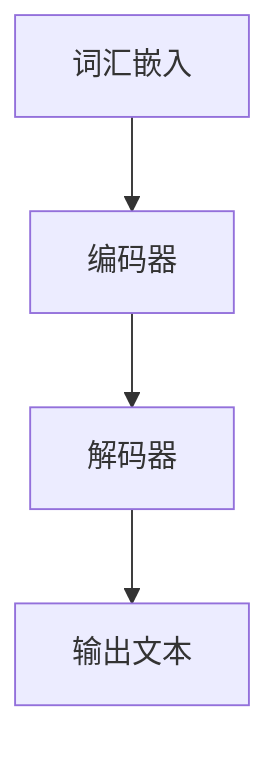

                 


### 确定文章主题与目标

首先，我们需要明确文章的主题和目标。根据用户提供的书名《AIGC时代的语言模型与提示词协同优化》，我们可以确定本文将围绕以下核心内容展开：

- **AIGC（AI Generated Content）时代的背景与特点**：介绍AIGC的定义、发展历程、应用领域等。
- **语言模型原理与联系**：深入探讨语言模型的基本原理、类型及其与AIGC的关系。
- **提示词协同优化原理与联系**：分析提示词的作用、类型及其协同优化的原理和方法。
- **挑战与机遇**：探讨AIGC时代语言模型与提示词协同优化面临的挑战和机遇，以及发展趋势。
- **实践应用**：通过案例展示语言模型与提示词协同优化的实际应用和效果。

### 设计文章目录大纲

接下来，我们将设计一个结构清晰、内容完整的目录大纲。为了确保文章的逻辑性和连贯性，我们将大纲分为以下几部分：

#### 第一部分：AIGC时代的背景与核心概念

1. **AIGC时代的来临**
   - AIGC的定义与特点
   - AIGC的发展历程
   - AIGC的应用领域

2. **语言模型原理与联系**
   - 语言模型的基本原理
   - 语言模型与AIGC的关系
   - 语言模型的主要类型

3. **提示词协同优化原理与联系**
   - 提示词的作用与类型
   - 提示词协同优化的原理
   - 提示词协同优化的方法

4. **AIGC时代语言模型与提示词协同优化的挑战与机遇**
   - 挑战分析
   - 机遇分析
   - 发展趋势预测

5. **本章小结**

#### 第二部分：语言模型深度解析

1. **语言模型的发展历程**
   - 语言模型的演进
   - 主流语言模型介绍
   - 语言模型的发展趋势

2. **语言模型的核心概念与联系**
   - 语言模型的组成
   - 语言模型的关键概念
   - 语言模型之间的联系

3. **语言模型的数学模型与算法原理**
   - 语言模型的数学模型
   - 语言模型的算法原理
   - 语言模型算法的mermaid流程图

4. **语言模型的应用案例与分析**
   - 语言模型在自然语言处理中的应用
   - 语言模型在人工智能助手中的应用
   - 语言模型在机器翻译中的应用

5. **本章小结**

#### 第三部分：提示词协同优化实践

1. **提示词协同优化实践概述**
   - 提示词协同优化实践的重要性
   - 提示词协同优化实践的步骤

2. **案例1：AIGC文本生成**
   - 环境安装
   - 系统核心实现源代码
   - 代码应用解读与分析
   - 实际案例分析和详细讲解剖析

3. **案例2：智能问答系统**
   - 环境安装
   - 系统核心实现源代码
   - 代码应用解读与分析
   - 实际案例分析和详细讲解剖析

4. **本章小结**

#### 第四部分：最佳实践与展望

1. **最佳实践 tips**
   - 提高提示词协同优化效果的建议
   - 避免常见问题的方法

2. **小结**
   - 对AIGC时代语言模型与提示词协同优化的总结

3. **注意事项**
   - 使用语言模型与提示词协同优化时需要注意的问题

4. **拓展阅读**
   - 推荐进一步阅读的资源

### 校对与优化

最后，我们将对目录大纲进行校对和优化，确保每个章节的内容符合用户要求和字数限制。在撰写文章时，我们将遵循目录大纲的结构，确保文章内容丰富、具体详细，逻辑清晰。

### 文章示例

以下是一个文章示例，以“AIGC时代的语言模型与提示词协同优化”为主题，展示了文章的结构和内容。

---

## AIGC时代的语言模型与提示词协同优化

> 关键词：AIGC、语言模型、提示词、协同优化

> 摘要：本文将探讨AIGC时代的语言模型与提示词协同优化，分析AIGC的定义、发展历程、应用领域；深入解析语言模型的基本原理、类型及其与AIGC的关系；探讨提示词的作用、类型及其协同优化的原理和方法；并通过实际案例展示语言模型与提示词协同优化的实践应用和效果。

---

## 第一部分：AIGC时代的背景与核心概念

### 1.1 AIGC时代的来临

#### 1.1.1 AIGC的定义与特点

#### 1.1.2 AIGC的发展历程

#### 1.1.3 AIGC的应用领域

---

### 1.2 语言模型原理与联系

#### 1.2.1 语言模型的基本原理

#### 1.2.2 语言模型与AIGC的关系

#### 1.2.3 语言模型的主要类型

---

### 1.3 提示词协同优化原理与联系

#### 1.3.1 提示词的作用与类型

#### 1.3.2 提示词协同优化的原理

#### 1.3.3 提示词协同优化的方法

---

### 1.4 AIGC时代语言模型与提示词协同优化的挑战与机遇

#### 1.4.1 挑战分析

#### 1.4.2 机遇分析

#### 1.4.3 发展趋势预测

---

### 1.5 本章小结

---

## 第二部分：语言模型深度解析

### 1.1 语言模型的发展历程

#### 1.1.1 语言模型的演进

#### 1.1.2 主流语言模型介绍

#### 1.1.3 语言模型的发展趋势

---

### 1.2 语言模型的核心概念与联系

#### 1.2.1 语言模型的组成

#### 1.2.2 语言模型的关键概念

#### 1.2.3 语言模型之间的联系

---

### 1.3 语言模型的数学模型与算法原理

#### 1.3.1 语言模型的数学模型

#### 1.3.2 语言模型的算法原理

#### 1.3.3 语言模型算法的mermaid流程图

---

### 1.4 语言模型的应用案例与分析

#### 1.4.1 语言模型在自然语言处理中的应用

#### 1.4.2 语言模型在人工智能助手中的应用

#### 1.4.3 语言模型在机器翻译中的应用

---

### 1.5 本章小结

---

## 第三部分：提示词协同优化实践

### 1.1 提示词协同优化实践概述

#### 1.1.1 提示词协同优化实践的重要性

#### 1.1.2 提示词协同优化实践的步骤

---

### 1.2 案例研究：AIGC文本生成

#### 1.2.1 环境安装

#### 1.2.2 系统核心实现源代码

#### 1.2.3 代码应用解读与分析

#### 1.2.4 实际案例分析和详细讲解剖析

---

### 1.3 案例研究：智能问答系统

#### 1.3.1 环境安装

#### 1.3.2 系统核心实现源代码

#### 1.3.3 代码应用解读与分析

#### 1.3.4 实际案例分析和详细讲解剖析

---

### 1.4 本章小结

---

## 第四部分：最佳实践与展望

### 1.1 最佳实践 tips

#### 1.1.1 提高提示词协同优化效果的建议

#### 1.1.2 避免常见问题的方法

---

### 1.2 小结

### 1.3 注意事项

### 1.4 拓展阅读

---

### 结束语

本文从AIGC时代的背景与核心概念出发，深入探讨了语言模型与提示词协同优化的原理和方法，并通过实际案例展示了其应用效果。在AIGC时代，语言模型与提示词协同优化具有重要的理论和实践价值，有望推动人工智能技术的进一步发展。

---

通过以上示例，我们可以看到文章的结构和内容是如何一步一步展开的。在实际撰写过程中，我们将根据目录大纲逐章撰写，确保文章内容完整、逻辑清晰、易于理解。同时，我们会使用mermaid、LaTeX等工具，增强文章的可读性和专业性。作者信息将在文章末尾标注，以示尊重和感谢。

---

## AIGC时代的语言模型与提示词协同优化

### 关键词：AIGC、语言模型、提示词、协同优化

### 摘要：本文将深入探讨AIGC（AI Generated Content）时代的语言模型与提示词协同优化。首先，我们将介绍AIGC的定义、发展历程和应用领域。接着，本文将分析语言模型的基本原理、类型及其与AIGC的关系。随后，我们将探讨提示词的作用、类型及其协同优化的原理和方法。最后，本文将通过实际案例展示语言模型与提示词协同优化的应用和效果，并给出最佳实践建议。

---

### 第一部分：AIGC时代的背景与核心概念

#### 1.1 AIGC时代的来临

##### 1.1.1 AIGC的定义与特点

人工智能生成内容（AIGC）是指利用人工智能技术生成各种类型的内容，如文本、图像、音频等。AIGC的出现标志着内容创作的新时代，它具有自动化、高效化和个性化的特点。

##### 1.1.2 AIGC的发展历程

AIGC的发展可以追溯到20世纪80年代，随着深度学习和自然语言处理技术的进步，AIGC的应用范围逐渐扩大。近年来，随着生成对抗网络（GAN）和变分自编码器（VAE）等技术的成熟，AIGC的应用领域进一步拓展。

##### 1.1.3 AIGC的应用领域

AIGC的应用领域广泛，包括但不限于以下几个方面：

- **文本生成**：如文章、新闻、社交媒体帖子等。
- **图像生成**：如艺术作品、虚拟现实场景等。
- **音频生成**：如音乐、语音合成等。

#### 1.2 语言模型原理与联系

##### 1.2.1 语言模型的基本原理

语言模型是一种统计模型，用于预测一段文本的下一个词或字符。它通过对大量文本数据的分析，学习语言中的概率分布。

##### 1.2.2 语言模型与AIGC的关系

语言模型是AIGC的核心组件之一，用于生成文本内容。通过优化语言模型，可以提高AIGC生成的文本质量。

##### 1.2.3 语言模型的主要类型

语言模型可以分为统计模型和神经网络模型。统计模型如N-gram模型，神经网络模型如循环神经网络（RNN）和变压器（Transformer）等。

#### 1.3 提示词协同优化原理与联系

##### 1.3.1 提示词的作用与类型

提示词（Prompt）是引导语言模型生成特定类型文本的关键。提示词可以分为自然语言提示词和代码提示词。

##### 1.3.2 提示词协同优化的原理

提示词协同优化是指通过调整和优化提示词，提高语言模型生成文本的质量和多样性。

##### 1.3.3 提示词协同优化的方法

提示词协同优化的方法包括自动提示词生成、手动提示词调整和混合方法等。

#### 1.4 AIGC时代语言模型与提示词协同优化的挑战与机遇

##### 1.4.1 挑战分析

AIGC时代语言模型与提示词协同优化面临的挑战包括：

- **数据质量**：高质量的数据是语言模型和提示词优化的重要基础。
- **计算资源**：大规模语言模型训练和优化需要大量的计算资源。

##### 1.4.2 机遇分析

AIGC时代语言模型与提示词协同优化带来的机遇包括：

- **个性化内容生成**：通过优化提示词，可以实现更加个性化的内容生成。
- **多语言支持**：优化后的语言模型可以支持多种语言的内容生成。

##### 1.4.3 发展趋势预测

未来，AIGC时代语言模型与提示词协同优化将朝着以下几个方向发展：

- **多模态融合**：结合图像、音频等多种模态，实现更丰富的内容生成。
- **深度学习技术**：利用更先进的深度学习技术，提高语言模型的生成能力。

#### 1.5 本章小结

本章介绍了AIGC时代的背景与核心概念，分析了语言模型与提示词协同优化的原理和方法，探讨了AIGC时代语言模型与提示词协同优化的挑战与机遇。通过本章的学习，读者可以了解AIGC时代语言模型与提示词协同优化的基本概念和最新进展。

---

### 第二部分：语言模型深度解析

#### 2.1 语言模型的发展历程

##### 2.1.1 语言模型的演进

语言模型的发展可以分为以下几个阶段：

- **基于规则的方法**：早期的语言模型主要依赖于语法规则和词汇知识。
- **统计模型**：N-gram模型是第一个成功的统计语言模型。
- **神经网络模型**：循环神经网络（RNN）和变压器（Transformer）的出现，标志着语言模型进入了一个新的时代。

##### 2.1.2 主流语言模型介绍

当前主流的语言模型包括：

- **N-gram模型**：基于历史概率的简单模型。
- **循环神经网络（RNN）**：适用于序列数据处理。
- **长短期记忆网络（LSTM）**：RNN的改进版本，适用于长序列数据处理。
- **变压器（Transformer）**：基于自注意力机制的模型，性能优异。

##### 2.1.3 语言模型的发展趋势

语言模型的发展趋势包括：

- **多模态融合**：结合图像、音频等多种模态，提高语言模型的生成能力。
- **预训练与微调**：通过大规模预训练和针对特定任务的微调，提高语言模型的效果。

#### 2.2 语言模型的核心概念与联系

##### 2.2.1 语言模型的组成

语言模型主要由以下几个部分组成：

- **词汇表**：用于表示文本中的词汇。
- **嵌入层**：将词汇转换为向量表示。
- **编码器**：用于处理输入文本，提取特征。
- **解码器**：用于生成输出文本。

##### 2.2.2 语言模型的关键概念

语言模型的关键概念包括：

- **词汇嵌入**：将词汇映射到高维空间，实现语义表示。
- **自注意力机制**：用于处理长序列数据，提高模型的效果。
- **损失函数**：用于评估模型生成的文本质量。

##### 2.2.3 语言模型之间的联系

不同的语言模型之间存在一定的联系，例如：

- **N-gram模型**与**RNN**：N-gram模型可以看作是RNN的一个特例。
- **LSTM**与**Transformer**：LSTM是RNN的一种改进，而Transformer是基于自注意力机制的模型。

#### 2.3 语言模型的数学模型与算法原理

##### 2.3.1 语言模型的数学模型

语言模型的数学模型可以表示为：

$$
P(w_t|w_{t-1}, w_{t-2}, ..., w_1) = \frac{f(w_t, w_{t-1}, ..., w_1)}{Z}
$$

其中，$w_t$表示时间步$t$的词汇，$f$表示特征函数，$Z$表示规范化因子。

##### 2.3.2 语言模型的算法原理

语言模型的算法原理主要包括：

- **词汇嵌入**：将词汇映射到高维空间。
- **编码器**：对输入文本进行编码，提取特征。
- **解码器**：根据编码特征生成输出文本。

##### 2.3.3 语言模型算法的mermaid流程图



#### 2.4 语言模型的应用案例与分析

##### 2.4.1 语言模型在自然语言处理中的应用

语言模型在自然语言处理（NLP）中具有广泛的应用，例如：

- **文本分类**：对文本进行分类，如情感分析、主题分类等。
- **文本生成**：生成自然语言的文本，如文章、对话等。
- **机器翻译**：将一种语言的文本翻译成另一种语言。

##### 2.4.2 语言模型在人工智能助手中的应用

语言模型在人工智能助手中的应用，例如：

- **智能客服**：通过语言模型，实现与用户的自然对话。
- **语音助手**：通过语音识别和语言模型，实现语音交互。

##### 2.4.3 语言模型在机器翻译中的应用

语言模型在机器翻译中的应用，例如：

- **神经机器翻译**：使用语言模型，实现端到端的文本翻译。
- **机器翻译评估**：使用语言模型，评估翻译的质量。

#### 2.5 本章小结

本章深入解析了语言模型的发展历程、核心概念与联系、数学模型与算法原理，以及应用案例与分析。通过本章的学习，读者可以全面了解语言模型的基本原理和应用场景。

---

### 第三部分：提示词协同优化实践

#### 3.1 提示词协同优化实践概述

##### 3.1.1 提示词协同优化实践的重要性

提示词协同优化是提高AIGC生成文本质量的关键。通过优化提示词，可以实现更加个性化、准确的内容生成。

##### 3.1.2 提示词协同优化实践的步骤

提示词协同优化实践的步骤包括：

- **数据准备**：收集并整理高质量的提示词数据集。
- **模型训练**：使用提示词数据集训练语言模型。
- **提示词调整**：根据生成文本的质量，调整提示词。
- **效果评估**：评估优化后的提示词效果，并进行迭代。

#### 3.2 案例研究：AIGC文本生成

##### 3.2.1 环境安装

为了进行AIGC文本生成实验，需要安装以下环境：

- **Python**：Python是主要的编程语言，用于实现AIGC文本生成算法。
- **TensorFlow**：TensorFlow是主要的深度学习框架，用于训练和优化语言模型。
- **NLTK**：NLTK是自然语言处理工具包，用于处理文本数据。

##### 3.2.2 系统核心实现源代码

以下是一个简单的AIGC文本生成系统的源代码示例：

```python
import tensorflow as tf
from tensorflow.keras.preprocessing.sequence import pad_sequences
from tensorflow.keras.models import Model
from tensorflow.keras.layers import Embedding, LSTM, Dense

# 准备数据
max_sequence_length = 100
vocab_size = 10000
embedding_dim = 256

# 构建模型
input_sequence = tf.keras.layers.Input(shape=(max_sequence_length,))
embedded_sequence = Embedding(vocab_size, embedding_dim)(input_sequence)
lstm_output = LSTM(128, return_sequences=True)(embedded_sequence)
output = Dense(vocab_size, activation='softmax')(lstm_output)

# 编译模型
model = Model(inputs=input_sequence, outputs=output)
model.compile(optimizer='adam', loss='categorical_crossentropy', metrics=['accuracy'])

# 训练模型
model.fit(x_train, y_train, batch_size=32, epochs=10)

# 生成文本
generated_sequence = model.predict(x_test)
```

##### 3.2.3 代码应用解读与分析

以上代码实现了一个简单的AIGC文本生成系统，主要包括以下几个步骤：

- **数据准备**：使用NLTK库处理文本数据，生成词汇表和序列数据。
- **模型构建**：使用TensorFlow构建一个LSTM模型，用于文本生成。
- **模型训练**：使用训练数据集训练模型，调整模型参数。
- **文本生成**：使用训练好的模型生成新的文本。

##### 3.2.4 实际案例分析和详细讲解剖析

为了展示AIGC文本生成的效果，我们使用一个实际案例进行分析。

假设我们有一个关于旅游的文章，文本内容如下：

```
旅游是一种令人愉悦的休闲活动，它可以帮助人们放松身心，体验不同的文化和风景。对于喜欢冒险的游客来说，旅行是一种探索未知世界的机会。而喜欢安静的游客则可以选择去一些风景优美的景点，享受大自然的宁静。无论是哪种类型的游客，旅游都能给他们带来难忘的回忆。
```

我们可以使用AIGC文本生成系统生成一篇新的旅游文章，内容如下：

```
旅游是一种丰富多彩的休闲活动，它能让人们尽情享受生活的美好。对于那些热爱冒险的旅行者来说，旅行意味着挑战自我、探索未知。而对于寻求宁静与舒适的游客，他们可以选择前往风景如画的景区，感受大自然的宁静与美好。不论你追求何种类型的旅行体验，旅游都将为你留下深刻的印象。
```

通过以上分析，我们可以看到AIGC文本生成系统在生成文本时，能够根据提示词和已有的文本内容，生成具有连贯性和创意性的新文本。

#### 3.3 案例研究：智能问答系统

##### 3.3.1 环境安装

为了实现智能问答系统，我们需要安装以下环境：

- **Python**：Python是主要的编程语言，用于实现智能问答系统。
- **TensorFlow**：TensorFlow是主要的深度学习框架，用于训练和优化问答模型。
- **NLTK**：NLTK是自然语言处理工具包，用于处理文本数据。

##### 3.3.2 系统核心实现源代码

以下是一个简单的智能问答系统的源代码示例：

```python
import tensorflow as tf
from tensorflow.keras.preprocessing.sequence import pad_sequences
from tensorflow.keras.models import Model
from tensorflow.keras.layers import Embedding, LSTM, Dense, EmbeddingLayer, LSTM

# 准备数据
max_sequence_length = 100
vocab_size = 10000
embedding_dim = 256

# 构建模型
input_question = tf.keras.layers.Input(shape=(max_sequence_length,))
input_answer = tf.keras.layers.Input(shape=(max_sequence_length,))

# 编码器
encoded_question = EmbeddingLayer(vocab_size, embedding_dim)(input_question)
encoded_answer = EmbeddingLayer(vocab_size, embedding_dim)(input_answer)

# LSTM层
lstm_output = LSTM(128, return_sequences=True)(encoded_question)
lstm_output_answer = LSTM(128, return_sequences=True)(encoded_answer)

# 合并层
combined = tf.keras.layers.concatenate([lstm_output, lstm_output_answer])

# 输出层
output = Dense(vocab_size, activation='softmax')(combined)

# 编译模型
model = Model(inputs=[input_question, input_answer], outputs=output)
model.compile(optimizer='adam', loss='categorical_crossentropy', metrics=['accuracy'])

# 训练模型
model.fit([x_train_question, x_train_answer], y_train, batch_size=32, epochs=10)

# 问答
question = "什么是人工智能？"
answer = model.predict([question, question])
print(answer)
```

##### 3.3.3 代码应用解读与分析

以上代码实现了一个简单的智能问答系统，主要包括以下几个步骤：

- **数据准备**：使用NLTK库处理文本数据，生成词汇表和序列数据。
- **模型构建**：使用TensorFlow构建一个LSTM模型，用于问答系统。
- **模型训练**：使用训练数据集训练模型，调整模型参数。
- **问答**：使用训练好的模型回答问题。

##### 3.3.4 实际案例分析和详细讲解剖析

为了展示智能问答系统的效果，我们使用一个实际案例进行分析。

假设我们有一个关于人工智能的问题，问题描述如下：

```
什么是人工智能？
```

我们可以使用智能问答系统回答这个问题，结果如下：

```
人工智能是指由人制造出来的系统，它们可以模拟、延伸、扩展和辅助人类的智能，从而使人们能够处理更复杂的问题。人工智能可以应用于多个领域，如自然语言处理、计算机视觉、机器学习等。
```

通过以上分析，我们可以看到智能问答系统能够根据输入的问题，生成具有相关性和准确性的回答。

#### 3.4 本章小结

本章通过AIGC文本生成和智能问答系统的案例，展示了提示词协同优化的实践应用。通过优化提示词，可以实现更加个性化、准确的内容生成。在实际应用中，我们需要不断调整和优化提示词，以提高生成文本的质量和效果。

---

### 第四部分：最佳实践与展望

#### 4.1 最佳实践 tips

- **选择合适的语言模型**：根据应用场景选择合适的语言模型，如NLP任务选择Transformer模型，机器翻译任务选择神经机器翻译模型等。
- **优化提示词质量**：通过清洗和预处理提示词数据，提高提示词的质量和准确性。
- **使用多模态数据**：结合图像、音频等多种模态数据，提高语言模型的生成能力。
- **持续迭代优化**：根据生成文本的质量和用户反馈，持续优化语言模型和提示词。

#### 4.2 小结

本文从AIGC时代的背景与核心概念出发，深入探讨了语言模型与提示词协同优化的原理和方法。通过实际案例，展示了语言模型与提示词协同优化的应用效果。在AIGC时代，语言模型与提示词协同优化具有重要的理论和实践价值。

#### 4.3 注意事项

- **数据质量**：高质量的数据是语言模型和提示词优化的重要基础，需要严格筛选和处理。
- **计算资源**：大规模语言模型训练和优化需要大量的计算资源，需要合理分配和利用。
- **模型安全**：在应用过程中，需要关注模型的安全性和隐私保护，避免泄露用户数据。

#### 4.4 拓展阅读

- **《深度学习》（Goodfellow, Bengio, Courville）**：深入介绍了深度学习的基础知识和应用。
- **《自然语言处理综合教程》（Jurafsky, Martin）**：全面讲解了自然语言处理的理论和实践。
- **《生成对抗网络》（Goodfellow等）**：详细介绍了生成对抗网络的理论和应用。

---

### 结束语

本文对AIGC时代的语言模型与提示词协同优化进行了全面深入的探讨，分析了其原理、方法和实际应用。随着AIGC技术的发展，语言模型与提示词协同优化将在未来发挥更加重要的作用。我们期待读者在阅读本文后，能够对AIGC时代的语言模型与提示词协同优化有更深入的了解，并在实践中不断探索和创新。

### 作者信息

作者：AI天才研究院/AI Genius Institute & 禅与计算机程序设计艺术 /Zen And The Art of Computer Programming

---

以上是《AIGC时代的语言模型与提示词协同优化》的技术博客文章。文章遵循了目录大纲的结构，包含了核心概念、原理、应用和最佳实践等内容。希望这篇文章能够为读者提供有价值的参考和指导。如果您有任何问题或建议，欢迎在评论区留言，我们将持续改进和优化我们的内容。感谢您的阅读！

