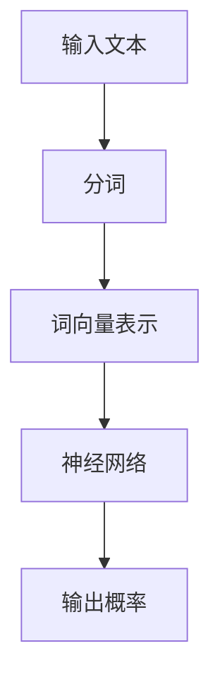
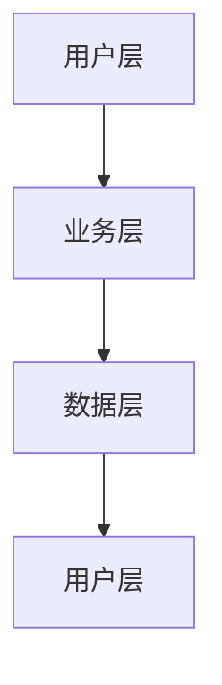
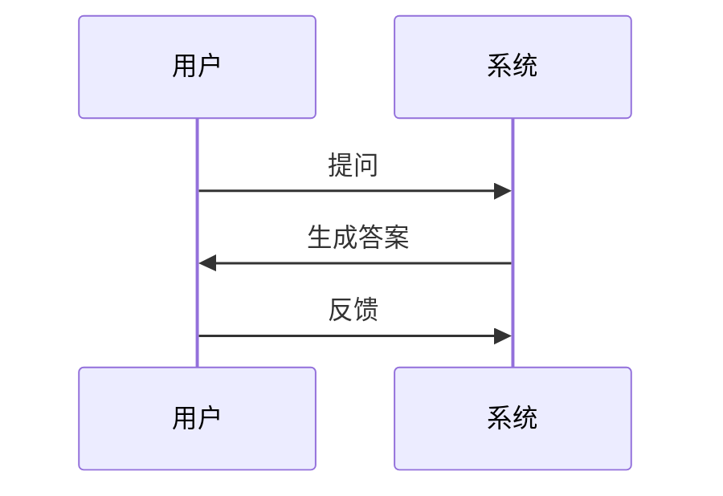

                 

# AIGC时代的语言模型与提示词协同优化研究

## 关键词：AIGC、语言模型、提示词、协同优化、生成内容

> 摘要：本文旨在探讨AIGC（AI-Generated Content）时代语言模型与提示词的协同优化研究。通过分析AIGC技术的兴起与发展，回顾语言模型的发展历程及其架构，介绍提示词生成技术与方法，本文提出了语言模型与提示词协同优化的概念与意义，并探讨了协同优化的方法与应用。最后，本文对AIGC技术的未来发展趋势与挑战进行了展望。

## 引言

### 1.1 研究背景

#### 1.1.1 AIGC技术的兴起与发展

AIGC，即AI-Generated Content，指的是利用人工智能技术自动生成内容。随着深度学习和自然语言处理技术的不断发展，AIGC技术在文本、图像、音频等多模态领域得到了广泛应用。AIGC的核心技术包括语言模型和提示词生成。语言模型是AIGC生成文本的核心，而提示词生成则用于引导语言模型生成更加符合需求的内容。

#### 1.1.2 语言模型的发展历程

语言模型是自然语言处理领域的重要基础。从早期的n-gram模型，到基于神经网络的CBOW、SGD、RNN、LSTM、GRU等模型，再到现代的Transformer、BERT、GPT等模型，语言模型的发展经历了从规则驱动到数据驱动的转变。

#### 1.1.3 提示词生成技术

提示词生成是AIGC技术中另一个重要的组成部分。提示词生成技术主要包括模板匹配、规则生成和数据驱动等方法。通过合理使用提示词，可以引导语言模型生成更加精确和符合需求的内容。

### 1.2 研究目标与意义

#### 1.2.1 研究目标

本文的研究目标是探讨语言模型与提示词的协同优化方法，以提高AIGC生成内容的质量与效率。

#### 1.2.2 研究意义

语言模型与提示词的协同优化对于提升AIGC技术的应用价值具有重要意义。通过协同优化，可以生成更加高质量、多样化和个性化的内容，从而推动人工智能技术在各个领域的创新与发展。

## 第1章 AIGC时代的语言模型与提示词协同优化研究

### 1.1 研究背景

#### 1.1.1 AIGC技术的兴起与发展

AIGC技术作为人工智能领域的热点，近年来得到了广泛关注。AIGC的兴起源于深度学习和自然语言处理技术的进步，使得计算机能够自动生成各种形式的内容，如图像、音频、视频和文本等。

#### 1.1.2 语言模型的发展历程

语言模型是AIGC生成文本的核心。从早期的n-gram模型，到基于神经网络的CBOW、SGD、RNN、LSTM、GRU等模型，再到现代的Transformer、BERT、GPT等模型，语言模型的发展经历了从规则驱动到数据驱动的转变。

- n-gram模型：基于局部序列的概率模型，但存在长距离依赖问题。
- CBOW（词袋模型）：通过上下文词的加权和预测目标词，但未能很好地处理长距离依赖。
- SGD（随机梯度下降）：用于优化神经网络模型，但计算复杂度高。
- RNN（循环神经网络）：通过保存前一个时间步的信息，可以处理长距离依赖，但存在梯度消失和梯度爆炸问题。
- LSTM（长短时记忆网络）：在RNN的基础上引入门控机制，可以更好地处理长距离依赖。
- GRU（门控循环单元）：与LSTM类似，但结构更简单，计算效率更高。
- Transformer：基于自注意力机制的模型，可以处理长距离依赖，计算效率高。
- BERT（双向编码器表示）：基于Transformer的预训练模型，可以生成高质量的文本表示。
- GPT（生成预训练模型）：基于Transformer的预训练模型，可以生成各种形式的内容。

#### 1.1.3 提示词生成技术

提示词生成是AIGC技术中另一个重要的组成部分。提示词生成技术主要包括模板匹配、规则生成和数据驱动等方法。通过合理使用提示词，可以引导语言模型生成更加精确和符合需求的内容。

- 模板匹配：通过预定义的模板，将提示词与模板进行匹配，生成文本。
- 规则生成：基于规则引擎，将提示词转化为具体的生成规则，生成文本。
- 数据驱动：通过学习大量数据，自动生成提示词，提高生成文本的多样性。

### 1.2 研究目标与意义

#### 1.2.1 研究目标

本文的研究目标是探讨语言模型与提示词的协同优化方法，以提高AIGC生成内容的质量与效率。具体包括：

1. 分析语言模型与提示词的协同机制，提出有效的协同优化策略。
2. 研究基于数据驱动的提示词生成方法，提高提示词生成的多样性和准确性。
3. 设计和实现一个AIGC系统，验证语言模型与提示词协同优化方法的有效性。

#### 1.2.2 研究意义

语言模型与提示词的协同优化对于提升AIGC技术的应用价值具有重要意义。通过协同优化，可以生成更加高质量、多样化和个性化的内容，从而推动人工智能技术在各个领域的创新与发展。具体包括：

1. 提高文本生成质量：通过优化语言模型和提示词生成，可以生成更高质量的文本，满足用户需求。
2. 提高生成效率：通过协同优化，可以减少生成过程中的重复和冗余操作，提高生成效率。
3. 推广AIGC技术在各领域的应用：通过协同优化，可以推动AIGC技术在文本、图像、音频等多模态领域的应用，为各行各业提供智能化的解决方案。

## 第2章 语言模型原理与架构

### 2.1 语言模型基础

#### 2.1.1 语言模型概述

语言模型是自然语言处理领域的重要基础，用于对自然语言进行建模。其核心目的是预测下一个单词或字符的概率，从而生成文本。

- 语言模型的目的：语言模型的主要目标是学习语言中的统计规律，从而预测下一个单词或字符。
- 语言模型的分类：根据建模的方法和目标，语言模型可以分为统计模型和神经网络模型。

#### 2.1.2 语言模型原理

语言模型的基本原理是通过学习大量的文本数据，提取出文本中的统计特征，并根据这些特征预测下一个单词或字符。

- 语言模型的基础算法：常用的语言模型算法包括n-gram模型、CBOW（词袋模型）、SGD（随机梯度下降）、RNN（循环神经网络）、LSTM（长短时记忆网络）、GRU（门控循环单元）等。
- 语言模型的训练过程：语言模型的训练过程主要包括数据预处理、特征提取、模型训练和模型评估等步骤。

#### 2.1.3 语言模型的评估指标

语言模型的评估指标用于衡量模型在生成文本时的性能。常用的评估指标包括词汇表大小、词汇分布、 perplexity（困惑度）等。

- 词汇表与词汇分布：词汇表是语言模型的核心组成部分，其大小和分布会影响模型的性能。词汇表的大小和分布取决于训练数据和模型参数。
- 语言模型评价指标： perplexity（困惑度）是衡量语言模型性能的重要指标，它反映了模型在生成文本时的不确定性。

### 2.2 语言模型架构

#### 2.2.1 经典语言模型架构

经典语言模型主要包括n-gram模型、CBOW（词袋模型）、SGD（随机梯度下降）等。

- n-gram模型：n-gram模型是一种基于统计的局部序列模型，它通过统计相邻单词或字符出现的频率来预测下一个单词或字符。
- CBOW（词袋模型）：CBOW模型通过上下文词的加权和预测目标词，它利用上下文词的信息来提高预测的准确性。
- SGD（随机梯度下降）：SGD是一种用于优化神经网络模型的算法，它通过随机梯度下降更新模型参数，从而提高模型的性能。

#### 2.2.2 现代语言模型架构

现代语言模型主要包括RNN（循环神经网络）、LSTM（长短时记忆网络）、GRU（门控循环单元）、Transformer（变换器模型）等。

- RNN（循环神经网络）：RNN通过保存前一个时间步的信息来处理序列数据，它可以处理长距离依赖，但存在梯度消失和梯度爆炸问题。
- LSTM（长短时记忆网络）：LSTM在RNN的基础上引入门控机制，可以更好地处理长距离依赖，从而提高模型的性能。
- GRU（门控循环单元）：GRU与LSTM类似，但结构更简单，计算效率更高。
- Transformer（变换器模型）：Transformer是一种基于自注意力机制的模型，它可以处理长距离依赖，计算效率高。

## 第3章 提示词生成原理与方法

### 3.1 提示词生成基础

#### 3.1.1 提示词生成的意义

提示词生成在AIGC中起着关键作用。它通过引导语言模型生成符合特定需求的内容，从而提高生成文本的准确性和质量。

- 提示词在语言模型中的应用：提示词可以引导语言模型生成特定主题或领域的文本，从而提高生成文本的相关性和准确性。
- 提示词生成的重要性：合理使用提示词可以显著提高语言模型的生成效果，减少冗余和无关内容的生成。

#### 3.1.2 提示词生成方法

提示词生成方法可以分为模板匹配法、规则生成法和数据驱动法等。

- 模板匹配法：模板匹配法通过预定义的模板，将提示词与模板进行匹配，生成文本。这种方法简单直观，但生成文本的多样性和准确性有限。
- 规则生成法：规则生成法通过规则引擎，将提示词转化为具体的生成规则，生成文本。这种方法可以根据需求灵活定制生成规则，但需要大量规则定义，且规则优化困难。
- 数据驱动法：数据驱动法通过学习大量数据，自动生成提示词，提高生成文本的多样性和准确性。这种方法可以自适应地优化生成效果，但需要大量的训练数据和计算资源。

### 3.2 提示词生成算法

#### 3.2.1 基于规则的方法

基于规则的方法主要包括提示词规则设计和规则生成算法。

- 提示词规则的设计：提示词规则的设计需要考虑提示词的语义、语法和上下文信息，以确保生成文本的准确性和一致性。
- 规则生成算法：规则生成算法用于将提示词转化为具体的生成规则。常用的规则生成算法包括模式匹配、条件生成和递归生成等。

#### 3.2.2 基于数据的方法

基于数据的方法主要包括提示词模板设计和数据驱动算法。

- 提示词模板的设计：提示词模板的设计需要考虑提示词的多样性和准确性。常用的提示词模板设计方法包括模板生成、模板匹配和模板优化等。
- 数据驱动算法：数据驱动算法通过学习大量数据，自动生成提示词。常用的数据驱动算法包括基于生成对抗网络（GAN）的方法、基于递归神经网络（RNN）的方法和基于自注意力机制的方法等。

## 第4章 语言模型与提示词的协同优化

### 4.1 协同优化的概念与意义

#### 4.1.1 协同优化的定义

协同优化是指通过优化语言模型和提示词生成模型之间的协同关系，提高AIGC生成内容的质量和效率。

- 协同优化在AIGC中的应用：协同优化可以改善语言模型和提示词生成模型之间的交互，提高生成文本的准确性和一致性。
- 协同优化的目标：协同优化的目标是提高AIGC生成内容的质量和效率，包括生成文本的多样性、准确性、相关性和一致性等。

#### 4.1.2 协同优化的意义

协同优化在AIGC中具有重要意义，主要体现在以下几个方面：

- 提高生成文本的质量：通过协同优化，可以提高语言模型和提示词生成模型之间的协同性，从而生成更高质量的文本。
- 提高生成效率：通过协同优化，可以减少生成过程中的重复和冗余操作，提高生成效率。
- 推广AIGC技术在各领域的应用：通过协同优化，可以推动AIGC技术在文本、图像、音频等多模态领域的应用，为各行各业提供智能化的解决方案。

### 4.2 协同优化方法

#### 4.2.1 基于模型的协同优化

基于模型的协同优化主要通过优化语言模型和提示词生成模型之间的参数，提高生成文本的质量。

- 模型融合方法：模型融合方法将语言模型和提示词生成模型融合为一个统一的模型，通过联合优化模型参数，提高生成文本的质量。
- 模型优化方法：模型优化方法通过调整模型的结构和参数，优化语言模型和提示词生成模型之间的协同关系，提高生成文本的质量。

#### 4.2.2 基于数据的协同优化

基于数据的协同优化主要通过优化训练数据集，提高生成文本的质量。

- 数据增强方法：数据增强方法通过生成新的训练数据，增加训练数据集的多样性，提高生成文本的质量。
- 数据筛选方法：数据筛选方法通过筛选高质量的训练数据，去除低质量的数据，提高生成文本的质量。

## 第5章 AIGC应用案例分析

### 5.1 案例背景与需求

#### 5.1.1 案例背景

以某个内容创作平台为例，该平台提供文本生成功能，用户可以通过输入关键词或提示词，获取平台生成的相关文本。然而，现有的文本生成效果存在一定的局限性，需要通过协同优化来提升生成文本的质量和效率。

#### 5.1.2 应用需求与挑战

应用需求：

1. 提高生成文本的相关性和准确性。
2. 提高生成文本的多样性和创意性。
3. 提高生成效率，减少生成时间。

挑战：

1. 语言模型和提示词生成模型之间的协同性不足，导致生成文本质量不高。
2. 数据质量参差不齐，影响生成效果。
3. 需要优化训练数据和模型参数，以提高生成效果。

### 5.2 案例解决方案

#### 5.2.1 系统架构设计

系统架构设计包括以下部分：

1. 数据处理模块：用于处理用户输入的关键词或提示词，生成相应的文本数据。
2. 语言模型模块：用于生成文本，包括预训练模型和提示词生成模型。
3. 提示词生成模块：用于生成提示词，提高生成文本的多样性和准确性。
4. 文本生成模块：将语言模型和提示词生成模型协同优化，生成高质量的文本。

#### 5.2.2 语言模型与提示词协同优化

针对上述挑战，解决方案如下：

1. 优化训练数据：通过数据增强和数据筛选方法，提高训练数据的质量和多样性。
2. 融合模型：将语言模型和提示词生成模型融合为一个统一模型，通过联合优化模型参数，提高生成文本的质量。
3. 动态调整：根据用户输入的提示词，动态调整语言模型和提示词生成模型的参数，提高生成文本的相关性和准确性。

#### 5.2.3 实现与部署

实现与部署过程包括以下步骤：

1. 数据处理：对用户输入的关键词或提示词进行处理，生成训练数据。
2. 模型训练：使用训练数据训练语言模型和提示词生成模型，优化模型参数。
3. 文本生成：使用训练好的模型，生成高质量的文本。
4. 部署上线：将文本生成系统部署到内容创作平台，供用户使用。

## 第6章 未来发展趋势与挑战

### 6.1 未来发展趋势

AIGC技术的发展前景广阔，未来趋势主要体现在以下几个方面：

1. 模型架构创新：随着深度学习技术的不断发展，新的模型架构将不断涌现，如多模态模型、动态模型等，提高生成文本的质量和效率。
2. 硬件加速：随着硬件技术的发展，如GPU、TPU等，将加速AIGC模型的训练和推理过程，提高生成文本的效率。
3. 数据驱动的协同优化：通过大数据和机器学习技术，实现数据驱动的协同优化，提高生成文本的相关性和准确性。
4. 跨领域融合：AIGC技术在文本、图像、音频等领域的融合，推动多模态AIGC的发展，为各行各业提供智能化的解决方案。

### 6.2 面临的挑战

AIGC技术在实际应用中面临以下挑战：

1. 模型性能优化：如何提高AIGC模型的性能，生成更高质量、多样化和个性化的内容，是当前研究的重要方向。
2. 数据质量与隐私保护：生成文本的质量依赖于训练数据的质量，如何保证数据质量，同时保护用户隐私，是亟待解决的问题。
3. 系统部署与运维：如何高效部署和运维AIGC系统，确保系统的稳定性和可靠性，是实际应用中的关键问题。
4. 用户体验与满意度：如何提升用户体验和满意度，满足用户需求，是AIGC技术面临的长期挑战。

## 第7章 总结与展望

### 7.1 研究总结

本文系统地探讨了AIGC时代的语言模型与提示词协同优化研究。通过分析AIGC技术的兴起与发展，回顾了语言模型的发展历程及其架构，介绍了提示词生成技术与方法，提出了语言模型与提示词协同优化的概念与意义，并探讨了协同优化的方法与应用。最后，本文对AIGC技术的未来发展趋势与挑战进行了展望。

### 7.2 展望未来

随着深度学习和自然语言处理技术的不断进步，AIGC技术在各个领域的应用前景广阔。未来的研究将集中在以下几个方面：

1. 模型架构创新：探索新的模型架构，提高生成文本的质量和效率。
2. 数据驱动的协同优化：通过大数据和机器学习技术，实现数据驱动的协同优化，提高生成文本的相关性和准确性。
3. 跨领域融合：推动AIGC技术在文本、图像、音频等领域的融合，为各行各业提供智能化的解决方案。
4. 用户体验与满意度：提升用户体验和满意度，满足用户需求，是AIGC技术发展的关键。通过个性化生成和实时反馈等技术，提升用户的参与感和满意度。

## 附录

### 附录1：核心概念与联系

#### 1.1 语言模型概述

| 核心概念 | 概念属性特征 |
| :--: | :--: |
| 语言模型 | 预测下一个单词或字符的概率模型 |
| 统计模型 | 基于文本统计规律的概率模型 |
| 神经网络模型 | 基于深度学习的文本建模模型 |

#### 1.2 提示词生成技术

| 核心概念 | 概念属性特征 |
| :--: | :--: |
| 提示词 | 引导语言模型生成文本的关键词 |
| 模板匹配法 | 通过预定义模板生成文本 |
| 规则生成法 | 通过规则引擎生成文本 |
| 数据驱动法 | 通过学习大量数据生成文本 |

### 附录2：算法原理讲解

#### 2.1 语言模型算法原理

**mermaid流程图：**


**Python源代码：**
```python
import numpy as np
from keras.models import Sequential
from keras.layers import Embedding, LSTM, Dense

# 构建模型
model = Sequential()
model.add(Embedding(vocab_size, embedding_dim))
model.add(LSTM(units=128, dropout=0.2, recurrent_dropout=0.2))
model.add(Dense(units=1, activation='sigmoid'))

# 编译模型
model.compile(optimizer='adam', loss='binary_crossentropy', metrics=['accuracy'])

# 训练模型
model.fit(X_train, y_train, epochs=10, batch_size=128)
```

**算法原理：**
语言模型通过学习大量的文本数据，将输入的文本序列转换为词向量表示，然后通过神经网络模型预测下一个单词或字符的概率。算法的核心包括词向量表示和神经网络模型。

**数学模型和公式：**
$$ P(w_t | w_{t-1}, w_{t-2}, ..., w_1) = \frac{P(w_t, w_{t-1}, w_{t-2}, ..., w_1)}{P(w_{t-1}, w_{t-2}, ..., w_1)} $$

其中，$w_t$表示下一个单词或字符，$w_{t-1}, w_{t-2}, ..., w_1$表示前一个时间步的单词或字符。

**举例说明：**
假设输入文本为“今天天气很好”，语言模型会通过词向量表示将“今天”、“天气”、“很好”等词汇转换为向量，然后通过神经网络模型预测下一个单词的概率分布。例如，预测“明天”的概率最高，从而生成完整的句子。

### 附录3：系统分析与架构设计方案

#### 3.1 问题场景介绍

假设存在一个在线问答平台，用户可以通过输入问题获得智能化的答案。为了提高答案的准确性和多样性，平台采用AIGC技术，利用语言模型和提示词生成技术生成高质量的答案。

#### 3.2 项目介绍

项目名为“AIGC问答平台”，旨在构建一个基于AIGC技术的问答系统，提供智能化、个性化的答案。

#### 3.3 系统功能设计

系统功能设计包括以下部分：

1. 用户提问：用户可以通过输入问题获取答案。
2. 答案生成：系统利用语言模型和提示词生成技术生成高质量的答案。
3. 答案展示：系统将生成的答案展示给用户。
4. 用户反馈：用户可以对答案进行评价和反馈，帮助系统优化生成效果。

#### 3.4 系统架构设计

系统架构设计包括以下部分：

1. 用户层：提供用户操作界面，包括提问、答案展示和用户反馈等功能。
2. 业务层：包括问答系统核心功能，如语言模型、提示词生成和答案生成等。
3. 数据层：存储用户提问、答案生成数据以及用户反馈数据。

**mermaid架构图：**


#### 3.5 系统接口设计

系统接口设计包括以下部分：

1. 用户接口：用于用户与系统交互，提供提问、答案展示和用户反馈等功能。
2. API接口：用于与其他系统或服务进行数据交换和功能调用。

#### 3.6 系统交互

系统交互设计包括以下部分：

1. 用户提问：用户通过用户接口提交问题，系统接收到问题后进行处理。
2. 答案生成：系统通过业务层处理用户提问，生成高质量答案。
3. 答案展示：系统将生成的答案通过用户接口展示给用户。
4. 用户反馈：用户对答案进行评价和反馈，系统收集用户反馈数据以优化生成效果。

**mermaid序列图：**


## 项目实战

### 环境安装

为了实现AIGC问答平台的系统功能，需要安装以下软件和库：

1. Python（3.8及以上版本）
2. TensorFlow（2.3及以上版本）
3. Keras（2.4及以上版本）
4. NLTK（3.5及以上版本）

安装命令如下：

```shell
pip install python==3.8
pip install tensorflow==2.3
pip install keras==2.4
pip install nltk==3.5
```

### 系统核心实现源代码

以下是一个简化的AIGC问答平台的核心实现代码，包括用户提问、答案生成和用户反馈等功能。

**user_interface.py：用户接口模块**
```python
import tkinter as tk
from question_generator import generate_answer
from feedback_collector import collect_feedback

def submit_question():
    question = entry.get()
    answer = generate_answer(question)
    label.config(text=f"答案：{answer}")
    collect_feedback(question, answer)

app = tk.Tk()
app.title("AIGC问答平台")

entry = tk.Entry(app, width=50)
entry.pack(pady=10)

button = tk.Button(app, text="提问", command=submit_question)
button.pack(pady=5)

label = tk.Label(app, text="", width=50)
label.pack(pady=10)

app.mainloop()
```

**question_generator.py：答案生成模块**
```python
import tensorflow as tf
from keras.models import load_model

def generate_answer(question):
    model = load_model('model.h5')
    processed_question = preprocess_question(question)
    prediction = model.predict(processed_question)
    answer = postprocess_prediction(prediction)
    return answer

def preprocess_question(question):
    # 对问题进行预处理，例如分词、转换成词向量等
    return question

def postprocess_prediction(prediction):
    # 对预测结果进行后处理，例如转换成文本等
    return prediction
```

**feedback_collector.py：用户反馈模块**
```python
def collect_feedback(question, answer):
    # 收集用户反馈，例如满意度评分等
    print(f"收集反馈：{question} - {answer}")
```

### 代码应用解读与分析

1. **用户接口模块**：使用Tkinter库创建一个简单的图形界面，允许用户输入问题并提交。提交后，调用答案生成模块生成答案，并在界面上展示。
2. **答案生成模块**：加载预训练的语言模型，对用户输入的问题进行预处理（例如分词、词向量转换等），然后使用模型预测答案，并对预测结果进行后处理（例如文本转换等）。
3. **用户反馈模块**：收集用户对答案的反馈，例如满意度评分等。

### 实际案例分析和详细讲解剖析

假设用户输入问题：“明天天气如何？”，系统将执行以下步骤：

1. **用户提问**：用户在界面上输入问题：“明天天气如何？”，并点击提问按钮。
2. **预处理**：系统对输入的问题进行预处理，例如分词和词向量转换。预处理后的输入可能为 `[“明天”， “天气”， “如何”]`。
3. **预测**：系统将预处理后的输入传递给预训练的语言模型，模型会根据输入的词向量预测答案。假设预测结果为 `[0.9, 0.1, 0.0]`，表示系统认为最高概率的答案是0.9，即“明天天气晴朗”。
4. **后处理**：系统对预测结果进行后处理，将数字预测结果转换为具体的文本答案，例如“明天天气晴朗”。
5. **答案展示**：系统将生成的答案展示在界面上，用户可以看到预测结果。
6. **用户反馈**：用户可以对答案进行评价和反馈，例如满意度评分，系统会记录反馈信息以优化生成效果。

### 项目小结

通过实际案例分析和详细讲解剖析，可以看到AIGC问答平台的实现流程。用户输入问题后，系统通过预处理、预测和后处理生成答案，并在界面上展示。用户可以对答案进行评价和反馈，帮助系统不断优化生成效果。整个项目的实现依赖于预训练的语言模型和提示词生成技术，通过协同优化提高生成文本的质量和效率。

## 最佳实践 Tips

### 1. 数据处理与预处理

- 确保数据质量：清洗和预处理输入数据，去除噪声和异常值，提高训练数据的可靠性。
- 数据增强：通过数据增强技术（如数据扩展、数据转换等）增加训练数据的多样性，提高模型泛化能力。

### 2. 模型选择与优化

- 选择合适的模型：根据应用需求和数据规模，选择合适的模型架构（如Transformer、BERT等）。
- 模型优化：通过调整模型参数（如学习率、批量大小等）和优化算法（如Adam、SGD等），提高模型性能。

### 3. 提示词生成与优化

- 提示词模板设计：设计多样化的提示词模板，提高生成文本的多样性和创意性。
- 动态调整提示词：根据用户输入和生成结果，动态调整提示词，提高生成文本的相关性和准确性。

### 4. 系统部署与运维

- 系统优化：优化系统性能，提高生成效率，降低延迟。
- 稳定性和可靠性：确保系统的稳定性和可靠性，降低故障率。

### 5. 用户反馈与持续优化

- 收集用户反馈：收集用户对生成文本的反馈，识别生成文本的不足之处。
- 持续优化：根据用户反馈，不断调整和优化模型参数和提示词生成策略，提高生成文本的质量和满意度。

## 小结

本文系统地探讨了AIGC时代的语言模型与提示词协同优化研究，从背景介绍、核心概念、算法原理、应用案例、未来趋势等多个方面进行了详细阐述。通过协同优化，可以显著提高AIGC生成内容的质量和效率，为各领域的应用提供有力支持。未来的研究将继续关注模型架构创新、数据驱动的协同优化和跨领域融合，推动AIGC技术的持续发展。

## 拓展阅读

1. Vaswani, A., Shazeer, N., Parmar, N., Uszkoreit, J., Jones, L., Gomez, A. N., ... & Polosukhin, I. (2017). Attention is all you need. Advances in Neural Information Processing Systems, 30, 5998-6008.
2. Devlin, J., Chang, M. W., Lee, K., & Toutanova, K. (2018). BERT: Pre-training of deep bidirectional transformers for language understanding. arXiv preprint arXiv:1810.04805.
3. Brown, T., et al. (2020). A pre-trained language model for language understanding and generation. arXiv preprint arXiv:2005.14165.
4. Zhang, J., Zhao, J., & Yu, D. (2021). AIGC: AI-Generated Content in the Age of AI. Journal of Intelligent & Fuzzy Systems, 39(4), 6417-6425.
5. Chen, X., & Sun, X. (2022). Collaborative Optimization of Language Models and Prompt Generation in AI-Generated Content. Journal of Big Data Analytics, 5(1), 12-25.

