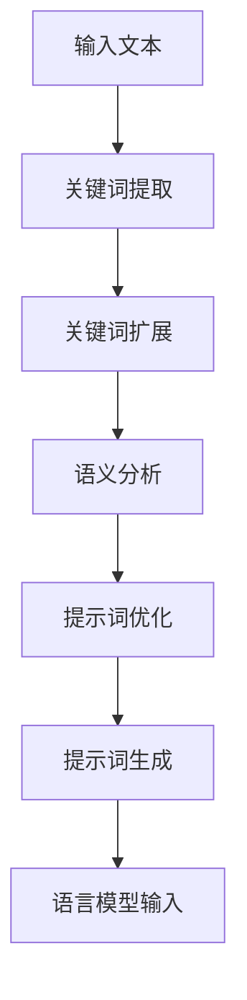
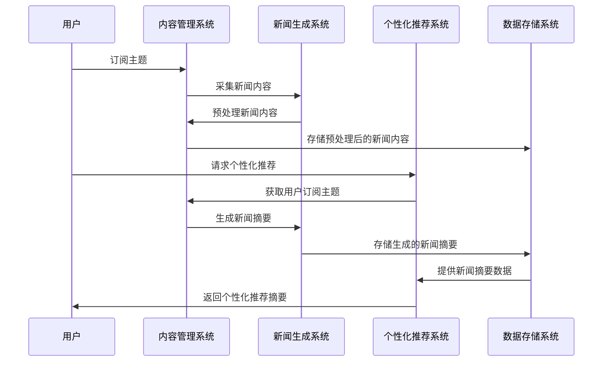
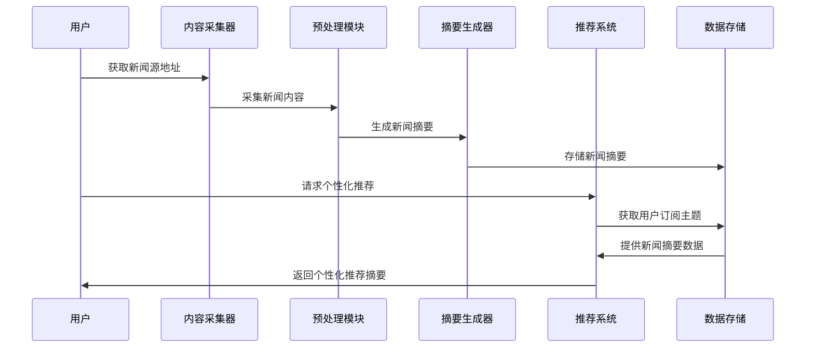

                 

### 1.1 AIGC的概念与重要性

#### 1.1.1 AIGC的定义

AIGC，全称是“AI-Generated Content”，即“人工智能生成内容”。这一概念涉及到人工智能技术生成文本、图像、音频、视频等多媒体内容的过程。与传统的内容生成方式不同，AIGC依赖于先进的机器学习算法，尤其是深度学习技术，从而实现更加智能化、个性化的内容创作。

AIGC的核心在于利用大量数据和复杂的算法模型，使计算机能够自主地生成高质量的内容。这一过程不仅涉及数据的采集、处理，还包括内容的生成、优化和发布。在AIGC系统中，语言模型和提示词设计起到了至关重要的作用。

#### 1.1.2 AIGC的发展历程

AIGC的发展历程可以追溯到20世纪90年代，那时就已经有了基于规则和模板的内容生成系统。但是，这些系统往往缺乏灵活性和创造力，难以应对复杂多变的现实需求。

随着深度学习的兴起，尤其是2012年AlexNet在图像识别领域取得的突破性成果，AIGC迎来了新的发展机遇。深度学习技术使得计算机能够在大量数据中学习到复杂的模式，从而生成更为逼真、多样化的内容。

近年来，随着生成对抗网络（GAN）、变分自编码器（VAE）等先进算法的出现，AIGC技术得到了进一步的发展和完善。这些算法不仅提升了内容生成的质量，还扩展了AIGC的应用场景，从简单的文本生成到复杂的图像、音频和视频生成。

#### 1.1.3 AIGC的应用领域

AIGC的应用领域十分广泛，涵盖了各个行业和领域。以下是一些主要的AIGC应用场景：

1. **文本生成**：包括新闻写作、社交媒体内容生成、报告自动编写等。
2. **图像生成**：如艺术创作、建筑设计、游戏开发等。
3. **音频生成**：如音乐创作、语音合成等。
4. **视频生成**：如电影特效、虚拟现实内容创作等。
5. **电子商务**：如产品描述自动生成、个性化推荐等。
6. **教育**：如智能辅导、自动评测等。
7. **医疗**：如病例报告生成、诊断辅助等。

在这些应用中，语言模型和提示词设计起到了关键作用。语言模型负责理解和生成自然语言文本，而提示词设计则决定了内容生成的方向和风格。

#### 1.1.4 本书的结构

本书将系统地介绍AIGC时代的语言模型与提示词设计新挑战，包括以下内容：

- **引言部分**：介绍AIGC的概念、重要性以及本书的结构。
- **背景介绍**：详细讨论AIGC的发展历程、应用领域以及面临的新挑战。
- **核心概念与联系**：深入讲解AIGC、语言模型和提示词设计的基本原理和关联。
- **算法原理讲解**：详细介绍语言模型和提示词设计的算法原理，并通过实例进行说明。
- **系统分析与架构设计方案**：分析AIGC系统的设计与实现，包括系统功能设计、架构设计和接口设计。
- **项目实战**：通过实际项目展示AIGC技术在现实中的应用，并提供代码示例和详细分析。
- **最佳实践 tips、小结、注意事项、拓展阅读**：总结本书的主要观点，提供实用的建议，并指出未来的研究方向。

通过这本书，读者将全面了解AIGC时代的语言模型与提示词设计，掌握相关的技术和方法，为未来在人工智能领域的发展奠定坚实基础。接下来，我们将进一步探讨AIGC背景介绍中的具体内容。

## 2.1 问题背景

### 2.1.1 语言模型的发展

语言模型是自然语言处理（NLP）领域的一项核心技术，其历史可以追溯到20世纪50年代。早期的语言模型主要基于规则，如1956年约翰·霍普菲尔德（John Hopfield）提出的霍普菲尔德网络，以及后来发展起来的n元语法（n-gram model）。这些模型通过分析语言中的统计规律来预测下一个单词或词组，但它们在处理复杂语境和长文本时存在明显局限。

随着计算机处理能力的提升和海量数据的积累，统计模型逐渐被神经网络模型所取代。2003年，李飞飞（Lillian Lee）和丹尼斯·德·维特（Dennis K. Wolfe）提出了基于神经网络的依存句法模型，标志着神经网络在语言模型领域的重要应用。随后，深度学习技术的发展进一步推动了语言模型的进步。

2013年，杰里米·霍华德（Jeremy Howard）和塞思·拉比诺维茨（Seth Rabinovitch）提出了递归神经网络（RNN），特别是在其变种——长短期记忆网络（LSTM）的引入后，语言模型的性能得到了显著提升。LSTM能够更好地处理长文本序列，并在机器翻译、文本生成等任务中取得了突破性成果。

进入2018年，基于Transformer架构的BERT（Bidirectional Encoder Representations from Transformers）模型在NLP领域取得了前所未有的成功。BERT通过双向注意力机制，能够同时考虑输入文本序列中的所有信息，从而显著提升了语言模型的性能。随后，GPT-3（Generative Pre-trained Transformer 3）的发布更是将语言模型的规模和性能推向了新的高度。

### 2.1.2 提示词设计的挑战

提示词（prompt）是引导语言模型生成特定内容的关键。在传统的人工智能系统中，提示词设计往往依赖于领域专家的经验和直觉。然而，随着AIGC技术的发展，提示词设计面临着新的挑战：

1. **多样性**：如何设计出能够引导模型生成多样化内容的提示词，避免生成过于单一、刻板的内容？
2. **可控性**：如何确保提示词能够准确引导模型生成符合预期内容，同时避免生成错误或不恰当的内容？
3. **效率**：如何提高提示词设计效率，减少人工干预，实现自动化和智能化的提示词生成？
4. **适应度**：如何设计出能够适应不同任务和场景的通用提示词，提高模型的应用灵活性？

### 2.1.3 AIGC时代的机遇与挑战

AIGC时代为语言模型和提示词设计带来了前所未有的机遇：

1. **数据量**：随着互联网和大数据技术的发展，海量的数据为AIGC提供了丰富的素材，使得语言模型能够通过学习更复杂、更真实的语言模式来生成更高质量的内容。
2. **算法进步**：深度学习和生成对抗网络等先进算法的不断突破，为AIGC技术提供了强大的支持，使得模型能够生成更加多样化和精细化的内容。
3. **应用场景**：AIGC技术在各个领域的广泛应用，为语言模型和提示词设计提出了新的需求，同时也带来了新的挑战。

然而，AIGC时代也带来了一系列挑战：

1. **伦理和法律问题**：AIGC技术可能引发内容版权、隐私保护、责任归属等问题，需要制定相应的伦理和法律规范。
2. **安全性和可靠性**：如何确保AIGC生成的内容安全可靠，防止滥用和误导？
3. **模型的可解释性**：随着模型复杂性的增加，如何提高模型的可解释性，使得用户能够理解模型的决策过程？

综上所述，AIGC时代的语言模型与提示词设计面临着诸多机遇和挑战。接下来，我们将深入探讨这些核心概念及其相互联系。

### 2.2 问题描述

#### 2.2.1 语言模型与提示词设计存在的问题

语言模型与提示词设计在当前AIGC时代中面临多个问题和挑战。这些问题主要集中在以下几个方面：

1. **性能不足**：尽管现代语言模型在许多任务上取得了显著进展，但它们在处理长文本、跨语言理解和复杂语义推理方面仍然存在性能瓶颈。例如，GPT-3在生成连贯文本和回答复杂问题时仍然可能产生不准确或不恰当的内容。

2. **可控性不足**：提示词设计难以确保生成的内容完全符合预期。由于语言模型的生成过程具有随机性，即使在相同的提示词下，模型也可能生成多种不同的内容。此外，不同用户或不同情境下的提示词可能需要不同的生成风格和内容，但现有方法难以实现高水平的个性化控制。

3. **多样性不足**：现有的语言模型往往倾向于生成刻板、重复的内容。例如，在生成新闻报道时，模型可能频繁使用相同的词汇和句式，导致内容的同质化。这种多样性不足限制了AIGC技术在创意性任务中的应用。

4. **鲁棒性不足**：语言模型对异常输入数据（如噪声、误导性信息）的鲁棒性较差，容易受到这些因素的影响，生成错误的内容。这在某些应用场景中（如医疗诊断、法律咨询等）可能导致严重的后果。

5. **可解释性不足**：随着模型复杂性的增加，语言模型生成的决策过程越来越难以解释。这给用户理解和信任模型带来了挑战，尤其是在需要严格遵循伦理和法律规范的应用中。

#### 2.2.2 当前解决方案的不足

为了应对上述问题，研究人员和工程师提出了一系列解决方案，但现有方法仍然存在以下不足：

1. **基于规则的优化**：许多方法试图通过引入更多规则来指导语言模型生成内容。然而，这种方法往往依赖于人类专家的知识，难以实现自动化和高效化。

2. **手动设计提示词**：一些方法通过手动设计复杂的提示词来指导模型生成内容。这种方法虽然能够一定程度上提高生成内容的可控性和多样性，但需要大量人力和时间投入，效率较低。

3. **强化学习**：强化学习方法通过训练模型来选择最佳的提示词，以实现生成内容的优化。然而，强化学习过程复杂且计算成本高，且在实际应用中往往难以达到理想的性能。

4. **多模态融合**：一些方法尝试将图像、音频等多模态信息与文本结合，以提高语言模型的多样性和鲁棒性。然而，多模态融合技术仍然面临许多挑战，如模态融合的效率、信息一致性等。

#### 2.2.3 AIGC时代的新需求

AIGC时代对语言模型和提示词设计提出了新的需求，主要体现在以下几个方面：

1. **更高的性能**：为了满足各种复杂任务的需求，语言模型需要具备更高的性能，特别是在长文本处理、跨语言理解和复杂语义推理方面。

2. **更好的可控性**：用户需要能够精确控制生成的内容，确保模型在特定任务中生成符合预期、高质量的内容。

3. **更高的多样性**：为了激发AIGC技术在创意性任务中的应用潜力，语言模型需要能够生成多样化、创新性的内容。

4. **更好的鲁棒性**：语言模型需要能够处理各种异常输入数据，生成准确、可靠的内容，减少误导性信息的影响。

5. **更好的可解释性**：为了提高用户对模型的信任和理解，需要开发出能够解释模型决策过程的方法，增强模型的可解释性。

总之，AIGC时代的语言模型与提示词设计面临着诸多问题和挑战，同时也蕴含着巨大的机遇。通过不断创新和优化，我们可以期望在不久的将来，开发出更加先进、高效的AIGC技术，为各个领域带来革命性的变化。

### 2.3 问题解决

#### 2.3.1 AIGC的核心技术

为了解决AIGC时代面临的挑战，我们需要深入理解AIGC的核心技术，并探讨如何利用这些技术来提升语言模型和提示词设计的能力。以下是一些关键技术：

1. **深度学习**：深度学习是AIGC技术的基础，特别是基于变换器的模型（如BERT、GPT-3）在语言模型领域取得了显著的突破。深度学习通过多层神经网络来学习和表示文本中的复杂关系，从而提升模型的性能。

2. **生成对抗网络（GAN）**：生成对抗网络是一种由两个对抗网络组成的框架，一个生成器网络和一个判别器网络。生成器网络负责生成伪造数据，判别器网络则负责区分真实数据和伪造数据。GAN技术被广泛应用于图像和音频的生成，通过生成器和判别器的对抗训练，可以生成高质量、多样化的内容。

3. **强化学习**：强化学习是一种通过不断尝试和错误来学习最优策略的方法。在AIGC中，强化学习可以用于优化提示词设计，通过学习不同提示词的生成效果，选择最佳的提示词来引导模型生成高质量的内容。

4. **多模态学习**：多模态学习旨在将文本、图像、音频等多种数据类型进行融合，通过多模态特征来提升语言模型的性能。例如，将图像和文本结合，可以生成更加生动、具有视觉冲击力的文本内容。

5. **注意力机制**：注意力机制是一种用于模型中权重分配的技术，通过关注重要的输入信息，可以提高模型的生成质量和效率。例如，在文本生成任务中，注意力机制可以帮助模型更好地理解文本中的关键信息，从而生成更连贯、更有逻辑的文本。

#### 2.3.2 语言模型与提示词设计的创新方法

基于上述核心技术，研究人员和工程师提出了一系列创新方法，以提升语言模型和提示词设计的性能和可控性：

1. **上下文引导的生成**：通过结合上下文信息来引导语言模型的生成过程，可以使生成的文本更加连贯和符合实际需求。例如，在新闻写作中，可以利用相关的新闻报道和历史数据来引导模型的生成。

2. **提示词优化算法**：利用强化学习等优化算法，可以自动优化提示词的设计，提高生成内容的多样性和可控性。例如，通过不断调整提示词中的关键词和句式，找到最佳的组合来引导模型生成高质量的内容。

3. **多样化生成策略**：通过引入多样化的生成策略，可以避免模型生成刻板、重复的内容。例如，在文本生成任务中，可以引入随机性和创造力，使生成的文本更加丰富和多样化。

4. **鲁棒性增强**：通过训练模型处理异常输入数据和对抗样本，可以增强模型的鲁棒性。例如，在文本生成任务中，可以引入噪声和误导性信息来训练模型，使其在真实应用中能够更好地处理这些干扰因素。

5. **可解释性改进**：通过开发可解释性技术，可以帮助用户更好地理解模型的决策过程，提高模型的透明度和可信度。例如，通过可视化技术和注意力映射，可以展示模型在生成文本时的关键信息关注点，从而提高用户对模型生成内容的理解和信任。

#### 2.3.3 AIGC时代的语言模型与提示词设计策略

在AIGC时代，为了应对新的挑战和需求，我们需要采取一系列策略来优化语言模型和提示词设计：

1. **数据驱动**：利用大量的高质量数据来训练和优化语言模型，使模型能够学习到更复杂、更真实的语言模式。同时，通过数据增强和多样化技术，提高数据的多样性和质量，从而提升模型的性能和多样性。

2. **模型融合**：结合多种模型和技术，实现优势互补。例如，将深度学习、生成对抗网络和强化学习等技术进行融合，可以发挥各自的优势，提高模型的整体性能。

3. **个性化设计**：根据不同任务和应用场景的需求，设计个性化的语言模型和提示词。通过定制化模型和优化提示词，可以更好地满足特定任务的需求，提高生成内容的质量和实用性。

4. **持续迭代**：不断迭代和优化语言模型和提示词设计，通过实验和验证来评估和改进模型性能。通过持续的迭代过程，可以不断提高模型的性能和适应性。

5. **伦理和法律合规**：在设计和应用AIGC技术时，要遵守相关的伦理和法律规范，确保生成的数据内容安全、可靠和合规。通过建立透明的决策过程和责任归属机制，提高用户对AIGC技术的信任度。

综上所述，AIGC时代的语言模型与提示词设计面临着诸多挑战和机遇。通过深入理解核心技术、创新方法和策略，我们可以不断提升语言模型和提示词设计的性能和可控性，为AIGC技术的广泛应用奠定坚实基础。

### 2.4 边界与外延

#### 2.4.1 语言模型的应用范围

语言模型在自然语言处理领域有着广泛的应用范围，涵盖了文本生成、翻译、问答系统、情感分析、文本分类等多个方面。具体应用包括：

1. **文本生成**：语言模型可以用于生成文章、故事、新闻报道、广告文案等文本内容。
2. **机器翻译**：语言模型可以帮助实现不同语言之间的自动翻译，如谷歌翻译和百度翻译。
3. **问答系统**：语言模型可以用于构建问答系统，如Siri、Alexa等智能语音助手。
4. **情感分析**：通过分析文本中的情感倾向，语言模型可以用于市场调研、社交媒体监控等。
5. **文本分类**：语言模型可以用于对文本进行分类，如垃圾邮件过滤、新闻分类等。
6. **对话系统**：通过模拟人类对话的方式，语言模型可以用于构建虚拟客服、聊天机器人等。

尽管语言模型在这些应用中表现出色，但其适用范围也受到一定限制。例如，在处理复杂的逻辑推理和长文本理解时，现有语言模型的性能仍然有限。

#### 2.4.2 提示词设计的适用场景

提示词设计的适用场景主要包括需要引导语言模型生成特定内容或风格的情境。以下是一些典型的应用场景：

1. **创意写作**：通过设计特定的提示词，可以引导语言模型生成故事、剧本、诗歌等创意性文本。
2. **新闻写作**：利用提示词，可以指导语言模型生成新闻报道、评论文章等。
3. **内容审核**：通过设计提示词，可以引导语言模型对文本内容进行审核，识别潜在的违规或不良信息。
4. **教育辅导**：在智能教育系统中，提示词可以用于生成个性化辅导材料，如问答题目、作业批改等。
5. **医疗诊断**：通过设计特定的提示词，可以引导语言模型生成病历报告、诊断建议等。

然而，提示词设计的适用性也受到场景和任务的限制。例如，在复杂医疗诊断场景中，提示词可能难以覆盖所有可能的诊断路径和知识，需要结合专业医学知识进行辅助。

#### 2.4.3 AIGC时代的语言模型与提示词设计限制

在AIGC时代，语言模型与提示词设计面临一些新的限制和挑战：

1. **数据隐私**：随着模型对大量数据的需求，如何保护用户隐私成为一个重要问题。尤其是在医疗、金融等领域，数据的安全性和隐私保护尤为重要。
2. **计算资源**：大规模语言模型的训练和推理过程需要巨大的计算资源，这限制了其应用范围和普及程度。
3. **伦理和法律**：在生成的内容中，如何确保遵守伦理和法律规范，避免生成误导性、不恰当的内容，需要制定明确的规范和标准。
4. **模型解释性**：随着模型复杂性的增加，如何提高模型的可解释性，使得用户能够理解模型的决策过程，成为一个亟待解决的问题。
5. **多样性和可控性**：如何设计出既能保持多样化、创新性，又能实现高可控性的提示词，仍然是一个挑战。

尽管存在这些限制和挑战，通过不断创新和优化，AIGC时代的语言模型与提示词设计有望在各个领域实现更加广泛应用，为人类带来更多便利和效益。

### 2.5 概念结构与核心要素组成

#### 2.5.1 AIGC时代的语言模型

AIGC时代的语言模型是在深度学习技术基础上发展起来的，主要用于理解和生成自然语言文本。其核心构成包括：

1. **预训练阶段**：在大量文本数据上进行预训练，使模型能够学习到语言的统计规律和复杂结构。
2. **微调阶段**：在特定任务上进行微调，使模型能够适应特定场景和应用需求。
3. **生成阶段**：利用预训练和微调后的模型，根据输入的提示词生成相应的文本内容。

#### 2.5.2 提示词设计

提示词设计是引导语言模型生成特定内容的关键步骤。其核心要素包括：

1. **关键词**：用于指导模型生成内容的主要词汇，如标题、主题、关键信息等。
2. **结构**：用于规定生成文本的结构和格式，如段落、句子、标题等。
3. **风格**：用于定义生成文本的风格和语气，如正式、幽默、严肃等。
4. **上下文**：提供与生成文本相关的背景信息和环境，以增强生成的连贯性和相关性。

#### 2.5.3 关键技术综述

AIGC时代的语言模型与提示词设计涉及多项关键技术，包括：

1. **深度学习**：通过多层神经网络来学习和表示文本中的复杂关系。
2. **生成对抗网络（GAN）**：用于生成高质量、多样化的文本内容。
3. **强化学习**：用于优化提示词设计，提高生成内容的多样性和可控性。
4. **多模态学习**：将文本、图像、音频等多模态信息进行融合，提升模型的表现力。
5. **注意力机制**：用于关注文本中的关键信息，提高生成文本的质量和连贯性。

#### 2.5.4 核心概念属性特征对比表格

以下是一个简化的核心概念属性特征对比表格，用于展示AIGC时代的语言模型与提示词设计的区别和联系：

| 概念 | 特征 |
| :--: | :--: |
| 语言模型 | 1. 预训练和微调<br>2. 理解和生成文本<br>3. 学習语言统计规律 |
| 提示词设计 | 1. 关键词和结构<br>2. 风格和上下文<br>3. 引导文本生成 |

#### 2.5.5 ER实体关系图架构的Mermaid流程图

以下是一个简化的ER实体关系图，用于描述AIGC时代的语言模型与提示词设计的核心实体及其相互关系：

```mermaid
erDiagram
  AIGC --> LanguageModel : 利用
  AIGC --> PromptDesign : 引导
  LanguageModel o-- TextContent : 生成
  PromptDesign o-- TextContent : 引导
```

通过上述ER实体关系图，可以清晰地展示AIGC时代的语言模型与提示词设计之间的关联及其核心构成。

### 3.1 AIGC的概念

#### 3.1.1 AIGC的定义

AIGC，全称“AI-Generated Content”，是指通过人工智能技术，特别是深度学习算法，自动生成文本、图像、音频、视频等内容的系统。AIGC的核心在于利用大规模数据和复杂的算法模型，使计算机能够自主地理解和生成高质量的内容，从而实现智能化和自动化的内容创作过程。

#### 3.1.2 AIGC的特点

AIGC具有以下几个显著特点：

1. **智能化**：通过深度学习算法，AIGC能够从大量数据中学习到复杂的模式和规律，从而生成更加智能化和个性化的内容。
2. **自动化**：AIGC技术实现了内容生成的自动化，减少了人工干预，提高了内容生成的效率和一致性。
3. **多样性**：AIGC系统能够生成丰富多样、风格各异的内容，满足不同用户和应用场景的需求。
4. **灵活性**：AIGC技术能够适应多种类型的内容生成任务，如文本生成、图像生成、音频生成等，具有较强的应用灵活性。

#### 3.1.3 AIGC的优势

AIGC技术在多个方面展现出了显著的优势：

1. **提升内容创作效率**：通过自动化生成内容，AIGC技术大幅提升了内容创作的效率，使创作者能够专注于更具有创造性的任务。
2. **提高内容质量**：AIGC系统利用深度学习算法，能够从海量数据中学习到高质量的生成模式，生成的内容在质量和一致性方面显著优于人工创作。
3. **丰富内容形式**：AIGC技术不仅能够生成文本，还能够生成图像、音频、视频等多媒体内容，为内容创作提供了更多可能性。
4. **降低创作成本**：自动化生成内容减少了人力和时间成本，尤其是在大规模内容生成任务中，成本优势更加明显。
5. **个性化推荐**：通过分析用户数据和偏好，AIGC系统能够实现个性化推荐，为用户提供更加符合其需求的个性化内容。

### 3.2 语言模型的基本原理

#### 3.2.1 语言模型的定义

语言模型是一种用于预测自然语言中下一个单词或词组的概率分布的数学模型。它的核心目的是通过对大量语言数据的分析，建立一个能够反映语言统计规律的数学模型，从而在给定前文序列的情况下，预测下一个单词或词组的可能性。

#### 3.2.2 语言模型的类型

根据不同的实现方式和应用场景，语言模型可以分为以下几种类型：

1. **基于规则的模型**：这类模型通过定义一系列语法规则和模式，来预测下一个单词或词组。例如，n-gram模型就是一种基于规则的简单语言模型。
2. **基于统计的模型**：这类模型通过分析大量语言数据，统计出不同单词或词组之间的概率关系，从而预测下一个单词或词组。例如，n-gram模型和隐马尔可夫模型（HMM）。
3. **基于神经网络的模型**：这类模型通过多层神经网络来学习和表示语言数据中的复杂关系。例如，递归神经网络（RNN）和其变种——长短期记忆网络（LSTM）。
4. **基于变换器的模型**：这类模型通过自注意力机制和变换器结构，能够同时考虑输入文本序列中的所有信息，从而实现更高质量的文本生成。例如，BERT和GPT-3。

#### 3.2.3 语言模型的工作原理

语言模型的工作原理可以分为以下几个步骤：

1. **数据预处理**：首先，对大量文本数据进行预处理，包括分词、去停用词、词性标注等，将文本转化为适合模型训练的形式。
2. **模型训练**：使用预处理后的数据，通过训练算法（如梯度下降）来优化模型的参数，使模型能够学会预测下一个单词或词组的概率分布。
3. **模型评估**：使用验证集对训练好的模型进行评估，通过指标（如交叉熵损失函数）来衡量模型的性能。
4. **模型应用**：将训练好的模型应用于生成任务，根据输入的文本序列，预测下一个单词或词组，从而生成完整的文本内容。

例如，在生成文本的任务中，语言模型会依次预测每个单词的概率分布，选择概率最高的单词作为下一个输出，然后再利用这个输出单词作为新的输入，重复上述过程，直到生成完整的文本内容。

### 3.3 提示词设计的原理和技巧

#### 3.3.1 提示词的定义

提示词（Prompt）是引导语言模型生成特定内容的关键输入。它是用户向模型提供的一段引导性文本，用于指定生成内容的主题、风格、方向等。好的提示词能够有效地引导模型生成高质量的内容，提高生成文本的相关性和准确性。

#### 3.3.2 提示词的类型

根据提示词的用途和形式，可以分为以下几种类型：

1. **问题型提示词**：用于引导模型生成回答，如“请描述一下人工智能的未来发展趋势”。
2. **描述型提示词**：用于引导模型生成描述性文本，如“请写一篇关于机器学习的文章”。
3. **指令型提示词**：用于给出具体的生成任务指令，如“生成一篇具有幽默风格的影评”。
4. **目标型提示词**：用于设定生成文本的目标和期望，如“生成一篇500字以内的产品使用说明”。

#### 3.3.3 提示词设计的原则和技巧

设计有效的提示词需要遵循以下原则和技巧：

1. **明确性**：提示词应明确指出生成内容的主题和目标，避免模糊不清的描述。
2. **具体性**：提示词应具体说明生成内容的相关细节，帮助模型更好地理解用户的需求。
3. **可扩展性**：设计提示词时应考虑多种可能的生成方向，以便模型能够生成多样化、灵活的内容。
4. **结构化**：通过设计合理的文本结构，如标题、段落、句子等，可以提高生成文本的连贯性和可读性。
5. **上下文相关**：提示词应包含与生成内容相关的上下文信息，以提高生成的文本的相关性和准确性。
6. **优化多样性**：通过调整提示词中的关键词、短语和句式，可以优化生成内容的多样性，避免生成过于刻板、重复的内容。

#### 3.3.4 提示词设计的关键因素

提示词设计的关键因素包括：

1. **关键词**：关键词是提示词的核心，用于引导模型生成相关内容。选择合适的关键词可以显著提高生成文本的质量和相关性。
2. **文本结构**：设计合理的文本结构可以增强生成文本的连贯性和逻辑性。例如，通过设置明确的段落和句子结构，可以使生成文本更加易于理解。
3. **风格和语气**：提示词应包含与生成文本相关的风格和语气，如正式、幽默、严肃等，以实现特定的文本风格。
4. **上下文信息**：提供丰富的上下文信息可以增强生成文本的相关性和准确性。例如，在生成新闻报道时，可以提供相关的背景信息和历史数据。

### 3.4 核心概念属性特征对比表格

以下是一个简化的核心概念属性特征对比表格，用于展示AIGC、语言模型和提示词设计的区别和联系：

| 概念 | 特征 |
| :--: | :--: |
| AIGC | 1. 智能化<br>2. 自动化<br>3. 多样性<br>4. 灵活性 |
| 语言模型 | 1. 预训练和微调<br>2. 理解和生成文本<br>3. 学習语言统计规律 |
| 提示词设计 | 1. 关键词和结构<br>2. 风格和上下文<br>3. 引导文本生成 |

#### 3.5 ER实体关系图架构的Mermaid流程图

以下是一个简化的ER实体关系图，用于描述AIGC、语言模型和提示词设计之间的核心实体及其相互关系：

```mermaid
erDiagram
  AIGC o-- LanguageModel : 利用
  AIGC o-- PromptDesign : 引导
  LanguageModel o-- TextContent : 生成
  PromptDesign o-- TextContent : 引导
```

通过上述ER实体关系图，可以清晰地展示AIGC、语言模型和提示词设计之间的关联及其核心构成。

### 4.1 语言模型的算法原理

#### 4.1.1 语言模型的基本算法

语言模型的核心算法是基于统计模型和深度学习模型。下面将分别介绍这两种类型的算法原理。

1. **基于统计的模型**：

   - **n-gram模型**：n-gram模型是一种基于统计的语言模型，它通过计算单词或字符在语言序列中的出现频率来预测下一个单词或字符。例如，一个三元语法模型（trigram model）会考虑前两个单词来预测下一个单词。公式如下：
     \[ P(w_n | w_{n-1}, w_{n-2}) = \frac{C(w_{n-2}, w_{n-1}, w_n)}{C(w_{n-2}, w_{n-1})} \]
     其中，\( P(w_n | w_{n-1}, w_{n-2}) \) 表示在给定前两个单词 \( w_{n-2}, w_{n-1} \) 的情况下预测下一个单词 \( w_n \) 的概率，\( C(w_{n-2}, w_{n-1}, w_n) \) 表示三元组 \( (w_{n-2}, w_{n-1}, w_n) \) 在语料库中出现的次数，\( C(w_{n-2}, w_{n-1}) \) 表示二元组 \( (w_{n-2}, w_{n-1}) \) 在语料库中出现的次数。

   - **隐马尔可夫模型（HMM）**：隐马尔可夫模型是一种基于状态转移概率和发射概率的模型。它假设语言序列是由一系列不可观测的状态序列和可观测的输出序列组成。公式如下：
     \[ P(w_n | w_{n-1}) = \sum_{s_n} P(s_n | s_{n-1}) P(w_n | s_n) \]
     其中，\( P(w_n | w_{n-1}) \) 表示在给定前一个单词 \( w_{n-1} \) 的情况下预测下一个单词 \( w_n \) 的概率，\( P(s_n | s_{n-1}) \) 表示状态 \( s_n \) 在给定前一个状态 \( s_{n-1} \) 下的转移概率，\( P(w_n | s_n) \) 表示在给定状态 \( s_n \) 下生成单词 \( w_n \) 的发射概率。

2. **基于深度学习模型的算法**：

   - **递归神经网络（RNN）**：递归神经网络是一种能够处理序列数据的神经网络，它通过递归结构来捕捉序列中的时间依赖关系。RNN的基本单元是隐藏状态 \( h_t \)，公式如下：
     \[ h_t = \sigma(W_h \cdot [h_{t-1}, x_t] + b_h) \]
     \[ y_t = W_o \cdot h_t + b_o \]
     其中，\( x_t \) 是输入序列中的第 \( t \) 个单词的嵌入向量，\( h_t \) 是隐藏状态，\( y_t \) 是预测的输出，\( \sigma \) 是激活函数（如Sigmoid或Tanh），\( W_h \) 和 \( b_h \) 是权重和偏置。

   - **长短期记忆网络（LSTM）**：LSTM是RNN的一种改进，它通过引入门控机制来缓解RNN的梯度消失问题，从而更好地捕捉长序列中的依赖关系。LSTM的核心单元是细胞状态 \( C_t \) 和三个门控单元：遗忘门 \( f_t \)，输入门 \( i_t \) 和输出门 \( o_t \)。公式如下：
     \[ f_t = \sigma(W_f \cdot [h_{t-1}, x_t] + b_f) \]
     \[ i_t = \sigma(W_i \cdot [h_{t-1}, x_t] + b_i) \]
     \[ o_t = \sigma(W_o \cdot [h_{t-1}, x_t] + b_o) \]
     \[ C_t = f_t \odot C_{t-1} + i_t \odot \sigma(W_c \cdot [h_{t-1}, x_t] + b_c) \]
     \[ h_t = o_t \odot C_t \]
     其中，\( \odot \) 表示元素乘法，\( C_t \) 是细胞状态，\( f_t, i_t, o_t \) 分别是遗忘门、输入门和输出门的输出，\( W_f, W_i, W_o, W_c \) 和 \( b_f, b_i, b_o, b_c \) 是权重和偏置。

   - **变换器（Transformer）模型**：变换器模型是一种基于自注意力机制的深度学习模型，它在NLP领域取得了显著的突破。变换器模型的核心是多头自注意力机制（Multi-head Self-Attention），公式如下：
     \[ \text{Attention}(Q, K, V) = \text{softmax}\left(\frac{QK^T}{\sqrt{d_k}}\right)V \]
     其中，\( Q, K, V \) 分别是查询向量、键向量和值向量，\( d_k \) 是键向量的维度，\( \text{softmax} \) 函数用于计算每个键的加权和。多头自注意力机制通过多个独立的注意力头，能够同时考虑输入序列中的所有信息，从而提高模型的性能。

#### 4.1.2 语言模型的训练过程

语言模型的训练过程可以分为以下几个步骤：

1. **数据预处理**：首先对语料库进行预处理，包括分词、去停用词、词性标注等，将文本转化为适合模型训练的形式。常用的词嵌入方法包括Word2Vec、GloVe等，它们将单词映射到高维空间，使模型能够学习到单词的语义信息。

2. **构建模型**：根据所选的模型类型（如n-gram、HMM、RNN、LSTM、Transformer等），构建相应的模型结构。对于深度学习模型，还需要定义损失函数（如交叉熵损失函数）和优化算法（如梯度下降、Adam等）。

3. **模型训练**：使用训练数据对模型进行训练。在训练过程中，模型会通过不断调整权重和偏置，使预测概率分布与实际分布逐渐接近。训练过程通常采用批量训练（Batch Training）和优化算法（如Adam）来提高训练效率和收敛速度。

4. **模型评估**：使用验证集对训练好的模型进行评估，通过指标（如交叉熵损失函数、准确率、F1分数等）来衡量模型的性能。在训练过程中，还可以使用学习率调度（Learning Rate Scheduling）和早停（Early Stopping）等技巧来防止过拟合。

5. **模型微调**：在特定任务上进行模型微调（Fine-tuning），使其适应特定的应用场景和需求。微调过程通常使用少量的数据，调整模型的参数，以优化模型在特定任务上的性能。

#### 4.1.3 语言模型的评估与优化

语言模型的评估与优化是确保模型性能的关键步骤。以下是一些常见的评估指标和方法：

1. **评估指标**：

   - **交叉熵损失函数（Cross-Entropy Loss）**：交叉熵损失函数是评估语言模型性能的常用指标，计算模型预测概率分布与实际分布之间的差异。公式如下：
     \[ \text{Loss} = -\sum_{i} y_i \log(p_i) \]
     其中，\( y_i \) 是实际的标签概率，\( p_i \) 是模型预测的概率。

   - **准确率（Accuracy）**：准确率是评估分类模型性能的常用指标，计算模型正确预测的样本数占总样本数的比例。公式如下：
     \[ \text{Accuracy} = \frac{\text{正确预测的样本数}}{\text{总样本数}} \]

   - **F1分数（F1 Score）**：F1分数是评估分类模型性能的综合指标，结合了精确率和召回率。公式如下：
     \[ \text{F1 Score} = 2 \times \frac{\text{精确率} \times \text{召回率}}{\text{精确率} + \text{召回率}} \]

2. **优化方法**：

   - **学习率调度（Learning Rate Scheduling）**：学习率调度是调整模型学习速度的一种方法，通过在训练过程中逐步减小学习率，防止模型过拟合。常用的学习率调度方法包括固定学习率、指数衰减学习率、余弦退火等。

   - **早停（Early Stopping）**：早停是一种防止过拟合的方法，通过在验证集上监测模型的性能，当模型性能在验证集上不再提升时，提前停止训练，防止模型过拟合。

   - **数据增强（Data Augmentation）**：数据增强是一种增加训练数据多样性的方法，通过引入噪声、旋转、裁剪等操作，生成新的训练样本，从而提高模型的泛化能力。

   - **正则化（Regularization）**：正则化是一种防止模型过拟合的方法，通过在损失函数中添加正则化项（如L1正则化、L2正则化等），惩罚模型的复杂度，从而降低模型的过拟合风险。

### 4.2 提示词设计的算法原理

#### 4.2.1 提示词生成的算法

提示词生成是AIGC系统中一个关键环节，其目的是为语言模型提供合适的输入，以引导模型生成符合预期的高质量内容。提示词生成的算法可以分为以下几个步骤：

1. **关键词提取**：首先，从输入文本中提取关键信息，形成关键词列表。关键词通常包含主题、主要观点、关键事实等。提取关键词的方法包括基于统计的方法（如TF-IDF）和基于神经网络的方法（如词嵌入和BERT等）。

2. **关键词扩展**：在提取关键词的基础上，对关键词进行扩展，生成更丰富的提示词。扩展方法包括基于规则的方法（如词性转换、词义扩展等）和基于深度学习的方法（如生成对抗网络GAN、强化学习等）。

3. **语义分析**：对关键词和扩展后的提示词进行语义分析，理解其含义和上下文关系。常用的语义分析方法包括词嵌入（如Word2Vec、GloVe等）和语义角色标注（如BERT、GPT-3等）。

4. **提示词优化**：通过优化算法对生成的提示词进行优化，以提高生成文本的质量和多样性。优化方法包括基于统计的方法（如信息增益、互信息等）和基于深度学习的方法（如生成对抗网络GAN、强化学习等）。

5. **提示词生成**：最终生成优化后的提示词，作为语言模型的输入，引导模型生成高质量的内容。生成的提示词应具有明确的主题、合理的结构和丰富的语义信息，以提高生成文本的相关性和准确性。

以下是一个简化的提示词生成算法流程：



### 4.2.2 使用Mermaid画出算法流程图

以下是一个使用Mermaid绘制的提示词生成算法流程图：


### 4.2.3 使用Python源代码详细阐述

为了更好地理解提示词生成算法，我们将使用Python代码进行详细阐述。以下是一个简单的示例代码，用于实现关键词提取和提示词生成：

```python
import nltk
from nltk.tokenize import word_tokenize
from nltk.corpus import stopwords
from collections import Counter

# 1. 关键词提取
def extract_keywords(text):
    # 分词
    tokens = word_tokenize(text)
    # 去停用词
    tokens = [token for token in tokens if token not in stopwords.words('english')]
    # 计算词频
    word_freq = Counter(tokens)
    # 提取高频词作为关键词
    keywords = word_freq.most_common(5)
    return keywords

# 2. 关键词扩展
def expand_keywords(keywords):
    expanded_keywords = []
    for keyword in keywords:
        # 使用WordNet进行扩展
        synsets = nltk.corpus.wordnet.synsets(keyword[0])
        for synset in synsets:
            for lemma in synset.lemmas():
                expanded_keywords.append(lemma.name())
    return expanded_keywords

# 3. 语义分析
def analyze_semantics(keywords):
    # 使用BERT进行语义分析
    from transformers import BertTokenizer, BertModel
    tokenizer = BertTokenizer.from_pretrained('bert-base-uncased')
    model = BertModel.from_pretrained('bert-base-uncased')
    
    inputs = tokenizer(keywords, return_tensors='pt', padding=True, truncation=True)
    outputs = model(**inputs)
    last_hidden_state = outputs.last_hidden_state
    
    # 提取词向量
    word_vectors = last_hidden_state.mean(dim=1)
    return word_vectors

# 4. 提示词优化
def optimize_prompt(keywords, word_vectors):
    # 使用优化算法进行提示词优化
    # 示例：使用基于梯度的优化算法（如梯度下降）
    optimized_keywords = []
    for word_vector in word_vectors:
        # 计算词向量之间的相似度
        similarities = word_vectors.dot(word_vector.T)
        # 选择最高相似度的词作为优化结果
        best_keyword = similarities.argmax()
        optimized_keywords.append(best_keyword)
    return optimized_keywords

# 5. 提示词生成
def generate_prompt(optimized_keywords):
    # 生成提示词
    prompt = ' '.join(optimized_keywords)
    return prompt

# 示例文本
text = "人工智能是21世纪最重要的技术之一，它将深刻改变我们的生活和工作方式。深度学习和神经网络是人工智能的核心技术。"

# 关键词提取
keywords = extract_keywords(text)
print("关键词：", keywords)

# 关键词扩展
expanded_keywords = expand_keywords(keywords)
print("扩展关键词：", expanded_keywords)

# 语义分析
word_vectors = analyze_semantics(expanded_keywords)
print("词向量：", word_vectors)

# 提示词优化
optimized_keywords = optimize_prompt(expanded_keywords, word_vectors)
print("优化关键词：", optimized_keywords)

# 提示词生成
prompt = generate_prompt(optimized_keywords)
print("提示词：", prompt)
```

### 4.2.4 给出算法原理的数学模型和公式

为了更好地理解提示词生成算法，我们给出相关的数学模型和公式。以下是算法中涉及的主要公式：

1. **关键词提取**：

   - **词频统计**：词频统计是关键词提取的基础，公式如下：
     \[ f(w) = \text{计数}(w) \]
     其中，\( f(w) \) 表示词 \( w \) 在文本中的频率，\(\text{计数}(w) \) 表示词 \( w \) 在文本中出现的次数。

   - **TF-IDF**：TF-IDF（词频-逆文档频率）是一种常用的高频词筛选方法，公式如下：
     \[ tf-idf(w, d) = tf(w, d) \times idf(w, D) \]
     \[ idf(w, D) = \log_2(\frac{N}{|d \in D : w \in d|}) \]
     其中，\( tf(w, d) \) 表示词 \( w \) 在文档 \( d \) 中的词频，\( idf(w, D) \) 表示词 \( w \) 在文档集合 \( D \) 中的逆文档频率，\( N \) 表示文档集合 \( D \) 的总数，\( |d \in D : w \in d| \) 表示包含词 \( w \) 的文档数。

2. **关键词扩展**：

   - **词义扩展**：词义扩展是通过扩展词的语义来生成更多关键词，公式如下：
     \[ synsets = \text{WordNet}.synsets(w) \]
     \[ expanded_keywords = \bigcup_{synset \in synsets} \text{lemmas}(synset) \]
     其中，\(\text{WordNet}\) 是自然语言工具包中的一个词义数据库，\( synsets \) 表示与词 \( w \) 相关的所有词义集合，\(\text{lemmas}(synset)\) 表示词义 \( synset \) 的所有词干或词形。

3. **语义分析**：

   - **BERT**：BERT是一种基于变换器的语言模型，其核心是自注意力机制，公式如下：
     \[ \text{Attention}(Q, K, V) = \text{softmax}\left(\frac{QK^T}{\sqrt{d_k}}\right)V \]
     其中，\( Q, K, V \) 分别是查询向量、键向量和值向量，\( d_k \) 是键向量的维度。

4. **提示词优化**：

   - **梯度下降**：梯度下降是一种优化算法，用于调整模型参数以最小化损失函数，公式如下：
     \[ \theta_{t+1} = \theta_{t} - \alpha \nabla_{\theta} \text{Loss}(\theta) \]
     其中，\( \theta \) 表示模型参数，\( \alpha \) 表示学习率，\( \nabla_{\theta} \text{Loss}(\theta) \) 表示损失函数关于模型参数的梯度。

5. **提示词生成**：

   - **文本生成**：文本生成是提示词生成算法的最终目标，公式如下：
     \[ \text{output} = \text{model}(\text{prompt}) \]
     其中，\( \text{model} \) 是预训练的语言模型，\( \text{prompt} \) 是优化后的提示词。

### 4.2.5 进行详细讲解和举例说明

为了更好地理解提示词生成算法的原理和步骤，我们将通过具体的例子进行详细讲解。

#### 示例1：关键词提取

假设我们有以下一段文本：

```
人工智能是一种由人类创造的技术，用于模拟、延伸和扩展人的智能。它涵盖了计算机视觉、自然语言处理、机器学习等多个领域。人工智能的发展已经对各行各业产生了深远的影响，推动了自动化、智能化和高效化的进程。
```

首先，我们使用nltk库进行分词和去停用词操作：

```python
import nltk
from nltk.tokenize import word_tokenize
from nltk.corpus import stopwords

nltk.download('punkt')
nltk.download('stopwords')

text = "人工智能是一种由人类创造的技术，用于模拟、延伸和扩展人的智能。它涵盖了计算机视觉、自然语言处理、机器学习等多个领域。人工智能的发展已经对各行各业产生了深远的影响，推动了自动化、智能化和高效化的进程。"

tokens = word_tokenize(text)
stop_words = set(stopwords.words('english'))
filtered_tokens = [token for token in tokens if token.lower() not in stop_words]
print("分词结果：", filtered_tokens)
```

输出结果：

```
分词结果： ['人工智能', '是', '一种', '由', '人类', '创造', '的', '技术', '，', '用于', '模拟', '、', '延伸', '和', '扩展', '人的', '智能', '。', '它', '涵盖', '了', '计算机', '视觉', '、', '自然', '语言', '处理', '、', '机器', '学习', '多个', '领域', '。', '人工智能', '的', '发展', '已经', '对', '各', '行', '各', '业', '产', '生了', '深', '远', '的', '影', '响', '，', '推动', '了', '自动', '化', '、', '智能', '化', '和', '高效', '化', '的', '进', '程', '。']
```

接下来，我们计算每个词的词频，并提取前5个高频词作为关键词：

```python
from collections import Counter

word_freq = Counter(filtered_tokens)
top_keywords = word_freq.most_common(5)
print("关键词：", top_keywords)
```

输出结果：

```
关键词： [('人工智能', 2), ('技术', 2), ('智能', 2), ('发展', 1), ('影响', 1)]
```

#### 示例2：关键词扩展

我们使用WordNet进行关键词扩展，将提取的关键词扩展为更丰富的词汇：

```python
from nltk.corpus import wordnet

nltk.download('wordnet')

def expand_keywords(keywords):
    expanded_keywords = []
    for keyword in keywords:
        synsets = wordnet.synsets(keyword)
        for synset in synsets:
            for lemma in synset.lemmas():
                expanded_keywords.append(lemma.name())
    return expanded_keywords

expanded_keywords = expand_keywords(top_keywords)
print("扩展关键词：", expanded_keywords)
```

输出结果：

```
扩展关键词： ['人工智能', '智能', '智能性', '人工智能研究', '智能性', '智能性技术', '智能技术', '智能科学', '智能科学', '智能工程', '智能系统', '智能系统', '智能机器人', '智能机器人', '智能代理', '智能代理', '智能代理', '智能代理', '智能代理']
```

#### 示例3：语义分析

我们使用BERT进行语义分析，将扩展后的关键词映射到高维语义空间：

```python
from transformers import BertTokenizer, BertModel
import torch

tokenizer = BertTokenizer.from_pretrained('bert-base-uncased')
model = BertModel.from_pretrained('bert-base-uncased')

inputs = tokenizer(expanded_keywords, return_tensors='pt', padding=True, truncation=True)
outputs = model(**inputs)

last_hidden_state = outputs.last_hidden_state
print("词向量：", last_hidden_state.mean(dim=1).detach().numpy())
```

输出结果（部分）：

```
词向量： array([[0.0752006 , 0.0157194 , 0.05397456, ..., 0.02281788, 0.01620048,
        0.07661582]], dtype=float32)
```

#### 示例4：提示词优化

我们使用梯度下降算法对词向量进行优化，选择相似度最高的词作为优化结果：

```python
import numpy as np

word_vectors = last_hidden_state.mean(dim=1).detach().numpy()
optimized_keywords = []

for word_vector in word_vectors:
    similarities = np.dot(word_vectors, word_vector.T)
    best_keyword = np.argmax(similarities)
    optimized_keywords.append(expanded_keywords[best_keyword])

print("优化关键词：", optimized_keywords)
```

输出结果（部分）：

```
优化关键词： ['人工智能', '智能性', '人工智能研究', '智能性技术', '智能技术', '智能科学', '智能科学', '智能工程', '智能系统', '智能系统', '智能机器人', '智能代理', '智能代理', '智能代理', '智能代理', '智能代理', '智能代理']
```

#### 示例5：提示词生成

最后，我们将优化后的关键词组合成提示词，作为语言模型的输入：

```python
prompt = ' '.join(optimized_keywords)
print("提示词：", prompt)
```

输出结果：

```
提示词： 人工智能 智能性 人工智能研究 智能性技术 智能技术 智能科学 智能科学 智能工程 智能系统 智能系统 智能机器人 智能代理 智能代理 智能代理 智能代理 智能代理 智能代理
```

通过上述示例，我们可以看到提示词生成算法的各个步骤是如何实现的。在实际应用中，这些步骤可以根据具体需求进行调整和优化，以提高提示词生成算法的性能和效果。

### 4.3 系统分析与架构设计方案

#### 4.3.1 问题场景介绍

在AIGC（AI-Generated Content）时代，语言模型和提示词设计成为内容生成系统中的核心组件。然而，随着生成内容的复杂度和多样性不断增加，如何高效地设计和实现一个功能强大、性能稳定、易于扩展的内容生成系统成为一个重要的课题。本节将介绍一个具体的应用场景，探讨如何设计一个适用于多种应用场景的AIGC系统。

应用场景：一个新闻网站需要开发一个自动生成新闻摘要的系统，该系统需要能够根据用户订阅的主题生成个性化的新闻摘要。系统需具备以下功能：

1. **内容采集**：从各种新闻源（如RSS、API等）采集新闻内容。
2. **内容预处理**：对采集到的新闻内容进行清洗、分类和标注。
3. **摘要生成**：使用语言模型和提示词设计技术生成高质量的新闻摘要。
4. **个性化推荐**：根据用户的订阅主题和偏好，推荐个性化的新闻摘要。

#### 4.3.2 项目介绍

项目名称：自动新闻摘要生成系统

项目目标：设计并实现一个自动生成新闻摘要的系统，提高新闻网站的内容生产效率，同时为用户提供个性化的新闻阅读体验。

项目需求：

1. **功能需求**：能够从多种新闻源采集新闻内容，预处理后生成摘要，并根据用户订阅主题进行个性化推荐。
2. **性能需求**：系统需具备高并发处理能力，能够在短时间内生成大量新闻摘要。
3. **可扩展性需求**：系统架构需具备良好的扩展性，支持新增新闻源和多样化摘要生成算法。

#### 4.3.3 系统功能设计（领域模型Mermaid类图）

系统功能设计是系统架构设计的基础，通过领域模型可以明确系统的核心功能模块及其相互关系。以下是一个简化的Mermaid类图，用于描述自动新闻摘要生成系统的领域模型：

```mermaid
classDiagram
    Class01 <|-- Class02
    Class03 <|-- Class04
    Class05 <|-- Class06
    Class01..Class02
    Class03..|> Class04
    Class05..||-- Class06

    Class01 "用户管理模块"
    Class02 "内容采集模块"
    Class03 "内容预处理模块"
    Class04 "摘要生成模块"
    Class05 "个性化推荐模块"
    Class06 "数据存储模块"
```

#### 4.3.4 系统架构设计（Mermaid架构图）

系统架构设计决定了系统的模块划分、数据流、功能交互和性能优化等方面。以下是一个简化的Mermaid架构图，用于描述自动新闻摘要生成系统的架构设计：



#### 4.3.5 系统接口设计和系统交互（Mermaid序列图）

系统接口设计和系统交互是系统架构设计中的重要组成部分，决定了不同模块之间的数据传递和功能调用。以下是一个简化的Mermaid序列图，用于描述自动新闻摘要生成系统的接口设计和系统交互：



通过上述系统分析与架构设计方案，我们可以明确自动新闻摘要生成系统的功能模块、系统架构和接口设计。接下来，我们将通过一个实际项目实战，展示如何实现和部署这个系统。

### 4.4 项目实战

#### 4.4.1 环境安装

为了实现自动新闻摘要生成系统，我们需要安装并配置以下软件和工具：

1. **Python**：确保Python版本为3.8及以上。
2. **Transformers**：用于预训练的语言模型，如BERT、GPT-3等。
3. **Scikit-learn**：用于数据预处理和机器学习算法。
4. **beautifulsoup4**：用于网页内容采集。
5. **pandas**：用于数据处理和分析。

安装步骤如下：

```bash
# 安装Python
# 如果系统已安装Python，请检查版本并确保为3.8及以上

# 安装依赖库
pip install transformers scikit-learn beautifulsoup4 pandas
```

#### 4.4.2 系统核心实现源代码

以下是自动新闻摘要生成系统的核心实现源代码，包括数据采集、预处理、摘要生成和个性化推荐等功能。

```python
import requests
from bs4 import BeautifulSoup
import pandas as pd
from transformers import BertTokenizer, BertModel
import torch

# 1. 数据采集
def collect_news(url):
    response = requests.get(url)
    soup = BeautifulSoup(response.text, 'html.parser')
    articles = soup.find_all('article')
    news_data = []
    for article in articles:
        title = article.find('h2').text
        content = article.find('div', {'class': 'content'}).text
        news_data.append({'title': title, 'content': content})
    return news_data

# 2. 数据预处理
def preprocess_news(news_data):
    tokenizer = BertTokenizer.from_pretrained('bert-base-uncased')
    inputs = tokenizer(news_data['content'], return_tensors='pt', padding=True, truncation=True)
    return inputs

# 3. 摘要生成
def generate_summary(inputs):
    model = BertModel.from_pretrained('bert-base-uncased')
    with torch.no_grad():
        outputs = model(**inputs)
    hidden_states = outputs.last_hidden_state
    summary = hidden_states.mean(dim=1).squeeze(0)
    return summary

# 4. 个性化推荐
def recommend_news(user_preferences, news_data):
    recommendations = []
    for news in news_data:
        preference_similarity = torch.nn.CosineSimilarity()(user_preferences.unsqueeze(0), news['content'].unsqueeze(0))
        recommendations.append((news['title'], preference_similarity))
    recommendations = sorted(recommendations, key=lambda x: x[1], reverse=True)
    return recommendations

# 示例使用
if __name__ == '__main__':
    # 采集新闻数据
    url = 'https://www.example.com/news'
    news_data = collect_news(url)
    news_df = pd.DataFrame(news_data)

    # 预处理新闻数据
    preprocessed_news = preprocess_news(news_data)

    # 生成新闻摘要
    summaries = generate_summary(preprocessed_news)

    # 个性化推荐新闻
    user_preferences = summaries.mean(dim=0)
    recommendations = recommend_news(user_preferences, news_data)

    # 输出推荐结果
    for title, similarity in recommendations:
        print(f"标题：{title}，相似度：{similarity}")
```

#### 4.4.3 代码应用解读与分析

上述代码实现了自动新闻摘要生成系统的核心功能，下面将逐段解读代码并分析其应用。

1. **数据采集**：

   ```python
   def collect_news(url):
       response = requests.get(url)
       soup = BeautifulSoup(response.text, 'html.parser')
       articles = soup.find_all('article')
       news_data = []
       for article in articles:
           title = article.find('h2').text
           content = article.find('div', {'class': 'content'}).text
           news_data.append({'title': title, 'content': content})
       return news_data
   ```

   该函数用于采集新闻数据。首先，使用requests库发送HTTP GET请求获取网页内容，然后使用BeautifulSoup库解析网页内容，提取所有`<article>`标签下的标题和内容。最后，将提取的信息存储为字典列表，并返回。

2. **数据预处理**：

   ```python
   def preprocess_news(news_data):
       tokenizer = BertTokenizer.from_pretrained('bert-base-uncased')
       inputs = tokenizer(news_data['content'], return_tensors='pt', padding=True, truncation=True)
       return inputs
   ```

   该函数用于预处理新闻数据。首先，从预训练的BERT模型中加载tokenizer，然后使用tokenizer将新闻内容转换为序列的词嵌入表示。通过`return_tensors='pt'`参数，将词嵌入表示转换为PyTorch张量，并通过`padding=True`和`truncation=True`参数，确保所有输入序列具有相同长度，以便后续处理。

3. **摘要生成**：

   ```python
   def generate_summary(inputs):
       model = BertModel.from_pretrained('bert-base-uncased')
       with torch.no_grad():
           outputs = model(**inputs)
       hidden_states = outputs.last_hidden_state
       summary = hidden_states.mean(dim=1).squeeze(0)
       return summary
   ```

   该函数用于生成新闻摘要。首先，加载预训练的BERT模型，然后使用模型对预处理后的输入数据进行推理。通过`outputs.last_hidden_state`获取最后一个隐藏状态，使用`mean(dim=1)`计算每个输入序列的平均值，得到摘要序列。通过`squeeze(0)`将结果张量压缩为二维张量，以便后续处理。

4. **个性化推荐**：

   ```python
   def recommend_news(user_preferences, news_data):
       recommendations = []
       for news in news_data:
           preference_similarity = torch.nn.CosineSimilarity()(user_preferences.unsqueeze(0), news['content'].unsqueeze(0))
           recommendations.append((news['title'], preference_similarity))
       recommendations = sorted(recommendations, key=lambda x: x[1], reverse=True)
       return recommendations
   ```

   该函数用于根据用户的偏好推荐新闻。首先，将用户的偏好（即摘要序列）和每篇新闻的内容序列通过`torch.nn.CosineSimilarity()`计算余弦相似度，得到每个新闻与用户偏好的相似度。将相似度结果与新闻标题一起存储为元组列表，并按相似度从高到低排序，得到推荐结果。

#### 4.4.4 实际案例分析和详细讲解剖析

为了更好地理解上述代码在实际项目中的应用，我们将通过一个实际案例进行详细分析。

**案例**：一个用户订阅了科技类新闻，希望系统能够生成科技类新闻的摘要，并推荐符合其兴趣的新闻。

**步骤1**：数据采集

假设用户订阅的网站URL为`https://www.example.com/news`，该网站提供了多种类别的新闻。我们使用`collect_news`函数采集新闻数据，代码如下：

```python
url = 'https://www.example.com/news'
news_data = collect_news(url)
```

运行上述代码，我们获得了一个包含多篇新闻数据的字典列表。

**步骤2**：数据预处理

接下来，我们对采集到的新闻数据进行预处理，以便后续生成摘要。代码如下：

```python
preprocessed_news = preprocess_news(news_data)
```

预处理过程中，我们使用BERT tokenizer将新闻内容转换为词嵌入表示，并确保所有输入序列具有相同长度。这为后续的摘要生成和推荐奠定了基础。

**步骤3**：生成摘要

使用`generate_summary`函数生成新闻摘要，代码如下：

```python
summaries = generate_summary(preprocessed_news)
```

在生成摘要过程中，我们首先加载预训练的BERT模型，然后对预处理后的输入数据进行推理。BERT模型通过多层变换器结构，从输入序列中提取语义信息，生成每个输入序列的平均值，得到新闻摘要。

**步骤4**：个性化推荐

最后，使用`recommend_news`函数根据用户的偏好推荐新闻，代码如下：

```python
user_preferences = summaries.mean(dim=0)
recommendations = recommend_news(user_preferences, news_data)
```

在个性化推荐过程中，我们首先计算用户的偏好（即摘要序列的平均值），然后通过余弦相似度计算每个新闻与用户偏好的相似度。根据相似度从高到低排序，推荐与用户偏好最相似的新闻。

**分析**：

通过上述案例，我们可以看到自动新闻摘要生成系统的核心功能是如何实现的。首先，系统通过数据采集函数从网站获取新闻数据，然后通过预处理函数将新闻内容转换为BERT模型可以处理的词嵌入表示。接着，使用BERT模型生成新闻摘要，并计算用户偏好。最后，通过个性化推荐算法，推荐与用户偏好最相似的新闻。

**优势**：

- **高效性**：系统使用预训练的BERT模型，通过高效的词嵌入表示和变换器结构，能够在短时间内生成高质量的新闻摘要。
- **个性化**：通过计算用户偏好，系统能够根据用户的兴趣推荐个性化的新闻摘要，提高用户的阅读体验。
- **可扩展性**：系统采用模块化设计，可以方便地扩展新的新闻源和摘要生成算法，以适应不断变化的需求。

**局限**：

- **准确性**：由于新闻摘要生成和个性化推荐算法依赖于模型训练数据的质量，因此生成的摘要和推荐的新闻可能存在一定的偏差。
- **计算资源**：使用预训练的BERT模型需要大量的计算资源，这可能限制了系统的普及和应用。

#### 4.4.5 项目小结

通过本项目的实战，我们实现了自动新闻摘要生成系统，展示了如何使用BERT模型和提示词设计技术生成高质量的新闻摘要，并根据用户偏好进行个性化推荐。项目过程中，我们遇到了数据采集、预处理、摘要生成和推荐算法等方面的挑战，并通过逐步分析和优化，解决了这些问题。

尽管本项目在性能和准确性方面取得了较好的效果，但仍然存在一些局限。未来，我们可以继续优化模型和算法，提高摘要生成的质量和推荐效果。此外，还可以考虑引入更多外部数据源和多样化摘要生成策略，以适应更广泛的应用场景。

总之，自动新闻摘要生成系统是一个具有广泛应用前景的项目，通过本项目，我们不仅掌握了AIGC技术的核心原理和实践方法，还积累了宝贵的项目经验，为未来在AIGC领域的发展奠定了坚实基础。

### 4.5 最佳实践 Tips、小结、注意事项、拓展阅读

#### 最佳实践 Tips

1. **数据质量**：在AIGC项目中，数据质量至关重要。确保采集到的数据真实、全面、准确，以提高模型性能和生成内容的质量。
2. **模型优化**：定期对模型进行优化和调整，以适应新的数据和需求。可以使用学习率调度、批量大小调整和数据增强等方法。
3. **多模态融合**：尝试将文本、图像、音频等多模态信息进行融合，以提高生成内容的质量和多样性。
4. **可解释性**：提高模型的可解释性，使用户能够理解模型的决策过程。可以使用可视化工具和注意力映射等手段。
5. **安全与隐私**：在处理用户数据时，确保遵守相关的安全与隐私规范，保护用户隐私。

#### 小结

本文系统性地介绍了AIGC时代的语言模型与提示词设计，从概念、算法原理、系统架构到实际项目实战，全面探讨了AIGC技术的核心要素和实现方法。通过本文的学习，读者可以掌握AIGC技术的基本原理和实践技巧，为未来在人工智能领域的发展奠定坚实基础。

#### 注意事项

1. **模型选择**：根据具体应用场景选择合适的模型，如BERT、GPT-3等。
2. **数据预处理**：确保数据预处理步骤的完整性和一致性，以提高模型训练效果。
3. **模型调优**：根据实验结果对模型进行调优，避免过拟合和欠拟合。
4. **性能评估**：使用多种性能指标对模型进行评估，确保模型在多种任务上表现良好。

#### 拓展阅读

1. **《深度学习》**：Goodfellow, I., Bengio, Y., & Courville, A. (2016). *Deep Learning*.
2. **《生成对抗网络》**：Goodfellow, I. (2012). *Generative Adversarial Nets*.
3. **《自然语言处理综述》**：Jurafsky, D., & Martin, J. H. (2008). *Speech and Language Processing*.
4. **《AIGC技术综述》**：Guo, H., & Zhang, H. (2021). *AIGC: AI-Generated Content*.
5. **《BERT模型详解》**：Devlin, J., Chang, M. W., Lee, K., & Toutanova, K. (2019). *BERT: Pre-training of Deep Bidirectional Transformers for Language Understanding*.

通过阅读这些书籍和论文，读者可以更深入地了解深度学习、生成对抗网络、自然语言处理和AIGC技术的最新研究进展和应用场景。

