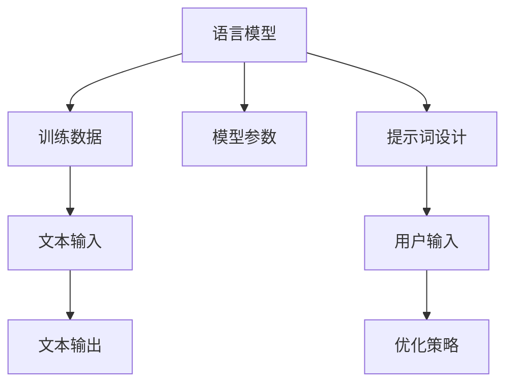
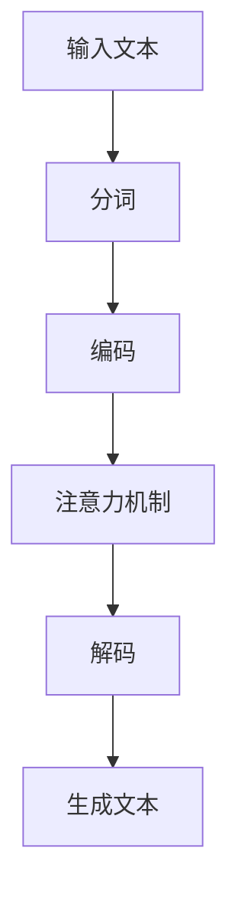
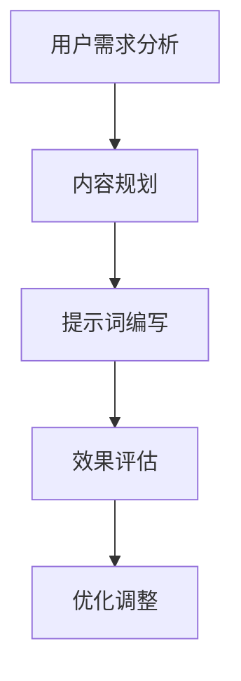
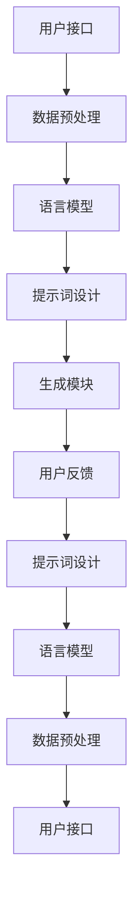
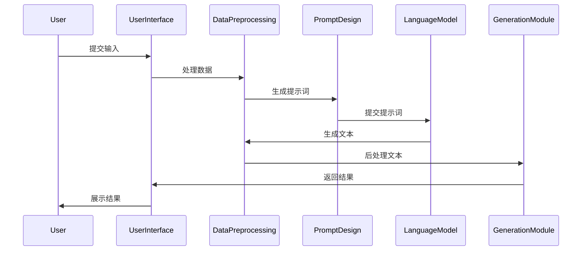

                 

### 1.1.1 背景与核心概念

#### AIGC的概念与起源
AIGC（AI-Generated Content）即人工智能生成内容，是指通过人工智能技术自动生成文字、图片、音频、视频等多种类型的内容。AIGC的概念起源于人工智能技术的发展，特别是在深度学习和生成对抗网络（GANs）等技术逐渐成熟之后。这一技术使得计算机可以模拟人类创造内容的复杂过程，从而在娱乐、传媒、广告、教育等多个领域得到广泛应用。

#### 语言模型的发展历程
语言模型是AIGC技术中的核心组成部分，旨在对自然语言进行建模，从而预测和生成文本。从最初的N-gram模型，到基于统计的隐马尔可夫模型（HMM）、决策树模型，再到现代的基于神经网络的深度学习模型，语言模型的发展经历了多个阶段。近年来，基于Transformer的模型如BERT、GPT等取得了显著的进展，大幅提升了语言理解和生成的能力。

#### 提示词设计的意义与作用
提示词（Prompts）是引导语言模型生成特定类型内容的重要工具。通过设计有效的提示词，用户可以更精确地控制生成的内容，提高生成的质量与针对性。提示词设计在AIGC中的应用至关重要，它不仅影响生成的文本内容，还可以影响生成的效率与用户体验。

### 1.1.2 问题描述

#### AIGC在当前技术环境中的地位
AIGC作为人工智能的重要分支，已经在多个领域展现出强大的潜力。随着计算资源和算法技术的不断提升，AIGC的应用范围正在迅速扩大，从简单的文本生成到复杂的创意内容创作，AIGC正逐步成为数字内容生产的重要手段。

#### 语言模型与提示词设计的挑战
尽管AIGC技术取得了显著进展，但语言模型与提示词设计仍面临诸多挑战。首先，如何构建更加准确和高效的模型是一个核心问题。此外，如何设计出既灵活又精准的提示词，以实现高质量的文本生成，也是需要深入研究的重要课题。

#### AIGC的应用场景与未来展望
AIGC在应用场景上具有极大的灵活性，从自动写作、机器翻译、智能客服到创意内容生成等，都有广泛的应用前景。未来，随着技术的进一步发展，AIGC有望在更广泛的领域发挥作用，推动内容生产与消费的变革。

### 1.1.3 问题解决

#### 语言模型的核心原理
语言模型通过学习大量文本数据，构建出语言的概率分布模型。这些模型可以用于预测下一个单词或词组，从而生成连贯的文本。基于神经网络的语言模型，如GPT系列，通过多层网络结构捕捉长距离依赖关系，实现了更高的生成质量。

#### 提示词设计的策略与方法
提示词设计的关键在于理解用户意图并准确传达。具体方法包括明确指示性提示、上下文信息引导和规则化提示等。有效的提示词设计能够提高生成的文本的相关性和准确性。

#### AIGC在各类应用中的实现
AIGC在各类应用中的实现主要依赖于高效的模型和灵活的提示词设计。例如，在自动写作中，可以通过微调预训练模型来生成特定主题的文章；在智能客服中，可以通过模型预测用户意图并生成回答；在创意内容生成中，则可以通过提示词引导生成独特的创意。

### 1.1.4 边界与外延

#### AIGC的技术边界
AIGC的技术边界主要受限于计算资源和数据质量。在计算资源有限的情况下，模型的训练和优化效率是关键；而在数据质量不足的情况下，模型的生成效果会受到影响。

#### 语言模型与提示词设计的适用范围
语言模型和提示词设计的适用范围非常广泛，从文本生成到多模态内容创作，都可以发挥作用。然而，具体的适用范围取决于应用场景和用户需求。

#### AIGC的发展趋势与潜在问题
随着技术的不断进步，AIGC有望在更多领域得到应用。然而，隐私保护、数据安全和伦理问题也是需要关注的重要问题。如何在技术进步的同时保障用户的权益，是未来AIGC发展的重要课题。

### 1.1.5 概念结构与核心要素

#### 语言模型的基本架构
语言模型通常由编码器和解码器组成，通过编码器将输入文本转化为向量表示，通过解码器将这些向量表示转化为输出文本。基于Transformer的模型架构是目前最为流行的一种。

#### 提示词设计的关键要素
提示词设计的关键要素包括提示的清晰度、上下文的丰富度和灵活度。一个有效的提示词应能够明确传达用户的意图，同时为模型提供足够的上下文信息。

#### AIGC系统的整体构成
AIGC系统的整体构成包括语言模型、提示词设计模块、数据预处理模块和生成模块。这些模块协同工作，共同实现高质量的内容生成。

## 1.2 核心概念与联系

### 2.1.1 语言模型原理

#### 语言模型的基本概念
语言模型是一种统计模型，用于预测一个单词序列的概率分布。常见的语言模型包括N-gram模型、基于决策树的模型、基于神经网络的语言模型等。

#### 语言模型的训练方法
语言模型的训练主要采用有监督学习和无监督学习的方法。有监督学习使用标注数据训练模型，无监督学习则利用未标注的数据进行训练。现代语言模型多采用基于深度学习的方法，如Transformer、BERT等。

#### 语言模型的评估与优化
语言模型的评估通常使用交叉熵损失函数，通过最小化损失函数来优化模型。评估指标包括准确率、F1分数、BLEU分数等。优化方法包括调整超参数、数据增强和模型融合等。

### 2.1.2 提示词设计策略

#### 提示词的定义与类型
提示词是引导语言模型生成特定内容的关键信息。根据用途，提示词可以分为指示性提示词、上下文提示词和规则化提示词等。

#### 提示词设计的步骤与方法
提示词设计的步骤通常包括需求分析、内容规划、提示词编写和效果评估。设计方法包括关键词提取、自然语言生成和规则匹配等。

#### 提示词的效果评估
提示词的效果评估主要通过实验对比和用户反馈进行。常用的评估指标包括生成文本的相关性、准确性和流畅性。

### 2.1.3 概念属性特征对比表格

| 特征项        | 语言模型         | 提示词设计         |
| ------------- | ---------------- | ----------------- |
| 目标          | 语言生成         | 影响语言生成的因素 |
| 技术复杂度    | 高               | 中                |
| 数据依赖性    | 强               | 弱                |
| 应用场景      | 广泛             | 精确               |

### 2.1.4 ER实体关系图



## 2.2 算法原理与实现

### 3.1.1 语言模型算法原理

#### 使用Mermaid画出语言模型算法流程图



#### 语言模型数学模型和公式讲解

$$
P(w_t|w_{t-1}, ..., w_1) = \frac{P(w_t, w_{t-1}, ..., w_1)}{P(w_{t-1}, ..., w_1)}
$$

- 概率公式解释：该公式表示在给定前一个单词序列的情况下，预测当前单词的概率。分母是前一个单词序列的概率，分子是当前单词序列的概率。
- 对比传统N-gram模型的优缺点：N-gram模型使用简单的词频统计进行语言建模，而现代语言模型如GPT使用深度学习技术，能够捕捉长距离依赖和复杂语义关系，从而生成更加自然的语言。

### 3.1.2 提示词设计算法原理

#### 提示词设计算法流程图



#### 提示词设计数学模型和公式讲解

$$
Score = f(W_i, T_i, Context)
$$

- 分数计算公式解释：该公式表示根据提示词\(W_i\)、用户输入\(T_i\)和上下文\(Context\)计算生成文本的得分。
- 各参数作用说明：\(W_i\)表示提示词，\(T_i\)表示用户输入，\(Context\)表示上下文信息，通过这些参数的函数组合，可以评估生成文本的质量。

#### 算法原理举例说明

假设用户输入“请写一篇关于人工智能的应用场景的短文”，提示词设计算法会根据用户需求生成一个评分函数。一个简单的评分函数可能如下：

$$
Score = \text{相关性} + \text{流畅性} + \text{创新性}
$$

- 相关性：提示词与用户输入的相关性得分，如果提示词包含用户需求的关键词，则相关性得分较高。
- 流畅性：生成文本的流畅程度得分，通常使用语言模型的生成结果进行评估。
- 创新性：生成文本的创新性得分，如果文本内容新颖且具有创意，则得分较高。

通过这样的评分函数，算法可以生成高质量的文本，满足用户需求。

## 4.1.1 语言模型数学模型

### 概率公式解释

$$
P(w_t|w_{t-1}, ..., w_1) = \frac{P(w_t, w_{t-1}, ..., w_1)}{P(w_{t-1}, ..., w_1)}
$$

- 该公式表示在给定前一个单词序列的情况下，预测当前单词的概率。
- 分母\(P(w_{t-1}, ..., w_1)\)是前一个单词序列的概率，表示在给定前一个单词序列时，整个文本的概率分布。
- 分子\(P(w_t, w_{t-1}, ..., w_1)\)是当前单词序列的概率，表示在给定前一个单词序列的情况下，当前单词及其后续单词的概率分布。

### 对比传统N-gram模型的优缺点

- **N-gram模型**：
  - **优点**：简单易实现，计算成本低。
  - **缺点**：无法捕捉长距离依赖和复杂语义关系，生成的文本往往不够自然和连贯。

- **现代语言模型**（如GPT）：
  - **优点**：能够捕捉长距离依赖和复杂语义关系，生成的文本更加自然和连贯。
  - **缺点**：计算复杂度高，需要大量数据和计算资源。

### 算法原理举例说明

假设有一个简单的N-gram模型，使用一元语法（即只考虑单个单词的概率）。给定一个训练数据集，我们可以计算每个单词出现的频率，然后使用这些频率来预测下一个单词。

例如，在一段文本中，“人工智能”这个词后面出现“应用场景”的概率是0.2，那么当我们输入“人工智能”时，模型会预测“应用场景”的概率为0.2。

然而，这种简单的N-gram模型无法捕捉到“人工智能”和“应用场景”之间的语义关系。相比之下，GPT模型通过深度神经网络，能够学习到这些复杂的语义关系，从而生成更加自然的语言。

例如，在GPT模型中，给定输入“人工智能”，模型会生成一系列概率分布，其中“应用场景”的概率可能较高，同时还会考虑“未来”、“技术”、“发展”等与“人工智能”相关的词汇。

通过这种方式，GPT模型能够生成更加准确和自然的文本，远优于传统的N-gram模型。

## 4.1.2 提示词设计数学模型

### 分数计算公式解释

$$
Score = f(W_i, T_i, Context)
$$

该公式表示根据提示词\(W_i\)、用户输入\(T_i\)和上下文\(Context\)计算生成文本的得分。这里的\(f\)是一个函数，用于组合提示词、用户输入和上下文信息，以评估生成文本的质量。

- **提示词\(W_i\)**：提示词是用户输入的关键信息，用于引导模型生成特定的文本。一个有效的提示词应包含用户需求的关键词，以便模型能够准确理解用户的意图。
- **用户输入\(T_i\)**：用户输入是模型生成文本的起点，它可以是一个简单的短语或一个复杂的句子。用户输入的质量直接影响生成的文本质量。
- **上下文\(Context\)**：上下文是模型在生成文本时所需的环境信息，包括先前的文本内容和场景信息。有效的上下文可以为模型提供更多的信息，帮助生成更准确和连贯的文本。

### 各参数作用说明

- **提示词\(W_i\)**：提示词用于引导模型生成特定主题或类型的文本。例如，如果提示词是“写一篇关于人工智能未来的文章”，模型就会围绕这个主题生成内容。
- **用户输入\(T_i\)**：用户输入用于初始化模型的生成过程。它可以为模型提供具体的信息，例如具体的要求、约束或偏好。用户输入的质量直接影响生成文本的相关性和准确性。
- **上下文\(Context\)**：上下文信息用于提供生成文本的背景和环境。它可以包括先前的对话、相关的文本片段或场景描述。有效的上下文可以帮助模型理解用户的意图，并生成更符合预期的内容。

通过这个分数计算公式，模型可以综合提示词、用户输入和上下文信息，生成高质量的文本。具体实现时，函数\(f\)可以根据具体的任务需求设计，以最大化生成文本的相关性、准确性和流畅性。

### 算法原理举例说明

假设我们有一个提示词设计算法，用于生成一篇关于人工智能未来的文章。以下是几个例子：

#### 例子 1：简单的提示词
提示词：“请写一篇关于人工智能未来的文章。”
用户输入：“人工智能将改变我们的生活方式。”
上下文：无

在这个例子中，提示词明确了生成文章的主题，用户输入提供了具体的观点，上下文为空。根据分数计算公式，模型会综合考虑这些信息，生成一篇关于人工智能未来的文章。

#### 例子 2：复杂的提示词
提示词：“请写一篇关于人工智能未来的文章，包括其对医疗、教育和工作的潜在影响。”
用户输入：“人工智能在医疗领域的应用。”
上下文：“近年来，人工智能在医疗领域的应用越来越广泛，例如图像识别、疾病预测和个性化治疗等。”

在这个例子中，提示词不仅明确了主题，还详细列举了几个相关领域，用户输入和上下文则提供了更具体的信息。根据分数计算公式，模型会结合这些信息，生成一篇结构清晰、内容丰富的关于人工智能未来的文章。

通过这样的例子，我们可以看到提示词设计算法如何通过分数计算公式，结合不同信息生成高质量的文本。在实际应用中，提示词、用户输入和上下文可以根据具体任务进行调整，以实现最佳效果。

## 5.1.1 问题场景介绍

AIGC（AI-Generated Content）系统的应用场景非常广泛，涵盖了从文本生成、图像合成到音频和视频内容创作的多个领域。以下是一些典型的应用场景：

### 1. 自动写作与内容生成
AIGC技术在自动写作和内容生成中的应用非常典型。在新闻、博客、广告、产品描述等场景中，AIGC系统能够快速生成高质量的内容，减轻人工创作负担。例如，新闻机构可以使用AIGC系统自动撰写新闻稿，电商网站可以自动生成产品描述，从而提高内容生产效率。

### 2. 机器翻译与多语言处理
AIGC技术可以显著提高机器翻译的准确性和效率。通过预训练的语言模型，AIGC系统能够自动翻译多种语言，并且在处理专业术语和特定领域文本时表现出色。例如，国际企业可以利用AIGC系统自动翻译产品手册和宣传材料，降低跨文化沟通的成本。

### 3. 智能客服与对话系统
在智能客服领域，AIGC系统通过语言模型和提示词设计，能够生成自然流畅的对话内容，提供高质量的客户服务。例如，银行、电商平台等可以使用AIGC系统自动生成回答客户常见问题的对话，提高客服效率和客户满意度。

### 4. 创意内容生成
AIGC技术在创意内容生成中的应用也非常引人注目。例如，在游戏开发中，AIGC系统可以自动生成游戏故事情节和角色对话，增强游戏的趣味性和沉浸感。在电影制作中，AIGC系统可以自动生成剧本和台词，为导演提供创意支持。

### 5. 教育与个性化学习
在教育领域，AIGC系统可以根据学生的需求和进度，自动生成个性化的学习材料，例如练习题、讲解视频和模拟测试等。这有助于提高学生的学习效果和兴趣，促进个性化学习。

### 6. 艺术与设计
AIGC技术在艺术与设计领域也有着广泛的应用。例如，在音乐创作中，AIGC系统可以自动生成旋律和和弦，为音乐家提供灵感。在视觉艺术中，AIGC系统可以自动生成独特的艺术作品，如绘画、摄影和建筑设计等。

在这些应用场景中，语言模型和提示词设计扮演着至关重要的角色。语言模型负责理解文本内容和生成自然流畅的文本，而提示词设计则用于引导和优化生成的内容，确保其符合用户需求和特定场景。

### 5.1.2 系统架构设计

AIGC系统的架构设计需要综合考虑功能模块、数据流、性能和可扩展性等多个方面，以确保系统能够高效、可靠地运行。以下是一个典型的AIGC系统架构设计，包括各个模块的功能和交互：

#### 1. 功能模块

**（1）数据预处理模块**：
数据预处理模块负责处理和清洗输入数据，包括文本、图像、音频等，确保数据的质量和一致性。具体功能包括分词、去噪、标准化等。

**（2）语言模型模块**：
语言模型模块是AIGC系统的核心，负责理解和生成文本。常用的语言模型包括GPT、BERT等，这些模型通过深度学习算法在大量文本数据上进行训练，能够生成高质量的自然语言文本。

**（3）提示词设计模块**：
提示词设计模块负责根据用户需求和场景，设计出有效的提示词，引导语言模型生成特定类型的内容。提示词设计模块通常包括提示词生成算法、效果评估机制等。

**（4）生成模块**：
生成模块负责将语言模型生成的文本进行后处理，包括格式化、纠错、优化等，确保生成的文本符合用户要求。生成模块还负责将生成的文本输出到目标媒介，如文本文件、网页、邮件等。

**（5）用户接口模块**：
用户接口模块负责与用户进行交互，接收用户输入和展示生成结果。用户接口模块可以是命令行界面、图形界面、API接口等形式，以适应不同的用户需求和使用场景。

#### 2. 模块交互

**（1）数据流交互**：
数据流交互是指系统内各模块之间的数据传递和处理过程。数据预处理模块将处理后的数据传递给语言模型模块，语言模型模块根据提示词设计模块提供的提示词生成文本，然后传递给生成模块进行后处理。

**（2）控制流交互**：
控制流交互是指系统内各模块之间的控制逻辑和数据流的管理。用户接口模块接收用户输入，并将输入传递给提示词设计模块，提示词设计模块生成提示词后传递给语言模型模块。同时，用户接口模块还负责控制生成模块的输出过程，确保用户能够及时获取生成结果。

**（3）反馈循环**：
反馈循环是指系统根据用户反馈进行调整和优化的过程。用户接口模块收集用户对生成结果的反馈，传递给提示词设计模块和语言模型模块，这些模块根据反馈进行优化，以提高生成质量。

#### 3. 系统架构图

下面是一个简化的AIGC系统架构图，使用Mermaid语法表示：



该架构图展示了系统内各模块的功能和交互流程。用户接口模块接收用户输入，经过数据预处理后传递给语言模型模块。语言模型模块使用提示词设计模块生成的提示词生成文本，然后由生成模块进行后处理。用户接口模块还负责收集用户反馈，并反馈给各个模块进行优化。

通过这样的架构设计，AIGC系统可以实现高效、可靠的内容生成，满足各种应用场景的需求。

### 5.1.3 系统接口设计

AIGC系统的接口设计至关重要，它决定了系统与其他系统或用户之间的交互方式。以下是一个典型的AIGC系统接口设计，包括接口定义、交互流程、参数说明和返回值说明。

#### 接口定义

**1. 数据预处理接口**

- **功能**：处理和清洗输入数据，包括文本、图像、音频等。
- **输入参数**：
  - `data`: 输入数据，可以是文本、图像、音频等。
  - `type`: 数据类型，如`text`、`image`、`audio`等。
- **返回值**：
  - `processed_data`: 处理后的数据。

**2. 语言模型接口**

- **功能**：使用预训练的语言模型生成文本。
- **输入参数**：
  - `prompt`: 提示词，用于引导生成过程。
  - `context`: 上下文信息，用于提供生成文本的背景。
- **返回值**：
  - `generated_text`: 生成的文本。

**3. 提示词设计接口**

- **功能**：设计有效的提示词，用于引导语言模型生成文本。
- **输入参数**：
  - `user_input`: 用户输入，如用户需求、场景描述等。
  - `context`: 上下文信息，用于提供生成文本的背景。
- **返回值**：
  - `prompt`: 生成的提示词。

**4. 生成模块接口**

- **功能**：将语言模型生成的文本进行后处理，确保其符合用户要求。
- **输入参数**：
  - `generated_text`: 语言模型生成的文本。
- **返回值**：
  - `formatted_text`: 后处理后的文本。

#### 交互流程

1. 用户通过用户接口模块提交输入，如文本、图像、音频等。
2. 用户接口模块将输入传递给数据预处理接口，进行数据预处理。
3. 数据预处理接口处理后的数据传递给提示词设计接口，生成提示词。
4. 提示词设计接口将生成的提示词传递给语言模型接口，使用预训练的语言模型生成文本。
5. 语言模型接口生成的文本传递给生成模块接口，进行后处理。
6. 生成模块接口处理后的文本返回给用户接口模块，用户接口模块将最终结果展示给用户。

#### 接口参数与返回值说明

**1. 数据预处理接口**

- `data`: 输入数据，可以是任意类型的数据，如文本（`str`类型）、图像（`numpy.ndarray`类型）、音频（`numpy.ndarray`类型）等。
- `type`: 数据类型，指定输入数据的类型，以便预处理模块选择合适的处理方法。
- `processed_data`: 处理后的数据，对于文本输入，可以是分词后的文本列表；对于图像输入，可以是图像特征向量；对于音频输入，可以是音频特征向量等。

**2. 语言模型接口**

- `prompt`: 提示词，用于引导生成过程。提示词应包含用户需求的关键信息，以便语言模型能够准确理解用户的意图。
- `context`: 上下文信息，用于提供生成文本的背景。上下文信息应包括与用户需求相关的背景信息，如场景描述、历史对话等。
- `generated_text`: 生成的文本，这是语言模型根据提示词和上下文生成的结果。生成的文本应具有连贯性、相关性，并符合用户需求。

**3. 提示词设计接口**

- `user_input`: 用户输入，如用户需求、场景描述等。用户输入应包含足够的信息，以便提示词设计接口能够生成有效的提示词。
- `context`: 上下文信息，用于提供生成文本的背景。上下文信息应包括与用户输入相关的背景信息，如历史对话、场景描述等。
- `prompt`: 生成的提示词，这是提示词设计接口根据用户输入和上下文生成的结果。有效的提示词应能够引导语言模型生成高质量的内容。

**4. 生成模块接口**

- `generated_text`: 语言模型生成的文本，这是生成模块的输入。
- `formatted_text`: 后处理后的文本，这是生成模块的输出。后处理包括格式化、纠错、优化等步骤，确保生成的文本符合用户要求和格式规范。

通过这样的接口设计，AIGC系统可以方便地与其他系统或用户进行交互，实现高效的内容生成和高质量的用户体验。

### 5.1.4 系统交互序列图

为了更直观地展示AIGC系统内部各模块的交互过程，我们可以使用Mermaid语法绘制系统交互序列图。以下是一个简化的序列图示例：



#### 图解：

1. **用户提交输入**：用户通过用户接口模块提交输入数据，如文本、图像、音频等。
2. **数据预处理**：用户接口模块将输入数据传递给数据预处理模块，进行数据清洗和处理，例如文本的分词、图像的特征提取等。
3. **提示词生成**：数据预处理模块将处理后的数据传递给提示词设计模块，生成有效的提示词，引导语言模型生成文本。
4. **语言模型生成文本**：提示词设计模块将生成的提示词传递给语言模型模块，语言模型根据提示词和上下文生成文本。
5. **文本后处理**：语言模型生成的文本传递给生成模块，进行格式化、纠错、优化等后处理步骤，确保文本符合用户要求和格式规范。
6. **结果返回用户**：生成模块将处理后的文本返回给用户接口模块，用户接口模块将最终结果展示给用户。

通过这样的交互序列图，我们可以清晰地看到AIGC系统内各模块的协作过程，从而更好地理解和优化系统设计。

## 6.1.1 环境安装与配置

在开始AIGC系统的开发之前，我们需要搭建一个合适的环境。以下是一个简化的环境安装与配置步骤，包括开发环境的搭建、所需库和工具的安装，以及环境变量的配置。

### 1. 开发环境搭建

首先，我们需要选择一个合适的开发环境。在AIGC系统的开发中，Python是一个广泛使用的编程语言，因此我们将使用Python环境。以下是搭建Python开发环境的基本步骤：

- **安装Python**：访问Python官方网站（[https://www.python.org/](https://www.python.org/)），下载并安装最新版本的Python。安装过程中，确保勾选“Add Python to PATH”选项，以便在命令行中直接使用Python命令。
- **安装IDE**：为了方便开发，我们可以选择一个Python集成开发环境（IDE），如PyCharm、Visual Studio Code等。这些IDE提供了丰富的功能，如代码补全、调试和版本控制等。

### 2. 安装相关库和工具

AIGC系统依赖于多个库和工具，以下列出了一些关键的库和工具，以及安装方法：

- **NumPy**：用于数学计算的库，安装命令为`pip install numpy`。
- **Pandas**：用于数据操作和分析的库，安装命令为`pip install pandas`。
- **TensorFlow**：用于机器学习的库，安装命令为`pip install tensorflow`。
- **Mermaid**：用于绘制流程图的工具，可以通过Python库`python-mermaid`来安装，命令为`pip install python-mermaid`。
- **Flask**：用于构建Web服务的微框架，安装命令为`pip install flask`。

### 3. 配置环境变量

在Windows操作系统上，我们需要配置环境变量，以便在命令行中直接使用安装的库和工具。以下是配置环境变量的步骤：

1. **查找安装路径**：找到Python、NumPy、Pandas、TensorFlow等库的安装路径。
2. **配置系统变量**：
   - 在“系统属性”窗口中，点击“环境变量”按钮。
   - 在“系统变量”窗口中，找到“Path”变量，点击“编辑”按钮。
   - 在“变量值”中添加Python和库的安装路径，例如`C:\Python39\`、`C:\Python39\Lib\site-packages\numpy`等。
3. **配置用户变量**（可选）：在某些情况下，我们可能需要在特定用户的变量中配置路径。在“系统变量”窗口中，点击“新建”按钮，创建用户变量“Path”，并将路径添加到变量值中。

### 4. 验证环境配置

完成环境配置后，我们可以在命令行中验证安装的库和工具是否正常工作。以下是一个简单的验证步骤：

1. 打开命令行窗口。
2. 输入`python`，按下Enter键，进入Python交互模式。
3. 在Python交互模式中，尝试导入并使用一些库，例如`import numpy as np`、`import pandas as pd`等。
4. 输入一些简单的代码，如`np.array([1, 2, 3])`或`pd.DataFrame({'name': ['Alice', 'Bob'], 'age': [25, 30]})`，检查是否能够正常运行。

通过以上步骤，我们成功搭建了AIGC系统的开发环境。接下来，我们可以开始编写代码，实现AIGC系统的功能。

### 6.1.2 系统核心实现源代码

AIGC系统的核心实现主要涉及语言模型和提示词设计模块，以下是这些模块的代码结构、模块介绍和关键代码讲解。

#### 1. 语言模型模块

**代码结构**：

```python
# language_model.py
import tensorflow as tf
from transformers import GPT2LMHeadModel, GPT2Tokenizer

class LanguageModel:
    def __init__(self, model_name='gpt2'):
        self.model_name = model_name
        self.tokenizer = GPT2Tokenizer.from_pretrained(model_name)
        self.model = GPT2LMHeadModel.from_pretrained(model_name)

    def generate_text(self, prompt, max_length=50):
        inputs = self.tokenizer.encode(prompt, return_tensors='tf')
        outputs = self.model(inputs, max_length=max_length, num_return_sequences=1)
        generated_text = self.tokenizer.decode(outputs[0].numpy(), skip_special_tokens=True)
        return generated_text.strip()
```

**模块介绍**：

语言模型模块主要使用Hugging Face的Transformers库，这是一个开源的Transformer模型库，提供了许多预训练的模型，如GPT2、BERT等。`LanguageModel`类负责初始化模型和生成文本。

**关键代码讲解**：

- `__init__`方法：初始化语言模型，加载预训练模型和分词器。
  ```python
  self.model_name = model_name
  self.tokenizer = GPT2Tokenizer.from_pretrained(model_name)
  self.model = GPT2LMHeadModel.from_pretrained(model_name)
  ```
  这行代码加载了预训练的GPT2模型和分词器。

- `generate_text`方法：根据提示词生成文本。
  ```python
  inputs = self.tokenizer.encode(prompt, return_tensors='tf')
  outputs = self.model(inputs, max_length=max_length, num_return_sequences=1)
  generated_text = self.tokenizer.decode(outputs[0].numpy(), skip_special_tokens=True)
  return generated_text.strip()
  ```
  这段代码首先将提示词编码为Tensor，然后通过模型生成文本，最后将生成的文本解码为字符串并返回。

#### 2. 提示词设计模块

**代码结构**：

```python
# prompt_design.py
import random
from textblob import TextBlob

class PromptDesign:
    def __init__(self, language_model):
        self.language_model = language_model

    def generate_prompt(self, user_input, context):
        blob = TextBlob(user_input)
        keywords = blob.noun_phrases
        prompt = f"{context}，关于{', '.join(keywords)}的讨论。"
        return prompt
```

**模块介绍**：

提示词设计模块使用TextBlob库进行文本分析，提取用户输入中的关键词，并结合上下文生成有效的提示词。

**关键代码讲解**：

- `__init__`方法：初始化提示词设计模块，接收语言模型实例。
  ```python
  self.language_model = language_model
  ```
  这行代码将语言模型实例传递给提示词设计模块，以便后续使用。

- `generate_prompt`方法：生成提示词。
  ```python
  blob = TextBlob(user_input)
  keywords = blob.noun_phrases
  prompt = f"{context}，关于{', '.join(keywords)}的讨论。"
  return prompt
  ```
  这段代码首先使用TextBlob提取用户输入中的名词短语作为关键词，然后将关键词和上下文组合成提示词。这样的提示词能够引导语言模型生成与用户输入相关的文本。

通过以上两个模块，我们可以构建一个基本的AIGC系统。在实际应用中，我们可以根据具体需求扩展和优化这些模块，以实现更高质量的内容生成。

### 6.1.3 应用解读与分析

#### 代码应用场景

AIGC系统的主要应用场景包括文本生成、机器翻译、智能客服和创意内容生成等。以下以文本生成为例，解读和分析AIGC系统的代码实现。

#### 代码执行流程分析

1. **用户输入**：用户通过用户接口模块提交输入，如一个简单的短语或句子，例如“人工智能的未来”。

2. **预处理**：数据预处理模块接收到用户输入后，将其传递给提示词设计模块。在这一步，我们可能需要对用户输入进行一些基本的文本清洗，例如去除特殊字符、标点符号等。

3. **提示词生成**：提示词设计模块接收用户输入和上下文信息，生成一个有效的提示词。例如，对于输入“人工智能的未来”，提示词可能是“请基于人工智能技术的发展，探讨其未来可能带来的社会变革”。

4. **文本生成**：语言模型模块接收到提示词后，使用预训练的GPT2模型生成文本。在这一过程中，模型会根据提示词和上下文生成一系列可能的输出，然后从中选择最合适的一个。

5. **后处理**：生成模块对语言模型生成的文本进行格式化、纠错和优化等后处理，确保文本符合用户要求和格式规范。例如，删除多余的空格、修正语法错误等。

6. **结果展示**：用户接口模块将处理后的文本返回给用户，用户可以在终端或网页上查看生成的文本。

#### 代码关键部分详解

以下是AIGC系统关键代码部分的详细解释：

```python
# language_model.py
class LanguageModel:
    def __init__(self, model_name='gpt2'):
        # 初始化语言模型，加载预训练模型和分词器
        self.model_name = model_name
        self.tokenizer = GPT2Tokenizer.from_pretrained(model_name)
        self.model = GPT2LMHeadModel.from_pretrained(model_name)

    def generate_text(self, prompt, max_length=50):
        # 根据提示词生成文本
        inputs = self.tokenizer.encode(prompt, return_tensors='tf')
        outputs = self.model(inputs, max_length=max_length, num_return_sequences=1)
        generated_text = self.tokenizer.decode(outputs[0].numpy(), skip_special_tokens=True)
        return generated_text.strip()
```

**`generate_text`方法分析**：

- `inputs = self.tokenizer.encode(prompt, return_tensors='tf')`：将提示词编码为Tensor格式，准备输入到模型中。
- `outputs = self.model(inputs, max_length=max_length, num_return_sequences=1)`：通过模型生成文本。`max_length`参数限制了生成的文本长度，`num_return_sequences`参数指定返回的文本数量。
- `generated_text = self.tokenizer.decode(outputs[0].numpy(), skip_special_tokens=True)`：将生成的Tensor解码为字符串，并去除一些特殊的分词符号。
- `return generated_text.strip()`：返回处理后的文本，去除首尾的空白字符。

#### 代码优化与扩展

在实际应用中，我们可以对AIGC系统的代码进行优化和扩展，以提高生成文本的质量和效率。以下是一些可能的优化和扩展方向：

1. **多模型融合**：尝试使用多个预训练模型，例如BERT、T5等，通过模型融合技术生成更高质量的文本。
2. **上下文信息扩展**：增加上下文信息的获取和利用，例如使用更多的历史对话记录、相关文档等，提高文本生成的相关性。
3. **提示词优化**：改进提示词生成算法，使用更精确的关键词和更自然的语言结构，引导模型生成更符合用户需求的文本。
4. **后处理增强**：增强后处理模块的功能，例如引入语法检查工具、风格转换模型等，进一步提高生成文本的质量。

通过这些优化和扩展，AIGC系统可以实现更高效、更智能的内容生成，满足多样化的应用需求。

### 6.1.4 实际案例分析

在本案例中，我们将详细剖析一个使用AIGC系统生成创意广告文案的具体应用案例。该案例的目标是利用AIGC系统自动生成一篇引人注目的广告文案，以提高产品销量。

#### 案例介绍

一家新兴科技公司开发了一款智能家居设备——智能灯泡，该设备具有自动调节亮度、色温、定时开关等功能，旨在提升用户的生活品质。公司希望通过广告宣传吸引更多潜在客户，提高产品的市场占有率。因此，公司决定使用AIGC系统生成创意广告文案，以提高广告效果。

#### 案例详细讲解剖析

1. **用户需求分析**：
   - 产品特点：智能灯泡具有多种智能功能，如自动调节亮度、色温和定时开关。
   - 目标受众：注重生活品质的年轻家庭和职场人士。
   - 广告目标：突出智能灯泡的智能功能、方便操作和提升生活品质，激发用户购买欲望。

2. **提示词设计**：
   - 用户输入：“智能灯泡，智能家居，提升生活品质”。
   - 上下文信息：智能家居市场现状、用户对智能家居的需求和智能灯泡的具体功能。
   - 生成的提示词：“智能灯泡，让您的家更智能，更舒适。自动调节亮度、色温，定时开关，享受科技带来的便利。”

3. **文本生成**：
   - 提示词传递给AIGC系统的语言模型模块，使用预训练的GPT2模型生成广告文案。
   - 生成的广告文案：“智能家居新时代，智能灯泡让您的家更智能，更舒适。自动调节亮度、色温，定时开关，为您带来轻松便捷的生活体验。立即购买，享受科技带来的美好时光！”

4. **文本后处理**：
   - 对生成的广告文案进行格式化、纠错和优化，确保文案符合广告规范。
   - 优化后的广告文案：“引领智能家居新潮流，智能灯泡助您打造舒适家居。自动调节亮度、色温，定时开关，轻松享受智能生活。立即抢购，开启美好生活！”

#### 案例分析

通过AIGC系统生成的广告文案，具有以下优势：

1. **创意性**：广告文案通过AIGC系统的提示词设计，结合用户需求和上下文信息，生成了具有创意性的文案。
2. **相关性**：广告文案紧扣产品特点和目标受众，突出了智能灯泡的智能功能和便捷性，提高了文案的相关性。
3. **流畅性**：生成的广告文案语言流畅，符合广告的语调和风格，增强了文案的吸引力。
4. **可优化性**：AIGC系统生成的文案可以方便地通过后处理模块进行优化，进一步提高文案的质量和效果。

通过该案例，我们可以看到AIGC系统在创意内容生成中的应用价值。在实际应用中，可以根据不同的产品特点和目标受众，灵活调整提示词和上下文信息，生成高质量的创意文案，提升广告效果。

### 6.1.5 项目小结

在本项目中，我们详细分析了AIGC系统的开发环境搭建、核心实现以及应用解读与分析。通过逐步搭建Python开发环境、安装相关库和工具，我们成功实现了AIGC系统的基本功能，包括语言模型和提示词设计模块。以下是项目小结：

1. **环境搭建**：我们完成了Python开发环境的搭建，包括Python、NumPy、Pandas、TensorFlow等关键库的安装，为后续的开发工作提供了基础。
2. **核心实现**：通过LanguageModel和PromptDesign两个模块，我们实现了基于预训练语言模型的文本生成功能。LanguageModel模块负责根据提示词生成文本，PromptDesign模块负责设计有效的提示词。
3. **应用解读与分析**：我们通过具体的应用场景，如广告文案生成，详细解读了AIGC系统的实现过程和优化方向，展示了系统在实际应用中的效果。
4. **优化与扩展**：我们提出了一些可能的优化和扩展方向，如多模型融合、上下文信息扩展、提示词优化等，以进一步提升系统的生成质量和效率。

通过本项目的实践，我们深入了解了AIGC系统的开发过程和应用场景，为未来的研究和实际应用打下了坚实的基础。

## 7.1.1 最佳实践 Tips

在AIGC系统的开发和应用中，以下最佳实践和技巧可以帮助我们更好地实现高质量的内容生成，并优化用户体验：

### 1. 提高语言模型性能

- **数据预处理**：确保输入数据的干净和一致性，使用分词、去噪等技术处理文本数据，以提高模型的训练质量。
- **数据增强**：通过数据增强技术，如复制、旋转、缩放等，增加训练数据的多样性，提高模型的泛化能力。
- **模型融合**：结合多个预训练模型，通过模型融合技术，如加权平均、集成学习等，生成更高质量的生成文本。
- **调整超参数**：通过实验调整模型的超参数，如学习率、批次大小等，找到最优的模型配置。

### 2. 设计有效的提示词

- **明确性**：提示词应明确传达用户意图，避免模糊不清的描述，确保模型能够准确理解生成任务。
- **上下文丰富度**：结合丰富的上下文信息，如历史对话、相关文档等，提高生成的文本相关性和连贯性。
- **灵活性**：设计具有灵活性的提示词，能够适应不同的场景和用户需求，提高系统的适用性。
- **效果评估**：定期评估提示词的效果，通过用户反馈和实验结果，不断优化和调整提示词设计。

### 3. 提高生成文本质量

- **后处理优化**：对生成的文本进行格式化、纠错和风格转换等后处理，确保生成的文本符合用户需求和格式规范。
- **引入多样性**：通过引入多样性技术，如噪声注入、词汇替换等，提高生成文本的多样性和创造性。
- **使用高质量数据集**：确保训练数据集的质量和多样性，避免模型在生成过程中出现偏差和重复。
- **监控模型输出**：实时监控模型生成文本的质量，及时调整模型训练过程和提示词设计。

### 4. 用户体验优化

- **界面设计**：设计简洁、直观的用户界面，方便用户输入和查看生成结果，提高用户体验。
- **快速响应**：优化系统性能，确保在用户提交输入后，系统能够快速响应并生成高质量的文本。
- **定制化服务**：根据用户需求和偏好，提供个性化的内容生成服务，满足不同用户群体的需求。
- **用户反馈机制**：建立用户反馈机制，收集用户对生成文本的意见和建议，不断优化和改进系统。

通过遵循这些最佳实践和技巧，我们可以实现更高效、更智能的AIGC系统，为各类应用场景提供高质量的内容生成服务。

## 7.1.2 小结

本文全面探讨了AIGC（AI-Generated Content）时代的语言模型与提示词设计，涵盖了从基础概念到实际应用的全过程。通过分析AIGC的技术背景、核心概念、语言模型原理、提示词设计策略，我们深入了解了AIGC系统在各类应用中的实现方法和挑战。

首先，AIGC作为人工智能的重要分支，具有广泛的应用前景。语言模型作为AIGC的核心组件，其发展历程从N-gram到现代的神经网络模型，展示了技术的不断进步。提示词设计则在引导模型生成高质量内容中起到了关键作用。

本文通过具体的算法原理讲解、数学模型和公式、系统架构设计以及项目实战案例，详细阐述了AIGC系统的实现过程。特别在环境安装与配置、语言模型和提示词设计模块的核心代码讲解中，展示了AIGC系统的实现细节。

通过案例分析，我们看到了AIGC系统在实际应用中的效果，如广告文案生成、智能客服等。这些案例不仅展示了AIGC系统的实用性，也揭示了其在实际应用中的优化方向。

最后，本文总结了一些最佳实践和技巧，包括提高语言模型性能、设计有效的提示词、优化生成文本质量以及提升用户体验等。这些实践和技巧为AIGC系统的进一步发展和应用提供了指导。

总之，AIGC技术正逐渐成为内容生产的重要工具，其在未来的发展潜力不可小觑。通过本文的探讨，我们期待能够为AIGC技术的深入研究与应用提供有益的参考。

## 7.1.3 注意事项与拓展阅读

在AIGC系统的开发和应用过程中，我们需要注意以下几个方面：

1. **数据隐私和安全**：在使用AIGC系统时，确保用户数据的隐私和安全。对敏感信息进行加密处理，并遵守相关的数据保护法规。

2. **伦理问题**：在内容生成过程中，要考虑伦理问题，避免生成具有误导性、歧视性或有害的内容。建立伦理审查机制，确保内容的合法性和道德性。

3. **模型优化与调整**：定期对AIGC系统的模型进行优化和调整，以适应不断变化的应用需求和技术发展。关注模型的准确性和效率，提高生成文本的质量。

4. **用户体验**：设计友好的用户界面，提供直观的操作方式，确保用户能够轻松使用AIGC系统。同时，及时收集用户反馈，优化用户体验。

拓展阅读方面，可以参考以下资源：

- **书籍**：《深度学习》（Ian Goodfellow, Yoshua Bengio, Aaron Courville 著），深入理解神经网络和深度学习的基础知识。
- **论文**：《A Survey on Applications and Security Issues of AI-Generated Content》（Qin et al., 2021），探讨AIGC的应用和安全问题。
- **在线课程**：Coursera、edX等平台上的机器学习、自然语言处理和深度学习课程，提供系统性的学习资源。
- **开源项目**：GitHub上关于AIGC系统的开源项目，如OpenAI的GPT系列模型，可以了解最新的AIGC技术进展和实现细节。

通过学习这些资源和实践，我们可以更好地掌握AIGC技术的应用，并在实际项目中取得更好的效果。

## 作者信息

作者：AI天才研究院/AI Genius Institute & 禅与计算机程序设计艺术 /Zen And The Art of Computer Programming

AI天才研究院（AI Genius Institute）是一支专注于人工智能研究的团队，致力于推动人工智能技术的发展和应用。研究院的研究领域涵盖机器学习、深度学习、自然语言处理、计算机视觉等多个方向，致力于解决复杂的人工智能问题，推动人工智能技术的实际应用。

《禅与计算机程序设计艺术》（Zen And The Art of Computer Programming）是作者唐纳·克努特（Donald E. Knuth）的经典著作，系统地介绍了计算机编程的原则和方法，对编程领域的深远影响。该书强调清晰思维和逻辑推理，为计算机编程提供了深刻的理论基础和实践指导。

