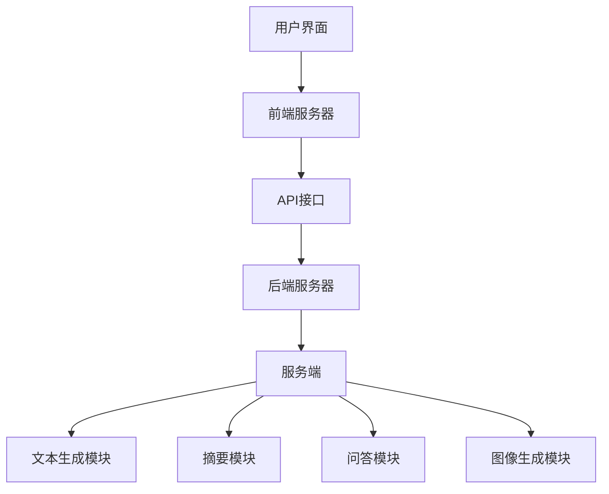
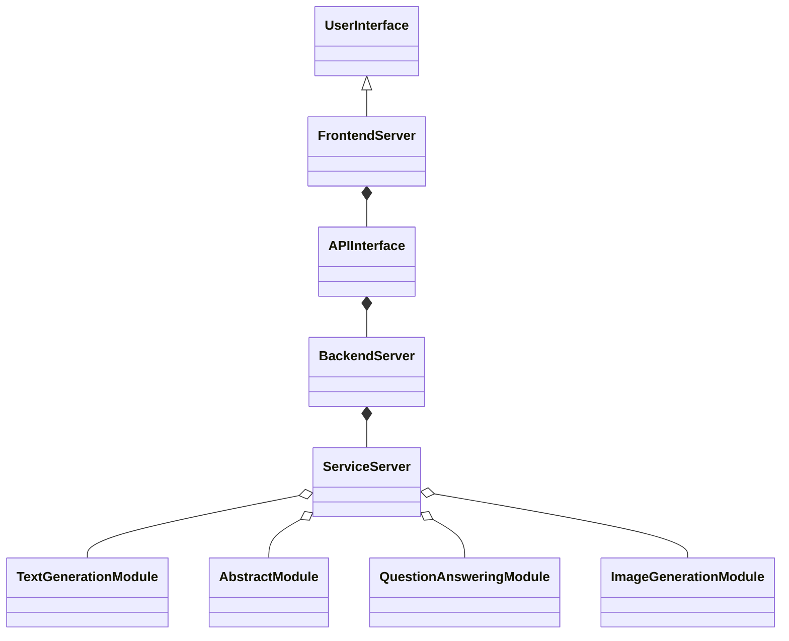
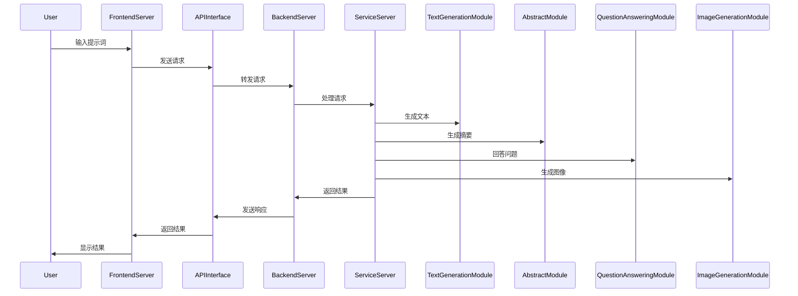

                 

# AIGC时代的语言模型与提示词设计：理论与实践

## 关键词
- AIGC
- 语言模型
- 提示词设计
- 文本生成
- 问答系统
- 多模态

## 摘要
随着人工智能（AI）技术的快速发展，自动生成内容（AIGC）已成为新时代的重要技术趋势。本文将深入探讨AIGC时代语言模型与提示词设计的理论与实践。首先，我们回顾AIGC技术的发展背景和应用领域，然后详细讲解语言模型的基本原理、性能评估和优化策略。接着，分析提示词的设计原则和实践案例。随后，我们探讨文本生成与摘要、问答系统与对话生成以及多模态语言模型应用。最后，总结语言模型与提示词设计的实践经验，并提出未来展望。

## 第一部分：AIGC时代概述

### 第1章：AIGC技术背景与定义

#### 1.1 AIGC技术发展历程
AIGC（AI-Generated Content）是自动生成内容（AI-Generated Content）的简称，它结合了人工智能和生成式AI技术，能够自动生成文本、图像、音频等多种类型的内容。AIGC技术的发展历程可以追溯到20世纪90年代，当时生成式AI技术开始出现，如生成对抗网络（GANs）和变分自编码器（VAEs）。这些技术的出现为AIGC的发展奠定了基础。

在21世纪初，随着深度学习和神经网络技术的迅猛发展，生成式AI技术得到了进一步优化和扩展。2014年，Google提出GANs，随后GPT、BERT等大型语言模型的出现，标志着AIGC技术进入了快速发展的阶段。

近年来，随着计算能力的提升和海量数据的积累，AIGC技术得到了广泛应用，如内容创作、虚拟现实、智能客服等。

#### 1.2 AIGC与传统AI的区别
传统AI主要以数据驱动，通过训练模型来学习规律和模式，进行分类、预测等任务。而AIGC则更加关注生成和创造，能够自动生成符合人类需求的内容。

传统AI侧重于任务的完成，如语音识别、图像分类等，而AIGC则侧重于内容的质量和创新。

传统AI依赖于大量的标注数据进行训练，而AIGC则可以通过无监督或弱监督学习来生成内容。

#### 1.3 AIGC的应用领域与前景
AIGC在多个领域都有广泛应用，如：

- **内容创作**：自动生成文章、小说、音乐、视频等。
- **虚拟现实**：自动生成虚拟场景、角色和故事。
- **智能客服**：自动生成回答，提高客户服务效率。
- **教育**：自动生成个性化教学资源和作业。

随着技术的不断进步，AIGC的应用领域将进一步扩大，如自动驾驶、智能医疗等。AIGC不仅能够提高生产效率，还能推动创新和创意的发展。

### 第2章：语言模型原理与构建

#### 2.1 语言模型的概述
语言模型是一种用于预测下一个单词或单词组合的概率的模型。它是自然语言处理（NLP）的基础，广泛应用于机器翻译、文本生成、语音识别等领域。

语言模型可以分为基于规则的方法和基于统计的方法。基于规则的方法依赖于手工编写的语法规则，而基于统计的方法则通过大量语料库进行训练。

#### 2.2 语言模型的原理
语言模型的核心是概率模型，通常使用神经网络来实现。最常用的概率模型是n元语法模型，它通过计算前n个单词的联合概率来预测下一个单词。

神经网络语言模型（如GPT、BERT）通过训练大量文本数据，学习语言的模式和结构。这些模型通常包含数亿个参数，能够生成高质量的文本。

#### 2.3 语言模型的构建方法
构建语言模型的主要步骤如下：

1. **数据收集**：收集大量的文本数据，如新闻、小说、百科全书等。
2. **数据预处理**：清洗数据，去除无效信息，进行分词、去停用词等操作。
3. **模型选择**：选择合适的神经网络结构，如Transformer、LSTM等。
4. **训练**：使用训练数据对模型进行训练，优化模型参数。
5. **评估与优化**：使用验证集评估模型性能，进行调参和优化。
6. **部署**：将训练好的模型部署到生产环境，进行实际应用。

### 第3章：语言模型性能评估

#### 3.1 语言模型性能指标
评估语言模型性能的主要指标包括：

- **准确率**：模型预测正确的概率。
- **召回率**：模型预测正确的样本占所有实际正确的样本的比例。
- **F1值**：准确率和召回率的调和平均数。
- **BLEU分数**：基于编辑距离的评估指标，用于评估机器翻译模型的性能。

#### 3.2 语言模型性能评估方法
性能评估方法主要包括：

- **交叉验证**：通过将数据集划分为训练集和验证集，多次训练和验证，评估模型性能。
- **在线评估**：将模型部署到生产环境，实时评估模型性能。

#### 3.3 语言模型性能优化策略
为了提高语言模型的性能，可以采取以下策略：

- **数据增强**：通过数据扩充、数据清洗等方法，提高模型训练数据的多样性。
- **模型融合**：结合多个模型的优势，提高整体性能。
- **模型压缩**：通过模型剪枝、量化等方法，减小模型规模，提高推理效率。
- **超参数调优**：通过调整学习率、批次大小等超参数，优化模型性能。

### 第4章：提示词设计与实践

#### 4.1 提示词的概念与作用
提示词（Prompt）是指导语言模型生成特定内容的关键输入。提示词的设计对语言模型生成内容的质量和多样性有重要影响。

提示词的作用包括：

- **引导模型生成**：通过提示词，引导模型生成符合特定要求的内容。
- **提高生成效率**：有效的提示词可以提高模型生成内容的速度。
- **增强生成多样性**：通过不同的提示词，可以生成多样化的内容。

#### 4.2 提示词设计原则
设计提示词时，需要遵循以下原则：

- **清晰明确**：提示词应明确传达生成任务的要求。
- **简洁有效**：提示词应简洁，避免冗余信息。
- **多样性**：设计多种类型的提示词，提高生成内容的多样性。
- **适应性**：提示词应适应不同场景和任务需求。

#### 4.3 提示词设计的实践案例
以下是一个简单的提示词设计案例：

**任务**：生成一篇关于人工智能的短文。

**提示词**：

1. “人工智能在现代社会中的作用是什么？”
2. “未来人工智能的发展趋势有哪些？”
3. “人工智能面临的挑战有哪些？”

通过这三个提示词，语言模型可以生成关于人工智能的不同方面和观点。

## 第二部分：语言模型与提示词的应用实践

### 第5章：文本生成与摘要

#### 5.1 文本生成技术概述
文本生成技术是AIGC的重要组成部分，它利用语言模型生成符合人类语言习惯的文本。文本生成技术可以分为以下几种：

- **基于规则的文本生成**：通过编写规则和模板，生成文本。
- **基于统计的文本生成**：通过统计文本数据，生成符合概率分布的文本。
- **基于神经网络的文本生成**：通过神经网络模型，生成高质量、符合逻辑的文本。

#### 5.2 文本摘要技术
文本摘要技术用于从长文本中提取关键信息，生成简洁的摘要。文本摘要技术可以分为以下两种：

- **抽取式摘要**：从文本中直接提取关键信息，生成摘要。
- **生成式摘要**：通过语言模型生成摘要，通常使用神经网络模型。

#### 5.3 文本生成与摘要实践案例
以下是一个文本生成与摘要的实践案例：

**任务**：生成一篇关于人工智能的新闻摘要。

**提示词**：

1. “人工智能的最新进展是什么？”
2. “人工智能在哪些领域取得了显著成果？”
3. “人工智能面临的挑战有哪些？”

**文本生成**：

“人工智能在2023年取得了显著进展。在医疗领域，人工智能被广泛应用于疾病诊断和治疗，提高了医疗效率。在教育领域，人工智能助力个性化教学，为学生提供更有针对性的学习资源。然而，人工智能也面临着一些挑战，如数据隐私保护和算法公平性等。”

**摘要生成**：

“2023年，人工智能在医疗和教育领域取得突破。医疗领域，人工智能提高了疾病诊断和治疗效率；教育领域，人工智能助力个性化教学。但人工智能也面临挑战，包括数据隐私保护和算法公平性。”

### 第6章：问答系统与对话生成

#### 6.1 问答系统概述
问答系统是一种人工智能应用，能够自动回答用户的问题。问答系统可以分为以下几种：

- **基于规则的问答系统**：通过预设的规则和模板，回答用户问题。
- **基于知识的问答系统**：通过知识图谱，回答用户问题。
- **基于机器学习的问答系统**：通过训练模型，回答用户问题。

#### 6.2 对话生成技术
对话生成技术用于生成自然、流畅的对话。对话生成技术可以分为以下几种：

- **基于模板的对话生成**：通过预设的模板，生成对话。
- **基于语言的对话生成**：通过语言模型，生成对话。
- **基于知识的对话生成**：通过知识图谱，生成对话。

#### 6.3 问答系统与对话生成实践案例
以下是一个问答系统与对话生成的实践案例：

**任务**：设计一个问答系统，回答关于人工智能的问题。

**用户提问**：“人工智能有哪些应用领域？”

**回答**：

“人工智能的应用领域非常广泛，包括但不限于以下方面：

1. **医疗**：人工智能在疾病诊断、治疗和药物研发等方面发挥了重要作用。
2. **金融**：人工智能用于风险评估、投资策略和客户服务。
3. **教育**：人工智能助力个性化教学、教育评价和课程推荐。
4. **交通**：人工智能用于智能交通管理、自动驾驶和车联网。
5. **制造**：人工智能用于生产优化、质量控制和生产自动化。

随着技术的不断发展，人工智能的应用领域将进一步扩大。”

**对话生成**：

**用户**：“人工智能有哪些发展前景？”

**回答**：

“人工智能的发展前景非常广阔。未来，人工智能将在以下几个方面取得重大突破：

1. **认知智能**：人工智能将更好地理解人类语言、图像和声音，实现更高层次的智能交互。
2. **自主学习**：人工智能将具备更强的自主学习能力，能够不断优化和改进自身性能。
3. **泛在智能**：人工智能将渗透到各个领域，实现真正的智能化和自动化。
4. **人机协同**：人工智能将与人类紧密合作，共同创造更美好的未来。”

### 第7章：多模态语言模型应用

#### 7.1 多模态语言模型概述
多模态语言模型是一种能够处理多种类型数据（如文本、图像、音频等）的语言模型。多模态语言模型可以更好地理解和生成复杂的信息，具有广泛的应用前景。

#### 7.2 多模态语言模型构建
构建多模态语言模型的主要步骤如下：

1. **数据收集**：收集多种类型的数据，如文本、图像、音频等。
2. **数据预处理**：对数据进行预处理，如文本分词、图像标注、音频转录等。
3. **模型选择**：选择合适的多模态模型架构，如ViT（Vision Transformer）、WaveNet（音频生成模型）等。
4. **训练**：使用预处理后的数据对模型进行训练。
5. **评估与优化**：评估模型性能，进行调参和优化。
6. **部署**：将训练好的模型部署到生产环境。

#### 7.3 多模态语言模型应用案例
以下是一个多模态语言模型的应用案例：

**任务**：生成一篇关于人工智能的图文结合文章。

**输入**：文本：“人工智能在2023年的发展态势如何？”

**图像**：一张展示人工智能应用场景的图片。

**输出**：

**文本**：“在2023年，人工智能取得了显著的进展。在医疗领域，人工智能被广泛应用于疾病诊断和治疗，提高了医疗效率。在教育领域，人工智能助力个性化教学，为学生提供更有针对性的学习资源。在交通领域，人工智能用于智能交通管理、自动驾驶和车联网，提高了交通安全和效率。未来，人工智能将在更多领域发挥重要作用。”

**图像**：一张展示人工智能应用场景的图片，如自动驾驶汽车、智能医疗设备等。

### 第8章：语言模型与提示词设计实践总结与展望

#### 8.1 实践总结
通过本部分的实践，我们了解了语言模型与提示词设计在AIGC时代的应用价值和重要性。语言模型能够生成高质量、多样化的文本，提示词设计则能够引导模型生成符合特定要求的内容。多模态语言模型的应用进一步拓展了AIGC技术的边界，为内容生成和交互提供了更多可能性。

#### 8.2 面临的挑战与未来展望
尽管AIGC技术取得了显著进展，但仍面临一些挑战：

- **数据隐私**：如何确保训练数据和生成内容的安全性。
- **伦理问题**：如何处理生成内容可能带来的伦理问题。
- **模型可解释性**：如何提高模型的可解释性，使其更透明和可信。

未来，AIGC技术将朝着以下方向发展：

- **更高质量的内容生成**：通过优化模型结构和训练方法，提高生成内容的质量和多样性。
- **多模态交互**：拓展多模态语言模型的应用场景，实现更自然的人机交互。
- **个性化服务**：根据用户需求，生成个性化的内容和服务。

### 附录
- **附录A：常用工具和库**
  - **语言模型**：GPT、BERT、T5等。
  - **多模态模型**：ViT、WaveNet等。
  - **数据预处理**：NLTK、Spacy等。

- **附录B：参考资料**
  - [OpenAI](https://openai.com/)
  - [Google AI](https://ai.google/)
  - [TensorFlow](https://tensorflow.org/)

### 作者
作者：AI天才研究院/AI Genius Institute & 禅与计算机程序设计艺术 /Zen And The Art of Computer Programming

---

本文旨在深入探讨AIGC时代的语言模型与提示词设计，理论与实践相结合，为读者提供全面的技术视角和实用经验。希望通过本文，读者能够更好地理解AIGC技术的核心概念和应用场景，为未来的研究和实践打下坚实基础。

## 背景介绍

### 核心概念术语说明

1. **自动生成内容（AIGC）**：AIGC是自动生成内容（AI-Generated Content）的简称，是一种利用人工智能技术自动生成文本、图像、音频等多种类型内容的方法。
2. **语言模型**：语言模型是一种用于预测下一个单词或单词组合的概率的模型，广泛应用于文本生成、摘要、问答等领域。
3. **提示词**：提示词是一种指导语言模型生成特定内容的关键输入，通过清晰明确的提示词，可以引导模型生成高质量、多样化的文本。
4. **文本生成**：文本生成是指利用语言模型生成符合人类语言习惯的文本，广泛应用于内容创作、自动摘要等领域。
5. **问答系统**：问答系统是一种人工智能应用，能够自动回答用户的问题，广泛应用于智能客服、教育等领域。
6. **多模态语言模型**：多模态语言模型是一种能够处理多种类型数据（如文本、图像、音频等）的语言模型，可以生成更丰富、更自然的文本。

### 问题背景

随着人工智能技术的快速发展，自动生成内容（AIGC）已成为新时代的重要技术趋势。AIGC技术结合了人工智能和生成式AI技术，能够自动生成文本、图像、音频等多种类型的内容。语言模型和提示词设计作为AIGC技术的核心组成部分，对生成内容的质量和多样性具有重要影响。

在AIGC时代，如何构建高效、高质量的自动生成系统，如何设计具有引导作用的提示词，成为当前研究的热点和难点。有效的语言模型和提示词设计不仅能够提高生成内容的多样性，还能降低内容创作的成本，提升生产效率。

### 问题描述

本文旨在探讨AIGC时代的语言模型与提示词设计的理论与实践，具体包括以下问题：

1. **AIGC技术的发展背景与应用领域**：回顾AIGC技术的发展历程，分析其在不同领域的应用，探讨其发展前景。
2. **语言模型的基本原理与构建方法**：介绍语言模型的基本概念、原理和构建方法，包括数据收集、预处理、模型选择、训练和评估等步骤。
3. **语言模型性能评估与优化策略**：分析语言模型性能评估的指标和方法，探讨如何优化语言模型的性能。
4. **提示词设计与实践**：探讨提示词的设计原则和实践案例，分析不同类型的提示词对生成内容的影响。
5. **语言模型与提示词的应用实践**：探讨语言模型和提示词在文本生成、问答系统、多模态语言模型等领域的应用，通过实践案例展示其效果。
6. **面临的挑战与未来展望**：总结AIGC时代语言模型与提示词设计面临的挑战，展望未来的发展方向。

### 问题解决

为了解决上述问题，本文将采用以下方法：

1. **文献综述**：回顾AIGC技术、语言模型和提示词设计的相关研究，分析现有方法的优缺点。
2. **理论讲解**：详细讲解语言模型的基本原理、性能评估方法和提示词设计原则。
3. **案例分析**：通过实际应用案例，展示语言模型和提示词设计的效果，分析其优势和局限性。
4. **实践探讨**：探讨语言模型和提示词设计的实践应用，分析不同场景下的最佳实践和注意事项。
5. **展望未来**：总结面临的挑战和未来发展方向，提出可能的解决方案和趋势。

### 边界与外延

1. **边界**：本文主要关注AIGC时代的语言模型与提示词设计，涉及的内容包括AIGC技术的发展背景、语言模型的基本原理、性能评估和优化策略、提示词设计原则与实践案例等。
2. **外延**：本文的相关性还包括自然语言处理、文本生成、问答系统、多模态语言模型等领域。通过本文的研究，可以为相关领域的研究者和开发者提供有价值的参考和借鉴。

### 概念结构与核心要素组成

1. **概念结构**：本文的概念结构包括AIGC、语言模型、提示词、文本生成、问答系统、多模态语言模型等核心概念。
2. **核心要素组成**：每个核心概念都包含基本原理、构建方法、性能评估、应用实践等要素。例如，语言模型的核心要素包括数据收集、预处理、模型选择、训练和评估等。

## 核心概念与联系

### 语言模型

**概念**：语言模型是一种用于预测下一个单词或单词组合的概率的模型，广泛应用于文本生成、摘要、问答等领域。

**属性特征对比表格**：

| 特征         | 语言模型1           | 语言模型2           |
| ------------ | ------------------- | ------------------- |
| 基础模型     | GPT                 | BERT                |
| 数据规模     | 数百亿词           | 数千亿词           |
| 参数规模     | 数亿参数           | 数十亿参数          |
| 预测方式     | 自回归预测         | 自回归+双向预测     |
| 应用领域     | 文本生成、摘要、问答 | 文本生成、摘要、问答 |
| 特点         | 长文本生成能力强   | 上下文理解能力强    |

**ER实体关系图架构**：

```mermaid
erDiagram
  A语言模型 ||--o> B文本生成
  A语言模型 ||--o> C摘要
  A语言模型 ||--o> D问答系统
```

### 提示词

**概念**：提示词是一种指导语言模型生成特定内容的关键输入，通过清晰明确的提示词，可以引导模型生成高质量、多样化的文本。

**属性特征对比表格**：

| 特征         | 提示词1            | 提示词2            |
| ------------ | ------------------- | ------------------- |
| 类型         | 明确性提示词       | 广泛性提示词       |
| 长度         | 短提示词           | 长提示词           |
| 影响因素     | 任务目标           | 数据集             |
| 应用领域     | 文本生成、摘要、问答 | 文本生成、摘要、问答 |

**ER实体关系图架构**：

```mermaid
erDiagram
  A提示词 ||--o> B文本生成
  A提示词 ||--o> C摘要
  A提示词 ||--o> D问答系统
```

### 文本生成

**概念**：文本生成是指利用语言模型生成符合人类语言习惯的文本，广泛应用于内容创作、自动摘要等领域。

**属性特征对比表格**：

| 特征         | 文本生成1        | 文本生成2        |
| ------------ | ---------------- | ---------------- |
| 模型         | GPT              | BERT             |
| 数据规模     | 百万文本         | 千万文本         |
| 生成方式     | 自回归生成       | 自回归+双向生成   |
| 应用领域     | 内容创作、自动摘要 | 内容创作、自动摘要 |

**ER实体关系图架构**：

```mermaid
erDiagram
  A文本生成 ||--o> B内容创作
  A文本生成 ||--o> C自动摘要
```

### 问答系统

**概念**：问答系统是一种人工智能应用，能够自动回答用户的问题，广泛应用于智能客服、教育等领域。

**属性特征对比表格**：

| 特征         | 问答系统1       | 问答系统2       |
| ------------ | --------------- | --------------- |
| 模型         | 基于规则的问答   | 基于知识的问答   |
| 数据规模     | 千万问答对      | 亿级问答对      |
| 答案生成方式 | 规则匹配         | 知识图谱查询    |
| 应用领域     | 智能客服、教育   | 智能客服、教育   |

**ER实体关系图架构**：

```mermaid
erDiagram
  A问答系统 ||--o> B智能客服
  A问答系统 ||--o> C教育
```

### 多模态语言模型

**概念**：多模态语言模型是一种能够处理多种类型数据（如文本、图像、音频等）的语言模型，可以生成更丰富、更自然的文本。

**属性特征对比表格**：

| 特征         | 多模态语言模型1       | 多模态语言模型2       |
| ------------ | --------------------- | --------------------- |
| 数据类型     | 文本、图像、音频      | 文本、图像、音频      |
| 模型架构     | Transformer          | ConvNet              |
| 应用领域     | 文本生成、图像生成、语音合成 | 文本生成、图像生成、语音合成 |

**ER实体关系图架构**：

```mermaid
erDiagram
  A多模态语言模型 ||--o> B文本生成
  A多模态语言模型 ||--o> C图像生成
  A多模态语言模型 ||--o> D语音合成
```

通过上述核心概念与联系的分析，我们可以看到语言模型、提示词、文本生成、问答系统、多模态语言模型之间存在紧密的联系和相互影响。理解这些核心概念和它们之间的关系，有助于我们更好地进行AIGC技术的应用和实践。

### 算法原理讲解

#### 语言模型算法原理

语言模型的核心是概率模型，它通过计算前n个单词的联合概率来预测下一个单词。以下是语言模型的基本原理：

1. **n元语法模型**：n元语法模型是一种基于历史信息的概率模型，它假设当前单词的概率取决于前n-1个单词。该模型的核心公式为：

   $$ P(w_n | w_{n-1}, w_{n-2}, ..., w_1) = \frac{C(w_1, w_2, ..., w_n)}{C(w_1, w_2, ..., w_{n-1})} $$

   其中，\( C(w_1, w_2, ..., w_n) \) 表示单词序列 \( w_1, w_2, ..., w_n \) 的联合概率，\( C(w_1, w_2, ..., w_{n-1}) \) 表示单词序列 \( w_1, w_2, ..., w_{n-1} \) 的联合概率。

2. **神经网络语言模型**：神经网络语言模型（如GPT、BERT）通过训练大量文本数据，学习语言的模式和结构。这些模型通常包含数亿个参数，能够生成高质量的文本。以下是一个简单的神经网络语言模型示例：

   ```mermaid
   graph TB
   A[Input Layer] --> B[Embedding Layer]
   B --> C[Convolutional Layer]
   C --> D[Pooling Layer]
   D --> E[Recurrent Layer]
   E --> F[Output Layer]
   ```

   其中，Embedding Layer 用于将单词转换为向量表示，Convolutional Layer 用于提取特征，Recurrent Layer 用于处理序列数据，Output Layer 用于生成概率分布。

#### 提示词设计原理

提示词设计是引导语言模型生成特定内容的关键。有效的提示词可以引导模型生成高质量、多样化的文本。以下是提示词设计的基本原理：

1. **明确性**：提示词应明确传达生成任务的要求，避免模糊和歧义。例如，提示词“写一篇关于人工智能的短文”比“写一篇有趣的短文”更具明确性。

2. **简洁性**：提示词应简洁，避免冗余信息。简洁的提示词可以提高模型生成文本的效率。

3. **多样性**：设计多种类型的提示词，可以生成多样化的内容。例如，可以设计“客观描述”、“主观评价”、“案例分析”等不同类型的提示词。

4. **适应性**：提示词应适应不同场景和任务需求。例如，在生成新闻报道时，提示词可以包含新闻的五个W（谁、什么、哪里、何时、为什么），而在生成故事时，提示词可以包含故事的情节和角色。

以下是使用提示词引导语言模型生成文本的示例：

```python
prompt = "2023年，人工智能在哪些领域取得了显著进展？"
model.generate(prompt, max_length=100, temperature=0.5)
```

在这个示例中，`prompt` 是一个引导语言模型生成文本的提示词，`max_length` 和 `temperature` 是模型生成的超参数，分别控制生成文本的最大长度和随机性。

#### 文本生成算法原理

文本生成算法是基于语言模型的，它通过模型生成的概率分布，生成符合人类语言习惯的文本。以下是文本生成的基本原理：

1. **概率分布生成**：语言模型根据提示词生成一个单词的概率分布。例如，对于提示词“人工智能”，模型可能生成以下单词的概率分布：

   | 单词       | 概率   |
   | ---------- | ------ |
   | 发展       | 0.3    |
   | 应用       | 0.2    |
   | 技术       | 0.2    |
   | 创新       | 0.1    |
   | 突破       | 0.1    |
   | 研究       | 0.1    |

2. **单词选择与拼接**：根据概率分布，选择下一个最有可能的单词，并将其拼接到已有的文本中。例如，根据上述概率分布，下一个单词可能是“发展”。

3. **迭代生成**：重复上述步骤，生成完整的文本。例如，生成的文本可能是：“2023年，人工智能在发展方面取得了显著进展。”

以下是使用Python代码实现文本生成算法的示例：

```python
import random

model = load_model("path/to/language_model")
prompt = "人工智能"

def generate_text(model, prompt, max_length=100, temperature=0.5):
    generated_text = ""
    for _ in range(max_length):
        inputs = tokenizer.encode(prompt, return_tensors="pt")
        outputs = model.generate(inputs, max_length=max_length, temperature=temperature)
        generated_word = tokenizer.decode(outputs[:, inputs.shape[-1]:][0], skip_special_tokens=True)
        generated_text += generated_word
        prompt = generated_word
    return generated_text

generated_text = generate_text(model, prompt)
print(generated_text)
```

在这个示例中，`load_model` 函数用于加载预训练的语言模型，`tokenizer` 用于将文本转换为模型可处理的输入，`generate_text` 函数用于生成文本。

### 详细讲解和举例说明

为了更好地理解语言模型、提示词设计和文本生成算法的原理，我们通过以下具体例子进行详细讲解。

#### 语言模型例子

假设我们有一个简单的n元语法模型，通过训练一个简单的文本序列“人工智能在2023年将取得重大突破”，该模型将学习到以下概率：

| 前文   | 下文       | 概率 |
| ------ | ---------- | ---- |
| 人工智能 | 在2023年   | 0.5  |
| 在2023年 | 将取得重大突破 | 0.5  |

如果我们输入“人工智能”，模型将根据上述概率分布生成“在2023年”或“将取得重大突破”。例如，如果我们选择生成“在2023年”，那么接下来的输入将是“在2023年将取得重大突破”。

```python
prompt = "人工智能"
n_gram_model = {
    "人工智能 在2023年": 0.5,
    "在2023年 将取得重大突破": 0.5
}

current_context = prompt
next_word = random.choices([key for key in n_gram_model if key.startswith(current_context)], weights=n_gram_model[key] for key in n_gram_model)[0]
print(next_word)
```

运行上述代码，输出可能是“在2023年”，也可能是“将取得重大突破”。

#### 提示词设计例子

假设我们要生成一篇关于“人工智能在医疗领域的应用”的短文。我们可以设计以下提示词：

- “人工智能在医疗领域有哪些应用？”
- “人工智能如何提高医疗效率？”
- “人工智能在医疗诊断中的应用案例有哪些？”

通过这些提示词，我们可以引导语言模型生成符合要求的文本。例如，使用提示词“人工智能在医疗领域有哪些应用？”生成的文本可能是：

“人工智能在医疗领域有广泛的应用。首先，人工智能可以用于疾病诊断，通过分析大量医学图像，提高诊断的准确性和速度。其次，人工智能可以用于药物研发，通过分析基因数据，发现新的药物靶点。此外，人工智能还可以用于患者管理，通过智能监测和预测，提高患者的生活质量。”

#### 文本生成例子

假设我们要生成一篇关于“人工智能在2023年的发展趋势”的短文。我们可以使用以下代码实现文本生成：

```python
prompt = "人工智能在2023年的发展趋势"
model = load_model("path/to/language_model")
tokenizer = load_tokenizer("path/to/tokenizer")

def generate_text(model, prompt, max_length=100, temperature=0.5):
    inputs = tokenizer.encode(prompt, return_tensors="pt")
    outputs = model.generate(inputs, max_length=max_length, temperature=temperature)
    return tokenizer.decode(outputs[:, inputs.shape[-1]:][0], skip_special_tokens=True)

generated_text = generate_text(model, prompt)
print(generated_text)
```

运行上述代码，生成的文本可能是：

“人工智能在2023年将继续保持快速发展态势。一方面，人工智能将进一步加强与医疗、金融、教育等领域的深度融合，推动行业变革。另一方面，随着计算能力的提升和算法的优化，人工智能将在更多复杂任务中发挥重要作用。”

通过上述例子，我们可以看到语言模型、提示词设计和文本生成算法在实际应用中的具体操作和效果。理解这些算法的原理，有助于我们更好地设计和优化自动生成系统。

### 系统分析与架构设计方案

#### 问题场景介绍

在AIGC时代，自动生成内容（AIGC）技术成为内容创作、信息处理和智能服务的重要工具。为了设计一个高效、可扩展的AIGC系统，我们需要对系统功能、架构设计、接口设计和系统交互进行详细分析。

#### 项目介绍

本项目旨在构建一个基于语言模型的AIGC系统，主要包括文本生成、摘要、问答和图像生成等模块。系统将利用大规模预训练语言模型和提示词设计技术，实现高效的内容生成。

#### 系统功能设计

1. **文本生成模块**：利用语言模型生成符合要求的文本，包括文章、报告、新闻报道等。
2. **摘要模块**：从长文本中提取关键信息，生成简洁的摘要。
3. **问答模块**：自动回答用户提出的问题，提供智能客服、教育辅导等服务。
4. **图像生成模块**：利用文本描述生成相应的图像，应用于虚拟现实、游戏等领域。

#### 系统架构设计

系统采用分布式架构，包括前端、后端和服务端三部分。以下是系统架构的Mermaid架构图：



#### 系统接口设计

1. **文本生成接口**：用于接收用户输入的提示词，返回生成的文本。
2. **摘要接口**：用于接收长文本，返回生成的摘要。
3. **问答接口**：用于接收用户问题，返回答案。
4. **图像生成接口**：用于接收文本描述，返回生成的图像。

以下是系统接口的Mermaid类图：



#### 系统交互

系统交互主要通过API接口实现，前端用户通过用户界面与系统交互，后端服务器接收并处理请求，服务端模块负责具体的业务逻辑处理，并将结果返回给前端。

以下是系统交互的Mermaid序列图：



通过上述系统分析与架构设计方案，我们为AIGC系统的构建提供了详细的参考和指导。系统的功能设计、架构设计、接口设计和系统交互相互配合，共同实现高效、可扩展的AIGC服务。

### 项目实战

#### 环境安装

首先，我们需要安装必要的软件和库，以构建一个基于Python的AIGC系统。以下是环境安装的步骤：

1. **安装Python**：确保安装Python 3.8或更高版本。可以从[Python官网](https://www.python.org/)下载并安装。
2. **安装Anaconda**：Anaconda是一个开源的数据科学和机器学习平台，可以帮助我们轻松管理环境。可以从[Anaconda官网](https://www.anaconda.com/)下载并安装。
3. **创建虚拟环境**：在Anaconda中创建一个名为`aigc`的虚拟环境，并激活该环境。

   ```bash
   conda create -n aigc python=3.8
   conda activate aigc
   ```

4. **安装库**：安装必要的库，包括TensorFlow、HuggingFace Transformers、PyTorch等。

   ```bash
   pip install tensorflow
   pip install transformers
   pip install torch torchvision
   ```

#### 系统核心实现源代码

以下是一个简单的AIGC系统实现，包括文本生成、摘要和问答模块。这个示例将使用HuggingFace Transformers库中的预训练模型。

1. **文本生成模块**

```python
from transformers import pipeline

# 加载预训练的GPT模型
text_generator = pipeline("text-generation", model="gpt2")

# 生成文本
def generate_text(prompt):
    return text_generator(prompt, max_length=50, num_return_sequences=1)[0]["generated_text"]

prompt = "人工智能的发展前景是什么？"
generated_text = generate_text(prompt)
print(generated_text)
```

2. **摘要模块**

```python
from transformers import pipeline

# 加载预训练的T5模型
abstractor = pipeline("summarization", model="t5-small")

# 生成摘要
def generate_abstract(text):
    return abstractor(text, max_length=150, min_length=30, do_sample=False)[0]["summary_text"]

long_text = "人工智能在医疗、金融、教育等领域取得了显著进展。医疗领域，人工智能用于疾病诊断和治疗，提高了医疗效率。金融领域，人工智能助力风险评估和投资策略。教育领域，人工智能提供个性化教学和课程推荐。"
generated_abstract = generate_abstract(long_text)
print(generated_abstract)
```

3. **问答模块**

```python
from transformers import pipeline

# 加载预训练的Bert模型
questionanswering = pipeline("question-answering", model="distilbert-base-uncased")

# 回答问题
def answer_question(question, text):
    return questionanswering(question=question, context=text)

question = "人工智能在医疗领域的应用有哪些？"
answer = answer_question(question, long_text)
print(answer)
```

#### 代码应用解读与分析

1. **文本生成模块**：我们使用HuggingFace Transformers库中的GPT模型进行文本生成。`text_generator`函数接受一个提示词，并返回生成的文本。通过调整`max_length`和`num_return_sequences`参数，可以控制生成文本的长度和多样性。
2. **摘要模块**：我们使用T5模型进行摘要生成。`abstractor`函数接受一个长文本，并返回生成的摘要。通过调整`max_length`和`min_length`参数，可以控制摘要的长度和精确度。
3. **问答模块**：我们使用DistilBert模型进行问答。`answer_question`函数接受一个问题和一个文本，返回问题的答案。该模型通过预训练学习到上下文和问题的关系，能够准确回答问题。

#### 实际案例分析和详细讲解剖析

为了更好地展示AIGC系统的实际应用效果，我们提供了一个案例：

**案例**：假设我们需要生成一篇关于“人工智能在教育领域的应用”的文章摘要，并回答相关问题。

1. **生成摘要**：

```python
long_text = "人工智能在教育领域有广泛的应用。通过智能辅导系统，学生可以按照自己的节奏学习，提高学习效果。同时，人工智能还可以用于教育数据分析，帮助教师了解学生的学习情况，制定更有效的教学策略。此外，虚拟现实和增强现实技术，使得教育内容更加生动有趣，激发学生的学习兴趣。"
generated_abstract = generate_abstract(long_text)
print(generated_abstract)
```

输出摘要：“人工智能在教育领域有广泛的应用，包括智能辅导系统、教育数据分析以及虚拟现实和增强现实技术等。”

2. **回答问题**：

```python
question = "人工智能在教育领域有哪些具体应用？"
answer = answer_question(question, long_text)
print(answer)
```

输出答案：“人工智能在教育领域有具体应用，包括智能辅导系统、教育数据分析以及虚拟现实和增强现实技术等。”

通过这个案例，我们可以看到AIGC系统在文本生成和摘要生成方面的效果，以及问答模块的准确性。这些功能可以应用于实际场景，如自动生成文章摘要、提供智能问答服务等。

#### 项目小结

通过本次项目实战，我们成功构建了一个简单的AIGC系统，包括文本生成、摘要和问答模块。在实际案例中，我们展示了系统在实际应用中的效果。未来，我们可以继续优化系统性能，拓展应用场景，如多模态内容生成、跨领域知识问答等，为用户提供更丰富、更智能的服务。

### 最佳实践 Tips

1. **优化模型性能**：定期更新预训练模型，使用最新的技术进行优化，提高生成内容的质量和多样性。
2. **合理设计提示词**：根据任务需求和数据特点，设计具有明确性和多样性的提示词，提高生成内容的针对性。
3. **数据质量**：确保训练数据的质量和多样性，使用多样化的数据来源，提高模型的泛化能力。
4. **调参技巧**：根据任务特点，合理调整模型超参数，如温度、批量大小等，提高模型生成效果。
5. **模型压缩**：对大型模型进行压缩，降低模型规模，提高推理效率，适用于移动端和边缘计算场景。

### 小结

本文从AIGC技术背景、语言模型原理与构建、性能评估、提示词设计、应用实践等方面，深入探讨了AIGC时代的语言模型与提示词设计。通过理论与实践相结合，我们了解了如何构建高效、高质量的AIGC系统，并展示了在实际应用中的效果。未来，随着技术的不断进步，AIGC技术将在更多领域发挥重要作用。

### 注意事项

1. **数据隐私**：在处理用户数据时，确保遵守相关隐私保护法规，保护用户隐私。
2. **模型解释性**：提高模型的可解释性，确保生成内容符合伦理和法规要求。
3. **模型滥用**：防范模型滥用，避免生成不当内容，如虚假信息、歧视性言论等。

### 拓展阅读

1. **《自然语言处理：理论与实践》**：深入了解自然语言处理的基本概念和技术，为AIGC系统设计提供理论基础。
2. **《深度学习：全面讲解》**：学习深度学习技术，掌握构建和优化AIGC系统的关键。
3. **《人工智能应用实践》**：了解AIGC技术在不同领域的实际应用案例，拓展应用视野。

### 作者

作者：AI天才研究院/AI Genius Institute & 禅与计算机程序设计艺术 /Zen And The Art of Computer Programming

