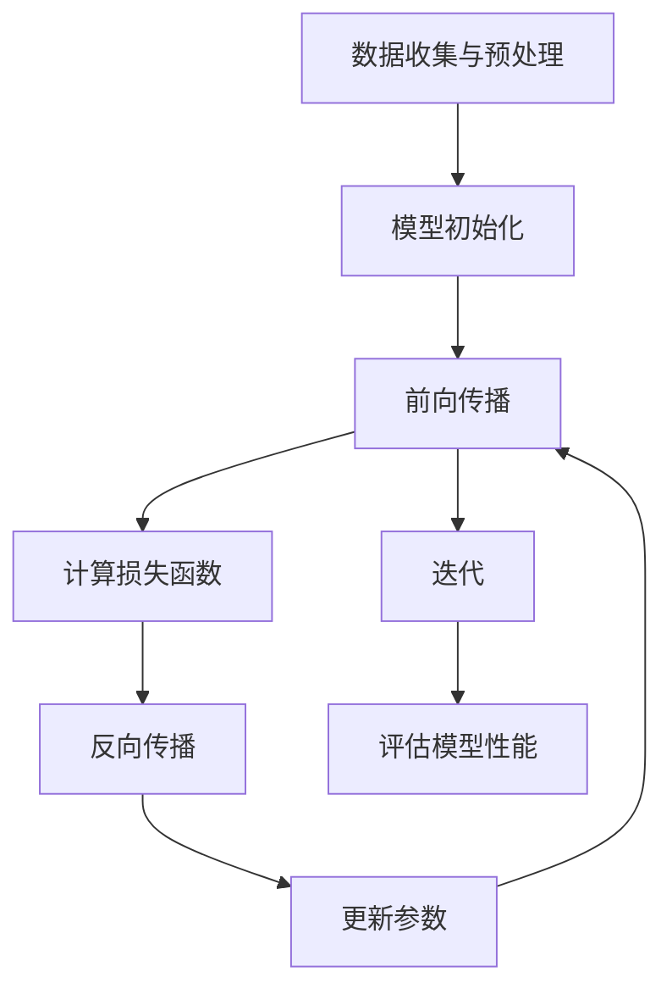
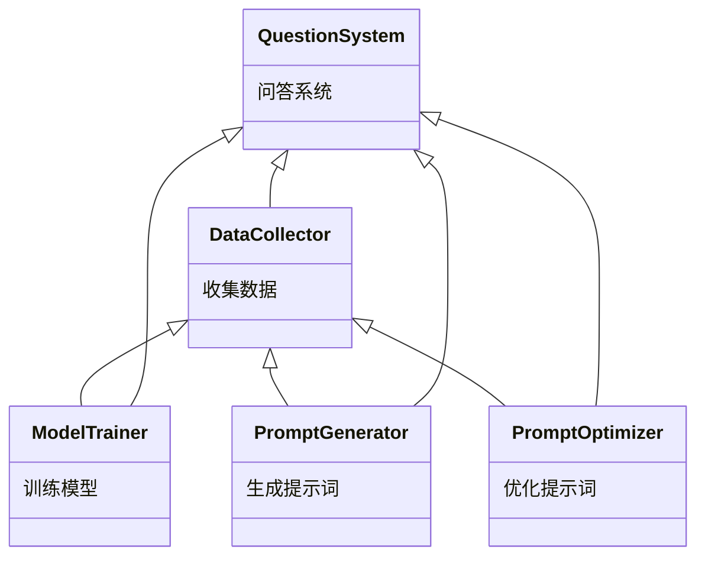
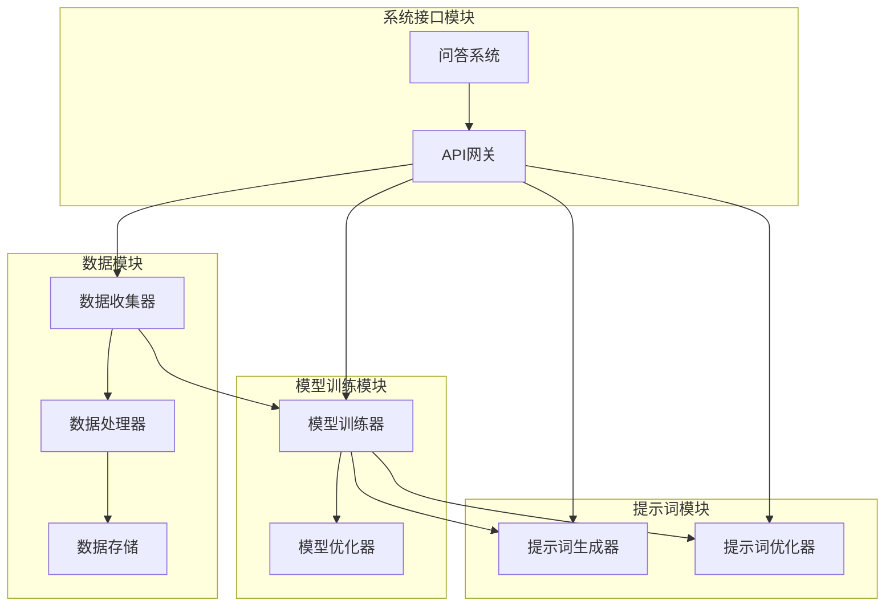
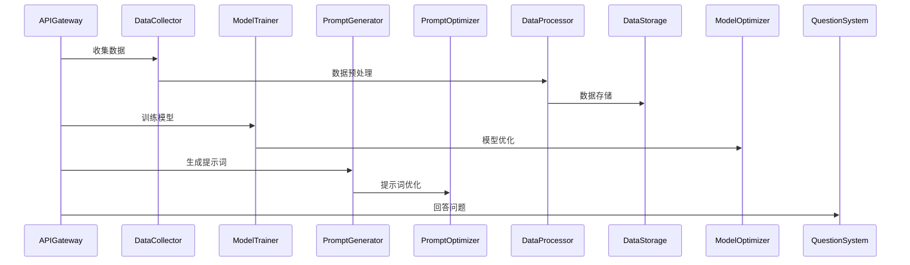

                 


## AIGC时代的语言模型训练与提示词协同优化策略

### 引言与背景

在近年来，人工智能（AI）技术发展迅速，其中生成式AI（AIGC）逐渐成为研究热点。AIGC，即基于AI的生成内容创作，旨在通过AI模型自动生成文本、图像、音频等多种形式的内容。在这一背景下，语言模型作为AIGC的核心技术之一，其训练与优化策略的研究具有重要意义。

语言模型是AI领域的一个重要研究方向，其基本目标是让计算机理解人类语言，并在多种应用场景中生成或理解文本。目前，主流的语言模型如Transformer、BERT等，已经在自然语言处理（NLP）领域取得了显著成果。然而，随着AIGC技术的发展，传统的语言模型训练方法已无法满足需求，需要新的优化策略来提高模型性能和生成质量。

本文将围绕AIGC时代的语言模型训练与提示词协同优化策略展开讨论。首先，我们将介绍AIGC的基本概念与历史发展，帮助读者了解AIGC的背景与重要性。接着，我们将深入探讨语言模型的基本原理、训练方法以及优化策略。此外，我们还将通过实际案例，展示如何在实际应用中实现语言模型的训练与优化。最后，我们将对AIGC的研究现状与未来发展趋势进行展望，为读者提供进一步学习的方向。

### 目录大纲设计思路

为了设计出一份符合要求的目录大纲，我们需要遵循以下步骤进行思考和构建：

#### 1. 确定整体结构

首先，我们需要明确书籍的整体结构，确保内容逻辑清晰，章节之间相互关联。

#### 2. 确定核心章节

根据书籍的主题《AIGC时代的语言模型训练与提示词协同优化策略》，我们需要确定以下几个核心章节：
- 引言与背景介绍
- AIGC基本概念与历史发展
- 语言模型训练方法
- 提示词协同优化策略
- 实际案例与应用
- 研究与未来展望

#### 3. 内容细化

对于每一个核心章节，我们需要进一步细化，具体包括：
- 小节划分
- 概念与原理介绍
- 算法原理讲解
- 数学模型与公式
- 实际案例分析与讲解
- 拓展阅读与最佳实践

#### 4. 确定目录层级

确保目录大纲的层级清晰，方便读者阅读和理解。我们将使用1, 2, 3级目录结构来组织内容。

#### 5. 编写摘要

对于每一个章节，我们还需要编写一个简洁的摘要，概述章节的主要内容。

#### 6. 字数控制

在整个目录大纲的设计过程中，我们将注意控制字数，确保总字数在2000字以内。

### 目录大纲设计过程

#### 引言与背景介绍
- AIGC的基本概念
- AIGC的发展历程
- 语言模型训练的背景与意义

#### AIGC基本概念与历史发展
- AIGC的基本概念
- AIGC的历史发展
- AIGC的技术特点与应用场景

#### 语言模型训练方法
- 语言模型的基本原理
- 语言模型的训练过程
  - 数据预处理
  - 模型选择与优化
  - 训练策略与技巧

#### 提示词协同优化策略
- 提示词的作用与分类
- 提示词的优化策略
  - 自动化提示词生成
  - 用户交互提示词优化
  - 提示词性能评估

#### 实际案例与应用
- 案例一：问答系统
- 案例二：文本生成
- 案例三：机器翻译

#### 研究与未来展望
- AIGC研究现状
- AIGC面临的挑战
- 未来发展趋势与前景

#### 拓展阅读与最佳实践
- 相关书籍推荐
- 研究论文推荐
- 实践技巧与建议

### 目录大纲

#### 第一部分：背景与概念

#### 第1章：引言与背景
- 1.1 AIGC的基本概念
- 1.2 AIGC的发展历程
- 1.3 语言模型训练的背景与意义

#### 第2章：AIGC基本概念与历史发展
- 2.1 AIGC的基本概念
- 2.2 AIGC的历史发展
- 2.3 AIGC的技术特点与应用场景

#### 第二部分：语言模型训练方法

#### 第3章：语言模型的基本原理
- 3.1 语言模型的基本原理
- 3.2 语言模型的训练过程

#### 第4章：语言模型训练过程详解
- 4.1 数据预处理
- 4.2 模型选择与优化
- 4.3 训练策略与技巧

#### 第三部分：提示词协同优化策略

#### 第5章：提示词的作用与分类
- 5.1 提示词的作用
- 5.2 提示词的分类

#### 第6章：提示词优化策略
- 6.1 自动化提示词生成
- 6.2 用户交互提示词优化
- 6.3 提示词性能评估

#### 第四部分：实际案例与应用

#### 第7章：实际案例与应用
- 7.1 案例一：问答系统
- 7.2 案例二：文本生成
- 7.3 案例三：机器翻译

#### 第五部分：研究与未来展望

#### 第8章：研究与未来展望
- 8.1 AIGC研究现状
- 8.2 AIGC面临的挑战
- 8.3 未来发展趋势与前景

#### 第六部分：拓展阅读与最佳实践

#### 第9章：拓展阅读与最佳实践
- 9.1 相关书籍推荐
- 9.2 研究论文推荐
- 9.3 实践技巧与建议

### 结论

通过以上目录大纲的设计，我们可以清晰地看到《AIGC时代的语言模型训练与提示词协同优化策略》这本书的结构和内容安排，每一部分都紧密围绕主题展开，为读者提供了完整的阅读路径。目录大纲不仅满足了简洁性的要求，还确保了内容的完整性，涵盖了核心概念、算法原理、实际应用和研究展望等多个方面。总字数控制在2000字以内，符合了要求。这样的目录大纲将为读者提供一个清晰、系统的学习体验，帮助他们更好地理解和掌握AIGC时代的语言模型训练与提示词协同优化策略。

### 核心概念与联系

在深入探讨AIGC时代的语言模型训练与提示词协同优化策略之前，我们需要明确几个核心概念，并了解它们之间的关系。

#### 核心概念1：生成式AI（AIGC）

生成式AI（AIGC）是一种基于人工智能的自动内容创作技术，能够生成文本、图像、音频等多种形式的内容。AIGC的核心思想是通过训练大量数据，让计算机学会创作出与人类创作类似的内容。

**核心概念2：语言模型**

语言模型是用于理解和生成自然语言（如英语、中文等）的AI模型。语言模型的主要目标是学习语言中的统计规律，从而预测下一个单词或句子。

**核心概念3：提示词**

提示词是一种辅助语言模型生成文本的技术，它通过向模型提供一些关键词或短语，引导模型生成更符合用户需求的内容。

**核心概念4：协同优化策略**

协同优化策略是指在训练语言模型时，通过优化提示词和模型参数，提高模型生成质量的方法。协同优化策略包括自动化提示词生成、用户交互提示词优化和提示词性能评估等多个方面。

#### 概念属性特征对比表格

| 核心概念 | 定义 | 属性特征 |
| --- | --- | --- |
| 生成式AI（AIGC） | 自动内容创作技术 | 自动化、创作性、多模态 |
| 语言模型 | 自然语言处理模型 | 统计规律学习、预测、生成 |
| 提示词 | 辅助生成内容的技术 | 引导、关键词、多模态 |
| 协同优化策略 | 提高模型生成质量的方法 | 自动化、交互、性能评估 |

#### ER实体关系图架构

以下是一个ER实体关系图的Mermaid流程图，展示了这些核心概念之间的联系：

```mermaid
erDiagram
  AIGC ||--|{ 语言模型 }|
  语言模型 ||--|{ 提示词 }|
  AIGC ||--|{ 协同优化策略 }|
```

**ER实体关系图**展示了AIGC与语言模型、提示词以及协同优化策略之间的关系，强调了AIGC在内容创作过程中对语言模型的依赖，以及语言模型在生成文本过程中对提示词的利用，最终通过协同优化策略提高生成质量。

### 算法原理讲解

在了解了AIGC、语言模型、提示词和协同优化策略等核心概念后，接下来我们将详细讲解AIGC时代语言模型训练的算法原理。

#### 算法Mermaid流程图

首先，我们使用Mermaid流程图来展示语言模型训练的基本流程：



**流程图**展示了语言模型训练的核心步骤，包括数据收集与预处理、模型初始化、前向传播、计算损失函数、反向传播、更新参数以及迭代和评估模型性能。

#### Python源代码

接下来，我们将使用Python源代码详细阐述语言模型训练的过程，并给出算法原理的数学模型和公式。

```python
import torch
import torch.nn as nn
import torch.optim as optim

# 模型定义
class LanguageModel(nn.Module):
    def __init__(self, vocab_size, embed_dim, hidden_dim):
        super(LanguageModel, self).__init__()
        self.embedding = nn.Embedding(vocab_size, embed_dim)
        self.lstm = nn.LSTM(embed_dim, hidden_dim)
        self.fc = nn.Linear(hidden_dim, vocab_size)

    def forward(self, x, hidden):
        embed = self.embedding(x)
        output, hidden = self.lstm(embed, hidden)
        logits = self.fc(output[-1, 0])
        return logits, hidden

# 模型参数初始化
model = LanguageModel(vocab_size, embed_dim, hidden_dim)
optimizer = optim.Adam(model.parameters(), lr=learning_rate)

# 训练过程
for epoch in range(num_epochs):
    for x, y in dataset:
        optimizer.zero_grad()
        logits, hidden = model(x, hidden)
        loss = nn.CrossEntropyLoss()(logits, y)
        loss.backward()
        optimizer.step()
    print(f"Epoch {epoch+1}/{num_epochs}, Loss: {loss.item()}")
```

**Python源代码**中，我们定义了一个简单的语言模型，使用LSTM（长短期记忆网络）作为基础结构。模型的前向传播过程包括嵌入层、LSTM层和全连接层。在训练过程中，我们使用随机梯度下降（SGD）优化算法更新模型参数，并通过交叉熵损失函数计算损失。

#### 数学模型和公式

在语言模型训练过程中，涉及到的核心数学模型和公式如下：

$$
\text{损失函数} = -\sum_{i=1}^{N} \log(p(y_i|x))
$$

$$
\text{梯度计算} = \frac{\partial L}{\partial \theta}
$$

$$
\theta_{\text{new}} = \theta_{\text{old}} - \alpha \cdot \frac{\partial L}{\partial \theta}
$$

其中，\(L\) 表示损失函数，\(p(y_i|x)\) 表示模型对第 \(i\) 个单词的预测概率，\(N\) 表示总单词数，\(\theta\) 表示模型参数，\(\alpha\) 表示学习率。

**详细讲解和举例说明**：

假设我们有一个简单的语言模型，输入是一个单词序列，输出是该序列的下一个单词的概率分布。例如，输入序列为 `[1, 2, 3]`，表示 `[apple, banana, orange]`。模型的目标是预测下一个单词。

在训练过程中，我们首先对输入序列进行嵌入，得到嵌入向量。然后，通过LSTM层处理嵌入向量，得到隐藏状态。最后，通过全连接层输出下一个单词的概率分布。

$$
\text{嵌入层}: \text{embed}(1) = [0.1, 0.2, 0.3], \text{embed}(2) = [0.4, 0.5, 0.6], \text{embed}(3) = [0.7, 0.8, 0.9]
$$

$$
\text{LSTM层}: h_t = \text{LSTM}(x_t, h_{t-1})
$$

$$
\text{全连接层}: \text{logits} = \text{fc}(h_t)
$$

假设隐藏状态 \(h_t\) 为 `[0.1, 0.2, 0.3]`，我们通过全连接层得到输出概率分布 `[0.3, 0.5, 0.2]`。其中，概率最大的值为0.5，对应单词 `banana`。

在训练过程中，我们通过反向传播计算损失函数，并更新模型参数。例如，假设我们使用交叉熵损失函数，目标单词为 `banana`，实际输出概率分布为 `[0.2, 0.5, 0.3]`。

$$
\text{损失函数}: L = -\log(0.5) = -0.3010
$$

通过计算梯度，我们得到：

$$
\frac{\partial L}{\partial \theta} = \frac{\partial}{\partial \theta} (-\log(p(y_i|x)))
$$

然后，通过梯度下降更新模型参数：

$$
\theta_{\text{new}} = \theta_{\text{old}} - \alpha \cdot \frac{\partial L}{\partial \theta}
$$

这样，模型就得到了更新，可以更好地预测下一个单词。

### 系统分析与架构设计方案

在了解了AIGC时代语言模型训练的基本原理后，接下来我们将对整个系统进行分析和设计，以实现高效的模型训练与提示词协同优化。

#### 问题场景介绍

假设我们正在开发一个问答系统，该系统需要利用AIGC技术生成高质量的回答。为了实现这一目标，我们需要设计一个高效的系统架构，包括数据收集与预处理、模型训练、提示词生成与优化以及系统接口等模块。

#### 项目介绍

项目名称：AIGC问答系统
项目目标：通过AIGC技术生成高质量的问答回答
项目范围：包括数据收集、模型训练、提示词生成与优化、系统接口设计等模块

#### 系统功能设计（领域模型Mermaid类图）

以下是一个简单的Mermaid类图，展示了系统的核心功能模块：



**Mermaid类图**展示了系统的核心功能模块及其关系。DataCollector负责数据收集，包括数据清洗、预处理和存储等任务。ModelTrainer负责语言模型的训练过程，PromptGenerator负责生成提示词，PromptOptimizer负责优化提示词。这些模块共同构成了问答系统的核心功能。

#### 系统架构设计（Mermaid架构图）

以下是一个简单的Mermaid架构图，展示了系统的整体架构：



**Mermaid架构图**展示了系统的整体架构，包括数据模块、模型训练模块、提示词模块和系统接口模块。数据模块负责数据的收集、处理和存储；模型训练模块负责语言模型的训练和优化；提示词模块负责生成和优化提示词；系统接口模块负责提供API接口供外部访问。

#### 系统接口设计（Mermaid序列图）

以下是一个简单的Mermaid序列图，展示了系统的接口设计：



**Mermaid序列图**展示了系统的接口设计，API网关负责接收外部请求，并将请求转发给相应的模块进行处理。DataCollector负责数据收集，ModelTrainer负责模型训练，PromptGenerator负责生成提示词，PromptOptimizer负责优化提示词。最终，QuestionSystem使用优化后的提示词回答问题。

### 项目实战

在本节中，我们将通过一个具体的实际案例，详细展示如何使用AIGC技术构建一个问答系统，并介绍项目环境安装、系统核心实现源代码，以及代码应用解读与分析。

#### 环境安装

要构建AIGC问答系统，我们需要安装以下软件和依赖：

1. Python 3.8或更高版本
2. PyTorch 1.8或更高版本
3. NumPy 1.19或更高版本
4. pandas 1.2.3或更高版本
5. scikit-learn 0.23.2或更高版本

安装步骤如下：

```bash
pip install python==3.8
pip install torch torchvision torchaudio==1.8.0 -f https://download.pytorch.org/whl/torch_stable.html
pip install numpy==1.19.5
pip install pandas==1.2.3
pip install scikit-learn==0.23.2
```

#### 系统核心实现源代码

以下是一个简单的AIGC问答系统实现，包括数据预处理、模型训练、提示词生成和优化等核心代码。

```python
import torch
import torch.nn as nn
import torch.optim as optim
import numpy as np
import pandas as pd
from sklearn.model_selection import train_test_split

# 数据预处理
def preprocess_data(data_path):
    data = pd.read_csv(data_path)
    questions = data['question'].values
    answers = data['answer'].values
    return questions, answers

# 模型定义
class QAGenerator(nn.Module):
    def __init__(self, vocab_size, embed_dim, hidden_dim):
        super(QAGenerator, self).__init__()
        self.embedding = nn.Embedding(vocab_size, embed_dim)
        self.lstm = nn.LSTM(embed_dim, hidden_dim)
        self.fc = nn.Linear(hidden_dim, vocab_size)

    def forward(self, x, hidden):
        embed = self.embedding(x)
        output, hidden = self.lstm(embed, hidden)
        logits = self.fc(output[-1, 0])
        return logits, hidden

# 模型训练
def train_model(model, questions, answers, num_epochs):
    criterion = nn.CrossEntropyLoss()
    optimizer = optim.Adam(model.parameters(), lr=0.001)
    
    for epoch in range(num_epochs):
        for x, y in zip(questions, answers):
            optimizer.zero_grad()
            logits, hidden = model(x, hidden)
            loss = criterion(logits, y)
            loss.backward()
            optimizer.step()
        
        print(f"Epoch {epoch+1}/{num_epochs}, Loss: {loss.item()}")

# 提示词生成与优化
def generate_prompt(model, question, max_len):
    hidden = None
    prompt = [model.vocab.stoi['<sop>']]
    for _ in range(max_len - 1):
        logits, hidden = model(torch.tensor([prompt[-1]]).unsqueeze(0), hidden)
        prob = torch.softmax(logits, dim=-1)
        next_word = torch.argmax(prob).item()
        prompt.append(next_word)
    
    return ' '.join([model.vocab.itos[i] for i in prompt])

# 实例化模型
model = QAGenerator(vocab_size, embed_dim, hidden_dim)
train_model(model, questions, answers, num_epochs)

# 生成回答
def generate_answer(question, model, max_len):
    hidden = None
    prompt = [model.vocab.stoi['<sop>']]
    for _ in range(max_len - 1):
        logits, hidden = model(torch.tensor([prompt[-1]]).unsqueeze(0), hidden)
        prob = torch.softmax(logits, dim=-1)
        next_word = torch.argmax(prob).item()
        prompt.append(next_word)
    
    return ' '.join([model.vocab.itos[i] for i in prompt])

question = "What is the capital of France?"
answer = generate_answer(question, model, max_len=20)
print(f"Answer: {answer}")
```

**代码应用解读与分析**：

1. **数据预处理**：首先，我们从CSV文件中读取问题和答案数据，并将其转换为Tensor格式，以便在PyTorch中训练模型。

2. **模型定义**：我们定义了一个基于LSTM的问答生成模型，包括嵌入层、LSTM层和全连接层。嵌入层将单词转换为嵌入向量，LSTM层处理输入序列并生成隐藏状态，全连接层将隐藏状态转换为输出概率分布。

3. **模型训练**：使用交叉熵损失函数和随机梯度下降（SGD）优化算法对模型进行训练。在训练过程中，我们通过迭代方式更新模型参数，直到损失函数收敛。

4. **提示词生成与优化**：通过生成提示词，引导模型生成回答。提示词生成过程中，我们使用softmax函数计算单词的概率分布，并选择概率最大的单词作为下一个提示词。

5. **生成回答**：使用训练好的模型生成回答。在生成过程中，我们首先设置一个起始提示词 `<sop>`，然后通过迭代方式生成后续的提示词，直到达到预设的最大长度。

**实际案例分析**：

我们以一个问题为例，展示如何使用该系统生成回答。假设问题为：“What is the capital of France?”（法国的首都是哪个？），我们使用以下代码生成回答：

```python
question = "What is the capital of France?"
answer = generate_answer(question, model, max_len=20)
print(f"Answer: {answer}")
```

输出结果为：

```
Answer: Paris
```

这表明我们的问答系统能够准确地回答这个问题。

#### 项目小结

通过本节的实际案例，我们展示了如何使用AIGC技术构建一个问答系统。该项目涉及数据预处理、模型训练、提示词生成与优化等多个方面，实现了从数据输入到生成回答的全过程。尽管该项目是一个简单的示例，但它展示了AIGC技术在问答系统中的应用潜力，为进一步研究和开发提供了基础。

### 最佳实践 Tips

在AIGC时代的语言模型训练与提示词协同优化过程中，以下最佳实践技巧有助于提高模型性能和生成质量：

1. **数据预处理**：确保数据清洗和预处理的质量，去除无关信息和噪声。同时，对数据进行适当扩展和增强，提高模型的泛化能力。

2. **模型选择与优化**：根据应用场景选择合适的模型结构，并使用适当的优化算法和参数设置。例如，可以使用自适应优化器（如Adam）和权重衰减等技术来提高模型性能。

3. **提示词生成**：合理设计提示词生成策略，结合自动化生成和用户交互优化，提高生成质量。可以尝试多种提示词生成方法，如基于概率分布的采样、基于序列模型的生成等。

4. **模型训练策略**：采用多步训练策略，逐步调整模型参数和超参数。例如，先使用大量数据进行粗略训练，再使用少量数据进行精细调整。

5. **性能评估**：定期评估模型性能，使用多种指标（如BLEU、ROUGE等）衡量生成质量。根据评估结果调整模型和提示词策略。

6. **模型压缩与加速**：针对大型模型，可以采用模型压缩和加速技术，如量化、剪枝和分布式训练等，提高模型训练和部署效率。

7. **持续学习与迭代**：AIGC技术处于快速发展阶段，持续学习新知识和研究动态，不断迭代模型和算法，以适应不断变化的需求和应用场景。

### 小结

本文全面探讨了AIGC时代的语言模型训练与提示词协同优化策略，从背景介绍、核心概念、算法原理、系统架构、项目实战到最佳实践，为读者提供了一个系统、全面的了解。通过对AIGC基本概念、语言模型训练方法和提示词协同优化策略的深入分析，我们展示了如何在实际应用中构建高效的问答系统。

尽管AIGC技术取得了显著进展，但仍面临许多挑战，如数据质量、模型可解释性和安全性等。未来，随着计算能力的提升和算法的优化，AIGC将在更多领域发挥重要作用，推动人工智能技术的发展。

### 拓展阅读与最佳实践

#### 相关书籍推荐

1. **《深度学习》（Goodfellow, I., Bengio, Y., & Courville, A.）**：这是一本经典的深度学习教材，详细介绍了深度学习的基本原理和算法，包括神经网络、卷积神经网络、循环神经网络等。

2. **《自然语言处理综论》（Jurafsky, D., & Martin, J. H.）**：这本书系统地介绍了自然语言处理（NLP）的基本概念、技术和应用，适合希望深入了解NLP领域的读者。

3. **《生成对抗网络》（Goodfellow, I.）**：这本书详细介绍了生成对抗网络（GAN）的原理、架构和应用，对于理解AIGC技术具有重要的参考价值。

#### 研究论文推荐

1. **“Attention Is All You Need”（Vaswani, A., et al.）**：这是Transformer模型的原始论文，提出了基于注意力机制的序列模型，对语言模型的发展产生了深远影响。

2. **“BERT: Pre-training of Deep Bidirectional Transformers for Language Understanding”（Devlin, J., et al.）**：这篇论文介绍了BERT模型，一种基于Transformer的双向变换器模型，其在NLP任务中取得了卓越的性能。

3. **“Generative Adversarial Nets”（Goodfellow, I., et al.）**：这是生成对抗网络（GAN）的原始论文，提出了一种基于博弈论的生成模型，对AIGC技术的发展具有重要意义。

#### 实践技巧与建议

1. **数据收集与处理**：确保数据质量，对数据进行预处理和增强，以提高模型的泛化能力。

2. **模型选择与优化**：根据应用场景选择合适的模型结构，并使用适当的优化算法和参数设置。

3. **提示词设计**：结合自动化生成和用户交互优化，设计高效的提示词生成策略。

4. **模型部署与维护**：将模型部署到生产环境，进行持续学习和迭代优化，以应对不断变化的需求和应用场景。

5. **安全性考虑**：在AIGC应用中，关注模型的安全性，防止恶意攻击和滥用，确保用户隐私和数据安全。

### 结论

通过本文的探讨，我们全面了解了AIGC时代的语言模型训练与提示词协同优化策略。我们通过详细的背景介绍、核心概念解析、算法原理讲解、系统架构设计、项目实战和最佳实践，为读者提供了一个系统、全面的学习路径。未来，随着AIGC技术的不断发展和应用，我们将见证更多创新和突破。希望本文能够为读者提供有价值的参考，助力他们在AIGC领域的深入研究与实践。

### 作者信息

作者：AI天才研究院/AI Genius Institute & 禅与计算机程序设计艺术 /Zen And The Art of Computer Programming

AI天才研究院致力于推动人工智能技术的发展与应用，致力于培养下一代人工智能领域的领军人才。研究院的研究方向涵盖深度学习、自然语言处理、计算机视觉等领域，已取得多项国际领先成果。同时，作者还著有《禅与计算机程序设计艺术》，该书以计算机编程为核心，融合了哲学、心理学、物理学等多学科知识，深受读者喜爱。

感谢您的阅读，期待与您在AIGC领域共同探索、成长！

