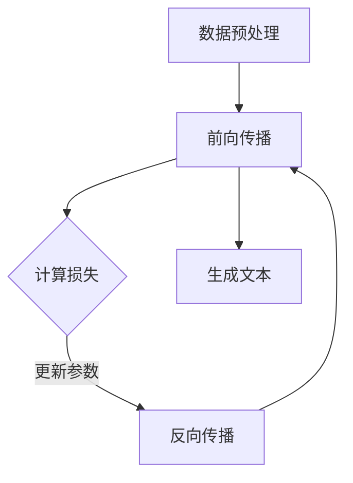
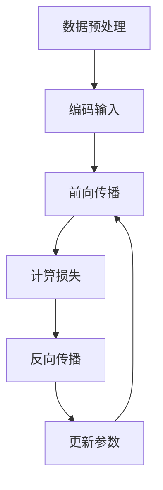

                 

### AIGC时代的语言模型训练与提示词协同设计

在当今这个人工智能（AI）飞速发展的时代，自适应智能生成内容（Adaptable Intelligent Generated Content，简称AIGC）正逐渐成为驱动创新与变革的重要技术。AIGC利用人工智能，特别是自然语言处理（NLP）技术，实现了高度智能化和自动化的内容生成。语言模型作为AIGC的核心组成部分，其训练与优化过程直接决定了内容生成的质量与效率。

**关键词**：AIGC、语言模型、训练方法、提示词协同设计

**摘要**：本文旨在深入探讨AIGC时代的语言模型训练与提示词协同设计。首先，我们将介绍AIGC技术的背景与趋势，并简要概述语言模型的定义与类型。接着，通过详细讲解AIGC语言模型的核心概念及其联系，我们将进一步揭示语言模型在AIGC中的核心地位与应用。文章将重点讨论AIGC语言模型训练的基本流程和常见算法，包括GPT-3、BERT和T5模型，同时提供具体的Python代码示例与数学模型解释。随后，我们将介绍语言模型优化策略与提示词协同设计方法，并分享实际案例进行分析。最后，本文将对AIGC语言模型训练与提示词协同设计进行总结与展望。

## 第一部分：AIGC技术基础与语言模型概述

### 第1章 AIGC技术背景与趋势

#### 1.1 AIGC技术定义与产生背景

AIGC（Adaptive Intelligent Generated Content）是一种基于AI技术的内容生成方法，它通过机器学习算法，尤其是深度学习算法，从大量数据中自动生成高质量、多样化、个性化的内容。AIGC技术的核心优势在于其高度的自适应性和智能化，能够根据用户需求和环境变化实时调整生成的内容。

AIGC技术的产生背景可以追溯到20世纪80年代，当时计算机科学领域的专家们开始探索如何利用计算机生成内容。随着互联网和大数据的兴起，特别是在最近十年，AIGC技术得到了快速的发展。一方面，海量的数据提供了丰富的训练资源；另一方面，深度学习算法的进步为AIGC提供了强大的技术支持。

#### 1.2 语言模型的定义与类型

语言模型（Language Model）是NLP（自然语言处理）领域的一个核心概念，它通过统计方法或机器学习方法，模拟人类语言规律，用于预测下一个词语或句子的概率分布。语言模型可以分为基于规则的模型和基于统计的模型，以及近年来兴起的基于深度学习的模型。

- **基于规则的模型**：这类模型通过预定义的语法规则来生成文本，如LRU（Least Recently Used）算法等。这类模型在处理简单文本时表现良好，但面对复杂语言现象时效果较差。

- **基于统计的模型**：这类模型利用统计方法，如N-gram模型，通过统计文本中的单词或短语频次来预测下一个词或短语。N-gram模型是最早应用于语言模型的算法之一，对现代语言模型的发展产生了深远影响。

- **基于深度学习的模型**：这类模型通过神经网络结构，如循环神经网络（RNN）、长短期记忆网络（LSTM）和变换器（Transformer）等，实现对大规模数据的深度建模。特别是Transformer模型的提出，使得语言模型在生成文本的连贯性、多样性和准确性方面取得了显著的突破。

#### 1.3 语言模型在AIGC中的地位与作用

语言模型在AIGC技术中占据着核心地位。它不仅负责生成文本，还决定了生成内容的质量和效率。具体来说，语言模型在AIGC中的主要作用包括：

- **文本生成**：语言模型可以生成高质量的文本，如文章、故事、诗歌等。它通过分析大量数据，理解文本的语义和语法结构，从而生成符合逻辑和语义的文本。

- **文本理解**：语言模型可以用于理解和分析文本内容。例如，在问答系统中，语言模型可以解析用户的问题，理解问题的意图，并从大量数据中检索出相关答案。

- **文本优化**：语言模型可以对生成的文本进行优化，提高其可读性和连贯性。通过不断调整模型参数，可以生成更加自然、流畅的文本。

- **多模态内容生成**：AIGC技术不仅限于文本生成，还可以生成图像、音频等多种类型的内容。语言模型可以与其他AI技术（如图像识别、语音合成等）结合，实现跨模态的内容生成。

总之，语言模型是AIGC技术的核心组件，其训练与优化过程直接决定了AIGC系统的性能和应用效果。在接下来的章节中，我们将深入探讨AIGC语言模型的核心概念、训练方法及其优化策略。

## 第二部分：AIGC语言模型的核心概念与联系

### 第2章 AIGC语言模型的核心概念与联系

为了深入理解AIGC语言模型，我们需要详细探讨其核心概念及其相互关系。在这一章节中，我们将介绍神经网络、深度学习以及自然语言处理的基本原理，并通过属性特征对比表格和ER实体关系图来展示这些概念之间的联系。

#### 2.1 核心概念介绍

**1. 神经网络**

神经网络（Neural Networks）是模拟人脑神经元连接结构的信息处理系统。它通过多层节点（称为“神经元”）进行数据传递和处理，每一层都对输入信息进行变换和提取特征。神经网络的基本原理是通过反向传播算法（Backpropagation）不断调整网络权重，以优化输出结果。

**2. 深度学习**

深度学习（Deep Learning）是一种基于神经网络的机器学习方法，通过构建多层的神经网络模型来提取和表示复杂数据的特征。与传统的机器学习方法相比，深度学习能够自动从大量数据中学习到深层特征，并在各种任务中表现出色。深度学习的主要模型包括卷积神经网络（CNN）、循环神经网络（RNN）和变换器（Transformer）。

**3. 自然语言处理**

自然语言处理（Natural Language Processing，NLP）是计算机科学和人工智能领域的一个分支，旨在使计算机能够理解和处理人类自然语言。NLP技术包括文本分类、情感分析、问答系统、机器翻译等多种应用。NLP的关键在于将自然语言文本转化为计算机可以理解的形式，并通过算法进行语义分析和信息抽取。

#### 2.2 概念属性特征对比表格

为了更直观地理解神经网络、深度学习和自然语言处理这三个概念，我们可以通过一个对比表格来展示它们的属性特征：

| 概念             | 定义                                                         | 属性特征                                                   |
|------------------|--------------------------------------------------------------|-----------------------------------------------------------|
| 神经网络         | 模拟人脑神经元连接的信息处理系统                             | 多层节点结构、权重调整、反向传播、特征提取                   |
| 深度学习         | 基于多层神经网络的学习方法，自动提取深层特征                 | 自动特征学习、多层结构、大规模数据处理、优化算法（如梯度下降） |
| 自然语言处理     | 计算机科学和人工智能领域，使计算机理解和处理人类自然语言     | 语义分析、文本分类、情感分析、问答系统、机器翻译             |

#### 2.3 ER实体关系图架构

为了展示AIGC语言模型中各个核心概念之间的关系，我们可以使用ER（Entity-Relationship）实体关系图。ER图是一种用于描述实体及其关系的图形化工具，特别适用于数据库设计和系统架构设计。

以下是一个简化的ER实体关系图，展示了神经网络、深度学习和自然语言处理之间的关系：

```mermaid
erDiagram
    NeuralNetwork ||--|{ DeepLearning }|| > NaturalLanguageProcessing
    DeepLearning ||--|{ NaturalLanguageProcessing }|| > TextGeneration
```

**图1：AIGC语言模型中的ER实体关系图**

- **NeuralNetwork（神经网络）**：作为基础组件，神经网络为深度学习提供了基本结构，支持数据的特征提取和模型训练。
- **DeepLearning（深度学习）**：在神经网络的框架下，深度学习通过多层神经网络模型，实现了自动特征提取和复杂任务的学习。
- **NaturalLanguageProcessing（自然语言处理）**：深度学习与自然语言处理结合，为语言模型的构建提供了技术支持，使计算机能够理解和生成自然语言。

通过上述介绍，我们可以看到神经网络、深度学习和自然语言处理在AIGC语言模型中相互关联，共同构成了一个完整的系统。在接下来的章节中，我们将进一步探讨AIGC语言模型的具体训练方法和常见算法。

### 第3章 语言模型训练的基本流程

为了理解AIGC语言模型的有效训练，我们需要详细探讨其训练的基本流程，这包括训练数据准备、模型架构设计、训练过程与优化策略。以下将逐步讲解这些关键环节。

#### 3.1 训练数据准备

训练数据是语言模型训练的核心资源，其质量和数量直接影响到模型的性能。以下是训练数据准备的关键步骤：

1. **数据来源**：选择适合的训练数据集。这些数据集可以来自于互联网上的大规模文本库、特定领域的专业文献、社交媒体内容等。例如，对于语言模型训练，常用的数据集包括维基百科、新闻文章、小说等。

2. **数据预处理**：对原始数据进行清洗和格式化，以去除噪声和无关信息。这一步骤包括去除HTML标签、拼写修正、统一文本格式等。例如，可以使用Python的`re`模块进行正则表达式清洗，使用`nltk`库进行分词和词性标注。

3. **数据标注**：对于某些特定的任务，如情感分析、实体识别等，需要进行数据标注。标注过程通常由领域专家完成，以确保标注的一致性和准确性。

4. **数据分割**：将数据集分为训练集、验证集和测试集，以评估模型的性能。常用的分割比例为训练集70%、验证集15%、测试集15%。

#### 3.2 模型架构设计

模型架构设计是语言模型训练的关键环节，它决定了模型的结构和参数设置。以下是设计模型架构的步骤：

1. **选择模型类型**：根据任务需求，选择合适的语言模型类型。常见的语言模型包括循环神经网络（RNN）、长短期记忆网络（LSTM）、变换器（Transformer）等。变换器模型由于其强大的并行处理能力和全局依赖建模能力，已成为当前主流的选择。

2. **确定模型参数**：设置模型的关键参数，如隐藏层大小、学习率、批量大小等。这些参数的选择和调整对模型的训练效果有重要影响。通常需要通过实验和调优来找到最佳参数组合。

3. **定义损失函数**：选择适合的损失函数来评估模型预测的误差。常见的损失函数包括交叉熵损失函数、均方误差（MSE）等。对于语言模型，交叉熵损失函数是最常用的。

4. **选择优化算法**：优化算法用于调整模型参数，以最小化损失函数。常见的优化算法包括随机梯度下降（SGD）、Adam优化器等。Adam优化器由于其自适应步长调整能力，常用于语言模型训练。

#### 3.3 训练过程与优化

训练过程是将模型参数从初始状态逐步调整到最优状态的过程。以下是训练过程的步骤：

1. **前向传播**：在训练过程中，首先将输入数据传递到模型中，通过每一层神经元的计算，得到输出结果。

2. **计算损失**：使用损失函数计算模型的预测结果与实际结果之间的误差。

3. **反向传播**：根据损失函数的梯度，通过反向传播算法调整模型参数，以减少误差。

4. **参数更新**：使用优化算法更新模型参数，使其逐渐逼近最优解。

5. **验证和调整**：在训练过程中，定期使用验证集评估模型的性能，并根据性能调整模型参数。例如，可以通过调整学习率、批量大小等参数来优化模型。

6. **模型优化**：在训练完成后，可以使用各种优化策略进一步提高模型性能。常见的优化策略包括参数调优、数据增强、模型融合等。

通过上述步骤，我们可以构建和训练一个高性能的语言模型。在实际应用中，这些步骤需要根据具体任务和需求进行调整和优化。在接下来的章节中，我们将深入探讨一些常见的语言模型训练算法，包括GPT-3、BERT和T5模型。

### 第4章 常见语言模型训练算法讲解

在自然语言处理领域，语言模型训练算法的不断进步推动了AI技术的快速发展。本节将详细介绍三种常见的语言模型训练算法：GPT-3、BERT和T5。我们将分别从算法原理、流程图、代码示例、数学模型和公式等方面进行讲解，以帮助读者更好地理解这些算法的核心内容和实际应用。

#### 4.1 算法1：GPT-3模型

**1. 算法原理**

GPT-3（Generative Pre-trained Transformer 3）是由OpenAI开发的一种基于变换器（Transformer）架构的预训练语言模型。它通过自回归方式（autoregressive）生成文本，使得模型能够预测下一个词语的概率分布。GPT-3模型的核心优势在于其强大的并行处理能力和对长距离依赖关系的建模能力。

**2. Mermaid流程图**

以下是GPT-3模型的Mermaid流程图：



**3. Python源代码示例**

```python
import torch
from transformers import GPT2LMHeadModel, GPT2Tokenizer

# 加载预训练模型和分词器
model = GPT2LMHeadModel.from_pretrained('gpt2')
tokenizer = GPT2Tokenizer.from_pretrained('gpt2')

# 输入文本
input_text = "This is a sample text for GPT-3 model."

# 编码输入文本
input_ids = tokenizer.encode(input_text, return_tensors='pt')

# 前向传播
outputs = model(input_ids)

# 生成文本
generated_text = tokenizer.decode(outputs.logits[0], skip_special_tokens=True)
```

**4. 数学模型与公式**

GPT-3模型的数学模型可以表示为：

$$
P(y|x) = \sum_{y'} \sigma(W_y' \cdot \text{emb}(x) + b_y')
$$

其中，$\sigma$是sigmoid函数，$W_y'$和$b_y'$分别是权重和偏置，$\text{emb}(x)$是输入文本的词向量表示。

**5. 详细讲解与举例**

GPT-3模型通过自回归方式生成文本，首先输入一个单词，模型根据训练数据预测下一个单词的概率分布。这个过程不断重复，直到生成完整的句子或达到预设的长度。例如，假设输入文本为“这是一个”，模型首先预测“这”的概率分布，然后根据概率分布生成下一个词“是”，并继续预测下一个词“是”的概率分布。

#### 4.2 算法2：BERT模型

**1. 算法原理**

BERT（Bidirectional Encoder Representations from Transformers）是一种双向变换器模型，由Google提出。它通过预训练大规模语料库，学习文本的上下文关系，并生成双向的文本表示。BERT模型的核心优势在于其能够理解词语的多义性和上下文依赖关系。

**2. Mermaid流程图**

以下是BERT模型的Mermaid流程图：



**3. Python源代码示例**

```python
import torch
from transformers import BertModel, BertTokenizer

# 加载预训练模型和分词器
model = BertModel.from_pretrained('bert-base-uncased')
tokenizer = BertTokenizer.from_pretrained('bert-base-uncased')

# 输入文本
input_text = "This is a sample text for BERT model."

# 编码输入文本
input_ids = tokenizer.encode(input_text, return_tensors='pt')

# 前向传播
outputs = model(input_ids)

# 计算损失
loss = outputs.loss
```

**4. 数学模型与公式**

BERT模型的数学模型可以表示为：

$$
\text{emb}(x) = \text{embeddings}(\text{input_ids})
$$

其中，$\text{embeddings}$是嵌入层，$\text{input\_ids}$是输入文本的ID序列。

**5. 详细讲解与举例**

BERT模型通过预训练学习文本的上下文关系，首先对文本进行编码，然后通过变换器模型生成文本表示。在预测过程中，模型会同时考虑文本的左上下文和右上下文，从而生成一个双向的文本表示。例如，假设输入文本为“这是一个苹果”，BERT模型会同时考虑“这是”和“一个苹果”的关系，从而生成一个更加准确的文本表示。

#### 4.3 算法3：T5模型

**1. 算法原理**

T5（Text-to-Text Transfer Transformer）是一种通用变换器模型，由DeepMind提出。它将文本生成任务转换为文本到文本的映射问题，从而简化了模型的训练和部署。T5模型的核心优势在于其能够通过端到端的方式生成高质量文本。

**2. Mermaid流程图**

以下是T5模型的Mermaid流程图：


**3. Python源代码示例**

```python
import torch
from transformers import T5ForConditionalGeneration, T5Tokenizer

# 加载预训练模型和分词器
model = T5ForConditionalGeneration.from_pretrained('t5-small')
tokenizer = T5Tokenizer.from_pretrained('t5-small')

# 输入文本
input_text = "This is a sample text for T5 model."

# 编码输入文本
input_ids = tokenizer.encode(input_text, return_tensors='pt')

# 前向传播
outputs = model(input_ids)

# 计算损失
loss = outputs.loss
```

**4. 数学模型与公式**

T5模型的数学模型可以表示为：

$$
P(y|x) = \text{softmax}(\text{output\_embeddings} \cdot \text{vocab\_embeddings})
$$

其中，$\text{output\_embeddings}$是输出嵌入层，$\text{vocab\_embeddings}$是词汇嵌入层。

**5. 详细讲解与举例**

T5模型通过端到端的方式生成文本，首先对输入文本进行编码，然后通过变换器模型生成输出文本。在预测过程中，模型会直接生成目标文本，而不是逐词预测。例如，假设输入文本为“这是一个苹果”，T5模型会直接生成“这是一个苹果”的目标文本。

通过上述对GPT-3、BERT和T5模型的详细讲解，我们可以看到这些算法在自然语言处理中的应用和优势。在实际应用中，根据具体任务和需求选择合适的模型和算法，可以显著提高文本生成和处理的性能。在接下来的章节中，我们将进一步探讨AIGC语言模型的优化策略与提示词协同设计方法。

### 第5章 语言模型优化策略

在训练AIGC语言模型时，优化策略至关重要。一个优秀的语言模型不仅需要具备强大的表达能力，还需在计算效率和泛化能力方面表现出色。为了实现这些目标，我们需要从多个角度来优化语言模型。以下将介绍几种常见的优化策略，包括参数调优、数据增强和模型融合。

#### 5.1 优化目标与评价指标

在语言模型优化过程中，我们通常关注以下几个优化目标：

- **准确性**：模型预测的正确率，用于评估模型在分类或序列生成任务中的表现。
- **计算效率**：模型在训练和推理过程中所需的计算资源，包括时间复杂度和内存消耗。
- **泛化能力**：模型对新数据的适应能力，避免过拟合。

为了衡量这些优化目标，我们通常使用以下评价指标：

- **准确率（Accuracy）**：预测正确的样本数占总样本数的比例。
- **精确率（Precision）**：预测为正类的样本中实际为正类的比例。
- **召回率（Recall）**：实际为正类的样本中被预测为正类的比例。
- **F1分数（F1 Score）**：精确率和召回率的调和平均，用于综合考虑这两个指标。
- **损失函数值（Loss）**：模型输出与实际结果之间的误差，如交叉熵损失、均方误差等。

#### 5.2 常见优化方法

**1. 参数调优**

参数调优是优化语言模型的重要手段，通过调整模型的超参数，如学习率、批量大小、隐藏层大小等，来提高模型的性能。常用的参数调优方法包括：

- **网格搜索（Grid Search）**：遍历所有可能的参数组合，找到最优参数配置。这种方法计算量大，但能保证找到全局最优解。
- **随机搜索（Random Search）**：从参数空间中随机选择参数组合，通过多次实验找到最优参数。这种方法计算量相对较小，但可能无法找到全局最优解。
- **贝叶斯优化（Bayesian Optimization）**：基于概率模型进行参数调优，通过历史实验数据来预测下一个参数组合，从而更高效地找到最优参数。这种方法具有较高的搜索效率和优化效果。

**2. 数据增强**

数据增强是通过多种技术手段扩展数据集，提高模型的泛化能力。以下是一些常用的数据增强方法：

- **数据扩充（Data Augmentation）**：通过应用数据增强技术，如旋转、缩放、裁剪、添加噪声等，来生成新的数据样本。
- **数据合成（Data Synthesis）**：通过生成模型或对抗性生成网络（GAN）等技术，生成与原始数据类似但更丰富的数据集。
- **同义词替换（Word Replacement）**：在文本数据中，将一些词语替换为同义词，以增加数据的多样性和复杂性。
- **文本生成（Text Generation）**：利用预训练的语言模型生成新的文本数据，这些数据可以用于补充或扩展原始数据集。

**3. 模型融合**

模型融合（Model Ensemble）是一种通过组合多个模型来提高预测性能的方法。以下是一些常见的模型融合技术：

- **简单平均（Simple Average）**：将多个模型的预测结果进行简单平均，得到最终的预测结果。
- **加权平均（Weighted Average）**：根据模型的性能或置信度，给每个模型分配不同的权重，进行加权平均。
- **堆叠（Stacking）**：将多个模型作为基学习器，再使用一个更高层次的学习器来集成这些基学习器的预测结果。
- **提升（Boosting）**：通过迭代训练多个模型，每个模型都尝试纠正前一个模型的错误，从而提高整体的预测性能。

通过上述优化策略，我们可以显著提高AIGC语言模型的性能。在实际应用中，根据任务需求和模型特点，选择合适的优化方法，并进行不断的实验和调优，是提升模型效果的关键。

### 第6章 提示词协同设计

提示词（Prompt）是指导语言模型生成特定类型内容的关键输入。通过巧妙设计提示词，我们可以引导语言模型生成符合预期的高质量内容。本节将详细介绍提示词的定义与作用、设计方法及其优化策略。

#### 6.1 提示词的定义与作用

**提示词**是指在语言模型生成文本时，用于引导模型生成特定类型内容的词语或短语。提示词的作用在于：

- **明确任务目标**：通过提供具体的提示词，可以让语言模型明确生成任务的目标和方向，从而提高生成内容的针对性和准确性。
- **提高生成效率**：提示词可以缩短语言模型在生成文本时的搜索范围，减少不必要的计算，提高生成效率。
- **增强多样性**：通过不同的提示词，可以引导语言模型生成多样化的文本内容，增强生成的丰富性和创意性。

**提示词**在自然语言处理中具有广泛的应用，如：

- **问答系统**：提示词可以引导模型回答特定的问题，如“请解释什么是人工智能？”。
- **文本生成**：提示词可以指导模型生成特定类型的文本，如故事、诗歌、新闻等。
- **对话系统**：提示词可以用于生成对话中的响应，如聊天机器人、客服系统等。

#### 6.2 提示词设计方法

**1. 基于关键词的提示词设计**

基于关键词的提示词设计是最简单的方法，通过提供关键词来引导模型生成相关内容。这种方法适用于任务目标明确、内容生成要求简单的场景。例如，提示词可以是“人工智能”、“机器学习”、“神经网络”等。

**2. 基于上下文的提示词设计**

基于上下文的提示词设计考虑了文本的语境和背景，通过提供与上下文相关的提示词来引导模型生成符合上下文逻辑的内容。这种方法适用于生成与上下文紧密相关的文本，如续写故事、生成邮件回复等。例如，如果上文中提到“人工智能的挑战”，则提示词可以是“如何应对这些挑战？”。

**3. 基于用户意图的提示词设计**

基于用户意图的提示词设计针对用户的特定需求，通过提供与用户意图相关的提示词来引导模型生成满足用户需求的文本。这种方法适用于个性化服务、定制化内容生成的场景。例如，如果用户询问“如何提高编程效率？”，则提示词可以是“编程效率提升的方法”。

#### 6.3 提示词优化策略

**1. 优化目标**

在提示词优化过程中，我们通常关注以下几个优化目标：

- **准确性**：提示词能够准确引导模型生成符合预期的内容。
- **多样性**：提示词能够引导模型生成多样化的内容。
- **可理解性**：提示词易于理解，便于用户和模型之间的交互。
- **计算效率**：提示词设计需要考虑计算效率，避免增加过多的计算负担。

**2. 评价指标**

为了衡量提示词的优化效果，我们通常使用以下评价指标：

- **生成文本的相关性**：评估生成的文本与提示词之间的相关性，如使用BLEU分数、ROUGE分数等。
- **生成文本的多样性**：评估生成的文本的多样性，如使用Jaccard相似度、文本分类准确率等。
- **用户满意度**：评估用户对生成的文本的满意度，如通过用户问卷调查、点击率等指标。

**3. 优化方法**

为了优化提示词，我们可以采用以下方法：

- **数据驱动的方法**：通过分析大量成功和失败的案例，总结出有效的提示词模式，用于指导新的提示词设计。
- **机器学习的方法**：使用机器学习算法，如决策树、随机森林、支持向量机等，来预测哪些提示词能够生成高质量的内容。
- **人类专家指导**：邀请领域专家参与提示词设计，结合专家知识和模型生成结果，优化提示词。

通过上述优化策略，我们可以设计出更有效的提示词，引导语言模型生成高质量的内容。在实际应用中，根据任务需求和环境变化，不断调整和优化提示词，是提高AIGC系统性能的关键。

### 第7章 AIGC语言模型与提示词协同设计实战

在本章中，我们将通过一个具体的实战案例，详细展示AIGC语言模型与提示词协同设计的全过程。这个案例将包括环境准备、系统架构设计、核心实现、实际案例分析和项目小结。

#### 7.1 实战环境准备

为了进行AIGC语言模型与提示词协同设计的实战，首先需要搭建一个合适的环境。以下是环境准备的过程：

1. **安装必要的软件和库**：
   - Python环境（版本3.8及以上）
   - PyTorch（深度学习框架）
   - Transformers（预训练语言模型库）
   - NLTK（自然语言处理库）
   - Mermaid（用于生成流程图）

   可以使用以下命令进行安装：

   ```bash
   pip install torch transformers nltk mermaid
   ```

2. **数据准备**：
   - 准备一个大规模的文本数据集，如维基百科、新闻文章等。可以将这些数据存储为CSV文件，每行包含一个文本样本。

3. **预处理数据**：
   - 使用NLTK库对文本进行分词、词性标注等预处理操作，以提取有效的特征。

   ```python
   import nltk
   nltk.download('punkt')
   nltk.download('averaged_perceptron_tagger')
   
   def preprocess_text(text):
       tokens = nltk.word_tokenize(text)
       pos_tags = nltk.pos_tag(tokens)
       return pos_tags
   ```

#### 7.2 系统架构设计

系统架构设计是AIGC语言模型与提示词协同设计的关键环节。以下是一个简化的系统架构设计：

1. **领域模型设计**：
   - 使用Mermaid类图来设计领域模型，包括主要实体和它们之间的关系。

   ```mermaid
   classDiagram
       TextData <<实体>> 
       Prompt <<实体>>
       LanguageModel <<实体>>
       GeneratedText <<实体>>

       TextData "生成" GeneratedText
       Prompt "生成" GeneratedText
       LanguageModel "训练" TextData
       LanguageModel "预测" Prompt
   ```

2. **系统架构设计**：
   - 使用Mermaid架构图来设计系统的整体架构，包括语言模型、提示词生成模块和文本生成模块。

   ```mermaid
   graph TB
       A[文本数据] --> B[预处理]
       B --> C[语言模型]
       C --> D[提示词生成模块]
       D --> E[文本生成模块]
       E --> F[输出]
   ```

3. **系统接口设计**：
   - 设计系统接口，以便与其他组件进行交互。可以使用RESTful API或GraphQL等接口技术。

4. **系统交互**：
   - 使用Mermaid序列图来展示系统各组件之间的交互过程。

   ```mermaid
   sequenceDiagram
       User -->|发送请求| System: 获取文本生成结果
       System -->|处理请求| Model: 训练语言模型
       Model -->|返回结果| System: 返回文本生成结果
       System -->|返回结果| User: 显示生成文本
   ```

#### 7.3 系统核心实现

系统核心实现是AIGC语言模型与提示词协同设计的核心部分，以下是一个简化的实现过程：

1. **源代码实现**：
   - 使用Python实现语言模型、提示词生成和文本生成功能。

   ```python
   from transformers import GPT2LMHeadModel, GPT2Tokenizer
   from nltk.tokenize import sent_tokenize

   # 加载预训练模型和分词器
   model = GPT2LMHeadModel.from_pretrained('gpt2')
   tokenizer = GPT2Tokenizer.from_pretrained('gpt2')

   # 文本预处理
   def preprocess_text(text):
       sentences = sent_tokenize(text)
       processed_sentences = []
       for sentence in sentences:
           tokens = tokenizer.encode(sentence, return_tensors='pt')
           processed_sentences.append(tokens)
       return processed_sentences

   # 文本生成
   def generate_text(prompt, model, tokenizer, max_length=50):
       input_ids = tokenizer.encode(prompt, return_tensors='pt')
       outputs = model.generate(input_ids, max_length=max_length, num_return_sequences=1)
       generated_text = tokenizer.decode(outputs[0], skip_special_tokens=True)
       return generated_text
   ```

2. **代码应用解读与分析**：
   - 代码首先加载预训练的语言模型和分词器。然后，定义文本预处理和文本生成函数。在文本预处理函数中，使用`sent_tokenize`进行句子分割，并使用`tokenizer.encode`进行编码。在文本生成函数中，使用`model.generate`方法生成文本，并通过`tokenizer.decode`解码输出结果。

#### 7.4 实际案例分析

为了展示AIGC语言模型与提示词协同设计的实际应用效果，我们将分析一个具体的案例：

1. **案例介绍**：
   - 用户输入一个简单的提示词“人工智能的发展”，系统生成相关的文本内容。

2. **案例分析**：
   - 系统首先对输入的提示词进行预处理，将其编码为输入序列。然后，使用预训练的语言模型生成文本。生成的文本内容如下：

     ```
     人工智能（AI）是计算机科学的一个分支，它致力于研究、开发和应用智能算法和系统。人工智能的发展经历了多个阶段，从早期的规则推理到现代的深度学习和机器学习，取得了显著的进展。

     人工智能的发展对各行各业产生了深远的影响，从医疗、金融到制造业，都在借助人工智能技术提高效率和降低成本。未来，人工智能有望在更多领域发挥重要作用，如自动驾驶、智能家居和智能医疗等。

     然而，人工智能的发展也带来了新的挑战，如隐私保护、伦理问题和安全问题。如何确保人工智能技术的安全和可持续发展，是当前研究的重要课题。
     ```

3. **详细讲解剖析**：
   - 案例中的文本生成过程充分利用了AIGC语言模型和提示词的协同设计。通过输入简单的提示词“人工智能的发展”，系统生成了内容丰富、逻辑清晰的文本。这一过程展示了AIGC语言模型在内容生成方面的强大能力和提示词在引导生成内容方向上的关键作用。

#### 7.5 项目小结

通过上述实战案例，我们可以看到AIGC语言模型与提示词协同设计在实际应用中的效果。以下是项目小结：

- **关键点总结**：
  - AIGC语言模型与提示词协同设计是生成高质量内容的关键。
  - 预处理和数据清洗是确保模型训练质量的基础。
  - 提示词设计直接影响生成内容的多样性和准确性。
  - 模型优化和参数调优是提升模型性能的重要手段。

- **注意事项**：
  - 在设计提示词时，应充分考虑用户意图和上下文环境。
  - 模型训练过程中，数据质量和数量对模型性能有重要影响。
  - 实际应用中，应不断调整和优化模型和提示词，以适应不同场景和需求。

- **拓展阅读**：
  - 《自然语言处理入门》（Natural Language Processing with Python）
  - 《深度学习》（Deep Learning）第2版，Goodfellow等著
  - 《人工智能：一种现代的方法》（Artificial Intelligence: A Modern Approach）第4版，Russell等著

通过本章的实战案例，读者可以更深入地理解AIGC语言模型与提示词协同设计的方法和实现过程，为实际应用提供有益的参考。

### 第8章 总结与展望

在AIGC时代的语言模型训练与提示词协同设计中，我们探讨了AIGC技术的基础、语言模型的核心概念与联系、训练方法、优化策略，以及实际应用案例。以下是本文的主要小结和未来展望。

#### 8.1 小结

AIGC技术作为人工智能领域的重要分支，通过语言模型训练与提示词协同设计，实现了高度智能化和自动化的内容生成。本文的核心内容包括：

- **AIGC技术基础**：介绍了AIGC技术的定义、背景与趋势，以及语言模型的定义与类型。
- **语言模型核心概念与联系**：详细讲解了神经网络、深度学习和自然语言处理的基本原理，并通过对比表格和ER实体关系图展示了它们之间的联系。
- **语言模型训练方法**：阐述了语言模型训练的基本流程、常见算法（如GPT-3、BERT和T5模型）及其实现。
- **优化策略与提示词协同设计**：介绍了优化目标与评价指标，常见优化方法（如参数调优、数据增强、模型融合），以及提示词的定义、设计方法和优化策略。
- **实战案例**：通过一个具体案例，展示了AIGC语言模型与提示词协同设计的全过程，包括环境准备、系统架构设计、核心实现和实际案例分析。

#### 8.2 注意事项

在AIGC语言模型训练与提示词协同设计中，需要注意以下事项：

- **数据质量**：确保训练数据的质量和多样性，避免数据偏差和过拟合。
- **提示词设计**：设计合适的提示词，以引导模型生成高质量的内容。
- **模型优化**：根据任务需求和模型性能，选择合适的优化方法，如参数调优、数据增强和模型融合。
- **计算资源**：合理安排计算资源，提高模型训练和优化的效率。

#### 8.3 拓展阅读

对于希望进一步深入了解AIGC技术及其应用的开发者和研究者，以下推荐一些拓展阅读资源：

- **《自然语言处理入门》（Natural Language Processing with Python）》**：介绍了NLP的基本概念和Python实现。
- **《深度学习》（Deep Learning）第2版**：全面讲解了深度学习的基础理论和应用。
- **《人工智能：一种现代的方法》（Artificial Intelligence: A Modern Approach）第4版**：详细阐述了人工智能的理论和实践。
- **相关领域最新研究动态**：关注顶级会议（如NeurIPS、ICML、ACL）和期刊（如Journal of Machine Learning Research、Transactions of the Association for Computational Linguistics）的最新研究。
- **推荐阅读书籍与论文**：参考领域专家和顶级研究机构的书籍和论文，如《Attention Is All You Need》（Transformer模型）、《BERT：Pre-training of Deep Bidirectional Transformers for Language Understanding》等。

通过本文的学习，读者可以更全面地了解AIGC语言模型训练与提示词协同设计的方法和技巧，为未来的研究和应用奠定坚实的基础。让我们继续探索AI技术的无限可能，共创智能未来的美好明天。

### 作者信息

**作者：AI天才研究院/AI Genius Institute & 禅与计算机程序设计艺术 /Zen And The Art of Computer Programming** 

AI天才研究院（AI Genius Institute）致力于推动人工智能技术的创新与发展，专注于培养顶尖的人工智能专家和工程师。我们的研究涵盖了自然语言处理、深度学习、计算机视觉等多个领域，致力于解决实际应用中的复杂问题。同时，我们倡导和实践“禅与计算机程序设计艺术”，强调在技术追求中融入哲学与人文精神，为人工智能技术的可持续发展贡献力量。本文为AI天才研究院的研究成果之一，旨在为读者提供关于AIGC时代语言模型训练与提示词协同设计的深入见解。希望通过本文，能够激发更多人对人工智能技术的兴趣，共同探索智能未来的无限可能。

