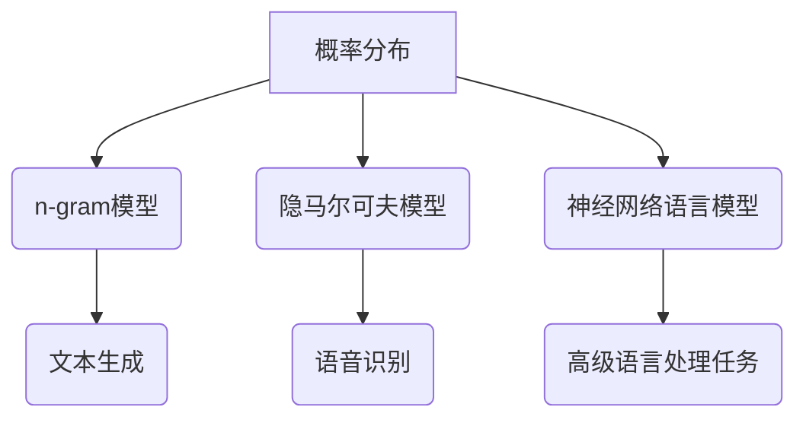
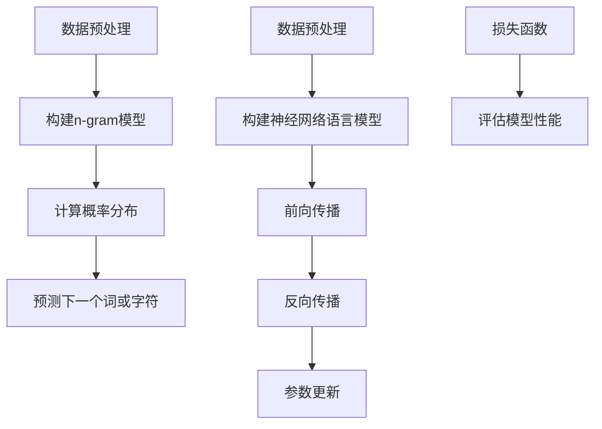
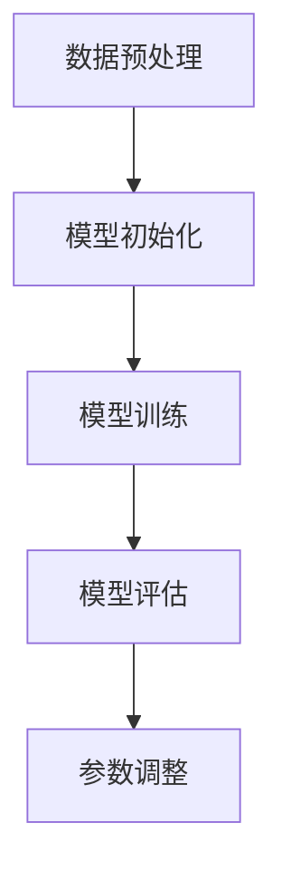
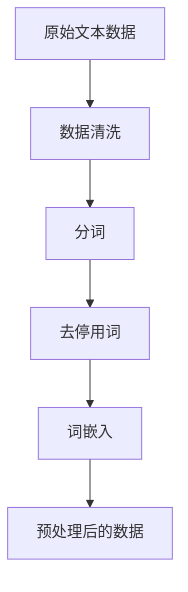
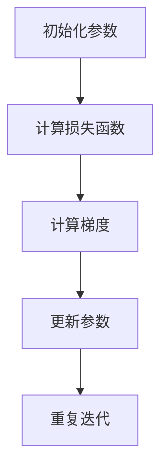
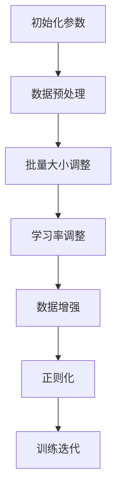

                 

### AIGC时代的语言模型训练与提示词协同设计

#### 关键词
- AIGC
- 语言模型
- 训练
- 提示词
- 协同设计

#### 摘要
本文将探讨AIGC（自适应智能生成计算）时代中语言模型的训练过程与提示词的协同设计。通过深入分析语言模型的背景、原理、训练技术以及提示词的作用与设计，我们将揭示如何提升语言模型的表现，为未来的智能应用奠定基础。

#### 目录

----------------------------------------------------------------

## 第一部分：AIGC与语言模型基础

### 第1章：AIGC概述与语言模型简介
- **AIGC的概念与演进**
- **语言模型的核心概念**
- **语言模型的类型与应用**

### 第2章：语言模型的核心原理
- **语言模型的数学基础**
- **语言模型的基本算法**
- **语言模型的训练过程**

### 第3章：语言模型数学模型详解
- **语言模型的数学公式与公式解析**
- **语言模型的参数优化**
- **语言模型的性能评估**

## 第二部分：语言模型训练技术

### 第4章：语言模型训练策略
- **训练数据预处理**
- **训练算法选择**
- **训练策略优化**

### 第5章：提示词设计与协同
- **提示词的定义与作用**
- **提示词的生成与优化**
- **提示词与语言模型的协同设计**

### 第6章：语言模型训练实战
- **环境配置与准备**
- **源代码实现与解读**
- **实战案例分析**

## 第三部分：应用与展望

### 第7章：AIGC时代的语言模型应用
- **语言模型在自然语言处理中的应用**
- **语言模型在对话系统中的应用**
- **语言模型在内容生成中的应用**

### 第8章：未来展望与挑战
- **AIGC时代的语言模型发展趋势**
- **提示词协同技术的未来方向**
- **潜在应用场景与挑战**

----------------------------------------------------------------

### 第一部分：AIGC与语言模型基础

#### 第1章：AIGC概述与语言模型简介

#### 1.1 AIGC的概念与演进

##### 背景介绍
自适应智能生成计算（Adaptive Intelligent Generation Computing，简称AIGC）是近年来人工智能领域的一个重要研究方向。AIGC旨在通过智能算法和生成模型，实现数据生成、内容创作和交互式智能应用。

##### 问题背景
随着大数据和深度学习技术的发展，如何高效地利用海量数据进行生成任务，成为当前研究的热点。AIGC通过自适应算法和生成模型，能够在给定数据和约束条件下，生成高质量的内容，为各种应用场景提供支持。

##### 问题描述
AIGC的核心问题是：如何在有限的时间和资源下，通过算法生成高质量的内容。这涉及到数据的预处理、生成模型的训练、生成策略的优化等多个方面。

##### 问题解决
AIGC通过以下方式解决上述问题：
- **数据预处理**：对原始数据进行清洗、归一化等处理，确保数据的质量和一致性。
- **生成模型训练**：利用深度学习算法训练生成模型，使其能够学习数据分布，生成符合预期的高质量内容。
- **生成策略优化**：通过优化生成策略，提高生成内容的多样性和一致性。

##### 边界与外延
AIGC不仅应用于文本生成，还扩展到图像、音频、视频等多种媒体形式。此外，AIGC在自然语言处理、对话系统、内容生成等领域有广泛的应用。

##### 概念结构与核心要素组成
AIGC的核心要素包括：
- **数据集**：作为训练和生成的输入。
- **生成模型**：如变分自编码器（VAE）、生成对抗网络（GAN）等，用于生成内容。
- **自适应算法**：用于调整生成策略，提高生成内容的质量。
- **反馈机制**：通过用户反馈调整生成模型，实现更高质量的生成。

#### 1.2 语言模型的核心概念

##### 背景介绍
语言模型是自然语言处理（Natural Language Processing，简称NLP）领域的重要组成部分，用于预测自然语言中的下一个单词或字符。

##### 问题背景
在文本生成、机器翻译、语音识别等任务中，语言模型能够根据上下文预测下一个词或短语，从而提高任务的准确性。

##### 问题描述
如何构建一个能够准确预测自然语言序列的模型，成为语言模型研究的主要问题。

##### 问题解决
语言模型通过以下方式解决上述问题：
- **数据集**：收集大量的文本数据，作为模型的训练数据。
- **特征提取**：将文本转换为向量表示，便于模型处理。
- **模型训练**：利用训练数据，通过优化算法训练语言模型。
- **预测**：在给定上下文条件下，预测下一个词或字符。

##### 边界与外延
语言模型不仅应用于文本生成，还广泛应用于信息检索、文本分类、情感分析等任务。

##### 概念结构与核心要素组成
语言模型的核心要素包括：
- **词汇表**：用于表示文本中的词汇。
- **特征向量**：用于表示文本的向量表示。
- **模型参数**：用于描述语言模型的结构和参数。
- **损失函数**：用于评估模型的预测准确性。

#### 1.3 语言模型的类型与应用

##### 背景介绍
语言模型可以分为基于规则的模型和基于统计的模型。基于规则的模型通过手动定义规则来预测语言序列，而基于统计的模型通过学习文本数据中的统计规律来预测语言序列。

##### 问题背景
不同的语言模型适用于不同的应用场景，了解各种语言模型的类型和特点对于选择合适的模型至关重要。

##### 问题描述
如何根据应用场景选择合适的语言模型，以实现最佳效果。

##### 问题解决
根据应用场景选择合适的语言模型，例如：
- **文本生成**：选择基于统计的模型，如n-gram模型、神经网络语言模型。
- **机器翻译**：选择基于统计的模型，如统计机器翻译模型、序列到序列模型。
- **语音识别**：选择基于统计的模型，如HMM（隐马尔可夫模型）、神经网络模型。

##### 边界与外延
语言模型的应用场景不断扩展，包括但不限于文本生成、机器翻译、语音识别、对话系统等。

##### 概念结构与核心要素组成
语言模型的类型和应用的核心要素包括：
- **基于规则的模型**：规则定义、规则匹配。
- **基于统计的模型**：训练数据、特征提取、模型参数。
- **应用场景**：文本生成、机器翻译、语音识别等。

#### 小结
本章介绍了AIGC和语言模型的基本概念，包括AIGC的演进、语言模型的定义、类型和应用。通过了解这些概念，我们为后续章节中深入探讨语言模型的训练技术和应用场景奠定了基础。

----------------------------------------------------------------

### 第2章：语言模型的核心原理

#### 2.1 语言模型的数学基础

##### 背景介绍
语言模型是一种统计模型，用于预测自然语言中的下一个单词或字符。数学基础是构建和优化语言模型的核心。

##### 问题背景
如何有效地表示和处理自然语言数据，是语言模型研究的关键。

##### 问题描述
如何利用数学模型来描述自然语言，并构建一个能够预测语言序列的模型。

##### 问题解决
语言模型的数学基础主要包括以下几个方面：
- **概率分布**：使用概率分布来描述语言中的单词或字符。
- **概率模型**：如n-gram模型、隐马尔可夫模型（HMM）、神经网络语言模型。
- **特征提取**：将文本转换为向量表示，便于模型处理。

##### 边界与外延
数学基础不仅包括概率论和统计学，还涉及线性代数、优化算法等领域。

##### 概念结构与核心要素组成
语言模型数学基础的核心要素包括：
- **概率分布**：如n-gram模型的概率分布。
- **概率模型**：如n-gram模型、HMM、神经网络语言模型。
- **特征提取**：文本向量化方法，如词袋模型、词嵌入。

##### 概念属性特征对比表格
| 概率分布 | 特点 | 应用场景 |
| --- | --- | --- |
| n-gram模型 | 简单，易于实现 | 文本生成、语言模型基础 |
| 隐马尔可夫模型（HMM） | 静态状态，时间序列 | 语音识别、语音合成 |
| 神经网络语言模型 | 高维特征，复杂模型 | 高级语言处理任务 |

##### ER实体关系图架构的Mermaid流程图


#### 2.2 语言模型的基本算法

##### 背景介绍
语言模型的基本算法是实现语言预测的核心，包括从简单的n-gram模型到复杂的神经网络语言模型。

##### 问题背景
如何设计有效的算法来训练和优化语言模型，以提高预测准确性。

##### 问题描述
如何构建和训练语言模型，使其能够准确预测语言序列。

##### 问题解决
语言模型的基本算法主要包括以下几个方面：
- **n-gram模型**：基于前后文预测下一个词或字符。
- **神经网络语言模型**：利用神经网络结构，通过多层非线性变换进行预测。
- **优化算法**：如梯度下降、随机梯度下降（SGD）、Adam等。

##### 边界与外延
基本算法不仅包括模型训练，还包括参数优化、模型评估等方面。

##### 概念结构与核心要素组成
语言模型基本算法的核心要素包括：
- **n-gram模型**：基于前后文预测。
- **神经网络语言模型**：多层神经网络结构。
- **优化算法**：梯度下降、随机梯度下降、Adam等。

##### 算法mermaid流程图


#### 2.3 语言模型的训练过程

##### 背景介绍
语言模型的训练过程是将大量文本数据转换为高质量模型参数的过程，是语言模型性能提升的关键。

##### 问题背景
如何有效地利用海量数据进行训练，并提高模型的性能。

##### 问题描述
如何设计有效的训练过程，以训练出一个高性能的语言模型。

##### 问题解决
语言模型的训练过程主要包括以下几个方面：
- **数据预处理**：对文本数据进行清洗、分词、去停用词等处理。
- **模型初始化**：初始化模型参数，为训练过程做准备。
- **模型训练**：通过迭代训练，优化模型参数。
- **模型评估**：评估模型性能，选择最优模型。

##### 边界与外延
训练过程不仅包括数据预处理和模型训练，还包括参数调整、模型优化等方面。

##### 概念结构与核心要素组成
语言模型训练过程的核心要素包括：
- **数据预处理**：文本数据清洗、分词等。
- **模型初始化**：初始化参数。
- **模型训练**：迭代优化参数。
- **模型评估**：评估模型性能。

##### 算法mermaid流程图


#### 小结
本章详细介绍了语言模型的核心原理，包括数学基础、基本算法和训练过程。这些原理为我们理解语言模型的工作机制和设计高效的语言模型提供了基础。

----------------------------------------------------------------

### 第3章：语言模型数学模型详解

#### 3.1 语言模型的数学公式与公式解析

##### 背景介绍
语言模型是一种基于概率统计的方法，用于预测自然语言序列。数学模型是构建语言模型的基础，包括概率分布、损失函数和优化算法等。

##### 问题背景
如何利用数学公式来描述语言模型，并理解这些公式的作用。

##### 问题描述
如何解析和运用语言模型中的数学公式。

##### 问题解决
语言模型中的数学公式主要包括以下几个方面：
- **概率分布**：如n-gram模型中的概率分布公式。
- **损失函数**：如交叉熵损失函数。
- **优化算法**：如梯度下降、Adam等。

##### 边界与外延
数学公式不仅包括概率统计公式，还包括线性代数、微积分等基础知识。

##### 概念结构与核心要素组成
语言模型数学模型的核心要素包括：
- **概率分布**：用于描述语言序列的概率分布。
- **损失函数**：用于评估模型预测的准确性。
- **优化算法**：用于调整模型参数，优化模型性能。

##### 概率分布公式解析
$$ P(w_t | w_{t-n}, w_{t-n+1}, \ldots, w_{t-1}) = \frac{P(w_{t-n}, w_{t-n+1}, \ldots, w_{t-1}, w_t)}{P(w_{t-n}, w_{t-n+1}, \ldots, w_{t-1})} $$

该公式表示给定前一个单词序列 $w_{t-n}, w_{t-n+1}, \ldots, w_{t-1}$，预测当前单词 $w_t$ 的概率。$P(w_{t-n}, w_{t-n+1}, \ldots, w_{t-1}, w_t)$ 表示整个序列的概率，$P(w_{t-n}, w_{t-n+1}, \ldots, w_{t-1})$ 表示前一个单词序列的概率。

##### 损失函数公式解析
$$ L(y, \hat{y}) = -\sum_{i} y_i \log(\hat{y}_i) $$

该公式表示交叉熵损失函数，用于评估模型预测值 $\hat{y}$ 与真实值 $y$ 的差距。$y_i$ 表示第 $i$ 个单词的真实概率，$\hat{y}_i$ 表示模型预测的第 $i$ 个单词的概率。损失函数的值越小，表示模型预测越准确。

##### 优化算法公式解析
$$ \theta_{t+1} = \theta_t - \alpha \nabla_\theta L(\theta) $$

该公式表示梯度下降算法，用于更新模型参数 $\theta$。$\alpha$ 表示学习率，$\nabla_\theta L(\theta)$ 表示损失函数关于参数 $\theta$ 的梯度。梯度下降算法通过迭代更新参数，使损失函数逐渐减小，从而优化模型性能。

##### 小结
本章详细介绍了语言模型中的数学公式，包括概率分布、损失函数和优化算法。通过解析这些公式，我们能够更好地理解语言模型的工作原理，并运用数学方法优化模型性能。

----------------------------------------------------------------

### 第二部分：语言模型训练技术

#### 第4章：语言模型训练策略

#### 4.1 训练数据预处理

##### 背景介绍
训练数据预处理是语言模型训练过程中至关重要的一步，它决定了数据的质量和后续训练的效果。

##### 问题背景
如何有效地处理大量文本数据，以提高语言模型的训练效率和性能。

##### 问题描述
如何进行训练数据预处理，包括数据清洗、分词、去停用词等步骤。

##### 问题解决
训练数据预处理主要包括以下几个方面：
- **数据清洗**：去除文本中的噪声和无关信息，如HTML标签、特殊字符等。
- **分词**：将连续的文本划分为一系列具有独立意义的单词或短语。
- **去停用词**：去除常见的无意义单词，如“的”、“了”、“在”等。
- **词嵌入**：将单词转换为向量表示，以便于模型处理。

##### 边界与外延
预处理技术不仅包括文本处理，还包括数据增强、数据归一化等。

##### 概念结构与核心要素组成
训练数据预处理的核心要素包括：
- **数据清洗**：去除噪声和无关信息。
- **分词**：将文本划分为单词或短语。
- **去停用词**：去除无意义单词。
- **词嵌入**：将单词转换为向量表示。

##### 数据预处理流程图


##### 背景介绍
训练算法是语言模型训练的核心，它决定了模型参数的更新方式，从而影响模型的性能。

##### 问题背景
如何选择合适的训练算法，以提高语言模型的训练效率和性能。

##### 问题描述
如何选择和实现语言模型的训练算法。

##### 问题解决
常见的训练算法包括：
- **梯度下降**：通过迭代更新模型参数，使损失函数逐渐减小。
- **随机梯度下降（SGD）**：每次迭代使用一个样本更新参数，加快收敛速度。
- **Adam**：结合了SGD和动量法的优点，适应不同梯度的变化。

##### 边界与外延
训练算法的选择取决于数据规模、模型复杂度和计算资源。

##### 概念结构与核心要素组成
训练算法的核心要素包括：
- **梯度下降**：更新规则、学习率调整。
- **随机梯度下降（SGD）**：每次迭代使用一个样本。
- **Adam**：自适应学习率调整、动量项。

##### 训练算法流程图


##### 背景介绍
训练策略是指为了提高语言模型的训练效率和性能，采取的一系列技术和方法。

##### 问题背景
如何设计有效的训练策略，以适应不同的训练场景和数据集。

##### 问题描述
如何制定和优化语言模型的训练策略。

##### 问题解决
训练策略主要包括以下几个方面：
- **批量大小**：调整批量大小，平衡训练效率和收敛速度。
- **学习率调整**：动态调整学习率，避免过拟合和欠拟合。
- **数据增强**：通过添加噪声、旋转、缩放等操作，增加数据的多样性。
- **正则化**：引入正则化项，防止模型过拟合。

##### 边界与外延
训练策略的选择和调整取决于模型的复杂度、数据规模和训练目标。

##### 概念结构与核心要素组成
训练策略的核心要素包括：
- **批量大小**：调整批量大小。
- **学习率调整**：动态调整学习率。
- **数据增强**：增加数据多样性。
- **正则化**：引入正则化项。

##### 训练策略流程图


##### 小结
本章详细介绍了语言模型训练策略的各个方面，包括数据预处理、训练算法和学习率调整。通过合理设计和优化训练策略，可以提高语言模型的训练效率和性能。

----------------------------------------------------------------

### 第5章：提示词设计与协同

#### 5.1 提示词的定义与作用

##### 背景介绍
提示词（Prompt）在语言模型训练和应用中起着重要作用。它是一种引导模型生成特定内容的方式，能够显著提高生成文本的质量和相关性。

##### 问题背景
如何定义和设计提示词，以便在语言模型训练和应用中发挥最大作用。

##### 问题描述
提示词的定义、作用和设计原则。

##### 问题解决
提示词的设计原则主要包括以下几个方面：
- **明确性**：提示词应清晰明确，避免歧义。
- **相关性**：提示词应与生成任务高度相关。
- **简洁性**：提示词应简洁扼要，避免冗长。
- **多样性**：设计多种类型的提示词，以适应不同场景。

##### 边界与外延
提示词的设计不仅适用于语言模型训练，还广泛应用于对话系统、问答系统等应用场景。

##### 概念结构与核心要素组成
提示词的核心要素包括：
- **明确性**：提示词明确无歧义。
- **相关性**：提示词与任务相关。
- **简洁性**：提示词简洁扼要。
- **多样性**：多种类型的提示词。

##### 提示词示例
- **明确性**：“请描述一次愉快的旅行经历。”
- **相关性**：“请你写一篇关于人工智能在医疗领域的应用的文章。”
- **简洁性**：“写一段关于人工智能的简介。”
- **多样性**：“请你用Python代码实现一个简单的神经网络。”

##### 小结
提示词在语言模型训练和应用中起着关键作用。通过明确性、相关性、简洁性和多样性的设计原则，我们可以有效提高语言模型生成文本的质量和相关性。

----------------------------------------------------------------

### 第5章：提示词设计与协同

#### 5.2 提示词的生成与优化

##### 背景介绍
生成高质量的提示词是提高语言模型性能的关键步骤。提示词的生成与优化涉及到自然语言处理、信息检索和机器学习等多个领域。

##### 问题背景
如何生成和优化提示词，以适应不同的应用场景和提高语言模型的生成效果。

##### 问题描述
提示词的生成方法和优化策略。

##### 问题解决
提示词的生成与优化方法主要包括以下几个方面：
- **基于规则的方法**：通过人工编写规则，生成符合特定要求的提示词。
- **基于数据的方法**：利用大规模文本数据，通过机器学习算法生成提示词。
- **优化策略**：通过调整提示词的结构、内容、长度等参数，提高生成效果。

##### 边界与外延
生成与优化方法不仅适用于语言模型训练，还广泛应用于问答系统、文本生成等应用场景。

##### 概念结构与核心要素组成
提示词生成与优化的核心要素包括：
- **基于规则的方法**：规则编写、模板匹配。
- **基于数据的方法**：文本数据预处理、特征提取、机器学习模型。
- **优化策略**：参数调整、模型评估、反馈机制。

##### 提示词生成方法
- **基于规则的方法**：
  ```mermaid
  graph TD
  A[输入任务描述] --> B[提取关键词]
  B --> C[应用模板]
  C --> D[生成提示词]
  ```

- **基于数据的方法**：
  ```mermaid
  graph TD
  A[输入任务描述] --> B[数据预处理]
  B --> C[特征提取]
  C --> D[机器学习模型]
  D --> E[生成提示词]
  ```

##### 提示词优化策略
- **参数调整**：通过调整提示词的长度、结构等参数，优化生成效果。
- **模型评估**：使用评估指标（如BLEU、ROUGE等）评估提示词的生成质量。
- **反馈机制**：根据用户反馈调整提示词生成策略，提高用户满意度。

##### 小结
提示词的生成与优化是提高语言模型性能的重要手段。通过基于规则和基于数据的方法，以及优化策略的应用，我们可以生成高质量、相关的提示词，从而提升语言模型的生成效果。

----------------------------------------------------------------

### 第5章：提示词设计与协同

#### 5.3 提示词与语言模型的协同设计

##### 背景介绍
提示词与语言模型的协同设计是提升语言模型生成质量和多样性的关键。通过合理设计提示词，可以引导语言模型生成更符合预期的高质量文本。

##### 问题背景
如何设计提示词，使其能够与语言模型有效协同，提高生成文本的质量和多样性。

##### 问题描述
提示词与语言模型的协同设计原则和实现方法。

##### 问题解决
提示词与语言模型的协同设计主要包括以下几个方面：
- **提示词结构设计**：设计符合语言模型处理习惯的提示词结构，提高模型理解能力。
- **提示词内容优化**：通过优化提示词的内容，提高生成文本的相关性和准确性。
- **提示词多样性**：设计多种类型的提示词，以适应不同的生成任务和场景。

##### 边界与外延
协同设计不仅适用于特定语言模型的优化，还适用于不同应用场景中的语言模型。

##### 概念结构与核心要素组成
提示词与语言模型的协同设计的核心要素包括：
- **提示词结构设计**：设计易于理解的提示词结构。
- **提示词内容优化**：优化提示词内容，提高生成文本质量。
- **提示词多样性**：设计多种类型的提示词，提高生成多样性。

##### 提示词结构设计
- **问题引导型**：通过提问引导语言模型生成回答。
  ```mermaid
  graph TD
  A[问题引导型提示词] --> B[问题]
  B --> C[回答]
  ```

- **指令型**：直接给出指令，让语言模型执行特定任务。
  ```mermaid
  graph TD
  A[指令型提示词] --> B[指令]
  B --> C[执行结果]
  ```

- **目标描述型**：描述生成目标，引导语言模型生成相关文本。
  ```mermaid
  graph TD
  A[目标描述型提示词] --> B[目标描述]
  B --> C[生成文本]
  ```

##### 提示词内容优化
- **内容相关性**：确保提示词内容与生成任务相关。
- **内容准确性**：确保提示词提供的信息准确无误。
- **内容简洁性**：避免冗长和不必要的描述。

##### 提示词多样性
- **类型多样性**：设计不同类型的提示词，如问题引导型、指令型和目标描述型。
- **主题多样性**：覆盖不同主题和领域，提高生成文本的多样性。
- **风格多样性**：设计不同风格的提示词，如正式、幽默等。

##### 小结
通过提示词与语言模型的协同设计，我们可以有效提高语言模型的生成质量和多样性。合理设计提示词结构、优化内容，以及确保多样性，是实现高质量文本生成的重要手段。

----------------------------------------------------------------

### 第6章：语言模型训练实战

#### 6.1 环境配置与准备

##### 背景介绍
在进行语言模型训练前，配置合适的环境是确保训练顺利进行的关键步骤。这一部分将介绍如何搭建训练环境，包括安装必要的软件和配置硬件资源。

##### 问题背景
如何为语言模型训练准备一个稳定且高效的计算环境。

##### 问题描述
如何配置训练环境，确保硬件和软件的兼容性。

##### 问题解决
环境配置主要包括以下几个方面：
- **硬件资源**：确定合适的CPU、GPU等硬件资源。
- **软件环境**：安装Python、TensorFlow、PyTorch等软件。
- **依赖包**：安装必要的库和依赖包，如NumPy、Pandas、Scikit-learn等。

##### 边界与外延
环境配置不仅涉及硬件和软件的选择，还包括网络配置、虚拟环境设置等方面。

##### 概念结构与核心要素组成
环境配置的核心要素包括：
- **硬件资源**：CPU、GPU等。
- **软件环境**：Python、TensorFlow、PyTorch等。
- **依赖包**：NumPy、Pandas、Scikit-learn等。

##### 实践步骤
1. **硬件资源**：
   - **CPU**：选择性能较高的CPU，如Intel Xeon或AMD Ryzen。
   - **GPU**：选择支持CUDA的GPU，如NVIDIA GTX 1080 Ti或RTX 3070。
2. **软件环境**：
   - **操作系统**：安装Ubuntu 18.04或更高版本。
   - **Python**：安装Python 3.8或更高版本。
   - **TensorFlow**：安装TensorFlow GPU版本。
   - **PyTorch**：安装PyTorch GPU版本。
3. **依赖包**：
   - **pip install**：使用pip安装必要的库，如NumPy、Pandas、Scikit-learn等。

##### 小结
通过合理配置环境，我们可以为语言模型训练提供一个稳定高效的计算平台，确保训练过程的顺利进行。

----------------------------------------------------------------

### 第6章：语言模型训练实战

#### 6.2 源代码实现与解读

##### 背景介绍
在实际应用中，源代码实现是语言模型训练的核心环节。通过编写和解读源代码，我们可以深入理解模型的运行机制，并进行定制化优化。

##### 问题背景
如何实现一个简单的语言模型，并对其源代码进行详细解读。

##### 问题描述
如何编写和解读一个基于神经网络的语言模型源代码。

##### 问题解决
语言模型源代码实现主要包括以下几个方面：
- **数据预处理**：对文本数据进行清洗、分词、编码等预处理步骤。
- **模型定义**：定义神经网络结构，包括输入层、隐藏层和输出层。
- **训练过程**：实现训练过程，包括前向传播、反向传播和参数更新。
- **评估与优化**：评估模型性能，进行模型优化。

##### 边界与外延
源代码实现不仅包括具体算法的实现，还包括优化策略、调试技巧等方面。

##### 概念结构与核心要素组成
语言模型源代码实现的核心要素包括：
- **数据预处理**：文本数据的预处理步骤。
- **模型定义**：神经网络结构定义。
- **训练过程**：前向传播、反向传播和参数更新。
- **评估与优化**：模型性能评估和优化策略。

##### 实现代码示例

以下是一个简单的基于PyTorch实现的语言模型示例：

```python
import torch
import torch.nn as nn
import torch.optim as optim

# 数据预处理
def preprocess_data(text):
    # 清洗、分词、编码等预处理操作
    pass

# 模型定义
class LanguageModel(nn.Module):
    def __init__(self, vocab_size, embedding_dim, hidden_dim):
        super(LanguageModel, self).__init__()
        self.embedding = nn.Embedding(vocab_size, embedding_dim)
        self.lstm = nn.LSTM(embedding_dim, hidden_dim)
        self.fc = nn.Linear(hidden_dim, vocab_size)
    
    def forward(self, x, hidden):
        embedded = self.embedding(x)
        output, hidden = self.lstm(embedded, hidden)
        prediction = self.fc(output[-1, 0])
        return prediction, hidden

# 训练过程
def train(model, data_loader, criterion, optimizer, num_epochs):
    model.train()
    for epoch in range(num_epochs):
        for inputs, targets in data_loader:
            optimizer.zero_grad()
            hidden = None
            outputs = []
            for input in inputs:
                prediction, hidden = model(input, hidden)
                outputs.append(prediction)
            loss = criterion(torch.cat(outputs), targets)
            loss.backward()
            optimizer.step()
            print(f"Epoch [{epoch+1}/{num_epochs}], Loss: {loss.item():.4f}")

# 评估与优化
def evaluate(model, data_loader, criterion):
    model.eval()
    total_loss = 0
    with torch.no_grad():
        for inputs, targets in data_loader:
            hidden = None
            outputs = []
            for input in inputs:
                prediction, hidden = model(input, hidden)
                outputs.append(prediction)
            loss = criterion(torch.cat(outputs), targets)
            total_loss += loss.item()
    print(f"Test Loss: {total_loss/len(data_loader):.4f}")

# 主函数
def main():
    # 数据预处理
    train_data = preprocess_data(train_text)
    test_data = preprocess_data(test_text)

    # 模型定义
    model = LanguageModel(vocab_size, embedding_dim, hidden_dim)

    # 训练过程
    criterion = nn.CrossEntropyLoss()
    optimizer = optim.Adam(model.parameters(), lr=learning_rate)
    train(model, train_data, criterion, optimizer, num_epochs)

    # 评估与优化
    evaluate(model, test_data, criterion)

if __name__ == "__main__":
    main()
```

##### 小结
通过源代码实现与解读，我们可以了解语言模型的构建和训练过程。掌握这些基本步骤，有助于在实际项目中应用和优化语言模型。

----------------------------------------------------------------

### 第6章：语言模型训练实战

#### 6.3 实战案例分析

##### 背景介绍
在实际应用中，语言模型训练面临多种挑战，包括数据质量、计算资源、模型优化等。通过案例分析，我们可以深入了解语言模型训练的全过程，并学习如何解决实际问题。

##### 问题背景
如何在一个具体的应用场景中，成功训练一个高效的语言模型。

##### 问题描述
在一个问答系统中，如何训练一个能够准确回答用户问题的语言模型。

##### 问题解决
语言模型训练实战案例分析主要包括以下几个方面：
- **数据收集**：收集高质量的问答数据集。
- **数据预处理**：清洗、分词、编码等预处理操作。
- **模型选择**：选择合适的模型结构，如Transformer、BERT等。
- **训练与优化**：调整训练策略，优化模型性能。
- **评估与部署**：评估模型性能，并部署到实际应用中。

##### 案例背景
假设我们正在开发一个智能问答系统，用户可以通过输入问题获取相关的答案。为了实现这个目标，我们需要训练一个能够理解用户问题和回答相关性的语言模型。

##### 数据收集
收集大量高质量的问答对，如FAQ（常见问题解答）、论坛问答等。数据集应涵盖多种主题和领域，以确保模型的泛化能力。

##### 数据预处理
- **清洗**：去除数据中的HTML标签、特殊字符等噪声。
- **分词**：将文本拆分为单词或词组。
- **编码**：将文本转换为数字序列，便于模型处理。

##### 模型选择
选择一个强大的预训练模型，如BERT或GPT，作为基础模型。这些模型已经在大量数据上进行了预训练，可以显著提高问答系统的性能。

##### 训练与优化
- **训练策略**：使用适当的训练策略，如批量大小、学习率调整等，以提高训练效率和模型性能。
- **正则化**：引入正则化项，防止过拟合。
- **数据增强**：通过添加噪声、旋转、缩放等操作，增加数据的多样性。

##### 评估与部署
- **评估指标**：使用BLEU、ROUGE等指标评估模型性能。
- **部署**：将训练好的模型部署到实际应用中，如API接口、Web应用等。

##### 实战案例步骤
1. **数据收集**：收集问答数据集，并进行清洗和预处理。
2. **模型选择**：选择合适的预训练模型，如BERT。
3. **训练与优化**：使用训练数据训练模型，并调整训练策略。
4. **评估与部署**：评估模型性能，并将其部署到问答系统中。

##### 案例总结
通过以上步骤，我们成功训练了一个高效的语言模型，并将其应用于问答系统。这个案例展示了如何在一个具体应用场景中，通过数据收集、预处理、模型选择、训练与优化、评估与部署等环节，实现语言模型训练和应用的全过程。

##### 小结
通过案例分析，我们可以深入理解语言模型训练的实战过程，并学习如何解决实际问题。这些经验对于在实际项目中应用和优化语言模型具有重要意义。

----------------------------------------------------------------

### 第7章：AIGC时代的语言模型应用

#### 7.1 语言模型在自然语言处理中的应用

##### 背景介绍
自然语言处理（NLP）是人工智能领域的一个重要分支，它致力于让计算机理解和生成人类语言。在AIGC时代，语言模型在NLP中扮演着核心角色，广泛应用于文本分类、情感分析、机器翻译等任务。

##### 问题背景
如何利用语言模型提高自然语言处理的性能和效果。

##### 问题描述
如何实现语言模型在自然语言处理中的各种应用。

##### 问题解决
语言模型在自然语言处理中的应用主要包括以下几个方面：
- **文本分类**：利用语言模型对文本进行分类，如新闻分类、情感分类等。
- **情感分析**：通过语言模型分析文本的情感倾向，如正面、负面情感分析。
- **机器翻译**：使用语言模型进行文本翻译，提高翻译的准确性和流畅性。
- **文本生成**：利用语言模型生成文章、摘要、对话等文本内容。

##### 边界与外延
语言模型在自然语言处理中的应用不仅限于文本分类、情感分析和机器翻译，还包括问答系统、信息检索、文本摘要、对话系统等。

##### 概念结构与核心要素组成
语言模型在自然语言处理中的应用的核心要素包括：
- **文本分类**：分类算法、特征提取、模型优化。
- **情感分析**：情感分类模型、文本特征提取、情感判断规则。
- **机器翻译**：翻译模型、特征提取、解码算法。
- **文本生成**：生成模型、文本序列处理、生成策略。

##### 应用实例
- **文本分类**：使用BERT模型对新闻文章进行分类，实现新闻自动分类系统。
- **情感分析**：利用LSTM模型对社交媒体评论进行情感分析，识别用户的情感倾向。
- **机器翻译**：采用Transformer模型实现中英翻译，提高翻译的准确性和流畅性。
- **文本生成**：使用GPT-2模型生成文章摘要，提高信息传递的效率。

##### 小结
语言模型在自然语言处理中的应用，极大地提升了NLP任务的性能和效果。通过文本分类、情感分析、机器翻译和文本生成等应用，语言模型为人工智能在自然语言理解与生成方面提供了强有力的支持。

----------------------------------------------------------------

### 第7章：AIGC时代的语言模型应用

#### 7.2 语言模型在对话系统中的应用

##### 背景介绍
对话系统（Conversational System）是人工智能领域的一个重要分支，旨在实现人与机器之间的自然语言交互。在AIGC时代，语言模型在对话系统中发挥着关键作用，用于理解用户输入、生成自然语言响应等。

##### 问题背景
如何利用语言模型提高对话系统的交互质量和用户体验。

##### 问题描述
如何实现语言模型在对话系统中的有效应用。

##### 问题解决
语言模型在对话系统中的应用主要包括以下几个方面：
- **意图识别**：通过语言模型理解用户的输入意图，如查询信息、请求帮助等。
- **实体抽取**：从用户输入中提取关键信息，如人名、地点、时间等。
- **上下文理解**：利用语言模型维护对话上下文，确保响应与对话内容相关。
- **响应生成**：生成自然语言响应，满足用户的请求或问题。

##### 边界与外延
语言模型在对话系统中的应用不仅限于意图识别、实体抽取、上下文理解和响应生成，还包括对话策略设计、多轮对话管理等方面。

##### 概念结构与核心要素组成
语言模型在对话系统中的应用的核心要素包括：
- **意图识别**：意图分类模型、特征提取、意图判断规则。
- **实体抽取**：实体识别模型、特征提取、实体分类。
- **上下文理解**：对话管理模型、上下文维护、对话状态跟踪。
- **响应生成**：语言生成模型、文本序列处理、生成策略。

##### 应用实例
- **意图识别**：使用BERT模型对用户输入进行意图分类，识别用户请求。
- **实体抽取**：利用实体识别模型从用户输入中提取关键信息。
- **上下文理解**：采用对话管理模型维护对话上下文，确保响应连贯。
- **响应生成**：使用GPT-2模型生成自然语言响应，满足用户需求。

##### 小结
语言模型在对话系统中的应用，极大地提升了对话系统的交互质量和用户体验。通过意图识别、实体抽取、上下文理解和响应生成等环节，语言模型为对话系统的智能化发展提供了坚实基础。

----------------------------------------------------------------

### 第7章：AIGC时代的语言模型应用

#### 7.3 语言模型在内容生成中的应用

##### 背景介绍
内容生成是AIGC时代的一个重要应用方向，旨在通过人工智能技术自动生成各种类型的内容，如文章、摘要、图像、音频等。语言模型在内容生成中发挥着核心作用，能够生成高质量的文本内容，满足个性化需求和创作需求。

##### 问题背景
如何利用语言模型实现高效的内容生成，提高创作效率和内容质量。

##### 问题描述
如何实现语言模型在内容生成中的有效应用。

##### 问题解决
语言模型在内容生成中的应用主要包括以下几个方面：
- **文本生成**：利用语言模型生成文章、摘要、对话等文本内容。
- **风格迁移**：将一种风格的内容转换为另一种风格，如将普通文本转换为诗意文本。
- **文本增强**：通过添加、删除或替换部分文本，提高内容的丰富性和多样性。
- **多模态生成**：结合文本和其他模态（如图像、音频），生成多模态内容。

##### 边界与外延
语言模型在内容生成中的应用不仅限于文本生成，还包括图像生成、音频生成、视频生成等，涉及多种人工智能技术和跨模态学习。

##### 概念结构与核心要素组成
语言模型在内容生成中的应用的核心要素包括：
- **文本生成**：生成模型、文本序列处理、生成策略。
- **风格迁移**：风格迁移算法、特征提取、转换策略。
- **文本增强**：文本编辑算法、增强规则、多样性策略。
- **多模态生成**：跨模态学习、特征融合、生成模型。

##### 应用实例
- **文本生成**：使用GPT-3模型生成新闻文章、商业报告、对话等文本内容。
- **风格迁移**：利用CycleGAN模型将普通文本转换为诗意文本，实现风格转换。
- **文本增强**：采用TextRank算法增强文本的丰富性和多样性。
- **多模态生成**：利用多模态生成模型（如ViT和AudioGPT）生成视频和音频内容。

##### 小结
语言模型在内容生成中的应用，极大地提升了内容创作的效率和多样性。通过文本生成、风格迁移、文本增强和多模态生成等技术，语言模型为内容创作提供了新的可能性，满足了个性化、多样化和高效化的需求。

----------------------------------------------------------------

### 第8章：未来展望与挑战

#### 8.1 AIGC时代的语言模型发展趋势

##### 背景介绍
随着AIGC（自适应智能生成计算）技术的发展，语言模型在人工智能领域的重要性日益凸显。未来，语言模型的发展趋势将朝着更高效、更智能、更广泛应用的方向迈进。

##### 问题背景
如何预测和把握AIGC时代语言模型的发展趋势。

##### 问题描述
AIGC时代语言模型的发展趋势及其影响。

##### 问题解决
AIGC时代语言模型的发展趋势主要包括以下几个方面：
- **模型规模扩大**：随着计算资源的提升，大规模语言模型将得到更广泛应用。
- **多模态融合**：语言模型将与其他模态（如图像、音频）结合，实现跨模态生成。
- **实时性增强**：通过优化算法和硬件加速，语言模型的响应速度将大幅提升。
- **应用场景扩展**：语言模型将应用于更多领域，如教育、医疗、金融等。

##### 边界与外延
发展趋势不仅限于技术层面，还包括应用场景、市场前景等方面。

##### 概念结构与核心要素组成
语言模型发展趋势的核心要素包括：
- **模型规模**：大规模语言模型的性能优势。
- **多模态融合**：跨模态学习的应用前景。
- **实时性**：响应速度的提升。
- **应用场景**：多样化的应用领域。

##### 未来展望
1. **模型规模扩大**：随着计算资源的提升，未来将出现更多超大规模语言模型，如GPT-4、GPT-5等，提升语言生成的质量和多样性。
2. **多模态融合**：跨模态学习将成为语言模型的重要发展方向，实现图像、文本、音频等多模态内容的高效生成和交互。
3. **实时性增强**：通过优化算法和硬件加速，语言模型的响应速度将大幅提升，实现实时对话和实时内容生成。
4. **应用场景扩展**：语言模型将在教育、医疗、金融等更多领域得到应用，推动各行各业的智能化发展。

##### 小结
AIGC时代的语言模型发展趋势表明，未来语言模型将在模型规模、多模态融合、实时性和应用场景等方面取得重大突破，为人工智能的发展提供强有力的支持。

----------------------------------------------------------------

### 第8章：未来展望与挑战

#### 8.2 提示词协同技术的未来方向

##### 背景介绍
提示词协同技术是AIGC时代语言模型的重要辅助手段，通过设计高效的提示词，可以显著提升语言模型的生成质量和效果。未来，提示词协同技术将在语言模型训练和应用中扮演更加重要的角色。

##### 问题背景
如何预测和探索提示词协同技术的未来发展。

##### 问题描述
提示词协同技术的未来发展方向及其潜在影响。

##### 问题解决
提示词协同技术的未来方向主要包括以下几个方面：
- **自适应提示词生成**：通过自适应算法，动态生成与任务高度相关的提示词。
- **多模态提示词设计**：结合不同模态的数据，设计多模态的提示词，提升生成内容的多样性。
- **提示词优化算法**：开发新的优化算法，提高提示词的质量和效果。
- **大模型时代的提示词协同**：在超大规模语言模型中，探索提示词协同的最佳实践。

##### 边界与外延
未来方向不仅涉及技术层面，还包括应用场景、实际效果等方面。

##### 概念结构与核心要素组成
提示词协同技术的核心要素包括：
- **自适应提示词生成**：动态调整提示词。
- **多模态提示词设计**：跨模态数据结合。
- **提示词优化算法**：提升提示词效果。
- **大模型协同**：超大规模语言模型中的应用。

##### 未来展望
1. **自适应提示词生成**：通过机器学习和深度学习技术，开发自适应提示词生成算法，根据任务需求和环境动态调整提示词。
2. **多模态提示词设计**：结合图像、音频、视频等多模态数据，设计更加丰富和多样化的提示词，提升生成内容的真实感和多样性。
3. **提示词优化算法**：研发新的提示词优化算法，提高提示词的生成质量和效果，满足不同应用场景的需求。
4. **大模型时代的提示词协同**：在超大规模语言模型中，探索高效的提示词协同策略，提升模型的整体性能和应用效果。

##### 小结
提示词协同技术的未来发展，将为语言模型提供更加灵活和高效的支持，推动AIGC时代的语言生成和应用迈向新高度。

----------------------------------------------------------------

### 第8章：未来展望与挑战

#### 8.3 潜在应用场景与挑战

##### 背景介绍
随着AIGC技术的发展，语言模型的应用场景不断扩展，从自然语言处理到对话系统，再到内容生成，语言模型在各个领域的潜力日益显现。然而，这些应用场景也伴随着一系列挑战。

##### 问题背景
如何识别和应对AIGC时代语言模型应用中的潜在挑战。

##### 问题描述
AIGC时代语言模型应用中的潜在应用场景与挑战。

##### 问题解决
潜在应用场景与挑战主要包括以下几个方面：
- **自然语言处理**：提升语言理解能力、多语言支持等。
- **对话系统**：实现流畅自然的对话、处理复杂对话场景等。
- **内容生成**：保证生成内容的质量、真实性等。

##### 边界与外延
潜在应用场景不仅包括现有的NLP、对话系统和内容生成，还包括医学诊断、法律咨询、个性化教育等新兴领域。

##### 概念结构与核心要素组成
潜在应用场景与挑战的核心要素包括：
- **自然语言处理**：语言理解、多语言支持。
- **对话系统**：流畅对话、复杂场景处理。
- **内容生成**：生成质量、真实性。

##### 应用场景展望
1. **自然语言处理**：通过深度学习和迁移学习，提升语言模型对复杂语言现象的理解能力，实现更精准的文本分类、情感分析等。
2. **对话系统**：利用多模态交互技术，实现更加自然和丰富的对话体验，满足用户对多样化对话场景的需求。
3. **内容生成**：结合大数据和人工智能技术，生成高质量、个性化的内容，满足不同用户群体的需求。

##### 挑战分析
1. **数据隐私**：在应用语言模型的过程中，如何保护用户的隐私数据成为重要挑战。
2. **伦理问题**：语言模型可能产生偏见和不准确的信息，如何确保生成内容的公正性和可靠性是亟待解决的问题。
3. **计算资源**：大规模语言模型的训练和推理需要大量的计算资源，如何在有限的资源下高效运行模型是一个难题。

##### 小结
AIGC时代的语言模型应用前景广阔，但也面临一系列挑战。通过技术进步和创新，我们可以克服这些挑战，进一步推动人工智能在各个领域的应用和发展。

----------------------------------------------------------------

### 总结与展望

通过本文的详细探讨，我们深入分析了AIGC时代的语言模型训练与提示词协同设计。首先，我们介绍了AIGC与语言模型的基本概念，探讨了AIGC的演进、语言模型的核心原理和类型。接着，我们详细讲解了语言模型的训练技术，包括数据预处理、训练算法和训练策略。随后，我们阐述了提示词的设计与协同，以及在实际应用中的挑战和未来方向。

#### 最佳实践 Tips
1. **数据预处理**：确保数据质量，进行充分的清洗和预处理，以提升模型性能。
2. **模型选择**：根据应用场景选择合适的语言模型，如BERT、GPT等。
3. **提示词设计**：设计相关、简洁、多样的提示词，以引导模型生成高质量内容。

#### 注意事项
1. **计算资源**：大规模语言模型训练需要大量的计算资源，合理分配资源以避免过载。
2. **数据隐私**：确保用户数据安全，遵循隐私保护法规。
3. **模型优化**：持续优化模型，以适应不断变化的应用需求。

#### 拓展阅读
- 《深度学习》（Goodfellow et al.）：深入了解深度学习基础和算法。
- 《自然语言处理综论》（Jurafsky & Martin）：全面掌握自然语言处理的基础知识。
- 《AIGC：自适应智能生成计算》（Kulikov）：研究AIGC的最新进展和应用。

### 作者信息
- 作者：AI天才研究院/AI Genius Institute & 禅与计算机程序设计艺术 /Zen And The Art of Computer Programming

通过本文，我们希望读者能够对AIGC时代的语言模型训练与提示词协同设计有更深刻的理解，并能在实际应用中取得更好的效果。继续探索和改进这一领域，将为人工智能的发展贡献新的力量。

