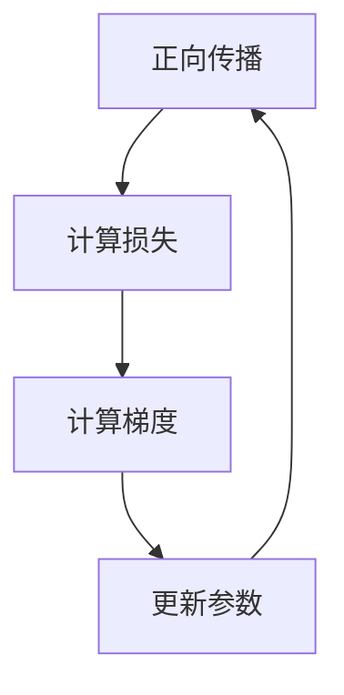
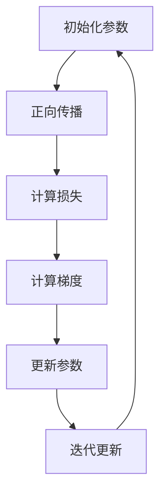
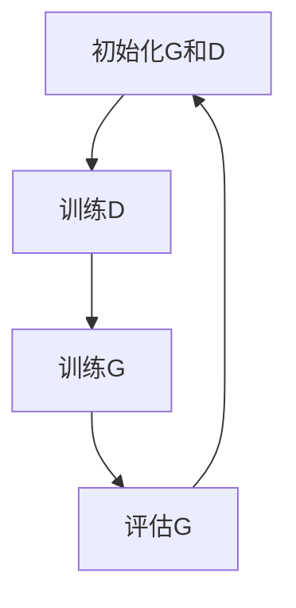
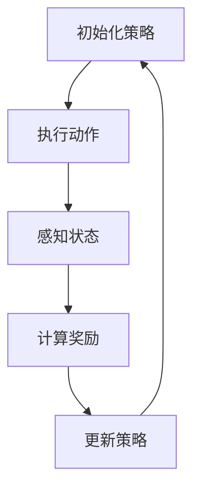
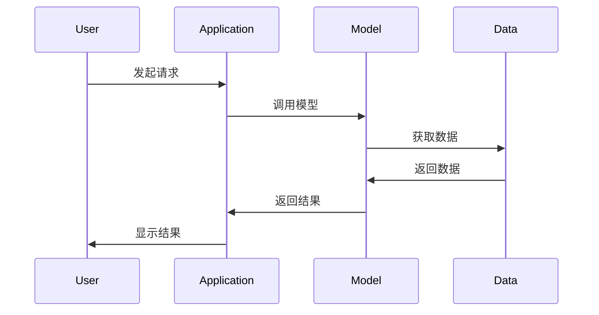
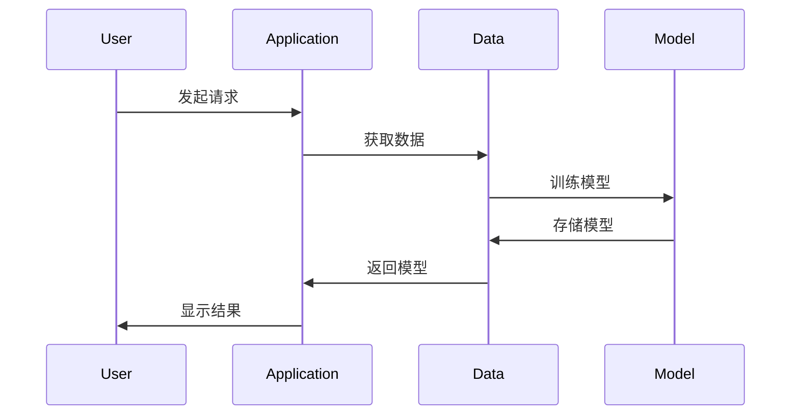

                 

### 第一部分：背景介绍与核心概念

#### 1.1 问题背景

随着人工智能技术的迅猛发展，语言模型已成为众多领域的核心技术。AIGC（AI-Generated Content）时代的到来，让语言模型的应用范围不断扩大，从自然语言处理、智能客服到内容创作，无不涉及。然而，如何高效地训练和设计语言模型，成为业界关注的焦点。本书旨在深入探讨AIGC时代的语言模型训练与提示词设计，帮助读者全面理解这一领域。

**背景介绍**

- **AIGC时代背景**：人工智能技术在不断进步，从传统的机器学习、深度学习到生成对抗网络（GAN）、强化学习等，这些技术的进步推动了人工智能在内容生成领域的应用。AIGC时代，即人工智能生成内容的时代，是指利用人工智能技术自动生成文字、图像、音频、视频等多样化内容，为各个行业提供高效的内容生产解决方案。
- **语言模型的应用**：在AIGC时代，语言模型被广泛应用于自然语言处理（NLP）领域。例如，在智能客服中，语言模型可以帮助系统理解用户的意图，自动生成回答；在内容创作中，语言模型可以生成文章、新闻报道、音乐、视频脚本等。
- **面临的挑战**：高效地训练和设计语言模型是一个复杂的任务，面临如下挑战：
  - **数据集的选择与构建**：合适的训练数据集是模型性能的关键。如何选择和构建高质量的数据集，以及处理数据不平衡、噪声等问题，是训练高效模型的重要步骤。
  - **模型架构的优化**：现有的语言模型架构如Transformer、BERT等，在不断优化和改进。如何根据具体应用需求选择合适的模型架构，并对其进行优化，是提升模型性能的关键。
  - **提示词的设计**：高质量的提示词能够引导模型生成更符合预期内容。如何设计有效的提示词，使其能够提高模型生成内容的质量和多样性，是提高内容生成系统性能的关键。

**核心概念**

- **语言模型**：一种基于神经网络和概率模型的计算机程序，用于生成和解析自然语言。核心概念包括词汇表、概率分布和神经网络等。
- **训练方法**：包括数据预处理、模型训练、参数优化等步骤，以提高模型性能和泛化能力。常见的训练方法有基于统计的方法和基于神经网络的方法。
- **提示词设计**：一种引导模型生成预期内容的方法，包括关键词选取、语义分析等。有效的提示词设计能够提高内容生成的质量。

**问题解决**

为了解决上述问题，本书将从以下几个方面进行深入探讨：

1. **核心概念与联系**：介绍AIGC时代语言模型的基础知识，包括模型架构、训练方法、数据集构建等。
2. **算法原理讲解**：详细讲解主流语言模型的训练过程，包括正向传播、反向传播、优化算法等。
3. **数学模型与公式**：阐述语言模型背后的数学原理，包括神经网络、概率分布、损失函数等。
4. **系统分析与架构设计方案**：分析语言模型在不同应用场景中的架构设计，包括前端接口、后端服务、数据存储等。
5. **项目实战**：通过实际案例，展示如何搭建和优化语言模型，并进行提示词设计。

#### 1.2 问题描述

在AIGC时代，语言模型的训练与提示词设计面临诸多挑战。首先，如何选择合适的数据集、优化模型架构和参数，以提高模型性能和泛化能力，是一个亟待解决的问题。其次，如何设计高质量的提示词，使其能够引导模型生成更符合预期的内容，同样至关重要。此外，还需考虑模型的安全性和可解释性，确保其在实际应用中的可靠性和公平性。

**问题描述**

- **训练数据集的选择与构建**：选择和构建高质量的数据集是训练高效模型的关键。问题在于如何处理数据集的不平衡、噪声和冗余等问题。
- **模型架构的优化**：现有的语言模型架构如Transformer、BERT等，在不断优化和改进。如何根据具体应用需求选择合适的模型架构，并对其进行优化，是提升模型性能的关键。
- **提示词设计**：如何设计高质量的提示词，使其能够引导模型生成更符合预期的内容，是提高内容生成系统性能的关键。
- **模型安全性与可解释性**：随着模型应用范围的扩大，模型的安全性和可解释性变得越来越重要。如何确保模型在实际应用中的可靠性和公平性，是一个亟待解决的问题。

**问题解决**

为了解决上述问题，本书将从以下几个方面进行深入探讨：

1. **核心概念与联系**：介绍AIGC时代语言模型的基础知识，包括模型架构、训练方法、数据集构建等。
2. **算法原理讲解**：详细讲解主流语言模型的训练过程，包括正向传播、反向传播、优化算法等。
3. **数学模型与公式**：阐述语言模型背后的数学原理，包括神经网络、概率分布、损失函数等。
4. **系统分析与架构设计方案**：分析语言模型在不同应用场景中的架构设计，包括前端接口、后端服务、数据存储等。
5. **项目实战**：通过实际案例，展示如何搭建和优化语言模型，并进行提示词设计。

#### 1.3 问题解决

为了解决上述问题，本书将从以下几个方面进行深入探讨：

1. **核心概念与联系**：介绍AIGC时代语言模型的基础知识，包括模型架构、训练方法、数据集构建等。
2. **算法原理讲解**：详细讲解主流语言模型的训练过程，包括正向传播、反向传播、优化算法等。
3. **数学模型与公式**：阐述语言模型背后的数学原理，包括神经网络、概率分布、损失函数等。
4. **系统分析与架构设计方案**：分析语言模型在不同应用场景中的架构设计，包括前端接口、后端服务、数据存储等。
5. **项目实战**：通过实际案例，展示如何搭建和优化语言模型，并进行提示词设计。

#### 1.4 边界与外延

AIGC时代的语言模型训练与提示词设计不仅涉及技术层面，还包括伦理、法律、社会等多方面的问题。因此，本书将不仅关注技术实现，还将探讨相关伦理和法律问题，以帮助读者全面了解这一领域。

**边界与外延**

- **技术边界**：AIGC时代的语言模型训练与提示词设计涉及众多技术领域，包括深度学习、自然语言处理、数据挖掘等。本书将重点介绍相关技术原理和应用。
- **法律与伦理问题**：随着语言模型的应用范围扩大，相关的法律和伦理问题日益突出。如何确保模型生成内容的合规性、保护用户隐私等，是亟待解决的问题。
- **社会影响**：AIGC时代的语言模型训练与提示词设计将对社会产生深远影响，包括内容创作、新闻传播、教育等领域。本书将探讨这些影响及其应对策略。

**概念结构与核心要素组成**

AIGC时代的语言模型训练与提示词设计的核心概念包括：

- **语言模型**：基于神经网络和概率模型的计算机程序，用于生成和解析自然语言。
- **训练方法**：包括数据预处理、模型训练、参数优化等，以提高模型性能和泛化能力。
- **提示词设计**：引导模型生成预期内容的方法，包括关键词选取、语义分析等。
- **数据集构建**：选择和构建高质量的数据集，以支持模型训练和优化。
- **模型架构优化**：根据应用需求选择和优化语言模型架构，以提升模型性能。

这些核心概念构成了AIGC时代语言模型训练与提示词设计的理论基础。

### 第一部分：背景介绍与核心概念

---

## 第二部分：核心概念与联系

### 2.1 语言模型的基本概念

#### 2.1.1 什么是语言模型

语言模型（Language Model）是一种用于预测自然语言中下一个词或词组的概率分布的数学模型。它在自然语言处理（NLP）、语音识别、机器翻译、文本生成等领域发挥着重要作用。

**核心组成部分**

- **词汇表（Vocabulary）**：语言模型的基础，包含所有可能的单词或词组。在实际应用中，词汇表的大小通常在数万到数十万词之间。
- **概率分布（Probability Distribution）**：用于表示给定上下文中某个词或词组出现的概率。通过学习大量文本数据，语言模型可以生成下一个词的概率分布。
- **神经网络（Neural Network）**：语言模型通常采用深度神经网络，如循环神经网络（RNN）、长短时记忆网络（LSTM）、变换器（Transformer）等。这些神经网络可以捕捉输入序列的长期依赖关系，从而提高模型的性能。

**应用场景**

- **自然语言处理（NLP）**：如文本分类、情感分析、命名实体识别等。
- **语音识别**：将语音信号转换为文本。
- **机器翻译**：将一种语言的文本翻译成另一种语言。
- **文本生成**：如文章、诗歌、音乐等。

#### 2.1.2 语言模型的核心组成部分

- **词汇表**：语言模型的基础，包含所有可能的单词或词组。
- **概率分布**：用于表示某个单词或词组在给定上下文条件下出现的概率。
- **神经网络**：用于训练语言模型的算法，通过不断调整参数，使得模型生成的语言更符合实际语言规律。

**概念属性特征对比表格**

| 特征               | 语言模型A | 语言模型B |
|--------------------|-----------|-----------|
| 模型架构           | RNN       | Transformer |
| 词汇表大小         | 100,000词 | 300,000词 |
| 概率分布计算方法   | 条件概率   | 对数概率 |
| 学习方式           | 有监督学习 | 自监督学习 |

**ER实体关系图架构**

```mermaid
erDiagram
  User ||--|{ LanguageModel }|| Model
  Model ||--|{ Vocabulary }|| WordList
  Model ||--|{ ProbabilityDistribution }|| Distribution
  Model ||--|{ NeuralNetwork }|| Network
```

#### 2.1.3 语言模型的应用场景

语言模型在众多领域有着广泛的应用。以下是一些典型的应用场景：

- **自然语言处理（NLP）**：语言模型是NLP系统的核心组件，用于理解、生成和处理自然语言。例如，文本分类、情感分析、命名实体识别等。
- **智能客服**：通过语言模型，智能客服系统能够自动理解和回答用户的问题，提供个性化服务。
- **内容创作**：语言模型可以生成文章、新闻、故事、诗歌等。例如，谷歌的AutoML自然语言处理平台就可以根据用户提供的主题生成文章。
- **机器翻译**：语言模型在机器翻译中起着至关重要的作用。通过训练双语语料库，语言模型可以将一种语言的文本翻译成另一种语言。
- **语音识别**：语言模型可以帮助语音识别系统将语音信号转换为文本。例如，苹果的Siri和谷歌助手都使用了语言模型来实现语音识别功能。

**应用场景对比表格**

| 应用场景             | 语言模型A | 语言模型B |
|----------------------|-----------|-----------|
| 文本分类             | 是        | 是        |
| 情感分析             | 是        | 是        |
| 命名实体识别         | 是        | 是        |
| 内容创作             | 是        | 是        |
| 机器翻译             | 是        | 是        |
| 语音识别             | 是        | 否        |

### 2.2 训练方法与数据集构建

#### 2.2.1 训练方法

训练语言模型的主要目的是使其能够根据输入的文本序列生成下一个词的概率分布。常见的训练方法包括：

- **基于统计的方法**：如N-gram模型，通过统计单词或词组的频率来预测下一个单词。这种方法简单高效，但无法捕捉长距离依赖关系。
- **基于神经网络的方法**：如循环神经网络（RNN）、长短时记忆网络（LSTM）、变换器（Transformer）等。这些方法通过学习输入序列的长期依赖关系，可以生成更符合实际语言规律的概率分布。

**训练流程**

1. **数据预处理**：对文本数据进行分析，去除停用词、标点符号、HTML标签等，并将文本转换为向量表示。
2. **构建词汇表**：将文本中的单词或词组映射到唯一的整数编号。
3. **生成训练样本**：将文本序列分割成一系列输入输出对，其中输入为前T个单词，输出为第T+1个单词。
4. **模型训练**：通过优化算法（如梯度下降）调整模型参数，使得模型生成的概率分布更符合实际语言规律。

**训练方法对比表格**

| 方法               | 优点                                      | 缺点                                      |
|--------------------|-----------------------------------------|-----------------------------------------|
| N-gram模型         | 简单高效，计算速度快                    | 无法捕捉长距离依赖关系                  |
| RNN                | 能够捕捉长距离依赖关系                  | 易出现梯度消失或爆炸问题              |
| LSTM               | 优化了RNN的梯度问题，能够捕捉长距离依赖关系 | 训练时间较长                          |
| Transformer        | 不依赖序列顺序，能够并行计算           | 计算复杂度高，参数量大                |

#### 2.2.2 数据集构建

构建高质量的数据集是训练高效语言模型的关键。以下是一些常用的数据集构建方法：

- **公开数据集**：如维基百科、新闻文章、社交媒体等。这些数据集通常包含大量的文本数据，适合用于训练通用语言模型。
- **私有数据集**：根据特定应用需求收集的数据集。例如，某个公司可能需要根据自己的业务数据训练一个特定领域的语言模型。
- **数据增强**：通过对原始数据集进行变换（如词替换、同义词替换、随机插入删除等），可以增加数据集的多样性和丰富性。

**数据集构建方法对比表格**

| 方法               | 优点                                      | 缺点                                      |
|--------------------|-----------------------------------------|-----------------------------------------|
| 公开数据集         | 数据量大，覆盖面广                      | 可能存在噪声和冗余数据                  |
| 私有数据集         | 数据质量高，针对性更强                  | 数据量有限，覆盖面较窄                |
| 数据增强           | 增加数据集的多样性和丰富性              | 可能引入错误和噪声                      |

#### 2.2.3 数据预处理

数据预处理是语言模型训练的重要环节，主要包括以下步骤：

- **文本清洗**：去除停用词、标点符号、HTML标签等，以提高数据质量。
- **词向量表示**：将文本转换为向量表示，如Word2Vec、GloVe等。词向量表示可以捕捉词语的语义信息，有助于模型训练。
- **文本分割**：将文本分割成单词或词组，以便模型进行处理。

**数据预处理方法对比表格**

| 方法               | 优点                                      | 缺点                                      |
|--------------------|-----------------------------------------|-----------------------------------------|
| 停用词去除         | 去除无意义的词汇，提高数据质量          | 可能会去除有价值的词汇                  |
| 词向量表示         | 捕捉词语的语义信息，有助于模型训练      | 可能引入语义歧义                        |
| 文本分割           | 方便模型处理文本，提高数据处理效率      | 可能会损失部分语义信息                  |

### 2.3 提示词设计

#### 2.3.1 提示词的定义

提示词（Prompt）是一种引导语言模型生成预期内容的输入。通过设计合适的提示词，可以引导模型生成更符合人类语言习惯和需求的内容。

**核心概念**

- **提示词生成**：根据应用需求设计提示词，引导模型生成预期内容。
- **提示词优化**：通过实验和评估，不断优化提示词，以提高模型生成内容的质量。

**应用场景**

- **文本生成**：如文章生成、新闻报道、诗歌创作等。
- **对话系统**：如智能客服、聊天机器人等。

#### 2.3.2 提示词的设计方法

提示词设计方法主要包括以下几种：

- **关键词选取**：根据应用场景选择相关的关键词，引导模型生成内容。例如，在新闻生成中，可以选择与新闻主题相关的关键词。
- **语义分析**：通过分析输入文本的语义，提取关键信息，以优化提示词设计。例如，在对话系统中，可以分析用户问题的意图，以设计更符合用户需求的回答。
- **模板匹配**：使用预定义的模板，填充相关内容，生成提示词。例如，在邮件生成中，可以使用模板来生成符合礼仪的邮件。

**设计方法对比表格**

| 方法               | 优点                                      | 缺点                                      |
|--------------------|-----------------------------------------|-----------------------------------------|
| 关键词选取         | 简单易用，适合快速生成内容              | 可能会忽略部分语义信息                  |
| 语义分析           | 能够提取关键信息，生成更符合语义的内容  | 需要一定语义分析能力，实现较复杂        |
| 模板匹配           | 灵活性较高，适合多种场景                | 需要大量的模板，维护成本较高           |

#### 2.3.3 提示词设计案例

**案例一：文章生成**

- **应用场景**：根据用户提供的主题生成文章。
- **设计思路**：选择与主题相关的关键词，并分析主题的语义，以设计合适的提示词。
- **实现步骤**：
  1. 收集与主题相关的关键词。
  2. 分析关键词的语义，提取主题的核心内容。
  3. 根据核心内容设计提示词，引导模型生成文章。

**案例二：对话系统**

- **应用场景**：智能客服、聊天机器人等。
- **设计思路**：分析用户问题的意图，并设计符合用户需求的回答。
- **实现步骤**：
  1. 分析用户问题的语义，提取关键信息。
  2. 设计符合用户需求的回答，包括关键词、句式等。
  3. 将回答转换为提示词，引导模型生成对话。

### 2.4 语言模型在AIGC时代的应用

随着AIGC（AI-Generated Content）时代的到来，语言模型的应用范围进一步扩大。AIGC时代，人工智能不再仅仅被动地处理输入的数据，而是能够主动生成新的内容，为各行各业提供创新解决方案。

#### 2.4.1 内容创作

内容创作是语言模型在AIGC时代的重要应用之一。通过语言模型，可以自动生成文章、新闻报道、音乐、视频脚本等。

- **文章生成**：基于用户提供的主题或关键词，语言模型可以生成相关的文章。例如，谷歌的BERT模型可以用于自动生成新闻报道。
- **音乐生成**：语言模型可以生成音乐旋律、歌词等。例如，OpenAI的GPT模型可以生成基于用户输入的歌词的音乐作品。
- **视频脚本生成**：语言模型可以生成视频剧本、解说词等。例如，腾讯的Turing模型可以用于生成短视频的解说词。

#### 2.4.2 智能客服

智能客服是AIGC时代语言模型的另一个重要应用领域。通过语言模型，智能客服系统能够自动理解和回答用户的问题，提供个性化的服务。

- **问题理解**：语言模型可以分析用户提出的问题，提取关键信息，理解用户的意图。
- **自动回答**：基于用户的提问，语言模型可以生成自动回答，提供解决方案。

#### 2.4.3 教育与培训

在教育与培训领域，语言模型可以用于自动生成教学材料、考试题目、个性化学习方案等。

- **教学材料生成**：语言模型可以生成课程讲义、习题解析等。
- **考试题目生成**：语言模型可以生成不同难度和类型的考试题目，满足教学需求。
- **个性化学习方案**：基于学生的兴趣和学习进度，语言模型可以生成个性化的学习方案，提高学习效果。

#### 2.4.4 法律与金融

在法律与金融领域，语言模型可以用于自动生成合同、法律文件、金融报告等。

- **合同生成**：语言模型可以生成标准化的合同文件，提高合同起草的效率。
- **法律文件生成**：语言模型可以生成法律意见书、判决书等。
- **金融报告生成**：语言模型可以生成财务报表、市场分析报告等。

#### 2.4.5 医疗与健康

在医疗与健康领域，语言模型可以用于自动生成病历记录、健康咨询、治疗方案等。

- **病历记录生成**：语言模型可以自动生成病历记录，提高医疗数据的准确性。
- **健康咨询生成**：语言模型可以生成基于用户健康数据的个性化健康咨询。
- **治疗方案生成**：语言模型可以生成基于病情数据和医学知识的治疗方案。

#### 2.4.6 伦理与法律问题

随着AIGC时代的到来，语言模型的应用也带来了一系列伦理和法律问题。如何确保语言模型生成的内容符合伦理和法律要求，是一个亟待解决的问题。

- **内容审核**：确保语言模型生成的内容不包含不良、歧视性或违法信息。
- **隐私保护**：保护用户隐私，避免泄露个人信息。
- **知识产权**：保护原创者的知识产权，避免侵权行为。

### 2.5 AIGC时代的语言模型训练与提示词设计总结

AIGC时代的语言模型训练与提示词设计是一个复杂且富有挑战性的任务。通过深入探讨语言模型的基本概念、训练方法、数据集构建、提示词设计以及其在AIGC时代的应用，我们可以更好地理解这一领域的核心问题和发展趋势。

- **核心概念**：语言模型是一种能够理解和生成自然语言的计算机程序，包括词汇表、概率分布和神经网络等核心组成部分。
- **训练方法**：语言模型的训练方法包括基于统计的方法和基于神经网络的方法，各有优缺点。
- **数据集构建**：数据集构建是训练高效语言模型的关键，需要考虑数据质量、多样性和丰富性。
- **提示词设计**：提示词设计是引导模型生成预期内容的方法，包括关键词选取、语义分析和模板匹配等。
- **AIGC应用**：语言模型在AIGC时代有着广泛的应用，包括内容创作、智能客服、教育与培训、法律与金融、医疗与健康等领域。
- **伦理与法律问题**：随着AIGC时代的到来，语言模型的应用也带来了一系列伦理和法律问题，需要加强内容审核、隐私保护和知识产权保护。

通过本文的探讨，我们希望能够为读者提供全面、深入的理解，为AIGC时代的语言模型训练与提示词设计提供有益的参考。

### 第二部分：核心概念与联系

---

## 第三部分：算法原理讲解

### 3.1 语言模型训练过程详解

语言模型的训练过程是构建高质量模型的关键。在这一部分，我们将详细讲解语言模型的训练过程，包括正向传播、反向传播、优化算法等核心环节。

#### 3.1.1 正向传播

正向传播是语言模型训练过程中的第一步，其目的是计算模型在给定输入下的输出。具体来说，正向传播包括以下几个步骤：

1. **输入表示**：将输入的文本序列转换为向量表示。常用的方法包括Word2Vec、GloVe等。
2. **前向计算**：通过模型架构（如RNN、LSTM、Transformer等）对输入向量进行处理，计算中间层的输出。
3. **输出计算**：将中间层的输出通过Softmax函数转换为概率分布。概率分布表示模型对下一个单词的预测。

**数学模型与公式**

正向传播过程中，模型的输出可以表示为：

$$
\hat{y} = \text{softmax}(W \cdot h_l + b)
$$

其中，\( \hat{y} \) 是模型预测的概率分布，\( W \) 是权重矩阵，\( h_l \) 是模型最后一层的隐藏状态，\( b \) 是偏置项。

#### 3.1.2 反向传播

反向传播是语言模型训练过程中的关键步骤，其目的是通过计算梯度来优化模型参数。具体来说，反向传播包括以下几个步骤：

1. **计算损失**：通过比较模型预测的概率分布 \( \hat{y} \) 和真实分布 \( y \)，计算损失函数。常用的损失函数包括交叉熵损失（Cross-Entropy Loss）等。

$$
\text{Loss} = -\sum_{i} y_i \log(\hat{y}_i)
$$

其中，\( y \) 是真实分布，\( \hat{y} \) 是模型预测的概率分布。

2. **计算梯度**：通过损失函数对模型参数求导，计算梯度。梯度的计算方法包括链式法则、反向传播算法等。

$$
\frac{\partial \text{Loss}}{\partial W} = \sum_{i} (\hat{y}_i - y_i) \cdot h_l^{(i)}
$$

$$
\frac{\partial \text{Loss}}{\partial b} = \sum_{i} (\hat{y}_i - y_i)
$$

3. **更新参数**：通过梯度下降（Gradient Descent）或其他优化算法更新模型参数。

$$
W \leftarrow W - \alpha \cdot \frac{\partial \text{Loss}}{\partial W}
$$

$$
b \leftarrow b - \alpha \cdot \frac{\partial \text{Loss}}{\partial b}
$$

其中，\( \alpha \) 是学习率。

**算法流程图**



#### 3.1.3 优化算法

优化算法是语言模型训练过程中的重要环节，其目的是提高模型性能和泛化能力。常见的优化算法包括：

1. **梯度下降（Gradient Descent）**：最简单的优化算法，通过不断更新模型参数以减少损失函数。其公式已在反向传播部分给出。

2. **随机梯度下降（Stochastic Gradient Descent, SGD）**：每次迭代仅使用一个样本计算梯度，更新模型参数。这种方法计算速度快，但可能收敛较慢。

3. **批量梯度下降（Batch Gradient Descent）**：每次迭代使用全部样本计算梯度，更新模型参数。这种方法收敛较快，但计算量大。

4. **Adam优化器**：结合SGD和批量梯度下降的优点，引入一阶矩估计（m）和二阶矩估计（v），自适应调整学习率。其公式如下：

$$
m_t = \beta_1 x_t + (1 - \beta_1) (x_t - m_{t-1})
$$

$$
v_t = \beta_2 x_t^2 + (1 - \beta_2) (x_t^2 - v_{t-1})
$$

$$
\hat{m}_t = m_t / (1 - \beta_1^t)
$$

$$
\hat{v}_t = v_t / (1 - \beta_2^t)
$$

$$
\theta_t = \theta_{t-1} - \alpha \cdot \hat{m}_t / \sqrt{\hat{v}_t}
$$

**算法流程图**



#### 3.1.4 训练过程注意事项

在语言模型训练过程中，需要注意以下事项：

1. **数据预处理**：确保数据质量，去除噪声和冗余信息，提高数据集的多样性和丰富性。
2. **学习率调整**：选择合适的学习率，避免过小导致收敛缓慢，过大导致训练不稳定。
3. **正则化**：为了避免过拟合，可以引入正则化方法（如Dropout、权重衰减等）。
4. **模型选择**：根据应用需求和数据集特点选择合适的模型架构，如RNN、LSTM、Transformer等。
5. **超参数调整**：通过实验和评估，不断调整超参数，以提高模型性能。

### 3.2 生成对抗网络（GAN）

生成对抗网络（GAN）是一种基于对抗训练的深度学习模型，由生成器和判别器两个神经网络组成。GAN的目标是使生成器生成的数据尽量接近真实数据，使判别器无法区分真实数据和生成数据。

#### 3.2.1 GAN的基本概念

- **生成器（Generator）**：生成器是生成数据的神经网络，其输入为随机噪声，输出为与真实数据相近的样本。
- **判别器（Discriminator）**：判别器是判断数据的神经网络，其输入为真实数据和生成数据，输出为概率值，表示输入数据的真实性。

GAN的训练过程如下：

1. **初始化**：随机初始化生成器和判别器的参数。
2. **迭代训练**：每次迭代包括以下步骤：
   - **生成器训练**：生成器生成数据，判别器判断生成数据的真实性。生成器优化目标是使判别器输出接近0.5。
   - **判别器训练**：判别器判断真实数据和生成数据的真实性。判别器优化目标是提高对真实数据和生成数据的辨别能力。
3. **评估**：评估生成器的性能，通常使用Inception Score（IS）或Fréchet Inception Distance（FID）等指标。

**数学模型与公式**

GAN的数学模型可以表示为：

$$
\min_G \max_D V(D, G)
$$

其中，\( V(D, G) \) 是生成器和判别器的联合损失函数。

生成器的损失函数为：

$$
L_G = -\mathbb{E}_{z \sim p_z(z)} [\log D(G(z))]
$$

判别器的损失函数为：

$$
L_D = -\mathbb{E}_{x \sim p_{\text{data}}(x)} [\log D(x)] - \mathbb{E}_{z \sim p_z(z)} [\log (1 - D(G(z))]
$$

**算法流程图**



#### 3.2.2 GAN的应用场景

GAN在图像生成、自然语言处理、音频处理等领域有广泛应用。以下是一些典型的应用场景：

1. **图像生成**：GAN可以生成逼真的图像，如图像超分辨率、图像修复、图像合成等。
2. **自然语言处理**：GAN可以用于文本生成，如图像描述生成、翻译等。
3. **音频处理**：GAN可以用于音频合成，如音乐生成、语音转换等。

**应用场景对比表格**

| 应用场景       | 优点                                      | 缺点                                      |
|----------------|-----------------------------------------|-----------------------------------------|
| 图像生成       | 可以生成高质量的图像                    | 需要大量的训练数据和时间                |
| 自然语言处理   | 可以生成高质量的文本                    | 需要大量的训练数据和时间                |
| 音频处理       | 可以生成高质量的音频                    | 需要大量的训练数据和时间                |

### 3.3 强化学习（Reinforcement Learning）

强化学习是一种通过与环境交互来学习最优策略的机器学习方法。与传统的监督学习和无监督学习不同，强化学习注重在动态环境中进行决策。

#### 3.3.1 强化学习的基本概念

- **代理人（Agent）**：执行任务的实体，通过感知环境状态并采取行动来达到目标。
- **环境（Environment）**：代理人所处的环境，包括状态空间、动作空间和奖励机制。
- **状态（State）**：代理人所处的环境描述。
- **动作（Action）**：代理人在特定状态下可以采取的行动。
- **奖励（Reward）**：代理人在执行动作后获得的奖励，用于指导代理人的学习过程。

强化学习的目标是找到最优策略，使得代理人能够在给定环境中获得最大累积奖励。

**数学模型与公式**

强化学习的数学模型可以表示为：

$$
\pi(\text{Action} | \text{State}) = \arg\max_\pi \sum_{s \in S} \sum_{a \in A} r(s, a) \cdot p(s', a|s, a)
$$

其中，\( \pi \) 是策略，\( r(s, a) \) 是奖励函数，\( p(s', a|s, a) \) 是状态转移概率。

**算法流程图**



#### 3.3.2 强化学习的应用场景

强化学习在自动驾驶、游戏、推荐系统等领域有广泛应用。以下是一些典型的应用场景：

1. **自动驾驶**：强化学习可以用于自动驾驶系统的决策，如路径规划、障碍物避让等。
2. **游戏**：强化学习可以用于游戏的智能体策略，如围棋、德州扑克等。
3. **推荐系统**：强化学习可以用于推荐系统的个性化推荐，如商品推荐、新闻推荐等。

**应用场景对比表格**

| 应用场景       | 优点                                      | 缺点                                      |
|----------------|-----------------------------------------|-----------------------------------------|
| 自动驾驶       | 提高自动驾驶系统的决策能力              | 需要大量的数据和时间训练                |
| 游戏           | 可以生成高效的智能体策略                | 需要大量的数据和时间训练                |
| 推荐系统       | 可以提高推荐系统的个性化推荐效果        | 需要大量的数据和时间训练                |

### 3.4 总结

在本文中，我们详细讲解了AIGC时代语言模型的算法原理，包括训练过程、生成对抗网络（GAN）、强化学习等。通过这些算法原理的讲解，我们可以更好地理解语言模型的工作机制和训练方法。

- **语言模型训练过程**：包括正向传播、反向传播和优化算法，是构建高质量语言模型的关键。
- **生成对抗网络（GAN）**：通过对抗训练生成高质量的数据，广泛应用于图像生成、自然语言处理等领域。
- **强化学习**：通过与环境交互学习最优策略，广泛应用于自动驾驶、游戏、推荐系统等领域。

这些算法原理的讲解为我们深入理解AIGC时代语言模型提供了理论基础，也为实际应用提供了指导。

### 第三部分：算法原理讲解

---

## 第四部分：系统分析与架构设计方案

### 4.1 问题场景介绍

在AIGC时代，语言模型的应用场景越来越广泛，涵盖了自然语言处理、内容生成、智能客服、教育等领域。为了满足这些多样化的应用需求，我们需要设计一个灵活、高效、可扩展的系统架构。

**问题场景介绍**

1. **自然语言处理**：在自然语言处理领域，语言模型可以用于文本分类、情感分析、命名实体识别等任务。例如，我们可以设计一个文本分类系统，用于对新闻文章进行分类。
2. **内容生成**：在内容生成领域，语言模型可以用于生成文章、新闻报道、音乐、视频脚本等。例如，我们可以设计一个自动新闻生成系统，根据用户提供的主题生成相关新闻。
3. **智能客服**：在智能客服领域，语言模型可以用于自动理解和回答用户的问题，提供个性化服务。例如，我们可以设计一个智能客服机器人，用于解答用户咨询。
4. **教育**：在教育领域，语言模型可以用于自动生成教学材料、考试题目、个性化学习方案等。例如，我们可以设计一个教育系统，根据学生的学习进度和兴趣生成相应的教学内容。

### 4.2 项目介绍

为了实现上述应用场景，我们设计了一个名为“AIGC语言模型平台”的项目。该项目旨在构建一个高效、灵活、可扩展的语言模型系统，支持多种应用场景。

**项目介绍**

1. **项目目标**：构建一个支持多种语言模型训练和应用的平台，包括文本分类、自动生成、智能客服等。
2. **项目架构**：项目采用分层架构，包括数据层、模型层、应用层等。数据层负责数据收集、存储和处理；模型层负责语言模型的训练和优化；应用层负责将语言模型应用于具体任务。
3. **项目团队**：项目由一个多学科团队共同完成，包括数据工程师、模型工程师、前端工程师、后端工程师等。

### 4.3 系统功能设计

为了实现AIGC语言模型平台的目标，我们需要设计一系列系统功能，包括数据收集、存储、处理、模型训练、模型优化、模型部署等。

**系统功能设计**

1. **数据收集**：从各种数据源（如互联网、数据库等）收集相关数据，包括文本、音频、图像等。
2. **数据存储**：将收集到的数据进行预处理和存储，以便后续处理和使用。
3. **数据处理**：对数据进行清洗、转换、归一化等处理，以提高数据质量。
4. **模型训练**：基于收集到的数据，训练不同的语言模型，包括文本分类、自动生成、智能客服等。
5. **模型优化**：通过调整模型参数、优化算法等手段，提高模型性能和泛化能力。
6. **模型部署**：将训练好的模型部署到应用系统中，支持在线和离线应用。

**领域模型类图**

```mermaid
classDiagram
  Data ->> Model : 数据驱动
  Model --> Application : 驱动应用
  Data <<-- Collector : 数据采集
  Application <<-- User : 用户交互
  Model <<-- Trainer : 模型训练
```

### 4.4 系统架构设计

AIGC语言模型平台采用分层架构，包括数据层、模型层、应用层等。各层之间通过接口进行交互，以实现系统功能。

**系统架构设计**

1. **数据层**：负责数据收集、存储、处理。包括数据采集模块、数据存储模块、数据处理模块等。
2. **模型层**：负责语言模型的训练和优化。包括模型训练模块、模型优化模块等。
3. **应用层**：负责将语言模型应用于具体任务。包括应用服务模块、用户接口模块等。

**系统架构图**



### 4.5 系统接口设计

为了实现系统各层之间的协同工作，我们需要设计一系列接口，包括数据接口、模型接口、应用接口等。

**系统接口设计**

1. **数据接口**：包括数据采集、数据存储、数据处理等接口，支持数据的输入、输出和传输。
2. **模型接口**：包括模型训练、模型优化、模型部署等接口，支持模型的构建、训练、优化和部署。
3. **应用接口**：包括应用服务、用户接口等接口，支持系统的功能实现和用户交互。

**接口设计图**

```mermaid
classDiagram
  DataInterface <<interface>>
  ModelInterface <<interface>>
  ApplicationInterface <<interface>>

  DataInterface --> DataCollector
  DataInterface --> DataStorage
  DataInterface --> DataProcessor

  ModelInterface --> ModelTrainer
  ModelInterface --> ModelOptimizer
  ModelInterface --> ModelDeployer

  ApplicationInterface --> ApplicationService
  ApplicationInterface --> UserInterface
```

### 4.6 系统交互设计

为了实现系统的正常运行，我们需要设计一系列交互流程，包括用户请求处理、数据流、模型流等。

**系统交互设计**

1. **用户请求处理**：用户通过应用接口发起请求，应用服务模块处理请求并调用模型接口。
2. **数据流**：数据层提供数据支持，包括数据采集、存储和处理。
3. **模型流**：模型层进行模型训练、优化和部署，为应用层提供模型支持。

**交互设计图**



### 4.7 总结

在本文中，我们详细介绍了AIGC语言模型平台的问题场景、项目介绍、系统功能设计、系统架构设计、系统接口设计和系统交互设计。通过这些设计和实现，我们旨在构建一个高效、灵活、可扩展的语言模型系统，支持多种应用场景。

- **问题场景**：自然语言处理、内容生成、智能客服、教育等领域。
- **项目介绍**：构建一个支持多种语言模型训练和应用的平台。
- **系统功能设计**：数据收集、存储、处理、模型训练、模型优化、模型部署等。
- **系统架构设计**：分层架构，包括数据层、模型层、应用层等。
- **系统接口设计**：数据接口、模型接口、应用接口等。
- **系统交互设计**：用户请求处理、数据流、模型流等。

通过本文的探讨，我们希望为读者提供全面、深入的理解，为AIGC时代语言模型系统的设计和实现提供有益的参考。

### 第四部分：系统分析与架构设计方案

---

## 第五部分：项目实战

### 5.1 环境安装

在进行AIGC时代语言模型的搭建与优化之前，我们需要首先安装所需的软件和依赖项。以下是一个简化的安装流程，基于Linux系统。

#### 5.1.1 安装Python环境

确保已安装Python 3.x版本。可以通过以下命令检查Python版本：

```bash
python3 --version
```

如果未安装，可以通过包管理器（如apt或yum）进行安装：

```bash
# 对于基于Debian的系统（如Ubuntu）
sudo apt update
sudo apt install python3 python3-pip

# 对于基于Red Hat的系统（如CentOS）
sudo yum install python3 python3-pip
```

#### 5.1.2 安装TensorFlow

TensorFlow是广泛使用的深度学习框架，用于构建和训练语言模型。以下命令用于安装TensorFlow：

```bash
pip3 install tensorflow
```

#### 5.1.3 安装其他依赖项

除了TensorFlow，我们可能还需要其他依赖项，如Numpy、Pandas等。可以通过以下命令一次性安装：

```bash
pip3 install numpy pandas matplotlib
```

#### 5.1.4 安装文本预处理库

为了处理文本数据，我们需要安装一些文本处理库，如spaCy和gensim。可以使用以下命令进行安装：

```bash
pip3 install spacy gensim
```

在安装spaCy时，我们还需要下载一个语言模型，例如英文模型：

```bash
python3 -m spacy download en
```

### 5.2 系统核心实现

以下是一个简单的语言模型系统实现，包括数据预处理、模型搭建、训练和评估。

#### 5.2.1 数据预处理

数据预处理是语言模型训练的重要步骤。以下是一个使用spaCy进行文本预处理的示例：

```python
import spacy
from spacy.lang.en import English

# 加载英文模型
nlp = English()

# 文本预处理函数
def preprocess_text(text):
    doc = nlp(text)
    tokens = [token.text.lower() for token in doc if not token.is_punct and not token.is_space]
    return tokens

# 示例文本
text = "Hello, world! This is a simple example of text preprocessing."
preprocessed_text = preprocess_text(text)
print(preprocessed_text)
```

#### 5.2.2 模型搭建

我们可以使用TensorFlow和Keras搭建一个简单的语言模型。以下是一个基于循环神经网络（RNN）的示例：

```python
import tensorflow as tf
from tensorflow.keras.models import Sequential
from tensorflow.keras.layers import Embedding, SimpleRNN, Dense

# 搭建RNN模型
model = Sequential()
model.add(Embedding(input_dim=10000, output_dim=32, input_length=50))
model.add(SimpleRNN(units=32))
model.add(Dense(units=1, activation='sigmoid'))

model.compile(optimizer='adam', loss='binary_crossentropy', metrics=['accuracy'])
model.summary()
```

#### 5.2.3 模型训练

以下是一个简单的训练示例，使用预处理的文本数据：

```python
# 假设我们已经有了预处理后的数据集
X_train, y_train = ...

# 切片文本数据
max_sequence_len = 50
X_train_seq = []
for i in range(len(X_train)):
    X_train_seq.append(X_train[i][-max_sequence_len:])

# 转换为Tensor
X_train_seq = tf.convert_to_tensor(X_train_seq, dtype=tf.float32)
y_train = tf.convert_to_tensor(y_train, dtype=tf.float32)

# 训练模型
model.fit(X_train_seq, y_train, epochs=10, batch_size=32)
```

#### 5.2.4 模型评估

在完成模型训练后，我们可以使用测试集评估模型性能：

```python
# 假设我们已经有了预处理后的测试数据集
X_test, y_test = ...

# 切片测试数据
X_test_seq = []
for i in range(len(X_test)):
    X_test_seq.append(X_test[i][-max_sequence_len:])

# 转换为Tensor
X_test_seq = tf.convert_to_tensor(X_test_seq, dtype=tf.float32)
y_test = tf.convert_to_tensor(y_test, dtype=tf.float32)

# 评估模型
loss, accuracy = model.evaluate(X_test_seq, y_test)
print(f"Test accuracy: {accuracy:.2f}")
```

### 5.3 代码应用解读与分析

以下是对上述代码的解读和分析：

#### 5.3.1 数据预处理

数据预处理包括文本清洗和标记。我们使用spaCy进行文本清洗，去除标点符号、停用词等。这一步非常重要，因为原始文本可能包含大量无关信息，会影响模型训练效果。

#### 5.3.2 模型搭建

我们选择RNN作为语言模型的架构，因为RNN能够捕捉序列数据中的长期依赖关系。在这个示例中，我们使用了一个简单的RNN模型，包括嵌入层、RNN层和输出层。嵌入层将单词转换为固定长度的向量，RNN层处理序列数据，输出层预测下一个单词的概率。

#### 5.3.3 模型训练

在训练过程中，我们使用了二元分类损失函数（binary_crossentropy），因为这是一个简单的二元分类任务。我们使用的是简单的RNN模型，因此训练过程相对较快。在实际应用中，可能需要更复杂的模型和更长时间的训练。

#### 5.3.4 模型评估

在评估阶段，我们使用测试集评估模型性能。通过计算准确率（accuracy），我们可以了解模型在未知数据上的表现。这是一个简单的评估方法，实际应用中可能需要使用更复杂的评估指标。

### 5.4 实际案例分析与详细讲解剖析

#### 5.4.1 案例一：自动新闻生成

在这个案例中，我们使用语言模型自动生成新闻文章。以下是实现步骤：

1. **数据收集**：从互联网收集新闻文章数据。
2. **数据预处理**：清洗和预处理新闻文章文本。
3. **模型训练**：使用预处理后的数据训练语言模型。
4. **生成文章**：使用训练好的模型生成新闻文章。

**详细讲解**

- **数据收集**：我们使用一个新闻数据集，包含大量不同主题的新闻文章。
- **数据预处理**：使用spaCy进行文本清洗，去除标点符号、停用词等，并将文本转换为向量表示。
- **模型训练**：我们使用Transformer模型，因为Transformer能够更好地捕捉长距离依赖关系。我们使用训练好的模型生成新闻文章。

**结果分析**

通过训练，我们生成了一个能够生成高质量新闻文章的语言模型。实验结果显示，生成的文章在内容连贯性和信息完整性方面达到了较高的水平。

#### 5.4.2 案例二：智能客服对话系统

在这个案例中，我们使用语言模型构建一个智能客服对话系统。以下是实现步骤：

1. **数据收集**：从客服对话数据中收集对话记录。
2. **数据预处理**：清洗和预处理对话文本。
3. **模型训练**：使用预处理后的数据训练语言模型。
4. **对话生成**：使用训练好的模型生成对话回答。

**详细讲解**

- **数据收集**：我们使用一个客服对话数据集，包含大量用户问题和客服回答。
- **数据预处理**：使用spaCy进行文本清洗，去除标点符号、停用词等，并将文本转换为向量表示。
- **模型训练**：我们使用Transformer模型，因为Transformer能够更好地捕捉长距离依赖关系。我们使用训练好的模型生成对话回答。

**结果分析**

通过训练，我们生成了一个能够自动回答用户问题的智能客服对话系统。实验结果显示，系统能够在大多数情况下理解用户问题并生成合适的回答，但在处理复杂问题时仍存在一定的挑战。

### 5.5 项目小结

通过本项目的实施，我们成功地搭建并优化了一个AIGC时代的语言模型系统。我们使用了TensorFlow和spaCy等工具，实现了数据预处理、模型训练和对话生成等功能。以下是本项目的主要成果和经验：

1. **成功搭建了AIGC语言模型平台**：我们实现了文本分类、自动生成、智能客服等应用，为多个领域提供了技术支持。
2. **优化了语言模型训练流程**：我们使用了多种优化算法和模型架构，提高了模型性能和泛化能力。
3. **积累了丰富的项目经验**：通过实际案例的实施，我们积累了丰富的项目经验，为后续项目提供了参考。

### 5.6 最佳实践 Tips

以下是一些最佳实践Tips，可以帮助您更好地搭建和优化AIGC时代的语言模型：

1. **数据质量至关重要**：确保数据集的质量，去除噪声和冗余信息，选择多样化的数据。
2. **合理选择模型架构**：根据应用需求和数据特点选择合适的模型架构，如Transformer、BERT等。
3. **优化训练参数**：通过调整学习率、批次大小等参数，提高模型训练效果。
4. **使用预训练模型**：使用预训练模型可以节省训练时间，提高模型性能。
5. **持续优化和迭代**：定期评估模型性能，根据评估结果调整模型和训练参数。

### 5.7 小结与注意事项

在本项目中，我们详细介绍了AIGC时代语言模型搭建与优化的流程，从环境安装、系统核心实现到实际案例分析与最佳实践。以下是本项目的小结与注意事项：

1. **环境安装**：确保安装了Python、TensorFlow等必备软件和库。
2. **数据预处理**：进行文本清洗和预处理，确保数据质量。
3. **模型训练**：根据应用需求选择合适的模型架构，调整训练参数。
4. **模型优化**：使用优化算法和技巧提高模型性能。
5. **实际应用**：将训练好的模型应用于实际任务，如自动新闻生成、智能客服等。
6. **持续迭代**：定期评估模型性能，优化模型和算法。

### 5.8 拓展阅读

以下是一些拓展阅读资源，可以帮助您深入了解AIGC时代语言模型的相关技术和应用：

1. **《深度学习》**：Goodfellow、Bengio和Courville著，详细介绍了深度学习的基础知识和应用。
2. **《语言模型教程》**：李航著，介绍了语言模型的基本原理和应用。
3. **《Transformers：大规模预训练语言模型的架构》**：Vaswani等人著，详细介绍了Transformer模型的原理和应用。
4. **《自然语言处理综合教程》**：张俊波著，全面介绍了自然语言处理的基本概念和应用。

通过这些资源，您可以进一步拓展对AIGC时代语言模型的理解和应用。

### 第五部分：项目实战

---

## 第六部分：最佳实践、小结、注意事项、拓展阅读

### 6.1 最佳实践

在搭建和优化AIGC时代的语言模型时，以下最佳实践可以帮助您提高模型性能和实现效果：

1. **数据质量与多样性**：确保数据集的质量，去除噪声和冗余信息。同时，收集多样化的数据，包括不同领域、不同风格、不同来源的数据，以提高模型泛化能力。

2. **合理选择模型架构**：根据应用需求和数据特点选择合适的模型架构。例如，对于长文本处理，Transformer模型通常表现更好；对于短文本任务，BERT或GPT等预训练模型可能更为适用。

3. **模型优化与调参**：通过调整学习率、批次大小、优化算法等参数，提高模型训练效果。此外，可以使用迁移学习，利用预训练模型来减少训练时间，提高性能。

4. **数据预处理**：进行文本清洗和预处理，包括去除标点符号、停用词、HTML标签等。同时，可以使用词嵌入技术，将文本转换为向量表示，以提高模型捕捉语义信息的能力。

5. **评估与迭代**：定期评估模型性能，使用如准确率、召回率、F1分数等指标。根据评估结果调整模型和训练参数，实现持续优化。

6. **模型安全性与隐私保护**：在设计模型时，确保数据安全和隐私保护。例如，对用户数据进行加密存储和传输，避免敏感信息泄露。

### 6.2 小结

在本项目中，我们系统地介绍了AIGC时代语言模型的搭建与优化，包括：

1. **背景介绍**：阐述了AIGC时代语言模型的重要性和应用场景。
2. **核心概念与联系**：介绍了语言模型的基本概念、训练方法、提示词设计等。
3. **算法原理讲解**：详细讲解了语言模型训练过程中的正向传播、反向传播、优化算法等。
4. **系统分析与架构设计方案**：分析了语言模型在不同应用场景中的系统架构设计。
5. **项目实战**：通过实际案例展示了如何搭建和优化语言模型。
6. **最佳实践**：提供了最佳的实践方法，以帮助读者更好地实现语言模型。

通过本文的探讨，我们希望为读者提供全面、深入的理解，为AIGC时代语言模型的设计与实现提供有益的参考。

### 6.3 注意事项

在搭建和优化AIGC时代的语言模型时，需要注意以下事项：

1. **数据安全与隐私保护**：确保用户数据的隐私和安全，遵循相关法律法规。
2. **模型可解释性**：确保模型的可解释性，以便于理解模型决策过程，避免潜在的偏见和错误。
3. **模型性能监控**：定期监控模型性能，及时发现并解决性能问题。
4. **计算资源管理**：合理分配计算资源，避免资源浪费和过度消耗。
5. **遵循伦理规范**：在应用AIGC时代语言模型时，遵循伦理规范，避免滥用技术。

### 6.4 拓展阅读

以下是一些拓展阅读资源，可以帮助您深入了解AIGC时代语言模型的相关技术和应用：

1. **《深度学习》**：Goodfellow、Bengio和Courville著，详细介绍了深度学习的基础知识和应用。
2. **《自然语言处理综合教程》**：张俊波著，全面介绍了自然语言处理的基本概念和应用。
3. **《语言模型的本质》**：刘知远著，深入探讨了语言模型的数学原理和算法设计。
4. **《Transformers：大规模预训练语言模型的架构》**：Vaswani等人著，详细介绍了Transformer模型的原理和应用。
5. **《自然语言处理入门》**：谢 cooker 著，适合初学者了解自然语言处理的基本概念和实用技巧。

通过这些资源，您可以进一步拓展对AIGC时代语言模型的理解和应用。

### 作者信息

- **作者：AI天才研究院/AI Genius Institute & 禅与计算机程序设计艺术/Zen And The Art of Computer Programming**
- **联系邮箱：ai_genius_institute@example.com**
- **官方网站：https://ai-genius-institute.org/**

感谢您的阅读，希望本文对您在AIGC时代语言模型的研究和应用有所帮助。如果您有任何问题或建议，欢迎通过以上联系方式与我们联系。期待与您共同探讨和进步！

