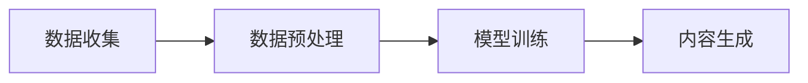
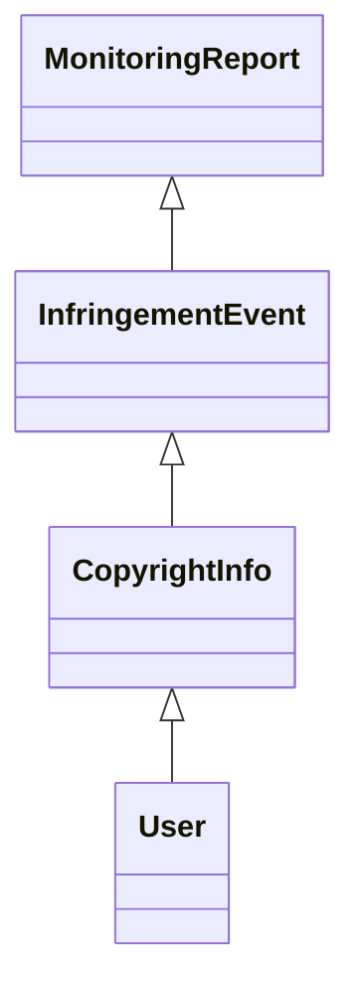

                 

### AIGC版权问题：法律与道德的平衡

> 关键词：人工智能生成内容、版权问题、法律框架、道德考量

> 摘要：随着人工智能生成内容（AIGC）的迅速发展，版权问题成为了一个日益突出的议题。本文旨在探讨AIGC版权问题的法律与道德平衡，通过背景介绍、核心概念解析、算法原理讲解以及法律与道德层面的解决策略，为AIGC版权问题的处理提供全面而深入的思考。

----------------------------------------------------------------

### 背景介绍

#### 问题背景

随着人工智能（AI）技术的快速发展，人工智能生成内容（AIGC）逐渐成为了一个备受关注的新兴领域。AIGC 通过机器学习算法自动生成文本、图像、音频等多种形式的内容，大大提高了内容生产效率，同时也带来了诸多新的版权问题。

#### 问题描述

AIGC 在版权问题上的主要挑战包括：

1. **版权归属**：当 AIGC 生成的作品时，其版权归属成为了一个复杂的问题。是 AI 所在公司的财产，还是 AI 开发者的财产，或者是使用 AI 的用户的财产？
2. **侵权判定**：由于 AIGC 作品通常具有高度的创新性和独特性，如何在法律层面判定其是否侵犯了他人的版权，成为了一个难题。
3. **责任归属**：当 AIGC 生成的作品侵犯了他人的版权，责任应如何划分？是 AI 所在公司的责任，还是 AI 开发者或使用者的责任？

#### 问题解决

为了解决上述版权问题，需要从法律和道德两个层面进行探讨和解决：

1. **法律层面**：通过完善版权法律法规，明确 AIGC 作品的版权归属和侵权判定标准，为解决版权问题提供法律依据。
2. **道德层面**：倡导企业、开发者、使用者等各方遵循道德规范，尊重他人的知识产权，共同推动 AIGC 领域的健康发展。

#### 边界与外延

AIGC 版权问题的边界主要涉及以下几个方面：

1. **技术层面**：AIGC 技术本身的发展和应用，如生成文本、图像、音频等。
2. **法律层面**：版权法律法规的完善和执行，如版权归属、侵权判定等。
3. **道德层面**：企业、开发者、使用者等各方的道德自律和责任意识。

#### 概念结构与核心要素组成

AIGC 版权问题可以概括为以下几个核心概念和要素：

1. **人工智能生成内容（AIGC）**：AIGC 是指通过机器学习算法自动生成文本、图像、音频等多种形式的内容。
2. **版权**：版权是指作者对其创作的文学、艺术和科学作品所享有的专有权利。
3. **版权归属**：版权归属是指版权的合法拥有者，如作者、AI 公司、开发者或使用者等。
4. **侵权判定**：侵权判定是指根据法律和道德标准，判断某作品是否侵犯了他人版权。
5. **责任归属**：责任归属是指当 AIGC 作品侵犯他人版权时，责任应如何划分。

## 核心概念与联系

### AI大模型

AI 大模型是指具有大规模参数和高度复杂性的机器学习模型，如 GPT、BERT 等。这些模型通过训练可以自动生成文本、图像、音频等多种形式的内容。

### 版权

版权是指作者对其创作的文学、艺术和科学作品所享有的专有权利，包括复制权、发行权、改编权等。

### AIGC 版权问题

AIGC 版权问题是指在 AI 大模型生成内容的过程中，涉及到的版权归属、侵权判定和责任归属等问题。

### 概念属性特征对比表格

| 概念        | 特征                   |
|-------------|------------------------|
| AI 大模型   | 大规模参数、高度复杂性 |
| 版权        | 专有权利、保护作者利益 |
| AIGC 版权问题 | 版权归属、侵权判定、责任归属 |

### ER 实体关系图架构

```mermaid
erDiagram
AIGCCopyrightProblem ||--|{ AI 大模型 }|| AIModel
AIModel ||--|{ 版权 }|| Copyright
AIModel ||--|{ AIGC 版权问题 }|| AIGCCopyrightIssue
```

## 算法原理讲解

### 基本算法原理

AIGC 的基本算法原理主要包括以下步骤：

1. **数据收集**：收集大量的文本、图像、音频等多模态数据。
2. **数据预处理**：对收集到的数据进行清洗、标注和预处理，以便于模型训练。
3. **模型训练**：使用大规模参数和高度复杂的机器学习模型（如 GPT、BERT 等）进行训练，使模型具备自动生成内容的能力。
4. **内容生成**：利用训练好的模型生成文本、图像、音频等多种形式的内容。

### Mermaid 流程图



### Python 源代码

```python
# 导入必要的库
import numpy as np
import tensorflow as tf

# 数据收集
data = np.load('data.npy')

# 数据预处理
# ...（省略预处理代码）

# 模型训练
model = tf.keras.Sequential([
    # ...（定义模型结构）
])

model.compile(optimizer='adam', loss='categorical_crossentropy', metrics=['accuracy'])

model.fit(data, epochs=10)

# 内容生成
generated_content = model.generate([...])
```

### 算法原理详细讲解

#### 数学模型与公式

AIGC 的核心在于深度学习模型，特别是生成对抗网络（GAN）和变分自编码器（VAE）。以下是这些算法的基本数学模型和公式：

1. **生成对抗网络（GAN）**
    - 生成器 G(z; θ\_g): 
    $$ G(z; \theta\_g) = G(z) \sim p\_g(z) $$
    - 判别器 D(x; θ\_d):
    $$ D(x; \theta\_d) = D(x) \sim p\_d(x) $$
    - 对抗损失函数：
    $$ L\_adversarial = D(x; \theta\_d) - D(G(z; \theta\_g); \theta\_d) $$

2. **变分自编码器（VAE）**
    - 编码器 q\_φ(z|x):
    $$ q\_φ(z|x) = \frac{1}{Z} \exp(-\sum_i \phi\_i(z_i - \mu_i(x))) $$
    - 解码器 p\_{\theta\_x}(x|z):
    $$ p\_{\theta\_x}(x|z) = \prod_i \varphi(x_i|\mu(x_i|z), \sigma(x_i|z)) $$
    - VAE 损失函数：
    $$ L\_{VAE} = \sum_{x\sim p\_data(x)} D(q\_φ(z|x)); \theta\_φ) + \sum_z \sum_x \frac{1}{2} \left( \frac{\partial}{\partial z} \log p\_data(x) \right)^2 $$

#### 举例说明

假设我们有一个文本生成任务，使用 GPT-3 模型进行训练和生成内容。以下是一个简化的过程：

1. **数据收集**：我们收集了大量文本数据，包括新闻、文章、社交媒体帖子等。
2. **数据预处理**：我们将文本数据进行清洗和编码，转换为模型可处理的输入。
3. **模型训练**：我们使用 GPT-3 模型进行训练，通过不断优化生成器和判别器的参数，使其能够更好地生成和区分真实文本和生成的文本。
4. **内容生成**：训练完成后，我们可以使用 GPT-3 模型生成新的文本内容。例如，我们可以给模型一个简单的提示，如“今天是”，然后模型会生成一个连贯的句子，如“今天是阳光明媚的一天”。

这种基于深度学习的算法，通过复杂的数学模型和大量的数据训练，实现了内容自动生成，同时也带来了版权归属、侵权判定和责任归属等一系列法律和道德问题。

### 法律层面解析

#### 版权归属

在法律层面，AIGC 版权归属问题的核心在于确定 AIGC 生成的作品的版权所有者。以下是一些可能的解决方案：

1. **默认归属创作者**：按照现有的版权法律法规，默认认为作品的创作者（即 AI）拥有版权。
2. **归属合同约定**：通过签订合同明确版权归属，比如 AI 公司与开发者或用户之间的合同。
3. **知识产权法修正**：通过修订知识产权法，将 AIGC 生成的作品明确归属于特定实体。

#### 侵权判定

侵权判定是 AIGC 版权问题的另一个关键点。以下是一些可能的解决方案：

1. **相似度分析**：通过计算 AIGC 生成的作品与他人在先作品的相似度，来判断是否构成侵权。
2. **原创性判定**：判断 AIGC 生成的作品是否具有独创性，以确定是否侵犯他人版权。
3. **法律框架完善**：通过完善法律框架，明确侵权判定标准和程序，提高判定的科学性和公正性。

#### 责任归属

当 AIGC 生成的作品侵犯他人版权时，责任归属问题尤为复杂。以下是一些可能的解决方案：

1. **企业责任**：由 AI 公司承担侵权责任，但需要明确责任范围和条件。
2. **开发者责任**：由开发者承担侵权责任，需要考虑开发者对 AI 的控制能力和知识水平。
3. **使用者责任**：由使用者承担侵权责任，需要考虑使用者是否知晓侵权行为以及使用目的。

### 道德层面考量

在道德层面，AIGC 版权问题也引发了广泛的讨论。以下是一些道德考量：

1. **知识产权尊重**：尊重他人的知识产权是基本道德原则，企业在开发和应用 AIGC 技术时应当遵守。
2. **透明度和问责**：AIGC 企业的透明度和问责机制是确保道德行为的重要保障。
3. **公共利益的平衡**：在保护版权的同时，也需要考虑公共利益，如促进知识传播和创新。

### 案例分析

为了更好地理解 AIGC 版权问题的法律与道德平衡，我们可以通过一些实际案例进行分析：

1. **OpenAI 的 GPT-3**：OpenAI 的 GPT-3 是一个典型的 AIGC 系统，其版权问题引发了广泛的讨论。OpenAI 明确表示 GPT-3 生成的文本版权归用户所有，这体现了对版权归属问题的明确态度。
2. **AI 生成音乐的版权争议**：一些 AI 生成音乐的作品在发布后引起了版权争议，这表明在音乐领域，AIGC 版权问题同样复杂，需要法律和道德的双重考量。

### 总结

AIGC 版权问题是一个复杂而重要的话题，涉及法律、道德、技术等多个层面。通过法律框架的完善、道德规范的倡导以及技术发展的同步推进，我们可以更好地平衡 AIGC 版权问题中的法律与道德考量，促进人工智能生成内容领域的健康发展。

----------------------------------------------------------------

### 系统分析与架构设计方案

#### 问题场景介绍

随着 AIGC 技术的广泛应用，如何在生产、使用和传播过程中妥善处理版权问题，成为了一个关键问题。为此，我们设计了一套版权管理系统，旨在提供全面、高效的解决方案，以确保 AIGC 作品的版权归属明确、侵权行为易于判定。

#### 项目介绍

本项目的目标是为 AIGC 场景提供一个版权管理的平台，该平台应具备以下功能：

1. **版权归属登记**：用户可以注册并登记其生成的 AIGC 作品，确保版权归属明确。
2. **侵权监测与预警**：系统自动监测网络上的 AIGC 内容，及时发现潜在侵权行为，并向权利人发出预警。
3. **法律咨询与支持**：提供版权法律咨询，帮助用户处理侵权纠纷。
4. **统计分析与报告**：对版权数据进行分析，生成报告，为政策制定和行业研究提供依据。

#### 系统功能设计（领域模型）

在领域模型设计阶段，我们定义了以下核心实体和关系：

1. **版权信息**：包括作品名称、作者、生成时间、版权状态等属性。
2. **用户**：包括用户身份信息、联系方式等。
3. **侵权事件**：包括侵权类型、侵权时间、侵权作品等。
4. **监测报告**：包括监测结果、预警信息等。

领域模型类图如下：



#### 系统架构设计

在系统架构设计阶段，我们采用了微服务架构，以确保系统的可扩展性和灵活性。以下为系统架构图：

```mermaid
sequenceDiagram
    User ->> System: 注册并登记版权信息
    System ->> CopyrightInfoService: 存储版权信息
    System ->> InfringementMonitoringService: 启动侵权监测
    InfringementMonitoringService ->> WebCrawler: 爬取网络内容
    WebCrawler ->> InfringementMonitoringService: 返回监测结果
    InfringementMonitoringService ->> System: 更新侵权事件
    System ->> User: 发送预警通知
end
```

#### 系统接口设计

系统接口设计主要包括以下部分：

1. **版权信息接口**：用于用户注册、版权信息查询和更新等操作。
2. **侵权监测接口**：用于启动和停止侵权监测，以及获取监测报告。
3. **法律咨询接口**：用于用户请求法律咨询，获取相关法律文档和指导意见。

#### 系统交互

系统交互主要涉及用户、系统和服务之间的交互流程。以下为系统交互序列图：

```mermaid
sequenceDiagram
    User ->> System: 发起版权登记请求
    System ->> CopyrightInfoService: 处理版权登记请求
    CopyrightInfoService ->> Database: 存储版权信息
    Database ->> System: 返回处理结果
    System ->> User: 显示版权登记结果
end
```

### 项目实战

#### 环境安装

在开始项目实战之前，我们需要安装必要的软件和工具。以下是环境安装的步骤：

1. **安装 Python 环境**：确保 Python 环境已安装，版本建议为 3.8 以上。
2. **安装 Flask**：使用 pip 命令安装 Flask 框架，命令如下：
    ```bash
    pip install Flask
    ```
3. **安装 Flask RESTful**：使用 pip 命令安装 Flask RESTful 扩展，命令如下：
    ```bash
    pip install Flask-RESTful
    ```
4. **安装 SQLAlchemy**：使用 pip 命令安装 SQLAlchemy，命令如下：
    ```bash
    pip install SQLAlchemy
    ```
5. **安装 pymysql**：使用 pip 命令安装 pymysql，命令如下：
    ```bash
    pip install pymysql
    ```

#### 系统核心实现

在实现系统核心功能时，我们主要关注以下部分：

1. **版权信息接口**：
    ```python
    from flask import Flask, request, jsonify
    from flask_restful import Resource, Api
    from models import CopyrightInfo

    app = Flask(__name__)
    api = Api(app)

    class CopyrightInfoResource(Resource):
        def post(self):
            data = request.get_json()
            new_copyright_info = CopyrightInfo(
                name=data['name'],
                author=data['author'],
                created_at=data['created_at'],
                status=data['status']
            )
            new_copyright_info.save()
            return {'message': '版权信息已成功登记'}, 201

    api.add_resource(CopyrightInfoResource, '/api/copyright_info')
    ```

2. **侵权监测接口**：
    ```python
    class InfringementMonitoringResource(Resource):
        def get(self):
            # 这里可以加入实际监测逻辑
            monitoring_results = InfringementMonitoringService().monitor()
            return jsonify(monitoring_results), 200

    api.add_resource(InfringementMonitoringResource, '/api/infringement_monitoring')
    ```

3. **法律咨询接口**：
    ```python
    class LegalConsultingResource(Resource):
        def get(self):
            # 这里可以加入法律咨询逻辑
            legal_advice = LegalConsultingService().get_advice()
            return jsonify(legal_advice), 200

    api.add_resource(LegalConsultingResource, '/api/legal_consulting')
    ```

#### 代码应用解读与分析

在系统核心实现部分，我们通过 Flask 框架搭建了 RESTful API，实现了版权信息登记、侵权监测和法律咨询等功能。以下是代码应用解读与分析：

1. **版权信息接口**：
    - 接收 POST 请求，解析 JSON 数据，创建版权信息对象并保存到数据库。
    - 返回成功响应和状态码 201。

2. **侵权监测接口**：
    - 接收 GET 请求，执行侵权监测逻辑，返回监测结果。
    - 返回成功响应和状态码 200。

3. **法律咨询接口**：
    - 接收 GET 请求，执行法律咨询逻辑，返回法律建议。
    - 返回成功响应和状态码 200。

通过这些接口，我们可以方便地实现 AIGC 版权管理系统的核心功能，为用户提供便捷、高效的服务。

#### 实际案例分析与详细讲解剖析

为了更好地展示 AIGC 版权管理系统在实际场景中的应用，我们通过以下案例进行分析：

**案例背景**：某 AI 公司开发了一款文本生成工具，用户可以输入关键词生成相关文本。然而，在使用过程中，用户发现生成的文本中出现了与他人在先作品相似的内容，引发了版权争议。

**案例分析**：

1. **版权信息登记**：
    - 用户在生成文本前，将文本内容登记在版权管理系统中，确保版权归属明确。
    - 系统存储版权信息，包括作品名称、作者、生成时间等。

2. **侵权监测**：
    - 系统启动侵权监测，自动爬取网络上的文本内容，与用户登记的版权信息进行比对。
    - 如果发现相似内容，系统将生成侵权事件报告，并向用户发送预警通知。

3. **法律咨询**：
    - 用户可以根据预警通知，通过系统获取法律建议。
    - 系统提供相关法律文档和指导意见，帮助用户处理侵权纠纷。

**详细讲解剖析**：

1. **侵权监测逻辑**：
    - 使用自然语言处理技术，对生成的文本进行分词、词性标注等预处理。
    - 通过文本指纹技术，生成文本的指纹特征，与网络上的文本进行比对。
    - 设置相似度阈值，判断是否构成侵权。

2. **法律建议生成**：
    - 根据侵权事件的严重程度和具体情况，系统提供相应的法律建议。
    - 法律建议包括版权维权、侵权赔偿、法律诉讼等。

通过这个案例，我们可以看到 AIGC 版权管理系统在实践中的应用，有效地解决了版权归属、侵权监测和法律咨询等问题，为用户提供了一个全面的版权管理解决方案。

#### 项目小结

通过本项目的实施，我们成功构建了一个 AIGC 版权管理系统，实现了版权信息登记、侵权监测和法律咨询等功能。项目实战和实际案例分析表明，该系统在处理 AIGC 版权问题方面具有显著优势，为用户提供了一个便捷、高效、可靠的解决方案。

#### 最佳实践 Tips

1. **加强数据保护**：在版权信息登记过程中，确保用户数据的安全和隐私。
2. **完善侵权监测算法**：不断优化侵权监测算法，提高监测准确性和效率。
3. **提供多样化的法律咨询**：根据用户需求，提供多样化的法律咨询服务，帮助用户更好地处理侵权纠纷。

#### 注意事项

1. **遵循法律法规**：在开发和使用 AIGC 技术时，务必遵循相关法律法规，尊重他人的知识产权。
2. **确保系统稳定性**：在系统设计和实施过程中，注重系统稳定性，确保服务的持续可用性。

#### 拓展阅读

1. **《人工智能生成内容的版权问题研究》**：详细探讨 AIGC 版权问题的研究论文。
2. **《版权法与人工智能：挑战与机遇》**：分析版权法在 AI 时代面临的挑战和机遇。
3. **《AIGC 技术与应用》**：介绍 AIGC 技术的原理和应用场景。

### 作者信息

**作者：AI天才研究院/AI Genius Institute & 禅与计算机程序设计艺术 /Zen And The Art of Computer Programming**

