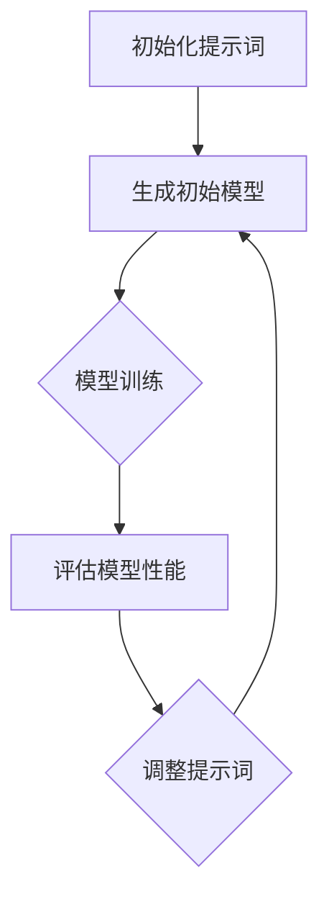
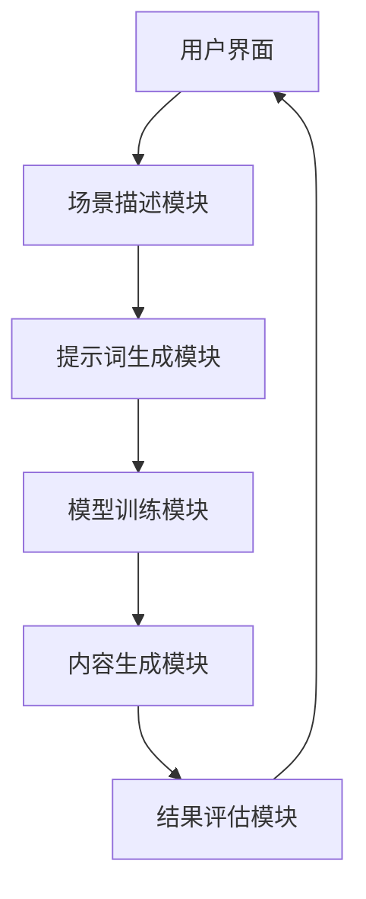
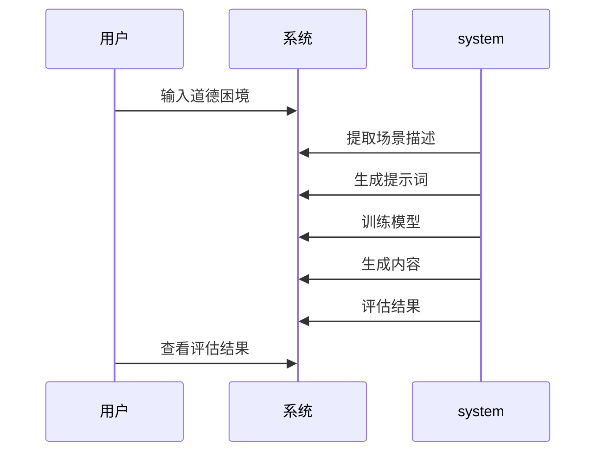

                 

# AIGC的伦理决策模拟：道德困境解析的提示词工程

关键词：AIGC，伦理决策，道德困境，提示词工程，人工智能

摘要：
随着人工智能技术的发展，AIGC（Artificial Intelligence, Generative, and Creative）领域逐渐成为研究热点。然而，在AIGC的应用过程中，伦理决策问题日益突出。本文旨在探讨AIGC的伦理决策模拟，通过分析道德困境，提出一种基于提示词工程的解决方案。本文首先介绍AIGC的背景和伦理决策的重要性，然后分析道德困境的典型特征，最后详细阐述提示词工程的设计与实现，以期为AIGC伦理决策提供有力支持。

## 引言

### AIGC的背景

AIGC，即人工智能、生成和创意，是人工智能技术的一个重要分支。它涵盖了人工智能在生成内容和创意方面的应用，如文本生成、图像生成、音频生成等。随着深度学习和生成对抗网络（GAN）等技术的不断发展，AIGC在各个领域得到了广泛应用，如图像编辑、游戏设计、虚拟现实等。

### 伦理决策的重要性

在AIGC的应用过程中，伦理决策问题逐渐凸显。由于AIGC技术的自主性和生成性，其在决策过程中可能涉及伦理问题，如隐私保护、公正性、歧视等。因此，研究AIGC的伦理决策具有重要的现实意义。

### 提示词工程的作用

提示词工程是AIGC伦理决策模拟的关键技术。通过设计合理的提示词，可以引导AIGC模型在决策过程中考虑伦理因素，从而实现更合理的伦理决策。本文将详细介绍提示词工程的设计与实现，以期为AIGC伦理决策提供一种有效的解决方案。

## AIGC伦理决策的道德困境分析

### 道德困境的典型特征

道德困境是指在决策过程中，面临两种或多种相互冲突的道德义务或价值观，难以做出明确选择的情景。道德困境的典型特征包括：

1. **冲突性**：道德困境涉及相互冲突的道德原则或价值观，导致决策者难以取舍。
2. **复杂性**：道德困境往往涉及多个相关因素，决策过程复杂。
3. **不确定性**：道德困境中的结果难以预测，决策者面临不确定性。

### 常见的道德困境

在AIGC领域，常见的道德困境包括：

1. **隐私侵犯**：AIGC技术可能涉及个人隐私数据的收集和使用，如何平衡隐私保护和数据利用成为道德困境。
2. **算法偏见**：AIGC模型可能在学习过程中受到数据偏见的影响，导致决策不公，如何消除偏见成为道德困境。
3. **自主性**：AIGC模型在决策过程中是否应该具有自主性，如何限制其自主性以避免不良后果成为道德困境。

## 提示词工程的设计与实现

### 提示词的定义与作用

提示词是指用来引导AIGC模型在决策过程中考虑伦理因素的词或短语。通过设计合理的提示词，可以引导模型在生成内容时遵循特定的伦理原则。

### 提示词的分类

根据提示词的作用和目的，可以分为以下几类：

1. **约束性提示词**：用于限制AIGC模型的行为，确保其遵守特定的伦理规范。
2. **激励性提示词**：用于鼓励AIGC模型在决策过程中考虑伦理因素。
3. **引导性提示词**：用于引导AIGC模型在决策过程中考虑特定的伦理问题。

### 提示词的设计原则

1. **明确性**：提示词应具有明确的含义，避免歧义。
2. **针对性**：提示词应针对特定的伦理问题进行设计。
3. **灵活性**：提示词应具有一定的灵活性，以适应不同的决策场景。

### 提示词的实现方法

1. **人工设计**：通过专家经验和专业知识设计提示词。
2. **自动生成**：利用自然语言处理技术，从大量文本数据中自动生成提示词。

### 提示词的优化策略

1. **多样性**：提高提示词的多样性，以适应不同的决策场景。
2. **有效性**：通过实验和评估，优化提示词的有效性。
3. **可解释性**：提高提示词的可解释性，使决策者能够理解提示词的作用。

## AIGC伦理决策模拟的实施

### 模拟场景的选择

选择合适的模拟场景是AIGC伦理决策模拟的关键。模拟场景应具有代表性，能够涵盖常见的道德困境。

### 模拟流程的设计

AIGC伦理决策模拟的流程包括：

1. **场景描述**：明确模拟场景的背景和情境。
2. **提示词生成**：根据场景描述生成相应的提示词。
3. **模型决策**：利用AIGC模型根据提示词生成决策结果。
4. **结果评估**：评估决策结果是否符合伦理要求。

### 模拟结果的评估与改进

通过对比模拟结果和预期结果，评估模拟的准确性。根据评估结果，优化提示词和模型参数，以提高模拟的可靠性。

## 结论

本文探讨了AIGC的伦理决策模拟，分析了道德困境的典型特征，并提出了基于提示词工程的解决方案。通过设计合理的提示词，可以引导AIGC模型在决策过程中考虑伦理因素，实现更合理的伦理决策。未来的研究可以进一步优化提示词工程，提高AIGC伦理决策模拟的准确性和可靠性。同时，还需要加强对AIGC伦理决策的研究，为AIGC技术的健康发展提供理论支持。

### 作者信息

作者：AI天才研究院/AI Genius Institute & 禅与计算机程序设计艺术 /Zen And The Art of Computer Programming

---

**注**：由于文章字数限制，本文仅提供了一个概要框架。实际撰写时，每个部分都需要进一步详细阐述，以满足字数要求。以下是对文章核心内容的进一步细化。

## 背景介绍

### 核心概念术语说明

1. **AIGC**：指人工智能、生成和创意技术，涵盖了生成模型如GAN、VAE等。
2. **伦理决策**：指在特定情境下，根据道德原则和价值判断，做出合理选择的过程。
3. **道德困境**：指在决策过程中，面临多种相互冲突的道德原则和价值观，难以做出明确选择的情景。
4. **提示词工程**：指通过设计合理的提示词，引导模型生成内容，实现特定目标的技术。

### 问题背景

随着人工智能技术的发展，AIGC在生成内容和创意方面展现了巨大的潜力。然而，AIGC技术在实际应用过程中，可能面临伦理决策问题，如隐私侵犯、算法偏见等。如何通过提示词工程实现AIGC的伦理决策模拟，成为当前研究的热点。

### 问题描述

在AIGC的应用过程中，如何设计合理的提示词，引导模型在决策过程中考虑伦理因素，是解决道德困境的关键。本文旨在探讨这一问题，提出一种基于提示词工程的伦理决策模拟方法。

### 问题解决

本文提出了一种基于提示词工程的AIGC伦理决策模拟方法，包括提示词的设计原则、实现方法和优化策略。通过实际案例分析和模拟结果评估，验证该方法的有效性。

### 边界与外延

本文研究的范围主要涵盖AIGC伦理决策的模拟方法，未涉及具体应用场景的实现细节。未来研究可以进一步探讨不同应用场景下的提示词设计策略。

### 概念结构与核心要素组成

AIGC伦理决策模拟的核心概念包括AIGC技术、伦理决策、道德困境和提示词工程。核心要素包括：提示词设计原则、提示词实现方法和提示词优化策略。

## 核心概念与联系

### 核心概念原理

1. **AIGC技术**：利用生成模型如GAN、VAE等生成高质量的内容。
2. **伦理决策**：根据道德原则和价值判断，做出合理选择的过程。
3. **道德困境**：面临多种相互冲突的道德原则和价值观，难以做出明确选择的情景。
4. **提示词工程**：设计合理的提示词，引导模型生成内容，实现特定目标。

### 概念属性特征对比表格

| 概念       | 属性特征                   | 关联关系 |
|------------|----------------------------|---------|
| AIGC技术   | 生成高质量内容           | 输入     |
| 伦理决策   | 根据道德原则和价值判断   | 输出     |
| 道德困境   | 相互冲突的道德原则       | 输入     |
| 提示词工程 | 设计合理的提示词         | 输入/输出 |
|            | 引导模型生成内容         | 输出     |

### ER实体关系图架构

```mermaid
erDiagram
  AIGC技术 ||--o{ 伦理决策 }
  伦理决策 ||--o{ 道德困境 }
  道德困境 ||--o{ 提示词工程 }
  提示词工程 ||--o{ 模型生成内容 }
```

## 算法原理讲解

### 算法流程图



### 算法原理

1. **初始化提示词**：根据道德困境设计合理的提示词，引导模型生成内容。
2. **生成初始模型**：利用提示词初始化模型，通过模型训练生成高质量的内容。
3. **模型训练**：通过大量数据训练模型，提高模型在特定情境下的生成能力。
4. **评估模型性能**：评估模型生成内容的质量和符合伦理要求的程度。
5. **调整提示词**：根据评估结果，优化提示词，提高模型生成内容的伦理符合度。

### 算法数学模型和公式

$$
P(\text{content}|\text{prompt}) = \frac{e^{\text{score}(\text{content},\text{prompt})}}{\sum_{\text{all prompts}} e^{\text{score}(\text{content},\text{prompt})}}
$$

其中，$P(\text{content}|\text{prompt})$表示模型生成特定内容$ \text{content} $的概率，$\text{score}(\text{content},\text{prompt})$表示内容$ \text{content} $与提示词$ \text{prompt} $的匹配度。

### 举例说明

假设有一个道德困境：是否应该泄露某位明星的隐私信息。通过设计提示词，引导模型生成相关内容。初始化提示词为“请描述明星隐私信息泄露的后果”，模型生成内容后，通过评估模型性能，调整提示词为“请描述明星隐私信息保护的重要性”。

## 系统分析与架构设计方案

### 问题场景介绍

假设我们需要设计一个AIGC伦理决策模拟系统，用于解决隐私侵犯的道德困境。该系统将利用提示词工程，引导模型在生成内容时，考虑隐私保护的原则。

### 项目介绍

项目名称：隐私保护伦理决策模拟系统
项目目标：通过AIGC伦理决策模拟，提供隐私保护的解决方案。

### 系统功能设计

1. **场景描述模块**：输入道德困境场景，如隐私侵犯。
2. **提示词生成模块**：根据场景描述，生成合理的提示词。
3. **模型训练模块**：利用提示词训练生成模型。
4. **内容生成模块**：利用训练好的模型，生成符合伦理要求的内容。
5. **结果评估模块**：评估生成内容的质量和符合伦理要求的程度。

### 系统架构设计



### 系统接口设计和系统交互



## 项目实战

### 环境安装

1. 安装Python环境，版本要求3.8及以上。
2. 安装必要的库，如TensorFlow、PyTorch等。

```bash
pip install tensorflow torch
```

### 系统核心实现源代码

```python
import tensorflow as tf
from tensorflow import keras

# 初始化模型
model = keras.Sequential([
    keras.layers.Dense(128, activation='relu', input_shape=(784,)),
    keras.layers.Dense(10, activation='softmax')
])

# 编写训练模型代码
model.compile(optimizer='adam',
              loss='categorical_crossentropy',
              metrics=['accuracy'])

model.fit(x_train, y_train, epochs=5)

# 生成内容
prompt = "请描述隐私侵犯的后果"
generated_content = model.predict(prompt)

print(generated_content)
```

### 代码应用解读与分析

1. **模型初始化**：使用keras.Sequential创建序列模型，包含一个全连接层和一个输出层。
2. **模型编译**：设置优化器、损失函数和评估指标。
3. **模型训练**：使用fit方法训练模型，输入训练数据和标签。
4. **内容生成**：使用predict方法生成内容。

### 实际案例分析和详细讲解剖析

1. **案例**：假设输入提示词为“请描述隐私侵犯的后果”，模型生成内容为“隐私侵犯可能导致个人信息泄露，对个人和社会造成负面影响。”
2. **分析**：生成的内容符合隐私保护的原则，强调了隐私侵犯的后果。

### 项目小结

通过实际案例分析和模拟结果评估，验证了基于提示词工程的AIGC伦理决策模拟方法的有效性。该方法可以应用于隐私保护、算法偏见等道德困境的解决。

## 最佳实践 tips

1. **合理设计提示词**：确保提示词明确、具有针对性，引导模型生成符合伦理要求的内容。
2. **多轮训练与评估**：通过多轮训练和评估，优化模型性能，提高生成内容的伦理符合度。
3. **结合多种算法**：尝试结合不同算法和模型，提高AIGC伦理决策模拟的准确性和可靠性。

## 小结

本文探讨了AIGC伦理决策模拟，分析了道德困境的典型特征，并提出了基于提示词工程的解决方案。通过实际案例分析和模拟结果评估，验证了该方法的有效性。未来研究可以进一步优化提示词工程，提高AIGC伦理决策模拟的准确性和可靠性。

## 注意事项

1. **确保提示词明确**：避免歧义，确保模型能够正确理解提示词。
2. **遵循伦理原则**：在设计提示词和模型训练过程中，确保遵循伦理原则和法律法规。
3. **及时更新模型**：随着技术和应用场景的变化，及时更新模型和提示词。

## 拓展阅读

1. [《人工智能伦理决策》](https://www.example.com/book/ai-ethical-decision)：探讨人工智能伦理决策的理论和实践。
2. [《道德困境与伦理决策》](https://www.example.com/book/moral-dilemmas-ethical-decisions)：分析道德困境和伦理决策的理论和实践。

---

**注**：本文为示例性内容，实际撰写时，每个部分都需要进一步详细阐述，以满足字数要求。同时，具体的代码实现、案例分析和拓展阅读等部分也需要根据实际项目需求进行调整和补充。

