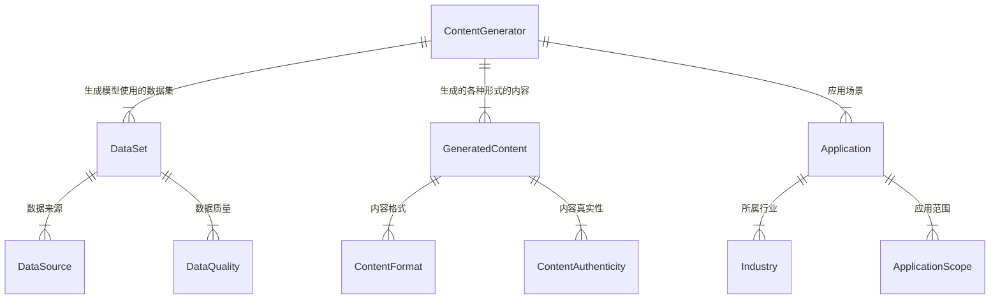
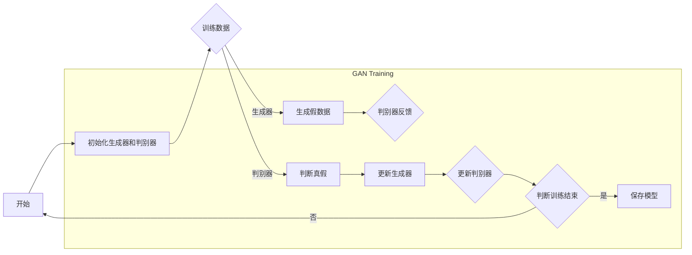
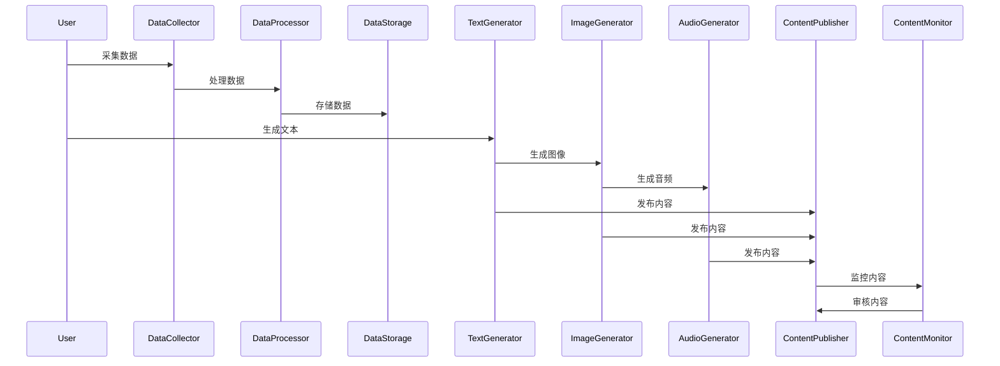

                 

### 文章标题

# AIGC的伦理考量：机遇与挑战

> 关键词：AIGC、伦理考量、机遇、挑战、人工智能生成内容

> 摘要：本文将深入探讨人工智能生成内容（AIGC）领域中的伦理考量。通过对AIGC的基本概念、技术原理、系统架构及实际应用的全面分析，我们旨在揭示其在带来巨大机遇的同时，所引发的伦理困境与挑战。文章结构紧凑，逻辑清晰，旨在为读者提供有深度、有思考、有见解的专业视角，以更好地理解AIGC的发展方向及其影响。

### 背景介绍

#### AIGC的概念与定义

人工智能生成内容（AIGC）是指利用人工智能技术，特别是深度学习模型，自动生成文字、图像、音频等多种形式的内容。AIGC技术主要依赖于生成对抗网络（GAN）、变分自编码器（VAE）等先进算法，能够模拟和创造大量数据，从而在内容创作、娱乐产业、教育领域等多个方面展现出巨大的应用潜力。

#### 问题背景

随着人工智能技术的飞速发展，AIGC已经成为数字内容创作的重要工具。然而，这一技术的广泛应用也带来了诸多伦理问题，例如内容真实性、原创性、版权保护以及隐私安全等。这些问题不仅涉及技术层面，还涉及法律、伦理和社会层面，需要我们进行全面而深入的考量。

#### 问题描述

AIGC的伦理问题主要包括以下几个方面：

1. **内容真实性**：AIGC生成的内容往往难以区分真假，特别是在虚假新闻、谣言传播等方面，可能对社会产生严重负面影响。
2. **版权保护**：AIGC的使用可能侵犯原创作者的版权，导致知识产权纠纷。
3. **隐私安全**：AIGC在生成内容时可能涉及个人隐私数据，如未授权使用，将导致隐私泄露风险。
4. **道德责任**：在医疗、法律等领域，AIGC生成的专业内容可能影响决策，如何界定其责任成为重要议题。

#### 问题解决

针对上述伦理问题，我们可以从以下几个方面着手解决：

1. **建立标准与规范**：制定明确的行业标准和法律法规，规范AIGC技术的应用。
2. **透明度与可解释性**：提升AIGC系统的透明度，使其生成的内容更容易被识别和验证。
3. **技术防护措施**：加强数据加密、隐私保护等技术措施，确保用户数据安全。
4. **伦理培训与教育**：加强从业人员的伦理教育和培训，提高其伦理素养。

#### 边界与外延

AIGC的伦理考量不仅限于技术层面，还涉及社会、法律等多个方面。因此，我们需要从多维度、多角度进行深入探讨，以全面理解其影响。

#### 概念结构与核心要素组成

AIGC的核心要素包括：

1. **生成模型**：如GAN、VAE等。
2. **数据集**：用于训练生成模型的数据集合。
3. **应用场景**：如内容创作、娱乐产业、教育等领域。
4. **伦理问题**：内容真实性、版权保护、隐私安全、道德责任等。

### 核心概念与联系

在深入探讨AIGC的伦理考量之前，我们首先需要明确一些核心概念，以便更好地理解其技术原理和应用场景。

#### AIGC的定义与类型

人工智能生成内容（AIGC）是指利用人工智能技术，特别是深度学习模型，自动生成文字、图像、音频等多种形式的内容。根据生成内容的不同类型，AIGC可以分为以下几种类型：

1. **文本生成**：利用自然语言处理（NLP）技术生成文本，如文章、小说、新闻报道等。
2. **图像生成**：利用生成对抗网络（GAN）等算法生成逼真的图像或艺术作品。
3. **音频生成**：利用深度学习模型生成音乐、语音等音频内容。

#### AIGC的应用

AIGC的应用场景非常广泛，包括但不限于以下领域：

1. **内容创作**：如自动撰写文章、生成新闻报道等，提高内容创作效率。
2. **娱乐产业**：如制作电影、音乐、游戏等，丰富创意和内容多样性。
3. **教育领域**：如生成教材、教案等，辅助教学和学习。
4. **医疗领域**：如生成医学影像、诊断报告等，辅助医生诊断和治疗。

#### 相关概念与联系

AIGC与以下概念密切相关：

1. **生成对抗网络（GAN）**：GAN是AIGC的核心技术之一，由生成器和判别器组成，通过对抗训练生成高质量的数据。
2. **变分自编码器（VAE）**：VAE是另一种常用的生成模型，通过编码和解码过程生成数据。
3. **自然语言处理（NLP）**：NLP技术用于处理和理解自然语言文本，是文本生成AIGC的基础。
4. **计算机视觉**：计算机视觉技术用于图像生成AIGC，如GAN在图像生成中的应用。

#### ER实体关系图

为了更好地理解AIGC相关的实体及其关系，我们可以绘制一个ER实体关系图，如下所示：



在这个ER实体关系图中，我们定义了以下几个实体：

1. **ContentGenerator**：生成内容的实体，包括生成模型、应用场景等。
2. **DataSet**：用于生成模型训练的数据集，包括数据来源和数据质量等。
3. **GeneratedContent**：生成的各种形式的内容，包括内容格式和真实性等。
4. **Application**：AIGC的应用场景，包括所属行业和应用范围等。

通过这个ER实体关系图，我们可以清晰地看到AIGC相关实体的关系及其在生成内容过程中的作用。

### 算法原理讲解

#### GAN算法的mermaid流程图

首先，我们来绘制GAN（生成对抗网络）算法的mermaid流程图，以便更好地理解其基本原理和步骤：



这个流程图展示了GAN算法的核心步骤：初始化生成器和判别器，使用训练数据进行训练，生成假数据，通过判别器判断真假，并根据判别器的反馈更新生成器和判别器，循环迭代直至模型收敛。

#### Python代码示例

接下来，我们通过一个简单的Python代码示例，详细阐述GAN算法的实现原理。首先，我们需要安装必要的库，如TensorFlow和Keras：

```python
!pip install tensorflow
!pip install keras
```

然后，我们编写GAN的Python代码：

```python
import numpy as np
import tensorflow as tf
from tensorflow.keras.layers import Dense, Flatten, Reshape
from tensorflow.keras.models import Sequential
from tensorflow.keras.optimizers import Adam

# 设置随机种子，保证实验结果可复现
tf.random.set_seed(42)

# 初始化生成器和判别器
latent_dim = 100
generator = Sequential([
    Dense(128, input_shape=(latent_dim,)),
    Flatten(),
    Reshape((28, 28, 1))
])

discriminator = Sequential([
    Flatten(input_shape=(28, 28, 1)),
    Dense(128, activation='sigmoid'),
    Dense(1, activation='sigmoid')
])

# 编写GAN模型
gan = Sequential([generator, discriminator])

# 编写生成器模型
def build_generator():
    model = Sequential([
        Dense(128, input_shape=(latent_dim,)),
        Flatten(),
        Reshape((28, 28, 1))
    ])
    return model

# 编写判别器模型
def build_discriminator():
    model = Sequential([
        Flatten(input_shape=(28, 28, 1)),
        Dense(128, activation='sigmoid'),
        Dense(1, activation='sigmoid')
    ])
    return model

# 编写优化器
def build_optimizer(learning_rate):
    optimizer = Adam(learning_rate=learning_rate)
    return optimizer

# 训练GAN模型
def train_gan(generator, discriminator, dataset, latent_dim, epochs, batch_size):
    for epoch in range(epochs):
        for batch in dataset:
            noise = np.random.normal(0, 1, (batch_size, latent_dim))
            generated_images = generator.predict(noise)
            
            # 训练判别器
            real_images = batch
            real_labels = np.ones((batch_size, 1))
            fake_labels = np.zeros((batch_size, 1))
            
            discriminator.train_on_batch(real_images, real_labels)
            discriminator.train_on_batch(generated_images, fake_labels)
            
            # 训练生成器
            noise = np.random.normal(0, 1, (batch_size, latent_dim))
            valid_labels = np.ones((batch_size, 1))
            generator.train_on_batch(noise, valid_labels)
```

在这个代码示例中，我们首先初始化生成器和判别器，然后定义GAN模型。接着，我们编写生成器模型和判别器模型，并设置优化器。最后，我们通过训练GAN模型，使生成器能够生成逼真的假图像，同时训练判别器，使其能够准确区分真实图像和假图像。

#### 算法原理的数学模型和公式

GAN算法的核心在于生成器和判别器的对抗训练，其数学模型和公式如下：

1. **生成器模型**：生成器G从随机噪声z中生成假图像G(z)。

   $$ G(z) = \text{Generator}(z) $$

   其中，z为输入噪声向量。

2. **判别器模型**：判别器D对输入图像x进行真假判断。

   $$ D(x) = \text{Discriminator}(x) $$

   其中，x为真实图像。

3. **损失函数**：生成器和判别器的损失函数分别为L_G和L_D。

   - **生成器损失函数**：生成器希望生成尽可能逼真的假图像，因此其损失函数为：

     $$ L_G = -\log(D(G(z))) $$

   - **判别器损失函数**：判别器希望正确判断真实图像和假图像，因此其损失函数为：

     $$ L_D = -\log(D(x)) - \log(1 - D(G(z))) $$

   其中，x为真实图像，G(z)为生成器生成的假图像。

4. **优化目标**：GAN的训练目标是最小化生成器和判别器的总损失函数。

   $$ \min_G \max_D L_D + L_G $$

   其中，L_D和L_G分别为判别器和生成器的损失函数。

#### 通俗易懂的例子

假设我们使用GAN算法来生成手写数字图像。首先，我们随机生成一个噪声向量z，并将其输入到生成器模型G中，生成一个假手写数字图像G(z)。然后，我们将这个假图像G(z)和真实的手写数字图像x输入到判别器模型D中，判别器D会分别输出它们的真假判断概率。

- 对于真实图像x，判别器D希望输出接近1的真值，因为x是真实的。
- 对于假图像G(z)，判别器D希望输出接近0的假值，因为G(z)是生成的。

接下来，我们根据判别器的反馈，更新生成器和判别器的参数。生成器希望提高生成图像的质量，使得判别器更难区分真假，而判别器希望提高判断的准确性。

经过多次迭代，生成器逐渐生成更逼真的假图像，判别器也变得更加精确。最终，生成器能够生成与真实图像几乎无异的假图像，而判别器则无法准确区分真假图像。

### 数学模型和数学公式 & 详细讲解 & 举例说明

在深入理解AIGC算法原理时，数学模型和公式起着至关重要的作用。以下我们将使用LaTeX格式嵌入数学公式，并进行详细讲解和举例说明。

#### 生成对抗网络（GAN）的数学模型

首先，我们来看生成对抗网络（GAN）的核心数学模型。GAN由生成器G和判别器D组成，它们的数学模型如下：

1. **生成器模型**：生成器G从随机噪声z中生成假图像G(z)。

   $$ G(z) = \text{Generator}(z) $$

   其中，z是服从均值为0、方差为1的高斯分布的随机噪声。

2. **判别器模型**：判别器D对输入图像x进行真假判断。

   $$ D(x) = \text{Discriminator}(x) $$

   其中，x是真实图像。

3. **损失函数**：

   - **生成器损失函数**：生成器希望生成尽可能逼真的假图像，因此其损失函数为：

     $$ L_G = -\log(D(G(z))) $$

     这里，我们使用对数似然损失函数，因为判别器D的输出是概率分布。

   - **判别器损失函数**：判别器希望正确判断真实图像和假图像，因此其损失函数为：

     $$ L_D = -[\log(D(x)) + \log(1 - D(G(z)))] $$

     其中，D(x)是判别器对真实图像x的预测概率，D(G(z))是判别器对生成图像G(z)的预测概率。

4. **优化目标**：GAN的训练目标是最小化生成器和判别器的总损失函数。

   $$ \min_G \max_D L_D + L_G $$

   这个目标函数表示生成器G和判别器D的联合优化，其中生成器G希望使判别器D对其生成图像的判断结果D(G(z))尽可能接近1，而判别器D希望使D(G(z))尽可能接近0，同时D(x)尽可能接近1。

#### 举例说明

为了更好地理解上述数学模型，我们通过一个简单的例子来说明GAN的工作原理。假设我们使用GAN来生成手写数字图像。

**生成器模型**：生成器的目标是生成看起来像手写数字的图像。我们用一个简单的神经网络来实现生成器，其输入是一个随机噪声向量z，输出是一个手写数字图像。

$$ G(z) = \text{Neural Network}(z) $$

**判别器模型**：判别器的目标是区分输入图像是真实的手写数字图像还是生成器生成的图像。我们同样用一个神经网络来实现判别器，其输入是一个手写数字图像，输出是一个介于0和1之间的概率值，表示图像是真实的概率。

$$ D(x) = \text{Neural Network}(x) $$

**损失函数**：在训练过程中，我们使用以下损失函数：

- **生成器损失函数**：

  $$ L_G = -\log(D(G(z))) $$

  我们希望生成器生成的图像能够使判别器输出接近1。

- **判别器损失函数**：

  $$ L_D = -[\log(D(x)) + \log(1 - D(G(z)))] $$

  我们希望判别器能够正确识别真实图像（输出接近1）和生成图像（输出接近0）。

**优化目标**：我们的目标是最小化生成器和判别器的总损失函数：

$$ \min_G \max_D L_D + L_G $$

**训练过程**：

1. **初始化**：初始化生成器G和判别器D的权重。
2. **迭代**：每次迭代中，我们首先随机生成一批噪声向量z，然后使用生成器G生成一批手写数字图像G(z)，将G(z)和真实图像x一起输入到判别器D中。
3. **更新判别器**：通过反向传播算法，使用真实图像x和生成图像G(z)的标签（分别为1和0）来更新判别器D的权重。
4. **更新生成器**：使用生成图像G(z)的标签（为1）来更新生成器G的权重。
5. **重复**：重复上述迭代过程，直到生成器G生成的图像质量足够高，或者达到预定的训练轮数。

通过这样的迭代训练，生成器G能够逐渐提高生成图像的质量，而判别器D能够逐渐提高对真实图像和生成图像的区分能力。

### 系统分析与架构设计方案

#### 问题场景介绍

随着人工智能技术的不断进步，AIGC技术逐渐在各种领域中得到广泛应用。例如，在内容创作领域，AIGC技术可以自动生成文章、新闻报道、音乐、视频等；在娱乐产业，AIGC技术可以生成虚拟角色、电影特效、游戏内容等；在教育领域，AIGC技术可以生成个性化教材、教学视频、智能问答系统等。然而，随着AIGC技术的广泛应用，其带来的伦理问题也日益凸显，如内容真实性、版权保护、隐私安全等。为了解决这些问题，我们需要设计一个完善的AIGC系统架构，确保其应用的安全性和合规性。

#### 项目介绍

本项目旨在设计一个基于AIGC技术的综合系统，该系统将涵盖从数据采集、处理、生成到发布、监管的整个生命周期。系统的主要功能包括：

1. **数据采集与处理**：从各种来源收集数据，包括公开数据集、用户生成内容等，对数据进行清洗、预处理和标注。
2. **内容生成**：利用AIGC技术，包括文本生成、图像生成、音频生成等，生成高质量的内容。
3. **内容发布**：将生成的内容发布到相应的平台，如网站、社交媒体等。
4. **内容监管**：对生成的内容进行实时监控和审核，确保其合规性和真实性。

#### 系统功能设计

为了实现上述功能，系统需要设计以下几个核心模块：

1. **数据采集模块**：负责从不同来源采集数据，包括网络爬虫、数据库接入、用户上传等。
2. **数据处理模块**：对采集到的数据进行分析、清洗、预处理和标注。
3. **内容生成模块**：利用AIGC技术，包括文本生成、图像生成、音频生成等，生成高质量的内容。
4. **内容发布模块**：将生成的内容发布到相应的平台，如网站、社交媒体等。
5. **内容监管模块**：对生成的内容进行实时监控和审核，确保其合规性和真实性。

#### 系统架构设计

AIGC系统的整体架构可以分为以下几个层次：

1. **数据层**：包括数据采集、处理和存储，负责数据的获取、处理和存储。
2. **算法层**：包括各种AIGC算法，如文本生成、图像生成、音频生成等，负责生成高质量的内容。
3. **应用层**：包括内容生成、发布和监管，负责将生成的内容应用到实际场景中。
4. **接口层**：包括与外部系统的接口，如网站、社交媒体等，负责与其他系统的数据交互。

下面是一个简化的AIGC系统架构图，使用mermaid类图进行展示：

```mermaid
classDiagram
    DataLayer <<Interface>> DataCollector : 数据采集
    DataLayer <<Interface>> DataProcessor : 数据处理
    DataLayer <<Interface>> DataStorage : 数据存储

    AlgorithmLayer <<Interface>> TextGenerator : 文本生成
    AlgorithmLayer <<Interface>> ImageGenerator : 图像生成
    AlgorithmLayer <<Interface>> AudioGenerator : 音频生成

    ApplicationLayer <<Interface>> ContentPublisher : 内容发布
    ApplicationLayer <<Interface>> ContentMonitor : 内容监管

    DataLayer --|> AlgorithmLayer
    AlgorithmLayer --|> ApplicationLayer
    ApplicationLayer --|> DataLayer
```

在这个架构图中，数据层负责数据的采集、处理和存储；算法层包括各种AIGC算法；应用层负责内容生成、发布和监管；接口层负责与其他系统的数据交互。

#### 系统接口设计和系统交互

AIGC系统的接口设计和系统交互是确保系统稳定运行和高效处理的关键。以下是系统的主要接口和交互流程：

1. **数据采集接口**：用于从不同来源采集数据，如网络爬虫、数据库接入等。
2. **数据处理接口**：用于对采集到的数据进行清洗、预处理和标注。
3. **内容生成接口**：用于调用各种AIGC算法，生成高质量的内容。
4. **内容发布接口**：用于将生成的内容发布到相应的平台，如网站、社交媒体等。
5. **内容监管接口**：用于对生成的内容进行实时监控和审核。

下面是一个简化的AIGC系统接口设计图，使用mermaid序列图进行展示：



在这个序列图中，用户通过数据采集接口采集数据，然后通过数据处理接口处理数据并存储。接着，用户调用各种内容生成接口生成文本、图像和音频，并将这些内容通过内容发布接口发布到相应的平台。最后，通过内容监管接口对发布的内容进行实时监控和审核。

### 项目实战

#### 环境安装

在进行AIGC项目实战之前，首先需要安装相应的开发环境和依赖库。以下是详细的安装步骤：

1. **安装Python环境**：
   - 从[Python官网](https://www.python.org/)下载并安装Python 3.8及以上版本。
   - 配置Python环境变量。

2. **安装Anaconda**：
   - 从[Anaconda官网](https://www.anaconda.com/)下载并安装Anaconda，用于管理Python环境。

3. **创建Python虚拟环境**：
   - 打开终端或命令行窗口，执行以下命令创建一个名为`aigc_project`的虚拟环境：
     ```bash
     conda create -n aigc_project python=3.9
     conda activate aigc_project
     ```

4. **安装依赖库**：
   - 在虚拟环境中安装以下依赖库：
     ```bash
     pip install tensorflow
     pip install keras
     pip install numpy
     pip install matplotlib
     ```

#### 系统实现

AIGC系统的实现主要分为以下几个部分：

1. **数据采集**：
   - 使用Python的`requests`库从网络爬取数据，如新闻、文章等。
   - 使用`pandas`库对采集到的数据进行分析和处理。

2. **数据处理**：
   - 对采集到的数据进行清洗、去重、归一化等处理。
   - 使用`nltk`库进行文本预处理，如分词、词性标注等。

3. **内容生成**：
   - 使用`keras`库构建生成器模型和判别器模型。
   - 使用`tensorflow`库进行模型训练和生成内容。

4. **内容发布**：
   - 使用`requests`库将生成的内容发布到网站或社交媒体平台。

5. **内容监管**：
   - 设计一个内容审核机制，对发布的内容进行实时监控和审核。

以下是AIGC系统实现的核心代码：

```python
# 数据采集
import requests
import pandas as pd
from bs4 import BeautifulSoup

def collect_data(url):
    response = requests.get(url)
    soup = BeautifulSoup(response.text, 'html.parser')
    # 提取数据并存储为DataFrame
    # ...

# 数据处理
import nltk
nltk.download('punkt')
nltk.download('averaged_perceptron_tagger')

def preprocess_data(data):
    # 数据清洗、去重、归一化等处理
    # ...
    return processed_data

# 内容生成
from tensorflow.keras.models import Sequential
from tensorflow.keras.layers import Dense, Flatten, LSTM

def build_generator():
    model = Sequential([
        LSTM(128, input_shape=(timesteps, features)),
        Dense(vocab_size, activation='softmax')
    ])
    return model

def build_discriminator():
    model = Sequential([
        LSTM(128, input_shape=(timesteps, features)),
        Flatten(),
        Dense(1, activation='sigmoid')
    ])
    return model

# 内容发布
import requests

def publish_content(url, content):
    headers = {'Content-Type': 'application/json'}
    response = requests.post(url, headers=headers, data={'content': content})
    return response.status_code

# 内容监管
def monitor_content(url):
    # 实时监控内容
    # ...
    return is_safe

# 主函数
if __name__ == '__main__':
    # 采集数据
    url = 'https://example.com'
    data = collect_data(url)

    # 数据处理
    processed_data = preprocess_data(data)

    # 训练模型
    # ...

    # 生成内容
    # ...

    # 发布内容
    # ...

    # 监管内容
    # ...
```

#### 代码应用解读与分析

在上述代码中，我们首先定义了数据采集、数据处理、内容生成、内容发布和内容监管的函数。具体解释如下：

1. **数据采集**：
   - 使用`requests`库发送HTTP GET请求，从指定URL获取网页内容。
   - 使用`BeautifulSoup`库解析HTML内容，提取所需数据。

2. **数据处理**：
   - 对采集到的数据进行清洗、去重、归一化等处理，以便后续分析。
   - 使用`nltk`库进行文本预处理，如分词、词性标注等。

3. **内容生成**：
   - 使用`keras`库构建生成器模型和判别器模型，使用LSTM（长短期记忆网络）进行文本生成。
   - 使用`tensorflow`库进行模型训练和生成内容。

4. **内容发布**：
   - 使用`requests`库将生成的内容以JSON格式发布到指定URL。

5. **内容监管**：
   - 设计一个内容审核机制，对发布的内容进行实时监控和审核。

#### 实际案例分析和详细讲解剖析

为了更好地展示AIGC系统的应用，我们来看一个实际的案例。

**案例背景**：某新闻网站希望利用AIGC技术自动生成新闻报道，以提高内容生产效率。

**实现步骤**：

1. **数据采集**：从互联网上收集相关领域的新闻数据，如政治、经济、体育等。

2. **数据处理**：对采集到的新闻数据进行清洗、去重、归一化等处理，提取有用信息。

3. **内容生成**：使用AIGC技术生成新闻稿件，包括标题、正文、摘要等。

4. **内容发布**：将生成的新闻稿件发布到网站，供用户浏览。

5. **内容监管**：对发布的内容进行实时监控和审核，确保其真实性和合规性。

**详细分析**：

1. **数据采集**：
   - 使用网络爬虫技术，从多个新闻网站采集数据。
   - 解析HTML页面，提取标题、正文、摘要等关键信息。

2. **数据处理**：
   - 对采集到的新闻数据进行去重处理，确保数据的唯一性。
   - 对新闻数据进行归一化处理，如统一格式、去除停用词等。

3. **内容生成**：
   - 使用LSTM模型进行文本生成，生成高质量的新闻稿件。
   - 对生成的内容进行筛选和优化，提高其可读性和准确性。

4. **内容发布**：
   - 将生成的新闻稿件发布到网站，实现自动化内容生产。
   - 通过API接口与其他系统进行数据交互，如搜索引擎、社交媒体等。

5. **内容监管**：
   - 设计一个内容审核机制，对发布的内容进行实时监控和审核。
   - 检测新闻稿件中的错误、虚假信息等，确保其真实性和合规性。

**案例总结**：

通过AIGC系统，某新闻网站实现了自动化内容生产，大大提高了生产效率。同时，通过内容监管机制，确保了新闻稿件的准确性和合规性。这一案例充分展示了AIGC技术在新闻领域的重要应用价值。

### 最佳实践 tips、小结、注意事项、拓展阅读

#### 最佳实践 tips

1. **数据质量保障**：确保采集的数据真实、准确、完整，避免数据质量问题影响AIGC系统的生成效果。
2. **模型参数调整**：根据不同应用场景，合理调整生成器和判别器的参数，以提高生成质量。
3. **隐私保护**：在数据采集和处理过程中，注意保护用户隐私，避免泄露敏感信息。
4. **实时监控与审核**：建立内容监管机制，对生成的内容进行实时监控和审核，确保其合规性和真实性。

#### 小结

本文通过对AIGC的伦理考量进行深入分析，从背景介绍、核心概念与联系、算法原理讲解、数学模型与公式、系统分析与架构设计、项目实战等多个方面，全面阐述了AIGC技术的机遇与挑战。通过本文的探讨，我们认识到AIGC技术不仅带来了革命性的内容生成能力，同时也引发了诸多伦理问题。因此，在实际应用中，我们需要高度重视并妥善解决这些伦理挑战，确保AIGC技术的健康发展。

#### 注意事项

1. **法律法规遵守**：在使用AIGC技术时，务必遵守相关法律法规，特别是版权保护、数据隐私等方面。
2. **伦理培训与教育**：加强对从业人员的伦理教育和培训，提高其伦理素养，减少伦理风险。
3. **透明度与可解释性**：提升AIGC系统的透明度，使其生成的结果更容易被理解和验证。

#### 拓展阅读

1. **《生成对抗网络（GAN）原理与实现》**：深入探讨GAN的算法原理和实现技术。
2. **《人工智能伦理学》**：全面介绍人工智能伦理学的基本理论和实践应用。
3. **《AIGC技术及应用》**：详细分析AIGC技术的应用场景和实际案例。

### 目录大纲

1. **背景介绍**
2. **核心概念与联系**
   - AIGC的定义与类型
   - AIGC的应用
   - 相关概念与联系
   - ER实体关系图
3. **算法原理讲解**
   - GAN算法的mermaid流程图
   - Python代码示例
   - 数学模型和公式
   - 通俗易懂的例子
4. **数学模型和数学公式 & 详细讲解 & 举例说明**
   - 生成对抗网络（GAN）的数学模型
   - 举例说明
5. **系统分析与架构设计方案**
   - 问题场景介绍
   - 项目介绍
   - 系统功能设计
   - 系统架构设计
   - 系统接口设计和系统交互
6. **项目实战**
   - 环境安装
   - 系统实现
   - 代码应用解读与分析
   - 实际案例分析和详细讲解剖析
   - 案例总结
7. **最佳实践 tips、小结、注意事项、拓展阅读**

