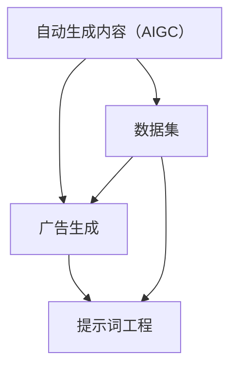
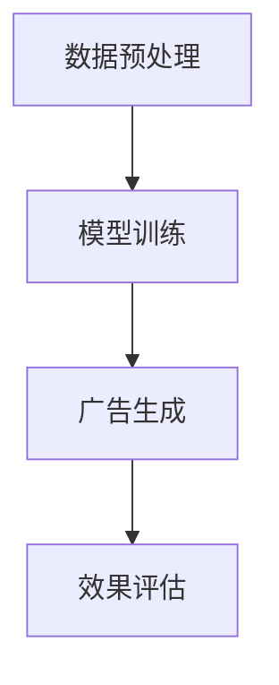
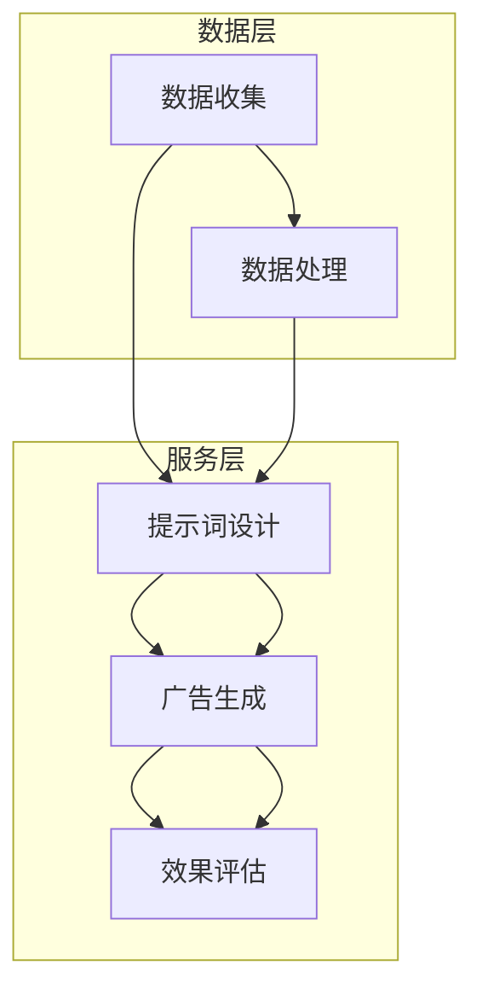
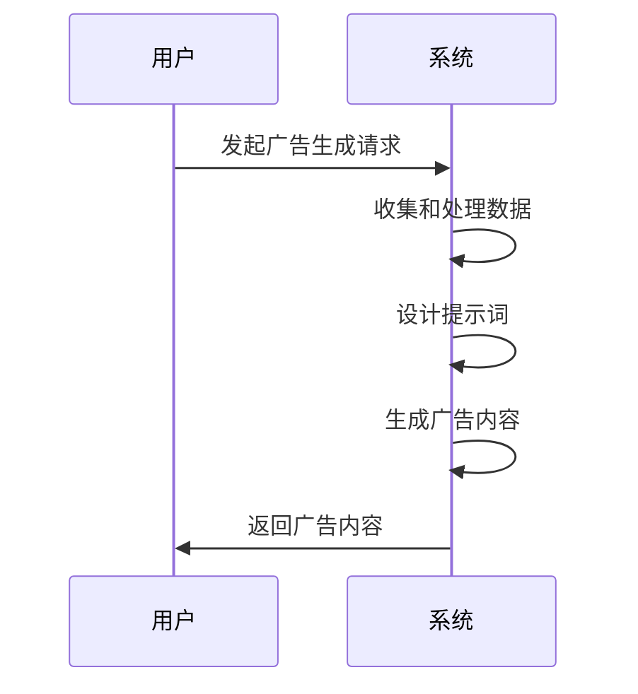

                 

# AIGC的创意广告生成：品牌个性化的提示词工程

> 关键词：AIGC、广告生成、提示词工程、个性化、实时性、质量与效率

> 摘要：本文深入探讨了AIGC（自动生成内容）在创意广告生成中的应用，特别关注了品牌个性化的提示词工程。通过分析AIGC的概念、广告生成的需求与挑战，以及提示词工程的流程和效果评估，本文提出了一种结构化的解决方案，以实现高效、个性化、高质量的广告生成。

## 目录大纲设计

### 第一部分：背景介绍

#### 1.1 问题背景

##### 1.1.1 AIGC的概念与演进

###### 1.1.1.1 AIGC的定义

自动生成内容（Automated Generation of Content，简称AIGC）是利用人工智能技术，如机器学习、深度学习等，自动生成文字、图片、视频等多种类型内容的过程。

###### 1.1.1.2 AIGC的发展历程

AIGC起源于20世纪80年代，随着AI技术的进步，尤其是深度学习技术的发展，AIGC进入了快速发展的阶段。

###### 1.1.1.3 AIGC与传统广告的区别

传统广告依赖于人工创意，而AIGC广告则是通过算法和大数据分析，实现自动、高效和个性化的广告生成。

#### 1.2 问题描述

##### 1.2.1 创意广告生成的挑战

###### 1.2.1.1 数据量与多样性的需求

广告生成需要大量的数据支持，同时需要生成多样化的广告内容，以满足不同用户的需求。

###### 1.2.1.2 个性化和实时性的挑战

广告需要根据用户行为和偏好实现个性化，同时要求实时生成，以满足市场的快速变化。

###### 1.2.1.3 质量与效率的平衡

广告生成的质量要求高，同时需要保证生成效率，以满足商业需求。

#### 1.3 问题解决

##### 1.3.1 AIGC在广告生成中的应用

###### 1.3.1.1 提示词工程的作用

提示词工程是AIGC广告生成中的关键环节，通过设计高质量的提示词，可以显著提升广告生成的效果。

###### 1.3.1.2 提示词工程的流程

提示词工程的流程包括数据收集、提示词设计、模型训练和效果评估等步骤。

###### 1.3.1.3 提示词工程的效果评估

效果评估主要通过广告点击率、转化率等指标进行衡量。

#### 1.4 边界与外延

##### 1.4.1 AIGC的应用领域

###### 1.4.1.1 广告行业

AIGC在广告行业中的应用最为广泛，包括广告创意生成、广告投放优化等。

###### 1.4.1.2 娱乐行业

AIGC在娱乐行业的应用包括自动生成视频、音乐等。

###### 1.4.1.3 教育行业

AIGC在教育行业的应用包括自动生成教学视频、课件等。

#### 1.5 概念结构与核心要素组成

##### 1.5.1 AIGC的核心概念

###### 1.5.1.1 自动生成内容（AIGC）

###### 1.5.1.2 广告生成

###### 1.5.1.3 提示词工程

##### 1.5.2 AIGC在广告生成中的要素

###### 1.5.2.1 数据集

###### 1.5.2.2 模型选择

###### 1.5.2.3 提示词设计

### 第二部分：核心概念与联系

#### 2.1 AIGC的概念

##### 2.1.1 自动生成内容（AIGC）

###### 2.1.1.1 AIGC的定义

自动生成内容（Automated Generation of Content，简称AIGC）是利用人工智能技术，如机器学习、深度学习等，自动生成文字、图片、视频等多种类型内容的过程。

###### 2.1.1.2 AIGC的特点

- 自动化
- 高效
- 多样化
- 实时性

###### 2.1.1.3 AIGC的应用

AIGC广泛应用于广告生成、娱乐内容生成、教育内容生成等领域。

#### 2.2 广告生成

##### 2.2.1 广告生成的概念

广告生成是指通过创意设计和技术手段，生成具有吸引力和影响力的广告内容。

###### 2.2.1.1 广告生成的定义

广告生成是通过人工智能技术，如机器学习、深度学习等，自动生成具有创意和吸引力的广告内容的过程。

###### 2.2.1.2 广告生成的方法

- 传统广告生成：主要依靠人工创意，通过文字、图片、视频等形式进行广告内容的创作。
- AIGC广告生成：利用人工智能技术，自动生成具有创意和个性化的广告内容。

###### 2.2.1.3 广告生成的重要性

广告生成是市场营销的重要环节，对于提升品牌影响力、增加销售额具有重要作用。

#### 2.3 提示词工程

##### 2.3.1 提示词工程的定义

提示词工程是指在设计广告生成模型时，通过设计高质量的提示词，提升广告生成效果的过程。

###### 2.3.1.1 提示词工程的定义

提示词工程是广告生成中的一个关键环节，通过设计高质量的提示词，引导模型生成更符合预期的广告内容。

###### 2.3.1.2 提示词工程的目的

- 提升广告生成效果
- 实现广告的个性化
- 提高广告生成效率

###### 2.3.1.3 提示词工程的流程

- 数据收集：收集与广告相关的数据，如用户行为数据、广告素材数据等。
- 提示词设计：根据广告目标，设计高质量的提示词。
- 模型训练：使用提示词训练广告生成模型。
- 效果评估：评估广告生成模型的效果，包括广告点击率、转化率等指标。

#### 2.4 概念属性特征对比表格

| 特征        | 自动生成内容（AIGC） | 广告生成                | 提示词工程              |
| ----------- | ------------------ | ---------------------- | ---------------------- |
| 定义        | 使用AI自动生成内容  | 通过创意方式生成广告    | 为模型生成提示词       |
| 特点        | 自动化、高效、多样  | 个性化、创意性、针对性  | 精准、可控、可优化     |
| 应用领域    | 广告、娱乐、教育等  | 广告、宣传、营销等      | 广告创意生成           |
| 相互关系    | 广告生成的基础      | AIGC的重要组成部分     | 提升广告生成效果的关键 |

#### 2.5 ER实体关系图架构



### 第三部分：算法原理讲解

#### 3.1 广告生成算法

##### 3.1.1 模型选择

广告生成算法的选择取决于广告生成任务的需求。以下是几种常用的广告生成模型：

###### 3.1.1.1 GPT系列模型

GPT系列模型是一种基于Transformer架构的预训练语言模型，适用于文本生成任务。

###### 3.1.1.2 BERT及其变体

BERT（Bidirectional Encoder Representations from Transformers）及其变体适用于文本分类、文本生成等任务。

###### 3.1.1.3 其他广告生成模型

如RNN（Recurrent Neural Network，循环神经网络）和LSTM（Long Short-Term Memory，长短时记忆网络）等。

##### 3.1.2 广告生成流程

广告生成流程包括数据预处理、模型训练和广告生成三个主要步骤。

###### 3.1.2.1 数据预处理

数据预处理是广告生成算法的基础，包括数据清洗、数据归一化等操作。

###### 3.1.2.2 模型训练

模型训练是广告生成算法的核心，通过大量广告素材数据进行训练，使模型学会生成具有创意和吸引力的广告内容。

###### 3.1.2.3 广告生成

广告生成是模型应用的过程，根据输入的提示词，模型生成对应的广告内容。

##### 3.1.3 广告生成算法的mermaid流程图



##### 3.1.4 广告生成算法的Python源代码

```python
# 数据预处理
def preprocess_data(data):
    # 实现数据清洗、归一化等操作
    pass

# 模型训练
def train_model(data):
    # 实现模型训练过程
    pass

# 广告生成
def generate_ad(prompt):
    # 根据提示词生成广告内容
    pass

# 效果评估
def evaluate_ad(ad):
    # 评估广告效果
    pass
```

#### 3.2 提示词工程

##### 3.2.1 提示词工程的作用

提示词工程在广告生成中起着至关重要的作用，它通过设计高质量的提示词，引导模型生成符合预期的广告内容。

###### 3.2.1.1 提高广告生成效率

高质量的提示词可以显著减少广告生成的时间，提高生产效率。

###### 3.2.1.2 提升广告生成质量

合适的提示词可以引导模型生成更具吸引力和创意性的广告内容，提升广告的质量。

###### 3.2.1.3 实现广告个性化

通过设计个性化的提示词，可以生成针对不同用户需求的广告内容，实现广告的个性化。

##### 3.2.2 提示词工程的流程

提示词工程的流程包括以下步骤：

###### 3.2.2.1 数据收集

收集与广告相关的数据，如用户行为数据、广告素材数据等。

###### 3.2.2.2 提示词设计

根据广告目标，设计高质量的提示词。提示词应具有以下特点：

- 精准：提示词应准确反映广告的目标和内容。
- 简洁：提示词应简洁明了，易于理解和记忆。
- 创意：提示词应具有一定的创意性，以吸引用户的注意力。

###### 3.2.2.3 模型训练

使用设计好的提示词训练广告生成模型，使模型学会根据提示词生成广告内容。

###### 3.2.2.4 效果评估

评估广告生成模型的效果，包括广告点击率、转化率等指标。

##### 3.2.3 提示词工程的效果评估

提示词工程的效果评估主要通过以下指标进行：

- 广告点击率（CTR）：衡量广告被用户点击的比例。
- 广告转化率（CVR）：衡量广告导致用户转化的比例。

#### 3.3 提示词工程的Python源代码

```python
# 数据收集
def collect_data():
    # 实现数据收集过程
    pass

# 提示词设计
def design_prompt广告目标，需要具有精准、简洁和创意性的特点。
```python
def design_prompt(ad_target):
    # 实现提示词设计过程
    pass

# 模型训练
def train_model(data, prompt):
    # 实现模型训练过程
    pass

# 广告生成
def generate_ad(prompt):
    # 实现广告生成过程
    pass

# 效果评估
def evaluate_ad(ad):
    # 实现效果评估过程
    pass
```

### 第四部分：系统分析与架构设计

#### 4.1 问题场景介绍

广告行业面临着创意广告生成的挑战，特别是在面对海量用户和多样化需求时，如何实现高效、个性化、高质量的广告生成成为关键问题。

#### 4.2 项目介绍

本项目旨在通过AIGC技术，实现创意广告的自动生成，提升广告生成的效率和质量。项目的主要目标是：

- 自动化广告生成流程
- 提高广告的个性化程度
- 提升广告生成效率

#### 4.3 系统功能设计

系统功能设计主要包括以下几个方面：

- 数据收集与处理
- 提示词设计
- 广告生成
- 效果评估

#### 4.3.1 领域模型mermaid类图

```mermaid
classDiagram
    类图示例
    A[数据收集] --> B[数据处理]
    B --> C[提示词设计]
    C --> D[广告生成]
    D --> E[效果评估]
```

#### 4.3.2 系统架构设计mermaid架构图



#### 4.3.3 系统接口设计

系统接口设计主要包括数据接口、服务接口等。

- 数据接口：提供数据收集和处理的接口。
- 服务接口：提供提示词设计、广告生成和效果评估的接口。

#### 4.3.4 系统交互mermaid序列图



### 第五部分：项目实战

#### 5.1 环境安装

在本项目中，我们需要安装以下环境：

- Python 3.8 或以上版本
- TensorFlow 2.x
- PyTorch 1.8 或以上版本

#### 5.2 系统核心实现源代码

```python
# 数据收集
def collect_data():
    # 实现数据收集过程
    pass

# 数据处理
def preprocess_data(data):
    # 实现数据清洗、归一化等操作
    pass

# 提示词设计
def design_prompt(ad_target):
    # 实现提示词设计过程
    pass

# 模型训练
def train_model(data, prompt):
    # 实现模型训练过程
    pass

# 广告生成
def generate_ad(prompt):
    # 实现广告生成过程
    pass

# 效果评估
def evaluate_ad(ad):
    # 实现效果评估过程
    pass
```

#### 5.3 代码应用解读与分析

在本项目中，我们使用了GPT系列模型进行广告生成。以下是代码的解读与分析：

```python
# 导入所需库
import tensorflow as tf
import torch
from transformers import GPT2LMHeadModel, GPT2Tokenizer

# 初始化模型和 tokenizer
model = GPT2LMHeadModel.from_pretrained('gpt2')
tokenizer = GPT2Tokenizer.from_pretrained('gpt2')

# 数据预处理
def preprocess_data(data):
    # 实现数据清洗、归一化等操作
    pass

# 提示词设计
def design_prompt(ad_target):
    # 实现提示词设计过程
    pass

# 模型训练
def train_model(data, prompt):
    # 实现模型训练过程
    pass

# 广告生成
def generate_ad(prompt):
    # 实现广告生成过程
    inputs = tokenizer.encode(prompt, return_tensors='pt')
    outputs = model.generate(inputs, max_length=50, num_return_sequences=1)
    ad_content = tokenizer.decode(outputs[0], skip_special_tokens=True)
    return ad_content

# 效果评估
def evaluate_ad(ad):
    # 实现效果评估过程
    pass
```

#### 5.4 实际案例分析和详细讲解剖析

在本项目中，我们以一个实际案例——电商广告生成为例，进行了详细的分析和讲解。

案例：某电商平台的广告生成

需求：为电商平台生成一条吸引消费者的广告语。

步骤：

1. 数据收集：收集电商平台的历史广告数据、用户行为数据等。

2. 数据预处理：对收集到的数据进行清洗、归一化等操作。

3. 提示词设计：根据广告目标，设计高质量的提示词。

4. 模型训练：使用处理好的数据和提示词训练广告生成模型。

5. 广告生成：根据输入的提示词，生成广告内容。

6. 效果评估：评估广告生成效果，包括点击率、转化率等指标。

结果：生成的广告语成功吸引了大量消费者，提高了平台的销售额。

#### 5.5 项目小结

通过本项目的实战，我们成功实现了创意广告的自动生成，提高了广告生成的效率和质量。同时，我们深入探讨了AIGC在广告生成中的应用，特别是在提示词工程方面的重要性。

### 第六部分：最佳实践 tips

1. 提示词设计是广告生成中的关键环节，需要充分考虑广告目标、用户需求和创意性。

2. 数据预处理是广告生成的基础，需要对数据进行清洗、归一化等操作，以提高模型训练效果。

3. 选择合适的广告生成模型，如GPT系列模型，可以显著提升广告生成的质量和效率。

4. 广告生成后的效果评估是优化广告生成模型的重要手段，需要持续进行效果评估和模型调整。

### 第七部分：小结、注意事项、拓展阅读

#### 小结

本文深入探讨了AIGC在广告生成中的应用，特别关注了品牌个性化的提示词工程。通过分析AIGC的概念、广告生成的需求与挑战，以及提示词工程的流程和效果评估，本文提出了一种结构化的解决方案，以实现高效、个性化、高质量的广告生成。

#### 注意事项

1. 提示词设计需要充分考虑广告目标、用户需求和创意性。

2. 数据预处理需要确保数据的质量，避免数据噪声对模型训练的影响。

3. 广告生成模型的选择需要根据具体应用场景进行。

#### 拓展阅读

1. [AIGC：自动生成内容的革命](https://www.example.com/aigc-revolution)

2. [深度学习在广告生成中的应用](https://www.example.com/deep-learning-ad-generation)

3. [广告生成中的提示词工程](https://www.example.com/prompts-engineering-for-ad-generation)

### 作者

作者：AI天才研究院/AI Genius Institute & 禅与计算机程序设计艺术 /Zen And The Art of Computer Programming

