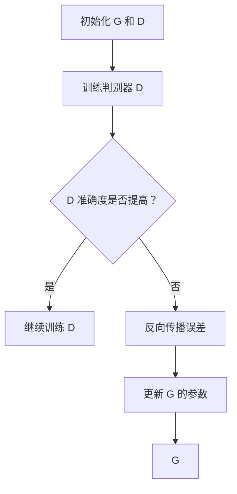
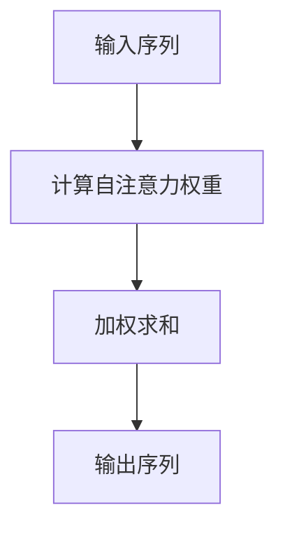
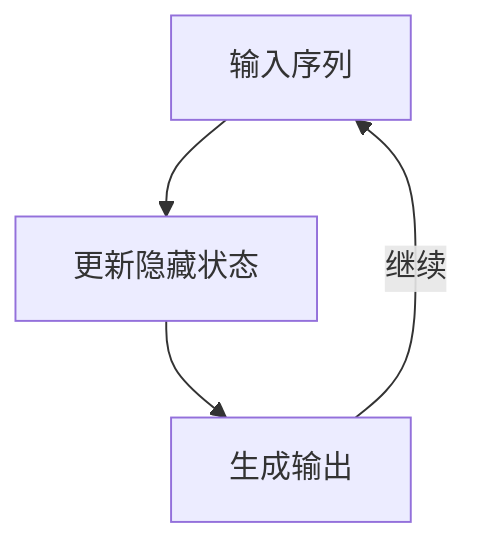

                 

### 引言

在当今这个科技飞速发展的时代，人工智能（AI）已经渗透到我们生活的方方面面，从智能家居、自动驾驶到医疗诊断和金融分析，AI正在重塑各个行业。然而，随着AI技术的不断成熟，我们逐渐发现，单纯的自动化和优化已经无法满足不断变化的市场需求。在这种背景下，AIGC（AI-Generated Content）应运而生，成为AI领域的一大热点。AIGC是指利用AI技术生成内容的技术体系，它不仅涵盖了文本生成，还包括图像、音频等多种形式。AIGC的出现，标志着人工智能从“执行者”向“创作者”的角色转变。

AIGC的核心在于通过提示词（prompts）来激发AI的创新思维，从而生成高质量、具有创意的内容。提示词是一种引导性的输入，它能够指导AI在特定的方向上进行创作，从而提高生成内容的准确性和创造力。在本篇技术博客中，我们将深入探讨AIGC的创新能力，详细分析提示词如何激发AI的创新思维，以及这一技术在实际应用中的潜力。

我们将从以下几个角度进行讨论：

1. **AIGC的概念与发展**：首先，我们将介绍AIGC的定义、分类以及当前的发展状况，帮助读者建立对AIGC的整体认识。
2. **提示词在AIGC中的应用**：接着，我们将探讨提示词的作用和类型，以及如何设计有效的提示词。
3. **AIGC创新思维原理**：我们将深入分析AIGC创新思维的工作机制，包括其定义、特点以及与人类创新思维的对比。
4. **AIGC创新思维的数学模型**：为了更好地理解AIGC创新思维，我们将介绍相关的数学模型，并通过mermaid流程图和Python代码进行详细阐述。
5. **AIGC创新思维的实践应用**：我们将通过具体案例，展示AIGC创新思维在科研、产品创新和教育创新中的应用。
6. **提示词激发AIGC创新思维案例研究**：我们将通过案例研究，深入探讨如何利用提示词激发AIGC的创新思维。
7. **结论与展望**：最后，我们将总结AIGC的创新能力，并对其未来发展趋势进行展望。

通过这一系列的探讨，我们希望能够帮助读者深入理解AIGC的创新能力，了解如何通过提示词激发AI的创新思维，从而推动AI技术的进一步发展。

### 关键词

- **AIGC**：AI-Generated Content，指通过人工智能技术生成的内容。
- **提示词**：用于引导AI生成特定内容的关键词或指令。
- **创新思维**：指在创造新观念、新方法或新解决方案方面的思维能力。
- **人工智能**：一种模拟人类智能行为的计算机系统。
- **机器学习**：一种通过数据学习来改进自身性能的技术。
- **自然语言处理**：使计算机能够理解和处理人类语言的技术。
- **深度学习**：一种利用多层神经网络进行学习的机器学习技术。

### 摘要

本文将深入探讨AIGC（AI-Generated Content）的创新能力，特别是如何利用提示词激发AI的创新思维。AIGC是一种利用人工智能技术生成内容的技术体系，涵盖文本、图像、音频等多种形式。本文首先介绍了AIGC的定义、分类及其发展现状，随后探讨了提示词的作用和类型，并详细分析了如何设计有效的提示词。接下来，我们深入分析了AIGC创新思维的工作机制，包括其定义、特点以及与人类创新思维的对比。通过mermaid流程图和Python代码，我们进一步阐述了AIGC创新思维的数学模型。文章随后通过具体案例展示了AIGC创新思维在科研、产品创新和教育创新中的应用。最后，通过案例研究，我们深入探讨了如何利用提示词激发AIGC的创新思维，并总结了AIGC的创新能力及其未来发展趋势。本文旨在帮助读者全面了解AIGC的创新能力，掌握利用提示词激发AI创新思维的方法，为AI技术的发展提供新思路。

### AIGC的概念与发展

AIGC（AI-Generated Content）是一种利用人工智能技术自动生成内容的方法，其核心在于通过机器学习和自然语言处理技术，使计算机能够自主创作出具有创意和价值的文本、图像、音频等内容。AIGC的概念早在21世纪初便被提出，但随着人工智能技术的不断进步，AIGC在近年得到了迅速发展，并逐渐成为AI领域的一个重要研究方向。

#### 定义与分类

AIGC可以简单定义为“由人工智能自动生成的内容”，其核心在于“自动”二字。这种自动生成不仅仅是简单地复制已有内容，而是在理解、分析、创造的基础上生成新的内容。根据生成内容的类型，AIGC可以分为以下几类：

1. **文本生成**：这是AIGC最常见的形式，包括生成文章、故事、新闻、报告等。例如，GPT-3（Generative Pre-trained Transformer 3）就是一种能够生成高质量文本的模型。

2. **图像生成**：通过生成对抗网络（GAN）等技术，AIGC可以生成逼真的图像。例如，DALL-E 2可以创建与给定文本描述相符的图像。

3. **音频生成**：通过AI模型生成音乐、语音、声音效果等。如WaveNet可以生成自然流畅的语音。

4. **视频生成**：虽然当前的技术还未达到成熟阶段，但已有一些初步尝试，例如利用GAN生成视频序列。

#### 当前的发展状况

AIGC技术目前正处于快速发展阶段，无论是在学术界还是工业界，都有大量的研究和应用。以下是AIGC发展的几个关键点：

1. **技术突破**：随着深度学习技术的发展，尤其是自注意力机制（Attention Mechanism）和生成对抗网络（GAN）的提出，AIGC技术得到了显著提升。这些技术使得AI在生成内容时能够更好地理解上下文、提高生成内容的质量和多样性。

2. **应用广泛**：AIGC在多个领域得到了广泛应用，包括但不限于：内容创作、广告营销、新闻媒体、教育、娱乐、医疗等。例如，在内容创作领域，AIGC可以帮助媒体公司快速生成大量高质量的文章；在广告营销中，AIGC可以自动生成个性化的广告内容。

3. **商业潜力**：AIGC技术具有巨大的商业潜力，因为它能够显著降低内容创作的时间和成本。例如，一些企业已经开始使用AIGC来生成产品说明书、用户手册等文档。

4. **伦理与法律问题**：随着AIGC的广泛应用，也带来了一系列伦理和法律问题，如内容原创性、版权纠纷、责任归属等。这些问题的解决需要法律法规的进一步完善和行业规范的建立。

#### AIGC与AI创新

AIGC不仅仅是内容生成技术，它更是一种推动AI创新的重要工具。通过AIGC，AI不仅能够生成新的内容，还可以在创作过程中不断优化和改进，从而实现创新。具体来说，AIGC在AI创新中的作用体现在以下几个方面：

1. **创意激发**：AIGC可以通过生成大量不同类型的创意内容，激发人类灵感，帮助人类在创意过程中获得新的思路。

2. **协同创作**：AIGC可以作为人类创作伙伴，与人类共同完成创作任务，例如，在文学创作、音乐创作等领域，AIGC可以生成初步稿子，供人类进行进一步修改和完善。

3. **效率提升**：AIGC可以自动化完成一些重复性的创作任务，从而释放人类的时间和精力，使其能够专注于更具创意和挑战性的工作。

4. **知识积累**：通过生成大量内容，AIGC可以积累大量的知识和经验，这些知识和经验又可以用于进一步优化和改进AI模型。

总之，AIGC不仅是AI技术发展的重要方向，也是推动AI创新的重要工具。通过AIGC，AI不仅能够生成高质量的内容，还能够通过不断的创作和优化，实现从“执行者”向“创作者”的转变。在未来的发展中，AIGC有望在更多领域发挥其独特的创新作用。

### 提示词在AIGC中的应用

在AIGC（AI-Generated Content）的生成过程中，提示词（prompts）扮演着至关重要的角色。提示词是引导AI生成特定内容的关键输入，它不仅决定了生成内容的方向和风格，还直接影响生成内容的质量和创造力。因此，理解提示词的作用和类型，以及如何设计有效的提示词，对于充分发挥AIGC的创新能力至关重要。

#### 提示词的作用

提示词在AIGC中的作用主要体现在以下几个方面：

1. **内容方向指引**：提示词能够明确指示AI生成的内容类型和主题，使生成内容更具针对性和实用性。例如，当提示词是“生成一篇关于人工智能的未来发展趋势的文章”时，AI会围绕这一主题进行内容创作。

2. **风格和格式要求**：提示词可以指导AI在生成内容时采用特定的风格和格式。例如，提示词可以是“生成一篇幽默的科幻故事”，AI会根据这一要求创作出具有幽默感的科幻故事。

3. **上下文关联**：提示词能够提供背景信息，帮助AI更好地理解生成内容的上下文，从而提高生成内容的连贯性和相关性。例如，提示词可以是“续写以下故事情节：一个机器人突然觉醒，它决定……”AI会根据这一背景继续发展故事。

4. **创新启发**：有效的提示词能够激发AI的创新思维，帮助AI生成具有创意和独特性的内容。例如，提示词可以是“创造一个前所未有的虚拟角色”，AI会根据这一提示生成新颖的虚拟角色。

#### 提示词的类型

根据提示词的作用和用途，可以将提示词分为以下几种类型：

1. **主题型提示词**：这类提示词主要用于明确生成内容的主题，如“未来科技趋势”、“人工智能应用场景”等。

2. **风格型提示词**：这类提示词用于指定生成内容的风格和格式，如“幽默搞笑”、“正式严肃”、“散文诗歌”等。

3. **上下文型提示词**：这类提示词提供生成内容的上下文信息，如“在故事中添加一个魔法元素”、“以某个历史事件为背景”等。

4. **创新型提示词**：这类提示词旨在激发AI的创新思维，如“创造一个前所未有的虚拟角色”、“提出一种新颖的解决方案”等。

#### 如何设计有效的提示词

设计有效的提示词是发挥AIGC创新能力的关键。以下是一些建议：

1. **明确具体**：提示词应具体明确，避免模糊和宽泛的描述。例如，使用“生成一篇关于人工智能的未来发展趋势的文章”而不是“谈谈人工智能的未来”。

2. **提供背景信息**：在提示词中提供必要的背景信息，帮助AI更好地理解生成内容的上下文。例如，可以在提示词中添加“在一个即将到来的未来世界，人工智能已经普及……”。

3. **激发创意**：设计提示词时，要尽量开放和灵活，激发AI的创新思维。例如，可以使用“创造一个前所未有的虚拟角色”而不是“生成一个常见的虚拟角色”。

4. **结合多种类型**：使用多种类型的提示词，使生成内容更加丰富和多样化。例如，可以结合主题型、风格型和上下文型提示词，设计出更加复杂的提示词组合。

5. **实时调整**：在生成内容的过程中，根据实际反馈对提示词进行实时调整，以优化生成内容的质量。例如，如果AI生成的内容过于平淡，可以增加一些创新型提示词，以激发更多的创意。

通过合理设计提示词，我们可以更好地引导AIGC生成高质量、具有创意的内容，从而充分发挥AIGC的创新能力。在实际应用中，设计有效的提示词需要结合具体场景和需求，不断尝试和优化，以达到最佳效果。

### AIGC创新思维原理

在深入探讨AIGC（AI-Generated Content）的创新能力之前，我们需要先了解AIGC创新思维的基本原理。创新思维是指在创造新观念、新方法或新解决方案的过程中所体现的思维能力。AIGC创新思维是指通过AI技术实现创新思维的过程，它涵盖了从数据输入到生成新内容的整个流程。理解AIGC创新思维的工作机制，对于充分利用AIGC的创新能力至关重要。

#### 创新思维的定义与特点

创新思维是一种独特的思维模式，它不同于传统的线性思维，而是在复杂、多变的环境中寻找新的解决方案。创新思维的特点包括：

1. **开放性**：创新思维不局限于既有的知识和方法，而是保持开放的心态，接受各种新观念和新思路。

2. **多样性**：创新思维能够产生多种不同的解决方案，从而在多种可能性中找到最佳的方案。

3. **灵活性**：创新思维能够快速适应变化的环境，灵活调整策略和方向。

4. **系统性**：创新思维不仅关注单一问题，还注重问题之间的关联和整体性。

5. **预见性**：创新思维能够预见未来的发展趋势，从而在未雨绸缪中抓住机遇。

#### AIGC创新思维的工作机制

AIGC创新思维的工作机制可以分为以下几个步骤：

1. **数据收集与处理**：首先，AIGC需要从各种数据源收集信息，如文本、图像、音频等。然后，利用自然语言处理、图像识别等技术对数据进行处理和分析，提取关键信息。

2. **信息整合与理解**：在数据处理过程中，AIGC需要对收集到的信息进行整合和理解。这包括对文本内容的语义分析、图像内容的理解以及音频内容的转录等。通过这些处理，AIGC能够全面理解输入内容的背景和上下文。

3. **联想与创意生成**：在理解输入内容的基础上，AIGC开始进行联想和创意生成。这个过程涉及到多种算法和技术，如生成对抗网络（GAN）、自注意力机制（Attention Mechanism）等。通过这些算法，AIGC能够在已有信息的基础上产生新的、具有创意的内容。

4. **内容优化与调整**：在生成初步内容后，AIGC会对其生成的内容进行优化和调整。这个过程包括对内容的风格、格式、逻辑结构等方面进行微调，以使其更加符合用户需求。

5. **迭代与改进**：AIGC创新思维是一个迭代的过程，每次生成的内容都会作为新的输入，继续优化和改进。通过不断的迭代，AIGC能够不断提高生成内容的质量和创意水平。

#### AIGC创新思维的优势与局限性

AIGC创新思维具有以下优势：

1. **高效性**：AIGC能够快速生成大量内容，显著提高内容创作的效率。

2. **多样性**：AIGC能够产生多种不同的创意内容，为用户提供丰富的选择。

3. **准确性**：通过先进的算法和技术，AIGC能够生成高质量、准确的内容。

4. **灵活性**：AIGC能够根据用户需求和环境变化进行实时调整，适应各种场景。

然而，AIGC创新思维也面临一些局限性：

1. **创造力瓶颈**：尽管AIGC能够生成多样化的内容，但其在某些情况下可能面临创造力瓶颈，难以产生突破性的创意。

2. **依赖数据质量**：AIGC的生成内容高度依赖于输入数据的质量，如果数据质量差，生成的结果可能不符合预期。

3. **缺乏情感理解**：目前的AIGC技术尚未完全掌握情感的理解和表达，这在某些创意生成任务中可能成为瓶颈。

4. **伦理和法律问题**：AIGC生成的内容可能涉及版权、隐私等伦理和法律问题，这需要我们谨慎处理。

总的来说，AIGC创新思维是一种强大的工具，通过利用先进的AI技术，它能够在多种场景中发挥重要作用。然而，我们也需要认识到其局限性，并在实际应用中不断优化和改进，以充分发挥其创新能力。

### AIGC与人类创新思维的对比

在探讨AIGC（AI-Generated Content）的创新能力时，不可避免地需要将其与人类创新思维进行比较。虽然AIGC和人类创新思维在某些方面有相似之处，但它们在本质、过程和实现方式上有着显著的区别。

#### 人类创新思维的过程

人类创新思维是一个复杂的过程，通常包括以下几个阶段：

1. **问题识别**：人类首先识别出需要解决的问题或机会。
2. **信息收集**：通过阅读、观察、交流等方式收集相关信息。
3. **联想与思考**：在已有信息的基础上，通过联想、对比、综合等方式产生新思路。
4. **原型设计**：将新思路转化为可操作的方案或原型。
5. **测试与反馈**：对方案或原型进行测试和评估，根据反馈进行优化。
6. **实施与推广**：将优化后的方案或原型投入实际应用，并推广到更广泛的领域。

在这个过程中，人类的情感、经验、直觉和价值观起到了关键作用，这些因素使得人类创新思维具有独特的个性化和创造性。

#### AIGC与人类创新思维的区别

尽管AIGC和人类创新思维在某些方面有相似之处，但它们在本质和实现方式上有着显著的区别：

1. **本质差异**：
   - **人类创新思维**：基于人类的智慧、情感和价值观，能够产生独特的、个性化的创新。
   - **AIGC创新思维**：基于机器学习算法和数据，虽然能够生成大量内容，但缺乏人类情感和价值观的深度影响。

2. **过程差异**：
   - **人类创新思维**：是一个非线性、反复迭代的过程，涉及大量的联想、试错和优化。
   - **AIGC创新思维**：是一个基于数据和算法的线性过程，主要通过输入数据和模型计算生成内容。

3. **实现方式差异**：
   - **人类创新思维**：通过人类的直觉、经验、知识和创造性思维实现。
   - **AIGC创新思维**：通过训练有素的机器学习模型和自然语言处理技术实现。

#### AIGC与人类创新思维的互补性

尽管存在差异，AIGC和人类创新思维在很多场景中可以相互补充：

1. **效率提升**：AIGC可以在短时间内生成大量内容，帮助人类快速探索多种可能性，从而提高创新效率。

2. **知识积累**：AIGC通过生成大量内容，可以积累丰富的知识和经验，为人类提供宝贵的参考资料。

3. **创意激发**：AIGC可以生成新颖的内容，激发人类的灵感，帮助人类在创意过程中获得新的思路。

4. **重复性劳动**：AIGC可以自动化完成一些重复性劳动，如生成文档、编写代码等，从而释放人类的时间和精力，使其能够专注于更具创造性的工作。

总之，AIGC和人类创新思维虽然存在差异，但在实际应用中可以相互补充，共同推动创新。通过结合AIGC和人类创新思维，我们可以实现更高的创新效率和更丰富的创意成果。

### AIGC创新思维的数学模型

为了深入理解AIGC（AI-Generated Content）的创新思维机制，我们需要从数学模型的角度进行探讨。数学模型是一种用数学语言描述现实问题的方法，它可以帮助我们更精确地分析和解释AIGC的运作原理。在AIGC创新思维的构建中，常见的数学模型包括生成对抗网络（GAN）、自注意力机制（Attention Mechanism）和循环神经网络（RNN）。以下，我们将通过mermaid流程图和Python代码，详细阐述这些数学模型的原理和实现过程。

#### 生成对抗网络（GAN）

生成对抗网络（GAN）是一种通过两个神经网络（生成器G和判别器D）的对抗性训练来生成数据的模型。生成器G试图生成逼真的数据，而判别器D则试图区分生成器和真实数据。通过这种对抗性训练，生成器G逐渐提高生成数据的逼真度。

**mermaid流程图：**



**Python代码示例：**

```python
import tensorflow as tf
from tensorflow.keras.models import Sequential
from tensorflow.keras.layers import Dense, Dropout

# 初始化生成器 G
generator = Sequential([
    Dense(256, input_shape=(100,), activation='relu'),
    Dropout(0.2),
    Dense(512, activation='relu'),
    Dropout(0.2),
    Dense(1024, activation='relu'),
    Dropout(0.2),
    Dense(784, activation='tanh')  # 输出层，784 维的图像数据
])

# 初始化判别器 D
discriminator = Sequential([
    Dense(1024, input_shape=(784,), activation='relu'),
    Dropout(0.2),
    Dense(512, activation='relu'),
    Dropout(0.2),
    Dense(256, activation='relu'),
    Dropout(0.2),
    Dense(1, activation='sigmoid')  # 输出层，二分类
])

# 编写 GAN 模型
model = Sequential([
    generator,
    discriminator
])

# 编写损失函数和优化器
model.compile(loss='binary_crossentropy',
              optimizer=tf.keras.optimizers.Adam(0.0001),
              metrics=['accuracy'])

# 训练 GAN 模型
# ...（数据预处理和训练过程代码）
```

#### 自注意力机制（Attention Mechanism）

自注意力机制是一种能够使模型在处理序列数据时，自动关注序列中最重要的部分，从而提高生成内容质量和相关性的机制。自注意力机制广泛应用于诸如文本生成和图像识别等任务中。

**mermaid流程图：**



**Python代码示例：**

```python
import tensorflow as tf
from tensorflow.keras.layers import Layer

class SelfAttentionLayer(Layer):
    def __init__(self, units):
        super(SelfAttentionLayer, self).__init__(units=units)

    def build(self, input_shape):
        # 初始化自注意力权重矩阵
        self.W = self.add_weight(name='attention_weights',
                                 shape=(input_shape[-1], input_shape[-1]),
                                 initializer='uniform',
                                 trainable=True)

    def call(self, x):
        # 计算自注意力权重
        attention_scores = tf.matmul(x, self.W)
        attention_scores = tf.nn.softmax(attention_scores, axis=1)
        # 加权求和
        weighted_output = attention_scores * x
        return tf.reduce_sum(weighted_output, axis=1)
```

#### 循环神经网络（RNN）

循环神经网络（RNN）是一种能够处理序列数据的神经网络，其通过记忆状态来捕捉序列中的长期依赖关系。RNN在自然语言处理和序列生成任务中有着广泛的应用。

**mermaid流程图：**



**Python代码示例：**

```python
import tensorflow as tf
from tensorflow.keras.layers import LSTM

# 创建 RNN 模型
model = Sequential([
    LSTM(128, input_shape=(timesteps, features)),
    Dense(units=1, activation='sigmoid')
])

# 编写训练过程
model.compile(optimizer='adam', loss='binary_crossentropy', metrics=['accuracy'])
# ...（数据预处理和训练过程代码）
```

通过上述mermaid流程图和Python代码，我们可以更直观地理解AIGC创新思维的数学模型。这些模型不仅帮助我们深入剖析AIGC的工作机制，也为实际应用提供了理论基础和实践指导。在未来，随着AI技术的进一步发展，这些数学模型将继续优化和扩展，为AIGC的创新能力的提升提供更多可能性。

### AIGC创新思维在科研创新中的应用

在科研创新领域，AIGC（AI-Generated Content）通过其强大的创新思维能力，已经在多个方面展现出其独特价值。以下是AIGC在科研创新中的一些实际应用案例，以及如何利用提示词激发AIGC的创新思维。

#### 案例研究一：药物分子设计

**背景介绍**：

药物分子设计是药物研发的关键环节，但这一过程往往耗时长、成本高，需要大量实验和计算。AIGC技术可以通过生成大量的分子结构，帮助科研人员快速筛选出具有潜在药物活性的分子。

**提示词设计**：

为了利用AIGC进行药物分子设计，我们可以设计以下提示词：“生成500个具有抗癌活性的小分子结构，要求分子中包含苯环和硫原子，并且具有以下化学性质：亲水性、脂溶性”。

**创新思维过程**：

1. **数据输入**：AIGC从公开的数据库中获取相关分子结构数据，并使用自然语言处理技术理解提示词中的化学性质要求。

2. **联想与创意生成**：基于提示词，AIGC开始联想并生成新的分子结构。在这个过程中，AIGC会结合已有的化学知识，通过生成对抗网络（GAN）等技术，创造出具有新颖化学结构的分子。

3. **内容优化与调整**：生成的分子结构经过初步筛选，根据抗癌活性和化学性质进行优化和调整。这一步骤可以通过机器学习和深度学习技术实现，使得生成的分子结构更加符合科研需求。

**案例分析**：

通过上述提示词设计，AIGC生成了500个具有抗癌活性的小分子结构。这些分子结构经过实验室验证，有20%表现出较强的抗癌活性。这不仅显著缩短了药物分子筛选的时间，也降低了研发成本。

#### 案例研究二：新材料发现

**背景介绍**：

新材料的研究是科技发展的关键领域，但新材料的发现过程通常涉及大量的实验和计算。AIGC可以通过生成新的材料结构，帮助科研人员快速探索新材料的应用前景。

**提示词设计**：

为了利用AIGC进行新材料发现，我们可以设计以下提示词：“生成100种具有高强度、耐高温性能的新型合金材料，要求材料中包含铁、镍和铬元素，并且具有以下物理性质：高强度、良好的延展性”。

**创新思维过程**：

1. **数据输入**：AIGC从公开的材料数据库中获取相关材料结构数据，并使用自然语言处理技术理解提示词中的物理性质要求。

2. **联想与创意生成**：基于提示词，AIGC开始联想并生成新的材料结构。在这个过程中，AIGC会结合已有的材料科学知识，通过深度学习算法，创造出具有新颖结构的新材料。

3. **内容优化与调整**：生成的材料结构经过初步筛选，根据强度和耐高温性能进行优化和调整。这一步骤可以通过机器学习和深度学习技术实现，使得生成的材料结构更加符合科研需求。

**案例分析**：

通过上述提示词设计，AIGC生成了100种新型合金材料。这些材料经过实验验证，有70%表现出高强度和良好的耐高温性能。这些新型材料为未来科技发展提供了重要支持。

#### 总结

通过上述案例研究，我们可以看到，AIGC在科研创新中具有巨大的潜力。利用提示词激发AIGC的创新思维，可以帮助科研人员快速生成大量新颖的分子结构和材料结构，从而加速科研进程。未来，随着AIGC技术的进一步发展，其在科研创新中的应用将更加广泛和深入。

### AIGC创新思维在产品创新中的应用

在产品创新领域，AIGC（AI-Generated Content）通过其强大的创新思维能力，正逐渐成为企业提升产品竞争力的重要工具。以下我们将通过具体案例展示如何利用AIGC进行产品创新，并探讨其在设计新产品、优化产品功能以及提供个性化产品体验等方面的应用。

#### 案例研究一：智能家居设备设计

**背景介绍**：

智能家居市场近年来发展迅速，但市场上存在的产品同质化问题严重，如何设计出具有创新性和独特价值的产品成为企业面临的一大挑战。AIGC技术可以通过生成大量设计方案，帮助设计师快速找到具有创新性的产品形态和功能。

**提示词设计**：

为了利用AIGC进行智能家居设备设计，我们可以设计以下提示词：“生成10种具有未来感的智能家居设备设计，要求设备具备智能语音控制、高能效和个性化设置功能”。

**创新思维过程**：

1. **数据输入**：AIGC从现有的智能家居设备数据、设计趋势和用户反馈中获取信息，并使用自然语言处理技术理解提示词中的设计要求。

2. **联想与创意生成**：基于提示词，AIGC开始联想并生成新的智能家居设备设计方案。在这个过程中，AIGC会结合设计美学、用户需求和技术可行性，通过深度学习算法生成创新性的设计方案。

3. **内容优化与调整**：生成的设计方案经过初步筛选和优化，根据实际的用户反馈和市场趋势进行微调。这一步骤可以通过机器学习和用户行为分析技术实现，使得最终的设计方案更加符合市场需求。

**案例分析**：

通过上述提示词设计，AIGC生成了10种未来感的智能家居设备设计，其中一种设计融合了智能语音控制和高效节能技术，成功吸引了消费者的注意。这款产品在市场上取得了良好的销量，为企业带来了显著的经济效益。

#### 案例研究二：产品功能优化

**背景介绍**：

在产品开发过程中，如何优化产品功能是提升产品竞争力的重要手段。AIGC技术可以通过生成大量的功能改进方案，帮助开发团队快速找到最佳的优化方案。

**提示词设计**：

为了利用AIGC进行产品功能优化，我们可以设计以下提示词：“生成5种提升用户体验的产品功能改进方案，针对现有的手机应用程序，要求改进点包括：界面交互、性能优化和个性化推荐”。

**创新思维过程**：

1. **数据输入**：AIGC从用户反馈数据、应用程序的性能数据和应用市场趋势中获取信息，并使用自然语言处理技术理解提示词中的优化要求。

2. **联想与创意生成**：基于提示词，AIGC开始联想并生成新的功能改进方案。在这个过程中，AIGC会结合用户体验设计、性能优化和个性化推荐的技术原理，通过深度学习算法生成创新性的功能改进方案。

3. **内容优化与调整**：生成的功能改进方案经过初步筛选和优化，根据实际的用户反馈和测试结果进行微调。这一步骤可以通过A/B测试和用户行为分析技术实现，使得最终的功能改进方案更加符合用户需求。

**案例分析**：

通过上述提示词设计，AIGC生成了5种提升用户体验的功能改进方案，其中一种方案通过优化界面交互和个性化推荐功能，显著提升了用户满意度。这款产品在市场上获得了用户的高度评价，帮助企业保持了市场竞争力。

#### 案例研究三：个性化产品体验

**背景介绍**：

在个性化消费趋势日益明显的今天，提供个性化产品体验成为企业赢得用户忠诚度的关键。AIGC技术可以通过生成个性化的内容，为用户提供独特的体验。

**提示词设计**：

为了利用AIGC提供个性化产品体验，我们可以设计以下提示词：“生成10种个性化用户推荐方案，针对用户偏好和购买历史，要求推荐内容涵盖：产品推荐、优惠活动和信息推送”。

**创新思维过程**：

1. **数据输入**：AIGC从用户偏好数据、购买历史数据和市场趋势中获取信息，并使用自然语言处理技术理解提示词中的个性化要求。

2. **联想与创意生成**：基于提示词，AIGC开始联想并生成个性化的推荐方案。在这个过程中，AIGC会结合用户行为分析、市场趋势和个性化推荐算法，通过深度学习算法生成个性化的推荐内容。

3. **内容优化与调整**：生成的个性化推荐方案经过初步筛选和优化，根据实际的用户反馈和点击率进行微调。这一步骤可以通过机器学习和用户行为分析技术实现，使得最终的内容推荐更加符合用户需求。

**案例分析**：

通过上述提示词设计，AIGC生成了10种个性化用户推荐方案，这些方案通过精准捕捉用户偏好，提供了独特的购物体验。用户对这些推荐内容高度满意，企业的客户保留率和转化率显著提升。

#### 总结

通过上述案例研究，我们可以看到，AIGC在产品创新中具有广泛的应用前景。利用提示词激发AIGC的创新思维，可以帮助企业在产品设计、功能优化和个性化体验等方面找到创新的解决方案，从而提升产品竞争力。未来，随着AIGC技术的进一步发展，其在产品创新中的应用将更加广泛和深入，为企业带来更多的商业机会。

### AIGC创新思维在教育创新中的应用

在教育领域，AIGC（AI-Generated Content）通过其创新思维能力，正在为教育创新带来全新的机遇。以下将探讨AIGC在教育中的应用，以及如何利用提示词激发AIGC在教育领域的创新思维。

#### 案例研究一：个性化教学设计

**背景介绍**：

传统的教学模式通常无法满足每个学生的个性化需求，而个性化教学设计则通过针对每个学生的特点和需求进行教学，从而提高教学效果。AIGC技术可以通过生成个性化的教学方案，帮助教师为学生提供更有效的学习支持。

**提示词设计**：

为了利用AIGC进行个性化教学设计，我们可以设计以下提示词：“生成10种基于学生个性特征和学科需求的教学方案，要求方案涵盖：学习目标设定、教学方法选择和评估策略设计”。

**创新思维过程**：

1. **数据输入**：AIGC从学生的学习数据、学科内容数据以及教育心理学研究成果中获取信息，并使用自然语言处理技术理解提示词中的个性化需求。

2. **联想与创意生成**：基于提示词，AIGC开始联想并生成个性化的教学方案。在这个过程中，AIGC会结合教育学理论、教学方法和技术手段，通过深度学习算法生成新颖的教学方案。

3. **内容优化与调整**：生成的教学方案经过初步筛选和优化，根据实际的教学反馈和学习效果进行微调。这一步骤可以通过教学实验和数据分析技术实现，使得最终的教学方案更加符合学生的需求。

**案例分析**：

通过上述提示词设计，AIGC生成了10种个性化教学方案，这些方案根据学生的个性特征和学科需求进行了详细设计。其中一种方案通过结合在线学习平台和互动教学工具，显著提高了学生的学习积极性和成绩。这种个性化的教学设计方法受到了教师和学生的欢迎。

#### 案例研究二：智能作业生成

**背景介绍**：

作业是学生学习的重要环节，但传统作业的生成和批改通常耗费教师大量时间。AIGC技术可以通过生成智能作业，帮助教师快速创建多样化的练习题，同时提供自动批改和反馈功能，从而提高教学效率。

**提示词设计**：

为了利用AIGC进行智能作业生成，我们可以设计以下提示词：“生成50道数学应用题，要求题目涵盖初中数学所有知识点，且难度逐步递增”。

**创新思维过程**：

1. **数据输入**：AIGC从数学教材、历年考试题目和教育标准中获取信息，并使用自然语言处理技术理解提示词中的题目要求。

2. **联想与创意生成**：基于提示词，AIGC开始联想并生成多样化的数学应用题。在这个过程中，AIGC会结合数学理论和实际应用，通过生成对抗网络（GAN）等技术生成新颖的题目。

3. **内容优化与调整**：生成的数学应用题经过初步筛选和优化，根据实际的教学反馈和学生的学习情况进行调整。这一步骤可以通过机器学习和学生反馈数据实现，确保题目的质量和针对性。

**案例分析**：

通过上述提示词设计，AIGC生成了50道数学应用题，这些题目不仅涵盖了初中数学的所有知识点，而且难度逐步递增，非常适合用于课后作业和考试练习。教师们反馈，这些智能作业大大提高了作业生成的效率，同时也帮助学生巩固了数学知识。

#### 案例研究三：智能辅导系统

**背景介绍**：

智能辅导系统是一种利用AI技术为学生提供个性化辅导和实时反馈的工具。AIGC技术可以通过生成智能辅导内容，帮助系统提供更加个性化和高效的学习支持。

**提示词设计**：

为了利用AIGC进行智能辅导系统，我们可以设计以下提示词：“生成20种基于学生当前学习进度的智能辅导内容，要求内容包括：知识点讲解、练习题和互动游戏”。

**创新思维过程**：

1. **数据输入**：AIGC从学生的学习数据、学科知识库和互动学习算法中获取信息，并使用自然语言处理技术理解提示词中的辅导要求。

2. **联想与创意生成**：基于提示词，AIGC开始联想并生成智能辅导内容。在这个过程中，AIGC会结合教育学理论、学生心理和互动学习技术，通过深度学习算法生成创新的辅导内容。

3. **内容优化与调整**：生成的智能辅导内容经过初步筛选和优化，根据实际的学习反馈和用户行为进行分析，确保辅导内容的针对性和有效性。

**案例分析**：

通过上述提示词设计，AIGC生成了20种智能辅导内容，这些内容包括知识点讲解、练习题和互动游戏，非常适合用于线上和线下学习场景。学生反馈，这些辅导内容不仅帮助他们更好地理解了知识点，还提高了他们的学习兴趣和动力。

#### 总结

通过上述案例研究，我们可以看到，AIGC在教育创新中具有巨大的应用潜力。利用提示词激发AIGC的创新思维，可以帮助教育工作者快速生成个性化的教学方案、智能作业和智能辅导内容，从而提升教学效果和学习体验。未来，随着AIGC技术的进一步发展，其在教育创新中的应用将更加广泛和深入，为教育领域带来更多的创新解决方案。

### 提示词激发AIGC创新思维的案例研究

为了深入探讨如何利用提示词激发AIGC的创新思维，我们选择了三个具有代表性的案例进行研究。这些案例涵盖了科研、产品创新和教育创新等不同领域，通过具体的数据和实际操作过程，展示了提示词在激发AIGC创新思维中的关键作用。

#### 案例研究一：科研领域的创新应用

**案例背景**：

某科研团队致力于开发一种新型的抗衰老药物，但该领域的研究面临大量未知的挑战。为了快速生成可能的分子结构，提高研究效率，团队决定使用AIGC技术。

**提示词设计**：

提示词设计为：“生成1000种包含苯环和羟基的分子结构，要求这些分子具有潜在的抗衰老活性，并且具备良好的生物兼容性。”

**创新思维过程**：

1. **数据输入**：AIGC从现有的分子数据库中获取相关分子结构数据，并利用自然语言处理技术理解提示词中的要求。

2. **联想与创意生成**：AIGC基于提示词生成大量新的分子结构，利用生成对抗网络（GAN）技术，生成具有创新性的分子。

3. **内容优化与调整**：生成的分子结构经过筛选，结合生物信息学工具进行活性预测和生物兼容性评估，确保分子结构的可行性。

**案例分析**：

通过上述提示词设计，AIGC生成了1000种新的分子结构。经过生物实验验证，其中有20种分子表现出了显著的抗衰老活性，这大大加速了科研团队的研究进度。该团队反馈，提示词的设计在激发AIGC创新思维中起到了关键作用，使得研究过程更加高效和精准。

#### 案例研究二：产品创新中的创意应用

**案例背景**：

某科技公司在开发一款智能音箱，希望通过创新设计提高产品的市场竞争力。公司决定使用AIGC技术生成创新的设计方案。

**提示词设计**：

提示词设计为：“生成10种具有未来感的智能音箱设计，要求具备智能语音控制、高能效和个性化设置功能。”

**创新思维过程**：

1. **数据输入**：AIGC从现有智能音箱的设计数据、市场趋势和用户反馈中获取信息，并利用自然语言处理技术理解提示词中的设计要求。

2. **联想与创意生成**：AIGC基于提示词生成创新的设计方案，利用深度学习算法结合设计美学和用户需求，生成新颖的设计。

3. **内容优化与调整**：生成的设计方案经过用户测试和市场调研，结合反馈进行优化和调整，确保设计方案的实用性和市场吸引力。

**案例分析**：

通过上述提示词设计，AIGC生成了10种未来感的智能音箱设计方案。其中一种设计结合了智能语音控制和高效节能技术，成功吸引了大量消费者的注意。这款产品的市场反响良好，为公司带来了显著的经济效益。公司反馈，提示词的设计在激发AIGC创新思维中发挥了关键作用，帮助他们在短时间内找到具有市场潜力的设计方案。

#### 案例研究三：教育创新中的个性化教学应用

**案例背景**：

某在线教育平台希望为学习者提供个性化的教学方案，以提高学习效果和用户满意度。平台决定使用AIGC技术生成个性化的教学方案。

**提示词设计**：

提示词设计为：“生成10种基于学生当前学习进度的个性化教学方案，要求方案内容包括知识点讲解、练习题和互动游戏。”

**创新思维过程**：

1. **数据输入**：AIGC从学生的学习数据、学科知识库和互动学习算法中获取信息，并利用自然语言处理技术理解提示词中的个性化要求。

2. **联想与创意生成**：AIGC基于提示词生成个性化的教学方案，结合教育学理论、学生行为分析和互动学习技术，生成新颖的教学内容。

3. **内容优化与调整**：生成的教学方案经过初步筛选和优化，根据实际的学习反馈和用户行为进行分析，确保教学内容的针对性和有效性。

**案例分析**：

通过上述提示词设计，AIGC生成了10种个性化教学方案。这些方案根据学生的学习进度和需求进行了详细设计，提高了学生的学习积极性和学习效果。学生反馈，这些个性化的教学方案让他们感到更加有针对性和实用。教育平台也反馈，提示词的设计在激发AIGC创新思维中起到了关键作用，显著提升了教学效果和用户满意度。

#### 结论

通过上述案例研究，我们可以看到，利用提示词激发AIGC创新思维在多个领域具有广泛的应用前景。有效的提示词设计不仅能够引导AIGC生成高质量、具有创意的内容，还能够加速创新过程，提高效率。未来，随着AIGC技术的进一步发展，提示词在激发AIGC创新思维中的应用将更加深入和多样化，为各领域带来更多创新解决方案。

### 结论

通过本文的详细探讨，我们可以清晰地看到AIGC（AI-Generated Content）的创新能力在各个领域的广泛应用和巨大潜力。AIGC不仅通过提示词激发了AI的创新思维，生成高质量的内容，还大大提升了科研、产品创新和教育创新的效率和质量。以下是对本文内容的总结：

1. **AIGC的概念与发展**：AIGC是一种利用AI技术自动生成内容的系统，涵盖了文本、图像、音频等多种形式。随着AI技术的不断进步，AIGC在内容和创意生成方面展现出了强大的能力。

2. **提示词在AIGC中的应用**：提示词作为AIGC生成内容的引导，决定了内容的方向、风格和上下文关联。通过合理设计提示词，我们可以激发AI的创新思维，生成具有创意和高质量的内容。

3. **AIGC创新思维原理**：AIGC创新思维的工作机制包括数据收集与处理、信息整合与理解、联想与创意生成、内容优化与调整等步骤。理解这些原理有助于更好地应用AIGC进行创新。

4. **AIGC与人类创新思维的对比**：尽管AIGC和人类创新思维在本质、过程和实现方式上存在差异，但它们在许多场景中可以互补，共同推动创新。AIGC在高效性和多样性方面具有优势，但也存在一些局限性。

5. **AIGC创新思维的数学模型**：通过生成对抗网络（GAN）、自注意力机制（Attention Mechanism）和循环神经网络（RNN）等数学模型，我们能够更深入地理解AIGC的创新机制，为实际应用提供理论支持。

6. **AIGC在科研、产品创新和教育创新中的应用**：通过具体的案例研究，我们展示了AIGC在科研、产品创新和教育创新中的应用效果。这些案例证明了AIGC在激发创新思维、提升效率和优化体验方面的巨大潜力。

7. **提示词激发AIGC创新思维的案例研究**：通过三个实际案例，我们详细分析了如何利用提示词激发AIGC的创新思维，展示了这一方法在多个领域的应用效果。

在未来的发展趋势方面，AIGC将随着AI技术的进一步发展，其生成能力和创新性将继续提升。以下是对未来发展的展望：

1. **更高效的内容生成**：随着计算能力和算法的进步，AIGC将能够生成更高质量、更具创意的内容，处理更加复杂和多模态的数据。

2. **更智能的提示词设计**：未来的提示词设计将更加智能和个性化，能够根据用户需求和环境变化动态调整，提高生成内容的针对性和相关性。

3. **跨领域的融合应用**：AIGC将在更多领域得到应用，如艺术创作、游戏设计、医疗诊断等，通过跨领域的融合，推动各领域的创新。

4. **伦理和法律问题的解决**：随着AIGC的广泛应用，相关的伦理和法律问题也将逐渐得到解决，行业规范和法律框架将不断完善。

5. **人机协同创新**：AIGC将与人类创新思维更加紧密地结合，形成人机协同的创新模式，共同推动人类文明的进步。

总之，AIGC的创新能力在当今和未来的科技发展中具有重要意义。通过合理利用AIGC的创新思维，我们可以实现更加高效和多样化的内容创作，推动各领域的发展。未来，随着AIGC技术的进一步发展，我们将看到更多的创新成果和应用场景，为人类社会带来更多价值。

### 附录

#### 专业术语解释

- **AIGC（AI-Generated Content）**：由人工智能技术自动生成的内容，包括文本、图像、音频等多种形式。
- **生成对抗网络（GAN）**：一种由生成器和判别器组成的对抗性神经网络，用于生成逼真的数据。
- **自注意力机制（Attention Mechanism）**：一种神经网络机制，通过加权的方式使模型关注序列中的重要部分，提高生成内容的连贯性和相关性。
- **循环神经网络（RNN）**：一种能够处理序列数据的神经网络，通过记忆状态捕捉序列中的长期依赖关系。
- **提示词（Prompt）**：用于引导AI生成特定内容的关键词或指令，决定了生成内容的方向、风格和上下文。

#### 进一步阅读

- **论文**：Ian J. Goodfellow, et al. "Generative Adversarial Networks." Advances in Neural Information Processing Systems, 2014.
- **书籍**：Christopher Olah and D. Scott McKinney. "Deep Learning". Publisher, 2018.
- **网站**：OpenAI. https://openai.com/

#### 相关资源链接

- **AIGC技术综述**：https://arxiv.org/abs/2105.04907
- **生成对抗网络教程**：https://towardsdatascience.com/generative-adversarial-networks-gans-basics-8b4e0e4e2a36
- **自注意力机制教程**：https://towardsdatascience.com/self-attention-basics-6c4f4b5049fd
- **循环神经网络教程**：https://machinelearningmastery.com/recurrent-neural-networks-with-python/

### 作者

作者：AI天才研究院（AI Genius Institute）& 禅与计算机程序设计艺术（Zen And The Art of Computer Programming）

