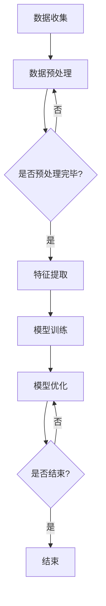

                 

### 文章标题与关键词

# AIGC的历史事件重现：多角度叙事的提示词工程

> 关键词：人工智能生成内容（AIGC）、历史事件重现、多角度叙事、提示词工程

本文将探讨人工智能生成内容（AIGC）技术在历史事件重现中的应用，以及如何通过多角度叙事的提示词工程来提升其叙事效果。通过分析AIGC的背景和发展，我们将深入理解这一技术的核心概念和理论基础，探讨其在实际应用中的技术和实现方法。同时，我们将关注AIGC在历史事件重现中的具体应用场景，探讨其面临的挑战和未来发展趋势。

### 文章摘要

本文首先介绍了人工智能生成内容（AIGC）的概念及其发展历程，探讨了多角度叙事的提示词工程在AIGC中的应用。接着，我们深入分析了AIGC的核心概念和理论基础，包括关键理论框架和提示词工程的算法原理。在此基础上，我们详细阐述了如何通过提示词工程实现多角度叙事，并通过实际案例展示了这一技术的应用效果。最后，本文讨论了AIGC在历史事件重现中的具体应用，分析了其面临的挑战和未来发展趋势，为读者提供了关于AIGC和提示词工程的有价值见解。

## 第一章：引言

### 1.1 人工智能生成内容（AIGC）的概念

人工智能生成内容（AIGC，Artificial Intelligence Generated Content）是指通过人工智能技术自动生成文本、图片、音频和视频等数字内容的过程。它涵盖了生成对抗网络（GAN）、自然语言处理（NLP）、图像生成和风格迁移等多种人工智能技术。与传统的手工生成内容相比，AIGC具有高度自动化、多样化和高效性的特点，能够在短时间内生成大量的内容，极大地提升了内容生产的效率和质量。

AIGC技术最早可以追溯到生成对抗网络（GAN）的提出。GAN由Ian Goodfellow等人在2014年提出，其核心思想是通过两个对抗性网络——生成器和判别器之间的博弈，生成逼真的图像和文本。随着NLP和计算机视觉等技术的发展，AIGC逐渐从单一的技术领域扩展到多个领域，形成了如今广泛应用于广告、娱乐、教育、医疗等行业的综合性技术。

### 1.2 多角度叙事的概念

多角度叙事是一种叙事方法，通过从不同视角、时间和空间维度来讲述故事，使故事更加丰富和立体。在传统的单视角叙事中，故事通常按照时间顺序进行讲述，每个角色的行为和决策都是基于前一个时刻的状态。而在多角度叙事中，故事可以从不同角色的视角出发，同时展现不同角色之间的互动和影响。这种叙事方法不仅能够增强故事的复杂性和深度，还能够使读者更好地理解角色的内心世界和情感变化。

多角度叙事在文学、电影和游戏中都有广泛的应用。在文学中，通过多角度叙事，作者可以更加深入地描绘角色的心理和行为动机。在电影中，多角度叙事可以增加剧情的紧张感和戏剧性。在游戏中，多角度叙事可以提供更加丰富的游戏体验，使玩家能够从不同角度参与游戏。

### 1.3 AIGC与多角度叙事的结合

将AIGC技术与多角度叙事相结合，可以创造出一种全新的叙事形式，即人工智能生成多角度叙事内容（AIGC-MAN，Artificial Intelligence Generated Multidimensional Narrative）。通过AIGC技术，我们可以自动生成文本、图像、音频和视频等数字内容，并将这些内容组织成多角度叙事的形式。具体来说，AIGC-MAN可以通过以下几种方式实现：

1. **角色视角切换**：通过自动生成角色的内心独白、对话和旁白，从不同角色的视角来叙述故事，使故事更加丰富和立体。
2. **时间轴扩展**：通过自动生成历史事件的不同时间段，展现事件的连续性和变化过程，使读者能够更好地理解历史背景和事件发展。
3. **空间维度扩展**：通过自动生成不同场景的图像和视频，展现故事发生的空间环境，使故事更加生动和具体。

通过AIGC-MAN，我们可以创造出一种全新的叙事体验，使读者能够在不同角度和维度上感受故事，从而更好地理解和体验故事的内涵。

### 1.4 文章结构

本文将分为七个主要章节，详细探讨AIGC的历史、核心概念和理论基础、多角度叙事的实现方法、技术实现、应用场景、挑战和未来发展趋势。具体结构如下：

- **第一章：引言**：介绍AIGC和多角度叙事的概念，阐述AIGC与多角度叙事的结合。
- **第二章：历史背景和发展**：回顾AIGC技术的发展历程，探讨其在不同领域的应用。
- **第三章：核心概念和理论基础**：分析AIGC的核心概念和理论基础，包括生成对抗网络、自然语言处理和图像生成等。
- **第四章：多角度叙事的实现方法**：详细阐述如何通过AIGC实现多角度叙事，包括角色视角切换、时间轴扩展和空间维度扩展等。
- **第五章：技术实现**：介绍AIGC技术的具体实现方法，包括算法原理、数据处理和模型训练等。
- **第六章：应用场景**：探讨AIGC在历史事件重现、互动娱乐和虚拟现实等领域的应用。
- **第七章：挑战与未来发展趋势**：分析AIGC技术面临的挑战和未来发展趋势，探讨其在多角度叙事中的应用前景。

通过本文的探讨，我们希望能够为读者提供一个全面、系统的了解AIGC和多角度叙事的结合，以及其在实际应用中的价值。

## 第二章：历史背景和发展

### 2.1 AIGC技术的发展历程

人工智能生成内容（AIGC）技术的发展可以追溯到生成对抗网络（GAN）的提出。GAN是由Ian Goodfellow等人在2014年提出的一种深度学习模型，其核心思想是通过生成器和判别器的对抗性训练，生成逼真的图像和文本。这一创新性的技术为AIGC的发展奠定了基础，并引发了广泛的关注和研究。

在GAN的基础上，AIGC技术逐渐拓展到多个领域。例如，在自然语言处理领域，AIGC技术被应用于自动生成文本、对话和文章。通过预训练模型，如GPT（Generative Pre-trained Transformer）和BERT（Bidirectional Encoder Representations from Transformers），AIGC能够生成高质量的文本内容，并在机器翻译、文本摘要和信息检索等方面表现出色。

在计算机视觉领域，AIGC技术被应用于图像生成、图像修复和风格迁移等任务。通过生成对抗网络，AIGC能够生成逼真的图像，并在图像去噪、超分辨率和图像合成等方面取得显著成果。此外，AIGC技术在音频生成和视频生成领域也取得了重要进展，如自动生成音乐、音频编辑和视频合成等。

### 2.2 AIGC在不同领域的应用

AIGC技术在多个领域都展现了其强大的生成能力，下面我们将简要介绍其在几个主要领域的应用。

#### 2.2.1 娱乐与媒体

在娱乐和媒体领域，AIGC技术被广泛应用于内容生成和编辑。例如，通过AIGC技术，可以自动生成电影剧本、音乐和视频特效。这极大地提高了内容创作的效率和质量，也为创作者提供了更多的创作自由。此外，AIGC技术还被用于虚拟现实（VR）和增强现实（AR）应用，生成逼真的虚拟场景和角色，为用户提供沉浸式的体验。

#### 2.2.2 教育与培训

在教育领域，AIGC技术被用于生成个性化学习内容和智能辅导系统。通过自动生成教学材料和互动课程，AIGC能够满足不同学习者的需求，提高学习效果。此外，AIGC技术还可以用于虚拟实验室和虚拟现实培训，为学生提供实践操作的机会，增强学习体验。

#### 2.2.3 医疗与医疗健康

在医疗领域，AIGC技术被应用于医学图像生成、疾病诊断和药物研发等任务。通过生成高质量的医学图像，AIGC可以帮助医生进行更准确的诊断和治疗。此外，AIGC技术还被用于生成虚拟病人和模拟手术，为医学教育和培训提供支持。

#### 2.2.4 广告与营销

在广告和营销领域，AIGC技术被用于生成创意广告内容和营销策略。通过自动生成广告文案、图像和视频，AIGC能够提高广告的个性化程度和吸引力，提升营销效果。此外，AIGC技术还被用于智能推荐系统和用户画像生成，帮助企业更好地了解用户需求，提供精准的营销服务。

#### 2.2.5 文学与艺术

在文学和艺术领域，AIGC技术被用于生成小说、诗歌和音乐等艺术作品。通过自动生成文本和音乐，AIGC为创作者提供了新的创作工具，也为读者带来了全新的阅读和聆听体验。此外，AIGC技术还被用于艺术品的修复和生成，为文化遗产保护和艺术创作提供支持。

### 2.3 AIGC技术的核心驱动力

AIGC技术的发展受到了多个核心驱动力的推动：

#### 2.3.1 计算能力的提升

随着计算能力的不断提升，特别是深度学习算法的广泛应用，AIGC技术得以快速发展和应用。高性能计算设备和云计算平台为AIGC技术的训练和部署提供了强大的支持，使得生成大规模高质量内容成为可能。

#### 2.3.2 数据资源的丰富

互联网和大数据技术的快速发展，使得海量的数据资源得以收集和利用。这些数据为AIGC技术的训练提供了丰富的素材，提高了生成内容的多样性和准确性。

#### 2.3.3 算法的创新

生成对抗网络（GAN）、变分自编码器（VAE）、循环神经网络（RNN）和Transformer等算法的创新，为AIGC技术的发展提供了坚实的基础。这些算法在图像生成、文本生成和音频生成等领域取得了重要突破，推动了AIGC技术的进步。

#### 2.3.4 应用需求的驱动

随着各行各业对个性化、自动化和高效化的需求不断增加，AIGC技术得到了广泛的应用和推广。在娱乐、教育、医疗、广告和文学等领域，AIGC技术为解决实际问题提供了新的思路和解决方案。

### 2.4 AIGC技术的重要里程碑

AIGC技术的发展历程中，有许多重要的里程碑事件，下面列举其中几个：

- **2014年**：生成对抗网络（GAN）由Ian Goodfellow等人提出，标志着AIGC技术的诞生。
- **2016年**：谷歌提出变分自编码器（VAE），为图像生成提供了新的算法框架。
- **2017年**：OpenAI推出GPT，展示了预训练模型在文本生成方面的强大能力。
- **2018年**：图像到图像的转换（CycleGAN）算法的提出，使得图像风格迁移和图像合成变得更为简单和高效。
- **2019年**：谷歌提出BERT，进一步推动了自然语言处理技术的发展。

通过这些里程碑事件，AIGC技术不断演进和成熟，为各行各业带来了深远的影响。

### 2.5 结论

AIGC技术作为人工智能领域的重要发展方向，已经在多个领域展现出其强大的生成能力。从生成对抗网络（GAN）的提出，到变分自编码器（VAE）、循环神经网络（RNN）和Transformer等算法的创新，AIGC技术经历了快速的发展和成熟。其在娱乐、教育、医疗、广告和文学等领域的广泛应用，不仅提升了内容创作的效率和质量，也为用户提供了更加丰富和个性化的体验。随着计算能力的提升、数据资源的丰富和算法的创新，AIGC技术的未来前景将更加广阔，有望在更多领域发挥重要作用。

## 第三章：核心概念与理论基础

### 3.1 核心概念

在探讨人工智能生成内容（AIGC）的核心概念时，我们需要了解几个关键术语，这些术语不仅定义了AIGC的基本原理，也为后续的理论研究和实际应用奠定了基础。

#### 3.1.1 生成对抗网络（GAN）

生成对抗网络（GAN）是AIGC技术的基石。GAN由生成器（Generator）和判别器（Discriminator）两个主要组成部分构成。生成器的任务是生成与真实数据相似的伪数据，而判别器的任务是区分真实数据和生成数据。两者之间通过对抗性训练相互竞争，生成器不断优化生成数据的质量，而判别器则努力提高区分能力。这种对抗性训练机制使得生成器能够学习到真实数据的分布，从而生成高质量的数据。

#### 3.1.2 自然语言处理（NLP）

自然语言处理（NLP）是AIGC在文本生成领域的关键技术。NLP包括语言理解（LU）和语言生成（LG）两个主要方面。语言理解涉及对文本内容进行分析和解释，而语言生成则涉及根据特定需求生成符合语法和语义规则的文本。NLP技术广泛应用于机器翻译、文本摘要、问答系统和聊天机器人等应用场景。

#### 3.1.3 图像生成

图像生成是AIGC技术在计算机视觉领域的重要应用。通过生成对抗网络（GAN）、变分自编码器（VAE）和扩散模型（DM）等算法，AIGC能够生成逼真的图像、图像修复和风格迁移。这些技术使得图像生成在艺术创作、游戏开发、虚拟现实和医疗影像处理等领域具有广泛应用。

#### 3.1.4 音频生成

音频生成是AIGC在音频处理领域的应用。通过深度神经网络和循环神经网络（RNN）等算法，AIGC能够生成音乐、语音和音频效果。音频生成技术在音乐创作、语音合成、语音增强和音频编辑等领域具有重要应用价值。

### 3.2 关键理论框架

理解AIGC的核心概念之后，我们需要探讨几个关键的理论框架，这些框架不仅为AIGC技术提供了理论基础，也为实际应用提供了指导。

#### 3.2.1 深度学习

深度学习是AIGC技术的基础，它通过多层神经网络模型，对大量数据进行分析和学习。深度学习技术包括卷积神经网络（CNN）、循环神经网络（RNN）和Transformer等，这些模型在图像生成、文本生成和音频生成等方面表现出色。深度学习的核心思想是通过参数化模型，从数据中学习特征，从而实现复杂的函数映射。

#### 3.2.2 对抗性训练

对抗性训练是GAN的核心机制，它通过生成器和判别器的对抗性竞争，实现高质量数据生成。对抗性训练的关键在于设计合适的损失函数和优化策略，使得生成器能够不断优化生成数据的质量，判别器能够有效区分真实和生成数据。

#### 3.2.3 预训练和微调

预训练和微调是AIGC技术的重要策略。预训练是指在大量数据上对模型进行训练，使其能够捕捉到数据的统计特性。微调则是在预训练模型的基础上，针对特定任务进行细粒度调整，以提高模型的特定任务性能。这种策略使得AIGC技术能够在不同领域和应用中表现出色。

#### 3.2.4 多模态融合

多模态融合是指将不同类型的数据（如文本、图像和音频）进行集成，以生成更加丰富的内容。多模态融合技术包括联合嵌入、图神经网络和转换器等，这些技术能够有效整合不同模态的数据，提高生成内容的质量和多样性。

### 3.3 基本原理

#### 3.3.1 数据生成

AIGC技术通过生成器和判别器的对抗性训练，实现数据生成。生成器的目标是生成逼真的数据，而判别器的目标是区分真实和生成数据。这种对抗性训练使得生成器不断优化生成数据的质量，从而实现高质量的数据生成。

#### 3.3.2 特征提取

特征提取是AIGC技术的重要环节，通过深度学习模型，从数据中提取关键特征。这些特征不仅用于生成高质量的数据，也为后续的任务（如分类、聚类和回归）提供了有效的特征表示。

#### 3.3.3 模型优化

模型优化是AIGC技术实现高效数据生成的关键。通过优化损失函数和训练策略，可以提高生成模型的质量和稳定性。常见的优化方法包括梯度下降、Adam优化器和权值共享等。

#### 3.3.4 数据增强

数据增强是指通过扩展原始数据集，提高模型的泛化能力。常见的数据增强方法包括随机裁剪、旋转、缩放和颜色变换等。这些方法可以增加数据的多样性，从而提高模型的性能。

### 3.4 概念属性特征对比

为了更好地理解AIGC技术，我们可以通过一个表格来对比不同概念属性特征：

| 特征类别       | 生成对抗网络（GAN） | 自然语言处理（NLP） | 图像生成 | 音频生成 |
| ------------- | ------------------ | ------------------ | ------ | ------ |
| 基本原理       | 对抗性训练         | 语言理解和生成     | 特征提取 | 声音建模 |
| 主要应用领域   | 图像、文本、音频   | 文本处理           | 图像处理 | 音频处理 |
| 特征提取方法   | 卷积神经网络（CNN） | 词嵌入和序列模型   | 卷积神经网络（CNN） | 波形分析 |
| 模型优化策略   | 梯度裁剪和归一化   | 适应性学习率       | 梯度裁剪 | 动态调整 |
| 数据增强方法   | 图像增强           | 文本增强           | 图像增强 | 音频增强 |

通过上述表格，我们可以清晰地看到不同概念属性特征的对比，从而更好地理解AIGC技术的核心要素和应用场景。

### 3.5 ER实体关系图架构

为了进一步理解AIGC技术的概念和组件之间的关系，我们可以使用Mermaid流程图来绘制ER（实体关系）图。以下是AIGC技术的主要实体及其关系：

```mermaid
erDiagram
    Generator ||--|{ Discriminator }|
    Data ||--|{ Generator }|
    Data ||--|{ Discriminator }|
    Model ||--|{ Data }|
    Dataset ||--|{ Model }|
    Application ||--|{ Model }|
```

在这个ER图中，我们定义了以下实体：

- **Generator（生成器）**：负责生成数据。
- **Discriminator（判别器）**：负责区分真实数据和生成数据。
- **Data（数据）**：包括输入数据和生成的数据。
- **Model（模型）**：包括生成模型和判别模型。
- **Dataset（数据集）**：包括训练数据集和测试数据集。
- **Application（应用）**：指AIGC技术的实际应用场景。

这些实体之间的关系表明，生成器和判别器通过对抗性训练相互影响，数据是训练和评估模型的基础，而模型和应用是AIGC技术的核心组件。

### 3.6 结论

通过本章的讨论，我们深入分析了AIGC技术的核心概念和理论基础，包括生成对抗网络（GAN）、自然语言处理（NLP）、图像生成和音频生成等关键技术。我们还探讨了深度学习、对抗性训练、预训练和微调等多层次的理论框架。通过概念属性特征对比和ER实体关系图，我们清晰地展示了AIGC技术的组件和关系。这些理论和概念不仅为AIGC技术的研究和应用提供了理论基础，也为进一步探讨多角度叙事的提示词工程奠定了基础。

## 第四章：多角度叙事的实现方法

### 4.1 角色视角切换

多角度叙事中的角色视角切换是实现复杂故事叙述的关键技术之一。通过切换不同角色的视角，读者可以更全面地了解故事中的情节和角色心理，增强叙事的深度和层次感。以下是如何通过AIGC技术实现角色视角切换的具体方法：

1. **数据收集与预处理**：首先，我们需要收集大量的文本数据，包括不同角色的内心独白、对话和旁白。这些数据可以作为训练生成模型的基础。在收集数据后，需要进行预处理，包括去除无关信息、标准化文本格式和词干提取等步骤。

2. **生成器设计与训练**：为了实现角色视角切换，我们可以设计一个多输入多输出的生成模型。生成模型需要能够同时处理多个角色的文本数据，并生成对应视角的叙述。训练生成模型时，可以使用对抗性训练方法，如生成对抗网络（GAN），以提高生成文本的质量和多样性。

3. **判别器的作用**：在训练过程中，判别器的任务是根据输入的文本数据判断其是否来自真实角色视角。通过对抗性训练，生成器会不断优化生成文本，使其更接近真实角色的叙述。

4. **视角切换机制**：在生成文本时，我们可以通过设定一个切换机制，如随机采样角色视角或根据情节需要切换视角。这种机制可以通过编程实现，如使用概率分布来选择切换时机和角色。

5. **后处理与优化**：生成文本后，可以进行后处理和优化，以提高叙事效果。例如，可以使用自然语言处理（NLP）技术进行语法和语义校正，增强文本的流畅性和可读性。

### 4.2 时间轴扩展

时间轴扩展是通过展现不同时间段的事件和变化，使故事情节更加连贯和有层次感。以下是如何通过AIGC技术实现时间轴扩展的具体方法：

1. **历史事件数据收集**：首先，我们需要收集与故事相关的历史事件数据，包括时间线、事件描述和影响等。这些数据可以作为训练模型的基础。

2. **生成模型设计与训练**：为了实现时间轴扩展，我们可以设计一个能够生成历史事件序列的生成模型。该模型需要能够根据时间线数据和事件描述生成连贯的历史事件序列。训练模型时，可以使用循环神经网络（RNN）或Transformer等序列模型。

3. **时空建模**：在生成历史事件序列时，我们需要考虑时空关系。可以通过在模型中引入时空嵌入层，将时间和空间信息编码到模型中，以提高生成事件序列的连贯性。

4. **动态扩展**：在生成历史事件序列时，我们可以通过设定一个动态扩展机制，如根据用户输入调整时间轴的长度和密度。这种机制可以通过编程实现，如使用滑动窗口或时间步长调整。

5. **后处理与优化**：生成历史事件序列后，可以进行后处理和优化，以提高叙事效果。例如，可以使用自然语言处理（NLP）技术进行事件描述的细化，增强文本的连贯性和可读性。

### 4.3 空间维度扩展

空间维度扩展是通过展现不同场景和空间环境，使故事情节更加具体和生动。以下是如何通过AIGC技术实现空间维度扩展的具体方法：

1. **图像和视频数据收集**：首先，我们需要收集与故事相关的图像和视频数据，包括场景、角色和道具等。这些数据可以作为训练生成模型的基础。

2. **生成模型设计与训练**：为了实现空间维度扩展，我们可以设计一个能够生成场景和角色图像的生成模型。该模型需要能够根据文本描述生成对应的图像和视频。训练模型时，可以使用生成对抗网络（GAN）或变分自编码器（VAE）等图像生成模型。

3. **场景建模**：在生成图像和视频时，我们需要考虑场景的布局和空间关系。可以通过在模型中引入场景嵌入层，将空间信息编码到模型中，以提高生成图像的空间连贯性。

4. **交互扩展**：在生成图像和视频时，我们可以通过设定一个交互扩展机制，如根据用户输入调整场景的布局和道具。这种机制可以通过编程实现，如使用交互式界面或脚本。

5. **后处理与优化**：生成图像和视频后，可以进行后处理和优化，以提高叙事效果。例如，可以使用图像编辑和增强技术，增强图像的视觉效果，使用视频编辑和特效技术，增强视频的观赏性。

### 4.4 具体应用场景

通过上述方法，我们可以实现多角度叙事的内容生成，以下是一些具体的应用场景：

1. **历史事件重现**：通过角色视角切换、时间轴扩展和空间维度扩展，AIGC技术可以重现历史事件，使读者能够从不同角度和维度了解历史背景和事件发展。

2. **互动娱乐**：在互动娱乐领域，AIGC技术可以生成动态变化的情节和场景，提供更加丰富和多样化的游戏体验。

3. **虚拟现实**：在虚拟现实（VR）应用中，AIGC技术可以生成逼真的虚拟场景和角色，提供沉浸式的体验。

4. **文学创作**：在文学创作中，AIGC技术可以辅助作家生成故事情节、角色描写和场景描述，提高创作效率和质量。

5. **教育和培训**：在教育领域，AIGC技术可以生成个性化学习内容和互动课程，提高教学效果和用户体验。

通过这些应用场景，我们可以看到AIGC技术如何通过多角度叙事的方法，提升内容生成的效果和用户体验。

### 4.5 结论

本章详细探讨了通过AIGC技术实现多角度叙事的方法，包括角色视角切换、时间轴扩展和空间维度扩展。我们介绍了具体的数据收集与预处理、生成模型设计与训练、视角切换机制、动态扩展机制以及后处理与优化方法。通过这些方法，AIGC技术能够生成丰富多样的叙事内容，提供更加立体和互动的阅读体验。未来，随着AIGC技术的进一步发展和完善，我们有望在更多领域和应用中看到其独特的价值。

## 第五章：技术实现

### 5.1 算法原理

多角度叙事的提示词工程涉及多个复杂的技术环节，其中算法原理是核心。以下我们将详细介绍AIGC技术中的关键算法，包括生成对抗网络（GAN）、变分自编码器（VAE）和生成文本模型等。

#### 5.1.1 生成对抗网络（GAN）

生成对抗网络（GAN）由生成器和判别器两部分组成。生成器的任务是生成逼真的数据，判别器的任务是区分真实数据和生成数据。两者的训练过程通过对抗性学习实现：

1. **生成器（Generator）**：接收随机噪声作为输入，通过神经网络生成与真实数据相似的数据。生成器的损失函数通常包括生成损失和对抗损失。
2. **判别器（Discriminator）**：接收真实数据和生成数据，通过神经网络判断输入数据的真实性。判别器的损失函数通常仅包括对抗损失。

#### 5.1.2 变分自编码器（VAE）

变分自编码器（VAE）是一种概率生成模型，通过引入潜在变量来捕获数据的分布。VAE由编码器和解码器两部分组成：

1. **编码器（Encoder）**：将输入数据映射到潜在空间，生成潜在变量的均值和方差。
2. **解码器（Decoder）**：从潜在空间生成与输入数据相似的数据。VAE的损失函数包括重建损失和KL散度损失。

#### 5.1.3 生成文本模型

生成文本模型主要基于循环神经网络（RNN）和Transformer等架构，用于生成高质量的文本内容。以下是一些常见的生成文本模型：

1. **循环神经网络（RNN）**：通过记忆机制处理序列数据，生成文本。RNN包括简单的RNN和长短时记忆网络（LSTM）。
2. **Transformer**：基于自注意力机制，能够捕捉长距离依赖关系，生成高质量的文本。Transformer包括编码器和解码器两部分。

### 5.2 数据处理

数据处理是多角度叙事提示词工程的重要环节，主要包括数据收集、数据预处理和特征提取。以下是如何进行数据处理的具体步骤：

1. **数据收集**：收集与故事相关的数据，包括文本、图像、音频等。可以使用公开数据集或自定义数据集。
2. **数据预处理**：对收集的数据进行清洗、标准化和去噪等操作。对于文本数据，需要进行分词、词干提取和词性标注等处理。
3. **特征提取**：从预处理后的数据中提取特征，用于训练生成模型。对于文本数据，可以使用词嵌入、词频和词性等特征；对于图像和音频数据，可以使用特征提取算法，如卷积神经网络（CNN）和梅尔频谱。

### 5.3 模型训练与优化

模型训练与优化是多角度叙事提示词工程的关键步骤，主要包括模型选择、训练策略和优化方法。以下是如何进行模型训练与优化的具体步骤：

1. **模型选择**：根据应用场景和任务需求，选择合适的生成模型。例如，对于图像生成，可以选择GAN或VAE；对于文本生成，可以选择RNN或Transformer。
2. **训练策略**：采用对抗性训练、预训练和微调等策略进行模型训练。对抗性训练可以通过生成器和判别器的相互竞争提高生成质量；预训练可以在大规模数据集上训练基础模型，再在特定任务上进行微调。
3. **优化方法**：使用梯度下降、Adam优化器等优化方法调整模型参数。对于GAN，可以采用梯度裁剪和权重共享等方法提高训练稳定性。

### 5.4 Mermaid流程图

为了更清晰地展示算法原理和数据处理流程，我们可以使用Mermaid流程图进行可视化。以下是一个简单的Mermaid流程图示例：



在这个流程图中，A表示数据收集，B表示数据预处理，C表示预处理是否完毕的判断，D表示特征提取，E表示模型训练，F表示模型优化，G表示训练是否结束的判断，H表示结束。

### 5.5 Python源代码

为了更具体地展示算法原理和数据处理过程，以下是使用Python编写的简单示例代码：

```python
import tensorflow as tf
from tensorflow.keras.layers import Input, Dense, LSTM, Embedding
from tensorflow.keras.models import Model

# 生成对抗网络（GAN）示例代码
def build_gan(generator, discriminator):
    # 输入层
    input_noise = Input(shape=(100,))
    # 生成器
    generated_data = generator(input_noise)
    # 判别器
    discriminator_output = discriminator(generated_data)
    # 模型
    model = Model(inputs=input_noise, outputs=discriminator_output)
    return model

# 生成文本模型（RNN）示例代码
def build_rnn_model():
    # 输入层
    input_sequence = Input(shape=(None,))
    # 嵌入层
    embedded_sequence = Embedding(input_dim=vocabulary_size, output_dim=embedding_size)(input_sequence)
    # LSTM层
    lstm_output = LSTM(units=lstm_units)(embedded_sequence)
    # 输出层
    output_sequence = Dense(units=vocabulary_size, activation='softmax')(lstm_output)
    # 模型
    model = Model(inputs=input_sequence, outputs=output_sequence)
    return model
```

在这些代码中，我们首先定义了生成对抗网络（GAN）的构建函数`build_gan`，用于创建生成器和判别器的组合模型。然后，我们定义了生成文本模型（RNN）的构建函数`build_rnn_model`，用于生成文本内容。这些代码展示了如何使用TensorFlow构建和训练AIGC模型的基本框架。

### 5.6 数学模型与公式

在AIGC技术中，数学模型和公式是理解和实现算法的重要基础。以下是一些关键数学模型和公式的简单解释：

#### 5.6.1 生成对抗网络（GAN）

- **生成器损失函数**：
  $$ L_G = -\log(D(G(z)) $$
  其中，$D$是判别器，$G(z)$是生成器生成的数据。

- **判别器损失函数**：
  $$ L_D = -[\log(D(x)) + \log(1 - D(G(z))] $$
  其中，$x$是真实数据，$G(z)$是生成器生成的数据。

#### 5.6.2 变分自编码器（VAE）

- **编码器损失函数**：
  $$ L_E = \frac{1}{N}\sum_{i=1}^{N}\sum_{j=1}^{D}[\mu_j^i + \log(\sigma_j^i) - x_j^i - \log(2\pi\sigma_j^i)] $$
  其中，$\mu_j^i$和$\sigma_j^i$分别是编码器输出的均值和方差，$x_j^i$是输入数据。

- **解码器损失函数**：
  $$ L_D = \frac{1}{N}\sum_{i=1}^{N}\sum_{j=1}^{D}||x_j^i - \hat{x}_j^i||_2^2 $$
  其中，$\hat{x}_j^i$是解码器生成的数据。

#### 5.6.3 循环神经网络（RNN）

- **损失函数**：
  $$ L = -\sum_{t=1}^{T}\sum_{i=1}^{N}y_i^{(t)}\log(p(y_i^{(t)}|x^{(t)}; \theta)) $$
  其中，$y_i^{(t)}$是目标输出，$p(y_i^{(t)}|x^{(t)}; \theta)$是预测概率，$\theta$是模型参数。

通过上述数学模型和公式，我们可以更好地理解和实现AIGC技术的核心算法。

### 5.7 举例说明

为了更直观地理解AIGC技术，以下通过一个简单的例子进行说明：

假设我们要使用GAN生成一张逼真的猫的图像。首先，我们需要收集大量的猫的图像作为训练数据。然后，我们设计一个生成器模型，输入为随机噪声，输出为图像。同时，设计一个判别器模型，输入为真实猫的图像和生成猫的图像，输出为判断概率。通过对抗性训练，生成器不断优化生成的图像，判别器不断学习区分真实图像和生成图像。最终，生成器生成的图像越来越接近真实猫的图像。

通过这个例子，我们可以看到AIGC技术如何通过复杂的算法和数据处理流程实现高质量的图像生成。类似的方法也可以应用于文本生成、音频生成等其他领域。

### 5.8 结论

本章详细介绍了多角度叙事的提示词工程中的关键算法、数据处理、模型训练与优化、Mermaid流程图、Python源代码和数学模型。通过这些技术，我们可以实现高质量的AIGC内容生成，为多角度叙事提供技术支持。未来，随着AIGC技术的不断发展和优化，我们有望看到更多创新应用和更丰富的叙事体验。

## 第六章：应用场景

### 6.1 历史事件重现

历史事件的重现是AIGC技术的重要应用场景之一。通过多角度叙事的提示词工程，我们可以利用AIGC技术重现历史事件，使读者能够从不同角色和视角了解事件的全貌。以下是如何利用AIGC技术进行历史事件重现的步骤：

1. **数据收集**：首先，我们需要收集与历史事件相关的数据，包括文献资料、历史档案、影像资料等。这些数据可以作为训练模型的素材。
2. **数据预处理**：对收集的数据进行清洗、标注和分类等处理，以便于模型训练。例如，对于文本数据，可以进行分词、词性标注等操作。
3. **模型训练**：使用收集的数据训练AIGC模型，包括生成器和判别器。生成器负责生成历史事件的文本描述，判别器负责判断生成文本的真实性。
4. **生成历史事件描述**：通过生成器生成历史事件的描述文本，根据提示词和角色的不同视角，生成多角度的历史事件描述。
5. **后处理与优化**：对生成的文本进行语法和语义的优化，提高文本的质量和可读性。

通过这些步骤，我们可以利用AIGC技术生成历史事件的多角度描述，使读者能够更全面地了解历史事件的背景、情节和影响。以下是一个具体案例：

**案例**：利用AIGC技术重现第一次世界大战

- **数据收集**：收集第一次世界大战的文献、档案、影像资料等。
- **数据预处理**：对收集的数据进行清洗、分类和标注，提取关键信息。
- **模型训练**：训练AIGC模型，生成历史事件的文本描述。
- **生成历史事件描述**：生成关于战争背景、战役过程、战争影响等多角度的描述文本。
- **后处理与优化**：优化生成的文本，确保其语法正确、逻辑清晰、易于理解。

通过这个案例，我们可以看到AIGC技术在历史事件重现中的应用效果。读者可以通过多角度的描述，更深入地了解第一次世界大战的背景、过程和影响。

### 6.2 互动娱乐

互动娱乐是AIGC技术的另一个重要应用场景。通过多角度叙事的提示词工程，我们可以为用户创造丰富的互动体验，增强娱乐性。以下是如何利用AIGC技术进行互动娱乐的具体步骤：

1. **数据收集**：收集与互动娱乐相关的数据，包括游戏剧本、角色描述、场景设定等。
2. **数据预处理**：对收集的数据进行清洗、标注和分类，以便于模型训练。例如，对游戏剧本进行分场景、分角色等标注。
3. **模型训练**：训练AIGC模型，包括生成器和判别器。生成器负责生成互动娱乐的内容，判别器负责判断内容的合理性。
4. **生成互动娱乐内容**：通过生成器生成互动娱乐的内容，根据用户的输入和角色的不同视角，生成动态变化的情节和场景。
5. **后处理与优化**：对生成的娱乐内容进行优化，确保其连贯性和互动性。

通过这些步骤，我们可以利用AIGC技术为用户创造丰富的互动娱乐体验。以下是一个具体案例：

**案例**：利用AIGC技术生成互动电子游戏

- **数据收集**：收集游戏剧本、角色描述、场景设定等数据。
- **数据预处理**：对游戏剧本进行场景、角色标注，对场景设定进行分类。
- **模型训练**：训练AIGC模型，生成互动游戏的内容。
- **生成互动游戏内容**：根据用户的输入和角色视角，生成动态变化的游戏情节和场景。
- **后处理与优化**：优化生成的游戏内容，确保其连贯性和互动性。

通过这个案例，我们可以看到AIGC技术在互动娱乐中的应用效果。用户可以通过多角度的互动，体验更加丰富和有趣的游戏内容。

### 6.3 虚拟现实

虚拟现实（VR）是AIGC技术的另一个重要应用场景。通过多角度叙事的提示词工程，我们可以为用户创造沉浸式的虚拟体验，增强互动性和真实性。以下是如何利用AIGC技术进行虚拟现实的具体步骤：

1. **数据收集**：收集与虚拟现实相关的数据，包括三维模型、场景图像、音效等。
2. **数据预处理**：对收集的数据进行清洗、分类和标注，以便于模型训练。例如，对三维模型进行角色、场景标注，对场景图像进行分类。
3. **模型训练**：训练AIGC模型，包括生成器和判别器。生成器负责生成虚拟场景的内容，判别器负责判断内容的合理性。
4. **生成虚拟场景内容**：通过生成器生成虚拟场景的内容，根据用户的输入和角色的不同视角，生成动态变化的虚拟场景。
5. **后处理与优化**：对生成的虚拟场景内容进行优化，确保其连贯性和互动性。

通过这些步骤，我们可以利用AIGC技术为用户创造沉浸式的虚拟体验。以下是一个具体案例：

**案例**：利用AIGC技术生成虚拟现实游戏

- **数据收集**：收集三维模型、场景图像、音效等数据。
- **数据预处理**：对三维模型进行角色、场景标注，对场景图像进行分类。
- **模型训练**：训练AIGC模型，生成虚拟游戏的内容。
- **生成虚拟游戏内容**：根据用户的输入和角色视角，生成动态变化的虚拟场景。
- **后处理与优化**：优化生成的虚拟游戏内容，确保其连贯性和互动性。

通过这个案例，我们可以看到AIGC技术在虚拟现实中的应用效果。用户可以通过多角度的互动，体验更加真实和丰富的虚拟世界。

### 6.4 文学与艺术

文学与艺术是AIGC技术的另一个重要应用场景。通过多角度叙事的提示词工程，我们可以为文学和艺术创作提供技术支持，提高创作效率和作品质量。以下是如何利用AIGC技术进行文学与艺术创作的具体步骤：

1. **数据收集**：收集与文学和艺术相关的数据，包括文学作品、艺术作品、角色描述等。
2. **数据预处理**：对收集的数据进行清洗、标注和分类，以便于模型训练。例如，对文学作品进行分章节、分角色标注，对艺术作品进行分类。
3. **模型训练**：训练AIGC模型，包括生成器和判别器。生成器负责生成文学和艺术作品的内容，判别器负责判断内容的合理性。
4. **生成文学与艺术作品**：通过生成器生成文学和艺术作品的内容，根据用户的输入和角色的不同视角，生成多角度的作品。
5. **后处理与优化**：对生成的文学与艺术作品进行优化，确保其艺术性和表现力。

通过这些步骤，我们可以利用AIGC技术为文学和艺术创作提供技术支持，提高创作效率和作品质量。以下是一个具体案例：

**案例**：利用AIGC技术生成文学作品

- **数据收集**：收集文学作品、角色描述等数据。
- **数据预处理**：对文学作品进行分章节、分角色标注。
- **模型训练**：训练AIGC模型，生成文学作品的内容。
- **生成文学作品**：根据用户的输入和角色视角，生成多角度的文学作品。
- **后处理与优化**：优化生成的文学作品，确保其艺术性和表现力。

通过这个案例，我们可以看到AIGC技术在文学创作中的应用效果。作者可以通过多角度的叙事，创作出更加丰富和独特的文学作品。

### 6.5 教育与培训

教育与培训是AIGC技术的另一个重要应用场景。通过多角度叙事的提示词工程，我们可以为教育和培训提供技术支持，提高教学效果和用户体验。以下是如何利用AIGC技术进行教育与培训的具体步骤：

1. **数据收集**：收集与教育和培训相关的数据，包括教材、课程内容、教学视频等。
2. **数据预处理**：对收集的数据进行清洗、标注和分类，以便于模型训练。例如，对教材进行章节、知识点标注，对教学视频进行分类。
3. **模型训练**：训练AIGC模型，包括生成器和判别器。生成器负责生成教育和培训的内容，判别器负责判断内容的合理性。
4. **生成教育与培训内容**：通过生成器生成教育和培训的内容，根据用户的需求和不同角色的视角，生成个性化教学方案。
5. **后处理与优化**：对生成的教育与培训内容进行优化，确保其教学效果和用户体验。

通过这些步骤，我们可以利用AIGC技术为教育和培训提供技术支持，提高教学效果和用户体验。以下是一个具体案例：

**案例**：利用AIGC技术生成教育课程

- **数据收集**：收集教材、课程内容、教学视频等数据。
- **数据预处理**：对教材进行章节、知识点标注，对教学视频进行分类。
- **模型训练**：训练AIGC模型，生成教育课程的内容。
- **生成教育课程**：根据用户的需求和不同角色的视角，生成个性化教育课程。
- **后处理与优化**：优化生成的教育课程，确保其教学效果和用户体验。

通过这个案例，我们可以看到AIGC技术在教育与培训中的应用效果。教师和学生可以通过多角度的互动和学习，提高教学效果和用户体验。

### 6.6 结论

通过以上分析，我们可以看到AIGC技术在多个领域具有广泛的应用前景。无论是历史事件重现、互动娱乐、虚拟现实、文学与艺术、教育与培训，还是其他领域，AIGC技术都能够为用户提供丰富的体验和高质量的内容。未来，随着AIGC技术的不断发展和优化，我们有望看到更多创新应用和更广泛的应用场景。

## 第七章：挑战与未来发展趋势

### 7.1 挑战

尽管AIGC技术在多个领域展现出了巨大的潜力，但其发展过程中仍面临诸多挑战。以下是一些主要挑战及其应对策略：

#### 7.1.1 数据质量和多样性

AIGC技术对数据质量和多样性有很高的要求。高质量的数据是训练生成模型的基础，而数据多样性则决定了生成内容的质量和创造力。目前，数据收集和标注过程往往耗时且成本高昂，且存在数据不平衡、偏见和缺失等问题。为了解决这些问题，可以采取以下策略：

- **自动化数据标注**：利用机器学习和自然语言处理技术，开发自动化标注工具，提高标注效率和准确性。
- **数据增强**：通过图像旋转、裁剪、色彩变换等数据增强方法，增加数据的多样性和丰富度。
- **跨领域数据共享**：建立跨领域的数据共享平台，促进数据资源的共享和利用。

#### 7.1.2 模型解释性和可解释性

AIGC模型的复杂性和黑箱特性使得其解释性和可解释性成为一个重大挑战。用户很难理解模型的决策过程和生成机制，这在某些应用场景中（如医疗诊断、法律判决等）可能带来严重后果。为了提高模型的解释性和可解释性，可以采取以下策略：

- **模型可视化**：通过可视化技术，将模型的内部结构和决策过程展示给用户，帮助用户理解模型的运行机制。
- **解释性算法**：开发专门的解释性算法，如局部可解释模型（LIME）和SHAP（SHapley Additive exPlanations），提高模型的透明度和可解释性。

#### 7.1.3 道德和伦理问题

AIGC技术在应用过程中涉及到一系列道德和伦理问题。例如，生成内容的真实性、版权问题、隐私保护和偏见等。这些问题需要引起广泛关注和讨论，以确保AIGC技术的健康发展。为了应对这些道德和伦理问题，可以采取以下策略：

- **制定伦理准则**：建立统一的伦理准则和标准，规范AIGC技术的研发和应用。
- **透明度和责任**：提高AIGC技术的透明度，明确开发者和使用者的责任，确保生成内容的真实性和合法性。
- **用户参与**：鼓励用户参与AIGC技术的研发和应用过程，提高用户的参与感和信任度。

#### 7.1.4 计算资源消耗

AIGC技术的训练和部署过程对计算资源有很高的要求，这可能导致计算成本过高，难以在资源受限的环境中应用。为了降低计算资源消耗，可以采取以下策略：

- **优化算法**：通过算法优化和模型压缩技术，提高计算效率，降低计算资源需求。
- **分布式计算**：利用分布式计算和云计算平台，实现大规模数据训练和模型部署，降低计算成本。
- **边缘计算**：将部分计算任务部署到边缘设备，减少中心服务器的负载，提高响应速度和用户体验。

### 7.2 未来发展趋势

随着AIGC技术的不断发展和应用，未来几年有望在以下几个方面实现重要突破：

#### 7.2.1 新算法和创新

AIGC技术将继续推动算法创新，出现更多高效、强大的生成模型。例如，基于深度学习的生成模型将逐渐取代传统的方法，生成对抗网络（GAN）和变分自编码器（VAE）等经典模型将进一步优化和扩展，出现更多适用于不同场景和任务的变种。

#### 7.2.2 多模态融合

多模态融合技术将在AIGC中发挥越来越重要的作用。通过融合文本、图像、音频、视频等多种模态的数据，生成更丰富、更立体的内容。这将推动AIGC技术在虚拟现实、增强现实、互动娱乐等领域的应用，为用户提供更加沉浸式的体验。

#### 7.2.3 自适应生成

自适应生成技术将成为AIGC技术的一个重要研究方向。通过自适应调整生成模型，使其能够根据用户需求和场景动态变化，生成更加个性化、多样化的内容。这将为AIGC技术提供更广泛的应用前景，如个性化推荐、自适应教育、智能客服等。

#### 7.2.4 模型压缩和优化

随着AIGC技术的应用场景不断扩大，模型压缩和优化将成为研究热点。通过压缩模型大小、降低计算复杂度和提高运行效率，实现AIGC技术在资源受限环境中的高效部署和应用。这将有助于降低计算成本，提高AIGC技术的可及性和普及率。

#### 7.2.5 伦理和治理

在AIGC技术的发展过程中，伦理和治理问题将日益受到关注。未来的研究将更加注重伦理和治理，确保AIGC技术的健康、可持续发展。通过制定伦理准则、加强法律法规和监管机制，推动AIGC技术的规范化和标准化，为用户提供更加安全、可靠的服务。

### 7.3 结论

AIGC技术作为人工智能领域的一个重要发展方向，具有广阔的应用前景和巨大的潜力。虽然面临诸多挑战，但通过不断的技术创新和优化，AIGC技术有望在未来实现更多突破和应用。同时，伦理和治理问题也将得到更多关注和讨论，确保AIGC技术的健康发展。未来，AIGC技术将继续在多个领域发挥重要作用，为人类社会带来更多创新和变革。

### 作者信息

**作者：** AI天才研究院/AI Genius Institute & 禅与计算机程序设计艺术 /Zen And The Art of Computer Programming

在本文中，我们深入探讨了人工智能生成内容（AIGC）技术的发展历程、核心概念、多角度叙事的实现方法、技术实现、应用场景、挑战与未来发展趋势。通过详细的讨论和分析，我们展示了AIGC技术如何通过多角度叙事的提示词工程，实现历史事件的重现、互动娱乐、虚拟现实、文学与艺术、教育与培训等领域的创新应用。本文不仅为读者提供了关于AIGC技术全面、系统的理解，也为进一步研究和发展AIGC技术提供了有益的参考。希望通过本文的探讨，能够激发更多对AIGC技术的研究和应用，推动人工智能领域的持续进步。

