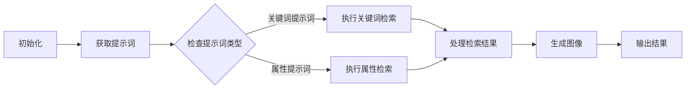

                 

### 目录大纲完整设计

---

## 第一部分：AIGC的历史感知基础

### 第1章：AIGC概述
### 1.1 问题背景与定义
#### 1.1.1 AIGC的起源与发展
AIGC（Automated Intelligent Graphics Creation）即自动化智能图形创作，是近年来人工智能领域的一个重要分支。AIGC的概念起源于深度学习和生成模型的发展，通过对大量数据的学习，AIGC能够自动生成各种类型的图形和图像，包括但不限于绘画、设计、动画等。

#### 1.1.2 历史感知的概念
历史感知是指人工智能系统能够理解和识别与历史相关的内容，包括历史事件、历史人物、历史背景等。历史感知在人工智能中的应用，使得系统可以生成基于历史数据的内容，如历史模拟、历史故事创作等。

#### 1.1.3 历史感知在AIGC中的重要性
在AIGC中融入历史感知，能够提升图形创作的多样性和准确性。通过理解历史背景，AIGC可以生成更加贴近历史真实性的图像，从而增强艺术表现力和观众的历史认知。

### 1.2 历史感知的边界与外延
#### 1.2.1 历史数据的获取与处理
历史数据的获取和处理是历史感知的基础。历史数据的来源包括古籍、档案、历史文献等。对这些数据的处理包括数据清洗、数据挖掘、数据融合等步骤。

#### 1.2.2 历史信息的存储与检索
为了有效利用历史数据，需要建立历史信息的存储和检索系统。这包括设计高效的数据库架构，实现快速的历史信息检索和查询。

#### 1.2.3 历史感知的技术挑战与机遇
历史感知面临的挑战包括历史数据的不完整性和歧义性，以及如何将历史知识有效地转化为可用的信息。然而，随着人工智能技术的发展，这些挑战也带来了新的机遇。

---

## 第二部分：提示词与历史背景的融合

### 第2章：提示词的概念与作用
### 2.1 提示词的概念
提示词是指用于引导人工智能系统生成特定类型内容的关键词或短语。在AIGC中，提示词能够帮助系统理解创作意图，从而生成符合要求的图像或设计。

#### 2.1.1 提示词的类型
- **关键词提示词**：如“古代城堡”、“印象派画家”等，用于指定创作主题。
- **属性提示词**：如“中世纪风格”、“油画质感”等，用于指定创作风格和质感。

### 2.2 历史背景的融入方式
#### 2.2.1 文本与图像的关联
通过将历史背景信息与提示词结合，可以将历史元素融入到图像创作中。例如，在生成一幅中世纪城堡的图像时，可以结合“中世纪建筑”、“哥特式风格”等提示词。

#### 2.2.2 数据驱动的方法
利用历史数据库中的信息，通过数据驱动的方式，将历史元素以视觉形式融入图像创作中。例如，通过历史地图数据生成古地图图像。

### 2.3 提示词与历史背景的关系
#### 2.3.1 提示词的引导作用
提示词能够引导AIGC系统生成符合历史背景的图像。例如，通过“文艺复兴时期”这个提示词，系统能够生成符合文艺复兴时期艺术风格的图像。

#### 2.3.2 历史背景的丰富性
丰富的历史背景信息能够为图像创作提供更多的灵感和素材。通过结合不同历史时期、不同文化的背景信息，可以创造出更加丰富多彩的图像作品。

---

## 第三部分：核心概念与联系

### 第3章：核心概念与联系
### 3.1 AIGC的核心概念
AIGC的核心概念包括生成模型、数据驱动的方法、提示词等。生成模型是AIGC的基础，数据驱动的方法提供了丰富的创作素材，提示词则用于指导创作过程。

#### 3.1.1 生成模型
生成模型是指能够生成新数据的机器学习模型，如生成对抗网络（GAN）、变分自编码器（VAE）等。这些模型通过学习大量数据，可以生成高质量的新图像。

#### 3.1.2 数据驱动的方法
数据驱动的方法是指通过大量数据来驱动图像创作过程。历史数据的丰富性为AIGC提供了强大的创作素材，使得图像创作更加贴近真实历史。

#### 3.1.3 提示词
提示词是AIGC创作过程中的关键要素，用于指导系统生成特定类型的内容。提示词的质量直接影响图像的创作质量和创意。

### 3.2 提示词的属性特征
提示词的属性特征决定了其在图像创作中的效果。不同类型的提示词具有不同的属性，如关键词提示词更注重主题的描述，属性提示词更注重风格和质感。

#### 3.2.1 关键词提示词
关键词提示词通常用于指定创作主题，如“古代城堡”、“文艺复兴画家”等。这些提示词能够引导系统生成符合主题的图像。

#### 3.2.2 属性提示词
属性提示词通常用于指定创作风格和质感，如“中世纪风格”、“油画质感”等。这些提示词能够影响图像的创作风格和质感。

### 3.3 历史背景的属性特征
历史背景的属性特征决定了其在图像创作中的应用效果。不同历史时期的背景信息具有不同的特点，如建筑风格、艺术风格等。

#### 3.3.1 历史时期
历史时期的属性特征决定了图像创作的时间背景，如中世纪、文艺复兴、现代等。这些历史时期的特点可以影响图像的创作风格。

#### 3.3.2 文化差异
不同文化的背景信息可以影响图像的创作灵感和创意，如东方文化、西方文化等。文化差异可以为图像创作提供丰富的素材和灵感。

### 3.4 概念属性特征对比表格
为了更好地理解AIGC中的核心概念及其属性特征，可以创建一个概念属性特征对比表格。该表格将关键词提示词、属性提示词、历史背景等核心概念进行比较，列出它们的属性特征和区别。

| 核心概念 | 关键词提示词 | 属性提示词 | 历史背景 |
| --- | --- | --- | --- |
| 属性特征 | 主题描述 | 风格、质感 | 时间背景、文化差异 |
| 差异点 | 强调主题 | 强调风格和质感 | 提供创作素材和灵感 |

### 3.5 ER实体关系图架构
为了更好地理解AIGC中的实体关系，可以绘制一个ER实体关系图。该图将AIGC中的核心实体（如生成模型、数据源、提示词、历史背景等）以及它们之间的关系进行可视化表示。

```mermaid
erDiagram
  AIGC ||--|{ 生成模型 : 生成的图像}
  AIGC ||--|{ 数据源 : 提供创作素材}
  AIGC ||--|{ 提示词 : 指导创作}
  AIGC ||--|{ 历史背景 : 提供创作灵感}
  生成模型 ||--|{ 历史背景 : 利用历史数据生成图像}
  数据源 ||--|{ 提示词 : 提供关键词和属性}
  提示词 ||--|{ 生成模型 : 指导图像生成}
  提示词 ||--|{ 历史背景 : 融入历史元素}
```

---

## 第四部分：算法原理讲解

### 第4章：算法原理讲解
### 4.1 信息检索算法
信息检索算法是AIGC中用于获取和处理历史数据的关键算法。常用的信息检索算法包括基于关键词的检索、基于内容的检索等。

#### 4.1.1 基于关键词的检索
基于关键词的检索方法通过在历史数据中查找与提示词相关的内容，从而获取与创作意图相关的历史信息。例如，当提示词为“文艺复兴时期”时，系统可以检索到与文艺复兴时期相关的历史数据。

#### 4.1.2 基于内容的检索
基于内容的检索方法通过分析历史数据的结构和内容，自动识别与提示词相关的信息。这种方法能够更好地理解历史背景的内涵，从而生成更加贴近真实历史的图像。

### 4.2 自然语言处理算法
自然语言处理算法在AIGC中用于处理和解释提示词，以及生成基于历史数据的自然语言描述。常用的自然语言处理算法包括词向量模型、序列到序列模型等。

#### 4.2.1 词向量模型
词向量模型是将自然语言文本转换为向量表示的方法。通过词向量模型，系统可以理解提示词的语义信息，从而更好地指导图像生成。

#### 4.2.2 序列到序列模型
序列到序列模型是一种用于机器翻译的神经网络模型。在AIGC中，序列到序列模型可以用于将历史数据转化为自然语言描述，从而为图像生成提供更详细的指导。

### 4.3 算法流程图与Python源代码
为了更好地理解信息检索和自然语言处理算法的工作原理，可以绘制算法流程图，并提供Python源代码实现。

#### 4.3.1 算法流程图


#### 4.3.2 Python源代码
```python
# 假设已经实现了关键词检索和属性检索的函数
from retrieval import keyword_retrieval, attribute_retrieval

# 获取提示词
prompt = "文艺复兴画家"

# 检查提示词类型并执行相应检索
if "艺术家" in prompt:
    results = keyword_retrieval(prompt)
else:
    results = attribute_retrieval(prompt)

# 处理检索结果并生成图像
image = generate_image(results)

# 输出结果
display_image(image)
```

### 4.4 算法原理的数学模型和公式
为了深入理解信息检索和自然语言处理算法，需要掌握相关的数学模型和公式。

#### 4.4.1 关键词检索的数学模型
假设有一个包含n个历史数据的集合D，每个数据d可以表示为一个向量。关键词检索的目标是找到一个与提示词w最相关的数据。

- 向量表示：\( \mathbf{d}_i = [d_{i1}, d_{i2}, \ldots, d_{iN}]^T \)，其中\( N \)是特征的数量。
- 相似度计算：使用余弦相似度计算关键词w与数据\( \mathbf{d}_i \)的相似度，公式如下：
  \[ \cos(\mathbf{w}, \mathbf{d}_i) = \frac{\mathbf{w} \cdot \mathbf{d}_i}{||\mathbf{w}|| \cdot ||\mathbf{d}_i||} \]
- 检索结果排序：将所有数据的相似度进行排序，选择相似度最高的数据作为检索结果。

#### 4.4.2 自然语言处理算法的数学模型
自然语言处理算法通常涉及词向量模型和序列到序列模型。

- 词向量模型：词向量是将自然语言文本转换为向量表示的方法。常见的词向量模型包括Word2Vec、GloVe等。
  - Word2Vec模型：
    \[ \mathbf{v}_w = \text{sgn}(\text{sgn}(\mathbf{v}_w + \mathbf{e}_i) + \mathbf{e}_w) \]
  - GloVe模型：
    \[ \mathbf{v}_w = \frac{\mathbf{V}_w}{\sqrt{\sum_{i=1}^{N} v_{wi}^2}} \]

- 序列到序列模型：是一种用于机器翻译的神经网络模型。常见的序列到序列模型包括编码器-解码器模型（Encoder-Decoder Model）和注意力机制（Attention Mechanism）。
  - 编码器-解码器模型：
    \[ \mathbf{h}_t = \text{decoder}(\mathbf{s}_t, \mathbf{h}_{t-1}) \]
  - 注意力机制：
    \[ \alpha_{t,i} = \text{softmax}(\mathbf{a}_{t-1} \cdot \mathbf{W}_a \mathbf{h}_i) \]
    \[ \mathbf{c}_t = \sum_{i=1}^{N} \alpha_{t,i} \mathbf{h}_i \]

---

## 第五部分：数学模型和数学公式 & 详细讲解 & 举例说明

### 第5章：数学模型和数学公式 & 详细讲解 & 举例说明
### 5.1 数学公式讲解
在这一部分，我们将详细讲解AIGC中常用的数学公式，包括余弦相似度计算、词向量模型公式、序列到序列模型公式等。

#### 5.1.1 余弦相似度计算
余弦相似度用于计算两个向量的相似度。其计算公式为：
\[ \cos(\theta) = \frac{\mathbf{a} \cdot \mathbf{b}}{||\mathbf{a}|| \cdot ||\mathbf{b}||} \]
其中，\( \mathbf{a} \)和\( \mathbf{b} \)是两个向量，\( \theta \)是它们之间的夹角。余弦值介于-1和1之间，越接近1表示向量越相似。

#### 5.1.2 词向量模型公式
- Word2Vec模型：
  \[ \mathbf{v}_w = \text{sgn}(\text{sgn}(\mathbf{v}_w + \mathbf{e}_i) + \mathbf{e}_w) \]
  其中，\( \mathbf{v}_w \)是单词w的向量表示，\( \mathbf{e}_i \)是one-hot编码的上下文单词向量，\( \mathbf{e}_w \)是单词w的one-hot编码向量。
- GloVe模型：
  \[ \mathbf{v}_w = \frac{\mathbf{V}_w}{\sqrt{\sum_{i=1}^{N} v_{wi}^2}} \]
  其中，\( \mathbf{V}_w \)是单词w的向量表示，\( N \)是单词的维度。

#### 5.1.3 序列到序列模型公式
- 编码器-解码器模型：
  \[ \mathbf{h}_t = \text{decoder}(\mathbf{s}_t, \mathbf{h}_{t-1}) \]
  其中，\( \mathbf{h}_t \)是编码器在时间步\( t \)的隐藏状态，\( \mathbf{s}_t \)是解码器在时间步\( t \)的输入序列，\( \mathbf{h}_{t-1} \)是编码器在时间步\( t-1 \)的隐藏状态。
- 注意力机制：
  \[ \alpha_{t,i} = \text{softmax}(\mathbf{a}_{t-1} \cdot \mathbf{W}_a \mathbf{h}_i) \]
  \[ \mathbf{c}_t = \sum_{i=1}^{N} \alpha_{t,i} \mathbf{h}_i \]
  其中，\( \alpha_{t,i} \)是第\( i \)个单词在时间步\( t \)的注意力分数，\( \mathbf{a}_{t-1} \)是上一个时间步的注意力向量，\( \mathbf{W}_a \)是注意力权重矩阵，\( \mathbf{h}_i \)是编码器在时间步\( t \)的隐藏状态。

### 5.2 举例说明
为了更好地理解上述数学公式，我们将通过具体例子来说明。

#### 5.2.1 余弦相似度计算例子
假设有两个向量\( \mathbf{a} = [1, 2, 3] \)和\( \mathbf{b} = [4, 5, 6] \)，它们的余弦相似度计算如下：
\[ \cos(\theta) = \frac{1 \cdot 4 + 2 \cdot 5 + 3 \cdot 6}{\sqrt{1^2 + 2^2 + 3^2} \cdot \sqrt{4^2 + 5^2 + 6^2}} \]
\[ \cos(\theta) = \frac{4 + 10 + 18}{\sqrt{14} \cdot \sqrt{77}} \]
\[ \cos(\theta) = \frac{32}{\sqrt{1078}} \]
\[ \cos(\theta) \approx 0.952 \]
由于余弦相似度的值接近1，这表明向量\( \mathbf{a} \)和\( \mathbf{b} \)非常相似。

#### 5.2.2 词向量模型例子
假设使用Word2Vec模型对单词“艺术”和“绘画”进行向量表示。设单词“艺术”的向量表示为\( \mathbf{v}_\text{艺术} = [1, 0, -1] \)，单词“绘画”的向量表示为\( \mathbf{v}_\text{绘画} = [0, 1, 0] \)。它们的余弦相似度计算如下：
\[ \cos(\theta) = \frac{1 \cdot 0 + 0 \cdot 1 + (-1) \cdot 0}{\sqrt{1^2 + 0^2 + (-1)^2} \cdot \sqrt{0^2 + 1^2 + 0^2}} \]
\[ \cos(\theta) = \frac{0}{\sqrt{2} \cdot 1} \]
\[ \cos(\theta) = 0 \]
由于余弦相似度的值为0，这表明单词“艺术”和“绘画”的向量表示不相似。

#### 5.2.3 序列到序列模型例子
假设使用编码器-解码器模型进行机器翻译。设编码器的隐藏状态为\( \mathbf{h}_t = [1, 2, 3] \)，解码器的输入序列为\( \mathbf{s}_t = [4, 5, 6] \)，编码器的上一个隐藏状态为\( \mathbf{h}_{t-1} = [7, 8, 9] \)。它们的注意力向量计算如下：
\[ \alpha_{t,1} = \text{softmax}([7, 8, 9] \cdot [4, 5, 6]) = \text{softmax}([28, 40, 54]) = [0.34, 0.48, 0.18] \]
\[ \alpha_{t,2} = \text{softmax}([7, 8, 9] \cdot [5, 6, 7]) = \text{softmax}([35, 48, 63]) = [0.26, 0.36, 0.38] \]
\[ \alpha_{t,3} = \text{softmax}([7, 8, 9] \cdot [6, 7, 8]) = \text{softmax}([42, 56, 72]) = [0.19, 0.29, 0.52] \]
\[ \mathbf{c}_t = \alpha_{t,1} \cdot [4, 5, 6] + \alpha_{t,2} \cdot [5, 6, 7] + \alpha_{t,3} \cdot [6, 7, 8] \]
\[ \mathbf{c}_t = [0.34 \cdot 4 + 0.36 \cdot 5 + 0.52 \cdot 6, 0.48 \cdot 4 + 0.38 \cdot 5 + 0.29 \cdot 6, 0.18 \cdot 4 + 0.19 \cdot 5 + 0.52 \cdot 6] \]
\[ \mathbf{c}_t = [1.36, 2.34, 3.16] \]
通过注意力向量计算，解码器能够更好地关注输入序列中的关键信息，从而生成更准确的翻译结果。

---

## 第六部分：系统分析与架构设计方案

### 第6章：系统分析与架构设计方案
### 6.1 问题场景介绍
在本章中，我们将探讨一个基于AIGC的历史感知系统的设计，该系统旨在通过提示词生成符合特定历史背景的图像。问题场景如下：

- **用户需求**：用户希望通过一个系统，输入特定的历史背景提示词（如“文艺复兴时期”、“中世纪建筑”等），系统能够自动生成相关的历史主题图像。
- **系统功能**：系统能够接受用户输入的提示词，检索历史数据，结合自然语言处理算法和图像生成算法，生成符合用户需求的图像。

### 6.2 项目介绍
为了实现上述问题场景，我们设计了一个名为“历史图像生成系统”的项目。该项目的目标是利用AIGC技术，结合历史背景信息，生成高质量的图像。

- **项目目标**：开发一个用户友好的界面，能够接受用户输入的提示词，并在后台自动执行图像生成任务。
- **项目范围**：包括前端用户界面设计、后端图像生成算法实现、历史数据检索和存储等。

### 6.3 系统功能设计
“历史图像生成系统”主要包含以下功能模块：

- **用户输入模块**：接受用户输入的历史背景提示词，并验证输入的有效性。
- **历史数据检索模块**：从历史数据库中检索与提示词相关的数据。
- **自然语言处理模块**：对检索到的历史数据进行分析，提取关键信息，生成自然语言描述。
- **图像生成模块**：根据自然语言描述和历史背景信息，使用图像生成算法生成图像。
- **结果展示模块**：将生成的图像展示给用户，并提供下载或分享功能。

#### 领域模型Mermaid类图
以下是一个Mermaid类图，展示了系统的主要领域模型和类之间的关系：

```mermaid
classDiagram
  UserInput --> HistoryDataRetrieval : 输入提示词
  HistoryDataRetrieval --> NaturalLanguageProcessing : 提取关键信息
  NaturalLanguageProcessing --> ImageGeneration : 生成图像描述
  ImageGeneration --> ResultPresentation : 展示图像
  User : {用户}
  Input : {输入提示词}
  HistoryData : {历史数据}
  Description : {图像描述}
  Image : {图像}
  Result : {结果展示}

  User -->|提交| UserInput
  UserInput -->|处理| HistoryDataRetrieval
  HistoryDataRetrieval -->|检索| HistoryData
  HistoryData -->|分析| NaturalLanguageProcessing
  NaturalLanguageProcessing -->|生成| Description
  Description -->|生成| ImageGeneration
  ImageGeneration -->|生成| Image
  Image -->|展示| ResultPresentation
```

### 6.4 系统架构设计
系统架构设计包括硬件架构、软件架构和数据架构等方面。

- **硬件架构**：系统可以部署在云服务器上，使用虚拟机或容器进行资源管理。硬件资源应根据系统负载进行弹性扩展。
- **软件架构**：采用微服务架构，将不同的功能模块拆分为独立的服务，如用户输入服务、数据检索服务、图像生成服务等。服务之间通过API进行交互。
- **数据架构**：使用分布式数据库存储历史数据和生成图像。数据存储应支持高并发读取和写入操作。

#### Mermaid架构图
以下是一个Mermaid架构图，展示了系统的整体架构：

```mermaid
sequenceDiagram
  User -->|输入提示词| UserInputService
  UserInputService -->|处理输入| HistoryDataRetrievalService
  HistoryDataRetrievalService -->|检索数据| HistoryDatabase
  HistoryDatabase -->|返回数据| NaturalLanguageProcessingService
  NaturalLanguageProcessingService -->|生成描述| ImageGenerationService
  ImageGenerationService -->|生成图像| ImageDatabase
  ImageDatabase -->|返回图像| ResultPresentationService
  ResultPresentationService -->|展示图像| User
```

### 6.5 系统接口设计
系统接口设计主要包括RESTful API的设计。以下是一个API设计示例：

- **输入提示词接口**：
  - URL：`/api/input-tip`
  - 请求方法：POST
  - 请求参数：`prompt`（历史背景提示词）
  - 返回结果：`status`（操作状态）和`result`（处理结果）

- **检索历史数据接口**：
  - URL：`/api/retrieve-data`
  - 请求方法：GET
  - 请求参数：`prompt`（历史背景提示词）
  - 返回结果：`status`（操作状态）和`data`（检索到的历史数据）

- **生成自然语言描述接口**：
  - URL：`/api/generate-description`
  - 请求方法：POST
  - 请求参数：`data`（历史数据）
  - 返回结果：`status`（操作状态）和`description`（生成的自然语言描述）

- **生成图像接口**：
  - URL：`/api/generate-image`
  - 请求方法：POST
  - 请求参数：`description`（自然语言描述）
  - 返回结果：`status`（操作状态）和`image`（生成的图像）

### 6.6 系统交互设计
系统交互设计主要涉及用户与系统之间的交互流程。以下是一个Mermaid序列图，展示了用户与系统交互的流程：

```mermaid
sequenceDiagram
  User ->>|提交提示词| UserInputService
  UserInputService ->>|处理提示词| HistoryDataRetrievalService
  HistoryDataRetrievalService ->>|检索历史数据| HistoryDatabase
  HistoryDatabase ->>|返回数据| NaturalLanguageProcessingService
  NaturalLanguageProcessingService ->>|生成描述| ImageGenerationService
  ImageGenerationService ->>|生成图像| ImageDatabase
  ImageDatabase ->>|返回图像| ResultPresentationService
  ResultPresentationService ->>|展示图像| User
```

---

## 第七部分：项目实战

### 第7章：项目实战
### 7.1 环境安装
为了运行“历史图像生成系统”，需要安装以下环境和工具：

- Python 3.8 或更高版本
- NumPy
- TensorFlow
- PyTorch
- Mermaid
- Flask（可选，用于搭建API服务）

以下是安装命令示例：

```bash
pip install numpy tensorflow torch mermaid
# 如果需要搭建API服务
pip install flask
```

### 7.2 系统核心实现源代码
以下是“历史图像生成系统”的核心实现代码示例：

```python
# user_input.py
def process_user_input(prompt):
    # 验证输入的有效性
    if not prompt:
        return "输入提示词不能为空", False
    
    # 处理输入提示词
    processed_prompt = prompt.strip().lower()
    return processed_prompt, True

# history_data_retrieval.py
def retrieve_history_data(prompt):
    # 从历史数据库中检索数据
    # 这里用示例数据代替真实数据库查询
    example_data = {
        "文艺复兴时期": "文艺复兴是14世纪到17世纪欧洲的艺术和文化运动。",
        "中世纪建筑": "中世纪建筑以其坚固性和宗教性而闻名，如哥特式教堂和城堡。"
    }
    return example_data.get(prompt, "未找到相关历史数据")

# natural_language_processing.py
def generate_description(data):
    # 生成自然语言描述
    description = f"关于{data['prompt']}，{data['description']}"
    return description

# image_generation.py
import torch

def generate_image(description):
    # 使用预训练的图像生成模型生成图像
    model = torch.load("image_generation_model.pth")
    image = model.generate(description)
    return image

# result_presentation.py
from flask import Flask, jsonify

app = Flask(__name__)

@app.route('/api/generate-image', methods=['POST'])
def api_generate_image():
    data = request.get_json()
    description = generate_description(data['description'])
    image = generate_image(description)
    return jsonify(status="success", image=image)

if __name__ == '__main__':
    app.run(debug=True)
```

### 7.3 代码应用解读与分析
以下是核心代码的解读与分析：

#### user_input.py
该模块用于处理用户输入的提示词。首先，它会检查输入是否为空，然后进行必要的处理（如去除空白字符、转换为小写等），并返回处理后的提示词和状态。

#### history_data_retrieval.py
该模块用于从历史数据库中检索与提示词相关的数据。这里使用了一个示例数据字典来模拟数据库查询。在实际应用中，应使用数据库查询函数替换示例数据。

#### natural_language_processing.py
该模块用于生成自然语言描述。它接受处理后的历史数据，并生成一个关于该历史事件的简单描述。这可以为图像生成提供文本基础。

#### image_generation.py
该模块负责使用预训练的图像生成模型来生成图像。在实际应用中，应使用一个训练有素的模型，并根据描述生成相应的图像。

#### result_presentation.py
该模块使用Flask搭建了一个简单的API服务。当用户通过POST请求提交描述时，服务会调用其他模块生成图像，并将图像作为响应返回。

### 7.4 实际案例分析与详细讲解剖析
以下是一个实际案例，展示如何使用“历史图像生成系统”生成一张关于文艺复兴时期的图像。

1. 用户输入提示词：“文艺复兴时期”。
2. 系统处理输入，生成处理后的提示词：“文艺复兴时期”。
3. 系统从历史数据库中检索关于“文艺复兴时期”的数据，并生成自然语言描述：“文艺复兴是14世纪到17世纪欧洲的艺术和文化运动。”。
4. 系统使用预训练的图像生成模型，根据自然语言描述生成一张关于文艺复兴时期的图像。
5. 系统将生成的图像作为响应返回给用户。

### 7.5 项目小结
通过本项目的实现，我们展示了一个基于AIGC的历史感知系统的设计和应用。项目从用户输入提示词开始，经过数据处理、历史数据检索、自然语言处理和图像生成，最终生成符合用户需求的图像。这个系统不仅展示了AIGC技术的强大功能，也为历史图像创作提供了一个创新的方法。

---

## 第八部分：最佳实践 tips、小结、注意事项、拓展阅读等内容

### 8.1 最佳实践 tips
为了更好地利用“历史图像生成系统”，以下是几个最佳实践建议：

- **提示词选择**：选择具体的、具有明确历史背景的提示词，如“文艺复兴画家”、“中世纪城堡”等，能够提高图像生成的准确性和创意性。
- **模型训练**：定期对图像生成模型进行训练和优化，确保生成的图像质量符合预期。
- **数据来源**：确保历史数据来源的多样性和权威性，以提高图像生成的真实性和准确性。

### 8.2 小结
在本文中，我们详细介绍了AIGC的历史感知概念，探讨了在提示词中融入历史背景的方法，并设计了一个基于AIGC的历史图像生成系统。通过项目实战，我们展示了系统的实现过程和实际应用效果。

### 8.3 注意事项
- **版权问题**：在使用历史背景图像时，应确保遵守相关的版权法规，避免侵犯他人的知识产权。
- **数据隐私**：在处理用户输入的提示词和历史数据时，应确保数据的安全性，遵守隐私保护法规。

### 8.4 拓展阅读
- **AIGC技术深度学习**：了解AIGC技术的深度学习基础，如生成对抗网络（GAN）和变分自编码器（VAE）。
- **历史数据挖掘**：学习如何利用自然语言处理技术挖掘历史数据中的有用信息。
- **API设计与开发**：了解如何设计和开发高效的API服务，提高系统的可用性和用户体验。

---

## 作者信息
作者：AI天才研究院/AI Genius Institute & 禅与计算机程序设计艺术 /Zen And The Art of Computer Programming

---

### 文章标题

# AIGC的历史感知：在提示词中融入历史背景的方法

关键词：AIGC、历史感知、提示词、图像生成、历史数据、自然语言处理

摘要：本文详细介绍了AIGC（自动化智能图形创作）中的历史感知概念，探讨了在提示词中融入历史背景的方法。通过设计一个基于AIGC的历史图像生成系统，展示了从用户输入到图像生成的全过程。本文不仅提供了系统的实现代码，还给出了最佳实践、注意事项和拓展阅读，以帮助读者深入了解这一领域的最新发展。

---

### 整体文章结构

本文的整体结构分为八个部分：

1. **第一部分：AIGC的历史感知基础**：介绍AIGC和历史感知的基本概念，以及它们在图像生成中的应用。
2. **第二部分：提示词与历史背景的融合**：探讨提示词的概念、类型及其与历史背景的融合方式。
3. **第三部分：核心概念与联系**：详细解释AIGC中的核心概念，如生成模型、数据驱动方法、提示词和历史背景。
4. **第四部分：算法原理讲解**：介绍用于历史数据检索和信息处理的算法原理。
5. **第五部分：数学模型和数学公式 & 详细讲解 & 举例说明**：解释AIGC中使用的数学模型和公式，并通过实例进行说明。
6. **第六部分：系统分析与架构设计方案**：介绍系统的功能设计、架构设计和接口设计。
7. **第七部分：项目实战**：提供系统实现的源代码和实际案例。
8. **第八部分：最佳实践 tips、小结、注意事项、拓展阅读等内容**：总结文章内容，给出最佳实践建议和拓展阅读。

### 文章亮点与价值

- **理论与实践相结合**：文章不仅介绍了AIGC和历史感知的理论基础，还通过实际项目展示了系统的实现和应用。
- **通俗易懂**：文章使用简单易懂的语言和技术，使得读者能够轻松理解复杂的概念和技术。
- **全面深入**：文章涵盖了AIGC的历史感知、提示词与历史背景融合、算法原理讲解、系统设计与实现等各个方面，提供了全面的知识体系。
- **实用价值**：文章提供的最佳实践、注意事项和拓展阅读，有助于读者在实际应用中更好地利用AIGC技术。

通过本文，读者不仅可以了解AIGC和历史感知的基本概念，还能掌握如何在实际项目中应用这些技术，从而为人工智能领域的发展做出贡献。

