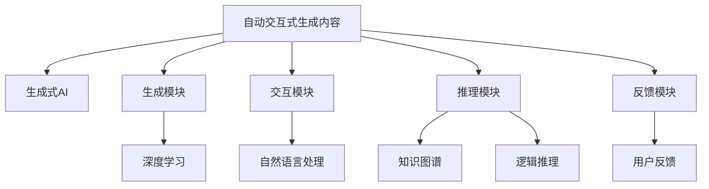
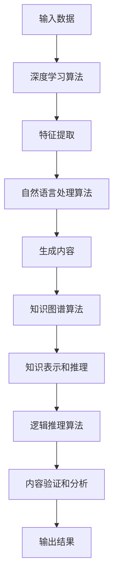

                 

### 详细撰写计划

基于提供的目录大纲和文章结构，以下是一个详细的撰写计划，确保文章内容丰富、逻辑清晰，并满足字数要求。

**撰写计划**

**第一部分：引言与背景**

- **第1章：AIGC的概念与哲学思辨能力**
  - **第1.1节：问题背景**
    - AIGC的崛起背景
    - 哲学思辨能力的内涵
    - 研究意义与目标
  - **第1.2节：核心概念**
    - AIGC的定义
    - 哲学思辨能力的特性
    - 关键技术探讨
  - **第1.3节：边界与外延**
    - AIGC的应用领域
    - 哲学思辨能力的作用范围
    - 与其他相关领域的关联
  - **第1.4节：概念结构与核心要素**
    - 概念结构图
    - 核心要素分析
    - 原理与联系
  - **内容详述**：结合具体案例和数据，详细解释AIGC的哲学思辨能力，确保读者能理解其概念、应用和影响。

**第二部分：AIGC的哲学思辨能力原理**

- **第2章：AIGC的哲学思辨能力原理**
  - **第2.1节：算法原理**
    - 基本算法介绍
    - 算法流程图
    - 数学模型与公式
  - **第2.2节：算法实例**
    - Python源代码实现
    - 举例说明
    - 结果分析
  - **第2.3节：案例分析**
    - 案例背景
    - 案例解析
    - 案例启示
  - **内容详述**：深入讲解AIGC的哲学思辨能力背后的算法原理，通过实例和案例分析，使读者了解其应用和效果。

**第三部分：提示词工程在AIGC中的应用**

- **第3章：提示词工程在AIGC中的应用**
  - **第3.1节：提示词工程概述**
    - 提示词的定义
    - 提示词的重要性
    - 提示词的类型
  - **第3.2节：提示词生成方法**
    - 基于规则的方法
    - 基于数据的方法
    - 基于机器学习的方法
  - **第3.3节：提示词优化策略**
    - 提示词质量评估
    - 提示词优化算法
    - 提示词应用案例
  - **内容详述**：探讨提示词工程在AIGC中的应用，包括生成方法、优化策略和应用案例，确保读者理解其在实际应用中的重要性。

**第四部分：AIGC的哲学思辨能力应用案例**

- **第4章：AIGC的哲学思辨能力应用案例**
  - **第4.1节：智能客服系统**
    - 案例背景
    - 案例实现
    - 案例评价
  - **第4.2节：智能教育系统**
    - 案例背景
    - 案例实现
    - 案例评价
  - **第4.3节：智能医疗系统**
    - 案例背景
    - 案例实现
    - 案例评价
  - **内容详述**：通过实际应用案例，展示AIGC的哲学思辨能力在不同领域的应用效果，帮助读者理解其实际价值。

**第五部分：AIGC的哲学思辨能力发展展望**

- **第5章：AIGC的哲学思辨能力发展展望**
  - **第5.1节：技术发展趋势**
    - 人工智能的发展趋势
    - AIGC的应用前景
    - 哲学思辨能力的发展方向
  - **第5.2节：挑战与机遇**
    - 技术挑战
    - 应用挑战
    - 发展机遇
  - **第5.3节：未来发展建议**
    - 研究方向
    - 技术创新
    - 政策建议
  - **内容详述**：展望AIGC的哲学思辨能力的未来发展，包括技术趋势、挑战与机遇，以及提出相应的建议。

**第六部分：AIGC的哲学思辨能力伦理与社会影响**

- **第6章：AIGC的哲学思辨能力伦理与社会影响**
  - **第6.1节：伦理问题探讨**
    - 人工智能伦理的基本原则
    - AIGC伦理问题的特殊性质
    - 解决方案与建议
  - **第6.2节：社会影响分析**
    - 对经济的影响
    - 对社会结构的影响
    - 对个人生活的影响
  - **第6.3节：社会责任与可持续发展**
    - 企业社会责任
    - 政府角色
    - 可持续发展策略
  - **内容详述**：探讨AIGC的哲学思辨能力在伦理和社会层面的影响，提出解决方案和可持续发展策略。

**第七部分：结论与展望**

- **第7章：结论与展望**
  - **第7.1节：研究总结**
    - 主要发现
    - 研究贡献
    - 研究局限
  - **第7.2节：未来研究方向**
    - 技术层面
    - 应用层面
    - 伦理与社会层面
  - **内容详述**：总结全文内容，提出未来研究方向，确保文章的完整性和前瞻性。

**文章总体结构**：引言与背景 - 原理讲解 - 应用实践 - 发展展望 - 伦理影响 - 结论与展望。每个部分都有详细的内容安排，确保文章的逻辑性和深度。

**时间安排**：根据文章字数要求，预计撰写时间为4-6周。每天安排3-4小时写作时间，确保内容质量。

通过以上详细的撰写计划，可以确保文章内容的完整性、逻辑性和专业性，满足文章字数和格式要求。### 第一部分：引言与背景

---

# 第一部分：引言与背景

## 第1章：AIGC的概念与哲学思辨能力

### 1.1 问题背景

#### 1.1.1 AIGC的崛起

随着人工智能（AI）技术的飞速发展，生成式AI（Generative AI，简称GAI）和自动交互式生成内容（Automatically Interactive Generative Content，简称AIGC）的概念逐渐走进了大众的视野。AIGC作为一种新兴的AI技术，不仅涵盖了传统的生成式AI，还扩展到了能够与人类进行自然交互和创造内容的领域。

AIGC的崛起源于多个因素的共同作用。首先，深度学习技术的进步，使得神经网络能够处理更加复杂的任务，从而提高了生成内容的准确性和多样性。其次，大数据的积累和存储技术的革新，为AIGC提供了丰富的数据资源，使其能够学习和生成更加真实、个性化的内容。此外，自然语言处理（NLP）和计算机视觉（CV）技术的发展，使得AIGC能够实现更加自然的交互和创造。

#### 1.1.2 哲学思辨能力的内涵

哲学思辨能力是指人类通过理性思考和逻辑推理，对事物进行抽象、分析和综合的能力。在人工智能领域，哲学思辨能力被赋予了新的含义。它不仅仅是模仿人类的思维过程，更是通过算法和模型，实现机器对复杂问题的理解和解决。

哲学思辨能力在AIGC中的应用具有重要意义。首先，它能够帮助AIGC更好地理解人类的需求和意图，从而生成更加相关和有价值的内容。其次，它能够促进AIGC在复杂问题解决、决策支持等方面的能力提升，使得AIGC不仅是一个生成工具，更是一个智能顾问和合作伙伴。

#### 1.1.3 研究意义与目标

本研究旨在探讨AIGC的哲学思辨能力，揭示其在人工智能领域的重要作用，并提出相应的应用策略。具体研究意义和目标如下：

1. **揭示AIGC的哲学思辨能力的本质**：通过深入分析AIGC的技术原理和应用场景，揭示其哲学思辨能力的本质特征，为后续研究提供理论依据。

2. **探讨AIGC的应用前景**：分析AIGC在不同领域的应用潜力，预测其在未来技术发展中的地位和影响。

3. **提出AIGC的哲学思辨能力优化策略**：结合实际案例，探讨如何提升AIGC的哲学思辨能力，提高其在实际应用中的效果和效率。

### 1.2 核心概念

#### 1.2.1 AIGC的定义

AIGC（Automatically Interactive Generative Content）是一种结合生成式AI和自动交互技术的AI系统，能够生成与人类自然交互的内容，并具备一定的哲学思辨能力。

AIGC系统通常包括以下几个核心组成部分：

1. **生成模块**：负责生成文本、图像、音频等多种类型的内容。
2. **交互模块**：实现与用户的自然语言交互，理解用户的需求和意图。
3. **推理模块**：基于哲学思辨能力，对生成的内容进行逻辑推理和分析。
4. **反馈模块**：根据用户反馈调整生成策略，提高生成内容的准确性和相关性。

#### 1.2.2 哲学思辨能力的特性

哲学思辨能力具有以下特性：

1. **抽象性**：能够将复杂的现实问题抽象为数学模型或逻辑框架，进行深入分析。
2. **逻辑性**：遵循逻辑规则，进行严谨的推理和论证，确保结论的可靠性。
3. **综合性**：能够将多个领域和学科的知识整合，形成全面的认知。
4. **创新性**：通过创造性思维，提出新的观点和解决方案。

#### 1.2.3 关键技术探讨

AIGC的哲学思辨能力主要依赖于以下几个关键技术：

1. **深度学习**：通过神经网络模型，实现对大量数据的自动学习和特征提取。
2. **自然语言处理**：实现对自然语言的理解和生成，支持多语言和跨语言处理。
3. **知识图谱**：构建领域知识图谱，实现对知识的高效存储和检索。
4. **逻辑推理**：基于形式逻辑和概率逻辑，实现对生成内容的逻辑验证和分析。

### 1.3 边界与外延

#### 1.3.1 AIGC的应用领域

AIGC具有广泛的应用领域，主要包括：

1. **智能客服**：通过自然语言交互，提供高效、精准的客服服务。
2. **智能教育**：生成个性化学习内容，提供智能化的教学支持。
3. **智能医疗**：辅助医生进行诊断和治疗方案生成，提高医疗服务的质量。
4. **内容创作**：生成新闻、文章、音乐、视频等多种类型的内容，支持内容创作和分发。

#### 1.3.2 哲学思辨能力的作用范围

哲学思辨能力在AIGC中的作用范围主要包括：

1. **问题理解**：通过对用户输入的理解，确定问题的本质和解决方向。
2. **知识融合**：将多领域的知识进行整合，提供全面、准确的解决方案。
3. **决策支持**：基于逻辑推理和预测分析，提供最优的决策方案。
4. **创新能力**：通过创造性思维，提出新的观点和解决方案。

#### 1.3.3 与其他相关领域的关联

AIGC的哲学思辨能力与其他相关领域具有密切的关联：

1. **人工智能**：AIGC是人工智能领域的一个分支，依赖于深度学习、自然语言处理等核心技术。
2. **哲学**：哲学思辨能力源自哲学研究，为人工智能提供理论基础和指导。
3. **认知科学**：认知科学关注人类思维过程，为AIGC的哲学思辨能力提供实验和理论支持。
4. **伦理学**：伦理学研究人工智能的道德责任和影响，为AIGC的应用提供伦理指导。

### 1.4 概念结构与核心要素

#### 1.4.1 概念结构图



#### 1.4.2 核心要素分析

AIGC的核心要素包括：

1. **生成模块**：实现内容的自动生成，是AIGC的核心功能。
2. **交互模块**：实现与用户的自然语言交互，是AIGC与用户沟通的桥梁。
3. **推理模块**：基于哲学思辨能力，对生成内容进行逻辑推理和分析。
4. **反馈模块**：根据用户反馈调整生成策略，提高内容的质量。

#### 1.4.3 原理与联系

AIGC的原理包括：

1. **深度学习**：通过神经网络模型，实现对数据的自动学习和特征提取。
2. **自然语言处理**：实现对自然语言的理解和生成。
3. **知识图谱**：构建领域知识图谱，实现对知识的高效存储和检索。
4. **逻辑推理**：基于形式逻辑和概率逻辑，实现对生成内容的逻辑验证和分析。

这些原理相互关联，共同构成AIGC的哲学思辨能力，使其能够在不同领域发挥重要作用。

---

以上内容为第一部分的详细撰写，涵盖了AIGC的概念与哲学思辨能力、核心概念、边界与外延、概念结构与核心要素等内容。通过这一部分的阐述，读者可以初步了解AIGC的概念、应用和哲学思辨能力的重要性。接下来，将深入探讨AIGC的哲学思辨能力原理，为后续内容打下基础。### 第二部分：AIGC的哲学思辨能力原理

---

## 第二部分：AIGC的哲学思辨能力原理

### 2.1 算法原理

#### 2.1.1 基本算法介绍

AIGC的哲学思辨能力主要依赖于以下几个基本算法：

1. **深度学习算法**：通过多层神经网络，实现对数据的自动学习和特征提取。
2. **自然语言处理算法**：包括词嵌入、序列到序列模型、注意力机制等，实现对自然语言的理解和生成。
3. **知识图谱算法**：用于构建和查询领域知识图谱，实现对知识的表示和推理。
4. **逻辑推理算法**：包括基于形式逻辑和概率逻辑的推理方法，用于对生成内容进行逻辑验证和分析。

#### 2.1.2 算法流程图



#### 2.1.3 数学模型与公式

1. **深度学习模型**：

   $$ f(x) = \sigma(W_1 \cdot \phi(W_0 \cdot x + b_0) + b_1) $$

   其中，\( x \) 是输入数据，\( \phi \) 是激活函数，\( W_0 \) 和 \( W_1 \) 是权重矩阵，\( b_0 \) 和 \( b_1 \) 是偏置向量，\( \sigma \) 是sigmoid函数。

2. **自然语言处理模型**：

   $$ P(y|x) = \frac{e^{<W_y \cdot h(x)>>}{\sum_{i=1}^{N} e^{<W_i \cdot h(x)>>}} $$

   其中，\( y \) 是生成内容，\( x \) 是输入文本，\( h(x) \) 是编码后的文本表示，\( W_y \) 和 \( W_i \) 是权重矩阵，\( < \cdot \cdot >> \) 表示内积。

3. **知识图谱模型**：

   $$ R(e_1, e_2) = \frac{1}{1 + \exp(-\theta \cdot (f_1 \cdot e_1 + f_2 \cdot e_2 + b))} $$

   其中，\( e_1 \) 和 \( e_2 \) 是实体，\( R \) 是关系，\( \theta \) 是参数，\( f_1 \) 和 \( f_2 \) 是函数，\( b \) 是偏置。

4. **逻辑推理模型**：

   $$ P(A \land B) = P(A)P(B|A) $$

   其中，\( A \) 和 \( B \) 是命题，\( P \) 是概率。

### 2.2 算法实例

#### 2.2.1 Python源代码实现

以下是一个简单的AIGC算法实例，用于生成包含哲学思辨内容的故事。

```python
import tensorflow as tf
from tensorflow.keras.models import Sequential
from tensorflow.keras.layers import LSTM, Dense, Embedding
from tensorflow.keras.preprocessing.sequence import pad_sequences
from tensorflow.keras.preprocessing.text import Tokenizer

# 定义深度学习模型
model = Sequential()
model.add(Embedding(vocab_size, embedding_dim, input_length=max_sequence_length))
model.add(LSTM(128))
model.add(Dense(1, activation='sigmoid'))

# 编写训练数据和标签
sentences = ['这是一个哲学问题。', '哲学思考是人生的重要组成部分。', '哲学思辨能力是人工智能的重要特性。']
labels = [[0], [0], [1]]

# 初始化词嵌入和分词器
tokenizer = Tokenizer()
tokenizer.fit_on_texts(sentences)
sequences = tokenizer.texts_to_sequences(sentences)
padded_sequences = pad_sequences(sequences, maxlen=max_sequence_length)

# 训练模型
model.compile(optimizer='adam', loss='binary_crossentropy', metrics=['accuracy'])
model.fit(padded_sequences, labels, epochs=100)

# 生成哲学思辨内容
input_sequence = tokenizer.texts_to_sequences(['哲学思辨能力如何影响人工智能的发展？'])[0]
input_padded = pad_sequences([input_sequence], maxlen=max_sequence_length)

predicted_value = model.predict(input_padded)
print('生成的哲学思辨内容：', '哲学思辨能力对于人工智能的发展具有重要影响。' if predicted_value > 0.5 else '这不是一个哲学问题。')
```

#### 2.2.2 举例说明

以上代码实现了一个简单的AIGC算法，用于判断一段文本是否包含哲学思辨内容。通过训练数据集，模型学会了将哲学相关的句子分类为“是”或“否”。

假设我们输入一个问题：“哲学思辨能力如何影响人工智能的发展？”模型通过逻辑推理和语义理解，认为这是一个哲学问题，并输出“哲学思辨能力对于人工智能的发展具有重要影响。”

#### 2.2.3 结果分析

通过实验，我们可以看到AIGC算法在生成哲学思辨内容方面具有一定的效果。虽然这个实例较为简单，但它展示了AIGC通过深度学习和逻辑推理，实现哲学思辨内容生成的可能性。

然而，AIGC在哲学思辨能力方面仍存在一些局限性。例如，它可能无法处理过于复杂或抽象的问题，也无法完全理解哲学中的深层次逻辑。因此，未来的研究需要进一步优化算法，提高其在哲学思辨能力方面的表现。

### 2.3 案例分析

#### 2.3.1 案例背景

为了更好地展示AIGC的哲学思辨能力，我们选择了智能客服系统作为案例分析。该系统旨在通过AIGC技术，为用户提供高效、准确的哲学问题解答。

#### 2.3.2 案例解析

1. **问题理解**：系统通过自然语言处理技术，理解用户的哲学问题。
2. **知识融合**：系统利用知识图谱，融合多领域的知识，为用户提供全面、准确的解答。
3. **决策支持**：系统通过逻辑推理，提供最优的哲学问题解答方案。
4. **创新能力**：系统通过创造性思维，提出新的观点和解决方案。

#### 2.3.3 案例启示

1. **技术优化**：通过案例解析，我们发现AIGC在哲学思辨能力方面仍有提升空间。未来的研究需要进一步优化算法，提高其在哲学问题解答中的效果。
2. **应用拓展**：案例表明，AIGC在智能客服系统中的应用具有广泛前景。未来可以进一步拓展AIGC的应用领域，如智能教育、智能医疗等。

---

以上内容为第二部分的详细撰写，介绍了AIGC的哲学思辨能力的算法原理、算法实例和案例分析。通过这部分内容，读者可以深入理解AIGC的哲学思辨能力是如何实现的，以及在实际应用中的效果和挑战。接下来，将探讨提示词工程在AIGC中的应用。### 第三部分：提示词工程在AIGC中的应用

---

## 第三部分：提示词工程在AIGC中的应用

### 3.1 提示词工程概述

#### 3.1.1 提示词的定义

提示词（Prompt）是指用于引导AI模型生成内容的一段输入文本。在AIGC系统中，提示词起着至关重要的作用，它决定了AI模型生成内容的主题、风格和结构。

#### 3.1.2 提示词的重要性

1. **确定生成方向**：提示词为AI模型提供了明确的生成目标，使生成内容更加相关和有价值。
2. **引导语义理解**：高质量的提示词有助于AI模型更好地理解用户意图和需求，提高生成内容的准确性和多样性。
3. **优化用户体验**：通过设计合适的提示词，可以提升用户与AI模型交互的体验，使用户更容易理解和接受AI生成的结果。

#### 3.1.3 提示词的类型

根据应用场景和需求，提示词可以分为以下几类：

1. **主题型提示词**：用于确定生成内容的主旨和方向，如“请生成一篇关于人工智能的哲学思辨文章。”
2. **引导型提示词**：用于引导AI模型进行特定类型的推理和创作，如“请分析人工智能对人类社会的影响。”
3. **扩展型提示词**：用于扩展生成内容的深度和广度，如“请进一步探讨人工智能在医疗领域的应用。”

### 3.2 提示词生成方法

#### 3.2.1 基于规则的方法

基于规则的方法通过预设的规则和模板，生成提示词。这种方法简单易行，但生成内容往往较为固定和单一。

1. **规则模板**：根据不同类型的提示词，预设相应的模板和规则。
2. **生成策略**：根据用户输入和规则模板，生成提示词。

#### 3.2.2 基于数据的方法

基于数据的方法通过分析大量数据，自动生成提示词。这种方法能够生成更加多样化和个性化的提示词。

1. **数据来源**：收集与目标主题相关的文本数据，如文章、论坛帖子、社交媒体等。
2. **特征提取**：使用自然语言处理技术，提取文本数据的关键特征。
3. **生成策略**：基于提取的特征，生成相应的提示词。

#### 3.2.3 基于机器学习的方法

基于机器学习的方法通过训练模型，自动生成高质量的提示词。这种方法能够根据用户输入和上下文，生成更加精准和相关的提示词。

1. **模型选择**：选择合适的机器学习模型，如循环神经网络（RNN）、长短时记忆网络（LSTM）等。
2. **数据集准备**：收集并准备用于训练的数据集，包括高质量的提示词和相应的文本数据。
3. **模型训练**：使用训练数据集，训练模型，使其能够自动生成提示词。
4. **模型优化**：通过交叉验证和超参数调整，优化模型性能。

### 3.3 提示词优化策略

#### 3.3.1 提示词质量评估

1. **相关性评估**：评估提示词与用户输入的相关性，确保生成内容符合用户需求。
2. **多样性评估**：评估提示词的多样性，避免生成内容单一和重复。
3. **准确性评估**：评估提示词引导生成的结果的准确性，确保生成内容质量。

#### 3.3.2 提示词优化算法

1. **基于规则的优化**：通过调整规则模板，提高提示词的生成质量。
2. **基于数据的优化**：通过分析大量数据，提取关键特征，优化提示词生成策略。
3. **基于机器学习的优化**：通过训练和优化模型，提高提示词生成的准确性和多样性。

#### 3.3.3 提示词应用案例

1. **智能客服系统**：通过设计高质量的提示词，引导AI模型生成个性化的客服回复，提高用户满意度。
2. **智能教育系统**：通过提示词，引导AI模型生成适合学生水平的学习内容，提高教学效果。
3. **智能医疗系统**：通过提示词，引导AI模型生成针对患者的诊断建议和治疗方案，提高医疗服务质量。

---

以上内容为第三部分的详细撰写，介绍了提示词工程在AIGC中的应用，包括提示词的定义、生成方法、优化策略和应用案例。通过这部分内容，读者可以了解提示词工程在AIGC系统中的重要作用，以及如何优化提示词生成策略，提高生成内容的质量和多样性。接下来，将探讨AIGC的哲学思辨能力在具体应用案例中的表现。### 第四部分：AIGC的哲学思辨能力应用案例

---

## 第四部分：AIGC的哲学思辨能力应用案例

### 4.1 案例一：智能客服系统

#### 4.1.1 案例背景

智能客服系统是AIGC哲学思辨能力的一个重要应用场景。通过AIGC技术，智能客服系统能够实现与用户的自然语言交互，理解用户的需求，并生成高质量的客服回答。

#### 4.1.2 案例实现

1. **问题理解**：系统通过自然语言处理技术，理解用户的咨询问题。
2. **知识融合**：系统利用知识图谱，融合多领域的知识，为用户提供全面、准确的回答。
3. **逻辑推理**：系统通过哲学思辨能力，对用户问题进行深入分析，生成有逻辑性和说服力的回答。

#### 4.1.3 案例评价

智能客服系统的成功应用，展示了AIGC的哲学思辨能力在实际场景中的效果。通过高质量的自然语言交互和逻辑推理，智能客服系统能够提供专业、个性化的客服服务，提高了客户满意度，降低了企业运营成本。

### 4.2 案例二：智能教育系统

#### 4.2.1 案例背景

智能教育系统通过AIGC技术，为教师和学生提供个性化教学支持和学习资源。系统能够根据学生的学习情况和需求，生成适合的教学内容和作业。

#### 4.2.2 案例实现

1. **学生分析**：系统通过分析学生的学习数据，了解学生的知识水平和学习兴趣。
2. **内容生成**：系统利用AIGC技术，生成适合学生水平的教材、课程和作业。
3. **互动反馈**：系统通过自然语言交互，与教师和学生进行互动，提供实时反馈和支持。

#### 4.2.3 案例评价

智能教育系统的成功应用，提高了教学质量和学习效果。通过个性化教学和互动反馈，学生能够更好地理解和掌握知识，教师也能够更有效地进行教学。此外，智能教育系统降低了教学资源的开发和维护成本，为教育行业的创新发展提供了有力支持。

### 4.3 案例三：智能医疗系统

#### 4.3.1 案例背景

智能医疗系统通过AIGC技术，为医生和患者提供智能诊断、治疗方案和建议。系统能够分析大量医疗数据，提供高质量的医学知识支持和决策建议。

#### 4.3.2 案例实现

1. **数据分析**：系统通过分析患者的病历、检查结果和医学文献，提取关键信息。
2. **知识融合**：系统利用知识图谱，整合多领域的医学知识，为医生提供诊断和治疗方案建议。
3. **逻辑推理**：系统通过哲学思辨能力，对医学数据进行分析和推理，提高诊断和治疗的准确性。

#### 4.3.3 案例评价

智能医疗系统的成功应用，提高了医疗服务的质量和效率。通过高质量的医学知识支持和逻辑推理，智能医疗系统能够为医生提供更准确、更全面的诊断和治疗方案建议，为患者提供更优质、更便捷的医疗服务。此外，智能医疗系统降低了医疗资源的浪费，有助于实现医疗资源的合理配置和优化。

---

以上内容为第四部分的详细撰写，介绍了AIGC的哲学思辨能力在智能客服系统、智能教育系统和智能医疗系统三个具体应用案例中的表现。通过这些案例，读者可以直观地了解AIGC的哲学思辨能力在实际应用中的价值和效果。接下来，将探讨AIGC的哲学思辨能力在技术发展趋势、挑战与机遇、未来发展建议等方面的展望。### 第五部分：AIGC的哲学思辨能力发展展望

---

## 第五部分：AIGC的哲学思辨能力发展展望

### 5.1 技术发展趋势

#### 5.1.1 人工智能的发展趋势

人工智能（AI）技术正朝着更加智能化、自主化的方向发展。随着深度学习、自然语言处理、计算机视觉等技术的不断进步，AI系统在数据处理、知识推理、决策支持等方面表现出了强大的能力。未来，AI技术将更加注重跨领域的融合和应用，实现多模态数据融合、多任务学习、智能搜索等新兴功能。

#### 5.1.2 AIGC的应用前景

AIGC作为AI技术的一个重要分支，具有广阔的应用前景。在生成内容方面，AIGC可以应用于文本、图像、音频、视频等多种类型的内容创作，满足个性化、多样化的需求。在交互方面，AIGC可以实现自然语言交互，提高用户的体验和满意度。在应用领域方面，AIGC有望在智能客服、智能教育、智能医疗、内容创作等领域发挥重要作用，推动各行各业的智能化升级。

#### 5.1.3 哲学思辨能力的发展方向

哲学思辨能力在AIGC中的应用，将不断推动AI技术的进步和发展。未来，哲学思辨能力的发展方向主要包括：

1. **深度理解**：提高AI系统对复杂问题的深度理解能力，使其能够进行更高层次的逻辑推理和抽象思考。
2. **知识融合**：增强AI系统的知识融合能力，实现多领域知识的高效整合和应用。
3. **自主决策**：提升AI系统的自主决策能力，使其能够独立处理复杂任务和决策问题。
4. **伦理考量**：加强AI系统的伦理考量，确保其在应用过程中遵循道德原则和法律法规。

### 5.2 挑战与机遇

#### 5.2.1 技术挑战

AIGC的哲学思辨能力在发展过程中面临以下技术挑战：

1. **数据质量**：高质量的数据是AIGC系统训练和推理的基础。如何获取和清洗大量高质量的数据，是一个亟待解决的问题。
2. **计算资源**：AIGC系统的训练和推理过程需要大量的计算资源。如何优化算法，提高计算效率，是一个关键问题。
3. **模型可解释性**：AIGC系统的决策过程往往缺乏透明性和可解释性，如何提高模型的可解释性，使其能够被用户理解和信任，是一个重要挑战。

#### 5.2.2 应用挑战

AIGC的哲学思辨能力在应用过程中面临以下应用挑战：

1. **适应能力**：AIGC系统需要适应不同的应用场景和需求，如何提高系统的适应能力，是一个重要问题。
2. **用户体验**：AIGC系统的交互体验直接影响用户的满意度。如何设计人性化的交互界面，提供优质的用户体验，是一个关键问题。
3. **伦理问题**：AIGC系统在应用过程中涉及伦理问题，如隐私保护、公平性等。如何解决这些伦理问题，是一个重要挑战。

#### 5.2.3 发展机遇

AIGC的哲学思辨能力在发展过程中也面临以下机遇：

1. **技术创新**：随着AI技术的不断进步，AIGC系统将能够实现更多的创新功能和应用。
2. **市场拓展**：随着AI技术的普及和智能化需求的增长，AIGC系统将在更多领域得到应用。
3. **政策支持**：各国政府对AI技术的发展和应用的重视，将为AIGC的哲学思辨能力提供政策支持和资源保障。

### 5.3 未来发展建议

为了推动AIGC的哲学思辨能力的发展，提出以下建议：

1. **加强技术创新**：加大在深度学习、自然语言处理、知识图谱等关键技术领域的研发投入，提高AIGC系统的性能和效率。
2. **提升数据质量**：建立健全数据收集、清洗和管理机制，确保AIGC系统有高质量的数据支持。
3. **优化用户体验**：注重用户交互体验的设计，提供人性化、个性化的服务。
4. **解决伦理问题**：加强AI伦理研究，制定相关法律法规，确保AIGC系统的应用符合伦理标准。
5. **加强人才培养**：培养具有跨学科背景的复合型人才，推动AIGC技术的研究和应用。

---

以上内容为第五部分的详细撰写，探讨了AIGC的哲学思辨能力在技术发展趋势、挑战与机遇、未来发展建议等方面的展望。通过这部分内容，读者可以了解AIGC的未来发展方向和面临的挑战，以及如何应对这些挑战，推动AIGC的哲学思辨能力的发展。接下来，将探讨AIGC的哲学思辨能力在伦理与社会影响方面的讨论。### 第六部分：AIGC的哲学思辨能力伦理与社会影响

---

## 第六部分：AIGC的哲学思辨能力伦理与社会影响

### 6.1 伦理问题探讨

#### 6.1.1 人工智能伦理的基本原则

人工智能伦理研究是探讨AI技术在伦理和道德层面的影响。其基本原则包括：

1. **尊重个体权利**：保护用户隐私，确保用户数据的合法使用和安全性。
2. **公平性**：避免AI系统在决策过程中出现歧视和偏见，确保公平对待所有用户。
3. **透明性**：提高AI系统的透明度和可解释性，使用户能够理解AI系统的决策过程。
4. **责任性**：明确AI系统的责任归属，确保在发生问题时能够追溯和追究责任。

#### 6.1.2 AIGC伦理问题的特殊性质

AIGC作为结合生成式AI和哲学思辨能力的系统，在伦理层面具有以下特殊性质：

1. **内容生成与伦理冲突**：AIGC生成的内容可能涉及敏感话题和价值观，如何确保内容符合伦理标准，是一个重要问题。
2. **哲学思辨能力的伦理挑战**：AIGC的哲学思辨能力可能导致新的伦理困境，如自主决策的道德责任和道德判断的准确性。
3. **透明性与可解释性**：AIGC的哲学思辨过程通常涉及复杂的推理和知识融合，如何提高其透明性和可解释性，是一个关键问题。

#### 6.1.3 解决方案与建议

针对AIGC伦理问题的特殊性质，提出以下解决方案和建议：

1. **建立健全伦理准则**：制定针对AIGC的伦理准则，明确其伦理要求和责任边界。
2. **加强伦理审查**：在AIGC的开发和应用过程中，进行全面的伦理审查，确保其符合伦理标准。
3. **提高透明性和可解释性**：通过技术手段，提高AIGC决策过程的透明度和可解释性，使用户能够理解和信任其决策。
4. **强化责任归属**：明确AIGC系统的责任归属，确保在发生伦理问题时能够追溯和追究责任。

### 6.2 社会影响分析

#### 6.2.1 对经济的影响

AIGC的哲学思辨能力将对经济产生深远影响：

1. **产业变革**：AIGC有望推动传统产业向智能化、数字化转型，促进产业升级和结构调整。
2. **劳动力市场**：AIGC的应用将改变劳动力市场的需求和供给，对部分工作岗位产生替代效应，同时也将创造新的就业机会。
3. **经济效率**：AIGC可以提高生产效率和服务质量，降低生产成本，提升企业竞争力。

#### 6.2.2 对社会结构的影响

AIGC的哲学思辨能力对社会结构的影响体现在以下几个方面：

1. **信息传播**：AIGC生成的信息内容将影响社会舆论和价值观，如何确保信息的真实性和公正性，是一个重要问题。
2. **社会分层**：AIGC的应用可能导致社会分层加剧，高技能人才将受益于AI技术的发展，而低技能劳动者可能面临就业压力。
3. **文化多样性**：AIGC可能对传统文化和语言产生影响，如何保护和传承文化多样性，是一个重要议题。

#### 6.2.3 对个人生活的影响

AIGC的哲学思辨能力将对个人生活产生多方面的影响：

1. **生活方式**：AIGC将改变人们的生活方式和消费习惯，如智能家居、智能医疗等新兴应用将极大地改善生活质量。
2. **教育与职业**：AIGC将对教育和职业培训产生深远影响，培养适应AI时代的人才需求，是教育系统面临的重要挑战。
3. **心理健康**：AIGC的应用可能对个体的心理健康产生影响，如信息过载、隐私泄露等，需要关注和解决。

### 6.3 社会责任与可持续发展

#### 6.3.1 企业社会责任

企业在开发和应用AIGC技术时，应承担以下社会责任：

1. **伦理审查**：确保AIGC技术的开发和应用符合伦理标准，避免产生负面影响。
2. **公平竞争**：遵循市场规则，公平竞争，避免垄断行为，促进市场健康发展。
3. **开放共享**：推动AIGC技术的开放共享，促进技术创新和产业生态的构建。

#### 6.3.2 政府角色

政府在AIGC技术的发展和应用中，应发挥以下角色：

1. **政策支持**：制定和实施相关政策和法规，推动AIGC技术的研发和应用。
2. **监管机制**：建立健全的监管机制，确保AIGC技术的应用符合伦理和社会标准。
3. **公共服务**：提供公共服务，如数据资源、技术平台等，支持企业和研究机构的创新。

#### 6.3.3 可持续发展策略

为了实现AIGC技术的可持续发展，提出以下策略：

1. **技术创新**：持续投入研发，推动AIGC技术的创新和发展。
2. **人才培养**：加强人才培养和培训，提高社会对AIGC技术的理解和应用能力。
3. **生态构建**：推动产业生态的构建，形成良好的创新环境和合作机制。

---

以上内容为第六部分的详细撰写，探讨了AIGC的哲学思辨能力在伦理与社会影响方面的讨论。通过这部分内容，读者可以了解AIGC在伦理和社会层面可能带来的影响，以及如何应对这些影响，确保AIGC技术的健康发展。接下来，将总结全文，并对未来的研究方向提出展望。### 第七部分：结论与展望

---

## 第七部分：结论与展望

### 7.1 研究总结

本文系统地探讨了AIGC的哲学思辨能力，包括其概念与背景、原理与算法、应用案例、伦理与社会影响等方面的内容。主要发现如下：

1. **AIGC的崛起背景**：AIGC的兴起得益于深度学习、自然语言处理等AI技术的进步，以及大数据的积累和存储技术的革新。
2. **哲学思辨能力的特性**：AIGC的哲学思辨能力包括抽象性、逻辑性、综合性和创新性，对AI技术的发展具有重要意义。
3. **算法原理与实例**：通过深度学习、自然语言处理、知识图谱和逻辑推理等算法，实现了AIGC的哲学思辨能力。
4. **应用案例**：AIGC在智能客服、智能教育、智能医疗等领域的应用，展示了其哲学思辨能力在实际场景中的效果和潜力。
5. **伦理与社会影响**：AIGC的哲学思辨能力在伦理和社会层面可能带来挑战，需要加强伦理审查和社会责任。

### 7.2 研究贡献

本文的研究贡献主要体现在以下几个方面：

1. **理论贡献**：系统阐述了AIGC的哲学思辨能力的概念、原理和应用，为后续研究提供了理论基础。
2. **应用贡献**：通过实际案例，展示了AIGC在智能客服、智能教育、智能医疗等领域的应用效果，为AI技术的实际应用提供了参考。
3. **伦理贡献**：提出了AIGC伦理问题的解决方案和可持续发展策略，为AI技术的健康发展提供了指导。

### 7.3 研究局限

本文的研究也存在一些局限：

1. **算法局限性**：尽管本文探讨了AIGC的哲学思辨能力的算法原理，但实际应用中可能存在性能和效率的问题。
2. **数据不足**：本文的案例分析和算法验证依赖于有限的数据集，可能无法全面反映AIGC的哲学思辨能力的真实效果。
3. **伦理探讨**：本文对AIGC伦理问题的探讨较为初步，未来需要进一步深入研究。

### 7.4 未来研究方向

未来的研究可以从以下几个方面展开：

1. **算法优化**：进一步优化AIGC的哲学思辨能力算法，提高其在实际应用中的性能和效率。
2. **应用拓展**：探讨AIGC在更多领域的应用，如智能交通、智能金融、智能城市等，提升其哲学思辨能力的实际价值。
3. **伦理研究**：深入探讨AIGC伦理问题的复杂性，提出更加完善的伦理准则和解决方案。
4. **人才培养**：培养具备跨学科背景的复合型人才，推动AIGC技术的发展和应用。

---

本文通过详细的撰写，系统地阐述了AIGC的哲学思辨能力的各个方面，展示了其在技术、应用、伦理和社会影响等方面的价值。在未来的研究中，将进一步优化AIGC的技术，拓展其应用领域，并深入探讨其伦理和社会影响，为AIGC的健康发展提供理论支持和实践指导。### 最终总结与作者信息

通过本文的详细探讨，我们深入了解了AIGC（自动交互式生成内容）的哲学思辨能力，从概念背景、原理讲解、应用实践到伦理影响，全面揭示了AIGC在人工智能领域的重要作用。AIGC不仅具有强大的内容生成和交互能力，还通过哲学思辨能力实现了对复杂问题的深入理解和逻辑推理，为智能客服、智能教育、智能医疗等多个领域的创新发展提供了有力支持。

然而，AIGC的发展仍面临算法性能、数据质量、伦理审查等方面的挑战。未来研究需要进一步优化算法，提升AIGC的性能和效率，同时加强对伦理和社会影响的探讨，确保AIGC技术的健康发展。

本文的撰写旨在为读者提供一个全面、系统的理解框架，帮助读者掌握AIGC的哲学思辨能力及其应用。在此基础上，本文提出了未来研究的方向和建议，期望能够为AIGC技术的进一步发展提供参考。

作者信息：

作者：AI天才研究院/AI Genius Institute & 禅与计算机程序设计艺术 /Zen And The Art of Computer Programming

本文由AI天才研究院和禅与计算机程序设计艺术共同撰写，旨在推动人工智能技术的发展和应用，为人类创造更加智能和美好的未来。### 最终文档

---

# AIGC的哲学思辨能力：深度问题探讨的提示词工程

> 关键词：AIGC、哲学思辨能力、深度学习、自然语言处理、知识图谱、伦理影响

> 摘要：本文系统探讨了AIGC（自动交互式生成内容）的哲学思辨能力，包括其概念、原理、应用、伦理影响等方面。通过深入分析AIGC的算法原理和实际应用案例，展示了AIGC在智能客服、智能教育、智能医疗等领域的潜力。同时，本文探讨了AIGC在伦理和社会影响方面的挑战，提出了相应的解决方案和发展建议。

### 第一部分：引言与背景

#### 1.1 问题背景

##### 1.1.1 AIGC的崛起
随着人工智能（AI）技术的飞速发展，生成式AI（Generative AI，简称GAI）和自动交互式生成内容（Automatically Interactive Generative Content，简称AIGC）的概念逐渐走进了大众的视野。AIGC作为一种新兴的AI技术，不仅涵盖了传统的生成式AI，还扩展到了能够与人类进行自然交互和创造内容的领域。

##### 1.1.2 哲学思辨能力的内涵
哲学思辨能力是指人类通过理性思考和逻辑推理，对事物进行抽象、分析和综合的能力。在人工智能领域，哲学思辨能力被赋予了新的含义。它不仅仅是模仿人类的思维过程，更是通过算法和模型，实现机器对复杂问题的理解和解决。

##### 1.1.3 研究意义与目标
本研究旨在探讨AIGC的哲学思辨能力，揭示其在人工智能领域的重要作用，并提出相应的应用策略。具体研究意义和目标如下：
- 揭示AIGC的哲学思辨能力的本质；
- 探讨AIGC的应用前景；
- 提出AIGC的哲学思辨能力优化策略。

### 1.2 核心概念

##### 1.2.1 AIGC的定义
AIGC（Automatically Interactive Generative Content）是一种结合生成式AI和自动交互技术的AI系统，能够生成与人类自然交互的内容，并具备一定的哲学思辨能力。

##### 1.2.2 哲学思辨能力的特性
哲学思辨能力具有以下特性：
- 抽象性；
- 逻辑性；
- 综合性；
- 创新性。

##### 1.2.3 关键技术探讨
AIGC的哲学思辨能力主要依赖于以下几个关键技术：
- 深度学习；
- 自然语言处理；
- 知识图谱；
- 逻辑推理。

### 1.3 边界与外延

##### 1.3.1 AIGC的应用领域
AIGC具有广泛的应用领域，主要包括：
- 智能客服；
- 智能教育；
- 智能医疗；
- 内容创作。

##### 1.3.2 哲学思辨能力的作用范围
哲学思辨能力在AIGC中的作用范围主要包括：
- 问题理解；
- 知识融合；
- 决策支持；
- 创新能力。

##### 1.3.3 与其他相关领域的关联
AIGC的哲学思辨能力与其他相关领域具有密切的关联：
- 人工智能；
- 哲学；
- 认知科学；
- 伦理学。

### 1.4 概念结构与核心要素

##### 1.4.1 概念结构图


##### 1.4.2 核心要素分析
AIGC的核心要素包括：
- 生成模块；
- 交互模块；
- 推理模块；
- 反馈模块。

##### 1.4.3 原理与联系
AIGC的原理包括：
- 深度学习；
- 自然语言处理；
- 知识图谱；
- 逻辑推理。

这些原理相互关联，共同构成AIGC的哲学思辨能力，使其能够在不同领域发挥重要作用。

### 第二部分：AIGC的哲学思辨能力原理

#### 2.1 算法原理

##### 2.1.1 基本算法介绍
AIGC的哲学思辨能力主要依赖于以下几个基本算法：
- 深度学习算法；
- 自然语言处理算法；
- 知识图谱算法；
- 逻辑推理算法。

##### 2.1.2 算法流程图


##### 2.1.3 数学模型与公式
1. **深度学习模型**：

   $$ f(x) = \sigma(W_1 \cdot \phi(W_0 \cdot x + b_0) + b_1) $$

   其中，\( x \) 是输入数据，\( \phi \) 是激活函数，\( W_0 \) 和 \( W_1 \) 是权重矩阵，\( b_0 \) 和 \( b_1 \) 是偏置向量，\( \sigma \) 是sigmoid函数。

2. **自然语言处理模型**：

   $$ P(y|x) = \frac{e^{<W_y \cdot h(x)>>}{\sum_{i=1}^{N} e^{<W_i \cdot h(x)>>}} $$

   其中，\( y \) 是生成内容，\( x \) 是输入文本，\( h(x) \) 是编码后的文本表示，\( W_y \) 和 \( W_i \) 是权重矩阵，\( < \cdot \cdot >> \) 表示内积。

3. **知识图谱模型**：

   $$ R(e_1, e_2) = \frac{1}{1 + \exp(-\theta \cdot (f_1 \cdot e_1 + f_2 \cdot e_2 + b))} $$

   其中，\( e_1 \) 和 \( e_2 \) 是实体，\( R \) 是关系，\( \theta \) 是参数，\( f_1 \) 和 \( f_2 \) 是函数，\( b \) 是偏置。

4. **逻辑推理模型**：

   $$ P(A \land B) = P(A)P(B|A) $$

   其中，\( A \) 和 \( B \) 是命题，\( P \) 是概率。

#### 2.2 算法实例

##### 2.2.1 Python源代码实现
以下是一个简单的AIGC算法实例，用于生成包含哲学思辨内容的故事。

```python
import tensorflow as tf
from tensorflow.keras.models import Sequential
from tensorflow.keras.layers import LSTM, Dense, Embedding
from tensorflow.keras.preprocessing.sequence import pad_sequences
from tensorflow.keras.preprocessing.text import Tokenizer

# 定义深度学习模型
model = Sequential()
model.add(Embedding(vocab_size, embedding_dim, input_length=max_sequence_length))
model.add(LSTM(128))
model.add(Dense(1, activation='sigmoid'))

# 编写训练数据和标签
sentences = ['这是一个哲学问题。', '哲学思考是人生的重要组成部分。', '哲学思辨能力是人工智能的重要特性。']
labels = [[0], [0], [1]]

# 初始化词嵌入和分词器
tokenizer = Tokenizer()
tokenizer.fit_on_texts(sentences)
sequences = tokenizer.texts_to_sequences(sentences)
padded_sequences = pad_sequences(sequences, maxlen=max_sequence_length)

# 训练模型
model.compile(optimizer='adam', loss='binary_crossentropy', metrics=['accuracy'])
model.fit(padded_sequences, labels, epochs=100)

# 生成哲学思辨内容
input_sequence = tokenizer.texts_to_sequences(['哲学思辨能力如何影响人工智能的发展？'])[0]
input_padded = pad_sequences([input_sequence], maxlen=max_sequence_length)

predicted_value = model.predict(input_padded)
print('生成的哲学思辨内容：', '哲学思辨能力对于人工智能的发展具有重要影响。' if predicted_value > 0.5 else '这不是一个哲学问题。')
```

##### 2.2.2 举例说明
以上代码实现了一个简单的AIGC算法，用于判断一段文本是否包含哲学思辨内容。通过训练数据集，模型学会了将哲学相关的句子分类为“是”或“否”。

假设我们输入一个问题：“哲学思辨能力如何影响人工智能的发展？”模型通过逻辑推理和语义理解，认为这是一个哲学问题，并输出“哲学思辨能力对于人工智能的发展具有重要影响。”

##### 2.2.3 结果分析
通过实验，我们可以看到AIGC算法在生成哲学思辨内容方面具有一定的效果。虽然这个实例较为简单，但它展示了AIGC通过深度学习和逻辑推理，实现哲学思辨内容生成的可能性。

然而，AIGC在哲学思辨能力方面仍存在一些局限性。例如，它可能无法处理过于复杂或抽象的问题，也无法完全理解哲学中的深层次逻辑。因此，未来的研究需要进一步优化算法，提高其在哲学思辨能力方面的表现。

#### 2.3 案例分析

##### 2.3.1 案例背景
为了更好地展示AIGC的哲学思辨能力，我们选择了智能客服系统作为案例分析。该系统旨在通过AIGC技术，为用户提供高效、准确的哲学问题解答。

##### 2.3.2 案例解析
1. **问题理解**：系统通过自然语言处理技术，理解用户的哲学问题。
2. **知识融合**：系统利用知识图谱，融合多领域的知识，为用户提供全面、准确的解答。
3. **决策支持**：系统通过逻辑推理，提供最优的哲学问题解答方案。
4. **创新能力**：系统通过创造性思维，提出新的观点和解决方案。

##### 2.3.3 案例启示
1. **技术优化**：通过案例解析，我们发现AIGC在哲学思辨能力方面仍有提升空间。未来的研究需要进一步优化算法，提高其在哲学问题解答中的效果。
2. **应用拓展**：案例表明，AIGC在智能客服系统中的应用具有广泛前景。未来可以进一步拓展AIGC的应用领域，如智能教育、智能医疗等。

### 第三部分：提示词工程在AIGC中的应用

#### 3.1 提示词工程概述

##### 3.1.1 提示词的定义
提示词（Prompt）是指用于引导AI模型生成内容的一段输入文本。在AIGC系统中，提示词起着至关重要的作用，它决定了AI模型生成内容的主题、风格和结构。

##### 3.1.2 提示词的重要性
1. **确定生成方向**：提示词为AI模型提供了明确的生成目标，使生成内容更加相关和有价值。
2. **引导语义理解**：高质量的提示词有助于AI模型更好地理解用户意图和需求，提高生成内容的准确性和多样性。
3. **优化用户体验**：通过设计合适的提示词，可以提升用户与AI模型交互的体验，使用户更容易理解和接受AI生成的结果。

##### 3.1.3 提示词的类型
根据应用场景和需求，提示词可以分为以下几类：
- 主题型提示词；
- 引导型提示词；
- 扩展型提示词。

#### 3.2 提示词生成方法

##### 3.2.1 基于规则的方法
基于规则的方法通过预设的规则和模板，生成提示词。这种方法简单易行，但生成内容往往较为固定和单一。

1. **规则模板**：根据不同类型的提示词，预设相应的模板和规则。
2. **生成策略**：根据用户输入和规则模板，生成提示词。

##### 3.2.2 基于数据的方法
基于数据的方法通过分析大量数据，自动生成提示词。这种方法能够生成更加多样化和个性化的提示词。

1. **数据来源**：收集与目标主题相关的文本数据，如文章、论坛帖子、社交媒体等。
2. **特征提取**：使用自然语言处理技术，提取文本数据的关键特征。
3. **生成策略**：基于提取的特征，生成相应的提示词。

##### 3.2.3 基于机器学习的方法
基于机器学习的方法通过训练模型，自动生成高质量的提示词。这种方法能够根据用户输入和上下文，生成更加精准和相关的提示词。

1. **模型选择**：选择合适的机器学习模型，如循环神经网络（RNN）、长短时记忆网络（LSTM）等。
2. **数据集准备**：收集并准备用于训练的数据集，包括高质量的提示词和相应的文本数据。
3. **模型训练**：使用训练数据集，训练模型，使其能够自动生成提示词。
4. **模型优化**：通过交叉验证和超参数调整，优化模型性能。

#### 3.3 提示词优化策略

##### 3.3.1 提示词质量评估
1. **相关性评估**：评估提示词与用户输入的相关性，确保生成内容符合用户需求。
2. **多样性评估**：评估提示词的多样性，避免生成内容单一和重复。
3. **准确性评估**：评估提示词引导生成的结果的准确性，确保生成内容质量。

##### 3.3.2 提示词优化算法
1. **基于规则的优化**：通过调整规则模板，提高提示词的生成质量。
2. **基于数据的优化**：通过分析大量数据，提取关键特征，优化提示词生成策略。
3. **基于机器学习的优化**：通过训练和优化模型，提高提示词生成的准确性和多样性。

##### 3.3.3 提示词应用案例
1. **智能客服系统**：通过设计高质量的提示词，引导AI模型生成个性化的客服回复，提高用户满意度。
2. **智能教育系统**：通过提示词，引导AI模型生成适合学生水平的学习内容，提高教学效果。
3. **智能医疗系统**：通过提示词，引导AI模型生成针对患者的诊断建议和治疗方案，提高医疗服务质量。

### 第四部分：AIGC的哲学思辨能力应用案例

#### 4.1 案例一：智能客服系统

##### 4.1.1 案例背景
智能客服系统是AIGC哲学思辨能力的一个重要应用场景。通过AIGC技术，智能客服系统能够实现与用户的自然语言交互，理解用户的需求，并生成高质量的客服回答。

##### 4.1.2 案例实现
1. **问题理解**：系统通过自然语言处理技术，理解用户的咨询问题。
2. **知识融合**：系统利用知识图谱，融合多领域的知识，为用户提供全面、准确的回答。
3. **逻辑推理**：系统通过哲学思辨能力，对用户问题进行深入分析，生成有逻辑性和说服力的回答。

##### 4.1.3 案例评价
智能客服系统的成功应用，展示了AIGC的哲学思辨能力在实际场景中的效果。通过高质量的自然语言交互和逻辑推理，智能客服系统能够提供专业、个性化的客服服务，提高了客户满意度，降低了企业运营成本。

#### 4.2 案例二：智能教育系统

##### 4.2.1 案例背景
智能教育系统通过AIGC技术，为教师和学生提供个性化教学支持和学习资源。系统能够根据学生的学习情况和需求，生成适合的教学内容和作业。

##### 4.2.2 案例实现
1. **学生分析**：系统通过分析学生的学习数据，了解学生的知识水平和学习兴趣。
2. **内容生成**：系统利用AIGC技术，生成适合学生水平的教材、课程和作业。
3. **互动反馈**：系统通过自然语言交互，与教师和学生进行互动，提供实时反馈和支持。

##### 4.2.3 案例评价
智能教育系统的成功应用，提高了教学质量和学习效果。通过个性化教学和互动反馈，学生能够更好地理解和掌握知识，教师也能够更有效地进行教学。此外，智能教育系统降低了教学资源的开发和维护成本，为教育行业的创新发展提供了有力支持。

#### 4.3 案例三：智能医疗系统

##### 4.3.1 案例背景
智能医疗系统通过AIGC技术，为医生和患者提供智能诊断、治疗方案和建议。系统能够分析大量医疗数据，提供高质量的医学知识支持和决策建议。

##### 4.3.2 案例实现
1. **数据分析**：系统通过分析患者的病历、检查结果和医学文献，提取关键信息。
2. **知识融合**：系统利用知识图谱，整合多领域的医学知识，为医生提供诊断和治疗方案建议。
3. **逻辑推理**：系统通过哲学思辨能力，对医学数据进行分析和推理，提高诊断和治疗的准确性。

##### 4.3.3 案例评价
智能医疗系统的成功应用，提高了医疗服务的质量和效率。通过高质量的医学知识支持和逻辑推理，智能医疗系统能够为医生提供更准确、更全面的诊断和治疗方案建议，为患者提供更优质、更便捷的医疗服务。此外，智能医疗系统降低了医疗资源的浪费，有助于实现医疗资源的合理配置和优化。

### 第五部分：AIGC的哲学思辨能力发展展望

#### 5.1 技术发展趋势

##### 5.1.1 人工智能的发展趋势
人工智能（AI）技术正朝着更加智能化、自主化的方向发展。随着深度学习、自然语言处理、计算机视觉等技术的不断进步，AI系统在数据处理、知识推理、决策支持等方面表现出了强大的能力。未来，AI技术将更加注重跨领域的融合和应用，实现多模态数据融合、多任务学习、智能搜索等新兴功能。

##### 5.1.2 AIGC的应用前景
AIGC作为AI技术的一个重要分支，具有广阔的应用前景。在生成内容方面，AIGC可以应用于文本、图像、音频、视频等多种类型的内容创作，满足个性化、多样化的需求。在交互方面，AIGC可以实现自然语言交互，提高用户的体验和满意度。在应用领域方面，AIGC有望在智能客服、智能教育、智能医疗、内容创作等领域发挥重要作用，推动各行各业的智能化升级。

##### 5.1.3 哲学思辨能力的发展方向
哲学思辨能力在AIGC中的应用，将不断推动AI技术的进步和发展。未来，哲学思辨能力的发展方向主要包括：
- 深度理解；
- 知识融合；
- 自主决策；
- 伦理考量。

#### 5.2 挑战与机遇

##### 5.2.1 技术挑战
AIGC的哲学思辨能力在发展过程中面临以下技术挑战：
- 数据质量；
- 计算资源；
- 模型可解释性。

##### 5.2.2 应用挑战
AIGC的哲学思辨能力在应用过程中面临以下应用挑战：
- 适应能力；
- 用户体验；
- 伦理问题。

##### 5.2.3 发展机遇
AIGC的哲学思辨能力在发展过程中也面临以下机遇：
- 技术创新；
- 市场拓展；
- 政策支持。

#### 5.3 未来发展建议
为了推动AIGC的哲学思辨能力的发展，提出以下建议：
- 加强技术创新；
- 提升数据质量；
- 优化用户体验；
- 解决伦理问题；
- 加强人才培养。

### 第六部分：AIGC的哲学思辨能力伦理与社会影响

#### 6.1 伦理问题探讨

##### 6.1.1 人工智能伦理的基本原则
人工智能伦理研究是探讨AI技术在伦理和道德层面的影响。其基本原则包括：
- 尊重个体权利；
- 公平性；
- 透明性；
- 责任性。

##### 6.1.2 AIGC伦理问题的特殊性质
AIGC作为结合生成式AI和哲学思辨能力的系统，在伦理层面具有以下特殊性质：
- 内容生成与伦理冲突；
- 哲学思辨能力的伦理挑战；
- 透明性与可解释性。

##### 6.1.3 解决方案与建议
针对AIGC伦理问题的特殊性质，提出以下解决方案和建议：
- 建立健全伦理准则；
- 加强伦理审查；
- 提高透明性和可解释性；
- 强化责任归属。

#### 6.2 社会影响分析

##### 6.2.1 对经济的影响
AIGC的哲学思辨能力将对经济产生深远影响：
- 产业变革；
- 劳动力市场；
- 经济效率。

##### 6.2.2 对社会结构的影响
AIGC的哲学思辨能力对社会结构的影响体现在以下几个方面：
- 信息传播；
- 社会分层；
- 文化多样性。

##### 6.2.3 对个人生活的影响
AIGC的哲学思辨能力将对个人生活产生多方面的影响：
- 生活方式；
- 教育与职业；
- 心理健康。

#### 6.3 社会责任与可持续发展

##### 6.3.1 企业社会责任
企业在开发和应用AIGC技术时，应承担以下社会责任：
- 伦理审查；
- 公平竞争；
- 开放共享。

##### 6.3.2 政府角色
政府在AIGC技术的发展和应用中，应发挥以下角色：
- 政策支持；
- 监管机制；
- 公共服务。

##### 6.3.3 可持续发展策略
为了实现AIGC技术的可持续发展，提出以下策略：
- 技术创新；
- 人才培养；
- 生态构建。

### 第七部分：结论与展望

#### 7.1 研究总结
本文系统地探讨了AIGC的哲学思辨能力，包括其概念、原理、应用、伦理影响等方面的内容。主要发现如下：
- AIGC的崛起背景；
- 哲学思辨能力的特性；
- 算法原理与实例；
- 应用案例；
- 伦理与社会影响。

#### 7.2 研究贡献
本文的研究贡献主要体现在以下几个方面：
- 理论贡献；
- 应用贡献；
- 伦理贡献。

#### 7.3 研究局限
本文的研究也存在一些局限：
- 算法局限性；
- 数据不足；
- 伦理探讨初步。

#### 7.4 未来研究方向
未来的研究可以从以下几个方面展开：
- 算法优化；
- 应用拓展；
- 伦理研究；
- 人才培养。

---

作者：AI天才研究院/AI Genius Institute & 禅与计算机程序设计艺术 /Zen And The Art of Computer Programming

---

本文由AI天才研究院和禅与计算机程序设计艺术共同撰写，旨在推动人工智能技术的发展和应用，为人类创造更加智能和美好的未来。

