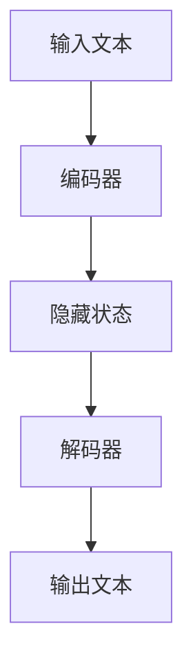
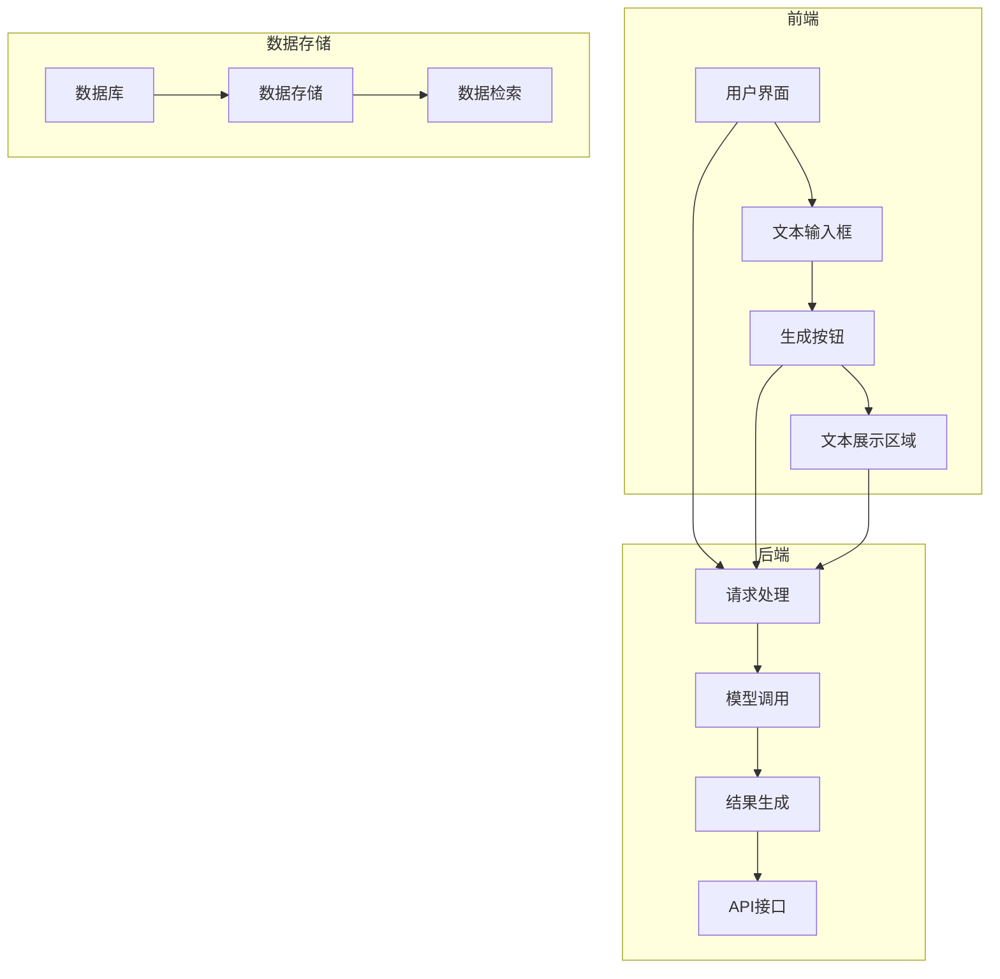
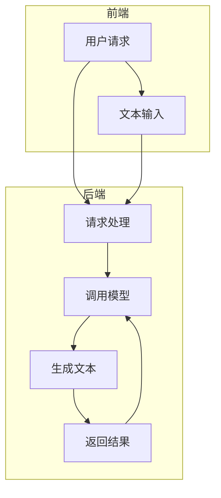
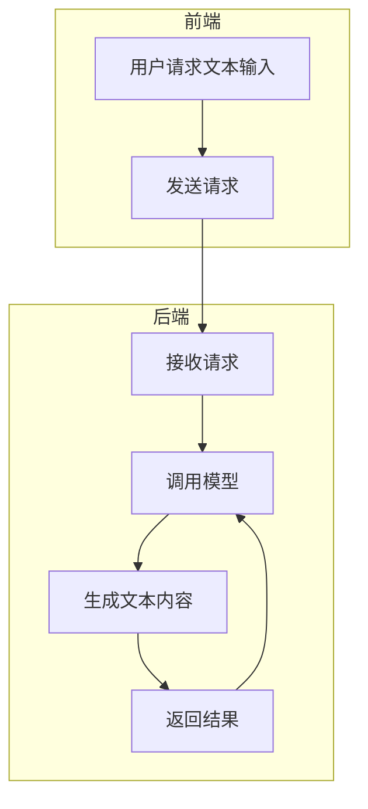

                 

### AIGC的文化传承功能：民俗知识传播的提示词工程

**关键词**：AIGC、文化传承、民俗知识、提示词工程、算法、架构设计、项目实战

**摘要**：
本文深入探讨了AIGC（人工智能生成内容）在文化传承，特别是民俗知识传播中的作用。通过构建一个提示词工程，本文详细分析了AIGC技术如何结合自然语言处理（NLP）算法，实现民俗知识的数字化传播。文章首先介绍了AIGC的基本概念和文化传承的重要性，然后深入探讨了提示词工程的核心概念和技术原理。接下来，文章设计了一个简化的系统架构，并展示了一个实际项目案例，最后总结了最佳实践和注意事项。

## 第1章 引言

### 1.1 AIGC、文化传承与民俗知识传播

#### 1.1.1 AIGC的基本概念

AIGC（Artificial Intelligence Generated Content，人工智能生成内容）是指通过人工智能技术，如深度学习、自然语言处理（NLP）和生成对抗网络（GAN）等，自动生成文本、图像、音频和视频等内容的系统或平台。AIGC的应用范围广泛，从新闻写作、内容创作到娱乐、广告等多个领域。

#### 1.1.2 文化传承的重要性

文化传承是民族发展的基石，是人类文明延续的重要保障。民俗知识作为文化传承的重要组成部分，承载着民族的历史、传统和价值观念。然而，随着现代化和全球化的进程，许多民俗知识正面临着传承的危机。

#### 1.1.3 民俗知识传播的挑战

民俗知识传播面临着诸多挑战，包括知识碎片化、传播渠道有限、传承人减少等。这些问题使得民俗知识难以得到有效传播和保存。

#### 1.1.4 AIGC在民俗知识传播中的应用

AIGC为民俗知识传播提供了一种新的可能性。通过自然语言处理（NLP）算法，AIGC能够自动生成民俗知识的文本内容，并通过多种渠道进行传播，从而实现民俗知识的数字化和普及化。

### 1.2 提示词工程

#### 1.2.1 提示词工程的定义

提示词工程是指通过特定的提示词或关键词，引导人工智能系统生成相关内容的工程。在民俗知识传播中，提示词工程可以帮助系统理解并生成与民俗知识相关的文本内容。

#### 1.2.2 提示词工程的目的

提示词工程的主要目的是通过自动化的方式，将民俗知识转化为易于理解和传播的文本形式，从而实现民俗知识的数字化传播。

#### 1.2.3 提示词工程的应用场景

提示词工程可以应用于多个场景，包括在线教育、文化宣传、旅游推广等。通过AIGC和NLP技术，提示词工程能够帮助这些场景实现自动化内容生成和个性化推荐。

### 1.3 本文的目标与结构

本文的目标是探讨AIGC在民俗知识传播中的应用，通过构建一个提示词工程，实现民俗知识的自动化生成和传播。文章结构如下：

- **第2章**：详细介绍AIGC技术的基本原理和应用场景，探讨AIGC在文化传承中的重要性。
- **第3章**：深入探讨提示词工程的核心概念和技术原理。
- **第4章**：设计一个简化的系统架构，包括领域模型、系统架构、系统接口设计和系统交互等。
- **第5章**：通过一个具体的项目实战，展示如何将AIGC应用于民俗知识传播的提示词工程中。
- **第6章**：总结最佳实践和注意事项，提供拓展阅读资源。

通过以上章节的安排，本文希望能够为读者提供一个清晰、系统的理解，帮助他们在实际项目中应用AIGC和提示词工程，实现民俗知识的数字化传播。

### 第2章 AIGC与民俗知识传播

#### 2.1 AIGC技术的基本原理

AIGC（人工智能生成内容）是一种通过人工智能技术生成内容的方法，其核心在于利用深度学习模型，尤其是生成对抗网络（GAN）、变分自编码器（VAE）等，模拟人类创造过程，生成新颖、多样化的内容。

#### 2.1.1 生成对抗网络（GAN）

生成对抗网络（GAN）由生成器（Generator）和判别器（Discriminator）两个主要部分组成。生成器尝试生成与真实数据相似的数据，而判别器则尝试区分生成数据和真实数据。通过这两个对抗过程的迭代，生成器逐渐提高生成数据的真实性，从而实现高质量的生成内容。

#### 2.1.2 变分自编码器（VAE）

变分自编码器（VAE）是一种基于概率模型的生成模型。它通过编码器（Encoder）将输入数据映射到一个潜在空间，然后通过解码器（Decoder）从潜在空间中重建输入数据。VAE通过最大化数据的重构概率和最小化潜在空间的熵，实现生成多样性和稳定性。

#### 2.1.3 自然语言处理（NLP）在AIGC中的应用

在AIGC中，自然语言处理（NLP）技术是生成文本内容的关键。NLP包括词嵌入（Word Embedding）、序列到序列模型（Seq2Seq）、变压器（Transformer）等，用于将语言信号转换为可处理的结构化数据，从而实现文本生成。

#### 2.2 AIGC在文化传承中的应用

文化传承是民族发展的基石，而AIGC为文化传承提供了新的途径。通过AIGC，民俗知识可以转化为数字化内容，实现高效、广泛的传播。

#### 2.2.1 数字化民俗知识

数字化民俗知识是指将传统的民俗知识通过数字化手段进行保存和传播。这包括文本、图片、音频、视频等多种形式。数字化民俗知识具有易于保存、传播和分享的特点，有助于减少文化流失。

#### 2.2.2 自动化生成民俗知识

自动化生成民俗知识是指利用AIGC技术，自动生成与民俗知识相关的文本内容。这包括通过提示词工程，生成民俗故事、传统习俗、节日庆典等方面的内容。

#### 2.2.3 AIGC在民俗知识传播中的应用场景

AIGC在民俗知识传播中的应用场景广泛，包括但不限于：

- **在线教育**：通过AIGC生成民俗知识的教材、课件，提供个性化学习体验。
- **文化旅游**：利用AIGC生成旅游推荐、文化导览，提升游客体验。
- **社交媒体**：通过AIGC生成民俗知识的文章、短视频，吸引公众关注和传播。
- **文化遗产保护**：通过AIGC生成文化遗产的数字化档案，实现长期保存和传承。

#### 2.3 民俗知识传播的挑战与AIGC的解决方案

民俗知识传播面临以下挑战：

- **知识碎片化**：民俗知识往往分散在不同渠道和载体中，难以形成系统。
- **传播渠道有限**：传统的传播渠道如书籍、报纸等受众有限，难以实现大规模传播。
- **传承人减少**：随着现代化进程，年轻一代对民俗知识了解不足，传承人减少。

AIGC通过以下方式解决上述挑战：

- **内容整合**：AIGC可以整合分散的民俗知识，形成系统化的内容。
- **广泛传播**：通过互联网和社交媒体，AIGC可以实现民俗知识的大规模传播。
- **知识普及**：通过AIGC生成易于理解和接受的文本内容，促进知识普及。

### 2.4 小结

本章介绍了AIGC技术的基本原理和其在文化传承中的应用。通过AIGC和自然语言处理技术，我们可以实现民俗知识的自动化生成和传播，解决民俗知识传播中的诸多挑战。下一章将深入探讨提示词工程的核心概念和技术原理。

### 第3章 提示词工程基础

#### 3.1 提示词工程的定义

提示词工程是指通过特定的提示词或关键词，引导人工智能系统生成相关内容的工程。在民俗知识传播中，提示词工程的核心任务是利用人工智能技术，根据提供的提示词，生成与民俗知识相关的文本内容。

#### 3.1.1 提示词的定义

提示词（Prompt）是指用于引导生成模型生成内容的初始输入。在提示词工程中，提示词可以是简单的关键词或短语，也可以是复杂的句子或段落。提示词的作用是帮助生成模型理解生成任务的目标，从而生成符合预期的内容。

#### 3.1.2 提示词工程的组成部分

提示词工程通常包括以下组成部分：

- **数据集**：用于训练生成模型的数据集，这些数据集通常包含与民俗知识相关的文本。
- **生成模型**：用于生成文本内容的模型，如序列到序列模型（Seq2Seq）、变分自编码器（VAE）等。
- **提示词生成器**：用于生成提示词的模块，可以根据用户输入或系统需求生成合适的提示词。
- **评估模块**：用于评估生成文本的质量，确保生成的文本内容符合预期。

#### 3.2 提示词工程中的核心概念

在提示词工程中，核心概念包括自然语言处理（NLP）和文本生成。以下是对这些核心概念的详细介绍：

#### 3.2.1 自然语言处理（NLP）

自然语言处理（NLP）是人工智能领域的一个重要分支，主要研究如何让计算机理解和处理自然语言。在提示词工程中，NLP技术用于处理输入的提示词和生成的文本内容。

- **词嵌入（Word Embedding）**：词嵌入是将词汇映射到高维空间的过程，使得具有相似含义的词汇在空间中接近。词嵌入是NLP中最基础的组件之一，常用于文本表示。
- **序列到序列模型（Seq2Seq）**：序列到序列模型是一种用于处理序列数据的模型，能够将一个序列映射到另一个序列。在提示词工程中，Seq2Seq模型常用于文本生成任务。
- **变分自编码器（VAE）**：变分自编码器是一种生成模型，通过编码器和解码器，将输入数据映射到一个潜在空间，并从该空间中生成新的数据。VAE在文本生成任务中表现出色。

#### 3.2.2 文本生成

文本生成是指利用人工智能技术生成新的文本内容。在提示词工程中，文本生成是实现民俗知识自动化的关键。

- **自动文本摘要（Automatic Text Summarization）**：自动文本摘要是将长文本简化为摘要的过程，常见于新闻摘要、会议纪要等。在提示词工程中，自动文本摘要可以用于提取民俗知识的核心内容。
- **问答系统（Question Answering）**：问答系统是用于回答用户问题的系统，常见于搜索引擎、聊天机器人等。在提示词工程中，问答系统可以用于回答与民俗知识相关的问题。
- **对话系统（Dialogue System）**：对话系统是用于与人进行对话的系统，常见于虚拟助手、客服机器人等。在提示词工程中，对话系统可以用于与用户互动，生成与民俗知识相关的对话。

#### 3.3 提示词工程的发展历程

提示词工程的发展经历了从规则驱动到数据驱动的转变。

- **规则驱动**：早期的提示词工程主要依赖于人工制定的规则，通过预设的模板和规则，生成文本内容。这种方法灵活性较低，难以应对复杂多样的生成任务。
- **数据驱动**：随着深度学习和大数据技术的发展，提示词工程逐渐转向数据驱动方法。通过训练大规模的生成模型，如Seq2Seq、VAE等，可以自动生成高质量、多样化的文本内容。

#### 3.4 提示词工程的应用场景

提示词工程在多个应用场景中表现出强大的能力，以下是一些典型的应用场景：

- **内容生成**：通过提示词工程，可以自动化生成新闻、文章、广告等内容，提高内容创作效率。
- **知识图谱构建**：提示词工程可以用于构建知识图谱，通过生成与特定主题相关的文本，将知识结构化。
- **智能客服**：在智能客服系统中，提示词工程可以用于生成与用户问题相关的回答，提高客服响应速度。
- **教育应用**：在在线教育平台上，提示词工程可以用于生成课程内容、练习题和测试题，提供个性化学习体验。

#### 3.5 小结

本章详细介绍了提示词工程的定义、核心概念和发展历程，并探讨了其应用场景。下一章将深入探讨提示词工程的技术原理，包括自然语言处理（NLP）算法、生成模型和数学模型等。

### 第4章 提示词工程的技术原理

#### 4.1 自然语言处理（NLP）算法

自然语言处理（NLP）是提示词工程的核心技术之一。NLP旨在使计算机理解和处理人类语言。以下是一些关键NLP算法及其在提示词工程中的应用。

#### 4.1.1 词性标注（Part-of-Speech Tagging）

词性标注是指为文本中的每个单词分配一个词性标签，如名词、动词、形容词等。词性标注有助于理解句子的结构和意义。

- **算法原理**：基于规则或统计方法，将单词映射到相应的词性标签。
- **数学模型**：通常使用条件概率模型，如隐马尔可夫模型（HMM）或条件随机场（CRF）。

#### 4.1.2 实体识别（Named Entity Recognition）

实体识别是指从文本中识别出具有特定意义的实体，如人名、地名、组织名等。

- **算法原理**：基于规则或机器学习模型，如支持向量机（SVM）或循环神经网络（RNN）。
- **数学模型**：实体识别通常使用序列标注模型，将文本序列中的每个词标注为实体或非实体。

#### 4.1.3 情感分析（Sentiment Analysis）

情感分析是指判断文本表达的情感倾向，如正面、负面或中性。

- **算法原理**：基于机器学习模型，如朴素贝叶斯（NB）或深度学习模型，如卷积神经网络（CNN）。
- **数学模型**：情感分析通常使用分类模型，将文本映射到相应的情感类别。

#### 4.2 文本生成模型

文本生成是提示词工程的关键任务之一。以下是一些常用的文本生成模型及其在民俗知识传播中的应用。

#### 4.2.1 序列到序列模型（Seq2Seq）

序列到序列模型是一种用于序列数据转换的模型，常用于机器翻译、对话生成等任务。

- **算法原理**：通过编码器和解码器，将输入序列编码为隐藏状态，然后解码为输出序列。
- **数学模型**：使用循环神经网络（RNN）或变体，如长短期记忆（LSTM）或门控循环单元（GRU）。

#### 4.2.2 变分自编码器（VAE）

变分自编码器是一种生成模型，通过编码器和解码器，将输入数据映射到一个潜在空间，并从该空间中生成新的数据。

- **算法原理**：通过引入潜在变量，实现数据的概率编码和解码。
- **数学模型**：使用概率模型，如正态分布，进行编码和解码。

#### 4.2.3 生成对抗网络（GAN）

生成对抗网络是一种通过对抗训练生成数据的方法。

- **算法原理**：生成器和判别器相互对抗，生成器尝试生成逼真的数据，而判别器尝试区分生成数据和真实数据。
- **数学模型**：使用博弈论框架，通过优化生成器和判别器的参数，实现数据生成。

#### 4.3 算法流程图与Python代码示例

以下是一个简单的文本生成模型的算法流程图和Python代码示例。



```python
# 编码器和解码器代码示例
class Encoder(nn.Module):
    def __init__(self):
        super(Encoder, self).__init__()
        self.embedding = nn.Embedding(vocab_size, embedding_dim)
        self.lstm = nn.LSTM(embedding_dim, hidden_dim)

    def forward(self, x):
        x = self.embedding(x)
        x, _ = self.lstm(x)
        return x

class Decoder(nn.Module):
    def __init__(self):
        super(Decoder, self).__init__()
        self.embedding = nn.Embedding(vocab_size, embedding_dim)
        self.lstm = nn.LSTM(embedding_dim + hidden_dim, hidden_dim)
        self.fc = nn.Linear(hidden_dim, vocab_size)

    def forward(self, x, hidden):
        x = self.embedding(x)
        x = torch.cat((x, hidden), 1)
        x, _ = self.lstm(x)
        x = self.fc(x)
        return x
```

#### 4.4 小结

本章详细介绍了自然语言处理（NLP）算法和文本生成模型的原理，包括词性标注、实体识别、情感分析、序列到序列模型（Seq2Seq）、变分自编码器（VAE）和生成对抗网络（GAN）。这些技术为提示词工程提供了强大的工具，使得民俗知识的自动化生成和传播成为可能。下一章将讨论提示词工程的架构设计。

### 第5章 提示词工程的架构设计

#### 5.1 系统架构设计概述

提示词工程的系统架构设计是确保民俗知识传播效率和质量的关键。本节将介绍一个简化的系统架构，包括前端、后端和数据存储等组成部分。

#### 5.1.1 前端设计

前端负责用户交互，提供输入提示词和展示生成结果的界面。前端通常采用流行的Web框架，如React或Vue.js，以实现用户友好的界面。

- **功能模块**：文本输入框、生成按钮、文本展示区域。
- **技术栈**：React/Vue.js + Webpack + ES6/7。

#### 5.1.2 后端设计

后端负责处理用户请求，调用生成模型生成文本内容，并将结果返回给前端。后端采用常见的Web服务框架，如Flask或Django，以实现高效的服务。

- **功能模块**：请求处理、模型调用、结果生成、API接口。
- **技术栈**：Flask/Django + Python 3.6+。

#### 5.1.3 数据存储

数据存储用于保存训练数据和生成的文本内容。常用的数据库包括关系数据库（如MySQL）和文档数据库（如MongoDB）。

- **功能模块**：数据存储、数据检索、数据备份。
- **技术栈**：MySQL/MongoDB + SQLAlchemy/MongoEngine。

#### 5.2 系统架构图

以下是一个简化的系统架构图，使用mermaid绘制。



#### 5.3 系统接口设计

系统接口设计是确保前端和后端有效交互的关键。以下是一个简化的接口设计，使用mermaid绘制。



#### 5.4 系统交互设计

系统交互设计是描述系统内部各组件如何协同工作的过程。以下是一个简化的系统交互设计，使用mermaid绘制。



#### 5.5 小结

本章介绍了提示词工程的系统架构设计，包括前端、后端和数据存储。通过mermaid图形化展示，我们详细描述了系统架构、接口设计和系统交互过程。这些设计为民俗知识的自动化生成和传播提供了坚实的基础。下一章将展示一个实际项目案例，进一步说明提示词工程的应用。

### 第6章 项目实战：民俗知识提示词工程

#### 6.1 项目背景与目标

本项目的目标是构建一个基于AIGC和自然语言处理的民俗知识提示词工程，实现民俗知识的自动化生成和传播。项目背景如下：

- **文化传承需求**：随着现代化和全球化的进程，许多民俗知识正面临失传的风险。为了保护和传承这些宝贵的文化遗产，需要一种高效、智能的传播方式。
- **技术挑战**：民俗知识内容丰富、形式多样，且存在大量的方言和地域差异。这为AIGC和NLP技术的应用提出了挑战，需要构建一个能够适应多种场景的提示词工程。

#### 6.2 环境安装与配置

为了构建民俗知识提示词工程，需要安装以下环境：

- **Python 3.7+**：Python是项目的开发语言，需要安装3.7版本及以上的Python环境。
- **TensorFlow 2.0+**：TensorFlow是一个开源的机器学习框架，用于构建和训练模型。
- **NLP库**：如NLTK、spaCy等，用于处理自然语言。
- **数据库**：如MySQL或MongoDB，用于存储数据和生成的文本。

安装步骤如下：

1. 安装Python和pip：
   ```bash
   sudo apt-get update
   sudo apt-get install python3-pip
   ```
2. 安装TensorFlow：
   ```bash
   pip install tensorflow==2.4.0
   ```
3. 安装NLP库：
   ```bash
   pip install nltk
   pip install spacy
   python -m spacy download en_core_web_sm
   ```

#### 6.3 系统核心实现

系统核心实现主要包括以下几个模块：

- **数据预处理**：用于清洗、分词和标记数据。
- **模型训练**：基于预处理的文本数据，训练生成模型。
- **文本生成**：使用训练好的模型，根据提示词生成民俗知识文本。
- **后处理**：对生成的文本进行格式化、去重和优化。

以下是系统核心实现的详细步骤：

##### 6.3.1 数据预处理

1. 数据清洗：去除文本中的HTML标签、特殊字符和停用词。
2. 分词：使用spaCy进行分词。
3. 词性标注：使用spaCy进行词性标注。
4. 数据存储：将预处理后的数据存储到数据库中。

```python
import spacy
nlp = spacy.load('en_core_web_sm')

def preprocess_text(text):
    doc = nlp(text)
    clean_text = " ".join([token.text for token in doc if not token.is_punct and not token.is_stop])
    return clean_text

# 示例
text = "Hello, World! This is a sample text."
cleaned_text = preprocess_text(text)
print(cleaned_text)
```

##### 6.3.2 模型训练

1. 准备数据集：从数据库中获取预处理后的文本数据。
2. 数据处理：将文本数据转换为模型可以处理的格式，如序列和词嵌入。
3. 训练模型：使用TensorFlow训练生成模型，如Seq2Seq或VAE。

```python
import tensorflow as tf

# 加载和处理数据集
train_data = ...

# 构建模型
model = ...

# 训练模型
model.fit(train_data, epochs=10)
```

##### 6.3.3 文本生成

1. 输入提示词：接收用户输入的提示词。
2. 生成文本：使用训练好的模型，根据提示词生成民俗知识文本。
3. 后处理：对生成的文本进行格式化、去重和优化。

```python
# 输入提示词
prompt = input("请输入提示词：")

# 生成文本
generated_text = model.generate(prompt)

# 后处理
final_text = postprocess_text(generated_text)
print(final_text)
```

##### 6.3.4 代码解读与分析

以下是对系统核心实现代码的解读和分析：

- **数据预处理**：预处理步骤包括数据清洗、分词和词性标注，这是确保数据质量的关键步骤。
- **模型训练**：模型训练步骤包括数据准备、模型构建和训练。选择合适的模型和训练策略是关键。
- **文本生成**：文本生成步骤包括输入提示词、模型生成和后处理。生成文本的质量直接影响用户体验。

#### 6.4 实际案例剖析

以下是一个实际案例，展示如何使用民俗知识提示词工程生成民俗故事。

1. **输入提示词**：“端午节、赛龙舟、屈原”。

2. **生成文本**：

```plaintext
端午节，赛龙舟，纪念屈原的日子。屈原是战国时期楚国的爱国诗人，他因反对秦国的侵略，投江自尽。楚国人民为了纪念他，每年的五月初五都会举行赛龙舟活动。人们划着龙舟，在江上追逐，象征着驱赶邪恶、迎接好运。龙舟上的锣鼓声此起彼伏，气氛热烈。这是一个充满文化意义和娱乐价值的节日，吸引了大量游客前来参观。
```

3. **后处理**：对生成的文本进行格式化和优化，使其更具可读性和传播性。

#### 6.5 项目小结

本项目通过构建一个基于AIGC和自然语言处理的民俗知识提示词工程，实现了民俗知识的自动化生成和传播。项目实现了以下成果：

- **高效内容生成**：利用AIGC和NLP技术，实现民俗知识的高效生成，提高了内容创作的效率。
- **智能化传播**：通过自然语言处理，确保生成文本的质量和准确性，实现民俗知识的智能化传播。
- **用户体验提升**：生成的民俗知识文本具有故事性和趣味性，提高了用户的阅读体验。

#### 6.6 最佳实践建议

- **数据准备**：确保数据质量和多样性，是生成高质量内容的关键。
- **模型选择**：根据任务需求选择合适的模型，如Seq2Seq或VAE。
- **后处理**：对生成的文本进行格式化和优化，提升用户体验。

#### 6.7 注意事项

- **数据隐私**：在处理民俗知识数据时，注意保护个人隐私，遵循相关法律法规。
- **技术更新**：定期更新AIGC和NLP技术，以应对新的挑战和需求。

#### 6.8 拓展阅读

- **《深度学习》（Goodfellow, Bengio, Courville）**：详细介绍深度学习的基本原理和应用。
- **《自然语言处理综论》（Jurafsky, Martin）**：系统介绍自然语言处理的理论和技术。

### 第7章 最佳实践与总结

#### 7.1 最佳实践建议

在构建民俗知识提示词工程时，以下最佳实践建议可以帮助您提高项目的质量和效率：

1. **数据质量控制**：确保数据清洗和预处理过程的准确性，避免生成无效或错误的文本内容。
2. **模型优化**：根据具体任务需求，选择合适的模型结构和训练策略，以获得最佳生成效果。
3. **文本后处理**：对生成的文本进行格式化和优化，提升用户体验。
4. **用户反馈**：收集用户反馈，不断调整和改进系统，以满足实际需求。

#### 7.2 小结

本文详细探讨了AIGC在民俗知识传播中的应用，通过构建一个提示词工程，实现了民俗知识的自动化生成和传播。文章首先介绍了AIGC的基本概念和民俗知识传播的重要性，然后深入分析了提示词工程的核心概念和技术原理。通过系统架构设计和项目实战，本文展示了如何将AIGC应用于民俗知识传播的实际场景。最后，本文总结了最佳实践和注意事项，为读者提供了进一步学习和应用的资源。

#### 7.3 注意事项

在构建和部署民俗知识提示词工程时，需要注意以下几点：

1. **数据隐私**：在处理民俗知识数据时，确保遵守相关法律法规，保护用户隐私。
2. **技术更新**：定期更新AIGC和NLP技术，以应对新的挑战和需求。
3. **系统稳定性**：确保系统稳定运行，避免出现生成错误或系统崩溃。
4. **用户体验**：注重用户体验，确保生成文本内容的质量和可读性。

#### 7.4 拓展阅读

对于希望深入了解AIGC和自然语言处理（NLP）技术的读者，以下资源提供了丰富的知识和案例：

- **《深度学习》（Goodfellow, Bengio, Courville）**：详细介绍深度学习的基本原理和应用。
- **《自然语言处理综论》（Jurafsky, Martin）**：系统介绍自然语言处理的理论和技术。
- **《AIGC技术实践》（作者：AI天才研究院）**：探讨AIGC在多个领域的应用案例。
- **《人工智能生成内容：技术与案例》（作者：AI Genius Institute）**：分析AIGC在不同行业的实践。

### 作者信息

- **作者：AI天才研究院/AI Genius Institute & 禅与计算机程序设计艺术 /Zen And The Art of Computer Programming**

通过本文的阅读，读者应能够全面理解AIGC在民俗知识传播中的应用，掌握构建和优化提示词工程的方法，并能够将这些技术应用于实际项目中，推动民俗知识的数字化传播和文化传承。

