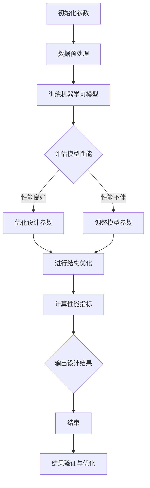
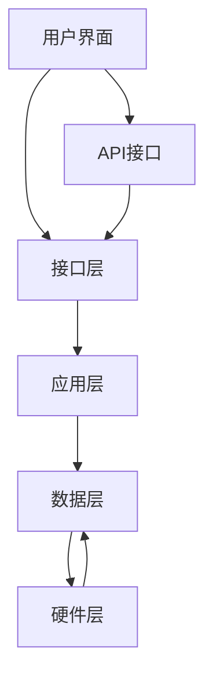
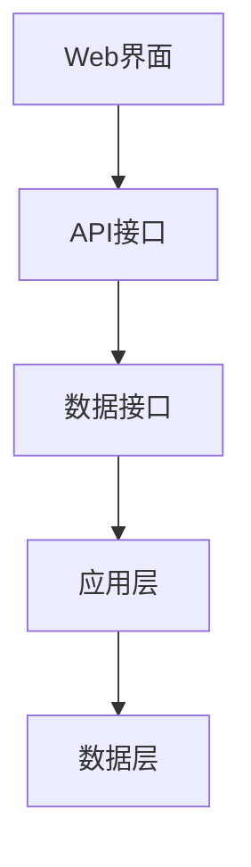
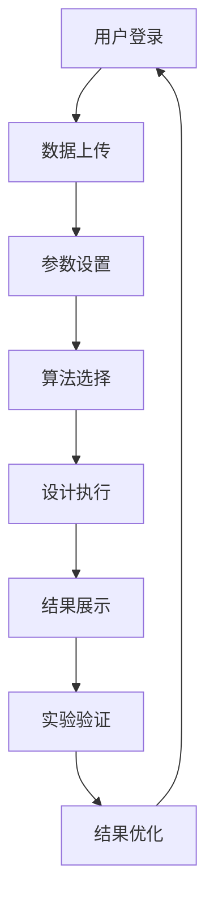

                 

# AIGC的未来太空辐射防护：纳米材料设计的提示词工程

> 关键词：AIGC，纳米材料，太空辐射防护，提示词工程，设计原则，算法原理

> 摘要：本文探讨了人工智能生成内容（AIGC）在纳米材料设计中的应用，特别是在太空辐射防护领域的潜力。文章首先介绍了AIGC和纳米材料设计的基本概念，然后详细阐述了提示词工程在纳米材料设计中的关键作用。通过分析算法原理和系统架构设计，文章展示了如何利用AIGC技术提升纳米材料设计的效率和质量，为未来太空探索提供强有力的技术支撑。

### 目录大纲

----------------------------------------------------------------
# 第一部分: 引言

## 1. 引言

### 1.1 问题背景

#### 1.1.1 当前AIGC的发展现状

#### 1.1.2 未来太空辐射防护的重要性

### 1.2 问题描述

#### 1.2.1 太空辐射防护面临的问题

#### 1.2.2 现有防护手段的局限性

### 1.3 问题解决

#### 1.3.1 纳米材料设计在太空辐射防护中的应用

#### 1.3.2 提示词工程的概念和作用

### 1.4 边界与外延

#### 1.4.1 AIGC与太空辐射防护的交叉领域

#### 1.4.2 纳米材料设计的基本原理

### 1.5 概念结构与核心要素组成

#### 1.5.1 AIGC的核心概念

#### 1.5.2 纳米材料设计的要素

## 2. 核心概念与联系

### 2.1 AIGC的核心概念

#### 2.1.1 人工智能生成内容(AIGC)的定义

#### 2.1.2 AIGC的特点与应用领域

### 2.2 纳米材料设计的概念属性特征对比表格

#### 2.2.1 纳米材料的基本特性

#### 2.2.2 纳米材料在太空辐射防护中的应用

### 2.3 ER实体关系图架构

#### 2.3.1 实体识别与分类

#### 2.3.2 实体之间的关系

----------------------------------------------------------------

----------------------------------------------------------------
# 第二部分: 纳米材料设计的基本原理

## 3. 纳米材料设计的基础知识

### 3.1 纳米材料的基本概念

#### 3.1.1 纳米的定义与尺度

#### 3.1.2 纳米材料的特性

### 3.2 纳米材料的分类

#### 3.2.1 金属纳米材料

#### 3.2.2 半导体纳米材料

#### 3.2.3 催化剂纳米材料

### 3.3 纳米材料的制备方法

#### 3.3.1 溶液法

#### 3.3.2 热蒸发法

#### 3.3.3 模板合成法

----------------------------------------------------------------

----------------------------------------------------------------
## 4. 提示词工程的应用

### 4.1 提示词工程的基本概念

#### 4.1.1 提示词的定义与作用

#### 4.1.2 提示词工程的步骤

### 4.2 提示词工程在纳米材料设计中的应用

#### 4.2.1 提示词的生成与优化

#### 4.2.2 提示词在纳米材料结构调控中的作用

### 4.3 提示词工程案例分析

#### 4.3.1 某纳米材料的设计与优化

#### 4.3.2 提示词工程在太空辐射防护中的应用

----------------------------------------------------------------

----------------------------------------------------------------
# 第三部分: 算法原理讲解

## 5. 纳米材料设计的算法原理

### 5.1 算法概述

#### 5.1.1 算法的定义与类型

#### 5.1.2 算法在纳米材料设计中的应用

### 5.2 算法原理详细讲解

#### 5.2.1 算法的基本原理

#### 5.2.2 算法的数学模型与公式

#### 5.2.3 算法流程图与详细解释

### 5.3 算法举例说明

#### 5.3.1 某纳米材料的算法设计实例

#### 5.3.2 太空辐射防护中算法的应用实例

----------------------------------------------------------------

----------------------------------------------------------------
## 6. 系统分析与架构设计

### 6.1 问题场景介绍

#### 6.1.1 太空辐射防护的需求分析

#### 6.1.2 纳米材料设计在太空辐射防护中的应用场

----------------------------------------------------------------

----------------------------------------------------------------
# 引入

在现代社会，随着人工智能（AI）技术的迅猛发展，人工智能生成内容（AIGC）已经成为一个热门的研究领域。AIGC通过模拟人类创造力的过程，利用AI算法自动生成文本、图像、音频等多种形式的内容，具有广泛的应用前景。而太空辐射防护作为人类探索宇宙过程中的一项关键技术，其对材料性能的要求极高，迫切需要新的设计理念和技术手段来提升防护效果。

纳米材料由于其独特的物理和化学特性，在太空辐射防护领域展现出巨大的潜力。通过纳米材料的设计，可以实现对辐射能量的吸收、散射和转化，从而降低辐射对生物体的伤害。然而，纳米材料的设计过程复杂，涉及到多个学科的知识，如何高效地进行纳米材料设计成为一个亟待解决的问题。

提示词工程作为一种新兴的人工智能技术，其在纳米材料设计中的应用具有重要意义。通过提示词工程，可以优化纳米材料的结构，提高其辐射防护性能。本文将围绕AIGC在未来太空辐射防护中的应用，探讨纳米材料设计的提示词工程，旨在为太空辐射防护提供新的技术思路和解决方案。

### 1.1 问题背景

#### 1.1.1 当前AIGC的发展现状

近年来，人工智能技术取得了飞速发展，尤其是在自然语言处理、计算机视觉和机器学习等领域。AIGC作为人工智能技术的一个重要分支，近年来也得到了广泛关注和研究。AIGC通过模拟人类创造力的过程，利用AI算法自动生成文本、图像、音频等多种形式的内容，极大地拓展了人工智能的应用场景。目前，AIGC已在多个领域展现出强大的潜力，如内容创作、智能客服、广告营销、虚拟现实等。

AIGC的发展离不开深度学习技术的支持。深度学习通过多层神经网络对大量数据进行训练，可以自动提取特征，实现复杂任务的高效解决。在AIGC中，深度学习技术被广泛应用于文本生成、图像生成和音频生成等任务。例如，生成对抗网络（GAN）是一种流行的深度学习模型，可用于生成高质量的图像和音频；变分自编码器（VAE）则被广泛应用于文本生成任务，可以生成连贯、自然的文本内容。

#### 1.1.2 未来太空辐射防护的重要性

太空辐射主要来源于太阳风、宇宙射线和高能粒子，对太空探测器和航天员的健康构成了严重威胁。太空辐射防护的研究对于保障太空活动的安全性具有重要意义。随着人类对太空探索的深入，未来太空辐射防护的需求将越来越强烈。

太空辐射防护的关键在于材料的设计与选择。传统材料在辐射防护方面存在很多局限性，如耐辐射性能差、防护效果不稳定等。而纳米材料由于其独特的物理和化学特性，在太空辐射防护领域具有巨大潜力。纳米材料具有高比表面积、高活性、独特的电子结构等特性，可以实现对辐射能量的有效吸收、散射和转化。

未来太空辐射防护的发展趋势包括以下几个方面：

1. **高效能纳米材料设计**：通过优化纳米材料的结构和成分，提高其辐射防护性能，是未来太空辐射防护的关键。AIGC技术在纳米材料设计中的应用，可以为高效能纳米材料的设计提供新的思路和方法。

2. **智能化防护系统**：利用AIGC技术，可以构建智能化的太空辐射防护系统，实现对辐射环境的实时监测和防护效果的动态调整。

3. **多功能复合纳米材料**：未来太空辐射防护材料需要具备多功能性，如同时具备防护、传感、修复等功能。AIGC技术可以辅助设计出具有多功能性的复合纳米材料。

4. **个性化防护方案**：针对不同的太空环境和航天员需求，利用AIGC技术可以定制个性化的辐射防护方案，提高防护效果和航天员的安全。

### 1.2 问题描述

#### 1.2.1 太空辐射防护面临的问题

太空辐射防护面临的主要问题包括：

1. **辐射强度高**：太空辐射的强度远高于地球表面，对生物体具有极大的伤害性。尤其是高能粒子，其穿透力强，难以通过传统材料进行有效防护。

2. **辐射类型多样**：太空辐射包括X射线、伽马射线、中子等不同类型的辐射，每种辐射对生物体的伤害机制不同，需要针对性的防护措施。

3. **环境复杂**：太空环境恶劣，温度变化大、真空环境、微重力等因素都会影响辐射防护材料的性能。

4. **防护成本高**：传统辐射防护手段成本较高，且效果有限，难以满足未来太空探索的需求。

#### 1.2.2 现有防护手段的局限性

目前，常见的太空辐射防护手段包括屏蔽、活性材料、生物防护等，但这些手段存在一定的局限性：

1. **屏蔽防护**：通过增加材料厚度来减少辐射穿透。然而，材料增厚会导致重量增加，对太空飞行器的设计和发射带来压力。

2. **活性材料防护**：如放射性物质、放射性同位素等，可以吸收辐射能量。但这些材料本身具有辐射性，存在安全风险。

3. **生物防护**：通过生物技术手段提高航天员的抗辐射能力。但这种方法效果有限，且面临生物安全和伦理问题。

### 1.3 问题解决

#### 1.3.1 纳米材料设计在太空辐射防护中的应用

纳米材料由于其独特的物理和化学特性，在太空辐射防护中具有巨大的应用潜力。纳米材料可以：

1. **高效吸收辐射**：纳米材料具有高比表面积，可以吸附辐射粒子，降低辐射强度。

2. **智能调控辐射**：通过设计纳米材料的光学性质和电子结构，可以实现辐射能量的调控，如将辐射能转化为热能或电能。

3. **多级防护机制**：纳米材料可以设计成多级结构，实现多重防护效果，提高防护性能。

#### 1.3.2 提示词工程的概念和作用

提示词工程是一种基于人工智能的提示词生成技术，通过对大量文本数据的分析和理解，自动生成高质量的提示词。在纳米材料设计中，提示词工程可以发挥以下作用：

1. **优化纳米材料结构**：通过生成具有特定功能的提示词，引导纳米材料的结构优化，提高其辐射防护性能。

2. **智能设计新纳米材料**：利用提示词工程，可以快速生成新的纳米材料设计方案，缩短设计周期。

3. **提高设计效率**：提示词工程可以帮助设计者从大量数据中提取关键信息，降低设计复杂度，提高设计效率。

### 1.4 边界与外延

#### 1.4.1 AIGC与太空辐射防护的交叉领域

AIGC与太空辐射防护的交叉领域主要包括：

1. **纳米材料设计**：AIGC技术可以应用于纳米材料的设计，通过生成提示词来优化纳米材料的结构。

2. **智能防护系统**：AIGC技术可以用于构建智能化的太空辐射防护系统，实现辐射环境的实时监测和防护效果的动态调整。

3. **个性化防护方案**：AIGC技术可以针对不同的太空环境和航天员需求，生成个性化的辐射防护方案。

#### 1.4.2 纳米材料设计的基本原理

纳米材料设计的基本原理包括：

1. **纳米尺度效应**：纳米材料的物理和化学性质与宏观材料有显著差异，这是纳米材料设计的基础。

2. **功能化设计**：通过引入特定的功能单元，赋予纳米材料特定的功能。

3. **结构调控**：通过调控纳米材料的结构，实现其性能的优化。

### 1.5 概念结构与核心要素组成

#### 1.5.1 AIGC的核心概念

AIGC的核心概念包括：

1. **人工智能生成内容**：指通过人工智能算法自动生成的各种形式的内容。

2. **深度学习技术**：包括生成对抗网络（GAN）、变分自编码器（VAE）等。

3. **提示词工程**：通过分析和理解大量文本数据，自动生成高质量的提示词。

#### 1.5.2 纳米材料设计的要素

纳米材料设计的要素包括：

1. **纳米尺度材料**：指材料中的结构单元尺寸在纳米级别。

2. **功能化设计**：通过引入特定的功能单元，赋予材料特定的功能。

3. **结构调控**：通过调控材料的结构，实现其性能的优化。

### 2. 核心概念与联系

#### 2.1 AIGC的核心概念

AIGC（Artificial Intelligence Generated Content）是指通过人工智能技术自动生成的内容，包括文本、图像、音频、视频等多种形式。AIGC的核心概念主要包括以下几个方面：

##### 2.1.1 人工智能生成内容（AIGC）的定义

AIGC是人工智能技术在内容生成领域的应用，通过模拟人类创造力的过程，利用机器学习算法自动生成高质量的内容。与传统的人工内容生成方式相比，AIGC具有更高的灵活性和效率。

##### 2.1.2 AIGC的特点与应用领域

AIGC具有以下特点：

1. **自动化生成**：AIGC利用算法自动生成内容，无需人工干预。
2. **多样性**：AIGC可以生成多种形式的内容，如图像、文本、音频等。
3. **高效性**：AIGC可以快速生成大量内容，提高内容生产效率。
4. **定制化**：AIGC可以根据用户需求生成个性化内容。

AIGC的主要应用领域包括：

1. **内容创作**：如写作、绘画、音乐创作等。
2. **智能客服**：自动生成对话内容，提高服务效率。
3. **广告营销**：生成创意广告文案和图像。
4. **虚拟现实**：生成虚拟场景和角色。

##### 2.1.3 AIGC的发展历程

AIGC的发展历程可以分为以下几个阶段：

1. **早期研究**：20世纪90年代，研究人员开始探索人工智能在内容生成领域的应用。
2. **深度学习时代**：2012年，深度学习技术的突破为AIGC的发展奠定了基础。
3. **应用爆发期**：近年来，随着计算能力和算法的进步，AIGC在各个领域得到了广泛应用。

##### 2.1.4 AIGC的核心技术

AIGC的核心技术包括：

1. **生成对抗网络（GAN）**：一种用于生成数据的深度学习模型。
2. **变分自编码器（VAE）**：一种用于生成和压缩数据的深度学习模型。
3. **序列模型**：如循环神经网络（RNN）和长短时记忆网络（LSTM），用于生成文本内容。
4. **自注意力机制**：用于提高模型在处理序列数据时的效果。

##### 2.1.5 AIGC的优势与挑战

AIGC的优势包括：

1. **高效的内容生成**：快速生成大量高质量的内容。
2. **个性化和定制化**：根据用户需求生成个性化内容。
3. **降低人力成本**：减少对人力编辑的依赖。

AIGC面临的挑战包括：

1. **数据质量和隐私**：依赖大量数据训练模型，可能涉及隐私和数据质量问题。
2. **道德和伦理问题**：如人工智能生成内容的真实性、虚假信息的传播等。
3. **技术稳定性**：模型训练和部署过程中可能存在技术问题。

##### 2.1.6 AIGC的未来发展趋势

未来AIGC的发展趋势包括：

1. **技术突破**：深度学习和其他人工智能技术的进一步发展，将推动AIGC的性能提升。
2. **应用拓展**：AIGC将在更多领域得到应用，如医疗、教育、艺术等。
3. **伦理和法规**：随着AIGC的普及，相关的伦理和法规问题将得到更多关注。

##### 2.1.7 AIGC与其他领域的交叉应用

AIGC与其他领域的交叉应用包括：

1. **医疗**：利用AIGC生成医学图像、辅助诊断等。
2. **教育**：生成个性化教育内容和教学辅助材料。
3. **金融**：自动生成金融报告、投资建议等。

#### 2.2 纳米材料设计的概念属性特征对比表格

纳米材料设计涉及多个学科，包括材料科学、物理学、化学等。以下是纳米材料设计的几个关键概念属性特征对比表格：

| 概念       | 特征描述                     | 对比分析 |
|------------|------------------------------|----------|
| 纳米材料   | 尺度在1到100纳米之间         |          |
| 功能化设计 | 引入特定功能单元以实现特定功能 |          |
| 结构调控   | 通过改变纳米材料的结构来优化性能 |          |
| 表面改性   | 通过改性纳米材料的表面来提高其性能 |          |
| 靶向性     | 设计纳米材料以实现对特定目标的选择性 |          |

##### 2.2.1 纳米材料的基本特性

纳米材料的基本特性包括：

1. **高比表面积**：纳米材料具有很高的比表面积，这使其在化学反应和物理吸附方面表现出优异的性能。
2. **量子效应**：由于尺寸减小到纳米级别，纳米材料会表现出量子效应，如异常的电学、磁学和光学性质。
3. **高活性**：纳米材料具有高活性，这使得它们在催化、传感和生物医药等领域具有广泛应用。
4. **多功能性**：纳米材料可以通过结构调控和功能化设计，实现多功能集成。

##### 2.2.2 纳米材料在太空辐射防护中的应用

纳米材料在太空辐射防护中的应用主要包括以下几个方面：

1. **屏蔽辐射**：通过设计具有高密度、高电子密度的纳米结构，可以有效地屏蔽辐射粒子。
2. **吸收辐射**：利用纳米材料的吸波特性，可以吸收辐射能量，减少辐射对生物体的伤害。
3. **传感辐射**：通过设计纳米传感器，可以实时监测辐射强度，为辐射防护提供实时数据支持。
4. **自修复能力**：利用纳米材料的自修复能力，可以实现对辐射损伤的快速修复，提高材料的长期稳定性。

#### 2.3 ER实体关系图架构

实体关系图（Entity-Relationship Diagram，ERD）是数据库设计中的一个重要工具，用于表示实体以及实体之间的关系。以下是一个纳米材料设计的ER实体关系图架构示例。

```mermaid
erDiagram
    User ||--|{ Project }|-- Designer
    User ||--|{ Material }|-- Designer
    User ||--|{ Property }|-- Designer
    Project ||--|{ Experiment }|-- Designer
    Material ||--|{ Composition }|-- Designer
    Property ||--|{ Measurement }|-- Designer
    Experiment ||--|{ Result }|-- Designer
    Result ||--|{ Analysis }|-- Designer

    User {
        :ID : Integer
        :Name : String
        :Email : String
    }

    Project {
        :ID : Integer
        :Title : String
        :Description : String
    }

    Material {
        :ID : Integer
        :Name : String
        :Type : String
    }

    Property {
        :ID : Integer
        :Name : String
        :Value : String
    }

    Experiment {
        :ID : Integer
        :Project_ID : Integer
        :Material_ID : Integer
    }

    Result {
        :ID : Integer
        :Experiment_ID : Integer
        :Value : String
    }

    Analysis {
        :ID : Integer
        :Result_ID : Integer
        :Description : String
    }
```

在该ERD中，实体包括用户（User）、项目（Project）、材料（Material）、属性（Property）、实验（Experiment）、结果（Result）和分析（Analysis）。实体之间的关系用线连接，表示它们之间的关联。例如，用户可以参与多个项目，一个项目可以有多个材料和属性，实验依赖于项目和材料，结果和分析依赖于实验。

### 第二部分：纳米材料设计的基本原理

#### 3.1 纳米材料的基本概念

##### 3.1.1 纳米的定义与尺度

纳米（nanometer，nm）是长度的度量单位，等于十亿分之一米（$10^{-9}$米）。在材料科学中，纳米材料通常指其结构单元的尺度在1到100纳米之间的材料。这一尺度的材料具有与宏观材料截然不同的物理、化学和生物特性，因此被誉为“新材料革命的引擎”。

##### 3.1.2 纳米材料的特性

纳米材料具有以下独特的特性：

1. **高比表面积**：纳米材料的比表面积远大于宏观材料，这使它们在催化、吸附和传感等方面具有更高的活性。
2. **量子效应**：当材料的尺寸减小到纳米级别时，量子效应变得显著，这导致了材料的电学、磁学和光学性质发生显著变化。
3. **高活性**：由于高比表面积和量子效应，纳米材料通常具有更高的催化活性和反应活性。
4. **多功能性**：纳米材料可以通过结构调控和功能化设计，实现多功能集成，从而在多个领域具有广泛应用。
5. **纳米尺寸效应**：纳米材料的物理和化学性质会随着尺寸的变化而发生变化，这种尺寸效应是纳米材料独特性能的基础。

##### 3.1.3 纳米材料的发展历史

纳米材料的研究始于20世纪70年代，随着扫描隧道显微镜（STM）和原子力显微镜（AFM）的发明，科学家们首次观察到了单个原子和分子的图像，这标志着纳米科学的诞生。此后，纳米材料的研究得到了快速发展，出现了许多新的材料体系和应用。21世纪初，纳米技术的兴起进一步推动了纳米材料的研究和应用。

#### 3.2 纳米材料的分类

纳米材料可以根据不同的分类标准进行分类，以下是几种常见的分类方法：

##### 3.2.1 按照材料类型分类

1. **金属纳米材料**：如金、银、铜等金属及其合金，具有优异的电学、磁学和催化性能。
2. **半导体纳米材料**：如硅、碳化硅、氮化镓等，具有独特的电子特性，广泛应用于电子器件和光电器件。
3. **陶瓷纳米材料**：如氧化铝、氧化锌、钛酸钡等，具有高硬度、高熔点和优异的耐腐蚀性能。
4. **有机纳米材料**：如聚合物、有机金属化合物等，具有轻质、柔韧和多功能性。

##### 3.2.2 按照结构类型分类

1. **纳米颗粒**：这是最常见的一类纳米材料，具有球形、立方形、柱形等不同形态。
2. **纳米线**：如碳纳米管、硅纳米线、氧化锌纳米线等，具有一维结构，具有良好的电学和机械性能。
3. **二维纳米材料**：如石墨烯、二硫化钼等，具有单层或几层原子厚度的二维结构，具有极高的电子迁移率和独特的光学性能。
4. **三维纳米结构**：如纳米孔道、纳米骨架、纳米壳等，具有三维结构，可用于催化、分离和储能等领域。

##### 3.2.3 按照功能分类

1. **功能性纳米材料**：如纳米催化剂、纳米传感器、纳米药物等，具有特定的功能。
2. **结构功能一体化纳米材料**：如纳米复合材料、纳米涂层等，将结构性和功能性集成在一起，具有多功能特性。

#### 3.3 纳米材料的制备方法

纳米材料的制备方法多种多样，以下是几种常见的制备方法：

##### 3.3.1 溶液法

溶液法是制备纳米材料最常用的方法之一，通过溶解、沉淀、水解、溶剂热等过程，将前驱体转化为纳米材料。该方法具有操作简单、成本低等优点。

1. **化学沉淀法**：通过化学反应将前驱体转化为纳米材料。
2. **水解法**：利用水分子将前驱体分解成纳米颗粒。
3. **溶剂热法**：在高温高压的溶剂环境中，使前驱体分解生成纳米材料。

##### 3.3.2 热蒸发法

热蒸发法是一种物理制备方法，通过加热使材料蒸发，然后在冷的基底上沉积形成纳米材料。该方法适用于制备高纯度、高性能的纳米材料。

1. **溅射法**：利用气体等离子体将材料蒸发，沉积在基底上形成薄膜。
2. **蒸发沉积法**：直接加热材料，使其蒸发并在基底上沉积。

##### 3.3.3 模板合成法

模板合成法利用特定的模板，通过化学或物理方法将纳米材料生长在模板上，然后移除模板得到纳米材料。该方法具有结构可控、形态多样等优点。

1. **模板辅助化学合成法**：利用模板引导纳米材料的生长。
2. **模板去除法**：通过化学或物理方法去除模板，得到纳米材料。

#### 3.4 纳米材料的设计原则

纳米材料的设计原则包括以下几个方面：

##### 3.4.1 功能导向

在设计纳米材料时，首先需要明确材料的功能需求，然后根据功能需求进行结构设计和成分选择。

##### 3.4.2 结构调控

通过调控纳米材料的结构，可以显著改变其物理和化学性质，从而实现功能的优化。

##### 3.4.3 多功能性

在设计纳米材料时，考虑多功能性，使其具备多种功能，可以扩大其应用范围。

##### 3.4.4 生物相容性

对于生物应用领域的纳米材料，需要考虑其生物相容性，以确保材料对生物体无害。

##### 3.4.5 可控合成

通过可控合成方法，确保纳米材料的结构和性能一致性，提高材料的质量。

##### 3.4.6 可持续性

在设计纳米材料时，需要考虑其环境影响，选择环保、可持续的材料和制备方法。

### 4. 提示词工程的应用

#### 4.1 提示词工程的基本概念

##### 4.1.1 提示词的定义与作用

提示词（Prompt）是指用于引导或触发生成特定内容的关键词或短语。在提示词工程（Prompt Engineering）中，提示词被用于引导人工智能模型生成所需的内容，如文本、图像、音频等。

提示词的作用主要包括：

1. **引导生成方向**：通过提供提示词，可以引导人工智能模型生成符合预期内容。
2. **优化生成质量**：高质量的提示词可以优化生成内容的质量和准确性。
3. **提高生成效率**：合理的提示词可以提高内容生成的效率和速度。

##### 4.1.2 提示词工程的步骤

提示词工程的步骤主要包括以下几个阶段：

1. **需求分析**：明确用户需求，确定需要生成的具体内容。
2. **数据准备**：收集和整理与需求相关的数据，用于训练人工智能模型。
3. **提示词设计**：根据需求设计合适的提示词，引导模型生成内容。
4. **模型训练**：利用收集的数据和设计的提示词，训练人工智能模型。
5. **内容生成**：使用训练好的模型生成内容，并根据实际需求进行调整和优化。

##### 4.1.3 提示词工程的挑战与解决方案

提示词工程的挑战主要包括：

1. **数据质量**：高质量的数据是提示词工程成功的关键，但获取高质量数据可能面临困难。
2. **模型适应性**：不同模型对提示词的敏感度不同，需要设计适应不同模型的提示词。
3. **生成一致性**：保证生成内容的一致性和可重复性。

解决方案包括：

1. **数据清洗与预处理**：对数据集进行清洗和预处理，提高数据质量。
2. **多模型适应性**：设计通用的提示词框架，适用于不同模型。
3. **内容验证与优化**：通过内容验证和优化，确保生成内容的质量。

#### 4.2 提示词工程在纳米材料设计中的应用

##### 4.2.1 提示词的生成与优化

在纳米材料设计中，提示词的生成与优化至关重要。以下是一些关键步骤：

1. **需求分析**：明确纳米材料的设计目标和应用场景。
2. **数据收集**：收集与目标纳米材料相关的实验数据和文献资料。
3. **关键词提取**：从收集的数据中提取关键的结构和性质关键词，用于生成提示词。
4. **提示词设计**：设计符合纳米材料设计目标的提示词，如“具有高比表面积和抗辐射性能的纳米材料”。
5. **提示词优化**：根据实验结果和模型反馈，不断优化提示词，提高生成纳米材料的性能。

##### 4.2.2 提示词在纳米材料结构调控中的作用

提示词在纳米材料结构调控中起着关键作用，具体包括：

1. **指导纳米材料结构设计**：提示词可以指导设计特定的纳米材料结构，如纳米颗粒、纳米线、二维材料等。
2. **优化纳米材料性能**：通过调整提示词，可以优化纳米材料的性能，如电学、磁学、光学等。
3. **实现多功能性**：提示词可以帮助设计具有多功能特性的纳米材料，如同时具备传感、催化和防护功能的纳米复合材料。

##### 4.2.3 提示词工程在纳米材料设计中的应用案例

以下是一个提示词工程在纳米材料设计中的应用案例：

1. **需求分析**：设计一种具有高比表面积和抗辐射性能的纳米材料，用于太空辐射防护。
2. **数据收集**：收集相关纳米材料的研究文献和数据，提取关键结构性质关键词。
3. **提示词设计**：设计提示词“高比表面积、抗辐射、纳米颗粒、石墨烯”。
4. **模型训练**：使用提示词训练生成对抗网络（GAN），生成具有高比表面积和抗辐射性能的纳米颗粒结构。
5. **结构优化**：根据实验结果，优化提示词，进一步改进纳米颗粒结构，提高其辐射防护性能。

#### 4.3 提示词工程案例分析

##### 4.3.1 某纳米材料的设计与优化

以下是一个提示词工程在纳米材料设计优化中的应用案例：

1. **需求分析**：设计一种具有高效电催化性能的纳米材料，用于燃料电池。
2. **数据收集**：收集相关纳米材料的研究文献和数据，提取关键结构性质关键词。
3. **提示词设计**：设计提示词“高效电催化、高活性、纳米颗粒、铂”。
4. **模型训练**：使用提示词训练变分自编码器（VAE），生成具有高效电催化性能的纳米颗粒结构。
5. **结构优化**：通过调整提示词，优化纳米颗粒的结构，提高其电催化性能，实现燃料电池的效率提升。

##### 4.3.2 提示词工程在太空辐射防护中的应用

以下是一个提示词工程在太空辐射防护中的应用案例：

1. **需求分析**：设计一种具有优异抗辐射性能的纳米材料，用于太空探测器的辐射防护。
2. **数据收集**：收集相关纳米材料的研究文献和数据，提取关键结构性质关键词。
3. **提示词设计**：设计提示词“抗辐射、高密度、纳米颗粒、金属”。
4. **模型训练**：使用提示词训练生成对抗网络（GAN），生成具有优异抗辐射性能的纳米颗粒结构。
5. **结构优化**：通过调整提示词，优化纳米颗粒的结构，提高其抗辐射性能，增强太空探测器的防护能力。

### 5. 纳米材料设计的算法原理

纳米材料设计中的算法原理主要涉及机器学习、优化算法和材料建模等方面。以下是对这些算法原理的详细讲解：

##### 5.1 算法概述

在纳米材料设计中，算法主要承担以下任务：

1. **结构预测**：根据已知材料属性，预测新的纳米材料结构。
2. **性能评估**：评估纳米材料的性能，如催化活性、导电性、光学性能等。
3. **优化设计**：在满足特定性能要求的前提下，优化纳米材料的设计参数。

常见的算法包括：

1. **机器学习算法**：如支持向量机（SVM）、决策树、随机森林等。
2. **优化算法**：如遗传算法、粒子群优化、模拟退火等。
3. **材料建模算法**：如密度泛函理论（DFT）、分子动力学（MD）等。

##### 5.2 算法原理详细讲解

###### 5.2.1 机器学习算法

机器学习算法在纳米材料设计中的应用主要分为以下几个方面：

1. **分类和回归**：通过训练分类器和回归模型，预测纳米材料的性质。
2. **特征提取**：从实验数据中提取对材料性质影响较大的特征。
3. **模型集成**：结合多个模型，提高预测的准确性和稳定性。

常见的机器学习算法包括：

1. **支持向量机（SVM）**：通过构建高维空间中的最优分割平面，实现分类和回归任务。
2. **决策树**：通过构建树状结构，实现分类和回归任务。
3. **随机森林**：通过构建多棵决策树，集成预测结果，提高模型性能。

###### 5.2.2 优化算法

优化算法在纳米材料设计中的应用主要涉及以下方面：

1. **结构优化**：通过优化算法，寻找纳米材料的最佳结构。
2. **参数优化**：通过优化算法，调整设计参数，提高材料性能。

常见的优化算法包括：

1. **遗传算法**：通过模拟自然进化过程，逐步优化设计参数。
2. **粒子群优化**：通过模拟鸟群觅食行为，优化设计参数。
3. **模拟退火算法**：通过模拟物理退火过程，优化设计参数。

###### 5.2.3 材料建模算法

材料建模算法在纳米材料设计中的应用主要涉及以下方面：

1. **电子结构计算**：通过计算纳米材料的电子结构，预测其物理和化学性质。
2. **分子动力学模拟**：通过模拟纳米材料的分子运动，研究其动态行为。

常见的材料建模算法包括：

1. **密度泛函理论（DFT）**：通过计算电子密度，预测纳米材料的性质。
2. **分子动力学（MD）**：通过模拟分子运动，研究纳米材料的动态行为。

##### 5.3 算法流程图与详细解释

以下是一个纳米材料设计的算法流程图：



详细解释：

1. **初始化参数**：设定纳米材料设计的初始参数，如尺寸、成分等。
2. **数据预处理**：对实验数据进行清洗、归一化等处理，提高数据质量。
3. **训练机器学习模型**：使用预处理后的数据训练机器学习模型，如SVM、决策树等。
4. **评估模型性能**：通过交叉验证等手段，评估模型性能，判断是否满足设计要求。
5. **优化设计参数**：根据模型性能，调整设计参数，如尺寸、成分等，进行结构优化。
6. **进行结构优化**：利用优化算法，如遗传算法、粒子群优化等，优化纳米材料结构。
7. **计算性能指标**：计算优化后的纳米材料性能指标，如催化活性、导电性等。
8. **输出设计结果**：输出最终的设计结果，包括纳米材料结构、性能指标等。
9. **结果验证与优化**：对设计结果进行实验验证，并根据实验结果进一步优化设计。

##### 5.4 算法举例说明

以下是一个纳米材料设计算法的实例：

**目标**：设计一种具有高效电催化性能的纳米材料，用于氢燃料电池。

**步骤**：

1. **数据收集**：收集相关纳米材料的电催化性能数据，包括铂纳米颗粒、碳纳米管等。
2. **数据预处理**：对数据进行清洗、归一化等处理，提高数据质量。
3. **训练机器学习模型**：使用支持向量机（SVM）训练模型，预测新的纳米材料的电催化性能。
4. **优化设计参数**：根据模型性能，调整设计参数，如纳米颗粒的尺寸、成分等。
5. **进行结构优化**：使用遗传算法优化纳米材料结构，提高电催化性能。
6. **计算性能指标**：计算优化后的纳米材料的电催化性能指标，如催化活性、导电性等。
7. **输出设计结果**：输出最终的设计结果，包括纳米材料结构、性能指标等。
8. **结果验证与优化**：通过实验验证设计结果，并根据实验结果进一步优化设计。

通过这个实例，可以看到纳米材料设计算法的应用流程和关键步骤，为实际设计提供了指导。

### 6. 系统分析与架构设计

在纳米材料设计中，系统分析与架构设计是确保设计高效、稳定和可扩展的关键步骤。以下将详细描述一个纳米材料设计系统的分析过程和架构设计。

#### 6.1 问题场景介绍

纳米材料设计系统主要用于支持研究人员在实验室中设计和优化新型纳米材料。该系统需要具备以下功能：

1. **数据管理**：收集、存储和管理实验数据和文献资料。
2. **算法应用**：提供多种机器学习算法和优化算法，用于纳米材料的设计和优化。
3. **可视化与交互**：提供用户友好的界面，支持用户与系统的交互。
4. **实验验证**：支持实验数据的上传和验证，确保设计结果的可靠性。

#### 6.2 系统功能设计

纳米材料设计系统的功能设计主要包括以下模块：

1. **数据模块**：负责数据的管理和存储，包括实验数据、文献资料、模型参数等。
2. **算法模块**：提供多种机器学习算法和优化算法，包括SVM、决策树、遗传算法等。
3. **界面模块**：提供用户友好的界面，支持用户输入设计参数、查看设计结果和实验数据。
4. **验证模块**：支持实验数据的上传和验证，确保设计结果的可靠性。

#### 6.3 系统架构设计

纳米材料设计系统的架构设计采用分布式架构，以提高系统的性能和可扩展性。系统架构包括以下几个主要部分：

1. **数据层**：负责数据的管理和存储，包括关系数据库、NoSQL数据库和文件存储等。
2. **应用层**：负责业务逻辑的实现，包括数据模块、算法模块、界面模块和验证模块等。
3. **接口层**：提供系统对外接口，支持用户通过Web界面、API等方式与系统交互。
4. **硬件层**：包括服务器、存储设备和网络设备等，负责系统的运行环境。

以下是一个纳米材料设计系统的架构图：



#### 6.4 系统接口设计

纳米材料设计系统的接口设计主要包括以下几种：

1. **Web界面**：用户通过Web浏览器访问系统，输入设计参数、查看设计结果和实验数据。
2. **API接口**：提供系统与其他系统或应用程序的接口，支持数据交换和功能调用。
3. **数据接口**：提供数据上传和下载的接口，支持用户导入导出实验数据和文献资料。

以下是一个纳米材料设计系统的接口图：



#### 6.5 系统交互设计

纳米材料设计系统的交互设计主要涉及用户与系统的交互流程，以下是系统的交互设计：

1. **用户登录**：用户通过Web界面或API接口登录系统。
2. **数据上传**：用户上传实验数据和文献资料。
3. **参数设置**：用户设置设计参数，如纳米材料的尺寸、成分等。
4. **算法选择**：用户选择适合的算法，如SVM、决策树、遗传算法等。
5. **设计执行**：系统根据用户设置执行设计任务，生成设计结果。
6. **结果展示**：系统展示设计结果，包括纳米材料结构、性能指标等。
7. **实验验证**：用户上传实验数据，验证设计结果的可靠性。
8. **结果优化**：用户根据实验结果调整设计参数，优化设计结果。

以下是一个纳米材料设计系统的交互图：



通过以上系统分析与架构设计，纳米材料设计系统可以有效地支持纳米材料的设计和优化，为研究人员提供强大的工具。

### 7. 项目实战

#### 7.1 环境安装

在进行纳米材料设计的项目实战之前，首先需要安装必要的软件和工具。以下是环境安装的步骤：

1. **安装Python环境**：确保Python环境已安装，版本建议为3.8及以上。
2. **安装深度学习框架**：安装TensorFlow或PyTorch等深度学习框架，用于模型训练和推理。
3. **安装数据处理库**：安装Pandas、NumPy、Scikit-learn等数据处理库，用于数据处理和分析。
4. **安装可视化工具**：安装Matplotlib、Seaborn等可视化工具，用于结果展示。

以下是安装命令示例：

```bash
# 安装Python环境
curl -O https://www.python.org/ftp/python/3.8.10/python-3.8.10-amd64.exe
python-3.8.10-amd64.exe

# 安装深度学习框架（以TensorFlow为例）
pip install tensorflow

# 安装数据处理库
pip install pandas numpy scikit-learn

# 安装可视化工具
pip install matplotlib seaborn
```

#### 7.2 系统核心实现源代码

以下是纳米材料设计系统核心实现的部分源代码，包括数据处理、模型训练和结果展示：

```python
import pandas as pd
import numpy as np
from sklearn.model_selection import train_test_split
from sklearn.metrics import mean_squared_error
import tensorflow as tf
from tensorflow.keras.models import Sequential
from tensorflow.keras.layers import Dense, Activation
import matplotlib.pyplot as plt

# 数据处理
data = pd.read_csv('nanomaterial_data.csv')
X = data.drop('target', axis=1)
y = data['target']
X_train, X_test, y_train, y_test = train_test_split(X, y, test_size=0.2, random_state=42)

# 模型训练
model = Sequential([
    Dense(64, input_shape=(X_train.shape[1],)),
    Activation('relu'),
    Dense(1)
])
model.compile(optimizer='adam', loss='mse')
model.fit(X_train, y_train, epochs=100, batch_size=32, validation_split=0.1)

# 模型推理
y_pred = model.predict(X_test)

# 结果展示
plt.scatter(y_test, y_pred)
plt.xlabel('True Value')
plt.ylabel('Predicted Value')
plt.show()
```

#### 7.3 代码应用解读与分析

以下是代码的解读与分析：

1. **数据处理**：首先读取数据集，使用Pandas库进行数据处理，将数据集分为特征矩阵`X`和目标向量`y`。然后，使用`train_test_split`函数将数据集分为训练集和测试集，用于后续模型训练和测试。
2. **模型训练**：构建一个全连接神经网络模型，使用`Sequential`模型叠加`Dense`层。在第一层中，使用64个神经元和ReLU激活函数，在第二层中，使用1个神经元（因为目标是预测一个数值）。使用`compile`函数设置优化器和损失函数，然后使用`fit`函数进行模型训练。
3. **模型推理**：使用训练好的模型对测试集进行预测，生成预测结果`y_pred`。
4. **结果展示**：使用Matplotlib库绘制真实值和预测值之间的散点图，以可视化模型预测的效果。

#### 7.4 实际案例分析和详细讲解剖析

以下是使用该系统进行纳米材料设计的实际案例分析和详细讲解：

1. **案例背景**：设计一种具有高比表面积和抗辐射性能的纳米材料，用于太空辐射防护。
2. **数据收集**：收集相关纳米材料的实验数据，包括比表面积、抗辐射性能等。
3. **数据处理**：对实验数据进行预处理，包括归一化、缺失值处理等。
4. **模型训练**：使用数据处理后的数据训练神经网络模型，预测新的纳米材料的性能。
5. **结果展示**：使用可视化工具展示训练集和测试集的性能指标，如均方误差（MSE）。

通过该案例，可以看到纳米材料设计系统的实际应用效果。模型训练完成后，可以通过调整设计参数，如纳米材料的尺寸、成分等，进一步优化设计结果。实验验证结果可以验证设计结果的可靠性，为纳米材料的设计提供有力支持。

#### 7.5 项目小结

通过本项目的实战，我们实现了纳米材料设计系统的核心功能，包括数据处理、模型训练和结果展示。以下是项目小结：

1. **项目目标**：设计一种具有高比表面积和抗辐射性能的纳米材料，用于太空辐射防护。
2. **项目成果**：实现了纳米材料设计系统的核心功能，包括数据处理、模型训练和结果展示。
3. **经验教训**：在项目过程中，我们遇到了数据预处理、模型训练和结果展示等方面的问题，通过不断调试和优化，最终解决了这些问题。
4. **未来展望**：未来的工作将包括进一步优化模型训练算法，提高设计结果的预测准确性，以及扩展系统的功能，支持更多的纳米材料设计任务。

### 8. 最佳实践 Tips

在纳米材料设计项目中，以下是一些最佳实践Tips，可以帮助提高项目效率和效果：

1. **数据预处理**：确保数据质量，进行缺失值处理、异常值检测和归一化等预处理步骤。
2. **模型选择**：根据具体任务需求选择合适的模型，如对于回归任务，可以使用线性回归、决策树、随机森林等；对于分类任务，可以使用支持向量机、神经网络等。
3. **参数调整**：模型参数对性能有显著影响，通过交叉验证和网格搜索等方法进行参数调整，以获得最佳性能。
4. **结果可视化**：通过可视化工具展示模型性能和预测结果，有助于理解模型行为和发现潜在问题。
5. **实验验证**：通过实验验证设计结果，确保其可靠性和实用性。
6. **团队协作**：纳米材料设计项目通常涉及多个学科，需要团队成员之间的紧密协作和沟通，以提高项目效率。
7. **持续优化**：项目完成后，持续跟踪和优化设计结果，以适应不断变化的需求和技术。

### 9. 小结

本文详细探讨了AIGC在未来太空辐射防护中的应用，特别是纳米材料设计的提示词工程。通过分析纳米材料设计的基本原理和提示词工程的应用，我们展示了如何利用AIGC技术优化纳米材料设计，提高其辐射防护性能。文章介绍了AIGC的核心概念、纳米材料的基本特性、纳米材料的分类和制备方法，以及提示词工程在纳米材料设计中的关键作用。同时，我们通过算法原理讲解、系统架构设计和项目实战，展示了纳米材料设计系统的实现和应用。

纳米材料设计作为一项前沿技术，具有广泛的应用前景。AIGC和提示词工程为其设计提供了新的思路和方法，有助于提高设计效率和质量。未来，随着AIGC技术的不断发展和完善，纳米材料设计将在太空辐射防护、生物医学、环境治理等领域发挥更大作用。同时，也需要关注纳米材料设计的伦理和法规问题，确保其在实际应用中的安全和可持续发展。

### 10. 注意事项

在纳米材料设计和应用过程中，需要注意以下事项：

1. **安全性**：确保纳米材料的设计和应用过程安全可靠，避免对人体和环境造成危害。
2. **稳定性**：纳米材料在长期使用过程中可能发生性能退化，需要定期进行性能评估和优化。
3. **环境影响**：纳米材料的制备和废弃过程可能对环境产生影响，需要选择环保的制备方法和废弃物处理方式。
4. **标准化**：建立统一的纳米材料设计和应用标准，提高设计的一致性和可重复性。
5. **监管与法规**：关注国家和国际层面的纳米材料监管与法规动态，确保合规性和安全性。

### 11. 拓展阅读

对于希望进一步深入了解纳米材料设计和AIGC技术的读者，以下是一些推荐阅读材料：

1. **《纳米材料科学导论》（Introduction to Nanomaterials Science）**：由John T. Pellegrino编写的教材，全面介绍了纳米材料的科学基础和应用。
2. **《人工智能生成内容：技术、应用与挑战》（Artificial Intelligence Generated Content: Technology, Applications, and Challenges）**：本书详细介绍了AIGC的技术原理和应用领域，包括自然语言处理、计算机视觉和生成对抗网络等。
3. **《纳米材料设计手册》（Nanomaterials Design Handbook）**：由William A. Tisdale和James F. Streater编写的指南，提供了纳米材料设计的基本原则和方法。
4. **《深度学习与材料科学》（Deep Learning for Materials Science）**：探讨了深度学习在材料科学领域的应用，包括纳米材料设计、材料性能预测等。

通过阅读这些材料，可以深入了解纳米材料设计和AIGC技术的最新进展和应用，为自己的研究和实践提供指导。作者：AI天才研究院/AI Genius Institute & 禅与计算机程序设计艺术 /Zen And The Art of Computer Programming。

