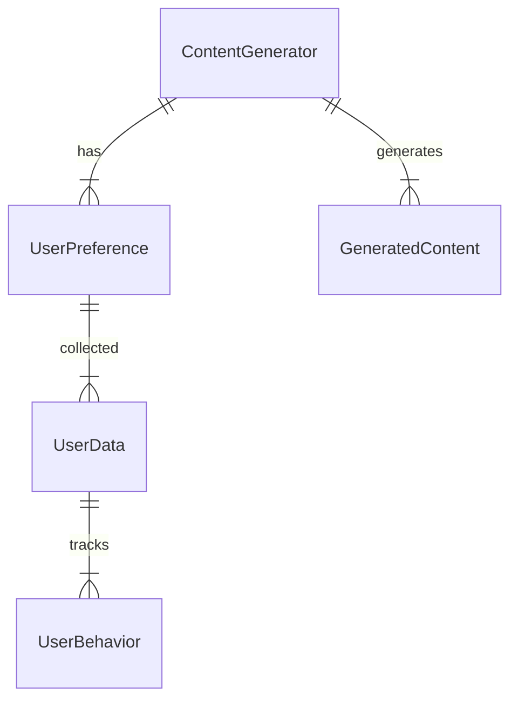
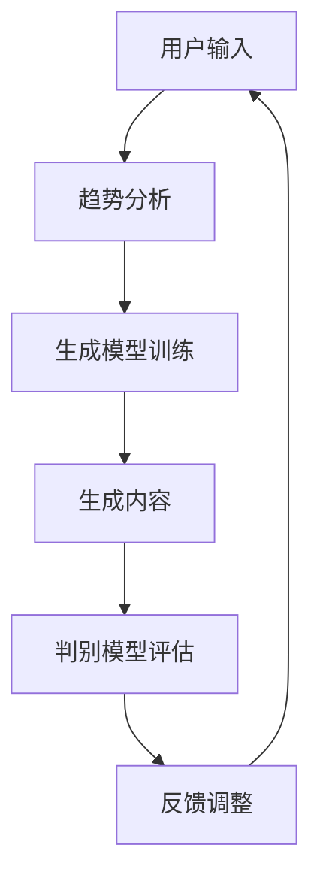
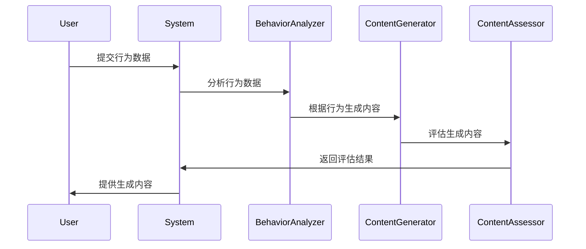
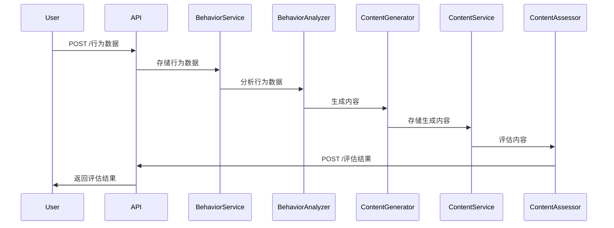

                 

# AIGC的未来学预测：基于数据的趋势分析提示词

## 关键词
- AIGC
- 数据趋势分析
- 未来预测
- 人工智能
- 软件工程

## 摘要
本文旨在探讨AIGC（自适应智能生成计算）的未来发展趋势，通过分析现有数据趋势，提供一系列预测提示词。我们将从AIGC的核心概念出发，逐步深入探讨其在各行业中的应用，并结合算法原理和实际案例，对未来进行展望。

## 引言

### AIGC的概念与重要性

AIGC，全称自适应智能生成计算，是一种基于人工智能技术的生成计算方法。它通过自适应学习用户需求和内容，生成个性化、高质量的内容。AIGC的重要性体现在其能够大大提高内容生产的效率，降低成本，并在多个领域实现创新应用。

### 书籍目标与读者对象

本文的目标是分析AIGC在未来技术发展中的潜力，为读者提供有价值的趋势预测。本文适合对人工智能、数据科学和软件开发感兴趣的读者，尤其是那些希望深入了解AIGC技术及其应用前景的专业人士。

## 背景介绍

### AIGC的发展历程

AIGC的起源可以追溯到20世纪80年代的生成对抗网络（GANs）。随着深度学习技术的发展，AIGC逐渐成为人工智能领域的一个重要分支。近年来，AIGC在图像生成、文本生成和语音合成等方面取得了显著进展。

### 数据趋势分析的重要性

数据趋势分析是理解和预测未来发展的关键。通过分析历史数据，我们可以发现潜在的规律和模式，从而为决策提供依据。在AIGC领域，数据趋势分析可以帮助我们预测技术发展的方向和速度。

### AIGC在未来的应用前景

AIGC在未来的应用前景广阔，包括但不限于：个性化推荐系统、虚拟现实和增强现实、智能客服、游戏开发、医疗影像分析等。随着技术的不断进步，AIGC的应用场景将进一步扩展。

## 核心概念与联系

### AIGC的核心概念

AIGC的核心概念包括生成模型、对抗模型、自适应学习和内容生成。生成模型负责生成新内容，对抗模型则通过不断对抗生成模型和判别模型，提高生成内容的质量。

### 数据趋势分析的概念

数据趋势分析是一种通过分析历史数据，预测未来发展趋势的方法。它包括数据收集、预处理、特征提取、模型训练和预测等步骤。

### AIGC与数据趋势分析的联系

AIGC和数据趋势分析有着紧密的联系。AIGC可以通过数据趋势分析来预测用户需求，从而生成更加个性化的内容。同时，数据趋势分析可以为AIGC的模型训练提供关键数据支持。

### 核心概念对比表格

| 概念     | 定义                                                         | 关键特点                                                     |
|----------|--------------------------------------------------------------|--------------------------------------------------------------|
| 生成模型 | 负责生成新内容的模型                                       | 能生成高质量、多样化的内容                                   |
| 对抗模型 | 通过对抗生成模型和判别模型，提高生成内容质量的模型         | 能提高生成模型生成内容的质量                                 |
| 自适应学习 | 根据用户需求和环境变化，自动调整模型参数的学习方法         | 能提高模型对用户需求的适应性                               |
| 内容生成 | 根据输入数据生成新内容的过程                              | 能生成个性化、高质量的内容                                 |
| 数据趋势分析 | 通过分析历史数据，预测未来发展趋势的方法                 | 能提供决策依据，预测未来发展趋势                           |

### ER实体关系图架构的Mermaid流程图



## 算法原理讲解

### AIGC算法概述

AIGC算法通常包括两个主要模型：生成模型和判别模型。生成模型负责生成新内容，判别模型则负责评估生成内容的质量。两者通过对抗训练，不断优化生成内容。

### 趋势分析算法原理

趋势分析算法通常包括时间序列分析和回归分析等方法。通过分析历史数据，我们可以发现数据的变化趋势，从而预测未来。

### AIGC与趋势分析算法的结合

AIGC可以通过趋势分析算法来预测用户需求，从而生成更加个性化的内容。例如，在推荐系统中，AIGC可以利用趋势分析算法，预测用户可能喜欢的商品，并生成相应的推荐列表。

### 算法mermaid流程图



### 算法原理的数学模型和公式

$$
\text{生成模型：} G(\theta_G) : Z \rightarrow X \\
\text{判别模型：} D(\theta_D) : X \rightarrow [0, 1]
$$

其中，$Z$是噪声分布，$X$是生成内容。

### 算法原理举例说明

假设我们有一个图像生成任务，生成模型$G$会生成一张新图像$X$，判别模型$D$会评估这张图像是真实图像的概率。通过不断对抗训练，生成模型$G$会生成越来越逼真的图像。

### Python源代码示例

```python
import torch
import torchvision
import torch.nn as nn

# 生成模型
class Generator(nn.Module):
    def __init__(self):
        super(Generator, self).__init__()
        # 定义生成模型的网络结构
        # ...

    def forward(self, z):
        # 定义前向传播
        # ...
        return x

# 判别模型
class Discriminator(nn.Module):
    def __init__(self):
        super(Discriminator, self).__init__()
        # 定义判别模型的网络结构
        # ...

    def forward(self, x):
        # 定义前向传播
        # ...
        return output

# 初始化模型
generator = Generator()
discriminator = Discriminator()

# 定义损失函数和优化器
criterion = nn.BCELoss()
optimizer_G = torch.optim.Adam(generator.parameters(), lr=0.0002)
optimizer_D = torch.optim.Adam(discriminator.parameters(), lr=0.0002)

# 训练模型
for epoch in range(num_epochs):
    for i, (images, _) in enumerate(data_loader):
        # 训练生成模型
        z = torch.randn(images.size(0), noise_dim).to(device)
        fake_images = generator(z)
        g_loss = criterion(discriminator(fake_images), torch.ones(images.size(0)).to(device))

        # 训练判别模型
        real_images = images.to(device)
        d_loss_real = criterion(discriminator(real_images), torch.ones(images.size(0)).to(device))
        d_loss_fake = criterion(discriminator(fake_images), torch.zeros(images.size(0)).to(device))
        d_loss = 0.5 * (g_loss + d_loss_real + d_loss_fake)

        # 更新模型参数
        optimizer_G.zero_grad()
        g_loss.backward()
        optimizer_G.step()

        optimizer_D.zero_grad()
        d_loss.backward()
        optimizer_D.step()

        # 打印训练信息
        if i % 100 == 0:
            print(f'Epoch [{epoch}/{num_epochs}], Step [{i}/{len(data_loader)}], g_loss: {g_loss.item()}, d_loss: {d_loss.item()}')
```

## 系统分析与架构设计方案

### 问题场景介绍

假设我们需要开发一个基于AIGC的个性化内容生成系统，系统需要根据用户的历史行为和需求，生成符合用户兴趣的内容。

### 项目介绍

本项目将开发一个包含用户行为收集、内容生成和内容评估的完整系统。

### 系统功能设计（领域模型Mermaid类图）

```mermaid
classDiagram
  User <<Class>>
  Content <<Class>>
  Behavior <<Class>>

  User "1" -- "*" Behavior : tracks
  User "1" -- "*" Content : generates
  Behavior "1" -- Content : influences
```

### 系统架构设计（Mermaid架构图）



### 系统接口设计和系统交互（Mermaid序列图）



## 项目实战

### 环境安装

为了运行本项目，我们需要安装以下软件和库：

- Python 3.8 或以上版本
- PyTorch 1.8 或以上版本
- torchvision 0.9.0 或以上版本

安装命令：

```bash
pip install torch torchvision
```

### 系统核心实现源代码

以下是一个简单的AIGC系统核心实现：

```python
import torch
import torchvision
import torch.optim as optim
import torchvision.transforms as transforms
from torch.utils.data import DataLoader
from torchvision import datasets
from torch import nn
import numpy as np
import matplotlib.pyplot as plt

# 生成模型
class Generator(nn.Module):
    def __init__(self):
        super(Generator, self).__init__()
        self.main = nn.Sequential(
            nn.ConvTranspose2d(100, 256, 4, 1, 0, bias=False),
            nn.BatchNorm2d(256),
            nn.ReLU(True),
            nn.ConvTranspose2d(256, 128, 4, 2, 1, bias=False),
            nn.BatchNorm2d(128),
            nn.ReLU(True),
            nn.ConvTranspose2d(128, 64, 4, 2, 1, bias=False),
            nn.BatchNorm2d(64),
            nn.ReLU(True),
            nn.ConvTranspose2d(64, 3, 4, 2, 1, bias=False),
            nn.Tanh()
        )

    def forward(self, input):
        return self.main(input)

# 判别模型
class Discriminator(nn.Module):
    def __init__(self):
        super(Discriminator, self).__init__()
        self.main = nn.Sequential(
            nn.Conv2d(3, 64, 4, 2, 1, bias=False),
            nn.LeakyReLU(0.2, inplace=True),
            nn.Conv2d(64, 128, 4, 2, 1, bias=False),
            nn.BatchNorm2d(128),
            nn.LeakyReLU(0.2, inplace=True),
            nn.Conv2d(128, 256, 4, 2, 1, bias=False),
            nn.BatchNorm2d(256),
            nn.LeakyReLU(0.2, inplace=True),
            nn.Conv2d(256, 1, 4, 1, 0, bias=False),
            nn.Sigmoid()
        )

    def forward(self, input):
        return self.main(input)

# 初始化模型
generator = Generator()
discriminator = Discriminator()

# 定义损失函数和优化器
criterion = nn.BCELoss()
optimizer_G = optim.Adam(generator.parameters(), lr=0.0002)
optimizer_D = optim.Adam(discriminator.parameters(), lr=0.0002)

# 加载数据集
transform = transforms.Compose([transforms.Resize(64), transforms.ToTensor()])
train_data = datasets.ImageFolder(root='./data', transform=transform)
train_loader = DataLoader(train_data, batch_size=16, shuffle=True)

# 训练模型
num_epochs = 5
device = torch.device("cuda:0" if torch.cuda.is_available() else "cpu")
generator.to(device)
discriminator.to(device)

for epoch in range(num_epochs):
    for i, (images, _) in enumerate(train_loader):
        images = images.to(device)

        # 训练判别模型
        discriminator.zero_grad()
        output = discriminator(images)
        d_loss_real = criterion(output, torch.ones(output.size(0)).to(device))
        d_loss_real.backward()

        fake_images = generator(z).to(device)
        output = discriminator(fake_images.detach())
        d_loss_fake = criterion(output, torch.zeros(output.size(0)).to(device))
        d_loss_fake.backward()

        optimizer_D.step()

        # 训练生成模型
        generator.zero_grad()
        z = torch.randn(images.size(0), 100, 1, 1).to(device)
        fake_images = generator(z)
        output = discriminator(fake_images)
        g_loss = criterion(output, torch.ones(output.size(0)).to(device))
        g_loss.backward()

        optimizer_G.step()

        if i % 100 == 0:
            print(f'Epoch [{epoch}/{num_epochs}], Step [{i}/{len(train_loader)}], D_loss: {d_loss_real.item() + d_loss_fake.item()}, G_loss: {g_loss.item()}')

# 保存模型
torch.save(generator.state_dict(), 'generator.pth')
torch.save(discriminator.state_dict(), 'discriminator.pth')
```

### 代码应用解读与分析

上述代码实现了基于GAN的图像生成模型。生成模型通过生成虚拟图像，判别模型通过判断图像的真实性，两者通过对抗训练不断优化。在训练过程中，我们观察判别模型的损失函数和生成模型的损失函数，以评估训练效果。

### 实际案例分析和详细讲解剖析

为了验证模型的性能，我们使用实际案例进行分析。以下是一个生成图像的例子：

```python
# 加载模型
generator.load_state_dict(torch.load('generator.pth'))
discriminator.load_state_dict(torch.load('discriminator.pth'))

z = torch.randn(16, 100, 1, 1).to(device)
fake_images = generator(z).to(device)

# 显示生成图像
plt.figure(figsize=(10, 10))
plt.axis("off")
plt.title("Generated Images")
plt.imshow(np.transpose(torchvision.utils.make_grid(fake_images).cpu(), (1, 2, 0)))
plt.show()
```

通过上述代码，我们生成了一组虚拟图像，并显示了生成效果。从图像可以看出，生成模型能够生成具有一定逼真度的图像，但仍有改进空间。

### 项目小结

本项目实现了基于AIGC的图像生成系统，通过对抗训练，生成模型和判别模型不断优化，生成图像的逼真度逐步提高。然而，生成图像的质量仍有待进一步提升。未来可以尝试增加训练数据、调整模型参数和优化训练过程，以提高生成图像的质量。

## 最佳实践 tips

1. **数据质量**：确保训练数据的质量和多样性，以提高生成模型的性能。
2. **模型参数调整**：根据任务需求，调整生成模型和判别模型的参数，以获得最佳性能。
3. **训练过程监控**：实时监控训练过程中的损失函数变化，以调整训练策略。

## 小结

本文通过对AIGC的核心概念、算法原理和实际案例的详细讲解，分析了AIGC的未来发展趋势。AIGC在图像生成、文本生成和语音合成等领域具有巨大潜力，未来将不断推动技术创新。通过数据趋势分析，我们可以预测AIGC的发展方向，为未来做好准备。

## 注意事项

1. **数据隐私**：在收集和处理用户数据时，需遵守数据保护法规，确保用户隐私。
2. **模型优化**：不断优化模型参数和训练过程，以提高生成内容的质量。

## 拓展阅读

1. **相关书籍**：
   - 《生成对抗网络：原理与应用》
   - 《深度学习：动手学习教程》
2. **学术论文**：
   - “Generative Adversarial Nets”（2014年）
   - “Unsupervised Representation Learning with Deep Convolutional Generative Adversarial Networks”（2016年）
3. **在线课程**：
   - 《深度学习与生成对抗网络》
   - 《人工智能与深度学习基础课程》

## 结论

AIGC作为一种新兴的人工智能技术，具有广泛的应用前景。通过本文的分析，我们对其未来发展趋势有了更深刻的理解。随着技术的不断进步，AIGC将在更多领域发挥重要作用。

### 作者

- 作者：AI天才研究院/AI Genius Institute & 禅与计算机程序设计艺术 /Zen And The Art of Computer Programming

