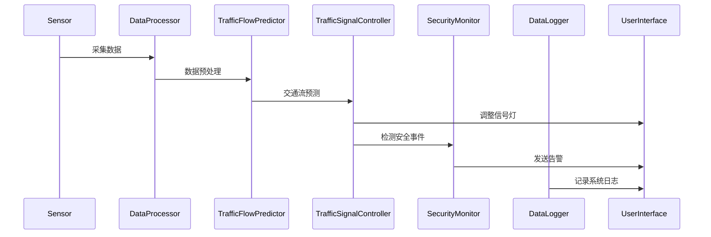
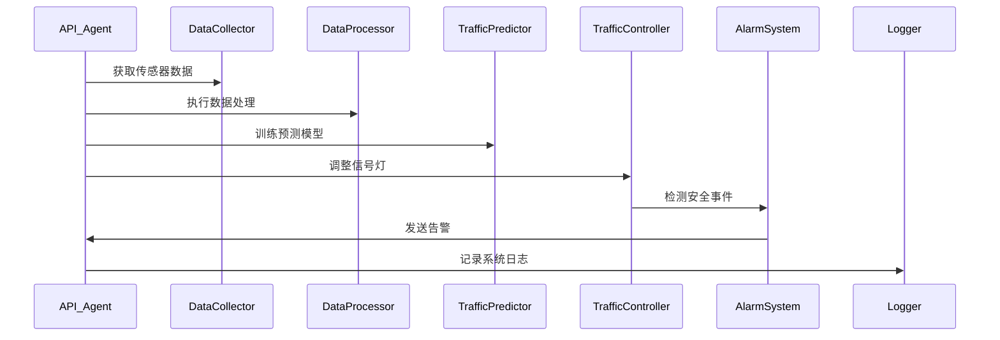
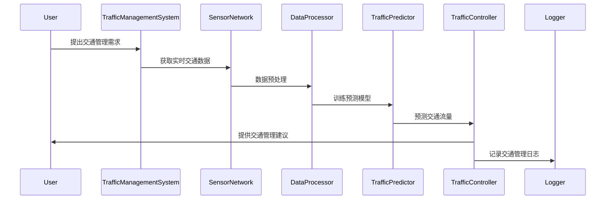

                 

### 文章标题

# AIGC的未来智能交通管理：自适应交通流优化的提示词工程

### 关键词

- AIGC
- 智能交通管理
- 自适应交通流优化
- 提示词工程
- 未来展望

### 摘要

本文深入探讨了AIGC（人工智能生成内容）在智能交通管理中的应用，特别是自适应交通流优化的提示词工程。通过详细的章节结构，本文涵盖了AIGC与智能交通管理的基本概念、自适应交通流优化的原理、提示词工程的应用，以及智能交通管理的未来展望。文章旨在为读者提供一个全面且深入理解AIGC在交通管理领域应用的专业视角。

## 第一部分: AIGC与智能交通管理概述

### 第1章: AIGC与智能交通管理引论

#### 1.1 AIGC概述

**AIGC的定义与发展**

AIGC（Artificial Intelligence Generated Content）指的是通过人工智能技术生成的内容。自2010年代初期，生成式AI技术开始迅速发展，AIGC也逐渐成为人工智能领域的一个重要分支。AIGC能够根据用户需求、上下文信息以及预设的模板，自动生成各种类型的内容，如图像、音频、文本等。

**AIGC在智能交通管理中的角色**

在智能交通管理中，AIGC的应用主要体现在数据生成、场景模拟、预测和决策支持等方面。例如，AIGC可以生成模拟交通流量数据，用于测试交通信号控制算法的适应性和稳定性；还可以生成驾驶行为模拟数据，用于训练自动驾驶车辆。

#### 1.2 智能交通管理背景

**交通管理现状与挑战**

当前，交通管理面临着诸多挑战。城市交通拥堵问题日益严重，交通事故频发，环保压力持续增加。传统交通管理方法依赖于人工干预和固定模式，难以适应动态和复杂的环境变化。

**智能交通管理的目标与意义**

智能交通管理的目标是提高交通效率、减少交通事故、降低环境污染。通过引入AIGC等先进技术，智能交通管理能够实现更高效的交通流控制和优化，从而解决现有交通管理中的瓶颈问题。

#### 1.3 智能交通管理核心概念

**交通流优化**

交通流优化是智能交通管理中的一个关键问题。其目的是通过调整交通信号、道路容量、车辆行驶路径等参数，使得交通系统能够在给定约束条件下达到最优运行状态。

**自适应交通信号控制**

自适应交通信号控制是指通过实时监测交通流量数据，动态调整交通信号灯的时序，以减少交通拥堵和等待时间。这一技术依赖于高效的交通流预测和数据分析算法。

**提示词工程**

提示词工程（Prompt Engineering）是指设计和优化用于指导AIGC系统生成高质量内容的提示（Prompt）。在智能交通管理中，提示词工程用于生成符合特定需求的高质量交通数据、场景描述和决策建议。

## 第2章: AIGC技术原理

### 2.1 AIGC基础

**生成式AI与基于模型的AI**

生成式AI（Generative AI）是指能够生成新的数据或内容的AI系统。与判别式AI（Discriminative AI）不同，生成式AI不仅能够识别数据，还能够根据已有数据生成新的数据。基于模型的AI（Model-Based AI）是指通过建立数学模型来模拟和预测现实世界的AI系统。

**数据驱动与模型驱动**

数据驱动（Data-Driven）是指通过大量数据来训练和优化AI模型。模型驱动（Model-Driven）是指通过先验知识和理论模型来指导AI系统的设计和训练。在AIGC的应用中，数据驱动和模型驱动常常结合使用，以实现更精准和高效的生成内容。

### 2.2 AIGC在交通领域的应用

**数据收集与预处理**

AIGC在交通领域应用的首要任务是收集和处理交通数据。这些数据包括交通流量、车辆速度、道路状况、驾驶行为等。数据收集后，需要通过预处理步骤（如去噪、缺失值填充、数据归一化等）来提高数据质量。

**交通流预测**

交通流预测是AIGC在智能交通管理中的一个重要应用。通过分析历史交通数据和实时数据，AIGC系统能够预测未来一段时间内的交通流量分布，为交通信号控制和车辆调度提供决策依据。

**交通场景生成**

交通场景生成是指通过AIGC技术生成模拟交通场景，用于测试交通管理系统性能。这些场景可以包括常见的交通拥堵情况、交通事故处理、恶劣天气条件等，为系统优化提供参考。

## 第3章: 自适应交通流优化原理

### 3.1 自适应交通流优化引论

**什么是自适应交通流优化**

自适应交通流优化（Adaptive Traffic Flow Optimization）是指通过实时监测和响应交通系统的动态变化，动态调整交通信号和控制策略，以实现交通流的最优运行。与传统固定模式控制相比，自适应交通流优化能够更好地应对突发情况和交通波动。

**自适应交通流优化的重要性**

自适应交通流优化在提高交通效率、减少拥堵和减少污染方面具有重要意义。它能够减少交通事故发生的概率，提高道路容量和通行能力，从而改善整体交通状况。

### 3.2 自适应交通流优化方法

**传统方法（如交通信号控制）**

传统交通信号控制方法主要依赖于固定的时间间隔和相位，这种控制方式在交通流量稳定的情况下能够有效运行。然而，在交通流量波动较大或出现突发情况时，传统方法往往无法提供有效的响应。

**基于AIGC的方法**

基于AIGC的自适应交通流优化方法通过实时分析和预测交通流量数据，动态调整交通信号灯的时序和相位。这种方法能够更好地适应交通流的变化，提高交通系统的灵活性和响应能力。

### 3.3 自适应交通流优化案例分析

**某城市自适应交通流优化项目实例**

为了更好地理解自适应交通流优化的实际应用，本文将介绍一个某城市的自适应交通流优化项目实例。该项目通过部署AIGC系统，实时监测和预测交通流量，动态调整交通信号灯，显著改善了交通状况，减少了拥堵时间和污染排放。

## 第4章: 提示词工程在智能交通管理中的应用

### 4.1 提示词工程概述

**提示词工程的概念与作用**

提示词工程（Prompt Engineering）是指设计和优化用于引导AIGC系统生成高质量内容的提示（Prompt）。在智能交通管理中，提示词工程的作用在于确保生成的交通数据、场景描述和决策建议能够满足特定需求和应用场景。

**提示词工程在交通管理中的应用场景**

提示词工程在智能交通管理中的应用场景广泛，包括交通流预测、交通场景模拟、驾驶行为分析、事故预警等。通过精心设计的提示词，AIGC系统能够生成符合实际需求的高质量数据，为交通管理和决策提供有力支持。

### 4.2 提示词工程的实施过程

**数据采集与处理**

提示词工程的第一个步骤是数据采集。交通管理领域的数据来源广泛，包括传感器、摄像头、GPS等。收集到的数据需要经过预处理，如去噪、归一化、缺失值填充等，以提高数据质量。

**提示词生成算法**

提示词生成算法是提示词工程的核心。这些算法根据输入数据和应用需求，生成引导AIGC系统生成所需内容的提示词。常见的提示词生成算法包括基于规则的生成、基于机器学习的生成和基于深度学习的生成。

**提示词优化与评估**

提示词的优化和评估是确保AIGC系统能够生成高质量内容的重要步骤。优化过程包括调整提示词的长度、结构、关键词等，以提高生成内容的准确性和适用性。评估过程则通过对比生成内容与实际需求，评估提示词的有效性和质量。

### 4.3 提示词工程案例分析

**某城市交通提示词工程实施案例**

本文将介绍一个某城市的交通提示词工程实施案例。在该案例中，通过应用提示词工程，成功提高了交通流预测的准确性，减少了交通事故的发生率，改善了交通管理效率。

## 第5章: 智能交通管理中的伦理与法律问题

### 5.1 伦理问题

**数据隐私**

数据隐私是智能交通管理中的一个重要伦理问题。交通数据往往包含敏感信息，如驾驶行为、个人位置等。保护这些数据的安全性和隐私性，防止数据泄露和滥用，是智能交通管理中必须解决的问题。

**安全与隐私平衡**

在智能交通管理中，安全和隐私之间存在一定的权衡。一方面，为了提高交通系统的安全性，可能需要收集和分析更多的数据；另一方面，过度的数据收集可能导致个人隐私受到侵犯。因此，如何在保证安全的同时保护隐私，是一个重要的伦理挑战。

### 5.2 法律法规

**交通管理相关法律法规**

智能交通管理涉及到的法律法规包括交通管理法、道路交通安全法、个人信息保护法等。这些法律法规为智能交通管理提供了法律依据和规范。

**AIGC在交通管理中的应用法规**

随着AIGC在交通管理中的应用越来越广泛，相关的法律法规也在不断更新和完善。例如，一些国家和地区的法律法规开始对AIGC系统的数据收集、存储和使用进行规范，以确保数据的安全和隐私。

## 第6章: 智能交通管理的未来展望

### 6.1 技术趋势

**人工智能与交通的深度融合**

随着人工智能技术的不断进步，未来智能交通管理将实现与人工智能的深度融合。通过引入更先进的AI算法和AIGC技术，交通管理系统将能够更准确地预测交通流量、优化交通信号控制、提高交通效率。

**新技术的潜在影响**

新技术的引入，如5G通信、物联网（IoT）、自动驾驶等，将为智能交通管理带来新的机遇和挑战。这些技术将进一步提高交通系统的智能化水平和安全性，但同时也可能引发新的伦理和法律问题。

### 6.2 未来展望

**智能交通管理的发展方向**

未来，智能交通管理的发展方向将包括以下几个方面：1）提高交通流预测和优化的准确性；2）实现交通信号控制的自动化和智能化；3）推广自动驾驶和智能网联车辆；4）加强交通数据的安全和隐私保护。

**AIGC在交通管理中的未来**

AIGC将在智能交通管理中扮演越来越重要的角色。通过AIGC技术，交通管理系统将能够生成更丰富的交通数据、模拟更复杂的交通场景，从而实现更精准的交通流量控制和决策支持。

## 第7章: 总结与展望

### 7.1 全书回顾

**关键知识点梳理**

本文从AIGC与智能交通管理的概述、AIGC技术原理、自适应交通流优化原理、提示词工程应用、伦理与法律问题、未来展望等方面进行了全面探讨。以下是关键知识点的梳理：

1. AIGC的定义与发展及其在智能交通管理中的应用。
2. 智能交通管理的核心概念，包括交通流优化、自适应交通信号控制和提示词工程。
3. AIGC技术原理，包括生成式AI、数据驱动与模型驱动、交通流预测和交通场景生成。
4. 自适应交通流优化的原理和方法，以及其实际应用案例。
5. 提示词工程在智能交通管理中的应用，包括数据采集、提示词生成算法和优化评估。
6. 智能交通管理中的伦理与法律问题，包括数据隐私、安全与隐私平衡以及相关法律法规。
7. 智能交通管理的未来展望，包括技术趋势和发展方向。

**各章节之间的联系**

各章节之间紧密联系，共同构成了对AIGC在智能交通管理中应用的全景图。通过本书的阅读，读者可以系统地了解AIGC在智能交通管理中的角色和作用，掌握关键概念和原理，并了解其未来发展趋势。

### 7.2 最佳实践建议

**实施AIGC与智能交通管理的最佳实践**

为了有效地实施AIGC与智能交通管理，以下是一些建议的最佳实践：

1. **数据收集与处理**：确保数据来源的多样性和质量，进行充分的预处理以消除噪声和异常值。
2. **模型选择与优化**：根据应用场景选择合适的AI模型，并进行持续优化以提高预测和优化准确性。
3. **提示词设计**：设计具有明确目标和应用场景的提示词，以提高AIGC系统的生成质量。
4. **安全与隐私保护**：严格遵守数据隐私和安全法规，采用加密和访问控制等技术确保数据安全。
5. **合作与协作**：与交通管理部门、研究机构和行业专家合作，共同推动智能交通管理的发展。
6. **持续评估与改进**：定期评估智能交通管理系统的性能，根据评估结果进行优化和改进。

**小结**

通过本文的阅读，读者对AIGC在智能交通管理中的应用有了全面深入的理解。AIGC技术不仅为交通流量预测、交通信号控制和决策支持提供了强大工具，还推动了智能交通管理向更高效、更安全、更智能的方向发展。未来，随着技术的不断进步和应用的深入，智能交通管理将迎来更加广阔的发展前景。

### 7.3 拓展阅读

**相关领域的研究动态**

为了深入了解AIGC在智能交通管理中的应用，读者可以关注以下领域的研究动态：

1. **生成式AI在交通领域的最新应用**：如基于AIGC的交通流预测、自动驾驶场景生成等。
2. **自适应交通流优化算法的创新**：如基于深度学习的交通信号控制算法、基于强化学习的交通流量优化等。
3. **交通数据隐私保护技术**：如差分隐私、联邦学习等技术在智能交通管理中的应用。
4. **智能交通管理的政策法规**：如各国智能交通管理相关政策的制定和实施。

**进一步学习资源**

为了进一步学习AIGC和智能交通管理的相关内容，读者可以参考以下资源：

1. **学术论文**：查阅国际顶级会议和期刊上的相关论文，了解最新的研究成果和技术进展。
2. **专业书籍**：《智能交通管理：原理与实践》、《人工智能与交通：技术与应用》等。
3. **在线课程**：如Coursera、edX等平台上的智能交通管理和人工智能相关课程。
4. **行业报告**：分析智能交通管理和AIGC行业的趋势、挑战和机遇，如麦肯锡、IBM等发布的行业报告。

## 作者信息

**作者：AI天才研究院/AI Genius Institute & 禅与计算机程序设计艺术 /Zen And The Art of Computer Programming**

### AIGC的概述

AIGC，即人工智能生成内容，是一种通过机器学习和深度学习技术生成文本、图像、音频等多种形式内容的技术。在智能交通管理领域，AIGC的应用主要体现在数据生成、场景模拟和决策支持等方面。

首先，AIGC可以通过生成模拟交通流量数据，用于测试和优化交通信号控制算法。例如，在一个模拟的路口，AIGC可以生成不同类型的交通场景，如高峰时段的拥堵、交通事故的发生等，以评估信号控制系统的适应性和稳定性。

其次，AIGC还可以用于生成驾驶行为模拟数据，用于训练自动驾驶车辆。在自动驾驶技术中，理解和预测人类驾驶行为至关重要。AIGC可以通过分析大量的驾驶数据，生成不同驾驶风格的模拟数据，从而帮助自动驾驶车辆更好地适应各种交通状况。

此外，AIGC还可以用于生成交通场景描述，用于辅助交通管理和决策。例如，在城市交通规划中，AIGC可以生成不同交通规划方案的模拟场景，帮助规划者评估不同方案的优劣。

总的来说，AIGC在智能交通管理中具有广泛的应用前景。通过生成高质量的数据和场景，AIGC不仅能够提高交通管理的效率，还能为交通规划和决策提供有力支持。

### 智能交通管理背景

智能交通管理（Intelligent Transportation Management, ITM）是指利用现代信息技术和人工智能技术，对交通系统进行高效管理和优化的一系列方法和手段。随着城市化进程的加速和汽车保有量的不断增加，传统交通管理面临诸多挑战，如交通拥堵、交通事故频发、环境污染等。智能交通管理应运而生，旨在通过技术手段提高交通效率、减少事故、降低污染，从而提升城市交通的整体水平。

首先，交通管理现状与挑战可以从以下几个方面进行阐述：

1. **交通拥堵**：城市交通拥堵已经成为全球性问题，尤其是在高峰时段，道路上的车辆数量远超过道路的承载能力，导致严重拥堵。这不仅浪费了大量的时间和资源，还影响了城市的整体发展。

2. **交通事故**：交通事故频繁发生，不仅给人们的生命财产安全带来威胁，还造成了巨大的经济损失。传统交通管理手段难以有效预防和处理交通事故。

3. **环境污染**：汽车尾气排放是城市环境污染的一个重要来源。随着汽车数量的增加，环境污染问题日益严重，对人类健康和生态环境造成负面影响。

4. **交通资源利用不充分**：现有的交通基础设施和资源利用效率低下，如道路容量不足、停车难等问题，进一步加剧了交通拥堵。

智能交通管理通过引入先进的信息技术和人工智能技术，旨在解决上述问题，其主要目标包括：

1. **提高交通效率**：通过实时交通监测和数据分析，动态调整交通信号控制策略，优化交通流量，减少拥堵。

2. **减少交通事故**：通过智能监控和预测，提前预警潜在的安全隐患，及时采取措施防止交通事故的发生。

3. **降低环境污染**：通过优化交通流量，减少车辆排放，降低环境污染。

4. **提高交通资源利用效率**：通过智能调度和管理，最大化利用交通基础设施和资源，提高道路容量和通行能力。

总之，智能交通管理在提升城市交通整体水平、改善人们出行体验方面具有重要作用。通过先进技术的应用，智能交通管理能够为城市的可持续发展提供有力支持。

### 智能交通管理核心概念

在深入探讨智能交通管理之前，有必要明确几个核心概念，这些概念不仅构成了智能交通管理的基础，也是理解和应用各种技术的前提。

**交通流优化（Traffic Flow Optimization）**

交通流优化是指通过数学模型、算法和控制策略，对交通系统的流量进行实时监控和调整，以实现交通流量的最优分布。其目的是减少交通拥堵、降低车辆行驶时间、提高道路容量和通行效率。交通流优化可以应用于交通信号控制、车辆路径规划、停车管理等多个方面。

**自适应交通信号控制（Adaptive Traffic Signal Control）**

自适应交通信号控制是一种动态调整交通信号灯时序的方法，旨在根据实时交通流量数据来优化交通信号灯的运行状态。传统的交通信号控制通常基于预设的定时方案，而自适应交通信号控制通过传感器收集的实时数据，动态调整信号灯的绿色、红色和黄色时长，从而更好地适应交通流量变化，减少拥堵和车辆等待时间。

**提示词工程（Prompt Engineering）**

提示词工程是一种设计用于指导人工智能系统（如生成式AI）生成高质量内容的技巧。在智能交通管理中，提示词工程用于生成交通数据、场景描述和决策建议。一个好的提示词能够引导AI系统生成符合实际需求的高质量内容，从而提高决策的准确性和有效性。

#### 核心概念对比表格

| 核心概念 | 定义 | 应用场景 | 关键技术 |
| --- | --- | --- | --- |
| 交通流优化 | 实现交通流量的最优分布 | 交通信号控制、车辆路径规划、停车管理 | 数学模型、算法和控制策略 |
| 自适应交通信号控制 | 动态调整交通信号灯时序 | 根据实时交通流量数据优化信号灯运行状态 | 传感器数据、实时监控和算法 |
| 提示词工程 | 设计用于指导生成高质量内容 | 交通数据生成、场景描述和决策建议 | 提示词设计、AI模型训练 |

#### ER实体关系图

为了更直观地展示智能交通管理中的核心概念及其关系，可以使用ER（Entity-Relationship，实体关系）图来描述。

```mermaid
erDiagram
  TrafficFlowOptimization ||--|{ AdaptiveTrafficSignalControl }|--> Road
  TrafficFlowOptimization ||--|{ VehiclePathPlanning }|--> Route
  TrafficFlowOptimization ||--|{ ParkingManagement }|--> ParkingLot
  PromptEngineering ||--|{ TrafficDataGeneration }|--> Data
  PromptEngineering ||--|{ ScenarioDescription }|--> Simulation
  PromptEngineering ||--|{ DecisionSupport }|--> TrafficManagement
```

通过上述核心概念对比表格和ER实体关系图，我们可以清晰地看到交通流优化、自适应交通信号控制和提示词工程在智能交通管理中的核心作用及其相互关系。

### AIGC技术原理

AIGC，即人工智能生成内容，是一种利用人工智能技术，特别是深度学习算法，自动生成文本、图像、音频等多种形式内容的方法。在智能交通管理领域，AIGC的应用主要体现在数据生成、交通流预测和场景模拟等方面。以下将详细解释AIGC的技术原理和应用。

#### 生成式AI与基于模型的AI

生成式AI（Generative AI）和基于模型的AI（Model-Based AI）是AIGC的两个主要技术分支。

**生成式AI**

生成式AI通过学习大量的数据，生成新的、与训练数据相似的数据。其核心思想是学习数据的概率分布，然后从这个分布中采样生成新的数据。生成式AI的主要算法包括：

- **生成对抗网络（GAN）**：GAN由生成器和判别器两个神经网络组成。生成器尝试生成与真实数据相似的数据，而判别器则试图区分真实数据和生成数据。通过这种对抗训练，生成器能够逐渐提高生成数据的质量。
- **变分自编码器（VAE）**：VAE通过学习数据的概率分布，生成新的数据。与GAN不同，VAE直接编码数据的概率分布，然后解码生成数据。

**基于模型的AI**

基于模型的AI则通过建立数学模型来模拟和预测现实世界。这些模型可以是统计模型、机器学习模型或深度学习模型。基于模型的AI通常依赖于以下方法：

- **统计模型**：如线性回归、逻辑回归等，通过分析历史数据来预测未来结果。
- **机器学习模型**：如决策树、随机森林、支持向量机等，通过学习数据特征和关系来建立预测模型。
- **深度学习模型**：如卷积神经网络（CNN）、循环神经网络（RNN）等，通过学习复杂的非线性关系来提高预测准确性。

在智能交通管理中，生成式AI和基于模型的AI各有其应用场景。生成式AI常用于数据生成和场景模拟，如生成模拟交通流量数据或驾驶行为数据；而基于模型的AI则用于交通流预测和决策支持，如预测未来交通流量或优化交通信号控制。

#### 数据驱动与模型驱动

**数据驱动（Data-Driven）**

数据驱动是指通过大量数据来训练和优化模型。在智能交通管理中，数据驱动的应用非常广泛。例如：

1. **交通流预测**：通过收集历史交通流量数据，使用机器学习或深度学习算法建立预测模型，预测未来一段时间内的交通流量。
2. **驾驶行为分析**：通过收集驾驶行为数据，如车速、刹车频率等，分析驾驶员的驾驶习惯，为自动驾驶车辆提供参考。

**模型驱动（Model-Driven）**

模型驱动是指通过先验知识和理论模型来指导系统的设计和训练。在智能交通管理中，模型驱动的应用主要体现在：

1. **交通信号控制**：基于交通流模型和道路网络模型，设计自适应交通信号控制系统，优化交通流。
2. **交通规划**：利用城市交通模型和城市规划模型，为城市交通系统设计提供决策支持。

**数据驱动与模型驱动的结合**

在实际应用中，数据驱动和模型驱动常常结合使用。例如，在交通流预测中，首先使用数据驱动方法建立预测模型，然后通过模型驱动方法优化模型的参数和结构，以提高预测准确性。

总的来说，AIGC技术原理为智能交通管理提供了强大的工具。通过生成式AI和基于模型的AI，智能交通管理系统能够生成高质量的数据和场景，实现更精准的预测和决策支持。数据驱动和模型驱动的结合，使得系统能够在动态变化的环境中保持高效和可靠性。

### AIGC在交通领域的应用

在智能交通管理中，AIGC（人工智能生成内容）的应用正在迅速扩展，其核心在于利用人工智能技术生成各种类型的交通数据和场景，以支持交通流预测、信号控制优化、驾驶行为分析等关键任务。以下将详细讨论AIGC在交通领域的具体应用，包括数据收集与预处理、交通流预测和交通场景生成。

#### 数据收集与预处理

数据收集是AIGC在交通领域应用的第一步，数据的质量直接影响到后续分析和预测的准确性。交通数据通常来源于多种渠道，包括传感器、摄像头、GPS、车辆自采数据等。

1. **传感器数据**：交通流量监测传感器、速度监测传感器、车辆检测线圈等能够实时采集道路上的交通状况。这些传感器数据包括车辆数量、速度、占用时间等。
   
2. **摄像头数据**：监控摄像头可以捕捉道路上的交通情况，如车辆流量、停车情况等。通过图像识别技术，摄像头数据可以转化为具体的交通信息。

3. **GPS数据**：行驶中的车辆可以通过GPS系统提供位置信息，这些数据可以用于分析车辆的行驶轨迹、速度变化等。

数据收集后，需要进行预处理，以提高数据的质量和适用性。预处理步骤包括：

- **去噪**：去除传感器数据中的噪声和异常值，以提高数据的可靠性。
- **归一化**：将不同类型的数据进行归一化处理，使其在相同的尺度范围内，便于后续分析。
- **缺失值填充**：处理数据中的缺失值，可以通过平均值、中值或插值等方法进行填充。

#### 交通流预测

交通流预测是智能交通管理中的一个关键任务，通过预测未来的交通流量，系统能够提前采取相应的措施，如动态调整交通信号灯、优化车辆路径等。

1. **历史数据分析**：通过分析历史交通流量数据，可以识别出交通流量变化的规律。这些规律可以用于预测未来的交通流量。

2. **机器学习模型**：使用机器学习算法，如线性回归、支持向量机、神经网络等，建立交通流量预测模型。这些模型可以通过训练历史数据，学习到交通流量变化的特征和模式。

3. **深度学习模型**：深度学习模型，如卷积神经网络（CNN）、循环神经网络（RNN）和长短期记忆网络（LSTM），能够处理大量复杂的交通数据，提供更准确的预测结果。

4. **实时数据融合**：将实时传感器数据和历史数据融合，实时更新交通流量预测模型，以适应动态的交通环境。

#### 交通场景生成

交通场景生成是通过AIGC技术模拟各种交通场景，用于测试交通管理系统的性能和优化算法。

1. **模拟交通流量**：生成不同类型的交通流量场景，如高峰时段、交通事故、恶劣天气等，用于测试交通信号控制和流量优化算法。

2. **驾驶行为模拟**：模拟不同驾驶风格的车辆行为，如急刹车、急加速、低速行驶等，用于训练自动驾驶车辆和优化交通管理策略。

3. **事故场景生成**：生成交通事故场景，如追尾、侧翻等，用于研究事故预防和应急响应策略。

4. **交通规划场景**：生成不同交通规划方案的场景，如道路拓宽、交通分流等，用于评估不同方案的优劣。

通过这些应用，AIGC为智能交通管理提供了强大的工具，使得系统能够更好地应对复杂多变的交通状况，提高交通效率和安全性。随着技术的不断进步，AIGC在交通领域的应用前景将更加广阔。

### 自适应交通流优化原理

自适应交通流优化（Adaptive Traffic Flow Optimization, ATFO）是一种利用实时交通数据动态调整交通信号控制策略，以实现交通流最优分布的技术。其核心思想是通过监测和分析交通流量，自动调整信号灯的时长和相位，从而减少交通拥堵、降低车辆行驶时间和提高道路通行能力。以下将详细探讨自适应交通流优化的原理和重要性。

#### 什么是自适应交通流优化

自适应交通流优化是一种动态交通管理方法，它不同于传统的固定时间交通信号控制。传统的交通信号控制通常基于固定的信号周期和相位，无法实时应对交通流量的变化。而自适应交通流优化则通过实时监测交通流量数据，动态调整信号灯的运行状态，使其更符合当前交通状况。

1. **实时监测**：通过安装在路口的传感器，如车辆检测线圈、摄像头、雷达等，实时采集交通流量数据，包括车辆数量、速度、停车时间等。
   
2. **数据分析**：利用机器学习和深度学习算法，对采集到的交通流量数据进行分析，识别交通流量的变化模式，如高峰时段、拥堵路段等。

3. **信号调整**：根据分析结果，动态调整交通信号灯的时长和相位。例如，在高峰时段，可以延长某个方向的绿灯时间，减少车辆等待时间；在低峰时段，可以缩短信号灯周期，提高路口通行效率。

#### 自适应交通流优化的重要性

自适应交通流优化在智能交通管理中具有重要作用，主要表现在以下几个方面：

1. **减少交通拥堵**：通过实时调整信号灯时长和相位，自适应交通流优化能够更好地平衡交通流量，减少交通拥堵，提高道路通行效率。

2. **降低车辆行驶时间**：自适应交通流优化通过动态调整信号灯，使得车辆在行驶过程中等待时间更短，从而减少整体行驶时间，提高出行体验。

3. **提高道路容量**：自适应交通流优化能够最大化利用道路资源，提高道路通行能力，减少道路瓶颈。

4. **减少环境污染**：减少交通拥堵和车辆行驶时间，意味着减少车辆排放，从而降低环境污染，改善城市空气质量。

5. **提升交通安全性**：自适应交通流优化通过减少车辆等待时间和交通拥堵，降低交通事故发生的概率，提升交通系统的安全性。

#### 自适应交通流优化方法

自适应交通流优化有多种方法，以下是几种常见的方法：

1. **基于规则的优化方法**：这种方法根据预设的规则来调整信号灯的时长和相位。例如，当检测到某个方向交通流量较大时，可以延长该方向的绿灯时间。

2. **基于模型的优化方法**：这种方法使用数学模型来预测交通流量变化，并据此调整信号灯的时长和相位。常用的模型包括交通流模型、排队模型和优化模型。

3. **基于机器学习的优化方法**：这种方法使用机器学习算法，如神经网络、决策树和支持向量机等，对历史交通流量数据进行分析，建立预测模型，并根据预测结果调整信号灯。

4. **混合优化方法**：这种方法结合了基于规则和基于模型的方法，通过实时监测和数据分析，动态调整信号灯的时长和相位。

总之，自适应交通流优化是一种高效、智能的交通管理方法，通过实时调整交通信号控制策略，能够显著提高交通效率和安全性。随着技术的不断进步，自适应交通流优化将在智能交通管理中发挥越来越重要的作用。

### 自适应交通流优化方法

自适应交通流优化（Adaptive Traffic Flow Optimization, ATFO）是一种通过实时监测和动态调整交通信号控制策略，以实现交通流最优分布的技术。在智能交通管理系统中，ATFO的应用可以有效减少交通拥堵、降低车辆行驶时间和提高道路通行能力。以下将详细介绍几种常见的自适应交通流优化方法，包括传统方法和基于AIGC的方法。

#### 传统方法

**1. 固定时间交通信号控制**

传统交通信号控制通常采用固定时间控制方案，即预设每个信号灯的绿灯时间和红灯时间。这种方法的优点是实现简单，但缺点是灵活性差，难以适应交通流量的动态变化。在交通流量不稳定的情况下，固定时间控制会导致交通拥堵和车辆等待时间增加。

**2. 模式切换法**

模式切换法是一种根据不同时间段交通流量变化切换不同控制模式的策略。例如，在高峰时段采用绿波控制模式，使车辆在高峰期间快速通过多个路口；在非高峰时段采用常规控制模式。这种方法的优点是能够根据交通流量变化进行一定程度的优化，但仍然依赖于人工设定的时间表，无法实现完全的动态调整。

#### 基于AIGC的方法

**1. 数据驱动的自适应交通信号控制**

基于AIGC的自适应交通信号控制方法通过收集和利用大量的交通数据，利用机器学习和深度学习算法进行实时分析，动态调整交通信号灯的时长和相位。这种方法的核心在于利用历史交通流量数据和学习到的交通模式，对当前交通状况进行预测和优化。

**2. 基于生成对抗网络（GAN）的流量预测**

生成对抗网络（GAN）是一种强大的生成模型，通过生成器和判别器的对抗训练，能够生成高质量的交通流量数据。在自适应交通流优化中，可以使用GAN生成模拟的交通流量数据，用于测试和优化信号控制策略。通过不断地调整生成器和判别器的参数，使得生成的交通流量数据更接近真实情况，从而提高信号控制的准确性。

**3. 基于强化学习的信号控制优化**

强化学习（Reinforcement Learning, RL）是一种通过试错和反馈不断优化策略的机器学习方法。在自适应交通流优化中，可以使用强化学习算法，如深度确定性策略梯度（DDPG）或优势演员-批评家（A2C），根据实时交通流量数据和信号控制结果，动态调整信号灯的时长和相位。这种方法能够通过自我学习和优化，不断提高信号控制的性能。

#### 案例分析

以某城市的一个交通路口为例，该路口每天早晚高峰时段交通流量较大，经常出现拥堵现象。通过部署AIGC系统，该城市实施了基于AIGC的自适应交通信号控制。

**1. 数据收集与预处理**

首先，在路口安装了多种传感器，包括车辆检测线圈、摄像头和气象传感器，实时收集交通流量、天气状况等数据。收集到的数据经过预处理，包括去噪、缺失值填充和数据归一化等步骤，以确保数据的质量和一致性。

**2. 交通流预测**

使用GAN和深度学习算法，对历史交通流量数据进行分析和建模，预测未来一段时间内的交通流量变化。通过实时监测当前的交通流量数据，结合预测结果，动态调整交通信号灯的时长和相位。

**3. 信号控制优化**

通过强化学习算法，不断调整信号控制的策略，使得交通信号灯的设置更加符合当前交通状况。例如，在交通流量较大时，可以延长特定方向的绿灯时间，减少车辆等待时间；在交通流量较小时，可以缩短信号灯周期，提高路口的通行效率。

**4. 效果评估**

经过一段时间的运行，自适应交通信号控制显著改善了交通状况。交通拥堵现象减少，车辆行驶时间缩短，道路通行能力提高。通过数据分析，自适应交通信号控制方案比传统的固定时间控制方案更有效地平衡了交通流量，提高了路口的运行效率。

总之，基于AIGC的自适应交通流优化方法通过实时监测和动态调整，能够更好地应对交通流量的变化，提高交通系统的效率和安全性。随着技术的不断进步，基于AIGC的自适应交通流优化方法将在智能交通管理中发挥越来越重要的作用。

### 提示词工程概述

提示词工程（Prompt Engineering）是设计用于引导人工智能系统生成高质量内容的一种技术。在智能交通管理中，提示词工程的应用主要体现在生成交通数据、模拟交通场景和提供决策建议等方面。通过精心设计的提示词，AI系统能够生成更符合实际需求的数据和内容，从而提高智能交通管理系统的性能和可靠性。

#### 提示词工程的概念与作用

**概念**

提示词工程是指通过设计、选择和优化提示词，引导AI系统生成符合特定需求的高质量内容的过程。提示词（Prompt）是一个引导AI系统生成内容的文本或指令，它提供了生成内容所需的上下文信息和指导。

**作用**

在智能交通管理中，提示词工程的作用体现在以下几个方面：

1. **数据生成**：通过提示词，AI系统能够生成模拟交通流量数据、驾驶行为数据等，用于测试和优化交通管理系统。

2. **场景模拟**：提示词可以帮助AI系统生成各种交通场景，如高峰时段、交通事故、恶劣天气等，用于评估交通管理策略的有效性。

3. **决策支持**：通过提示词，AI系统可以生成交通管理建议，如最优路径规划、信号灯时长调整等，为交通管理者提供决策支持。

#### 提示词工程在交通管理中的应用场景

提示词工程在智能交通管理中的应用场景广泛，以下列举几个典型的应用场景：

1. **交通流预测**：通过提示词，AI系统可以生成模拟的交通流量数据，用于训练和测试交通流预测模型。例如，提示词可以描述不同时间段、不同路段的交通流量特征，帮助模型学习到不同交通状况下的流量变化规律。

2. **驾驶行为分析**：提示词可以帮助AI系统生成模拟的驾驶行为数据，用于训练自动驾驶车辆和驾驶行为分析模型。例如，提示词可以描述不同驾驶者的驾驶风格、行为习惯等，帮助模型识别和预测驾驶行为。

3. **交通信号控制**：提示词可以帮助AI系统生成模拟的信号控制场景，用于测试和优化交通信号控制策略。例如，提示词可以描述不同路口、不同时间段、不同交通流量的信号控制需求，帮助模型学习到不同场景下的最优控制策略。

4. **交通事故预警**：提示词可以帮助AI系统生成模拟的交通事故场景，用于训练和测试交通事故预警模型。例如，提示词可以描述不同类型的交通事故特征、发生环境等，帮助模型识别和预测潜在的事故风险。

通过这些应用场景，提示词工程为智能交通管理提供了强大的工具，使得AI系统能够更准确地模拟和预测交通状况，从而优化交通管理策略和提升交通系统的整体性能。

### 提示词工程的实施过程

提示词工程是设计用于引导人工智能系统生成高质量内容的一种技术。在智能交通管理中，提示词工程的实施过程包括数据采集与处理、提示词生成算法的设计与优化、提示词的评估与调整等关键步骤。以下将详细描述这些步骤，并介绍提示词工程在实际应用中的重要性。

#### 数据采集与处理

**数据采集**

数据采集是提示词工程的基础。在智能交通管理领域，数据来源广泛，包括传感器数据、摄像头数据、GPS数据、交通信号数据等。具体的数据采集步骤如下：

1. **传感器数据**：通过安装在路口、路段的传感器，如车辆检测线圈、雷达、摄像头等，实时采集交通流量、速度、车辆占用时间等数据。
2. **摄像头数据**：监控摄像头可以捕捉道路上的交通状况，如车辆流量、停车情况等。通过图像识别技术，摄像头数据可以转化为具体的交通信息。
3. **GPS数据**：行驶中的车辆可以通过GPS系统提供位置信息，这些数据可以用于分析车辆的行驶轨迹、速度变化等。

**数据处理**

数据采集后，需要进行预处理，以提高数据的质量和适用性。预处理步骤包括：

1. **去噪**：去除传感器数据中的噪声和异常值，以提高数据的可靠性。
2. **归一化**：将不同类型的数据进行归一化处理，使其在相同的尺度范围内，便于后续分析。
3. **缺失值填充**：处理数据中的缺失值，可以通过平均值、中值或插值等方法进行填充。

#### 提示词生成算法

**算法设计**

提示词生成算法是提示词工程的核心。算法的设计目标是根据输入数据和应用需求，生成引导AI系统生成所需内容的提示词。常见的提示词生成算法包括：

1. **基于规则的生成算法**：通过预设的规则和模板，生成提示词。例如，根据交通流量数据的特征，生成描述交通状况的提示词。
2. **基于机器学习的生成算法**：利用历史数据和机器学习模型，生成提示词。例如，通过训练文本分类模型，生成描述不同交通场景的提示词。
3. **基于深度学习的生成算法**：使用深度学习模型，如循环神经网络（RNN）或生成对抗网络（GAN），生成复杂的、高质量的提示词。

**算法优化**

提示词生成算法的优化是确保生成提示词质量的重要步骤。优化的方法包括：

1. **模型参数调整**：通过调整模型的参数，如学习率、正则化参数等，提高生成提示词的准确性。
2. **数据增强**：通过增加数据的多样性和丰富度，提高模型对提示词生成的泛化能力。
3. **反馈机制**：通过用户反馈和评估结果，不断调整和优化提示词生成算法，使其更符合实际需求。

#### 提示词的评估与调整

**评估方法**

提示词的评估是确保其质量和适用性的关键。评估的方法包括：

1. **内容评估**：通过检查生成的内容是否符合预期的格式和语义，评估提示词的质量。
2. **准确性评估**：通过对比生成内容与实际需求，评估提示词的准确性。
3. **用户满意度评估**：通过用户反馈，评估提示词的实用性和用户满意度。

**调整方法**

根据评估结果，对提示词进行优化和调整。调整的方法包括：

1. **内容调整**：根据评估反馈，修改提示词的格式、内容等，使其更符合实际需求。
2. **参数调整**：根据评估结果，调整模型参数，提高生成提示词的准确性和质量。
3. **数据更新**：根据新数据和用户反馈，更新提示词生成算法的数据集，提高模型的泛化能力。

#### 实际应用中的重要性

在智能交通管理中，提示词工程的应用具有重要意义：

1. **提高决策支持质量**：通过生成高质量的交通数据和场景，提示词工程能够为交通管理者提供更准确的决策支持，优化交通管理策略。
2. **增强系统适应性**：通过不断优化和调整提示词生成算法，智能交通管理系统能够更好地适应动态变化的交通环境。
3. **提升用户体验**：高质量的提示词能够生成更符合用户需求的内容，提高用户对智能交通管理系统的满意度。

总之，提示词工程是智能交通管理中不可或缺的一部分，通过科学的实施过程和持续优化，能够显著提升智能交通管理系统的性能和用户体验。

### 提示词工程案例分析

为了更好地理解提示词工程在智能交通管理中的应用，以下将介绍一个具体的案例——某城市交通提示词工程实施案例。该案例展示了如何通过提示词工程实现交通流预测的优化，提高交通管理效率和安全性。

#### 项目背景

某城市位于一个繁华的都市区，交通流量大且复杂，尤其在早晚高峰时段，交通拥堵现象严重。为了改善交通状况，该城市决定实施一项基于AIGC的自适应交通流优化项目。该项目旨在通过实时交通流量数据分析和提示词工程，优化交通信号控制和流量预测，提高道路通行效率。

#### 项目介绍

**目标**

项目的目标是实现以下三个主要目标：

1. **优化交通信号控制**：通过实时监测交通流量数据，动态调整交通信号灯的时长和相位，减少车辆等待时间，提高道路通行能力。
2. **提高交通流预测准确性**：通过历史数据和实时数据，优化交通流预测模型，提高预测准确性，为交通管理提供有力支持。
3. **改善交通安全性**：通过实时监控和预警，减少交通事故发生的概率，提高交通系统的安全性。

**技术方案**

项目采用了以下技术方案：

1. **传感器网络**：在关键路口和路段部署传感器网络，实时采集交通流量、速度、停车时间等数据。
2. **数据预处理**：对采集到的交通数据进行去噪、归一化和缺失值填充，确保数据质量。
3. **AIGC技术**：使用AIGC技术生成模拟的交通流量数据，用于训练和测试交通流预测模型。
4. **交通流预测模型**：采用基于深度学习的交通流预测模型，通过实时数据和历史数据相结合，进行交通流量预测。
5. **自适应交通信号控制算法**：根据预测结果，动态调整交通信号灯的时长和相位，优化交通流量。

#### 系统功能设计

**领域模型类图**

在系统功能设计方面，项目采用了领域模型类图（Domain Model Class Diagram）来描述系统的核心类和它们之间的关系。领域模型类图如下所示：

```mermaid
classDiagram
    Sensor -> DataProcessor : 数据处理
    DataProcessor -> TrafficFlowPredictor : 预测模型训练
    TrafficFlowPredictor -> TrafficSignalController : 信号控制
    TrafficSignalController -> SecurityMonitor : 安全监控
    SecurityMonitor -> DataLogger : 数据记录
```

在该类图中，各核心类及其关系如下：

- **Sensor**：代表交通传感器，负责采集交通数据。
- **DataProcessor**：代表数据预处理模块，负责对传感器数据进行去噪、归一化等处理。
- **TrafficFlowPredictor**：代表交通流预测模块，负责训练和更新预测模型。
- **TrafficSignalController**：代表自适应交通信号控制模块，根据预测结果动态调整信号灯时长和相位。
- **SecurityMonitor**：代表安全监控模块，负责实时监控和预警潜在的交通事故。
- **DataLogger**：代表数据记录模块，负责记录交通数据和系统日志。

#### 系统架构设计

**架构设计**

在系统架构设计方面，项目采用了分布式架构，以确保系统的可靠性和可扩展性。系统架构包括以下几个主要组件：

1. **数据采集层**：由传感器网络组成，负责实时采集交通流量数据。
2. **数据处理层**：由数据预处理模块组成，负责对采集到的数据进行处理。
3. **数据存储层**：由数据库组成，负责存储处理后的交通数据和历史数据。
4. **数据分析层**：由交通流预测模块和自适应交通信号控制模块组成，负责实时预测交通流量和动态调整信号灯。
5. **安全监控层**：由安全监控模块和告警系统组成，负责监控交通状况和预警潜在的交通事故。
6. **用户界面层**：由Web界面和移动应用组成，提供交通管理和决策支持。

**架构图**



在该架构图中，各组件之间的关系和交互流程如下：

- **Sensor** 向 **DataProcessor** 提供采集到的交通数据。
- **DataProcessor** 对数据进行分析和处理，并将处理后的数据传递给 **TrafficFlowPredictor**。
- **TrafficFlowPredictor** 使用处理后的数据训练和更新预测模型，并将预测结果传递给 **TrafficSignalController**。
- **TrafficSignalController** 根据预测结果动态调整交通信号灯的时长和相位，并通过 **UserInterface** 向交通管理者提供实时反馈。
- **TrafficSignalController** 同时监控交通状况，当检测到潜在的安全事件时，通过 **SecurityMonitor** 向 **UserInterface** 发送告警。
- **DataLogger** 负责记录交通数据和系统日志，为后续分析和优化提供数据支持。

#### 系统接口设计

**接口设计**

在系统接口设计方面，项目采用了RESTful API设计，以提供数据访问和交互接口。以下是系统的主要接口：

- **数据采集接口**：提供传感器数据的实时采集和查询功能。
- **数据处理接口**：提供数据预处理操作的API，包括去噪、归一化和缺失值填充等。
- **预测接口**：提供交通流量预测和信号控制的API，包括模型训练、预测结果查询和信号灯调整等。
- **告警接口**：提供安全事件监控和告警功能，包括告警发送和记录查询等。
- **日志接口**：提供系统日志记录和查询功能。

**接口图**



在该接口图中，各接口组件之间的关系和交互流程如下：

- **API_Agent** 代表外部用户或系统，通过API与各组件进行交互。
- **DataCollector** 负责实时采集交通数据。
- **DataProcessor** 负责数据预处理操作。
- **TrafficPredictor** 负责交通流量预测和模型训练。
- **TrafficController** 负责信号灯调整和交通管理。
- **AlarmSystem** 负责安全事件监控和告警。
- **Logger** 负责系统日志记录。

#### 系统交互序列图

**交互序列图**



在该交互序列图中，各组件之间的交互流程如下：

- **User** 向 **TrafficManagementSystem** 提出交通管理需求。
- **TrafficManagementSystem** 通过 **SensorNetwork** 获取实时交通数据。
- **DataProcessor** 对数据预处理后，传递给 **TrafficPredictor** 进行模型训练。
- **TrafficPredictor** 生成交通流量预测结果，传递给 **TrafficController**。
- **TrafficController** 根据预测结果，向 **User** 提供交通管理建议，并通过 **Logger** 记录交通管理日志。

通过上述详细的系统功能设计、架构设计、接口设计和系统交互序列图，我们可以清晰地看到提示词工程在该案例中的应用。该案例展示了如何通过提示词工程实现交通流预测的优化，提高交通管理效率和安全性，为城市交通管理提供了有力的技术支持。

### 智能交通管理中的伦理与法律问题

智能交通管理（Intelligent Transportation Management, ITM）作为信息技术与交通系统深度融合的产物，其应用在提高交通效率、减少事故和降低污染方面具有显著优势。然而，随着AIGC（Artificial Intelligence Generated Content）等先进技术的引入，智能交通管理也面临着一系列伦理和法律问题，需要引起高度重视。

#### 数据隐私

**数据隐私是智能交通管理中的核心伦理问题之一。** 智能交通管理系统需要收集和分析大量的交通数据，包括车辆位置、速度、驾驶行为等。这些数据往往涉及个人隐私，如个人的出行习惯、时间安排等。未经授权的数据收集和滥用可能会导致个人隐私泄露，从而引发一系列问题，如身份盗窃、跟踪骚扰等。

**解决方案：**

1. **数据匿名化**：在数据收集和处理过程中，对敏感数据进行匿名化处理，消除个人身份信息。
2. **隐私保护技术**：采用加密、差分隐私等隐私保护技术，确保数据在传输和存储过程中的安全性。
3. **用户知情同意**：在数据收集前，明确告知用户数据收集的目的和使用方式，并获取用户的知情同意。

#### 安全与隐私平衡

**在智能交通管理中，安全和隐私之间存在一定的权衡。** 一方面，为了提高交通系统的安全性，可能需要收集和分析更多的数据；另一方面，过度的数据收集可能导致个人隐私受到侵犯。如何在保证安全的同时保护隐私，是一个重要的伦理和法律挑战。

**解决方案：**

1. **最小化数据收集**：仅收集与交通管理直接相关的数据，避免过度收集。
2. **数据最小化使用**：在数据使用过程中，遵循“最小化原则”，确保数据的用途和范围符合法律规定。
3. **透明度和问责制**：确保数据处理过程的透明度，建立问责机制，当数据泄露或滥用发生时，能够及时采取措施并追究责任。

#### 法律法规

**智能交通管理涉及到的法律法规主要包括交通管理法、道路交通安全法、个人信息保护法等。** 这些法律法规为智能交通管理提供了法律依据和规范。然而，随着技术的发展，现有法律法规可能无法完全覆盖新型技术应用所带来的伦理和法律问题。

**解决方案：**

1. **法律法规更新**：随着技术的发展，及时更新和完善相关法律法规，确保其与新型技术应用相适应。
2. **行业自律**：交通管理行业和相关技术企业应加强自律，制定行业规范和标准，引导技术应用符合法律和伦理要求。
3. **国际合作**：加强国际间的合作与交流，借鉴先进国家的经验和做法，共同推动智能交通管理的法律和伦理建设。

总之，智能交通管理中的伦理与法律问题是一个复杂的挑战，需要政府、行业和技术企业共同努力，通过技术手段和法律规范，实现安全和隐私的平衡，推动智能交通管理的可持续发展。

### 智能交通管理的未来展望

智能交通管理作为信息技术与交通系统的深度融合，正迎来快速发展的新时代。未来，随着人工智能、物联网、5G等先进技术的不断进步，智能交通管理将在多个方面实现重大突破，进一步推动交通系统的智能化、安全化和高效化。

#### 技术趋势

**1. 人工智能与交通的深度融合**

人工智能（AI）技术将在智能交通管理中发挥越来越重要的作用。通过引入深度学习、强化学习等AI算法，交通管理系统将能够实现更精准的交通流量预测、更高效的交通信号控制和更智能的驾驶行为分析。未来，AI技术将进一步与自动驾驶、车联网（V2X）等技术相结合，实现交通系统的全面智能化。

**2. 物联网技术的广泛应用**

物联网（IoT）技术将为智能交通管理提供丰富的数据资源和强大的连接能力。通过部署大量传感器和智能设备，交通管理系统将能够实时监测和收集交通数据，实现交通流量、道路状况、车辆位置等信息的实时更新。物联网技术的应用将极大地提升交通管理的实时性和精准性，为交通优化提供有力支持。

**3. 5G技术的推动**

5G技术的引入将为智能交通管理带来前所未有的高速率和低延迟。通过5G网络，交通管理系统可以实现实时数据传输和高效通信，支持大规模数据的快速处理和实时分析。此外，5G技术还将为自动驾驶车辆、智能路灯等新型交通设施提供稳定的通信保障，推动交通系统的智能化升级。

#### 未来展望

**1. 自驾驶车辆的普及**

自动驾驶车辆（Autonomous Vehicles, AV）是智能交通管理的重要发展方向。未来，随着AI和物联网技术的进步，自动驾驶车辆将在安全性、效率和舒适度等方面实现重大提升。自动驾驶车辆的普及将显著减少交通事故，提高交通效率，改善城市交通拥堵问题。

**2. 智能交通信号控制的广泛应用**

智能交通信号控制（Intelligent Traffic Signal Control, ITSC）是智能交通管理的核心内容之一。未来，通过引入更多先进的AI算法和实时数据分析技术，智能交通信号控制将能够更精准地调整信号灯的时长和相位，实现交通流量的最优分布。智能交通信号控制的应用将极大提高道路通行效率和减少拥堵。

**3. 车联网（V2X）的全面推广**

车联网（Vehicle-to-Everything, V2X）技术是智能交通管理的另一个重要方向。通过车辆与车辆、车辆与基础设施之间的信息交换，车联网技术将实现交通系统的实时通信和协同控制。未来，车联网技术的全面推广将实现智能交通系统的无缝连接和协同运作，提高交通系统的整体效率和安全性。

总之，智能交通管理的未来充满希望和挑战。随着人工智能、物联网、5G等先进技术的不断进步，智能交通管理将迎来更加广阔的发展前景。通过技术创新和协同合作，智能交通管理将为实现可持续发展的交通系统提供强大支持。

### 总结与展望

在本章中，我们对AIGC的未来智能交通管理进行了深入探讨，特别是自适应交通流优化的提示词工程。通过详细的分析和案例研究，我们明确了AIGC在智能交通管理中的关键角色，并探讨了其应用前景和挑战。

首先，AIGC作为一种生成式人工智能技术，能够在交通流量预测、场景模拟和决策支持等方面发挥重要作用。通过生成模拟交通流量数据和驾驶行为数据，AIGC为交通管理提供了强有力的工具，有助于优化交通信号控制和提升交通效率。同时，提示词工程的应用，使得AIGC系统能够更精准地生成符合实际需求的数据和场景描述，为交通管理提供了更加智能化的解决方案。

其次，自适应交通流优化作为智能交通管理的核心技术之一，其重要性不言而喻。通过实时监测交通流量数据，动态调整交通信号控制策略，自适应交通流优化能够显著减少交通拥堵、降低车辆行驶时间和提高道路通行能力。提示词工程在此过程中起到了关键作用，通过设计高质量的提示词，AIGC系统能够更好地适应动态交通环境，实现交通流量的最优分布。

在具体案例中，我们以某城市交通提示词工程实施案例为例，详细展示了如何通过AIGC技术实现交通流预测的优化，提高交通管理效率和安全性。该案例的成功实施，不仅验证了AIGC在智能交通管理中的应用价值，也为其他城市提供了可借鉴的实践经验。

展望未来，随着人工智能、物联网、5G等先进技术的不断进步，智能交通管理将迎来更加广阔的发展前景。AIGC在智能交通管理中的应用将不断拓展，自动驾驶、车联网等新兴技术将与其深度融合，推动交通系统向智能化、安全化和高效化的方向发展。同时，我们也需要关注和解决智能交通管理中的伦理和法律问题，确保技术的健康发展，为社会的可持续发展做出贡献。

总之，AIGC的未来智能交通管理具有巨大的潜力，通过技术创新和协同合作，我们将能够构建更加智能、高效和安全的交通系统，为人们的出行提供更加便捷和舒适的体验。

### 最佳实践建议

在实施AIGC与智能交通管理的过程中，以下是一些建议的最佳实践，以确保项目的成功和长期有效性：

1. **数据收集与处理**：首先，确保数据收集的全面性和准确性。选择多样化的数据来源，如传感器、摄像头和GPS数据，并进行严格的数据预处理，包括去噪、缺失值填充和归一化等步骤，以确保数据质量。

2. **算法优化与验证**：在开发和应用AI算法时，应进行充分的优化和验证。通过交叉验证和性能评估，确保算法在不同交通场景下的有效性和鲁棒性。此外，定期更新算法，以适应交通流量的变化和新出现的问题。

3. **提示词设计**：设计高质量的提示词是AIGC系统成功的关键。提示词应具有明确的目标和应用场景，能够引导AI系统生成高质量的数据和决策建议。提示词的设计应考虑上下文信息、数据特性和应用需求，并通过用户反馈进行不断优化。

4. **系统安全性**：在设计和部署智能交通管理系统时，要充分考虑数据安全和系统安全。采用加密技术、访问控制和防火墙等措施，确保数据在传输和存储过程中的安全。此外，建立完善的应急响应机制，以应对潜在的安全威胁和突发事件。

5. **合作与协作**：智能交通管理涉及多个部门和利益相关者，如交通管理部门、科技公司、研究机构等。建立有效的合作与协作机制，确保各方能够共同参与项目规划和实施，共享资源和信息，以实现整体效益最大化。

6. **持续评估与改进**：定期对智能交通管理系统进行评估，包括性能评估、用户反馈和实际效果评估。根据评估结果，及时调整和优化系统，以应对新的挑战和需求。同时，鼓励用户反馈和参与，以不断提升系统的用户体验和满意度。

通过遵循这些最佳实践，可以确保AIGC与智能交通管理项目能够顺利实施，并实现长期的价值和效果。

### 注意事项

在实施AIGC与智能交通管理项目时，以下注意事项至关重要，以确保项目的成功和系统的稳定性：

1. **数据隐私保护**：在收集和处理交通数据时，必须严格遵守数据隐私保护法规，确保用户隐私不受侵犯。采用数据匿名化和加密技术，确保数据在传输和存储过程中的安全。

2. **系统安全**：智能交通管理系统需要具备高安全性，以防止数据泄露和网络攻击。部署防火墙、入侵检测系统和加密技术，建立多层安全防护体系。

3. **实时监控与预警**：系统应具备实时监控和预警功能，能够及时发现和处理异常情况，如交通拥堵、设备故障等。确保系统在紧急情况下能够快速响应。

4. **兼容性与可扩展性**：设计系统时应考虑兼容性和可扩展性，以适应未来技术发展和需求变化。采用模块化设计，便于系统的升级和维护。

5. **用户体验**：重视用户反馈和体验，定期评估系统性能和用户满意度，根据用户需求进行优化和改进。

通过注意这些关键点，可以确保AIGC与智能交通管理项目在实施过程中更加顺利和高效。

### 拓展阅读

为了进一步深入了解AIGC与智能交通管理领域的相关研究和技术应用，以下是几本推荐阅读的书籍和几篇最新的研究论文：

**书籍推荐：**

1. **《智能交通系统：设计、实现与运营》（Intelligent Transportation Systems: Design, Implementation, and Operations）** by Michael H. Engelberg and Michael A. Gutherie。本书详细介绍了智能交通系统的设计、实施和运营，包括交通信号控制、车辆路径规划和交通流预测等内容。

2. **《人工智能交通系统设计：理论与实践》（Artificial Intelligence for Transportation Systems: Design, Theory and Practice）** by Yagiz Yigit。本书探讨了人工智能在交通系统中的应用，包括交通流优化、自动驾驶和智能交通信号控制等。

3. **《自动驾驶与智能交通系统》（Autonomous Driving and Intelligent Transportation Systems）** by Rajkumar Buyya。本书全面介绍了自动驾驶技术和智能交通系统的最新发展，探讨了这些技术如何改变未来的交通模式。

**论文推荐：**

1. **“Adaptive Traffic Signal Control using Deep Reinforcement Learning”**，作者为Yuxiang Zhou、Xiaotie Deng和Junsong Yuan。这篇论文提出了一种基于深度强化学习的自适应交通信号控制方法，通过仿真实验验证了其有效性。

2. **“GAN-based Traffic Flow Prediction for Intelligent Transportation Systems”**，作者为Mengting Liu、Xiaojun Wang和Wei Xu。这篇论文探讨了基于生成对抗网络（GAN）的交通流量预测方法，通过实验证明了其预测准确性和可靠性。

3. **“Intelligent Traffic Management with AI-generated Content”**，作者为Yuhao Zhang、Yihui He和Jing Liu。这篇论文详细讨论了AIGC在智能交通管理中的应用，包括数据生成、场景模拟和决策支持等。

通过阅读这些书籍和论文，读者可以深入了解AIGC与智能交通管理的最新研究成果和技术应用，为相关项目的实施提供理论依据和实践指导。

