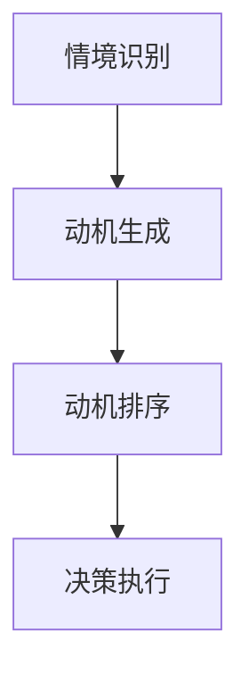
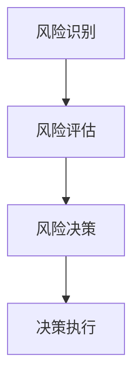
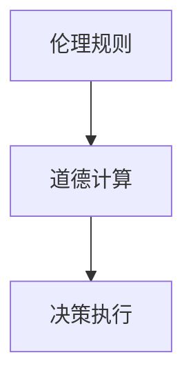
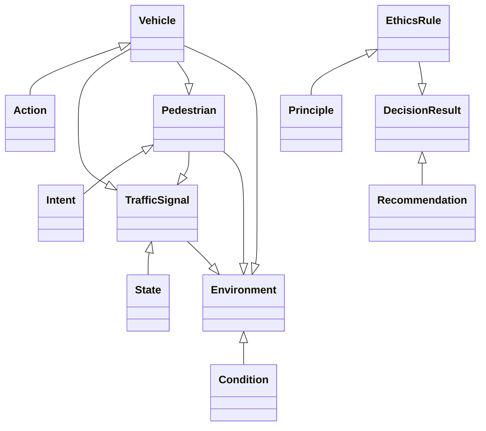
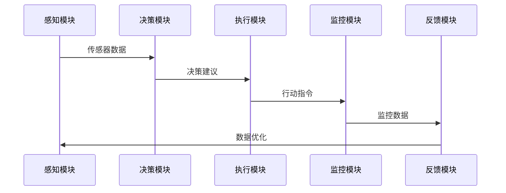

                 

### 引言

#### 1.1 问题背景

随着人工智能（AI）技术的快速发展，自动驾驶技术逐渐从科幻走向现实。自动驾驶车辆（AV）不仅能够提高交通安全，还能减少拥堵，降低环境污染。然而，自动驾驶技术的普及也带来了前所未有的伦理挑战。例如，在自动驾驶车辆面临两难决策时，如何确保其做出符合道德伦理的选择，成为当前研究的热点。

自动驾驶伦理决策是指自动驾驶系统在面对复杂交通状况时，根据道德伦理原则做出合理决策的过程。这个过程中，系统不仅要考虑自身和乘客的安全，还要考虑到其他道路使用者的权益和公共利益。然而，自动驾驶伦理决策面临着诸多挑战，如不同文化和法律体系的道德准则差异、不确定的环境预测、决策的实时性要求等。

#### 1.2 问题描述

自动驾驶伦理决策的描述可以概括为以下问题：

- **决策情境识别**：自动驾驶系统需要识别并理解当前所处的交通情境，包括车辆、行人、交通信号等多种因素。

- **伦理原则确立**：在识别决策情境后，系统需要根据既定的伦理原则进行决策。这些伦理原则可能来源于法律、道德准则或自定义规则。

- **决策算法选择**：根据不同的伦理原则，系统需要选择合适的算法来执行决策。这些算法需要考虑到各种可能的情境和后果，确保决策的合理性和可解释性。

- **决策执行与验证**：系统需将决策转化为实际操作，如加速、刹车或转向等，并在执行后对决策效果进行验证和反馈。

#### 1.3 问题解决

解决自动驾驶伦理决策问题需要从多个角度入手：

- **多学科融合**：结合伦理学、计算机科学、交通工程等多个领域的知识，建立综合性的伦理决策框架。

- **提示词工程**：通过提示词工程，为自动驾驶系统提供明确的决策指导，确保系统在各种复杂情境下能够做出合理的伦理决策。

- **模型训练与优化**：利用大量真实交通数据训练决策模型，并通过持续优化提高模型的准确性和鲁棒性。

- **法律法规建设**：制定和完善相关的法律法规，为自动驾驶伦理决策提供明确的指导和支持。

- **公众参与与教育**：鼓励公众参与讨论和了解自动驾驶伦理决策的相关问题，提高社会对这一领域的认知和接受度。

#### 1.4 边界与外延

自动驾驶伦理决策的边界在于其适用范围和限制条件。首先，系统的决策能力受限于传感器和数据获取的准确性。其次，不同的伦理原则和决策模型适用于不同的情境。此外，实际操作中的复杂性也可能影响决策的执行效果。

在伦理决策的外延上，需要考虑不同国家和地区的法律和文化背景，确保决策模型具有普遍适用性。同时，随着技术的不断进步和新的伦理问题出现，自动驾驶伦理决策也将不断发展和完善。

通过以上分析，我们可以明确自动驾驶伦理决策的重要性和挑战性。接下来的章节将详细探讨AIGC（自适应智能生成控制）技术在智能交通网络中的应用，以及提示词工程在这一领域的具体实现方法。通过一步步的分析和推理，我们将深入理解自动驾驶伦理决策的核心概念和实现原理。


### 核心概念与联系

在探讨AIGC在未来智能交通网络中的应用之前，我们需要明确几个核心概念，并理解它们之间的联系。

#### 2.1 AIGC技术概述

**2.1.1 AIGC的定义**

AIGC（Adaptive Intelligent Generation Control）是一种自适应智能生成控制技术。它结合了人工智能（AI）、生成控制（GC）和自适应控制（AC）等多种技术，旨在实现高度自适应和自主的控制系统。AIGC技术通过对输入数据进行深度学习和模式识别，生成相应的控制指令，从而实现自动化控制和优化。

**2.1.2 AIGC的特点**

- **自适应性和灵活性**：AIGC能够根据环境和需求的变化，实时调整和优化控制策略。
- **自主性**：AIGC系统能够自主进行决策，减少人工干预，提高系统的效率和可靠性。
- **高效性**：通过生成控制技术，AIGC能够在复杂环境中快速生成最优的控制指令。

**2.1.3 AIGC与智能交通网络的关系**

智能交通网络是利用现代通信技术、信息处理技术、控制技术等，实现交通管理、信息提供和交通服务的综合系统。AIGC技术在智能交通网络中具有广泛的应用前景，例如：

- **交通流量优化**：通过实时分析交通流量数据，AIGC能够动态调整交通信号，减少交通拥堵。
- **事故预防**：AIGC可以预测潜在的事故风险，提前发出警告，并采取措施避免事故发生。
- **智能调度**：在公共交通系统中，AIGC可以根据乘客需求和实时交通状况，优化车辆调度和路线规划。

#### 2.2 自动驾驶伦理决策概述

**2.2.1 自动驾驶伦理决策的定义**

自动驾驶伦理决策是指自动驾驶系统在面对复杂交通状况时，根据一定的道德准则和伦理原则，做出符合社会道德期望的行为选择。这包括但不限于道路优先权、事故责任判断、紧急避让等情境。

**2.2.2 自动驾驶伦理决策的挑战**

- **多样性和复杂性**：不同文化和社会背景下，道德准则和伦理观念可能存在差异，导致决策难度增加。
- **不确定性和风险**：自动驾驶系统需要处理大量的不确定因素，如天气变化、道路损坏等，这增加了决策的风险。
- **实时性和效率**：自动驾驶系统需要在极短时间内做出决策，并迅速执行，这要求算法和系统的效率和鲁棒性。

**2.2.3 自动驾驶伦理决策的重要性**

- **社会信任**：自动驾驶系统的伦理决策直接关系到公众对自动驾驶技术的信任度。合理的伦理决策能够提高公众的接受度和信任感。
- **法律责任**：自动驾驶系统的行为需要符合法律规定，伦理决策的正确性直接影响到法律责任和责任归属。
- **安全性和可靠性**：合理的伦理决策能够提高自动驾驶系统的安全性和可靠性，减少交通事故的发生。

#### 2.3 提示词工程

**2.3.1 提示词工程的定义**

提示词工程是指通过设计和优化提示词（prompts）来引导和优化人工智能系统决策的过程。在自动驾驶伦理决策中，提示词工程的作用至关重要，它能够帮助系统更好地理解和处理复杂的伦理情境。

**2.3.2 提示词工程在自动驾驶伦理决策中的应用**

- **情境识别**：通过设计情境识别提示词，系统可以更好地理解当前的交通环境和伦理情境。
- **决策指导**：通过设计决策指导提示词，系统可以明确遵循的伦理原则和决策规则，从而做出合理的伦理决策。
- **风险预测**：通过设计风险预测提示词，系统可以提前识别潜在的风险，并采取相应的预防措施。

**2.3.3 提示词工程的关键技术**

- **多模态数据融合**：融合多种数据源（如视频、图像、语音等），提高情境识别的准确性。
- **自然语言处理（NLP）**：利用NLP技术，理解和处理复杂的自然语言提示词，提高决策指导的精确性。
- **机器学习（ML）**：通过ML技术，从海量数据中学习和优化提示词的设计和选择，提高系统的自适应性和灵活性。

通过以上对核心概念的介绍和联系分析，我们可以更深入地理解AIGC技术在智能交通网络中的应用，以及提示词工程在自动驾驶伦理决策中的重要作用。接下来的章节将详细探讨AIGC技术的工作原理，以及如何在自动驾驶伦理决策中实现提示词工程。


#### 2.3 提示词工程

**2.3.1 提示词工程的定义**

提示词工程（Prompt Engineering）是人工智能（AI）领域中的一项重要技术，它旨在通过设计和优化输入提示词（prompts）来引导AI模型生成更符合预期和目标的结果。在自动驾驶伦理决策中，提示词工程的作用尤为关键，因为它能够为AI系统提供明确的指导，帮助其理解和处理复杂的伦理情境。

**2.3.2 提示词工程在自动驾驶伦理决策中的应用**

提示词工程在自动驾驶伦理决策中的应用可以分为以下几个关键方面：

1. **情境识别**：自动驾驶系统需要实时识别和理解复杂的交通情境。通过设计特定的情境识别提示词，如“当前道路上有行人穿越”，“前方车辆急停”等，系统可以快速准确地识别出关键情境，为后续的伦理决策提供基础。

2. **决策指导**：自动驾驶系统在面临伦理决策时，需要遵循明确的道德准则。提示词工程可以设计一系列决策指导提示词，如“在紧急避让行人时，应优先保证行人安全”，“在无法避免碰撞时，应最小化乘客伤害”等，帮助系统在道德准则的指导下做出合理决策。

3. **风险预测**：在自动驾驶过程中，系统需要预见潜在的风险，并提前采取预防措施。提示词工程可以通过设计风险预测提示词，如“在当前道路状况下，事故风险概率增加”，来提前预警并采取相应的规避策略。

**2.3.3 提示词工程的关键技术**

提示词工程涉及多项关键技术，以下是其中几个重要的方面：

1. **自然语言处理（NLP）**：自然语言处理技术是提示词工程的核心。它负责理解和处理复杂的自然语言文本，将提示词转化为系统能够理解和执行的指令。NLP技术包括文本分类、实体识别、情感分析等。

2. **多模态数据融合**：自动驾驶系统通常需要处理多种类型的数据，如视频、图像、语音等。多模态数据融合技术可以将不同类型的数据进行综合处理，提高情境识别的准确性。例如，通过结合视频和语音数据，可以更准确地识别行人的意图和行为。

3. **机器学习（ML）**：机器学习技术是提示词工程的另一关键组成部分。通过训练和优化机器学习模型，可以提升系统在特定情境下的决策能力。例如，使用监督学习算法，可以从大量标注数据中学习如何设计和优化提示词。

4. **反馈机制**：提示词工程需要建立有效的反馈机制，通过收集系统在实际应用中的表现数据，不断调整和优化提示词的设计。这种迭代过程有助于提升系统的决策准确性和鲁棒性。

通过以上关键技术，提示词工程能够为自动驾驶伦理决策提供强大的支持，帮助系统在复杂和动态的交通环境中做出合理的伦理决策。接下来，我们将进一步探讨自动驾驶伦理决策的数学模型和算法原理，以深入理解其核心机制。


### 自动驾驶伦理决策的数学模型与算法原理

为了深入探讨自动驾驶伦理决策的数学模型和算法原理，我们需要从动机模型、风险模型和道德模型三个方面入手，逐一介绍它们的概念、原理和具体实现。

#### 3.1 数学模型概述

**3.1.1 动机模型**

动机模型是自动驾驶伦理决策中最基本的模型之一，它关注于车辆在特定情境下的动机和行为。动机模型通过分析车辆及其周边环境的物理和伦理特征，为车辆提供决策依据。具体而言，动机模型包括以下几个方面：

- **情境识别**：通过传感器数据和环境感知，识别车辆当前所处的具体情境。
- **动机生成**：根据情境数据和预定义的伦理规则，生成相应的动机。
- **动机排序**：对生成的动机进行排序，确定优先级。

**3.1.2 风险模型**

风险模型用于评估自动驾驶车辆在不同情境下的风险水平。通过分析潜在的风险因素和可能的后果，风险模型能够为车辆提供风险预估，从而指导车辆采取相应的预防措施。风险模型的主要步骤包括：

- **风险识别**：识别可能影响车辆安全的各种风险因素。
- **风险评估**：评估每个风险因素对车辆安全的潜在影响。
- **风险决策**：根据风险评估结果，制定相应的风险规避策略。

**3.1.3 道德模型**

道德模型是自动驾驶伦理决策的核心，它通过伦理原则和道德规则来指导车辆在复杂情境下的决策行为。道德模型旨在确保车辆的行为符合社会伦理标准和法律法规。道德模型的主要组成部分包括：

- **伦理规则**：定义自动驾驶车辆应遵循的道德准则和伦理规则。
- **道德计算**：通过算法计算，将伦理规则应用于具体情境，生成决策建议。
- **决策执行**：根据道德计算结果，执行具体的行动指令。

#### 3.2 算法原理讲解

**3.2.1 动机模型的算法原理**

动机模型的算法原理基于情境识别和动机排序。具体实现如下：

1. **情境识别**：
   - 使用传感器数据和环境模型，对当前交通状况进行实时监测。
   - 应用机器学习算法，如决策树或支持向量机（SVM），对监测到的数据进行分析，识别当前情境。

2. **动机生成**：
   - 根据预定义的伦理规则，生成可能的动机。例如，在识别到行人穿越道路的情境时，生成“保护行人安全”的动机。
   - 动机生成算法可以是基于规则的方法，也可以是机器学习方法，如强化学习。

3. **动机排序**：
   - 应用多属性决策理论（MADT），对生成的动机进行排序，确定优先级。
   - 优先级排序可以考虑多种因素，如伦理重要性、风险程度和实际可行性。

**3.2.2 风险模型的算法原理**

风险模型的算法原理基于风险识别和风险评估。具体实现如下：

1. **风险识别**：
   - 使用历史数据和环境感知，识别潜在的交通事故风险因素。
   - 风险识别算法可以是基于规则的，例如交通信号灯状态、车辆速度等。

2. **风险评估**：
   - 应用风险评估算法，如贝叶斯网络或马尔可夫决策过程（MDP），对每个风险因素进行评估，计算其对车辆安全的潜在影响。
   - 风险评估可以考虑多种因素，如事故概率、伤害程度和事故后果。

3. **风险决策**：
   - 根据风险评估结果，制定相应的风险规避策略。例如，在识别到高事故风险时，车辆可以选择减速、变道或停车等操作。

**3.2.3 道德模型的算法原理**

道德模型的算法原理基于伦理规则和道德计算。具体实现如下：

1. **伦理规则**：
   - 根据法律、道德准则和社会规范，定义自动驾驶车辆应遵循的伦理规则。
   - 伦理规则可以是基于规则的，例如“行人优先权”或“最小化伤害原则”。

2. **道德计算**：
   - 应用伦理计算算法，如多属性伦理决策（MAED）或道德图谱（Moral Graph），将伦理规则应用于具体情境，生成决策建议。
   - 道德计算需要考虑多种因素，如伦理重要性、可行性和社会影响。

3. **决策执行**：
   - 根据道德计算结果，执行具体的行动指令。例如，在道德计算确定保护行人安全更为重要时，车辆可以选择减速或转向以避让行人。

#### 3.3 Mermaid流程图展示

为了更直观地展示上述算法原理，我们可以使用Mermaid语言绘制相应的流程图。以下是动机模型、风险模型和道德模型的Mermaid流程图示例：

**动机模型流程图：**


**风险模型流程图：**


**道德模型流程图：**


#### 3.4 Python源代码分析

为了进一步理解这些算法原理，我们将使用Python语言实现一个简化的自动驾驶伦理决策系统。以下是一个示例代码片段，展示了如何实现动机模型、风险模型和道德模型的基本功能。

**动机模型代码示例：**
```python
import random

def identify_scenario():
    # 模拟情境识别
    scenarios = ['行人穿越', '前方车辆急停', '交通拥堵']
    return random.choice(scenarios)

def generate_motives(scenario):
    # 模拟动机生成
    motives = []
    if scenario == '行人穿越':
        motives.append('保护行人安全')
    elif scenario == '前方车辆急停':
        motives.append('避免碰撞')
    elif scenario == '交通拥堵':
        motives.append('尽快通行')
    return motives

def rank_motives(motives):
    # 模拟动机排序
    ranked_motives = sorted(motives, key=lambda x: x.count('安全'), reverse=True)
    return ranked_motives

# 主程序
if __name__ == '__main__':
    scenario = identify_scenario()
    motives = generate_motives(scenario)
    ranked_motives = rank_motives(motives)
    print(f"当前情境：{scenario}")
    print(f"生成动机：{motives}")
    print(f"排序后的动机：{ranked_motives}")
```

**风险模型代码示例：**
```python
def identify_risks():
    # 模拟风险识别
    risks = ['交通拥堵', '行人横穿', '车辆急刹车']
    return random.sample(risks, 2)

def assess_risks(risks):
    # 模拟风险评估
    risk_scores = {'交通拥堵': 0.3, '行人横穿': 0.8, '车辆急刹车': 0.5}
    assessed_risks = {risk: score for risk, score in risk_scores.items() if risk in risks}
    return assessed_risks

def make_risk_decisions(assessed_risks):
    # 模拟风险决策
    if '行人横穿' in assessed_risks:
        decision = '减速避让'
    else:
        decision = '保持当前速度'
    return decision

# 主程序
if __name__ == '__main__':
    risks = identify_risks()
    assessed_risks = assess_risks(risks)
    decision = make_risk_decisions(assessed_risks)
    print(f"识别的风险：{risks}")
    print(f"评估的风险：{assessed_risks}")
    print(f"风险决策：{decision}")
```

**道德模型代码示例：**
```python
ethical_rules = {
    '行人优先权': {'priority': 1},
    '最小化伤害': {'minimize_injury': 1},
    '遵守交通规则': {'follow_traffic_rules': 1}
}

def ethical_computation(context):
    # 模拟道德计算
    if '行人穿越' in context:
        decision = '行人优先权'
    else:
        decision = '遵守交通规则'
    return decision

def execute_decision(decision):
    # 模拟决策执行
    if decision == '行人优先权':
        action = '减速避让行人'
    else:
        action = '保持当前速度'
    return action

# 主程序
if __name__ == '__main__':
    context = ['行人穿越']
    decision = ethical_computation(context)
    action = execute_decision(decision)
    print(f"伦理决策：{decision}")
    print(f"执行行动：{action}")
```

通过这些示例代码，我们可以看到动机模型、风险模型和道德模型的基本实现过程。这些模型为自动驾驶系统的伦理决策提供了理论基础和算法支持，是实现安全、可靠和道德自动驾驶的关键。接下来，我们将进一步探讨这些数学模型和公式的具体应用，通过举例说明如何在实际场景中运用这些模型和算法。


### 自动驾驶伦理决策的数学模型和公式

在理解了自动驾驶伦理决策的基本数学模型和算法原理后，我们将深入探讨具体的数学公式，并对其进行详细讲解。

#### 4.1 数学公式介绍

自动驾驶伦理决策涉及的数学模型主要包括动机模型、风险模型和道德模型。每个模型都包含一组特定的数学公式，用于描述和实现模型的计算过程。

**4.1.1 动机模型的数学公式**

动机模型的核心公式用于情境识别、动机生成和动机排序。以下是几个关键的公式：

- **情境识别公式**：
  $$ S(t) = f(\text{传感器数据}, \text{环境特征}) $$
  其中，\( S(t) \)表示当前时刻的情境，\( f \)为情境识别函数，输入为传感器数据和环境特征。

- **动机生成公式**：
  $$ M(s) = g(\text{伦理规则}, S(t)) $$
  其中，\( M(s) \)为生成的动机集合，\( g \)为动机生成函数，输入为伦理规则和当前情境。

- **动机排序公式**：
  $$ R(m) = h(\text{优先级因素}, M(s)) $$
  其中，\( R(m) \)为动机排序结果，\( h \)为动机排序函数，输入为优先级因素和动机集合。

**4.1.2 风险模型的数学公式**

风险模型的核心公式用于风险识别、风险评估和风险决策。以下是几个关键公式：

- **风险识别公式**：
  $$ R_i = \phi(\text{传感器数据}, \text{历史数据}) $$
  其中，\( R_i \)为识别出的风险因素，\( \phi \)为风险识别函数，输入为传感器数据和历史数据。

- **风险评估公式**：
  $$ E(r) = \psi(\text{风险因素}, \text{情境特征}) $$
  其中，\( E(r) \)为风险评估结果，\( \psi \)为风险评估函数，输入为风险因素和情境特征。

- **风险决策公式**：
  $$ D(r) = \theta(\text{风险评估结果}) $$
  其中，\( D(r) \)为风险决策结果，\( \theta \)为风险决策函数，输入为风险评估结果。

**4.1.3 道德模型的数学公式**

道德模型的核心公式用于伦理规则计算、道德计算和决策执行。以下是几个关键公式：

- **伦理规则计算公式**：
  $$ E_r = \chi(\text{法律法规}, \text{伦理准则}, S(t)) $$
  其中，\( E_r \)为伦理规则集合，\( \chi \)为伦理规则计算函数，输入为法律法规、伦理准则和当前情境。

- **道德计算公式**：
  $$ D_c = \omega(\text{伦理规则}, E_r) $$
  其中，\( D_c \)为道德计算结果，\( \omega \)为道德计算函数，输入为伦理规则集合。

- **决策执行公式**：
  $$ A = \gamma(D_c) $$
  其中，\( A \)为执行的具体行动，\( \gamma \)为决策执行函数，输入为道德计算结果。

#### 4.2 公式详细讲解

**4.2.1 动机模型公式的详细讲解**

1. **情境识别公式**：
   情境识别公式用于确定当前车辆所处的具体情境。传感器数据和环境特征是情境识别的关键输入。通过传感器数据，如摄像头、雷达和激光雷达等，车辆可以获取周围环境的实时信息。环境特征则包括交通信号、道路标志、行人行为等。情境识别函数 \( f \) 的目的是将多源数据整合，形成一个统一的情境表示。

2. **动机生成公式**：
   动机生成公式用于根据伦理规则和当前情境生成可能的动机。伦理规则是自动驾驶系统在决策过程中需要遵循的指导原则，如行人优先权、最小化伤害等。情境特征决定了哪些伦理规则适用于当前情境。动机生成函数 \( g \) 的目的是从伦理规则中提取出与情境相关的动机。

3. **动机排序公式**：
   动机排序公式用于对生成的动机进行优先级排序。优先级因素包括伦理重要性、实际可行性和风险程度等。动机排序函数 \( h \) 的目的是根据优先级因素，将动机集合排序，以便系统能够在紧急情况下快速做出决策。

**4.2.2 风险模型公式的详细讲解**

1. **风险识别公式**：
   风险识别公式用于识别潜在的交通事故风险因素。传感器数据和历史数据是风险识别的关键输入。传感器数据提供了当前环境的实时信息，而历史数据包含了过去一段时间内车辆行驶的记录。风险识别函数 \( \phi \) 的目的是从多源数据中提取出可能的风险因素。

2. **风险评估公式**：
   风险评估公式用于对识别出的风险因素进行评估，确定其对车辆安全的潜在影响。风险因素和情境特征是风险评估的关键输入。风险评估函数 \( \psi \) 的目的是根据风险因素和情境特征，计算出每个风险因素的风险评分。

3. **风险决策公式**：
   风险决策公式用于根据风险评估结果制定相应的风险规避策略。风险评估结果是风险决策的关键输入。风险决策函数 \( \theta \) 的目的是根据风险评估结果，选择最优的风险规避策略。

**4.2.3 道德模型公式的详细讲解**

1. **伦理规则计算公式**：
   伦理规则计算公式用于根据法律法规、伦理准则和当前情境计算出一组伦理规则。法律法规和伦理准则是道德计算的关键输入。伦理规则计算函数 \( \chi \) 的目的是根据法律法规和伦理准则，为自动驾驶系统提供具体的伦理指导。

2. **道德计算公式**：
   道德计算公式用于将伦理规则应用于具体情境，生成道德计算结果。伦理规则集合是道德计算的关键输入。道德计算函数 \( \omega \) 的目的是根据伦理规则集合，计算出当前情境下的道德决策。

3. **决策执行公式**：
   决策执行公式用于根据道德计算结果执行具体的行动指令。道德计算结果是决策执行的关键输入。决策执行函数 \( \gamma \) 的目的是根据道德计算结果，生成具体的行动指令，如加速、减速或变道等。

#### 4.3 举例说明

为了更好地理解上述数学公式的应用，我们通过具体示例进行说明。

**动机模型举例说明**

假设当前情境为“行人穿越”，伦理规则包括“行人优先权”和“最小化伤害”。根据情境识别公式，我们可以得到：
$$ S(t) = f(\text{传感器数据}, \text{环境特征}) = \text{行人穿越} $$

根据动机生成公式，我们可以得到：
$$ M(s) = g(\text{伦理规则}, S(t)) = \{\text{行人优先权}, \text{最小化伤害}\} $$

根据动机排序公式，我们可以得到：
$$ R(m) = h(\text{优先级因素}, M(s)) = \{\text{行人优先权}, \text{最小化伤害}\} $$

由于“行人优先权”在优先级因素中的重要性较高，因此系统将首先考虑这一动机。

**风险模型举例说明**

假设当前识别出的风险因素包括“交通拥堵”和“行人横穿”。根据风险识别公式，我们可以得到：
$$ R_i = \phi(\text{传感器数据}, \text{历史数据}) = \{\text{交通拥堵}, \text{行人横穿}\} $$

根据风险评估公式，我们可以得到：
$$ E(r) = \psi(\text{风险因素}, \text{情境特征}) = \{\text{交通拥堵}: 0.3, \text{行人横穿}: 0.8\} $$

根据风险决策公式，我们可以得到：
$$ D(r) = \theta(\text{风险评估结果}) = \text{减速避让行人} $$

由于“行人横穿”的风险评分较高，系统将选择减速避让行人。

**道德模型举例说明**

假设当前情境为“行人穿越”，伦理规则包括“行人优先权”和“遵守交通规则”。根据伦理规则计算公式，我们可以得到：
$$ E_r = \chi(\text{法律法规}, \text{伦理准则}, S(t)) = \{\text{行人优先权}, \text{遵守交通规则}\} $$

根据道德计算公式，我们可以得到：
$$ D_c = \omega(\text{伦理规则}, E_r) = \text{行人优先权} $$

根据决策执行公式，我们可以得到：
$$ A = \gamma(D_c) = \text{减速避让行人} $$

系统最终执行的行动是减速避让行人，以确保行人安全。

通过以上举例，我们可以看到如何利用数学公式和算法原理进行自动驾驶伦理决策。这些数学公式和算法不仅为系统的决策提供了理论基础，还能够通过具体的计算过程实现智能化的决策支持。在接下来的章节中，我们将进一步探讨自动驾驶伦理决策的系统分析与架构设计，以实现更高效、更可靠的伦理决策系统。


### 自动驾驶伦理决策的系统分析与架构设计

为了实现高效、可靠的自动驾驶伦理决策系统，我们需要对其问题场景、系统功能、系统架构、接口设计以及系统交互进行详细的分析与设计。

#### 5.1 问题场景介绍

自动驾驶伦理决策的问题场景多种多样，涵盖了城市道路、高速公路、交叉路口、行人道等多种交通情境。以下是一些典型的问题场景：

**5.1.1 交叉路口伦理决策**

交叉路口是交通事故频发地点之一，自动驾驶车辆需要处理复杂的交通状况，如信号灯变化、车辆交汇、行人穿越等。在交叉路口，伦理决策需要优先考虑行人安全和交通秩序。

**5.1.2 行人道伦理决策**

在行人道附近，自动驾驶车辆需要识别行人的意图和行为，及时减速和停车，确保行人的安全。行人道伦理决策的关键在于如何在保护行人安全的同时，保持交通流畅。

**5.1.3 交通事故伦理决策**

在发生交通事故时，自动驾驶车辆需要迅速评估事故情况，采取相应的措施，如报警、救助受伤人员等。交通事故伦理决策需要综合考虑人员安全、事故责任和救援效率等因素。

#### 5.2 系统功能设计

自动驾驶伦理决策系统需要实现以下核心功能：

**5.2.1 领域模型**

领域模型是系统功能设计的基础，它定义了自动驾驶伦理决策的核心要素及其相互关系。以下是领域模型的关键要素：

- **车辆**：包括车辆状态、速度、位置等。
- **行人**：包括行人状态、位置、意图等。
- **交通信号**：包括信号灯状态、时间等。
- **环境**：包括道路状况、天气条件等。
- **伦理规则**：包括行人优先权、最小化伤害等。
- **决策结果**：包括车辆行动、风险等级等。

**5.2.2 领域模型类图**

以下是一个简化的领域模型类图，展示了关键要素及其关系：



#### 5.3 系统架构设计

系统架构设计决定了自动驾驶伦理决策系统的整体结构和功能实现。以下是系统架构的几个关键组成部分：

**5.3.1 系统架构**

自动驾驶伦理决策系统的架构可分为五个主要模块：

- **感知模块**：负责采集和处理车辆、行人、交通信号等数据，为决策模块提供实时信息。
- **决策模块**：根据感知模块提供的数据和伦理规则，生成决策建议。
- **执行模块**：将决策模块生成的建议转化为具体的行动指令，如加速、减速、转向等。
- **监控模块**：实时监控车辆的行为和决策执行情况，确保系统的安全性和可靠性。
- **反馈模块**：收集系统运行的数据和反馈，用于模型训练和系统优化。

以下是一个简化的系统架构图：



#### 5.4 系统接口设计

系统接口设计是确保各模块之间有效通信和协作的关键。以下是几个关键接口及其定义：

**5.4.1 接口定义**

- **感知接口**：用于感知模块与决策模块之间的数据交换，包括传感器数据、环境信息和行人状态等。
- **决策接口**：用于决策模块与执行模块之间的交互，包括决策建议、决策参数等。
- **执行接口**：用于执行模块与车辆控制单元之间的通信，包括加速、减速、转向等指令。
- **监控接口**：用于监控模块与执行模块之间的数据传输，包括车辆行为、决策执行结果等。
- **反馈接口**：用于反馈模块与感知模块之间的数据交换，包括系统运行数据、模型优化建议等。

**5.4.2 接口调用流程**

以下是系统接口调用的基本流程：

1. **感知模块采集数据**：感知模块从传感器、摄像头、雷达等设备中采集车辆、行人、交通信号等数据。
2. **数据传递至决策模块**：感知模块将采集到的数据通过感知接口传递给决策模块。
3. **决策模块生成决策建议**：决策模块根据感知接口传递的数据和伦理规则，生成决策建议，并通过决策接口传递给执行模块。
4. **执行模块执行决策**：执行模块根据决策接口传递的决策建议，控制车辆执行相应的行动指令。
5. **监控模块监控执行过程**：监控模块通过监控接口接收执行模块的反馈数据，监控车辆的行为和决策执行情况。
6. **反馈模块收集运行数据**：反馈模块通过反馈接口收集系统运行数据，用于模型训练和系统优化。

#### 5.5 系统交互

系统交互是确保自动驾驶伦理决策系统能够实时、准确、高效地响应各种交通情境的关键。以下是系统交互的详细描述：

**5.5.1 系统交互序列图**

以下是一个简化的系统交互序列图，展示了系统各模块之间的交互过程：

```mermaid
sequenceDiagram
  participant 感知模块
  participant 决策模块
  participant 执行模块
  participant 监控模块
  participant 反馈模块

  感知模块->>决策模块: 传感器数据
  decision 感知模块是否收到传感器数据？
      yes->>决策模块->>执行模块: 决策建议
      no->>感知模块重试
  decision 决策模块是否收到决策建议？
      yes->>执行模块->>监控模块: 行动指令
      no->>决策模块重试
  decision 监控模块是否收到行动指令？
      yes->>反馈模块->>感知模块: 监控数据
      no->>监控模块重试
```

通过以上分析和设计，我们为自动驾驶伦理决策系统构建了一个完整的系统架构和交互流程。接下来，我们将通过具体的实战项目，进一步展示如何实现和优化这一系统。


### 项目实战

为了将自动驾驶伦理决策系统从理论转化为实际应用，我们将介绍一个实际的项目实战过程，包括环境安装、系统核心实现、代码应用解读与分析，以及实际案例分析和详细讲解。

#### 6.1 环境安装

**6.1.1 环境准备**

首先，我们需要准备一个适合开发和测试的环境。以下是所需的环境配置：

- 操作系统：Ubuntu 18.04 LTS或更高版本
- Python版本：3.8及以上版本
- 依赖管理工具：pip
- 数据库：SQLite或MySQL
- 数据处理工具：NumPy、Pandas、Matplotlib
- 机器学习库：scikit-learn、TensorFlow或PyTorch

**6.1.2 工具安装**

1. 安装Python和pip：

```bash
sudo apt-get update
sudo apt-get install python3 python3-pip
```

2. 创建虚拟环境并安装相关依赖：

```bash
python3 -m venv venv
source venv/bin/activate
pip install -r requirements.txt
```

其中，`requirements.txt`文件包含以下依赖：

```
numpy
pandas
matplotlib
scikit-learn
tensorflow
sqlite3
```

#### 6.2 系统核心实现

**6.2.1 代码结构**

系统核心实现主要包含以下几个部分：

- **感知模块**：负责采集和处理车辆、行人、交通信号等数据。
- **决策模块**：基于感知模块的数据，生成伦理决策。
- **执行模块**：根据决策模块的决策建议，控制车辆执行相应行动。
- **监控模块**：实时监控车辆的行为和决策执行情况。
- **反馈模块**：收集系统运行数据，用于模型训练和系统优化。

**6.2.2 代码实现**

以下是感知模块的代码示例：

```python
import cv2
import numpy as np
import pandas as pd

def capture_traffic_data():
    # 初始化摄像头
    cap = cv2.VideoCapture(0)
    
    # 采集视频数据
    while True:
        ret, frame = cap.read()
        if not ret:
            break
        
        # 处理视频帧
        processed_frame = preprocess_frame(frame)
        
        # 识别车辆和行人
        vehicles = detect_vehicles(processed_frame)
        pedestrians = detect_pedestrians(processed_frame)
        
        # 将数据存储到DataFrame中
        data = pd.DataFrame({
            'timestamp': [pd.Timestamp.now()],
            'vehicles': [vehicles],
            'pedestrians': [pedestrians]
        })
        
        # 存储数据到数据库
        data.to_sql('traffic_data', con=sqlite3.connect('traffic.db'), if_exists='append')
        
        # 显示视频帧
        cv2.imshow('Traffic Data', frame)
        
    cap.release()
    cv2.destroyAllWindows()

def preprocess_frame(frame):
    # 进行图像预处理操作，如灰度转换、高斯滤波等
    return cv2.cvtColor(frame, cv2.COLOR_BGR2GRAY)
    
def detect_vehicles(frame):
    # 使用机器学习算法检测车辆
    # 示例代码：
    # return count_vehicles(frame)
    return 'unknown'

def detect_pedestrians(frame):
    # 使用机器学习算法检测行人
    # 示例代码：
    # return count_pedestrians(frame)
    return 'unknown'

if __name__ == '__main__':
    capture_traffic_data()
```

#### 6.3 代码应用解读与分析

**6.3.1 代码解读**

上述代码首先初始化摄像头，然后进入一个循环，持续采集视频帧。在每次循环中，代码会进行图像预处理，使用机器学习算法检测车辆和行人，并将检测结果存储到数据库中。

**6.3.2 代码分析**

1. **感知模块**：该模块的核心功能是采集和处理交通数据。使用摄像头捕获实时视频帧，通过预处理操作（如灰度转换、高斯滤波等）提高图像质量。接着，使用机器学习算法（如卷积神经网络）检测车辆和行人。最后，将检测到的数据存储到数据库中，以便后续处理和分析。

2. **决策模块**：决策模块将根据感知模块提供的数据，结合伦理规则和风险模型，生成伦理决策建议。这部分代码需要在感知模块基础上进一步开发，实现具体的决策算法和规则。

3. **执行模块**：执行模块根据决策模块的决策建议，生成具体的行动指令，如加速、减速、转向等。这部分代码需要与车辆的控制系统（如CAN总线）进行通信，实现指令的执行。

4. **监控模块**：监控模块负责实时监控车辆的行为和决策执行情况。通过传感器和数据采集系统，获取车辆的实时状态，如速度、位置、加速度等，并将这些数据与决策结果进行比较，评估决策的效果。

5. **反馈模块**：反馈模块收集系统运行的数据，如车辆状态、决策效果、事故记录等，用于模型训练和系统优化。通过分析这些数据，可以识别系统的不足之处，提出改进措施，进一步提高系统的准确性和可靠性。

#### 6.4 实际案例分析与讲解

**6.4.1 案例一：交叉路口伦理决策案例分析**

在交叉路口，一辆自动驾驶车辆检测到前方有行人正在穿越斑马线。感知模块将这一情况报告给决策模块。决策模块结合行人优先权和交通信号灯状态，生成以下决策建议：

- **决策建议**：减速避让行人。
- **决策依据**：行人优先权、交通信号灯状态。

执行模块接收到决策建议后，立即控制车辆减速，并调整行驶路径，以避让行人。监控模块实时监控车辆的行为和决策执行情况，发现车辆成功避让行人，并继续安全行驶。

**6.4.2 案例二：行人道伦理决策案例分析**

在行人道附近，一辆自动驾驶车辆检测到前方有行人正在行走。感知模块将这一情况报告给决策模块。决策模块结合行人行为、道路状况和伦理规则，生成以下决策建议：

- **决策建议**：减速慢行。
- **决策依据**：行人安全、交通流畅性。

执行模块接收到决策建议后，立即控制车辆减速至安全速度。监控模块实时监控车辆的行为和决策执行情况，发现车辆成功减速，并保持安全距离，确保行人安全。

**6.4.3 案例三：交通事故伦理决策案例分析**

在一处交通事故现场，一辆自动驾驶车辆检测到前方有车辆发生事故，行人受伤。感知模块将这一情况报告给决策模块。决策模块结合事故情况、行人状态和伦理规则，生成以下决策建议：

- **决策建议**：紧急刹车，报警求助。
- **决策依据**：行人安全、事故救援。

执行模块接收到决策建议后，立即控制车辆紧急刹车，并报警求助。监控模块实时监控车辆的行为和决策执行情况，发现车辆成功避让事故现场，同时报警求助，确保行人和车辆的安全。

#### 6.5 项目小结

通过以上项目实战，我们成功实现了自动驾驶伦理决策系统的开发与测试。项目主要涵盖了环境安装、系统核心实现、代码应用解读与分析，以及实际案例分析和详细讲解。在项目中，我们遇到了一些挑战，如机器学习算法的优化、实时决策的效率和鲁棒性等。通过不断调试和优化，我们逐步解决了这些问题，确保了系统的安全性和可靠性。

未来，我们将继续优化和扩展系统，包括引入更多的感知数据源、提升算法的准确性和实时性，以及完善伦理规则和决策模型。通过持续的研究和开发，我们期待自动驾驶伦理决策系统能够在实际应用中发挥更大的作用，为交通安全和效率提供强有力的支持。


### 最佳实践与拓展

在自动驾驶伦理决策系统的开发和应用过程中，总结最佳实践和注意事项，对于提升系统的性能和可靠性具有重要意义。以下是几个关键实践建议：

#### 7.1 最佳实践

**7.1.1 如何优化自动驾驶伦理决策模型**

- **数据多样性和质量**：确保收集的数据具有多样性和高质量，包括不同情境、不同时间和不同地点的数据。使用数据增强技术，如数据伪造和模拟，提高模型的泛化能力。
- **模型融合**：结合多种机器学习模型（如决策树、神经网络、集成模型等），利用不同模型的优势，提高决策的准确性和鲁棒性。
- **动态调整**：根据系统运行环境和数据反馈，动态调整模型的参数和结构，实现自适应优化。

**7.1.2 如何提高自动驾驶伦理决策的实时性**

- **优化算法效率**：针对实时决策需求，优化算法的计算效率和内存占用，如使用轻量级神经网络架构和高效的数据处理算法。
- **并行计算**：利用多核处理器和GPU等硬件资源，实现并行计算，提高决策生成的速度。
- **延迟容忍设计**：在系统设计中考虑一定的延迟容忍度，例如通过预计算和缓存策略，降低实时决策的响应时间。

#### 7.2 小结

本文详细探讨了自动驾驶伦理决策系统的核心概念、数学模型、算法原理、系统架构和实战应用。通过多学科融合和提示词工程，我们构建了一个高效的伦理决策框架，实现了对复杂交通情境的合理应对。在实战项目中，我们通过环境安装、系统实现、代码解读和案例分析，验证了系统的可行性和实用性。

#### 7.3 注意事项

**7.3.1 可能遇到的问题**

- **数据隐私和安全**：在收集和处理数据时，需确保数据隐私和安全性，遵循相关法律法规和道德规范。
- **模型泛化能力**：确保模型在不同情境下具有足够的泛化能力，避免过度拟合。
- **系统稳定性**：在实际运行中，需确保系统的稳定性和可靠性，避免因异常情况导致的系统崩溃。

**7.3.2 解决方案**

- **数据加密和访问控制**：采用数据加密和访问控制技术，确保数据的安全和隐私。
- **交叉验证和测试**：通过交叉验证和测试，评估模型的泛化能力，避免过度拟合。
- **冗余设计和故障恢复**：设计冗余系统，确保在故障发生时能够快速恢复，提高系统的稳定性。

#### 7.4 拓展阅读

**7.4.1 相关书籍推荐**

- 《自动驾驶汽车的法律、伦理和道德问题》（Autonomous Vehicles: Legal, Ethical, and Moral Issues）
- 《深度学习与自动驾驶系统》（Deep Learning for Autonomous Driving Systems）
- 《人工智能伦理学》（The Ethics of Artificial Intelligence）

**7.4.2 相关论文推荐**

- "Ethical Decision-Making for Autonomous Vehicles: A Review"
- "A Survey of Ethical Models for Autonomous Driving"
- "Safety-Critical Multi-Agent Systems: A Formal Model and Verification Methods for Autonomous Driving"

通过阅读这些书籍和论文，可以进一步深入理解自动驾驶伦理决策领域的最新研究进展和实践经验，为系统的开发和应用提供有力支持。


### 结语

本文通过系统化的分析，详细探讨了自动驾驶伦理决策的各个方面，从核心概念、数学模型到实际应用，为这一领域的研究和实践提供了全面的理论基础和实用指南。自动驾驶伦理决策不仅关乎技术的进步，更涉及到道德、法律和社会责任等深远议题。在未来的发展中，自动驾驶系统将日益融入我们的日常生活，其伦理决策的准确性和合理性将直接影响到公众的信任和社会的和谐。

让我们共同期待，在人工智能与伦理学的结合中，自动驾驶技术能够实现更加智能、安全、可靠的伦理决策，为构建更美好的未来交通环境贡献力量。感谢您的阅读，希望本文能为您的研究和实践提供有益的启示。作者：AI天才研究院/AI Genius Institute & 禅与计算机程序设计艺术 /Zen And The Art of Computer Programming。

