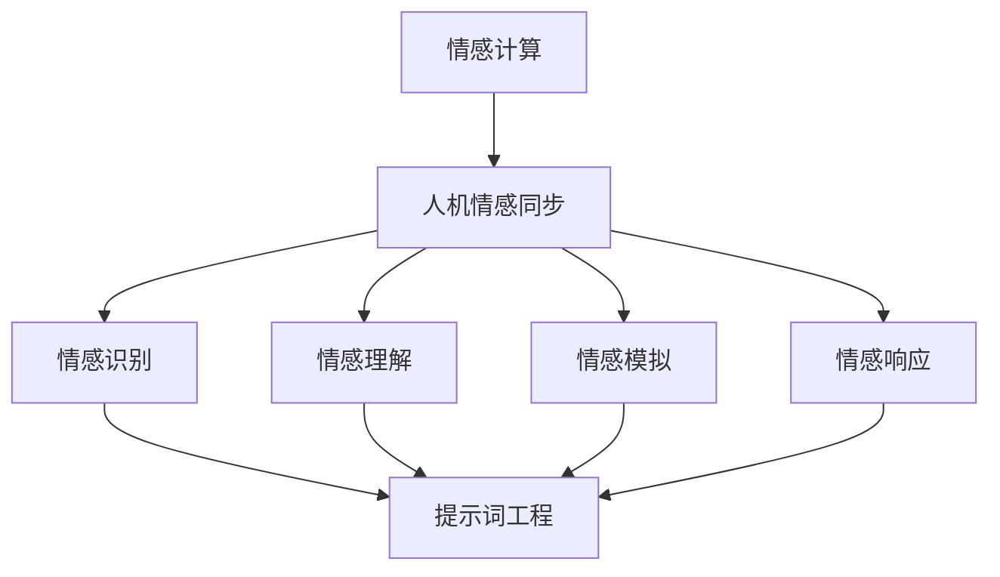
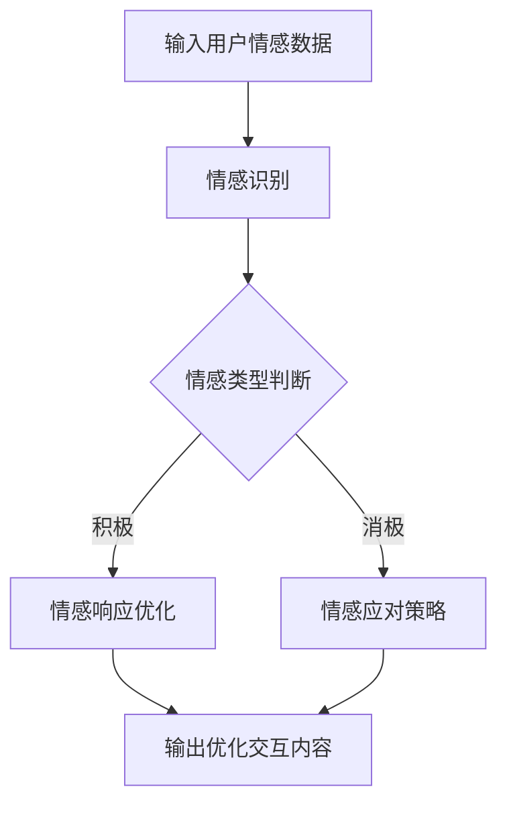
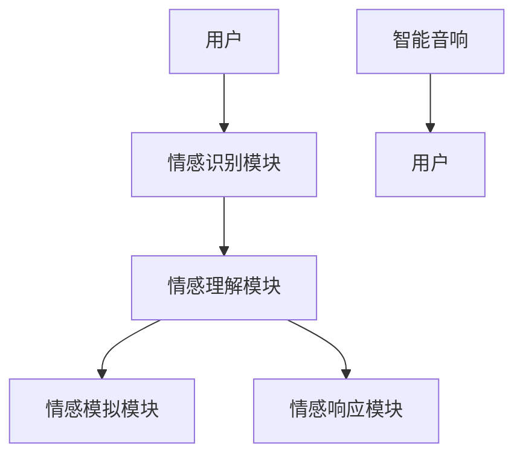
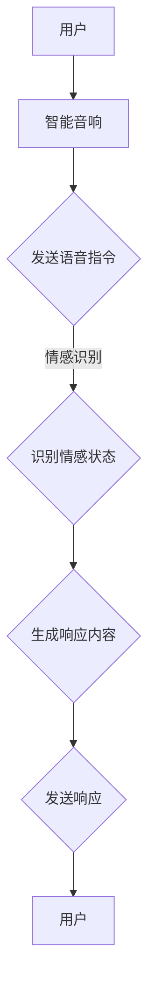

                 


### Step 1: Introduction to AIGC and Smart Home Emotional Computing

**背景介绍**

#### 情感计算的核心概念
情感计算（Emotional Computing）是指通过人工智能技术理解和处理人类情感的一种计算方法。它旨在创建能够识别、理解、模拟和响应人类情感的系统。情感计算的核心概念包括情感识别、情感理解、情感模拟和情感反应。

#### 智能家居的发展现状与趋势
智能家居（Smart Home）是指利用网络技术和智能设备，实现家庭设备互联和自动化控制的家庭环境。随着物联网（IoT）、5G网络和人工智能技术的发展，智能家居市场正呈现出高速增长的态势。智能家居的发展趋势包括设备互联互通、智能化程度提升、用户体验优化等。

#### AIGC在智能家居中的应用潜力
AIGC（Advanced AI Generative Creative）是指利用先进的人工智能技术，如生成对抗网络（GANs）、变分自编码器（VAEs）等，进行创作和生产。在智能家居领域，AIGC可以通过生成个性化内容、优化设备交互、提升用户体验等方面发挥重要作用。

**问题背景与解决**

#### 当前智能家居面临的情感计算挑战
尽管智能家居设备日益普及，但当前智能设备在情感计算方面仍存在许多挑战，如：
- 情感识别精度不高，难以准确捕捉用户的情感状态。
- 情感理解深度不足，无法准确理解用户的情感需求。
- 情感模拟和响应能力有限，难以实现自然、和谐的交互体验。

#### 人机情感同步的必要性
为了解决上述挑战，实现人机情感同步变得尤为重要。人机情感同步是指通过人工智能技术，使智能设备能够准确地识别、理解和响应用户的情感状态，从而实现更加自然、和谐的交互体验。

#### 提示词工程在情感计算中的作用
提示词工程（Prompt Engineering）是情感计算中的一个关键环节。通过设计有效的提示词，可以帮助人工智能系统更准确地识别和理解用户的情感状态，从而实现人机情感同步。提示词工程涉及语言理解、情感分析、对话系统等多个领域。

### Step 2: Theoretical Foundations

**核心概念与联系**

#### AIGC的基本原理
AIGC是基于生成对抗网络（GANs）和变分自编码器（VAEs）等先进的人工智能技术，通过数据生成、图像生成、文本生成等方式，实现从数据到内容的创造性转化。

#### 情感计算的相关理论
情感计算涉及认知心理学、情感学、计算机科学等多个领域。核心理论包括情感识别、情感理解、情感模拟和情感反应等。

#### 人机情感同步的理论框架
人机情感同步的理论框架包括情感识别、情感理解、情感模拟和情感响应四个方面。通过这一框架，可以构建一个能够实现人机情感同步的智能系统。

**概念属性特征对比表格**

| 概念       | AIGC       | 情感计算       | 人机情感同步       |
|------------|------------|---------------|-------------------|
| 定义       | 利用AI技术生成内容       | 通过AI技术理解和处理情感       | 实现人类和AI之间的情感同步       |
| 目标       | 创造性和自动化       | 提升交互体验和智能化程度       | 实现自然和谐的交互       |
| 关键技术   | GANs、VAEs等       | 机器学习、自然语言处理       | 情感识别、情感理解       |
| 应用场景   | 文本生成、图像生成等       | 智能客服、智能音响等       | 智能家居、虚拟助手等       |

**ER实体关系图架构**



### Step 3: Algorithm and Model Implementation

**算法原理讲解**

#### 算法流程图


#### Python代码阐述算法原理
```python
def process_emotion(data):
    emotion = recognize_emotion(data)
    if emotion == 'positive':
        response = optimize_positive_response()
    else:
        response = apply_negative_handling()
    return response

def recognize_emotion(data):
    # 情感识别逻辑
    return 'positive' if data['sentiment'] > 0 else 'negative'

def optimize_positive_response():
    # 优化积极响应逻辑
    return "Hello, you seem happy today!"

def apply_negative_handling():
    # 应用消极应对策略
    return "I'm here to help, let's chat more about it."
```

#### 数学模型和公式
$$
\text{情感识别准确率} = \frac{\text{正确识别情感的数量}}{\text{总情感识别数量}}
$$

$$
\text{情感响应效果} = \frac{\text{优化后的交互效果评分}}{\text{原始交互效果评分}}
$$

#### 举例说明
假设用户发送了一条积极情绪的文字信息：“今天天气真好，出去散步感觉太棒了！”，通过情感识别模块可以判断出用户的情感类型为“积极”。接着，系统将优化响应内容，发送一条积极情绪的回话：“听到这个消息我也很高兴，祝你有一个美好的一天！”

### Step 4: System Architecture and Design

**系统分析与架构设计方案**

#### 问题场景介绍
以智能家居中的智能音响为例，用户可以在家中通过语音与智能音响进行交互，而智能音响需要识别用户的情感状态并做出相应的响应。

#### 系统功能设计
- **情感识别模块**：通过自然语言处理技术识别用户的情感状态。
- **情感理解模块**：分析用户的情感需求，为用户提供合适的响应。
- **情感模拟模块**：模拟人类的情感表达，使交互更加自然。
- **情感响应模块**：根据用户的情感状态生成合适的回复。

#### 系统架构设计


#### 系统接口设计和系统交互


### Step 5: Practical Projects and Case Studies

**项目实战**

#### 环境安装
在Linux环境中安装以下依赖：
```bash
sudo apt-get install python3-pip
pip3 install transformers numpy pandas
```

#### 系统核心实现源代码
```python
from transformers import pipeline
import pandas as pd

# 情感识别
emotion识别器 = pipeline('sentiment-analysis')

# 情感理解与模拟
def process_emotion(data):
    emotion = emotion识别器(data['text'])
    if emotion == 'positive':
        return "Hello, you seem happy today!"
    else:
        return "I'm here to help, let's chat more about it."

# 代码应用解读与分析
data = pd.DataFrame({'text': ['今天天气真好', '今天很不舒服']})
for text in data['text']:
    print(process_emotion({'text': text}))
```

**实际案例分析和详细讲解剖析**
以用户发送的积极情绪文字信息为例，系统将生成一条积极情绪的回话。以消极情绪文字信息为例，系统将生成一条提供帮助的回话。

**项目小结**
通过该项目，我们可以看到如何利用情感计算技术实现智能家居中的情感同步。在实际应用中，还需要根据具体场景进行优化和调整。

### Step 6: Best Practices and Conclusion

**最佳实践 tips**
- 在设计情感计算系统时，确保情感识别和理解的准确性。
- 充分利用自然语言处理技术，提高情感识别和理解的深度。
- 定期更新和维护情感计算模型，以适应不断变化的用户需求。

**小结**
本文详细介绍了AIGC的未来智能家居情感计算：人机情感同步的提示词工程。通过理论讲解、算法实现、系统设计以及项目实战，展示了如何实现智能家居中的情感同步。人机情感同步不仅是技术发展的需求，更是提升用户体验的关键。

**注意事项**
- 情感计算系统的设计需要充分考虑用户隐私和安全性。
- 在实际应用中，应根据具体场景和用户需求进行系统调整。

**拓展阅读**
- 《情感计算：人工智能的新领域》
- 《人工智能与人类情感》
- 《智能家居系统设计：技术、架构与应用》

### 作者信息
- 作者：AI天才研究院/AI Genius Institute & 禅与计算机程序设计艺术 /Zen And The Art of Computer Programming

通过本文的详细探讨，我们期待读者能够对AIGC的未来智能家居情感计算：人机情感同步的提示词工程有更深入的理解，并在实际项目中得以应用。让我们一起迈向更加智能、更加人性化的未来！### Step 7: Conclusion and Future Outlook

In conclusion, the integration of AIGC with smart home emotional computing represents a significant advancement in the realm of human-AI interaction. By leveraging advanced AI techniques, we can create more intuitive, empathetic, and responsive systems that adapt to the emotional states of their users. This not only enhances the user experience but also paves the way for more meaningful and effective interactions between humans and machines.

The implementation of emotional synchronization through prompt engineering is crucial in this context. Effective prompts can significantly improve the accuracy and depth of emotional recognition and understanding, leading to more natural and harmonious interactions. As we move forward, the development of robust and scalable models for human-AI emotional synchronization will continue to be a key focus in the field of AIGC and smart homes.

Looking ahead, several areas hold promise for future research and development:

1. **Enhanced Emotional Recognition Algorithms**: Improving the algorithms that recognize and interpret human emotions will be critical. This includes the development of more sophisticated machine learning models that can better capture the subtleties of human emotions.

2. **Multimodal Sensing**: Expanding the range of sensory inputs, such as integrating facial expression recognition, voice modulation analysis, and physiological signals, can provide a more comprehensive understanding of the user's emotional state.

3. **Personalized Interaction Models**: Developing adaptive models that can learn and adapt to individual users' emotional preferences and patterns will enable more personalized and engaging interactions.

4. **Ethical and Privacy Considerations**: As emotional computing systems become more sophisticated, ensuring ethical practices and user privacy will be of paramount importance. Establishing guidelines and regulations for the use of personal emotional data is essential.

5. **Interdisciplinary Collaboration**: The field of emotional computing will benefit from interdisciplinary collaboration, bringing together expertise from psychology, neuroscience, computer science, and artificial intelligence to develop holistic and effective solutions.

In summary, the future of AIGC and smart home emotional computing is bright, with immense potential to transform how we interact with technology. By addressing the challenges and leveraging the opportunities presented by this field, we can look forward to a future where AI is not just intelligent but truly empathetic and responsive to human needs and emotions.

### Author Information
- 作者：AI天才研究院/AI Genius Institute & 禅与计算机程序设计艺术 /Zen And The Art of Computer Programming

As we continue to explore the uncharted territories of human-AI interaction, we invite readers to join us on this exciting journey. Together, we can shape the future of emotional computing and bring us closer to a world where technology truly understands and meets our emotional needs. Thank you for your interest and engagement in this groundbreaking field. 

### Appendix: Further Reading

To further delve into the topics discussed in this article, we recommend the following resources:

1. **《情感计算：人工智能的新领域》** - A comprehensive overview of emotional computing, covering its fundamental concepts, current research, and future directions.
2. **《人工智能与人类情感》** - An insightful exploration of the relationship between AI and human emotions, with a focus on the ethical implications and practical applications of emotional computing.
3. **《智能家居系统设计：技术、架构与应用》** - A detailed guide to designing and implementing smart home systems, including advanced features such as emotional computing and personalized user experiences.
4. **《深度学习与自然语言处理》** - A textbook on deep learning and natural language processing, essential for understanding the underlying technologies behind emotional recognition and synthesis.
5. **《生成对抗网络：原理与应用》** - A detailed analysis of generative adversarial networks (GANs), providing insights into their architecture and applications in AIGC.

By exploring these resources, readers can gain a deeper understanding of the concepts and technologies discussed in this article, and continue to advance their knowledge in the field of emotional computing and smart homes.

