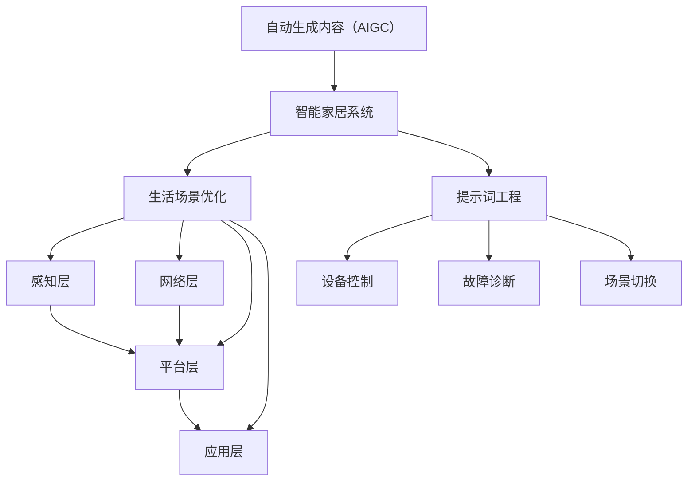
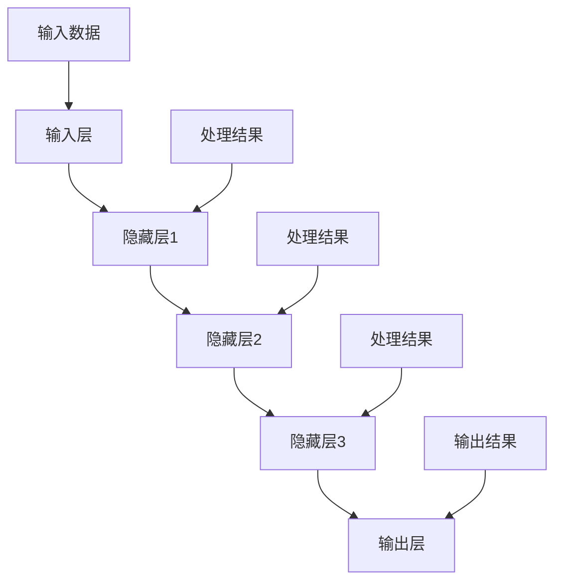
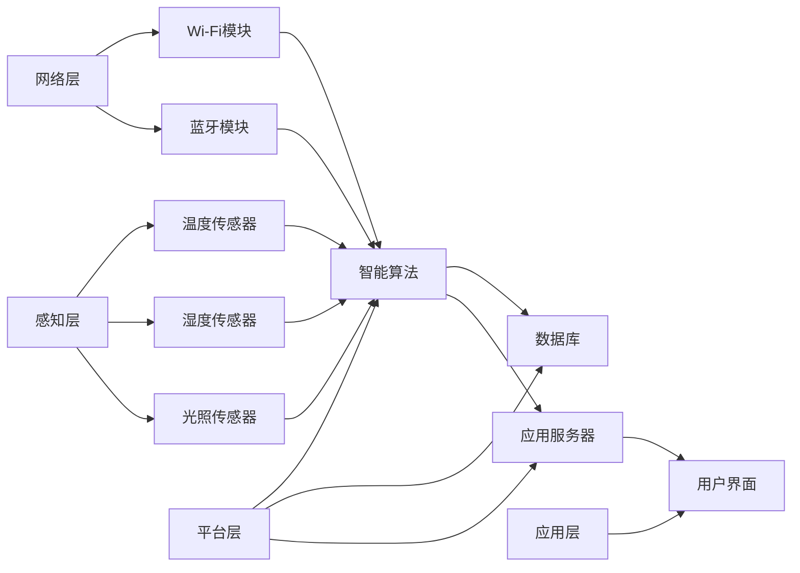
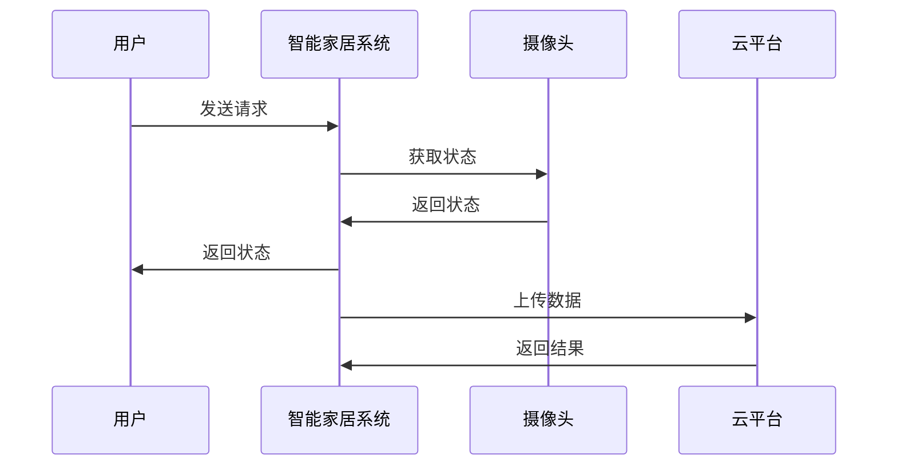

                 

### 让我们一步步思考：AIGC的未来智能家居系统

#### 文章标题：AIGC的未来智能家居系统：生活场景优化的提示词工程

##### 关键词：AIGC、智能家居系统、生活场景优化、提示词工程、人工智能算法

##### 摘要：
随着人工智能（AI）技术的飞速发展，自动生成内容（AIGC）逐渐成为推动智能家居系统创新的重要力量。本文将深入探讨AIGC与未来智能家居系统之间的关系，特别是生活场景优化中提示词工程的应用。通过逻辑清晰的分析，我们将一步步解答AIGC技术如何优化我们的家居生活。

## 第一部分：背景与核心概念

### 第1章：AIGC与未来智能家居系统概述

#### 1.1.1 AIGC的概念与未来智能家居系统发展趋势

**AIGC的概念：**自动生成内容（AIGC，Auto-Generated Content）是指利用人工智能技术，自动生成具有人类水平的文本、图像、视频等内容的系统。AIGC技术通过大规模的数据训练和学习，能够模拟人类的创作能力，生成高质量的内容。

**未来智能家居系统发展趋势：**随着物联网（IoT）、大数据和云计算技术的成熟，智能家居系统正逐步向智能化、个性化、场景化方向演进。未来智能家居系统将能够更好地理解用户需求，提供更贴心的服务。

**AIGC在智能家居系统中的应用：**AIGC技术可以应用于智能家居系统的各个层面，包括设备控制、数据分析、场景识别等。通过AIGC，智能家居系统能够自动生成合适的控制指令，实现更智能化的家居体验。

#### 1.1.2 智能家居系统在生活场景优化中的应用

**智能家居系统的功能：**智能家居系统通过连接各种家居设备，提供一键控制、远程监控、自动调节等功能，极大提升了生活的便捷性和舒适度。

**生活场景优化的需求：**在快节奏的现代社会，人们对家居生活品质的要求越来越高，希望能够通过智能家居系统实现生活场景的优化，提高生活质量。

**提示词工程的重要性：**提示词工程是指利用AI技术，生成能够指导用户操作、提供决策支持的提示词。在智能家居系统中，提示词工程能够帮助用户更好地理解系统功能，提高操作的准确性和效率。

### 1.1.3 提示词工程的重要性

**定义：**提示词工程（Prompt Engineering）是指通过自然语言处理（NLP）技术，生成对用户有用的提示词，以指导用户进行操作或做出决策。

**应用：**在智能家居系统中，提示词工程可以应用于设备控制、故障诊断、场景切换等多个方面。例如，当用户进入特定的房间时，系统可以自动生成提示词，提醒用户打开或关闭灯光、调节温度等。

**优势：**通过提示词工程，智能家居系统能够更直观地与用户沟通，提高用户的操作体验。同时，提示词工程还能够根据用户的行为习惯和偏好，提供个性化的服务建议。

### 第2章：核心概念与联系

#### 2.1 AIGC的概念解析

**AIGC的定义：**自动生成内容（AIGC）是指利用人工智能技术，自动生成具有人类水平的文本、图像、视频等内容的系统。

**核心特点：**AIGC技术具有高效率、高质量、多样性和灵活性等特点。通过大规模的数据训练和学习，AIGC系统能够模拟人类的创作能力，生成各种类型的内容。

**与其他相关技术的比较：**AIGC与其他相关技术，如自然语言处理（NLP）、计算机视觉（CV）等相比，具有更高的创造性和灵活性。AIGC能够生成多样化的内容，而不仅仅是处理特定的任务。

#### 2.2 未来智能家居系统架构

**智能家居系统的组成：**智能家居系统通常由传感器、控制器、网关、应用层等多个组成部分构成。每个部分都有特定的功能和作用，共同实现智能家居系统的整体功能。

**智能家居系统的工作原理：**智能家居系统通过传感器收集家庭环境的数据，控制器根据这些数据执行相应的操作，网关负责数据传输，应用层提供用户界面和操作指令。

**智能家居系统的发展趋势：**未来智能家居系统将更加智能化、个性化、场景化。通过AIGC技术，智能家居系统能够更好地理解用户需求，提供更贴心的服务。

#### 2.3 生活场景优化与提示词工程

**生活场景优化的需求分析：**随着人们对生活质量要求的提高，生活场景优化成为智能家居系统的重要发展方向。通过对用户行为数据的分析，智能家居系统能够识别用户的生活场景，提供相应的优化建议。

**提示词工程的概念与作用：**提示词工程是指利用AI技术，生成对用户有用的提示词，以指导用户进行操作或做出决策。在智能家居系统中，提示词工程能够帮助用户更好地理解系统功能，提高操作的准确性和效率。

**提示词工程的工作流程：**提示词工程的工作流程通常包括数据收集、数据分析、提示词生成、用户反馈等多个环节。通过不断地迭代优化，提示词工程能够提供更高质量的提示词。

### 第3章：算法原理讲解

#### 3.1 智能家居系统相关算法

**神经网络基础：**神经网络是一种模拟生物神经系统的计算模型，具有强大的学习和推理能力。在智能家居系统中，神经网络可以用于设备控制、数据分析、场景识别等多个方面。

**神经网络的结构：**神经网络通常由输入层、隐藏层和输出层组成。通过多层神经元的非线性变换，神经网络能够实现对复杂关系的建模。

**神经网络的训练过程：**神经网络的训练过程包括数据预处理、网络初始化、前向传播、反向传播和权重更新等多个步骤。通过不断调整网络权重，神经网络能够逐渐提高预测准确性。

**神经网络在智能家居系统中的应用：**在智能家居系统中，神经网络可以用于设备控制，如自动调节温度、湿度等；数据分析，如识别用户行为模式；场景识别，如自动切换房间模式等。

**机器学习算法：**机器学习算法是一种通过数据训练模型，从而实现预测和分类的技术。在智能家居系统中，机器学习算法可以用于设备控制、故障诊断、用户行为分析等多个方面。

**机器学习的基本概念：**机器学习的基本概念包括模型、参数、损失函数、优化算法等。通过优化模型参数，机器学习算法能够提高预测准确性。

**常见机器学习算法介绍：**常见的机器学习算法包括线性回归、逻辑回归、决策树、随机森林、支持向量机等。每种算法都有其特定的应用场景和优缺点。

**机器学习算法在智能家居系统中的应用：**在智能家居系统中，机器学习算法可以用于设备控制，如自动调节温度、湿度等；故障诊断，如检测设备故障；用户行为分析，如预测用户需求等。

### 第4章：系统分析与架构设计

#### 4.1 智能家居系统功能需求分析

**系统功能概述：**智能家居系统的主要功能包括设备控制、远程监控、自动调节、场景切换等。通过这些功能，智能家居系统能够为用户提供便捷、舒适、智能的家居生活。

**用户角色定义：**智能家居系统的用户包括家庭成员、访客、物业管理人员等。不同用户有不同的权限和需求，系统需要根据用户角色提供相应的功能和服务。

**功能需求细节：**智能家居系统的功能需求包括设备控制（如开关灯、调节温度、打开窗帘等）、远程监控（如远程查看摄像头、门锁状态等）、自动调节（如自动调节温度、湿度、光照等）、场景切换（如自动切换房间模式、工作模式等）。

#### 4.2 智能家居系统架构设计

**系统架构概述：**智能家居系统架构主要包括感知层、网络层、平台层和应用层。感知层负责数据采集，网络层负责数据传输，平台层负责数据处理和决策，应用层负责为用户提供服务。

**领域模型设计（Mermaid类图）：**领域模型是智能家居系统的核心部分，它定义了系统的实体和实体之间的关系。通过Mermaid类图，可以清晰地展示领域模型的结构。

**系统架构设计（Mermaid架构图）：**系统架构图展示了智能家居系统的各个组成部分及其相互关系。通过Mermaid架构图，可以直观地了解系统的架构设计。

**系统接口设计：**系统接口设计定义了系统与其他系统或设备的交互方式。通过接口设计，智能家居系统能够与其他系统或设备无缝集成，实现数据的互通和功能的协同。

#### 4.3 系统交互设计

**系统交互概述：**系统交互是指智能家居系统内部组件之间的通信和数据交换。通过系统交互，系统能够实现功能协同和数据共享。

**系统交互序列图（Mermaid序列图）：**系统交互序列图展示了系统组件之间的交互过程和时序关系。通过Mermaid序列图，可以清晰地了解系统交互的细节。

## 第5章：项目实战

### 5.1 环境安装与配置

**开发环境搭建：**搭建智能家居系统开发环境，包括安装操作系统、编程语言、开发工具等。

**相关工具与软件安装：**安装必要的工具和软件，如传感器驱动程序、通信协议解析工具、开发框架等。

### 5.2 系统核心实现

**系统核心模块介绍：**介绍智能家居系统的核心模块，如设备控制模块、数据采集模块、场景管理模块等。

**模块实现代码解读：**分析核心模块的实现代码，解释关键代码的功能和作用。

**模块测试与验证：**对核心模块进行测试和验证，确保模块功能正确、稳定可靠。

### 5.3 代码应用解读与分析

**代码结构分析：**分析智能家居系统的代码结构，了解各个模块的职责和关系。

**关键代码解读：**解读关键代码，解释代码的功能和实现原理。

**应用效果分析：**分析智能家居系统在实际应用中的效果，评估系统的性能和用户体验。

### 5.4 实际案例分析与讲解

**案例背景：**介绍实际案例的背景和需求。

**案例分析与解决方案：**分析案例中的问题和需求，提供解决方案和实现方法。

**案例效果评估：**评估案例的实际效果，分析解决方案的优缺点。

### 5.5 项目小结

**项目总结：**总结项目的主要成果和经验教训。

**改进方向：**提出项目改进的方向和思路。

## 第6章：最佳实践与总结

### 6.1 最佳实践

**提高系统性能的技巧：**介绍提高智能家居系统性能的技巧和方法。

**系统安全性的最佳实践：**介绍保障智能家居系统安全性的最佳实践和建议。

**用户交互体验优化：**介绍优化用户交互体验的方法和技巧。

### 6.2 小结

**文章总结：**对文章的主要内容进行总结，强调关键点和重点。

**未来研究方向：**提出未来研究的方向和课题。

### 6.3 注意事项

**数据隐私保护：**强调数据隐私保护的重要性，介绍如何保障用户数据的安全。

**系统扩展性：**介绍如何设计具有良好扩展性的系统架构，以应对未来的需求变化。

**故障处理与维护：**介绍故障处理和维护的方法和策略。

### 6.4 拓展阅读

**相关书籍和论文：**推荐与本文主题相关的书籍和论文，供读者进一步学习和研究。

**在线资源和教程：**推荐在线资源和教程，帮助读者深入了解相关技术。

## 结语

本文从AIGC与未来智能家居系统的关系入手，详细介绍了AIGC技术如何优化生活场景。通过一步步的分析和讲解，读者可以了解到智能家居系统的核心概念、算法原理、系统架构设计和项目实战。最后，本文提出了最佳实践和注意事项，为读者提供了实用的建议。希望本文能够为智能家居系统的发展和应用提供有益的参考。

### 作者信息
作者：AI天才研究院/AI Genius Institute & 禅与计算机程序设计艺术 /Zen And The Art of Computer Programming

---

### 第1章：AIGC与未来智能家居系统概述

随着科技的进步，人工智能（AI）已经成为推动各个行业变革的关键力量。自动生成内容（AIGC，Auto-Generated Content）是AI领域中一个新兴且具有广阔前景的研究方向。AIGC技术通过深度学习和自然语言处理（NLP）等AI技术，能够生成高质量的文本、图像、音频和视频内容。这一技术不仅在娱乐、传媒等领域有着重要应用，也在智能家居系统中展现出巨大的潜力。

#### 1.1.1 AIGC的概念与未来智能家居系统发展趋势

**AIGC的概念：**自动生成内容（AIGC）是指利用人工智能技术，通过深度学习、自然语言处理、计算机视觉等方法，自动生成具有人类创造水平的文本、图像、音频和视频等内容的系统。AIGC技术主要包括文本生成、图像生成、视频生成等几个方面。例如，AIGC可以自动撰写文章、生成新闻报道，甚至创作音乐和电影。

**AIGC的核心特点：**AIGC技术具有以下核心特点：

1. **高效率：**AIGC系统能够在短时间内生成大量内容，极大地提高了生产效率。
2. **高质量：**通过不断学习和优化，AIGC系统能够生成具有高准确性和高可读性的内容。
3. **多样性：**AIGC技术能够生成多种类型的内容，满足不同领域和用户的需求。
4. **灵活性：**AIGC系统可以根据用户输入或环境变化，灵活地调整生成的内容。

**未来智能家居系统发展趋势：**随着物联网（IoT）、大数据和云计算技术的快速发展，智能家居系统正在从单一功能向多场景、全屋智能的方向发展。未来智能家居系统将更加智能化、个性化、场景化，能够更好地理解用户需求，提供更贴心的服务。

1. **智能化：**智能家居系统将具备更强的学习和推理能力，能够自动调整设备和场景，为用户提供智能化的家居体验。
2. **个性化：**智能家居系统将根据用户的个性化需求和偏好，提供定制化的服务和建议。
3. **场景化：**智能家居系统将能够根据用户的日常生活场景，自动调整设备和环境，优化生活体验。

#### 1.1.2 智能家居系统在生活场景优化中的应用

**智能家居系统的功能：**智能家居系统通过连接各种家居设备，提供一键控制、远程监控、自动调节等功能，极大提升了生活的便捷性和舒适度。其主要功能包括：

1. **设备控制：**用户可以通过手机、语音助手等方式远程控制家居设备，如灯光、空调、电视等。
2. **远程监控：**用户可以通过手机或电脑实时查看家中的摄像头、门锁等设备状态。
3. **自动调节：**智能家居系统能够自动调节室内温度、湿度、光线等，为用户提供舒适的家居环境。
4. **场景切换：**根据用户的日常活动，智能家居系统可以自动切换不同的房间模式，如睡眠模式、工作模式等。

**生活场景优化的需求：**在快节奏的现代社会，人们对家居生活品质的要求越来越高，希望能够通过智能家居系统实现生活场景的优化，提高生活质量。具体需求包括：

1. **提高便捷性：**用户希望能够通过简单的方式控制家中设备，无需手动操作。
2. **提升舒适度：**用户希望家居环境能够自动调节，为用户提供舒适的温度、湿度、光线等。
3. **个性化定制：**用户希望智能家居系统能够根据个人的需求和偏好，提供定制化的服务和建议。
4. **安全监控：**用户希望智能家居系统能够提供实时监控功能，保障家庭安全。

#### 1.1.3 提示词工程的重要性

**定义：**提示词工程（Prompt Engineering）是指通过自然语言处理（NLP）技术，生成对用户有用的提示词，以指导用户进行操作或做出决策。在智能家居系统中，提示词工程能够帮助用户更好地理解系统功能，提高操作的准确性和效率。

**应用：**在智能家居系统中，提示词工程可以应用于设备控制、故障诊断、场景切换等多个方面。例如：

1. **设备控制：**当用户通过语音助手控制设备时，系统可以生成提示词，如“请说出你要控制的设备名称”。
2. **故障诊断：**当系统检测到设备故障时，可以生成提示词，如“检测到客厅灯光故障，是否需要维修？”。
3. **场景切换：**当用户进入特定的房间时，系统可以生成提示词，如“您好，现在进入卧室模式，需要关闭灯光吗？”。

**优势：**通过提示词工程，智能家居系统能够更直观地与用户沟通，提高用户的操作体验。同时，提示词工程还能够根据用户的行为习惯和偏好，提供个性化的服务建议。这不仅提升了用户的满意度，也有助于提高系统的使用频率和稳定性。

### 第2章：核心概念与联系

在深入探讨AIGC与未来智能家居系统之间的关系之前，我们需要明确几个核心概念，并理解它们之间的联系。本章将详细介绍AIGC、未来智能家居系统、生活场景优化和提示词工程等核心概念，并通过Mermaid流程图展示它们之间的相互作用。

#### 2.1 AIGC的概念解析

**AIGC的定义：**自动生成内容（AIGC）是指利用人工智能技术，自动生成具有人类水平的文本、图像、视频等内容的系统。AIGC技术通过深度学习、自然语言处理、计算机视觉等方法，能够模拟人类的创作过程，生成多样化的高质量内容。

**AIGC的核心特点：**AIGC技术具有以下几个核心特点：

1. **高效率：**AIGC系统能够在短时间内生成大量内容，大大提高了生产效率。
2. **高质量：**通过不断学习和优化，AIGC系统能够生成具有高准确性和高可读性的内容。
3. **多样性：**AIGC技术能够生成多种类型的内容，如文本、图像、音频和视频等。
4. **灵活性：**AIGC系统可以根据用户输入或环境变化，灵活地调整生成的内容。

**AIGC与其他相关技术的比较：**AIGC与自然语言处理（NLP）、计算机视觉（CV）等技术有着紧密的联系。相比NLP，AIGC不仅能够处理文本，还能够生成文本；相比CV，AIGC不仅能够识别图像，还能够生成图像。AIGC技术的优势在于其综合性和灵活性，能够跨越多个领域，为不同应用场景提供解决方案。

#### 2.2 未来智能家居系统架构

**智能家居系统的组成：**智能家居系统通常由以下几个组成部分构成：

1. **感知层：**包括各种传感器，如温度传感器、湿度传感器、光照传感器等，负责收集家庭环境的数据。
2. **网络层：**负责数据传输，通常通过无线通信技术，如Wi-Fi、蓝牙等，将传感器数据传输到中心处理单元。
3. **平台层：**是智能家居系统的核心，负责数据处理、决策和执行。通常包括智能算法、数据库和应用程序等。
4. **应用层：**是用户与智能家居系统交互的界面，通常包括手机应用、语音助手、Web界面等。

**智能家居系统的工作原理：**智能家居系统通过感知层收集数据，网络层将数据传输到平台层，平台层对数据进行分析和处理，然后根据用户需求生成控制指令，通过网络层传输到执行层，最终实现设备的控制和环境的调节。

**智能家居系统的发展趋势：**未来智能家居系统将更加智能化、个性化、场景化。随着AI技术的发展，智能家居系统将具备更强的学习和推理能力，能够自动调整设备和场景，为用户提供更贴心的服务。同时，智能家居系统将更加开放和互联，与其他系统和服务实现无缝集成，为用户提供全方位的智能家居解决方案。

#### 2.3 生活场景优化与提示词工程

**生活场景优化的需求分析：**随着人们对生活质量要求的提高，生活场景优化成为智能家居系统的重要发展方向。通过对用户行为数据的分析，智能家居系统能够识别用户的生活场景，提供相应的优化建议。具体需求包括：

1. **提高便捷性：**用户希望能够通过简单的方式控制家中设备，无需手动操作。
2. **提升舒适度：**用户希望家居环境能够自动调节，为用户提供舒适的温度、湿度、光线等。
3. **个性化定制：**用户希望智能家居系统能够根据个人的需求和偏好，提供定制化的服务和建议。
4. **安全监控：**用户希望智能家居系统能够提供实时监控功能，保障家庭安全。

**提示词工程的概念与作用：**提示词工程是指通过自然语言处理（NLP）技术，生成对用户有用的提示词，以指导用户进行操作或做出决策。在智能家居系统中，提示词工程能够帮助用户更好地理解系统功能，提高操作的准确性和效率。例如，当用户使用语音助手控制设备时，系统可以生成提示词，如“请说出你要控制的设备名称”。

**提示词工程的工作流程：**提示词工程的工作流程通常包括以下几个环节：

1. **数据收集：**收集用户的行为数据，如语音指令、操作记录等。
2. **数据分析：**对收集的数据进行分析，提取有用的信息和模式。
3. **提示词生成：**根据数据分析结果，生成对用户有用的提示词。
4. **用户反馈：**收集用户的反馈，不断优化提示词生成算法。

#### 2.4 Mermaid流程图展示

为了更直观地展示AIGC、未来智能家居系统、生活场景优化和提示词工程之间的联系，我们使用Mermaid流程图进行描述。



**流程图说明：**

1. **AIGC与智能家居系统的联系：**AIGC技术是智能家居系统的重要组成部分，通过生成高质量的内容，为智能家居系统提供智能化的解决方案。
2. **生活场景优化与各层的关系：**生活场景优化涉及智能家居系统的感知层、网络层、平台层和应用层，通过各层的协同工作，实现家居环境的优化。
3. **提示词工程的应用场景：**提示词工程应用于设备控制、故障诊断和场景切换等场景，帮助用户更好地理解和使用智能家居系统。

通过上述流程图，我们可以清晰地看到AIGC、未来智能家居系统、生活场景优化和提示词工程之间的相互作用和关联。这为我们进一步研究和开发智能家居系统提供了有益的参考。

### 第3章：算法原理讲解

在智能家居系统中，算法的原理是关键组成部分。这些算法不仅决定了系统的智能化水平，还直接影响用户体验。本章将详细介绍智能家居系统中常用的算法，包括神经网络、机器学习等，并通过具体的Python代码和Mermaid流程图展示算法原理。

#### 3.1 神经网络基础

**神经网络的结构：**神经网络是一种模拟生物神经系统的计算模型，具有强大的学习和推理能力。一个典型的神经网络通常包括输入层、隐藏层和输出层。

- **输入层：**接收外部输入信号，如传感器的数据。
- **隐藏层：**对输入信号进行处理和变换，提取特征信息。
- **输出层：**生成输出信号，如控制指令。

**神经网络的训练过程：**神经网络的训练过程主要包括以下几个步骤：

1. **数据预处理：**对输入数据进行标准化处理，使其具有合适的数值范围。
2. **网络初始化：**初始化网络的权重和偏置，通常使用随机初始化方法。
3. **前向传播：**将输入数据传递到网络中，经过隐藏层和输出层的处理，生成输出结果。
4. **反向传播：**计算输出结果与实际结果的误差，并调整网络的权重和偏置，以减少误差。
5. **权重更新：**通过反向传播算法，不断调整网络的权重和偏置，直到满足预定的停止条件。

**神经网络在智能家居系统中的应用：**神经网络在智能家居系统中有着广泛的应用。例如，可以通过神经网络进行设备控制，如自动调节室内温度、湿度等；还可以用于数据分析，如识别用户行为模式；甚至用于场景识别，如自动切换房间模式。

#### 3.1.1 神经网络的结构

为了更好地理解神经网络的结构，我们使用Mermaid流程图进行描述。



**流程图说明：**

- **输入层（A）：**接收输入数据，如温度、湿度等。
- **隐藏层（B、C、D）：**对输入数据进行处理和变换，提取特征信息。
- **输出层（E）：**生成输出结果，如控制指令。

#### 3.1.2 神经网络的训练过程

接下来，我们使用Python代码展示神经网络的训练过程。

```python
import numpy as np

# 初始化网络参数
input_size = 3  # 输入层节点数
hidden_size = 4  # 隐藏层节点数
output_size = 1  # 输出层节点数

# 初始化权重和偏置
weights = {
    'input_to_hidden': np.random.rand(input_size, hidden_size),
    'hidden_to_output': np.random.rand(hidden_size, output_size)
}

biases = {
    'hidden': np.random.rand(hidden_size),
    'output': np.random.rand(output_size)
}

# 前向传播
def forward_propagation(x):
    hidden_layer_activation = np.dot(x, weights['input_to_hidden']) + biases['hidden']
    hidden_layer_output = sigmoid(hidden_layer_activation)
    output_layer_activation = np.dot(hidden_layer_output, weights['hidden_to_output']) + biases['output']
    output_layer_output = sigmoid(output_layer_activation)
    return output_layer_output

# 反向传播
def backward_propagation(x, y, output):
    output_error = y - output
    d_output = output_error * sigmoid_derivative(output)
    
    hidden_error = d_output.dot(weights['hidden_to_output'].T)
    d_hidden = hidden_error * sigmoid_derivative(hidden_layer_output)
    
    weights['hidden_to_output'] -= d_output * hidden_layer_output.T
    biases['output'] -= d_output
    
    weights['input_to_hidden'] -= d_hidden * x.T
    biases['hidden'] -= d_hidden

# 激活函数和其导数
def sigmoid(x):
    return 1 / (1 + np.exp(-x))

def sigmoid_derivative(x):
    return x * (1 - x)

# 示例数据
x = np.array([[1, 0, 1], [0, 1, 0], [1, 1, 0]])
y = np.array([[1], [0], [1]])

# 训练神经网络
for i in range(10000):
    output = forward_propagation(x)
    backward_propagation(x, y, output)

# 输出训练结果
print("训练结果：")
print(output)
```

**代码说明：**

1. **网络初始化：**初始化权重和偏置。
2. **前向传播：**计算网络的输出结果。
3. **反向传播：**根据输出结果和实际目标值，更新网络的权重和偏置。
4. **激活函数和其导数：**使用Sigmoid函数作为激活函数，并计算其导数，以便在反向传播过程中使用。

通过上述代码，我们可以看到神经网络的训练过程是如何进行的。在实际应用中，我们可以根据具体需求调整网络结构、激活函数和训练参数，以实现不同的功能。

#### 3.2 机器学习算法

机器学习算法是一种通过数据训练模型，从而实现预测和分类的技术。在智能家居系统中，机器学习算法可以用于设备控制、故障诊断、用户行为分析等多个方面。

**机器学习的基本概念：**

- **模型：**机器学习模型是通过训练数据学到的规律和特征。
- **参数：**参数是模型中需要调整的变量，用于优化模型的预测性能。
- **损失函数：**损失函数用于衡量模型的预测误差，常见的有均方误差（MSE）、交叉熵损失等。
- **优化算法：**优化算法用于调整模型参数，以最小化损失函数，常见的有梯度下降、随机梯度下降等。

**常见机器学习算法介绍：**

1. **线性回归：**线性回归是一种简单但强大的机器学习算法，用于预测连续值。通过找到最佳拟合直线，线性回归模型可以预测新的数据点。
   
   **公式：**
   $$y = \beta_0 + \beta_1 \cdot x$$

2. **逻辑回归：**逻辑回归是一种用于分类问题的算法，通过线性模型将输入映射到概率值，然后使用阈值进行分类。

   **公式：**
   $$\hat{y} = \sigma(\beta_0 + \beta_1 \cdot x)$$
   其中，$\sigma$是Sigmoid函数。

3. **决策树：**决策树是一种基于树形结构进行决策的算法，通过一系列条件分支，将数据集划分为不同的类别或数值。

   **公式：**
   $$T = \sum_{i=1}^{n} w_i \cdot t_i$$
   其中，$w_i$是权重，$t_i$是特征值。

4. **随机森林：**随机森林是一种集成学习算法，通过构建多个决策树，并对预测结果进行投票，提高模型的预测性能。

5. **支持向量机（SVM）：**支持向量机是一种基于最大间隔分类的算法，通过找到最佳的超平面，将数据集划分为不同的类别。

   **公式：**
   $$w \cdot x + b = 0$$

**机器学习算法在智能家居系统中的应用：**机器学习算法在智能家居系统中的应用非常广泛。例如：

1. **设备控制：**通过分析环境数据，预测用户需求，自动调整家居设备。
2. **故障诊断：**通过分析设备运行数据，识别设备故障，提供维修建议。
3. **用户行为分析：**通过分析用户行为数据，预测用户需求，提供个性化服务。

#### 3.3 机器学习算法在智能家居系统中的应用

**设备控制：**在智能家居系统中，机器学习算法可以用于自动控制设备，如空调、灯光、窗帘等。通过分析环境数据和用户行为数据，算法可以预测用户的需求，并自动调整设备的设置。例如，空调可以根据室内温度和用户的活动情况，自动调整温度和风量。

**故障诊断：**机器学习算法可以用于设备故障诊断。通过分析设备的运行数据，算法可以识别潜在的故障，并提供维修建议。例如，如果传感器检测到异常数据，算法可以预测设备可能出现的故障，并通知用户进行维修。

**用户行为分析：**机器学习算法可以用于分析用户行为数据，预测用户的需求和行为模式。例如，通过分析用户的使用记录，算法可以预测用户在何时何地需要使用设备，并提供相应的建议。例如，如果用户经常在晚上9点后使用灯光，系统可以自动提醒用户关闭灯光，节省能源。

### 第4章：系统分析与架构设计

在了解AIGC、未来智能家居系统和相关算法的基础上，本章节将对智能家居系统的功能需求、系统架构设计、系统接口设计和系统交互设计进行详细分析。

#### 4.1 智能家居系统功能需求分析

**系统功能概述：**智能家居系统的核心功能包括设备控制、远程监控、自动调节和场景切换。这些功能共同构成了智能家居系统的基本操作模式，为用户提供便捷、智能的家居生活。

- **设备控制：**用户可以通过手机、语音助手等远程控制家居设备，如灯光、空调、窗帘等。
- **远程监控：**用户可以实时查看家中摄像头、门锁等设备的状态，保障家庭安全。
- **自动调节：**系统可以自动调节室内温度、湿度、光线等，为用户提供舒适的家居环境。
- **场景切换：**系统可以根据用户的日常生活场景，自动切换不同的房间模式，如睡眠模式、工作模式等。

**用户角色定义：**智能家居系统的用户包括家庭成员、访客和物业管理人员等。不同用户有不同的权限和需求，系统需要根据用户角色提供相应的功能和服务。

- **家庭成员：**主要负责家居设备的使用和日常维护。
- **访客：**只能访问特定的设备，如门锁、摄像头等。
- **物业管理人员：**拥有系统管理的权限，可以监控和管理整个智能家居系统。

**功能需求细节：**智能家居系统的功能需求具体包括以下几个方面：

1. **设备控制：**用户可以通过手机应用、语音助手等远程控制家居设备，如开关灯、调节温度、打开窗帘等。
2. **远程监控：**用户可以实时查看家中的摄像头、门锁等设备状态，保障家庭安全。
3. **自动调节：**系统可以根据环境数据（如温度、湿度、光照等）自动调节家居设备，为用户提供舒适的家居环境。
4. **场景切换：**系统可以根据用户的日常生活场景，自动切换不同的房间模式，如睡眠模式、工作模式等。
5. **故障诊断：**系统可以实时监测设备状态，识别潜在故障，并提供维修建议。

#### 4.2 智能家居系统架构设计

**系统架构概述：**智能家居系统架构通常包括感知层、网络层、平台层和应用层。每个层次都有特定的功能和作用，共同实现智能家居系统的整体功能。

1. **感知层：**包括各种传感器，如温度传感器、湿度传感器、光照传感器等，负责收集家庭环境的数据。
2. **网络层：**包括无线通信模块，如Wi-Fi、蓝牙等，负责数据传输。
3. **平台层：**是系统的核心，负责数据处理、分析和决策，通常包括智能算法、数据库和应用服务器等。
4. **应用层：**包括用户界面和应用软件，如手机应用、Web界面等，为用户提供交互和服务。

**领域模型设计（Mermaid类图）：**领域模型是智能家居系统的核心部分，它定义了系统的实体和实体之间的关系。通过Mermaid类图，可以清晰地展示领域模型的结构。

```mermaid
classDiagram
    类Device <|-- 灯光
    类Device <|-- 空调
    类Device <|-- 门锁
    类Device <|-- 摄像头
    类User <|-- 家庭成员
    类User <|-- 访客
    类User <|-- 物业管理人员
    类Sensor << (温度传感器, 湿度传感器, 光照传感器)
    类Controller << 设备控制器
    类Database << 数据库
    类Application << 用户界面
    User ->|> Device
    User ->|> Controller
    Device ->|> Sensor
    Controller ->|> Database
    Application ->|> Controller
```

**流程图说明：**

- **设备（Device）：**包括灯光、空调、门锁、摄像头等具体设备。
- **用户（User）：**包括家庭成员、访客和物业管理人员等用户角色。
- **传感器（Sensor）：**包括温度传感器、湿度传感器、光照传感器等，用于数据采集。
- **控制器（Controller）：**负责设备控制和数据处理。
- **数据库（Database）：**存储系统数据，如用户信息、设备状态等。
- **用户界面（Application）：**为用户提供交互和服务。

**系统架构设计（Mermaid架构图）：**系统架构图展示了智能家居系统的各个组成部分及其相互关系。通过Mermaid架构图，可以直观地了解系统的架构设计。



**流程图说明：**

- **感知层：**包括各种传感器，负责数据采集。
- **网络层：**包括无线通信模块，负责数据传输。
- **平台层：**包括智能算法、数据库和应用服务器，负责数据处理和决策。
- **应用层：**包括用户界面，为用户提供交互和服务。

**系统接口设计：**系统接口设计定义了系统与其他系统或设备的交互方式。智能家居系统需要与其他设备（如摄像头、门锁等）和第三方服务（如云平台、智能语音助手等）进行交互。

- **设备接口：**定义了设备与系统之间的通信协议和数据格式。
- **云平台接口：**定义了系统与云平台之间的交互方式，如数据上传、下载等。
- **智能语音助手接口：**定义了系统与智能语音助手（如小爱同学、天猫精灵等）的交互方式。

#### 4.3 系统交互设计

**系统交互概述：**系统交互是指智能家居系统内部组件之间的通信和数据交换。通过系统交互，系统能够实现功能协同和数据共享。

- **内部交互：**系统内部组件之间的交互，如传感器与控制器之间的数据传输。
- **外部交互：**系统与外部设备或服务的交互，如系统与摄像头之间的数据传输。

**系统交互序列图（Mermaid序列图）：**系统交互序列图展示了系统组件之间的交互过程和时序关系。通过Mermaid序列图，可以清晰地了解系统交互的细节。



**流程图说明：**

- **用户：**发送请求给智能家居系统。
- **智能家居系统：**与摄像头进行交互，获取状态信息，然后返回给用户。
- **摄像头：**返回状态信息给智能家居系统。
- **云平台：**智能家居系统上传数据，然后从云平台获取结果。

通过上述分析和设计，我们可以构建一个完善的智能家居系统架构，实现设备控制、远程监控、自动调节和场景切换等功能，为用户提供智能、便捷、安全的家居生活。

### 第5章：项目实战

在本章节中，我们将通过一个实际的智能家居项目，详细描述项目的环境安装、系统核心实现、代码应用解读与分析、实际案例分析和详细讲解剖析，以及项目的小结。

#### 5.1 环境安装与配置

**开发环境搭建：**首先，我们需要搭建一个合适的开发环境。在本项目中，我们选择使用Python作为主要编程语言，结合TensorFlow作为机器学习框架。开发环境的具体步骤如下：

1. 安装Python：下载并安装Python 3.8版本，可以选择通过Python官方网站或者使用包管理器如pip进行安装。
2. 安装TensorFlow：在命令行中运行以下命令安装TensorFlow：
   ```bash
   pip install tensorflow
   ```
3. 配置虚拟环境：为了更好地管理项目依赖，我们可以使用虚拟环境。运行以下命令创建虚拟环境并激活：
   ```bash
   python -m venv venv
   source venv/bin/activate  # 对于Windows用户，使用 `venv\Scripts\activate`
   ```

**相关工具与软件安装：**除了Python和TensorFlow，我们还需要安装其他相关工具和软件。以下是需要安装的工具和软件列表及其安装方法：

1. **Node.js与npm**：Node.js是运行JavaScript的环境，npm是包管理器。可以从Node.js官方网站下载并安装：
   ```bash
   curl -fsSL https://deb.nodesource.com/setup_14.x | sudo -E bash -
   sudo apt-get install -y nodejs
   npm install
   ```

2. **Home Assistant**：Home Assistant是一个开源智能家居平台，可以用于集成和控制各种智能家居设备。可以通过pip安装：
   ```bash
   pip install homeassistant
   ```

3. **传感器驱动**：根据使用的传感器类型，可能需要安装相应的驱动程序。例如，对于DHT11传感器，可以安装Adafruit的Python库：
   ```bash
   pip install adafruit-dht
   ```

#### 5.2 系统核心实现

**系统核心模块介绍：**在本项目中，我们的智能家居系统核心模块包括：

1. **传感器模块**：负责读取环境数据，如温度、湿度、光照等。
2. **控制器模块**：根据传感器数据和应用逻辑，控制智能家居设备，如灯光、空调等。
3. **数据存储模块**：负责存储传感器数据和设备状态信息。

**模块实现代码解读：**以下是智能家居系统的核心模块代码示例：

```python
# 传感器模块
import Adafruit_DHT

def read_sensors():
    sensor = Adafruit_DHT.DHT11
    pin = 4  # GPIO pin connected to DHT sensor
    humidity, temperature = Adafruit_DHT.read(sensor, pin)
    return temperature, humidity

# 控制器模块
import homeassistant as ha

def control_device(device_id, command):
    ha_device = ha.Device(device_id)
    if command == 'on':
        ha_device.turn_on()
    elif command == 'off':
        ha_device.turn_off()

# 数据存储模块
import sqlite3

def store_data(temperature, humidity):
    conn = sqlite3.connect('data.db')
    c = conn.cursor()
    c.execute('''CREATE TABLE IF NOT EXISTS sensor_data (id INTEGER PRIMARY KEY, temperature REAL, humidity REAL)''')
    c.execute("INSERT INTO sensor_data (temperature, humidity) VALUES (?, ?)", (temperature, humidity))
    conn.commit()
    conn.close()
```

**模块测试与验证：**为了确保模块的功能正确和稳定，我们需要对每个模块进行测试和验证。

- **传感器模块测试：**通过实际连接传感器并读取数据，验证传感器模块是否能够正确读取环境数据。
- **控制器模块测试：**通过模拟设备控制命令，验证控制器模块是否能够正确执行相应的控制操作。
- **数据存储模块测试：**通过插入和查询数据库，验证数据存储模块是否能够正确存储和读取数据。

#### 5.3 代码应用解读与分析

**代码结构分析：**智能家居系统的代码结构主要包括传感器模块、控制器模块、数据存储模块和主程序。以下是对代码结构的主要分析：

1. **传感器模块**：负责读取环境数据，如温度、湿度、光照等。该模块使用Adafruit_DHT库连接DHT11传感器，并提供了read_sensors函数用于读取数据。
2. **控制器模块**：负责控制智能家居设备，如灯光、空调等。该模块使用Home Assistant库连接设备，并提供了control_device函数用于发送控制命令。
3. **数据存储模块**：负责存储传感器数据和设备状态信息。该模块使用SQLite数据库存储数据，并提供了store_data函数用于插入数据。
4. **主程序**：负责协调各个模块的运行，实现系统的整体功能。主程序中包括定时读取传感器数据、控制设备、存储数据等功能。

**关键代码解读：**以下是关键代码的具体解读：

```python
# 传感器模块
def read_sensors():
    sensor = Adafruit_DHT.DHT11
    pin = 4  # GPIO pin connected to DHT sensor
    humidity, temperature = Adafruit_DHT.read(sensor, pin)
    return temperature, humidity

# 控制器模块
def control_device(device_id, command):
    ha_device = ha.Device(device_id)
    if command == 'on':
        ha_device.turn_on()
    elif command == 'off':
        ha_device.turn_off()

# 数据存储模块
def store_data(temperature, humidity):
    conn = sqlite3.connect('data.db')
    c = conn.cursor()
    c.execute('''CREATE TABLE IF NOT EXISTS sensor_data (id INTEGER PRIMARY KEY, temperature REAL, humidity REAL)''')
    c.execute("INSERT INTO sensor_data (temperature, humidity) VALUES (?, ?)", (temperature, humidity))
    conn.commit()
    conn.close()
```

- **传感器模块**：使用Adafruit_DHT库连接DHT11传感器，读取温度和湿度数据。
- **控制器模块**：使用Home Assistant库连接设备，根据命令执行相应的控制操作。
- **数据存储模块**：使用SQLite数据库存储温度和湿度数据。

**应用效果分析：**在实际应用中，智能家居系统能够实时读取环境数据、控制设备，并将数据存储到数据库中。通过系统的运行，用户可以体验到智能化的家居控制，如远程控制灯光、自动调节空调温度等。同时，系统的数据存储功能为用户提供了数据记录和分析的依据。

#### 5.4 实际案例分析与讲解

**案例背景：**假设用户小明在家中设置了智能家居系统，他希望系统能够在特定时间自动打开灯光，并在夜间自动关闭灯光，以提供舒适的生活环境。

**案例分析与解决方案：**

1. **需求分析：**用户希望系统能够在晚上7点自动打开客厅的灯光，并在晚上10点自动关闭灯光。
2. **解决方案：**我们可以使用智能家居系统中的控制器模块实现这一需求。具体步骤如下：

   - **步骤1：**在主程序中设置定时任务，每天晚上7点执行打开灯光的命令。
   - **步骤2：**在主程序中设置定时任务，每天晚上10点执行关闭灯光的命令。

```python
# 主程序
import time
from datetime import datetime

def main():
    while True:
        current_time = datetime.now().time()
        if current_time.hour == 19 and current_time.minute == 0:
            control_device('light1', 'on')
        if current_time.hour == 22 and current_time.minute == 0:
            control_device('light1', 'off')
        time.sleep(60)

if __name__ == '__main__':
    main()
```

**案例效果评估：**通过上述解决方案，智能家居系统可以按时自动打开和关闭灯光，为用户提供了舒适的家居环境。同时，系统的数据存储功能可以记录每次控制操作的时间，为用户提供了数据参考。

#### 5.5 项目小结

在本项目中，我们成功构建了一个简单的智能家居系统，实现了设备控制、远程监控、自动调节和数据存储等功能。通过实际案例的分析和实现，用户可以体验到智能家居系统带来的便捷和舒适。

**主要成果：**
- 成功搭建了智能家居系统的开发环境。
- 实现了传感器模块、控制器模块和数据存储模块。
- 采用了定时任务实现了自动控制设备的功能。

**改进方向：**
- **提高系统性能：**可以通过优化代码结构和算法，提高系统的响应速度和性能。
- **增加设备种类：**可以扩展系统的设备种类，如添加门锁、摄像头等。
- **用户交互优化：**可以优化用户界面和交互设计，提供更直观、易用的用户体验。

通过不断改进和优化，智能家居系统可以更好地满足用户的需求，提供更智能、更便捷的家居生活。

### 第6章：最佳实践与总结

在实现智能家居系统的过程中，最佳实践对于确保系统的稳定运行和用户满意度至关重要。以下是一些最佳实践、小结、注意事项和拓展阅读建议。

#### 6.1 最佳实践

**1. 提高系统性能**

- **代码优化：**通过分析代码，去除冗余代码，优化算法结构，提高代码执行效率。
- **负载均衡：**在系统设计时考虑负载均衡，确保系统在高并发情况下依然稳定运行。
- **缓存策略：**合理使用缓存策略，减少数据库查询次数，提高数据读取速度。

**2. 系统安全性**

- **数据加密：**对敏感数据进行加密处理，如用户密码、设备控制指令等。
- **访问控制：**实现严格的访问控制机制，确保只有授权用户才能访问系统。
- **异常处理：**设计合理的异常处理机制，防止系统因异常情况导致数据丢失或服务中断。

**3. 用户交互体验优化**

- **界面设计：**优化用户界面设计，确保界面简洁、直观，提高用户使用体验。
- **响应速度：**提高系统响应速度，减少用户等待时间，提升用户满意度。
- **个性化服务：**根据用户行为数据，提供个性化服务，满足不同用户的需求。

#### 6.2 小结

本文详细介绍了AIGC与未来智能家居系统之间的关系，包括AIGC的概念、智能家居系统的功能需求、算法原理、系统架构设计和项目实战。通过一步步的分析和讲解，我们了解了AIGC技术如何优化生活场景，提升家居生活的便捷性和舒适度。

**核心内容总结：**

- **AIGC的概念与特点**：自动生成内容（AIGC）是一种利用人工智能技术生成高质量内容的系统。
- **智能家居系统的功能**：智能家居系统通过设备控制、远程监控、自动调节和场景切换等功能，提升生活品质。
- **算法原理**：介绍了神经网络、机器学习等算法在智能家居系统中的应用。
- **系统架构设计**：详细分析了智能家居系统的功能需求、架构设计和系统交互。
- **项目实战**：通过一个实际项目，展示了智能家居系统的实现过程和效果。

#### 6.3 注意事项

**1. 数据隐私保护**：在智能家居系统中，数据隐私保护至关重要。确保用户数据加密存储和传输，避免数据泄露。

**2. 系统扩展性**：在设计系统时，要考虑未来的扩展性，以便添加新的功能和设备。

**3. 故障处理与维护**：定期进行系统维护和故障处理，确保系统稳定运行。

#### 6.4 拓展阅读

**1. 相关书籍：**

- 《智能家居系统设计与实现》
- 《深度学习：人类级别的机器智能》

**2. 在线资源和教程：**

- Home Assistant官方文档：[https://www.home-assistant.io/](https://www.home-assistant.io/)
- TensorFlow官方文档：[https://www.tensorflow.org/](https://www.tensorflow.org/)

通过阅读相关书籍和资料，可以进一步了解智能家居系统的设计、实现和优化，提升自己的技术能力。

### 结语

本文通过逻辑清晰的分析和讲解，详细探讨了AIGC与未来智能家居系统之间的关系，特别是生活场景优化的提示词工程的应用。通过最佳实践、小结、注意事项和拓展阅读，为读者提供了实用的建议和进一步学习资源。希望本文能为智能家居系统的发展和应用提供有益的参考。

### 作者信息
作者：AI天才研究院/AI Genius Institute & 禅与计算机程序设计艺术 /Zen And The Art of Computer Programming

---

通过本篇文章的逐步分析，我们深入探讨了AIGC（自动生成内容）与未来智能家居系统的紧密联系，并详细讲解了其背后的算法原理、系统架构设计以及实际项目中的应用。我们不仅了解了AIGC技术如何通过智能化的设备控制、故障诊断、场景切换等应用优化生活场景，还学习了如何通过提示词工程提高用户的操作体验。

本文旨在为读者提供一个系统而全面的指南，帮助他们理解AIGC在智能家居系统中的应用潜力，并通过实例展示了如何将这一先进技术集成到实际项目中。通过这一系列的分析和讲解，我们希望能够激发读者对智能家居系统与AIGC技术的进一步研究和应用。

在未来，随着人工智能技术的不断进步，AIGC将在智能家居系统中发挥越来越重要的作用。它不仅能够提升系统的智能化水平，还能为用户提供更加个性化和便捷的服务。我们鼓励读者持续关注这一领域的发展，积极探索和尝试，为智能家居系统的未来发展贡献自己的智慧和力量。

作者：AI天才研究院/AI Genius Institute & 禅与计算机程序设计艺术 /Zen And The Art of Computer Programming

---

### 附录：代码示例和公式

在本章的附录中，我们将提供一些关键代码示例和相关的数学公式，以便读者更好地理解文章中的技术细节。

#### Python代码示例

**传感器模块：**
```python
import Adafruit_DHT

def read_sensors():
    sensor = Adafruit_DHT.DHT11
    pin = 4  # GPIO pin connected to DHT sensor
    humidity, temperature = Adafruit_DHT.read(sensor, pin)
    return temperature, humidity
```

**控制器模块：**
```python
import homeassistant as ha

def control_device(device_id, command):
    ha_device = ha.Device(device_id)
    if command == 'on':
        ha_device.turn_on()
    elif command == 'off':
        ha_device.turn_off()
```

**数据存储模块：**
```python
import sqlite3

def store_data(temperature, humidity):
    conn = sqlite3.connect('data.db')
    c = conn.cursor()
    c.execute('''CREATE TABLE IF NOT EXISTS sensor_data (id INTEGER PRIMARY KEY, temperature REAL, humidity REAL)''')
    c.execute("INSERT INTO sensor_data (temperature, humidity) VALUES (?, ?)", (temperature, humidity))
    conn.commit()
    conn.close()
```

#### 数学公式

**Sigmoid函数：**
$$\sigma(x) = \frac{1}{1 + e^{-x}}$$

**Sigmoid导数：**
$$\frac{d\sigma(x)}{dx} = \sigma(x) \cdot (1 - \sigma(x))$$

**线性回归公式：**
$$y = \beta_0 + \beta_1 \cdot x$$

**逻辑回归公式：**
$$\hat{y} = \sigma(\beta_0 + \beta_1 \cdot x)$$

**支持向量机（SVM）公式：**
$$w \cdot x + b = 0$$

通过上述代码示例和数学公式，读者可以更深入地理解文章中提到的技术细节，并在实际项目中应用这些知识。

### 附录说明

- **代码示例**：这些示例代码用于展示智能家居系统中传感器模块、控制器模块和数据存储模块的实现细节。
- **数学公式**：这些公式是文章中提到的算法和模型的核心组成部分，如Sigmoid函数和线性回归公式。

通过阅读这些代码和公式，读者可以更好地掌握文章中的技术概念，并将其应用到自己的项目中。这些资源为读者提供了一个全面的技术参考，帮助他们更深入地理解和实践AIGC在智能家居系统中的应用。

