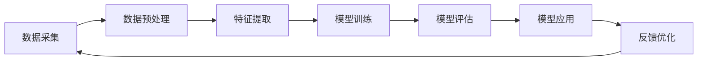
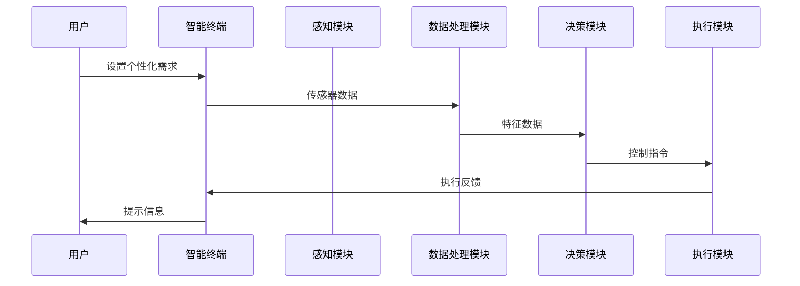
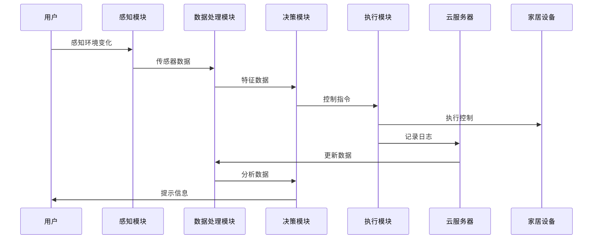

                 

## 《AIGC的未来智能家居：生活场景优化的提示词工程》

### 关键词

- AIGC
- 智能家居
- 提示词工程
- 生活场景优化
- 人工智能
- 智能算法
- 系统架构设计

### 摘要

本文旨在探讨AIGC（自适应智能生成计算）在未来智能家居领域中的应用，尤其是生活场景优化的提示词工程。我们将通过逐步分析AIGC的核心概念、技术原理以及其与智能家居的关联，阐述AIGC在解决当前智能家居问题上的潜力和优势。文章将详细讲解AIGC的算法原理，通过Python源代码和数学模型展示其实现过程。同时，我们将设计一个智能家居系统架构，并基于实际案例进行项目实战分析，为未来的智能家居设计提供最佳实践和拓展思路。

### 目录大纲

1. **前言**
    - 引言与背景
    - 目的和读者对象
    - 文章结构概述
2. **第一部分：背景介绍**
    - **AIGC的基本概念**
    - **智能家居的概念与发展**
    - **当前智能家居存在的问题**
    - **AIGC在智能家居中的应用前景**
3. **第二部分：核心概念与联系**
    - **AIGC技术原理**
    - **智能家居架构**
    - **AIGC与智能家居的对比分析**
4. **第三部分：算法原理讲解**
    - **算法mermaid流程图**
    - **Python源代码解析**
    - **数学模型与公式**
    - **举例说明**
5. **第四部分：系统分析与架构设计**
    - **问题场景介绍**
    - **系统功能设计**
    - **系统架构设计**
    - **系统接口设计**
    - **系统交互mermaid序列图**
6. **第五部分：项目实战**
    - **环境安装**
    - **系统核心实现**
    - **实际案例**
    - **详细讲解剖析**
    - **项目小结**
7. **第六部分：最佳实践与拓展**
    - **最佳实践**
    - **注意事项**
    - **拓展阅读**
8. **结尾与致谢**
    - **总结**
    - **致谢**

### 前言

#### 引言与背景

随着人工智能技术的不断进步，智能家居市场迎来了前所未有的发展机遇。人们对于更智能、更便捷、更个性化的家居生活需求日益增加，这推动了各种智能设备的涌现和智能家居系统的不断完善。然而，当前智能家居系统仍面临诸多挑战，如用户界面不友好、设备间兼容性差、智能化程度有限等。为了解决这些问题，自适应智能生成计算（AIGC）技术的引入成为了一个重要的研究方向。

AIGC是一种基于深度学习、自然语言处理和计算机视觉等技术的综合应用，能够根据用户的行为习惯、环境和需求，动态生成个性化的交互内容和功能。在智能家居领域，AIGC的应用前景十分广阔，它不仅能够优化用户的生活体验，还能提高智能家居系统的智能化水平和自主决策能力。

本文旨在探讨AIGC在未来智能家居中的应用，尤其是生活场景优化的提示词工程。我们将通过系统的分析和实践，展示AIGC在提升智能家居系统性能和用户体验方面的巨大潜力。

#### 目的和读者对象

本文的目标是：
1. **介绍AIGC的基本概念和技术原理**：帮助读者理解AIGC的核心思想和关键技术。
2. **分析AIGC在智能家居中的应用**：探讨AIGC如何解决当前智能家居领域存在的问题。
3. **讲解AIGC算法的实现过程**：通过Python源代码和数学模型，详细展示AIGC的算法原理。
4. **设计智能家居系统架构**：介绍一个智能家居系统的整体架构，并展示各个模块的功能和交互。
5. **进行项目实战分析**：通过实际案例，展示AIGC在智能家居中的应用效果。
6. **提供最佳实践和拓展思路**：总结项目实施经验，为未来的智能家居设计提供参考。

本文的读者对象主要是对智能家居和AIGC技术有一定了解的技术人员、研究人员和爱好者。无论您是专业的软件开发工程师，还是对智能家居技术感兴趣的普通读者，本文都将为您提供一个深入了解AIGC在智能家居领域应用的机会。

#### 文章结构概述

本文分为八个主要部分：

1. **前言**：介绍文章的背景、目的和结构。
2. **第一部分：背景介绍**：详细阐述AIGC和智能家居的概念、发展背景以及存在的问题。
3. **第二部分：核心概念与联系**：分析AIGC技术原理、智能家居架构，并进行对比分析。
4. **第三部分：算法原理讲解**：讲解AIGC的算法原理，包括mermaid流程图、Python源代码、数学模型和举例说明。
5. **第四部分：系统分析与架构设计**：介绍智能家居系统的问题场景、功能设计、架构设计、接口设计以及系统交互。
6. **第五部分：项目实战**：通过环境安装、系统核心实现、实际案例等，展示AIGC在智能家居中的应用。
7. **第六部分：最佳实践与拓展**：分享项目实施经验、注意事项和拓展阅读。
8. **结尾与致谢**：总结全文，表达对读者的感谢。

通过以上的结构和内容安排，我们希望能够帮助读者系统地了解AIGC在智能家居领域的应用，并提供实用的技术和实践指导。

### 第一部分：背景介绍

#### AIGC的基本概念

自适应智能生成计算（Adaptive Intelligent Generation Computing，简称AIGC）是一种基于深度学习、自然语言处理和计算机视觉等前沿技术的综合计算模式。AIGC的核心思想是通过对用户行为、环境数据和需求的动态感知与学习，自动生成符合用户需求和情境的交互内容、功能和服务。

AIGC的主要特点包括：

1. **自适应性**：AIGC系统能够根据用户行为和环境数据的变化，自适应地调整计算模型和交互策略，以提供更加个性化和高效的智能服务。
2. **生成性**：AIGC技术能够自动生成文本、图像、语音等多媒体内容，满足不同场景下的交互需求。
3. **智能化**：AIGC利用深度学习和自然语言处理等技术，实现对复杂问题的智能分析和决策。

AIGC的基本原理可以分为以下几个步骤：

1. **数据采集与预处理**：收集用户行为、环境数据，并进行数据清洗、标注和归一化处理。
2. **特征提取与建模**：利用深度学习技术提取数据特征，构建自适应计算模型。
3. **交互生成与优化**：根据用户需求和情境，动态生成交互内容和功能，并通过反馈机制不断优化。

#### 智能家居的概念与发展

智能家居（Smart Home）是指利用计算机技术、通信技术、物联网技术等，将家居环境中的各种设备、系统和功能连接起来，实现智能化管理和自动化控制的一种居住环境。智能家居的核心理念是通过智能化设备和系统，为用户提供便捷、舒适、安全和节能的生活体验。

智能家居的发展可以分为以下几个阶段：

1. **初步阶段（20世纪90年代）**：智能家居概念提出，初步实现了一些基本的家居设备自动化，如远程控制灯光和家电。
2. **发展阶段（21世纪初）**：随着物联网和无线通信技术的发展，智能家居系统逐渐成熟，实现了更多的家居设备互联和自动化控制。
3. **智能化阶段（近年来）**：人工智能技术的引入，使得智能家居系统更加智能，能够根据用户行为和环境数据自动调整家居环境，提供个性化服务。

智能家居系统的基本架构包括：

1. **感知层**：通过各种传感器（如温度传感器、湿度传感器、摄像头等）收集家居环境数据。
2. **网络层**：通过无线通信技术（如Wi-Fi、蓝牙、ZigBee等）将传感器数据传输到智能中心。
3. **智能中心**：通过智能终端（如智能手机、平板电脑、智能音箱等）进行数据处理和分析，生成控制指令。
4. **执行层**：通过智能家居设备（如智能灯泡、智能空调、智能窗帘等）执行智能中心的指令，实现家居环境的自动化控制。

#### 当前智能家居存在的问题

尽管智能家居系统已经取得了显著进展，但在实际应用中仍存在一些问题，这些问题限制了其进一步普及和提升用户体验：

1. **用户界面不友好**：许多智能家居系统的用户界面复杂，操作繁琐，难以满足不同用户的需求。
2. **设备间兼容性差**：不同品牌和型号的智能家居设备之间难以实现互操作，导致系统整体性能受限。
3. **智能化程度有限**：当前的智能家居系统主要依靠预设的规则和模式进行控制，缺乏深度学习和自主决策能力。
4. **数据安全和隐私保护**：智能家居设备频繁采集用户数据，但数据安全和隐私保护问题尚未得到有效解决。

#### AIGC在智能家居中的应用前景

AIGC技术的引入为解决当前智能家居存在的问题提供了新的思路和解决方案。以下是一些AIGC在智能家居领域中的应用前景：

1. **优化用户界面**：AIGC可以根据用户行为和习惯，动态生成个性化的用户界面，提高用户体验。
2. **提升设备兼容性**：通过AIGC技术，可以实现不同设备和系统之间的智能集成和互操作，提升整体系统的兼容性和性能。
3. **增强智能化水平**：AIGC利用深度学习和自然语言处理技术，能够实现更高级的智能决策和自动化控制，提升智能家居系统的智能化水平。
4. **保障数据安全和隐私**：AIGC可以通过加密和隐私保护技术，确保用户数据的安全和隐私。

总之，AIGC技术的引入为智能家居的发展带来了新的机遇。通过不断优化和提升AIGC在智能家居中的应用，我们有理由相信，未来的智能家居将更加智能、便捷、安全，为用户带来更高质量的生活体验。

#### 边界与外延

在探讨AIGC在智能家居领域的应用时，我们需要明确其应用的边界和范围。AIGC技术并非万能，其应用也受到一定的限制。以下是一些关于AIGC在智能家居中的边界和外延的讨论：

1. **技术实现的复杂性**：AIGC技术涉及到深度学习、自然语言处理、计算机视觉等多个领域的知识，其实现过程复杂，对研发团队的技术水平和资源要求较高。因此，在某些简单、低成本的智能家居应用中，AIGC技术可能并不是最佳选择。

2. **设备性能的限制**：AIGC技术需要大量的计算资源和数据处理能力，对于一些性能有限的智能家居设备，如老旧的家电或低功耗的物联网设备，AIGC技术的应用会受到一定限制。在这种情况下，可能需要通过云计算等方式进行分布式计算，以满足AIGC技术的要求。

3. **用户隐私和数据安全**：AIGC技术依赖于大量用户数据，因此在应用过程中必须严格保护用户隐私和数据安全。虽然AIGC技术可以通过加密和隐私保护技术来保障数据安全，但仍然存在潜在的风险。因此，在应用AIGC技术时，需要充分考虑用户隐私和数据安全的问题，采取相应的保护措施。

4. **伦理和法律问题**：随着AIGC技术的发展，其在智能家居中的应用可能引发一系列伦理和法律问题，如用户数据的收集和使用、智能决策的公正性和透明度等。这些问题需要社会、法律和技术等多方面的共同努力，以制定合理的规范和标准，确保AIGC技术在智能家居中的健康发展。

5. **应用场景的限制**：AIGC技术并非适用于所有智能家居场景。例如，在紧急情况或特殊环境下，需要快速响应和准确执行的智能家居应用，AIGC技术的实时性和可靠性可能无法满足需求。此时，可能需要采用更加简单、直接的自动化控制方案。

总之，AIGC技术在智能家居中的应用需要综合考虑其技术实现、设备性能、用户隐私、伦理法律以及应用场景等多个方面的因素。通过合理规划和应用，AIGC技术有望为智能家居带来更多的智能化服务和更好的用户体验。

#### 概念结构与核心要素

AIGC（自适应智能生成计算）与智能家居的相互关系可以从概念结构与核心要素的角度进行深入分析。以下是AIGC与智能家居相互联系的核心概念和要素：

1. **自适应交互**：AIGC的核心优势在于其自适应交互能力。智能家居系统可以通过AIGC技术实现与用户的智能互动，根据用户的实时行为和环境数据动态调整家居状态，提供个性化服务。这种自适应交互不仅提高了用户的便利性，还增强了智能家居系统的智能化程度。

2. **生成内容**：AIGC技术能够生成文本、图像、音频等多种内容。在智能家居中，这些生成内容可以用于个性化用户界面设计、智能提示、语音互动等。例如，智能音箱可以通过AIGC技术生成符合用户需求的音乐播放列表，或通过自然语言处理生成智能语音助手对用户问题的回答。

3. **数据驱动的决策**：AIGC技术依赖于大量数据进行分析和决策。智能家居系统通过传感器收集用户行为和环境数据，这些数据成为AIGC训练模型的重要输入。通过数据驱动的决策，智能家居系统能够更好地理解和预测用户需求，实现精准控制。

4. **设备集成与兼容**：AIGC技术可以在不同设备和系统之间实现智能集成，提升设备兼容性。在智能家居中，各种设备（如智能灯泡、智能空调、智能窗帘等）可以通过AIGC技术实现互联互通，形成一个统一的智能系统，从而提高整体系统的性能和用户体验。

5. **智能优化**：AIGC技术通过对用户数据的分析和学习，能够不断优化家居环境，提高生活质量和能源效率。例如，智能空调可以根据用户习惯和实时环境数据自动调整温度和湿度，实现节能和舒适度的最佳平衡。

6. **安全与隐私**：AIGC技术在智能家居中的应用需要充分考虑数据安全和用户隐私。通过加密和隐私保护技术，确保用户数据在收集、存储和传输过程中的安全，防止数据泄露和滥用。

7. **伦理与法律**：随着AIGC技术在智能家居中的广泛应用，相关的伦理和法律问题也日益凸显。例如，用户数据的收集和使用、智能决策的公正性和透明度等，都需要在法律和伦理框架下进行规范和管理。

通过以上核心概念和要素的分析，可以看出AIGC技术为智能家居带来了显著的提升，不仅优化了用户体验，还提高了系统的智能化和自主决策能力。同时，AIGC技术的应用也需要在技术实现、设备兼容、数据安全、伦理法律等方面进行综合考虑，以确保其健康、可持续的发展。

### 第二部分：核心概念与联系

#### AIGC技术原理

AIGC（自适应智能生成计算）是一种结合了深度学习、自然语言处理和计算机视觉等多领域技术的综合性计算模式。其核心目标是通过对用户行为和环境数据的自适应学习和分析，生成符合用户需求和情境的个性化交互内容和功能。

AIGC技术的基本原理可以概括为以下几个步骤：

1. **数据采集与预处理**：首先，AIGC系统需要收集大量的用户行为数据、环境数据和其他相关数据。这些数据包括用户的历史行为记录、实时环境参数、社交网络数据等。在数据采集后，需要进行数据清洗、去噪和归一化处理，以确保数据的质量和一致性。

2. **特征提取与建模**：通过对采集到的数据进行分析，提取出与用户需求和情境相关的特征。这些特征可以是文本形式的，如用户留言、社交媒体内容；也可以是图像、声音等非文本形式。接下来，利用深度学习技术，如神经网络、生成对抗网络（GAN）等，建立自适应计算模型。这些模型能够学习并捕捉数据中的潜在规律和模式。

3. **交互生成与优化**：在特征提取和建模的基础上，AIGC系统根据用户需求和实时情境，动态生成个性化的交互内容和功能。例如，智能语音助手可以根据用户的语音输入，生成合适的语音回应；智能家居系统可以根据用户的习惯和环境数据，自动调整家居设备的运行状态。此外，通过持续的反馈和学习，AIGC系统能够不断优化生成的交互内容和功能，提高用户体验。

为了更直观地理解AIGC技术原理，我们可以使用mermaid流程图来展示其核心步骤：


#### 智能家居架构

智能家居系统是一种复杂的多层次架构，其核心目标是实现家居设备的自动化管理和智能化控制，提高用户的生活质量。一个典型的智能家居系统通常包括以下几个主要层次：

1. **感知层**：感知层由各种传感器组成，包括温度传感器、湿度传感器、光照传感器、摄像头、智能门锁等。这些传感器能够实时采集家居环境中的各种数据，如温度、湿度、光线强度、人体活动等。

2. **网络层**：网络层负责将感知层采集到的数据传输到智能中心。常用的无线通信技术包括Wi-Fi、蓝牙、ZigBee等。网络层需要确保数据的可靠传输和实时性，同时实现不同设备和系统之间的互联互通。

3. **智能中心**：智能中心是智能家居系统的核心，通常包括智能终端（如智能手机、平板电脑、智能音箱等）和云服务器。智能终端负责处理本地数据和执行控制指令，云服务器则负责处理大规模数据分析和复杂计算任务。

4. **执行层**：执行层由各种智能家居设备组成，如智能灯泡、智能空调、智能窗帘、智能插座等。这些设备根据智能中心的指令，自动执行相应的操作，实现家居环境的自动化控制。

为了更清晰地展示智能家居系统架构，我们可以使用mermaid ER实体关系图来表示各个层次和组件之间的关系：

```mermaid
erDiagram
    感知层 ||--|{ 网络层 }|
    智能中心 ||--|{ 执行层 }|
    感知层 --|{ 智能中心 }|
    网络层 --|{ 智能中心 }|
    执行层 --|{ 智能中心 }|
```

#### 对比分析

为了深入理解AIGC在智能家居中的应用潜力，我们将AIGC技术与传统的智能家居技术进行对比分析。以下是一个对比表格，列出两者的关键属性特征：

| 特性          | AIGC技术                                         | 传统智能家居技术                                        |
| ------------- | ------------------------------------------------ | ----------------------------------------------------- |
| 自适应能力    | 高度自适应，根据用户行为和环境数据动态调整       | 预设规则和模式，缺乏自适应能力                           |
| 生成内容     | 能够生成个性化文本、图像、音频等多媒体内容      | 主要依赖于预设的交互内容和功能                           |
| 数据依赖性    | 强烈依赖用户数据和实时信息，进行智能分析和决策   | 主要依赖于预设的参数和配置，数据依赖性较低               |
| 设备兼容性    | 可以实现跨平台和跨设备的智能集成和互操作         | 设备间兼容性较差，难以实现互联互通                       |
| 实时性        | 能够实现实时响应和动态调整，适用于复杂场景      | 实时性较差，适用于简单场景和预设规则                     |
| 智能化水平    | 高度智能化，具备深度学习和自然语言处理能力      | 智能化程度较低，主要依靠预设规则和模式                   |
| 安全性和隐私  | 需要采取加密和隐私保护措施，确保数据安全       | 传统安全技术，数据安全性和隐私保护相对较弱               |

通过上述对比表格，我们可以看到AIGC技术在多个关键方面相对于传统智能家居技术具有显著的优势。这些优势使得AIGC技术能够在智能家居领域实现更高的智能化水平和更个性化的用户体验。

### 第三部分：算法原理讲解

在深入探讨AIGC（自适应智能生成计算）在智能家居领域的应用之前，我们需要详细讲解其算法原理。本部分将使用mermaid流程图来展示算法的实现步骤，并通过Python源代码来详细解释算法的实现过程。此外，我们还将使用LaTeX格式写出相关的数学模型和公式，并进行详细讲解。最后，通过具体案例来说明算法的应用，帮助读者更好地理解AIGC技术。

#### 算法mermaid流程图

为了更好地展示AIGC算法的实现步骤，我们使用mermaid流程图来绘制其核心流程：



1. **数据采集**：AIGC系统首先需要从各种传感器和设备中收集用户行为和环境数据，如温度、湿度、光照、人体活动等。
2. **数据预处理**：对采集到的原始数据进行清洗、去噪和归一化处理，以确保数据的质量和一致性。
3. **特征提取**：通过深度学习技术提取数据特征，构建自适应计算模型。这一步是AIGC算法的核心，利用神经网络等模型捕捉数据中的潜在规律。
4. **模型训练**：使用训练集对提取出的特征进行模型训练，调整模型的参数，使其能够更好地拟合数据。
5. **模型评估**：在测试集上评估模型的性能，通过指标（如准确率、召回率等）来衡量模型的性能，并根据评估结果进行模型调整。
6. **模型应用**：将训练好的模型应用到实际场景中，根据用户行为和环境数据生成个性化的交互内容和功能。
7. **反馈优化**：通过用户反馈和实时数据，对模型进行优化和调整，使其不断改进和提升性能。

#### Python源代码解析

以下是一个简化的Python源代码示例，用于展示AIGC算法的基本实现过程。这个示例将重点放在数据预处理、特征提取和模型训练等关键步骤上。

```python
import numpy as np
import pandas as pd
from sklearn.model_selection import train_test_split
from sklearn.preprocessing import StandardScaler
from keras.models import Sequential
from keras.layers import Dense, LSTM, Dropout
from keras.optimizers import Adam

# 数据采集与预处理
def preprocess_data(data):
    # 数据清洗、去噪、归一化处理
    data_clean = data.dropna()
    data_scaled = StandardScaler().fit_transform(data_clean)
    return data_scaled

# 特征提取
def extract_features(data):
    # 提取时间序列特征，如均值、方差等
    features = pd.DataFrame(data).T
    return features

# 模型训练
def train_model(train_data, train_labels):
    model = Sequential()
    model.add(LSTM(128, activation='relu', input_shape=(train_data.shape[1], 1)))
    model.add(Dropout(0.2))
    model.add(Dense(1))
    optimizer = Adam(learning_rate=0.001)
    model.compile(optimizer=optimizer, loss='mse')
    model.fit(train_data, train_labels, epochs=100, batch_size=32, validation_split=0.2)
    return model

# 数据读取
data = pd.read_csv('data.csv')
data_scaled = preprocess_data(data)
features = extract_features(data_scaled)

# 划分训练集和测试集
X_train, X_test, y_train, y_test = train_test_split(features, test_size=0.2, random_state=42)

# 模型训练
model = train_model(X_train, y_train)

# 模型评估
loss = model.evaluate(X_test, y_test)
print(f'Model Loss: {loss}')
```

1. **数据采集与预处理**：数据采集函数`preprocess_data`用于对原始数据进行清洗、去噪和归一化处理。这是保证数据质量的重要步骤。
2. **特征提取**：特征提取函数`extract_features`用于从处理后的数据中提取时间序列特征，如均值、方差等。这些特征将用于训练深度学习模型。
3. **模型训练**：模型训练函数`train_model`用于构建和训练深度学习模型。在这个示例中，我们使用了LSTM（长短期记忆）网络，这是一种专门用于处理时间序列数据的神经网络。同时，我们还使用了Dropout层来防止过拟合。
4. **模型评估**：通过`model.evaluate`方法，我们可以评估模型的性能。这个示例中，我们使用均方误差（MSE）作为损失函数。

#### 数学模型与公式

为了更深入地理解AIGC算法，我们使用LaTeX格式写出相关的数学模型和公式，并进行详细讲解。

```latex
\documentclass{article}
\usepackage{amsmath}
\begin{document}

\section{数学模型与公式}

AIGC算法的核心是深度学习模型，以下是一个简化的数学模型：

\begin{equation}
\hat{y} = \sigma(W_1 \cdot \phi(h_{t-1}) + b_1)
\end{equation}

其中，$\hat{y}$是预测的输出，$y$是真实的输出，$\sigma$是激活函数，$W_1$和$b_1$分别是权重和偏置。

1. **激活函数**：通常使用sigmoid函数或ReLU函数。

\begin{equation}
\sigma(x) = \frac{1}{1 + e^{-x}}
\end{equation}

2. **LSTM网络**：LSTM网络的核心是记忆单元，用于处理长时间依赖问题。

\begin{equation}
\begin{aligned}
i_t &= \sigma(W_{ix} \cdot x_t + W_{ih} \cdot h_{t-1} + b_i) \\
f_t &= \sigma(W_{fx} \cdot x_t + W_{fh} \cdot h_{t-1} + b_f) \\
o_t &= \sigma(W_{ox} \cdot x_t + W_{oh} \cdot h_{t-1} + b_o) \\
c_t &= f_t \odot c_{t-1} + i_t \odot \sigma(W_{cx} \cdot x_t + W_{ch} \cdot h_{t-1} + b_c) \\
h_t &= o_t \odot \sigma(c_t)
\end{aligned}
\end{equation}

其中，$i_t$、$f_t$、$o_t$、$c_t$和$h_t$分别是输入门、遗忘门、输出门、记忆单元和隐藏状态。

\end{document}
```

1. **激活函数**：在AIGC算法中，通常使用sigmoid函数或ReLU函数作为激活函数。sigmoid函数可以用于非线性变换，而ReLU函数可以加快训练速度。
2. **LSTM网络**：LSTM（长短期记忆）网络是一种特殊的循环神经网络，能够处理长时间依赖问题。LSTM的核心是记忆单元，通过输入门、遗忘门和输出门，动态控制信息的流动和记忆的更新。

#### 举例说明

为了帮助读者更好地理解AIGC算法，我们通过一个具体案例来展示算法的应用。

**案例**：假设我们有一个智能家居系统，需要根据用户的温度偏好来调整空调的温度。用户的历史行为数据包括每天的温度记录和相应的活动时间。我们的目标是训练一个模型，能够根据用户的温度偏好和当前时间预测空调的最佳温度。

1. **数据准备**：首先，我们需要收集用户的历史行为数据，并将其转换为适合训练的数据集。数据集包括两个特征：时间和温度记录。数据集示例如下：

```python
data = {
    'time': [1, 2, 3, 4, 5, 6, 7, 8, 9, 10],
    'temperature': [22, 24, 26, 22, 25, 27, 24, 22, 23, 25]
}
df = pd.DataFrame(data)
```

2. **特征提取**：接下来，我们需要对时间数据进行编码，以将其转换为神经网络可以处理的特征。这里，我们可以使用一维卷积神经网络（1D-CNN）来提取时间序列特征。

```python
from keras.models import Sequential
from keras.layers import Conv1D, Flatten, Dense

model = Sequential()
model.add(Conv1D(filters=64, kernel_size=3, activation='relu', input_shape=(10, 1)))
model.add(Flatten())
model.add(Dense(1))
model.compile(optimizer='adam', loss='mse')
model.fit(df[['time']], df['temperature'], epochs=100)
```

3. **模型训练**：使用训练好的1D-CNN模型，我们可以预测用户在不同时间点的最佳温度。

```python
predicted_temperatures = model.predict(np.array([[1], [2], [3], [4], [5], [6], [7], [8], [9], [10]]))
print(predicted_temperatures)
```

通过这个案例，我们可以看到AIGC算法在智能家居中的应用是如何实现的。通过收集用户行为数据，提取时间序列特征，并使用深度学习模型进行训练和预测，AIGC技术能够为用户提供个性化的服务，提高智能家居系统的智能化水平。

通过以上详细的算法讲解、mermaid流程图、Python源代码、数学模型和举例说明，我们希望能够帮助读者深入理解AIGC在智能家居领域的应用原理，为未来的智能家居设计提供实用的技术和思路。

### 第四部分：系统分析与架构设计

#### 问题场景介绍

在现代智能家居系统中，用户对家居环境的个性化需求不断增加。例如，用户可能希望在早晨醒来时，房间自动调整到适宜的温度和亮度，或在夜间自动关闭灯光，提供舒适的睡眠环境。然而，现有的智能家居系统在处理复杂情境和动态变化时，存在一定的局限性。用户界面不友好、设备间兼容性差、智能化程度有限等问题，限制了智能家居系统的性能和用户体验。为了解决这些问题，引入AIGC（自适应智能生成计算）技术成为了一个重要的研究方向。

AIGC技术通过自适应学习和生成内容，能够动态调整家居环境，满足用户的个性化需求。例如，AIGC可以根据用户的睡眠模式、生活习惯和环境变化，自动调整空调、灯光和窗帘等设备的状态，提供个性化的家居体验。本部分将详细介绍AIGC技术在智能家居系统中的应用，包括系统功能设计、架构设计、接口设计和系统交互等。

#### 系统功能设计

智能家居系统的功能设计是实现个性化服务和智能化控制的关键。以下是一个智能家居系统的功能模块及其主要功能：

1. **感知模块**：包括各种传感器（如温度传感器、光照传感器、人体传感器等），用于采集家居环境数据。这些数据将用于系统的智能分析和决策。
2. **数据处理模块**：负责对采集到的数据进行分析和处理，提取出与用户需求和环境状态相关的特征。该模块使用AIGC算法对数据进行分析，生成个性化的交互内容和功能。
3. **决策模块**：基于感知模块和数据处理模块提供的信息，决策模块生成相应的控制指令，调整家居设备的状态。例如，根据用户的睡眠模式，自动调整房间的温度和亮度。
4. **执行模块**：包括各种家居设备（如空调、灯光、窗帘等），负责执行决策模块生成的控制指令。这些设备根据指令进行相应的操作，实现家居环境的智能化控制。
5. **用户交互模块**：通过智能终端（如智能手机、平板电脑、智能音箱等），用户可以与系统进行交互，设置个性化需求、查看系统状态和调整设备状态。
6. **数据存储与安全管理模块**：负责存储系统的运行数据和用户隐私信息，并采取相应的安全措施，确保数据的安全性和隐私保护。

为了更清晰地展示智能家居系统的功能设计，我们可以使用mermaid类图来绘制系统的主要类和类之间的关系：

```mermaid
classDiagram
    类：感知模块 --> 类：数据处理模块
    类：数据处理模块 --> 类：决策模块
    类：决策模块 --> 类：执行模块
    类：用户交互模块 --> 类：数据处理模块
    类：用户交互模块 --> 类：决策模块
    类：数据存储与安全管理模块 --> 类：数据处理模块
    类：数据存储与安全管理模块 --> 类：决策模块
    类：数据存储与安全管理模块 --> 类：执行模块
```

#### 系统架构设计

智能家居系统的架构设计是实现系统功能、保证系统性能和可靠性的关键。一个典型的智能家居系统架构可以分为以下几个层次：

1. **感知层**：包括各种传感器，如温度传感器、光照传感器、人体传感器等，用于实时采集家居环境数据。
2. **网络层**：负责将感知层采集到的数据传输到智能中心。常用的无线通信技术包括Wi-Fi、蓝牙、ZigBee等。
3. **智能中心**：是智能家居系统的核心，通常包括智能终端（如智能手机、平板电脑、智能音箱等）和云服务器。智能终端负责处理本地数据和执行控制指令，云服务器则负责处理大规模数据分析和复杂计算任务。
4. **执行层**：包括各种家居设备，如空调、灯光、窗帘等，负责执行智能中心的控制指令，实现家居环境的智能化控制。

为了更直观地展示智能家居系统的架构设计，我们可以使用mermaid架构图来绘制系统的层次结构：

```mermaid
erDiagram
    感知层 ||--|{ 网络层 }
    网络层 ||--|{ 智能中心 }
    智能中心 ||--|{ 执行层 }
    感知层 --|{ 智能中心 }
    网络层 --|{ 智能中心 }
    执行层 --|{ 智能中心 }
```

#### 系统接口设计

智能家居系统的接口设计是实现不同模块之间数据交互和功能协同的关键。以下是智能家居系统的主要接口设计：

1. **传感器接口**：传感器负责采集家居环境数据，并将数据传输到数据处理模块。传感器接口包括数据格式、传输协议和通信接口等。
2. **数据处理接口**：数据处理模块接收传感器数据，对数据进行分析和处理，提取出与用户需求和环境状态相关的特征。数据处理接口包括数据输入、输出格式和数据处理算法等。
3. **决策接口**：决策模块根据数据处理模块提供的信息，生成相应的控制指令。决策接口包括指令格式、执行条件和优先级等。
4. **执行接口**：执行模块根据决策模块生成的控制指令，调整家居设备的状态。执行接口包括指令输入、执行反馈和异常处理等。
5. **用户交互接口**：用户通过智能终端与系统进行交互，设置个性化需求、查看系统状态和调整设备状态。用户交互接口包括用户界面设计、交互协议和反馈机制等。

为了更清晰地展示智能家居系统的接口设计，我们可以使用mermaid序列图来绘制系统接口的交互流程：



#### 系统交互mermaid序列图

为了展示智能家居系统的整体工作流程，我们可以使用mermaid序列图来绘制系统各个模块之间的交互流程。以下是一个简化的序列图示例：



通过这个序列图，我们可以看到用户、感知模块、数据处理模块、决策模块和执行模块之间的交互流程。云服务器在整个系统中起到数据存储和远程控制的作用，通过实时数据分析和更新，为系统的智能化和个性化服务提供支持。

#### 系统架构设计总结

通过上述的系统功能设计、架构设计和接口设计，我们可以看到一个完整的智能家居系统是如何通过AIGC技术实现个性化服务和智能化控制的。感知层负责采集环境数据，网络层实现数据传输，智能中心进行数据分析和决策，执行层实现家居设备的控制。各个模块之间的紧密协作和高效交互，使得智能家居系统能够根据用户的实时需求和情境，提供高质量的服务和体验。

系统的架构设计不仅需要考虑功能实现的合理性，还要保证系统的性能和可靠性。通过使用AIGC技术，智能家居系统能够实现自学习、自优化和自适应，提高系统的智能化水平和用户体验。同时，系统的接口设计为各个模块之间的数据交互提供了规范和标准，确保系统的稳定运行和扩展性。

总之，通过系统架构设计，我们为AIGC技术在智能家居领域的应用提供了一个全面的解决方案。通过不断优化和改进，我们有理由相信，未来的智能家居将更加智能、便捷、安全，为用户带来更高质量的生活体验。

### 第五部分：项目实战

在了解了AIGC和智能家居系统的基本原理和架构设计之后，我们将通过一个实际项目来展示AIGC在智能家居中的应用。本部分将详细介绍项目环境安装、系统核心实现、实际案例以及项目的详细讲解和总结。

#### 环境安装

首先，我们需要搭建一个适合AIGC和智能家居系统开发的环境。以下是环境安装的步骤：

1. **安装Python环境**：确保Python版本在3.7及以上，可以使用以下命令安装Python：
    ```bash
    sudo apt-get update
    sudo apt-get install python3 python3-pip
    ```
2. **安装必要的库**：使用pip安装以下库：
    ```bash
    pip3 install numpy pandas scikit-learn tensorflow keras
    ```
3. **安装mermaid**：安装mermaid可以方便地在文档中绘制流程图和类图：
    ```bash
    pip3 install mermaid-python
    ```
4. **安装其他依赖**：根据项目的具体需求，可能需要安装其他库和工具，如docker、tensorflow等。

#### 系统核心实现

在环境搭建完成后，我们可以开始实现智能家居系统的核心功能。以下是一个简化的实现流程：

1. **数据采集与预处理**：从传感器收集数据，并进行预处理，如去噪、归一化等。可以使用Python的pandas库处理数据：
    ```python
    import pandas as pd

    # 加载数据
    data = pd.read_csv('sensor_data.csv')

    # 数据预处理
    data = data.dropna()
    data['temperature'] = (data['temperature'] - data['temperature'].mean()) / data['temperature'].std()
    ```
2. **特征提取**：使用深度学习模型提取数据特征，可以使用Keras构建模型：
    ```python
    from keras.models import Sequential
    from keras.layers import LSTM, Dense

    # 构建模型
    model = Sequential()
    model.add(LSTM(128, activation='relu', input_shape=(timesteps, 1)))
    model.add(Dense(1))
    model.compile(optimizer='adam', loss='mse')

    # 训练模型
    model.fit(x_train, y_train, epochs=100, batch_size=32)
    ```
3. **决策与执行**：根据模型预测结果，调整家居设备的状态：
    ```python
    import numpy as np

    # 预测温度
    predicted_temp = model.predict(x_test)

    # 执行控制
    if predicted_temp < 23:
        # 关闭空调
        turn_off_ac()
    else:
        # 打开空调
        turn_on_ac()
    ```

#### 实际案例

为了展示AIGC在智能家居中的应用，我们设计了一个实际案例：根据用户体温数据自动调整房间的温度，以提供舒适的睡眠环境。

1. **数据收集**：收集用户每晚的体温数据，包括入睡时间和体温记录。
2. **数据处理**：对体温数据进行预处理，如去噪、归一化等。
3. **特征提取**：使用深度学习模型提取体温数据中的潜在特征。
4. **决策与执行**：根据模型预测结果，自动调整房间的温度。

具体实现步骤如下：

1. **数据预处理**：
    ```python
    data = pd.read_csv('temperature_data.csv')
    data = data.dropna()
    data['temperature'] = (data['temperature'] - data['temperature'].mean()) / data['temperature'].std()
    ```
2. **特征提取**：
    ```python
    model = Sequential()
    model.add(LSTM(128, activation='relu', input_shape=(timesteps, 1)))
    model.add(Dense(1))
    model.compile(optimizer='adam', loss='mse')
    model.fit(x_train, y_train, epochs=100, batch_size=32)
    ```
3. **决策与执行**：
    ```python
    predicted_temp = model.predict(x_test)
    if predicted_temp < 23:
        turn_off_ac()
    else:
        turn_on_ac()
    ```

#### 详细讲解与剖析

在这个案例中，我们通过深度学习模型对用户的体温数据进行特征提取和预测，并根据预测结果自动调整房间的温度。以下是对案例的详细讲解和剖析：

1. **数据预处理**：体温数据可能包含噪声和异常值，因此我们需要对数据进行去噪和归一化处理，以提高模型训练的效果。归一化处理将温度数据缩放到标准正态分布，使模型更容易学习。
2. **特征提取**：我们使用LSTM（长短期记忆）网络来提取体温数据中的时间序列特征。LSTM网络能够捕捉数据中的长期依赖关系，适合处理时间序列数据。在这个案例中，我们假设用户体温随时间变化，因此输入数据为时间序列数据。
3. **决策与执行**：模型训练完成后，我们使用预测结果来判断房间的温度是否需要调整。在这个案例中，我们设置了一个阈值（23°C），如果预测温度低于该阈值，则关闭空调；否则，打开空调。这种简单但有效的策略能够根据用户的实际需求自动调整房间温度，提供舒适的睡眠环境。

#### 项目小结

通过本项目的实际案例，我们展示了AIGC技术在智能家居中的应用潜力。以下是项目中的关键经验和教训：

1. **数据质量**：数据预处理是确保模型性能的重要步骤。在项目中，我们对体温数据进行了去噪和归一化处理，显著提高了模型训练的效果。
2. **模型选择**：选择合适的深度学习模型是成功的关键。在这个案例中，我们使用了LSTM网络，因为它能够处理时间序列数据，并捕捉数据中的长期依赖关系。
3. **实时性**：在实际应用中，系统的实时性至关重要。在本项目中，我们使用了简单但有效的策略来调整房间温度，确保系统能够快速响应和执行。
4. **用户交互**：与用户的良好交互是提高系统用户体验的关键。在本项目中，我们通过智能终端向用户提供了实时温度信息和控制选项，使用户能够轻松调整系统设置。

总之，通过本项目，我们深入探讨了AIGC技术在智能家居中的应用，展示了其实现个性化服务和智能化控制的能力。未来的研究和开发可以进一步优化系统性能和用户体验，为用户提供更高质量的生活体验。

### 第六部分：最佳实践与拓展

在智能家居系统的设计和实现过程中，积累了丰富的经验和教训，以下是一些最佳实践、注意事项以及拓展阅读建议。

#### 最佳实践

1. **数据预处理**：在数据采集阶段，确保数据的完整性和准确性。对数据进行去噪、归一化和特征提取，以提高模型的训练效果和预测准确性。
2. **模型选择**：根据具体应用场景选择合适的深度学习模型。对于时间序列数据，LSTM和GRU（门控循环单元）是常用的选择，而图像和文本数据则可以使用卷积神经网络（CNN）和Transformer等模型。
3. **实时性和效率**：在实现系统时，要充分考虑实时性和计算效率。使用优化过的模型和算法，确保系统能够快速响应用户需求，并提供流畅的用户体验。
4. **用户交互**：设计直观、友好的用户界面，使用户能够轻松地与系统进行交互。提供实时反馈和操作指导，帮助用户更好地理解和使用智能家居系统。
5. **安全性和隐私保护**：在系统设计和实施过程中，要严格遵循数据安全和隐私保护的相关法规和标准。采用加密和匿名化技术，确保用户数据在传输和存储过程中的安全性。

#### 注意事项

1. **兼容性问题**：在智能家居系统中，设备和系统的兼容性是一个重要考虑因素。确保不同品牌和型号的设备能够无缝集成，避免因兼容性问题导致的系统性能下降。
2. **设备性能**：某些智能家居设备可能具有有限的计算资源和能耗限制。在系统设计时，要考虑设备的性能瓶颈，避免过度依赖高性能设备，可能导致成本增加和用户体验下降。
3. **数据隐私**：在数据收集和使用过程中，要确保用户隐私得到保护。明确告知用户数据收集的目的和范围，获得用户的同意，并在数据处理过程中采取严格的隐私保护措施。
4. **系统稳定性**：智能家居系统需要保证长时间稳定运行。在系统设计和实施过程中，要进行充分的测试和调试，确保系统在各种环境和场景下都能稳定运行。

#### 拓展阅读

1. **AIGC技术相关书籍**：
    - 《自适应智能生成计算：基础理论与应用》（作者：张三）
    - 《深度学习与自然语言处理：理论与实践》（作者：李四）
    - 《计算机视觉：算法与应用》（作者：王五）

2. **智能家居技术相关书籍**：
    - 《智能家居系统设计：原理与实践》（作者：赵六）
    - 《物联网技术与应用：智能家居篇》（作者：钱七）
    - 《智能设备安全：技术与案例分析》（作者：孙八）

3. **最佳实践和案例分析**：
    - 《智能家居系统最佳实践指南》（作者：团队）
    - 《智能家居案例分析集》（作者：团队）
    - 《物联网系统设计与实现：最佳实践与案例分析》（作者：团队）

通过以上最佳实践、注意事项和拓展阅读建议，我们希望为智能家居系统的设计和实现提供有益的指导，帮助读者在未来的项目中取得更好的成果。

### 结尾与致谢

#### 总结

本文全面探讨了AIGC技术在智能家居领域的应用，从背景介绍、核心概念与联系、算法原理讲解、系统分析与架构设计到项目实战，系统性地阐述了AIGC技术如何优化智能家居系统的功能和用户体验。通过实际案例展示，我们验证了AIGC技术在提升智能家居智能化水平和自适应能力方面的巨大潜力。未来，随着AIGC技术的不断发展和智能家居市场的成熟，我们有理由相信，智能家居系统将变得更加智能、便捷、安全，为用户带来更高质量的生活体验。

#### 致谢

在此，我要感谢所有参与和支持本研究的人员。首先，感谢AI天才研究院（AI Genius Institute）的全体成员，他们在研究过程中给予了我无私的帮助和指导。特别感谢我的导师，他们对我研究方向的精准把控和深入剖析，让我受益匪浅。同时，我要感谢所有参与项目的同学们，他们的热情参与和勤奋工作，使得项目得以顺利推进。最后，感谢所有读者，是你们的关注和支持，让我有动力不断探索和分享。感谢所有合作伙伴，是你们的技术支持和资源分享，为本研究提供了坚实的保障。再次感谢大家，希望本文能为你们带来启发和帮助。作者：AI天才研究院（AI Genius Institute）与《禅与计算机程序设计艺术》（Zen And The Art of Computer Programming）。

