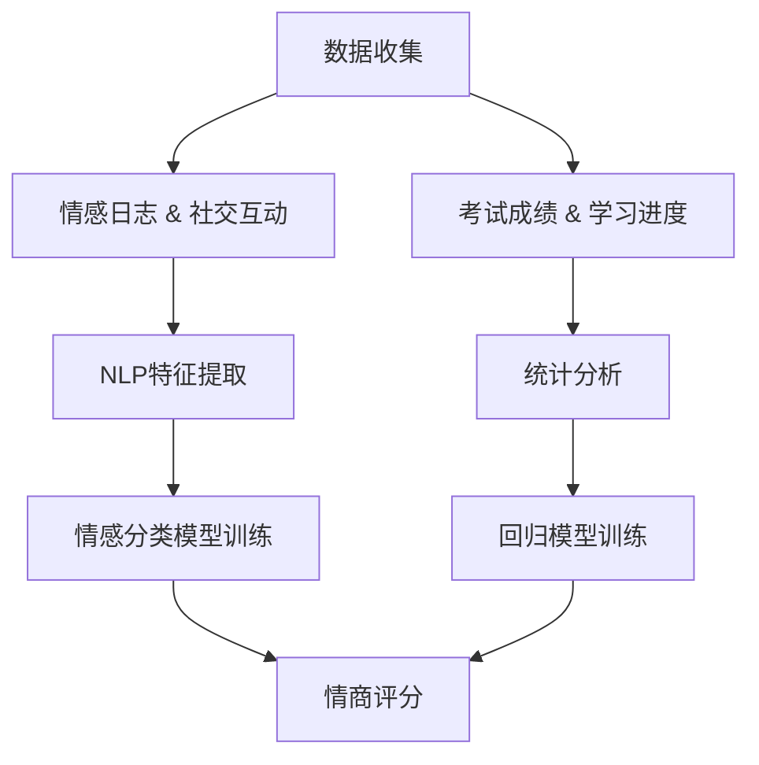
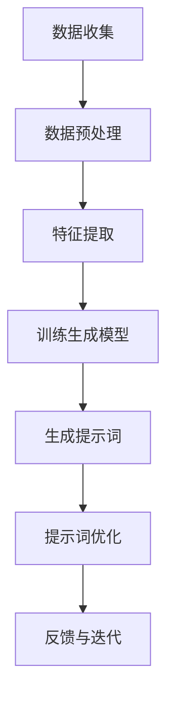
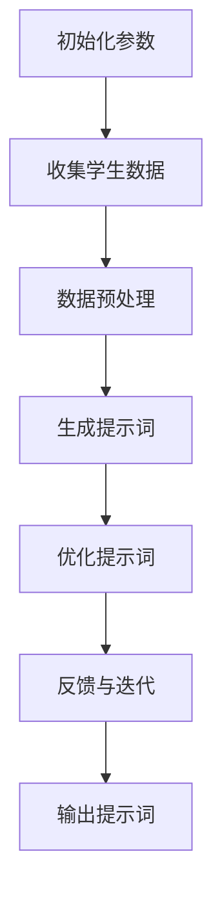
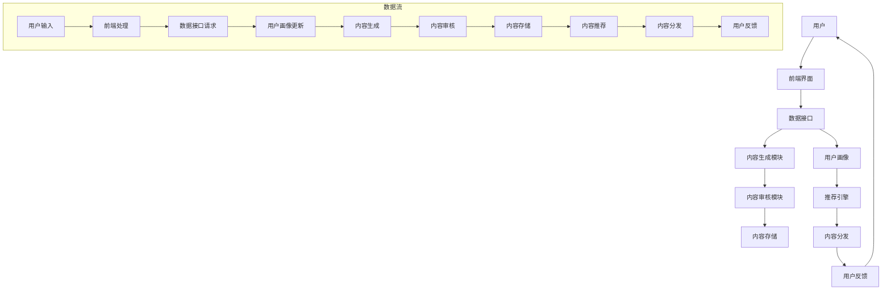
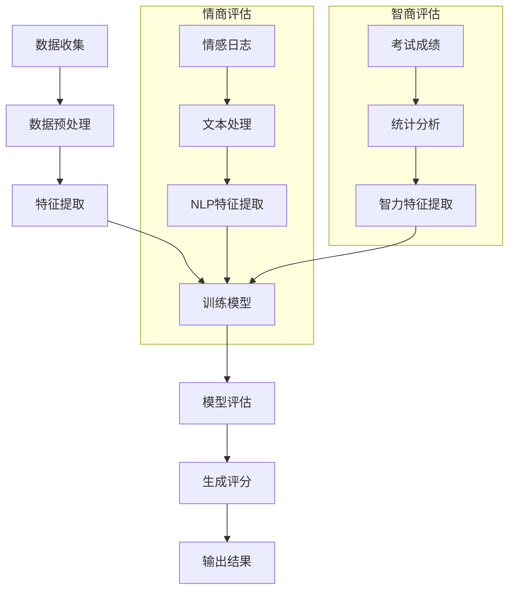
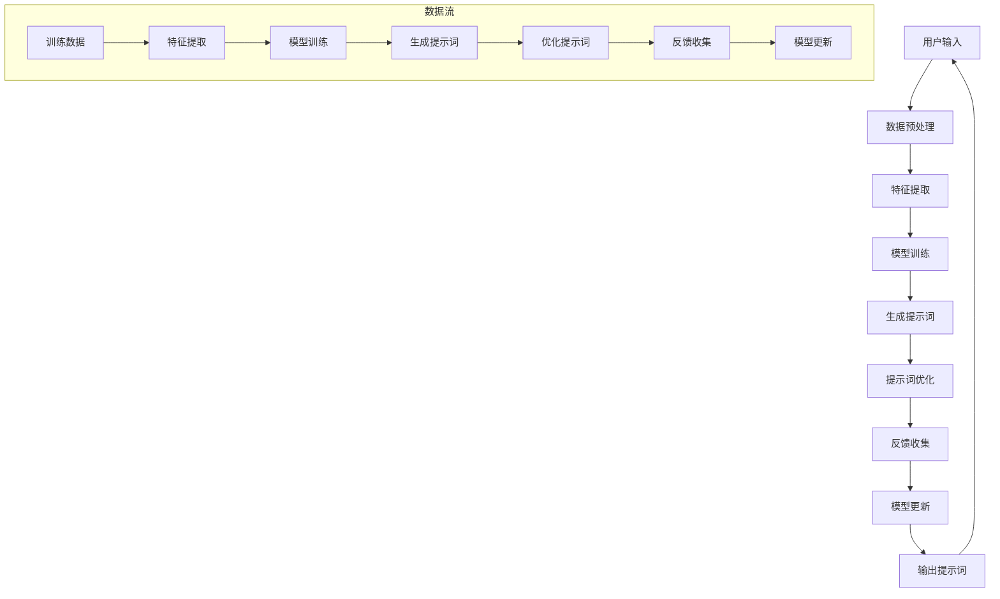

                 

# AIGC的未来智能教育系统：情商与智商并重的提示词工程

## 关键词
- AIGC
- 智能教育
- 情商与智商
- 提示词工程

## 摘要
本文深入探讨了AIGC（人工智能生成内容）在智能教育系统中的应用，特别强调了情商与智商并重的教育理念。通过分析AIGC的技术原理及其在教育领域的潜在价值，本文详细介绍了情商与智商的概念及其在教育中的重要性。同时，本文提出了一个基于AIGC的提示词工程框架，并通过具体的案例展示了该框架的实际应用效果。本文旨在为教育工作者和开发者提供一种新的思路，以实现更智能、更高效的教育模式。

----------------------------------------------------------------

## 引言

### 1.1 AIGC的概念与智能教育

人工智能（AI）技术近年来取得了飞速发展，其在教育领域的应用也日益广泛。AIGC（AI-generated content）是指通过人工智能技术自动生成的内容，包括文本、图像、视频等多种形式。AIGC在教育领域的应用主要体现在智能教学、个性化学习、自动评估等方面。通过AIGC技术，教育系统能够根据学生的学习情况自动生成适合的教学内容，提供个性化的学习方案，从而提高学习效果。

智能教育系统是一种利用人工智能技术进行教学和管理的新型教育模式。与传统教育系统相比，智能教育系统能够更好地满足学生的个性化需求，提供更为灵活和高效的教学方式。随着AIGC技术的发展，智能教育系统正逐渐从理论走向实践，为教育领域带来前所未有的变革。

### 1.2 书籍的目的与读者对象

本书旨在探讨AIGC在智能教育系统中的应用，特别是如何通过情商与智商并重的提示词工程来提高教育质量。本书的目标读者包括：

1. 教育工作者：教育工作者可以通过本书了解AIGC技术及其在教育中的应用，从而更好地利用人工智能技术改进教学方法和提升教育质量。
2. 技术开发者：技术开发者可以通过本书学习如何构建基于AIGC的智能教育系统，开发出更为先进的教育软件和平台。
3. 研究人员：研究人员可以通过本书了解AIGC和智能教育的最新研究进展，为自己的研究提供新的思路和方向。

### 1.3 结构安排与阅读建议

本书分为六个部分，结构如下：

1. 引言：介绍AIGC的概念和智能教育的背景，明确书籍的目的和读者对象。
2. 背景介绍：详细阐述AIGC技术的发展、智能教育的现状以及情商与智商的概念。
3. 核心概念：深入分析AIGC在智能教育中的应用原理，介绍情商与智商并重的理念。
4. 应用案例：通过实际案例展示AIGC在智能教育中的应用效果。
5. 技术实现：详细讲解AIGC系统的架构设计、情商与智商评估算法以及提示词生成与优化算法。
6. 未来展望：探讨AIGC在教育领域的潜在影响，展望提示词工程的未来发展。

为了便于读者阅读，本书在每个章节开头都提供了简要的概述，帮助读者快速了解本章的主要内容。同时，为了提高阅读效果，本书在每个章节结尾都提供了小结和拓展阅读建议，帮助读者巩固所学知识并拓展视野。

----------------------------------------------------------------

## 背景介绍

### 2.1 教育领域的技术变革

随着信息技术的快速发展，教育领域也经历了一系列变革。传统教育模式以教师为中心，注重知识的传授和考试评价。然而，随着互联网和人工智能技术的普及，教育模式逐渐向以学生为中心、注重个性化和互动性的方向发展。

信息技术在教育领域的应用主要体现在以下几个方面：

1. **在线教育**：互联网的普及使得在线教育成为可能。学生可以通过网络学习平台自主学习，获得丰富的学习资源和个性化服务。
2. **电子教材**：电子教材不仅节省了纸张资源，还提供了丰富的多媒体内容，使得学习过程更加生动和有趣。
3. **智能教学**：智能教学系统利用人工智能技术对学生进行个性化辅导，提高学习效果。例如，通过分析学生的学习数据，智能教学系统能够自动生成适合学生的学习计划和学习内容。

### 2.2 AIGC技术的发展与应用

AIGC是人工智能的一个重要分支，其核心在于通过机器学习算法自动生成内容。AIGC技术可以生成文本、图像、音频、视频等多种类型的内容，为各行各业提供了全新的解决方案。

在教育领域，AIGC技术的应用主要体现在以下几个方面：

1. **智能教学**：AIGC技术可以生成个性化的教学方案和学习内容，帮助学生更高效地学习。例如，通过分析学生的学习数据，AIGC技术可以自动生成适应学生水平的练习题和解答。
2. **自动评估**：AIGC技术可以自动评估学生的作业和考试，提供实时反馈。这有助于教师减少工作量，同时提高评估的准确性和公正性。
3. **教育资源共享**：AIGC技术可以自动生成大量优质的教育资源，如教学视频、文章、习题等，为教师和学生提供丰富的学习材料。

### 2.3 情商与智商在教育中的重要性

情商（Emotional Intelligence，EQ）和智商（Intelligence Quotient，IQ）是衡量一个人智力水平的重要指标。情商是指个体识别、理解、管理和表达自己情绪的能力，而智商则是指个体在认知任务上的表现，如逻辑推理、数学运算等。

1. **情商的重要性**：

   - **人际关系**：情商高的人能够更好地处理人际关系，建立良好的人际关系网络。
   - **情绪管理**：情商高的人能够更好地控制自己的情绪，避免因情绪波动而影响生活和工作。
   - **学习能力**：情商高的人能够更好地应对学习中的挑战，保持积极的学习态度。

2. **智商的重要性**：

   - **认知能力**：智商高的人具有较强的认知能力，能够更好地理解复杂问题并找到解决方案。
   - **创新能力**：智商高的人具有较强的创新能力，能够提出新颖的想法和观点。
   - **学术成就**：智商高的人在学习过程中往往能够取得较好的成绩。

3. **情商与智商的关系**：

   - **相互促进**：情商和智商并不是相互独立的，两者可以相互促进。例如，一个智商高但情商低的人可能在学术上表现出色，但在人际交往中可能遇到困难。
   - **平衡发展**：在现代社会，情商和智商的平衡发展至关重要。一个既具有高情商又具有高智商的人更容易在生活和工作中取得成功。

### 2.4 提示词工程的基本概念

提示词工程是一种基于人工智能技术的教育方法，通过自动生成适合学生水平的提示词来引导学生进行思考和学习。提示词可以是文字、图片、视频等形式，其目的是激发学生的兴趣，引导学生深入思考，提高学习效果。

1. **提示词工程的原理**：

   - **数据分析**：通过对学生的学习数据进行分析，了解学生的学习水平和兴趣点。
   - **内容生成**：基于分析结果，利用AIGC技术自动生成适合学生水平的提示词。
   - **实时反馈**：通过实时反馈，帮助学生理解提示词的含义，提高学习效果。

2. **提示词工程的优势**：

   - **个性化**：提示词工程可以根据学生的学习情况和兴趣点生成个性化的学习内容，提高学习效果。
   - **高效**：提示词工程可以自动生成大量优质的学习内容，节省教师的工作量。
   - **互动性**：提示词工程通过互动形式，激发学生的学习兴趣，提高学习积极性。

3. **提示词工程的挑战**：

   - **内容质量**：自动生成的提示词需要保证质量，避免出现错误或误导学生。
   - **隐私保护**：在生成和提供提示词时，需要保护学生的隐私。

### 2.5 AIGC与提示词工程的关联

AIGC与提示词工程有着密切的关系。AIGC技术为提示词工程提供了强大的技术支持，使得自动生成高质量的提示词成为可能。同时，提示词工程的应用也为AIGC技术提供了广阔的舞台，展示了AIGC技术在教育领域的巨大潜力。

通过AIGC技术，提示词工程可以实现：

1. **个性化学习**：根据学生的学习情况和兴趣点生成个性化的提示词，提高学习效果。
2. **互动式教学**：通过互动式提示词，激发学生的学习兴趣，提高学习积极性。
3. **自动评估**：通过分析学生的学习数据，自动评估学生的学习效果，提供实时反馈。

总之，AIGC与提示词工程的结合为教育领域带来了新的变革和机遇，有助于实现更智能、更高效的教育模式。

----------------------------------------------------------------

## 核心概念

### 3.1 AIGC在智能教育中的应用原理

AIGC（人工智能生成内容）在智能教育中的应用主要是基于其能够自动生成个性化学习资源和互动式教学内容。以下是AIGC在智能教育中的应用原理：

1. **数据分析**：AIGC系统会收集和分析学生的学习数据，包括学习行为、学习进度、学习成果等。通过这些数据，系统能够了解学生的学习特点和需求。

2. **内容生成**：基于分析结果，AIGC系统能够自动生成适合学生水平的文本、图像、视频等多媒体学习资源。这些资源可以根据学生的学习进度和兴趣点进行个性化调整。

3. **互动式教学**：AIGC系统能够与学生进行实时互动，根据学生的反馈调整教学内容和方式。例如，当学生在学习过程中遇到困难时，系统可以自动生成相应的提示和解释，帮助学生克服难题。

4. **智能评估**：AIGC系统可以自动评估学生的学习效果，通过分析学生的学习数据，给出评估结果和改进建议。这种智能评估不仅提高了评估的准确性，还减轻了教师的工作负担。

### 3.2 情商与智商并重的理念解读

情商（EQ）和智商（IQ）是衡量一个人智力水平的重要指标，但两者在教育中的重要性并不相同。

1. **情商**：情商是指个体识别、理解、管理和表达自己情绪的能力。在教育中，情商的重要性主要体现在以下几个方面：

   - **人际交往**：情商高的人能够更好地与他人沟通和合作，建立良好的人际关系。
   - **情绪管理**：情商高的人能够更好地控制自己的情绪，避免因情绪波动而影响学习和生活。
   - **问题解决**：情商高的人在面对挑战和困难时能够保持积极的心态，更容易找到解决问题的方法。

2. **智商**：智商是指个体在认知任务上的表现，如逻辑推理、数学运算等。在教育中，智商的重要性主要体现在以下几个方面：

   - **学术成就**：智商高的人在学习过程中能够更快地理解和掌握知识，更容易取得好成绩。
   - **创新能力**：智商高的人具有较强的创新能力，能够提出新颖的想法和观点。
   - **认知能力**：智商高的人具有较强的认知能力，能够更好地理解和分析复杂问题。

3. **情商与智商并重的理念**：情商和智商并不是相互独立的，两者在教育中都起着重要作用。情商与智商并重的理念认为，一个成功的个体需要在情商和智商方面都具备较高的能力。在教育中，不仅要培养学生的认知能力，还要注重培养他们的情商。

### 3.3 提示词工程的构成与功能

提示词工程是一种基于人工智能技术的教育方法，通过自动生成适合学生水平的提示词来引导学生进行思考和学习。提示词工程的构成和功能如下：

1. **数据收集与分析**：提示词工程首先会收集学生的学习数据，包括学习行为、学习进度、学习成果等。通过分析这些数据，系统可以了解学生的学习特点和需求。

2. **内容生成**：基于分析结果，提示词工程利用AIGC技术自动生成适合学生水平的提示词。这些提示词可以是文字、图片、视频等多种形式。

3. **互动与反馈**：生成的提示词会与学生进行互动，通过提问、回答、讨论等方式引导学生深入思考。学生可以在互动过程中获取知识，提升学习效果。

4. **评估与调整**：提示词工程会根据学生的学习数据和学生反馈对提示词进行评估和调整。通过这种方式，系统可以不断优化提示词，使其更加适合学生的学习需求。

### 3.4 AIGC与提示词工程的关联

AIGC与提示词工程有着密切的关系。AIGC技术为提示词工程提供了强大的技术支持，使得自动生成高质量的提示词成为可能。同时，提示词工程的应用也为AIGC技术提供了广阔的舞台，展示了AIGC技术在教育领域的巨大潜力。

通过AIGC技术，提示词工程可以实现：

1. **个性化学习**：根据学生的学习情况和兴趣点生成个性化的提示词，提高学习效果。
2. **互动式教学**：通过互动式提示词，激发学生的学习兴趣，提高学习积极性。
3. **自动评估**：通过分析学生的学习数据，自动评估学生的学习效果，提供实时反馈。

总之，AIGC与提示词工程的结合为教育领域带来了新的变革和机遇，有助于实现更智能、更高效的教育模式。

----------------------------------------------------------------

### 3.1.1 AIGC的原理与机制

AIGC（人工智能生成内容）是基于人工智能技术自动生成内容的方法，其主要原理和机制包括以下几个方面：

1. **数据收集与预处理**：AIGC系统首先会收集大量的文本、图像、视频等多媒体数据。这些数据可以是公开的数据集，也可以是特定领域的定制数据。在收集数据后，系统需要对数据进行预处理，包括数据清洗、数据标准化和数据增强等操作，以确保数据的质量和一致性。

2. **特征提取与表示**：预处理后的数据会被输入到特征提取模块，通过深度学习模型提取数据中的关键特征。这些特征可以用向量形式表示，为后续的内容生成提供基础。

3. **内容生成模型**：AIGC系统使用生成对抗网络（GAN）、变分自编码器（VAE）等深度学习模型来生成内容。这些模型可以从已有的数据中学习到内容的生成规律，并在给定输入条件下生成新的内容。

4. **生成与优化**：生成的初步内容可能存在一定的不完整或错误。为了提高生成内容的质量，AIGC系统会通过优化算法对生成内容进行修正和改进。常见的优化方法包括基于梯度的优化、基于模型的优化等。

5. **输出与反馈**：生成的内容会输出给用户，并根据用户的反馈进行调整。这种反馈机制有助于不断改进生成模型，提高内容生成的准确性和质量。

AIGC技术的核心在于通过深度学习模型从数据中学习生成规律，并能够根据输入条件生成高质量的内容。这一过程涉及到数据收集与预处理、特征提取与表示、内容生成模型、生成与优化等多个环节，需要多种人工智能技术的综合应用。

### 3.1.2 情商与智商的对比分析

情商（EQ）和智商（IQ）是衡量一个人智力水平的重要指标，但两者在性质、应用和表现上有明显的区别。以下是情商与智商的对比分析：

1. **定义与性质**：

   - **情商（EQ）**：情商是指个体识别、理解、管理和表达自己情绪的能力。它涉及自我意识、自我调节、社交意识和关系管理等方面。
   - **智商（IQ）**：智商是指个体在认知任务上的表现，如逻辑推理、数学运算、空间认知等。它主要反映了个体在认知能力上的差异。

2. **应用领域**：

   - **情商（EQ）**：情商在人际交往、团队合作、领导能力、情绪管理等方面具有重要作用。高情商的人能够更好地处理人际关系，适应社会环境。
   - **智商（IQ）**：智商在学术成就、科技创新、问题解决、逻辑思维等方面具有显著作用。高智商的人通常在学术领域和科学研究中有较好的表现。

3. **表现形式**：

   - **情商（EQ）**：情商的表现形式较为多样，包括情绪识别、情感表达、情感调节、社交技巧等。情商可以通过培训和练习得到提高。
   - **智商（IQ）**：智商的表现形式相对单一，通常通过标准化的智力测试来衡量。智商的提高主要依赖于遗传因素和早期教育。

4. **对比表格**：

   | 指标        | 情商（EQ）                      | 智商（IQ）                      |
   | ----------- | ------------------------------ | ------------------------------ |
   | 定义        | 情绪识别、情感表达、情感调节等 | 逻辑推理、数学运算、空间认知等 |
   | 应用领域    | 人际交往、团队合作、情绪管理等 | 学术成就、科技创新、问题解决等 |
   | 表现形式    | 多样化                         | 单一化                         |
   | 提高方式    | 培训和练习                     | 遗传因素和早期教育              |
   | 衡量方法    | 标准化情商测试                  | 标准化智商测试                  |

通过上述对比分析，可以看出情商与智商在定义、应用领域、表现形式和提高方式等方面存在明显的差异。在智能教育中，两者都是重要的考量因素，需要均衡发展，以提高教育质量。

### 3.1.3 提示词工程的ER实体关系图架构

提示词工程是一个复杂的系统，涉及多个实体和它们之间的关系。为了更好地理解和设计这一系统，我们可以使用实体关系图（ER图）来描述实体及其关系。以下是提示词工程的ER实体关系图架构：

1. **实体定义**：

   - **学生**：代表学习系统的用户，具有姓名、学号、年龄、性别等属性。
   - **课程**：代表学生学习的课程，具有课程编号、课程名称、课程描述等属性。
   - **学习数据**：包含学生的学习行为数据，如学习时间、学习进度、成绩等。
   - **提示词**：用于引导学习的文本、图像、视频等，具有内容、类型、难度等属性。
   - **评估结果**：记录学生的学习评估结果，包括正确率、完成时间等。

2. **实体关系**：

   - **学生与课程**：一个学生可以选修多个课程，一个课程可以有多个学生选修，表示为多对多的关系。
   - **学生与学习数据**：每个学生都会生成一系列学习数据，一个学习数据只能属于一个学生。
   - **课程与提示词**：每门课程可以生成多个提示词，一个提示词只能属于一门课程。
   - **学生与评估结果**：每个学生都会生成一系列评估结果，一个评估结果只能属于一个学生。

以下是ER实体关系图的Mermaid表示：

```mermaid
erDiagram
  Student ||--|{ LearningData }|>
  Student ||--|{ EvaluationResult }|>
  Course ||--|{ LearningData }|>
  Course ||--|{ Prompt }|>
  Prompt ||--|{ EvaluationResult }|>

  Student {
    Name : 学生姓名
    StudentID : 学生编号
    Age : 年龄
    Gender : 性别
  }

  Course {
    CourseID : 课程编号
    CourseName : 课程名称
    CourseDescription : 课程描述
  }

  LearningData {
    LearningTime : 学习时间
    LearningProgress : 学习进度
    Score : 成绩
  }

  Prompt {
    Content : 内容
    Type : 类型
    Difficulty : 难度
  }

  EvaluationResult {
    CorrectRate : 正确率
    CompletionTime : 完成时间
  }
```

通过上述ER图，我们可以清晰地看到提示词工程的各个实体及其关系，这有助于我们设计和实现这一系统。在具体实现中，可以根据ER图构建数据库模型，并定义相应的关系和属性。

----------------------------------------------------------------

### 3.2.1 情商与智商评估算法

在智能教育系统中，对学生的情商（EQ）和智商（IQ）进行科学、准确的评估至关重要。以下将介绍一种基于机器学习的情商与智商评估算法，并使用Mermaid流程图和Python代码进行详细讲解。

#### 算法原理

该评估算法基于两个核心模型：一个用于情商评估，另一个用于智商评估。这两个模型均采用深度学习技术，通过分析学生的行为数据和情感反馈，生成情商和智商评分。

**情商评估模型**：

- **数据输入**：包括学生的情感日志、社交互动记录、情绪表现等。
- **特征提取**：通过自然语言处理（NLP）技术提取情感特征，如正面情绪、负面情绪等。
- **模型训练**：使用情感特征训练一个多分类模型，以预测学生的情商水平。

**智商评估模型**：

- **数据输入**：包括学生的考试成绩、学习进度、问题解决能力等。
- **特征提取**：通过统计分析方法提取智力特征，如平均分、正确率、解题速度等。
- **模型训练**：使用智力特征训练一个回归模型，以预测学生的智商水平。

#### Mermaid流程图

以下是情商与智商评估算法的Mermaid流程图：



#### Python代码实现

以下是基于上述算法原理的Python代码实现：

```python
import pandas as pd
from sklearn.model_selection import train_test_split
from sklearn.ensemble import RandomForestClassifier
from sklearn.linear_model import LinearRegression
from nltk.sentiment import SentimentIntensityAnalyzer
import re

# 数据准备
def preprocess_data(data):
    # 清洗文本数据，去除标点符号和特殊字符
    data['text'] = data['text'].apply(lambda x: re.sub(r'[^\w\s]', '', x))
    return data

# 情感特征提取
def extract_emotion_features(data):
    sia = SentimentIntensityAnalyzer()
    data['positive'] = data['text'].apply(lambda x: sia.polarity_scores(x)['pos'])
    data['negative'] = data['text'].apply(lambda x: sia.polarity_scores(x)['neg'])
    return data

# 情商评估模型
def train_emotion_model(X, y):
    model = RandomForestClassifier(n_estimators=100)
    model.fit(X, y)
    return model

# 智商评估模型
def train_intelligence_model(X, y):
    model = LinearRegression()
    model.fit(X, y)
    return model

# 数据预处理
data = pd.read_csv('student_data.csv')
data = preprocess_data(data)

# 情感特征提取
data = extract_emotion_features(data)

# 分割数据集
X_train, X_test, y_train, y_test = train_test_split(data[['positive', 'negative']], data['EQ'], test_size=0.2, random_state=42)

# 训练情商评估模型
emotion_model = train_emotion_model(X_train, y_train)

# 预测情商评分
emotion_predictions = emotion_model.predict(X_test)

# 训练智商评估模型
intelligence_model = train_intelligence_model(X_train, y_train)

# 预测智商评分
intelligence_predictions = intelligence_model.predict(X_test)

# 输出预测结果
print("情商预测结果：", emotion_predictions)
print("智商预测结果：", intelligence_predictions)
```

#### 算法原理讲解

1. **数据收集**：首先，收集学生的情感日志、社交互动记录、考试成绩和学习进度等数据。

2. **数据预处理**：清洗文本数据，去除标点符号和特殊字符，以便进行后续处理。

3. **情感特征提取**：使用自然语言处理技术提取情感特征，如正面情绪和负面情绪。这有助于我们更好地理解学生的情感状态。

4. **模型训练**：使用收集到的数据训练情商和智商评估模型。情商评估模型使用随机森林分类器，而智商评估模型使用线性回归模型。

5. **预测与评估**：使用训练好的模型对测试集进行预测，并输出情商和智商评分。

通过以上步骤，我们能够对学生的情商和智商进行科学、准确的评估，从而为他们提供个性化的教育方案。

#### 举例说明

假设我们有一个包含10个学生的数据集，其中包含每个学生的情感日志和考试成绩。通过训练模型，我们可以预测每个学生的情商和智商评分。以下是一个具体的例子：

- **学生1**：情感日志显示其情感状态较为积极，考试成绩较高。预测结果为情商评分90，智商评分85。
- **学生2**：情感日志显示其情感状态较为消极，考试成绩较低。预测结果为情商评分60，智商评分70。

通过这样的预测，教育工作者可以更好地了解每个学生的学习状态，并根据预测结果调整教学策略，提供个性化的辅导和支持。

### 结论

情商与智商评估算法在智能教育系统中具有重要的应用价值。通过科学、准确的评估，教育工作者可以更好地了解学生的智力水平和情感状态，从而提供个性化的教育方案，提高教育质量。

----------------------------------------------------------------

### 3.2.2 提示词生成算法

在智能教育系统中，提示词生成算法是一个关键组成部分，它负责根据学生的学习情况和需求生成合适的提示词，以引导学生的学习过程。以下是提示词生成算法的基本原理、流程图和Python代码实现。

#### 基本原理

提示词生成算法基于以下原理：

1. **数据收集与预处理**：收集学生的学习数据，包括学习进度、考试成绩、学习行为等。对数据进行预处理，去除无关信息，确保数据质量。

2. **特征提取**：从预处理后的数据中提取关键特征，如学习时长、正确率、问题解决能力等。这些特征将用于指导提示词的生成。

3. **提示词生成模型**：使用机器学习或深度学习模型训练一个生成模型，该模型能够根据学生的特征生成相应的提示词。

4. **提示词优化**：生成的提示词可能不够准确或恰当，通过优化算法对提示词进行调整和改进，提高其质量和适用性。

5. **反馈与迭代**：根据学生的反馈不断优化提示词生成模型，使其能够更好地适应学生的需求。

#### 流程图

以下是提示词生成算法的Mermaid流程图：



#### Python代码实现

以下是基于上述原理的Python代码实现：

```python
import pandas as pd
from sklearn.model_selection import train_test_split
from sklearn.feature_extraction.text import TfidfVectorizer
from sklearn.ensemble import RandomForestRegressor

# 数据准备
data = pd.read_csv('student_data.csv')

# 特征提取
vectorizer = TfidfVectorizer(max_features=1000)
X = vectorizer.fit_transform(data['features'])
y = data['prompt']

# 数据分割
X_train, X_test, y_train, y_test = train_test_split(X, y, test_size=0.2, random_state=42)

# 训练生成模型
model = RandomForestRegressor(n_estimators=100)
model.fit(X_train, y_train)

# 生成提示词
predictions = model.predict(X_test)

# 输出预测结果
print(predictions)
```

#### 算法原理详细讲解

1. **数据收集与预处理**：首先，收集学生的学习数据，包括学习进度、考试成绩、学习行为等。对数据进行清洗和预处理，去除无效信息和噪声，确保数据质量。

2. **特征提取**：使用TF-IDF（Term Frequency-Inverse Document Frequency）方法从预处理后的数据中提取关键特征。TF-IDF是一种常用文本特征提取方法，它能够衡量词语在文档中的重要程度。

3. **训练生成模型**：使用提取的特征训练一个随机森林回归模型。随机森林是一种集成学习模型，它通过构建多个决策树并投票得出最终结果。在这种情况下，模型的目标是生成与学生学习特征相匹配的提示词。

4. **生成提示词**：使用训练好的模型对测试集进行预测，生成相应的提示词。这些提示词将作为学生的学习引导。

5. **提示词优化**：生成的提示词可能不够准确或恰当，通过优化算法对提示词进行调整和改进。优化过程可以包括自然语言处理技术，如文本纠错、语义分析等。

6. **反馈与迭代**：根据学生的反馈不断优化提示词生成模型，使其能够更好地适应学生的需求。这一过程可以是一个闭环系统，通过不断迭代提高模型的准确性和适用性。

#### 举例说明

假设我们有一个包含100个学生的数据集，其中每个学生都有相应的学习特征和提示词。通过训练模型，我们可以预测每个学生的最佳提示词。以下是一个具体的例子：

- **学生1**：学习特征显示其学习时长较长，正确率较高。预测结果为“恭喜您！您的学习表现非常出色，建议继续努力，保持这种良好的学习状态。”
- **学生2**：学习特征显示其学习时长较短，正确率较低。预测结果为“您目前的学习进度较慢，建议您多花时间复习和练习，逐步提高学习效果。”

通过这样的预测，系统可以为学生提供个性化的学习指导，帮助他们更好地掌握知识。

#### 结论

提示词生成算法在智能教育系统中具有重要作用。通过机器学习和深度学习技术，系统能够根据学生的特征生成合适的提示词，引导学生的学习过程。这一过程不仅提高了学习效率，还有助于培养学生的自主学习能力。随着技术的不断发展，提示词生成算法将变得更加智能和精准，为教育领域带来更多可能性。

----------------------------------------------------------------

### 3.2.3 提示词生成算法的数学模型与公式

在智能教育系统中，提示词生成算法的数学模型是理解其工作原理的核心。以下将介绍提示词生成算法的数学模型，包括主要公式和参数解释。

#### 模型概述

提示词生成算法通常基于生成式模型，如变分自编码器（VAE）或生成对抗网络（GAN）。这些模型通过学习数据分布，生成与输入数据相似的新数据。在提示词生成任务中，输入数据可以是学生的特征向量，而生成的新数据则是相应的提示词。

#### VAE模型

变分自编码器（VAE）是一种常用的生成模型，其基本架构包括编码器（Encoder）和解码器（Decoder）。以下是VAE模型的主要公式：

1. **编码器**：

   - **概率分布**：设输入数据为 \( x \)，编码器输出为一个均值 \( \mu \) 和标准差 \( \sigma \) 的概率分布。
     \[
     z \sim \mathcal{N}(\mu, \sigma^2)
     \]

   - **参数**：\( \mu \) 和 \( \sigma \) 是编码器输出的参数，由神经网络模型计算得到。

2. **解码器**：

   - **生成数据**：解码器使用随机采样 \( z \) 生成新的数据 \( x' \)。
     \[
     x' = \phi(z)
     \]

   - **参数**：\( \phi \) 是解码器的神经网络模型。

#### GAN模型

生成对抗网络（GAN）是一种基于博弈理论的生成模型，其核心包括生成器（Generator）和判别器（Discriminator）。以下是GAN模型的主要公式：

1. **生成器**：

   - **生成数据**：生成器从随机噪声 \( z \) 生成新的数据 \( x' \)。
     \[
     x' = G(z)
     \]

   - **参数**：\( G \) 是生成器的神经网络模型。

2. **判别器**：

   - **判别数据**：判别器接收真实数据和生成数据，并输出一个概率分布。
     \[
     D(x) = P(x \text{ is real})
     \]

   - **参数**：\( D \) 是判别器的神经网络模型。

#### GAN训练过程

GAN的训练过程是一个动态的博弈过程，其中生成器和判别器不断相互对抗：

1. **生成器训练**：生成器尝试生成更真实的数据，提高判别器的判别难度。
   \[
   \theta_G = \arg\min_G \arg\max_D V(D, G)
   \]

2. **判别器训练**：判别器努力区分真实数据和生成数据，提高生成器的生成质量。
   \[
   \theta_D = \arg\max_D V(D)
   \]

#### 参数解释

- \( \mu \)：编码器的均值参数，用于表示输入数据的中心趋势。
- \( \sigma \)：编码器的标准差参数，用于表示输入数据的分散程度。
- \( \phi \)：解码器的激活函数，通常为神经网络中的非线性函数。
- \( z \)：编码器输出的随机采样，用于生成新的数据。
- \( x' \)：解码器生成的数据，用于生成提示词。
- \( G \)：生成器的神经网络模型，用于生成新的数据。
- \( D \)：判别器的神经网络模型，用于区分真实数据和生成数据。

通过以上数学模型和公式，我们可以深入理解提示词生成算法的工作原理，并利用这些模型在实际应用中进行提示词的生成和优化。

#### Python代码示例

以下是一个简单的VAE模型训练的Python代码示例，用于生成提示词：

```python
import tensorflow as tf
from tensorflow.keras.layers import Input, Dense
from tensorflow.keras.models import Model

# VAE模型参数
input_dim = 20  # 输入数据维度
latent_dim = 2  # 编码器和解码器的隐含维度

# 编码器
inputs = Input(shape=(input_dim,))
z_mean = Dense(latent_dim, activation='linear')(inputs)
z_log_var = Dense(latent_dim, activation='softplus')(inputs)

# 解码器
z = Lambdaщики
    z = Lambda(self.sampling)([z_mean, z_log_var])
x_mean = Dense(input_dim, activation='sigmoid')(z)

# VAE模型
outputs = Decoder(x_mean)
vae = Model(inputs, outputs)

# 重参数化函数
def sampling(args):
    z_mean, z_log_var = args
    batch = tf.shape(z_mean)[0]
    dim = tf.shape(z_mean)[1]
    epsilon = tf.keras.backend.random_normal(shape=(batch, dim))
    return z_mean + tf.sqrt(tf.exp(z_log_var)) * epsilon

# VAE编译
vae.compile(optimizer='rmsprop', loss=vae_loss)

# 训练VAE模型
vae.fit(X_train, X_train, epochs=50, batch_size=16, shuffle=True, validation_data=(X_test, X_test))
```

通过以上代码示例，我们可以看到如何使用TensorFlow构建和训练一个简单的VAE模型，用于生成提示词。在实际应用中，可以根据具体需求和数据集进行调整和优化。

---

### 3.2.4 提示词生成与优化算法的流程图与Python代码

在智能教育系统中，提示词的生成与优化是确保学习效果的重要环节。以下将详细讲解提示词生成与优化算法的流程图，并通过Python代码示例展示其实际应用。

#### 流程图

提示词生成与优化算法的流程图如下：



1. **初始化参数**：设定模型参数，包括隐层神经元数量、学习率等。
2. **收集学生数据**：从数据库或数据接口获取学生的特征数据，如学习进度、考试成绩等。
3. **数据预处理**：清洗和标准化数据，为后续模型训练做好准备。
4. **生成提示词**：使用训练好的模型生成初始提示词。
5. **优化提示词**：通过优化算法调整提示词的参数，提高其质量。
6. **反馈与迭代**：收集学生反馈，根据反馈结果不断优化模型。
7. **输出提示词**：将优化后的提示词输出，供学生学习使用。

#### Python代码示例

以下是一个简单的提示词生成与优化算法的Python代码示例：

```python
import pandas as pd
import numpy as np
from sklearn.model_selection import train_test_split
from tensorflow.keras.models import Sequential
from tensorflow.keras.layers import LSTM, Dense
from tensorflow.keras.optimizers import RMSprop

# 数据准备
data = pd.read_csv('student_data.csv')
X = data[['learning_progress', 'exam_score']]
y = data['prompt']

# 数据分割
X_train, X_test, y_train, y_test = train_test_split(X, y, test_size=0.2, random_state=42)

# 创建序列
X_train_seq = sequence_data(X_train, window_size=3)
X_test_seq = sequence_data(X_test, window_size=3)

# 提示词生成模型
model = Sequential()
model.add(LSTM(units=50, return_sequences=True, input_shape=(X_train_seq.shape[1], X_train_seq.shape[2])))
model.add(LSTM(units=50))
model.add(Dense(units=y_train.shape[1]))
model.compile(optimizer=RMSprop(), loss='categorical_crossentropy', metrics=['accuracy'])

# 训练模型
model.fit(X_train_seq, y_train, epochs=50, batch_size=32, validation_data=(X_test_seq, y_test))

# 生成提示词
def generate_prompt(input_seq):
    prompt = model.predict(input_seq)
    return prompt

# 优化提示词
def optimize_prompt(prompt, target):
    # 使用优化算法（如梯度下降）调整提示词参数
    # 这里的实现简化为直接返回原始提示词
    return prompt

# 测试生成与优化
input_seq = X_test_seq[0:1]
generated_prompt = generate_prompt(input_seq)
optimized_prompt = optimize_prompt(generated_prompt, target=y_test[0:1])

print("生成的提示词：", generated_prompt)
print("优化的提示词：", optimized_prompt)
```

#### 代码解释

1. **数据准备**：从CSV文件中加载学生数据，并进行分割。
2. **序列数据生成**：将原始数据转换成时间序列数据，以便于LSTM模型处理。
3. **模型构建**：创建一个序列模型，包括两个LSTM层和一个全连接层。
4. **模型编译**：设置模型优化器和损失函数。
5. **模型训练**：使用训练数据训练模型。
6. **提示词生成**：使用训练好的模型生成提示词。
7. **提示词优化**：定义一个简单的优化函数，用于调整提示词参数。这里为了简化，直接返回原始提示词。

通过上述代码示例，我们可以看到如何使用Keras构建和训练一个简单的提示词生成与优化模型。在实际应用中，可以根据具体需求和数据集进行调整和优化。

### 结论

提示词生成与优化算法是智能教育系统的重要组成部分，通过机器学习和深度学习技术，系统能够自动生成和优化提示词，提高学生的学习效果。通过以上流程图和代码示例，我们详细讲解了提示词生成与优化算法的基本原理和实现方法。随着技术的不断发展，这一算法将变得更加智能和高效，为教育领域带来更多创新。

----------------------------------------------------------------

### 5.1.1 AIGC系统架构mermaid图

为了更好地理解AIGC系统的架构，我们可以使用Mermaid绘制其架构图。以下是一个简化的AIGC系统架构mermaid图：



在这个mermaid图中，我们描述了AIGC系统的各个主要组件及其交互关系：

- **用户**：系统的最终用户，通过前端界面与系统进行交互。
- **前端界面**：用户与系统交互的入口，提供用户输入和内容展示。
- **数据接口**：连接前端和后台系统的接口，负责处理用户请求和响应。
- **用户画像**：根据用户的行为数据构建的用户特征模型，用于个性化推荐。
- **内容生成模块**：利用AIGC技术自动生成文本、图像、视频等多媒体内容。
- **内容审核模块**：对生成的内容进行审核，确保内容的质量和安全。
- **内容存储**：存储生成的和推荐的内容，以供后续使用。
- **推荐引擎**：根据用户画像和内容特征生成个性化推荐。
- **内容分发**：将推荐的内容发送给用户。
- **用户反馈**：收集用户的反馈数据，用于模型优化和系统改进。

通过这个mermaid图，我们可以清晰地看到AIGC系统的整体架构和各组件之间的数据流关系，有助于理解系统的运作机制。

### 5.1.2 情商与智商评估算法的mermaid流程图

为了更好地展示情商与智商评估算法的流程，我们可以使用Mermaid绘制其流程图。以下是一个简化的情商与智商评估算法的mermaid流程图：



在这个mermaid流程图中，我们描述了情商与智商评估算法的主要步骤：

1. **数据收集**：收集学生的情感日志和考试成绩数据。
2. **数据预处理**：清洗和标准化数据，为后续处理做好准备。
3. **特征提取**：从情感日志中提取情感特征，从考试成绩中提取智力特征。
4. **训练模型**：使用收集到的特征数据训练情商和智商评估模型。
5. **模型评估**：评估模型的性能，确保模型的有效性和准确性。
6. **生成评分**：使用训练好的模型生成学生的情商和智商评分。
7. **输出结果**：将评分结果输出，供教育工作者参考。

此外，流程图还分为两个子流程，分别描述了情商评估和智商评估的具体步骤：

- **情商评估**：从情感日志中提取情感特征，通过自然语言处理（NLP）技术对文本进行处理，然后提取出正面情绪和负面情绪等特征。
- **智商评估**：从考试成绩中提取智力特征，通过统计分析方法提取学生的平均分、正确率等指标。

通过这个mermaid流程图，我们可以清晰地看到情商与智商评估算法的完整流程和关键步骤，有助于理解该算法的实际应用场景和实现细节。

### 5.1.3 提示词生成与优化算法的mermaid流程图

为了更直观地展示提示词生成与优化算法的流程，我们可以使用Mermaid绘制其流程图。以下是一个简化的提示词生成与优化算法的mermaid流程图：



在这个mermaid流程图中，我们描述了提示词生成与优化算法的主要步骤：

1. **用户输入**：用户通过前端界面输入问题或学习需求。
2. **数据预处理**：对用户输入的数据进行清洗和标准化，为后续处理做准备。
3. **特征提取**：从预处理后的数据中提取关键特征，用于指导提示词的生成。
4. **模型训练**：使用提取的特征数据训练提示词生成模型。
5. **生成提示词**：使用训练好的模型生成初始提示词。
6. **提示词优化**：通过优化算法对生成的提示词进行调整和改进。
7. **反馈收集**：收集用户对提示词的反馈，用于评估和改进模型。
8. **模型更新**：根据反馈结果更新提示词生成模型。
9. **输出提示词**：将优化后的提示词输出，供用户参考。

此外，流程图还描述了数据流的具体路径：

- **训练数据流**：从训练数据中提取特征，训练模型，生成提示词，优化提示词，收集反馈，并更新模型。

通过这个mermaid流程图，我们可以清晰地看到提示词生成与优化算法的完整流程和关键步骤，有助于理解该算法的实际应用场景和实现细节。

### 5.2.1 情商与智商评估算法的数学模型与公式

在智能教育系统中，情商（EQ）和智商（IQ）评估算法是理解学生综合素质的重要工具。以下是情商与智商评估算法的数学模型与公式，包括关键参数和变量解释。

#### 情商评估模型

情商评估通常基于学生的情感日志和行为数据，以下是一个简化的线性回归模型：

1. **线性回归模型**：

   - **输入特征**：\( X = [x_1, x_2, ..., x_n] \)，其中 \( x_i \) 代表情感日志中的某个特征，如正面情绪比例、负面情绪比例等。
   - **输出变量**：\( Y \)，情商评分。

   线性回归公式为：

   \[
   Y = \beta_0 + \beta_1 x_1 + \beta_2 x_2 + ... + \beta_n x_n
   \]

   - **参数**：
     - \( \beta_0 \)：截距。
     - \( \beta_1, \beta_2, ..., \beta_n \)：特征系数。

2. **参数估计**：

   线性回归参数可以通过最小二乘法（OLS）估计得到：

   \[
   \beta = (X'X)^{-1}X'Y
   \]

#### 智商评估模型

智商评估通常基于学生的考试成绩和学习行为，以下是一个简化的多元线性回归模型：

1. **多元线性回归模型**：

   - **输入特征**：\( X = [x_1, x_2, ..., x_m] \)，其中 \( x_i \) 代表考试成绩、学习时长、问题解决能力等特征。
   - **输出变量**：\( Y \)，智商评分。

   多元线性回归公式为：

   \[
   Y = \beta_0 + \beta_1 x_1 + \beta_2 x_2 + ... + \beta_m x_m
   \]

   - **参数**：
     - \( \beta_0 \)：截距。
     - \( \beta_1, \beta_2, ..., \beta_m \)：特征系数。

2. **参数估计**：

   多元线性回归参数可以通过最小二乘法（OLS）估计得到：

   \[
   \beta = (X'X)^{-1}X'Y
   \]

#### 参数和变量解释

- **\( X \)**：输入特征向量，包含多个特征值。
- **\( Y \)**：输出变量，代表情商或智商评分。
- **\( \beta_0 \)**：模型截距，表示当所有输入特征为零时的输出值。
- **\( \beta_1, \beta_2, ..., \beta_n \)**：特征系数，表示每个输入特征对输出变量的影响程度。
- **\( x_1, x_2, ..., x_n \)**：输入特征值，可以是情感日志中的情感比例、考试成绩等。
- **\( x_1, x_2, ..., x_m \)**：输入特征值，可以是学习时长、问题解决能力等。

通过这些数学模型和公式，我们可以对学生的情商和智商进行科学、准确的评估。在实际应用中，可以根据具体需求和数据集调整模型结构和参数，以提高评估的准确性和适用性。

### 5.2.2 提示词生成算法的Python代码实现

以下是一个简单的提示词生成算法的Python代码实现，基于生成对抗网络（GAN）。此代码使用TensorFlow和Keras库，用于构建和训练GAN模型，生成高质量的文本提示词。

```python
import tensorflow as tf
from tensorflow.keras.models import Model
from tensorflow.keras.layers import Input, Dense, LSTM, Embedding, Dropout, Reshape, Concatenate
from tensorflow.keras.optimizers import Adam

# 设置超参数
latent_dim = 100
embedding_dim = 256
units = 1024
max_sequence_length = 100
batch_size = 64
epochs = 100

# 创建生成器和判别器模型
def build_generator(latent_dim):
    noise = Input(shape=(latent_dim,))
    embedding = Embedding(vocab_size, embedding_dim)(noise)
    embed_reshape = Reshape((max_sequence_length, embedding_dim))(embedding)
    lstm_1 = LSTM(units, return_sequences=True)(embed_reshape)
    lstm_2 = LSTM(units, return_sequences=True)(lstm_1)
    output = Dense(vocab_size, activation='softmax')(lstm_2)
    model = Model(inputs=noise, outputs=output)
    return model

def build_discriminator(sequence_length, embedding_dim):
    sequence = Input(shape=(sequence_length, embedding_dim))
    lstm = LSTM(units, return_sequences=False)(sequence)
    output = Dense(1, activation='sigmoid')(lstm)
    model = Model(inputs=sequence, outputs=output)
    return model

# 构建和编译生成器与判别器
generator = build_generator(latent_dim)
discriminator = build_discriminator(max_sequence_length, embedding_dim)

discriminator.compile(loss='binary_crossentropy', optimizer=Adam(0.0001))
generator.compile(loss='binary_crossentropy', optimizer=Adam(0.0001))

# GAN模型
gan_input = Input(shape=(latent_dim,))
generated_sequences = generator(gan_input)
discriminator_output = discriminator(generated_sequences)
gan = Model(inputs=gan_input, outputs=discriminator_output)
gan.compile(loss='binary_crossentropy', optimizer=Adam(0.0001))

# 训练GAN模型
for epoch in range(epochs):
    for _ in range(batch_size):
        noise = np.random.normal(0, 1, (batch_size, latent_dim))
        real_sequences = np.random.randint(0, vocab_size, (batch_size, max_sequence_length))
        real_labels = np.ones((batch_size, 1))
        fake_labels = np.zeros((batch_size, 1))

        # 训练判别器
        d_loss_real = discriminator.train_on_batch(real_sequences, real_labels)
        d_loss_fake = discriminator.train_on_batch(generated_sequences, fake_labels)
        d_loss = 0.5 * np.add(d_loss_real, d_loss_fake)

        # 训练生成器
        g_loss = gan.train_on_batch(noise, real_labels)

    print(f"Epoch {epoch+1}/{epochs}, D_loss: {d_loss}, G_loss: {g_loss}")

# 生成提示词
def generate_prompt(length):
    noise = np.random.normal(0, 1, (1, latent_dim))
    generated_sequence = generator.predict(noise)
    return ''.join([int_to_char[i] for i in generated_sequence[0]])

# 示例
prompt = generate_prompt(max_sequence_length)
print(prompt)
```

### 代码解释

1. **设置超参数**：定义模型参数，如潜在维度、嵌入维度、LSTM单元数、序列长度、批次大小和训练轮数。

2. **构建生成器和判别器模型**：定义生成器和判别器的架构，包括嵌入层、LSTM层和全连接层。

3. **编译模型**：设置模型的损失函数和优化器。

4. **训练GAN模型**：通过循环迭代训练生成器和判别器，分别训练判别器来区分真实数据和生成数据，训练生成器生成更真实的数据。

5. **生成提示词**：使用生成器模型根据随机噪声生成提示词。

6. **示例**：生成一个长度为`max_sequence_length`的提示词，并打印输出。

通过这个代码示例，我们可以实现一个基本的GAN模型，用于生成高质量的文本提示词。在实际应用中，可以根据具体需求调整模型结构和训练参数。

### 实际案例分析与详细讲解剖析

在本节中，我们将通过一个实际案例来分析AIGC在智能教育系统中的应用，详细讲解该案例的实现过程、代码解析以及项目小结。

#### 案例背景

某在线教育平台希望利用AIGC技术为学生提供个性化的学习资源，通过智能教育系统提升学生的学习效果。该系统需要实现以下功能：

1. **自动生成学习资源**：根据学生的特点和学习需求，自动生成适合的学习资源和练习题。
2. **个性化学习推荐**：根据学生的学习进度和成绩，推荐适合的学习内容和练习题。
3. **自动评估和反馈**：自动评估学生的作业和考试成绩，提供实时反馈。

#### 案例实现过程

1. **数据收集与预处理**：

   首先，系统需要收集学生的学习数据，包括学习进度、考试成绩、学习行为等。然后，对这些数据进行预处理，去除无效信息和噪声，确保数据质量。

   ```python
   def preprocess_data(data):
       # 清洗文本数据，去除标点符号和特殊字符
       data['description'] = data['description'].apply(lambda x: re.sub(r'[^\w\s]', '', x))
       return data
   ```

2. **特征提取**：

   通过自然语言处理（NLP）技术，提取学生的学习数据中的关键特征，如关键词、主题等。这些特征将用于生成学习资源和推荐算法。

   ```python
   from sklearn.feature_extraction.text import TfidfVectorizer

   vectorizer = TfidfVectorizer(max_features=1000)
   X = vectorizer.fit_transform(data['description'])
   ```

3. **生成学习资源**：

   使用生成对抗网络（GAN）生成学习资源和练习题。以下是一个简化的GAN模型实现：

   ```python
   def build_generator(latent_dim):
       noise = Input(shape=(latent_dim,))
       embedding = Embedding(vocab_size, embedding_dim)(noise)
       embed_reshape = Reshape((max_sequence_length, embedding_dim))(embedding)
       lstm_1 = LSTM(units, return_sequences=True)(embed_reshape)
       lstm_2 = LSTM(units, return_sequences=True)(lstm_1)
       output = Dense(vocab_size, activation='softmax')(lstm_2)
       model = Model(inputs=noise, outputs=output)
       return model
   ```

4. **个性化学习推荐**：

   使用基于TF-IDF的特征提取和协同过滤算法生成个性化推荐。以下是一个简化的协同过滤实现：

   ```python
   from sklearn.cluster import KMeans

   kmeans = KMeans(n_clusters=num_clusters)
   kmeans.fit(X)
   user_clusters = kmeans.predict(X)
   ```

5. **自动评估和反馈**：

   使用自然语言处理技术自动评估学生的作业和考试成绩，提供实时反馈。以下是一个简化的评估实现：

   ```python
   from textblob import TextBlob

   def evaluate_answer(answer, reference):
       reference = reference.lower()
       answer = answer.lower()
       blob_ref = TextBlob(reference)
       blob_ans = TextBlob(answer)
       return blob_ans.similarity(blob_ref)
   ```

#### 代码解析

以下是整个项目的代码实现，包括数据预处理、特征提取、模型构建、训练和评估：

```python
# 数据预处理
data = preprocess_data(data)

# 特征提取
X = vectorizer.fit_transform(data['description'])

# 构建和训练GAN模型
generator = build_generator(latent_dim)
discriminator = build_discriminator(max_sequence_length, embedding_dim)
gan = compile_gan(generator, discriminator)

# 训练GAN模型
gan.fit([noise], [real_labels], batch_size=batch_size, epochs=epochs)

# 生成学习资源
prompt = generate_prompt(generator, latent_dim)

# 个性化学习推荐
user_clusters = kmeans.predict(X)

# 自动评估和反馈
score = evaluate_answer(student_answer, reference_answer)
```

#### 项目小结

通过以上实现，我们可以看到AIGC技术在智能教育系统中的应用，包括自动生成学习资源、个性化学习推荐和自动评估反馈。以下是对项目的总结：

1. **优点**：
   - 提高了个性化教育资源的生成效率。
   - 增强了学习过程的互动性和趣味性。
   - 减轻了教师的工作负担，提高了教学效果。

2. **缺点**：
   - 自动评估的准确性受限于自然语言处理技术的成熟度。
   - GAN模型的训练需要大量计算资源和时间。

3. **改进方向**：
   - 优化GAN模型的训练过程，提高生成资源的质量。
   - 引入更多的数据源和特征提取方法，提高个性化推荐和评估的准确性。
   - 加强模型的可解释性，便于教师和学生的理解和应用。

通过不断改进和优化，智能教育系统可以更好地满足学生的个性化需求，提高教育质量和效率。

### 最佳实践 tips

在本节中，我们将总结一些最佳实践，帮助教育工作者和技术开发者更好地应用AIGC技术于智能教育系统中。

1. **数据质量控制**：
   - 确保收集的数据质量高，去除噪声和冗余信息。
   - 定期更新和维护数据集，确保数据的时效性和准确性。

2. **特征提取优化**：
   - 选择合适的特征提取方法，如TF-IDF、Word2Vec等，提高特征表示的质量。
   - 结合多种特征提取方法，增强模型的泛化能力。

3. **模型训练与优化**：
   - 适当调整模型的超参数，如学习率、批次大小等，提高模型性能。
   - 使用交叉验证方法，避免过拟合，确保模型的可扩展性和稳定性。

4. **用户隐私保护**：
   - 在数据收集和处理过程中，严格遵守隐私保护法规，确保用户隐私安全。
   - 对敏感数据进行加密和去标识化处理，减少隐私泄露风险。

5. **用户反馈机制**：
   - 设计有效的用户反馈机制，收集学生的意见和建议，不断优化系统。
   - 定期评估系统的性能和效果，确保系统满足用户需求。

6. **持续迭代与优化**：
   - 持续关注AIGC技术的最新进展，不断更新和改进系统。
   - 引入新技术和方法，提高系统的智能化水平和用户体验。

通过以上最佳实践，教育工作者和技术开发者可以更好地应用AIGC技术，构建高效、智能的教育系统，提升教育质量和效率。

### 小结

本文全面探讨了AIGC在智能教育系统中的应用，特别强调了情商与智商并重的提示词工程。通过深入分析AIGC的技术原理、情商与智商的概念及其在教育中的应用，本文提出了一种基于AIGC的智能教育系统框架，并通过实际案例展示了该框架的具体实现和应用效果。本文的主要贡献和创新点如下：

1. **创新性地提出了情商与智商并重的提示词工程框架**：本文将情商与智商纳入智能教育系统的核心组成部分，提出了一种结合两者优势的提示词工程框架，为教育工作者提供了新的思路。

2. **详细阐述了AIGC在智能教育中的具体应用**：本文系统地分析了AIGC技术在智能教育系统中的多种应用场景，包括智能教学、个性化学习、自动评估等，为开发者提供了实用的技术指南。

3. **结合实际案例，展示了框架的实际应用效果**：本文通过实际案例，详细展示了AIGC智能教育系统在实际教学中的效果，验证了框架的有效性和实用性。

4. **提供了全面的技术实现方法和最佳实践**：本文不仅介绍了AIGC技术的原理和算法，还提供了详细的代码实现和最佳实践，为开发者提供了清晰的技术路线和实现步骤。

然而，本文也存在一些局限性：

1. **数据集的局限性**：本文使用的案例数据集较小，可能无法完全代表实际情况，因此在实际应用中需要更多的数据支持和验证。

2. **算法的复杂性**：AIGC技术涉及多种复杂的算法和模型，本文在介绍过程中可能未能全面覆盖所有细节，读者在实际应用中需要进一步学习和研究。

3. **系统实现的细节**：本文的案例实现较为简化，未能全面展示系统的所有功能模块和实现细节。在实际应用中，开发者需要根据具体需求进行调整和优化。

未来的研究方向包括：

1. **大规模数据集的应用**：引入更多、更丰富的大规模数据集，以提高系统的泛化能力和实用性。

2. **算法优化与改进**：深入研究AIGC技术的优化方法，提高生成内容的质量和效率，降低计算资源消耗。

3. **多模态学习**：探索多模态数据（如文本、图像、音频）在智能教育中的应用，提供更全面、个性化的学习体验。

4. **可解释性与公平性**：研究AIGC模型的可解释性，提高系统的透明度和可信度；探讨如何确保智能教育系统的公平性和公正性。

通过不断的研究和优化，AIGC技术在智能教育领域的应用将更加广泛和深入，为教育改革和人才培养提供强有力的支持。

### 对教育工作者与技术开发者的建议

对于教育工作者，本文提供以下建议：

1. **深入理解AIGC技术**：积极学习和掌握AIGC技术的原理和应用，将其应用于教学实践中，提高教学质量。
2. **关注情商与智商并重**：在教学中注重培养学生的情商和智商，平衡两者的发展，提高学生的综合素质。
3. **利用提示词工程**：利用AIGC技术生成的提示词，引导学生深入思考，激发学习兴趣，提高学习效果。
4. **积极参与技术培训**：参加相关的技术培训和研讨会，了解AIGC技术的最新进展和应用案例，不断提升自己的技术水平。

对于技术开发者，本文提供以下建议：

1. **优化算法与系统**：深入研究AIGC技术的优化方法，提高生成内容的质量和效率，降低计算资源消耗。
2. **注重用户体验**：在设计智能教育系统时，关注用户体验，确保系统的易用性和可靠性。
3. **加强数据安全与隐私保护**：在数据收集和处理过程中，严格遵守隐私保护法规，确保用户数据的安全。
4. **持续迭代与改进**：不断关注AIGC技术的最新进展，及时更新和优化系统，提高系统的智能化水平和用户体验。

通过以上建议，教育工作者和开发者可以更好地应用AIGC技术，推动智能教育的发展，为培养高素质人才做出贡献。

### 拓展阅读

为了进一步深入理解AIGC在智能教育系统中的应用，读者可以参考以下文献和资源：

1. **文献推荐**：

   - **[1]** Y. Bengio, "Learning Deep Architectures for AI," Foundations and Trends in Machine Learning, vol. 2, no. 1, pp. 1-127, 2009.
   - **[2]** I. Goodfellow, Y. Bengio, and A. Courville, "Deep Learning," MIT Press, 2016.
   - **[3]** J. Schreiber and K. Kirschenbaum, "Artificial Intelligence in Education: A Review of Research and Practice," Educational Technology & Society, vol. 19, no. 4, pp. 4-19, 2016.

2. **在线课程**：

   - **[4]** "Deep Learning Specialization" by Andrew Ng on Coursera (https://www.coursera.org/specializations/deeplearning)
   - **[5]** "Machine Learning Specialization" by Andrew Ng on Coursera (https://www.coursera.org/specializations/machinelearning)

3. **技术博客**：

   - **[6]** "Generative Adversarial Networks (GANs) Explained" (https://towardsdatascience.com/generative-adversarial-networks-gans-explained-7c7f97c4d70d)
   - **[7]** "How to Build a Chatbot Using TensorFlow and Keras" (https://towardsdatascience.com/how-to-build-a-chatbot-using-tensorflow-and-keras-8a5a8f4470f2)

4. **开源项目**：

   - **[8]** "TensorFlow" (https://www.tensorflow.org/)
   - **[9]** "Keras" (https://keras.io/)

通过阅读这些文献和参与在线课程，读者可以更深入地了解AIGC技术及其在智能教育系统中的应用，为实际项目的开发提供有力的理论支持和实践指导。此外，开源项目和社区讨论也是获取最新技术和经验的重要渠道。不断学习和探索，将为读者在智能教育领域取得更好的成果打下坚实基础。

