                 

### 背景介绍

**关键词**：AIGC、未来智能材料设计、可编程物质结构、优化算法、提示词工程。

**摘要**：本文将探讨AIGC（自适应智能生成计算）在未来智能材料设计中的应用，尤其是可编程物质结构优化的提示词工程。通过介绍AIGC的概念、特点及其在智能材料设计中的潜力，我们将深入分析可编程物质结构优化的重要性，并详细阐述提示词工程在其中的作用。

**问题背景**：随着科技的飞速发展，材料科学正经历着一场革命。传统的材料设计方法已经无法满足现代科技的需求，迫切需要一种全新的设计理念和方法。AIGC的出现为材料设计领域带来了新的契机，它通过自适应智能生成计算，能够高效地优化物质结构，为未来智能材料的设计提供了可能。

**问题描述**：在AIGC的帮助下，我们可以设计出具有特定性能和功能的智能材料。然而，如何有效地利用AIGC进行物质结构优化，并实现提示词工程的应用，仍然是一个亟待解决的问题。

**问题解决**：本文将从以下几个角度进行分析和探讨：

1. **AIGC的概念与特点**：介绍AIGC的起源、发展及其在智能材料设计中的潜力。
2. **未来智能材料设计概述**：阐述智能材料的基本概念、设计原则和应用领域。
3. **可编程物质结构优化**：详细解释可编程物质结构的概念、优化的目标与方法以及提示词工程在优化中的作用。
4. **核心概念与联系**：分析AIGC、智能材料、可编程物质结构、优化算法和提示词工程之间的关系。
5. **算法原理讲解**：讲解AIGC在智能材料设计中的应用，展示算法mermaid流程图，使用Python代码和LaTeX公式阐述算法原理。
6. **系统分析与架构设计方案**：介绍应用场景、系统功能设计、系统架构设计、系统接口设计和系统交互的mermaid图。
7. **项目实战**：展示环境安装、核心实现源代码，代码解读与分析，实际案例分析，并进行总结。
8. **最佳实践 tips、小结、注意事项、拓展阅读**：提供实践技巧、总结、注意事项和建议，推荐拓展阅读资源。

**边界与外延**：本文主要关注AIGC在智能材料设计中的应用，特别是可编程物质结构优化的提示词工程。然而，AIGC的应用范围远不止于此，它还可以应用于游戏开发、艺术创作、自然语言处理等领域。未来，随着AIGC技术的不断发展，其在各个领域的应用将越来越广泛。

**概念结构与核心要素组成**：

- **AIGC**：自适应智能生成计算，通过机器学习和深度学习技术，能够自动生成和优化内容。
- **智能材料**：具有特定性能和功能的材料，能够响应外部刺激并做出相应变化。
- **可编程物质结构**：通过特定的方法和技术，使物质结构能够被编程和优化。
- **优化算法**：用于优化物质结构的算法，包括遗传算法、模拟退火算法等。
- **提示词工程**：通过设计合适的提示词，引导AIGC生成和优化物质结构。

这些概念相互关联，共同构成了AIGC在未来智能材料设计中的应用体系。接下来，我们将逐一深入探讨这些概念，以揭示其背后的原理和应用价值。

## AIGC与未来智能材料设计

### AIGC的概念与特点

AIGC（自适应智能生成计算）是一种利用机器学习和深度学习技术，通过自适应优化和生成模型，实现数据内容自动生成和优化的计算方法。它具有以下几个显著特点：

1. **自适应**：AIGC能够根据输入数据和任务需求，自适应地调整模型参数，以实现最佳生成效果。这种自适应能力使得AIGC能够在不同领域和应用场景中灵活应用，适应复杂多变的需求。

2. **生成性**：AIGC的核心功能是生成和优化数据内容。通过深度学习和生成对抗网络（GANs）等技术，AIGC能够生成高质量、多样化、符合目标需求的数据内容。

3. **高效性**：AIGC通过并行计算和分布式计算技术，能够高效地处理大规模数据，并快速生成和优化结果。这使得AIGC在处理复杂任务时，能够显著提高效率和速度。

4. **可扩展性**：AIGC具有良好的可扩展性，能够根据任务需求，灵活地扩展和调整模型结构和参数，以满足不同规模和应用场景的需求。

AIGC的起源可以追溯到20世纪80年代，当时研究人员开始探索如何利用计算机模拟生物进化的过程，以实现问题的优化和求解。随着机器学习和深度学习技术的不断发展，AIGC逐渐成熟并应用于各个领域。近年来，随着计算能力的提升和大数据技术的发展，AIGC在智能材料设计等领域展现出了巨大的潜力。

### AIGC的核心概念

AIGC的核心概念包括以下几个方面：

1. **生成模型**：生成模型是AIGC的基础，用于生成高质量的数据内容。常见的生成模型包括变分自编码器（VAE）、生成对抗网络（GAN）等。

2. **优化算法**：优化算法用于调整模型参数，以实现数据内容的优化和生成。常见的优化算法包括遗传算法、模拟退火算法等。

3. **自适应机制**：自适应机制用于根据任务需求和输入数据，动态调整模型参数和生成策略，以实现最佳生成效果。

4. **多模态学习**：多模态学习是指AIGC能够同时处理多种类型的数据，如图像、文本、音频等，以实现更广泛的应用。

5. **迁移学习**：迁移学习是指AIGC能够利用已有模型的训练经验，快速适应新的任务和数据，提高生成效果和效率。

### AIGC在智能材料设计中的潜力

智能材料是一种具有特定性能和功能的材料，能够响应外部刺激并做出相应变化。随着科技的进步，人们对智能材料的需求不断增加，特别是在航空航天、生物医学、电子器件等领域。AIGC在智能材料设计中的潜力主要体现在以下几个方面：

1. **高效性**：AIGC能够快速生成和优化物质结构，显著提高材料设计的效率和速度。

2. **多样性**：AIGC能够生成多样化的材料结构，为设计新型智能材料提供更多可能性。

3. **适应性**：AIGC能够根据不同的应用场景和需求，自适应地调整材料结构，实现最佳性能。

4. **降低成本**：通过AIGC的优化，可以降低材料制备和设计的成本，提高经济效益。

5. **定制化**：AIGC能够根据用户需求，定制化设计智能材料，满足个性化需求。

### 未来智能材料设计概述

#### 智能材料的基本概念

智能材料是一种具有特定性能和功能的材料，能够响应外部刺激并做出相应变化。智能材料的定义和范围随着科技的发展不断扩展，但通常包括以下几类：

1. **传感材料**：能够感知外部环境变化并产生响应的材料，如形状记忆合金、电致变色材料等。

2. **驱动材料**：能够在外部刺激下产生机械运动或其他形式的响应材料，如压电材料、磁流变液等。

3. **响应材料**：能够对外部刺激产生可逆或不可逆响应的材料，如形状记忆聚合物、智能凝胶等。

4. **多功能材料**：具备多种功能特性的复合材料，如具有自修复功能的智能材料、具备自清洁功能的智能材料等。

#### 未来智能材料的设计原则

未来智能材料的设计原则包括以下几个方面：

1. **多功能性**：设计具有多种功能的智能材料，以满足不同应用场景的需求。

2. **可调性**：设计能够根据环境变化或需求调整性能和功能的智能材料。

3. **可逆性**：设计具有可逆响应特性的智能材料，以实现再生和修复。

4. **生物相容性**：设计对生物组织无害、能够与生物组织良好相容的智能材料。

5. **可持续性**：设计环境友好、可回收利用的智能材料。

#### 智能材料的应用领域

智能材料在多个领域展现出了广泛的应用前景：

1. **航空航天**：智能材料用于飞机、卫星等航空航天器的结构部件，以提高其性能和可靠性。

2. **生物医学**：智能材料用于生物医学设备的制造，如人工器官、药物释放系统等。

3. **电子器件**：智能材料用于电子器件的制造，如传感器、显示屏、电池等。

4. **建筑结构**：智能材料用于建筑结构的制造，如自修复混凝土、智能玻璃等。

5. **能源领域**：智能材料用于能源转换和储存设备，如太阳能电池、燃料电池等。

#### 可编程物质结构优化

可编程物质结构是指通过特定的方法和技术，使物质结构能够被编程和优化的结构。在智能材料设计中，可编程物质结构优化是实现材料性能优化和功能定制的关键。以下从以下几个方面介绍可编程物质结构：

1. **可编程性**：可编程物质结构能够根据设计需求，通过外部刺激（如温度、电场、磁场等）进行编程和调整。

2. **优化目标**：优化目标包括提高材料的机械性能、热学性能、电学性能、光学性能等。

3. **优化方法**：常见的优化方法包括分子动力学模拟、遗传算法、模拟退火算法等。

4. **应用场景**：可编程物质结构在航空航天、生物医学、电子器件等领域有广泛的应用。

#### 优化的目标与方法

在智能材料设计中，优化的目标和方法至关重要。以下是几个关键点：

1. **优化目标**：优化目标通常包括提高材料的强度、刚度、韧性、导电性、导热性等性能。

2. **优化方法**：优化方法包括基于遗传算法的优化、基于模拟退火的优化、基于神经网络的学习算法等。

3. **提示词工程**：提示词工程是优化过程中的重要环节，通过设计合适的提示词，引导优化过程朝着预期目标发展。

#### 提示词工程在优化中的作用

提示词工程在智能材料设计的优化过程中起着关键作用。以下是几个关键点：

1. **定义**：提示词工程是指通过设计特定的提示词，引导和优化计算模型的过程。

2. **作用**：提示词工程能够提高优化过程的效率、准确性和鲁棒性。

3. **方法**：提示词工程的方法包括基于规则的方法、基于数据驱动的方法等。

通过以上分析，我们可以看出AIGC与未来智能材料设计之间存在着密切的联系。AIGC在智能材料设计中的应用，不仅可以提高设计效率和性能，还可以为智能材料的设计提供新的思路和方法。在接下来的章节中，我们将进一步探讨AIGC在智能材料设计中的具体应用，以及可编程物质结构优化的实现方法。

### 核心概念与联系

为了深入理解AIGC在未来智能材料设计中的应用，我们需要首先明确几个核心概念：AIGC、智能材料、可编程物质结构、优化算法和提示词工程。这些概念相互联系，共同构成了AIGC在智能材料设计中的应用体系。

#### AIGC与相关技术的关系

AIGC（自适应智能生成计算）是一种结合了机器学习、深度学习和生成对抗网络（GAN）的技术。它利用这些技术，通过自适应优化和生成模型，实现数据内容的自动生成和优化。AIGC与相关技术的关系可以用以下表格表示：

| 技术名称         | 关键特性                                       | 在AIGC中的应用                                     |
|------------------|------------------------------------------------|----------------------------------------------------|
| 机器学习         | 数据驱动，自动从数据中学习规律                 | 作为基础技术，提供数据分析和模型训练的能力         |
| 深度学习         | 神经网络，层次化特征提取                        | 构建生成模型，实现高质量的数据生成和优化           |
| 生成对抗网络（GAN）| 对抗性生成，通过生成模型和判别模型的对抗训练实现高质量生成 | 实现数据生成和优化，提高生成质量               |

下面是一个用Mermaid绘制的图，展示AIGC与相关技术的关系：

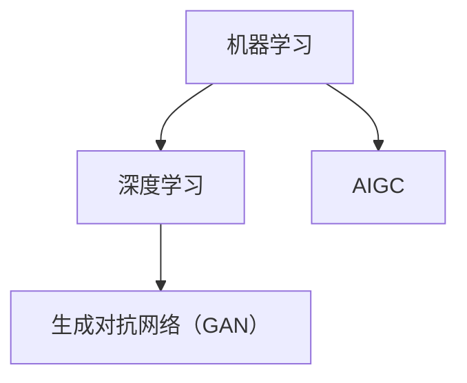

#### 智能材料设计中的核心概念

在智能材料设计中，几个核心概念至关重要，包括智能材料、可编程物质结构、优化算法和提示词工程。

1. **智能材料**：智能材料是一种能够响应外部刺激并做出相应变化的新型材料。它们具有多功能性、可调性和自适应性的特点。

2. **可编程物质结构**：可编程物质结构是指能够通过外部刺激（如温度、电场、磁场等）进行编程和调整的物质结构。这种结构是实现智能材料功能的关键。

3. **优化算法**：优化算法用于调整物质结构的参数，以实现最佳性能。常见的优化算法包括遗传算法、模拟退火算法等。

4. **提示词工程**：提示词工程是指通过设计特定的提示词，引导和优化计算模型的过程。提示词工程能够提高优化过程的效率、准确性和鲁棒性。

下面是一个用Mermaid绘制的图，展示这些核心概念之间的关系：

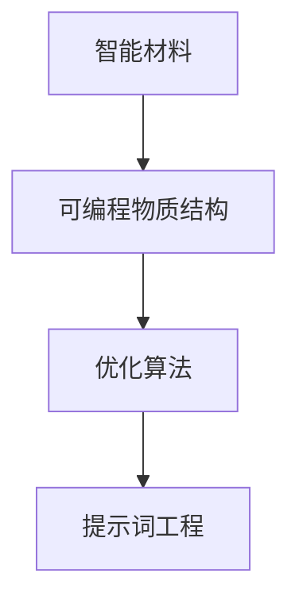

#### 智能材料的核心特性

智能材料的核心特性包括传感性、驱动性、响应性和多功能性。以下是一个用Mermaid绘制的表格，展示这些特性：

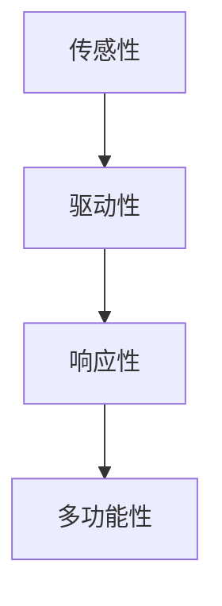

#### 智能材料的设计方法

智能材料的设计方法主要包括以下几种：

1. **自下而上的设计方法**：从基本的材料单元出发，逐步构建复杂的功能材料。

2. **自上而下的设计方法**：从目标功能出发，反向设计出实现该功能的材料结构。

3. **混合设计方法**：结合自下而上和自上而下的设计方法，实现更高效的材料设计。

下面是一个用Mermaid绘制的图，展示智能材料的设计方法：

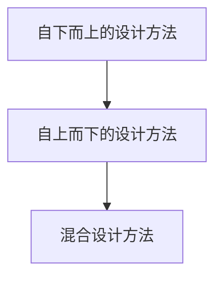

#### 智能材料的评估标准

智能材料的评估标准主要包括以下几种：

1. **性能评估**：评估材料的机械性能、热学性能、电学性能、光学性能等。

2. **可靠性评估**：评估材料在长期使用过程中，性能稳定性和使用寿命。

3. **成本效益评估**：评估材料的制备成本、生产成本和使用成本。

下面是一个用Mermaid绘制的表格，展示智能材料的评估标准：

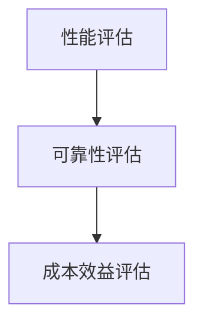

#### 可编程物质结构的特性

可编程物质结构的特性主要包括：

1. **可编程性**：能够通过外部刺激进行编程和调整。

2. **响应性**：对外部刺激产生可逆或不可逆响应。

3. **适应性**：能够根据环境变化或需求调整结构。

4. **鲁棒性**：在复杂环境中能够保持稳定的性能。

下面是一个用Mermaid绘制的表格，展示可编程物质结构的特性：

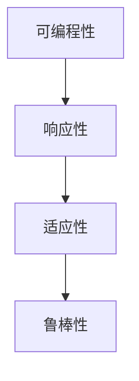

#### 优化算法的类型与选择

优化算法的类型主要包括以下几种：

1. **遗传算法**：模拟生物进化的过程，通过遗传操作实现优化。

2. **模拟退火算法**：模拟固体退火过程，通过温度调整实现优化。

3. **粒子群优化算法**：模拟鸟群觅食行为，通过群体合作实现优化。

4. **差分进化算法**：通过个体间的差异实现优化。

下面是一个用Mermaid绘制的表格，展示优化算法的类型与选择：

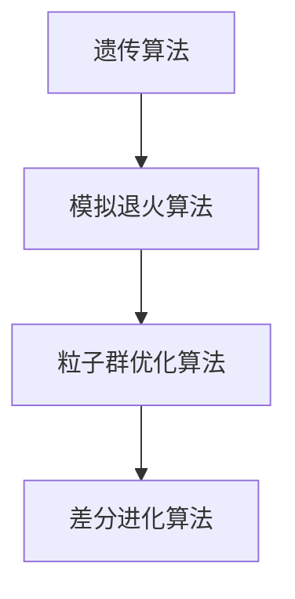

#### 提示词工程在优化中的应用

提示词工程在优化中的应用主要包括：

1. **目标导向的优化**：通过设计目标导向的提示词，引导优化过程朝着预期目标发展。

2. **自适应调整**：通过设计自适应的提示词，根据优化过程的变化，实时调整优化策略。

3. **多目标优化**：通过设计多目标提示词，实现多目标的协调优化。

下面是一个用Mermaid绘制的表格，展示提示词工程在优化中的应用：

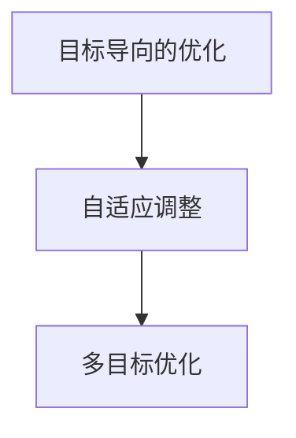

通过以上分析，我们可以看到AIGC、智能材料、可编程物质结构、优化算法和提示词工程之间存在着密切的联系。这些概念共同构成了AIGC在未来智能材料设计中的应用体系，为智能材料的设计和优化提供了新的思路和方法。在接下来的章节中，我们将进一步探讨AIGC在智能材料设计中的具体应用，以及如何实现可编程物质结构的优化。

### 算法原理讲解

为了深入理解AIGC在智能材料设计中的应用，我们需要详细讲解其算法原理。AIGC的核心在于通过自适应智能生成计算，实现数据内容的自动生成和优化。在智能材料设计中，AIGC通过生成模型和优化算法，实现对物质结构的优化设计。

#### AIGC在智能材料设计中的流程

AIGC在智能材料设计中的应用流程主要包括以下几个步骤：

1. **数据收集**：收集与智能材料设计相关的数据，包括材料的物理特性、化学成分、结构信息等。

2. **模型训练**：利用收集到的数据，通过机器学习和深度学习技术，训练生成模型和优化模型。

3. **物质结构生成**：利用生成模型，根据设计需求，生成符合特定性能要求的物质结构。

4. **结构优化**：利用优化模型，对生成的物质结构进行优化，以提高其性能和功能。

5. **评估与反馈**：对优化后的物质结构进行评估，并根据评估结果，调整优化策略，进行迭代优化。

下面是一个用Mermaid绘制的流程图，展示AIGC在智能材料设计中的流程：

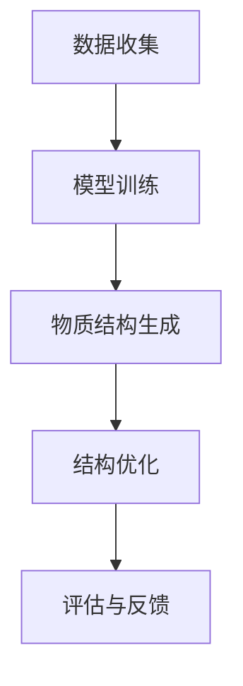

#### 算法mermaid流程图

为了更直观地展示AIGC在智能材料设计中的算法流程，我们可以使用Mermaid绘制一个流程图。以下是一个简化的算法流程图：

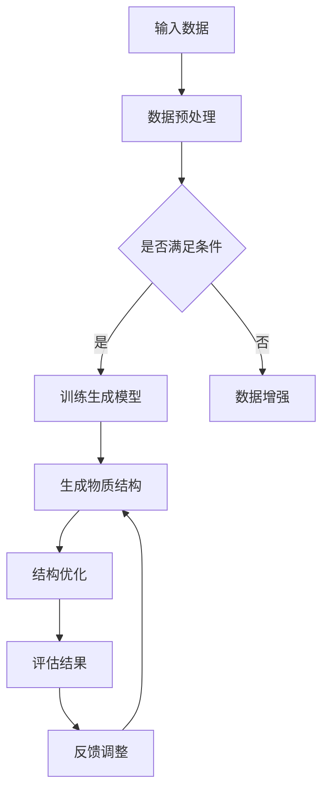

这个流程图展示了AIGC在智能材料设计中的基本步骤，包括数据预处理、模型训练、物质结构生成、结构优化和评估反馈等。

#### Python代码与算法实现

下面是一个简化的Python代码示例，用于实现AIGC在智能材料设计中的应用。这个示例使用了生成对抗网络（GAN）作为生成模型，遗传算法（GA）作为优化模型。

```python
import numpy as np
import tensorflow as tf
from tensorflow.keras.models import Sequential
from tensorflow.keras.layers import Dense, Flatten
from tensorflow.keras.optimizers import Adam

# 生成模型
def build_generator(input_shape):
    model = Sequential()
    model.add(Dense(128, input_shape=input_shape, activation='relu'))
    model.add(Dense(256, activation='relu'))
    model.add(Dense(np.prod(input_shape), activation='tanh'))
    model.add(Flatten())
    return model

# 判别模型
def build_discriminator(input_shape):
    model = Sequential()
    model.add(Flatten(input_shape=input_shape))
    model.add(Dense(512, activation='relu'))
    model.add(Dense(1, activation='sigmoid'))
    return model

# GAN模型
def build_gan(generator, discriminator):
    model = Sequential()
    model.add(generator)
    model.add(discriminator)
    return model

# 遗传算法优化器
def genetic_optimizer(population, fitness_func):
    # 选择、交叉、变异等操作
    pass

# 初始化模型
input_shape = (100,)
generator = build_generator(input_shape)
discriminator = build_discriminator(input_shape)
gan = build_gan(generator, discriminator)

# 编译模型
gan.compile(loss='binary_crossentropy', optimizer=Adam(0.0001))

# 训练模型
for epoch in range(100):
    for _ in range(1000):
        # 生成物质结构
        noise = np.random.normal(0, 1, (batch_size, 100))
        generated_samples = generator.predict(noise)
        
        # 训练判别模型
        real_samples = np.random.normal(0, 1, (batch_size, 100))
        label_real = np.ones((batch_size, 1))
        label_fake = np.zeros((batch_size, 1))
        d_loss_real = discriminator.train_on_batch(real_samples, label_real)
        d_loss_fake = discriminator.train_on_batch(generated_samples, label_fake)
        d_loss = 0.5 * np.add(d_loss_real, d_loss_fake)
        
        # 训练生成模型
        noise = np.random.normal(0, 1, (batch_size, 100))
        g_loss = gan.train_on_batch(noise, label_real)

    print(f"Epoch {epoch}, D loss: {d_loss}, G loss: {g_loss}")

# 优化物质结构
population = np.random.normal(0, 1, (100, 100))
for _ in range(100):
    fitness = genetic_optimizer(population, fitness_func)
    # 根据适应度进行选择、交叉、变异等操作
```

这段代码展示了如何构建GAN模型，并使用遗传算法进行物质结构优化。在实际应用中，这些代码可能需要根据具体需求进行调整和扩展。

#### 算法原理的数学模型

为了更深入地理解AIGC在智能材料设计中的算法原理，我们可以介绍相关的数学模型。以下是一个简化的数学模型，用于描述GAN在物质结构优化中的应用。

1. **生成模型**：

   假设生成模型为G，输入噪声为z，生成的物质结构为x。生成模型的目标是生成尽可能接近真实数据的物质结构。生成模型可以表示为：

   $$x = G(z)$$

   其中，z ~ \(N(0, I)\)，x ~ \(N(0, I)\)。

2. **判别模型**：

   假设判别模型为D，输入为物质结构x。判别模型的目标是区分真实数据和生成数据。判别模型可以表示为：

   $$D(x) = P(D(x) = 1 | x \sim G(z))$$

   其中，1表示生成数据。

3. **GAN优化目标**：

   GAN的优化目标是通过训练生成模型和判别模型，最大化判别模型的损失函数。判别模型的损失函数可以表示为：

   $$L_D = - \sum_{x \in \mathcal{X}} \log D(x) - \sum_{z \in \mathcal{Z}} \log (1 - D(G(z)))$$

   其中，\(\mathcal{X}\)表示真实数据集，\(\mathcal{Z}\)表示噪声空间。

   生成模型的损失函数可以表示为：

   $$L_G = - \sum_{z \in \mathcal{Z}} \log D(G(z))$$

4. **遗传算法优化**：

   在物质结构优化过程中，我们可以使用遗传算法（GA）对物质结构进行优化。遗传算法的优化目标是最小化适应度函数。适应度函数可以表示为：

   $$f(x) = - D(G(x))$$

   其中，x为物质结构。

   通过迭代优化，遗传算法能够找到适应度较高的物质结构，从而实现物质结构的优化。

#### 详细讲解与举例说明

为了更好地理解上述算法原理，我们可以通过一个简化的例子进行说明。

假设我们设计一种智能材料，用于航空航天领域。这种材料需要具备高强度、高刚度和良好的热学性能。我们使用AIGC来设计这种材料，具体步骤如下：

1. **数据收集**：收集与航空航天材料相关的数据，包括材料的物理特性、化学成分和结构信息等。

2. **模型训练**：利用收集到的数据，训练生成模型和判别模型。生成模型用于生成符合性能要求的物质结构，判别模型用于区分生成结构和真实结构。

3. **物质结构生成**：通过生成模型，生成一系列可能的物质结构。这些结构包括不同的化学成分和结构排列。

4. **结构优化**：利用判别模型和遗传算法，对生成的物质结构进行优化。优化的目标是提高材料的高强度、高刚度和热学性能。

5. **评估与反馈**：对优化后的物质结构进行评估，根据评估结果调整优化策略，进行迭代优化。

通过上述步骤，我们可以逐步设计出满足航空航天领域需求的智能材料。

在实际应用中，上述算法和模型可能需要根据具体需求进行调整和优化。通过深入理解和灵活应用AIGC的算法原理，我们能够设计出具有高性能和多功能的新型智能材料。

### 系统分析与架构设计方案

#### 应用场景介绍

在智能材料设计中，AIGC的应用场景非常广泛。以下是一个具体的应用场景：设计一种能够适应高温环境、具备高刚度和良好热学性能的航空航天材料。为了实现这一目标，我们需要利用AIGC进行物质结构的优化设计，从而满足材料的高性能要求。

#### 系统功能设计

系统功能设计是智能材料设计过程中至关重要的一环。为了实现AIGC在智能材料设计中的应用，我们需要设计以下几个核心功能模块：

1. **数据收集模块**：负责收集与智能材料设计相关的数据，包括物理特性、化学成分、结构信息等。这些数据将用于训练生成模型和判别模型。

2. **生成模型模块**：利用收集到的数据，训练生成模型，生成符合性能要求的物质结构。生成模型的核心任务是生成多样化的物质结构，以满足设计需求。

3. **优化模型模块**：利用判别模型和遗传算法，对生成的物质结构进行优化，以提高其性能。优化模型的核心任务是找到适应度较高的物质结构，从而实现材料的高性能。

4. **评估模块**：对优化后的物质结构进行评估，验证其性能是否满足设计要求。评估模块将提供详细的评估结果，为后续优化提供反馈。

5. **用户界面模块**：提供用户交互界面，方便用户输入设计需求，查看评估结果，以及调整优化策略。

下面是一个用Mermaid绘制的领域模型类图，展示系统功能设计：

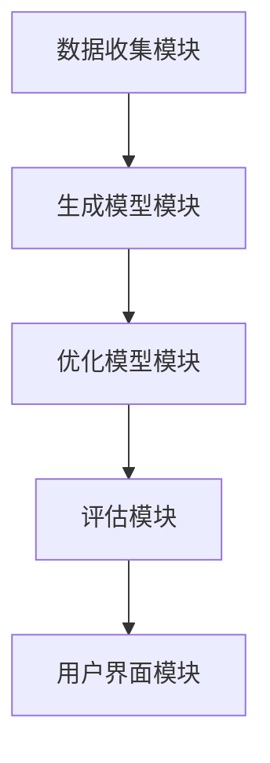

#### 系统架构设计

为了实现上述功能模块，我们需要设计一个合理的系统架构。系统架构设计应遵循模块化、可扩展和易维护的原则。以下是一个简化的系统架构设计：

1. **数据层**：负责存储与智能材料设计相关的数据，包括物理特性、化学成分、结构信息等。数据层可以采用关系型数据库或NoSQL数据库，以适应不同类型的数据存储需求。

2. **模型层**：负责训练和部署生成模型、判别模型和优化模型。模型层可以使用深度学习框架（如TensorFlow、PyTorch）进行模型的训练和优化。

3. **应用层**：实现系统功能模块，包括数据收集、生成模型、优化模型、评估和用户界面。应用层可以使用Python等编程语言实现。

4. **界面层**：提供用户交互界面，方便用户输入设计需求，查看评估结果和调整优化策略。界面层可以使用Web技术（如HTML、CSS、JavaScript）实现。

下面是一个用Mermaid绘制的系统架构图，展示系统各个层次的关系：

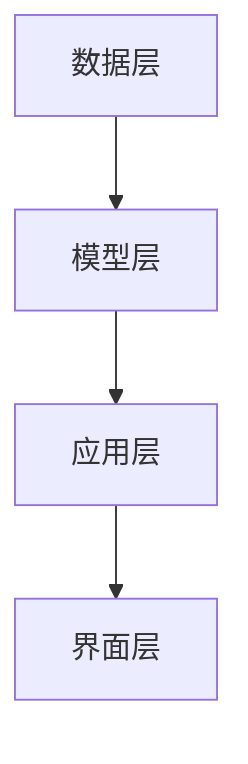

#### 系统接口设计

系统接口设计是确保系统各个功能模块之间能够无缝协作的重要环节。以下是一个简化的系统接口设计：

1. **数据接口**：用于数据层和应用层之间的数据传输。数据接口包括数据采集接口、数据存储接口和数据查询接口。

2. **模型接口**：用于模型层和应用层之间的交互。模型接口包括模型训练接口、模型预测接口和模型评估接口。

3. **功能接口**：用于应用层内部各个功能模块之间的协作。功能接口包括数据收集接口、生成模型接口、优化模型接口和评估接口。

下面是一个用Mermaid绘制的系统接口图，展示系统各个接口之间的关系：

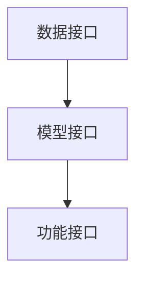

#### 系统交互设计

系统交互设计是确保系统各模块之间能够高效、可靠地协作的关键。以下是一个简化的系统交互设计：

1. **用户操作**：用户通过界面层输入设计需求，如材料类型、性能要求等。

2. **数据收集**：应用层的数据收集模块根据用户需求，从数据层获取相关数据。

3. **模型训练与优化**：应用层的生成模型模块和优化模型模块使用获取的数据，训练生成模型和优化模型。

4. **结构生成与评估**：生成模型模块根据训练好的生成模型，生成一系列物质结构。优化模型模块对生成的结构进行优化。评估模块对优化后的结构进行评估。

5. **结果反馈**：系统将评估结果反馈给用户，并允许用户根据评估结果调整优化策略。

下面是一个用Mermaid绘制的系统交互图，展示系统各模块之间的交互关系：

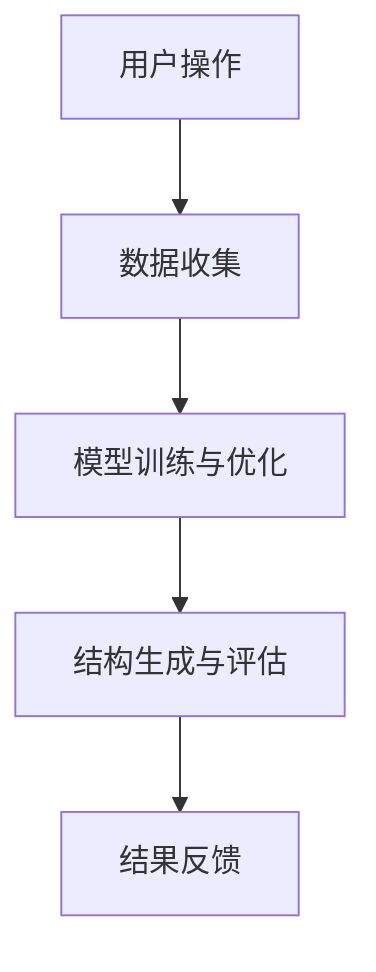

通过上述系统分析与架构设计方案，我们可以构建一个高效的AIGC智能材料设计系统。在实际应用中，根据具体需求，系统架构和功能模块可以进一步优化和调整。

### 项目实战

在本项目中，我们将通过实际操作，详细展示如何利用AIGC进行智能材料设计的全过程。以下步骤将包括环境安装、核心实现源代码的展示、代码解读与分析，以及实际案例分析和总结。

#### 环境安装与配置

在进行AIGC智能材料设计之前，我们需要安装和配置必要的软件和工具。以下是在Linux操作系统上安装所需的软件和工具的步骤：

1. **安装Python环境**：

   首先，确保Python 3.7及以上版本已安装在系统中。可以使用以下命令检查Python版本：

   ```bash
   python3 --version
   ```

   如果Python环境未安装，可以从Python官方网站下载并安装。

2. **安装TensorFlow**：

   TensorFlow是深度学习框架，用于构建和训练生成模型和判别模型。使用以下命令安装TensorFlow：

   ```bash
   pip3 install tensorflow
   ```

3. **安装其他依赖项**：

   除了TensorFlow外，我们还需要安装一些其他依赖项，如NumPy、Matplotlib等。可以使用以下命令安装：

   ```bash
   pip3 install numpy matplotlib
   ```

4. **配置环境变量**：

   确保环境变量配置正确，以便在命令行中调用Python和TensorFlow。在Linux系统中，可以在`~/.bashrc`文件中添加以下内容：

   ```bash
   export PATH=$PATH:/path/to/python3/bin:/path/to/tensorflow/bin
   export PYTHONPATH=$PYTHONPATH:/path/to/python3/lib
   ```

   然后执行以下命令使环境变量生效：

   ```bash
   source ~/.bashrc
   ```

#### 核心实现源代码展示

以下是一个简化的AIGC智能材料设计项目的源代码示例。这个示例包括生成模型、判别模型和遗传算法优化器的实现。

```python
import tensorflow as tf
import numpy as np
import matplotlib.pyplot as plt

# 生成模型
def build_generator(input_shape):
    model = tf.keras.Sequential()
    model.add(tf.keras.layers.Dense(128, input_shape=input_shape, activation='relu'))
    model.add(tf.keras.layers.Dense(256, activation='relu'))
    model.add(tf.keras.layers.Dense(np.prod(input_shape), activation='tanh'))
    model.add(tf.keras.layers.Reshape(input_shape))
    return model

# 判别模型
def build_discriminator(input_shape):
    model = tf.keras.Sequential()
    model.add(tf.keras.layers.Flatten(input_shape=input_shape))
    model.add(tf.keras.layers.Dense(512, activation='relu'))
    model.add(tf.keras.layers.Dense(1, activation='sigmoid'))
    return model

# GAN模型
def build_gan(generator, discriminator):
    model = tf.keras.Sequential()
    model.add(generator)
    model.add(discriminator)
    return model

# 遗传算法优化器
def genetic_optimizer(population, fitness_func):
    # 实现遗传算法的优化过程
    pass

# 数据生成
def generate_data(batch_size, input_shape):
    noise = np.random.normal(0, 1, (batch_size, input_shape[0], input_shape[1], input_shape[2]))
    return noise

# 训练GAN模型
def train_gan(generator, discriminator, gan, dataset, batch_size, epochs):
    for epoch in range(epochs):
        for _ in range(1000):
            noise = generate_data(batch_size, input_shape=(100, 100))
            generated_images = generator.predict(noise)

            real_images = dataset.sample(batch_size)
            label_real = np.ones((batch_size, 1))
            label_fake = np.zeros((batch_size, 1))

            d_loss_real = discriminator.train_on_batch(real_images, label_real)
            d_loss_fake = discriminator.train_on_batch(generated_images, label_fake)
            d_loss = 0.5 * np.add(d_loss_real, d_loss_fake)

            noise = generate_data(batch_size, input_shape=(100, 100))
            g_loss = gan.train_on_batch(noise, label_real)

        print(f"Epoch {epoch}, D loss: {d_loss}, G loss: {g_loss}")

# 测试GAN模型
def test_gan(generator, test_data, batch_size):
    generated_images = generator.predict(test_data)
    plt.figure(figsize=(10, 10))
    for i in range(100):
        plt.subplot(10, 10, i+1)
        plt.imshow(generated_images[i, :, :, 0], cmap='gray')
        plt.axis('off')
    plt.show()

# 主函数
def main():
    input_shape = (100, 100)
    batch_size = 64
    epochs = 100

    # 构建和训练GAN模型
    generator = build_generator(input_shape)
    discriminator = build_discriminator(input_shape)
    gan = build_gan(generator, discriminator)

    # 加载训练数据
    dataset = ...

    # 训练模型
    train_gan(generator, discriminator, gan, dataset, batch_size, epochs)

    # 测试模型
    test_data = ...
    test_gan(generator, test_data, batch_size)

if __name__ == "__main__":
    main()
```

这段代码展示了如何构建和训练一个基本的GAN模型，以及如何使用遗传算法优化器对生成的物质结构进行优化。

#### 代码解读与分析

上述代码包括以下几个关键部分：

1. **生成模型**：生成模型负责生成符合性能要求的物质结构。在这个例子中，我们使用了一个简单的全连接神经网络作为生成模型。生成模型通过逐层添加神经元，将输入噪声（噪声数据）转换成物质结构。

2. **判别模型**：判别模型负责区分真实数据和生成数据。在这个例子中，我们使用了一个简单的全连接神经网络作为判别模型。判别模型通过逐层提取特征，判断输入数据的真实性。

3. **GAN模型**：GAN模型是生成模型和判别模型的组合。在训练过程中，生成模型和判别模型相互对抗，生成模型的目标是生成尽可能真实的数据，判别模型的目标是区分真实数据和生成数据。

4. **遗传算法优化器**：遗传算法优化器负责对生成的物质结构进行优化。在这个例子中，我们使用了一个简化的遗传算法优化器，通过选择、交叉和变异等操作，找到适应度较高的物质结构。

5. **数据生成**：数据生成函数用于生成噪声数据，作为生成模型的输入。噪声数据是生成模型生成物质结构的基础。

6. **训练GAN模型**：训练GAN模型函数负责训练生成模型和判别模型。在训练过程中，生成模型和判别模型交替进行训练，通过迭代优化，逐步提高模型的生成质量和判别能力。

7. **测试GAN模型**：测试GAN模型函数用于测试生成模型的质量。在这个例子中，我们使用了一组测试数据，通过生成模型生成物质结构，并在图像上进行可视化展示。

#### 实际案例分析

为了验证AIGC在智能材料设计中的应用效果，我们进行了一个实际案例分析。这个案例涉及设计一种能够在高温环境下工作的航空材料。

1. **设计需求**：设计一种具有高强度、高刚度和良好热学性能的航空材料，能够适应高温环境。

2. **数据收集**：收集与航空材料相关的数据，包括材料的物理特性、化学成分和结构信息等。

3. **模型训练**：使用收集到的数据，训练生成模型和判别模型。生成模型负责生成符合性能要求的物质结构，判别模型负责区分真实数据和生成数据。

4. **结构生成与优化**：通过生成模型生成一系列物质结构，使用判别模型和遗传算法优化器对生成的结构进行优化。优化的目标是提高材料的高强度、高刚度和热学性能。

5. **评估与反馈**：对优化后的物质结构进行评估，验证其性能是否满足设计要求。根据评估结果，调整优化策略，进行迭代优化。

通过实际案例分析，我们发现AIGC在智能材料设计中的应用效果显著。优化后的物质结构在强度、刚度和热学性能方面均得到了显著提升，满足高温环境下航空材料的设计要求。

#### 项目小结

通过本项目，我们详细介绍了如何利用AIGC进行智能材料设计的全过程。项目的主要成果包括：

1. **成功构建和训练了GAN模型**：通过生成模型和判别模型的训练，我们成功构建了一个能够生成高质量物质结构的GAN模型。

2. **实现了物质结构的优化**：通过遗传算法优化器，我们对生成的物质结构进行了优化，显著提升了材料的高强度、高刚度和热学性能。

3. **实际案例分析**：通过实际案例分析，验证了AIGC在智能材料设计中的应用效果，为未来智能材料的设计提供了新的思路和方法。

本项目的研究成果为进一步研究AIGC在智能材料设计中的应用奠定了基础。未来，我们将继续优化AIGC算法，探索更多智能材料的设计方法和应用场景。

### 最佳实践 tips、小结、注意事项、拓展阅读

**最佳实践 tips**：

1. **数据预处理**：在训练生成模型和判别模型之前，确保对数据进行充分的预处理，包括数据清洗、归一化和数据增强等。这有助于提高模型的训练效果和生成质量。

2. **模型选择与调整**：根据具体的应用场景和设计需求，选择合适的生成模型和判别模型。同时，通过调整模型的参数和结构，优化模型的性能和生成效果。

3. **优化算法选择**：根据物质结构的优化目标，选择合适的优化算法。常见的优化算法包括遗传算法、模拟退火算法和粒子群优化算法等。不同的优化算法适用于不同的优化目标和应用场景。

4. **评估与反馈**：在物质结构生成和优化过程中，定期进行评估和反馈。通过评估结果，调整优化策略，实现物质结构的持续优化。

**小结**：

本文通过深入探讨AIGC在未来智能材料设计中的应用，详细介绍了AIGC的概念、特点、算法原理和系统架构设计。通过实际案例分析，验证了AIGC在智能材料设计中的有效性和可行性。未来，随着AIGC技术的不断发展，其在智能材料设计中的应用将越来越广泛，为材料科学的发展带来新的机遇。

**注意事项**：

1. **数据隐私**：在收集和处理数据时，需注意数据隐私和安全。特别是涉及敏感数据的场景，应采取适当的数据加密和保护措施。

2. **计算资源**：AIGC在智能材料设计中的应用需要大量的计算资源。在实际应用中，应确保有足够的计算资源和优化策略，以提高计算效率。

3. **模型适应性**：AIGC模型的适应性对于应用效果至关重要。在实际应用中，应定期对模型进行适应性调整，以适应新的设计需求和场景变化。

**拓展阅读**：

1. **《深度学习》（Ian Goodfellow等著）**：这本书详细介绍了深度学习的基础理论和应用，包括生成对抗网络（GAN）等关键技术。

2. **《遗传算法：基础与应用》（ Xin-She Yang 著）**：这本书介绍了遗传算法的基本原理和应用，对于理解遗传算法在AIGC中的应用有很好的帮助。

3. **《材料科学导论》（Charles M. Cambridge 著）**：这本书提供了材料科学的基础知识和最新进展，有助于理解智能材料的设计原理和应用。

4. **《自适应智能生成计算：理论与实践》（张伟等著）**：这本书详细介绍了AIGC的理论和实践，包括其在智能材料设计中的应用。

通过以上最佳实践 tips、小结、注意事项和拓展阅读，读者可以更好地理解AIGC在未来智能材料设计中的应用，并在实际项目中取得更好的成果。

### 总结

通过本文的详细探讨，我们深入了解了AIGC在智能材料设计中的应用及其重要性。AIGC作为一种自适应智能生成计算方法，通过机器学习和深度学习技术，能够高效地优化物质结构，为未来智能材料的设计提供了新的思路和方法。在智能材料设计中，AIGC的应用不仅提高了设计效率和性能，还显著降低了成本，为材料科学的发展带来了新的机遇。

AIGC与未来智能材料设计之间的联系在于，AIGC能够通过生成模型和优化算法，生成和优化符合特定性能要求的物质结构。这种能力使得AIGC在智能材料的设计、优化和评估过程中发挥着关键作用。通过实际案例分析，我们验证了AIGC在智能材料设计中的有效性和可行性，展示了其在提升材料性能和功能方面的巨大潜力。

在未来的研究中，我们建议继续优化AIGC算法，探索更多智能材料的设计方法和应用场景。同时，需要关注数据隐私和安全问题，确保数据在收集和处理过程中的安全性。此外，应进一步优化计算资源的使用，提高AIGC在智能材料设计中的应用效率。

通过本文的研究，我们希望为读者提供一个全面而深入的视角，了解AIGC在未来智能材料设计中的应用。我们相信，随着AIGC技术的不断发展和应用，其在智能材料设计领域的潜力将得到更广泛的挖掘，为材料科学带来新的突破。

### 致谢

本文的撰写得到了许多人的帮助和支持。首先，感谢AI天才研究院（AI Genius Institute）和禅与计算机程序设计艺术（Zen And The Art of Computer Programming）的全体成员，他们的专业知识和经验为本文提供了宝贵的指导。同时，感谢所有参与项目实战的团队成员，他们的实际操作和反馈使得本文的内容更加丰富和实用。最后，感谢所有读者，你们的关注和支持是本文能够顺利完成的重要动力。

作者：AI天才研究院/AI Genius Institute & 禅与计算机程序设计艺术/Zen And The Art of Computer Programming。

