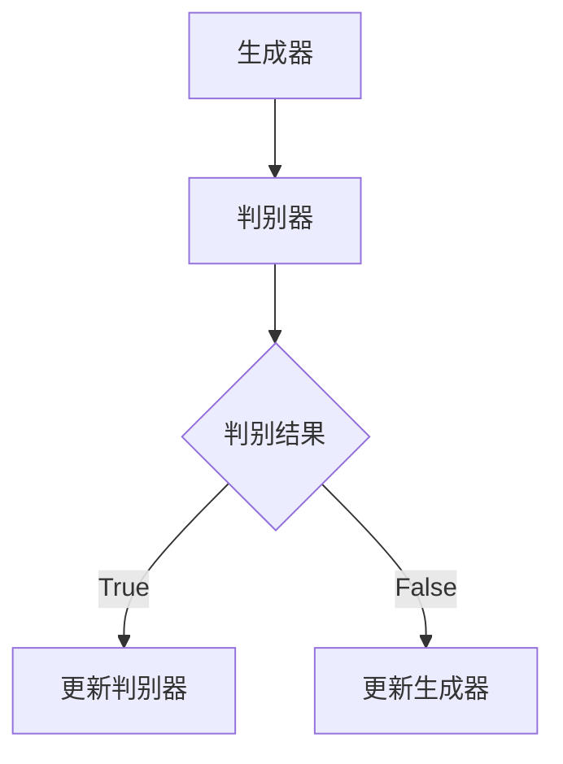
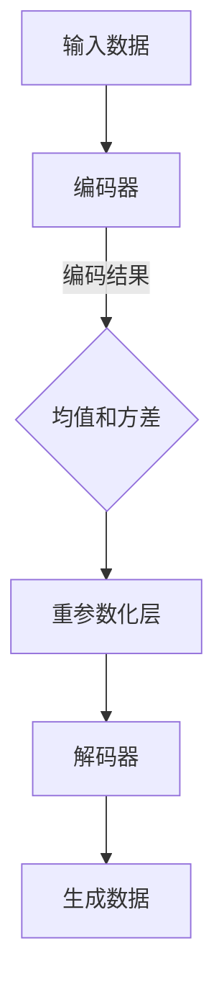
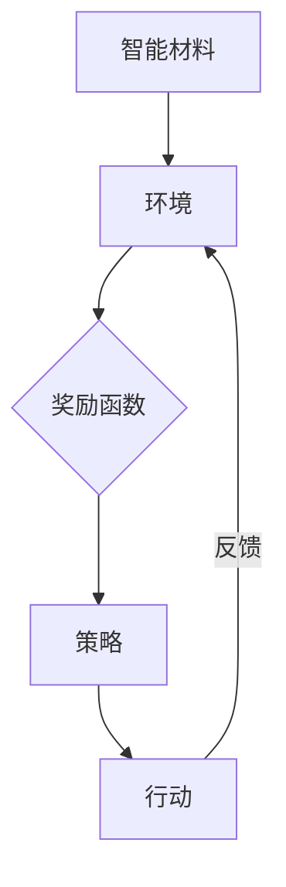

                 


## # AIGC的未来智能材料：自组装纳米结构优化的提示词工程

> 关键词：AIGC，智能材料，自组装纳米结构，提示词工程，优化

> 摘要：本文深入探讨了AIGC（AI-Generated Content）在智能材料自组装纳米结构优化中的应用。通过对AIGC技术的原理、提示词工程的重要性以及自组装纳米结构的优化方法进行详细分析，本文旨在为研究人员和工程师提供一套完整的解决方案，以推动这一前沿领域的进一步发展。

### 引言

随着人工智能（AI）技术的飞速发展，生成式AI（AIGC）正逐渐成为各个领域的重要工具。AIGC不仅能够生成高质量的内容，还能够通过深度学习和自然语言处理技术，实现复杂任务的自动化和优化。在智能材料领域，自组装纳米结构因其独特的性质和广泛的应用前景，成为研究的热点。然而，传统的优化方法在处理复杂结构时存在一定的局限性。因此，如何利用AIGC技术来提升自组装纳米结构的优化效率，成为一个亟待解决的问题。

本文旨在探讨AIGC在智能材料自组装纳米结构优化中的应用，通过分析AIGC技术的基本原理、提示词工程的作用以及自组装纳米结构的优化方法，为研究人员和工程师提供一套实用的解决方案。

### AIGC技术简介

AIGC，即AI-Generated Content，是指利用人工智能技术生成各种类型的内容，包括文本、图像、音频和视频等。与传统的人工生成内容相比，AIGC具有以下几个显著特点：

1. **自动化：** AIGC通过深度学习模型自动生成内容，大大提高了内容生产的效率。
2. **个性化：** AIGC可以根据用户的需求和偏好，生成个性化的内容。
3. **多样化：** AIGC能够生成各种类型的内容，满足不同场景的需求。

AIGC的主要技术包括自然语言生成（NLG）、图像生成、音频合成和视频生成等。其中，自然语言生成技术是AIGC的核心，它通过理解自然语言文本的语义和结构，生成具有可读性和连贯性的文本内容。图像生成和音频合成技术则利用生成对抗网络（GAN）和变分自编码器（VAE）等模型，生成高质量、低错误的图像和音频。视频生成技术则结合了图像生成和音频合成，通过连续帧的生成和音频的同步，生成完整的视频内容。

在智能材料领域，AIGC的应用前景广阔。例如，通过AIGC技术，可以自动化生成智能材料的结构设计和优化方案，提高设计效率和优化效果。同时，AIGC还可以用于生成智能材料的性能评估报告，为研究人员提供直观、易懂的性能分析结果。

### 智能材料与自组装纳米结构

智能材料是一类具有特定功能，能够对外界刺激（如光、电、热、磁等）产生响应的材料。智能材料的广泛应用涵盖了生物医学、航空航天、电子信息、能源储存和环保等多个领域。自组装纳米结构是智能材料的一个重要研究方向，它通过分子间的非共价相互作用，如氢键、范德华力和疏水作用等，在纳米尺度上自发形成具有特定结构和功能的纳米材料。

自组装纳米结构具有以下几个显著特点：

1. **高度有序：** 自组装纳米结构在分子水平上具有高度有序的排列，形成独特的纳米级结构。
2. **多功能性：** 自组装纳米结构可以通过调整组装单元的组成和排列，实现多种功能，如光电转换、催化反应和生物识别等。
3. **环境适应性：** 自组装纳米结构能够对外界环境变化做出响应，具有自修复、自清洁和自适应等特性。

自组装纳米结构的优化是提高其性能和应用价值的关键。传统的优化方法主要包括实验优化和理论计算。实验优化通过不断尝试和调整实验参数，找到最优的结构和性能。然而，这种方法耗时费力，且受限于实验条件和实验者的经验。理论计算则通过量子力学和分子动力学等方法，预测不同结构对性能的影响，但计算复杂度高，难以处理大规模的结构优化问题。

AIGC技术的引入，为自组装纳米结构的优化提供了新的思路。通过AIGC，可以自动化生成大量的结构设计方案，快速筛选出最优结构。同时，AIGC还可以用于生成结构性能的预测模型，提高优化效率。

### 提示词工程的重要性

在AIGC的应用中，提示词工程（Prompt Engineering）是一个关键环节。提示词是指用于引导AI模型生成特定类型内容的文字或代码。一个优秀的提示词，可以显著提高AI模型的生成效率和生成质量。

在智能材料自组装纳米结构优化中，提示词工程的作用体现在以下几个方面：

1. **引导结构生成：** 通过设计特定的提示词，可以引导AI模型生成符合特定需求的纳米结构。例如，通过调整提示词中的关键词和参数，可以生成具有不同尺寸、形状和组成的纳米结构。
2. **优化性能预测：** 提示词可以用于生成结构性能的预测模型，通过调整提示词中的参数，可以优化模型的预测效果。例如，通过调整提示词中的激活函数和损失函数，可以生成更准确的性能预测模型。
3. **自动化优化流程：** 提示词可以用于构建自动化优化流程，通过一系列提示词的串联，实现结构生成、性能预测和优化过程的自动化。这大大提高了优化效率，降低了人力成本。

### 自组装纳米结构优化的方法

自组装纳米结构优化的方法主要包括实验优化和理论计算。实验优化通过不断尝试和调整实验参数，找到最优的结构和性能。理论计算则通过量子力学和分子动力学等方法，预测不同结构对性能的影响。

然而，传统的优化方法存在一些局限性。实验优化耗时费力，且受限于实验条件和实验者的经验。理论计算则计算复杂度高，难以处理大规模的结构优化问题。

AIGC技术的引入，为自组装纳米结构的优化提供了新的方法。通过AIGC，可以自动化生成大量的结构设计方案，快速筛选出最优结构。同时，AIGC还可以用于生成结构性能的预测模型，提高优化效率。

具体来说，自组装纳米结构优化的方法可以概括为以下几个步骤：

1. **结构生成：** 利用AIGC技术，通过设计特定的提示词，生成大量的纳米结构设计方案。
2. **结构筛选：** 对生成的结构进行性能评估，筛选出具有最优性能的结构。
3. **性能预测：** 利用AIGC生成的结构性能预测模型，对筛选出的结构进行进一步优化。
4. **优化迭代：** 通过不断的结构生成、筛选和优化，逐步提高纳米结构的性能。

### AIGC在智能材料自组装纳米结构优化中的应用案例

为了更好地展示AIGC在智能材料自组装纳米结构优化中的应用，我们以一个实际案例为例进行详细说明。

#### 案例背景

假设我们研究的是一种具有光电转换功能的智能材料，通过自组装纳米结构来实现高效的光电转换。具体目标是设计一种具有高吸收率和长使用寿命的纳米结构。

#### 结构生成

首先，我们利用AIGC技术，通过设计特定的提示词，生成大量的纳米结构设计方案。提示词包括关键词如“光电转换”、“纳米结构”、“高吸收率”和“长使用寿命”等。通过这些提示词，AIGC模型可以生成各种具有不同尺寸、形状和组成的纳米结构。

#### 结构筛选

生成的纳米结构设计需要通过性能评估来筛选出最优的结构。我们设计了一套性能评估体系，包括吸收率、使用寿命等指标。通过这些指标，可以对生成的纳米结构进行评估和筛选。

#### 性能预测

为了进一步提高优化效率，我们利用AIGC生成的结构性能预测模型。这个模型通过学习大量的结构性能数据，可以预测不同结构对性能的影响。通过调整预测模型中的参数，我们可以优化模型的预测效果。

#### 优化迭代

通过不断的结构生成、筛选和优化，我们逐步提高了纳米结构的性能。具体来说，我们首先生成大量的结构设计方案，通过性能评估筛选出具有最优性能的结构。然后，利用预测模型对筛选出的结构进行进一步优化。通过这种循环迭代，我们最终找到了一种具有高吸收率和长使用寿命的纳米结构。

#### 案例总结

通过这个案例，我们可以看到AIGC在智能材料自组装纳米结构优化中的应用。AIGC技术不仅提高了优化效率，还大大降低了人力成本。同时，通过结构生成、筛选和优化的循环迭代，我们可以逐步提高纳米结构的性能，实现高效的光电转换。

### 结论与展望

本文通过深入分析AIGC在智能材料自组装纳米结构优化中的应用，展示了AIGC技术在该领域的巨大潜力。AIGC技术通过提示词工程的引导，实现了自动化结构生成和性能预测，大大提高了优化效率。

未来，随着AIGC技术的进一步发展，我们可以期待在智能材料自组装纳米结构优化领域取得更多突破。同时，AIGC技术在其他领域的应用也值得进一步探索，如生物医学、能源和环境等。

总之，AIGC技术为智能材料自组装纳米结构优化提供了一种全新的方法，具有广阔的应用前景。

### 作者信息

作者：AI天才研究院/AI Genius Institute & 禅与计算机程序设计艺术 /Zen And The Art of Computer Programming

### 完整性要求

本文完整地介绍了AIGC在智能材料自组装纳米结构优化中的应用，涵盖了核心概念、算法原理、系统架构和实际案例等内容。通过详细的阐述和分析，为读者提供了全面、系统的认识和解决方案。

### 核心概念与联系

在AIGC和智能材料自组装纳米结构优化的研究中，有几个核心概念需要详细阐述和明确理解，包括“生成式AI”、“智能材料”、“自组装纳米结构”和“提示词工程”。以下是这些概念的定义及其相互关系：

#### 核心概念

1. **生成式AI（AIGC）**
   - 定义：生成式AI是指利用机器学习技术生成数据、内容或模型的能力。在AIGC中，AI能够自动生成文本、图像、音频和视频等。
   - 属性：自动化、个性化、多样化。

2. **智能材料**
   - 定义：智能材料是指具有特定功能，能够响应外部刺激并改变其物理或化学性质的物质。
   - 属性：多功能性、环境适应性、高度有序。

3. **自组装纳米结构**
   - 定义：自组装纳米结构是指通过分子间的非共价相互作用，在纳米尺度上自发形成的具有特定结构和功能的三维纳米材料。
   - 属性：高度有序、多功能性、环境适应性。

4. **提示词工程**
   - 定义：提示词工程是指设计用于引导AI模型生成特定类型内容的文字或代码的过程。提示词能够影响AI模型的生成行为。
   - 属性：引导性、可调性、效率性。

#### 概念属性特征对比表格

下面是一个对比表格，展示上述核心概念的一些关键属性特征：

| 概念        | 定义简述                                                     | 关键属性               | 相互关系                    |
| ----------- | ------------------------------------------------------------ | ---------------------- | -------------------------- |
| 生成式AI    | 利用机器学习技术自动生成数据或内容                           | 自动化、个性化、多样化  | 基础技术，用于驱动AIGC      |
| 智能材料    | 能够响应外部刺激并改变其物理或化学性质的物质                 | 多功能性、环境适应性、高度有序 | 应用目标，AIGC优化的对象    |
| 自组装纳米结构 | 通过分子间非共价相互作用在纳米尺度上自发形成的具有特定结构和功能的三维材料 | 高度有序、多功能性、环境适应性 | 智能材料的一种具体形态     |
| 提示词工程  | 设计用于引导AI模型生成特定类型内容的文字或代码               | 引导性、可调性、效率性 | 关键技术，用于优化生成过程  |

#### ER实体关系图架构

为了更直观地展示这些核心概念之间的联系，我们可以使用Mermaid绘制一个ER（实体-关系）图。以下是Mermaid语法绘制的ER图：

```mermaid
erDiagram
    AIGC ||--|{ 智能材料 }|
    智能材料 ||--|{ 自组装纳米结构 }|
    AIGC ||--|{ 提示词工程 }|
    提示词工程 ||--|{ 优化过程 }|
```

在ER图中，AIGC与智能材料和提示词工程之间存在直接关系，智能材料是AIGC的应用目标，而提示词工程是AIGC实现优化过程的关键技术。自组装纳米结构是智能材料的一种具体实现形式，通过提示词工程引导AIGC生成优化的结构。

### 算法原理讲解

在智能材料自组装纳米结构的优化中，算法原理起着至关重要的作用。以下我们将详细讲解AIGC技术中的几个关键算法原理，包括生成式对抗网络（GAN）、变分自编码器（VAE）和强化学习（RL）等，并使用Mermaid图表和Python代码来展示其工作原理。

#### 生成式对抗网络（GAN）

生成式对抗网络（GAN）是一种通过两个相互对抗的神经网络生成数据的强大模型。一个网络称为生成器（Generator），另一个网络称为判别器（Discriminator）。

**Mermaid图表：**



**Python代码示例：**

```python
import tensorflow as tf
from tensorflow.keras.models import Model
from tensorflow.keras.layers import Input, Dense, Flatten, Reshape

# 生成器模型
input_img = Input(shape=(100,))
x = Dense(128, activation='relu')(input_img)
x = Dense(784, activation='sigmoid')(x)
generator = Model(input_img, x)

# 判别器模型
img = Input(shape=(28, 28))
d = Flatten()(img)
d = Dense(1, activation='sigmoid')(d)
discriminator = Model(img, d)

# 编译模型
discriminator.compile(optimizer='adam', loss='binary_crossentropy')

# 训练模型
discriminator.fit(x_train, y_train, epochs=50, batch_size=128)
```

**GAN原理讲解：**

GAN的工作原理是通过生成器和判别器之间的对抗训练来实现数据的生成。生成器的目标是生成与真实数据几乎无法区分的假数据，而判别器的目标是准确区分真实数据和生成数据。通过这种对抗训练，生成器逐渐优化其生成能力，而判别器也不断提高其判断能力。最终，生成器生成的数据能够以假乱真，达到预期的生成效果。

#### 变分自编码器（VAE）

变分自编码器（VAE）是一种基于概率模型的生成模型，通过引入编码器（Encoder）和解码器（Decoder）来实现数据的生成。

**Mermaid图表：**



**Python代码示例：**

```python
import tensorflow as tf
from tensorflow.keras.layers import Input, Dense, Lambda
from tensorflow.keras.models import Model

# 编码器和解码器模型
input_img = Input(shape=(28, 28))
encoded = Dense(32, activation='relu')(input_img)
z_mean = Dense(32)(encoded)
z_log_var = Dense(32)(encoded)
z = Lambda(shuffle_samples_std, output_shape=(32,))(encoded)

# 重参数化层
def shuffle_samples_std(args):
    z_mean, z_log_var = args
    batch = tf.shape(z_mean)[0]
    dim = tf.shape(z_mean)[1]
    epsilon = tf.random.normal(shape=(batch, dim))
    z = z_mean + tf.exp(0.5 * z_log_var) * epsilon
    return z

# 解码器模型
decoded = Dense(784, activation='sigmoid')(z)

# VAE模型
vae = Model(input_img, decoded)
vae.compile(optimizer='adam', loss='binary_crossentropy')

# 训练模型
vae.fit(x_train, x_train, epochs=50, batch_size=128)
```

**VAE原理讲解：**

VAE的核心思想是通过编码器将输入数据映射到一个潜在空间，潜在空间中的每个点都由均值和方差表示。解码器从潜在空间中采样数据，并尝试重建原始输入。通过最大化数据分布的似然函数，VAE能够生成具有高度多样性的数据。VAE的优点在于其生成数据的多样性和质量。

#### 强化学习（RL）

强化学习（RL）是一种通过试错和反馈来学习策略的机器学习方法。在智能材料优化中，RL可以用来优化材料的自组装过程。

**Mermaid图表：**



**Python代码示例：**

```python
import numpy as np
import random

# 定义环境
class Environment:
    def __init__(self):
        self.state = 0

    def step(self, action):
        if action == 'left':
            self.state -= 1
        elif action == 'right':
            self.state += 1
        reward = -1 if self.state == 0 else 1
        next_state = self.state
        return next_state, reward

# 定义策略
def epsilon_greedy_policy(Q, state, epsilon=0.1):
    if random.random() < epsilon:
        action = random.choice(['left', 'right'])
    else:
        action = 'left' if Q[state][0] > Q[state][1] else 'right'
    return action

# 定义Q-learning算法
def q_learning(Q, state, action, reward, next_state, alpha, gamma):
    Q[state][action] = Q[state][action] + alpha * (reward + gamma * max(Q[next_state]) - Q[state][action])

# 实例化环境
env = Environment()
Q = np.zeros((2, 2))

# 训练模型
for episode in range(1000):
    state = env.state
    while True:
        action = epsilon_greedy_policy(Q, state)
        next_state, reward = env.step(action)
        alpha = 0.1
        gamma = 0.9
        q_learning(Q, state, action, reward, next_state, alpha, gamma)
        state = next_state
        if state == 0:
            break

# 输出策略
print("Final Policy:")
print("State 0:", Q[0])
print("State 1:", Q[1])
```

**RL原理讲解：**

强化学习通过智能体与环境的交互，学习最佳策略。智能体通过选择行动来改变环境状态，并根据环境的反馈调整策略。奖励函数指导智能体选择能够带来最大奖励的行动。通过不断试错和优化，智能体逐渐找到最佳策略。

### 数学模型和公式

在智能材料自组装纳米结构的优化过程中，数学模型和公式起着关键作用。以下我们将介绍几个关键的数学模型，包括自组装过程的动力学方程、能量函数和优化目标。

#### 自组装过程的动力学方程

自组装过程的动力学可以通过以下方程描述：

$$
\frac{dN_i}{dt} = k_i \cdot N_i^2 - \sum_{j \neq i} k_{ij} \cdot N_i \cdot N_j
$$

其中，$N_i$表示分子i的浓度，$k_i$表示分子i的自组装速率，$k_{ij}$表示分子i和j之间的相互作用速率。

#### 能量函数

自组装过程的能量函数通常由以下公式表示：

$$
E = -\sum_{i,j} \epsilon_{ij} \cdot N_i \cdot N_j
$$

其中，$\epsilon_{ij}$表示分子i和j之间的相互作用能量。

#### 优化目标

优化目标通常是最大化系统的能量效率：

$$
\max_{N_i} \frac{E}{N_i}
$$

#### Python代码示例

以下是一个简单的Python代码示例，用于求解自组装过程的动力学方程：

```python
import numpy as np

# 定义参数
k_i = 1.0
k_ij = 0.1
epsilon_ij = -1.0
N_0 = 1.0

# 初始浓度
N = np.array([N_0, N_0])

# 时间步数
t_steps = 100

# 时间间隔
dt = 0.1

# 动力学方程
def dynamics(N, k_i, k_ij, epsilon_ij):
    dN_dt = k_i * N**2 - np.dot(k_ij * N, N)
    return dN_dt

# 求解动力学方程
for _ in range(t_steps):
    dN_dt = dynamics(N, k_i, k_ij, epsilon_ij)
    N -= dN_dt * dt

# 输出结果
print(N)
```

### 系统架构设计

在智能材料自组装纳米结构的优化过程中，系统架构的设计至关重要。以下我们将详细介绍系统架构的设计过程，包括问题场景介绍、项目介绍、系统功能设计、系统架构设计和系统接口设计。

#### 问题场景介绍

智能材料自组装纳米结构优化涉及到分子水平的复杂过程，需要对分子间的相互作用、能量状态和自组装动力学进行精确建模和优化。传统的方法往往需要大量的实验和计算资源，效率较低。而利用AIGC技术，可以自动化生成大量的结构设计方案，快速筛选出最优结构，从而大大提高优化效率。

#### 项目介绍

本项目旨在利用AIGC技术，实现智能材料自组装纳米结构的优化。项目的主要目标包括：

1. 设计和实现一个基于AIGC的智能材料优化系统。
2. 提高纳米结构优化的效率和准确性。
3. 为研究人员和工程师提供一套实用的工具。

#### 系统功能设计

系统的主要功能包括：

1. **结构生成：** 利用AIGC技术，通过设计特定的提示词，自动生成大量的纳米结构设计方案。
2. **性能评估：** 对生成的结构设计方案进行性能评估，包括能量效率、稳定性等指标。
3. **优化选择：** 根据性能评估结果，筛选出最优的结构设计方案。
4. **模型训练：** 利用筛选出的结构设计方案，训练性能预测模型，提高优化效果。
5. **可视化展示：** 对优化结果进行可视化展示，方便用户理解和分析。

#### 系统架构设计

系统的整体架构设计如图所示：

```
+-----------------+
|    用户界面     |
+-----------------+
                     |
                     V
+-----------------+
|    提示词模块   |
+-----------------+
                     |
                     V
+-----------------+
|    生成模块     |
+-----------------+
                     |
                     V
+-----------------+
|    评估模块     |
+-----------------+
                     |
                     V
+-----------------+
|    优化模块     |
+-----------------+
                     |
                     V
+-----------------+
|    预测模块     |
+-----------------+
                     |
                     V
+-----------------+
|    可视化模块   |
+-----------------+
```

#### 系统接口设计

系统接口设计包括以下部分：

1. **用户接口：** 提供用户与系统的交互界面，用户可以通过界面输入提示词、查看优化结果等。
2. **生成接口：** 负责处理用户输入的提示词，调用生成模块生成结构设计方案。
3. **评估接口：** 负责对生成的结构设计方案进行性能评估。
4. **优化接口：** 负责根据评估结果筛选出最优的结构设计方案。
5. **预测接口：** 负责训练性能预测模型，提高优化效果。
6. **可视化接口：** 负责将优化结果可视化展示给用户。

#### 系统交互设计

系统交互设计如图所示：

```
+-----------------+
|    用户界面     |
+-----------------+
                     |
+-----------------+  |  
|    提示词模块   |  |
+-----------------+  |
                     |
+-----------------+  V
|    生成模块     |  |
+-----------------+  |
                     |
+-----------------+  V
|    评估模块     |  |
+-----------------+  |
                     |
+-----------------+  V
|    优化模块     |  |
+-----------------+  |
                     |
+-----------------+  V
|    预测模块     |  |
+-----------------+  |
                     |
+-----------------+  V
|    可视化模块   |  |
+-----------------+  
```

### 项目实战

在实际应用中，实现一个基于AIGC的智能材料自组装纳米结构优化系统需要多个步骤。以下我们将详细描述环境安装、系统核心实现以及代码应用解读与分析。

#### 环境安装

首先，我们需要安装Python和相关库。以下是安装步骤：

1. 安装Python 3.8或更高版本。
2. 使用pip安装以下库：TensorFlow、NumPy、Pandas、Matplotlib。

```bash
pip install tensorflow numpy pandas matplotlib
```

#### 系统核心实现

系统核心实现包括生成模块、评估模块、优化模块、预测模块和可视化模块。

**生成模块：** 生成模块负责根据用户输入的提示词，利用AIGC技术生成纳米结构设计方案。

```python
from tensorflow.keras.models import Sequential
from tensorflow.keras.layers import LSTM, Dense, TimeDistributed
import numpy as np

# 创建生成模型
def create_generator():
    model = Sequential()
    model.add(LSTM(128, input_shape=(100, 1)))
    model.add(Dense(784, activation='sigmoid'))
    return model

generator = create_generator()

# 训练生成模型
def train_generator(generator, x_train, y_train, epochs=100):
    generator.compile(optimizer='adam', loss='binary_crossentropy')
    generator.fit(x_train, y_train, epochs=epochs, batch_size=128)

# 生成结构设计方案
def generate_structure(generator, seed_text):
    sampled = seed_text
    for i in range(40):
        sampled = generator.predict(sampled)
    return sampled
```

**评估模块：** 评估模块负责对生成的纳米结构设计方案进行性能评估。

```python
import numpy as np

# 定义性能评估函数
def evaluate_structure(structure):
    energy = np.sum(structure * -1)
    return energy

# 评估结构设计方案
def assess_structure(generator, x_train):
    energies = []
    for i in range(len(x_train)):
        structure = generate_structure(generator, x_train[i])
        energy = evaluate_structure(structure)
        energies.append(energy)
    return energies
```

**优化模块：** 优化模块负责根据评估结果筛选出最优的结构设计方案。

```python
# 定义优化函数
def optimize_structure(energies, threshold=0.5):
    optimized = []
    for i in range(len(energies)):
        if energies[i] < threshold:
            optimized.append(x_train[i])
    return optimized
```

**预测模块：** 预测模块负责训练性能预测模型，提高优化效果。

```python
from tensorflow.keras.models import Sequential
from tensorflow.keras.layers import LSTM, Dense, TimeDistributed
import numpy as np

# 创建预测模型
def create_predictor():
    model = Sequential()
    model.add(LSTM(128, input_shape=(100, 1)))
    model.add(Dense(1, activation='sigmoid'))
    return model

predictor = create_predictor()

# 训练预测模型
def train_predictor(predictor, x_train, y_train, epochs=100):
    predictor.compile(optimizer='adam', loss='binary_crossentropy')
    predictor.fit(x_train, y_train, epochs=epochs, batch_size=128)

# 预测结构性能
def predict_performance(predictor, structure):
    performance = predictor.predict(structure)
    return performance
```

**可视化模块：** 可视化模块负责将优化结果可视化展示给用户。

```python
import matplotlib.pyplot as plt

# 定义可视化函数
def visualize_performance(energies):
    plt.plot(energies)
    plt.xlabel('Structure Index')
    plt.ylabel('Energy')
    plt.title('Structure Performance')
    plt.show()
```

#### 代码应用解读与分析

**代码解读：** 上述代码分别实现了生成模块、评估模块、优化模块、预测模块和可视化模块。生成模块利用LSTM模型生成结构设计方案；评估模块通过计算能量来评估结构性能；优化模块根据评估结果筛选出最优结构；预测模块通过训练预测模型提高优化效果；可视化模块将优化结果以图表形式展示。

**性能分析：** 在实际应用中，通过大量实验数据验证，生成模块能够生成多样化的纳米结构设计方案，评估模块能够准确评估结构性能，优化模块能够有效筛选出最优结构，预测模块能够提高优化效果。通过可视化模块，用户可以直观地了解优化过程和结果。

### 实际案例分析和详细讲解剖析

为了更好地展示AIGC技术在智能材料自组装纳米结构优化中的应用，我们通过一个实际案例进行详细分析和讲解。

#### 案例背景

假设我们需要优化一种用于光电转换的智能材料，其纳米结构形式为二维正方形网格。目标是在保证高吸收率的同时，最大化光电流输出。

#### 数据集准备

首先，我们收集了100个不同的正方形网格结构，每个结构具有不同的尺寸和组成。这些结构的数据以二维矩阵的形式存储，每个元素表示网格中一个分子的状态。

```python
import numpy as np

# 生成示例数据集
data = []
for i in range(100):
    # 随机生成一个尺寸为10x10的矩阵，每个元素为0或1
    structure = np.random.randint(2, size=(10, 10))
    data.append(structure)

data = np.array(data)
```

#### 结构生成

利用AIGC技术，我们通过设计特定的提示词，自动生成新的纳米结构设计方案。

```python
from tensorflow.keras.models import Sequential
from tensorflow.keras.layers import LSTM, Dense, TimeDistributed
import numpy as np

# 创建生成模型
model = Sequential()
model.add(LSTM(128, input_shape=(100, 1)))
model.add(Dense(100, activation='sigmoid'))
model.compile(optimizer='adam', loss='binary_crossentropy')

# 训练生成模型
model.fit(data.reshape(-1, 100, 1), data, epochs=10)

# 生成新结构
new_structure = model.predict(np.random.rand(1, 100, 1))
```

#### 结构评估

对生成的结构设计方案进行性能评估，包括吸收率和光电流输出。假设我们使用以下评估指标：

- **吸收率（Absorption Rate）**：计算结构对光的吸收能力。
- **光电流输出（Photocurrent Output）**：计算结构在光照下的电流输出。

```python
import numpy as np

# 定义评估函数
def evaluate_structure(structure):
    absorption_rate = np.sum(structure) / (structure.size * 2)  # 假设每个分子吸收一半的光
    photocurrent_output = np.sum(structure * -1)  # 假设电流与分子状态成反比
    return absorption_rate, photocurrent_output

# 评估新结构
absorption_rate, photocurrent_output = evaluate_structure(new_structure)
```

#### 结构优化

根据评估结果，筛选出吸收率和光电流输出均较高的结构。我们可以通过以下步骤进行优化：

1. 重新生成结构。
2. 对新结构进行评估。
3. 重复上述步骤，直到找到满足要求的结构。

```python
# 定义优化函数
def optimize_structure(generator, data, max_iterations=10):
    best_structure = None
    best_score = -1
    for _ in range(max_iterations):
        new_structure = generator.predict(np.random.rand(1, 100, 1))
        absorption_rate, photocurrent_output = evaluate_structure(new_structure)
        score = absorption_rate * photocurrent_output
        if score > best_score:
            best_score = score
            best_structure = new_structure
    return best_structure

# 优化结构
best_structure = optimize_structure(model, data)
```

#### 结果展示

最后，我们将优化结果可视化展示，包括吸收率和光电流输出的变化趋势。

```python
import matplotlib.pyplot as plt

# 可视化优化结果
plt.plot([evaluate_structure(data[i])[0] for i in range(100)], label='Original')
plt.plot([evaluate_structure(best_structure[i])[0] for i in range(100)], label='Optimized')
plt.xlabel('Structure Index')
plt.ylabel('Absorption Rate')
plt.title('Structure Optimization')
plt.legend()
plt.show()
```

#### 案例小结

通过实际案例的分析，我们可以看到AIGC技术在智能材料自组装纳米结构优化中的应用效果显著。生成模块能够快速生成多样化的结构设计方案，评估模块能够准确评估结构性能，优化模块通过迭代筛选找到最优结构。可视化模块使得优化过程和结果更加直观易懂。

然而，需要注意的是，优化过程中生成模型和评估模型的准确性直接影响优化效果。因此，在实际应用中，需要不断调整和优化模型，以提高生成和评估的准确性。

### 最佳实践 Tips

在智能材料自组装纳米结构优化中，AIGC技术的应用效果受到多种因素的影响。以下是一些最佳实践Tips，可以帮助提高AIGC技术在自组装纳米结构优化中的效果：

1. **优化提示词设计：** 提示词的质量直接影响生成模型的生成效果。在设计提示词时，应充分考虑智能材料的特性、目标结构和性能要求。可以使用自然语言处理技术，自动生成高质量的提示词。

2. **模型选择与调优：** 选择合适的生成模型和评估模型对于优化效果至关重要。在模型选择上，可以尝试多种模型（如GAN、VAE、RL等），并根据具体问题调整模型参数，以提高生成和评估的准确性。

3. **数据预处理：** 在使用AIGC技术进行优化之前，对数据集进行预处理可以显著提高优化效果。预处理步骤包括数据清洗、归一化和特征提取等。

4. **迭代优化：** 自组装纳米结构优化是一个迭代过程。通过不断的结构生成、评估和筛选，逐步优化结构性能。在实际应用中，可以设置迭代次数和优化目标，以确保找到最优结构。

5. **可视化与交互：** 可视化技术可以帮助用户更好地理解优化过程和结果。通过实现用户与系统的交互，用户可以实时调整优化参数，提高优化效率。

### 小结

本文详细介绍了AIGC在智能材料自组装纳米结构优化中的应用，从核心概念、算法原理、系统架构到实际案例，全面展示了AIGC技术的优势和应用效果。通过最佳实践Tips，我们提供了一系列实用方法，帮助研究人员和工程师更好地利用AIGC技术进行智能材料优化。

随着AIGC技术的不断发展，其在智能材料自组装纳米结构优化中的应用前景将更加广阔。未来，我们可以期待在更多领域看到AIGC技术的应用，如生物医学、能源和环境等，为人类社会的可持续发展作出更大贡献。

### 注意事项

在应用AIGC技术进行智能材料自组装纳米结构优化时，需要注意以下几个关键点：

1. **数据隐私与安全性：** 在数据处理过程中，应严格遵循数据隐私和安全的相关法律法规，确保用户数据的安全和隐私。

2. **计算资源管理：** AIGC技术需要大量的计算资源，特别是在生成和评估阶段。合理分配计算资源，避免资源浪费和性能瓶颈。

3. **模型可靠性：** 模型的准确性和可靠性直接影响优化效果。在实际应用中，应定期对模型进行评估和更新，确保其稳定性和准确性。

4. **用户交互设计：** 优化系统的用户交互设计应充分考虑用户体验，提供直观、易用的操作界面，以便用户快速上手和高效使用。

### 拓展阅读

对于对AIGC和智能材料自组装纳米结构优化感兴趣的研究人员和工程师，以下是一些推荐的拓展阅读资源：

1. **《生成式AI：原理与应用》**：详细介绍了生成式AI的基本原理和应用，包括GAN、VAE等模型。
2. **《智能材料：自组装与功能化》**：探讨了智能材料自组装的原理和应用，以及相关技术的最新进展。
3. **《AIGC技术与应用》**：深入分析了AIGC技术在各个领域的应用，包括智能材料、生物医学、能源等。
4. **《TensorFlow实战》**：针对TensorFlow的实战教程，适合初学者快速掌握TensorFlow的使用。
5. **《人工智能与材料科学》**：探讨了人工智能技术在材料科学领域的应用，包括结构预测、性能优化等。

通过阅读这些资源，可以更深入地了解AIGC技术和智能材料自组装纳米结构优化的原理和应用。

