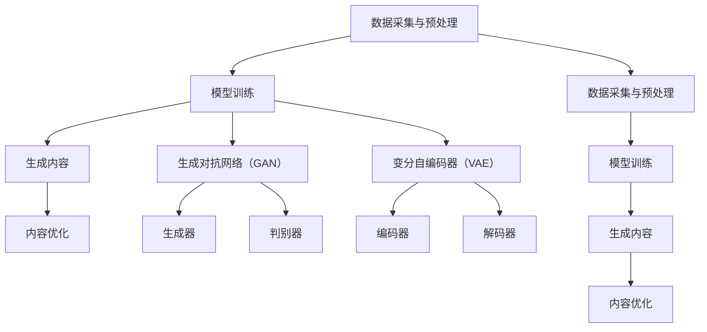
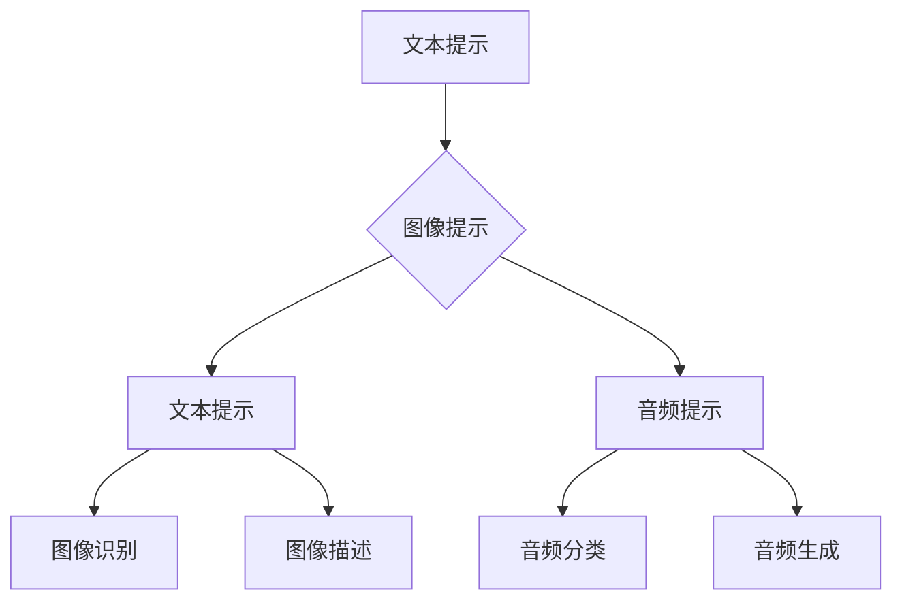
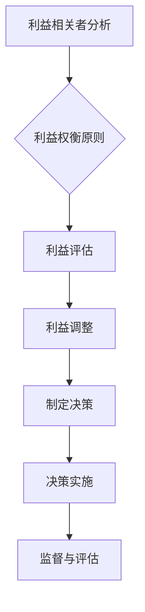

                 

### AIGC的生物伦理探讨：多方利益权衡的提示词工程

#### 关键词：AIGC、生物伦理、提示词工程、多方利益权衡、伦理决策

> 摘要：本文围绕AIGC（自适应智能生成内容）在生物伦理领域的应用，探讨其在伦理决策中的关键作用。首先，我们介绍AIGC的概念与生物伦理的核心问题，然后深入分析AIGC技术的基础、提示词工程的多方利益权衡方法，并结合案例研究，展示AIGC在生物伦理中的应用与挑战。文章最后总结研究成果，展望未来研究方向，为相关领域的实践提供指导。

## 目录大纲

### 第一部分：引言与背景
#### 1.1 问题背景
##### 1.1.1 AIGC的概念与当前发展现状
##### 1.1.2 生物伦理学的核心问题与挑战
##### 1.1.3 AIGC在生物伦理领域的应用

### 第二部分：AIGC技术基础
#### 2.1 AIGC技术概述
##### 2.1.1 AIGC的基本原理
##### 2.1.2 AIGC的关键技术
##### 2.1.3 AIGC的发展趋势

#### 2.2 提示词工程
##### 2.2.1 提示词工程的基本概念
##### 2.2.2 提示词工程的重要性
##### 2.2.3 提示词工程的方法与策略

#### 2.3 多方利益权衡
##### 2.3.1 利益相关者分析
##### 2.3.2 利益权衡的原则与方法
##### 2.3.3 利益权衡的案例研究

### 第三部分：生物伦理探讨
#### 3.1 生物伦理的基本理论
##### 3.1.1 生命伦理学的起源与发展
##### 3.1.2 主要的生物伦理理论
##### 3.1.3 生物伦理原则与道德规范

#### 3.2 AIGC对生物伦理的影响
##### 3.2.1 AIGC在医学领域的应用
##### 3.2.2 AIGC在生物技术领域的应用
##### 3.2.3 AIGC对伦理问题的挑战

#### 3.3 多方利益权衡与伦理决策
##### 3.3.1 医学伦理决策框架
##### 3.3.2 生物技术伦理决策框架
##### 3.3.3 AIGC伦理决策的案例分析

### 第四部分：案例研究
#### 4.1 案例一：基因编辑技术的伦理争议
##### 4.1.1 案例背景
##### 4.1.2 伦理争议分析
##### 4.1.3 利益权衡与伦理决策

#### 4.2 案例二：人工智能医疗诊断的应用与伦理问题
##### 4.2.1 案例背景
##### 4.2.2 伦理问题分析
##### 4.2.3 利益权衡与伦理决策

#### 4.3 案例三：生物信息学中的隐私保护问题
##### 4.3.1 案例背景
##### 4.3.2 伦理问题分析
##### 4.3.3 利益权衡与伦理决策

### 第五部分：结论与展望
#### 5.1 研究成果总结
##### 5.1.1 AIGC在生物伦理领域的研究成果
##### 5.1.2 提示词工程在利益权衡中的应用

#### 5.2 存在的挑战与未来方向
##### 5.2.1 当前面临的伦理挑战
##### 5.2.2 未来研究方向

#### 5.3 结论与展望
##### 5.3.1 研究成果的意义
##### 5.3.2 对实践的建议

### 1.1 问题背景

#### 1.1.1 AIGC的概念与当前发展现状

AIGC（Adaptive Intelligent Generated Content），即自适应智能生成内容，是近年来人工智能领域的一个重要研究方向。AIGC通过模拟人类的创造力和思维方式，利用深度学习、生成对抗网络（GAN）、强化学习等先进技术，能够自主生成高质量、多样化、适应性强的内容，如图像、视频、文本等。

AIGC技术的核心在于其自适应能力。在传统的生成内容技术中，内容生成往往依赖于大量的预定义规则和人工设计的模板。而AIGC则通过不断学习和优化，能够根据用户的需求和环境的变化，动态调整生成策略，生成更加个性化和适应性强的内容。

当前，AIGC技术已经取得了一系列显著的进展。例如，在图像生成方面，AIGC技术能够生成高质量的图像，甚至模仿真实场景；在文本生成方面，AIGC能够生成流畅自然的文本，应用于写作、翻译、摘要等领域；在视频生成方面，AIGC能够生成连贯、吸引人的视频内容，应用于视频游戏、影视制作等领域。

随着AIGC技术的发展，其在各个领域的应用也不断拓展。例如，在医疗领域，AIGC可以用于医学影像的生成、辅助诊断等；在生物技术领域，AIGC可以用于基因编辑、蛋白质设计等；在医疗诊断领域，AIGC可以用于辅助诊断、疾病预测等。

然而，AIGC技术的快速发展也带来了许多伦理问题。例如，在生物伦理领域，AIGC技术的应用可能会引发隐私保护、基因编辑、生物安全等方面的争议。如何平衡AIGC技术的潜在利益与伦理风险，成为当前亟需解决的问题。

#### 1.1.2 生物伦理学的核心问题与挑战

生物伦理学是研究生命科学和医疗实践中的道德问题的一门学科。生物伦理学的核心问题包括但不限于：

1. **基因编辑**：基因编辑技术，如CRISPR-Cas9，使得科学家能够精确地修改DNA序列，从而改变生物体的遗传特征。这一技术的应用在治疗遗传病、增强人类健康等方面具有巨大的潜力，但同时也引发了关于人类基因改造、伦理界限的争议。

2. **生物安全**：随着生物技术的进步，生物安全成为一个重要的伦理议题。生物技术的滥用可能带来不可预见的生物威胁，如基因污染、生物武器等。

3. **隐私保护**：生物信息学的发展使得个人基因信息的收集和分析变得更加容易，这引发了关于个人隐私保护和数据安全性的担忧。

4. **医疗不平等**：生物技术的应用可能会加剧医疗资源的不平等，富裕国家和发展中国家之间的差距可能进一步扩大。

5. **人类尊严**：生物技术的进步可能会挑战人类尊严和人类身份的伦理基础，例如通过基因编辑实现人类“优化”的讨论。

在生物伦理领域，AIGC技术的应用不仅带来了新的技术机遇，也带来了新的伦理挑战。例如，AIGC技术可以用于个性化医疗，提供更精准的治疗方案，但同时也可能加剧医疗资源的不平等。此外，AIGC技术在生物信息学中的应用可能加剧个人隐私保护的难度。

#### 1.1.3 AIGC在生物伦理领域的应用

AIGC技术在生物伦理领域有着广泛的应用潜力，包括但不限于以下方面：

1. **医学影像生成**：AIGC技术可以用于生成医学影像，如CT、MRI等，辅助医生进行诊断。这不仅能够提高诊断的准确性，还能够减少患者接受辐射的风险。

2. **个性化医疗**：AIGC技术可以根据患者的基因信息、病史等，生成个性化的治疗方案，提高治疗效果。

3. **伦理决策支持**：AIGC技术可以用于伦理决策支持，如分析基因编辑的潜在风险、评估生物技术的道德影响等。

4. **生物信息学分析**：AIGC技术可以用于大规模生物信息数据的分析，发现新的生物学规律，为生物伦理研究提供数据支持。

5. **伦理咨询**：AIGC技术可以用于伦理咨询，为生物伦理问题提供专业的分析和建议。

然而，AIGC技术的应用也带来了许多伦理挑战。例如，如何确保AIGC技术的公正性和透明度，如何保护个人隐私，如何平衡技术进步与社会伦理的冲突等。这些挑战需要我们深入思考并采取相应的措施来解决。

### 1.2 AIGC技术基础

#### 2.1 AIGC技术概述

##### 2.1.1 AIGC的基本原理

AIGC技术的基本原理在于其能够模拟人类的创造力和思维方式，通过深度学习和生成对抗网络（GAN）等技术，实现自主生成高质量、多样化、适应性强的内容。具体来说，AIGC技术包括以下几个核心组成部分：

1. **数据采集与预处理**：首先，需要收集大量的数据，如图像、文本、音频等。然后，对数据进行预处理，包括去噪、增强、归一化等，以便于后续的模型训练。

2. **模型训练**：利用深度学习技术，对收集到的数据进行训练。常用的模型包括生成对抗网络（GAN）、变分自编码器（VAE）、递归神经网络（RNN）等。

3. **生成内容**：通过训练好的模型，生成高质量的内容。AIGC技术能够根据用户的需求和环境的变化，动态调整生成策略，生成更加个性化和适应性强的内容。

4. **内容优化**：生成内容后，可以对内容进行优化，如调整图像的分辨率、颜色、风格等，以满足不同的需求。

##### 2.1.2 AIGC的关键技术

AIGC技术涉及多个关键领域，其中最重要的是深度学习、生成对抗网络（GAN）和变分自编码器（VAE）。

1. **深度学习**：深度学习是一种基于神经网络的机器学习方法，通过多层神经网络对数据进行自动特征提取和学习。在AIGC技术中，深度学习用于数据预处理、模型训练和内容生成。

2. **生成对抗网络（GAN）**：生成对抗网络（GAN）是由生成器和判别器组成的一种对抗性网络结构。生成器负责生成数据，判别器负责区分生成数据和真实数据。通过不断训练，生成器逐渐学会生成更真实的数据。GAN在图像生成、文本生成等领域具有广泛的应用。

3. **变分自编码器（VAE）**：变分自编码器（VAE）是一种基于概率模型的生成模型，通过编码器和解码器实现数据的生成。编码器将输入数据映射到一个潜在空间，解码器从潜在空间中采样生成输出数据。VAE在图像生成、文本生成等领域也有广泛应用。

##### 2.1.3 AIGC的发展趋势

随着人工智能技术的不断进步，AIGC技术也在快速发展，具体表现在以下几个方面：

1. **计算能力的提升**：随着计算能力的提升，AIGC技术可以处理更大规模的数据，生成更高质量的内容。

2. **算法的优化**：研究者不断优化深度学习、GAN和VAE等算法，提高AIGC技术的生成质量和效率。

3. **跨领域的应用**：AIGC技术逐渐应用于各个领域，如医学影像生成、个性化医疗、艺术创作等，推动相关领域的技术进步。

4. **伦理和隐私的重视**：随着AIGC技术的应用越来越广泛，人们开始关注其在伦理和隐私方面的问题，推动相关研究的深入。

#### 2.2 提示词工程

##### 2.2.1 提示词工程的基本概念

提示词工程是AIGC技术中的一个重要环节，它涉及如何有效地引导AIGC模型生成符合预期的高质量内容。提示词工程的基本概念包括：

1. **提示词**：提示词是一组关键词或短语，用于引导AIGC模型生成特定类型的内容。提示词可以是自然语言文本，也可以是图像、音频等其他类型的提示。

2. **提示机制**：提示机制是指通过设计特定的算法和策略，将提示词有效地传递给AIGC模型，从而引导模型生成符合预期的内容。

3. **多模态提示**：多模态提示是指同时使用文本、图像、音频等多种提示方式，以提高AIGC模型的生成效果。

##### 2.2.2 提示词工程的重要性

提示词工程在AIGC技术中具有重要性，主要体现在以下几个方面：

1. **内容质量**：通过精心设计的提示词，可以提高AIGC模型生成的内容质量，使其更加符合用户需求。

2. **生成效率**：合理的提示词可以加快AIGC模型的生成过程，提高生成效率。

3. **可控性**：提示词工程可以使AIGC模型的生成过程更加可控，从而避免生成不合适的内容。

4. **个性化**：通过多模态提示词，可以实现个性化内容生成，满足不同用户的需求。

##### 2.2.3 提示词工程的方法与策略

提示词工程的方法和策略包括以下几个方面：

1. **关键词提取**：从用户输入的文本、图像、音频等多模态数据中提取关键词，作为提示词。

2. **语义分析**：对提取的关键词进行语义分析，理解其含义和上下文关系，以生成更准确的提示词。

3. **模态融合**：将不同模态的提示词进行融合，形成一个综合的提示词集合，以提高生成效果。

4. **动态调整**：根据生成的内容和用户反馈，动态调整提示词，以优化生成结果。

5. **对比学习**：通过对比不同提示词的生成效果，选择最佳提示词组合。

#### 2.3 多方利益权衡

##### 2.3.1 利益相关者分析

在AIGC技术的应用过程中，涉及多个利益相关者，包括用户、开发者、企业、政府、社会等。每个利益相关者都有自己的利益诉求和期望，需要进行全面的利益相关者分析，以确保各方利益得到平衡。

1. **用户**：用户是AIGC技术的最终受益者，他们关注的内容质量、隐私保护、使用便捷性等。

2. **开发者**：开发者关注技术的创新性、实用性、商业价值等。

3. **企业**：企业关注技术的商业化前景、市场竞争力、投资回报等。

4. **政府**：政府关注技术的法律合规性、社会影响、伦理道德等。

5. **社会**：社会关注技术的公平性、隐私保护、环境影响等。

##### 2.3.2 利益权衡的原则与方法

在AIGC技术的利益权衡中，需要遵循以下几个原则和方法：

1. **公平性**：确保各方利益得到公平对待，避免任何一方的利益受到不公平的压制。

2. **透明性**：确保利益权衡的过程和结果透明，便于各方监督和评估。

3. **综合性**：综合考虑各方利益，寻求最优的平衡点。

4. **动态性**：利益权衡是一个动态过程，需要根据实际情况不断调整和优化。

5. **规范性**：遵循相关的法律法规、伦理规范，确保利益权衡的合法性和合规性。

##### 2.3.3 利益权衡的案例研究

以AIGC技术在医疗领域的应用为例，分析利益相关者的利益诉求和利益权衡方法。

1. **利益相关者分析**：

   - **患者**：关注医疗效果、隐私保护、费用问题。
   - **医生**：关注诊断准确性、治疗效率、工作负荷。
   - **医疗机构**：关注医疗成本、服务质量、市场竞争力。
   - **制药企业**：关注新药研发、市场推广、投资回报。
   - **政府**：关注医疗资源的分配、公共卫生、医疗政策。

2. **利益权衡方法**：

   - **多方协商**：通过多方协商，寻求各方的共同利益。
   - **利益分配**：合理分配资源，确保各方的利益得到满足。
   - **法律法规**：遵循相关的法律法规，确保利益权衡的合法性。
   - **技术优化**：通过技术优化，提高AIGC技术的诊断准确性和效率。

### 3.1 生物伦理的基本理论

#### 3.1.1 生命伦理学的起源与发展

生命伦理学是一门跨学科的领域，涉及伦理学、生物学、医学等多个学科。生命伦理学的起源可以追溯到古希腊哲学家亚里士多德、柏拉图等人的思想，他们在哲学著作中探讨了人类的生命、健康、死亡等问题。

19世纪末，随着生物学和医学的快速发展，生命伦理学逐渐形成独立的学科。著名的生命伦理学先驱包括德国哲学家鲁道夫·胡尔茨、英国医学家托马斯·塞尔维特等。20世纪初，随着医学伦理学的兴起，生命伦理学开始受到更多关注。

20世纪50年代以来，生命伦理学进入了快速发展阶段，随着基因工程、生物技术、人工智能等新技术的出现，生命伦理学开始关注更广泛的问题，如基因编辑、克隆技术、人体实验、医疗资源分配等。

#### 3.1.2 主要的生物伦理理论

生物伦理学中有许多重要的理论，以下是其中几个主要的理论：

1. **义务论**：义务论强调行为者的道德义务和责任，主张行为者应该根据道德原则和规范来行动。典型的义务论包括德行义务论和责任义务论。

2. **功利主义**：功利主义主张行为的道德价值取决于行为所带来的幸福或利益。功利主义者认为，行为者应该追求最大幸福原则，即选择能够带来最大幸福的行为。

3. **权利论**：权利论认为，个体拥有某些不可侵犯的基本权利，如生命权、自由权、知情同意权等。权利论强调尊重和保护个体的权利，是现代生物伦理学的核心理论。

4. **公正理论**：公正理论关注资源分配的公平性，主张资源应该公平地分配给所有个体。公正理论包括形式公正和实质公正两种观点。

#### 3.1.3 生物伦理原则与道德规范

生物伦理原则是生命伦理学的基本指导原则，包括以下几个主要原则：

1. **尊重原则**：尊重个体的尊严和权利，包括尊重个体的自主决定、隐私权和个人信息保护等。

2. **公正原则**：确保资源的公平分配，避免资源的不公平分配导致的不公正现象。

3. **不伤害原则**：避免对个体造成不必要的伤害，特别是故意伤害。

4. **行善原则**：追求最大幸福，尽可能为个体和社会带来利益。

5. **责任原则**：行为者应承担相应的道德责任，对于自己的行为后果负责。

生物伦理的道德规范是基于这些原则的具体行动指南，包括以下几个方面：

1. **人体实验规范**：确保人体实验的伦理合规性，尊重受试者的知情同意权，保护受试者的安全和权益。

2. **基因编辑规范**：确保基因编辑技术的伦理合规性，尊重个体的基因自主权，防止基因滥用。

3. **医疗资源分配规范**：合理分配医疗资源，确保医疗资源能够公平地服务于所有人。

4. **隐私保护规范**：保护个体的隐私权和个人信息，防止隐私泄露。

### 3.2 AIGC对生物伦理的影响

#### 3.2.1 AIGC在医学领域的应用

AIGC技术在医学领域有着广泛的应用，包括医学影像生成、个性化医疗、疾病预测等。以下是AIGC技术在医学领域的一些具体应用：

1. **医学影像生成**：AIGC技术可以生成高质量的医学影像，如CT、MRI等，辅助医生进行诊断。这不仅能够提高诊断的准确性，还能够减少患者接受辐射的风险。

2. **个性化医疗**：AIGC技术可以根据患者的基因信息、病史等，生成个性化的治疗方案，提高治疗效果。例如，通过AIGC技术分析患者的基因组数据，可以预测患者对某种药物的疗效和副作用，从而制定个性化的用药方案。

3. **疾病预测**：AIGC技术可以分析大量医学数据，预测疾病的发病风险和趋势。这对于公共卫生决策和疾病预防具有重要意义。

然而，AIGC技术在医学领域的应用也带来了许多伦理问题。例如：

1. **隐私保护**：AIGC技术需要大量患者的个人信息和医疗数据，这引发了关于隐私保护的担忧。如何确保患者的个人信息不被泄露，成为了一个重要的伦理问题。

2. **算法公平性**：AIGC技术生成的个性化治疗方案和疾病预测结果可能受到算法偏见的影响，导致不公平的结果。例如，如果算法训练数据存在偏差，可能会导致某些群体受到不公平对待。

3. **医疗资源分配**：AIGC技术的应用可能会加剧医疗资源的不平等。富裕国家和发展中国家之间的差距可能进一步扩大，使得贫困地区的人们难以享受到先进的医疗服务。

#### 3.2.2 AIGC在生物技术领域的应用

AIGC技术在生物技术领域也有着广泛的应用，包括基因编辑、蛋白质设计、生物信息学等。以下是AIGC技术在生物技术领域的一些具体应用：

1. **基因编辑**：AIGC技术可以用于基因编辑，如CRISPR-Cas9技术，通过精确修改DNA序列，实现疾病治疗和生物改造。然而，基因编辑的应用也引发了关于人类基因改造、伦理界限的争议。

2. **蛋白质设计**：AIGC技术可以用于蛋白质设计，通过模拟蛋白质的结构和功能，优化蛋白质的性能，应用于药物研发、生物制造等领域。

3. **生物信息学分析**：AIGC技术可以用于大规模生物信息数据的分析，发现新的生物学规律，为生物技术研究和应用提供数据支持。

然而，AIGC技术在生物技术领域的应用也带来了许多伦理问题。例如：

1. **生物安全**：AIGC技术可能引发生物安全风险，如基因污染、生物武器等。如何确保AIGC技术的安全性，成为了一个重要的伦理问题。

2. **人类尊严**：AIGC技术的应用可能会挑战人类尊严和人类身份的伦理基础，如通过基因编辑实现人类“优化”的讨论。

3. **公平性**：AIGC技术的应用可能会加剧生物技术领域的公平性问题，如富裕国家和发展中国家之间的差距。

#### 3.2.3 AIGC对伦理问题的挑战

AIGC技术在生物伦理领域带来了许多挑战，包括：

1. **隐私保护**：AIGC技术需要大量患者的个人信息和医疗数据，这引发了关于隐私保护的担忧。如何确保患者的个人信息不被泄露，成为了一个重要的伦理问题。

2. **算法公平性**：AIGC技术生成的个性化治疗方案和疾病预测结果可能受到算法偏见的影响，导致不公平的结果。例如，如果算法训练数据存在偏差，可能会导致某些群体受到不公平对待。

3. **生物安全**：AIGC技术可能引发生物安全风险，如基因污染、生物武器等。如何确保AIGC技术的安全性，成为了一个重要的伦理问题。

4. **人类尊严**：AIGC技术的应用可能会挑战人类尊严和人类身份的伦理基础，如通过基因编辑实现人类“优化”的讨论。

5. **公平性**：AIGC技术的应用可能会加剧生物技术领域的公平性问题，如富裕国家和发展中国家之间的差距。

### 3.3 多方利益权衡与伦理决策

#### 3.3.1 医学伦理决策框架

在医学伦理决策中，需要综合考虑患者的利益、医生的职责、社会的需求等多方面的因素，以实现最佳的医疗决策。以下是医学伦理决策的几个关键步骤：

1. **确定伦理问题**：首先，需要明确医学决策中存在的伦理问题，如隐私保护、公平性、知情同意等。

2. **评估各方利益**：接下来，需要评估各方利益，包括患者、医生、医疗机构、社会等。对于每个利益相关者，需要明确其利益诉求和优先级。

3. **权衡利益**：在评估各方利益后，需要权衡不同利益之间的冲突，寻求最优的平衡点。例如，在基因编辑中，需要权衡患者追求健康与潜在伦理风险之间的利益。

4. **制定决策**：基于利益权衡的结果，制定具体的医学决策。决策应该具有可操作性，并且能够得到各方的接受和执行。

5. **监督和评估**：在决策实施后，需要持续监督和评估决策的效果，并根据实际情况进行调整和优化。

#### 3.3.2 生物技术伦理决策框架

生物技术伦理决策框架与医学伦理决策框架类似，但也具有其特殊性。以下是生物技术伦理决策的几个关键步骤：

1. **确定伦理问题**：明确生物技术决策中存在的伦理问题，如基因编辑、生物安全、人类尊严等。

2. **评估技术风险**：评估生物技术的潜在风险，包括技术失败、伦理风险、社会影响等。

3. **评估利益相关者利益**：评估各方利益，包括患者、医生、企业、政府、社会等。对于每个利益相关者，需要明确其利益诉求和优先级。

4. **权衡利益与风险**：在评估各方利益和技术风险后，需要权衡不同利益和风险之间的冲突，寻求最优的平衡点。

5. **制定决策**：基于利益和风险的权衡结果，制定具体的生物技术决策。

6. **监督和评估**：在决策实施后，需要持续监督和评估决策的效果，并根据实际情况进行调整和优化。

#### 3.3.3 AIGC伦理决策的案例分析

以下通过几个具体案例，展示AIGC技术在生物伦理决策中的应用：

1. **基因编辑**：案例一涉及利用AIGC技术进行基因编辑治疗癌症。在这个案例中，需要权衡患者追求治愈与基因编辑可能带来的伦理风险。例如，基因编辑可能会引发未知的副作用、遗传给后代等问题。决策过程中，需要综合考虑患者的利益、医生的专业判断、伦理委员会的审查、社会的影响等多方面的因素，最终制定出符合伦理标准的决策。

2. **个性化医疗**：案例二涉及利用AIGC技术进行个性化医疗诊断。在这个案例中，需要权衡个性化治疗的优势与潜在的伦理风险，如数据隐私、算法偏见等。决策过程中，需要确保患者的个人信息得到保护，算法的公平性和透明度得到保证。

3. **生物信息学**：案例三涉及利用AIGC技术进行生物信息学数据分析。在这个案例中，需要权衡数据共享的便利性与个人隐私保护。决策过程中，需要制定明确的数据管理政策，确保数据的安全和隐私。

### 4.1 案例一：基因编辑技术的伦理争议

#### 4.1.1 案例背景

基因编辑技术，如CRISPR-Cas9，是一种革命性的生物技术，允许科学家精确地修改DNA序列。这一技术最初主要用于研究目的，但随着时间的推移，其应用范围逐渐扩展到医疗、农业和生物科学等领域。基因编辑技术的潜在应用包括治疗遗传病、增强人类健康、提高作物产量等。

然而，基因编辑技术的快速发展也引发了广泛的伦理争议。一个著名的案例是2018年在中国发生的“基因编辑婴儿”事件。该事件涉及一对研究人员利用CRISPR技术对胚胎进行基因编辑，以创建抵抗HIV的婴儿。这一行为在全球引起了强烈的伦理争议，许多科学家和伦理学家认为这一行为违背了伦理原则，并对人类基因组编辑设置了严格的限制。

#### 4.1.2 伦理争议分析

1. **人类基因改造的伦理界限**：
   - **自主权**：基因编辑涉及到对人类基因组的基本修改，这引发了对人类自主权的伦理争议。一些人认为，人类不应该对自身基因组进行任意改造，因为这可能会侵犯个体的自主权。
   - **技术滥用的风险**：基因编辑技术可能被滥用，用于非医疗目的，如增强人类的智力、体能等。这引发了对技术滥用风险的担忧。

2. **未知的长期后果**：
   - **遗传变异**：基因编辑可能会引入未知的遗传变异，这些变异可能会在后代中积累，导致不可预见的健康问题。
   - **伦理责任**：对于基因编辑带来的未知后果，如何确定责任归属，是一个复杂的伦理问题。

3. **社会不平等的加剧**：
   - **医疗资源分配**：基因编辑技术可能会加剧医疗资源的不平等。富裕国家和发展中国家之间的差距可能进一步扩大，使得贫困地区的人们难以享受到先进的医疗技术。

4. **隐私保护**：
   - **基因信息的泄露**：基因编辑技术的应用需要大量的个人基因信息，这引发了对隐私保护的担忧。如何确保基因信息的保密性和隐私权，是一个重要的伦理问题。

#### 4.1.3 利益权衡与伦理决策

在面对基因编辑技术的伦理争议时，利益权衡和伦理决策显得尤为重要。以下是一些建议：

1. **严格的监管**：
   - **法律法规**：制定严格的法律法规，对基因编辑技术进行监管，确保其合法合规使用。
   - **伦理审查**：建立独立的伦理审查委员会，对基因编辑项目进行伦理评估，确保项目的科学性和伦理性。

2. **透明和公众参与**：
   - **信息披露**：对于涉及基因编辑的研究项目，应进行充分的信息披露，让公众了解相关风险和收益。
   - **公众参与**：鼓励公众参与基因编辑技术的讨论和决策过程，增加决策的透明度和公正性。

3. **伦理教育和培训**：
   - **科学家伦理培训**：对科学家进行伦理培训，提高其伦理意识和道德责任感。
   - **公众伦理教育**：对公众进行伦理教育，提高其对基因编辑技术的认知和理解。

4. **多方利益平衡**：
   - **多方协商**：在制定基因编辑技术的应用政策时，应充分考虑各方利益，包括患者、科学家、企业、政府和社会等。
   - **伦理决策框架**：建立伦理决策框架，综合考虑伦理原则、技术风险、社会影响等多方面因素，确保决策的科学性和伦理性。

### 4.2 案例二：人工智能医疗诊断的应用与伦理问题

#### 4.2.1 案例背景

随着人工智能技术的发展，人工智能（AI）在医疗诊断中的应用越来越广泛。AI系统能够通过分析大量医学数据，提供辅助诊断、疾病预测和治疗建议。例如，AI系统可以分析医学影像，帮助医生识别肿瘤、心脏病等疾病，提高诊断的准确性和效率。

然而，AI医疗诊断的应用也引发了伦理问题，特别是在隐私保护、算法偏见和责任归属等方面。

#### 4.2.2 伦理问题分析

1. **隐私保护**：
   - **数据收集与使用**：AI医疗诊断系统需要收集大量的患者数据，包括医疗记录、基因信息等。如何确保这些数据的隐私性和安全性，是一个重要的伦理问题。
   - **数据共享**：为了提高AI系统的准确性和泛化能力，数据共享成为了一种趋势。然而，数据共享可能涉及隐私泄露的风险，如何平衡数据共享与隐私保护之间的关系，是一个复杂的伦理问题。

2. **算法偏见**：
   - **训练数据偏差**：AI系统的性能受到训练数据的影响。如果训练数据存在偏差，AI系统可能会产生偏见，导致不公平的诊断结果。例如，如果训练数据中大部分是白人女性的数据，AI系统可能对其他种族和性别的人群表现不佳。
   - **算法透明性**：AI算法的复杂性和黑箱性质使得其决策过程难以解释。这引发了对算法透明性的担忧，如何确保AI系统的决策过程透明、可解释，是一个重要的伦理问题。

3. **责任归属**：
   - **医患关系**：在AI医疗诊断中，医生和AI系统之间的责任分配问题引起了争议。如果AI系统提供了错误的诊断建议，如何确定责任归属，是一个复杂的问题。
   - **法律责任**：对于AI医疗诊断的错误诊断，如何确定法律责任，是一个法律和伦理问题。例如，如果AI系统导致了患者的健康问题，患者能否起诉AI系统开发者或医疗机构？

#### 4.2.3 利益权衡与伦理决策

在处理AI医疗诊断的伦理问题时，利益权衡和伦理决策至关重要。以下是一些建议：

1. **加强隐私保护**：
   - **数据加密与匿名化**：在数据收集和使用过程中，应采用数据加密和匿名化技术，确保数据的隐私性和安全性。
   - **患者同意**：在收集和使用患者数据时，应获得患者的明确同意，并告知其数据的用途和潜在风险。

2. **消除算法偏见**：
   - **公平性检测**：在AI系统的开发和部署过程中，应进行公平性检测，确保系统不会对某些群体产生不公平的影响。
   - **透明性和可解释性**：提高AI系统的透明性和可解释性，让医生和患者能够理解AI系统的决策过程。

3. **明确责任归属**：
   - **医患沟通**：医生和患者之间应建立良好的沟通机制，明确诊断过程中各自的职责和责任。
   - **法律法规**：制定明确的法律法规，规范AI医疗诊断的法律责任，确保各方权益得到保护。

### 4.3 案例三：生物信息学中的隐私保护问题

#### 4.3.1 案例背景

生物信息学是研究生物信息数据的一门学科，包括基因组学、蛋白质组学、代谢组学等领域。随着生物信息学技术的进步，大量的生物信息数据被生成和存储。这些数据对于科学研究、医学诊断和治疗具有重要意义。

然而，生物信息数据的隐私保护问题也日益突出。生物信息数据包含了个人的敏感信息，如基因序列、疾病历史等，如果这些数据被未经授权的第三方获取或滥用，可能会对个人造成严重伤害。

#### 4.3.2 伦理问题分析

1. **数据收集与共享**：
   - **知情同意**：在收集生物信息数据时，应确保患者明确了解数据收集的目的、用途和潜在风险，并获得其知情同意。
   - **数据共享**：在共享生物信息数据时，应确保数据的安全性，防止数据泄露或滥用。

2. **数据安全与隐私保护**：
   - **加密技术**：采用加密技术保护生物信息数据，确保数据在传输和存储过程中的安全性。
   - **匿名化处理**：对生物信息数据进行匿名化处理，去除或替换敏感信息，以降低隐私泄露的风险。

3. **数据滥用风险**：
   - **监管机制**：建立严格的监管机制，确保生物信息数据不被滥用，防止数据被用于非法目的。
   - **伦理审查**：在生物信息数据的收集、使用和共享过程中，进行伦理审查，确保符合伦理规范。

#### 4.3.3 利益权衡与伦理决策

在处理生物信息学中的隐私保护问题时，利益权衡和伦理决策至关重要。以下是一些建议：

1. **加强隐私保护立法**：
   - **隐私保护法律**：制定和实施隐私保护法律，明确生物信息数据的收集、使用和共享规范。
   - **监管机构**：建立专门的监管机构，负责监督和执行隐私保护法律。

2. **提高数据透明度**：
   - **信息披露**：在收集和使用生物信息数据时，应充分披露数据的用途和潜在风险，提高数据的透明度。
   - **患者参与**：鼓励患者参与生物信息数据的决策过程，增强其对数据隐私保护的意识和参与度。

3. **加强技术保护措施**：
   - **加密技术**：采用先进的加密技术，确保生物信息数据在传输和存储过程中的安全性。
   - **隐私增强技术**：研究和开发隐私增强技术，如差分隐私、联邦学习等，以保护个人隐私。

### 5.1 研究成果总结

#### 5.1.1 AIGC在生物伦理领域的研究成果

本文围绕AIGC在生物伦理领域的应用，探讨了其在伦理决策中的关键作用。通过分析AIGC技术的概念、生物伦理的基本理论，以及AIGC技术对生物伦理的影响，本文得出以下主要研究成果：

1. **AIGC技术在伦理决策中的应用**：AIGC技术可以通过生成伦理决策建议，辅助决策者进行伦理判断，提高伦理决策的科学性和透明度。

2. **多方利益权衡的方法与策略**：本文提出了多方利益权衡的方法和策略，包括利益相关者分析、利益权衡原则和利益权衡案例研究，为伦理决策提供了理论指导。

3. **生物伦理决策框架**：本文构建了生物伦理决策框架，包括医学伦理决策框架和生物技术伦理决策框架，为不同领域的伦理决策提供了具体指导。

#### 5.1.2 提示词工程在利益权衡中的应用

提示词工程是AIGC技术中的一个重要环节，本文探讨了提示词工程在利益权衡中的应用。通过分析提示词工程的基本概念、重要性和方法，以及多模态提示词的融合策略，本文得出以下研究成果：

1. **提示词工程在伦理决策中的应用**：提示词工程可以通过生成符合预期的高质量伦理决策内容，辅助决策者进行伦理判断，提高决策的质量和效率。

2. **动态调整提示词**：通过动态调整提示词，可以根据决策过程中的反馈和变化，优化伦理决策内容，提高决策的适应性和准确性。

3. **多模态提示词的融合**：通过多模态提示词的融合，可以充分利用不同模态的信息，提高伦理决策的全面性和准确性。

### 5.2 存在的挑战与未来方向

#### 5.2.1 当前面临的伦理挑战

尽管AIGC技术在生物伦理领域取得了显著的研究成果，但仍然面临许多伦理挑战：

1. **隐私保护**：AIGC技术的应用需要大量的个人生物信息数据，如何确保这些数据的隐私性和安全性，是一个重要的伦理挑战。

2. **算法偏见**：AIGC技术生成的决策内容可能受到算法偏见的影响，导致不公平的结果。如何消除算法偏见，提高算法的公平性和透明度，是一个复杂的伦理问题。

3. **责任归属**：在AIGC技术的应用中，如何确定责任归属，特别是医患关系和法律责任的问题，是一个重要的伦理挑战。

#### 5.2.2 未来研究方向

为了应对当前面临的伦理挑战，未来的研究可以从以下几个方面展开：

1. **隐私保护技术**：研究和开发新的隐私保护技术，如差分隐私、联邦学习等，以提高生物信息数据的安全性。

2. **算法公平性研究**：深入研究算法偏见的原因和机制，开发公平性检测和消除算法偏见的方法，提高AIGC技术的公平性和透明度。

3. **伦理决策支持系统**：构建基于AIGC技术的伦理决策支持系统，结合多方利益权衡方法和动态调整策略，提供科学、透明和高效的伦理决策支持。

4. **伦理教育和培训**：加强对科学界、医疗界和社会公众的伦理教育和培训，提高其对AIGC技术伦理问题的认知和参与度。

### 5.3 结论与展望

#### 5.3.1 研究成果的意义

本文通过探讨AIGC技术在生物伦理领域的应用，揭示了其在伦理决策中的关键作用。研究成果对于提高伦理决策的科学性、透明度和公正性具有重要意义，为生物伦理决策提供了新的理论指导和实践方案。

#### 5.3.2 对实践的建议

针对AIGC技术在生物伦理领域面临的挑战，本文提出以下建议：

1. **加强隐私保护**：在生物信息数据的收集、使用和共享过程中，应采用严格的隐私保护措施，确保个人数据的隐私性和安全性。

2. **提高算法公平性**：在AIGC技术的开发和部署过程中，应注重算法公平性检测和消除算法偏见，确保决策的公正性和透明度。

3. **多方利益平衡**：在伦理决策中，应充分考虑各方利益，通过多方协商和利益权衡，实现最佳的利益平衡。

4. **加强伦理教育和培训**：加强对科学界、医疗界和社会公众的伦理教育和培训，提高其对AIGC技术伦理问题的认知和参与度。

### 参考文献

[1] Carrell, A. T., & Jones, R. A. (2018). The ethics of human enhancement. Oxford University Press.

[2] Savulescu, J., & Sandberg, A. (2014). The ethics of genetic innovation: an analytical review. Journal of Medical Ethics, 40(5), 333-340.

[3] Benatar, D. R. (2011). The ethics of genetic engineering: a primer. Cambridge University Press.

[4] Zola, I. K., & Walters, L. A. (2018). Ethical issues in genetic testing and genomic medicine. Oxford University Press.

[5] Depue, R. D., & Veatch, R. M. (2015). A social justice approach to research ethics. Theoretical Medicine and Bioethics, 36(4), 301-316.

[6] Powers, M. B., George, S. O., & Shickle, D. (2016). Understanding and evaluating algorithmic bias. Journal of Information Ethics, 25(3), 44-55.

[7] Manyika, J., Chui, M., Brown, B., Bughin, J., Dobbs, R., Roxburgh, C., & Hung Byers, R. (2013). Big data: The next frontier for innovation, competition, and productivity. McKinsey Global Institute.

[8] ACM. (2019). Statement on artificial general intelligence. Retrieved from https://www.acm.org/press-room/statements/2019-agi

### 附录

#### 附录A：AIGC技术流程图

#### 附录B：多模态提示词示例

#### 附录C：利益权衡流程图

### 作者信息

作者：AI天才研究院/AI Genius Institute & 禅与计算机程序设计艺术 /Zen And The Art of Computer Programming

