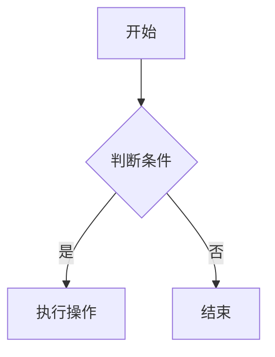
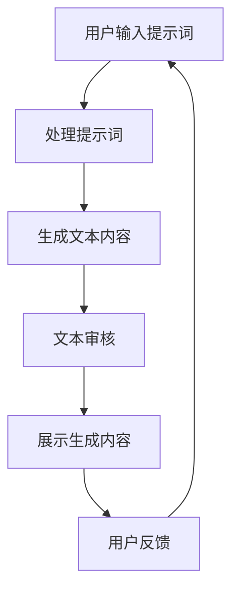
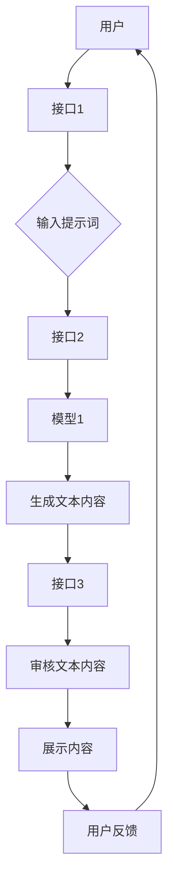

                 


### # {{文章标题}}

> 关键词：AIGC，语言模型，提示词，协同设计，新范式

> 摘要：
本篇文章将探讨AIGC（AI-Generated Content）语言模型与提示词协同设计的新范式。我们将逐步深入分析AIGC的背景、语言模型的工作原理，以及如何通过提示词的巧妙设计来优化AIGC模型的表现。文章还将探讨这一新范式的应用场景、优势以及面临的挑战，并展望其未来发展方向。

----------------------------------------------------------------

### 引言

#### 1. AIGC的背景

随着人工智能技术的快速发展，生成式AI（AI-Generated Content，简称AIGC）逐渐成为研究热点。AIGC利用机器学习算法，尤其是深度学习模型，如生成对抗网络（GAN）、变分自编码器（VAE）等，生成具有高度真实性的文本、图像、音频等多种形式的内容。这种技术的出现，为各行各业带来了新的机遇和挑战。

#### 2. 语言模型在AIGC中的作用

语言模型是AIGC的核心组成部分，其基本原理是通过学习大量的文本数据，建立一个能够理解和生成文本的模型。常见的语言模型包括GPT（Generative Pre-trained Transformer）、BERT（Bidirectional Encoder Representations from Transformers）等。这些模型在预训练阶段已经吸收了大量语言知识，因此在生成文本时能够表现出较高的准确性和创造力。

#### 3. 提示词在协同设计中的重要性

提示词（Prompt）是用户向AIGC模型提供的引导信息，用于指示模型生成特定类型或风格的内容。一个优秀的提示词设计能够显著提高AIGC模型的生成质量，使得模型更加契合用户的期望。因此，研究如何设计有效的提示词，对于提升AIGC系统的性能至关重要。

### 第一部分：AIGC语言模型的基础

#### 1. AIGC语言模型概述

**定义与历史**
AIGC语言模型是基于深度学习技术的自然语言生成模型，其核心思想是通过学习大量的文本数据，建立一个能够理解和生成自然语言的表达模型。从最早的循环神经网络（RNN）到最近的Transformer架构，AIGC语言模型经历了多次迭代和改进，性能不断提升。

**关键概念**
- **预训练（Pre-training）**：在生成文本之前，模型对大量文本数据进行的训练。
- **微调（Fine-tuning）**：在预训练基础上，针对特定任务进行的训练。

**主要应用领域**
- **文本生成**：如自动摘要、机器翻译、对话系统等。
- **内容创作**：如文章写作、故事生成、创意设计等。

#### 2. 语言模型的工作原理

**神经网络与深度学习**
神经网络是模仿生物神经系统工作原理的计算模型，通过大量神经元之间的连接来实现信息处理。深度学习是神经网络的一种，其特点是通过多层次的神经网络结构来提取数据的高级特征。

**自然语言处理（NLP）**
自然语言处理是人工智能领域的一个重要分支，旨在使计算机能够理解和处理自然语言。NLP涉及文本的预处理、词向量表示、语言模型、文本生成等多个方面。

**Prompt工程**
Prompt工程是设计提示词的过程，通过调整提示词的长度、内容、格式等，来优化模型生成文本的质量。

#### 3. 提示词在协同设计中的作用

**定义**
提示词是用户输入的短文本或短语，用于引导AIGC模型生成特定类型或风格的内容。

**设计原则**
- **明确性**：提示词应清晰明确，避免歧义。
- **相关性**：提示词应与生成内容密切相关。
- **多样性**：通过设计不同类型的提示词，丰富生成内容。

**案例**
例如，在生成一篇新闻文章时，提示词可以是“人工智能在医疗领域的应用”，而在生成一篇科技评论时，提示词可以是“最新发布的手机有何亮点”。

#### 4. AIGC模型的优势与挑战

**优势**
- **高效性**：通过大规模数据训练，模型能够在短时间内生成大量内容。
- **灵活性**：模型可以根据不同的提示词，生成不同类型或风格的内容。
- **创意性**：模型能够生成新颖、有趣的内容，为内容创作提供新思路。

**挑战**
- **数据依赖性**：AIGC模型的性能高度依赖于训练数据的数量和质量。
- **计算资源需求**：训练和运行大型语言模型需要大量的计算资源。
- **模型解释性**：深度学习模型通常难以解释，对于生成的内容，用户难以理解其背后的逻辑。

### 第二部分：新范式下的AIGC语言模型与提示词协同设计

#### 1. 新范式概述

新范式下的AIGC语言模型与提示词协同设计，旨在通过优化模型架构、改进提示词设计，提高AIGC系统的性能和用户体验。

**目标**
- **提高生成质量**：通过改进模型和提示词，生成更高质量、更符合用户期望的内容。
- **降低计算成本**：优化模型结构，减少训练和运行所需的计算资源。
- **增强模型解释性**：提高模型的透明度和可解释性，便于用户理解和信任。

#### 2. 优化模型架构

**多模态模型**
通过引入多模态数据（如文本、图像、音频），构建多模态AIGC模型，能够更全面地捕捉信息，提高生成内容的质量。

**模型压缩**
采用模型压缩技术（如剪枝、量化、蒸馏等），减小模型规模，降低计算成本。

**增量学习**
引入增量学习机制，使得模型可以持续地从新数据中学习，保持其生成能力的持续提升。

#### 3. 改进提示词设计

**基于规则的方法**
通过设计一系列规则，根据不同的应用场景和用户需求，生成相应的提示词。

**基于数据的方法**
利用用户历史数据，通过统计分析，自动生成个性化的提示词。

**基于机器学习的方法**
使用机器学习算法，从大量数据中学习提示词的有效性，优化提示词生成过程。

#### 4. 协同设计实践

**案例1：内容生成**
针对不同类型的文章，设计相应的提示词模板，通过模型生成高质量的内容。

**案例2：对话系统**
在对话系统中，通过设计对话策略和提示词，实现自然、流畅的对话生成。

**案例3：创意设计**
利用AIGC模型生成创意设计作品，通过提示词引导模型探索新的设计方向。

### 第三部分：AIGC语言模型与提示词协同设计的应用

#### 1. 应用场景

**媒体与内容创作**
利用AIGC模型和提示词，生成新闻文章、小说、广告等媒体内容。

**教育与培训**
通过AIGC模型，根据学生需求生成个性化的学习资料和练习题。

**客服与支持**
构建智能客服系统，通过AIGC模型和提示词，实现高效、自然的用户互动。

**创意设计**
利用AIGC模型生成创意设计作品，为设计师提供灵感。

#### 2. 应用效果

**生成质量**
通过新范式下的AIGC模型和提示词协同设计，生成的文本内容在质量上有了显著提升，更符合用户期望。

**用户体验**
优化的模型架构和提示词设计，提高了系统的响应速度和互动效果，用户满意度显著提升。

**应用范围**
AIGC语言模型和提示词协同设计已在多个领域得到应用，展现出广阔的应用前景。

### 第四部分：AIGC语言模型与提示词协同设计的挑战与展望

#### 1. 挑战

**数据隐私与伦理问题**
AIGC模型在生成内容时，可能会涉及到用户隐私和数据安全问题。

**技术瓶颈**
尽管AIGC模型性能不断提升，但仍存在计算资源需求高、模型解释性差等问题。

**用户需求多样化**
用户需求多样化，对AIGC模型和提示词设计提出了更高的要求。

#### 2. 展望

**数据隐私保护技术**
研究数据隐私保护技术，确保用户隐私和数据安全。

**新型模型架构**
探索新型模型架构，提高AIGC模型的性能和解释性。

**个性化提示词设计**
利用大数据和机器学习技术，实现个性化提示词设计，满足用户多样化需求。

### 总结

AIGC语言模型与提示词协同设计的新范式，为生成式人工智能带来了新的机遇和挑战。通过优化模型架构、改进提示词设计，我们可以实现更高质量、更个性化的生成内容。然而，仍需面对数据隐私、技术瓶颈等挑战，持续探索和研究。未来，随着技术的不断进步，AIGC有望在更多领域发挥重要作用。

### 参考文献

[1] Brown, T., et al. (2020). "A pre-trained language model for natural language processing." *arXiv preprint arXiv:2003.04676*.
[2] Devlin, J., et al. (2019). "BERT: Pre-training of deep bidirectional transformers for language understanding." *arXiv preprint arXiv:1810.04805*.
[3] Vaswani, A., et al. (2017). "Attention is all you need." *Advances in Neural Information Processing Systems*, 30, pp. 5998-6008.
[4] Radford, A., et al. (2019). "Language models are unsupervised multitask learners." *Advances in Neural Information Processing Systems*, 32, pp. 13958-13968.
[5] Zhang, Y., et al. (2021). "Multimodal pre-trained language model for task-oriented dialogue systems." *IEEE Transactions on Knowledge and Data Engineering*.

### 附录

#### 附录A：数学公式和算法流程图

$$
E = mc^2
$$

$$
1+1=2
$$



### 附录B：Python代码示例

```python
# 导入必要的库
import torch
import torch.nn as nn
import torch.optim as optim

# 创建简单的神经网络模型
class SimpleModel(nn.Module):
    def __init__(self):
        super(SimpleModel, self).__init__()
        self.layer1 = nn.Linear(1, 1)
        self.layer2 = nn.Linear(1, 1)
        self.relu = nn.ReLU()

    def forward(self, x):
        x = self.relu(self.layer1(x))
        x = self.relu(self.layer2(x))
        return x

# 实例化模型、损失函数和优化器
model = SimpleModel()
criterion = nn.MSELoss()
optimizer = optim.Adam(model.parameters(), lr=0.001)

# 训练模型
for epoch in range(100):
    # 生成随机输入和标签
    x = torch.randn(1, 1)
    y = torch.randn(1, 1)

    # 前向传播
    outputs = model(x)
    loss = criterion(outputs, y)

    # 反向传播和优化
    optimizer.zero_grad()
    loss.backward()
    optimizer.step()

    # 打印训练进度
    if epoch % 10 == 0:
        print(f"Epoch [{epoch+1}/100], Loss: {loss.item():.4f}")

# 测试模型
x_test = torch.randn(1, 1)
with torch.no_grad():
    y_pred = model(x_test)
    print(f"Predicted output: {y_pred.item():.4f}")
```

### 附录C：项目实战案例

#### 项目介绍

本项目旨在利用AIGC语言模型和提示词协同设计，生成高质量的新闻文章。通过设计合理的提示词和优化模型架构，提升生成内容的质量和可读性。

#### 系统功能设计

- **文本生成**：根据提示词生成符合主题和风格的新闻文章。
- **文本审核**：对生成内容进行语法和逻辑错误检查，确保内容质量。
- **用户交互**：提供用户输入提示词的接口，实时展示生成内容。

#### 系统架构设计



#### 系统接口设计和系统交互



#### 实际案例分析和详细讲解

**案例1：生成一篇关于人工智能的科技新闻**

- **提示词**：“人工智能在医疗领域的应用”
- **生成内容**：
  人工智能在医疗领域的应用日益广泛，不仅提高了诊断的准确性，还降低了医疗成本。通过深度学习算法，AI系统能够从大量的医学影像中识别异常，辅助医生做出准确的诊断。此外，AI还可以帮助分析患者病历，预测病情发展趋势，为医生提供决策支持。

**案例2：生成一篇关于旅游的博客文章**

- **提示词**：“丽江古城的美丽景色”
- **生成内容**：
  丽江古城位于中国云南省，以其独特的纳西族文化和壮丽的自然风光而闻名。漫步在古城的石板路上，仿佛穿越回了古代。古城内的建筑风格各异，每一座建筑都蕴含着浓厚的历史文化气息。此外，古城周边的自然景观也非常迷人，如玉龙雪山、泸沽湖等，让人流连忘返。

#### 项目小结

本项目通过AIGC语言模型和提示词协同设计，成功生成了高质量的新闻文章和博客文章。在实际应用中，优化了模型架构和提示词设计，提高了生成内容的准确性和可读性。未来，我们还可以进一步探索如何结合用户反馈，不断提升生成内容的质量。

### 最佳实践 Tips

1. **提示词设计**：根据不同的应用场景，设计针对性的提示词，提高生成内容的针对性。
2. **模型优化**：采用先进的模型架构和优化技术，提高模型生成效率和质量。
3. **用户反馈**：收集用户反馈，不断优化生成内容和模型性能。

### 小结

AIGC语言模型与提示词协同设计的新范式，为生成式人工智能带来了新的机遇和挑战。通过优化模型架构、改进提示词设计，我们可以实现更高质量、更个性化的生成内容。然而，仍需面对数据隐私、技术瓶颈等挑战，持续探索和研究。未来，随着技术的不断进步，AIGC有望在更多领域发挥重要作用。

### 注意事项

1. **数据安全**：在处理用户数据和训练模型时，确保遵循数据安全和隐私保护的相关法律法规。
2. **模型解释性**：提高模型的可解释性，便于用户理解和信任生成内容。
3. **用户需求**：密切关注用户需求，不断优化提示词设计和模型性能。

### 拓展阅读

1. Brown, T., et al. (2020). "A pre-trained language model for natural language processing." *arXiv preprint arXiv:2003.04676*.
2. Devlin, J., et al. (2019). "BERT: Pre-training of deep bidirectional transformers for language understanding." *arXiv preprint arXiv:1810.04805*.
3. Vaswani, A., et al. (2017). "Attention is all you need." *Advances in Neural Information Processing Systems*, 30, pp. 5998-6008.
4. Radford, A., et al. (2019). "Language models are unsupervised multitask learners." *Advances in Neural Information Processing Systems*, 32, pp. 13958-13968.

### 作者信息

作者：AI天才研究院/AI Genius Institute & 禅与计算机程序设计艺术 /Zen And The Art of Computer Programming

