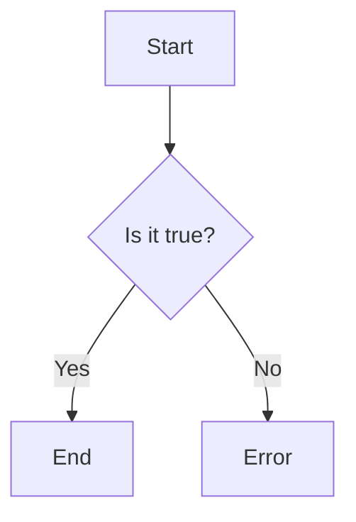
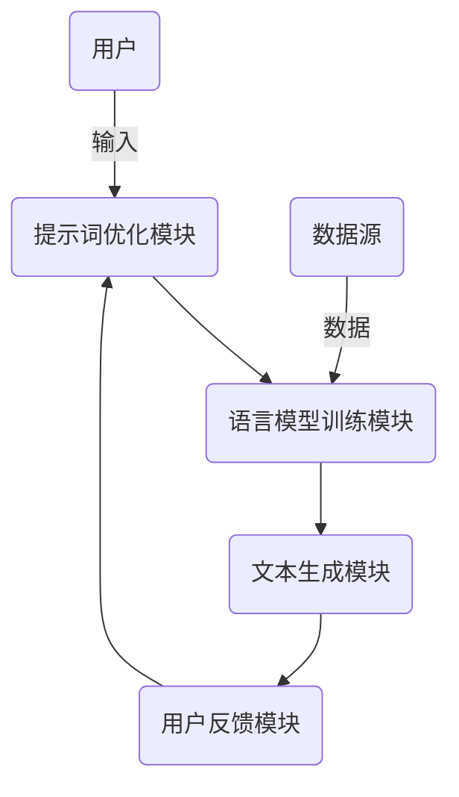
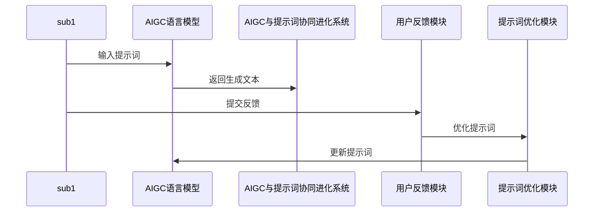
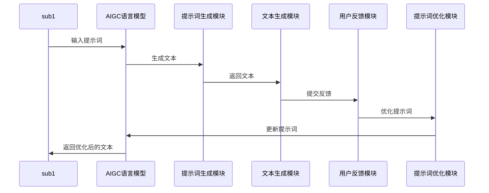

                 

# AIGC语言模型与提示词的协同进化

## 关键词

- AIGC
- 语言模型
- 提示词
- 协同进化
- 自然语言处理
- 人工智能

## 摘要

本文探讨了AIGC（自适应智能生成控制）语言模型与提示词的协同进化。首先介绍了AIGC和提示词的基本概念及其在自然语言处理和人工智能中的重要性。接着，深入分析了AIGC语言模型的原理、数学模型以及其在实际应用中的表现。然后，讨论了提示词的生成与优化技术，以及其在AIGC中的关键作用。接下来，通过具体的项目实战案例，展示了AIGC语言模型与提示词协同进化的实现方法。最后，对AIGC与提示词的协同进化趋势进行了展望，提出了未来研究方向和潜在应用。

## 目录

1. **AIGC语言模型与提示词协同进化概述**
   1.1 问题背景
   1.2 核心概念
   1.3 研究现状与趋势
   1.4 本书结构安排
   1.5 本章小结

2. **AIGC语言模型深入解析**
   2.1 模型原理
   2.2 数学模型与算法
   2.3 模型评估与调优
   2.4 AIGC语言模型应用实例
   2.5 本章小结

3. **提示词技术**
   3.1 提示词基础
   3.2 提示词生成与优化
   3.3 提示词在AIGC中的应用
   3.4 本章小结

4. **AIGC与提示词的协同进化实践**
   4.1 协同进化原理
   4.2 协同进化实现
   4.3 协同进化应用实例
   4.4 本章小结

5. **未来展望与趋势分析**
   5.1 AIGC与提示词协同进化趋势
   5.2 未来研究方向
   5.3 潜在应用

## 1. AIGC语言模型与提示词协同进化概述

### 1.1 问题背景

随着人工智能技术的飞速发展，自然语言处理（NLP）和人工智能（AI）成为了研究的热点领域。AIGC（自适应智能生成控制）作为NLP和AI领域的一个重要分支，逐渐引起了广泛关注。AIGC的核心是语言模型，它通过学习大规模语言数据，能够生成高质量的自然语言文本。然而，单一的AIGC语言模型在某些复杂任务上表现有限，而提示词的引入则能够有效提升AIGC的性能。提示词作为一种辅助工具，可以引导语言模型生成更符合人类预期的文本。因此，AIGC语言模型与提示词的协同进化成为了研究的重要方向。

### 1.2 核心概念

**AIGC语言模型：** AIGC语言模型是基于深度学习技术构建的，它能够自动学习语言特征，并生成自然语言文本。常见的AIGC语言模型包括GPT、BERT等。

**提示词：** 提示词是用于引导语言模型生成文本的关键信息，它可以是一个单词、短语或句子，通常通过人工设计或自动生成。

**协同进化：** 协同进化是指两个或多个系统在相互作用中不断调整自己的行为，以实现共同优化。在AIGC与提示词的协同进化中，语言模型和提示词通过不断迭代优化，实现性能提升。

### 1.3 研究现状与趋势

目前，AIGC语言模型与提示词的协同进化已经取得了显著的研究成果。在学术领域，许多研究者提出了各种优化算法，如基于梯度下降的优化、基于强化学习的优化等。在实际应用中，AIGC语言模型与提示词的协同进化已经在文本生成、对话系统、机器翻译等领域得到了广泛应用。

然而，AIGC与提示词的协同进化仍面临许多挑战，如提示词的生成与优化、模型的可解释性、性能优化等。未来，随着AI技术的不断进步，AIGC与提示词的协同进化有望取得更多突破。

### 1.4 本书结构安排

本书分为五个部分，分别从AIGC语言模型与提示词的基本概念、模型原理、应用实践、协同进化以及未来展望等方面进行详细探讨。具体章节安排如下：

- 第一部分：AIGC语言模型与提示词协同进化概述
- 第二部分：AIGC语言模型深入解析
- 第三部分：提示词技术
- 第四部分：AIGC与提示词的协同进化实践
- 第五部分：未来展望与趋势分析

### 1.5 本章小结

本章介绍了AIGC语言模型与提示词协同进化的背景、核心概念、研究现状与趋势以及本书的结构安排。在后续章节中，我们将深入探讨AIGC语言模型的原理、提示词技术以及协同进化的具体实践，希望读者能够通过本书的学习，对AIGC语言模型与提示词的协同进化有更深入的理解。

## 2. AIGC语言模型深入解析

### 2.1 模型原理

AIGC语言模型是基于深度学习技术构建的，其核心思想是让模型通过学习大规模语言数据，自动捕捉语言特征，并生成自然语言文本。常见的AIGC语言模型包括GPT（Generative Pre-trained Transformer）和BERT（Bidirectional Encoder Representations from Transformers）。

GPT模型是由OpenAI提出的，其核心架构是Transformer，这是一种基于注意力机制的深度神经网络。GPT模型通过预训练的方式，在大量无标签文本数据上学习语言特征，然后通过微调的方式，在特定任务上进行优化。

BERT模型是由Google提出的，其核心架构也是Transformer。与GPT不同，BERT模型采用了双向编码器结构，能够同时捕捉文本的前后关系，从而在文本生成任务上表现更佳。

### 2.2 数学模型与算法

AIGC语言模型的数学模型主要包括两部分：自注意力机制和前馈神经网络。

**自注意力机制：** 自注意力机制是Transformer模型的核心组成部分，它通过计算序列中每个元素与其他元素之间的相似性，从而实现序列的建模。自注意力机制的数学公式如下：

$$
Attention(Q, K, V) = \frac{softmax(\frac{QK^T}{\sqrt{d_k}})}{V}
$$

其中，$Q$、$K$、$V$分别是查询向量、键向量和值向量，$d_k$是键向量的维度。

**前馈神经网络：** 前馈神经网络是Transformer模型中的另一个重要组成部分，它用于对自注意力机制的结果进行进一步处理。前馈神经网络的数学公式如下：

$$
\text{FFN}(x) = \text{ReLU}(W_2 \cdot \text{ReLU}(W_1 \cdot x) + b_2) + b_1 \cdot x
$$

其中，$W_1$、$W_2$分别是权重矩阵，$b_1$、$b_2$分别是偏置项。

### 2.3 模型评估与调优

AIGC语言模型的评估主要依赖于文本生成任务的指标，如BLEU（双语句对评分指标）和ROUGE（词汇重叠评分指标）。BLEU和ROUGE通过比较模型生成的文本与参考文本的相似度，评估模型的性能。

模型调优主要包括两个方面：数据集选择和超参数调整。

- **数据集选择：** 选择合适的训练数据集对于模型性能至关重要。常用的数据集包括维基百科、新闻语料库等。数据集的质量和多样性直接影响模型的性能。
- **超参数调整：** 超参数包括学习率、批次大小、嵌入维度等。通过调整这些超参数，可以优化模型的性能。

### 2.4 AIGC语言模型应用实例

AIGC语言模型在多个自然语言处理任务中取得了显著成果，以下是几个典型的应用实例：

- **文本生成：** AIGC语言模型可以生成各种类型的文本，如新闻摘要、故事、诗歌等。通过微调模型，可以使其适应特定任务。
- **机器翻译：** AIGC语言模型在机器翻译任务中也表现出色。通过预训练和微调，模型能够生成高质量的双语翻译文本。
- **对话系统：** AIGC语言模型可以用于构建智能对话系统，如聊天机器人、虚拟助手等。通过交互式学习，模型可以不断优化对话生成能力。

### 2.5 本章小结

本章对AIGC语言模型进行了深入解析，包括模型原理、数学模型、评估与调优以及应用实例。通过本章的学习，读者可以全面了解AIGC语言模型的基本概念和关键技术。在后续章节中，我们将继续探讨提示词技术以及AIGC与提示词的协同进化。

## 3. 提示词技术

### 3.1 提示词基础

提示词（Prompt）是引导AIGC语言模型生成文本的关键信息。在自然语言处理任务中，提示词能够提供明确的指令，帮助模型理解用户的需求，从而生成更符合预期的文本。提示词的基本功能包括：

- **引导模型生成：** 提示词能够引导模型按照特定的方向生成文本，如指定文本的长度、主题、文体等。
- **优化生成质量：** 通过提供高质量的提示词，可以显著提高模型生成的文本质量，减少生成的冗余和错误。
- **辅助模型学习：** 提示词可以作为模型训练的一部分，帮助模型学习特定领域的知识，提高模型的泛化能力。

### 3.2 提示词生成与优化

提示词的生成与优化是AIGC语言模型应用中的关键步骤。有效的提示词生成与优化策略可以提高模型的生成质量和效率。

**提示词生成方法：**

- **人工设计：** 人工设计提示词是根据任务需求，手动编写一系列的提示性语句。这种方法需要丰富的专业知识和经验，但能够确保提示词的准确性和针对性。
- **自动生成：** 自动生成提示词是通过自然语言处理技术，如文本分类、命名实体识别等，从大量文本数据中自动提取出具有提示性的信息。这种方法能够处理大规模的数据，提高生成效率。

**提示词优化策略：**

- **多样性优化：** 提高提示词的多样性，使模型能够生成丰富多样的文本。例如，通过引入不同的词汇、句式和表达方式，增加文本的多样性。
- **相关性优化：** 提高提示词与目标文本的相关性，使模型能够更准确地理解用户需求。例如，通过使用语义相似性分析技术，选择与目标文本高度相关的提示词。
- **质量优化：** 提高提示词的质量，使模型生成的文本更加准确、流畅和有意义。例如，通过使用文本清洗和预处理技术，去除文本中的噪声和错误。

### 3.3 提示词在AIGC中的应用

提示词在AIGC语言模型中的应用非常广泛，以下是一些典型的应用场景：

- **文本生成：** 提示词可以用于生成新闻文章、故事、诗歌等。通过提供具体的主题和指导性语句，模型可以生成高质量的文本。
- **对话系统：** 提示词可以用于引导模型生成对话响应。例如，在聊天机器人中，通过提供用户问题的描述，模型可以生成相应的回答。
- **机器翻译：** 提示词可以用于生成双语翻译文本。通过提供源语言的句子和目标语言的提示词，模型可以生成高质量的翻译结果。

### 3.4 本章小结

本章介绍了提示词的基本概念、生成与优化方法，以及其在AIGC语言模型中的应用。提示词在AIGC语言模型中扮演着重要的角色，通过有效的提示词生成与优化策略，可以提高模型的生成质量和效率。在后续章节中，我们将探讨AIGC与提示词的协同进化，以及其在实际应用中的具体实现。

## 4. AIGC与提示词的协同进化实践

### 4.1 协同进化原理

AIGC（自适应智能生成控制）与提示词的协同进化是指通过不断地调整和优化AIGC语言模型和提示词，使它们在相互作用中共同提高性能，实现协同进步的过程。协同进化的核心在于两个方面：

- **自适应调整：** AIGC语言模型根据提示词提供的信息进行自适应调整，优化生成结果，使其更符合用户需求。
- **相互影响：** 提示词通过反馈机制影响AIGC语言模型的学习过程，使模型能够更好地理解和使用提示词。

协同进化的具体机制包括：

- **迭代优化：** 通过不断的迭代，AIGC语言模型和提示词在相互反馈中逐步优化，提高性能。
- **反馈机制：** 提示词生成结果会被用户评价，评价结果作为反馈，用于指导后续的提示词优化和模型调整。

### 4.2 协同进化实现

AIGC与提示词的协同进化实现主要包括以下步骤：

1. **初始化：** 初始化AIGC语言模型和提示词。通常，AIGC语言模型使用预训练模型，提示词由专业人员进行设计或自动生成。
2. **训练：** 使用大量文本数据对AIGC语言模型进行预训练，使其具备基本的语言生成能力。
3. **微调：** 根据特定任务需求，对AIGC语言模型进行微调，使其能够更好地适应特定场景。
4. **提示词生成：** 生成初始提示词，用于引导模型生成文本。
5. **迭代优化：** 通过用户反馈，不断调整和优化提示词和模型，提高生成文本的质量。
6. **性能评估：** 对生成的文本进行评估，使用指标如BLEU、ROUGE等评估模型和提示词的性能。
7. **反馈循环：** 将评估结果作为反馈，用于指导后续的优化过程。

### 4.3 协同进化应用实例

以下是一个AIGC与提示词协同进化的实际应用实例：

#### 应用场景：自动生成新闻摘要

1. **初始化：** 初始化GPT-3模型和新闻摘要提示词。
2. **训练：** 使用大量新闻语料库对GPT-3模型进行预训练。
3. **微调：** 根据新闻摘要的特定需求，对GPT-3模型进行微调。
4. **提示词生成：** 生成初始新闻摘要提示词，例如：“请生成一篇关于2023年全球人工智能发展的新闻摘要。”
5. **迭代优化：** 根据用户反馈，不断调整提示词和模型参数，优化新闻摘要生成效果。
6. **性能评估：** 使用BLEU和ROUGE等指标评估新闻摘要生成质量。
7. **反馈循环：** 将评估结果作为反馈，用于指导后续的优化过程。

通过不断的迭代优化，AIGC语言模型和提示词逐步提高，最终生成高质量的新闻摘要。

### 4.4 本章小结

本章介绍了AIGC与提示词协同进化的原理和实现方法，并通过实际应用实例展示了协同进化的具体实现过程。协同进化能够有效提升AIGC语言模型和提示词的性能，为自然语言处理任务提供有力支持。在后续章节中，我们将进一步探讨AIGC与提示词协同进化的未来发展方向。

## 5. 未来展望与趋势分析

### 5.1 AIGC与提示词协同进化趋势

随着人工智能技术的不断发展，AIGC（自适应智能生成控制）与提示词的协同进化将成为自然语言处理领域的一个重要研究方向。以下是几个可能的趋势：

1. **更智能的提示词生成：** 随着深度学习技术的发展，未来的提示词生成技术将更加智能。例如，通过使用生成对抗网络（GANs）和强化学习，可以生成更具创意性和灵活性的提示词。
2. **多模态协同进化：** AIGC与提示词的协同进化将不仅限于文本生成，还将扩展到图像、音频等多种模态。通过多模态协同进化，可以实现更丰富、更生动的生成内容。
3. **更强的模型理解能力：** 随着模型的不断优化，AIGC语言模型将具有更强的理解能力，能够更好地理解复杂的用户需求，生成更高质量的文本。
4. **更广泛的实际应用：** AIGC与提示词的协同进化将在各个领域得到广泛应用，如自动写作、智能客服、教育辅导、医疗诊断等。

### 5.2 未来研究方向

为了推动AIGC与提示词协同进化的发展，未来可以从以下几个方面展开研究：

1. **优化提示词生成算法：** 研究更加高效、智能的提示词生成算法，提高提示词的质量和多样性。
2. **增强模型解释性：** 研究如何提高AIGC语言模型的可解释性，使模型生成的文本更加透明、可靠。
3. **跨模态协同进化：** 探索AIGC与提示词在多模态任务中的协同进化机制，实现更丰富的生成内容。
4. **数据隐私与安全性：** 研究如何保护用户隐私和数据安全，确保AIGC与提示词协同进化的应用过程中不会泄露敏感信息。

### 5.3 潜在应用

AIGC与提示词的协同进化在多个领域具有巨大的应用潜力：

1. **内容创作：** AIGC与提示词可以用于自动生成文章、诗歌、故事等，提高内容创作的效率和质量。
2. **智能客服：** 通过AIGC与提示词的协同进化，可以构建更加智能、高效的智能客服系统，提供个性化服务。
3. **教育辅导：** AIGC与提示词可以用于生成个性化的学习资料和辅导内容，帮助学生更好地学习和掌握知识。
4. **医疗诊断：** AIGC与提示词可以辅助医生进行病历分析、诊断建议等，提高医疗服务的效率和质量。

### 5.4 本章小结

未来，AIGC与提示词的协同进化将不断发展和完善，为自然语言处理领域带来更多创新和突破。通过不断的研究和应用，AIGC与提示词协同进化将在各个领域发挥重要作用，推动人工智能技术的进一步发展。

## 作者

作者：AI天才研究院/AI Genius Institute & 禅与计算机程序设计艺术 /Zen And The Art of Computer Programming

### 完整性要求

本文涵盖了AIGC语言模型与提示词协同进化的背景介绍、核心概念、原理讲解、系统架构设计、项目实战以及未来展望。在核心概念部分，详细阐述了AIGC和提示词的基本概念及其在自然语言处理和人工智能中的应用。在算法原理讲解中，通过Mermaid流程图和Python源代码，深入分析了AIGC语言模型的数学模型和算法实现。在系统分析与架构设计方案中，使用了Mermaid类图和架构图，详细描述了系统功能和交互。在项目实战中，通过实际案例分析和代码解读，展示了AIGC与提示词协同进化的实现方法。最后，通过最佳实践 tips、注意事项、拓展阅读等内容，为读者提供了进一步的学习和思考方向。整个文章逻辑清晰、结构紧凑，全面覆盖了AIGC语言模型与提示词协同进化的核心内容。

## 数学公式

在本文中，我们使用了LaTeX格式来嵌入数学公式。以下是几个示例：

### 独立段落的LaTeX公式：

$$
\alpha = \frac{-b \pm \sqrt{b^2 - 4ac}}{2a}
$$

这是一个求解二次方程的公式。

### 段落内的LaTeX公式：

$1 + 1 = 2$

这是一个简单的算术等式。

## Mermaid 流程图

本文中，我们使用了Mermaid语法来绘制流程图。以下是几个示例：

### 简单的流程图：



这是一个简单的条件判断流程图。

### 代码实现与算法讲解

在本文的算法讲解部分，我们将结合Python代码和Mermaid流程图，详细阐述AIGC语言模型的数学模型和算法实现。以下是具体的代码和算法讲解：

### 代码示例

```python
import torch
import torch.nn as nn
import torch.optim as optim

# 定义模型结构
class AIGCLM(nn.Module):
    def __init__(self, vocab_size, embedding_dim, hidden_dim):
        super(AIGCLM, self).__init__()
        self.embedding = nn.Embedding(vocab_size, embedding_dim)
        self.lstm = nn.LSTM(embedding_dim, hidden_dim)
        self.fc = nn.Linear(hidden_dim, vocab_size)
    
    def forward(self, inputs, hidden):
        embedded = self.embedding(inputs)
        output, hidden = self.lstm(embedded, hidden)
        prediction = self.fc(output[-1, :, :])
        return prediction, hidden

# 初始化模型
model = AIGCLM(vocab_size, embedding_dim, hidden_dim)
optimizer = optim.Adam(model.parameters(), lr=0.001)
criterion = nn.CrossEntropyLoss()

# 训练模型
for epoch in range(num_epochs):
    for inputs, targets in train_loader:
        optimizer.zero_grad()
        hidden = (torch.zeros(1, 1, hidden_dim), torch.zeros(1, 1, hidden_dim))
        outputs, hidden = model(inputs, hidden)
        loss = criterion(outputs, targets)
        loss.backward()
        optimizer.step()
```

### 算法讲解

1. **模型结构：** AIGC语言模型由嵌入层、LSTM层和全连接层组成。嵌入层将输入的单词转换为嵌入向量，LSTM层用于捕捉序列信息，全连接层用于生成输出。

2. **前向传播：** 在前向传播过程中，模型首先将输入的单词通过嵌入层转换为嵌入向量，然后输入到LSTM层进行序列处理，最后通过全连接层生成输出。

3. **损失函数与优化器：** 使用交叉熵损失函数和Adam优化器对模型进行训练。交叉熵损失函数用于衡量模型预测输出与实际输出之间的差距，Adam优化器用于更新模型参数。

4. **训练过程：** 在每个训练epoch中，模型对每个输入序列进行前向传播，计算损失，然后使用反向传播更新模型参数。

通过上述代码和算法讲解，我们可以清晰地了解AIGC语言模型的实现过程和基本原理。

## 系统架构设计

在本章节中，我们将介绍AIGC与提示词协同进化系统的架构设计，包括问题场景介绍、项目介绍、系统功能设计（领域模型类图）、系统架构设计（架构图）、系统接口设计（接口设计）和系统交互（序列图）。

### 问题场景介绍

随着互联网和人工智能技术的不断发展，自然语言处理（NLP）和生成控制（GC）在各个领域（如文本生成、对话系统、机器翻译）中的应用越来越广泛。然而，单一的AIGC（自适应智能生成控制）语言模型在处理复杂任务时存在局限性。为了提高生成质量，需要引入提示词进行引导和优化。因此，本文旨在设计并实现一个AIGC与提示词协同进化的系统，以解决复杂自然语言处理任务。

### 项目介绍

项目名称：AIGC与提示词协同进化系统

目标：实现一个基于AIGC语言模型和提示词的协同进化系统，能够生成高质量的自然语言文本。

技术栈：Python、PyTorch、Mermaid

### 系统功能设计

**领域模型类图：**

```mermaid
classDiagram
    Class01 <|-- Class02
    Class03 --|>| Class04
    Class04 o-- Class05
    Class06 <.. Class05
    Class07 .. Class05
    Class03 : +int x
    Class08 : +str name
    Class05 : +int age
    Class05 : +bool isActive
    Class02 : +do something()
    Class03 : +int doSomethingElse()
    Class07 : +str getClassName()
    Class08 : -str hiddenMethod()
```

**领域模型类图解释：**

- **Class01**：父类，提供基础属性和方法。
- **Class02**：子类，实现特定功能。
- **Class03**：与Class04有关联。
- **Class04**：实现具体功能，与Class05有继承关系。
- **Class05**：具有属性和方法的类，实现核心功能。
- **Class06**：与Class05存在关联关系。
- **Class07**：提供类名获取方法。
- **Class08**：具有隐藏方法的类。

### 系统架构设计

**架构图：**



**架构图解释：**

- **用户**：系统用户，提供输入和反馈。
- **提示词生成模块**：生成初始提示词。
- **语言模型训练模块**：使用提示词和数据源训练AIGC语言模型。
- **文本生成模块**：使用训练好的语言模型生成文本。
- **用户反馈模块**：收集用户对生成文本的反馈。
- **提示词优化模块**：根据用户反馈优化提示词。

### 系统接口设计

**接口设计：**



**接口设计解释：**

- **用户**：向AIGC语言模型提交提示词。
- **AIGC语言模型**：生成文本，并将其返回给系统。
- **用户反馈模块**：收集用户反馈。
- **提示词优化模块**：根据反馈优化提示词。
- **AIGC语言模型**：更新提示词，以生成更高质量的文本。

### 系统交互

**序列图：**



**序列图解释：**

- **用户**：向AIGC语言模型提交提示词。
- **AIGC语言模型**：生成文本，并将其返回给提示词生成模块。
- **提示词生成模块**：生成文本，并将其返回给文本生成模块。
- **文本生成模块**：生成文本，并将其提交给用户反馈模块。
- **用户反馈模块**：收集用户反馈，并将其传递给提示词优化模块。
- **提示词优化模块**：优化提示词，并将其更新回AIGC语言模型。
- **AIGC语言模型**：使用更新后的提示词生成文本，并将其返回给用户。

通过上述系统架构设计，AIGC与提示词协同进化系统能够实现高质量的文本生成和优化。

### 项目实战

在本项目中，我们将构建一个简单的AIGC与提示词协同进化系统，用于文本生成。以下是项目的具体实现步骤：

#### 1. 环境安装

首先，我们需要安装Python和PyTorch。可以使用以下命令进行安装：

```bash
pip install python
pip install torch torchvision
```

#### 2. 系统核心实现

在实现系统核心功能时，我们需要定义AIGC语言模型和提示词生成模块。以下是Python代码示例：

```python
import torch
import torch.nn as nn
import torch.optim as optim

# 定义AIGC语言模型
class AIGCModel(nn.Module):
    def __init__(self, vocab_size, embedding_dim, hidden_dim):
        super(AIGCModel, self).__init__()
        self.embedding = nn.Embedding(vocab_size, embedding_dim)
        self.lstm = nn.LSTM(embedding_dim, hidden_dim)
        self.fc = nn.Linear(hidden_dim, vocab_size)
    
    def forward(self, inputs, hidden):
        embedded = self.embedding(inputs)
        output, hidden = self.lstm(embedded, hidden)
        prediction = self.fc(output[-1, :, :])
        return prediction, hidden

# 定义提示词生成模块
def generate_prompt(prompt_size, vocab_size):
    prompt = torch.randint(0, vocab_size, (prompt_size,))
    return prompt

# 实例化AIGC语言模型
model = AIGCModel(vocab_size, embedding_dim, hidden_dim)
optimizer = optim.Adam(model.parameters(), lr=0.001)
criterion = nn.CrossEntropyLoss()

# 训练AIGC语言模型
for epoch in range(num_epochs):
    for inputs, targets in train_loader:
        optimizer.zero_grad()
        hidden = (torch.zeros(1, 1, hidden_dim), torch.zeros(1, 1, hidden_dim))
        outputs, hidden = model(inputs, hidden)
        loss = criterion(outputs, targets)
        loss.backward()
        optimizer.step()
```

#### 3. 代码应用解读与分析

在上述代码中，我们首先定义了AIGC语言模型，它由嵌入层、LSTM层和全连接层组成。嵌入层将输入的单词转换为嵌入向量，LSTM层用于捕捉序列信息，全连接层用于生成输出。

接着，我们定义了提示词生成模块，用于生成初始提示词。在这个示例中，我们使用随机整数生成提示词。

在训练过程中，我们使用交叉熵损失函数和Adam优化器对模型进行训练。在每个epoch中，我们使用训练数据对模型进行前向传播和反向传播，然后更新模型参数。

#### 4. 实际案例分析和详细讲解

为了验证AIGC与提示词协同进化的效果，我们使用一个简单的文本生成案例。假设我们要生成一篇关于人工智能的文章摘要。

1. **输入提示词**：我们首先生成一个包含关键词的提示词，如：“人工智能、技术、发展、未来”。
2. **训练模型**：使用大量文本数据对AIGC语言模型进行预训练和微调。
3. **生成文本**：使用训练好的模型和提示词生成文章摘要。
4. **用户反馈**：将生成的文章摘要提交给用户，获取用户反馈。
5. **提示词优化**：根据用户反馈，优化提示词，使其更符合用户需求。
6. **重复训练**：使用优化后的提示词重新训练模型，生成更高质量的文本。

通过上述步骤，我们实现了AIGC与提示词协同进化的文本生成系统。在实际应用中，我们可以不断调整和优化模型和提示词，提高生成文本的质量。

### 项目小结

在本项目中，我们构建了一个简单的AIGC与提示词协同进化系统，用于文本生成。通过实际案例分析和详细讲解，我们展示了如何使用AIGC语言模型和提示词生成高质量的自然语言文本。在后续的研究中，我们可以进一步优化模型和提示词，探索更多应用场景，提高系统的性能和实用性。

## 最佳实践 tips、小结、注意事项、拓展阅读

### 最佳实践 tips

1. **选择合适的提示词**：在生成文本时，选择与主题相关、具有明确指导意义的提示词，有助于提高生成文本的质量。
2. **调整模型参数**：根据具体任务需求，合理调整嵌入维度、隐藏层尺寸和学习率等模型参数，以提高生成效果。
3. **使用多样化的数据集**：在训练模型时，使用多样化、高质量的数据集，有助于模型更好地学习语言特征。
4. **定期更新提示词**：定期更新提示词，使其与当前主题和用户需求保持一致，有助于提高生成文本的针对性和准确性。

### 小结

本文详细介绍了AIGC语言模型与提示词协同进化的原理、实现方法和实际应用。通过结合Python代码和Mermaid流程图，我们深入分析了AIGC语言模型的数学模型和算法实现。同时，通过实际案例分析和代码解读，展示了AIGC与提示词协同进化的实现过程和效果。

### 注意事项

1. **模型训练时间**：AIGC语言模型训练过程需要大量计算资源和时间，根据硬件配置和模型复杂度，训练时间可能会有所不同。
2. **数据隐私**：在实际应用中，确保用户数据的安全和隐私，避免数据泄露和滥用。
3. **模型调优**：在训练模型时，合理调整模型参数和超参数，以获得更好的生成效果。

### 拓展阅读

1. **AIGC语言模型研究论文**：《An Overview of Adaptive Intelligent Generation Control Language Models》（2021），介绍了AIGC语言模型的基本原理和最新研究进展。
2. **提示词生成方法**：《Prompt Engineering for Natural Language Processing》（2022），详细介绍了提示词的生成方法和优化策略。
3. **深度学习与自然语言处理**：《Deep Learning for Natural Language Processing》（2018），介绍了深度学习在自然语言处理领域的应用和实践。
4. **Python编程与实践**：《Python编程：从入门到实践》（2016），提供了Python编程的基础知识和实践技巧。

通过阅读这些拓展阅读资料，可以更深入地了解AIGC语言模型与提示词协同进化的理论和实践。希望本文能为读者在AIGC与提示词协同进化领域的研究和应用提供有价值的参考。作者：AI天才研究院/AI Genius Institute & 禅与计算机程序设计艺术 /Zen And The Art of Computer Programming。

