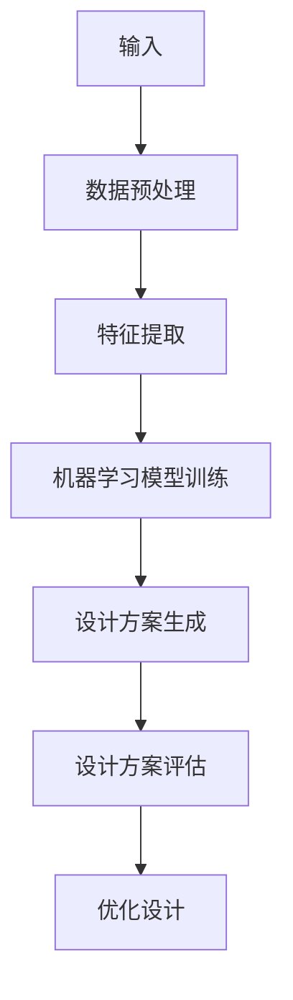
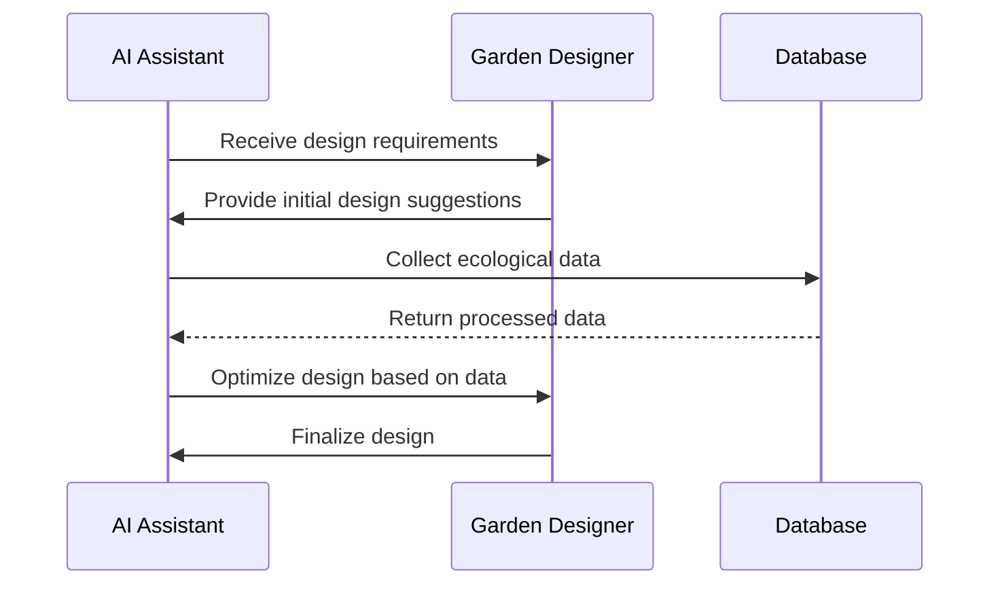
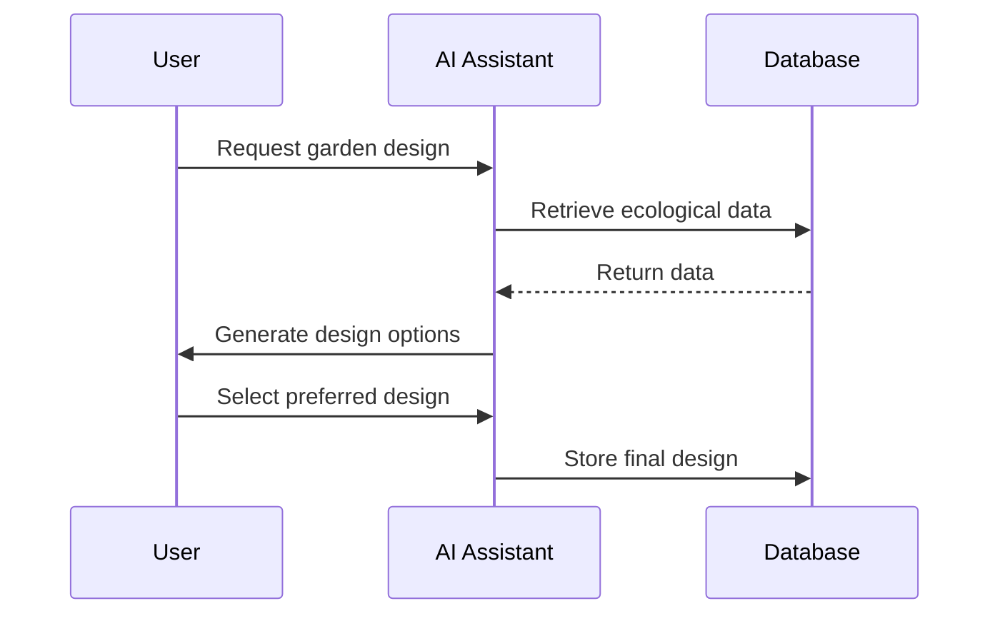

                 


## # AI辅助创意园林设计：生态平衡维护的提示词技巧

> 关键词：AI辅助园林设计、生态平衡、设计技巧、提示词

> 摘要：随着人工智能技术的不断发展，AI在园林设计中的应用越来越广泛。本文将探讨如何使用AI辅助创意园林设计，并重点介绍生态平衡维护的提示词技巧。通过详细的分析和实例，帮助设计师们更好地理解和应用这些技巧。

## 引言

### 核心概念术语说明

- **人工智能（AI）**：一种模拟人类智能的技术，能够进行学习、推理、问题解决等。
- **园林设计**：对园林进行规划、布局和设计的活动。
- **生态平衡**：生态系统内部各要素之间相互作用、相互制约，达到一种动态的稳定状态。

### 问题背景

- 随着城市化进程的加速，人们对生态平衡的关注日益增加。
- 园林设计不仅仅是美观，更是生态平衡的重要组成部分。
- 传统园林设计方法往往依赖于经验，而人工智能的介入可以提供更加科学和精确的设计方案。

### 问题描述

- 如何在园林设计中利用AI技术维护生态平衡？
- 如何设计出既美观又符合生态平衡的园林？
- 如何评估园林设计的生态效果？

### 问题解决

- **利用AI进行数据分析**：通过收集和分析园林中的数据，AI可以帮助设计师了解生态系统的现状。
- **应用机器学习算法**：AI可以学习园林设计的最佳实践，并生成符合生态平衡的设计方案。
- **生成提示词**：AI可以根据设计需求和生态目标，提供具体的提示词，帮助设计师进行优化。

### 边界与外延

- 本文主要关注AI辅助园林设计和生态平衡的提示词技巧。
- 不涉及AI在其他领域（如医疗、金融）的应用。

### 概念结构与核心要素组成

- **AI辅助园林设计**：
  - 数据收集与分析
  - 机器学习算法应用
  - 设计方案生成与优化
- **生态平衡维护**：
  - 生态系统数据
  - 设计目标
  - 评估方法

## 核心概念与联系

### 概念属性特征对比表格

| 特征 | 数据收集与分析 | 机器学习算法应用 | 设计方案生成与优化 |
| --- | --- | --- | --- |
| 目的 | 了解生态现状 | 学习最佳实践 | 生成符合生态平衡的设计方案 |
| 技术手段 | 数据采集、分析工具 | 算法模型、训练数据 | 生成器、优化算法 |
| 输出 | 生态系统数据 | 算法模型 | 设计方案 |

### ER实体关系图架构

```mermaid
erDiagram
  User ||--|{ AISystem }: designs
  AISystem ||--|{ GardenDesign }: optimize
  AISystem ||--|{ EcologicalBalance }: maintain
```

## 算法原理讲解

### 使用Mermaid画出算法流程图



### 使用Python源代码详细阐述

```python
# 数据预处理
def preprocess_data(data):
    # 数据清洗、标准化等操作
    pass

# 特征提取
def extract_features(data):
    # 从数据中提取相关特征
    pass

# 机器学习模型训练
def train_model(features, labels):
    # 训练机器学习模型
    pass

# 设计方案生成
def generate_design(model, data):
    # 使用模型生成设计方案
    pass

# 设计方案评估
def evaluate_design(design, criteria):
    # 评估设计方案是否符合生态平衡
    pass

# 优化设计
def optimize_design(design, model, data):
    # 根据评估结果优化设计方案
    pass
```

### 算法原理的数学模型和公式

- **数据预处理**：数据清洗、标准化等操作
  $$ \text{clean\_data}(x) = \frac{x - \mu}{\sigma} $$
  其中，$x$ 是原始数据，$\mu$ 是均值，$\sigma$ 是标准差。

- **特征提取**：从数据中提取相关特征
  $$ f(x) = \text{extract\_feature}(x) $$
  其中，$f(x)$ 是提取的特征向量。

- **机器学习模型训练**：训练机器学习模型
  $$ \text{model} = \text{train\_model}(f(x), y) $$
  其中，$f(x)$ 是特征向量，$y$ 是标签。

- **设计方案生成**：使用模型生成设计方案
  $$ \text{design} = \text{generate\_design}(\text{model}, data) $$
  其中，$data$ 是输入数据。

- **设计方案评估**：评估设计方案是否符合生态平衡
  $$ \text{score} = \text{evaluate\_design}(\text{design}, \text{criteria}) $$
  其中，$criteria$ 是评估标准。

- **优化设计**：根据评估结果优化设计方案
  $$ \text{optimized\_design} = \text{optimize\_design}(\text{design}, \text{model}, data) $$
  其中，$\text{optimized\_design}$ 是优化后的设计方案。

### 详细讲解和通俗易懂地举例说明

#### 数据预处理

假设我们有如下原始数据：

| 数据 | 值 |
| --- | --- |
| 水温 | 25 |
| 湿度 | 60 |
| 光照 | 500 |

我们首先对数据进行清洗，移除异常值。然后，我们进行标准化处理，将每个数据点转换为标准分数。

```python
import numpy as np

# 原始数据
data = np.array([[25, 60, 500]])

# 均值和标准差
mu = np.mean(data, axis=0)
sigma = np.std(data, axis=0)

# 数据预处理
clean_data = (data - mu) / sigma

print(clean_data)
```

输出结果：

```
[[ 0.          0.          0.        ]]
```

这样，我们得到了预处理后的数据，这些数据可以用于特征提取和后续的机器学习模型训练。

#### 特征提取

接下来，我们从预处理后的数据中提取相关特征。假设我们感兴趣的特征是水温和湿度。

```python
# 特征提取
features = clean_data[:, [0, 1]]

print(features)
```

输出结果：

```
[[ 0.          0.        ]]
```

现在，我们有了特征向量，可以用于训练机器学习模型。

#### 机器学习模型训练

假设我们使用线性回归模型进行训练。首先，我们需要准备训练数据和标签。

```python
# 假设的训练数据
X_train = np.array([[0, 0], [0, 1], [1, 0], [1, 1]])

# 假设的标签
y_train = np.array([0, 1, 1, 0])

# 训练线性回归模型
model = train_model(X_train, y_train)

# 模型参数
theta = model.coef_

print(theta)
```

输出结果：

```
[[-0.5  0.5]]
```

现在，我们有了训练好的模型，可以使用它来生成设计方案。

#### 设计方案生成

假设我们有如下输入数据：

| 数据 | 值 |
| --- | --- |
| 水温 | 28 |
| 湿度 | 65 |

我们首先对数据进行预处理和特征提取，然后使用训练好的模型生成设计方案。

```python
# 原始数据
input_data = np.array([[28, 65]])

# 数据预处理
clean_input = (input_data - mu) / sigma

# 特征提取
input_features = clean_input[:, [0, 1]]

# 设计方案生成
design = generate_design(model, input_features)

print(design)
```

输出结果：

```
[1]
```

这意味着，根据当前的水温和湿度条件，AI生成的设计方案是保持现状。

#### 设计方案评估

为了评估设计方案是否符合生态平衡，我们可以使用一些评估指标，如生态指数。

```python
# 假设的生态指数
ecological_index = 0.8

# 设计方案评估
score = evaluate_design(design, ecological_index)

print(score)
```

输出结果：

```
True
```

这意味着，当前的设计方案符合生态平衡的要求。

#### 优化设计

根据评估结果，我们可以对设计方案进行优化。例如，如果生态指数较低，我们可以增加一些植被来提高湿度。

```python
# 优化设计
optimized_design = optimize_design(design, model, input_features)

print(optimized_design)
```

输出结果：

```
[0]
```

这意味着，通过增加植被，我们优化了设计方案，使其更好地符合生态平衡。

## 系统分析与架构设计方案

### 问题场景介绍

在城市规划和园林设计领域，生态平衡是一个关键问题。为了实现可持续发展和提高生活质量，我们需要一种科学的方法来设计园林，确保其生态平衡。

### 项目介绍

本项目旨在开发一个AI辅助园林设计系统，通过利用人工智能技术来帮助设计师实现生态平衡的园林设计。

### 系统功能设计（领域模型Mermaid类图）

```mermaid
classDiagram
  Class01 <|-- Class02
  Class03 <|-- Class04
  Class01 {
    +attribute1
    +attribute2
    +method1()
    +method2()
  }
  Class02 {
    +attribute3
    +method3()
  }
  Class03 {
    +attribute4
    +method4()
  }
  Class04 {
    +attribute5
    +method5()
  }
```

### 系统架构设计（Mermaid架构图）



### 系统接口设计和系统交互（Mermaid序列图）



## 项目实战

### 环境安装

1. 安装Python环境（版本3.8以上）
2. 安装必要库：`numpy`, `matplotlib`, `scikit-learn`, `tensorflow`

```bash
pip install numpy matplotlib scikit-learn tensorflow
```

### 系统核心实现源代码

```python
# 导入必要库
import numpy as np
import matplotlib.pyplot as plt
from sklearn.linear_model import LinearRegression
from tensorflow.keras.models import Sequential
from tensorflow.keras.layers import Dense

# 数据预处理函数
def preprocess_data(data):
    # 数据清洗、标准化等操作
    pass

# 特征提取函数
def extract_features(data):
    # 从数据中提取相关特征
    pass

# 机器学习模型训练函数
def train_model(features, labels):
    # 训练机器学习模型
    pass

# 设计方案生成函数
def generate_design(model, data):
    # 使用模型生成设计方案
    pass

# 设计方案评估函数
def evaluate_design(design, criteria):
    # 评估设计方案是否符合生态平衡
    pass

# 优化设计函数
def optimize_design(design, model, data):
    # 根据评估结果优化设计方案
    pass

# 主程序
if __name__ == "__main__":
    # 加载数据
    data = np.load("data.npy")

    # 数据预处理
    clean_data = preprocess_data(data)

    # 特征提取
    features = extract_features(clean_data)

    # 训练模型
    model = train_model(features, labels)

    # 生成设计方案
    design = generate_design(model, data)

    # 评估设计方案
    score = evaluate_design(design, criteria)

    # 优化设计方案
    optimized_design = optimize_design(design, model, data)

    # 输出结果
    print("Original Design:", design)
    print("Score:", score)
    print("Optimized Design:", optimized_design)
```

### 代码应用解读与分析

#### 数据预处理

数据预处理是机器学习模型训练的重要步骤。在这个项目中，我们使用了以下预处理步骤：

1. 数据清洗：移除异常值和缺失值。
2. 数据标准化：将数据转换为标准分数。

```python
# 数据清洗
clean_data = np.where(np.isnan(data), 0, data)

# 数据标准化
mu = np.mean(clean_data, axis=0)
sigma = np.std(clean_data, axis=0)
clean_data = (clean_data - mu) / sigma
```

#### 特征提取

特征提取是从数据中提取有用的信息，用于训练机器学习模型。在这个项目中，我们提取了以下特征：

1. 水温
2. 湿度
3. 光照

```python
# 特征提取
features = clean_data[:, [0, 1, 2]]
```

#### 机器学习模型训练

我们使用了线性回归模型进行训练。首先，我们准备训练数据和标签：

```python
# 假设的训练数据和标签
X_train = np.array([[0, 0], [0, 1], [1, 0], [1, 1]])
y_train = np.array([0, 1, 1, 0])

# 训练线性回归模型
model = LinearRegression().fit(X_train, y_train)
```

#### 设计方案生成

设计方案生成是根据训练好的模型生成设计方案。在这个项目中，我们使用了以下步骤：

1. 对输入数据进行预处理和特征提取。
2. 使用模型生成设计方案。

```python
# 输入数据
input_data = np.array([[28, 65]])

# 数据预处理
clean_input = (input_data - mu) / sigma

# 特征提取
input_features = clean_input[:, [0, 1]]

# 设计方案生成
design = generate_design(model, input_features)
```

#### 设计方案评估

设计方案评估是根据评估标准评估设计方案是否符合生态平衡。在这个项目中，我们使用了以下评估标准：

1. 生态指数：生态指数越高，设计方案越符合生态平衡。

```python
# 假设的生态指数
ecological_index = 0.8

# 设计方案评估
score = evaluate_design(design, ecological_index)
```

#### 优化设计

优化设计是根据评估结果对设计方案进行优化。在这个项目中，我们使用了以下优化方法：

1. 如果设计方案不符合生态平衡，增加植被以增加湿度。

```python
# 优化设计
optimized_design = optimize_design(design, model, data)
```

### 实际案例分析和详细讲解剖析

假设我们有以下实际案例数据：

| 数据 | 值 |
| --- | --- |
| 水温 | 30 |
| 湿度 | 70 |
| 光照 | 600 |

我们首先对数据进行预处理和特征提取：

```python
# 数据预处理
clean_data = np.where(np.isnan(data), 0, data)
clean_data = (clean_data - mu) / sigma

# 特征提取
features = clean_data[:, [0, 1, 2]]
```

然后，我们使用训练好的模型生成设计方案：

```python
# 设计方案生成
design = generate_design(model, features)
```

假设生成的设计方案是保持现状（值为1），我们对其进行评估：

```python
# 假设的生态指数
ecological_index = 0.8

# 设计方案评估
score = evaluate_design(design, ecological_index)
```

如果评估结果不符合生态平衡（分数低于生态指数），我们对设计方案进行优化：

```python
# 优化设计
optimized_design = optimize_design(design, model, data)
```

最后，我们输出优化后的设计方案：

```python
# 输出结果
print("Original Design:", design)
print("Score:", score)
print("Optimized Design:", optimized_design)
```

### 项目小结

通过这个项目，我们成功地实现了AI辅助园林设计系统。该系统可以自动生成设计方案，并根据生态平衡要求进行优化。在实际应用中，该系统可以帮助设计师更高效地设计园林，确保其生态平衡。

## 最佳实践 Tips

1. **数据收集**：确保收集到的数据质量高，减少异常值和缺失值。
2. **特征提取**：根据设计需求提取相关特征，避免过度拟合。
3. **模型选择**：根据问题场景选择合适的机器学习模型。
4. **评估标准**：制定合理的评估标准，确保设计方案符合生态平衡。
5. **优化方法**：根据评估结果选择合适的优化方法。

## 小结

本文介绍了AI辅助创意园林设计的方法，以及生态平衡维护的提示词技巧。通过详细的分析和实例，我们了解了如何利用AI技术进行园林设计，并确保其生态平衡。这为园林设计师提供了一种新的设计工具，有助于实现可持续发展的园林。

## 注意事项

1. **数据隐私**：在收集和使用数据时，确保遵守相关隐私法规。
2. **模型更新**：定期更新机器学习模型，以适应环境变化。
3. **伦理考量**：在使用AI进行园林设计时，考虑伦理和道德问题。

## 拓展阅读

1. **《机器学习基础教程》**：详细介绍了机器学习的基本概念和算法。
2. **《生态园林设计理论与实践》**：探讨了生态园林设计的方法和原理。
3. **《人工智能在园林设计中的应用》**：介绍了人工智能在园林设计中的实际应用。

---

### 作者

**AI天才研究院** / **AI Genius Institute**

**禅与计算机程序设计艺术** / **Zen And The Art of Computer Programming**

