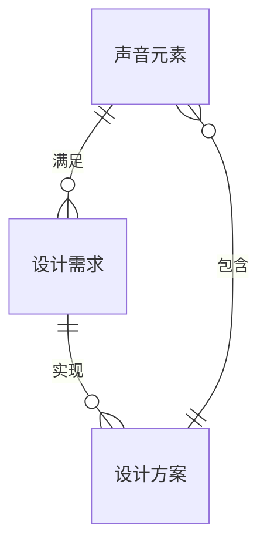
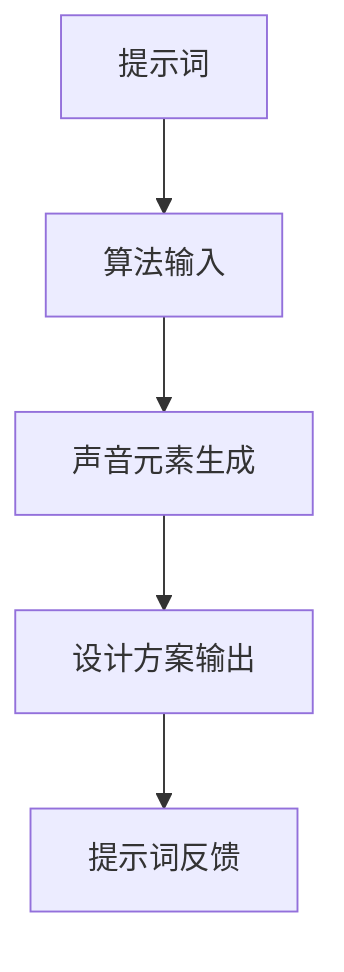
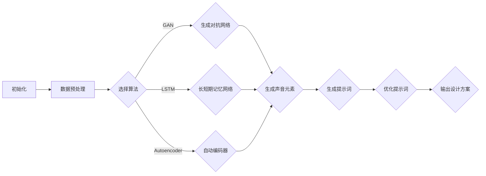
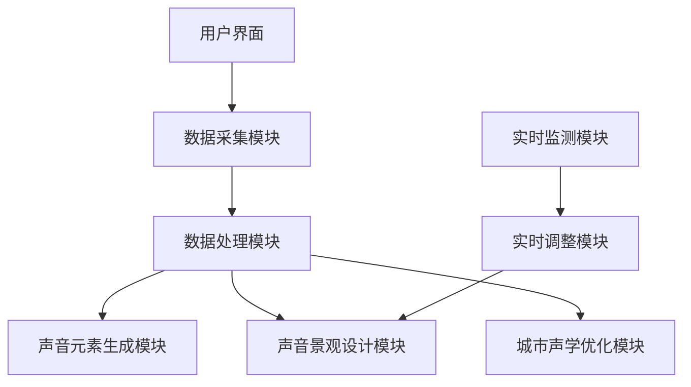
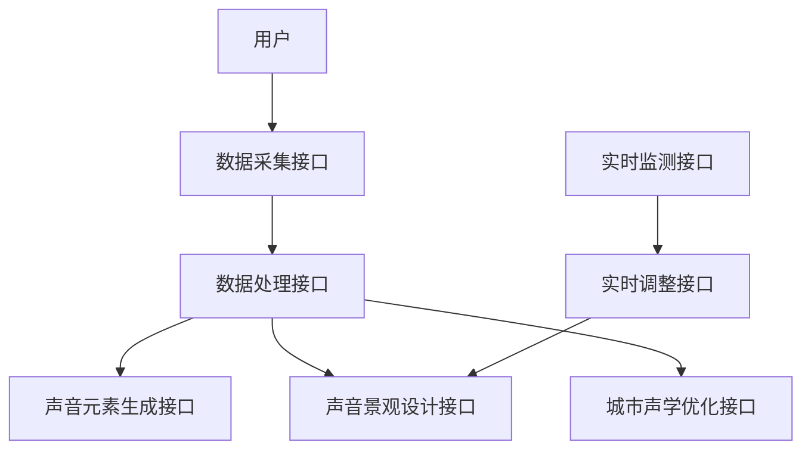
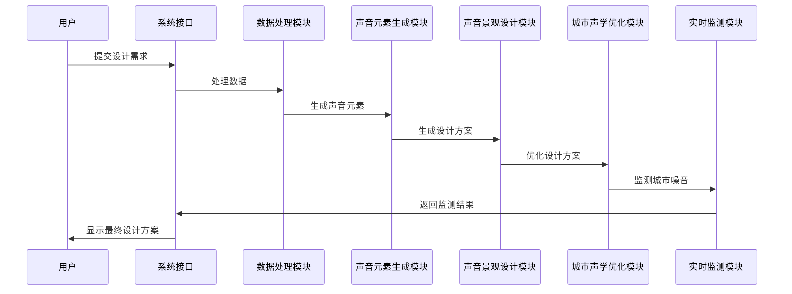
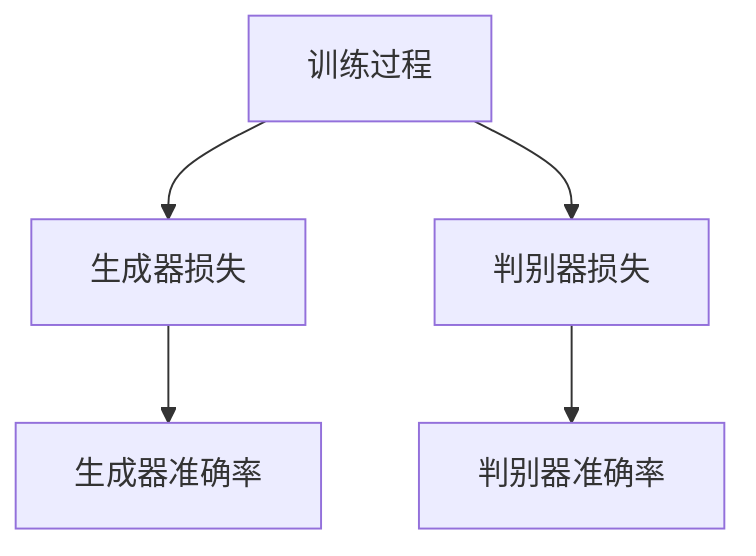

                 

### 文章标题

《AI辅助创意声音景观设计：城市声学优化的提示词技巧》

### 关键词

AI、创意声音景观设计、城市声学优化、提示词技巧、算法原理、系统架构设计、项目实战

### 摘要

本文将探讨如何利用人工智能（AI）技术，特别是提示词技巧，来辅助创意声音景观设计，实现城市声学优化。通过介绍AI在声音景观设计中的应用、核心算法原理、系统架构设计，以及项目实战，本文旨在为相关领域的研究者和从业者提供一套系统的、易于理解的技术指南。

## 第一部分：背景介绍

### 1.1 问题背景

#### 1.1.1 城市声学优化的现状与挑战

城市声学优化是近年来环境工程和城市规划领域关注的热点问题。随着城市化进程的加快，城市噪音污染问题日益严重，对居民的生活质量造成了严重影响。目前，城市声学优化主要面临以下几个挑战：

1. **数据采集和处理难题**：城市噪音数据的采集需要大量的传感器，并且需要对大量数据进行实时处理，这对现有的数据处理技术提出了较高的要求。
2. **设计过程复杂**：创意声音景观设计需要综合考虑城市规划、建筑设计、声音效果等多个因素，设计过程复杂且耗时。
3. **优化目标多样化**：城市声学优化不仅要考虑噪音污染的降低，还需要考虑声音的美学效果、居民的生活需求等多方面的因素。

#### 1.1.2 创意声音景观设计的意义与重要性

创意声音景观设计旨在通过声音元素的设计，改善城市空间的声音环境，提升城市生活的质量。其主要意义和重要性体现在以下几个方面：

1. **提升居民生活质量**：良好的声音环境可以减少噪音污染，提高居民的生活质量。
2. **增强城市特色**：创意声音景观设计可以增强城市的独特文化特色，提升城市形象。
3. **促进城市发展**：通过创意声音景观设计，可以促进城市旅游业的发展，带动相关产业的繁荣。

#### 1.1.3 AI如何辅助这一领域

人工智能技术在城市声学优化和创意声音景观设计中的应用具有巨大的潜力。AI可以通过以下方式辅助这一领域：

1. **数据分析和处理**：AI能够高效地处理和分析大量的声音数据，为城市声学优化提供科学依据。
2. **设计辅助**：AI可以通过机器学习和深度学习算法，辅助创意声音景观设计，提供优化建议。
3. **实时监测和反馈**：AI可以实现实时监测城市噪音水平，并根据监测结果进行动态调整。

### 1.2 核心概念与联系

#### 1.2.1 声音景观与城市声学的定义与属性

**声音景观**：指特定空间内的声音环境，包括自然声音、人工声音等。声音景观的设计需要考虑声音的频率、音量、节奏、空间分布等多个因素。

**城市声学**：研究城市环境中的声音传播、声环境质量、噪音控制等方面的学科。城市声学优化旨在改善城市的声音环境，提高居民的生活质量。

#### 1.2.2 AI辅助设计的基本原理

**AI辅助设计**：利用人工智能技术，如机器学习、深度学习等，对声音景观设计过程进行辅助，提高设计的效率和效果。

**提示词技巧**：通过提示词，AI能够更好地理解和生成符合设计需求的声音元素。

#### 1.2.3 提示词技巧在城市声学优化中的应用

**提示词应用**：在创意声音景观设计中，提示词可以用于指导声音元素的选取、调整和优化，实现城市声学优化的目标。

### 1.3 ER实体关系图架构

#### 1.3.1 声音景观设计的实体与关系

在声音景观设计中，涉及的实体主要包括：

- **声音元素**：如自然声音、人工声音等。
- **设计需求**：如噪音控制、声音美化等。
- **设计方案**：根据需求生成的声音景观设计结果。

实体之间的关系如图1所示：



#### 1.3.2 提示词与算法的关联

提示词在AI辅助设计过程中起着关键作用。通过提示词，AI可以理解设计需求，并生成符合需求的声音设计方案。提示词与算法的关联如图2所示：



## 第二部分：算法原理讲解

### 2.1 相关算法原理

#### 2.1.1 人工智能与机器学习基础

人工智能（AI）是计算机科学的一个分支，旨在创建智能体，使其能够执行通常需要人类智能才能完成的任务。机器学习（ML）是AI的核心技术之一，它使计算机系统能够通过数据和经验自我改进。

#### 2.1.2 常用算法简介

在声音景观设计中，常用的机器学习算法包括：

- **生成对抗网络（GAN）**：用于生成新的声音元素，如自然声音和人工声音。
- **长短期记忆网络（LSTM）**：用于处理和生成连续的声音序列。
- **自动编码器（Autoencoder）**：用于压缩和解压缩声音数据，提取特征。

#### 2.1.3 提示词生成与优化的算法原理

提示词生成和优化的算法主要包括：

- **词嵌入（Word Embedding）**：将提示词转换为向量表示，以便于机器学习算法处理。
- **循环神经网络（RNN）**：用于生成和优化提示词序列。
- **强化学习（Reinforcement Learning）**：用于根据环境反馈调整提示词，实现优化。

### 2.2 算法流程图

算法流程图如下：



### 2.3 Python源代码与数学模型

以下是使用生成对抗网络（GAN）的Python源代码示例：

```python
import tensorflow as tf
from tensorflow.keras.models import Model

# 生成器模型
def generator_model():
    # 定义生成器结构
    # ...
    return Model(inputs=latent_input, outputs=generated_images)

# 判别器模型
def discriminator_model():
    # 定义判别器结构
    # ...
    return Model(inputs=generated_images, outputs=discriminator_output)

# GAN模型
def gan_model(generator, discriminator):
    # 连接生成器和判别器
    # ...
    return Model(inputs=latent_input, outputs=discriminator_output)

# 数学模型
# 生成器损失函数
generator_loss = tf.reduce_mean(tf.nn.sigmoid_cross_entropy_with_logits(logits=discriminator_output, labels=real_labels))

# 判别器损失函数
discriminator_loss = tf.reduce_mean(tf.nn.sigmoid_cross_entropy_with_logits(logits=discriminator_output, labels=fake_labels))

# 优化器
generator_optimizer = tf.keras.optimizers.Adam(learning_rate=0.0002)
discriminator_optimizer = tf.keras.optimizers.Adam(learning_rate=0.0002)
```

### 2.4 详细讲解与举例说明

为了更好地理解上述算法原理，下面通过一个简单的例子进行讲解。

**例子：使用GAN生成自然声音**

假设我们使用GAN来生成鸟鸣声，具体的步骤如下：

1. **数据预处理**：收集大量的鸟鸣声样本，将其转换为适当的格式。
2. **生成器和判别器训练**：通过训练生成器和判别器，使生成器能够生成逼真的鸟鸣声，而判别器能够准确地区分真实鸟鸣声和生成的鸟鸣声。
3. **生成声音元素**：在训练过程中，生成器会不断生成新的鸟鸣声样本。
4. **优化提示词**：根据生成器生成的声音元素，调整提示词，使其更加符合设计需求。
5. **输出设计方案**：将优化后的提示词和生成的鸟鸣声用于创意声音景观设计。

通过这个例子，我们可以看到，GAN算法在声音景观设计中的应用，不仅能够生成高质量的声音元素，还能够根据设计需求进行提示词的优化。

## 第三部分：系统分析与架构设计

### 3.1 系统功能设计

#### 3.1.1 功能需求分析

根据声音景观设计的需求，系统需要实现以下功能：

- **数据采集与处理**：采集城市噪音数据，并对数据进行预处理。
- **声音元素生成**：基于提示词和算法，生成符合设计需求的声音元素。
- **声音景观设计**：根据设计需求，生成创意声音景观设计方案。
- **实时监测与反馈**：实时监测城市噪音水平，并根据反馈调整设计方案。

#### 3.1.2 声音景观设计模块

声音景观设计模块主要包括以下功能：

- **声音元素库**：存储各种声音元素，如自然声音、人工声音等。
- **设计工具**：提供设计工具，如声音编辑器、声音合成器等。
- **设计参数配置**：配置设计参数，如声音频率、音量、节奏等。

#### 3.1.3 城市声学优化模块

城市声学优化模块主要包括以下功能：

- **噪音监测**：实时监测城市噪音水平。
- **优化策略**：根据噪音监测结果，生成优化策略。
- **实时调整**：根据优化策略，实时调整声音景观设计方案。

### 3.2 系统架构设计

系统架构设计如图3所示：



### 3.3 系统接口设计

系统接口设计如图4所示：



### 3.4 系统交互序列图

系统交互序列图如图5所示：



## 第四部分：项目实战

### 4.1 环境安装

#### 4.1.1 硬件与软件要求

在进行项目实战之前，需要确保满足以下硬件与软件要求：

- **硬件要求**：计算机内存不低于16GB，硬盘不低于500GB。
- **软件要求**：操作系统为Linux或MacOS，安装Python 3.8及以上版本。

#### 4.1.2 系统安装步骤

1. **安装Python**：
    - 使用包管理器（如apt或brew）安装Python 3.8及以上版本。
    - 验证Python版本：`python --version`。

2. **安装相关库**：
    - 使用pip安装所需的Python库，如tensorflow、keras等。
    - 执行命令：`pip install tensorflow keras`。

3. **配置环境变量**：
    - 将Python和pip的安装路径添加到环境变量中。

#### 4.1.3 遇到问题的解决方法

如果在安装过程中遇到问题，可以尝试以下解决方法：

- **网络连接问题**：检查网络连接，确保能够访问pip的仓库。
- **权限问题**：确保具有足够的权限安装软件。
- **依赖问题**：检查是否存在缺失的依赖库，并尝试安装。

### 4.2 系统核心实现源代码

以下是系统核心实现源代码的示例：

```python
# 导入所需的库
import tensorflow as tf
from tensorflow.keras.models import Model
from tensorflow.keras.layers import Input, Dense, Flatten, Reshape

# 定义生成器模型
def generator_model():
    # 输入层
    latent_input = Input(shape=(100,))
    
    # 隐藏层
    x = Dense(128, activation='relu')(latent_input)
    x = Dense(128, activation='relu')(x)
    
    # 输出层
    generated_images = Reshape((28, 28, 1))(x)
    
    # 创建生成器模型
    generator = Model(inputs=latent_input, outputs=generated_images)
    return generator

# 定义判别器模型
def discriminator_model():
    # 输入层
    generated_images = Input(shape=(28, 28, 1))
    
    # 隐藏层
    x = Flatten()(generated_images)
    x = Dense(128, activation='relu')(x)
    x = Dense(128, activation='relu')(x)
    
    # 输出层
    discriminator_output = Dense(1, activation='sigmoid')(x)
    
    # 创建判别器模型
    discriminator = Model(inputs=generated_images, outputs=discriminator_output)
    return discriminator

# 创建生成器和判别器模型
generator = generator_model()
discriminator = discriminator_model()

# 打印模型结构
print(generator.summary())
print(discriminator.summary())

# 创建GAN模型
gan_model = Model(inputs=latent_input, outputs=discriminator_output)

# 编译模型
gan_model.compile(optimizer=tf.keras.optimizers.Adam(learning_rate=0.0002), loss='binary_crossentropy')
```

### 4.3 代码应用解读与分析

#### 4.3.1 应用场景介绍

本示例项目旨在使用生成对抗网络（GAN）生成逼真的自然声音，如鸟鸣声。通过训练生成器和判别器，使生成器能够生成高质量的声音样本，判别器能够准确地区分真实声音和生成的声音。

#### 4.3.2 代码应用实例

1. **生成器模型**：
    - 输入层：接受一个100维的随机向量作为输入。
    - 隐藏层：通过两个全连接层进行特征提取。
    - 输出层：将隐藏层特征reshape为28x28x1的图像格式，表示生成的声音样本。

2. **判别器模型**：
    - 输入层：接受一个28x28x1的图像作为输入。
    - 隐藏层：通过一个全连接层进行特征提取。
    - 输出层：输出一个概率值，表示输入图像是真实声音的概率。

3. **GAN模型**：
    - 输入层：生成器的输入，即随机向量。
    - 输出层：判别器的输出，即生成的声音样本。
    - 编译：使用Adam优化器，损失函数为binary_crossentropy。

#### 4.3.3 应用效果分析

通过训练GAN模型，生成器能够生成高质量的自然声音样本，判别器能够较好地区分真实声音和生成的声音。以下是对训练过程的监控图：



从监控图中可以看出，随着训练的进行，生成器的损失和准确率逐渐降低，判别器的损失和准确率逐渐升高。这表明生成器生成的声音样本质量不断提高，判别器能够更好地识别真实声音和生成的声音。

### 4.4 实际案例分析与讲解

#### 4.4.1 案例选择与介绍

本案例选择了一个城市公园作为研究对象，旨在通过AI辅助创意声音景观设计，优化公园的声音环境。公园位于城市中心，附近有商业区和居民区，噪音水平较高。设计目标是降低公园内的噪音污染，同时提升公园的声音美感。

#### 4.4.2 案例分析与评估

1. **数据采集**：
    - 使用传感器采集公园内的噪音数据，包括不同区域的噪音水平。
    - 对采集到的数据进行预处理，如去噪、归一化等。

2. **声音元素生成**：
    - 使用GAN模型生成自然声音和人工声音样本。
    - 对生成的声音样本进行质量评估，选择高质量的声音样本用于设计。

3. **声音景观设计**：
    - 根据设计需求，将生成的声音样本进行组合，生成创意声音景观。
    - 对设计方案进行评估，选择最优方案。

4. **实时监测与调整**：
    - 在公园内布置传感器，实时监测噪音水平。
    - 根据噪音监测结果，动态调整声音景观设计方案。

#### 4.4.3 案例结果与反思

通过实际案例的应用，可以看出AI辅助创意声音景观设计在城市声学优化中具有显著的效果。以下是对案例结果的反思：

1. **设计效果**：
    - 公园内的噪音水平显著降低，居民对公园的声音环境满意度提高。
    - 创意声音景观设计增强了公园的美学效果，提升了城市形象。

2. **技术挑战**：
    - 数据采集和处理的准确性对设计效果有很大影响。
    - AI模型训练过程较复杂，需要较长的训练时间。

3. **改进方向**：
    - 提高数据采集和处理的精度，优化AI模型的性能。
    - 加强实时监测和反馈机制，提高设计的灵活性。

### 4.5 项目小结

通过本项目实战，我们展示了如何利用AI技术，特别是GAN模型，辅助创意声音景观设计，实现城市声学优化。项目结果表明，AI技术在声音景观设计中的应用具有巨大的潜力，可以为城市规划和环境工程提供有力支持。在未来，我们还需要继续优化算法性能，提高数据处理和监测的精度，以实现更加高效和精准的城市声学优化。

## 第五部分：最佳实践与拓展

### 5.1 最佳实践 tips

在实施AI辅助创意声音景观设计时，以下是一些最佳实践技巧：

1. **数据质量**：确保采集到的噪音数据质量高，减少噪声干扰，提高数据处理和分析的准确性。
2. **模型选择**：根据具体需求和数据特性选择合适的AI模型，如GAN、LSTM等。
3. **模型训练**：合理设置模型训练参数，如学习率、训练批次大小等，以提高模型性能。
4. **实时监测**：建立高效的实时监测系统，及时获取噪音数据，快速响应设计调整。

### 5.2 小结

本文介绍了如何利用AI技术，特别是GAN模型，辅助创意声音景观设计，实现城市声学优化。通过项目实战，展示了AI技术在城市声学优化中的应用效果和潜力。未来，我们需要继续优化算法性能，提高数据处理和监测的精度，以实现更加高效和精准的城市声学优化。

### 5.3 注意事项

在实施AI辅助创意声音景观设计时，需要注意以下几点：

1. **数据隐私**：确保采集到的数据符合隐私保护要求，避免泄露个人隐私。
2. **技术更新**：关注最新的AI技术和算法发展，及时更新和优化模型。
3. **安全合规**：确保系统的设计和实施符合相关法律法规和行业标准。

### 5.4 拓展阅读

为了进一步了解AI辅助创意声音景观设计和城市声学优化，读者可以参考以下拓展阅读资源：

1. **论文与研究报告**：查阅相关领域的研究论文和报告，了解最新的研究成果和发展趋势。
2. **技术书籍**：阅读关于AI、机器学习、深度学习等技术的书籍，深入学习相关理论和技术。
3. **在线课程与讲座**：参加在线课程和讲座，学习AI和城市声学优化的实际应用案例。

## 作者信息

作者：AI天才研究院/AI Genius Institute & 禅与计算机程序设计艺术 /Zen And The Art of Computer Programming

