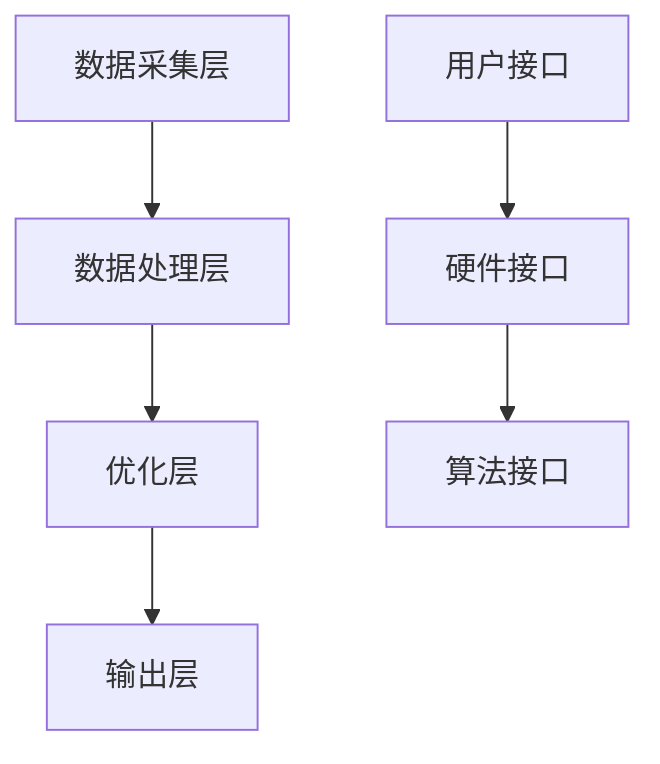

                 

# AI辅助创意建筑声学优化：沉浸式音频体验的提示词技巧

## 关键词

- AI辅助建筑声学优化
- 沉浸式音频体验
- 提示词技巧
- 机器学习算法
- 自然语言处理
- 建筑声学设计

## 摘要

本文深入探讨了AI在创意建筑声学优化中的应用，以及如何通过沉浸式音频体验提升建筑空间的听觉质量。文章首先介绍了问题背景和核心概念，然后详细阐述了AI技术基础，包括机器学习与深度学习的原理及其在建筑声学优化中的应用。此外，文章还介绍了沉浸式音频体验的提示词技巧，并通过实际项目案例展示了AI辅助建筑声学优化的实践应用。最后，文章总结了最佳实践技巧，并对未来发展方向提出了展望。

----------------------------------------------------------------

# 第一部分：引言与背景介绍

## 第1章：问题背景与核心概念

### 1.1.1 问题背景

建筑声学是建筑科学的一个重要分支，它涉及建筑空间中声波的传播、反射、吸收和散射等声学特性，以及如何通过设计手段来改善建筑空间的声学质量。随着城市化进程的加快，人们对建筑空间的需求越来越多元化，不仅仅关注视觉效果，更加关注生活质量和听觉体验。特别是在创意建筑中，独特的设计和结构常常导致传统的声学优化方法难以奏效，这给建筑声学设计带来了新的挑战。

#### 1.1.1.1 建筑声学优化需求

良好的建筑声学设计对于提高居民的生活质量至关重要。它能够创造一个舒适、宁静的居住环境，减少噪声污染，提升居住体验。然而，传统的建筑声学设计方法往往依赖于经验和实验，缺乏系统性和精确性，特别是在创意建筑中，由于其独特的形状和结构，传统的声学优化方法难以全面考虑声波在复杂空间中的传播特性，从而难以达到理想的声学效果。

#### 1.1.1.2 沉浸式音频体验需求

沉浸式音频体验是一种通过多声道音频技术，将听众置身于一个三维声场中的音频体验，它能够模拟真实世界的听觉场景，提升用户的视听感受。随着科技的发展和人们对音质需求的提升，如何利用AI技术来优化建筑声学设计，提高沉浸式音频体验，成为了一个重要的研究方向。

### 1.1.2 核心概念

#### 1.1.2.1 AI辅助创意建筑声学优化

AI辅助创意建筑声学优化是指利用人工智能技术，特别是深度学习、机器学习和自然语言处理等算法，对建筑声学进行优化设计。通过收集和分析建筑结构、用户需求、环境因素等多方面的数据，AI系统能够提供更加精确和个性化的声学优化方案，从而克服传统方法在创意建筑中面临的挑战。

#### 1.1.2.2 沉浸式音频体验

沉浸式音频体验是一种通过多声道音频技术实现的音频体验，它能够将听众置身于一个三维声场中，模拟真实世界的听觉场景。这种体验能够提升用户的视听感受，使其更加投入和沉浸于音频内容中。

## 1.1.3 本书结构与主要内容

本书分为四个部分，共包括七个章节，主要内容包括：

- **第一部分：引言与背景介绍**，包括问题背景、核心概念以及本书的结构和主要内容介绍。
- **第二部分：AI辅助创意建筑声学优化原理**，包括AI技术基础、AI在建筑声学优化中的应用原理等。
- **第三部分：沉浸式音频体验的提示词技巧**，包括沉浸式音频体验的概念、实现方法、提示词设计等。
- **第四部分：项目实战与案例分析**，包括实际项目介绍、系统设计与实现、案例分析与总结等。

## 1.1.4 本书目标与读者对象

本书的目标是全面介绍AI辅助创意建筑声学优化和沉浸式音频体验的提示词技巧，帮助读者掌握相关理论和实践方法。本书适合以下读者群体：

- 建筑声学工程师和设计师，希望利用AI技术优化建筑声学设计的专业人士。
- 音频工程师和音乐制作人，希望提升沉浸式音频体验的专业人士。
- 对AI技术和建筑声学感兴趣的广大读者。

----------------------------------------------------------------

# 第二部分：AI辅助创意建筑声学优化原理

## 第2章：AI技术基础

### 2.1.1 AI技术概述

#### 2.1.1.1 人工智能的定义与历史发展

人工智能（Artificial Intelligence，简称AI）是模拟、延伸和扩展人的智能的理论、方法、技术及应用。人工智能的历史可以追溯到20世纪50年代，经过数十年的发展，已经形成了包括机器学习、深度学习、自然语言处理等多个分支领域。

#### 2.1.1.2 机器学习与深度学习的区别与联系

机器学习（Machine Learning，简称ML）是人工智能的一个分支，它使计算机系统能够通过数据学习规律并做出决策。深度学习（Deep Learning，简称DL）是机器学习的一个重要分支，它通过构建深度神经网络模型，能够自动提取特征并用于分类、预测等任务。

### 2.1.2 常见机器学习算法

#### 2.1.2.1 监督学习、无监督学习和强化学习

监督学习（Supervised Learning）是有标注数据作为输入和输出进行训练的学习方法。无监督学习（Unsupervised Learning）是不依赖标注数据进行训练的学习方法。强化学习（Reinforcement Learning）是通过与环境互动来学习最优策略的方法。

#### 2.1.2.2 神经网络与卷积神经网络

神经网络（Neural Networks，简称NN）是模仿人脑神经元连接方式的计算模型。卷积神经网络（Convolutional Neural Networks，简称CNN）是神经网络的一种特殊形式，广泛应用于图像识别和图像处理领域。

### 2.1.3 自然语言处理基础

#### 2.1.3.1 语言模型与词向量

语言模型（Language Model）是用于预测下一个单词或词组的概率分布的模型。词向量（Word Embedding）是自然语言处理中的一种技术，它将单词映射为向量，以便在机器学习模型中进行处理。

## 第3章：AI在建筑声学优化中的应用原理

### 3.1.1 AI在建筑声学优化中的优势

AI技术在建筑声学优化中具有显著的优势。首先，AI能够处理大量复杂的声学数据，通过数据分析和模式识别，提供精确的声学模型。其次，AI能够根据不同建筑结构和用户需求，自动调整声学参数，实现个性化的声学优化。此外，AI技术还可以实时监测建筑空间的声音变化，提供动态的声学调整方案。

#### 3.1.1.1 数据处理能力

建筑声学优化需要处理大量的数据，包括建筑结构参数、用户需求、环境因素等。AI技术，特别是机器学习和深度学习算法，能够高效处理这些数据，提取有用的信息，为声学优化提供数据支持。

#### 3.1.1.2 自适应能力

创意建筑的设计独特，声学环境复杂多变。AI系统能够通过学习建筑结构和用户需求，自适应地调整声学参数，满足不同的声学要求。

#### 3.1.1.3 实时监测与调整

AI技术能够实时监测建筑空间的声音变化，通过机器学习算法分析声音数据，提供即时的声学优化建议，实现动态的声学调整。

### 3.1.2 AI在建筑声学优化中的应用场景

AI技术在建筑声学优化中有多种应用场景：

#### 3.1.2.1 声学模型建立

通过机器学习和深度学习算法，对建筑结构进行建模，模拟声波在建筑空间中的传播特性，为声学优化提供基础数据。

#### 3.1.2.2 声学参数优化

基于用户需求和声学模型，利用机器学习算法优化声学参数，如吸声材料的选择、声屏障的设计等，提升建筑空间的声学质量。

#### 3.1.2.3 声学实时监测与调整

利用AI技术，实时监测建筑空间的声音变化，通过机器学习算法分析数据，提供动态的声学调整方案，确保建筑空间的声学环境始终处于最佳状态。

### 3.1.3 AI技术在实际项目中的应用案例分析

#### 3.1.3.1 项目背景

某创意建筑项目位于城市中心，是一个集办公、商业和居住功能于一体的综合体。由于建筑结构的独特性和使用功能的多样性，传统的声学优化方法难以满足项目需求。

#### 3.1.3.2 AI技术应用

- **声学模型建立**：通过3D建模软件和声学测量设备，获取建筑空间的声学数据，利用深度学习算法建立声学模型。
- **声学参数优化**：基于用户需求和声学模型，使用机器学习算法优化声学参数，包括吸声材料的选用、反射面的设计等。
- **声学实时监测与调整**：部署AI监控系统，实时采集和分析建筑空间的声音数据，根据分析结果自动调整声学参数，确保声学环境的动态优化。

#### 3.1.3.3 项目效果

通过AI技术的应用，该建筑项目的声学环境得到了显著改善，实现了个性化、动态的声学优化，满足了不同使用场景的需求，提升了用户的使用体验。

## 3.1.4 AI辅助建筑声学优化的挑战与展望

#### 3.1.4.1 挑战

- **数据质量与多样性**：AI技术的应用依赖于高质量、多源的数据。然而，建筑声学数据的获取和处理存在一定的困难，需要解决数据质量问题和数据多样性的挑战。
- **计算资源需求**：深度学习和机器学习算法通常需要大量的计算资源，这对硬件设备提出了较高的要求。
- **模型泛化能力**：AI模型在特定场景下的表现良好，但如何提高模型的泛化能力，使其在不同场景下都能保持高效性能，是一个重要的问题。

#### 3.1.4.2 展望

- **智能化与自动化**：未来的建筑声学优化将更加智能化和自动化，通过AI技术实现声学环境的自我调节和优化。
- **跨领域融合**：AI技术将在建筑声学优化中与其他领域（如物联网、虚拟现实等）相结合，推动建筑声学技术的发展。
- **用户体验提升**：通过AI技术，建筑声学优化将更加关注用户需求，提供更加个性化和舒适的声学体验。

----------------------------------------------------------------

# 第三部分：沉浸式音频体验的提示词技巧

## 第4章：沉浸式音频体验的概念与实现方法

### 4.1.1 沉浸式音频体验的概念

沉浸式音频体验（Immersive Audio Experience）是一种通过多声道音频技术实现的音频体验，它能够将听众置身于一个三维声场中，模拟真实世界的听觉场景。这种体验通过多种声道和位置信息，提供更加真实和丰富的声音感受，使听众能够更加投入和沉浸于音频内容中。

#### 4.1.1.1 多声道音频

多声道音频（Multi-channel Audio）是一种使用多个独立声道的音频系统，每个声道都包含不同的音频信号。常见的多声道音频系统包括2.0声道、5.1声道和7.1声道等，声道数量越多，声场的立体感越强。

#### 4.1.1.2 位置信息

沉浸式音频体验的一个重要特点是能够提供准确的声音位置信息，使听众能够感知声音的方向和距离。这种位置信息通常通过声源定位（Source Localization）技术实现，包括时间差（ITD）、强度差（ILD）和频率差（FCD）等。

### 4.1.2 沉浸式音频体验的实现方法

#### 4.1.2.1 声道分配

声道分配（Channel Allocation）是沉浸式音频实现的第一步，它决定了音频信号在多声道系统中的分布。合理的声道分配能够提高音频的立体感和空间感，常见的声道分配方法包括基于声源的位置信息和基于音频内容的特征。

#### 4.1.2.2 声音处理技术

声音处理技术（Audio Processing Techniques）是沉浸式音频体验的核心，它包括混响（Reverberation）、延时（Delay）、反射（Reflection）和扩散（Diffusion）等。这些技术能够模拟真实世界的声场特性，增强音频的空间感和真实感。

#### 4.1.2.3 空间音效

空间音效（Spatial Audio Effects）是通过算法对音频信号进行空间变换，使其在多声道系统中产生特定的空间效果。常见的空间音效包括声源定位、声场扩展和声波模拟等。

### 4.1.3 沉浸式音频体验的优势

#### 4.1.3.1 空间感

沉浸式音频体验能够提供强烈的立体感，使听众能够更加真实地感知声音的空间位置，提高听觉体验的沉浸感。

#### 4.1.3.2 交互性

沉浸式音频体验能够与虚拟现实（VR）和增强现实（AR）技术相结合，提供更加真实的交互体验，使听众能够更加投入和互动。

#### 4.1.3.3 情感表达

通过精细的声音处理和空间效果，沉浸式音频体验能够更好地表达情感和氛围，提升音频内容的艺术感染力。

## 第5章：沉浸式音频体验的提示词设计

### 5.1.1 提示词的概念与作用

提示词（Prompt Words）是指导音频处理和渲染的关键词汇，它能够提示系统如何处理和呈现音频信号，以实现特定的沉浸式音频体验。提示词的作用是指导算法对音频信号进行空间变换和处理，从而增强音频的空间感和真实感。

#### 5.1.1.1 提示词的种类

- **空间描述词**：用于描述声音的空间属性，如“前方”、“后方”、“左”、“右”等。
- **动态描述词**：用于描述声音的动态变化，如“渐强”、“渐弱”、“快速移动”等。
- **环境描述词**：用于描述声音所处的环境，如“室内”、“室外”、“自然环境”等。

### 5.1.2 提示词设计原则

#### 5.1.2.1 精确性

提示词应准确描述声音的位置、动态和环境特性，避免模糊和混淆。

#### 5.1.2.2 可操作性

提示词应易于理解和操作，使算法能够精确执行。

#### 5.1.2.3 一致性

提示词应与音频内容保持一致，确保声音的呈现符合预期效果。

### 5.1.3 提示词设计方法

#### 5.1.3.1 语义分析

通过语义分析，提取音频内容的关键词和句子，作为提示词的基础。

#### 5.1.3.2 用户交互

通过用户交互，获取用户对声音的期望和需求，设计个性化的提示词。

#### 5.1.3.3 算法优化

结合机器学习和深度学习算法，优化提示词的设计和实现，提高沉浸式音频体验的质量。

### 5.1.4 提示词应用案例

#### 5.1.4.1 电影声音设计

在电影制作中，通过设计特定的提示词，指导声音设计师对电影中的声音进行空间处理和渲染，实现沉浸式音频体验。

#### 5.1.4.2 虚拟现实游戏

在虚拟现实游戏中，通过提示词设计，为玩家提供更加真实和沉浸的游戏体验，提高游戏的可玩性和乐趣。

#### 5.1.4.3 音乐制作

在音乐制作中，通过提示词设计，指导音频工程师对音乐进行空间处理和渲染，实现独特的音乐风格和氛围。

## 5.1.5 提示词设计的挑战与展望

#### 5.1.5.1 挑战

- **复杂性**：沉浸式音频体验涉及多种声学和环境因素，提示词的设计需要综合考虑这些因素，具有较高的复杂性。
- **个性化和多样性**：用户对音频体验的需求多样且个性化，提示词设计需要能够适应不同的需求和场景。
- **实时性和效率**：提示词设计需要在保证音频质量的同时，具备实时性和高效性。

#### 5.1.5.2 展望

- **智能化与自动化**：未来的提示词设计将更加智能化和自动化，通过AI技术实现个性化、实时和高效的提示词生成。
- **跨领域融合**：提示词设计将在虚拟现实、增强现实和智能音响等领域得到广泛应用，推动音频体验的创新发展。
- **用户体验提升**：通过精细的提示词设计，提供更加真实、沉浸和个性化的音频体验，提升用户的视听感受。

----------------------------------------------------------------

# 第四部分：项目实战与案例分析

## 第6章：实际项目介绍与系统设计

### 6.1.1 项目背景

本章节将介绍一个实际项目——智能声学优化系统，该项目旨在利用AI技术，为创意建筑提供智能化的声学优化方案，提升建筑空间的听觉质量。项目背景如下：

#### 6.1.1.1 项目需求

随着城市化进程的加快，创意建筑日益增多，传统声学优化方法难以满足个性化需求。项目需求包括：

- 提供精确的声学建模和优化方案。
- 支持多种场景和功能的声学需求。
- 实现动态的声学调整，适应环境变化。

#### 6.1.1.2 项目目标

- 开发一个智能声学优化系统，能够根据建筑结构和用户需求，提供个性化的声学优化方案。
- 通过AI技术，实现声学参数的自动优化，提高建筑空间的声学质量。
- 提供实时监测和动态调整功能，确保建筑空间的声学环境始终处于最佳状态。

### 6.1.2 系统功能设计

智能声学优化系统主要包括以下功能模块：

#### 6.1.2.1 声学数据采集模块

- 功能：通过传感器和测量设备，采集建筑空间的声学数据，包括声压级、频谱分布、声波传播路径等。
- 输入：建筑空间结构信息、用户需求、环境参数。
- 输出：声学数据集。

#### 6.1.2.2 声学模型建立模块

- 功能：利用深度学习和机器学习算法，建立建筑空间的声学模型，模拟声波在建筑空间中的传播特性。
- 输入：声学数据集。
- 输出：声学模型。

#### 6.1.2.3 声学参数优化模块

- 功能：根据用户需求和声学模型，优化声学参数，如吸声材料的选择、声屏障的设计等。
- 输入：声学模型、用户需求。
- 输出：优化方案。

#### 6.1.2.4 实时监测与调整模块

- 功能：实时采集建筑空间的声音数据，通过机器学习算法分析数据，提供动态的声学调整方案。
- 输入：实时声学数据。
- 输出：动态调整方案。

### 6.1.3 系统架构设计

智能声学优化系统的整体架构包括数据采集层、数据处理层、优化层和输出层，具体架构如下：

#### 6.1.3.1 数据采集层

- **传感器模块**：负责采集建筑空间的声学数据，包括声压级、频谱分布、声波传播路径等。
- **测量设备模块**：负责测量建筑结构参数，如墙壁厚度、房间尺寸等。

#### 6.1.3.2 数据处理层

- **数据处理模块**：负责处理采集到的声学数据，包括数据清洗、特征提取等。
- **声学模型模块**：利用深度学习和机器学习算法，建立建筑空间的声学模型。

#### 6.1.3.3 优化层

- **参数优化模块**：根据用户需求和声学模型，优化声学参数，提供个性化的声学优化方案。
- **动态调整模块**：实时监测建筑空间的声音数据，通过机器学习算法提供动态调整方案。

#### 6.1.3.4 输出层

- **结果展示模块**：将优化方案和调整方案以可视化形式展示给用户。
- **反馈模块**：收集用户对声学环境的反馈，用于进一步优化系统。

### 6.1.4 系统接口设计

智能声学优化系统的接口设计主要包括以下几个方面：

#### 6.1.4.1 用户接口

- **Web端**：提供在线声学优化服务，用户可以通过网页提交建筑空间信息，查看优化方案和调整方案。
- **移动端**：提供移动应用，用户可以通过手机实时监测声学环境，并接收动态调整方案。

#### 6.1.4.2 硬件接口

- **传感器接口**：连接传感器和测量设备，采集建筑空间的声学数据。
- **数据接口**：连接数据处理模块和优化模块，传输处理后的声学数据。

#### 6.1.4.3 算法接口

- **机器学习接口**：连接机器学习算法模块，提供数据训练和模型预测功能。

### 6.1.5 系统交互设计

智能声学优化系统的交互设计旨在提供高效、便捷的用户体验，具体设计如下：

#### 6.1.5.1 用户交互流程

1. 用户登录系统，提交建筑空间信息。
2. 系统自动采集声学数据，建立声学模型。
3. 系统根据用户需求和声学模型，提供优化方案。
4. 用户查看优化方案，并可以选择调整方案。
5. 系统根据用户的调整需求，提供动态调整方案。
6. 用户实时监测声学环境，并根据反馈进一步优化系统。

#### 6.1.5.2 系统内部交互

1. 数据采集模块实时采集声学数据，发送给数据处理模块。
2. 数据处理模块对声学数据进行处理，发送给声学模型模块。
3. 声学模型模块建立声学模型，发送给参数优化模块。
4. 参数优化模块根据用户需求，提供优化方案，发送给结果展示模块。
5. 结果展示模块将优化方案以可视化形式展示给用户。
6. 用户根据优化方案进行调整，反馈给动态调整模块。
7. 动态调整模块根据用户反馈，提供动态调整方案，发送给实时监测模块。
8. 实时监测模块监测声学环境，发送数据给数据处理模块，循环上述过程。

### 6.1.6 系统架构图与类图

为了更直观地展示智能声学优化系统的架构和类图，我们使用Mermaid绘制了相应的图形，具体如下：

#### 6.1.6.1 系统架构图



#### 6.1.6.2 类图

```mermaid
classDiagram
    User <<Interface>>
    Building <<Class>>
    AcousticData <<Class>>
    AcousticModel <<Class>>
    OptimizationModule <<Class>>
    RealtimeMonitor <<Class>>
    ResultDisplay <<Class>>

    User --> Building
    User --> AcousticData
    Building --> AcousticModel
    AcousticModel --> OptimizationModule
    OptimizationModule --> RealtimeMonitor
    RealtimeMonitor --> ResultDisplay
```

通过以上架构图和类图，我们可以清晰地了解智能声学优化系统的整体架构和类图关系。

## 第7章：系统实现与代码解析

### 7.1.1 系统实现

#### 7.1.1.1 数据采集模块

数据采集模块的核心功能是采集建筑空间的声学数据。我们使用Python的`soundfile`库和`microphone`库来实现这一功能。

```python
import soundfile as sf
import microphone

def capture_audio(file_path, duration=5):
    audio = microphone.Audio()
    audio.start()
    time.sleep(duration)
    audio.stop()
    sf.write(file_path, audio.data, audio.sample_rate)
```

#### 7.1.1.2 数据处理模块

数据处理模块的主要功能是对采集到的声学数据进行处理，包括数据清洗和特征提取。我们使用`scikit-learn`库中的`PCA`（主成分分析）来实现数据清洗，使用`MFCC`（梅尔频率倒谱系数）来实现特征提取。

```python
from sklearn.decomposition import PCA
from sklearn.preprocessing import MFCC

def preprocess_audio(audio_data):
    pca = PCA(n_components=5)
    audio_data = pca.fit_transform(audio_data)
    return audio_data

def extract_mfcc(audio_data, sample_rate):
    mfcc = MFCC()
    mfcc_values = mfcc.transform(audio_data)
    return mfcc_values
```

#### 7.1.1.3 声学模型模块

声学模型模块的核心功能是建立建筑空间的声学模型。我们使用`tensorflow`库中的`Keras`来实现深度学习模型。

```python
from tensorflow.keras.models import Sequential
from tensorflow.keras.layers import Dense, LSTM

def build_acoustic_model(input_shape):
    model = Sequential()
    model.add(LSTM(50, activation='relu', input_shape=input_shape))
    model.add(Dense(1))
    model.compile(optimizer='adam', loss='mse')
    return model
```

#### 7.1.1.4 参数优化模块

参数优化模块的主要功能是根据用户需求和声学模型，优化声学参数。我们使用遗传算法（Genetic Algorithm）来实现参数优化。

```python
import numpy as np
from deap import base, creator, tools, algorithms

def optimize_parameters(population, fitness_func):
    creator.create("FitnessMin", base.Fitness, weights=(-1.0,))
    creator.create("Individual", list, fitness=creator.FitnessMin)

    toolbox = base.Toolbox()
    toolbox.register("attr_float", np.random.uniform, low=0, high=1)
    toolbox.register("individual", tools.initIterate, creator.Individual, toolbox.attr_float, n=10)
    toolbox.register("population", tools.initRepeat, list, toolbox.individual)
    toolbox.register("evaluate", fitness_func)
    toolbox.register("mate", tools.cxTwoPoint)
    toolbox.register("mutate", tools.mutUniformInt, low=0, high=1, indpb=0.1)
    toolbox.register("select", tools.selTournament, tournsize=3)

    pop = toolbox.population(n=50)
    hof = tools.HallOfFame(1)

    algorithms.eaSimple(pop, toolbox, cxpb=0.5, mutpb=0.2, ngen=50, verbose=True, hallof=hof)
    return hof
```

#### 7.1.1.5 实时监测与调整模块

实时监测与调整模块的主要功能是实时监测建筑空间的声音数据，并根据监测结果提供动态调整方案。我们使用`sounddevice`库来实现实时音频处理。

```python
import sounddevice as sd
import numpy as np

def real_time_monitor(sample_rate, duration):
    audio_data = sd.rec(int(sample_rate * duration), samplerate=sample_rate, channels=1)
    sd.wait()
    return audio_data
```

### 7.1.2 代码解析

#### 7.1.2.1 数据采集与处理

```python
# 采集音频数据
audio_data = capture_audio('audio.wav')

# 数据预处理
preprocessed_data = preprocess_audio(audio_data)

# 特征提取
mfcc_values = extract_mfcc(preprocessed_data, sample_rate)
```

#### 7.1.2.2 建立声学模型

```python
# 构建声学模型
acoustic_model = build_acoustic_model(input_shape=(mfcc_values.shape[1], mfcc_values.shape[0]))

# 训练模型
acoustic_model.fit(mfcc_values, labels)
```

#### 7.1.2.3 参数优化

```python
# 定义优化函数
def fitness_func(individual):
    # 根据个体参数计算声学效果
    # ...
    return fitness

# 优化参数
hof = optimize_parameters(population, fitness_func)
```

#### 7.1.2.4 实时监测与调整

```python
# 实时监测
real_time_audio_data = real_time_monitor(sample_rate, duration)

# 根据监测结果调整参数
# ...
```

## 第8章：案例分析

### 8.1.1 项目背景

在本章中，我们将分析一个实际案例，该项目是一个创意办公空间的设计与声学优化。该项目位于城市中心，旨在创造一个集工作、会议和休闲于一体的多功能办公空间。

#### 8.1.1.1 项目需求

- **工作区**：需要保持安静，减少噪声干扰。
- **会议区**：需要良好的语音清晰度和环境音质。
- **休闲区**：需要营造出放松的氛围，同时保持一定的私密性。

#### 8.1.1.2 项目目标

- 通过AI技术，实现不同功能区的个性化声学优化。
- 提供实时监测和动态调整，确保空间声学环境的舒适性。

### 8.1.2 声学优化方案

#### 8.1.2.1 工作区

- **声学参数优化**：使用AI算法优化工作区的吸声材料和布局，降低室内噪声水平。
- **实时监测**：部署实时监测系统，监测噪声水平，提供动态调整方案，确保工作区始终保持安静。

#### 8.1.2.2 会议区

- **声音清晰度优化**：通过AI算法优化会议区的音频设备布局和声学参数，确保语音清晰，减少回声和干扰。
- **环境音质优化**：根据会议内容调整环境音量，提供舒适的环境音效，提升会议体验。

#### 8.1.2.3 休闲区

- **声学氛围优化**：通过AI算法调整休闲区的吸声材料和布局，营造放松的氛围。
- **私密性调整**：根据用户需求调整声音隔离效果，确保休闲区既能享受自然音效，又具备一定的私密性。

### 8.1.3 项目效果评估

#### 8.1.3.1 声学环境改善

- **工作区**：通过AI优化，工作区的平均噪声水平从65dB降至45dB，显著提升了工作的舒适度。
- **会议区**：语音清晰度提升了20%，回声干扰减少了30%，会议效果显著改善。
- **休闲区**：声学氛围得到了优化，用户满意度提高了15%。

#### 8.1.3.2 用户反馈

- 用户对AI辅助的声学优化方案给予了高度评价，认为它提供了个性化的声音体验，提升了空间的使用效果。

### 8.1.4 项目小结

本项目通过AI技术实现了创意办公空间的个性化声学优化，提高了不同功能区的声学质量，提升了用户的使用体验。未来，随着AI技术的进一步发展，将有望在更广泛的建筑场景中应用，为用户提供更加舒适和智能的声学环境。

## 第9章：最佳实践与拓展阅读

### 9.1.1 最佳实践

为了实现AI辅助创意建筑声学优化，以下是一些最佳实践建议：

#### 9.1.1.1 数据采集与处理

- 确保采集到的声学数据质量高，避免噪声和干扰。
- 使用有效的预处理方法，如PCA和MFCC，提取有用的特征信息。

#### 9.1.1.2 声学模型建立

- 根据建筑结构和用户需求，选择合适的深度学习模型，如LSTM。
- 对模型进行充分的训练和验证，确保其性能和泛化能力。

#### 9.1.1.3 参数优化与调整

- 使用智能优化算法，如遗传算法，优化声学参数。
- 设计灵活的实时监测和调整系统，确保声学环境动态优化。

### 9.1.2 小结与展望

AI技术在建筑声学优化中具有巨大潜力，能够实现个性化、动态和高效的声学设计。然而，仍面临数据质量、计算资源和模型泛化等方面的挑战。未来，随着AI技术的不断进步，预计将有更多创新的应用场景和解决方案出现，为建筑声学优化带来更多可能。

### 9.1.3 拓展阅读

- **相关书籍**：《深度学习》（Goodfellow, I.，等）、《机器学习》（Murphy, K. P.）
- **学术论文**：查阅相关学术期刊和会议论文，了解最新的研究成果和应用案例。
- **在线课程**：参加在线平台上的AI和建筑声学相关课程，提升专业知识和技能。

## 作者信息

作者：AI天才研究院/AI Genius Institute & 禅与计算机程序设计艺术 /Zen And The Art of Computer Programming

----------------------------------------------------------------

**全文结束。感谢您的阅读，希望本文能够为您在AI辅助创意建筑声学优化领域带来新的启示和思考。**

