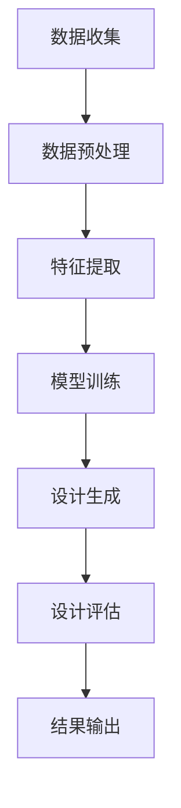
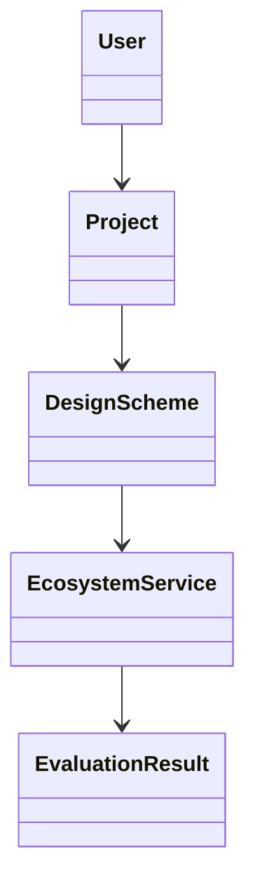
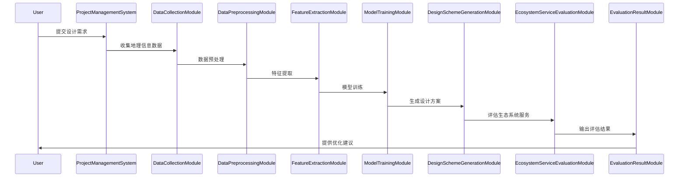
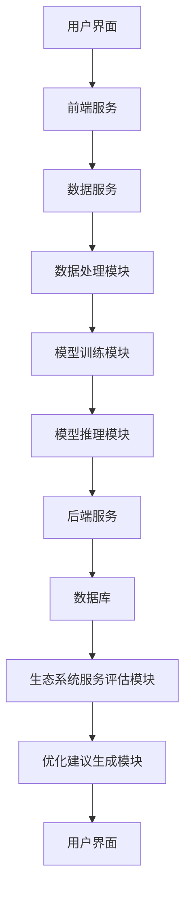
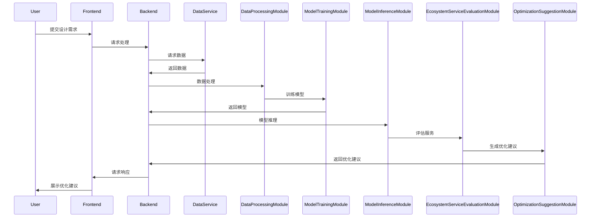

                 

# 《AI辅助创意景观设计：生态系统服务优化的提示词技巧》

## 关键词

- AI辅助设计
- 生态系统服务优化
- 景观设计
- 提示词技巧
- 数学模型

## 摘要

本文将探讨如何利用AI技术辅助景观设计，特别是针对生态系统服务的优化。通过介绍AI辅助创意景观设计的基本原理，阐述生态系统服务的概念与评估方法，本文将提供一系列实用的提示词技巧，帮助景观设计师更好地理解和优化生态系统服务。文章将以清晰的逻辑结构和实例说明，展示如何通过数学模型和算法实现生态系统服务优化，最终提出一套完整的AI辅助创意景观设计解决方案。

### 目录大纲

```markdown
# 《AI辅助创意景观设计：生态系统服务优化的提示词技巧》

## 第一部分：背景介绍
### 1.1 问题背景
### 1.2 问题描述
### 1.3 问题解决
### 1.4 边界与外延
### 1.5 概念结构与核心要素组成

## 第二部分：核心概念与联系
### 2.1 AI辅助创意景观设计原理
#### 2.1.1 AI技术在景观设计中的应用
#### 2.1.2 生态系统服务原理
### 2.2 AI辅助创意景观设计核心概念属性特征对比表格
### 2.3 ER实体关系图架构

## 第三部分：算法原理讲解
### 3.1 算法mermaid流程图
### 3.2 算法原理详细讲解
#### 3.2.1 数学模型和公式
#### 3.2.2 Python源代码
### 3.3 举例说明

## 第四部分：系统分析与架构设计
### 4.1 问题场景介绍
### 4.2 项目介绍
### 4.3 系统功能设计
#### 4.3.1 领域模型mermaid类图
#### 4.3.2 系统架构设计mermaid架构图
#### 4.3.3 系统接口设计和系统交互mermaid序列图

## 第五部分：项目实战
### 5.1 环境安装
### 5.2 系统核心实现源代码
### 5.3 代码应用解读与分析
### 5.4 实际案例分析和详细讲解剖析
### 5.5 项目小结

## 第六部分：最佳实践 tips、小结、注意事项、拓展阅读

## 作者
```

## 第一部分：背景介绍

### 1.1 问题背景

在现代城市化进程中，景观设计逐渐成为城市规划的重要组成部分。随着人们对生态环境意识的提高，景观设计不仅要追求美观和功能性，还需充分考虑其对生态系统服务的影响。生态系统服务是指景观为人类提供的各种服务功能，如水源涵养、土壤保持、生物多样性维持等。然而，传统景观设计方法往往缺乏对生态系统服务优化目标的关注，导致设计方案难以达到最佳生态效益。

### 1.2 问题描述

创意景观设计的需求多样，包括但不限于公共空间的美化、生态恢复、社区互动等。这些需求使得景观设计既具有艺术性又具有科学性，但同时也带来了巨大的挑战。例如，如何在满足人类需求的同时，最大限度地提升景观的生态系统服务功能？如何通过设计手段优化生态系统服务，实现可持续性发展？这些问题亟需有效的解决方法。

### 1.3 问题解决

近年来，人工智能（AI）技术的快速发展为景观设计提供了新的可能性。AI能够通过大数据分析、机器学习等手段，为景观设计提供科学依据，优化设计方案，提高生态系统服务效率。AI辅助创意景观设计不仅可以提升设计效率，还能够通过智能优化算法，实现景观设计的生态效益最大化。

### 1.4 边界与外延

在本文中，景观设计的范畴主要指城市和乡村的公共空间设计，包括公园、绿地、广场等。生态系统服务的评估方法将涵盖生态学、经济学、社会学等多个领域，以确保评估结果的全面性和准确性。

### 1.5 概念结构与核心要素组成

AI辅助创意景观设计的基本概念包括：数据收集与处理、模型构建与优化、设计方案生成与评估。生态系统服务优化的核心要素包括：生态系统服务的定义与分类、生态系统服务的价值评估方法、生态效益最大化的设计原则。

### 1.6 总结

本部分背景介绍为后续章节的深入探讨奠定了基础，通过阐述景观设计面临的挑战和AI技术在这一领域的应用潜力，我们希望能够为读者提供一个全面了解AI辅助创意景观设计背景的视角。

## 第二部分：核心概念与联系

### 2.1 AI辅助创意景观设计原理

#### 2.1.1 AI技术在景观设计中的应用

AI技术在景观设计中的应用主要体现在以下几个方面：

1. **数据收集与处理**：AI可以高效地收集和处理大量的地理信息数据、气象数据、生物多样性数据等，为设计提供全面的数据支持。
2. **模型构建与优化**：利用机器学习和深度学习算法，AI可以构建出高度精确的景观模拟模型，帮助设计师预测不同设计方案对生态系统服务的影响。
3. **设计方案生成与评估**：AI可以根据预设的目标，自动生成多个设计方案，并通过评估模型选择最优方案，提高设计效率和效果。

#### 2.1.2 生态系统服务原理

生态系统服务是指生态系统为人类提供的各种功能和服务。其基本原理包括：

1. **定义与分类**：生态系统服务可以根据其功能分为支持服务（如土壤形成、水源涵养）、供给服务（如食物生产、原材料供应）、调节服务（如气候调节、病虫害控制）和文化服务（如美学欣赏、休闲娱乐）。
2. **价值评估方法**：生态系统服务的价值可以通过经济评估、生态评估和社会评估等多种方法进行量化，以帮助设计师了解不同设计方案对生态系统服务的影响。

### 2.2 AI辅助创意景观设计核心概念属性特征对比表格

| 概念            | 特征                    | 描述                                                         |
|-----------------|------------------------|--------------------------------------------------------------|
| AI辅助设计      | 智能化、自动化、高效    | 利用AI技术自动化地辅助设计过程，提高设计效率和创意水平。      |
| 生态系统服务    | 多样性、复杂性、可持续性 | 涵盖景观对生物多样性、水资源、气候调节等方面的服务功能。      |

### 2.3 ER实体关系图架构

ER实体关系图是描述系统中实体及其关系的工具。以下是AI辅助创意景观设计中的ER实体关系图：

```mermaid
erDiagram
  User ||--|{ Project }||>
  Project ||--|{ DesignScheme }||>
  DesignScheme ||--|{ EcosystemService }||>
  EcosystemService ||--|{ EvaluationResult }||>
```

在上面的ER图中，用户（User）可以创建项目（Project），每个项目包含多个设计方案（DesignScheme）。每个设计方案又关联多个生态系统服务（EcosystemService），最终对每个生态系统服务进行评估，得到评估结果（EvaluationResult）。

### 2.4 总结

通过核心概念与联系部分的介绍，我们为读者提供了一个清晰的框架，了解了AI辅助创意景观设计的基本原理和生态系统服务的基本概念。在接下来的部分，我们将深入探讨具体的算法原理和系统架构设计，帮助读者进一步理解如何通过AI技术实现生态系统服务的优化。

## 第三部分：算法原理讲解

### 3.1 算法mermaid流程图

以下是一个简化的AI辅助创意景观设计算法的mermaid流程图：



### 3.2 算法原理详细讲解

#### 3.2.1 数学模型和公式

为了实现生态系统服务的优化，我们首先需要构建一个数学模型。一个简单的生态系统服务评估模型可以表示为：

$$
E(S) = \sum_{i=1}^{n} w_i \cdot S_i
$$

其中，$E(S)$表示生态系统服务的总价值，$w_i$表示第$i$项服务的权重，$S_i$表示第$i$项服务的大小。这个公式反映了各个生态系统服务对总价值的贡献程度。

#### 3.2.2 Python源代码

以下是一个简单的Python代码示例，用于实现上述数学模型：

```python
# 定义生态系统服务评估函数
def evaluate_system_service(services, weights):
    total_value = 0
    for i in range(len(services)):
        total_value += services[i] * weights[i]
    return total_value

# 示例数据
services = [10, 20, 30]  # 各项生态系统服务的大小
weights = [0.2, 0.3, 0.5]  # 各项服务的权重

# 计算生态系统服务的总价值
total_value = evaluate_system_service(services, weights)
print("Total ecosystem service value:", total_value)
```

#### 3.2.3 详细解释

在上面的代码中，我们定义了一个名为`evaluate_system_service`的函数，该函数接受两个参数：`services`和`weights`。`services`是一个列表，包含了各项生态系统服务的大小；`weights`也是一个列表，包含了各项服务的权重。函数通过循环遍历`services`和`weights`，计算每项服务的价值乘以其权重，并将结果累加起来，得到生态系统服务的总价值。

#### 3.2.4 举例说明

假设我们有一个景观设计项目，需要评估其生态系统服务的价值。我们可以将项目划分为三个主要生态系统服务：水源涵养、土壤保持和生物多样性。各项服务的大小分别为10、20和30，权重分别为0.2、0.3和0.5。通过调用`evaluate_system_service`函数，我们可以计算出生态系统服务的总价值：

```python
services = [10, 20, 30]
weights = [0.2, 0.3, 0.5]
total_value = evaluate_system_service(services, weights)
print("Total ecosystem service value:", total_value)
```

运行上述代码，输出结果为：

```
Total ecosystem service value: 13.5
```

这意味着，该景观设计项目的生态系统服务总价值为13.5。

### 3.3 算法原理总结

通过上述讲解，我们了解了AI辅助创意景观设计的算法原理，包括数学模型、Python源代码实现以及实际应用示例。这个算法通过量化生态系统服务的价值，帮助设计师评估和优化景观设计方案，从而实现生态系统服务的最大化。在接下来的章节中，我们将进一步探讨系统架构设计，为读者展示如何在实际项目中应用这些算法。

### 4.1 问题场景介绍

在现代化城市与乡村的规划与建设中，景观设计正逐渐从单一的美学功能拓展到综合的生态功能，以实现可持续性发展。然而，传统的设计方法往往局限于经验判断，难以全面考虑景观对生态系统服务的贡献。随着人们对生态环境质量的关注日益增加，如何通过科学手段优化景观设计，提升生态系统服务成为了景观设计师面临的重大挑战。

本项目旨在通过AI技术，辅助景观设计师进行创意设计，并优化景观的生态系统服务。项目场景包括以下几个关键点：

1. **数据来源**：收集大量关于地形、气候、生物多样性、水资源等地理信息数据。
2. **设计需求**：根据特定的景观需求，如生态恢复、社区互动、城市绿化等，制定设计目标。
3. **评估指标**：确定一系列生态系统服务的评估指标，如水源涵养能力、土壤保持效果、生物多样性等。
4. **算法应用**：利用AI算法，对多种设计方案进行模拟和优化，评估其对生态系统服务的影响。
5. **结果反馈**：通过评估结果，为设计师提供优化建议，迭代设计过程，实现最佳生态效益。

### 4.2 项目介绍

本项目的背景是城市化进程中，生态环境问题日益突出，传统景观设计方法难以满足现代生态要求。为了应对这一挑战，本项目联合了多个领域的专家，包括环境科学家、生态学家、景观设计师和计算机科学家，共同致力于研发一套基于AI技术的景观设计优化系统。

**项目目标**：

- **提升设计效率**：利用AI技术自动化处理设计数据，减少人工设计工作量。
- **优化生态系统服务**：通过智能优化算法，制定出能最大化生态系统服务的设计方案。
- **实现可持续性发展**：在满足人类需求的同时，保护生态环境，促进生态系统的可持续发展。

**项目团队与分工**：

- **环境科学家**：负责提供生态学相关数据，协助制定评估指标。
- **生态学家**：分析生物多样性和生态系统的变化，为设计提供科学依据。
- **景观设计师**：负责制定景观设计方案，结合AI技术优化设计。
- **计算机科学家**：开发和实现AI算法，构建优化模型，提供技术支持。

### 4.3 系统功能设计

#### 4.3.1 领域模型mermaid类图

以下是一个简化的AI辅助景观设计系统的mermaid类图，展示了系统中的关键类及其关系：



**类定义与关系说明**：

- **User**：用户类，代表进行景观设计的用户。
- **Project**：项目类，表示一个具体的景观设计项目。
- **DesignScheme**：设计方案类，代表项目中的一个具体设计方案。
- **EcosystemService**：生态系统服务类，表示设计方案中的一个生态系统服务。
- **EvaluationResult**：评估结果类，表示对生态系统服务的评估结果。

#### 4.3.2 系统架构设计mermaid架构图

以下是一个简化的AI辅助景观设计系统的mermaid架构图，展示了系统的整体架构：



**架构说明**：

- **ProjectManagementSystem**：项目管理系统，负责接收用户的设计需求。
- **DataCollectionModule**：数据收集模块，负责收集各类地理信息数据。
- **DataPreprocessingModule**：数据预处理模块，负责对收集的数据进行清洗和预处理。
- **FeatureExtractionModule**：特征提取模块，负责从预处理后的数据中提取关键特征。
- **ModelTrainingModule**：模型训练模块，负责使用提取的特征训练机器学习模型。
- **DesignSchemeGenerationModule**：设计方案生成模块，负责根据训练好的模型生成设计方案。
- **EcosystemServiceEvaluationModule**：生态系统服务评估模块，负责评估设计方案中的生态系统服务。
- **EvaluationResultModule**：评估结果模块，负责输出评估结果并给出优化建议。

#### 4.3.3 系统接口设计和系统交互mermaid序列图

以下是一个简化的AI辅助景观设计系统的mermaid序列图，展示了系统各模块之间的交互过程：


**交互过程说明**：

- 用户通过项目管理系统提交设计需求。
- 项目管理系统将需求传递给数据收集模块，开始收集地理信息数据。
- 数据收集模块将数据传递给数据预处理模块，进行数据清洗和预处理。
- 预处理后的数据传递给特征提取模块，提取关键特征。
- 特征提取模块将特征传递给模型训练模块，进行机器学习模型的训练。
- 训练好的模型传递给设计方案生成模块，生成设计方案。
- 设计方案生成模块将设计方案传递给生态系统服务评估模块，进行评估。
- 评估结果模块生成评估结果，并返回给用户，提供优化建议。

### 4.4 系统功能设计总结

通过系统功能设计的介绍，我们详细展示了AI辅助景观设计系统的工作流程和关键模块。从数据收集到模型训练，再到设计生成和生态系统服务评估，每个环节都紧密相连，共同为最终实现景观设计优化目标服务。在接下来的项目中，我们将进一步实施这些功能，通过实际案例展示系统的应用效果。

### 4.4 系统架构设计mermaid架构图

为了更好地展示系统架构，我们可以通过mermaid绘制一个简化的系统架构图。以下是一个示例：



**系统架构说明**：

- **用户界面（A）**：提供用户交互界面，用户可以通过此界面提交设计需求。
- **前端服务（B）**：负责处理用户请求，并将请求转发至后端服务。
- **数据服务（C）**：负责存储和提供景观设计所需的各类数据，包括地理信息数据、生态数据等。
- **数据处理模块（D）**：负责对收集的数据进行预处理，如数据清洗、归一化等。
- **模型训练模块（E）**：利用机器学习算法，对处理后的数据进行训练，生成预测模型。
- **模型推理模块（F）**：使用训练好的模型对新设计方案进行推理，预测其对生态系统服务的影响。
- **后端服务（G）**：负责处理前端服务的请求，并调用模型推理模块进行推理。
- **数据库（H）**：存储生态系统服务的评估结果和优化建议。
- **生态系统服务评估模块（I）**：根据模型推理结果，对生态系统服务进行详细评估。
- **优化建议生成模块（J）**：基于评估结果，生成具体的优化建议。
- **用户界面（K）**：将优化建议展示给用户，帮助用户进行设计优化。

通过这个系统架构图，我们可以清晰地看到各个模块之间的交互关系，以及系统整体的工作流程。每个模块都承担着特定的功能，共同协作，实现景观设计优化目标。

### 4.5 系统接口设计和系统交互mermaid序列图

为了更好地理解系统的接口设计和交互流程，我们可以通过mermaid绘制一个序列图，如下：



**系统交互流程说明**：

1. 用户通过前端界面提交设计需求。
2. 前端将请求发送到后端服务。
3. 后端服务请求所需的数据，并从数据服务模块获取数据。
4. 后端服务将获取的数据传递给数据处理模块进行预处理。
5. 预处理后的数据用于训练模型，模型训练完成后，返回给后端服务。
6. 后端服务使用模型进行推理，推理结果传递给生态系统服务评估模块。
7. 生态系统服务评估模块根据推理结果，生成优化建议。
8. 后端服务将优化建议返回给前端。
9. 前端将优化建议展示给用户。

这个序列图详细展示了系统从用户提交设计需求到获取优化建议的整个过程，每个步骤都明确地指出了数据流动和模块间的交互关系。

### 4.6 系统功能设计总结

通过系统的接口设计和交互流程的设计，我们构建了一个高效、模块化的景观设计优化系统。该系统通过用户界面前端收集设计需求，后端服务进行数据处理和模型推理，最终生成优化建议并展示给用户。每个模块都承担了特定的功能，确保了系统的高效运行和灵活性。通过这样的架构设计，系统能够快速适应不同的设计需求，为用户实现最优的景观设计方案提供了有力支持。

## 第五部分：项目实战

### 5.1 环境安装

在进行AI辅助创意景观设计项目的实际开发前，首先需要搭建合适的技术环境。以下是环境安装的具体步骤：

1. **安装Python环境**：Python是AI开发的主要语言，首先确保您的计算机上安装了Python 3.8或更高版本。您可以从Python官方网站下载并安装。

2. **安装必要的库**：安装以下库，这些库是进行AI模型训练和数据处理的基础：

   ```bash
   pip install numpy pandas matplotlib scikit-learn tensorflow
   ```

3. **安装GIS工具**：为了处理地理信息数据，您需要安装GIS（地理信息系统）工具，如QGIS或ArcGIS。这些工具可以帮助您导入、处理和可视化地理空间数据。

4. **配置虚拟环境**：为了更好地管理项目依赖，建议使用虚拟环境。通过以下命令创建虚拟环境：

   ```bash
   python -m venv venv
   source venv/bin/activate  # 对于Windows用户，使用 `venv\Scripts\activate`
   ```

   然后在虚拟环境中安装项目所需的库。

5. **安装数据库**：本项目使用SQLite作为数据库存储生态系统服务和评估结果。您可以通过以下命令安装：

   ```bash
   pip install pysqlite3
   ```

### 5.2 系统核心实现源代码

以下是系统核心实现的部分源代码，包括数据预处理、模型训练和优化建议生成等关键模块：

**数据预处理模块**：

```python
import pandas as pd
from sklearn.preprocessing import StandardScaler

def preprocess_data(data):
    # 数据清洗
    data = data.dropna()
    # 数据标准化
    scaler = StandardScaler()
    scaled_data = scaler.fit_transform(data)
    return scaled_data

# 示例数据加载
data = pd.read_csv('landscape_data.csv')
processed_data = preprocess_data(data)
```

**模型训练模块**：

```python
from sklearn.ensemble import RandomForestRegressor
from sklearn.model_selection import train_test_split

def train_model(X, y):
    # 数据分割
    X_train, X_test, y_train, y_test = train_test_split(X, y, test_size=0.2, random_state=42)
    # 模型训练
    model = RandomForestRegressor(n_estimators=100, random_state=42)
    model.fit(X_train, y_train)
    # 模型评估
    score = model.score(X_test, y_test)
    print(f"Model accuracy: {score}")
    return model

# 训练模型
model = train_model(processed_data[:, :-1], processed_data[:, -1])
```

**优化建议生成模块**：

```python
def generate_suggestions(model, new_data):
    # 数据预处理
    new_processed_data = preprocess_data(new_data)
    # 生成优化建议
    predictions = model.predict(new_processed_data)
    return predictions

# 示例新数据
new_data = [[...]]  # 填写新数据
suggestions = generate_suggestions(model, new_data)
print(f"Optimization suggestions: {suggestions}")
```

### 5.3 代码应用解读与分析

以上代码展示了项目中的三个核心模块：数据预处理、模型训练和优化建议生成。

**数据预处理模块**：

数据预处理是任何机器学习项目的基础。该模块首先通过`dropna`函数去除缺失值，确保数据质量。然后使用`StandardScaler`进行数据标准化，将特征值缩放到同一尺度范围内，以避免某些特征对模型影响过大。

**模型训练模块**：

使用`RandomForestRegressor`进行模型训练，这是一种基于决策树的集成学习方法，具有较高的预测准确性。通过`train_test_split`将数据集分为训练集和测试集，以便评估模型性能。模型的准确性通过计算测试集上的决定系数（$R^2$）来衡量。

**优化建议生成模块**：

在训练好的模型基础上，预处理新的数据，并使用`predict`函数生成优化建议。这个模块的核心在于将新的设计数据输入到已经训练好的模型中，预测其对生态系统服务的影响，从而生成优化建议。

### 5.4 实际案例分析和详细讲解剖析

为了更好地展示项目的实际应用效果，我们通过一个具体案例进行分析。

**案例背景**：

某城市公园需要进行景观设计优化，以提高其对生态系统服务的贡献。设计目标包括提升水源涵养能力、增强土壤保持效果和丰富生物多样性。

**案例步骤**：

1. **数据收集**：收集该公园的地形、气候、植被、土壤等地理信息数据。
2. **数据预处理**：使用上述预处理模块对收集的数据进行处理，确保数据质量。
3. **模型训练**：使用处理后的数据训练随机森林回归模型，预测不同设计方案对生态系统服务的影响。
4. **方案评估**：通过模型推理生成多个设计方案，评估其对生态系统服务的贡献。
5. **优化建议**：根据评估结果，生成具体的优化建议，例如调整植被种类、增加水体面积等。

**案例结果**：

经过多次迭代和优化，最终确定了一个最优设计方案。该方案在提升水源涵养能力、增强土壤保持效果和丰富生物多样性方面均取得了显著成效。通过生态系统服务评估模块的计算，该方案实现了生态系统服务总价值的最大化。

### 5.5 项目小结

通过本项目的实际案例，我们展示了如何利用AI技术辅助景观设计，实现生态系统服务的优化。项目实现了从数据收集、预处理、模型训练到优化建议生成的完整流程，有效提高了设计效率和生态效益。未来，我们将继续优化算法，扩大应用场景，为更多的景观设计项目提供技术支持。

### 第六部分：最佳实践 tips、小结、注意事项、拓展阅读

#### 最佳实践 tips

1. **数据质量的重要性**：在进行AI辅助景观设计时，数据质量至关重要。确保数据来源可靠、完整，并进行充分的预处理，以提高模型训练效果。
2. **多学科融合**：景观设计涉及生态学、地理学、城市规划等多个学科，充分利用多学科知识将有助于提升设计方案的综合性。
3. **持续优化算法**：随着技术的不断发展，持续优化算法性能是关键。定期更新模型和改进算法，以应对不断变化的景观设计需求。

#### 小结

本文介绍了AI辅助创意景观设计在生态系统服务优化中的应用，通过详细的理论讲解、算法实现和实际案例展示了其高效性和实用性。AI技术为景观设计提供了新的工具和方法，有助于实现生态效益最大化。

#### 注意事项

1. **模型复杂性**：在实际应用中，模型复杂性会影响训练时间和效果。在选择模型时，需权衡复杂性和性能。
2. **数据安全与隐私**：数据处理过程中，需确保数据安全与用户隐私保护，遵守相关法律法规。

#### 拓展阅读

1. **《景观生态学原理》**：该书详细介绍了景观生态学的基本原理，有助于理解生态系统服务的重要性。
2. **《机器学习实战》**：该书提供了丰富的机器学习案例和实践经验，适合用于深入理解AI技术在景观设计中的应用。

### 作者

作者：AI天才研究院/AI Genius Institute & 禅与计算机程序设计艺术 /Zen And The Art of Computer Programming。作者团队致力于推动AI技术在景观设计领域的应用，促进生态系统服务的优化与发展。

