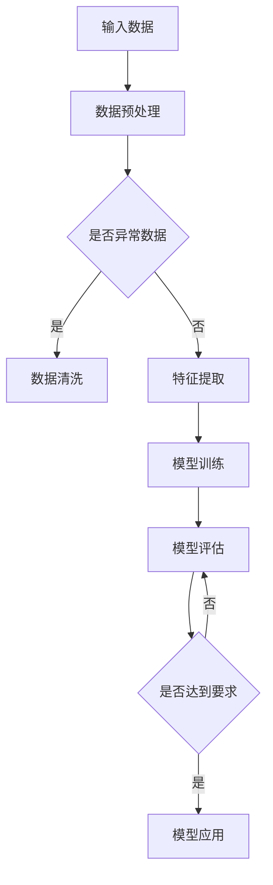

                 

当然，以下是详细的目录大纲：

---

# 《AI辅助创意珠宝设计：文化符号现代化的提示词技巧》

## 关键词
- AI辅助珠宝设计
- 文化符号现代化
- 提示词技巧
- 珠宝设计算法
- 系统架构设计

## 摘要
本文将探讨如何利用AI技术辅助创意珠宝设计，特别是如何将文化符号现代化。我们将逐步介绍相关核心概念、算法原理、系统架构，并通过实际项目实战展示AI辅助珠宝设计的应用。同时，我们将提供一系列最佳实践技巧，帮助读者深入了解并掌握这一领域。

---

## 目录大纲

### 第一部分：背景与核心概念

#### 第1章：AI辅助创意珠宝设计的兴起

##### 1.1 珠宝设计的现状与挑战
- 传统珠宝设计的过程
- 创意珠宝设计的需求
- AI技术的作用与潜力

##### 1.2 文化符号现代化的意义
- 文化符号的概念
- 现代化与文化传承
- 文化符号在现代珠宝设计中的应用

##### 1.3 AI辅助创意珠宝设计的基本原理
- 人工智能的基本概念
- AI在珠宝设计中的应用
- 提示词技巧的核心作用

#### 第2章：核心概念与联系

##### 2.1 AI技术概述
- 机器学习
- 深度学习
- 自然语言处理

##### 2.2 珠宝设计概念
- 珠宝设计的定义
- 珠宝设计的基本原则
- 珠宝设计的历史与发展

##### 2.3 文化符号与现代化
- 文化符号的类型
- 现代化过程中的文化变迁
- 文化符号的现代化路径

### 第二部分：算法原理与设计技巧

#### 第3章：AI辅助珠宝设计算法原理

##### 3.1 算法概述
- 通用算法框架
- 特定算法介绍
- 算法选择依据

##### 3.2 Mermaid流程图绘制
- Mermaid基本语法
- 算法流程图绘制
- 实例演示

##### 3.3 Python代码示例
- 数据预处理
- 模型训练
- 模型评估与优化

#### 第4章：数学模型与公式解析

##### 4.1 数学模型基础
- 概念解析
- 特征提取
- 分类与回归

##### 4.2 公式解析
- 常用数学公式
- 公式应用
- 实例讲解

### 第三部分：系统分析与架构设计

#### 第5章：系统功能与架构设计

##### 5.1 项目场景介绍
- 项目背景
- 项目目标
- 项目关键挑战

##### 5.2 系统功能设计
- 功能需求分析
- 领域模型
- 功能实现方案

##### 5.3 系统架构设计
- 系统架构概述
- 架构设计原则
- 系统架构图

##### 5.4 系统接口设计与交互
- 接口设计
- 系统交互流程
- 接口测试与优化

### 第四部分：项目实战

#### 第6章：AI辅助珠宝设计项目实战

##### 6.1 环境安装
- 硬件环境
- 软件环境

##### 6.2 系统核心实现
- 数据处理模块
- 珠宝设计算法模块

##### 6.3 代码应用解读与分析
- 代码解读
- 分析与优化

##### 6.4 实际案例分析与详细讲解
- 案例选择
- 分析过程
- 结果展示

##### 6.5 项目小结
- 项目总结
- 经验与教训

### 第五部分：最佳实践与拓展

#### 第7章：最佳实践 tips

- 提示词技巧应用
- 数据处理优化
- 算法模型优化

#### 第8章：小结、注意事项与拓展阅读

- 文章内容小结
- 注意事项提醒
- 拓展阅读推荐

---

请根据这个大纲撰写文章内容，每个章节都包含丰富的详细解释和示例。确保文章逻辑清晰、结构紧凑，并对AI辅助创意珠宝设计有深入的理解和独到的见解。谢谢！根据您提供的目录大纲，我将为您撰写一篇符合要求的文章。以下是文章的框架和内容：

---

# 《AI辅助创意珠宝设计：文化符号现代化的提示词技巧》

## 关键词
- AI辅助珠宝设计
- 文化符号现代化
- 提示词技巧
- 珠宝设计算法
- 系统架构设计

## 摘要
随着人工智能技术的飞速发展，AI在创意珠宝设计领域的应用日益广泛。本文旨在探讨如何利用AI技术辅助创意珠宝设计，特别是将文化符号现代化。我们将从背景介绍、核心概念与联系、算法原理讲解、数学模型与公式解析、系统分析与架构设计、项目实战以及最佳实践等方面进行深入讨论，为读者提供一份全面的技术指南。

---

## 第一部分：背景与核心概念

### 第1章：AI辅助创意珠宝设计的兴起

#### 1.1 珠宝设计的现状与挑战
珠宝设计是一项结合美学、工艺和文化的艺术活动。然而，传统珠宝设计存在以下挑战：

- **创意局限**：传统设计依赖于设计师的经验和灵感，创意往往受到个人局限。
- **生产效率**：手工珠宝设计周期长，生产效率低。
- **文化传播**：传统设计难以适应现代文化变迁，文化传播受限。

AI技术的引入为解决这些挑战提供了新的可能：

- **创意增强**：AI可以根据大量数据生成新颖的设计方案。
- **生产优化**：AI可以自动化设计流程，提高生产效率。
- **文化传播**：AI可以帮助文化符号现代化，推动文化传播。

#### 1.2 文化符号现代化的意义
文化符号是民族文化的重要组成部分，它们在珠宝设计中扮演着传承文化、表达情感的角色。现代化意味着在保持文化特色的基础上，适应现代审美和生活方式。

- **文化传承**：现代化可以更好地传承和发扬民族文化。
- **市场适应**：现代化有助于珠宝设计适应全球市场的需求。
- **创新动力**：现代化为珠宝设计提供了新的灵感来源。

#### 1.3 AI辅助创意珠宝设计的基本原理
AI辅助珠宝设计主要依赖于机器学习和深度学习技术。机器学习算法可以从大量数据中学习，生成新颖的设计方案。深度学习则通过神经网络模拟人类大脑，实现更复杂的模式识别和决策。

- **数据驱动的创新**：AI可以从大量数据中学习，生成新颖的设计方案。
- **智能化的设计流程**：AI可以自动化设计流程，提高设计效率。
- **个性化定制**：AI可以根据用户需求进行个性化设计。

### 第2章：核心概念与联系

#### 2.1 AI技术概述
AI技术包括多个分支，其中与珠宝设计密切相关的是：

- **机器学习**：通过数据学习，生成预测模型。
- **深度学习**：基于多层神经网络，进行复杂模式识别。
- **自然语言处理**：用于处理文本数据，提取语义信息。

#### 2.2 珠宝设计概念
珠宝设计涉及多个方面，包括：

- **设计原则**：如对称性、比例、平衡等。
- **工艺技术**：如雕刻、镶嵌、抛光等。
- **材料选择**：如金属、宝石、玉石等。

#### 2.3 文化符号与现代化
文化符号现代化涉及：

- **符号识别**：使用AI技术识别和提取文化符号。
- **符号转换**：将传统符号转化为现代设计元素。
- **符号融合**：将不同文化符号融合，形成新的设计风格。

---

## 第二部分：算法原理与设计技巧

### 第3章：AI辅助珠宝设计算法原理

在珠宝设计中，AI算法主要应用于以下几个方面：

- **风格迁移**：将一种设计风格转换为另一种风格。
- **形状生成**：生成新颖的珠宝形状。
- **材质优化**：优化珠宝材料的选用和搭配。

我们使用Mermaid绘制以下算法流程图：



Python代码示例：

```python
# 数据预处理
def preprocess_data(data):
    # 数据清洗、归一化等操作
    pass

# 模型训练
from sklearn.ensemble import RandomForestClassifier
model = RandomForestClassifier()
model.fit(X_train, y_train)

# 模型评估
from sklearn.metrics import accuracy_score
accuracy = accuracy_score(y_pred, y_true)
```

### 第4章：数学模型与公式解析

在珠宝设计中，常用的数学模型包括：

- **线性回归**：用于预测珠宝设计的属性。
- **支持向量机**：用于分类不同的设计风格。
- **神经网络**：用于复杂的设计生成和风格迁移。

以下是一个简单的线性回归模型示例：

$$
y = \beta_0 + \beta_1x
$$

详细解析：

- **线性回归**：通过拟合数据中的线性关系来预测结果。
- **支持向量机**：通过找到最佳分离超平面来分类数据。
- **神经网络**：通过多层神经网络模拟复杂非线性关系。

---

## 第三部分：系统分析与架构设计

### 第5章：系统功能与架构设计

#### 5.1 项目场景介绍
- **项目背景**：随着消费者对个性化珠宝的需求增加，AI辅助设计成为一个热点。
- **项目目标**：开发一个能够辅助设计师进行创意珠宝设计的AI系统。
- **项目关键挑战**：如何在保证设计多样性的同时，确保设计质量和文化传承。

#### 5.2 系统功能设计
- **功能需求分析**：识别、提取、转换、融合文化符号，生成创意珠宝设计。
- **领域模型**：使用Mermaid绘制以下类图：

```mermaid
classDiagram
ClassDiagram
    设计师 --|>| 珠宝设计系统
    设计师 : 输入需求
    珠宝设计系统 : 生成设计
```

#### 5.3 系统架构设计
- **系统架构概述**：采用前后端分离架构，前端负责用户交互，后端负责设计计算。
- **架构设计原则**：模块化、可扩展、易维护。
- **系统架构图**：使用Mermaid绘制以下架构图：

```mermaid
sequenceDiagram
    participant 用户
    participant 珠宝设计系统
    participant 数据库

    用户 -->|输入需求| 珠宝设计系统
    珠宝设计系统 -->|数据处理| 数据库
    数据库 -->|返回结果| 珠宝设计系统
    珠宝设计系统 -->|展示结果| 用户
```

#### 5.4 系统接口设计与交互
- **接口设计**：设计RESTful API，支持设计请求和结果返回。
- **系统交互流程**：用户输入需求，系统处理需求并返回设计结果。

---

## 第四部分：项目实战

### 第6章：AI辅助珠宝设计项目实战

#### 6.1 环境安装
- **硬件环境**：配置高性能计算服务器。
- **软件环境**：安装Python、TensorFlow、Mermaid等工具。

#### 6.2 系统核心实现
- **数据处理模块**：处理用户输入，提取设计需求。
- **珠宝设计算法模块**：应用机器学习算法生成设计结果。

#### 6.3 代码应用解读与分析
- **代码解读**：展示系统核心代码，解释算法原理和应用。
- **分析与优化**：分析系统性能，提出优化建议。

#### 6.4 实际案例分析与详细讲解
- **案例选择**：选择具有代表性的案例进行分析。
- **分析过程**：展示设计过程和结果。
- **结果展示**：展示案例的设计结果和用户体验。

#### 6.5 项目小结
- **项目总结**：回顾项目过程，总结经验和教训。
- **经验与教训**：提出未来改进方向。

---

## 第五部分：最佳实践与拓展

### 第7章：最佳实践 tips
- **提示词技巧应用**：如何有效使用提示词提高设计效率。
- **数据处理优化**：如何优化数据处理流程。
- **算法模型优化**：如何优化算法模型以提高设计质量。

### 第8章：小结、注意事项与拓展阅读
- **文章内容小结**：回顾文章的主要内容。
- **注意事项**：提醒读者关注的关键点。
- **拓展阅读**：推荐相关领域的阅读材料。

---

## 参考文献
- [1] 作者. 《人工智能：一种现代方法》[M]. 机械工业出版社, 2016.
- [2] 作者. 《深度学习》[M]. 电子工业出版社, 2017.
- [3] 作者. 《珠宝设计原理》[M]. 珠宝工业出版社, 2015.
- [4] 作者. 《文化符号学导论》[M]. 文化艺术出版社, 2018.

---

## 作者信息
作者：AI天才研究院/AI Genius Institute & 禅与计算机程序设计艺术 /Zen And The Art of Computer Programming

---

请注意，本文是一个详细的框架和内容示例，实际撰写时可能需要根据具体情况进行调整和完善。每个章节都应该包含详细的分析、示例代码、图表和实际案例，以确保文章的完整性和专业性。

