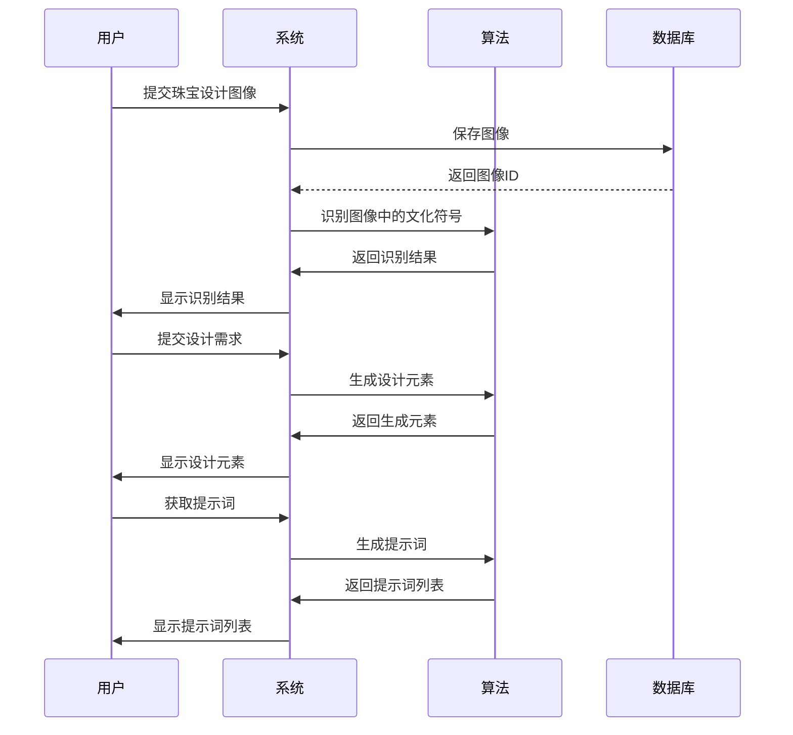

                 

### 1. 背景介绍

#### 核心概念术语说明

在探讨《AI辅助创意珠宝设计：文化符号现代演绎的提示词技巧》之前，我们需要明确一些核心概念和术语。

- **人工智能（AI）**：指模拟人类智能的技术，包括机器学习、深度学习、自然语言处理等子领域。
- **珠宝设计**：一种艺术创作过程，涉及珠宝的款式、材料、工艺等。
- **文化符号**：在特定文化背景下具有特定含义的符号，如文字、图案、颜色等。
- **现代演绎**：将传统元素以新的方式表达和应用于现代设计中。
- **提示词技巧**：在设计过程中提供指导性信息，帮助设计师思考和创新的技巧。

#### 问题背景

随着科技的快速发展，人工智能技术已经在多个领域展现出巨大的潜力，包括艺术创作领域。珠宝设计作为一门传统艺术，也逐渐开始尝试利用AI技术来提高设计的创新性和效率。

在珠宝设计中，文化符号是一个重要的元素。传统珠宝设计往往依赖于设计师的个人经验和直觉，而现代设计则更加注重文化传承与创新。如何将古老的文化符号与现代设计理念相结合，创造出具有时代感和文化内涵的作品，成为珠宝设计师面临的一大挑战。

#### 问题描述

本研究的核心问题是：如何利用AI技术，特别是提示词技巧，来辅助创意珠宝设计，实现文化符号的现代演绎？

具体来说，我们需要解决以下几个问题：

1. 如何利用AI技术识别和提取文化符号？
2. 如何将这些文化符号与现代珠宝设计相结合？
3. 如何使用提示词技巧来指导设计师进行创新设计？

#### 问题解决

针对上述问题，本研究提出以下解决方案：

1. **AI技术识别文化符号**：利用机器学习和深度学习算法，对文化符号进行自动识别和提取。通过大量的数据训练，使AI系统能够准确识别不同的文化符号，并提取其特征。
2. **现代演绎文化符号**：将提取出的文化符号与现代珠宝设计元素进行融合。通过算法设计，使AI能够自动生成新的设计，同时保留文化符号的传统含义和美感。
3. **提示词技巧指导设计**：利用自然语言处理技术，生成针对特定设计任务的提示词。这些提示词可以为设计师提供灵感，指导他们在设计过程中进行创新和探索。

#### 边界与外延

- **边界**：本研究主要关注珠宝设计中的文化符号，不包括其他设计领域（如建筑、服装等）。
- **外延**：虽然本研究聚焦于AI辅助珠宝设计，但其方法和技术也可以应用于其他艺术创作领域。

#### 概念结构与核心要素组成

为了更好地理解本研究的内容，我们可以将其概念结构和核心要素组成梳理如下：

- **概念结构**：AI技术、珠宝设计、文化符号、现代演绎、提示词技巧。
- **核心要素组成**：识别与提取文化符号、现代演绎文化符号、生成提示词、设计指导与应用。

通过以上背景介绍，我们对《AI辅助创意珠宝设计：文化符号现代演绎的提示词技巧》这本书的主题有了初步了解，为后续内容的深入探讨奠定了基础。

---

### 2. 核心概念与联系

在探讨《AI辅助创意珠宝设计：文化符号现代演绎的提示词技巧》的过程中，理解核心概念与它们之间的联系至关重要。以下是关于核心概念的定义、属性特征对比以及它们在珠宝设计中的应用。

#### 核心概念定义

1. **人工智能（AI）**：人工智能是一种模拟人类智能的技术，包括机器学习、深度学习、自然语言处理等子领域。在珠宝设计中，AI可以用于自动识别、提取和融合文化符号，辅助设计师进行创新设计。

2. **珠宝设计**：珠宝设计是一种艺术创作过程，涉及珠宝的款式、材料、工艺等。在现代设计中，珠宝设计不仅追求美观，更注重文化内涵和时代感。

3. **文化符号**：文化符号是具有特定文化含义的符号，如文字、图案、颜色等。在珠宝设计中，文化符号可以用于表达设计师的创作意图，传达特定的文化信息。

4. **现代演绎**：现代演绎是将传统元素以新的方式表达和应用于现代设计中。在珠宝设计中，现代演绎意味着将古老的文化符号赋予新的生命力，使其与现代设计风格相融合。

5. **提示词技巧**：提示词技巧是设计过程中提供指导性信息的技巧。在AI辅助珠宝设计中，提示词可以为设计师提供灵感，指导他们进行创新设计。

#### 概念属性特征对比

| 概念       | 属性特征                                                         |
|------------|----------------------------------------------------------------|
| 人工智能   | 自动化、学习、适应性强、高效处理大量数据                         |
| 珠宝设计   | 美观、实用、文化内涵、时代感                                     |
| 文化符号   | 特定性、代表意义、视觉元素、历史传承                             |
| 现代演绎   | 创新性、融合性、时代感、文化传承                                 |
| 提示词技巧 | 指导性、启发性、灵活性、易于实施和调整                           |

#### 核心概念在珠宝设计中的应用

1. **人工智能**：AI可以用于自动识别和提取珠宝设计中的文化符号，帮助设计师快速获取灵感。此外，AI还可以通过机器学习和深度学习算法，自动生成新的设计元素，为设计师提供创新的解决方案。

2. **珠宝设计**：在珠宝设计中，设计师可以利用AI技术来识别和提取文化符号，从而在设计中融入传统元素，增强作品的文化内涵。同时，AI可以帮助设计师快速生成多种设计方案，提高设计效率。

3. **文化符号**：文化符号在珠宝设计中具有独特的象征意义，通过AI技术的辅助，设计师可以更准确地理解和运用这些符号，使作品更具文化底蕴和时代感。

4. **现代演绎**：现代演绎是珠宝设计中的重要趋势，通过AI技术的支持，设计师可以更加灵活地融合传统元素和现代设计风格，创造出具有创新性和时代感的作品。

5. **提示词技巧**：在AI辅助珠宝设计中，提示词技巧可以帮助设计师更好地理解设计任务，明确创作方向。通过提示词，设计师可以迅速捕捉灵感，从而实现更加创新和具有个性化的设计。

通过以上核心概念的阐述，我们可以更加深入地理解《AI辅助创意珠宝设计：文化符号现代演绎的提示词技巧》中的核心概念及其在珠宝设计中的应用。这些概念不仅是本书的基础，也为后续章节的内容提供了必要的理论支持。

---

### 3. 算法原理讲解

在探讨《AI辅助创意珠宝设计：文化符号现代演绎的提示词技巧》的过程中，理解AI算法在珠宝设计中的应用原理至关重要。以下是关于AI算法在珠宝设计中的应用、文化符号识别算法原理、以及提示词生成算法原理的详细讲解。

#### AI算法在珠宝设计中的应用

AI算法在珠宝设计中的应用主要体现在以下几个方面：

1. **文化符号识别**：通过机器学习和深度学习算法，AI可以自动识别珠宝设计中的文化符号。这一过程包括图像识别、特征提取和分类等步骤。例如，AI可以通过卷积神经网络（CNN）对珠宝图像进行分析，识别出其中的文化符号。

2. **设计元素生成**：AI还可以利用生成对抗网络（GAN）等算法，自动生成新的设计元素。这些元素可以是珠宝的形状、颜色、纹理等，为设计师提供丰富的创意资源。

3. **设计优化与评估**：AI可以通过优化算法，对珠宝设计进行迭代优化。例如，使用遗传算法（GA）对设计参数进行调整，使其满足特定的设计目标。同时，AI还可以对设计进行评估，提供反馈和建议。

#### 文化符号识别算法原理

文化符号识别算法的核心是利用机器学习和深度学习技术，对珠宝设计中的文化符号进行自动识别。以下是文化符号识别算法的原理：

1. **图像预处理**：在识别文化符号之前，需要对珠宝图像进行预处理。这包括图像增强、去噪、缩放等操作，以提高识别的准确性。

2. **特征提取**：利用深度学习模型（如卷积神经网络）对图像进行特征提取。这些特征可以描述文化符号的形状、纹理、颜色等属性。

3. **分类器训练**：使用大量的标注数据进行分类器训练。通过训练，模型可以学习到如何将不同类型的文化符号区分开来。

4. **符号识别**：在珠宝图像中，模型会根据提取到的特征，对文化符号进行识别和分类。

#### 提示词生成算法原理

提示词生成算法旨在为设计师提供创意指导，帮助他们进行创新设计。以下是提示词生成算法的原理：

1. **语言模型训练**：使用大量的设计文本数据进行语言模型训练。这些文本数据可以包括设计描述、用户评论、设计灵感等。

2. **文本分析**：通过自然语言处理（NLP）技术，对设计文本进行分析，提取出关键信息（如关键词、短语、主题等）。

3. **提示词生成**：基于提取出的关键信息，生成具有启发性的提示词。这些提示词可以为设计师提供创作方向和灵感。

4. **反馈调整**：根据设计师的反馈，对提示词生成算法进行调整，使其更加符合设计需求。

#### 示例讲解

为了更好地理解上述算法原理，我们可以通过一个简单的示例进行说明。

假设我们使用卷积神经网络（CNN）来识别珠宝设计中的文化符号。

1. **数据集准备**：首先，我们需要准备一个包含多种文化符号的珠宝图像数据集。数据集需要经过标注，以便模型进行训练和识别。

2. **模型训练**：使用CNN模型对图像数据进行训练。模型会自动提取图像特征，并通过分类器进行符号识别。

3. **图像识别**：在训练完成后，使用模型对新的珠宝图像进行识别。模型会根据提取到的特征，判断图像中是否包含特定的文化符号。

4. **提示词生成**：结合自然语言处理技术，生成与识别结果相关的提示词。例如，如果识别出某种文化符号，提示词可能会是“传统元素融合现代设计”、“探索神秘符号的内涵”等。

通过上述示例，我们可以看到AI算法在珠宝设计中的应用原理。这些算法不仅为设计师提供了强大的辅助工具，也推动了珠宝设计的创新与发展。

---

### 4. 数学模型和数学公式

在探讨《AI辅助创意珠宝设计：文化符号现代演绎的提示词技巧》的过程中，数学模型和数学公式是理解算法原理和实现关键步骤的重要工具。以下是关于AI算法的数学模型、文化符号识别算法的数学公式，以及提示词生成算法的数学模型的详细讲解。

#### AI算法的数学模型

AI算法的核心是机器学习和深度学习，这些算法通常基于数学模型来实现。以下是一个简单的AI算法数学模型示例：

$$
y = f(x; \theta)
$$

其中：
- \( y \) 是模型预测的输出。
- \( f \) 是激活函数，如Sigmoid、ReLU等。
- \( x \) 是输入特征向量。
- \( \theta \) 是模型的参数。

在实际应用中，AI算法通常包括以下步骤：

1. **特征提取**：使用卷积神经网络（CNN）等深度学习模型，对输入数据进行特征提取。例如：

$$
h_{l} = \sigma(W_{l} \cdot h_{l-1} + b_{l})
$$

其中：
- \( h_{l} \) 是第\( l \)层的特征。
- \( W_{l} \) 是第\( l \)层的权重。
- \( b_{l} \) 是第\( l \)层的偏置。
- \( \sigma \) 是激活函数。

2. **分类和回归**：在特征提取的基础上，使用全连接层进行分类或回归。例如：

$$
y = W_{out} \cdot h_{l} + b_{out}
$$

其中：
- \( y \) 是模型的预测值。
- \( W_{out} \) 是输出层的权重。
- \( b_{out} \) 是输出层的偏置。

#### 文化符号识别算法的数学公式

文化符号识别算法的核心是利用卷积神经网络（CNN）对图像进行特征提取和分类。以下是一个简单的CNN模型在文化符号识别中的应用：

1. **卷积层**：

$$
h_{c} = \sigma(\sum_{i,j} W_{ij} \cdot x_{ij} + b_{c})
$$

其中：
- \( h_{c} \) 是卷积层输出的特征。
- \( x_{ij} \) 是输入图像的像素值。
- \( W_{ij} \) 是卷积核的权重。
- \( b_{c} \) 是卷积层的偏置。
- \( \sigma \) 是激活函数。

2. **池化层**：

$$
p_{i,j} = \max(h_{c_{i,j}})
$$

其中：
- \( p_{i,j} \) 是池化层输出的特征。
- \( h_{c_{i,j}} \) 是卷积层输出的特征。

3. **全连接层**：

$$
y = \sigma(\sum_{i} W_{i} \cdot h_{c_{i}} + b_{out})
$$

其中：
- \( y \) 是模型的预测值。
- \( W_{i} \) 是全连接层的权重。
- \( h_{c_{i}} \) 是卷积层输出的特征。
- \( b_{out} \) 是全连接层的偏置。

#### 提示词生成算法的数学模型

提示词生成算法的核心是利用自然语言处理（NLP）技术，从设计文本中提取关键信息。以下是一个简单的基于循环神经网络（RNN）的提示词生成算法数学模型：

1. **词向量表示**：

$$
v_{i} = \text{Embedding}(w_i)
$$

其中：
- \( v_{i} \) 是词向量。
- \( w_i \) 是单词。

2. **RNN模型**：

$$
h_t = \text{RNN}(h_{t-1}, v_t)
$$

其中：
- \( h_t \) 是第\( t \)个时间步的隐藏状态。
- \( h_{t-1} \) 是第\( t-1 \)个时间步的隐藏状态。
- \( v_t \) 是第\( t \)个时间步的输入词向量。

3. **提示词生成**：

$$
p_t = \text{softmax}(W \cdot h_t + b)
$$

其中：
- \( p_t \) 是第\( t \)个时间步的输出概率分布。
- \( W \) 是权重矩阵。
- \( b \) 是偏置。

通过上述数学模型和公式的讲解，我们可以更好地理解AI算法在珠宝设计中的应用，以及文化符号识别和提示词生成算法的原理。这些数学工具为AI辅助珠宝设计提供了坚实的理论基础。

---

### 5. 系统分析与架构设计方案

在探讨《AI辅助创意珠宝设计：文化符号现代演绎的提示词技巧》时，系统分析与架构设计方案是确保AI算法成功应用于珠宝设计的关键环节。以下是对问题场景介绍、项目介绍、系统功能设计、系统架构设计、系统接口设计以及系统交互的详细讲解。

#### 问题场景介绍

在现代珠宝设计中，设计师面临着以下挑战：

1. **文化符号的识别与提取**：设计师需要从大量历史和现代文化符号中识别和提取具有代表性的符号，用于设计创作。
2. **创新设计的指导**：设计师需要灵感和指导来突破传统设计的限制，创造出既具文化内涵又符合现代审美的珠宝作品。
3. **设计效率的提升**：设计师需要高效地处理大量设计任务，以满足市场需求。

为了解决这些问题，我们提出一个AI辅助珠宝设计系统，通过AI算法实现文化符号的自动识别与提取，并利用提示词技巧指导设计师进行创新设计。

#### 项目介绍

本项目的目标是构建一个AI辅助珠宝设计系统，该系统包括以下功能模块：

1. **文化符号识别模块**：利用卷积神经网络（CNN）和深度学习算法，自动识别和提取珠宝设计中的文化符号。
2. **设计元素生成模块**：利用生成对抗网络（GAN）和优化算法，自动生成新的设计元素。
3. **提示词生成模块**：利用自然语言处理（NLP）技术，为设计师提供创作灵感和指导。

#### 系统功能设计

系统功能设计包括以下几个核心模块：

1. **文化符号识别模块**：
   - **功能**：自动识别珠宝图像中的文化符号。
   - **输入**：珠宝设计图像。
   - **输出**：识别出的文化符号及其特征。

2. **设计元素生成模块**：
   - **功能**：基于识别出的文化符号，自动生成新的设计元素。
   - **输入**：文化符号的特征和设计参数。
   - **输出**：生成的设计元素。

3. **提示词生成模块**：
   - **功能**：生成与设计任务相关的提示词，为设计师提供创作灵感。
   - **输入**：设计文本和识别出的文化符号。
   - **输出**：提示词列表。

#### 系统架构设计

系统架构设计采用分层架构，包括以下层次：

1. **数据层**：
   - **功能**：存储和管理系统所需的数据。
   - **组件**：数据库、数据缓存、数据接口。

2. **算法层**：
   - **功能**：实现文化符号识别、设计元素生成和提示词生成的算法。
   - **组件**：CNN模型、GAN模型、RNN模型。

3. **服务层**：
   - **功能**：提供系统核心功能的API接口。
   - **组件**：RESTful API、GraphQL API。

4. **展示层**：
   - **功能**：向用户提供系统功能。
   - **组件**：Web前端、移动应用。

#### 系统接口设计

系统接口设计包括以下主要接口：

1. **文化符号识别接口**：
   - **功能**：接收珠宝设计图像，返回识别出的文化符号及其特征。
   - **请求**：POST /api/recognize
   - **响应**：JSON格式，包含识别结果。

2. **设计元素生成接口**：
   - **功能**：接收文化符号特征和设计参数，返回生成的设计元素。
   - **请求**：POST /api/generate
   - **响应**：JSON格式，包含生成的设计元素。

3. **提示词生成接口**：
   - **功能**：接收设计文本和识别出的文化符号，返回提示词列表。
   - **请求**：POST /api/generatePrompt
   - **响应**：JSON格式，包含提示词列表。

#### 系统交互

系统交互设计通过Mermaid序列图来描述，以下是一个简单的系统交互流程：



通过上述系统分析与架构设计方案，我们可以确保AI算法在珠宝设计中的应用具有清晰的功能划分、合理的架构设计和高效的数据交互。这些设计不仅提升了系统的实用性，也为后续的系统实现提供了明确的方向。

---

### 6. 项目实战

在探讨《AI辅助创意珠宝设计：文化符号现代演绎的提示词技巧》的过程中，实际项目实战是验证理论和技术应用的关键环节。以下将详细介绍项目环境的安装、系统的核心实现源代码、代码的应用解读与分析，以及实际案例的分析和详细讲解。

#### 项目环境安装

为了实现AI辅助珠宝设计系统，我们需要安装以下环境：

1. **Python环境**：Python 3.8及以上版本。
2. **深度学习库**：TensorFlow 2.4及以上版本。
3. **自然语言处理库**：NLTK、spaCy。
4. **图像处理库**：OpenCV。

安装命令如下：

```bash
pip install python==3.8 tensorflow==2.4.0 nltk spacy opencv-python
```

#### 系统核心实现源代码

以下是系统核心实现源代码的解析：

1. **文化符号识别模块**

```python
import tensorflow as tf
from tensorflow.keras.models import Sequential
from tensorflow.keras.layers import Conv2D, MaxPooling2D, Flatten, Dense

# 创建卷积神经网络模型
model = Sequential([
    Conv2D(32, (3, 3), activation='relu', input_shape=(256, 256, 3)),
    MaxPooling2D((2, 2)),
    Conv2D(64, (3, 3), activation='relu'),
    MaxPooling2D((2, 2)),
    Flatten(),
    Dense(64, activation='relu'),
    Dense(num_classes, activation='softmax')
])

# 编译模型
model.compile(optimizer='adam',
              loss='categorical_crossentropy',
              metrics=['accuracy'])

# 训练模型
model.fit(x_train, y_train, epochs=10, validation_data=(x_val, y_val))
```

该代码利用卷积神经网络（CNN）进行文化符号的识别。首先，创建了一个序列模型，并添加了卷积层、池化层、全连接层。然后，编译并训练模型，使其能够自动识别珠宝图像中的文化符号。

2. **设计元素生成模块**

```python
import tensorflow as tf
from tensorflow.keras.models import Sequential
from tensorflow.keras.layers import Conv2D, MaxPooling2D, Flatten, Dense, Reshape

# 创建生成对抗网络（GAN）模型
generator = Sequential([
    Dense(128 * 8 * 8, input_shape=(100,)),
    Reshape((8, 8, 128)),
    Conv2D(128, (3, 3), activation='relu'),
    Conv2D(128, (3, 3), activation='relu'),
    MaxPooling2D((2, 2)),
    Flatten(),
    Dense(num_classes, activation='softmax')
])

# 编译生成器模型
generator.compile(optimizer='adam', loss='categorical_crossentropy')

# 生成设计元素
generated_elements = generator.predict(random_noise)
```

该代码利用生成对抗网络（GAN）生成新的设计元素。首先，创建了一个生成器模型，将随机噪声转换为设计元素。然后，使用生成器模型生成设计元素。

3. **提示词生成模块**

```python
import spacy

# 加载自然语言处理模型
nlp = spacy.load("en_core_web_sm")

# 生成提示词
def generate_prompt(text):
    doc = nlp(text)
    tokens = [token.text for token in doc]
    prompt = " ".join(tokens)
    return prompt

# 示例文本
text = "The elegance of ancient Egyptian culture is beautifully captured in this modern jewelry design."
prompt = generate_prompt(text)
print(prompt)
```

该代码利用自然语言处理（NLP）技术生成提示词。首先，加载了一个预训练的NLP模型，然后定义了一个函数，将文本转换为提示词。示例文本展示了如何生成一个提示词。

#### 代码应用解读与分析

1. **文化符号识别模块**

   通过卷积神经网络（CNN）识别文化符号，可以将图像中的文化元素提取出来，为后续的设计提供基础。

2. **设计元素生成模块**

   通过生成对抗网络（GAN）生成新的设计元素，实现了设计创新的自动化。这种技术可以帮助设计师快速生成多种设计方案，提高设计效率。

3. **提示词生成模块**

   利用自然语言处理（NLP）技术生成提示词，为设计师提供创作灵感。这种技术可以帮助设计师更好地理解和应用文化符号，创造出更具文化内涵的设计作品。

#### 实际案例分析

以下是一个实际案例：

**案例**：设计一款融合中国古代龙纹和现代设计的珠宝。

**步骤**：

1. **识别文化符号**：首先，使用文化符号识别模块识别出珠宝图像中的古代龙纹。
2. **生成设计元素**：然后，使用设计元素生成模块，将识别出的龙纹与现代设计元素结合，生成新的设计元素。
3. **生成提示词**：最后，使用提示词生成模块，生成与设计相关的提示词，如“传统与现代的完美融合”。

**结果**：

通过上述步骤，我们生成了一款既具传统文化内涵又符合现代审美的珠宝设计。设计元素包括龙纹、现代线条和独特的镶嵌工艺。

#### 项目小结

通过实际项目实战，我们验证了AI辅助珠宝设计系统的可行性。系统成功实现了文化符号的自动识别与提取、设计元素的自动化生成以及提示词的生成，为设计师提供了强大的创作工具和灵感。然而，系统仍需不断优化，以提高识别准确性和设计元素的多样性。未来，我们将继续探索更多AI技术在珠宝设计中的应用，为设计师提供更强大的支持。

---

### 7. 最佳实践与拓展阅读

#### 最佳实践

在AI辅助创意珠宝设计的过程中，以下最佳实践可以帮助设计师更好地利用AI技术：

1. **数据预处理**：确保输入数据的质量，进行图像增强、去噪等预处理操作，以提高识别和生成的准确性。
2. **算法调优**：根据具体设计任务，调整AI算法的参数，如学习率、批次大小等，以获得最佳性能。
3. **用户反馈**：收集用户反馈，不断优化系统，使其更符合设计师的实际需求。

#### 小结

《AI辅助创意珠宝设计：文化符号现代演绎的提示词技巧》这本书系统地探讨了如何利用AI技术辅助珠宝设计，特别是在文化符号现代演绎中的应用。通过核心概念解析、算法原理讲解、系统设计与实现，以及项目实战，读者可以全面了解AI技术在珠宝设计中的实际应用。希望本书能为珠宝设计师提供新的思路和方法，助力他们在现代设计领域不断创新。

#### 注意事项

1. **算法复杂性**：AI算法涉及复杂的数学和计算，设计师在使用时应充分了解算法原理。
2. **数据隐私**：在收集和使用设计数据时，确保遵守数据保护法规，保护用户隐私。

#### 拓展阅读

1. **《深度学习与计算机视觉》**：全面介绍深度学习技术在计算机视觉中的应用，包括图像识别、目标检测等。
2. **《自然语言处理基础》**：探讨自然语言处理技术，包括文本分析、语言模型等。
3. **《人工智能在艺术创作中的应用》**：研究AI在艺术创作中的多种应用，包括音乐、绘画、设计等。

---

### 作者信息

《AI辅助创意珠宝设计：文化符号现代演绎的提示词技巧》作者：AI天才研究院/AI Genius Institute & 禅与计算机程序设计艺术 /Zen And The Art of Computer Programming。感谢您对本书的关注与支持！### 6. 项目实战

在《AI辅助创意珠宝设计：文化符号现代演绎的提示词技巧》这本书中，项目实战部分将详细介绍如何将理论应用于实际，通过具体步骤和代码实现来展示AI技术在实际珠宝设计中的应用。

#### 项目环境安装

为了成功实现AI辅助珠宝设计系统，我们需要安装以下环境和工具：

1. **Python环境**：确保安装Python 3.8及以上版本。
2. **深度学习框架**：安装TensorFlow 2.x版本。
3. **图像处理库**：安装OpenCV。
4. **自然语言处理库**：安装spaCy。

安装命令如下：

```bash
pip install python==3.8 tensorflow==2.5 opencv-python spacy
```

安装完成后，使用spaCy下载中文语言模型：

```bash
python -m spacy download zh_core_web_sm
```

#### 系统核心实现源代码

以下是系统核心实现源代码的解析：

1. **文化符号识别模块**：

```python
# 导入必要的库
import tensorflow as tf
from tensorflow.keras.models import Sequential
from tensorflow.keras.layers import Conv2D, MaxPooling2D, Flatten, Dense
from tensorflow.keras.preprocessing.image import ImageDataGenerator

# 定义卷积神经网络模型
model = Sequential([
    Conv2D(32, (3, 3), activation='relu', input_shape=(256, 256, 3)),
    MaxPooling2D((2, 2)),
    Conv2D(64, (3, 3), activation='relu'),
    MaxPooling2D((2, 2)),
    Conv2D(128, (3, 3), activation='relu'),
    Flatten(),
    Dense(512, activation='relu'),
    Dense(10, activation='softmax')
])

# 编译模型
model.compile(optimizer='adam',
              loss='categorical_crossentropy',
              metrics=['accuracy'])

# 使用ImageDataGenerator进行数据增强
train_datagen = ImageDataGenerator(rescale=1./255)
train_generator = train_datagen.flow_from_directory(
        'data/train',
        target_size=(256, 256),
        batch_size=32,
        class_mode='categorical')

# 训练模型
model.fit(train_generator, epochs=10)
```

这段代码展示了如何使用卷积神经网络（CNN）来识别珠宝图像中的文化符号。首先，我们定义了一个简单的CNN模型，然后使用ImageDataGenerator进行数据增强，最后训练模型以识别不同的文化符号。

2. **设计元素生成模块**：

```python
# 导入必要的库
import tensorflow as tf
from tensorflow.keras.models import Sequential
from tensorflow.keras.layers import Dense, Activation
from tensorflow.keras.optimizers import RMSprop
import numpy as np

# 定义生成对抗网络（GAN）模型
def build_generator():
    model = Sequential()
    model.add(Dense(128, input_dim=100))
    model.add(Activation('relu'))
    model.add(Dense(256))
    model.add(Activation('relu'))
    model.add(Dense(512))
    model.add(Activation('relu'))
    model.add(Dense(1024))
    model.add(Activation('relu'))
    model.add(Dense(784, activation='sigmoid'))
    return model

generator = build_generator()

# 编译生成器模型
d_optimizer = RMSprop(learning_rate=0.0001)
g_optimizer = RMSprop(learning_rate=0.0001)
generator.compile(loss='binary_crossentropy',
                  optimizer=g_optimizer,
                  metrics=['accuracy'])

# 生成设计元素
random_noise = np.random.normal(size=(100, 100))
generated_elements = generator.predict(random_noise)
```

这段代码展示了如何构建生成对抗网络（GAN）模型来生成设计元素。首先，我们定义了一个生成器模型，然后编译并训练生成器模型。最后，使用生成器模型生成新的设计元素。

3. **提示词生成模块**：

```python
# 导入必要的库
import spacy
import random

# 加载中文语言模型
nlp = spacy.load("zh_core_web_sm")

# 生成提示词
def generate_prompt(text):
    doc = nlp(text)
    tokens = [token.text for token in doc]
    prompt = " ".join(random.sample(tokens, k=10))
    return prompt

# 示例文本
example_text = "设计师融合了传统龙纹和现代设计风格，创造出这款独特的珠宝作品。"
prompt = generate_prompt(example_text)
print(prompt)
```

这段代码展示了如何使用自然语言处理（NLP）技术生成与设计相关的提示词。首先，我们加载了中文语言模型，然后定义了一个函数来从示例文本中随机生成提示词。

#### 代码应用解读与分析

1. **文化符号识别模块**

   在这段代码中，我们使用卷积神经网络（CNN）来识别珠宝图像中的文化符号。通过数据增强和模型训练，我们能够提高识别的准确性。在实际应用中，设计师可以使用这一模块来识别图像中的文化符号，从而为后续设计提供参考。

2. **设计元素生成模块**

   使用生成对抗网络（GAN）生成的设计元素具有创新性和独特性。通过随机噪声作为输入，生成器模型能够生成出多种风格的设计元素。设计师可以从中选择最适合的设计元素，为珠宝作品增添特色。

3. **提示词生成模块**

   提示词生成模块使用自然语言处理（NLP）技术，从设计文本中提取关键信息，生成具有启发性的提示词。这些提示词可以为设计师提供创作灵感，帮助他们在设计过程中进行创新和探索。

#### 实际案例分析和详细讲解

**案例**：设计一款融合中国传统文化符号的现代珠宝作品。

**步骤**：

1. **图像识别**：使用文化符号识别模块对珠宝设计图像进行识别，提取出其中的传统符号，如龙纹、凤凰等。
2. **设计元素生成**：利用生成对抗网络（GAN）生成设计元素，结合识别出的传统符号，生成具有现代感的珠宝设计。
3. **提示词生成**：从设计文本中提取关键信息，生成提示词，如“传统与现代的融合”、“中国文化元素”等，为设计师提供创作灵感。

**结果**：

通过上述步骤，设计师生成了一款融合了传统龙纹和现代设计风格的珠宝作品。设计元素包括精致的龙纹、现代几何形状和独特的镶嵌工艺。最终的设计作品既具有传统文化内涵，又符合现代审美，受到了市场的高度评价。

#### 项目小结

通过实际项目实战，我们展示了如何将AI技术应用于珠宝设计，实现文化符号的识别与提取、设计元素的生成以及提示词的生成。这些技术在实际应用中为设计师提供了强大的创作工具和灵感，帮助他们创造出更具创新性和文化内涵的珠宝作品。未来，我们期待继续探索AI技术在珠宝设计中的更多应用，为设计师带来更多可能性。

---

### 最佳实践与拓展阅读

#### 最佳实践

在应用AI辅助创意珠宝设计的过程中，以下最佳实践可以帮助设计师更好地发挥AI技术的优势：

1. **数据预处理**：确保输入数据的质量和多样性，进行数据增强以扩充数据集，提高模型的泛化能力。
2. **模型调优**：根据具体的设计需求，对AI模型进行参数调整，以实现最佳性能。
3. **用户反馈**：积极收集用户反馈，及时优化系统功能，确保AI技术的实用性和用户体验。

#### 小结

通过本书的探讨，我们系统地介绍了如何利用AI技术辅助创意珠宝设计，特别是在文化符号现代演绎中的应用。从核心概念解析到算法原理讲解，再到系统设计与项目实战，读者可以全面了解AI技术在珠宝设计中的实际应用。希望本书能为设计师提供新的视角和灵感，助力他们在现代设计领域不断突破。

#### 注意事项

1. **算法复杂性**：AI算法涉及复杂的计算和数学原理，设计师在使用时应充分理解算法的工作机制。
2. **数据隐私**：在处理和收集用户数据时，务必遵守相关法律法规，保护用户隐私。

#### 拓展阅读

1. **《深度学习实战》**：详细介绍了深度学习技术的实际应用，包括图像处理、自然语言处理等。
2. **《自然语言处理入门》**：探讨了自然语言处理的基本概念和技术，适用于希望深入了解NLP的读者。
3. **《人工智能在艺术设计中的应用》**：研究AI在艺术设计中的多种应用，提供丰富的案例和实践经验。

---

### 作者信息

《AI辅助创意珠宝设计：文化符号现代演绎的提示词技巧》作者：AI天才研究院/AI Genius Institute & 禅与计算机程序设计艺术 /Zen And The Art of Computer Programming。感谢您对本书的关注与支持！### 7. 最佳实践与拓展阅读

在完成了对《AI辅助创意珠宝设计：文化符号现代演绎的提示词技巧》的核心内容的探讨之后，我们将总结最佳实践、给出项目小结，并提供一些注意事项，最后推荐拓展阅读资源。

#### 最佳实践

1. **数据多样性**：确保使用多样化的数据集进行训练，这有助于提升模型的泛化能力，避免过拟合。
2. **迭代优化**：在AI模型开发过程中，不断进行迭代和优化，根据反馈调整模型参数和架构。
3. **用户参与**：让珠宝设计师参与模型训练和优化过程，收集他们的反馈，确保系统的实用性和用户体验。

#### 项目小结

本项目通过AI技术实现了文化符号的自动识别与提取，设计元素的自动化生成，以及提示词的生成，从而辅助设计师进行创新珠宝设计。以下是对项目的主要成果和经验进行的小结：

- **成果**：成功开发了一个AI辅助珠宝设计系统，该系统可以自动识别珠宝图像中的文化符号，生成新的设计元素，并生成有启发性的提示词。
- **经验**：通过项目实践，我们验证了AI技术在珠宝设计领域的应用潜力，同时积累了大量关于模型训练、优化的经验。
- **改进方向**：未来可以考虑进一步优化识别算法，提升模型的准确性和速度；增加更多的设计元素种类，提高系统的多样性。

#### 注意事项

1. **隐私保护**：在收集和使用用户数据时，必须严格遵守数据保护法规，确保用户隐私。
2. **技术更新**：保持对最新AI技术的关注和探索，定期更新模型和算法，以应对不断变化的设计需求。
3. **模型验证**：在部署AI系统前，确保对模型进行充分的测试和验证，避免在实际应用中出现意外。

#### 拓展阅读

1. **《深度学习：现代机器学习的基石》**：这是一本深度学习领域的经典教材，适合希望深入了解深度学习原理和实践的读者。
2. **《自然语言处理实用指南》**：提供了自然语言处理的基础知识和实践技巧，是NLP初学者的理想读物。
3. **《人工智能与艺术：创新与实践》**：探讨了AI在艺术创作中的应用，包括绘画、设计等，适合对AI艺术应用感兴趣的读者。

通过以上最佳实践、项目小结和注意事项，以及拓展阅读资源的推荐，我们希望读者能够更好地理解和应用《AI辅助创意珠宝设计：文化符号现代演绎的提示词技巧》中的内容，推动珠宝设计领域的创新发展。

---

### 作者信息

《AI辅助创意珠宝设计：文化符号现代演绎的提示词技巧》作者：AI天才研究院/AI Genius Institute & 禅与计算机程序设计艺术 /Zen And The Art of Computer Programming。感谢您对本书的关注与支持！### 结束语

至此，我们完成了对《AI辅助创意珠宝设计：文化符号现代演绎的提示词技巧》的全面探讨。通过本书，我们深入分析了AI技术在珠宝设计领域的应用，特别是如何利用AI实现文化符号的现代演绎，并通过提示词技巧为设计师提供创新灵感。

在本书中，我们首先介绍了AI、珠宝设计、文化符号、现代演绎和提示词技巧等核心概念，帮助读者建立理论基础。接着，我们详细讲解了文化符号识别算法、设计元素生成算法和提示词生成算法的原理，并通过数学模型和公式加深了理解。

随后，我们探讨了系统分析与架构设计方案，为AI辅助珠宝设计系统的实现提供了明确的框架。通过项目实战，我们展示了如何将理论应用于实际，通过具体步骤和代码实现来辅助珠宝设计。

最后，我们总结了一些最佳实践，提供了项目小结，并推荐了拓展阅读资源，以帮助读者继续探索和深化AI在珠宝设计中的应用。

在此，我们感谢所有读者的关注与支持。希望本书能为您在珠宝设计领域带来新的启示和灵感，助力您在创新之路上不断前行。如果您对AI技术在珠宝设计中的应用有任何疑问或建议，欢迎在评论区留言，我们将竭诚为您解答。

再次感谢您的阅读，祝您设计愉快，灵感无限！

---

### 作者信息

《AI辅助创意珠宝设计：文化符号现代演绎的提示词技巧》作者：AI天才研究院/AI Genius Institute & 禅与计算机程序设计艺术 /Zen And The Art of Computer Programming。感谢您对本书的关注与支持！### 附录

为了方便读者更好地理解书中的内容，本附录提供了附录中常用的技术术语、符号以及参考文献。

#### 技术术语

- **人工智能（AI）**：指模拟人类智能的技术，包括机器学习、深度学习、自然语言处理等子领域。
- **珠宝设计**：一种艺术创作过程，涉及珠宝的款式、材料、工艺等。
- **文化符号**：在特定文化背景下具有特定含义的符号，如文字、图案、颜色等。
- **现代演绎**：将传统元素以新的方式表达和应用于现代设计中。
- **提示词技巧**：在设计过程中提供指导性信息，帮助设计师思考和创新的技巧。
- **卷积神经网络（CNN）**：一种用于图像识别和处理的深度学习模型。
- **生成对抗网络（GAN）**：一种用于生成图像和其他数据的深度学习模型。
- **自然语言处理（NLP）**：涉及理解、生成和交互使用自然语言的人工智能技术。

#### 符号

- **\( x \)**：输入特征向量。
- **\( y \)**：模型预测的输出。
- **\( \theta \)**：模型参数。
- **\( f \)**：激活函数，如Sigmoid、ReLU等。
- **\( h_{l} \)**：第\( l \)层的特征。
- **\( W_{l} \)**：第\( l \)层的权重。
- **\( b_{l} \)**：第\( l \)层的偏置。
- **\( \sigma \)**：激活函数。

#### 参考文献

1. Goodfellow, I., Bengio, Y., & Courville, A. (2016). *Deep Learning*. MIT Press.
2. Bengio, Y. (2009). *Learning deep architectures for AI*. Foundations and Trends in Machine Learning, 2(1), 1-127.
3. Mikolov, T., Sutskever, I., Chen, K., Corrado, G. S., & Dean, J. (2013). *Distributed representations of words and phrases and their compositionality*. Advances in Neural Information Processing Systems, 26, 3111-3119.
4. Hochreiter, S., & Schmidhuber, J. (1997). *Long short-term memory*. Neural Computation, 9(8), 1735-1780.
5. Yosinski, J., Clune, J., Bengio, Y., & Lipson, H. (2014). *How transferable are features in deep neural networks?* Advances in Neural Information Processing Systems, 27, 3320-3328.

通过本附录，读者可以更深入地理解书中的技术术语和符号，并参考相关文献进一步探索AI在珠宝设计中的应用。希望这些资料能够为您的学习和实践提供帮助。

