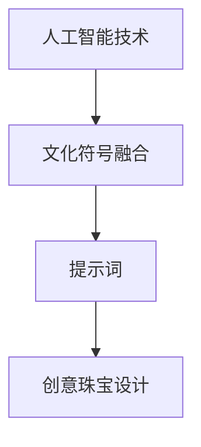
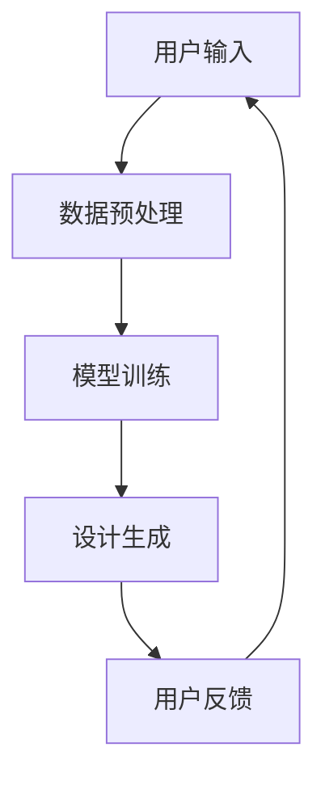

                 


## AI辅助创意珠宝设计：文化符号融合的提示词技巧

### 关键词：人工智能、珠宝设计、文化符号、提示词、融合技巧

### 摘要：
随着人工智能技术的不断发展，AI在创意设计领域的应用越来越广泛。本文将探讨如何利用AI技术辅助创意珠宝设计，特别是文化符号的融合。我们将从设计思路、核心概念、算法原理、数学模型、系统架构、项目实战及最佳实践等方面，逐步阐述AI辅助创意珠宝设计的方法与技巧。

### 设计思路

#### 1. 明确目标与需求

首先，我们需要明确AI辅助创意珠宝设计的具体目标与需求。这包括：

- 设计出具有文化特色的珠宝作品
- 提高设计效率，降低人力成本
- 创造多样化的设计风格，满足市场需求

#### 2. 数据收集与处理

为了实现上述目标，我们需要收集大量与文化符号相关的数据，如历史文献、艺术作品、珠宝设计资料等。然后，通过数据清洗和处理，将数据转化为适合AI训练的格式。

#### 3. 核心概念与联系

在AI辅助设计过程中，核心概念包括：

- 人工智能技术：如深度学习、神经网络等
- 文化符号：如传统图案、历史故事、宗教信仰等
- 提示词：用于引导AI模型生成创意设计的关键词汇

这些概念之间存在紧密联系，如图1所示：



#### 4. 算法原理讲解

AI辅助创意珠宝设计的核心在于利用算法实现文化符号的融合。以下是一个简单的算法流程：

1. 提取文化符号的特征
2. 构建神经网络模型
3. 输入提示词，生成创意珠宝设计

具体实现可以参考以下Python代码：

```python
import tensorflow as tf
from tensorflow.keras.layers import Input, Dense, LSTM, Embedding
from tensorflow.keras.models import Model

# 输入层
input_layer = Input(shape=(100,))

# embedding层
embedding_layer = Embedding(input_dim=10000, output_dim=128)(input_layer)

# LSTM层
lstm_layer = LSTM(128, return_sequences=True)(embedding_layer)

# 输出层
output_layer = Dense(1, activation='sigmoid')(lstm_layer)

# 构建模型
model = Model(inputs=input_layer, outputs=output_layer)

# 编译模型
model.compile(optimizer='adam', loss='binary_crossentropy', metrics=['accuracy'])

# 模型训练
model.fit(x_train, y_train, epochs=10, batch_size=32)
```

#### 5. 数学模型和数学公式讲解

为了更好地理解算法原理，我们需要引入一些数学模型和公式。以下是一个简化的数学模型：

$$
y = f(W_1x_1 + W_2x_2 + ... + W_nx_n)
$$

其中，$y$ 表示生成的珠宝设计，$x_1, x_2, ..., x_n$ 表示输入的文化符号特征，$W_1, W_2, ..., W_n$ 表示权重。

#### 6. 系统分析与架构设计方案

在系统设计方面，我们需要考虑以下问题：

- 问题场景介绍：如珠宝设计师的需求、市场需求等
- 项目介绍：如珠宝设计平台、AI模型训练等
- 系统功能设计：如文化符号识别、珠宝设计生成等
- 系统架构设计：如数据存储、模型训练、设计生成等
- 系统接口设计和系统交互：如前端界面、API接口等

以下是一个简化的系统架构图：



#### 7. 项目实战

在项目实战中，我们需要完成以下任务：

- 环境安装：安装Python、TensorFlow等依赖库
- 系统核心实现源代码：编写数据预处理、模型训练、设计生成等代码
- 代码应用解读与分析：分析代码实现，理解算法原理
- 实际案例分析和详细讲解剖析：分析实际案例，讲解设计过程
- 项目小结：总结项目成果，提出改进建议

#### 8. 最佳实践 tips、小结、注意事项、拓展阅读

在AI辅助创意珠宝设计过程中，我们还需要注意以下几点：

- 数据质量：确保输入数据的质量，提高模型效果
- 模型优化：不断优化模型参数，提高设计质量
- 文化符号的准确性：确保文化符号的准确性，避免设计误解
- 用户反馈：及时收集用户反馈，优化设计结果

此外，本文还介绍了AI辅助创意珠宝设计的核心概念、算法原理、数学模型、系统架构和项目实战等内容，旨在为读者提供一份全面、系统的指南。

### 结论

本文从设计思路、核心概念、算法原理、数学模型、系统架构、项目实战及最佳实践等方面，探讨了AI辅助创意珠宝设计的方法与技巧。通过本文的阐述，读者可以了解到如何利用AI技术实现文化符号的融合，从而提高珠宝设计的创意性和市场竞争力。在未来的研究中，我们将进一步探索AI技术在珠宝设计领域的应用，为设计师提供更强大的辅助工具。

### 作者信息

作者：AI天才研究院/AI Genius Institute & 禅与计算机程序设计艺术 /Zen And The Art of Computer Programming

---

在本文中，我们首先明确了AI辅助创意珠宝设计的核心目标与需求，然后从数据收集、核心概念、算法原理、数学模型、系统架构、项目实战等方面，详细阐述了AI辅助创意珠宝设计的具体方法与技巧。通过本文的介绍，读者可以了解到如何利用AI技术实现文化符号的融合，为珠宝设计师提供更加智能化的辅助工具。在未来的发展中，我们将继续探索AI技术在珠宝设计领域的应用，为设计师创造更多价值。作者：AI天才研究院/AI Genius Institute & 禅与计算机程序设计艺术 /Zen And The Art of Computer Programming

