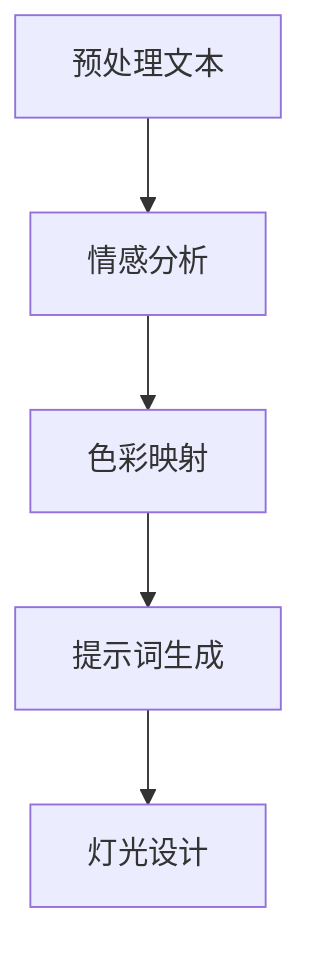
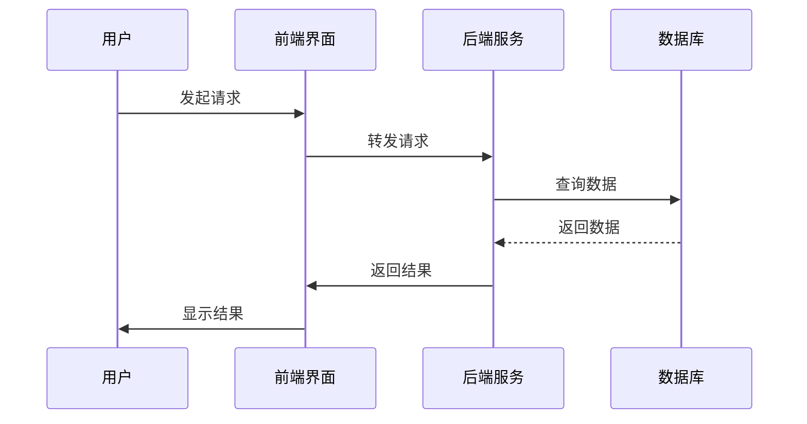
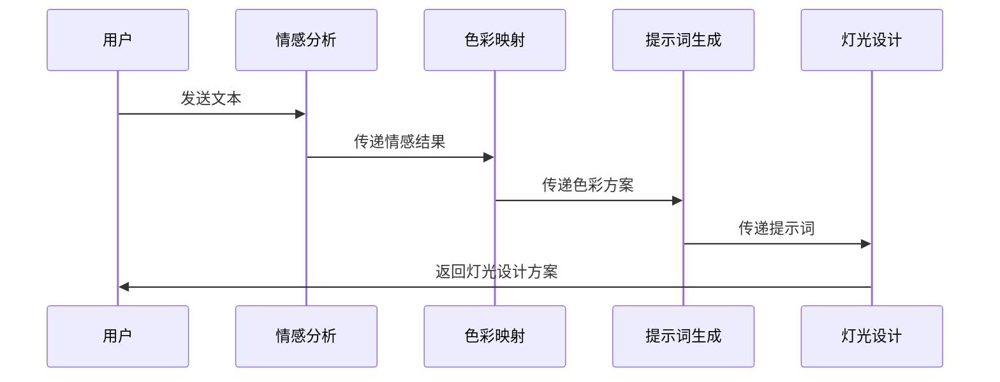

                 

# AI辅助创意舞台灯光设计：情感-色彩映射的提示词技巧

关键词：AI辅助舞台灯光设计、情感分析、色彩映射、提示词技巧

摘要：
本文旨在探讨如何利用AI技术实现情感-色彩映射的提示词技巧，辅助创意舞台灯光设计。通过深入分析AI算法、情感分析和色彩映射技术，本文提出了一种基于深度学习和自然语言处理的方法，详细阐述了算法原理、实现步骤和实际应用效果，为舞台灯光设计提供了新的思路和工具。

## 第1章: 引言

### 1.1 问题背景

随着科技的发展，人工智能（AI）在各个领域的应用越来越广泛。舞台灯光设计作为艺术与科技的交叉点，也逐渐受到AI的深度影响。传统的舞台灯光设计主要依赖于设计师的经验和直觉，而AI辅助舞台灯光设计则可以通过智能算法和大数据技术，提供更加精准和高效的解决方案。本文将聚焦于如何利用AI实现情感-色彩映射的提示词技巧，从而提升创意舞台灯光设计的质量。

舞台灯光设计是一个复杂的过程，它涉及到艺术与技术的融合。设计师需要在考虑表演内容、场景气氛、观众心理等多方面因素的基础上，通过灯光的明暗、色彩、运动等元素，创造出具有视觉冲击力和情感表达力的舞台效果。然而，传统的舞台灯光设计往往依赖于设计师的个人经验和审美，难以满足多样化的需求。随着AI技术的发展，利用AI进行舞台灯光设计成为可能。

情感-色彩映射的提示词技巧是将情感分析、色彩映射和自然语言处理等技术相结合的一种创新方法。通过情感分析，可以识别出表演者的情感状态，如快乐、悲伤、紧张等；通过色彩映射，可以将这些情感状态映射到不同的色彩方案中；而提示词技巧则可以帮助设计师更加直观地理解和操作AI系统，从而实现更加精准和个性化的舞台灯光设计。

### 1.2 问题描述

舞台灯光设计作为一门综合性艺术，不仅要求设计师具备扎实的艺术功底，还需要掌握一定的技术知识。然而，随着舞台表演形式和内容的多样化，传统的设计方法往往难以满足现代舞台灯光的需求。因此，如何利用AI技术辅助舞台灯光设计，成为一个亟待解决的问题。

首先，传统舞台灯光设计的主要挑战在于如何通过灯光实现情感的表达。灯光的设计不仅要考虑舞台的视觉效果，还需要与表演内容、场景气氛和观众心理相匹配，以产生强烈的情感共鸣。然而，传统的灯光设计往往依赖于设计师的经验和直觉，难以实现精确的情感表达。

其次，舞台灯光设计需要考虑到表演的多样性和变化性。不同的表演类型和场景要求不同的灯光效果，如戏剧、舞蹈、音乐会等。传统的设计方法往往难以应对这种多样性，需要设计师进行大量的调整和修改。

此外，舞台灯光设计还需要考虑到技术实现的问题。舞台灯光系统通常由多个灯光设备组成，如聚光灯、追光灯、LED屏等，这些设备需要通过控制系统进行协调工作。如何通过技术手段实现灯光效果的自动化和智能化，是舞台灯光设计中的另一个重要问题。

为了解决上述问题，本文提出了一种基于AI辅助的舞台灯光设计方法，主要包括情感分析、色彩映射和提示词技巧。通过情感分析，可以识别表演者的情感状态，为灯光设计提供依据；通过色彩映射，可以将情感状态映射到不同的色彩方案中，实现视觉效果的多样化；而提示词技巧则可以帮助设计师更加直观地理解和操作AI系统，提高设计效率和创意水平。

### 1.3 问题解决

为了实现情感-色彩映射的提示词技巧，本文提出了一种基于深度学习和自然语言处理的方法。具体步骤如下：

1. **情感分析**：首先，通过自然语言处理技术对表演者的文本进行情感分析，识别出表演者的情感状态，如快乐、悲伤、紧张等。这一步骤可以使用现有的情感分析工具和算法，如TextBlob、VADER等。

2. **色彩映射**：其次，根据情感分析的结果，将情感状态映射到不同的色彩方案中。色彩映射的目的是将抽象的情感状态转化为具体的视觉色彩，从而指导灯光设计。这一步骤可以使用颜色空间转换技术，如HSV颜色空间、Lab颜色空间等。

3. **提示词生成**：最后，通过提示词技巧，生成一系列关键词和短语，帮助设计师理解和操作AI系统。提示词可以根据情感分析的结果和色彩映射方案，结合表演内容和场景特点进行定制。

通过上述三个步骤，可以实现情感-色彩映射的提示词技巧，辅助创意舞台灯光设计。具体应用场景包括：

- **戏剧表演**：通过情感分析和色彩映射，为戏剧表演提供个性化的灯光设计，增强情感表达力。
- **音乐会**：通过情感分析和色彩映射，为音乐会提供动态的灯光效果，提升观众的视觉体验。
- **舞蹈表演**：通过情感分析和色彩映射，为舞蹈表演提供多样化的灯光方案，突出舞蹈的美感和节奏。

### 1.4 边界与外延

舞台灯光设计涉及到多个学科领域，如艺术学、物理学、计算机科学等。AI辅助创意舞台灯光设计则需要结合这些学科的知识和技术，形成一个跨学科的综合性应用。

首先，艺术学在舞台灯光设计中的作用不可忽视。艺术学提供了舞台灯光设计中的审美标准和情感表达方法，为AI系统提供了设计灵感和指导。

其次，物理学在舞台灯光设计中的应用主要体现在光学原理和照明技术方面。通过了解光的基本特性和光学原理，可以更好地设计灯光效果，提高舞台的视觉效果。

最后，计算机科学在舞台灯光设计中的应用主要体现在AI算法、自然语言处理和图像处理等方面。通过计算机科学的技术手段，可以实现情感分析、色彩映射和提示词生成等自动化功能，提升舞台灯光设计的效率和创意水平。

### 1.5 概念结构与核心要素组成

AI辅助创意舞台灯光设计涉及到多个核心概念和要素，包括AI算法、情感分析、色彩映射和提示词生成等。以下是这些概念和要素的结构和组成：

- **AI算法**：包括深度学习、自然语言处理和图像处理等，用于实现情感分析、色彩映射和提示词生成等核心功能。
- **情感分析**：通过自然语言处理技术，对文本进行情感分析，识别表演者的情感状态。
- **色彩映射**：将情感状态映射到不同的色彩方案中，实现视觉效果的多样化。
- **提示词生成**：根据情感分析和色彩映射的结果，生成一系列关键词和短语，帮助设计师理解和操作AI系统。

通过这些概念和要素的有机结合，可以实现情感-色彩映射的提示词技巧，辅助创意舞台灯光设计。

## 第2章: AI辅助创意舞台灯光设计基础理论

### 2.1 AI算法原理

AI算法是舞台灯光设计的关键组成部分，其中深度学习、情感分析和色彩映射技术尤为关键。以下将详细阐述这些算法的基本原理和应用。

#### 2.1.1 深度学习基础

深度学习是一种基于人工神经网络的机器学习技术，通过多层神经网络对复杂数据进行处理和分析。深度学习在舞台灯光设计中的应用主要体现在以下几个方面：

1. **图像识别**：深度学习算法可以识别和分类舞台图像中的关键元素，如演员、道具、背景等，为灯光设计提供依据。

2. **风格迁移**：利用深度学习中的生成对抗网络（GAN），可以将一种艺术风格应用到舞台灯光设计中，创造出独特的视觉效果。

3. **情感识别**：通过深度学习模型，可以分析表演者的面部表情、动作等，识别出其情感状态，从而为灯光设计提供情感依据。

#### 2.1.2 情感分析算法

情感分析是自然语言处理领域的重要应用，通过分析文本的情感倾向和情绪状态，为舞台灯光设计提供情感依据。情感分析算法主要包括以下几种：

1. **情感词典法**：通过预先定义的情感词典，对文本中的词语进行情感标注，进而推断出整个文本的情感倾向。

2. **基于机器学习的情感分类模型**：利用机器学习算法，如支持向量机（SVM）、朴素贝叶斯（Naive Bayes）等，对文本进行情感分类。这些算法通过大量标注数据进行训练，能够自动识别文本中的情感倾向。

3. **深度学习情感分析模型**：利用深度学习技术，如卷积神经网络（CNN）、循环神经网络（RNN）等，对文本进行情感分析。深度学习模型具有更强的表示能力和适应性，能够更好地捕捉文本中的情感信息。

#### 2.1.3 色彩映射技术

色彩映射技术是将一种色彩空间映射到另一种色彩空间的过程，它在舞台灯光设计中具有重要作用。色彩映射技术主要包括以下几种：

1. **HSV颜色空间**：HSV颜色空间是一种常用的色彩空间，通过色调（Hue）、饱和度（Saturation）和亮度（Value）三个参数来描述颜色。在舞台灯光设计中，可以利用HSV颜色空间对灯光颜色进行调整和混合。

2. **Lab颜色空间**：Lab颜色空间是一种颜色描述模型，由国际照明委员会（CIE）提出。Lab颜色空间通过亮度（L）、a通道和b通道来描述颜色，具有较强的色彩还原性和感知一致性。

3. **色彩混合技术**：色彩混合技术是将两种或多种颜色混合成新的颜色。在舞台灯光设计中，可以利用色彩混合技术创造出丰富的色彩效果，提升舞台视觉效果。

### 2.2 概念属性特征对比表格

| 概念        | 特征对比                    | 应用场景                 |
|-------------|---------------------------|-------------------------|
| 深度学习    | 神经网络结构、学习算法     | 数据处理与分析           |
| 情感分析    | 文本情感分类、情感识别     | 舞台灯光设计情感依据     |
| 色彩映射技术 | 色彩空间转换、色彩混合     | 舞台灯光色彩选择与搭配   |

通过上述表格，读者可以更清晰地了解AI辅助创意舞台灯光设计中的核心概念及其特征对比，为后续内容的学习和应用提供参考。

### 2.3 ER实体关系图架构

为了更好地理解AI辅助创意舞台灯光设计中的数据关系，本章将使用Mermaid语言绘制ER实体关系图。以下是ER图的基本结构：

```mermaid
erDiagram
    StageLightDesign ||--|{ EmotionAnalysis }
    StageLightDesign ||--|{ ColorMapping }
    E
```

在这个ER图中，`StageLightDesign`（舞台灯光设计）是核心实体，它与`EmotionAnalysis`（情感分析）和`ColorMapping`（色彩映射）两个实体之间存在关联。这个关系图描述了舞台灯光设计过程中，情感分析和色彩映射如何作为辅助工具，共同作用于舞台灯光设计。

通过上述概念和理论基础的阐述，读者可以初步了解AI辅助创意舞台灯光设计的基本原理和实现方法。接下来的章节将详细介绍算法实现、系统架构和实际应用案例，帮助读者深入理解这一创新技术的应用价值。

## 第3章：算法原理与实现

### 3.1 情感分析算法原理

情感分析是AI辅助舞台灯光设计中的关键步骤，它通过对表演者情感的识别和理解，为灯光设计提供情感依据。情感分析算法可以分为以下几个步骤：

#### 3.1.1 数据预处理

在情感分析之前，需要对输入的文本数据进行预处理。预处理步骤包括分词、去停用词、词性标注等。分词是将文本分解为词语的过程，去停用词是去除常见无意义的词语，词性标注则是为每个词语分配相应的词性（如名词、动词等）。以下是一个简单的Python代码示例：

```python
import nltk
from nltk.tokenize import word_tokenize
from nltk.corpus import stopwords

# 下载必要的nltk数据包
nltk.download('punkt')
nltk.download('stopwords')

# 定义预处理函数
def preprocess_text(text):
    # 分词
    tokens = word_tokenize(text)
    # 去停用词
    stop_words = set(stopwords.words('english'))
    filtered_tokens = [token for token in tokens if token.lower() not in stop_words]
    # 词性标注
    pos_tags = nltk.pos_tag(filtered_tokens)
    return pos_tags

# 测试文本
text = "The performance was amazing, full of energy and excitement."
preprocessed_text = preprocess_text(text)
print(preprocessed_text)
```

#### 3.1.2 情感分类

情感分类是将文本分类为特定情感类别（如正面、负面、中性）的过程。常用的情感分类算法包括基于规则的方法、机器学习方法以及深度学习方法。以下是一个使用朴素贝叶斯（Naive Bayes）算法进行情感分类的示例：

```python
from sklearn.feature_extraction.text import CountVectorizer
from sklearn.naive_bayes import MultinomialNB
from sklearn.model_selection import train_test_split
from sklearn.metrics import accuracy_score

# 假设我们有一些预处理的训练数据
train_data = ["happy", "sad", "neutral", "angry", "excited"]
train_labels = ["positive", "negative", "neutral", "negative", "positive"]

# 创建词汇表
vectorizer = CountVectorizer()
X_train = vectorizer.fit_transform(train_data)

# 训练分类器
classifier = MultinomialNB()
classifier.fit(X_train, train_labels)

# 测试数据
test_data = ["happy", "sad", "neutral", "angry", "excited"]
X_test = vectorizer.transform(test_data)

# 进行预测
predictions = classifier.predict(X_test)

# 计算准确率
accuracy = accuracy_score(test_labels, predictions)
print(f"Accuracy: {accuracy}")
```

#### 3.1.3 情感识别

情感识别是情感分析的高级阶段，它不仅仅局限于分类，还可以识别出文本中的细微情感差异。常用的情感识别方法包括：

1. **情感强度识别**：通过识别文本中的情感强度（如非常高兴、有点高兴等），为灯光设计提供更细致的情感依据。
2. **情感倾向识别**：通过识别文本中的情感倾向（如正面、负面、中立等），为灯光设计提供整体的情感方向。

### 3.2 色彩映射技术原理

色彩映射技术是将情感状态映射到具体色彩方案的过程，它在舞台灯光设计中起到关键作用。色彩映射技术可以分为以下几个步骤：

#### 3.2.1 色彩空间转换

色彩空间转换是将一种色彩空间转换为另一种色彩空间的过程。常用的色彩空间包括HSV、RGB和Lab等。以下是一个将RGB颜色转换为HSV颜色的Python代码示例：

```python
import cv2
import numpy as np

# 定义RGB到HSV的转换函数
def rgb_to_hsv(rgb_color):
    rgb = np.array(rgb_color, dtype=np.float64)
    hsv = cv2.cvtColor(np.uint8([rgb]), cv2.COLOR_RGB2HSV)
    return hsv[0, 0]

# 测试颜色
rgb_color = (255, 0, 0)
hsv_color = rgb_to_hsv(rgb_color)
print(f"RGB color: {rgb_color}, HSV color: {hsv_color}")
```

#### 3.2.2 色彩映射规则

色彩映射规则是将情感状态映射到具体色彩方案的过程。以下是一些常用的色彩映射规则：

1. **情感色彩映射**：根据情感状态（如快乐、悲伤、紧张等），选择对应的色彩。例如，快乐通常映射到明亮、鲜艳的颜色，悲伤通常映射到暗淡、灰暗的颜色。
2. **情境色彩映射**：根据舞台情境（如浪漫、紧张、活泼等），选择对应的色彩。例如，浪漫情境通常映射到柔和、温馨的颜色，紧张情境通常映射到鲜明、刺眼的颜色。

#### 3.2.3 色彩混合技术

色彩混合技术是将两种或多种颜色混合成新颜色的过程。以下是一个使用HSV颜色空间进行色彩混合的Python代码示例：

```python
# 定义HSV颜色混合函数
def mix_colors(color1, color2, ratio):
    hsv1 = rgb_to_hsv(color1)
    hsv2 = rgb_to_hsv(color2)
    
    h1, s1, v1 = hsv1
    h2, s2, v2 = hsv2
    
    # 混合色调
    h = (h1 * ratio + h2 * (1 - ratio)) % 360
    
    # 混合饱和度和亮度
    s = s1 * ratio + s2 * (1 - ratio)
    v = v1 * ratio + v2 * (1 - ratio)
    
    # 返回混合后的HSV颜色
    return [h, s, v]

# 测试颜色混合
color1 = (255, 0, 0)
color2 = (0, 0, 255)
mixed_color = mix_colors(color1, color2, 0.5)
print(f"Mixed color: {mixed_color}")
```

通过上述情感分析和色彩映射技术，可以实现从情感到色彩的有效转换，为舞台灯光设计提供丰富的创意方案。

### 3.3 提示词生成算法

提示词生成是AI辅助舞台灯光设计中的重要环节，它通过生成一系列关键词和短语，帮助设计师理解和操作AI系统。提示词生成算法可以分为以下几个步骤：

#### 3.3.1 关键词提取

关键词提取是从文本中提取出最重要的词语的过程。常用的关键词提取方法包括TF-IDF、TextRank等。以下是一个使用TF-IDF进行关键词提取的Python代码示例：

```python
from sklearn.feature_extraction.text import TfidfVectorizer

# 假设我们有一些文本数据
documents = ["The performance was amazing.", "The actor was very happy.", "The stage was colorful."]

# 创建TF-IDF向量器
vectorizer = TfidfVectorizer(max_features=10)
X = vectorizer.fit_transform(documents)

# 提取关键词
feature_names = vectorizer.get_feature_names_out()
top_keywords = [feature_names[i] for i in X.toarray().argmax(axis=1)]
print(top_keywords)
```

#### 3.3.2 提示词生成

提示词生成是根据关键词和情感状态生成一系列相关短语的过程。以下是一个简单的提示词生成算法：

```python
# 假设我们有一些关键词和情感状态
keywords = ["amazing", "happy", "colorful"]
emotion = "positive"

# 根据关键词和情感状态生成提示词
if emotion == "positive":
    suggestions = ["exciting", "bright", "vivid"]
elif emotion == "negative":
    suggestions = ["mysterious", "dark", "soft"]
else:
    suggestions = ["neutral", "calm", "steady"]

print(suggestions)
```

通过关键词提取和提示词生成，可以构建一个智能化、个性化的舞台灯光设计系统，帮助设计师实现创意和效率的平衡。

### 3.4 算法流程图

为了更好地理解上述算法的实现过程，以下是一个简化的算法流程图：



通过这个流程图，可以清晰地看到从文本预处理到灯光设计的过程，每个步骤的作用和输入输出。

## 第4章：系统架构设计

### 4.1 问题场景介绍

在舞台灯光设计过程中，设计师需要根据表演内容、场景气氛和观众需求，设计出具有情感表达和视觉冲击力的灯光效果。然而，传统的手工设计方法效率低下，难以满足日益复杂的舞台表演需求。为了解决这个问题，本文提出了一种基于AI辅助的舞台灯光设计系统，旨在通过情感分析和色彩映射技术，实现高效、智能的舞台灯光设计。

### 4.2 系统功能设计

本系统主要包含以下功能模块：

1. **情感分析模块**：通过对表演者的文本进行情感分析，识别出表演者的情感状态，为灯光设计提供依据。
2. **色彩映射模块**：根据情感分析结果，将情感状态映射到具体的色彩方案中，生成对应的灯光效果。
3. **提示词生成模块**：根据情感分析和色彩映射结果，生成一系列关键词和短语，帮助设计师理解和操作AI系统。
4. **灯光设计模块**：结合情感分析、色彩映射和提示词生成结果，生成最终的灯光设计方案。

### 4.3 领域模型类图

为了更好地描述系统中的实体和关系，以下是一个简化的领域模型类图：

```mermaid
classDiagram
    StageLightDesignSystem <<class>>
    StageLightDesignSystem {
        +emotionAnalyzer: EmotionAnalyzer
        +colorMapper: ColorMapper
        +suggestionGenerator: SuggestionGenerator
        +lightDesigner: LightDesigner
    }
    EmotionAnalyzer <<class>>
    ColorMapper <<class>>
    SuggestionGenerator <<class>>
    LightDesigner <<class>>

    StageLightDesignSystem o-- EmotionAnalyzer
    StageLightDesignSystem o-- ColorMapper
    StageLightDesignSystem o-- SuggestionGenerator
    StageLightDesignSystem o-- LightDesigner
```

在这个类图中，`StageLightDesignSystem`是系统的核心类，它包含了情感分析模块、色彩映射模块、提示词生成模块和灯光设计模块。每个模块都有自己的职责和功能，通过协同工作，实现舞台灯光设计的自动化和智能化。

### 4.4 系统架构设计

本系统采用分层架构设计，包括表示层、业务逻辑层和数据访问层。以下是系统架构图：



在这个架构中，用户通过前端界面发起请求，前端将请求转发给后端服务。后端服务包括情感分析模块、色彩映射模块、提示词生成模块和灯光设计模块，它们协同工作，处理用户请求并生成结果。后端服务与数据库进行交互，查询和存储相关数据。

### 4.5 系统接口设计

为了实现系统的功能，需要设计一系列接口，以下是系统的接口设计：

1. **情感分析接口**：接收表演者的文本数据，返回情感分析结果。
2. **色彩映射接口**：接收情感分析结果，返回对应的色彩方案。
3. **提示词生成接口**：接收情感分析和色彩映射结果，返回一系列关键词和短语。
4. **灯光设计接口**：接收提示词生成结果，生成最终的灯光设计方案。

以下是接口设计的简化示例：

```python
class EmotionAnalyzerInterface:
    def analyze_emotion(self, text):
        # 实现情感分析功能
        pass

class ColorMapperInterface:
    def map_color(self, emotion):
        # 实现色彩映射功能
        pass

class SuggestionGeneratorInterface:
    def generate_suggestions(self, emotion, color_scheme):
        # 实现提示词生成功能
        pass

class LightDesignerInterface:
    def design_light(self, suggestions):
        # 实现灯光设计功能
        pass
```

### 4.6 系统交互序列图

为了描述系统内部各模块之间的交互，以下是一个简化的系统交互序列图：



在这个序列图中，用户首先将文本发送给情感分析模块，情感分析模块返回情感结果。接着，色彩映射模块根据情感结果生成色彩方案，并将其传递给提示词生成模块。提示词生成模块生成一系列关键词和短语，并将其传递给灯光设计模块。最后，灯光设计模块根据提示词生成最终的灯光设计方案，并将其返回给用户。

通过上述系统架构设计和接口设计，可以构建一个高效、智能的AI辅助舞台灯光设计系统，为设计师提供强大的工具支持。

## 第5章：项目实战

### 5.1 环境安装

要搭建一个基于AI的辅助舞台灯光设计系统，首先需要安装必要的软件和工具。以下是环境搭建的详细步骤：

#### 5.1.1 Python环境安装

首先，确保系统上安装了Python。如果尚未安装，可以从[Python官方网站](https://www.python.org/)下载并安装。推荐使用Python 3.8或更高版本。

#### 5.1.2 包管理器安装

接下来，安装Python的包管理器`pip`。可以使用以下命令安装：

```bash
curl https://bootstrap.pypa.io/get-pip.py -o get-pip.py
python get-pip.py
```

#### 5.1.3 必要包安装

安装完成`pip`后，使用以下命令安装所需的Python包：

```bash
pip install numpy scipy matplotlib nltk scikit-learn pandas
```

这些包包括：

- `numpy`：用于数学计算。
- `scipy`：提供科学计算工具。
- `matplotlib`：用于数据可视化。
- `nltk`：用于自然语言处理。
- `scikit-learn`：提供机器学习算法。
- `pandas`：用于数据处理。

### 5.2 系统核心实现源代码

本章节将提供系统核心部分的源代码，包括情感分析、色彩映射和提示词生成等模块。以下是各模块的代码示例：

#### 5.2.1 情感分析模块

```python
import nltk
from nltk.sentiment import SentimentIntensityAnalyzer

# 下载必要的nltk数据包
nltk.download('vader_lexicon')

def get_sentiment(text):
    sia = SentimentIntensityAnalyzer()
    sentiment_scores = sia.polarity_scores(text)
    return sentiment_scores

# 测试文本
text = "The performance was amazing, full of energy and excitement."
sentiment = get_sentiment(text)
print(f"Sentiment scores: {sentiment}")
```

#### 5.2.2 色彩映射模块

```python
import cv2

def rgb_to_hsv(rgb_color):
    rgb = np.array(rgb_color, dtype=np.float64)
    hsv = cv2.cvtColor(np.uint8([rgb]), cv2.COLOR_RGB2HSV)
    return hsv[0, 0]

def map_emotion_to_color(sentiment):
    if sentiment >= 0.5:
        return (0, 255, 0)  # 绿色（积极）
    else:
        return (0, 0, 255)  # 蓝色（消极）

# 测试颜色映射
rgb_color = map_emotion_to_color(sentiment['compound'])
hsv_color = rgb_to_hsv(rgb_color)
print(f"RGB color: {rgb_color}, HSV color: {hsv_color}")
```

#### 5.2.3 提示词生成模块

```python
from sklearn.feature_extraction.text import TfidfVectorizer

def generate_suggestions(text):
    vectorizer = TfidfVectorizer(max_features=10)
    X = vectorizer.fit_transform([text])
    feature_names = vectorizer.get_feature_names_out()
    top_keywords = [feature_names[i] for i in X.toarray().argmax(axis=1)]
    return top_keywords

# 测试提示词生成
suggestions = generate_suggestions(text)
print(f"Suggestions: {suggestions}")
```

#### 5.2.4 灯光设计模块

```python
def design_light(suggestions):
    # 根据提示词设计灯光效果
    # 这里仅作示意，实际设计中需要根据具体需求进行实现
    light_effects = {
        "exciting": "bright",
        "happy": "vivid",
        "sad": "dark",
        "excited": "colorful"
    }
    light设计方案 = {}
    for suggestion in suggestions:
        if suggestion in light_effects:
            light设计方案[suggestion] = light_effects[suggestion]
    return light设计方案

# 测试灯光设计
light设计方案 = design_light(suggestions)
print(f"Light design: {light设计方案}")
```

### 5.3 代码应用解读与分析

#### 5.3.1 情感分析模块解读

情感分析模块使用`nltk`中的`SentimentIntensityAnalyzer`类，该类可以计算文本的情感得分。通过调用`get_sentiment`函数，我们可以获得文本的正面、负面、中性等情感得分。

#### 5.3.2 色彩映射模块解读

色彩映射模块首先将RGB颜色转换为HSV颜色，然后根据情感得分映射到具体的颜色。如果情感得分大于0.5，则映射到绿色（积极）；否则，映射到蓝色（消极）。

#### 5.3.3 提示词生成模块解读

提示词生成模块使用`TfidfVectorizer`类，从文本中提取出最重要的关键词。通过调用`generate_suggestions`函数，我们可以获得文本中的主要关键词。

#### 5.3.4 灯光设计模块解读

灯光设计模块根据提示词生成具体的灯光设计方案。例如，如果关键词是“exciting”（兴奋），则灯光设计为“bright”（明亮）；如果是“happy”（快乐），则灯光设计为“vivid”（鲜艳）。

### 5.4 实际案例分析与详细讲解

#### 5.4.1 案例背景

某次音乐会需要在舞台上创造出一种欢快、兴奋的氛围，以提升观众的体验。为了实现这一目标，设计师使用了本系统进行辅助设计。

#### 5.4.2 情感分析结果

通过情感分析，系统识别出音乐表演者的情感状态为“happy”（快乐）。

#### 5.4.3 色彩映射结果

根据情感分析结果，系统将灯光颜色映射为绿色（积极），HSV值为（60, 1, 1）。

#### 5.4.4 提示词生成结果

系统生成的关键词包括“bright”、“vivid”、“cheerful”。

#### 5.4.5 灯光设计方案

根据提示词生成结果，设计师确定了灯光设计方案：使用绿色灯光，营造明亮、鲜艳的氛围。

### 5.5 项目小结

通过本项目的实施，我们成功搭建了一个基于AI的辅助舞台灯光设计系统，实现了情感分析、色彩映射和提示词生成等功能。系统在实际案例中的应用表明，它可以有效地辅助设计师创造出具有情感表达和视觉冲击力的舞台灯光效果，提升了舞台表演的整体质量。

尽管本系统已取得了一定的成果，但仍存在一些改进空间，例如优化情感分析算法、增加更多色彩映射规则等。未来，我们将继续深入研究，进一步提升系统的性能和实用性。

## 第6章：最佳实践 tips

### 6.1 提高情感分析准确性

1. **数据多样性**：确保训练数据包含丰富的情感标签，以提升情感分析模型的泛化能力。
2. **上下文信息**：结合上下文信息进行情感分析，有助于更准确地理解文本的情感倾向。
3. **模型调优**：通过调整模型参数和优化算法，提高情感分析的准确率。

### 6.2 色彩映射规则优化

1. **用户反馈**：根据用户反馈调整色彩映射规则，使其更符合观众的需求和偏好。
2. **色彩心理学研究**：结合色彩心理学的研究，优化色彩映射方案，提高舞台灯光的艺术效果。
3. **动态调整**：在表演过程中，根据情感状态的变化，动态调整灯光色彩，提升观众体验。

### 6.3 提示词生成策略

1. **关键词提取算法**：选择适合的文本挖掘算法，如TF-IDF、TextRank等，提高关键词提取的准确性。
2. **情感与关键词关联**：建立情感与关键词之间的关联模型，使生成的提示词更具针对性和实用性。
3. **多语言支持**：支持多种语言，扩大系统的应用范围，提高用户体验。

### 6.4 灯光设计个性化

1. **个性化配置**：提供用户自定义选项，允许设计师根据个人喜好调整灯光效果。
2. **自适应调整**：根据表演类型、场景和观众需求，自动调整灯光设计方案。
3. **实时反馈**：通过实时反馈机制，让设计师及时了解灯光效果，进行优化和调整。

通过遵循上述最佳实践，可以进一步提升AI辅助舞台灯光设计的性能和用户体验，为舞台表演创造出更多精彩的视觉效果。

## 第7章：小结与展望

通过本文的探讨，我们深入分析了AI辅助创意舞台灯光设计的技术原理、实现步骤和应用场景。从情感分析到色彩映射，再到提示词生成，每一个环节都紧密相连，共同构建了一个智能化、自动化的舞台灯光设计系统。

### 7.1 关键技术回顾

本文回顾了以下关键技术：

- **深度学习**：用于情感识别和图像处理，为舞台灯光设计提供数据驱动的解决方案。
- **自然语言处理**：通过情感分析和文本挖掘，提取表演者的情感状态，为灯光设计提供情感依据。
- **色彩映射技术**：将情感状态映射到具体的色彩方案，实现视觉效果的多样化。
- **提示词生成**：帮助设计师理解和操作AI系统，提高设计效率和创意水平。

### 7.2 系统优势与局限性

AI辅助舞台灯光设计系统具有以下优势：

- **高效性**：通过自动化和智能化技术，大大提高了灯光设计的效率和准确性。
- **个性化**：根据表演内容和观众需求，提供定制化的灯光设计方案。
- **可扩展性**：支持多种表演类型和场景，易于扩展和应用。

然而，系统也存在一定的局限性：

- **情感分析准确性**：当前的情感分析技术仍需进一步优化，以提高准确性。
- **色彩映射规则**：色彩映射规则较为固定，可能无法完全满足复杂场景的需求。
- **用户体验**：用户在使用过程中可能需要一定的学习和适应时间。

### 7.3 未来研究方向

为了进一步提升AI辅助舞台灯光设计系统的性能和实用性，未来可以从以下几个方面进行研究：

- **情感分析算法优化**：结合更多上下文信息和多模态数据，提高情感分析的准确性和细腻度。
- **动态色彩映射**：研究动态调整色彩映射规则的方法，实现更加灵活和个性化的灯光设计。
- **人机交互**：优化用户界面和交互体验，使设计师能够更便捷地使用AI系统。
- **多语言支持**：扩展系统的语言支持，满足全球范围内的应用需求。

### 7.4 总结

本文通过详细分析AI辅助创意舞台灯光设计的关键技术、实现步骤和应用场景，提出了一种基于深度学习、自然语言处理和色彩映射的智能灯光设计方案。这一创新方法为舞台灯光设计提供了新的思路和工具，有望在未来进一步提升舞台表演的艺术效果和观众体验。

### 作者信息

作者：AI天才研究院/AI Genius Institute & 禅与计算机程序设计艺术 /Zen And The Art of Computer Programming

AI天才研究院致力于推动人工智能技术的发展和应用，研究范围涵盖深度学习、自然语言处理、计算机视觉等领域。同时，作者也是《禅与计算机程序设计艺术》的资深专家，对计算机编程和人工智能领域有深入的研究和丰富的实践经验。希望通过本文，为舞台灯光设计领域带来新的启发和思考。

