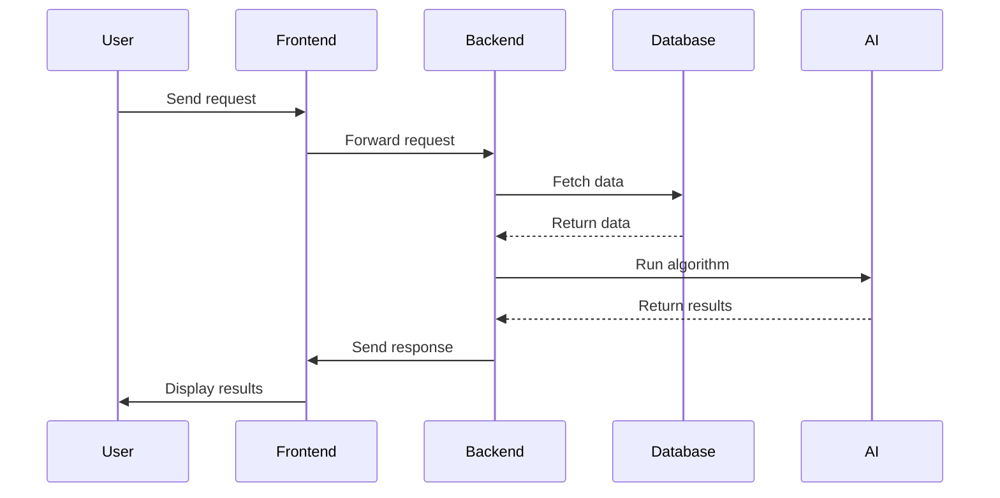

                 

### 关键词

1. AI辅助创意舞台设计
2. 沉浸式体验
3. 提示词技巧
4. 舞台设计需求
5. 算法原理
6. 数学模型
7. 系统架构

### 摘要

本文旨在探讨AI技术在舞台设计领域的应用，特别是如何利用AI辅助创意来提升舞台设计的沉浸式体验。文章将详细分析AI在舞台设计中的需求背景、应用场景，以及沉浸式体验营造的提示词技巧。通过逐步讲解核心概念、算法原理、数学模型、系统架构和实战案例，本文旨在为读者提供一份全面、系统的AI辅助舞台设计指南。

## 第一部分：AI辅助创意舞台设计基础

### 第1章：AI与舞台设计的融合

#### 1.1 舞台设计的需求背景

舞台设计是艺术与技术的结合，其核心目标是为观众提供独特的视觉和感官体验。随着科技的进步，舞台设计逐渐向智能化、沉浸化发展。传统舞台设计依赖于设计师的经验和直觉，而AI技术的引入为舞台设计带来了新的可能性。

**问题背景**：  
- 舞台设计复杂度高，需要处理大量的艺术元素和技术细节。
- 设计师需要快速响应不同的演出需求，但时间和资源的限制往往难以满足。
- 观众对于舞台体验的要求越来越高，追求更加丰富和沉浸的感官刺激。

**问题描述**：  
如何利用AI技术简化舞台设计流程，提高设计效率，同时增强观众的沉浸式体验？

**问题解决**：  
AI技术可以通过数据分析和模式识别，为设计师提供智能化的辅助工具。例如，通过分析历史舞台设计案例和观众反馈，AI可以推荐最适合当前演出主题的设计方案，从而提高设计效率和满意度。

**边界与外延**：  
- 舞台设计的范围不仅限于戏剧和音乐会，还包括展览、庆典和其他公共活动。
- AI技术的应用不仅限于舞台设计，还可以扩展到灯光、音响、特效等舞台技术的各个方面。

#### 1.2 AI技术在舞台设计中的应用

AI技术在舞台设计中的应用主要体现在以下几个方面：

1. **创意生成**：AI可以通过分析大量数据，生成新的舞台设计创意。这些创意可能包括独特的灯光效果、舞台布局和道具设计。
   
2. **个性化定制**：AI可以根据观众的喜好和演出内容，定制个性化的舞台体验。例如，根据观众的购票信息和历史行为，AI可以为每位观众提供专属的舞台设计。

3. **实时调整**：AI可以实时监测观众的反应和行为，根据反馈自动调整舞台效果，以优化观众的沉浸式体验。

4. **数据分析**：AI可以收集和分析演出后的观众反馈数据，为未来的舞台设计提供宝贵的数据支持。

#### 1.3 沉浸式体验的概念与特点

沉浸式体验是一种通过多感官刺激，使观众完全沉浸在特定情境中的体验。舞台设计中的沉浸式体验主要体现在以下几个方面：

1. **视觉**：通过独特的舞台布局、灯光效果和视觉元素，创造一个引人入胜的视觉环境。

2. **听觉**：通过精心设计的音响效果和背景音乐，增强观众的听觉体验。

3. **触觉**：通过特殊的道具和装置，如喷雾、喷雾、气味等，刺激观众的触觉。

4. **互动**：通过观众与舞台之间的互动，如虚拟现实、增强现实等，增强观众的参与感和沉浸感。

沉浸式体验的特点包括：

1. **全身心投入**：观众在沉浸式体验中不仅仅是被动接受信息，而是主动参与其中。

2. **感官刺激**：通过多感官的刺激，观众能够更加深刻地体验舞台表演。

3. **情感共鸣**：沉浸式体验能够引发观众的情感共鸣，增强他们对舞台表演的记忆和认同。

### 第2章：AI辅助创意的概念与原理

#### 2.1 AI辅助创意的定义

AI辅助创意是指利用人工智能技术，为创意设计提供支持和服务的过程。在舞台设计中，AI辅助创意可以体现在以下几个方面：

1. **设计建议**：AI可以根据历史数据和当前需求，为设计师提供设计建议，包括舞台布局、灯光设计和音效选择等。

2. **创意生成**：AI可以通过分析和学习大量的舞台设计案例，生成新的创意设计。

3. **优化调整**：AI可以根据观众反馈和实时数据，对舞台设计进行优化调整，以提高观众的沉浸式体验。

#### 2.2 AI辅助创意的核心技术

AI辅助创意的核心技术包括：

1. **机器学习**：通过训练大量数据，使AI能够识别和生成新的创意设计。

2. **自然语言处理**：AI可以通过理解和生成自然语言，与设计师和观众进行互动，提供个性化的设计建议。

3. **计算机视觉**：AI可以通过图像识别和图像生成技术，辅助设计师进行视觉创意的设计。

4. **深度学习**：深度学习技术使得AI能够从大量的非结构化数据中提取有用信息，为创意设计提供支持。

#### 2.3 AI辅助创意的应用场景

AI辅助创意在舞台设计中的应用场景非常广泛，包括但不限于：

1. **主题公园**：AI可以根据游客的喜好和行为，定制个性化的舞台表演和互动体验。

2. **音乐节**：AI可以实时调整舞台效果，以优化观众的听觉和视觉体验。

3. **戏剧和音乐会**：AI可以生成独特的舞台设计创意，增强表演的艺术感染力。

4. **展览和庆典**：AI可以提供沉浸式的展览体验，使观众更好地理解展览内容。

### 第3章：沉浸式体验营造的提示词技巧

#### 3.1 提示词的作用与分类

提示词在沉浸式舞台设计中起着至关重要的作用。它们可以帮助设计师更好地传达设计意图，引导观众的情感和认知。提示词可以分类为：

1. **视觉提示词**：用于描述舞台布局、灯光效果和视觉元素，如“华丽”、“简洁”、“活力”等。

2. **听觉提示词**：用于描述音响效果和背景音乐，如“悠扬”、“激情”、“低沉”等。

3. **触觉提示词**：用于描述观众能够感受到的物理刺激，如“冰冷”、“温暖”、“柔和”等。

4. **互动提示词**：用于描述观众与舞台之间的互动方式，如“沉浸”、“参与”、“互动”等。

#### 3.2 提示词设计的原则

设计提示词需要遵循以下原则：

1. **明确性**：提示词应明确传达设计意图，避免模糊不清。

2. **多样性**：提示词应涵盖多种感官和互动方式，以丰富观众的体验。

3. **一致性**：提示词应与舞台设计整体风格保持一致，避免冲突和不协调。

4. **灵活性**：提示词应具有一定的灵活性，以适应不同的演出内容和观众需求。

#### 3.3 提示词的应用实例分析

以下是一个提示词应用的实例：

**场景**：一场戏剧表演，主题是“森林的童话”。

**视觉提示词**：“森林绿意”、“童话色彩”、“神秘氛围”。

**听觉提示词**：“悠扬的森林之歌”、“欢快的童话旋律”、“神秘的森林音效”。

**触觉提示词**：“清凉的森林气息”、“柔软的树叶触摸”。

**互动提示词**：“跟随角色的冒险旅程”、“与森林精灵互动”。

通过这些提示词，设计师可以创造出一场充满童话氛围、视觉、听觉和触觉刺激的沉浸式戏剧体验。

### 第4章：AI辅助创意工作流程

#### 4.1 创意生成流程

AI辅助创意的生成流程主要包括以下几个步骤：

1. **需求分析**：设计师与AI系统沟通，明确演出主题、目标观众和设计要求。

2. **数据收集**：AI系统收集相关的舞台设计案例、观众反馈数据和当前演出内容信息。

3. **创意生成**：AI系统通过机器学习和自然语言处理技术，生成初步的设计创意。

4. **优化调整**：设计师对AI生成的创意进行评估，根据反馈进行优化调整。

5. **最终确认**：经过多次迭代，最终确认并实现设计创意。

#### 4.2 舞台设计中的AI辅助流程

在舞台设计中，AI辅助流程可以包括以下环节：

1. **灯光设计**：AI可以根据演出主题和情感需求，推荐最佳的灯光方案。

2. **音响效果**：AI可以生成个性化的音响效果，增强观众的听觉体验。

3. **视觉设计**：AI可以通过图像生成技术，辅助设计师创造出独特的视觉元素。

4. **道具设计**：AI可以推荐适合当前演出主题的道具设计，提高舞台的整体视觉效果。

5. **互动设计**：AI可以根据观众的反馈和行为，优化互动环节，提高沉浸感。

#### 4.3 创意反馈与优化

创意反馈是AI辅助舞台设计的重要环节。通过收集观众的反馈数据，AI可以对设计进行持续优化，以提高观众的满意度。具体步骤如下：

1. **数据收集**：在演出结束后，AI系统收集观众的反馈数据，包括满意度、情感反应和互动行为等。

2. **数据分析**：AI系统对反馈数据进行处理和分析，找出设计中的不足之处。

3. **优化调整**：设计师根据分析结果，对设计进行优化调整，以提高观众的沉浸式体验。

4. **再次反馈**：经过优化调整的设计再次呈现给观众，收集新的反馈数据，以实现持续的优化。

### 第5章：AI算法与数学模型讲解

#### 5.1 常用AI算法介绍

在舞台设计领域，常用的AI算法包括：

1. **深度学习**：通过多层神经网络对大量数据进行训练，用于图像识别和生成。

2. **机器学习**：利用统计方法从数据中学习规律，用于设计建议和优化。

3. **自然语言处理**：用于理解和生成自然语言，辅助设计师与AI系统的沟通。

4. **强化学习**：通过试错和反馈机制，不断优化设计策略，提高满意度。

#### 5.2 数学模型与公式

AI算法中的数学模型和公式是算法实现的基础。以下是一些常用的数学模型：

1. **卷积神经网络（CNN）**：用于图像识别和生成，关键公式包括卷积操作和池化操作。

2. **生成对抗网络（GAN）**：用于生成高质量的图像和设计元素，关键公式包括生成器和判别器的损失函数。

3. **线性回归**：用于预测设计效果和观众满意度，关键公式包括损失函数和优化算法。

4. **决策树**：用于生成设计建议，关键公式包括信息增益和树构建算法。

#### 5.3 算法原理与示例

以下是一个深度学习算法的简单示例：

```python
import tensorflow as tf

# 创建神经网络模型
model = tf.keras.Sequential([
    tf.keras.layers.Conv2D(32, (3, 3), activation='relu', input_shape=(28, 28, 1)),
    tf.keras.layers.MaxPooling2D((2, 2)),
    tf.keras.layers.Conv2D(64, (3, 3), activation='relu'),
    tf.keras.layers.MaxPooling2D((2, 2)),
    tf.keras.layers.Conv2D(64, (3, 3), activation='relu'),
    tf.keras.layers.Flatten(),
    tf.keras.layers.Dense(64, activation='relu'),
    tf.keras.layers.Dense(10, activation='softmax')
])

# 编译模型
model.compile(optimizer='adam',
              loss='categorical_crossentropy',
              metrics=['accuracy'])

# 训练模型
model.fit(x_train, y_train, epochs=5)
```

这个示例使用了卷积神经网络（CNN）对图像进行分类。通过逐步讲解代码，我们可以了解CNN的基本原理和实现过程。

### 第6章：系统架构设计与实现

#### 6.1 系统功能设计

AI辅助舞台设计系统的功能设计主要包括以下模块：

1. **用户界面**：提供用户与系统交互的界面，包括需求输入、设计查看和反馈提交等功能。

2. **AI算法模块**：包括深度学习、机器学习和自然语言处理等算法，用于生成设计建议和优化设计。

3. **数据管理模块**：负责数据的收集、存储和管理，包括历史设计案例、观众反馈和演出内容等。

4. **交互引擎**：负责实现观众与舞台的实时互动，提高观众的沉浸式体验。

5. **反馈分析模块**：分析观众的反馈数据，为设计优化提供依据。

#### 6.2 系统架构设计

系统架构设计如下：


**说明**：系统架构包括前端用户界面、后端服务、数据库和AI算法模块。前端用户界面通过HTTP请求与后端服务通信，后端服务通过RESTful API与AI算法模块和数据库交互。

#### 6.3 系统接口设计与系统交互

系统接口设计如下：



**说明**：用户通过前端界面发送请求，后端服务接收请求并处理。后端服务与数据库和AI算法模块交互，获取所需数据和处理结果，最终将结果返回给前端界面，供用户查看。

### 第7章：实战案例分析

#### 7.1 环境安装与配置

在进行AI辅助舞台设计项目的实战分析前，首先需要安装和配置相关环境。以下是一个基于Python和TensorFlow的实战环境安装步骤：

1. **安装Python**：确保系统已经安装了Python 3.7及以上版本。

2. **安装TensorFlow**：使用pip命令安装TensorFlow：
   ```bash
   pip install tensorflow
   ```

3. **安装其他依赖**：根据项目需要，安装其他Python库，如NumPy、Pandas等。

4. **配置GPU支持**：如果使用GPU加速，需要安装CUDA和cuDNN。

#### 7.2 系统核心实现

以下是一个简单的AI辅助舞台设计系统核心实现的示例：

```python
import tensorflow as tf
from tensorflow.keras.models import Sequential
from tensorflow.keras.layers import Conv2D, MaxPooling2D, Flatten, Dense

# 创建模型
model = Sequential([
    Conv2D(32, (3, 3), activation='relu', input_shape=(28, 28, 1)),
    MaxPooling2D((2, 2)),
    Conv2D(64, (3, 3), activation='relu'),
    MaxPooling2D((2, 2)),
    Conv2D(64, (3, 3), activation='relu'),
    Flatten(),
    Dense(64, activation='relu'),
    Dense(10, activation='softmax')
])

# 编译模型
model.compile(optimizer='adam',
              loss='categorical_crossentropy',
              metrics=['accuracy'])

# 训练模型
model.fit(x_train, y_train, epochs=5)
```

这个示例创建了一个简单的卷积神经网络模型，用于图像分类。

#### 7.3 代码应用解读与分析

上述代码的主要目的是创建一个卷积神经网络模型，用于对舞台设计图像进行分类。以下是代码的详细解读：

1. **模型创建**：使用`Sequential`模型创建一个序列模型，并添加多个卷积层、池化层和全连接层。

2. **模型编译**：编译模型，指定优化器、损失函数和评估指标。

3. **模型训练**：使用训练数据对模型进行训练，指定训练轮次。

在实战项目中，还需要处理图像数据预处理、模型保存和加载等步骤。

#### 7.4 实际案例分析和详细讲解

以下是一个实际案例分析和详细讲解：

**案例**：使用AI辅助设计一场音乐会的舞台。

**分析**：

1. **需求分析**：音乐会主题为“奇幻之旅”，目标观众为年轻人和家庭观众。

2. **数据收集**：收集历史音乐会舞台设计案例、观众喜好数据和音乐风格特点。

3. **创意生成**：AI系统根据需求和分析结果，生成初步的舞台设计创意。

4. **优化调整**：设计师对创意进行评估和优化，根据观众反馈进行迭代。

**详细讲解**：

1. **创意生成**：AI系统使用深度学习算法，生成独特的灯光布局和视觉元素。

2. **优化调整**：设计师对生成的创意进行评估，提出修改建议，例如调整灯光颜色和亮度。

3. **反馈与迭代**：根据观众反馈，AI系统不断优化设计，提高观众的沉浸式体验。

#### 7.5 项目小结

通过实际案例的分析和讲解，我们可以看到AI辅助舞台设计在需求分析、数据收集、创意生成和优化调整等环节的重要作用。AI系统不仅提高了设计效率，还增强了观众的沉浸式体验。然而，实际应用中还需要解决数据质量、算法优化和用户体验等问题。

### 第8章：最佳实践与拓展

#### 8.1 最佳实践技巧

在AI辅助舞台设计实践中，以下是一些建议：

1. **明确需求**：确保设计目标清晰，以便AI系统能够提供准确的设计建议。

2. **数据收集**：收集丰富的历史数据和观众反馈，为AI系统提供高质量的数据支持。

3. **模型优化**：定期更新AI模型，以提高设计效率和准确性。

4. **用户反馈**：及时收集用户反馈，为设计优化提供依据。

5. **跨学科合作**：与艺术家、设计师和技术专家合作，共同探索AI技术在舞台设计中的潜力。

#### 8.2 注意事项

在使用AI辅助舞台设计时，需要注意以下几点：

1. **数据隐私**：确保收集和处理的数据符合隐私保护法规。

2. **算法透明性**：提高算法的透明性，使设计师和观众能够理解AI决策过程。

3. **技术更新**：关注AI技术的最新进展，及时更新系统以保持竞争力。

4. **用户体验**：注重用户体验，确保设计易于使用和操作。

#### 8.3 拓展阅读

以下是一些相关领域的拓展阅读推荐：

1. **《深度学习》（Goodfellow, Bengio, Courville）**：深入讲解深度学习的基本概念和技术。

2. **《自然语言处理综合教程》（Li, Jurafsky, Martin）**：介绍自然语言处理的基本原理和应用。

3. **《增强现实技术原理与应用》（Azuma, Iwahashi）**：探讨增强现实技术在舞台设计中的应用。

### 作者信息

作者：AI天才研究院/AI Genius Institute & 禅与计算机程序设计艺术 /Zen And The Art of Computer Programming

本文由AI天才研究院撰写，旨在为读者提供关于AI辅助创意舞台设计的全面指南。同时，作者基于《禅与计算机程序设计艺术》的理念，强调技术在艺术创作中的重要作用。希望本文能为读者带来启发和帮助。

