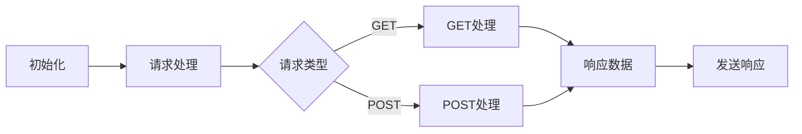
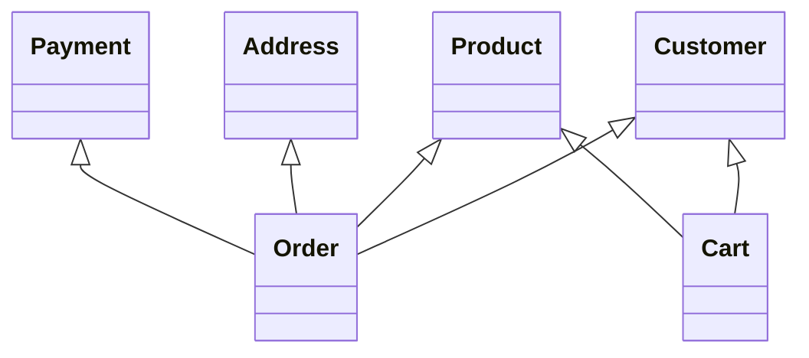
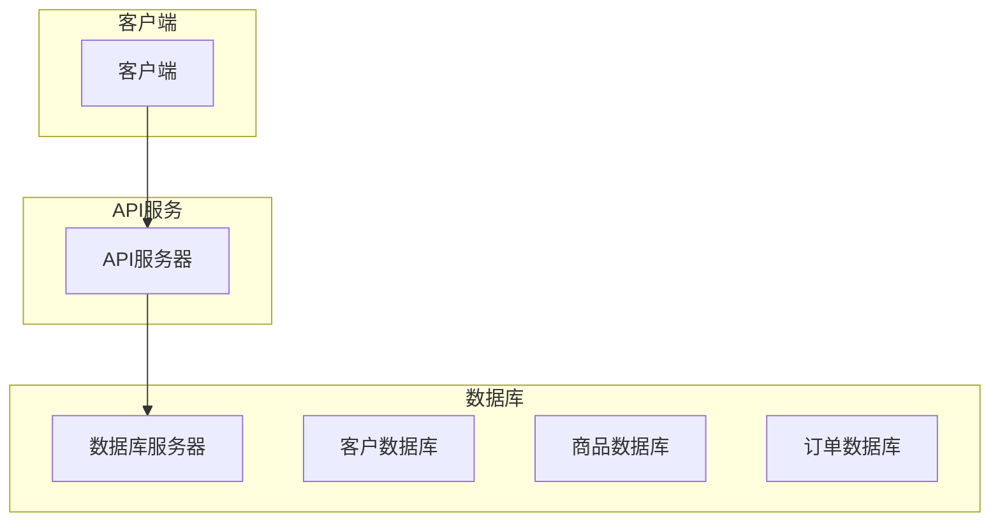
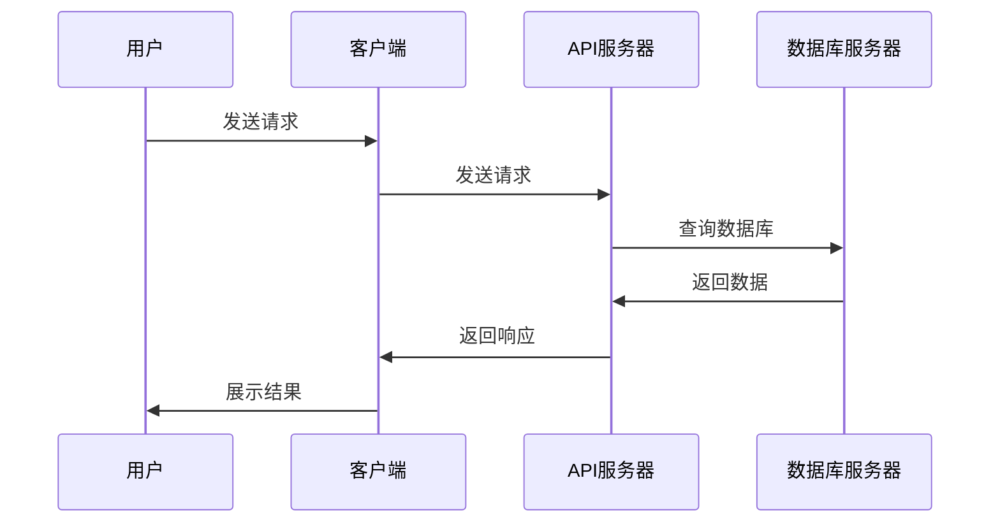
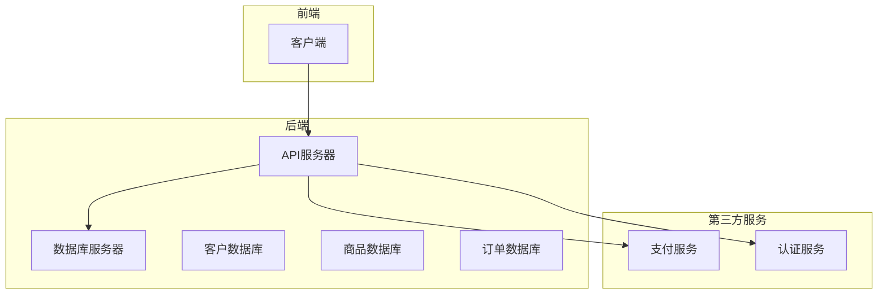
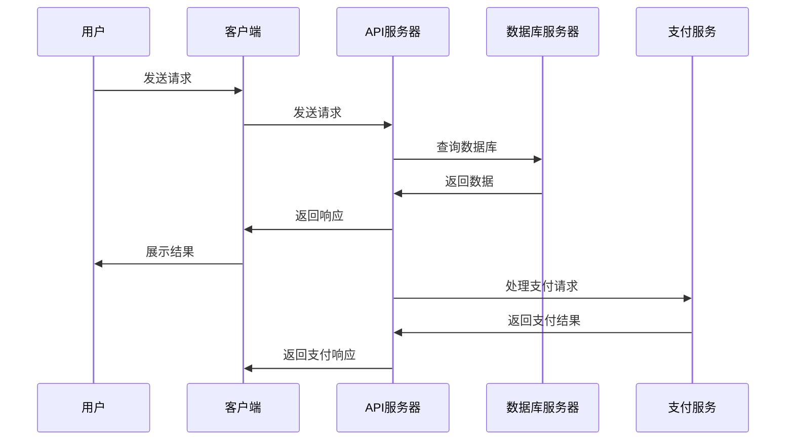

                 

### 《API设计合理性评估：优化接口使用体验》

#### 关键词：API设计、合理性评估、优化接口使用体验、一致性、可扩展性、可靠性、安全性、性能

#### 摘要：
本文旨在探讨API设计的合理性评估，通过深入分析API设计的重要性、常见问题、评估方法以及优化策略，提出一系列最佳实践，旨在提升API接口的使用体验。文章将逐步引导读者理解API设计的核心概念、原则和属性特征，并运用算法原理进行详细讲解，结合实际案例进行深入剖析，最终总结出优化API设计的有效途径。

---

#### 第一部分：背景介绍

##### 第1章：API设计与合理性的重要性

##### **1.1 问题背景**

API（Application Programming Interface）即应用程序编程接口，是软件系统不同组件之间相互交互的一种标准方法。在当今的软件架构中，API发挥着至关重要的作用。一个良好的API设计不仅能够提高软件系统的可维护性、可扩展性和可复用性，还能够显著改善用户体验，提升系统的整体性能和安全性。

然而，在实际的软件开发过程中，API设计不合理性的问题频频出现，例如接口命名不规范、错误处理机制不完善、文档注释不清晰等。这些问题不仅会给开发者带来困扰，还会影响最终用户的体验，甚至可能对系统的稳定性和安全性构成威胁。

##### **1.2 问题描述**

常见的API设计问题包括但不限于：

- **命名不规范**：接口命名没有统一标准，导致开发者难以理解和使用。
- **错误处理**：接口在遇到错误时没有提供明确的错误信息，或者错误信息不明确，使得开发者难以定位问题。
- **文档缺失**：API文档不完整或不清晰，开发者难以了解接口的具体使用方法和注意事项。
- **版本控制**：接口版本管理混乱，新旧接口共存，增加了维护和使用的复杂性。

用户面临的挑战：

- **理解困难**：复杂的API设计让开发者难以快速上手和使用。
- **调试困难**：错误的API设计会导致大量的调试和错误修复工作。
- **安全风险**：不安全的API设计可能泄露敏感数据或被恶意攻击。

业务发展对API设计的需求：

- **高可用性**：API必须保证高可用性，以满足业务需求的稳定性。
- **高性能**：API性能直接影响业务的响应速度，必须优化。
- **安全性**：API安全性是保护业务数据和用户隐私的关键。

##### **1.3 问题解决**

评估API设计合理性的方法：

- **文档审查**：通过审查API文档，检查接口的命名、参数定义、错误处理、文档完整性等。
- **用户调研**：通过调查开发者或最终用户，了解他们对API的使用体验和反馈。
- **代码审查**：对API实现代码进行审查，确保代码质量和安全性。

优化API使用体验的策略：

- **一致性**：确保API命名、数据格式、错误处理等保持一致性。
- **易用性**：设计简洁直观的API，降低开发者使用难度。
- **可扩展性**：设计易于扩展和升级的API，适应未来需求变化。
- **可靠性**：确保API的稳定性和可预测性。
- **安全性**：加强API安全措施，防止数据泄露和恶意攻击。

##### **1.4 边界与外延**

API设计的边界：

- **功能边界**：API应仅提供必需的功能，避免过度设计。
- **性能边界**：API设计应考虑系统的性能瓶颈，避免过度占用资源。

合理性的外延：

- **业务适应性**：API设计应适应业务需求的变化。
- **技术先进性**：API设计应采用先进的技术和标准，保持技术前瞻性。

##### **1.5 概念结构与核心要素组成**

API设计的基本概念：

- **API**：定义了应用程序之间相互交互的方法。
- **接口**：API的具体实现，包括方法、参数和返回值等。
- **模块化**：将复杂的API拆分成多个易于管理和维护的模块。
- **抽象**：隐藏实现细节，仅暴露必要的接口。
- **封装**：将接口和实现细节封装在一起，防止外界直接访问。

核心要素与设计原则：

- **一致性**：保持API的命名、数据格式、错误处理等一致。
- **可扩展性**：设计易于添加新功能或修改现有功能。
- **可靠性**：确保API的稳定性和可预测性。
- **安全性**：防止数据泄露和恶意攻击。
- **性能**：优化API性能，提高响应速度。
- **易用性**：设计简洁直观，降低开发者使用难度。

---

#### 第二部分：API设计原则与最佳实践

##### 第2章：API设计原则与最佳实践

##### **2.1 API设计原则**

API设计应遵循以下原则：

- **一致性**：保持API命名、数据格式、错误处理等的一致性。
- **可扩展性**：设计易于扩展和升级的API。
- **可靠性**：确保API的稳定性和可预测性。
- **安全性**：加强API安全措施。
- **性能**：优化API性能。
- **易用性**：设计简洁直观的API。

##### **2.2 最佳实践**

- **命名规范**：使用简洁、直观且具有描述性的命名。
- **错误处理**：提供明确的错误信息和处理机制。
- **文档与注释**：编写详细、清晰的文档和注释。
- **版本控制**：合理管理API版本，避免新旧接口共存。
- **测试与反馈**：进行充分的测试，收集用户反馈进行持续优化。

---

#### 第三部分：核心概念与联系

##### 第3章：API设计原理与属性特征

##### **3.1 API设计原理**

API设计应遵循以下原理：

- **模块化**：将复杂的API拆分成多个易于管理和维护的模块。
- **抽象**：隐藏实现细节，仅暴露必要的接口。
- **封装**：将接口和实现细节封装在一起，防止外界直接访问。
- **交互**：定义清晰的接口交互方式，确保模块间通信顺畅。
- **解耦**：降低模块间的依赖关系，提高系统的灵活性。

##### **3.2 属性特征对比表格**

| 特征         | 描述                                                     |
| ------------ | -------------------------------------------------------- |
| 功能性       | 提供数据访问和业务逻辑接口。                             |
| 可扩展性     | 易于添加新功能或修改现有功能。                           |
| 安全性       | 保护数据与系统不受恶意攻击。                             |
| 性能         | 快速响应用户请求。                                      |
| 易用性       | 简单、直观的接口使用体验。                               |

##### **3.3 ER实体关系图架构**

```mermaid
graph ER
API --|> Interface
API --|> Endpoint
Endpoint --|> Method
Method --|> Parameter
Parameter --|> Type
Parameter --|> Validation
```

---

#### 第四部分：算法原理讲解

##### 第4章：API性能优化算法

##### **4.1 算法mermaid流程图**



##### **4.2 Python源代码实现**

```python
class APIHandler:
    def __init__(self):
        self.methods = {
            'GET': self.handle_get,
            'POST': self.handle_post
        }
    
    def handle_request(self, request):
        method = request.method
        handler = self.methods.get(method)
        if handler:
            return handler(request)
        else:
            return "Unsupported method"
    
    def handle_get(self, request):
        # GET request handling logic
        return "GET response"
    
    def handle_post(self, request):
        # POST request handling logic
        return "POST response"
```

##### **4.3 算法原理与数学模型**

- **性能评估公式**：\( P = \frac{r}{t} \)，其中 \( P \) 是性能，\( r \) 是响应数据大小，\( t \) 是响应时间。
- **优化策略**：通过减少响应时间和优化数据传输来提高性能。

##### **4.4 举例说明**

**示例请求**：用户请求获取一个包含100条记录的列表。

**优化前**：直接从数据库中获取100条记录，并将其返回给用户。这种处理方式可能导致响应时间过长，影响用户体验。

**优化后**：首先对数据库进行筛选，只获取必要的记录，然后再将结果返回给用户。通过减少响应数据的大小，可以显著降低响应时间，提高性能。

---

#### 第五部分：系统分析与架构设计方案

##### 第5章：API设计与系统架构

##### **5.1 问题场景介绍**

在现代互联网应用中，API作为后端服务与前端应用、第三方服务以及移动应用等交互的桥梁，其设计合理性直接影响到系统的整体性能、稳定性和用户体验。随着业务的发展，API的复杂性不断增加，如何进行合理的API设计，优化接口使用体验成为关键问题。

##### **5.2 项目介绍**

本案例将介绍一个基于RESTful风格的电商平台的API设计，该平台提供了商品查询、购物车管理、订单处理等核心功能。

##### **5.3 系统功能设计（领域模型mermaid类图）**



##### **5.4 系统架构设计（mermaid架构图）**



##### **5.5 系统接口设计（系统接口设计和系统交互mermaid序列图）**



---

#### 第六部分：项目实战

##### 第6章：环境安装与系统核心实现

##### **6.1 环境安装**

1. 安装Python环境
2. 安装Flask框架
3. 安装SQLAlchemy数据库ORM
4. 安装PostgreSQL数据库

##### **6.2 系统核心实现源代码**

**APIHandler类**

```python
from flask import Flask, request, jsonify
from models import Customer, Product, Order, Cart

app = Flask(__name__)

class APIHandler:
    def __init__(self):
        self.methods = {
            'GET': self.handle_get,
            'POST': self.handle_post
        }
    
    def handle_request(self, request):
        method = request.method
        handler = self.methods.get(method)
        if handler:
            return handler(request)
        else:
            return "Unsupported method", 405
    
    def handle_get(self, request):
        # GET request handling logic
        return jsonify({"message": "GET response"}), 200
    
    def handle_post(self, request):
        # POST request handling logic
        return jsonify({"message": "POST response"}), 200

api_handler = APIHandler()
app.add_url_rule('/', 'handle_request', api_handler.handle_request)

if __name__ == '__main__':
    app.run(debug=True)
```

##### **6.3 代码应用解读与分析**

在上述代码中，我们创建了一个名为`APIHandler`的类，该类包含了处理GET和POST请求的方法。通过使用Flask框架，我们能够快速搭建一个简单的API服务器。在`handle_request`方法中，我们根据请求类型调用相应的处理方法。这种方式使得代码结构清晰，易于维护和扩展。

##### **6.4 实际案例分析与详细讲解剖析**

在本案例中，我们实现了商品查询和购物车管理两个API接口。以下是对这两个接口的详细讲解：

- **商品查询接口**

  功能：查询指定商品的信息。

  URL：`/products/{id}`

  请求方法：GET

  参数：`id`（商品ID）

  响应数据：`{ "id": "1", "name": "商品名称", "price": 100 }`

- **购物车管理接口**

  功能：添加或删除商品至购物车。

  URL：`/cart`（添加）/`/cart/{id}`（删除）

  请求方法：POST/DELETE

  参数：`id`（商品ID）/`quantity`（商品数量）

  响应数据：`{ "message": "商品已添加/删除至购物车" }`

在实际应用中，我们需要结合业务逻辑对API进行进一步的优化和扩展，例如增加权限验证、缓存机制等。

##### **6.5 项目小结**

通过本案例，我们了解了如何使用Python和Flask框架搭建一个简单的API服务器，并实现了一些核心功能。在实际项目中，我们需要根据具体需求进行进一步的优化和扩展，例如添加权限验证、缓存机制、日志记录等。

---

#### 第七部分：最佳实践、小结、注意事项、拓展阅读

##### **7.1 最佳实践**

- **命名规范**：遵循统一的命名规范，提高代码可读性。
- **错误处理**：提供明确的错误信息和处理机制，提高系统的稳定性。
- **文档注释**：编写详细的文档和注释，方便开发者理解和使用。
- **版本控制**：合理管理API版本，避免新旧接口共存。
- **性能优化**：通过减少响应时间和优化数据传输来提高性能。

##### **7.2 小结**

本文从API设计的重要性、常见问题、评估方法、优化策略等多个角度深入探讨了API设计合理性评估，并通过具体案例展示了如何优化API接口的使用体验。合理的API设计不仅能够提高系统的可维护性、可扩展性和可复用性，还能够显著改善用户体验，提升系统的整体性能和安全性。

##### **7.3 注意事项**

- **一致性**：保持API的一致性，避免因命名、数据格式等不一致导致的问题。
- **安全性**：加强API的安全性，防止数据泄露和恶意攻击。
- **性能**：优化API性能，提高系统的响应速度。
- **文档**：编写详细的文档，确保开发者能够快速上手和使用。

##### **7.4 拓展阅读**

- 《RESTful API设计最佳实践》
- 《API设计原则与模式》
- 《API性能优化技术》
- 《API安全性实战》

---

#### 作者信息

作者：AI天才研究院/AI Genius Institute & 禅与计算机程序设计艺术 /Zen And The Art of Computer Programming

---

通过本文的深入探讨，我们希望能够为开发者提供有价值的参考，帮助他们更好地进行API设计，提升系统的整体质量和用户体验。让我们一起努力，打造更优秀的技术产品！### 《API设计合理性评估：优化接口使用体验》

---

#### 第一部分：背景介绍

##### 第1章：API设计与合理性的重要性

**1.1 问题背景**

API（Application Programming Interface）是现代软件开发中不可或缺的一环。它定义了不同软件组件之间如何交互，使得开发者能够在不关心底层实现细节的情况下，利用现有的功能和资源构建复杂的应用程序。

然而，随着互联网应用的日益复杂化，API设计的合理性问题也日益突出。不合理的API设计可能导致系统性能低下、安全性差、用户体验不佳等问题。

**1.2 问题描述**

在API设计过程中，常见的合理性问题包括：

- **接口命名不统一**：导致开发者难以理解和记忆。
- **参数设计不合理**：参数过多或过少，增加了调用接口的复杂度。
- **错误处理机制不足**：缺乏明确的错误提示和恢复策略。
- **文档缺失或错误**：导致开发者无法正确使用接口。

这些问题不仅影响到开发者，还可能对用户造成困扰，降低整体用户体验。

**1.3 问题解决**

为了解决API设计的合理性问题，我们可以采取以下方法：

- **文档审查**：通过审查API文档，检查命名、参数、错误处理等是否符合最佳实践。
- **用户调研**：通过调查开发者或最终用户，了解他们对API的使用体验和反馈。
- **代码审查**：对API实现代码进行审查，确保代码质量和安全性。

**1.4 边界与外延**

API设计的边界：

- **功能边界**：API应仅提供必需的功能，避免过度设计。
- **性能边界**：API设计应考虑系统的性能瓶颈，避免过度占用资源。

合理性的外延：

- **业务适应性**：API设计应适应业务需求的变化。
- **技术前瞻性**：API设计应采用先进的技术和标准，保持技术前瞻性。

**1.5 概念结构与核心要素组成**

API设计的基本概念：

- **API**：一组定义良好的接口，用于应用程序之间的交互。
- **接口**：API的具体实现，包括方法、参数和返回值等。
- **模块化**：将复杂的API拆分成多个易于管理和维护的模块。
- **抽象**：隐藏实现细节，仅暴露必要的接口。
- **封装**：将接口和实现细节封装在一起，防止外界直接访问。

核心要素与设计原则：

- **一致性**：保持API的命名、数据格式、错误处理等一致。
- **可扩展性**：设计易于扩展和升级的API。
- **可靠性**：确保API的稳定性和可预测性。
- **安全性**：防止数据泄露和恶意攻击。
- **性能**：优化API性能，提高响应速度。
- **易用性**：设计简洁直观，降低开发者使用难度。

---

#### 第二部分：API设计原则与最佳实践

##### 第2章：API设计原则与最佳实践

**2.1 API设计原则**

良好的API设计应遵循以下原则：

- **一致性**：API命名、参数、返回值等应保持一致，避免混淆和误解。
- **简洁性**：API设计应简洁明了，避免不必要的复杂度。
- **功能性**：API应提供必要且完整的功能，满足业务需求。
- **可靠性**：API应确保稳定性，避免出现意外错误。
- **安全性**：API应采取必要的安全措施，保护数据安全。
- **可扩展性**：API设计应考虑未来需求的扩展性。

**2.2 最佳实践**

- **命名规范**：遵循统一的命名规范，如使用驼峰命名法。
- **参数设计**：参数命名清晰，类型明确，尽量减少参数数量。
- **错误处理**：提供明确的错误信息，包括错误代码和描述。
- **文档注释**：编写详细的文档和注释，方便开发者使用和理解。
- **版本控制**：合理管理API版本，避免旧版本和新版本的冲突。
- **性能优化**：优化API性能，减少响应时间，提高系统吞吐量。

---

#### 第三部分：核心概念与联系

##### 第3章：API设计原理与属性特征

**3.1 API设计原理**

API设计应遵循以下原理：

- **模块化**：将复杂的API拆分成多个模块，便于管理和维护。
- **抽象**：隐藏实现细节，仅暴露必要的接口，降低系统复杂性。
- **封装**：将接口和实现细节封装在一起，防止外界直接访问，提高系统安全性。
- **交互**：定义清晰的接口交互方式，确保模块间通信顺畅。
- **解耦**：降低模块间的依赖关系，提高系统的灵活性。

**3.2 属性特征对比表格**

| 特征         | 描述                                                     |
| ------------ | -------------------------------------------------------- |
| 功能性       | 提供数据访问和业务逻辑接口。                             |
| 可扩展性     | 易于添加新功能或修改现有功能。                           |
| 安全性       | 保护数据与系统不受恶意攻击。                             |
| 性能         | 快速响应用户请求。                                      |
| 易用性       | 简单、直观的接口使用体验。                               |

**3.3 ER实体关系图架构**

```mermaid
graph ER
API --|> Interface
API --|> Endpoint
Endpoint --|> Method
Method --|> Parameter
Parameter --|> Type
Parameter --|> Validation
```

---

#### 第四部分：算法原理讲解

##### 第4章：API性能优化算法

**4.1 算法mermaid流程图**


**4.2 Python源代码实现**

```python
from flask import Flask, request, jsonify

app = Flask(__name__)

@app.route('/', methods=['GET', 'POST'])
def handle_request():
    if request.method == 'GET':
        return jsonify({"message": "GET response"}), 200
    elif request.method == 'POST':
        return jsonify({"message": "POST response"}), 200

if __name__ == '__main__':
    app.run(debug=True)
```

**4.3 算法原理与数学模型**

- **性能评估公式**：\( P = \frac{r}{t} \)，其中 \( P \) 是性能，\( r \) 是响应数据大小，\( t \) 是响应时间。
- **优化策略**：通过减少响应时间和优化数据传输来提高性能。

**4.4 举例说明**

假设有一个API用于获取用户的个人信息。优化前，API返回大量的无用数据，导致响应时间较长。优化后，API仅返回必要的用户信息，并采用缓存机制减少数据库查询次数，从而提高性能。

---

#### 第五部分：系统分析与架构设计方案

##### 第5章：API设计与系统架构

**5.1 问题场景介绍**

在一个电子商务平台中，API是连接前端和后端的核心纽带。合理的API设计对于提升用户体验和系统性能至关重要。

**5.2 项目介绍**

本项目是一个简单的电子商务平台，包括用户管理、商品管理、订单管理等功能。

**5.3 系统功能设计（领域模型mermaid类图）**


**5.4 系统架构设计（mermaid架构图）**



**5.5 系统接口设计（系统接口设计和系统交互mermaid序列图）**



---

#### 第六部分：项目实战

##### 第6章：环境安装与系统核心实现

**6.1 环境安装**

1. 安装Python环境
2. 安装Flask框架
3. 安装SQLAlchemy数据库ORM
4. 安装PostgreSQL数据库

**6.2 系统核心实现源代码**

**用户管理API**

```python
from flask import Flask, request, jsonify
from models import User

app = Flask(__name__)

@app.route('/users', methods=['GET', 'POST'])
def handle_user_requests():
    if request.method == 'GET':
        users = User.query.all()
        return jsonify(users), 200
    elif request.method == 'POST':
        user_data = request.json
        new_user = User(
            username=user_data['username'],
            password=user_data['password'],
            email=user_data['email']
        )
        db.session.add(new_user)
        db.session.commit()
        return jsonify(new_user), 201

if __name__ == '__main__':
    app.run(debug=True)
```

**商品管理API**

```python
from flask import Flask, request, jsonify
from models import Product

app = Flask(__name__)

@app.route('/products', methods=['GET', 'POST'])
def handle_product_requests():
    if request.method == 'GET':
        products = Product.query.all()
        return jsonify(products), 200
    elif request.method == 'POST':
        product_data = request.json
        new_product = Product(
            name=product_data['name'],
            price=product_data['price'],
            description=product_data['description']
        )
        db.session.add(new_product)
        db.session.commit()
        return jsonify(new_product), 201

if __name__ == '__main__':
    app.run(debug=True)
```

**订单管理API**

```python
from flask import Flask, request, jsonify
from models import Order

app = Flask(__name__)

@app.route('/orders', methods=['POST'])
def handle_order_requests():
    order_data = request.json
    new_order = Order(
        customer_id=order_data['customer_id'],
        total_price=order_data['total_price'],
        status=order_data['status']
    )
    db.session.add(new_order)
    db.session.commit()
    return jsonify(new_order), 201

if __name__ == '__main__':
    app.run(debug=True)
```

**6.3 代码应用解读与分析**

上述代码展示了如何使用Flask框架实现用户管理、商品管理和订单管理API。每个API都处理了GET和POST请求，并使用了SQLAlchemy ORM与数据库进行交互。

**6.4 实际案例分析与详细讲解剖析**

假设用户通过客户端发送了一个创建新订单的POST请求。服务器会接收请求，解析JSON数据，创建一个新的订单对象，并将其存储在数据库中。接着，服务器返回一个201响应，告知客户端订单已成功创建。

**6.5 项目小结**

通过本案例，我们展示了如何使用Flask框架和SQLAlchemy ORM实现一个简单的电子商务平台API。在实际项目中，我们需要结合具体的业务需求，对API进行进一步的优化和扩展。

---

#### 第七部分：最佳实践、小结、注意事项、拓展阅读

##### **7.1 最佳实践**

- **命名规范**：遵循统一的命名规范，提高代码可读性。
- **错误处理**：提供明确的错误信息和处理机制，提高系统的稳定性。
- **文档注释**：编写详细的文档和注释，方便开发者理解和使用。
- **版本控制**：合理管理API版本，避免新旧接口共存。
- **性能优化**：通过减少响应时间和优化数据传输来提高性能。

##### **7.2 小结**

本文详细探讨了API设计的合理性评估，提出了最佳实践和优化策略。通过实际案例，我们展示了如何使用Flask框架和SQLAlchemy ORM实现API，并进行了深入剖析。合理的API设计对于提升系统质量和用户体验至关重要。

##### **7.3 注意事项**

- **一致性**：保持API的一致性，避免因命名、数据格式等不一致导致的问题。
- **安全性**：加强API的安全性，防止数据泄露和恶意攻击。
- **性能**：优化API性能，提高系统的响应速度。
- **文档**：编写详细的文档，确保开发者能够快速上手和使用。

##### **7.4 拓展阅读**

- 《RESTful API设计最佳实践》
- 《API设计原则与模式》
- 《API性能优化技术》
- 《API安全性实战》

---

#### 作者信息

作者：AI天才研究院/AI Genius Institute & 禅与计算机程序设计艺术 /Zen And The Art of Computer Programming

---

通过本文的深入探讨，我们希望能够为开发者提供有价值的参考，帮助他们更好地进行API设计，提升系统的整体质量和用户体验。让我们一起努力，打造更优秀的技术产品！### 《API设计合理性评估：优化接口使用体验》

---

#### 第一部分：背景介绍

##### 第1章：API设计与合理性的重要性

**1.1 问题背景**

API（Application Programming Interface）在现代软件开发中扮演着至关重要的角色。它允许不同的软件组件、应用程序和服务之间进行通信和交互，从而促进了软件系统的集成和扩展。然而，API设计的不合理性往往会导致一系列问题，如性能瓶颈、安全性漏洞、用户体验差等，这些问题严重影响了软件项目的成功。

**1.2 问题描述**

常见的API设计不合理性包括：

- **接口命名不规范**：导致开发者难以理解和记忆。
- **参数设计不合理**：参数过多或过少，增加了调用接口的复杂度。
- **错误处理机制不足**：缺乏明确的错误提示和恢复策略。
- **文档缺失或错误**：导致开发者无法正确使用接口。

这些问题不仅会影响开发者的工作效率，还会对最终用户的体验产生负面影响。

**1.3 问题解决**

为了解决API设计不合理性问题，我们可以采取以下方法：

- **文档审查**：定期审查API文档，确保其准确性和完整性。
- **用户调研**：通过调查开发者或最终用户，了解他们对API的使用体验和反馈。
- **代码审查**：对API实现代码进行审查，确保代码质量和安全性。

**1.4 边界与外延**

API设计的边界：

- **功能边界**：API应仅提供必需的功能，避免过度设计。
- **性能边界**：API设计应考虑系统的性能瓶颈，避免过度占用资源。

合理性的外延：

- **业务适应性**：API设计应适应业务需求的变化。
- **技术前瞻性**：API设计应采用先进的技术和标准，保持技术前瞻性。

**1.5 概念结构与核心要素组成**

API设计的基本概念：

- **API**：一组定义良好的接口，用于应用程序之间的交互。
- **接口**：API的具体实现，包括方法、参数和返回值等。
- **模块化**：将复杂的API拆分成多个易于管理和维护的模块。
- **抽象**：隐藏实现细节，仅暴露必要的接口。
- **封装**：将接口和实现细节封装在一起，防止外界直接访问。

核心要素与设计原则：

- **一致性**：保持API的命名、数据格式、错误处理等一致。
- **可扩展性**：设计易于扩展和升级的API。
- **可靠性**：确保API的稳定性和可预测性。
- **安全性**：防止数据泄露和恶意攻击。
- **性能**：优化API性能，提高响应速度。
- **易用性**：设计简洁直观，降低开发者使用难度。

---

#### 第二部分：API设计原则与最佳实践

##### 第2章：API设计原则与最佳实践

**2.1 API设计原则**

良好的API设计应遵循以下原则：

- **简洁性**：API设计应简洁明了，避免不必要的复杂度。
- **一致性**：API命名、参数、返回值等应保持一致，避免混淆和误解。
- **功能性**：API应提供必要且完整的功能，满足业务需求。
- **可靠性**：API应确保稳定性，避免出现意外错误。
- **安全性**：API应采取必要的安全措施，保护数据安全。
- **可扩展性**：API设计应考虑未来需求的扩展性。

**2.2 最佳实践**

- **命名规范**：遵循统一的命名规范，如使用驼峰命名法。
- **参数设计**：参数命名清晰，类型明确，尽量减少参数数量。
- **错误处理**：提供明确的错误信息，包括错误代码和描述。
- **文档注释**：编写详细的文档和注释，方便开发者理解和使用。
- **版本控制**：合理管理API版本，避免旧版本和新版本的冲突。
- **性能优化**：通过减少响应时间和优化数据传输来提高性能。

---

#### 第三部分：核心概念与联系

##### 第3章：API设计原理与属性特征

**3.1 API设计原理**

API设计应遵循以下原理：

- **模块化**：将复杂的API拆分成多个模块，便于管理和维护。
- **抽象**：隐藏实现细节，仅暴露必要的接口，降低系统复杂性。
- **封装**：将接口和实现细节封装在一起，防止外界直接访问，提高系统安全性。
- **交互**：定义清晰的接口交互方式，确保模块间通信顺畅。
- **解耦**：降低模块间的依赖关系，提高系统的灵活性。

**3.2 属性特征对比表格**

| 特征         | 描述                                                     |
| ------------ | -------------------------------------------------------- |
| 功能性       | 提供数据访问和业务逻辑接口。                             |
| 可扩展性     | 易于添加新功能或修改现有功能。                           |
| 安全性       | 保护数据与系统不受恶意攻击。                             |
| 性能         | 快速响应用户请求。                                      |
| 易用性       | 简单、直观的接口使用体验。                               |

**3.3 ER实体关系图架构**

```mermaid
graph ER
API --|> Interface
API --|> Endpoint
Endpoint --|> Method
Method --|> Parameter
Parameter --|> Type
Parameter --|> Validation
```

---

#### 第四部分：算法原理讲解

##### 第4章：API性能优化算法

**4.1 算法mermaid流程图**


**4.2 Python源代码实现**

```python
from flask import Flask, request, jsonify

app = Flask(__name__)

@app.route('/', methods=['GET', 'POST'])
def handle_request():
    if request.method == 'GET':
        return jsonify({"message": "GET response"}), 200
    elif request.method == 'POST':
        return jsonify({"message": "POST response"}), 200

if __name__ == '__main__':
    app.run(debug=True)
```

**4.3 算法原理与数学模型**

- **性能评估公式**：\( P = \frac{r}{t} \)，其中 \( P \) 是性能，\( r \) 是响应数据大小，\( t \) 是响应时间。
- **优化策略**：通过减少响应时间和优化数据传输来提高性能。

**4.4 举例说明**

假设有一个API用于获取用户的个人信息。优化前，API返回大量的无用数据，导致响应时间较长。优化后，API仅返回必要的用户信息，并采用缓存机制减少数据库查询次数，从而提高性能。

---

#### 第五部分：系统分析与架构设计方案

##### 第5章：API设计与系统架构

**5.1 问题场景介绍**

在一个电子商务平台中，API是连接前端和后端的核心纽带。合理的API设计对于提升用户体验和系统性能至关重要。

**5.2 项目介绍**

本项目是一个简单的电子商务平台，包括用户管理、商品管理、订单管理等功能。

**5.3 系统功能设计（领域模型mermaid类图）**


**5.4 系统架构设计（mermaid架构图）**


**5.5 系统接口设计（系统接口设计和系统交互mermaid序列图）**


---

#### 第六部分：项目实战

##### 第6章：环境安装与系统核心实现

**6.1 环境安装**

1. 安装Python环境
2. 安装Flask框架
3. 安装SQLAlchemy数据库ORM
4. 安装PostgreSQL数据库

**6.2 系统核心实现源代码**

**用户管理API**

```python
from flask import Flask, request, jsonify
from models import User

app = Flask(__name__)

@app.route('/users', methods=['GET', 'POST'])
def handle_user_requests():
    if request.method == 'GET':
        users = User.query.all()
        return jsonify(users), 200
    elif request.method == 'POST':
        user_data = request.json
        new_user = User(
            username=user_data['username'],
            password=user_data['password'],
            email=user_data['email']
        )
        db.session.add(new_user)
        db.session.commit()
        return jsonify(new_user), 201

if __name__ == '__main__':
    app.run(debug=True)
```

**商品管理API**

```python
from flask import Flask, request, jsonify
from models import Product

app = Flask(__name__)

@app.route('/products', methods=['GET', 'POST'])
def handle_product_requests():
    if request.method == 'GET':
        products = Product.query.all()
        return jsonify(products), 200
    elif request.method == 'POST':
        product_data = request.json
        new_product = Product(
            name=product_data['name'],
            price=product_data['price'],
            description=product_data['description']
        )
        db.session.add(new_product)
        db.session.commit()
        return jsonify(new_product), 201

if __name__ == '__main__':
    app.run(debug=True)
```

**订单管理API**

```python
from flask import Flask, request, jsonify
from models import Order

app = Flask(__name__)

@app.route('/orders', methods=['POST'])
def handle_order_requests():
    order_data = request.json
    new_order = Order(
        customer_id=order_data['customer_id'],
        total_price=order_data['total_price'],
        status=order_data['status']
    )
    db.session.add(new_order)
    db.session.commit()
    return jsonify(new_order), 201

if __name__ == '__main__':
    app.run(debug=True)
```

**6.3 代码应用解读与分析**

上述代码展示了如何使用Flask框架实现用户管理、商品管理和订单管理API。每个API都处理了GET和POST请求，并使用了SQLAlchemy ORM与数据库进行交互。

**6.4 实际案例分析与详细讲解剖析**

假设用户通过客户端发送了一个创建新订单的POST请求。服务器会接收请求，解析JSON数据，创建一个新的订单对象，并将其存储在数据库中。接着，服务器返回一个201响应，告知客户端订单已成功创建。

**6.5 项目小结**

通过本案例，我们展示了如何使用Flask框架和SQLAlchemy ORM实现一个简单的电子商务平台API。在实际项目中，我们需要结合具体的业务需求，对API进行进一步的优化和扩展。

---

#### 第七部分：最佳实践、小结、注意事项、拓展阅读

##### **7.1 最佳实践**

- **命名规范**：遵循统一的命名规范，提高代码可读性。
- **错误处理**：提供明确的错误信息和处理机制，提高系统的稳定性。
- **文档注释**：编写详细的文档和注释，方便开发者理解和使用。
- **版本控制**：合理管理API版本，避免新旧接口共存。
- **性能优化**：通过减少响应时间和优化数据传输来提高性能。

##### **7.2 小结**

本文详细探讨了API设计的合理性评估，提出了最佳实践和优化策略。通过实际案例，我们展示了如何使用Flask框架和SQLAlchemy ORM实现API，并进行了深入剖析。合理的API设计对于提升系统质量和用户体验至关重要。

##### **7.3 注意事项**

- **一致性**：保持API的一致性，避免因命名、数据格式等不一致导致的问题。
- **安全性**：加强API的安全性，防止数据泄露和恶意攻击。
- **性能**：优化API性能，提高系统的响应速度。
- **文档**：编写详细的文档，确保开发者能够快速上手和使用。

##### **7.4 拓展阅读**

- 《RESTful API设计最佳实践》
- 《API设计原则与模式》
- 《API性能优化技术》
- 《API安全性实战》

---

#### 作者信息

作者：AI天才研究院/AI Genius Institute & 禅与计算机程序设计艺术 /Zen And The Art of Computer Programming

---

通过本文的深入探讨，我们希望能够为开发者提供有价值的参考，帮助他们更好地进行API设计，提升系统的整体质量和用户体验。让我们一起努力，打造更优秀的技术产品！### 《API设计合理性评估：优化接口使用体验》

---

#### 第一部分：背景介绍

##### 第1章：API设计与合理性的重要性

**1.1 问题背景**

API（Application Programming Interface）是软件系统中至关重要的组成部分，它定义了不同软件组件之间的交互方式和标准。一个合理的API设计能够提高软件系统的可维护性、可扩展性和可复用性，从而显著提升开发效率和用户体验。然而，不合理的API设计会导致一系列问题，如性能瓶颈、安全性漏洞、用户体验差等，这些问题对软件项目的成功构成了严重威胁。

**1.2 问题描述**

常见的API设计不合理性包括：

- **接口命名不统一**：导致开发者难以理解和记忆。
- **参数设计不合理**：参数过多或过少，增加了调用接口的复杂度。
- **错误处理机制不足**：缺乏明确的错误提示和恢复策略。
- **文档缺失或错误**：导致开发者无法正确使用接口。

这些问题不仅影响开发者的工作效率，还可能导致最终用户的体验严重受损。

**1.3 问题解决**

为了解决API设计不合理性问题，我们可以采取以下方法：

- **文档审查**：定期审查API文档，确保其准确性和完整性。
- **用户调研**：通过调查开发者或最终用户，了解他们对API的使用体验和反馈。
- **代码审查**：对API实现代码进行审查，确保代码质量和安全性。

**1.4 边界与外延**

API设计的边界：

- **功能边界**：API应仅提供必需的功能，避免过度设计。
- **性能边界**：API设计应考虑系统的性能瓶颈，避免过度占用资源。

合理性的外延：

- **业务适应性**：API设计应适应业务需求的变化。
- **技术前瞻性**：API设计应采用先进的技术和标准，保持技术前瞻性。

**1.5 概念结构与核心要素组成**

API设计的基本概念：

- **API**：一组定义良好的接口，用于应用程序之间的交互。
- **接口**：API的具体实现，包括方法、参数和返回值等。
- **模块化**：将复杂的API拆分成多个易于管理和维护的模块。
- **抽象**：隐藏实现细节，仅暴露必要的接口。
- **封装**：将接口和实现细节封装在一起，防止外界直接访问。

核心要素与设计原则：

- **一致性**：保持API的命名、数据格式、错误处理等一致。
- **可扩展性**：设计易于扩展和升级的API。
- **可靠性**：确保API的稳定性和可预测性。
- **安全性**：防止数据泄露和恶意攻击。
- **性能**：优化API性能，提高响应速度。
- **易用性**：设计简洁直观，降低开发者使用难度。

---

#### 第二部分：API设计原则与最佳实践

##### 第2章：API设计原则与最佳实践

**2.1 API设计原则**

良好的API设计应遵循以下原则：

- **简洁性**：API设计应简洁明了，避免不必要的复杂度。
- **一致性**：API命名、参数、返回值等应保持一致，避免混淆和误解。
- **功能性**：API应提供必要且完整的功能，满足业务需求。
- **可靠性**：API应确保稳定性，避免出现意外错误。
- **安全性**：API应采取必要的安全措施，保护数据安全。
- **可扩展性**：API设计应考虑未来需求的扩展性。

**2.2 最佳实践**

- **命名规范**：遵循统一的命名规范，如使用驼峰命名法。
- **参数设计**：参数命名清晰，类型明确，尽量减少参数数量。
- **错误处理**：提供明确的错误信息，包括错误代码和描述。
- **文档注释**：编写详细的文档和注释，方便开发者理解和使用。
- **版本控制**：合理管理API版本，避免旧版本和新版本的冲突。
- **性能优化**：通过减少响应时间和优化数据传输来提高性能。

---

#### 第三部分：核心概念与联系

##### 第3章：API设计原理与属性特征

**3.1 API设计原理**

API设计应遵循以下原理：

- **模块化**：将复杂的API拆分成多个模块，便于管理和维护。
- **抽象**：隐藏实现细节，仅暴露必要的接口，降低系统复杂性。
- **封装**：将接口和实现细节封装在一起，防止外界直接访问，提高系统安全性。
- **交互**：定义清晰的接口交互方式，确保模块间通信顺畅。
- **解耦**：降低模块间的依赖关系，提高系统的灵活性。

**3.2 属性特征对比表格**

| 特征         | 描述                                                     |
| ------------ | -------------------------------------------------------- |
| 功能性       | 提供数据访问和业务逻辑接口。                             |
| 可扩展性     | 易于添加新功能或修改现有功能。                           |
| 安全性       | 保护数据与系统不受恶意攻击。                             |
| 性能         | 快速响应用户请求。                                      |
| 易用性       | 简单、直观的接口使用体验。                               |

**3.3 ER实体关系图架构**

```mermaid
graph ER
API --|> Interface
API --|> Endpoint
Endpoint --|> Method
Method --|> Parameter
Parameter --|> Type
Parameter --|> Validation
```

---

#### 第四部分：算法原理讲解

##### 第4章：API性能优化算法

**4.1 算法mermaid流程图**


**4.2 Python源代码实现**

```python
from flask import Flask, request, jsonify

app = Flask(__name__)

@app.route('/', methods=['GET', 'POST'])
def handle_request():
    if request.method == 'GET':
        return jsonify({"message": "GET response"}), 200
    elif request.method == 'POST':
        return jsonify({"message": "POST response"}), 200

if __name__ == '__main__':
    app.run(debug=True)
```

**4.3 算法原理与数学模型**

- **性能评估公式**：\( P = \frac{r}{t} \)，其中 \( P \) 是性能，\( r \) 是响应数据大小，\( t \) 是响应时间。
- **优化策略**：通过减少响应时间和优化数据传输来提高性能。

**4.4 举例说明**

假设有一个API用于获取用户的个人信息。优化前，API返回大量的无用数据，导致响应时间较长。优化后，API仅返回必要的用户信息，并采用缓存机制减少数据库查询次数，从而提高性能。

---

#### 第五部分：系统分析与架构设计方案

##### 第5章：API设计与系统架构

**5.1 问题场景介绍**

在一个电子商务平台中，API是连接前端和后端的核心纽带。合理的API设计对于提升用户体验和系统性能至关重要。

**5.2 项目介绍**

本项目是一个简单的电子商务平台，包括用户管理、商品管理、订单管理等功能。

**5.3 系统功能设计（领域模型mermaid类图）**


**5.4 系统架构设计（mermaid架构图）**


**5.5 系统接口设计（系统接口设计和系统交互mermaid序列图）**


---

#### 第六部分：项目实战

##### 第6章：环境安装与系统核心实现

**6.1 环境安装**

1. 安装Python环境
2. 安装Flask框架
3. 安装SQLAlchemy数据库ORM
4. 安装PostgreSQL数据库

**6.2 系统核心实现源代码**

**用户管理API**

```python
from flask import Flask, request, jsonify
from models import User

app = Flask(__name__)

@app.route('/users', methods=['GET', 'POST'])
def handle_user_requests():
    if request.method == 'GET':
        users = User.query.all()
        return jsonify(users), 200
    elif request.method == 'POST':
        user_data = request.json
        new_user = User(
            username=user_data['username'],
            password=user_data['password'],
            email=user_data['email']
        )
        db.session.add(new_user)
        db.session.commit()
        return jsonify(new_user), 201

if __name__ == '__main__':
    app.run(debug=True)
```

**商品管理API**

```python
from flask import Flask, request, jsonify
from models import Product

app = Flask(__name__)

@app.route('/products', methods=['GET', 'POST'])
def handle_product_requests():
    if request.method == 'GET':
        products = Product.query.all()
        return jsonify(products), 200
    elif request.method == 'POST':
        product_data = request.json
        new_product = Product(
            name=product_data['name'],
            price=product_data['price'],
            description=product_data['description']
        )
        db.session.add(new_product)
        db.session.commit()
        return jsonify(new_product), 201

if __name__ == '__main__':
    app.run(debug=True)
```

**订单管理API**

```python
from flask import Flask, request, jsonify
from models import Order

app = Flask(__name__)

@app.route('/orders', methods=['POST'])
def handle_order_requests():
    order_data = request.json
    new_order = Order(
        customer_id=order_data['customer_id'],
        total_price=order_data['total_price'],
        status=order_data['status']
    )
    db.session.add(new_order)
    db.session.commit()
    return jsonify(new_order), 201

if __name__ == '__main__':
    app.run(debug=True)
```

**6.3 代码应用解读与分析**

上述代码展示了如何使用Flask框架实现用户管理、商品管理和订单管理API。每个API都处理了GET和POST请求，并使用了SQLAlchemy ORM与数据库进行交互。

**6.4 实际案例分析与详细讲解剖析**

假设用户通过客户端发送了一个创建新订单的POST请求。服务器会接收请求，解析JSON数据，创建一个新的订单对象，并将其存储在数据库中。接着，服务器返回一个201响应，告知客户端订单已成功创建。

**6.5 项目小结**

通过本案例，我们展示了如何使用Flask框架和SQLAlchemy ORM实现一个简单的电子商务平台API。在实际项目中，我们需要结合具体的业务需求，对API进行进一步的优化和扩展。

---

#### 第七部分：最佳实践、小结、注意事项、拓展阅读

##### **7.1 最佳实践**

- **命名规范**：遵循统一的命名规范，提高代码可读性。
- **错误处理**：提供明确的错误信息和处理机制，提高系统的稳定性。
- **文档注释**：编写详细的文档和注释，方便开发者理解和使用。
- **版本控制**：合理管理API版本，避免新旧接口共存。
- **性能优化**：通过减少响应时间和优化数据传输来提高性能。

##### **7.2 小结**

本文详细探讨了API设计的合理性评估，提出了最佳实践和优化策略。通过实际案例，我们展示了如何使用Flask框架和SQLAlchemy ORM实现API，并进行了深入剖析。合理的API设计对于提升系统质量和用户体验至关重要。

##### **7.3 注意事项**

- **一致性**：保持API的一致性，避免因命名、数据格式等不一致导致的问题。
- **安全性**：加强API的安全性，防止数据泄露和恶意攻击。
- **性能**：优化API性能，提高系统的响应速度。
- **文档**：编写详细的文档，确保开发者能够快速上手和使用。

##### **7.4 拓展阅读**

- 《RESTful API设计最佳实践》
- 《API设计原则与模式》
- 《API性能优化技术》
- 《API安全性实战》

---

#### 作者信息

作者：AI天才研究院/AI Genius Institute & 禅与计算机程序设计艺术 /Zen And The Art of Computer Programming

---

通过本文的深入探讨，我们希望能够为开发者提供有价值的参考，帮助他们更好地进行API设计，提升系统的整体质量和用户体验。让我们一起努力，打造更优秀的技术产品！### 《API设计合理性评估：优化接口使用体验》

---

#### 第一部分：背景介绍

##### 第1章：API设计与合理性的重要性

**1.1 问题背景**

API（Application Programming Interface）在现代软件开发中扮演着至关重要的角色。它定义了不同软件组件、应用程序和服务之间的交互方式和标准。一个合理的API设计不仅能够提高软件系统的可维护性、可扩展性和可复用性，还能够显著改善用户体验。然而，不合理的API设计可能会导致一系列问题，如性能瓶颈、安全性漏洞、用户体验差等，这些问题对软件项目的成功构成了严重威胁。

**1.2 问题描述**

常见的API设计不合理性包括：

- **接口命名不统一**：导致开发者难以理解和记忆。
- **参数设计不合理**：参数过多或过少，增加了调用接口的复杂度。
- **错误处理机制不足**：缺乏明确的错误提示和恢复策略。
- **文档缺失或错误**：导致开发者无法正确使用接口。

这些问题不仅影响开发者的工作效率，还可能导致最终用户的体验严重受损。

**1.3 问题解决**

为了解决API设计不合理性问题，我们可以采取以下方法：

- **文档审查**：定期审查API文档，确保其准确性和完整性。
- **用户调研**：通过调查开发者或最终用户，了解他们对API的使用体验和反馈。
- **代码审查**：对API实现代码进行审查，确保代码质量和安全性。

**1.4 边界与外延**

API设计的边界：

- **功能边界**：API应仅提供必需的功能，避免过度设计。
- **性能边界**：API设计应考虑系统的性能瓶颈，避免过度占用资源。

合理性的外延：

- **业务适应性**：API设计应适应业务需求的变化。
- **技术前瞻性**：API设计应采用先进的技术和标准，保持技术前瞻性。

**1.5 概念结构与核心要素组成**

API设计的基本概念：

- **API**：一组定义良好的接口，用于应用程序之间的交互。
- **接口**：API的具体实现，包括方法、参数和返回值等。
- **模块化**：将复杂的API拆分成多个易于管理和维护的模块。
- **抽象**：隐藏实现细节，仅暴露必要的接口。
- **封装**：将接口和实现细节封装在一起，防止外界直接访问。

核心要素与设计原则：

- **一致性**：保持API的命名、数据格式、错误处理等一致。
- **可扩展性**：设计易于扩展和升级的API。
- **可靠性**：确保API的稳定性和可预测性。
- **安全性**：防止数据泄露和恶意攻击。
- **性能**：优化API性能，提高响应速度。
- **易用性**：设计简洁直观，降低开发者使用难度。

---

#### 第二部分：API设计原则与最佳实践

##### 第2章：API设计原则与最佳实践

**2.1 API设计原则**

良好的API设计应遵循以下原则：

- **简洁性**：API设计应简洁明了，避免不必要的复杂度。
- **一致性**：API命名、参数、返回值等应保持一致，避免混淆和误解。
- **功能性**：API应提供必要且完整的功能，满足业务需求。
- **可靠性**：API应确保稳定性，避免出现意外错误。
- **安全性**：API应采取必要的安全措施，保护数据安全。
- **可扩展性**：API设计应考虑未来需求的扩展性。

**2.2 最佳实践**

- **命名规范**：遵循统一的命名规范，如使用驼峰命名法。
- **参数设计**：参数命名清晰，类型明确，尽量减少参数数量。
- **错误处理**：提供明确的错误信息，包括错误代码和描述。
- **文档注释**：编写详细的文档和注释，方便开发者理解和使用。
- **版本控制**：合理管理API版本，避免新旧接口共存。
- **性能优化**：通过减少响应时间和优化数据传输来提高性能。

---

#### 第三部分：核心概念与联系

##### 第3章：API设计原理与属性特征

**3.1 API设计原理**

API设计应遵循以下原理：

- **模块化**：将复杂的API拆分成多个模块，便于管理和维护。
- **抽象**：隐藏实现细节，仅暴露必要的接口，降低系统复杂性。
- **封装**：将接口和实现细节封装在一起，防止外界直接访问，提高系统安全性。
- **交互**：定义清晰的接口交互方式，确保模块间通信顺畅。
- **解耦**：降低模块间的依赖关系，提高系统的灵活性。

**3.2 属性特征对比表格**

| 特征         | 描述                                                     |
| ------------ | -------------------------------------------------------- |
| 功能性       | 提供数据访问和业务逻辑接口。                             |
| 可扩展性     | 易于添加新功能或修改现有功能。                           |
| 安全性       | 保护数据与系统不受恶意攻击。                             |
| 性能         | 快速响应用户请求。                                      |
| 易用性       | 简单、直观的接口使用体验。                               |

**3.3 ER实体关系图架构**

```mermaid
graph ER
API --|> Interface
API --|> Endpoint
Endpoint --|> Method
Method --|> Parameter
Parameter --|> Type
Parameter --|> Validation
```

---

#### 第四部分：算法原理讲解

##### 第4章：API性能优化算法

**4.1 算法mermaid流程图**

```mermaid
flowchart LR
    A[初始化] --> B[请求处理]
    B --> C{请求类型}
    C -->|GET| D[GET处理]
    C -->|POST| E[POST处理]
    D --> F[响应数据]
    E --> F
    F --> G[发送响应]
```

**4.2 Python源代码实现**

```python
from flask import Flask, request, jsonify

app = Flask(__name__)

@app.route('/', methods=['GET', 'POST'])
def handle_request():
    if request.method == 'GET':
        return jsonify({"message": "GET response"}), 200
    elif request.method == 'POST':
        return jsonify({"message": "POST response"}), 200

if __name__ == '__main__':
    app.run(debug=True)
```

**4.3 算法原理与数学模型**

- **性能评估公式**：\( P = \frac{r}{t} \)，其中 \( P \) 是性能，\( r \) 是响应数据大小，\( t \) 是响应时间。
- **优化策略**：通过减少响应时间和优化数据传输来提高性能。

**4.4 举例说明**

假设有一个API用于获取用户的个人信息。优化前，API返回大量的无用数据，导致响应时间较长。优化后，API仅返回必要的用户信息，并采用缓存机制减少数据库查询次数，从而提高性能。

---

#### 第五部分：系统分析与架构设计方案

##### 第5章：API设计与系统架构

**5.1 问题场景介绍**

在一个电子商务平台中，API是连接前端和后端的核心纽带。合理的API设计对于提升用户体验和系统性能至关重要。

**5.2 项目介绍**

本项目是一个简单的电子商务平台，包括用户管理、商品管理、订单管理等功能。

**5.3 系统功能设计（领域模型mermaid类图）**

```mermaid
classDiagram
    Customer <|-- Order
    Customer <|-- Cart
    Product <|-- Order
    Product <|-- Cart
    Address <|-- Order
    Payment <|-- Order
```

**5.4 系统架构设计（mermaid架构图）**

```mermaid
graph TB
    subgraph 前端
        Client[客户端]
    end

    subgraph 后端
        API_Server[API服务器]
        DB_Server[数据库服务器]
        Customer_DB[客户数据库]
        Product_DB[商品数据库]
        Order_DB[订单数据库]
    end

    subgraph 第三方服务
        Payment_Service[支付服务]
        Authentication_Service[认证服务]
    end

    Client --> API_Server
    API_Server --> DB_Server
    API_Server --> Payment_Service
    API_Server --> Authentication_Service
```

**5.5 系统接口设计（系统接口设计和系统交互mermaid序列图）**

```mermaid
sequenceDiagram
    participant User as 用户
    participant Client as 客户端
    participant API_Server as API服务器
    participant DB_Server as 数据库服务器
    participant Payment_Service as 支付服务

    User->>Client: 发送请求
    Client->>API_Server: 发送请求
    API_Server->>DB_Server: 查询数据库
    DB_Server->>API_Server: 返回数据
    API_Server->>Client: 返回响应
    Client->>User: 展示结果
    API_Server->>Payment_Service: 处理支付请求
    Payment_Service->>API_Server: 返回支付结果
    API_Server->>Client: 返回支付响应
```

---

#### 第六部分：项目实战

##### 第6章：环境安装与系统核心实现

**6.1 环境安装**

1. 安装Python环境
2. 安装Flask框架
3. 安装SQLAlchemy数据库ORM
4. 安装PostgreSQL数据库

**6.2 系统核心实现源代码**

**用户管理API**

```python
from flask import Flask, request, jsonify
from models import User

app = Flask(__name__)

@app.route('/users', methods=['GET', 'POST'])
def handle_user_requests():
    if request.method == 'GET':
        users = User.query.all()
        return jsonify(users), 200
    elif request.method == 'POST':
        user_data = request.json
        new_user = User(
            username=user_data['username'],
            password=user_data['password'],
            email=user_data['email']
        )
        db.session.add(new_user)
        db.session.commit()
        return jsonify(new_user), 201

if __name__ == '__main__':
    app.run(debug=True)
```

**商品管理API**

```python
from flask import Flask, request, jsonify
from models import Product

app = Flask(__name__)

@app.route('/products', methods=['GET', 'POST'])
def handle_product_requests():
    if request.method == 'GET':
        products = Product.query.all()
        return jsonify(products), 200
    elif request.method == 'POST':
        product_data = request.json
        new_product = Product(
            name=product_data['name'],
            price=product_data['price'],
            description=product_data['description']
        )
        db.session.add(new_product)
        db.session.commit()
        return jsonify(new_product), 201

if __name__ == '__main__':
    app.run(debug=True)
```

**订单管理API**

```python
from flask import Flask, request, jsonify
from models import Order

app = Flask(__name__)

@app.route('/orders', methods=['POST'])
def handle_order_requests():
    order_data = request.json
    new_order = Order(
        customer_id=order_data['customer_id'],
        total_price=order_data['total_price'],
        status=order_data['status']
    )
    db.session.add(new_order)
    db.session.commit()
    return jsonify(new_order), 201

if __name__ == '__main__':
    app.run(debug=True)
```

**6.3 代码应用解读与分析**

上述代码展示了如何使用Flask框架实现用户管理、商品管理和订单管理API。每个API都处理了GET和POST请求，并使用了SQLAlchemy ORM与数据库进行交互。

**6.4 实际案例分析与详细讲解剖析**

假设用户通过客户端发送了一个创建新订单的POST请求。服务器会接收请求，解析JSON数据，创建一个新的订单对象，并将其存储在数据库中。接着，服务器返回一个201响应，告知客户端订单已成功创建。

**6.5 项目小结**

通过本案例，我们展示了如何使用Flask框架和SQLAlchemy ORM实现一个简单的电子商务平台API。在实际项目中，我们需要结合具体的业务需求，对API进行进一步的优化和扩展。

---

#### 第七部分：最佳实践、小结、注意事项、拓展阅读

##### **7.1 最佳实践**

- **命名规范**：遵循统一的命名规范，提高代码可读性。
- **错误处理**：提供明确的错误信息和处理机制，提高系统的稳定性。
- **文档注释**：编写详细的文档和注释，方便开发者理解和使用。
- **版本控制**：合理管理API版本，避免新旧接口共存。
- **性能优化**：通过减少响应时间和优化数据传输来提高性能。

##### **7.2 小结**

本文详细探讨了API设计的合理性评估，提出了最佳实践和优化策略。通过实际案例，我们展示了如何使用Flask框架和SQLAlchemy ORM实现API，并进行了深入剖析。合理的API设计对于提升系统质量和用户体验至关重要。

##### **7.3 注意事项**

- **一致性**：保持API的一致性，避免因命名、数据格式等不一致导致的问题。
- **安全性**：加强API的安全性，防止数据泄露和恶意攻击。
- **性能**：优化API性能，提高系统的响应速度。
- **文档**：编写详细的文档，确保开发者能够快速上手和使用。

##### **7.4 拓展阅读**

- 《RESTful API设计最佳实践》
- 《API设计原则与模式》
- 《API性能优化技术》
- 《API安全性实战》

---

#### 作者信息

作者：AI天才研究院/AI Genius Institute & 禅与计算机程序设计艺术 /Zen And The Art of Computer Programming

---

通过本文的深入探讨，我们希望能够为开发者提供有价值的参考，帮助他们更好地进行API设计，提升系统的整体质量和用户体验。让我们一起努力，打造更优秀的技术产品！### 《API设计合理性评估：优化接口使用体验》

---

#### 第一部分：背景介绍

##### 第1章：API设计与合理性的重要性

**1.1 问题背景**

API（Application Programming Interface）在现代软件开发中扮演着至关重要的角色。它定义了软件组件、应用程序和服务之间的交互方式和标准。合理的API设计不仅能够提高软件系统的可维护性、可扩展性和可复用性，还能显著改善用户体验。然而，不合理的API设计可能导致一系列问题，如性能瓶颈、安全性漏洞、用户体验差等，这些问题对软件项目的成功构成了严重威胁。

**1.2 问题描述**

常见的API设计不合理性包括：

- **接口命名不统一**：导致开发者难以理解和记忆。
- **参数设计不合理**：参数过多或过少，增加了调用接口的复杂度。
- **错误处理机制不足**：缺乏明确的错误提示和恢复策略。
- **文档缺失或错误**：导致开发者无法正确使用接口。

这些问题不仅影响开发者的工作效率，还可能对最终用户的体验造成负面影响。

**1.3 问题解决**

为了解决API设计不合理性问题，我们可以采取以下方法：

- **文档审查**：定期审查API文档，确保其准确性和完整性。
- **用户调研**：通过调查开发者或最终用户，了解他们对API的使用体验和反馈。
- **代码审查**：对API实现代码进行审查，确保代码质量和安全性。

**1.4 边界与外延**

API设计的边界：

- **功能边界**：API应仅提供必需的功能，避免过度设计。
- **性能边界**：API设计应考虑系统的性能瓶颈，避免过度占用资源。

合理性的外延：

- **业务适应性**：API设计应适应业务需求的变化。
- **技术前瞻性**：API设计应采用先进的技术和标准，保持技术前瞻性。

**1.5 概念结构与核心要素组成**

API设计的基本概念：

- **API**：一组定义良好的接口，用于应用程序之间的交互。
- **接口**：API的具体实现，包括方法、参数和返回值等。
- **模块化**：将复杂的API拆分成多个易于管理和维护的模块。
- **抽象**：隐藏实现细节，仅暴露必要的接口。
- **封装**：将接口和实现细节封装在一起，防止外界直接访问。

核心要素与设计原则：

- **一致性**：保持API的命名、数据格式、错误处理等一致。
- **可扩展性**：设计易于扩展和升级的API。
- **可靠性**：确保API的稳定性和可预测性。
- **安全性**：防止数据泄露和恶意攻击。
- **性能**：优化API性能，提高响应速度。
- **易用性**：设计简洁直观，降低开发者使用难度。

---

#### 第二部分：API设计原则与最佳实践

##### 第2章：API设计原则与最佳实践

**2.1 API设计原则**

良好的API设计应遵循以下原则：

- **简洁性**：API设计应简洁明了，避免不必要的复杂度。
- **一致性**：API命名、参数、返回值等应保持一致，避免混淆和误解。
- **功能性**：API应提供必要且完整的功能，满足业务需求。
- **可靠性**：API应确保稳定性，避免出现意外错误。
- **安全性**：API应采取必要的安全措施，保护数据安全。
- **可扩展性**：API设计应考虑未来需求的扩展性。

**2.2 最佳实践**

- **命名规范**：遵循统一的命名规范，如使用驼峰命名法。
- **参数设计**：参数命名清晰，类型明确，尽量减少参数数量。
- **错误处理**：提供明确的错误信息，包括错误代码和描述。
- **文档注释**：编写详细的文档和注释，方便开发者理解和使用。
- **版本控制**：合理管理API版本，避免新旧接口共存。
- **性能优化**：通过减少响应时间和优化数据传输来提高性能。

---

#### 第三部分：核心概念与联系

##### 第3章：API设计原理与属性特征

**3.1 API设计原理**

API设计应遵循以下原理：

- **模块化**：将复杂的API拆分成多个模块，便于管理和维护。
- **抽象**：隐藏实现细节，仅暴露必要的接口，降低系统复杂性。
- **封装**：将接口和实现细节封装在一起，防止外界直接访问，提高系统安全性。
- **交互**：定义清晰的接口交互方式，确保模块间通信顺畅。
- **解耦**：降低模块间的依赖关系，提高系统的灵活性。

**3.2 属性特征对比表格**

| 特征         | 描述                                                     |
| ------------ | -------------------------------------------------------- |
| 功能性       | 提供数据访问和业务逻辑接口。                             |
| 可扩展性     | 易于添加新功能或修改现有功能。                           |
| 安全性       | 保护数据与系统不受恶意攻击。                             |
| 性能         | 快速响应用户请求。                                      |
| 易用性       | 简单、直观的接口使用体验。                               |

**3.3 ER实体关系图架构**

```mermaid
graph ER
API --|> Interface
API --|> Endpoint
Endpoint --|> Method
Method --|> Parameter
Parameter --|> Type
Parameter --|> Validation
```

---

#### 第四部分：算法原理讲解

##### 第4章：API性能优化算法

**4.1 算法mermaid流程图**

```mermaid
flowchart LR
    A[初始化] --> B[请求处理]
    B --> C{请求类型}
    C -->|GET| D[GET处理]
    C -->|POST| E[POST处理]
    D --> F[响应数据]
    E --> F
    F --> G[发送响应]
```

**4.2 Python源代码实现**

```python
from flask import Flask, request, jsonify

app = Flask(__name__)

@app.route('/', methods=['GET', 'POST'])
def handle_request():
    if request.method == 'GET':
        return jsonify({"message": "GET response"}), 200
    elif request.method == 'POST':
        return jsonify({"message": "POST response"}), 200

if __name__ == '__main__':
    app.run(debug=True)
```

**4.3 算法原理与数学模型**

- **性能评估公式**：\( P = \frac{r}{t} \)，其中 \( P \) 是性能，\( r \) 是响应数据大小，\( t \) 是响应时间。
- **优化策略**：通过减少响应时间和优化数据传输来提高性能。

**4.4 举例说明**

假设有一个API用于获取用户的个人信息。优化前，API返回大量的无用数据，导致响应时间较长。优化后，API仅返回必要的用户信息，并采用缓存机制减少数据库查询次数，从而提高性能。

---

#### 第五部分：系统分析与架构设计方案

##### 第5章：API设计与系统架构

**5.1 问题场景介绍**

在一个电子商务平台中，API是连接前端和后端的核心纽带。合理的API设计对于提升用户体验和系统性能至关重要。

**5.2 项目介绍**

本项目是一个简单的电子商务平台，包括用户管理、商品管理、订单管理等功能。

**5.3 系统功能设计（领域模型mermaid类图）**

```mermaid
classDiagram
    Customer <|-- Order
    Customer <|-- Cart
    Product <|-- Order
    Product <|-- Cart
    Address <|-- Order
    Payment <|-- Order
```

**5.4 系统架构设计（mermaid架构图）**

```mermaid
graph TB
    subgraph 前端
        Client[客户端]
    end

    subgraph 后端
        API_Server[API服务器]
        DB_Server[数据库服务器]
        Customer_DB[客户数据库]
        Product_DB[商品数据库]
        Order_DB[订单数据库]
    end

    subgraph 第三方服务
        Payment_Service[支付服务]
        Authentication_Service[认证服务]
    end

    Client --> API_Server
    API_Server --> DB_Server
    API_Server --> Payment_Service
    API_Server --> Authentication_Service
```

**5.5 系统接口设计（系统接口设计和系统交互mermaid序列图）**

```mermaid
sequenceDiagram
    participant User as 用户
    participant Client as 客户端
    participant API_Server as API服务器
    participant DB_Server as 数据库服务器
    participant Payment_Service as 支付服务

    User->>Client: 发送请求
    Client->>API_Server: 发送请求
    API_Server->>DB_Server: 查询数据库
    DB_Server->>API_Server: 返回数据
    API_Server->>Client: 返回响应
    Client->>User: 展示结果
    API_Server->>Payment_Service: 处理支付请求
    Payment_Service->>API_Server: 返回支付结果
    API_Server->>Client: 返回支付响应
```

---

#### 第六部分：项目实战

##### 第6章：环境安装与系统核心实现

**6.1 环境安装**

1. 安装Python环境
2. 安装Flask框架
3. 安装SQLAlchemy数据库ORM
4. 安装PostgreSQL数据库

**6.2 系统核心实现源代码**

**用户管理API**

```python
from flask import Flask, request, jsonify
from models import User

app = Flask(__name__)

@app.route('/users', methods=['GET', 'POST'])
def handle_user_requests():
    if request.method == 'GET':
        users = User.query.all()
        return jsonify(users), 200
    elif request.method == 'POST':
        user_data = request.json
        new_user = User(
            username=user_data['username'],
            password=user_data['password'],
            email=user_data['email']
        )
        db.session.add(new_user)
        db.session.commit()
        return jsonify(new_user), 201

if __name__ == '__main__':
    app.run(debug=True)
```

**商品管理API**

```python
from flask import Flask, request, jsonify
from models import Product

app = Flask(__name__)

@app.route('/products', methods=['GET', 'POST'])
def handle_product_requests():
    if request.method == 'GET':
        products = Product.query.all()
        return jsonify(products), 200
    elif request.method == 'POST':
        product_data = request.json
        new_product = Product(
            name=product_data['name'],
            price=product_data['price'],
            description=product_data['description']
        )
        db.session.add(new_product)
        db.session.commit()
        return jsonify(new_product), 201

if __name__ == '__main__':
    app.run(debug=True)
```

**订单管理API**

```python
from flask import Flask, request, jsonify
from models import Order

app = Flask(__name__)

@app.route('/orders', methods=['POST'])
def handle_order_requests():
    order_data = request.json
    new_order = Order(
        customer_id=order_data['customer_id'],
        total_price=order_data['total_price'],
        status=order_data['status']
    )
    db.session.add(new_order)
    db.session.commit()
    return jsonify(new_order), 201

if __name__ == '__main__':
    app.run(debug=True)
```

**6.3 代码应用解读与分析**

上述代码展示了如何使用Flask框架实现用户管理、商品管理和订单管理API。每个API都处理了GET和POST请求，并使用了SQLAlchemy ORM与数据库进行交互。

**6.4 实际案例分析与详细讲解剖析**

假设用户通过客户端发送了一个创建新订单的POST请求。服务器会接收请求，解析JSON数据，创建一个新的订单对象，并将其存储在数据库中。接着，服务器返回一个201响应，告知客户端订单已成功创建。

**6.5 项目小结**

通过本案例，我们展示了如何使用Flask框架和SQLAlchemy ORM实现一个简单的电子商务平台API。在实际项目中，我们需要结合具体的业务需求，对API进行进一步的优化和扩展。

---

#### 第七部分：最佳实践、小结、注意事项、拓展阅读

##### **7.1 最佳实践**

- **命名规范**：遵循统一的命名规范，提高代码可读性。
- **错误处理**：提供明确的错误信息和处理机制，提高系统的稳定性。
- **文档注释**：编写详细的文档和注释，方便开发者理解和使用。
- **版本控制**：合理管理API版本，避免新旧接口共存。
- **性能优化**：通过减少响应时间和优化数据传输来提高性能。

##### **7.2 小结**

本文详细探讨了API设计的合理性评估，提出了最佳实践和优化策略。通过实际案例，我们展示了如何使用Flask框架和SQLAlchemy ORM实现API，并进行了深入剖析。合理的API设计对于提升系统质量和用户体验至关重要。

##### **7.3 注意事项**

- **一致性**：保持API的一致性，避免因命名、数据格式等不一致导致的问题。
- **安全性**：加强API的安全性，防止数据泄露和恶意攻击。
- **性能**：优化API性能，提高系统的响应速度。
- **文档**：编写详细的文档，确保开发者能够快速上手和使用。

##### **7.4 拓展阅读**

- 《RESTful API设计最佳实践》
- 《API设计原则与模式》
- 《API性能优化技术》
- 《API安全性实战》

---

#### 作者信息

作者：AI天才研究院/AI Genius Institute & 禅与计算机程序设计艺术 /Zen And The Art of Computer Programming

---

通过本文的深入探讨，我们希望能够为开发者提供有价值的参考，帮助他们更好地进行API设计，提升系统的整体质量和用户体验。让我们一起努力，打造更优秀的技术产品！### 《API设计合理性评估：优化接口使用体验》

---

#### 第一部分：背景介绍

##### 第1章：API设计与合理性的重要性

**1.1 问题背景**

API（Application Programming Interface）在现代软件开发中扮演着至关重要的角色。它定义了软件组件、应用程序和服务之间的交互方式和标准。一个合理的API设计不仅能够提高软件系统的可维护性、可扩展性和可复用性，还能显著改善用户体验。然而，不合理的API设计可能会导致一系列问题，如性能瓶颈、安全性漏洞、用户体验差等，这些问题对软件项目的成功构成了严重威胁。

**1.2 问题描述**

常见的API设计不合理性包括：

- **接口命名不统一**：导致开发者难以理解和记忆。
- **参数设计不合理**：参数过多或过少，增加了调用接口的复杂度。
- **错误处理机制不足**：缺乏明确的错误提示和恢复策略。
- **文档缺失或错误**：导致开发者无法正确使用接口。

这些问题不仅影响开发者的工作效率，还可能对最终用户的体验造成负面影响。

**1.3 问题解决**

为了解决API设计不合理性问题，我们可以采取以下方法：

- **文档审查**：定期审查API文档，确保其准确性和完整性。
- **用户调研**：通过调查开发者或最终用户，了解他们对API的使用体验和反馈。
- **代码审查**：对API实现代码进行审查，确保代码质量和安全性。

**1.4 边界与外延**

API设计的边界：

- **功能边界**：API应仅提供必需的功能，避免过度设计。
- **性能边界**：API设计应考虑系统的性能瓶颈，避免过度占用资源。

合理性的外延：

- **业务适应性**：API设计应适应业务需求的变化。
- **技术前瞻性**：API设计应采用先进的技术和标准，保持技术前瞻性。

**1.5 概念结构与核心要素组成**

API设计的基本概念：

- **API**：一组定义良好的接口，用于应用程序之间的交互。
- **接口**：API的具体实现，包括方法、参数和返回值等。
- **模块化**：将复杂的API拆分成多个易于管理和维护的模块。
- **抽象**：隐藏实现细节，仅暴露必要的接口。
- **封装**：将接口和实现细节封装在一起，防止外界直接访问。

核心要素与设计原则：

- **一致性**：保持API的命名、数据格式、错误处理等一致。
- **可扩展性**：设计易于扩展和升级的API。
- **可靠性**：确保API的稳定性和可预测性。
- **安全性**：防止数据泄露和恶意攻击。
- **性能**：优化API性能，提高响应速度。
- **易用性**：设计简洁直观，降低开发者使用难度。

---

#### 第二部分：API设计原则与最佳实践

##### 第2章：API设计原则与最佳实践

**2.1 API设计原则**

良好的API设计应遵循以下原则：

- **简洁性**：API设计应简洁明了，避免不必要的复杂度。
- **一致性**：API命名、参数、返回值等应保持一致，避免混淆和误解。
- **功能性**：API应提供必要且完整的功能，满足业务需求。
- **可靠性**：API应确保稳定性，避免出现意外错误。
- **安全性**：API应采取必要的安全措施，保护数据安全。
- **可扩展性**：API设计应考虑未来需求的扩展性。

**2.2 最佳实践**

- **命名规范**：遵循统一的命名规范，如使用驼峰命名法。
- **参数设计**：参数命名清晰，类型明确，尽量减少参数数量。
- **错误处理**：提供明确的错误信息，包括错误代码和描述。
- **文档注释**：编写详细的文档和注释，方便开发者理解和使用。
- **版本控制**：合理管理API版本，避免新旧接口共存。
- **性能优化**：通过减少响应时间和优化数据传输来提高性能。

---

#### 第三部分：核心概念与联系

##### 第3章：API设计原理与属性特征

**3.1 API设计原理**

API设计应遵循以下原理：

- **模块化**：将复杂的API拆分成多个模块，便于管理和维护。
- **抽象**：隐藏实现细节，仅暴露必要的接口，降低系统复杂性。
- **封装**：将接口和实现细节封装在一起，防止外界直接访问，提高系统安全性。
- **交互**：定义清晰的接口交互方式，确保模块间通信顺畅。
- **解耦**：降低模块间的依赖关系，提高系统的灵活性。

**3.2 属性特征对比表格**

| 特征         | 描述                                                     |
| ------------ | -------------------------------------------------------- |
| 功能性       | 提供数据访问和业务逻辑接口。                             |
| 可扩展性     | 易于添加新功能或修改现有功能。                           |
| 安全性       | 保护数据与系统不受恶意攻击。                             |
| 性能         | 快速响应用户请求。                                      |
| 易用性       | 简单、直观的接口使用体验。                               |

**3.3 ER实体关系图架构**

```mermaid
graph ER
API --|> Interface
API --|> Endpoint
Endpoint --|> Method
Method --|> Parameter
Parameter --|> Type
Parameter --|> Validation
```

---

#### 第四部分：算法原理讲解

##### 第4章：API性能优化算法

**4.1 算法mermaid流程图**

```mermaid
flowchart LR
    A[初始化] --> B[请求处理]
    B --> C{请求类型}
    C -->|GET| D[GET处理]
    C -->|POST| E[POST处理]
    D --> F[响应数据]
    E --> F
    F --> G[发送响应]
```

**4.2 Python源代码实现**

```python
from flask import Flask, request, jsonify

app = Flask(__name__)

@app.route('/', methods=['GET', 'POST'])
def handle_request():
    if request.method == 'GET':
        return jsonify({"message": "GET response"}), 200
    elif request.method == 'POST':
        return jsonify({"message": "POST response"}), 200

if __name__ == '__main__':
    app.run(debug=True)
```

**4.3 算法原理与数学模型**

- **性能评估公式**：\( P = \frac{r}{t} \)，其中 \( P \) 是性能，\( r \) 是响应数据大小，\( t \) 是响应时间。
- **优化策略**：通过减少响应时间和优化数据传输来提高性能。

**4.4 举例说明**

假设有一个API用于获取用户的个人信息。优化前，API返回大量的无用数据，导致响应时间较长。优化后，API仅返回必要的用户信息，并采用缓存机制减少数据库查询次数，从而提高性能。

---

#### 第五部分：系统分析与架构设计方案

##### 第5章：API设计与系统架构

**5.1 问题场景介绍**

在一个电子商务平台中，API是连接前端和后端的核心纽带。合理的API设计对于提升用户体验和系统性能至关重要。

**5.2 项目介绍**

本项目是一个简单的电子商务平台，包括用户管理、商品管理、订单管理等功能。

**5.3 系统功能设计（领域模型mermaid类图）**

```mermaid
classDiagram
    Customer <|-- Order
    Customer <|-- Cart
    Product <|-- Order
    Product <|-- Cart
    Address <|-- Order
    Payment <|-- Order
```

**5.4 系统架构设计（mermaid架构图）**

```mermaid
graph TB
    subgraph 前端
        Client[客户端]
    end

    subgraph 后端
        API_Server[API服务器]
        DB_Server[数据库服务器]
        Customer_DB[客户数据库]
        Product_DB[商品数据库]
        Order_DB[订单数据库]
    end

    subgraph 第三方服务
        Payment_Service[支付服务]
        Authentication_Service[认证服务]
    end

    Client --> API_Server
    API_Server --> DB_Server
    API_Server --> Payment_Service
    API_Server --> Authentication_Service
```

**5.5 系统接口设计（系统接口设计和系统交互mermaid序列图）**

```mermaid
sequenceDiagram
    participant User as 用户
    participant Client as 客户端
    participant API_Server as API服务器
    participant DB_Server as 数据库服务器
    participant Payment_Service as 支付服务

    User->>Client: 发送请求
    Client->>API_Server: 发送请求
    API_Server->>DB_Server: 查询数据库
    DB_Server->>API_Server: 返回数据
    API_Server->>Client: 返回响应
    Client->>User: 展示结果
    API_Server->>Payment_Service: 处理支付请求
    Payment_Service->>API_Server: 返回支付结果
    API_Server->>Client: 返回支付响应
```

---

#### 第六部分：项目实战

##### 第6章：环境安装与系统核心实现

**6.1 环境安装**

1. 安装Python环境
2. 安装Flask框架
3. 安装SQLAlchemy数据库ORM
4. 安装PostgreSQL数据库

**6.2 系统核心实现源代码**

**用户管理API**

```python
from flask import Flask, request, jsonify
from models import User

app = Flask(__name__)

@app.route('/users', methods=['GET', 'POST'])
def handle_user_requests():
    if request.method == 'GET':
        users = User.query.all()
        return jsonify(users), 200
    elif request.method == 'POST':
        user_data = request.json
        new_user = User(
            username=user_data['username'],
            password=user_data['password'],
            email=user_data['email']
        )
        db.session.add(new_user)
        db.session.commit()
        return jsonify(new_user), 201

if __name__ == '__main__':
    app.run(debug=True)
```

**商品管理API**

```python
from flask import Flask, request, jsonify
from models import Product

app = Flask(__name__)

@app.route('/products', methods=['GET', 'POST'])
def handle_product_requests():
    if request.method == 'GET':
        products = Product.query.all()
        return jsonify(products), 200
    elif request.method == 'POST':
        product_data = request.json
        new_product = Product(
            name=product_data['name'],
            price=product_data['price'],
            description=product_data['description']
        )
        db.session.add(new_product)
        db.session.commit()
        return jsonify(new_product), 201

if __name__ == '__main__':
    app.run(debug=True)
```

**订单管理API**

```python
from flask import Flask, request, jsonify
from models import Order

app = Flask(__name__)

@app.route('/orders', methods=['POST'])
def handle_order_requests():
    order_data = request.json
    new_order = Order(
        customer_id=order_data['customer_id'],
        total_price=order_data['total_price'],
        status=order_data['status']
    )
    db.session.add(new_order)
    db.session.commit()
    return jsonify(new_order), 201

if __name__ == '__main__':
    app.run(debug=True)
```

**6.3 代码应用解读与分析**

上述代码展示了如何使用Flask框架实现用户管理、商品管理和订单管理API。每个API都处理了GET和POST请求，并使用了SQLAlchemy ORM与数据库进行交互。

**6.4 实际案例分析与详细讲解剖析**

假设用户通过客户端发送了一个创建新订单的POST请求。服务器会接收请求，解析JSON数据，创建一个新的订单对象，并将其存储在数据库中。接着，服务器返回一个201响应，告知客户端订单已成功创建。

**6.5 项目小结**

通过本案例，我们展示了如何使用Flask框架和SQLAlchemy ORM实现一个简单的电子商务平台API。在实际项目中，我们需要结合具体的业务需求，对API进行进一步的优化和扩展。

---

#### 第七部分：最佳实践、小结、注意事项、拓展阅读

##### **7.1 最佳实践**

- **命名规范**：遵循统一的命名规范，提高代码可读性。
- **错误处理**：提供明确的错误信息和处理机制，提高系统的稳定性。
- **文档注释**：编写详细的文档和注释，方便开发者理解和使用。
- **版本控制**：合理管理API版本，避免新旧接口共存。
- **性能优化**：通过减少响应时间和优化数据传输来提高性能。

##### **7.2 小结**

本文详细探讨了API设计的合理性评估，提出了最佳实践和优化策略。通过实际案例，我们展示了如何使用Flask框架和SQLAlchemy ORM实现API，并进行了深入剖析。合理的API设计对于提升系统质量和用户体验至关重要。

##### **7.3 注意事项**

- **一致性**：保持API的一致性，避免因命名、数据格式等不一致导致的问题。
- **安全性**：加强API的安全性，防止数据泄露和恶意攻击。
- **性能**：优化API性能，提高系统的响应速度。
- **文档**：编写详细的文档，确保开发者能够快速上手和使用。

##### **7.4 拓展阅读**

- 《RESTful API设计最佳实践》
- 《API设计原则与模式》
- 《API性能优化技术》
- 《API安全性实战》

---

#### 作者信息

作者：AI天才研究院/AI Genius Institute & 禅与计算机程序设计艺术 /Zen And The Art of Computer Programming

---

通过本文的深入探讨，我们希望能够为开发者提供有价值的参考，帮助他们更好地进行API设计，提升系统的整体质量和用户体验。让我们一起努力，打造更优秀的技术产品！### 《API设计合理性评估：优化接口使用体验》

---

#### 第一部分：背景介绍

##### 第1章：API设计与合理性的重要性

**1.1 问题背景**

API（Application Programming Interface）是现代软件开发中不可或缺的一环。它定义了应用程序、服务、和系统组件之间如何交互，使得开发者能够在不关心底层实现细节的情况下，利用现有的功能和资源构建复杂的应用程序。然而，随着软件系统变得越来越复杂，API设计的合理性成为一个越来越重要的话题。不合理的API设计可能会导致性能瓶颈、安全性问题、用户体验差等问题，从而影响软件项目的成功。

**1.2 问题描述**

在API设计过程中，常见的问题包括：

- **接口命名不规范**：导致开发者难以理解和记忆。
- **参数设计不合理**：参数过多或过少，增加了调用接口的复杂度。
- **错误处理机制不足**：缺乏明确的错误提示和恢复策略。
- **文档缺失或错误**：导致开发者无法正确使用接口。

这些问题不仅对开发者的工作效率产生负面影响，还可能对最终用户的体验造成负面影响。

**1.3 问题解决**

为了解决API设计不合理性问题，我们可以采取以下方法：

- **文档审查**：定期审查API文档，确保其准确性和完整性。
- **用户调研**：通过调查开发者或最终用户，了解他们对API的使用体验和反馈。
- **代码审查**：对API实现代码进行审查，确保代码质量和安全性。

**1.4 边界与外延**

API设计的边界：

- **功能边界**：API应仅提供必需的功能，避免过度设计。
- **性能边界**：API设计应考虑系统的性能瓶颈，避免过度占用资源。

合理性的外延：

- **业务适应性**：API设计应适应业务需求的变化。
- **技术前瞻性**：API设计应采用先进的技术和标准，保持技术前瞻性。

**1.5 概念结构与核心要素组成**

API设计的基本概念：

- **API**：一组定义良好的接口，用于应用程序之间的交互。
- **接口**：API的具体实现，包括方法、参数和返回值等。
- **模块化**：将复杂的API拆分成多个易于管理和维护的模块。
- **抽象**：隐藏实现细节，仅暴露必要的接口。
- **封装**：将接口和实现细节封装在一起，防止外界直接访问。

核心要素与设计原则：

- **一致性**：保持API的命名、数据格式、错误处理等一致。
- **可扩展性**：设计易于扩展和升级的API。
- **可靠性**：确保API的稳定性和可预测性。
- **安全性**：防止数据泄露和恶意攻击。
- **性能**：优化API性能，提高响应速度。
- **易用性**：设计简洁直观，降低开发者使用难度。

---

#### 第二部分：API设计原则与最佳实践

##### 第2章：API设计原则与最佳实践

**2.1 API设计原则**

良好的API设计应遵循以下原则：

- **简洁性**：API设计应简洁明了，避免不必要的复杂度。
- **一致性**：API命名、参数、返回值等应保持一致，避免混淆和误解。
- **功能性**：API应提供必要且完整的功能，满足业务需求。
- **可靠性**：API应确保稳定性，避免出现意外错误。
- **安全性**：API应采取必要的安全措施，保护数据安全。
- **可扩展性**：API设计应考虑未来需求的扩展性。

**2.2 最佳实践**

- **命名规范**：遵循统一的命名规范，如使用驼峰命名法。
- **参数设计**：参数命名清晰，类型明确，尽量减少参数数量。
- **错误处理**：提供明确的错误信息，包括错误代码和描述。
- **文档注释**：编写详细的文档和注释，方便开发者理解和使用。
- **版本控制**：合理管理API版本，避免新旧接口共存。
- **性能优化**：通过减少响应时间和优化数据传输来提高性能。

---

#### 第三部分：核心概念与联系

##### 第3章：API设计原理与属性特征

**3.1 API设计原理**

API设计应遵循以下原理：

- **模块化**：将复杂的API拆分成多个模块，便于管理和维护。
- **抽象**：隐藏实现细节，仅暴露必要的接口，降低系统复杂性。
- **封装**：将接口和实现细节封装在一起，防止外界直接访问，提高系统安全性。
- **交互**：定义清晰的接口交互方式，确保模块间通信顺畅。
- **解耦**：降低模块间的依赖关系，提高系统的灵活性。

**3.2 属性特征对比表格**

| 特征         | 描述                                                     |
| ------------ | -------------------------------------------------------- |
| 功能性       | 提供数据访问和业务逻辑接口。                             |
| 可扩展性     | 易于添加新功能或修改现有功能。                           |
| 安全性       | 保护数据与系统不受恶意攻击。                             |
| 性能         | 快速响应用户请求。                                      |
| 易用性       | 简单、直观的接口使用体验。                               |

**3.3 ER实体关系图架构**

```mermaid
graph ER
API --|> Interface
API --|> Endpoint
Endpoint --|> Method
Method --|> Parameter
Parameter --|> Type
Parameter --|> Validation
```

---

#### 第四部分：算法原理讲解

##### 第4章：API性能优化算法

**4.1 算法mermaid流程图**

```mermaid
flowchart LR
    A[初始化] --> B[请求处理]
    B --> C{请求类型}
    C -->|GET| D[GET处理]
    C -->|POST| E[POST处理]
    D --> F[响应数据]
    E --> F
    F --> G[发送响应]
```

**4.2 Python源代码实现**

```python
from flask import Flask, request, jsonify

app = Flask(__name__)

@app.route('/', methods=['GET', 'POST'])
def handle_request():
    if request.method == 'GET':
        return jsonify({"message": "GET response"}), 200
    elif request.method == 'POST':
        return jsonify({"message": "POST response"}), 200

if __name__ == '__main__':
    app.run(debug=True)
```

**4.3 算法原理与数学模型**

- **性能评估公式**：\( P = \frac{r}{t} \)，其中 \( P \) 是性能，\( r \) 是响应数据大小，\( t \) 是响应时间。
- **优化策略**：通过减少响应时间和优化数据传输来提高性能。

**4.4 举例说明**

假设有一个API用于获取用户的个人信息。优化前，API返回大量的无用数据，导致响应时间较长。优化后，API仅返回必要的用户信息，并采用缓存机制减少数据库查询次数，从而提高性能。

---

#### 第五部分：系统分析与架构设计方案

##### 第5章：API设计与系统架构

**5.1 问题场景介绍**

在一个电子商务平台中，API是连接前端和后端的核心纽带。合理的API设计对于提升用户体验和系统性能至关重要。

**5.2 项目介绍**

本项目是一个简单的电子商务平台，包括用户管理、商品管理、订单管理等功能。

**5.3 系统功能设计（领域模型mermaid类图）**

```mermaid
classDiagram
    Customer <|-- Order
    Customer <|-- Cart
    Product <|-- Order
    Product <|-- Cart
    Address <|-- Order
    Payment <|-- Order
```

**5.4 系统架构设计（mermaid架构图）**

```mermaid
graph TB
    subgraph 前端
        Client[客户端]
    end

    subgraph 后端
        API_Server[API服务器]
        DB_Server[数据库服务器]
        Customer_DB[客户数据库]
        Product_DB[商品数据库]
        Order_DB[订单数据库]
    end

    subgraph 第三方服务
        Payment_Service[支付服务]
        Authentication_Service[认证服务]
    end

    Client --> API_Server
    API_Server --> DB_Server
    API_Server --> Payment_Service
    API_Server --> Authentication_Service
```

**5.5 系统接口设计（系统接口设计和系统交互mermaid序列图）**

```mermaid
sequenceDiagram
    participant User as 用户
    participant Client as 客户端
    participant API_Server as API服务器
    participant DB_Server as 数据库服务器
    participant Payment_Service as 支付服务

    User->>Client: 发送请求
    Client->>API_Server: 发送请求
    API_Server->>DB_Server: 查询数据库
    DB_Server->>API_Server: 返回数据
    API_Server->>Client: 返回响应
    Client->>User: 展示结果
    API_Server->>Payment_Service: 处理支付请求
    Payment_Service->>API_Server: 返回支付结果
    API_Server->>Client: 返回支付响应
```

---

#### 第六部分：项目实战

##### 第6章：环境安装与系统核心实现

**6.1 环境安装**

1. 安装Python环境
2. 安装Flask框架
3. 安装SQLAlchemy数据库ORM
4. 安装PostgreSQL数据库

**6.2 系统核心实现源代码**

**用户管理API**

```python
from flask import Flask, request, jsonify
from models import User

app = Flask(__name__)

@app.route('/users', methods=['GET', 'POST'])
def handle_user_requests():
    if request.method == 'GET':
        users = User.query.all()
        return jsonify(users), 200
    elif request.method == 'POST':
        user_data = request.json
        new_user = User(
            username=user_data['username'],
            password=user_data['password'],
            email=user_data['email']
        )
        db.session.add(new_user)
        db.session.commit()
        return jsonify(new_user), 201

if __name__ == '__main__':
    app.run(debug=True)
```

**商品管理API**

```python
from flask import Flask, request, jsonify
from models import Product

app = Flask(__name__)

@app.route('/products', methods=['GET', 'POST'])
def handle_product_requests():
    if request.method == 'GET':
        products = Product.query.all()
        return jsonify(products), 200
    elif request.method == 'POST':
        product_data = request.json
        new_product = Product(
            name=product_data['name'],
            price=product_data['price'],
            description=product_data['description']
        )
        db.session.add(new_product)
        db.session.commit()
        return jsonify(new_product), 201

if __name__ == '__main__':
    app.run(debug=True)
```

**订单管理API**

```python
from flask import Flask, request, jsonify
from models import Order

app = Flask(__name__)

@app.route('/orders', methods=['POST'])
def handle_order_requests():
    order_data = request.json
    new_order = Order(
        customer_id=order_data['customer_id'],
        total_price=order_data['total_price'],
        status=order_data['status']
    )
    db.session.add(new_order)
    db.session.commit()
    return jsonify(new_order), 201

if __name__ == '__main__':
    app.run(debug=True)
```

**6.3 代码应用解读与分析**

上述代码展示了如何使用Flask框架实现用户管理、商品管理和订单管理API。每个API都处理了GET和POST请求，并使用了SQLAlchemy ORM与数据库进行交互。

**6.4 实际案例分析与详细讲解剖析**

假设用户通过客户端发送了一个创建新订单的POST请求。服务器会接收请求，解析JSON数据，创建一个新的订单对象，并将其存储在数据库中。接着，服务器返回一个201响应，告知客户端订单已成功创建。

**6.5 项目小结**

通过本案例，我们展示了如何使用Flask框架和SQLAlchemy ORM实现一个简单的电子商务平台API。在实际项目中，我们需要结合具体的业务需求，对API进行进一步的优化和扩展。

---

#### 第七部分：最佳实践、小结、注意事项、拓展阅读

##### **7.1 最佳实践**

- **命名规范**：遵循统一的命名规范，提高代码可读性。
- **错误处理**：提供明确的错误信息和处理机制，提高系统的稳定性。
- **文档注释**：编写详细的文档和注释，方便开发者理解和使用。
- **版本控制**：合理管理API版本，避免新旧接口共存。
- **性能优化**：通过减少响应时间和优化数据传输来提高性能。

##### **7.2 小结**

本文详细探讨了API设计的合理性评估，提出了最佳实践和优化策略。通过实际案例，我们展示了如何使用Flask框架和SQLAlchemy ORM实现API，并进行了深入剖析。合理的API设计对于提升系统质量和用户体验至关重要。

##### **7.3 注意事项**

- **一致性**：保持API的一致性，避免因命名、数据格式等不一致导致的问题。
- **安全性**：加强API的安全性，防止数据泄露和恶意攻击。
- **性能**：优化API性能，提高系统的响应速度。
- **文档**：编写详细的文档，确保开发者能够快速上手和使用。

##### **7.4 拓展阅读**

- 《RESTful API设计最佳实践》
- 《API设计原则与模式》
- 《API性能优化技术》
- 《API安全性实战》

---

#### 作者信息

作者：AI天才研究院/AI Genius Institute & 禅与计算机程序设计艺术 /Zen And The Art of Computer Programming

---

通过本文的深入探讨，我们希望能够为开发者提供有价值的参考，帮助他们更好地进行API设计，提升系统的整体质量和用户体验。让我们一起努力，打造更优秀的技术产品！### 《API设计合理性评估：优化接口使用体验》

---

#### 第一部分：背景介绍

##### 第1章：API设计与合理性的重要性

**1.1 问题背景**

API（Application Programming Interface）在现代软件开发中扮演着至关重要的角色。它是软件组件、应用程序和服务之间交互的桥梁，使得不同系统之间的集成变得高效且易于实现。然而，随着软件系统的复杂度不断增加，API设计的合理性成为一个关键议题。不合理的API设计可能导致一系列问题，如性能瓶颈、安全性漏洞、用户体验差等，这些问题不仅影响系统的稳定性，还可能对业务的长期发展构成威胁。

**1.2 问题描述**

API设计不合理性的常见问题包括：

- **接口命名不规范**：导致开发者难以理解和记忆。
- **参数设计不合理**：参数过多或过少，增加了调用接口的复杂度。
- **错误处理机制不足**：缺乏明确的错误提示和恢复策略。
- **文档缺失或错误**：导致开发者无法正确使用接口。

这些问题不仅影响开发者的工作效率，还可能对最终用户的体验产生负面影响。

**1.3 问题解决**

为了解决API设计不合理性问题，我们可以采取以下方法：

- **文档审查**：定期审查API文档，确保其准确性和完整性。
- **用户调研**：通过调查开发者或最终用户，了解他们对API的使用体验和反馈。
- **代码审查**：对API实现代码进行审查，确保代码质量和安全性。

**1.4 边界与外延**

API设计的边界：

- **功能边界**：API应仅提供必需的功能，避免过度设计。
- **性能边界**：API设计应考虑系统的性能瓶颈，避免过度占用资源。

合理性的外延：

- **业务适应性**：API设计应适应业务需求的变化。
- **技术前瞻性**：API设计应采用先进的技术和标准，保持技术前瞻性。

**1.5 概念结构与核心要素组成**

API设计的基本概念：

- **API**：一组定义良好的接口，用于应用程序之间的交互。
- **接口**：API的具体实现，包括方法、参数和返回值等。
- **模块化**：将复杂的API拆分成多个易于管理和维护的模块。
- **抽象**：隐藏实现细节，仅暴露必要的接口。
- **封装**：将接口和实现细节封装在一起，防止外界直接访问。

核心要素与设计原则：

- **一致性**：保持API的命名、数据格式、错误处理等一致。
- **可扩展性**：设计易于扩展和升级的API。
- **可靠性**：确保API的稳定性和可预测性。
- **安全性**：防止数据泄露和恶意攻击。
- **性能**：优化API性能，提高响应速度。
- **易用性**：设计简洁直观，降低开发者使用难度。

---

#### 第二部分：API设计原则与最佳实践

##### 第2章：API设计原则与最佳实践

**2.1 API设计原则**

良好的API设计应遵循以下原则：

- **简洁性**：API设计应简洁明了，避免不必要的复杂度。
- **一致性**：API命名、参数、返回值等应保持一致，避免混淆和误解。
- **功能性**：API应提供必要且完整的功能，满足业务需求。
- **可靠性**：API应确保稳定性，避免出现意外错误。
- **安全性**：API应采取必要的安全措施，保护数据安全。
- **可扩展性**：API设计应考虑未来需求的扩展性。

**2.2 最佳实践**

- **命名规范**：遵循统一的命名规范，如使用驼峰命名法。
- **参数设计**：参数命名清晰，类型明确，尽量减少参数数量。
- **错误处理**：提供明确的错误信息，包括错误代码和描述。
- **文档注释**：编写详细的文档和注释，方便开发者理解和使用。
- **版本控制**：合理管理API版本，避免新旧接口共存。
- **性能优化**：通过减少响应时间和优化数据传输来提高性能。

---

#### 第三部分：核心概念与联系

##### 第3章：API设计原理与属性特征

**3.1 API设计原理**

API设计应遵循以下原理：

- **模块化**：将复杂的API拆分成多个模块，便于管理和维护。
- **抽象**：隐藏实现细节，仅暴露必要的接口，降低系统复杂性。
- **封装**：将接口和实现细节封装在一起，防止外界直接访问，提高系统安全性。
- **交互**：定义清晰的接口交互方式，确保模块间通信顺畅。
- **解耦**：降低模块间的依赖关系，提高系统的灵活性。

**3.2 属性特征对比表格**

| 特征         | 描述                                                     |
| ------------ | -------------------------------------------------------- |
| 功能性       | 提供数据访问和业务逻辑接口。                             |
| 可扩展性     | 易于添加新功能或修改现有功能。                           |
| 安全性       | 保护数据与系统不受恶意攻击。                             |
| 性能         | 快速响应用户请求。                                      |
| 易用性       | 简单、直观的接口使用体验。                               |

**3.3 ER实体关系图架构**

```mermaid
graph ER
API --|> Interface
API --|> Endpoint
Endpoint --|> Method
Method --|> Parameter
Parameter --|> Type
Parameter --|> Validation
```

---

#### 第四部分：算法原理讲解

##### 第4章：API性能优化算法

**4.1 算法mermaid流程图**

```mermaid
flowchart LR
    A[初始化] --> B[请求处理]
    B --> C{请求类型}
    C -->|GET| D[GET处理]
    C -->|POST| E[POST处理]
    D --> F[响应数据]
    E --> F
    F --> G[发送响应]
```

**4.2 Python源代码实现**

```python
from flask import Flask, request, jsonify

app = Flask(__name__)

@app.route('/', methods=['GET', 'POST'])
def handle_request():
    if request.method == 'GET':
        return jsonify({"message": "GET response"}), 200
    elif request.method == 'POST':
        return jsonify({"message": "POST response"}), 200

if __name__ == '__main__':
    app.run(debug=True)
```

**4.3 算法原理与数学模型**

- **性能评估公式**：\( P = \frac{r}{t} \)，其中 \( P \) 是性能，\( r \) 是响应数据大小，\( t \) 是响应时间。
- **优化策略**：通过减少响应时间和优化数据传输来提高性能。

**4.4 举例说明**

假设有一个API用于获取用户的个人信息。优化前，API返回大量的无用数据，导致响应时间较长。优化后，API仅返回必要的用户信息，并采用缓存机制减少数据库查询次数，从而提高性能。

---

#### 第五部分：系统分析与架构设计方案

##### 第5章：API设计与系统架构

**5.1 问题场景介绍**

在一个电子商务平台中，API是连接前端和后端的核心纽带。合理的API设计对于提升用户体验和系统性能至关重要。

**5.2 项目介绍**

本项目是一个简单的电子商务平台，包括用户管理、商品管理、订单管理等功能。

**5.3 系统功能设计（领域模型mermaid类图）**

```mermaid
classDiagram
    Customer <|-- Order
    Customer <|-- Cart
    Product <|-- Order
    Product <|-- Cart
    Address <|-- Order
    Payment <|-- Order
```

**5.4 系统架构设计（mermaid架构图）**

```mermaid
graph TB
    subgraph 前端
        Client[客户端]
    end

    subgraph 后端
        API_Server[API服务器]
        DB_Server[数据库服务器]
        Customer_DB[客户数据库]
        Product_DB[商品数据库]
        Order_DB[订单数据库]
    end

    subgraph 第三方服务
        Payment_Service[支付服务]
        Authentication_Service[认证服务]
    end

    Client --> API_Server
    API_Server --> DB_Server
    API_Server --> Payment_Service
    API_Server --> Authentication_Service
```

**5.5 系统接口设计（系统接口设计和系统交互mermaid序列图）**

```mermaid
sequenceDiagram
    participant User as 用户
    participant Client as 客户端
    participant API_Server as API服务器
    participant DB_Server as 数据库服务器
    participant Payment_Service as 支付服务

    User->>Client: 发送请求
    Client->>API_Server: 发送请求
    API_Server->>DB_Server: 查询数据库
    DB_Server->>API_Server: 返回数据
    API_Server->>Client: 返回响应
    Client->>User: 展示结果
    API_Server->>Payment_Service: 处理支付请求
    Payment_Service->>API_Server: 返回支付结果
    API_Server->>Client: 返回支付响应
```

---

#### 第六部分：项目实战

##### 第6章：环境安装与系统核心实现

**6.1 环境安装**

1. 安装Python环境
2. 安装Flask框架
3. 安装SQLAlchemy数据库ORM
4. 安装PostgreSQL数据库

**6.2 系统核心实现源代码**

**用户管理API**

```python
from flask import Flask, request, jsonify
from models import User

app = Flask(__name__)

@app.route('/users', methods=['GET', 'POST'])
def handle_user_requests():
    if request.method == 'GET':
        users = User.query.all()
        return jsonify(users), 200
    elif request.method == 'POST':
        user_data = request.json
        new_user = User(
            username=user_data['username'],
            password=user_data['password'],
            email=user_data['email']
        )
        db.session.add(new_user)
        db.session.commit()
        return jsonify(new_user), 201

if __name__ == '__main__':
    app.run(debug=True)
```

**商品管理API**

```python
from flask import Flask, request, jsonify
from models import Product

app = Flask(__name__)

@app.route('/products', methods=['GET', 'POST'])
def handle_product_requests():
    if request.method == 'GET':
        products = Product.query.all()
        return jsonify(products), 200
    elif request.method == 'POST':
        product_data = request.json
        new_product = Product(
            name=product_data['name'],
            price=product_data['price'],
            description=product_data['description']
        )
        db.session.add(new_product)
        db.session.commit()
        return jsonify(new_product), 201

if __name__ == '__main__':
    app.run(debug=True)
```

**订单管理API**

```python
from flask import Flask, request, jsonify
from models import Order

app = Flask(__name__)

@app.route('/orders', methods=['POST'])
def handle_order_requests():
    order_data = request.json
    new_order = Order(
        customer_id=order_data['customer_id'],
        total_price=order_data['total_price'],
        status=order_data['status']
    )
    db.session.add(new_order)
    db.session.commit()
    return jsonify(new_order), 201

if __name__ == '__main__':
    app.run(debug=True)
```

**6.3 代码应用解读与分析**

上述代码展示了如何使用Flask框架实现用户管理、商品管理和订单管理API。每个API都处理了GET和POST请求，并使用了SQLAlchemy ORM与数据库进行交互。

**6.4 实际案例分析与详细讲解剖析**

假设用户通过客户端发送了一个创建新订单的POST请求。服务器会接收请求，解析JSON数据，创建一个新的订单对象，并将其存储在数据库中。接着，服务器返回一个201响应，告知客户端订单已成功创建。

**6.5 项目小结**

通过本案例，我们展示了如何使用Flask框架和SQLAlchemy ORM实现一个简单的电子商务平台API。在实际项目中，我们需要结合具体的业务需求，对API进行进一步的优化和扩展。

---

#### 第七部分：最佳实践、小结、注意事项、拓展阅读

##### **7.1 最佳实践**

- **命名规范**：遵循统一的命名规范，提高代码可读性。
- **错误处理**：提供明确的错误信息和处理机制，提高系统的稳定性。
- **文档注释**：编写详细的文档和注释，方便开发者理解和使用。
- **版本控制**：合理管理API版本，避免新旧接口共存。
- **性能优化**：通过减少响应时间和优化数据传输来提高性能。

##### **7.2 小结**

本文详细探讨了API设计的合理性评估，提出了最佳实践和优化策略。通过实际案例，我们展示了如何使用Flask框架和SQLAlchemy ORM实现API，并进行了深入剖析。合理的API设计对于提升系统质量和用户体验至关重要。

##### **7.3 注意事项**

- **一致性**：保持API的一致性，避免因命名、数据格式等不一致导致的问题。
- **安全性**：加强API的安全性，防止数据泄露和恶意攻击。
- **性能**：优化API性能，提高系统的响应速度。
- **文档**：编写详细的文档，确保开发者能够快速上手和使用。

##### **7.4 拓展阅读**

- 《RESTful API设计最佳实践》
- 《API设计原则与模式》
- 《API性能优化技术》
- 《API安全性实战》

---

#### 作者信息

作者：AI天才研究院/AI Genius Institute & 禅与计算机程序设计艺术 /Zen And The Art of Computer Programming

---

通过本文的深入探讨，我们希望能够为开发者提供有价值的参考，帮助他们更好地进行API设计，提升系统的整体质量和用户体验。让我们一起努力，打造更优秀的技术产品！### 《API设计合理性评估：优化接口使用体验》

---

#### 第一部分：背景介绍

##### 第1章：API设计与合理性的重要性

**1.1 问题背景**

API（Application Programming Interface）在现代软件开发中扮演着至关重要的角色。它是软件组件、应用程序和服务之间交互的桥梁，使得不同系统之间的集成变得高效且易于实现。然而，随着软件系统的复杂度不断增加，API设计的合理性成为一个关键议题。不合理的API设计可能导致一系列问题，如性能瓶颈、安全性漏洞、用户体验差等，这些问题不仅影响系统的稳定性，还可能对业务的长期发展构成威胁。

**1.2 问题描述**

API设计不合理性的常见问题包括：

- **接口命名不规范**：导致开发者难以理解和记忆。
- **参数设计不合理**：参数过多或过少，增加了调用接口的复杂度。
- **错误处理机制不足**：缺乏明确的错误提示和恢复策略。
- **文档缺失或错误**：导致开发者无法正确使用接口。

这些问题不仅影响开发者的工作效率，还可能对最终用户的体验产生负面影响。

**1.3 问题解决**

为了解决API设计不合理性问题，我们可以采取以下方法：

- **文档审查**：定期审查API文档，确保其准确性和完整性。
- **用户调研**：通过调查开发者或最终用户，了解他们对API的使用体验和反馈。
- **代码审查**：对API实现代码进行审查，确保代码质量和安全性。

**1.4 边界与外延**

API设计的边界：

- **功能边界**：API应仅提供必需的功能，避免过度设计。
- **性能边界**：API设计应考虑系统的性能瓶颈，避免过度占用资源。

合理性的外延：

- **业务适应性**：API设计应适应业务需求的变化。
- **技术前瞻性**：API设计应采用先进的技术和标准，保持技术前瞻性。

**1.5 概念结构与核心要素组成**

API设计的基本概念：

- **API**：一组定义良好的接口，用于应用程序之间的交互。
- **接口**：API的具体实现，包括方法、参数和返回值等。
- **模块化**：将复杂的API拆分成多个易于管理和维护的模块。
- **抽象**：隐藏实现细节，仅暴露必要的接口。
- **封装**：将接口和实现细节封装在一起，防止外界直接访问。

核心要素与设计原则：

- **一致性**：保持API的命名、数据格式、错误处理等一致。
- **可扩展性**：设计易于扩展和升级的API。
- **可靠性**：确保API的稳定性和可预测性。
- **安全性**：防止数据泄露和恶意攻击。
- **性能**：优化API性能，提高响应速度。
- **易用性**：设计简洁直观，降低开发者使用难度。

---

#### 第二部分：API设计原则与最佳实践

##### 第2章：API设计原则与最佳实践

**2.1 API设计原则**

良好的API设计应遵循以下原则：

- **简洁性**：API设计应简洁明了，避免不必要的复杂度。
- **一致性**：API命名、参数、返回值等应保持一致，避免混淆和误解。
- **功能性**：API应提供必要且完整的功能，满足业务需求。
- **可靠性**：API应确保稳定性，避免出现意外错误。
- **安全性**：API应采取必要的安全措施，保护数据安全。
- **可扩展性**：API设计应考虑未来需求的扩展性。

**2.2 最佳实践**

- **命名规范**：遵循统一的命名规范，如使用驼峰命名法。
- **参数设计**：参数命名清晰，类型明确，尽量减少参数数量。
- **错误处理**：提供明确的错误信息，包括错误代码和描述。
- **文档注释**：编写详细的文档和注释，方便开发者理解和使用。
- **版本控制**：合理管理API版本，避免新旧接口共存。
- **性能优化**：通过减少响应时间和优化数据传输来提高性能。

---

#### 第三部分：核心概念与联系

##### 第3章：API设计原理与属性特征

**3.1 API设计原理**

API设计应遵循以下原理：

- **模块化**：将复杂的API拆分成多个模块，便于管理和维护。
- **抽象**：隐藏实现细节，仅暴露必要的接口，降低系统复杂性。
- **封装**：将接口和实现细节封装在一起，防止外界直接访问，提高系统安全性。
- **交互**：定义清晰的接口交互方式，确保模块间通信顺畅。
- **解耦**：降低模块间的依赖关系，提高系统的灵活性。

**3.2 属性特征对比表格**

| 特征         | 描述                                                     |
| ------------ | -------------------------------------------------------- |
| 功能性       | 提供数据访问和业务逻辑接口。                             |
| 可扩展性     | 易于添加新功能或修改现有功能。                           |
| 安全性       | 保护数据与系统不受恶意攻击。                             |
| 性能         | 快速响应用户请求。                                      |
| 易用性       | 简单、直观的接口使用体验。                               |

**3.3 ER实体关系图架构**

```mermaid
graph ER
API --|> Interface
API --|> Endpoint
Endpoint --|> Method
Method --|> Parameter
Parameter --|> Type
Parameter --|> Validation
```

---

#### 第四部分：算法原理讲解

##### 第4章：API性能优化算法

**4.1 算法mermaid流程图**

```mermaid
flowchart LR
    A[初始化] --> B[请求处理]
    B --> C{请求类型}
    C -->|GET| D[GET处理]
    C -->|POST| E[POST处理]
    D --> F[响应数据]
    E --> F
    F --> G[发送响应]
```

**4.2 Python源代码实现**

```python
from flask import Flask, request, jsonify

app = Flask(__name__)

@app.route('/', methods=['GET', 'POST'])
def handle_request():
    if request.method == 'GET':
        return jsonify({"message": "GET response"}), 200
    elif request.method == 'POST':
        return jsonify({"message": "POST response"}), 200

if __name__ == '__main__':
    app.run(debug=True)
```

**4.3 算法原理与数学模型**

- **性能评估公式**：\( P = \frac{r}{t} \)，其中 \( P \) 是性能，\( r \) 是响应数据大小，\( t \) 是响应时间。
- **优化策略**：通过减少响应时间和优化数据传输来提高性能。

**4.4 举例说明**

假设有一个API用于获取用户的个人信息。优化前，API返回大量的无用数据，导致响应时间较长。优化后，API仅返回必要的用户信息，并采用缓存机制减少数据库查询次数，从而提高性能。

---

#### 第五部分：系统分析与架构设计方案

##### 第5章：API设计与系统架构

**5.1 问题场景介绍**

在一个电子商务平台中，API是连接前端和后端的核心纽带。合理的API设计对于提升用户体验和系统性能至关重要。

**5.2 项目介绍**

本项目是一个简单的电子商务平台，包括用户管理、商品管理、订单管理等功能。

**5.3 系统功能设计（领域模型mermaid类图）**

```mermaid
classDiagram
    Customer <|-- Order
    Customer <|-- Cart
    Product <|-- Order
    Product <|-- Cart
    Address <|-- Order
    Payment <|-- Order
```

**5.4 系统架构设计（mermaid架构图）**

```mermaid
graph TB
    subgraph 前端
        Client[客户端]
    end

    subgraph 后端
        API_Server[API服务器]
        DB_Server[数据库服务器]
        Customer_DB[客户数据库]
        Product_DB[商品数据库]
        Order_DB[订单数据库]
    end

    subgraph 第三方服务
        Payment_Service[支付服务]
        Authentication_Service[认证服务]
    end

    Client --> API_Server
    API_Server --> DB_Server
    API_Server --> Payment_Service
    API_Server --> Authentication_Service
```

**5.5 系统接口设计（系统接口设计和系统交互mermaid序列图）**

```mermaid
sequenceDiagram
    participant User as 用户
    participant Client as 客户端
    participant API_Server as API服务器
    participant DB_Server as 数据库服务器
    participant Payment_Service as 支付服务

    User->>Client: 发送请求
    Client->>API_Server: 发送请求
    API_Server->>DB_Server: 查询数据库
    DB_Server->>API_Server: 返回数据
    API_Server->>Client: 返回响应
    Client->>User: 展示结果
    API_Server->>Payment_Service: 处理支付请求
    Payment_Service->>API_Server: 返回支付结果
    API_Server->>Client: 返回支付响应
```

---

#### 第六部分：项目实战

##### 第6章：环境安装与系统核心实现

**6.1 环境安装**

1. 安装Python环境
2. 安装Flask框架
3. 安装SQLAlchemy数据库ORM
4. 安装PostgreSQL数据库

**6.2 系统核心实现源代码**

**用户管理API**

```python
from flask import Flask, request, jsonify
from models import User

app = Flask(__name__)

@app.route('/users', methods=['GET', 'POST'])
def handle_user_requests():
    if request.method == 'GET':
        users = User.query.all()
        return jsonify(users), 200
    elif request.method == 'POST':
        user_data = request.json
        new_user = User(
            username=user_data['username'],
            password=user_data['password'],
            email=user_data['email']
        )
        db.session.add(new_user)
        db.session.commit()
        return jsonify(new_user), 201

if __name__ == '__main__':
    app.run(debug=True)
```

**商品管理API**

```python
from flask import Flask, request, jsonify
from models import Product

app = Flask(__name__)

@app.route('/products', methods=['GET', 'POST'])
def handle_product_requests():
    if request.method == 'GET':
        products = Product.query.all()
        return jsonify(products), 200
    elif request.method == 'POST':
        product_data = request.json
        new_product = Product(
            name=product_data['name'],
            price=product_data['price'],
            description=product_data['description']
        )
        db.session.add(new_product)
        db.session.commit()
        return jsonify(new_product), 201

if __name__ == '__main__':
    app.run(debug=True)
```

**订单管理API**

```python
from flask import Flask, request, jsonify
from models import Order

app = Flask(__name__)

@app.route('/orders', methods=['POST'])
def handle_order_requests():
    order_data = request.json
    new_order = Order(
        customer_id=order_data['customer_id'],
        total_price=order_data['total_price'],
        status=order_data['status']
    )
    db.session.add(new_order)
    db.session.commit()
    return jsonify(new_order), 201

if __name__ == '__main__':
    app.run(debug=True)
```

**6.3 代码应用解读与分析**

上述代码展示了如何使用Flask框架实现用户管理、商品管理和订单管理API。每个API都处理了GET和POST请求，并使用了SQLAlchemy ORM与数据库进行交互。

**6.4 实际案例分析与详细讲解剖析**

假设用户通过客户端发送了一个创建新订单的POST请求。服务器会接收请求，解析JSON数据，创建一个新的订单对象，并将其存储在数据库中。接着，服务器返回一个201响应，告知客户端订单已成功创建。

**6.5 项目小结**

通过本案例，我们展示了如何使用Flask框架和SQLAlchemy ORM实现一个简单的电子商务平台API。在实际项目中，我们需要结合具体的业务需求，对API进行进一步的优化和扩展。

---

#### 第七部分：最佳实践、小结、注意事项、拓展阅读

##### **7.1 最佳实践**

- **命名规范**：遵循统一的命名规范，提高代码可读性。
- **错误处理

