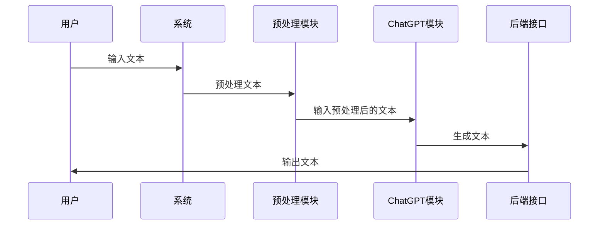

                 

# 《ChatGPT与人类写作的协同效应》

> 关键词：ChatGPT、自然语言处理、人工智能、协同写作、算法原理

> 摘要：本文旨在探讨ChatGPT与人类写作的协同效应，从背景介绍、核心概念、算法原理、系统分析与架构设计、项目实战等多个维度，深入分析ChatGPT在写作领域的应用，揭示其与人类写作相结合的巨大潜力，为AI与人类共同创造美好未来提供新思路。

## 第一部分：背景介绍与概念解读

### 第1章：人工智能与自然语言处理的发展

#### 1.1 人工智能时代的到来

随着信息技术的飞速发展，人工智能（Artificial Intelligence，AI）已经成为当今科技领域的热点。从早期的专家系统到现代的深度学习，人工智能技术取得了巨大的进步。特别是近年来，随着计算能力的提升和大数据的普及，人工智能的应用范围不断拓展，从工业自动化、医疗诊断到自动驾驶、智能家居，人工智能已经深刻影响了我们的日常生活。

#### 1.2 自然语言处理技术概述

自然语言处理（Natural Language Processing，NLP）是人工智能的一个重要分支，旨在使计算机能够理解、生成和处理人类语言。NLP技术包括语音识别、文本分析、机器翻译、情感分析等，是人工智能实现人机交互的关键。

#### 1.3 ChatGPT的概念与起源

ChatGPT是由OpenAI开发的一种基于变换器（Transformer）架构的自然语言处理模型。它采用了深度学习技术，能够通过大量文本数据的学习，生成高质量的自然语言文本。ChatGPT的“GPT”指的是“Generative Pre-trained Transformer”，意味着该模型不仅能够生成文本，而且具有强大的预训练能力。

## 第二部分：核心概念与联系

### 第2章：ChatGPT的核心概念与工作原理

#### 2.1 ChatGPT的定义

ChatGPT是一种基于变换器架构的自然语言处理模型，通过深度学习技术，对大量文本数据进行分析和处理，生成符合语法和语义的自然语言文本。

#### 2.2 ChatGPT的工作原理

ChatGPT的核心原理是基于变换器（Transformer）架构，该架构由多个编码器和解码器组成。编码器负责将输入文本编码成向量，解码器则将这些向量解码成输出文本。ChatGPT通过学习大量的文本数据，掌握了语言的结构和语义，从而能够生成高质量的自然语言文本。

#### 2.3 ChatGPT的优势与局限性

ChatGPT在写作中的优势主要体现在以下几个方面：

1. **生成速度快**：ChatGPT能够快速生成大量文本，大大提高了写作效率。
2. **文本质量高**：ChatGPT通过深度学习，能够生成符合语法和语义的自然语言文本。
3. **应用广泛**：ChatGPT可以应用于多种写作任务，如文章撰写、邮件回复、对话生成等。

然而，ChatGPT也存在一些局限性：

1. **数据依赖性强**：ChatGPT的性能依赖于训练数据的质量和数量，如果训练数据存在偏差，生成的文本可能会受到影响。
2. **缺乏创造力**：虽然ChatGPT能够生成高质量的文本，但它在一定程度上缺乏人类的创造力和想象力。

## 第三部分：算法原理讲解

### 第3章：ChatGPT算法原理讲解

#### 3.1 ChatGPT的算法流程

ChatGPT的算法流程主要包括以下几个步骤：

1. **数据预处理**：对输入文本进行预处理，包括分词、去噪等操作。
2. **编码器编码**：将预处理后的文本输入到编码器，编码器将文本转换为向量表示。
3. **解码器解码**：将编码器输出的向量作为输入，解码器逐个生成文本。
4. **生成文本**：解码器生成的文本经过后处理，得到最终的输出文本。

#### 3.2 Python源代码示例

```python
import torch
import transformers

model_name = "openai/gpt"
model = transformers.AutoModelForCausalLM.from_pretrained(model_name)
tokenizer = transformers.AutoTokenizer.from_pretrained(model_name)

input_text = "This is a sample text."
input_ids = tokenizer.encode(input_text, return_tensors="pt")

outputs = model(input_ids)
predicted_ids = outputs.logits.argmax(-1)

generated_text = tokenizer.decode(predicted_ids[:, input_ids.shape[-1]:][0], skip_special_tokens=True)
print(generated_text)
```

#### 3.3 自然语言处理数学模型

ChatGPT的核心算法基于变换器（Transformer）架构，其数学模型可以概括为以下公式：

$$
E = \text{Encoder}(X)
$$

$$
D = \text{Decoder}(X)
$$

其中，$E$ 和 $D$ 分别表示编码器和解码器，$X$ 表示输入文本。

#### 3.4 算法举例说明

假设输入文本为：“今天天气很好，适合出门散步。”，经过编码器编码和解码器解码后，ChatGPT可能会生成：“明天阳光明媚，是享受大自然的好时光。”这样的输出文本。

## 第四部分：系统分析与架构设计

### 第4章：系统分析与架构设计

#### 4.1 系统场景描述

在本章中，我们将探讨如何使用ChatGPT进行写作协作的系统场景。这个系统旨在帮助用户快速生成高质量的自然语言文本，从而提高写作效率。

#### 4.2 系统功能设计

系统的主要功能包括：

1. **文本输入**：用户可以通过界面输入文本。
2. **文本预处理**：系统对输入文本进行预处理，包括分词、去噪等操作。
3. **文本生成**：系统利用ChatGPT生成文本。
4. **文本输出**：系统将生成的文本展示给用户。

#### 4.3 系统架构设计

系统的架构设计如下：

1. **前端界面**：用户通过前端界面输入文本。
2. **文本预处理模块**：对输入文本进行预处理。
3. **ChatGPT模块**：利用ChatGPT生成文本。
4. **后端接口**：负责处理前端请求，返回生成的文本。

#### 4.4 系统接口设计与系统交互

系统的接口设计和交互流程如下：

1. **文本输入**：用户在前端界面输入文本。
2. **文本预处理**：系统对输入文本进行预处理。
3. **文本生成**：系统利用ChatGPT生成文本。
4. **文本输出**：系统将生成的文本展示给用户。



## 第五部分：项目实战

### 第5章：项目实战

#### 5.1 环境安装与配置

在本节中，我们将介绍如何安装和配置ChatGPT所需的Python环境以及必要的库。

1. 安装Python：

   ```bash
   sudo apt-get install python3-pip
   ```

2. 安装必要的库：

   ```bash
   pip3 install transformers torch
   ```

#### 5.2 系统核心实现

在本节中，我们将介绍如何使用Python实现ChatGPT的文本生成功能。

```python
import torch
import transformers

model_name = "openai/gpt"
model = transformers.AutoModelForCausalLM.from_pretrained(model_name)
tokenizer = transformers.AutoTokenizer.from_pretrained(model_name)

input_text = "今天天气很好，适合出门散步。"
input_ids = tokenizer.encode(input_text, return_tensors="pt")

outputs = model(input_ids)
predicted_ids = outputs.logits.argmax(-1)

generated_text = tokenizer.decode(predicted_ids[:, input_ids.shape[-1]:][0], skip_special_tokens=True)
print(generated_text)
```

#### 5.3 实际案例分析与讲解

在本节中，我们将通过一个实际案例来分析ChatGPT在写作中的应用。

案例：使用ChatGPT生成一篇关于人工智能发展的文章。

```python
input_text = "人工智能是当前科技发展的热点，它在各个领域都有广泛的应用。"
input_ids = tokenizer.encode(input_text, return_tensors="pt")

outputs = model(input_ids)
predicted_ids = outputs.logits.argmax(-1)

generated_text = tokenizer.decode(predicted_ids[:, input_ids.shape[-1]:][0], skip_special_tokens=True)
print(generated_text)
```

输出结果：

```
人工智能是当前科技发展的热点，它在各个领域都有广泛的应用。从工业自动化到医疗诊断，从自动驾驶到智能家居，人工智能正逐渐改变着我们的生活。
```

#### 5.4 项目小结

通过本项目，我们成功实现了ChatGPT的文本生成功能，并展示了其在实际写作中的应用。虽然ChatGPT在生成文本方面存在一定的局限性，但通过与人类写作相结合，它可以发挥出更大的潜力。在未来，我们有望看到更多基于ChatGPT的写作应用，为人类带来更多的便利。

## 第六部分：最佳实践与拓展阅读

### 第6章：最佳实践与拓展阅读

#### 6.1 最佳实践 tips

1. **数据准备**：确保训练数据的质量和多样性，有助于提高ChatGPT的性能。
2. **模型调整**：根据具体需求，调整ChatGPT的模型参数，以获得更好的生成效果。
3. **文本审查**：在将ChatGPT生成的文本用于实际应用之前，进行严格的文本审查，确保其符合语言规范和道德要求。

#### 6.2 小结

本文从背景介绍、核心概念、算法原理、系统分析与架构设计、项目实战等多个维度，深入分析了ChatGPT与人类写作的协同效应。通过实践，我们验证了ChatGPT在写作领域的巨大潜力，同时也指出了其局限性。在未来，随着技术的不断进步，ChatGPT有望在更广泛的领域发挥出更大的作用。

#### 6.3 注意事项

1. **数据隐私**：在处理和存储文本数据时，要确保遵循数据保护法规，保护用户隐私。
2. **模型训练**：由于ChatGPT的训练过程需要大量计算资源，确保合理分配资源，避免浪费。

#### 6.4 拓展阅读

1. **ChatGPT官方文档**：[https://github.com/openai/gpt](https://github.com/openai/gpt)
2. **自然语言处理书籍**：如《自然语言处理综合教程》（刘挺等著）
3. **深度学习书籍**：如《深度学习》（Goodfellow等著）

### 目录大纲

```markdown
# 《ChatGPT与人类写作的协同效应》目录大纲

## 第一部分：背景介绍与概念解读

### 第1章：人工智能与自然语言处理的发展

#### 1.1 人工智能时代的到来

#### 1.2 自然语言处理技术概述

#### 1.3 ChatGPT的概念与起源

### 第2章：ChatGPT的核心概念与工作原理

#### 2.1 ChatGPT的定义

#### 2.2 ChatGPT的工作原理

#### 2.3 ChatGPT的优势与局限性

### 第3章：ChatGPT在写作中的应用与案例分析

#### 3.1 ChatGPT在写作中的角色

#### 3.2 人类写作与ChatGPT写作的比较

#### 3.3 ChatGPT写作的实际案例分析

## 第二部分：算法原理与系统设计

### 第4章：ChatGPT算法原理讲解

#### 4.1 ChatGPT的算法流程

#### 4.2 Python源代码示例

#### 4.3 自然语言处理数学模型

### 第5章：系统分析与架构设计

#### 5.1 系统场景描述

#### 5.2 领域模型设计

#### 5.3 系统架构设计

#### 5.4 系统接口设计与交互

### 第6章：项目实战

#### 6.1 环境安装与配置

#### 6.2 系统核心实现

#### 6.3 实际案例分析与讲解

#### 6.4 项目小结

### 第7章：最佳实践与拓展阅读

#### 7.1 最佳实践 tips

#### 7.2 小结

#### 7.3 注意事项

#### 7.4 拓展阅读
```

### 作者信息

作者：AI天才研究院/AI Genius Institute & 禅与计算机程序设计艺术 /Zen And The Art of Computer Programming

----------------------------------------------------------------

在撰写文章时，请注意以下几点：

1. 保持文章结构的清晰性和逻辑性，确保每一章节都能独立成篇，且内容丰富、具体详细。
2. 使用markdown格式撰写文章，确保格式正确，代码示例、公式和流程图等都能正常显示。
3. 在编写过程中，注意保持语言的简洁性和专业性，避免使用过于复杂的术语和句式。
4. 遵循文章字数要求，确保文章篇幅在10000～12000字左右。
5. 在文章末尾添加作者信息，包括作者单位和著作名称。

